#  西门子1200介绍

##  SIMATIC S7-1200
SIMATIC S7-1200具有集成PROFINET接口、强大的集成工艺功能效的解决方案，尤其满足多种应用中完全不同的自动化需求。和灵活的可扩展性等特点，为各种工艺任务提供了简单的通信

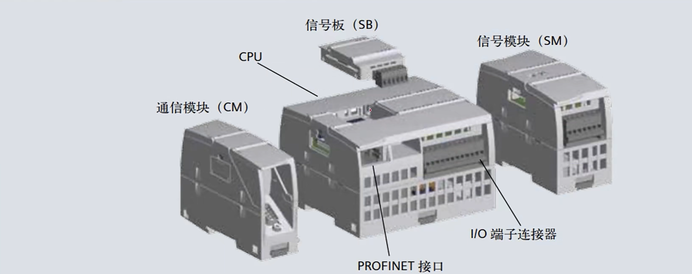 

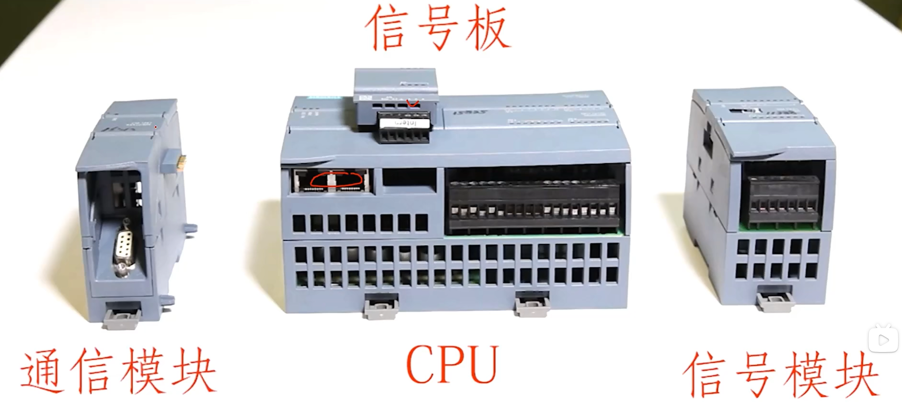 

1200基础款式一个5款。分别是1211、1212、1214、1215、1217

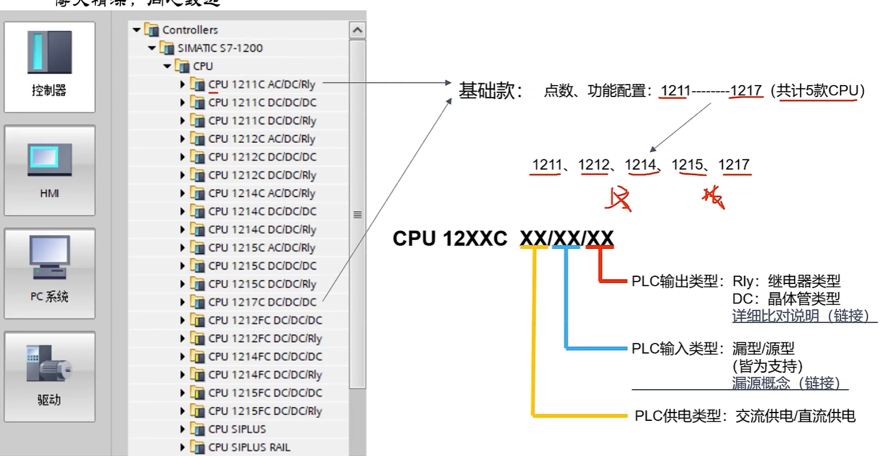 

##  12xxC系列

plc后面码的含义： CPU 12XXC AA/BB/CC

- AA：表示plc的供电类型有交流直流两种
- BB：表示plc的输入类型。dc指直流。同时支持源型与漏型两种
- CC：表示plc的输出类型。RLY为继电器输出，dc为晶体管输出。

####  电源输入

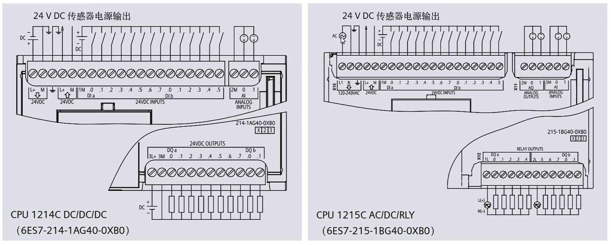

####  输出类型讲解

源型：

也称为推挽输出：在源型回路中，信号源通过控制源极（或发射极）与地之间的连接状态来输出信号。当信号源处于导通状态时，源极与地之间的连接处于高电平（通常是供电电压）状态；当信号源处于截止状态时，源极与地之间的连接处于低电平(0V)状态。源型回路的输出能力较强，不需要外部上拉电阻。

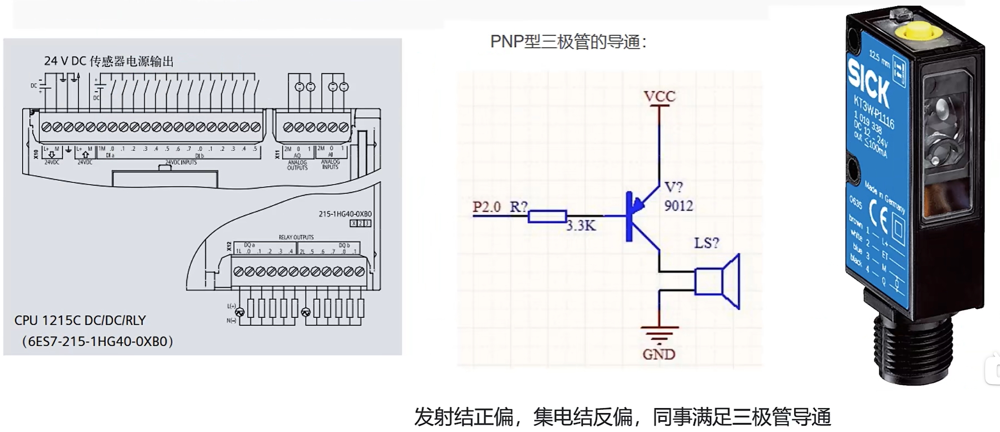 

漏型

也称为开漏输出：在漏型回路中，信号源（通常是晶体管或开关）通过控制漏极（或集电极）与地之间的连接状态来输出信号。当信号源处于导通状态时，漏极与地之间的连接处于低电平(0)状态；当信号源处于截止状态时，漏极与地之间的连接处于高电平（通常是供电电压）状态。漏型回路的输出能力较弱，需要外部上拉电阻将输出信号拉高。

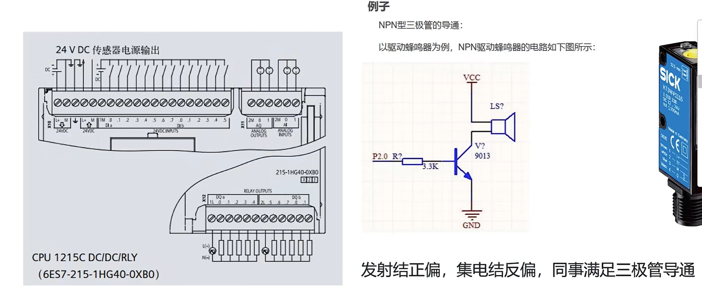 

####  plc输出类型

继电器输出的PLC（可编程逻辑控制器)和晶体管之间有几个主要区别：

- 原理：继电器输出的PLC使用电磁继电器来开关电路，通过继电器的机械动作来实现开关
  的控制。而晶体管则是一种半导体器件，它通过电流的变化来控制 电路的开关。
- 可靠性：由于继电器是机械式的开关装置，相对来说更加耐久且稳定。晶体管则是电子器件，
  虽然寿命较长，但相对来说比继电器更容易受到电压变化、过载和温度等因素的影响。
- 速度：晶体管开关速度非常快，通常以纳秒级别计算，而继电器开关则需要一定的响应时间，
  通常以毫秒级别计算。
- 功率：继电器输出的PLC通常能够承受更高的电流和电压负载，适用于大功率设备的控制。
  晶体管输出的PLC则通常适用于低功率设备的控制。
- 继电器：交直混合
- 晶体管：仅直流

##  12XXFC系列

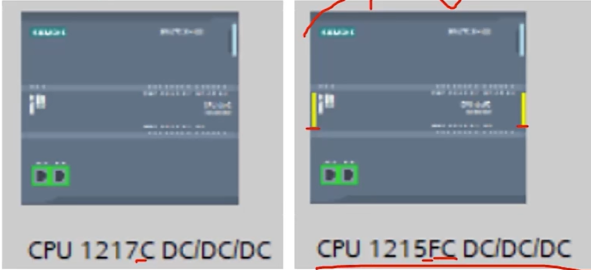 

故障安全型：
**安全型CPU应用场景**：危，险程度高、可靠性安全性要求特别高，若出现故障或失去控制，会造成巨大的经济损失或人员伤亡的领域。远程遥控、无人值守的系统以及维护费用十分昂责的系统也需要安会PLC系统进行监控和管理大到分布式工业控制系统。危险化工产品生产控制、钢铁治金过
程控制、电梯，重型起重设备，大中型石油化工生产、油气存储、输油管
监控、然烧锅炉管理控制、海上钻井平台安全保障系统等

- **1、硬件模板的设计工艺不同**：例如在输入模板和输出模板都是双通道的设计可以对采集的信号进行比较和校验；另外在模板上也增加了更多诊断功能，能够对电路中的短路故障和开路故障进行诊断，另外，安全型的CPU通过定的效验机制，可以保证信号在PLC内的传输和处理都是准确的，而普通的CPU则不能处理安全的信号

- **2、经过国际安全认证**：硬件模块与软件标准的功能块均通过安全认证，可以
  在安全系统中使用

- **3、专用协议**：搭建于Profinet和Profibus两种协议之上的协议Profisafe是安全型CPU的通讯协议，确保数据安全性。

- **4、兼容性**：故障安全系统中，可以将安全模板与标准模板进行混用，也可以使用标准的Profine和Profibust协议进行数据传输
  SIPLUS S7-1200的以下CPU可在-40℃到+55°℃或-40℃到+70°℃的环境温度范围
  内使用，并提供有适用于极端介质环境的型号（敷形涂层）。
  SIPLUS CPU1211C:智能、紧凑型解决方案。
  SIPLUS CPU1212C:卓越的紧凑型解决方案。
  SIPLUS CPU1214C:高性能的紧凑型CPU。
  SIPLUS CPU1215C:高端、高性能紧凑型CPU。

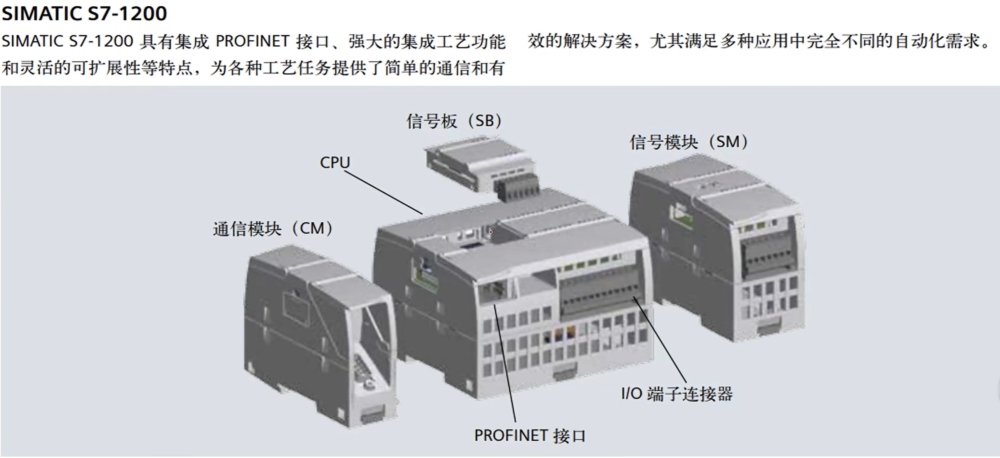

#  连接plc后的一些配置

开启存储器

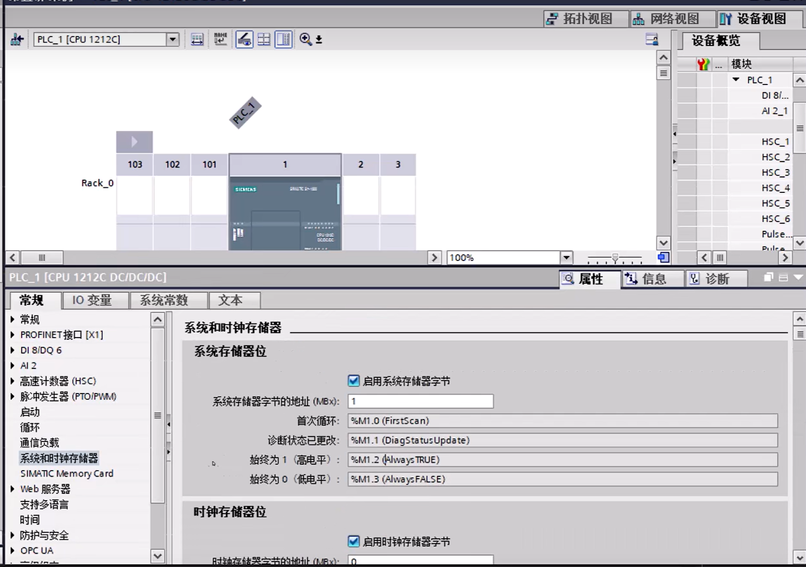 

配置访问级别

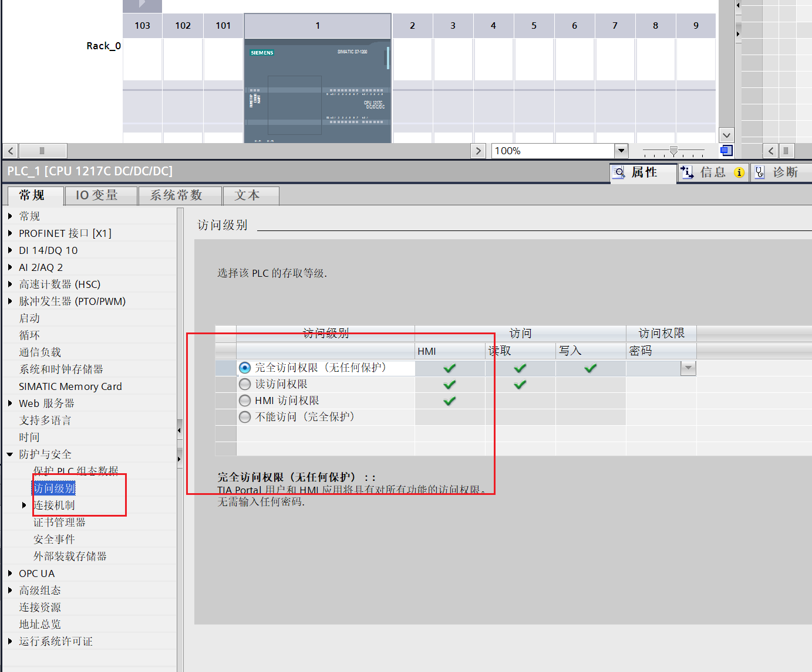

允许远程put、get访问

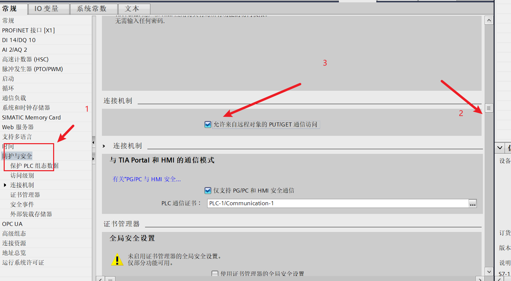

