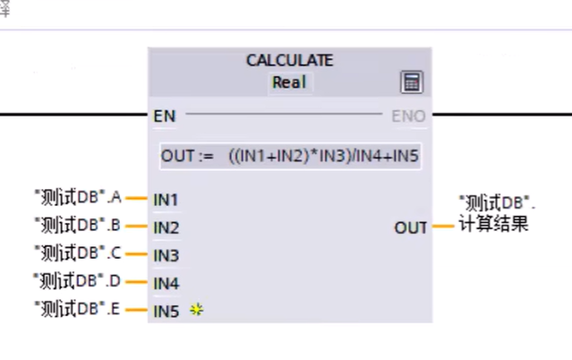

#  定时器

##  TP  生成脉冲

 使用TP指令，可以将输出 Q 置位为预设的一段时间，**当定时器的使能端的状态从OFF变为ON时，可启动该定时器指令，定时器开始计时。 无论后续使能端的状态如何变化，都将输出 Q 置位由 PT 指定的一段时间。** **若定时器正在计时，即使检测到使能端的的信号在此从OFF变为ON的状态，输出Q的信号状态也不会受到影响。**

 

pt：设置延时时间

et：当前延时到多少

##  TON 接通延时

**当定时器的使能端IN为1时启动该指令。 定时器指令启动后开始计时。在定时器的当前值ET与设定值PT相等于时，输出端Q输出为ON。 只要使能端IN的状态仍为ON，输出端Q就保持输出为ON。 若使能端IN的信号状态变为OFF，则将复位输出端Q为OFF。 在使能端再次变为ON时，该定时器功能将再次启动。**

##  TOF 关断延时

 **当定时器的使能端为ON时，将输出端Q置位为ON。 当使能端的状态变回OFF时，定时器开始计时。 只要ET的值小于PT的值时，则输出端Q就保持置位。当ET的值等于PT的时，则将复位输出端Q。** 如果输使能端的信号状态在ET的值小于PT值时变为ON，则复位定时器。 输出 Q 的信号状态仍将为ON。

 

##  TONR时间累加器

保持性接通延时定时器的标识符为TONR，保持性接通延时定时器的功能与接通延时定时器的功能基本一致，区别在于**保持型接通延时定时器，在定时器的输入端的状态变为OFF时，定时器的当前值不清零，有掉电保持功能，当达到预设的时间后输出信号。即使输入信号后来变为0，定时器的输出信号仍然保持为1，直到复位信号使定时器复位。而接通延时定时器，在定时器的输入端的状态变为OFF时，定时器的当前值会自动清零，**如下图所示，描述的是保持性接通延时定时器的指令格式及指令执行时的时序图。

#  比较指令

 

### 常见的比较指令

在西门子PLC中，比较指令包括但不限于以下几种：

- `==`（等于）：当两个值相等时，比较指令为真。
- `!=`（不等于）：当两个值不相等时，比较指令为真。
- `>`（大于）：当第一个值大于第二个值时，比较指令为真。
- `<`（小于）：当第一个值小于第二个值时，比较指令为真。
- `>=`（大于等于）：当第一个值大于或等于第二个值时，比较指令为真。
- `<=`（小于等于）：当第一个值小于或等于第二个值时，比较指令为真。

### 使用注意事项

在使用比较指令时，需要注意以下几点：

- 数据类型必须一致：比较的两个值应该是相同的数据类型，否则可能导致程序错误。
- 考虑越界情况：特别是在比较数组或字符串时，需要确保比较操作不会超出数据的边界。
- 浮点数精度问题：在进行浮点数比较时，需要注意浮点数的精度，以确保比较结果的准确性。

#  数据类型

常用七种

- bool  1位
- int   16位
- real  16位
- word  16位
- char
- Dint  32位
- Dword 32位

##  bool  布尔类型

true，false。就是1和0

##  int 整形

1,2,3等整数类型

##  real  实数类型

就是浮点数类型

##  word （16位）代表一直含义

与之相似的有byte（8位），和bite（一个位）

在西门子PLC编程中，Word数据类型是一种用于存储16位二进制数值的数据类型，通常采用无符号表示方法，取值范围为0到65535。Word数据类型常用于存储模拟量信号、脉冲计数器和定时器的数值，以及进行位操作。

Word数据类型的特点
Word数据类型由相邻的两个字节（Byte）组成，形成一个16位的无符号数。这种数据类型在PLC编程中主要用于逻辑运算，因为它的取值范围是0到65535，这使得它在处理较大的数值时非常有用。

Word数据类型的应用
Word数据类型在西门子PLC中的应用非常广泛，它可以用于多种场景，例如：

- **模拟量信号处理**：Word数据类型可以存储传感器输出的模拟量信号值，通过相应的转换函数将其转换为工程单位，并进行进一步的控制和调节。

- **脉冲计数器**：PLC中的脉冲计数器通常使用Word数据类型来存储计数数值，可以实现对脉冲信号的计数和监控，在自动化系统中广泛应用于计量、计数、计时等场景。

- **定时器**：PLC中的定时器也常常使用Word数据类型来存储时间数值，通过对时间的计算和控制，实现各种定时任务的自动化执行。

注意事项
在使用Word数据类型时，需要注意以下几点：

- **数据范围**：由于Word数据类型的取值范围为0到65535，因此在实际应用过程中需要注意数值是否超出范围，以避免数据溢出或计算错误。

- **数据精度**：Word数据类型是一种离散的数值表示方式，其精度受限于存储位数。在涉及到高精度计算和控制的场景中，可能需要采用其他数据类型或算法来实现更准确的计算。

通过合理使用Word数据类型，可以实现对模拟量信号、脉冲计数器和定时器等各种数据的处理与控制，进而提升自动化系统的可靠性和稳定性。 

##  char 字符型

存储字符串的

##  单位

Dword  -》 word-》byte -》bite

32  -> 16 -> 8 ->１

2147483648 

IW2 == IB2 + Ib3

IB2 == I2.0-I2.7

#  数学计算

 

- CALCULATE 计算
- ADD 加
- SUB 减
- MUL 乘
- DIV 除法
- MOD  返回除法的余数
- NEG  求二进制补码
- INC 递增
- DEC 递减
- ABS 计算绝对值
- MIN 获取最小值
- MAX 获取最大值
- LIMIT 设置限值
- SQR  计算平方
- SQRT 计算平方根
- LN  计算自然对
- EXP  计算指数值
- SIN 计算正弦值
- COS 计算余弦值
- TAN 计算正切值
- ASIN 计算反正弦值
- ACOS 计算反余弦值
- ATAN 计算反正切值
- FRAC 返回小数
- EXPT 取幂

 

add与mul可以输入多个值。

##  calcullate 计算

 

#  move传送指令

将数据传送到指定寄存器

#  fc函数块

 

 

#  DB块

优化的db块。主要用于单机的系统。

非优化的DB块：主要用于通信，因为通信需要准确的地址，而非优化的db会显示变量的地址。

如何开启与关闭dB块的优化：

 

 

#  MODBUS-rtu通信

##  添加RS485接口

 

 

###  物理接线

 

连接时要注意端口的对应。

##  RS465端口组态参数介绍

###  波特率

即数据的传送速度，波特率越大，数据传输越快。但是当波特率较大时可能会出现数据异常错误。

###  校验位

校验数据是否出错，一般可以选择不校验

##  博图的startUp块

 

是plc由stop切换为run时执行一次startUp块，之后才会执行循环扫描主程序。即startUP块只会在plc启动时执行一次。可以用来做一下数据的初始化设置。

modbus通信两个主要块

##  modbus-rtu组态ob

 

这个快需要放在startup块里

 

- REQ:上电第一个循环接通

- PORT:硬件地址

  

- BAUD:波特率

- PARITY:校验是否启用

- RESP_TO:通讯超时

- MD_DB:轮询块的背景数据

-  

- 在

 

如上一个485通信的组态模块创建完成

##  modbus-rtu 485通信模块

REQ:上电第一个接通

MB_ADDR：485地址（目标地址）站号-

MODE：1读0写

DATA_ADDR：modbus中间地址

DATA_LEN：数据长度

DATA_PTR：发送区间

站号查询

 

通过读取modbus通信数据来查询

### 计算DATA_ADDR的方法

将modbus中间地址换算成10进制再加一，最后在前面补个4

如modbus中的地址为0x6002转换成十进制是24578，加一24579.再补个4就是424579.这就是最终地址

###  字符长度

 

16位就是一个字所以长度为1

###  p#寻址--指针类型

 

P#DB5.DBX36.0 WORD 1

p# 说明是p#类型寻址

db5，数据库地址

dbx36.0 数据在数据库中的偏移量

word 数据类型

1 取一个world的长度

#  s7通信

建立连接

 

#  伺服

伺服的优点：贵
最大的优点：定位准，几丝的误差

- 1.噪音小，振动小（丝滑）
- 2.无论速度高或者低，**恒转矩**
- 输出扭矩大，比步进电机带负载能力强
- 步进电机没有过载能力，伺服电机有过载能力

伺服的三种功能：

- 位置控制
- 速度控制
- 力矩开展

##  编码器

- 增量式：不能掉电保持

- 绝对值：掉电保持

#  数据标准化

有两个模块

​	

#  模块封装

将两个模块进行封装 
