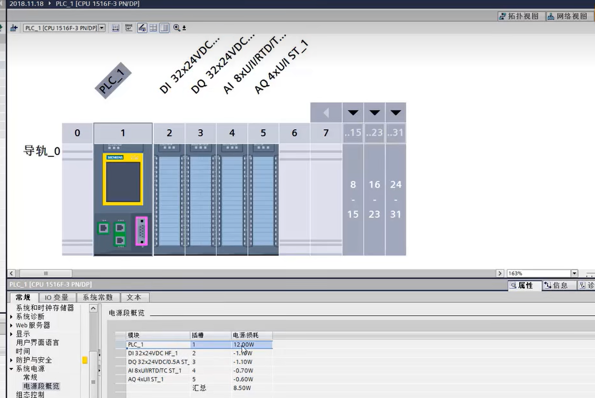
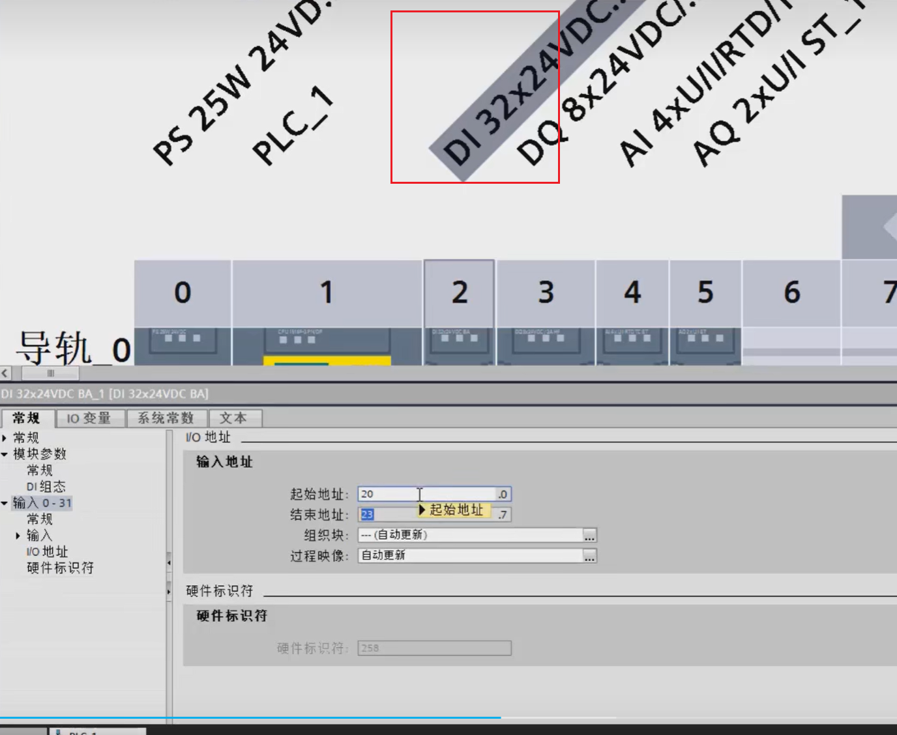
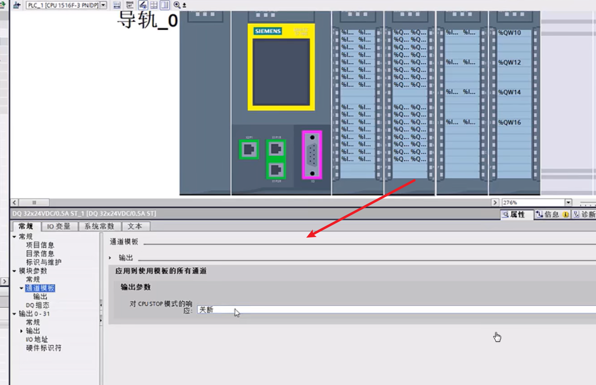
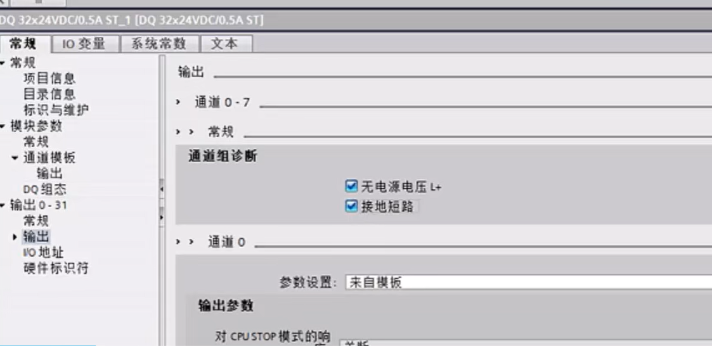
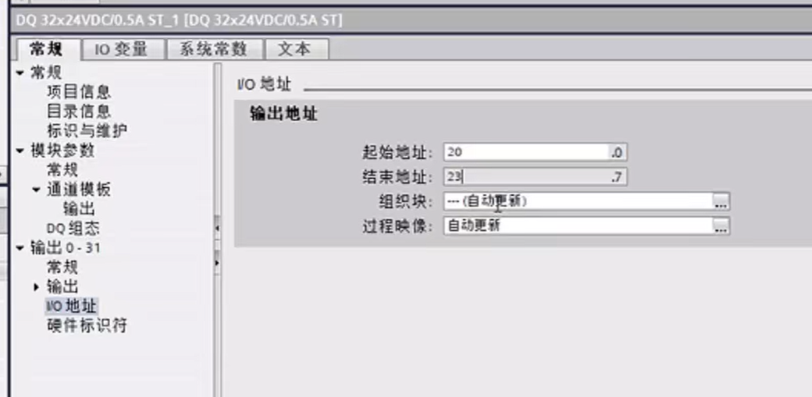
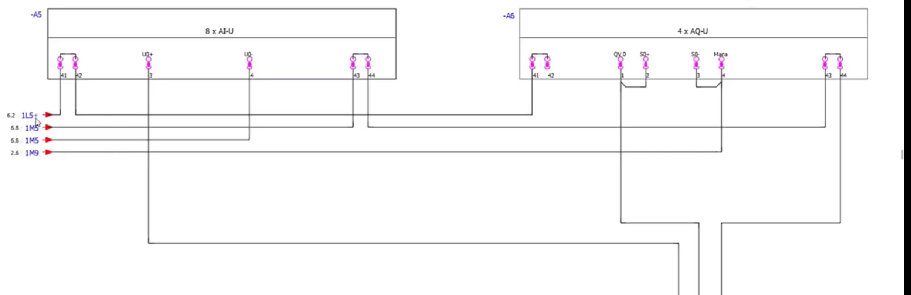
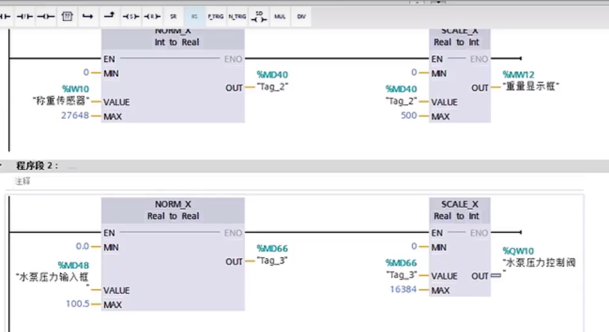

#  1.西门子plc中的一些概念

##  ps和pm的概念

ps系统电源--有背板总线

pm负载电源-无背板总线

###  ps系统电源

ps的给plc与plc的各个模块供电的

虽然西门子plc自带了一个12w的供电

但是如plc模块过多时，负责功率超过12w时，就无法供电了。所以此时引入了PS系统电源

西门子的工艺规定，电源模块一定在导轨的0号位置。

###  PM负载供电

PM为控制电路供电

##  内部存储卡

1200自身带存储功能。而1500必须携带一张西门子的sd存储卡。老款的存储卡不能插在win系统上会报废。新版的可以，出问题可以使用博图或者1500进行恢复。

##  DI、AI、DQ、AQ

- DI：数字量输入
- DQ：数字量输出
- AI：模拟量输入
- AQ：模拟量输出

###  DI

####  DI模块工作原理图

同电：正极与负极接在同一个电源上就是同电。

### DQ

关断：直接断电

保持上一个值。

输出替换为1.将信号替换为1；

最常用关断，为了保护设备。

保持在一些精密仪器中较常用。

诊断

 

 

####  DQ原理图

 

###  模拟量接线

###  AI、AQ数据标准化

 

