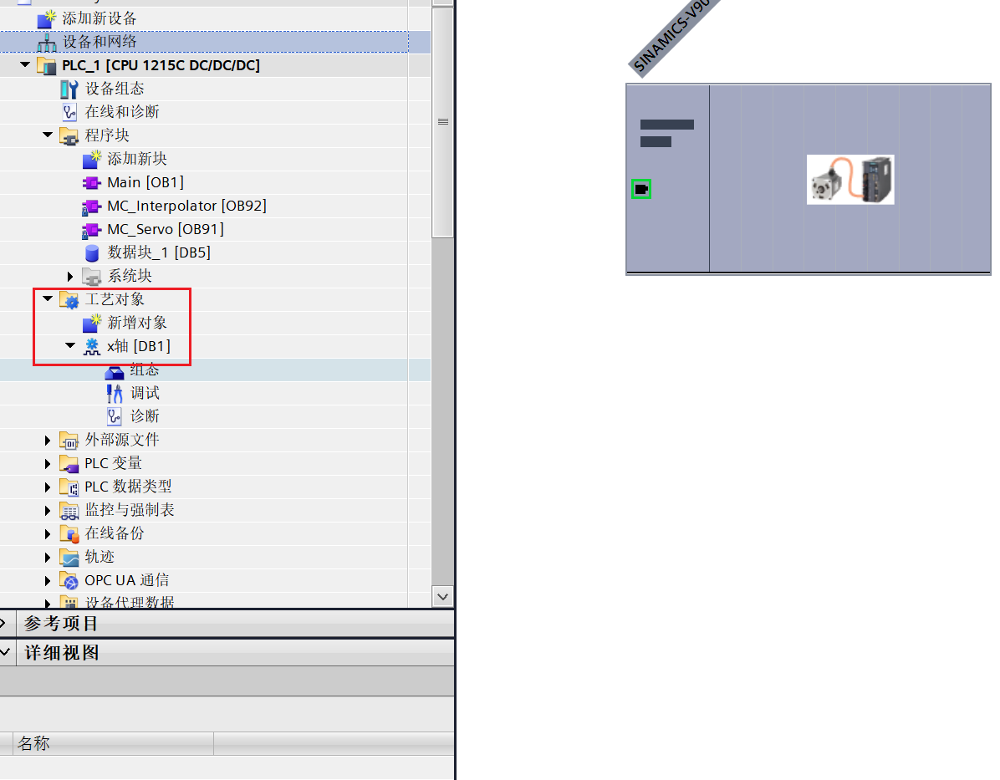
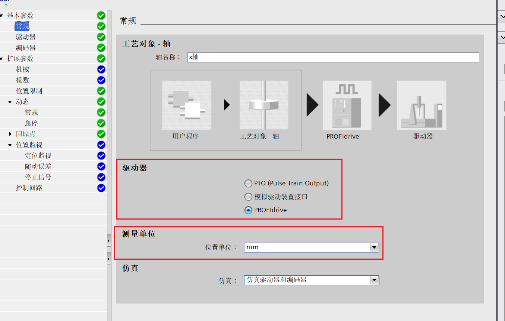
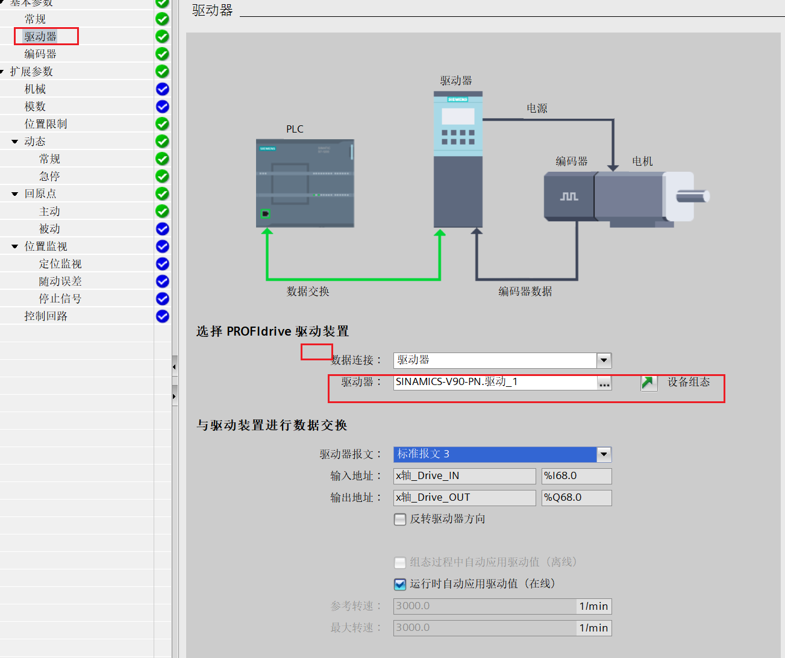
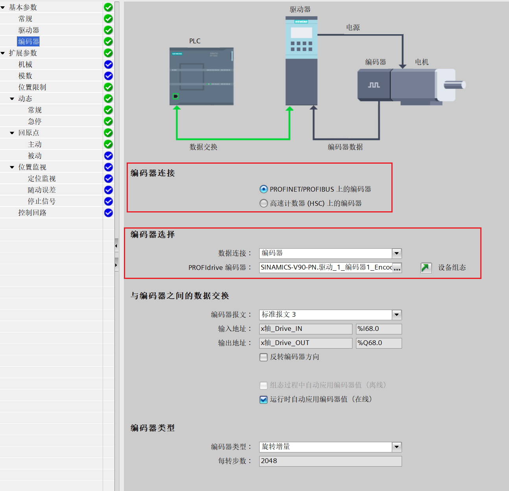
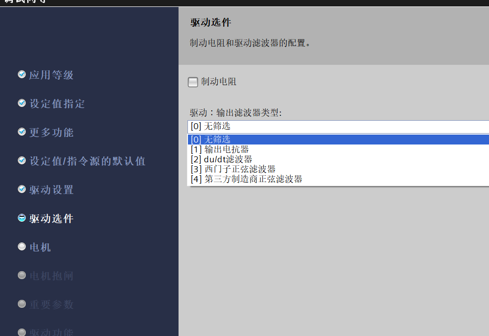

# 1.V90控制

##  硬件设置

##  TIA里组态

在软件组态完成需要添加伺服驱动的标准报文。一般自定义功能块时使用使用**报文3**，使用西门子提供的功能块时使用**报文111**

### 自定义功能块与使用西门子默认功能块区别

1.自己写FB功能块

使用报文3

使用在复杂的项目

速度环、位置环、电流环（力矩模式）

组态工艺对象（1200-8工艺轴）

2.使用西门子的标准FB功能块

使用报文111

适用于功能简单的项目

速度环、位置环、电流环（力矩模式）

组态工艺对象（1200-16工艺轴）

## 参数设定

先添加伺服的轴对象

### 常规设置

设定好轴的驱动器与测量单位

其中驱动器的

- PTO：该模式是通过将PLC的高速输出连接到伺服，使用发送脉冲的方式驱动电机
- PROFIdrive：plc通过profileNet连接到伺服，通过网络来发送命令驱动电机

#### pto模式需要设置的参数

驱动器设置

#### PROFIdrive参数

### 驱动器参数设定

主要需要设置好驱动器

此处是我们开始设置的伺服的报文。下面的数据交换在设置完驱动器后，会自动配置。

### 编码器

编码器需要设定好编码器的连接（确定编码器的位置），与编码器的参数

编码器的参数和驱动器一样是之前设置的标准报文3

### 位置限制

硬限位设置好左右限位开关在plc上的输入地址。

软限位需要手动测量轴在左右限位开关间的距离后再设定。

### 动态

这个主要调整单位保持一致。其他参数若无特殊要求，保持默认设置不变。

### 回原点

原点设置，需要设置好归位模式，一般使用第三种，归为开关模式。

inupt，设置好原点的限位开关。

接近速度。

回原点会多次巡航，为的是使原点位置更加精确。减小误差。

# 2.常用的指令

这些命令都是以设置好的工艺轴为基础。

## mc_power使能 

启用/禁用轴的指令。运控里最重要的指令，只有这个命令给轴使能之后才能进行后续的操作。

## MC_Reset复位

发生故障时复位。

## MC_Home回原点

## MC_MoveAbsolute 绝对定位

需要设置好目标位置、和移动速度。

## MC_ReadParam 读取轴参数

注意：需要先设置好读取参数的类型。

## MC_MoveJog Jog点动移动

设置好正反转的命令及运动的速度。

# 3变频器

## 组态

### 添加变频器及驱动

## 参数设置

### 应用等级

是控制不同等级的变频器应用场景

### 设定值指定

决定斜坡功能是在plc还是变频器中指定。
### 更多功能

指定变频器的定位（指指示基本控制还是带工艺的控制）

### 指令源

指定G20的IO配置（默认配置，通过此次的指定就可以省略在变频器手动指定的步骤）

#### 报文配置

porfinet通信选择标准报文1时

QW256：状态寄存器（启动，停止，复位）

​	正转命令：16#047F

​	反转命令：16#0C7F

​	复位命令：16#04FE

​	停止命令：16#047E

QW258：速度通道值（0-16384）

### 驱动的设置

配置驱动的电源频率和电压

### 驱动选件

驱动器的其他配件，没有可以不写

### 电机

配置电机的各个参数。

### 电机抱闸

看电机是否带抱闸装置

### 重要参数

### 驱动功能

## 重要

**变频器使用命令时要先复位才能启动**

