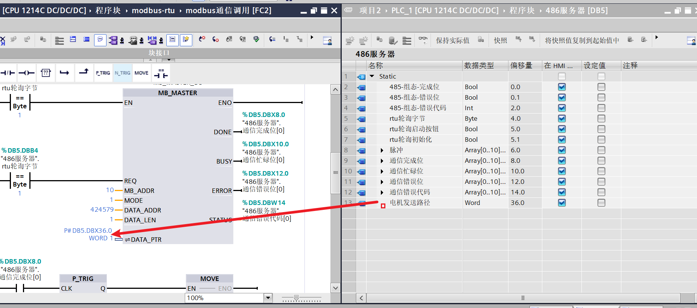
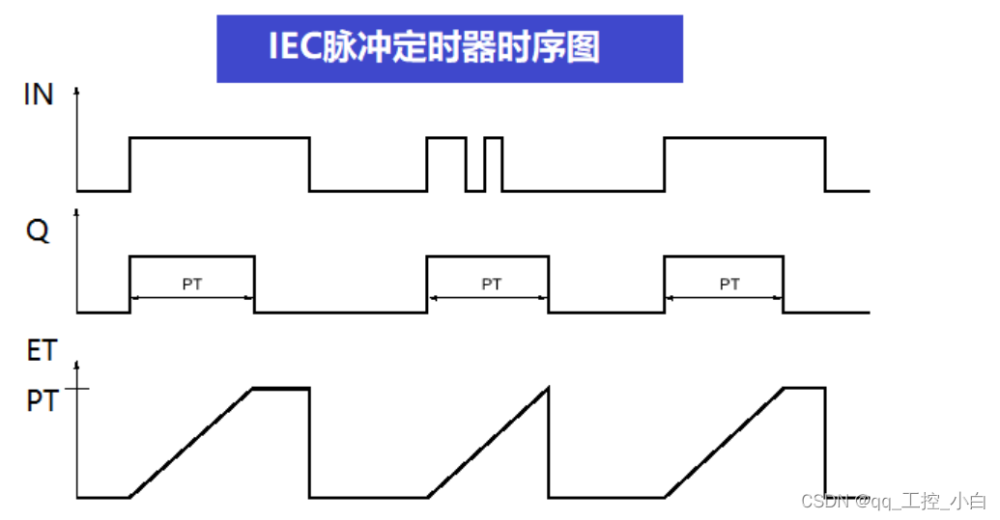
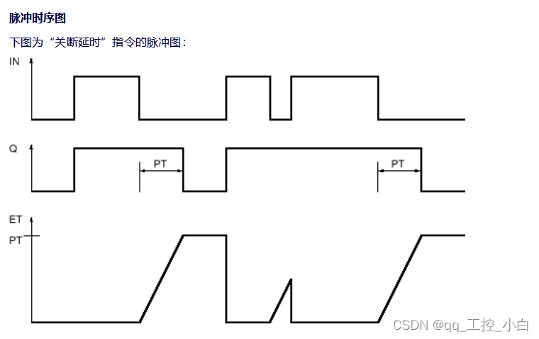
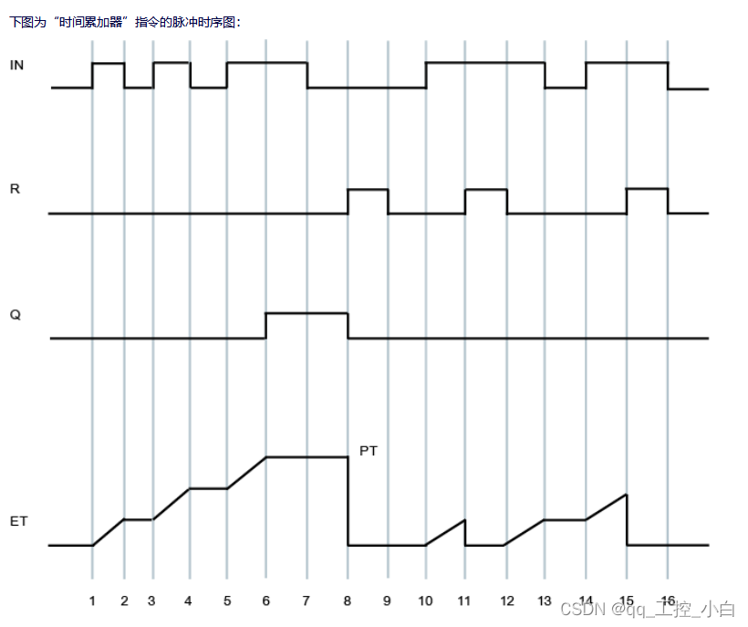
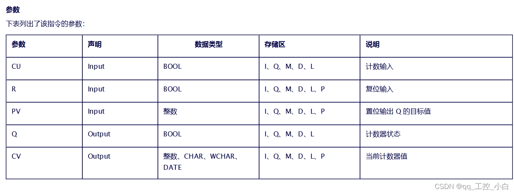
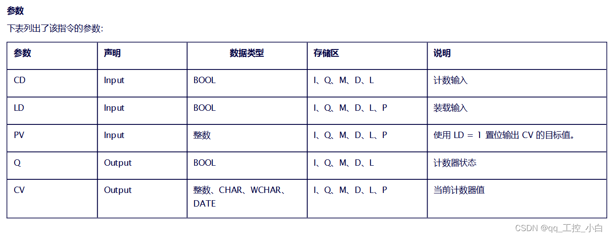
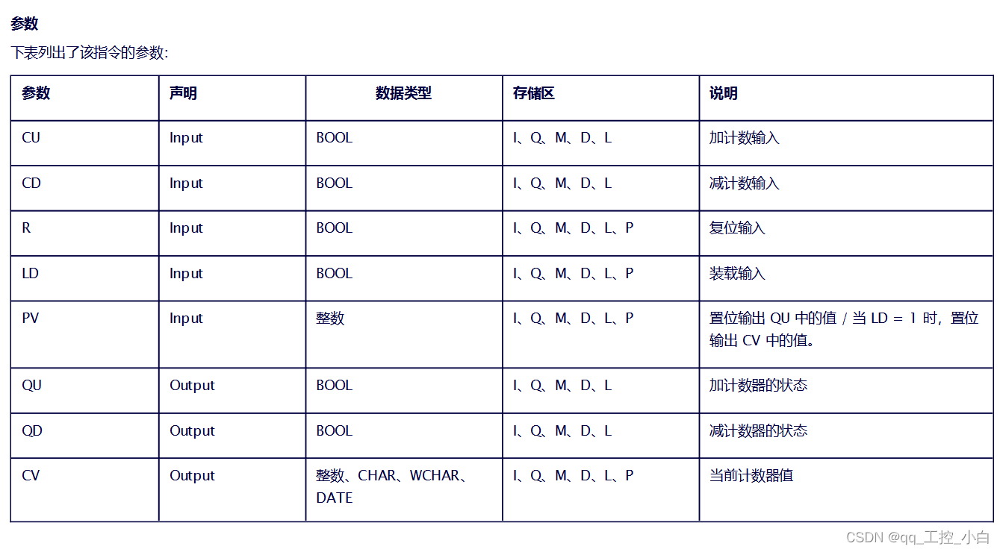

# 基础介绍

SCL是西门子公司推出的一种PLC编程语言，其英文全称为“StructuredControl Language”，中文翻译为“结构化控制语言”。

西门子SCL语言是基于PASCL语言的，它在PASCL语言的基础上，加上了PLC编程的输入、输出、定时器、计数器、位存储器等特征，使其既具有高级语言的特点，又适合PLC的数据处理。

西门子SCL语言支持布尔型、整型、实型等基本数据类型及日期时间、指针、用户自定义数据等复杂数据类型，提供了丰富的运算符可以构建逻辑表达式、数学表达式、关系表达式等各种表达式，提供了判断、选择、循环等语句用于程序控制，同时还提供了基本指令、扩展指令、工艺指令及通信指令等丰富的指令，可以满足所有PLC控制的要求。

由于其高级语言的特性，SCL尤其适合在数据处理、过程优化、配方管理、数学/统计运算等方面的应用。

# 变量寻址方式

S7系列PLC的寻址方式可以分为直接寻址和间接寻址两大类。
所谓直接寻址，是指在程序中直接访问CPU的存储区的寻址方式。这里的存储区包括输入输出映像区(Input/Output)、位存储区(M)、定时器(T)、计数器(C)、数据块(DB)及功能块(FBFC)等。直接寻址又可以分为两种：绝对寻址和符号寻址。

所谓**绝对寻址，是指在程序中使用存储区的物理地址的寻址方式。**比如：10.0，Q1.0,M2.0等等。物理地址不能直观的表达其代表的意义。比如程序中看到“11.0”，我们并不知道它是表示哪个按钮的输入，还是哪个接近开关的输入。这种寻址方式不利于程序的阅读、编写及后期的维护。为了增加程序的可读性及可维护性，可以使用另一种寻址方式：符号寻址。

所谓**符号寻址，是指给物理地址起一个与其功能相关的符号（名称）。**比如上例中的“11.0”，我们给它起个符号名“Start ON”,当我们看到这个符号的时候，就知道它代表开机按钮。符号寻址支持所有的存储区(1、O、M、C、T、DB、L),使程序的可读性及可维护性增强，是大型程序开发中常见的寻址方式。

以上两种寻址方式均属于直接寻址，在高级程序开发中，还会用到另一类的寻址方式：间接寻址。

**间接寻址是利用指针或地址寄存器进行的寻址方式，可以在程序运行期间通过改变指针或地址寄存器的值，来动态修改指令的地址。**间接寻址的指针包括16位和32位，寻址方式包括存储器间接寻址和寄存器间接寻址，功能强大，对初学者理解起来有一定的困难，本文先讨论存储器间接寻址。

存储器间接寻址使用16位和32位两种指针进行寻址。16位地址指针用于定时器(T)、计数器(C)、程序块(FBFC)及数据块(DB)的寻址。它以字的形式进行访问，16位指针作为一个无符号数(0~65535)，表示相应存储器的编号。

寻址格式：区域标识符[16位地址指针]；

###  p#寻址--指针类型

 

P#DB5.DBX36.0 WORD 1

p# 说明是p#类型寻址

db5，数据库地址

dbx36.0 数据在数据库中的偏移量

word 数据类型

1 取一个world的长度

# 表达式

西门子[SCL](https://so.csdn.net/so/search?q=SCL&spm=1001.2101.3001.7020)语言的表达式可以分为：

- 算术表达式（Arithmetic Expression）；

- 关系表达式（Relational Expression）；

- 逻辑表达式（Logical Expression）；

## 算术表达式

算术表达式，也称为数学表达式，它用来表达两个操作数之间的一种数学运算关系。算术表达式的操作符包括：+（加）、-（减）、*（乘）、/（除）、**（幂运算）、MOD（模运算/求余运算）；其中，+（加）、-（减）既可以对整型、实型等数字类型的数据进行运算，也可以对日期、时间等数据类型进行运算。

```pascal
#a := #b + #c;
```

## 关系表达式

关系表达式用来表示两个操作数之间的大小关系。关系表达式的运算结果是一个布尔型的变量。如果它表示的关系成立，则结果的值为真（TRUE）；否则，结果的值为假（FALSE）。关系表达式的运算符包括：=（等于）、<>（不等于）、<（小于）、<=（小于等于）、>（大于）、>=（大于等于）

```pascal
#boolsc := #b > #c;
```

## 逻辑表达式

逻辑表达式用来表示逻辑上的“与”、“或”、“非”、“异或”等关系。逻辑表达式是将操作数按位（bit）进行逻辑运算，其结果的数据类型取决于操作数的数据类型。例如，两个布尔型的数据进行逻辑运算时，其结果为布尔型变量；若两个字（WORD）类型的数据进行逻辑运算，其结果为字；如果一个字节型数据与字数据进行逻辑运算，其结果的数据类型仍然为字。逻辑表达式的运算符包括：AND（与）、NOT（非）、OR（或）、XOR（异或）。

```pascal
#a := #b AND #c;
#a := #b OR #c;
#a := NOT #c;
#a := #b XOR #c;
```


# 语句结构

## 选择语句

选择结构用来根据某些条件来选择性的执行代码。
选择结构包括IF语句和CASE语句。

### 1 IF语句

IF语句用来判断某种条件是否满足。如果满足的话，则执行其内部的代码。

```pascal
IF #a = 1 THEN
    #boolsc := 0;
    #c := 2;
    IF #b = 2 THEN
        #boolsc := 1;
        #c := 1;
    END_IF;
    
ELSIF #a = 2 THEN
    #boolsc := 1;
    #b := 11;

ELSE
    #boolsc := 1;
END_IF;
```

IF条件成立执行if的内容，否则有elsIF执行有else执行else的语句。二者都没有就执行end_if之后的语句。

### 2 CASE语句

CASE语句用来完成多分枝的选择判断，比如下面的代码：

```pascal
CASE #a OF
    1:
        #b := 1;
        #boolsc := 1;
    2..4:
        #b := 111;
        #boolsc := 1;
    5:
        #b := 111;
        #boolsc := 1;
    ELSE
        #b := 1000;
        #c := 1001;
END_CASE;
```

当case后的值与下面的值相等时，如a=1时就会执行b=1，boolsc=0语句。如果与下列所有结果都不相等就会执行else中的语句。后执行end_case后的语句。

## 循环语句

循环结构可以在某种条件下反复执行某段代码，包括FOR语句、WHILE语句和REPEAT语句。

### 1 FOR语句

FOR语句用于以次数确定的方式来执行某段代码。

```pascal
FOR #count := 1 TO 100 DO
    #c := #c + 1;
END_FOR;
```

不写参数时，count会自增1.

如果想要自定义count的步数可以使用带by的语句

```pascal
FOR #count := 1 TO 100 BY 2 DO
    #c := #c + 1;
END_FOR;

FOR #count := 1000 TO 1 BY -2 DO
    #c := #c + 1;
END_FOR;
```

这样就可以每次count加2以2为步数自增或自减。但是当自减时，count的值需要大于等于to后面的值，不然会发生错误

### 2 WHILE语句

WHILE语句适用于次数不确定的循环。

```pascal
WHILE #a = 1 DO
    #b := #b + 2;
END_WHILE;
```

只要a=1条件成立就会一直执行程序。这样会发送死循环，所以while要配合条件退出指令使用

```pascal
WHILE #a = 1 DO
    #b := #b + 2;
    
    IF #b = 20 THEN
        EXIT;
    END_IF;
END_WHILE;
```

### 3 REPEAT语句

REPEAT 语句用来重复执行某段代码直到满足某种条件退出循环。

```pascal
REPEAT
    #b := #b + 1;
UNTIL #b = 12 END_REPEAT;
```

同样可以使用EXIT语句退出REPEAT循环。
循环语句的内部也可以再嵌套循环语句.

# 指令

> 所谓沿信号，是指信号的一种动态变化，包括上升沿和下降沿两种，上升沿是指信号从无到有，（信号从0变为1）的过程，下降沿是指信号从有到无（信号从1变为0）的过程，这里的信号都是指数字量。
> 可以看出，无论是上升沿还是下降沿，信号都是处于动态而非稳态。在[工控](https://so.csdn.net/so/search?q=工控&spm=1001.2101.3001.7020)上，有时候需要捕捉信号的这种动态变化，以便触发相对应的动作。这种捕捉，在软件上，需要使用沿信号检测指令来实现。
> 几乎所有的[PLC编程](https://so.csdn.net/so/search?q=PLC编程&spm=1001.2101.3001.7020)语言都提供沿信号检测指令，SCL也不例外。

## 边沿指令

###  **1上升沿信号检测指令** R_TRIG

R_TRIG指令用来检测上升沿信号，名称中R表示Rising,即上升的意思。

```pascal
#R_TRIG_Instance();

"R_TRIG_DB"(CLK:=_bool_in_,
            Q=>_bool_out_);
```

R_TRIG_Instance或R_TRIG_DB：是自动生成的背景数据块的名称
CLK：是要检测的信号地址：
Q：是输出信号的地址；

该指令将检测信号的先前状态值放在背景数据块中，并与信号的当前值进行比较。如果先前状态值为0，当前状态值为1，则属于上升沿变化，则Q的输出值会在一个扫面周期内保持为真（1）。

#### **上升沿信号检测应用**

```pascal
"R_TRIG_DB_1"(CLK:=#temp_in_start,Q=>#out_sing_1);

IF #out_sing_1 = 1 THEN
    #b := 192;
END_IF;
```

### 2 下降沿信号检测指令 F_TRIG

与上升沿相对应的是下降沿。指令F_TRIG用来检测下降沿信号，名称的F是Falling的缩写，即下降的意思。

```pascal
"F_TRIG_DB"(CLK:=_bool_in_,
            Q=>_bool_out_);
```

F_TRIG_DB:是自动生成的背景数据块的名称
CLK：是需要检测的信号地址；
Q：是输出信号的地址；

该指令将检测信号的先前状态值存放在背景数据块中，并与当前值进行比较。如果先前值为1，当前状态值为0，则属于下降沿变化，则Q的输出值会在一个扫描周期内保持为真（1）。

#### 下降沿的信号检测应用

```pascal
"F_TRIG_DB"(CLK:=#temp_in_start,Q=>#out_sing_1);

IF #out_sing_1 = 1 THEN
    #b := 192;
END_IF;
```

### 沿信号检测指令的另一种方式

如果在程序中需要多次使用沿检测指令，建议使用FB（功能块）而非FC（功能）。由于FB有自己的背景数据块，这样，我们可以把沿检测指令需要保存的静态数据存放到FB的背景数据块中，并且可以采用多重背景数据块的方式，来减少程序中需要添加的数据块（DB）的数量。

向FB中添加上升沿触发指令：R_TRIG，在出现添加背景数据块对话框中选择“多重背景数据”，并命名为：R_TRIG_Motor1,如下图：


实例的使用：

```pascal
"R_TRIG_DB"(CLK := #temp_in_start);

IF "R_TRIG_DB".Q = 1 THEN
    #b := 192;
END_IF;
```

## 延时指令

### 1、脉冲定时器（TP）指令

输出一个指定时间的脉冲，当定时完成时脉冲结束。指令再次使能的时候重新开始输出计数


脉冲定时器（TP）指令的作用是用来产生[脉冲信号](https://so.csdn.net/so/search?q=脉冲信号&spm=1001.2101.3001.7020)。从指令列表中添加TP指令时会自动生成背景数据块（默认名称IEC_Timer_0_DB）

```pascal
"IEC_Timer_0_DB".TP(IN:=_bool_in_,
                    PT:=_time_in_,
                    Q=>_bool_out_,
                    ET=>_time_out_);
```

脉冲定时器（TP）指令有四个引脚参数：
1、IN：布尔型变量，输入值，当该引脚信号从0变为1时（上升沿）定时器开始计时；
2、PT：时间型变量，输入值，Preset Time，表示定时器的预设时间值；
3、Q：布尔型变量，输出值，定时器标志位；
4、ET：时间型变量，输出值，表示定时器的当前时间；

脉冲定时器的工作过程如下：
1、IN参数的上升沿信号启动定时器开始计时，此时Q输出信号的值为1；随着时间的流逝，当定时器的当前值大于预设值PT时，即使IN的信号仍然为1，这时候输出信号Q的值也为0；
2、当定时器激活后，无论输入参数IN的值是否发生变化，定时器都将持续计时，直到预设的时间值走完；
3、定时器计时结束后，IN参数信号的上升沿会重新激活定时器；

脉冲定时器（TP）的时序图如下:



### 2、延时接通定时器(TON)指令

延时接通定时器(TON)指令用于信号的延时接通。从指令列表中添加该指令时会自动生成背景数据块(默认名称IEC_Timer_0_DB)，指令初始状态如下:

```pascal
#IEC_Timer_0_Instance(IN:=_bool_in_,
                      PT:=_time_in_,
                      Q=>_bool_out_,
                      ET=>_time_out_);
```

TON指令也有四个引脚，其含义与之前介绍的TP(脉冲定时器)指令的引脚参数相同。

延时接通定时器的工作过程如下:
1、引脚IN的上升沿信号(0变为1)启动定时器开始计时，此时输出引脚Q的值为0;
2、随着时间的流逝，当定时器的当前值大于预设的时间值，并且输入引脚IN的信号值仍保持为1时，输出引脚Q的值从0变为1;
3、如果在计时的过程中，输入参数IN的值从1变为0，则定时器停止计时;直到下一次上升沿(从0变为1)后重新计时;延时接通定时器(TON)的时序图如下:


### 3、延时断开定时器(TOF)指令

延时断开定时器指令TOF用于信号的延时断开。从指令列表中添加该指令时会自动生成背景数据块(默认名称IEC_Timer_0_DB)I指令初始状态如下:

```pascal
"IEC_Timer_0_DB_1".TOF(IN:=_bool_in_,
                       PT:=_time_in_,
                       Q=>_bool_out_,
                       ET=>_time_out_);
```

延时断开定时器(TOF) 指令也有四个引脚，其含义与之前介绍的TP(脉冲定时器)指令的引脚参数相同。


延时断开定时器(TOF)指令的工作过程如下:
1、当输入信号IN从0变为1时，定时器使能，此时输出Q的值为1;
2、当输入信号IN从1变为0时，定时器开始计时，输出Q的值保持为1;
3、随着时间的流逝，当时间值ET大于预设值PT并且输入信号IN的值保持为0时，输出Q的值变为0;
4、若在计时过程中，输入信号IN的值从0变为1，则定时器复位;再次从1变为0时，定时器重新开始计时。延时断开定时器时序图如下:




### 4、保持型延时接通定时器(TONR)指令

保持型延时接通定时器指令TONR可以起到时间累加的作用。
从指令列表中添加TONR指令时会自动生成背景数据块(默认名称 IEC_Timer_0_DB),指令的初始状态如下:

```pascal
"IEC_Timer_0_DB_2".TONR(IN:=_bool_in_,
                        R:=_bool_in_,
                        PT:=_time_in_,
                        Q=>_bool_out_,
                        ET=>_time_out_);
```

TONR指令有五个引脚参数，其中IN、PT、Q、ET四个引脚含义与之前介绍的 TP (脉冲定时器)指令的引脚参数相同。

R为复位信号引脚，当其信号值从0变为1时，当前时间ET值和输出Q的值均复位为0;

保持型延时接通定时器可以对输入信号IN的状态1信号进行累加。
当输入信号IN从0变为1时，定时器开始计时，此时输出Q的值为0。定时器计时的过程中，流逝的时间被记录在ET中。若在到达预设值PT之前，输入信号从1变为0，则定时器停止计时。当下次输入信号IN从0变为1时，定时器从上次记录的 ET值开始继续计时，直到ET累计的时间大于或等于PT时，输出Q变为1;

当输出Q变为1时，无论输入IN的信号怎么变化，都保持为1;当复位信号R从0变为1时，输出Q和时间流逝值ET均被复位为0;保持型延时接通定时器的时序图如下:



### 5、复位定时器指令RESET_TIMER

RESET_TIMER可用于IEC定时器的复位，指令的初始状态如下:

```pascal
RESET_TIMER(_iec_timer_in_);
```

建议将其放入IF语句中，以便在可控的条件下进行复位。该指令执行后，定时器的当前值及输出值均复位为0;

实例代码：

```pascal
IF #a = 1 THEN
    #IEC_Timer_0_Instance_1(IN := #start,
                            PT := #preset_time,
                            Q => #time_q,
                            ET => #time_et);
    #a := 0;
END_IF;

IF #a = 0 AND #IEC_Timer_0_Instance_1.ET < T#25s THEN
    RESET_TIMER(TIMER :=#IEC_Timer_0_Instance_1);
    #a := 1;
END_IF;
```

代码解析：
当变量 #started 的信号状态为“0”时，则在操作数“Tag_Start”上出现信号上升沿时执行“接通延时”指令。存储在背景数据块“IEC_Timer_0_DB_3”中的 IEC 定时器启动，持续操作数“Tag_PresetTime”中已指定的一段时间。// 如果超出“Tag_PresetTime”操作数中指定的持续时间，则置位操作数 Tag_Status（1）。// 只要操作数“Tag_Start”的信号状态为“1”，则参数 Q 将保持置位。启动输入的信号状态从“1”变为“0”时，复位参数 Q 的操作数。

如果 IEC 定时器“IEC_Timer_0_DB_3”的超出时间小于 25s，则执行“复位定时器”指令，并复位存储在“IEC_Timer_0_DB_3”背景数据块中的定时器。.

### 6、定时器预设值设置指令PRESET TIMER

PRESET_TIMER可用于设置IEC定时器的预设时间值，指令初始状态如下:

```pascal
PRESET_TIMER(PT:=_time_in_,
             TIMER:=_iec_timer_in_);
```

其中:
参数PT为需要设置的时间值;
TIMER: 为IEC定时器名称/编号;


与复位定时器指令RESET_TIMER的使用方式新、相同。

## 计数器指令

S7-1200和S7-1500系列PLC的使用IEC计数器，包括三类：加计数器（CTU,Count UP）、减计数器（CTD,Count Down）和加减计数器（CTUD,Count up and down）。

### 1.CTU：增计数

加计数器指令（CTU）用来进行向上计数。

从指令列表中添加该指令时会提示生成背景数据块（或多重背景数据块）指令的初始状态如下：

```pascal
"IEC_Counter_0_DB_1".CTU(CU:=_bool_in_,
                         R:=_bool_in_,
                         PV:=_int_in_,
                         Q=>_bool_out_,
                         CV=>_int_out_);
```

可以使用“加计数”指令递增 CV 参数的值。如果参数 CU 的信号状态从“0”变为“1”（信号上升沿），则执行该指令，同时参数 CV 的当前计数器值加“1”。每检测到一个上升沿，计数器值就会递增，直到其达到参数 CV 中所指定数据类型的上限（32767）。达到上限时，参数 CU 的信号状态将不再影响该指令。

可以通过参数 Q 查询计数状态。参数 Q 的信号状态由参数 PV 决定。如果当前计数器值大于或等于参数 PV 的值，则参数 Q 的信号状态将置位为“1”。在其它任何情况下，参数 Q 的信号状态均为“0”。也可以为参数 PV 指定一个常数。

参数 R 的信号状态变为“1”时，参数 CV 的值将复位为“0”。只要参数 R 的信号状态为“1”，参数 CU 的信号状态就不会影响该指令。



### 2.CTD：减计数

加计数器指令（CTD）用来进行向下计数。

从指令列表中添加该指令时会提示生成背景数据块（或多重背景数据块）指令的初始状态如下：

```pascal
"IEC_Counter_0_DB_2".CTD(CD:=#start,
                         LD:=#reset,
                         PV:=#input,
                         Q=>#out,
                         CV=>#act_count);
```

“减计数”指令用于递减 CV 参数的值。如果参数 CD 的信号状态从“0”变为“1”（信号上升沿），则执行该指令，同时参数 CV 的当前计数器值减 1。每检测到一个信号上升沿，计数器值就会递减 1，直到达到指定数据类型的下限为止（-128）。达到下限时，参数 CD 的信号状态将不再影响该指令。

可以通过参数 Q 查询计数状态。如果当前计数器值小于或等于“0”，则参数 Q 的信号状态将置位为“1”。在其它任何情况下，参数 Q 的信号状态均为“0”。也可以为参数 PV 指定一个常数。

当参数 LD 的信号状态变为“1”时，参数 CV 的值会设置为参数 PV 的值。只要参数 LD 的信号状态为“1”，参数 CD 的信号状态就不会影响该指令。



### 3.CTUD：加减计数

加减计数器（CTUD）指令即可以向上计数，也可以向下计数。
从指令列表中添加该指令时会提示生成背景数据块（或多重背景数据块）指令的初始状态如下：

```pascal
"IEC_Counter_0_DB_3".CTUD(CU:=_bool_in_,
                          CD:=_bool_in_,
                          R:=_bool_in_,
                          LD:=_bool_in_,
                          PV:=_int_in_,
                          QU=>_bool_out_,
                          QD=>_bool_out_,
                          CV=>_int_out_);
```



功能与自增和自减一样，就是将两个指令杂糅在一起。在同时需要对一个数实现自增和自减操作时比较便利。


