> 来源：https://cloud.tencent.com/developer/article/1518078

## Qt Designer

是PyQt程序UI界面的实现工具，Qt Designer工具使用简单，可以通过拖拽和点击完成复杂界面设计，并且设计完成的.ui程序可以转换成.py文件供Python程序调用

这篇文章主要介绍了PyQt中Qt Designer工具的使用方法,文章进行了非常详细的示例介绍。

这篇文章对大家的学习或者工作具有一定的参考学习价值,需要的朋友可以阅读文章参考参考。

开发工具版本

### 1.Pycharm 2019.1.3社区版

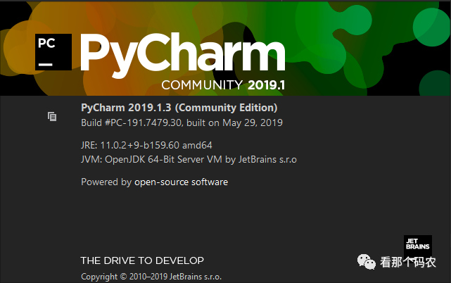

### 2.Anaconda(Python 3.6.0,PyQt5)

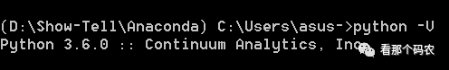

Qt Designer工具主界面

上期文章教过大家如何在Pycharm中安装PyQt5。如有需要，可以关注本公众号，查找翻看历史文章

《分享 | 如何为Pycharm打开视界》。

以下为Qt Designer工具主界面

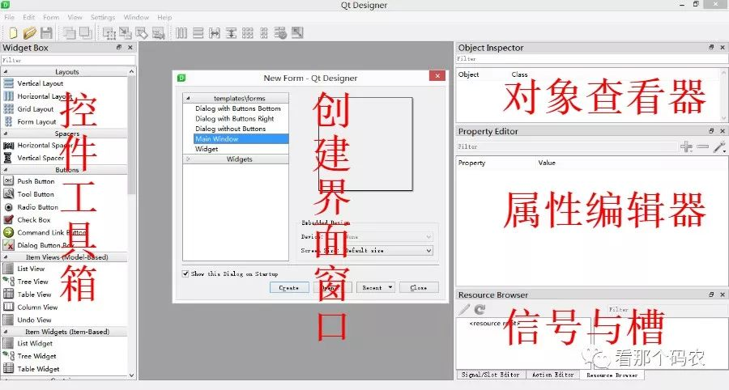

## 主界面的不同区域介绍：

### 控件工具箱：
提供Gui界面开发各种基本控件，如单选框、文本框等。可以拖动到新创建的主程序界面。

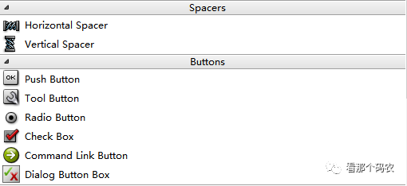

### 主界面区域：

用户放置各种从工具箱拖过来的各种控件。模板选项中最常用的就是Widget（通用窗口）和MainWindow（主窗口）。二者区别主要是Widget窗口不包含菜单栏、工具栏等。可以分别创建对比看看二者区别。

以下创建的是MainWindow（主窗口）

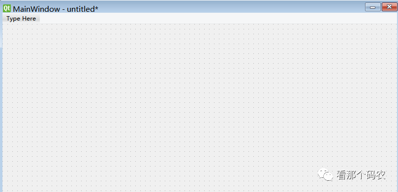

### 对象查看器区域：

查看主窗口放置的对象列表。

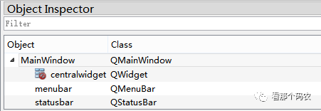

### 属性编辑器区域：

提供对窗口、控件、布局的属性编辑功能。比如修改控件的显示文本、对象名、大小等。

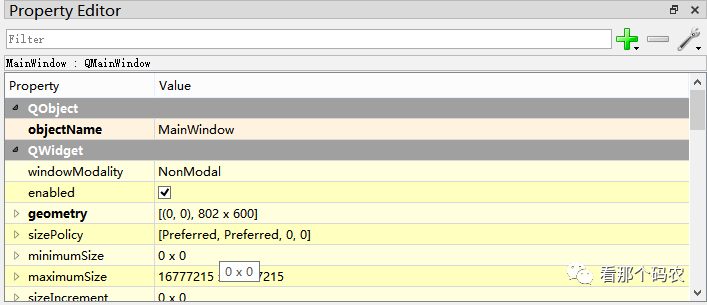

### 信号/槽编辑器区域：

编辑控件的信号和槽函数，也可以添加自定义的信号和槽函数。

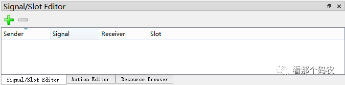

## 基本控件介绍

工具箱区域是按照控件作用类别进行划分的。这里作为实现入门级界面实现，主要介绍最常使用的控件及控件对象相关函数。

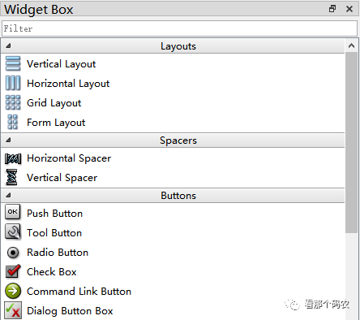

### （1）显示控件

Lable：文本标签，显示文本，可以用来标记控件。

Text Browser：显示文本控件。用于后台命令执行结果显示。

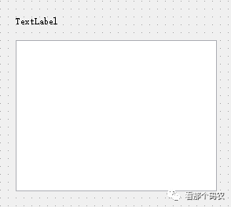

### （2）输入控件，提供与用户输入交互

Line Edit：单行文本框，输入单行字符串。控件对象常用函数为Text() 返回文本框内容，用于获取输入。setText() 用于设置文本框显示。

Text Edit：多行文本框，输入多行字符串。控件对象常用函数同Line Edit控件。

Combo Box：下拉框列表。用于输入指定枚举值。

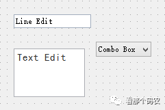

### （3）控件按钮，供用户选择与执行

Push Button：命令按钮。常见的确认、取消、关闭等按钮就是这个控件。clicked信号一定要记住。clicked信号就是指鼠标左键按下然后释放时会发送信号，从而触发相应操作。

Radio Button：单选框按钮。

Check Box：多选框按钮。

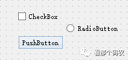

如下所示即为上述几种工具箱基本控件的对比图。

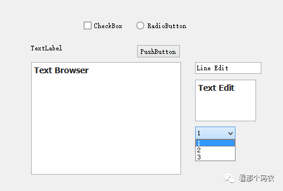

## 工具小实战
了解基本控件及其作用和获取输入/显示方法后，就可以开始动手实现用户小需求了。比如制作一个登录界面。获取用户名和密码并显示。

### 1。打开主界面，选择Widget模板

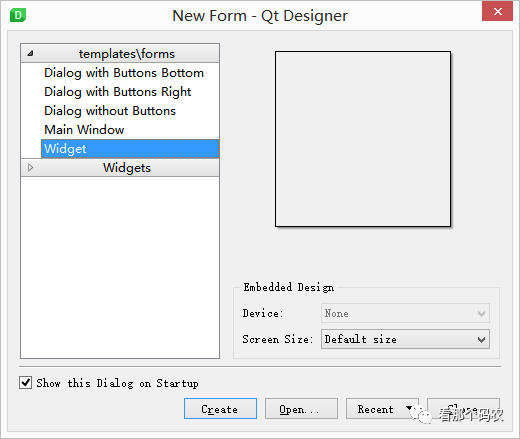

### 2。从Widget Box工具箱中拖拽2个label、2个line Edit、2个Push Button以及1个Text Browser。拖完后如下：

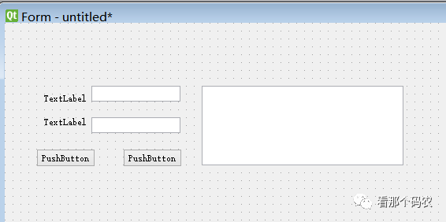

### 3。双击各个控件，修改控件名称（对应属性编辑区中的text，可直接双击控件修改）以及对象名称（对应属性编辑区中的objectName）。

并结合上期文章学习过的窗口布局管理可以对控件进行排版。

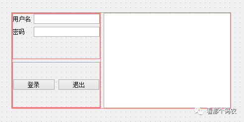

对象名称一定记得修改。默认生成的label_1、label_2这种名称无法直接判断到底是对应哪个控件。

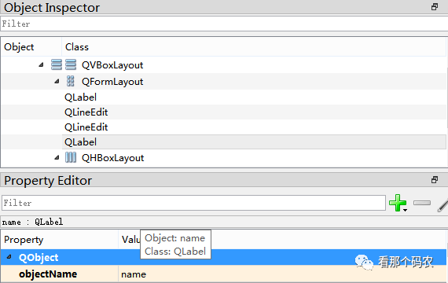

### 4。点击菜单栏Form - Prview。预览界面实现效果

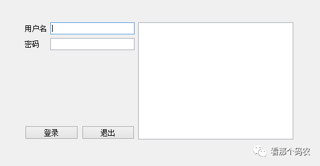

### 5。点击File -Save保存实现结果。保存文件名为login.ui

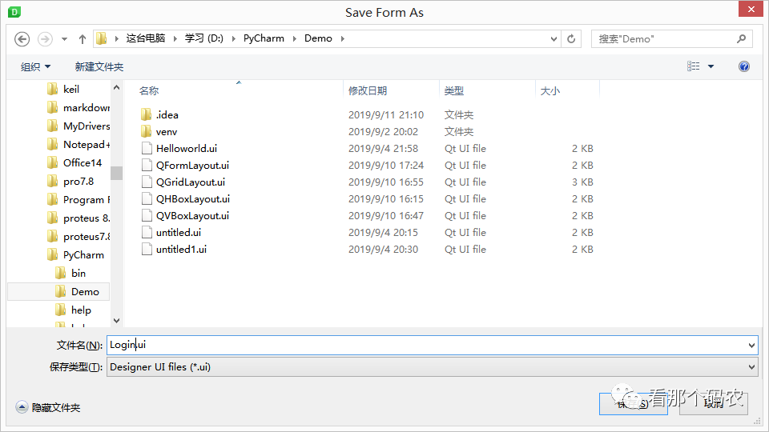

### 6。在Pycharm中右击刚刚生成的Login.ui文件External Tools->PyUIC

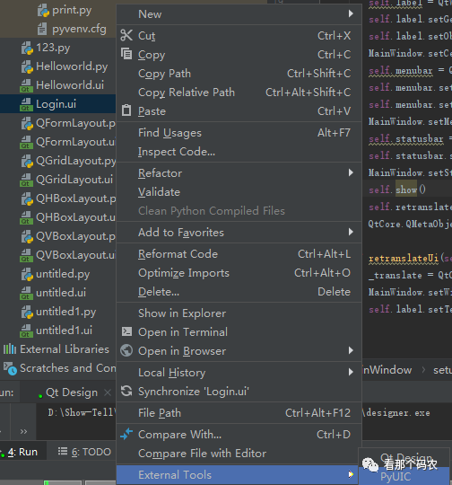

即可将刚刚制作的UI界面转换成python代码

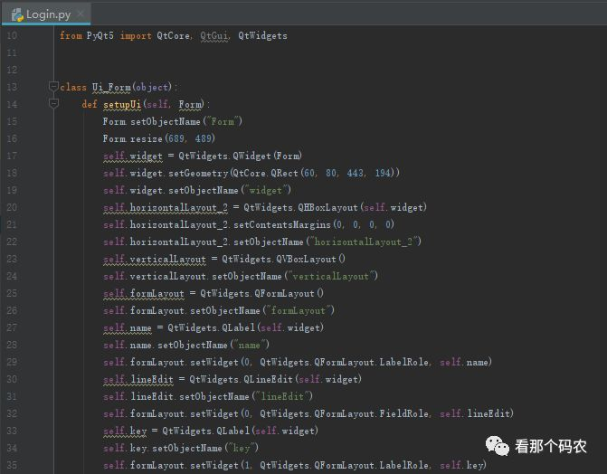

以上就是今天谈到的Qt Designer工具的使用方法,

你学会了吗？

**END**

本文参与 [腾讯云自媒体分享计划](https://cloud.tencent.com/developer/support-plan)，分享自微信公众号。

原始发表：2019-09-11，如有侵权请联系 [cloudcommunity@tencent.com](mailto:cloudcommunity@tencent.com) 删除
