##  01.LeNet-5网络诞生背景

**发明者：**贝尔实验室的研究员Yann LeCun

**提出时间：**1989年提出

**研究目的：**手写数字识别

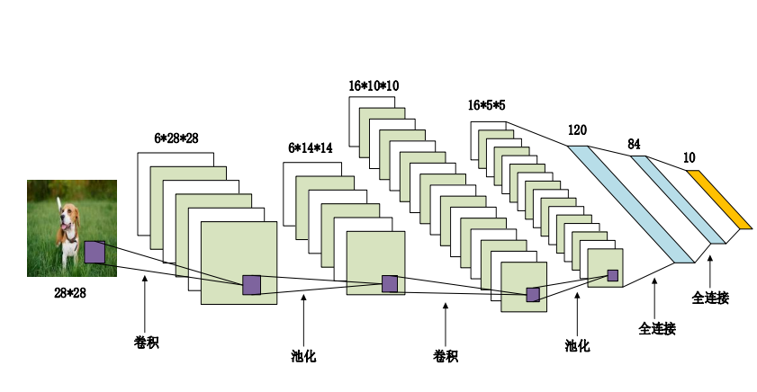

### LeNet-5网络结构

**LeNet（LeNet-5）由两个部分组成：**

- 特征提取部分：由两个卷积层和两个平均池化层组成;

- 全连接层：由三个全连接层组成。

**模型单元结构：**

一个卷积层、一个sigmoid激活函数，一个池化层

**数据的传输：**

卷积层输入为4维的数据（B,C,W,H）

卷积层输出为4维的数据（B,FN,OW,OH）

全连接层的输入为2维数据（B,L）

全连接层的输出为2维数据（B,FL）

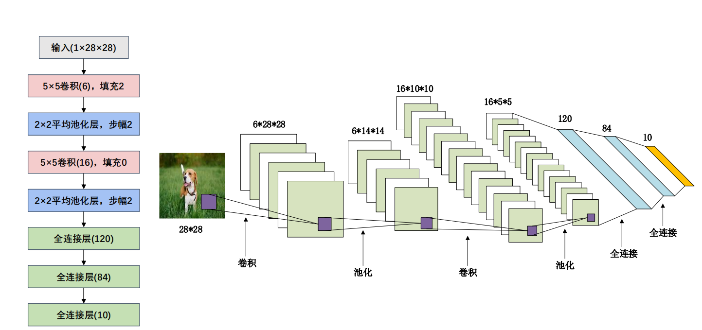

**第1层输入层**： Input为28×28×1
**第2层卷积层**： Input为28×28×1 ，卷积核5×5 ×1× 6；stride = 1，padding=2。 output为28×28×6
**第3层平均池化层**： Input为28×28×6，池化感受野为2×2，stride = 2，output为14×14×6
**第4层卷积层**： Input为14×14×6，卷积核5×5×6 ×16，stride = 1，padding=0, output为10×10×16
**第5层平均池化层**： Input为10×10×16，池化感受野为2×2 ，stride = 2 ,output 为5×5×16，Flatten操作，通过展平得到400个数据与之后的全连接层相连。
**第6～8层全连接层**： 第6~8层神经元个数分别为120，84，10。其中神经网络中用sigmoid作为激活函数，最后一层全连接层用softmax输出10个分类。

### LeNet-5总结

1、卷积神经网络（CNN）是一类使用卷积层的网络。
2、在卷积神经网络中，组合使用卷积层、非线性激活函数sigmoid
和全连接层。
3、为了构造高性能的卷积神经网络，我们通常对卷积层进行排列，
逐渐降低其表示的空间分辨率，同时增加通道数。
4、在传统的卷积神经网络中，卷积块编码得到的表征在输出之前
需由一个或多个全连接层进行处理。
5、LeNet是最早发布的卷积神经网络之一，它的问世有开创意义

##  02.AlexNet

在LeNet提出后，卷积神经网络在计算机视觉和机器学习领域中很有名气。但卷积神经网络并没有主导这些领域。这是因为虽然LeNet在小数据集上取得了很好的效果，但是在更大、更真实的数据集上训练卷积神经网络的性能和可行性还有待研究。事实上，在上世纪90年代初到2012年之间的大部分时间里，神经网络往往被其他机器学习方法超越，如支持向量机。

而在2012年，ILSVRC 大规模视觉识别挑战赛(Imagenet LargeScale Visual Recognition Challenge)， AlexNet首次引入了深度卷积神经网络，并获得2012的大规模视觉识别挑战赛的冠军，这标志着深度学习在计算机视觉领域的崭露头角

###  AlexNet网络结构

AlexNet和LeNet的设计理念非常相似，但也存在显著差异。
首先，AlexNet比相对较小的LeNet5要深得多。
其次，AlexNet由八层组成：五个卷积层、两个全连接隐藏层和一个全连接输出层。
最后，AlexNet使用ReLU而不是sigmoid作为其激活函数。

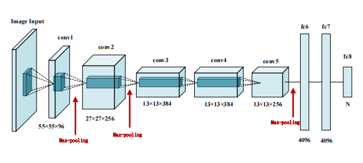

###  AlexNet网络参数详解

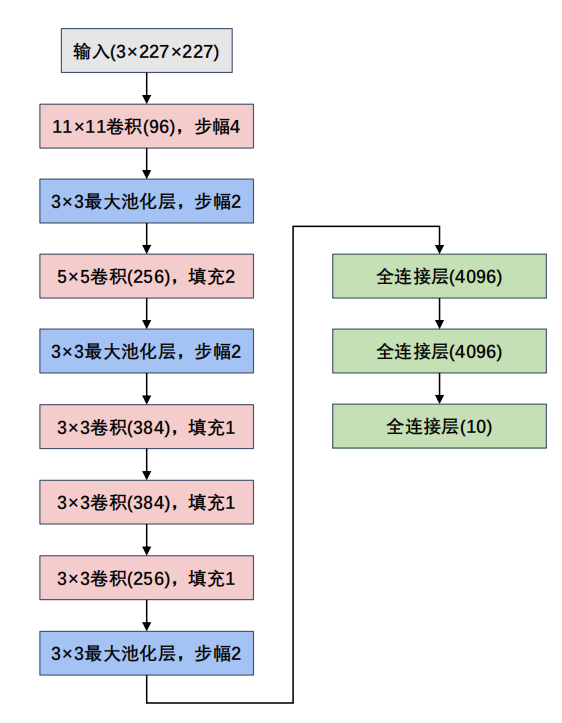

**第1层输入层**： Input为227×227×3
**第2层卷积层**： Input为227×227×3，卷积核为11×11×3× 96 ；stride=4，output为55×55×96
**第3层最大池化层**： Input为55×55×96，池化感受野为3×3，stride=2，output为27×27×96
**第4层卷积层**： Input为27×27×96，卷积核为5×5×96× 256 ；stride=1，padding=2 ，output为27×27×256
**第5层最大池化层**： Input为27×27×256，池化感受野为3 ×3，stride=2，output为13×13×256
**第6层卷积层**： Input为13×13×256，卷积核为3×3×256 × 384，stride=1，padding=1，output 为13×13×384
**第7层卷积层**： Input为13×13×384，卷积核为3×3×384 × 384，stride=1，padding=1，output 为13×13×384。
**第8层卷积层**： Input 13×13×384，卷积核为3×3×384 × 256，stride=1，padding=1，output 为13×13×256
**第9层最大池化层**： Input为13×13×256，池化感受野为3 ×3，stride=2，output 为6×6×256，Flatten操作，通过展平得到9216个数据后与之后的全连接层相连。第10～12层全连接层：第10~12层神经元个数分别为4096，4096，1000。其中前两层在使用relu后还使用了Dropout对神经元随机失活，最后一层全连接层用softmax输出1000个分类（这里要说的是，softmax输出1000个分类原因是当时该网络设计是为了参加ImageNet这个比赛，该比赛最后是对1000个物体进行分类）

###  DropOut

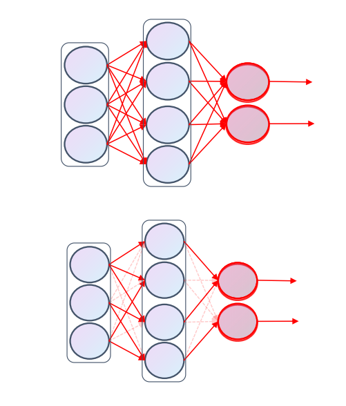

**正常流程**：

先把x通过网络前向传播，然后把误差反向传播以决定如何更新参数让网络进行学习

**Dropout流程**：

- （1）首先随机（临时）删掉网络中一半的隐藏神经元，输入输出神经元保持不变（图中虚线为部分临时被删除的神经元）
- （2）然后把输入x通过修改后的网络前向传播，然后把得到的损失结果通过修改的网络反向传播。一小批训练样本执行完这个过程后，在没有被删除的神经元上按照随机梯度下降法更新对应的参数（w，b）。
- （3）然后继续重复这一过程

###  图像增强

**水平翻转**

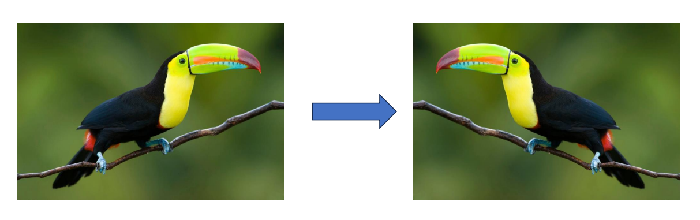

**随机裁取**

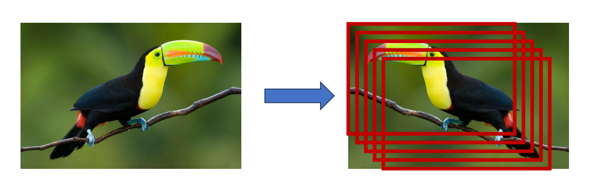

###  图像增强-PCA

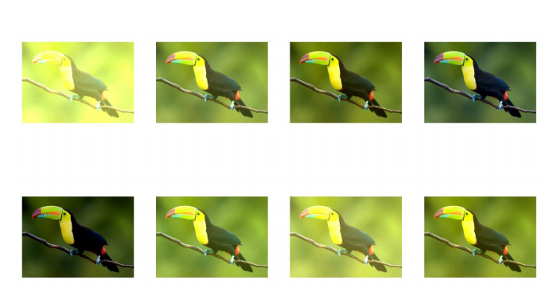

**PCA图像增强流程：**

- 1、将图片按照RGB三通道进行normalization处理，均值为0，方差为1，
- 2、 将图片按照channel展平成大小为(H*W,3)的矩阵。
- 3、计算展平后的矩阵的协方差矩阵，协方差矩阵的大小为（3,3）
- 4、对协方差矩阵进行特征分解，得到对应的特征向量（3,3）和特征值（3,1）
- 5、设置一个抖动系数，该抖动系数是一个（3,1）大小的矩阵，里面的元素是随机值，利用抖动系数和对应的特征进行相乘，依然得到一个（3,1）大小的矩阵，对该矩阵进行转置并和特征向量进行矩阵相乘，得到一个（3,1）大小的矩阵；
- 6、利用上述最后计算出来的（3,1）大小的矩阵，其中的3个值分别加到原图像的R,G,B三通道上，就是最后得到的增强的图像

###  LRN正则化

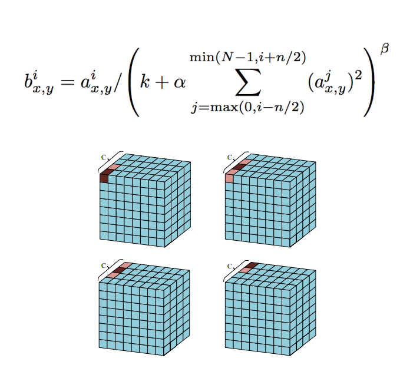

**局部归一化作用**：
对局部的值进行归一化操作，使其中比较大的值变得相对更大，增强了局部的对比度，在AlexNet中有1.2个百分比左右的提升。

**局部归一化流程**：
1、手动设置的超参（k，α，β，n）
2、对每个值利用公式计算局部归一化后的值。

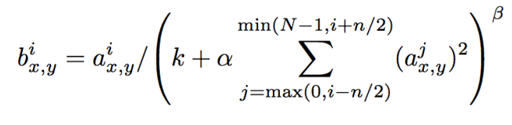

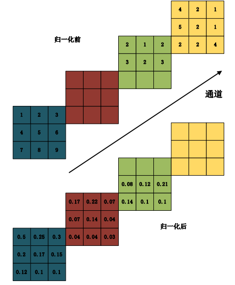

计算过程，以第二个通道的第一个值归一化为例：
1、首先设置超参数（k，α，β，n）=(0,1,1,2)
2、计算需要归一化的值和周边值的平方和，1^2+1^2+2^2=6
3、需要归一化的值除以上述平方和；1/6，即可以得出归一化后的值

###  AlexNet总结

- 1、AlexNet和LeNet设计上有一脉相承之处，也有区别。为了适应ImageNet中大尺寸图像，其使用了大尺寸的卷积核，从11×11到5×5到3×3，AlexNet的卷积层和全连接层也带来更多的参数6000万，这一全新设计的CNN结构在图像分类领域取大幅超越传统机器学习，自此之后CNN在图像分类领域被广泛应用。
- 2、使用了Relu替换了传统的sigmoid或tanh作为激活函数，大大加快了收敛，减少了模型训练耗时。
- 3、使用了Dropout，提高了模型的准确度，减少过拟合，这一方式再后来也被广泛采用。
- 4、在CNN中使用重叠的最大池化。此前CNN中普遍使用平均池化，AlexNet全部使用最大池化，避免平均池化的模糊化效果。并且AlexNet中提出让步长比池化核的尺寸小，这样池化层的输出之间会有重叠和覆盖，提升了特征的丰富性。
- 5、使用数据了2种数据扩增技术，大幅增加了训练数据，增加模型鲁棒性，减少过拟合。
- 6、使用了LRN正则化、多GPU并行训练的模式(不过之后并没有被广泛应用)