> 来源：https://blog.l0v0.com/posts/bea01990.html

# 前言

> 本来是最近用了一些 Qt Designer 一些之前没用过的特性，觉得特别有用，打算写篇小文章总结一下就算了。
  可是想着想着就全面铺开了，之前写 Python Qt 开发系列教程的时候也涉猎到 Qt Designer。
  但是 Qt Designer 写得比较基础，总结得不系统😒
  这次打算统一将 Qt Designer 黑科技全部挖掘出来😁
  这篇文章的前面部分将会介绍 Qt Designer 基础使用方法，搭配 gif 动图配合进行说明
  后半部分会介绍一些比较少用的特性，和自己的使用经验汇总，还会介绍以下的独门内容😎
>  
> 1. VScode 对接 Qt Designer
> 2. Qt.py 动态加载 ui 文件
> 3. 自定义 Property
> 4. 手动修改 ui 文件 - 实现特殊父类
> 5. 组件提升


## 什么是 Qt Designer

> 没有在网上找到百度百科之类的词条说明这个工具。
  不过大概的意思也可以参照我之前写的系列教程的其中一篇 [链接](./c5c920e.html)


> 基本上我自己概括起来就是，开发界面不需要代码了。
  实现 View 的自由搭配，通过可视化搭建好图形界面之后，只需要关注业务处理的代码即可。
  这就是使用 Qt Designer 的优势，界面代码自动生成，如果使用 Qt.py 流程设置不需要生成 Python 代码。


# 1.Qt Designer 基础

## 入门介绍

> Qt Designer 的使用相当简单，基本上就是所见即所得。
  基础的玩法网上也有很多不错的文章总结
>  
> - [官网手册](https://doc.qt.io/qt-5/qtdesigner-manual.html)
> - [官网说明](https://doc.qt.io/qt-5/designer-to-know.html)
> - [PyQT5 速成教程 - 2 Qt Designer 介绍与入门](https://www.jianshu.com/p/5b063c5745d0)
> - [使用 Qt Designer 来设计界面](https://blog.csdn.net/a10929/article/details/78114261)

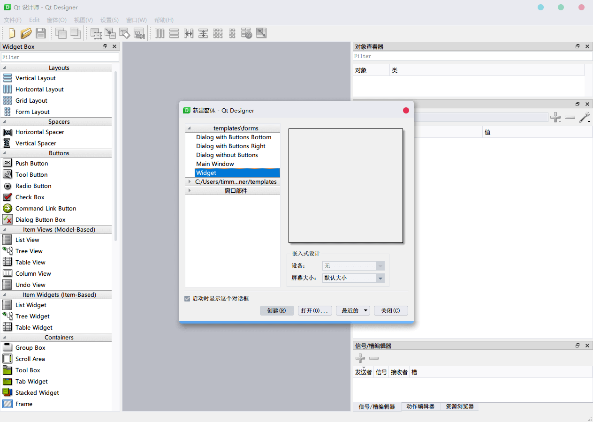[
](https://cdn.jsdelivr.net/gh/FXTD-odyssey/FXTD-odyssey.github.io@master/post_img/bea01990/01.png)

> 软件默认打开如上图，可以随便选择一个组件启动 Designer
  我这里选择 QWidget ，平时一般开发也是用 QWidget 比较多。

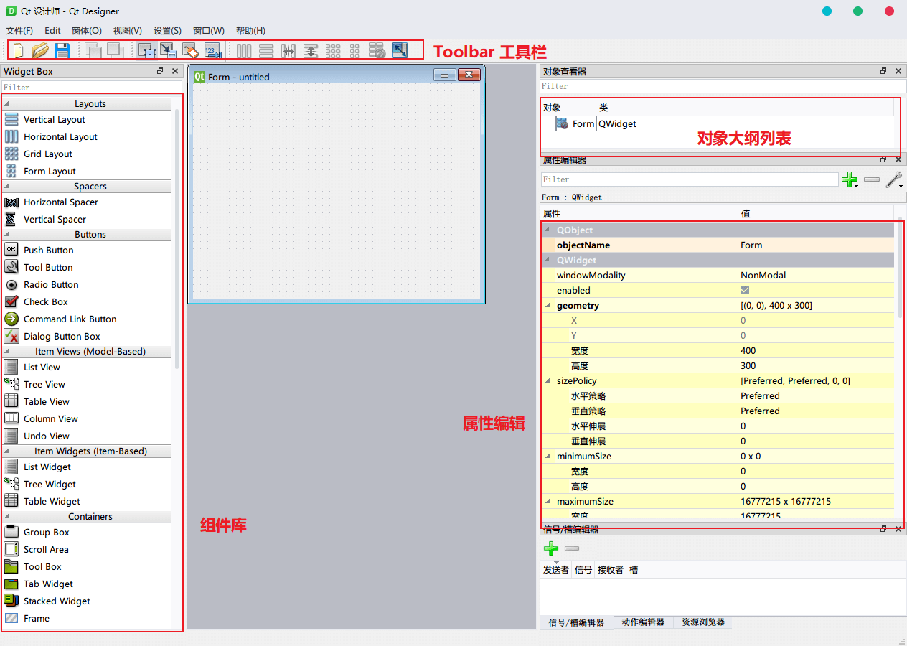[
](https://cdn.jsdelivr.net/gh/FXTD-odyssey/FXTD-odyssey.github.io@master/post_img/bea01990/02.png)

> 界面分类如上图所示，

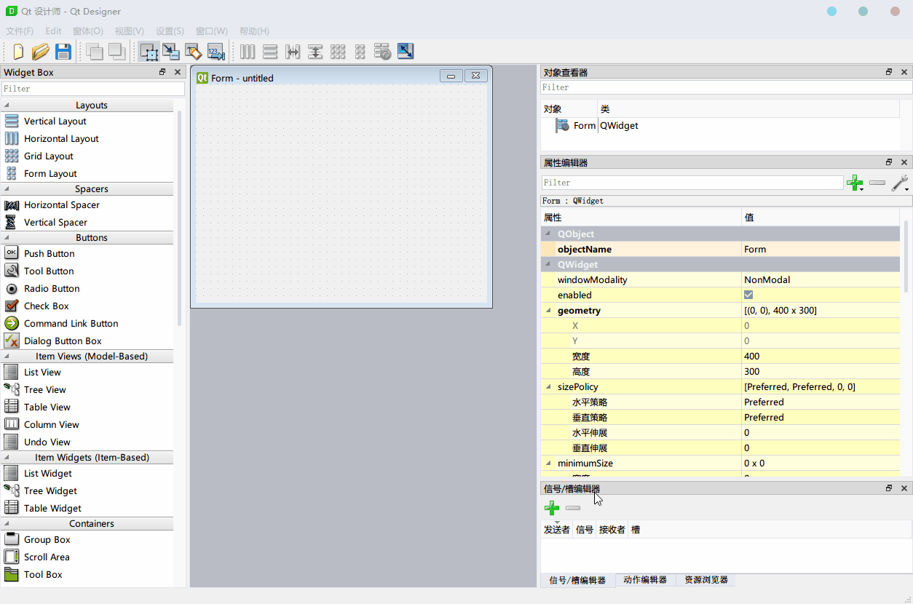[
](https://cdn.jsdelivr.net/gh/FXTD-odyssey/FXTD-odyssey.github.io@master/post_img/bea01990/03.gif)

> Qt Designer 的使用方法其实不难，基本上从左侧的组件库里面拖拽组件，然后放到窗口里面。

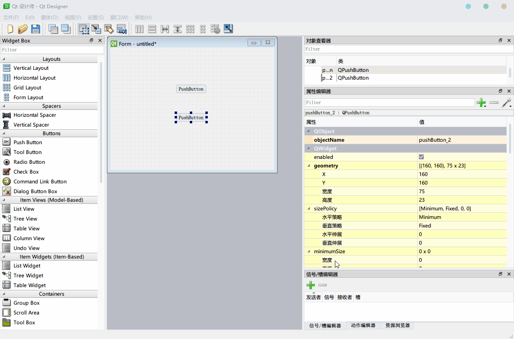[
](https://cdn.jsdelivr.net/gh/FXTD-odyssey/FXTD-odyssey.github.io@master/post_img/bea01990/04.gif)

> 然后可以像控制窗口一样可以用左键拖拽可以缩放组件。
  最基础的使用就是如此，懂了这些操作完全就可以自己拖拽组件搭配出想要的界面了。


### 布局

> 当然上面的搭配方法会如果遇到界面的窗口缩放的话，就出问题了。
  要让组件自动适应窗口的变化，就需要 Layout 去配合。

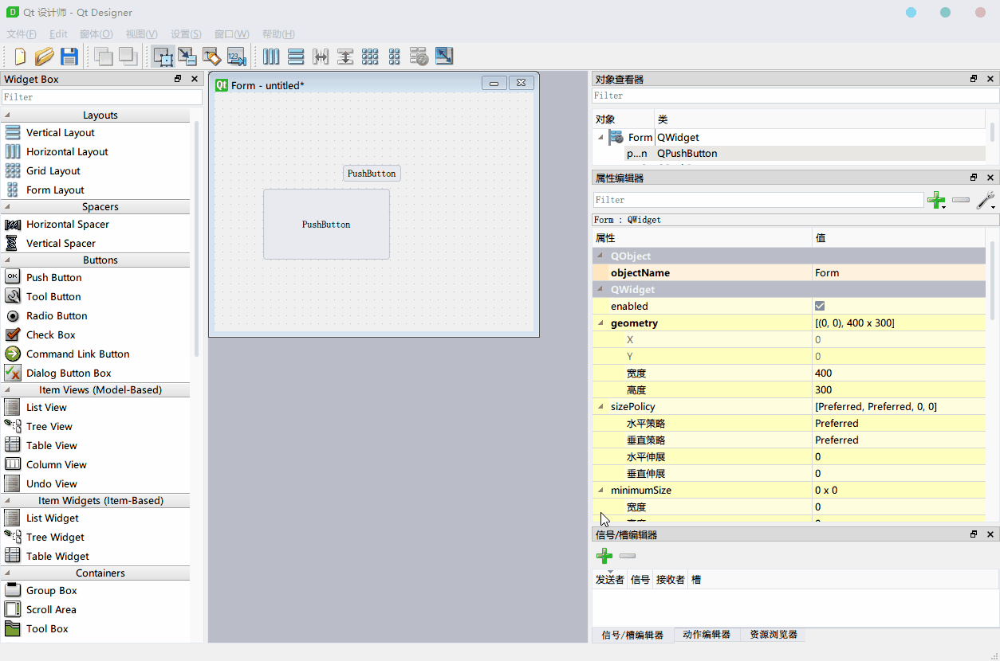[
](https://cdn.jsdelivr.net/gh/FXTD-odyssey/FXTD-odyssey.github.io@master/post_img/bea01990/05.gif)

> 上面就是设置 VBoxLayout 的竖向布局来布局页面。
  当然 Qt 提供的布局还有 横向布局、网格布局、表单布局。

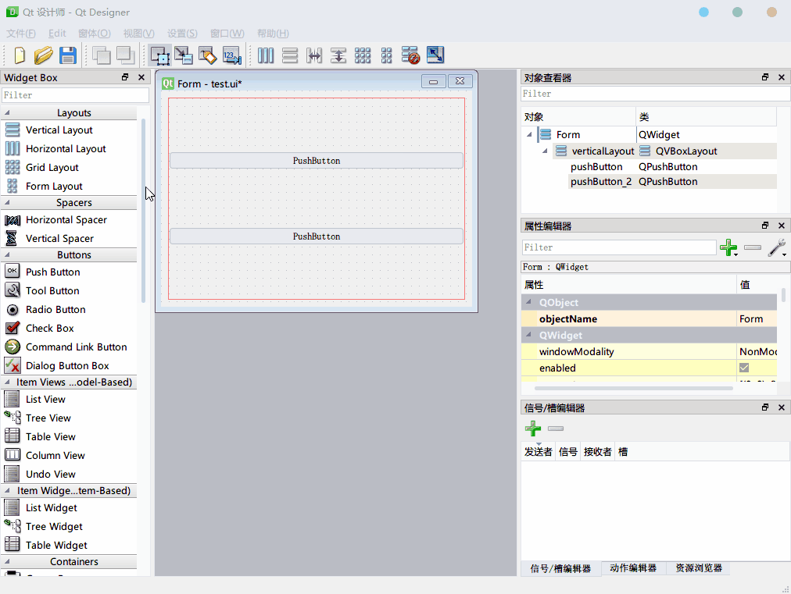[
](https://cdn.jsdelivr.net/gh/FXTD-odyssey/FXTD-odyssey.github.io@master/post_img/bea01990/06.gif)

> 其实用起来都非常好理解，可以通过工具栏将切换上述的布局。


### 属性编辑器编辑属性

> 右侧的属性编辑器可以定义组件很多东西。
  包括组件的状态，以及一些组件特有的属性。

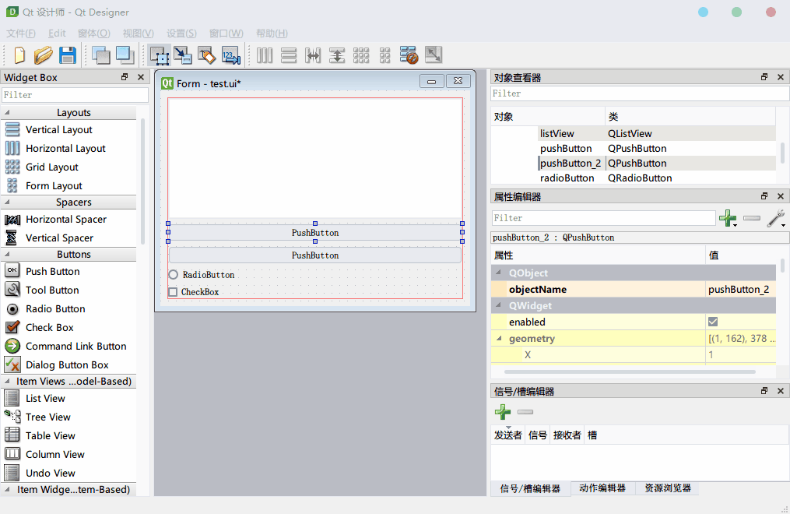[
](https://cdn.jsdelivr.net/gh/FXTD-odyssey/FXTD-odyssey.github.io@master/post_img/bea01990/07.gif)

> 这个具体的组件属性可以参照 Qt 的文档，然后使用上方的搜索查找对应的属性。


### 设置 stylesheet

> Qt 同样提供了类似于 Web 的样式表用来快速定义组件的显示效果。
  可以在属性编辑器的 StyleSheet 里面进行自定义。

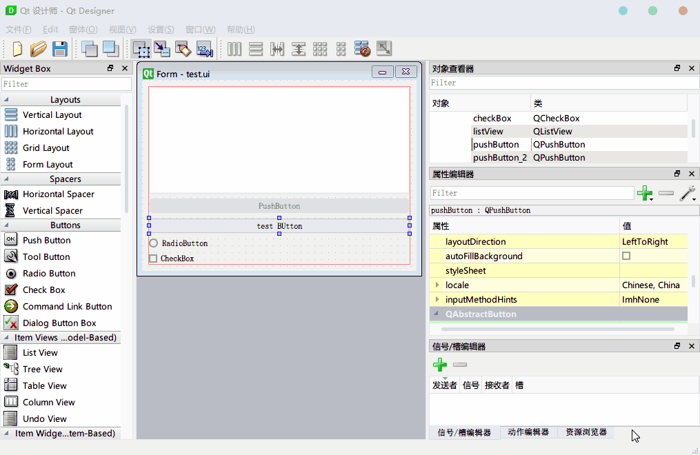[
](https://cdn.jsdelivr.net/gh/FXTD-odyssey/FXTD-odyssey.github.io@master/post_img/bea01990/08.gif)

> 关于样式表配置可以参照网上文章以及官网
>  
> 1. [官网 Qt Style Sheets Reference](https://doc.qt.io/qt-5/stylesheet-reference.html)
> 2. [官网 Qt Style Sheets Examples](https://doc.qt.io/archives/qt-4.8/stylesheet-examples.html)
> 3. [Qt 常用 QSS 集合](https://www.jianshu.com/p/2ecf26464f78)
> 4. [QSS 总结以及最近做的 Qt 项目](https://www.cnblogs.com/wangqiguo/p/4960776.html#_label6)


> QSS 背后其实 Qt 的 Paint 事件，通过样式表来简化手动绘制的操作。
  如果想要实现一些自定义的图形绘制， 需要代码通过 Qt 的 PaintEvent 实现。


### 信号槽连接

> Qt Designer 可以设置组件的信号槽连接。

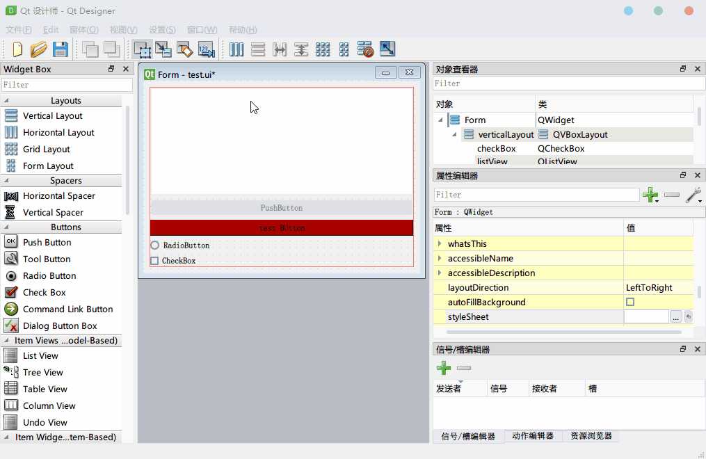[
](https://cdn.jsdelivr.net/gh/FXTD-odyssey/FXTD-odyssey.github.io@master/post_img/bea01990/09.gif)

> Qt 的信号槽可以实现一些 Qt 组件的事件回调，比如点击按钮的触发，数据变动触发等等。
  通常过去都是用代码连接信号槽。 [链接参考](https://blog.l0v0.com/posts/6830570a.html)


### 保存 ui 文件

> ui 文件实质上是一个 xml 文件。
  定义规范可以参考官方的 XML scheme 文档 [链接](https://doc.qt.io/qt-5/designer-ui-file-format.html)


> 上面的演示文件存储下来如下。


```xml
<?xml version="1.0" encoding="UTF-8"?>
<ui version="4.0">
 <class>Form</class>
 <widget class="QWidget" name="Form">
  <property name="geometry">
   <rect>
    <x>0</x>
    <y>0</y>
    <width>329</width>
    <height>224</height>
   </rect>
  </property>
  <property name="windowTitle">
   <string>Form</string>
  </property>
  <layout class="QVBoxLayout" name="verticalLayout_2">
   <item>
    <layout class="QVBoxLayout" name="verticalLayout">
     <item>
      <widget class="QListView" name="listView"/>
     </item>
     <item>
      <widget class="QPushButton" name="pushButton_2">
       <property name="enabled">
        <bool>false</bool>
       </property>
       <property name="text">
        <string>PushButton</string>
       </property>
      </widget>
     </item>
     <item>
      <widget class="QPushButton" name="pushButton">
       <property name="styleSheet">
        <string notr="true">background:rgb(170, 0, 0)</string>
       </property>
       <property name="text">
        <string>test BUtton</string>
       </property>
      </widget>
     </item>
     <item>
      <widget class="QRadioButton" name="radioButton">
       <property name="text">
        <string>RadioButton</string>
       </property>
      </widget>
     </item>
     <item>
      <widget class="QCheckBox" name="checkBox">
       <property name="text">
        <string>CheckBox</string>
       </property>
      </widget>
     </item>
    </layout>
   </item>
  </layout>
 </widget>
 <resources/>
 <connections>
  <connection>
   <sender>pushButton</sender>
   <signal>clicked()</signal>
   <receiver>checkBox</receiver>
   <slot>toggle()</slot>
   <hints>
    <hint type="sourcelabel">
     <x>90</x>
     <y>214</y>
    </hint>
    <hint type="destinationlabel">
     <x>71</x>
     <y>265</y>
    </hint>
   </hints>
  </connection>
 </connections>
</ui>
```

# 2.Qt Designer 功能小技巧

## qrc 资源

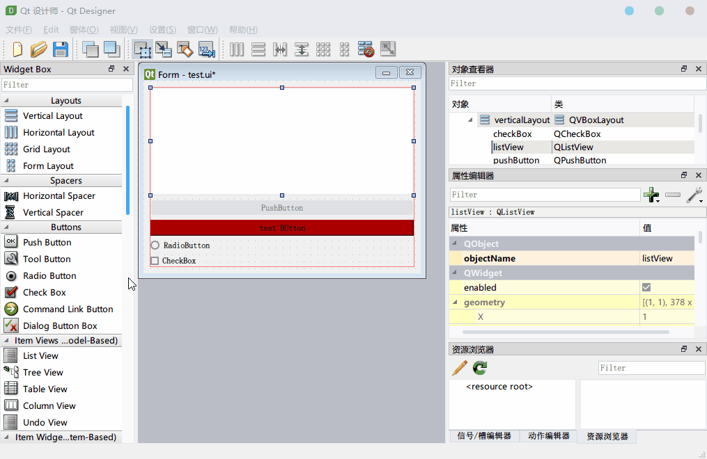[
](https://cdn.jsdelivr.net/gh/FXTD-odyssey/FXTD-odyssey.github.io@master/post_img/bea01990/10.gif)

> 设置资源路径，可以加载外部的图片资源。
  在这个过程会通过 Qt Designer 创建了一个 qrc 文件。
  这个 qrc 文件也是一个 xml ，用来描述索引的图片资源的位置。
  要使用 Qt 的 qrc 资源文件需要将资源编译为 Python 代码。
  这个过程会自动将图片资源转换为 Python 的字符信息。


> 编译 qrc 文件需要用 pyside2-rcc.exe pyrcc5.exe 执行程序进行转换
  maya2019 及以上的版本会总算是集成了 pyside2-rcc.exe 可以直接使用


```
C:\Program Files\Autodesk\Maya2019\bin>pyside2-rcc.exe -h
PySide2 resource compiler
Usage: pyside2-rcc.exe  [options] <inputs>

Options:
    -o file           Write output to file rather than stdout
    -py2              Generate code for any Python v2.x version
    -py3              Generate code for any Python v3.x version (default)
    -name name        Create an external initialization function with name
    -threshold level  Threshold to consider compressing files
    -compress level   Compress input files by level
    -root path        Prefix resource access path with root path
    -no-compress      Disable all compression
    -version          Display version
    -help             Display this information
```

```
pyside2-rcc test.qrc -o test_qrc.py
```

> 感觉说明执行命令即可将 qrc 文件转换为 python 代码，调用直接 import 即可。
  使用 qrc 的 python 代码可以将资源注册到 QApplication 里面。
  不需要再读取资源数据，所有的组件都可以访问这些资源。


## Spacer 妙用

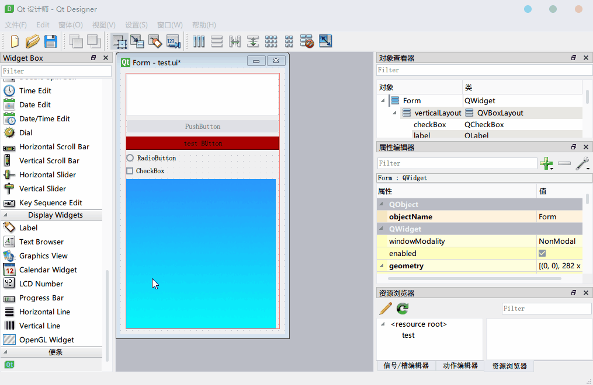[
](https://cdn.jsdelivr.net/gh/FXTD-odyssey/FXTD-odyssey.github.io@master/post_img/bea01990/11.gif)

> Spacer 组件让 UI 更加紧凑。
  在缩放窗口的时候可以让 UI 直接没有间隙，观感好很多。


## Layout 转组件

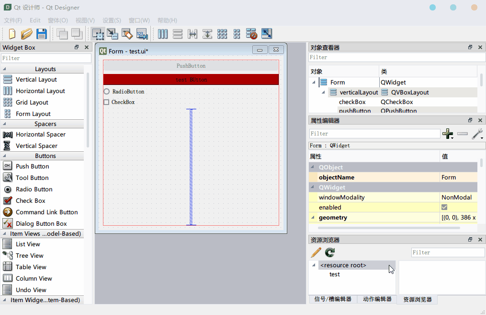[
](https://cdn.jsdelivr.net/gh/FXTD-odyssey/FXTD-odyssey.github.io@master/post_img/bea01990/12.gif)

> Layout 布局不属于 Widget 组件，无法设置样式。
  这个时候可以将 Layout 转成 QWidet 之类的组件实现进一步的操作。


## Ctrl 复制组件

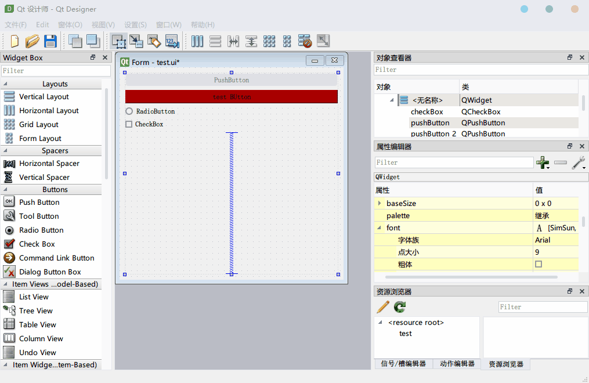[
](https://cdn.jsdelivr.net/gh/FXTD-odyssey/FXTD-odyssey.github.io@master/post_img/bea01990/13.gif)

> 按住 Ctrl 键可以复制组件，有时候复杂布局也可以一并复制。


## select ancestor 方便选择父级

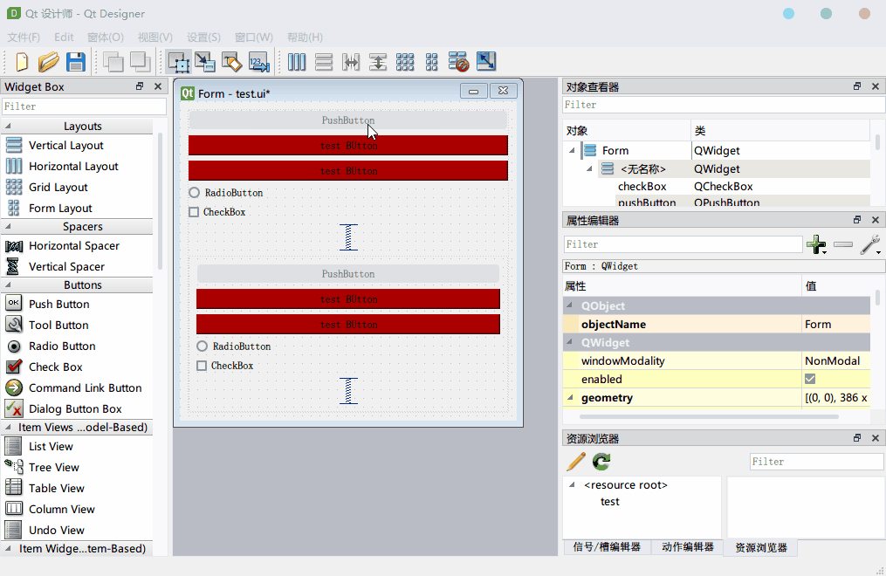[
](https://cdn.jsdelivr.net/gh/FXTD-odyssey/FXTD-odyssey.github.io@master/post_img/bea01990/14.gif)

> 组件比较复杂的情况，选择会父组件会比较不方便，只能通过组件间的间隙进行选择。
  可以在右侧的大纲中选择，或者使用 select ancestor 命令


## 鼠标中间方便框选

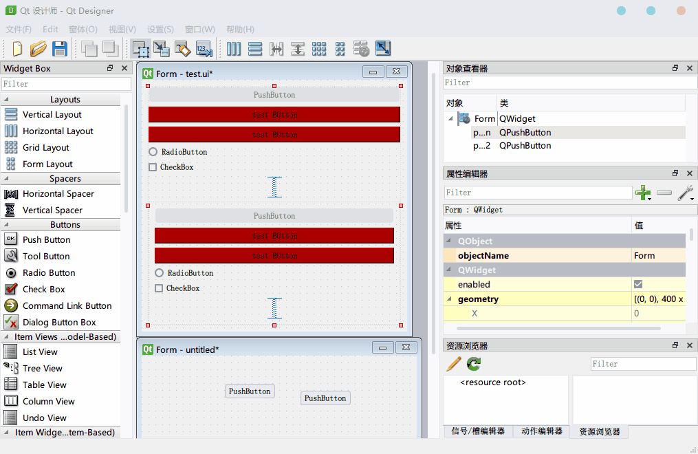[
](https://cdn.jsdelivr.net/gh/FXTD-odyssey/FXTD-odyssey.github.io@master/post_img/bea01990/15.gif)

> 本来用鼠标左键在空白区域拖拽，可以框选大量组件。
  但是组件比较多的话，没有空白区域，则可以用鼠标中键触发框选。


## ctrl + R 开启窗口预览

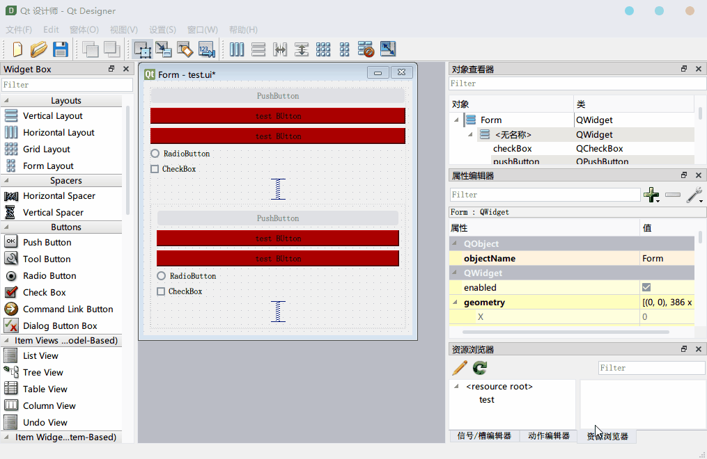[
](https://cdn.jsdelivr.net/gh/FXTD-odyssey/FXTD-odyssey.github.io@master/post_img/bea01990/16.gif)

> Ctrl + R 快捷键可以快速打开一个运行状态的预览窗口。
  这个操作在上面的信号槽中已经有所演示。


## Tab order 编辑

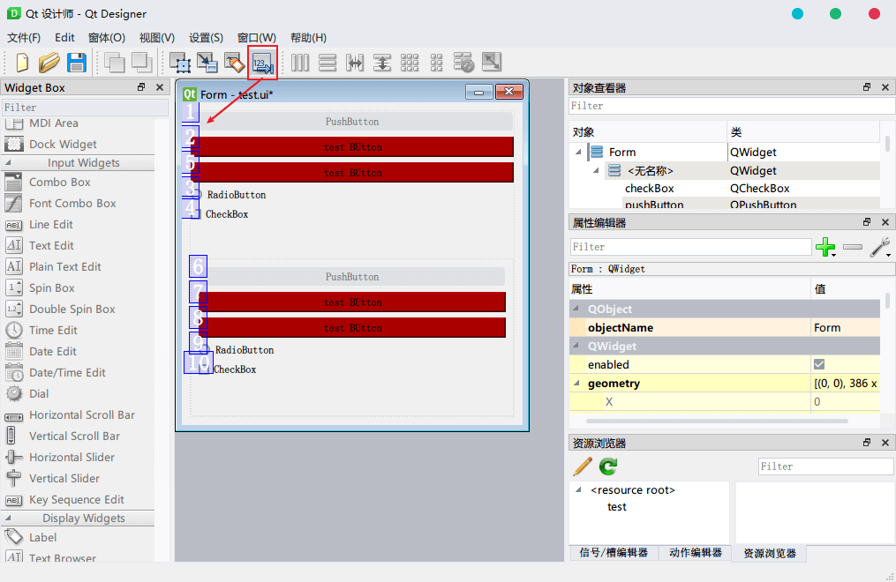[
](https://cdn.jsdelivr.net/gh/FXTD-odyssey/FXTD-odyssey.github.io@master/post_img/bea01990/17.png)

> 很少有用到。
  使用场景是输入框很多的时候，可以定义 Tab 键跳转到的组件


## Edit Buddies 编辑功能

> 设置聚焦功能 ，我从来没有用过。
  用来通过 QLabel 的快捷键快速触发 QLineEdit 的聚焦。


> - [官方链接](https://doc.qt.io/qt-5/designer-buddy-mode.html)
> - [QT Edit Buddies 的理解](https://blog.csdn.net/technologyleader/article/details/82014028)


# 3.ui 文件 Python 调用方法

## pyside2-uic 编译

> 关于如何使用 pyside2-uic 编译 ui 文件，我之前的系列文章有保姆级的演示 [链接](./c5c920e.html)
  所以这里就不在赘述，我着重介绍新的方案，目前我开发主要用的是下面的方案了😎


## Qt.py 动态加载 ui 文件

> 关于 Qt.py 我之前的教程系列里面有所提及👏 [链接](./2e0af969.html)


```python
from Qt import QtWidgets,QtGui,QtCore
```

> 最大的特点就是将 PyQt4 和 PySide 的代码做了兼容 PyQt5 和 PySide2
  全部用 Qt5 来写，自动兼容，缺点就是会丢失编辑器的代码提示。
  丢失代码提示也是有解决方案，我后面补上一起文章进行说明 [链接](./df750dd1.html)


---

> 除了上面的用法之外， Qt.py 还有一些藏得比较深的功能，官方的 readme 文档居然不写出来。🤷‍♂️
  我最初是通过 dir 找到这个东西的，貌似不是 Qt 官方的类，于是顺藤摸瓜。
  发现 Qt.py 将一些特殊的兼容组件整合到这个类里面去了，其中就包括兼容不同 Qt 模块的动态 loadUi 方法。


```python
from Qt.QtCompat import loadUi
```

> 其实再到 Qt.py 的仓库上摸索一下，会发现有使用案例的 [链接](https://github.com/mottosso/Qt.py/tree/master/examples/loadUi)
  loadUi 的使用非常简单，可以参照官方提供的[案例](https://github.com/mottosso/Qt.py/blob/master/examples/loadUi/baseinstance1.py)
  基本上就是在 类里面 调用 loadUi ， 传入 ui 路径 和 self 即可。


```python
import os
from Qt import QtWidgets,QtGui,QtCore
from Qt.QtCompat import loadUi

class TestWidget(QtWidgets.QWidget):
    def __init__(self):
        super().__init__()
        DIR  = os.path.dirname(__file__)
        ui_path = os.path.join(DIR,"test.ui")
        # NOTE 加载 ui 文件
        loadUi(ui_path,self)

        # NOTE 执行了 loadUi 之后可以通过 ObjectName  获取到 ui 文件里面的定义的组件了
        self.Test_BTN.clicked.connect(lambda: sys.stdout.write("click"))
```

> 上面就是简单的使用代码场景
  这种写法的好处就是不需要手动执行编译命令生成 py 文件
  ui 文件保存， python 重开一下窗口即可看到 Qt Designer 中的更新，使用更加方便了。


# 4.VScode 对接 Qt Designer

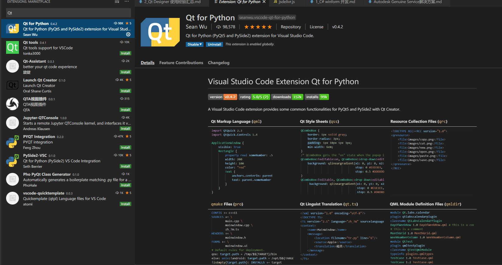[
](https://cdn.jsdelivr.net/gh/FXTD-odyssey/FXTD-odyssey.github.io@master/post_img/bea01990/18.png)

> VScode 有一个非常好用的插件，可以自己配置 Qt 工具的路径😊

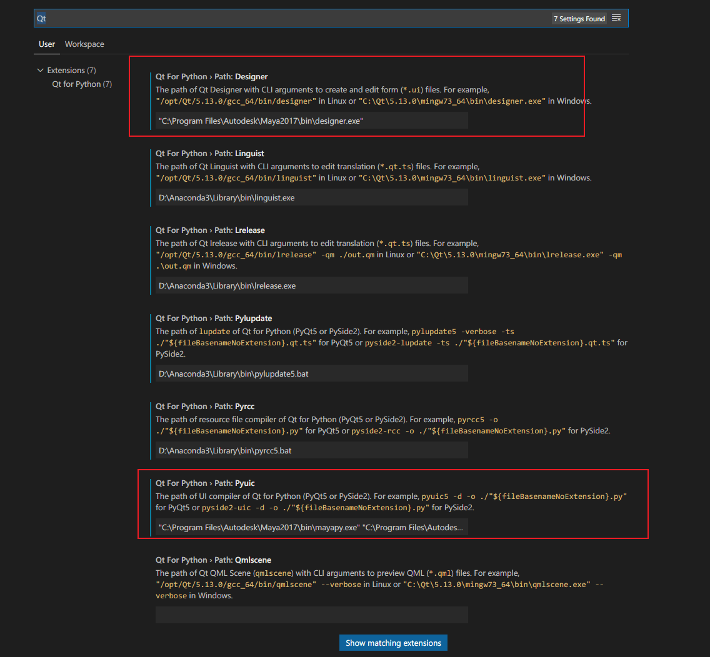[
](https://cdn.jsdelivr.net/gh/FXTD-odyssey/FXTD-odyssey.github.io@master/post_img/bea01990/19.png)

> 配置好这些，打开 ui 文件可以直接通过 VScode 打开设置好的 Qt Designer
  也可以自动 compile 出代码

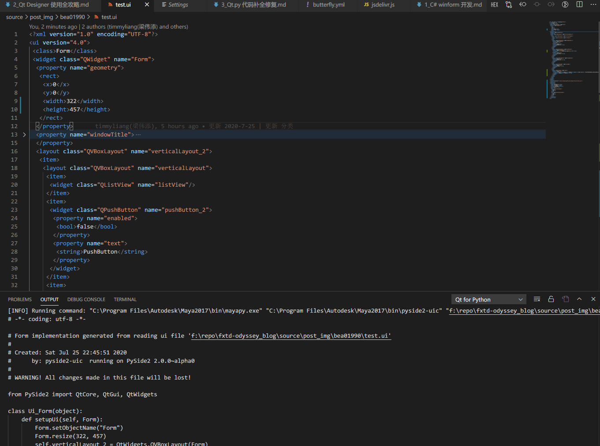[
](https://cdn.jsdelivr.net/gh/FXTD-odyssey/FXTD-odyssey.github.io@master/post_img/bea01990/21.png)

> 我设置的 pyuic 没有设置代码输出的路径，所以我这里编译显示的代码是在 VScode 里面的。
  我一般不用 compile ，但是有时候需要手动配置组件代码的时候，也可以快速通过 ui 文件编译查一下代码怎么写，还挺方便的。
  另外 VScode 命令行输入 edit 也可以自动启动 Qt Designer 并打开当前在 VScode 打开的 ui 文件，这个也非常方便。😏


# 5.Qt Designer 鲜为人知的黑科技

> 最后我们来说讲解最刺激的黑科技部分😀


## 自定义 property

> 属性编辑器可以配置自定义属性到组件里面。

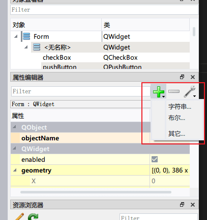[
](https://cdn.jsdelivr.net/gh/FXTD-odyssey/FXTD-odyssey.github.io@master/post_img/bea01990/22.png)

> 比较常用的就是 字符串 和 布尔类型。
  点击其他还能看到更多 C++ 相关的类型，一般情况下也用不上。


### 挂载配置文件

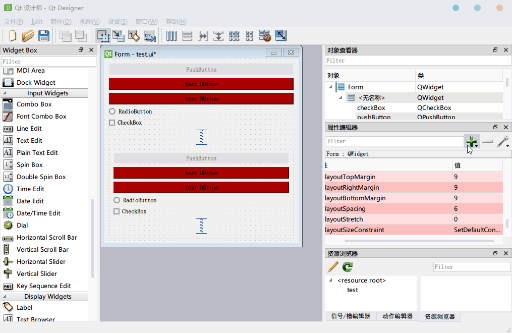[
](https://cdn.jsdelivr.net/gh/FXTD-odyssey/FXTD-odyssey.github.io@master/post_img/bea01990/23.gif)

> 基于字符串可以挂载的原理，我可以弄一套 json 配置到组件里面。
  然后再 Python 固定读取这个属性解析 json 配置，就甚至可以实现在 Qt Designer 配置组件的基础行为。
  组件功能可以更为灵活，不过也不建议配置过于复杂，建议业务逻辑还是写到代码里合适。


> 后续 Python 读取这个属性如下


```json
{
    "method" : {
        "setText":"输出名称"
    }
}
```

```python
import os
import json
from collections import OrderedDict

from Qt import QtWidgets,QtGui,QtCore
from Qt.QtCompat import loadUi

def ui_PyInit(widget):
    """
    递归遍历所有的 Widget 组件
    """
    if not hasattr(widget,"children"):
        return

    # NOTE 初始化 PyInit 中配置的方法
    data = widget.property("PyInit")
    if data:
        try:
            data = json.loads(data,object_pairs_hook=OrderedDict)
            for method,param in data['method'].items():
                param = param if isinstance(param,list) else [param]
                getattr(widget,method)(*param)
        except:
            pass

    for child in widget.children():
        ui_PyInit(child)

class TestWidget(QtWidgets.QWidget):
    def __init__(self):
        super().__init__()
        DIR  = os.path.dirname(__file__)
        ui_path = os.path.join(DIR,"test.ui")
        # NOTE 加载 ui 文件
        loadUi(ui_path,self)
        # NOTE 初始化配置方法
        ui_PyInit(self)
```

## 手动修改 ui 文件

> ui 文件本质上就是 XML
  可以通过手动修改 XML 实现一些 Qt Designer 本身无法设置的操作。


### 将 QWidget 修改为特定组件

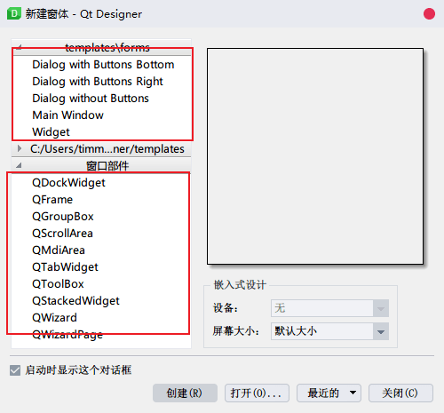[
](https://cdn.jsdelivr.net/gh/FXTD-odyssey/FXTD-odyssey.github.io@master/post_img/bea01990/24.png)

> Qt Designer 无法创建一个纯按钮之类的 ui 文件
  默认的 ui 文件必须是个容器。


> 但是我就是有个需求要弄一个纯 按钮 的 ui 文件，应该要怎么实现。
  可以通过修改 xml 类来实现。


> 首先默认创建一个 QWidget 的 ui 文件。

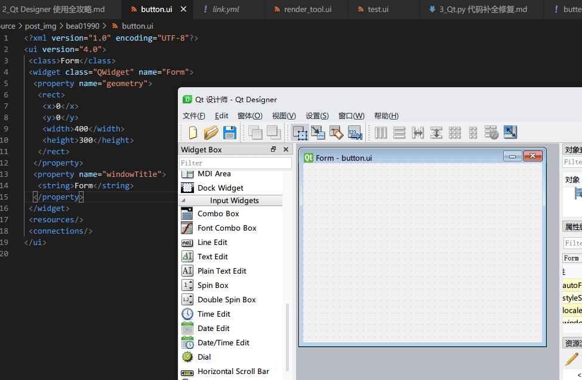[
](https://cdn.jsdelivr.net/gh/FXTD-odyssey/FXTD-odyssey.github.io@master/post_img/bea01990/25.png)

> 然后将 ui 文件的 QWidget 修改为 QPushButton


```xml
<?xml version="1.0" encoding="UTF-8"?>
<ui version="4.0">
 <class>Form</class>
 <widget class="QPushButton" name="Form">
  <property name="geometry">
   <rect>
    <x>0</x>
    <y>0</y>
    <width>395</width>
    <height>149</height>
   </rect>
  </property>
  <property name="windowTitle">
   <string>Form</string>
  </property>
 </widget>
 <resources/>
 <connections/>
</ui>
```

> 重新用 QtDesigner 打开这个文件。
  你会发现 Qt Designer 里面呈现的是一个按钮而不是 QWidget 了。

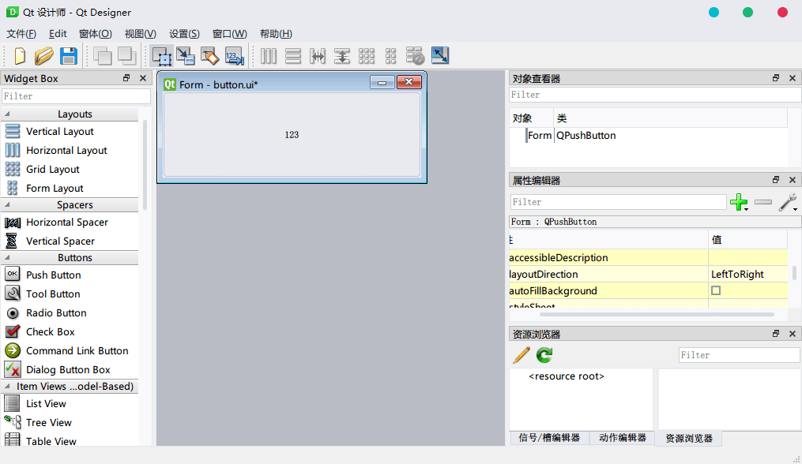[
](https://cdn.jsdelivr.net/gh/FXTD-odyssey/FXTD-odyssey.github.io@master/post_img/bea01990/26.png)

### 给 QWidget 添加 MenuBar

> 基于上面的脑洞，也可以实现给 QWidget 添加 QMenuBar 的骚操作。
  默认情况下，只有 QMainWindow 可以在 Qt Designer 里面配置 QMenuBar 实现下来菜单。
  由于左侧的组件列表没有 QMenuBar 组件，所以根本就无法添加到 QWidget 里面。


> 通过编辑 ui 文件，然后用上面的方法将两个 ui 文件拼接到一起，就可以实现这种骚操作。
  这样就不需要手动写 QMenuBar 相关的代码了。

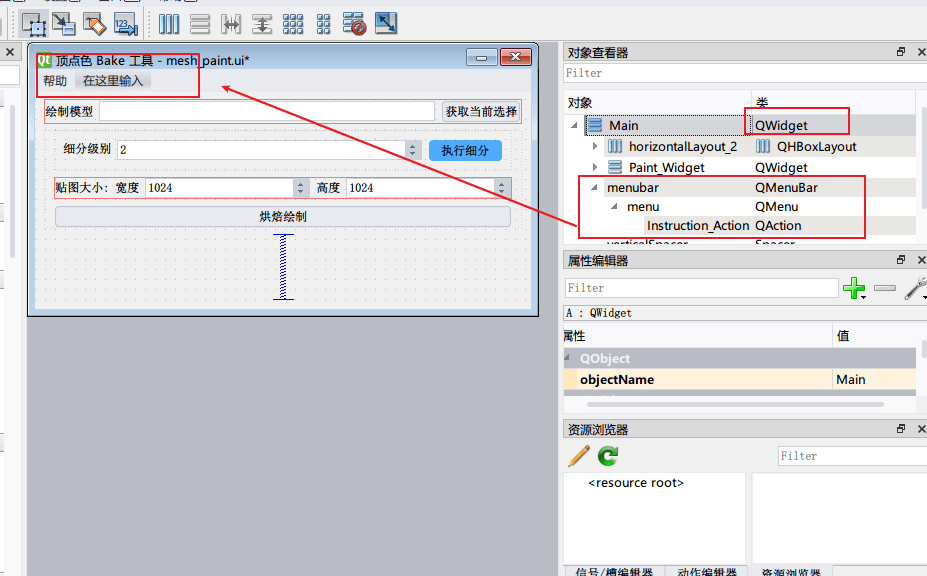[
](https://cdn.jsdelivr.net/gh/FXTD-odyssey/FXTD-odyssey.github.io@master/post_img/bea01990/27.png)

## 组件提升

> 默认情况下， Qt Designer 只能拖拽一些基础组件，如果我们想要套用自定义的组件，似乎就无法实现了。
  其实不然，通过 promote 提升，可以实现将组件提升为 第三方 类。
  当然，组件提升无法在 Qt Designer 直接预览到效果，只能看到基类的 UI。
  如果要想实现在 Qt Designer 直接看到效果，也可以用 C++ 开发 Qt Designer 的插件，直接扩展出自定义组件。(这个操作我也不会😂)


> 基础的提升操作如下

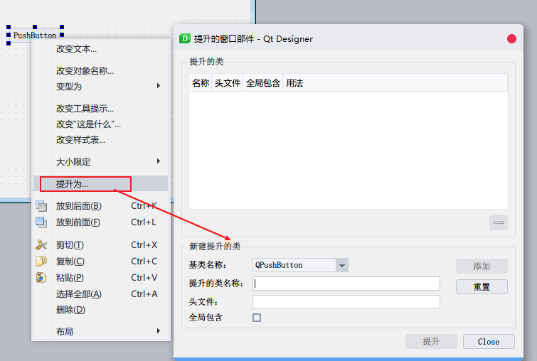[
](https://cdn.jsdelivr.net/gh/FXTD-odyssey/FXTD-odyssey.github.io@master/post_img/bea01990/28.png)

> 看起来似乎也是针对 C++ 才有效。
  其实不然。

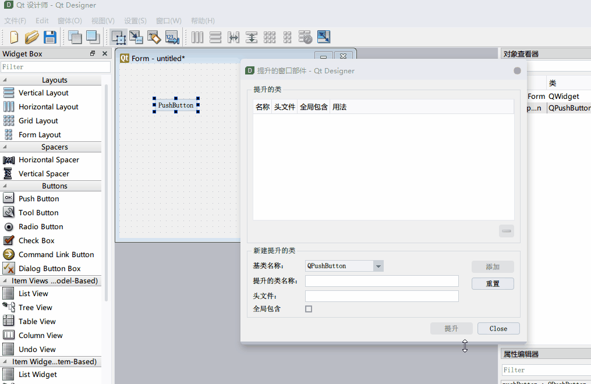[
](https://cdn.jsdelivr.net/gh/FXTD-odyssey/FXTD-odyssey.github.io@master/post_img/bea01990/29.gif)

> 先添加一个配置头文件的配置
  然后再点击 Promote 来提升组件，这个操作的确有点反人类设计😓


> 下面编译这个 ui 文件可以看到神奇的 promote 效果


```python
from PySide2 import QtCore, QtGui, QtWidgets

class Ui_Form(object):
    def setupUi(self, Form):
        Form.setObjectName("Form")
        Form.resize(400, 300)
        self.pushButton = MPushButton(Form)
        self.pushButton.setGeometry(QtCore.QRect(60, 60, 75, 23))
        self.pushButton.setObjectName("pushButton")

        self.retranslateUi(Form)
        QtCore.QMetaObject.connectSlotsByName(Form)

    def retranslateUi(self, Form):
        Form.setWindowTitle(QtWidgets.QApplication.translate("Form", "Form", None, -1))
        self.pushButton.setText(QtWidgets.QApplication.translate("Form", "PushButton", None, -1))

from dayu_widgets.push_button import MPushButton
```

> 是的，头文件自动转为 Python 的库， 类名就对应库里面的类。
  只要自定义的组件类按照默认的 构造函数传参， 就不存在什么问题。


> 这个东西其实也可以直接用 ui 文件加载的方式调用起来， 我也是最近看了 [tk 库](https://github.com/m3trik/tk) 学到的新知识
  可以参考 [tk_switchboard.py](https://github.com/m3trik/tk/blob/master/tk_switchboard.py) 代码
  这里用到了 QUiLoader `registerCustomWidget` 的使用方法
  通过这个方法可以将自定义的组件注册到 QUiLoader 里面，然后 QUiLoader 读取 ui 文件的时候自动映射到第三方组件上。


> 这个是 PySide2 的实现方案，其实 Qt.py 早已经在考虑到这个问题。
  参考 Qt.py 的 loadUi 源码可以发现它通过 Python 读取 xml 里面的头文件然后通过 `importlib.import_module` 导入模块 [源码链接](https://github.com/mottosso/Qt.py/blob/master/Qt.py)
  所以用 Qt.py 的 loadUi 更加简单，还兼容 PyQt
  当然缺点就 Qt.py 没有暴露自定义模块的传参，只能确保导入模块在 sys.path 里面。


### 例子: dayu_widget

> 这个 dayu_widget 第三方库通过 Qt Designer 直接嵌入的效果可以参考我的 [PyToolkit 文章](./513f9ff.html)

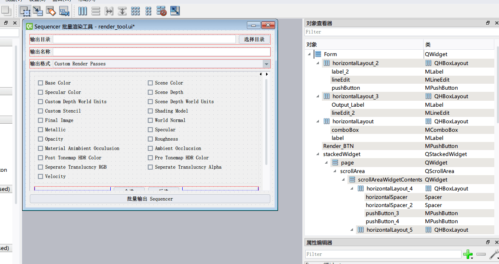[
](https://cdn.jsdelivr.net/gh/FXTD-odyssey/FXTD-odyssey.github.io@master/post_img/bea01990/30.png)
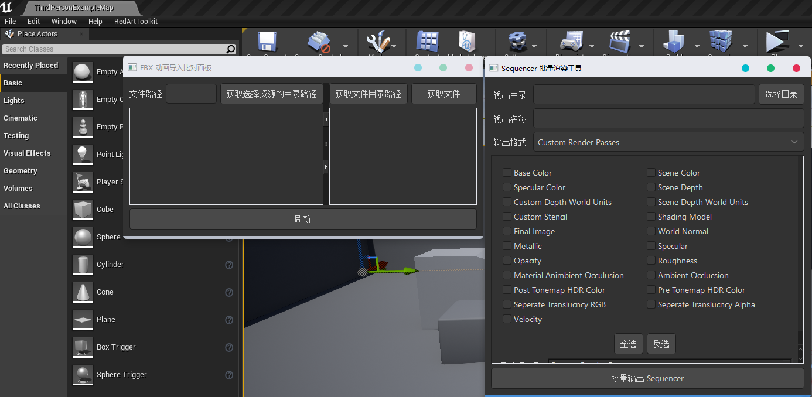[
](https://cdn.jsdelivr.net/gh/FXTD-odyssey/FXTD-odyssey.github.io@master/post_img/bea01990/31.png)

## 总结

> 花了大半天的功夫，总算是全面地将 Qt Designer 神兵利器介绍完毕了。
  基本上已经将 Qt Designer 的各种玩法透彻剖析了，欢迎大家留言交流意见。


文章作者: [智伤帝](mailto:undefined)

文章链接: [https://blog.l0v0.com/posts/bea01990.html](https://blog.l0v0.com/posts/bea01990.html)

版权声明: 本博客所有文章除特别声明外，均采用 [CC BY-NC-SA 4.0](https://creativecommons.org/licenses/by-nc-sa/4.0/) 许可协议。转载请注明来自 [智伤帝的个人博客](https://blog.l0v0.com)！

