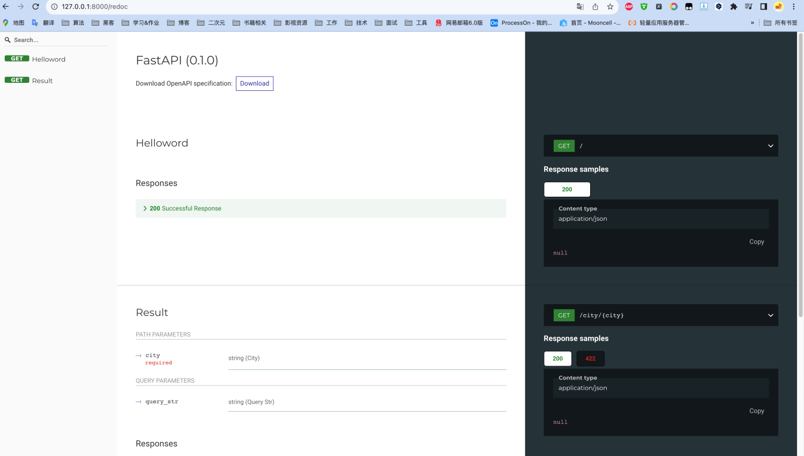
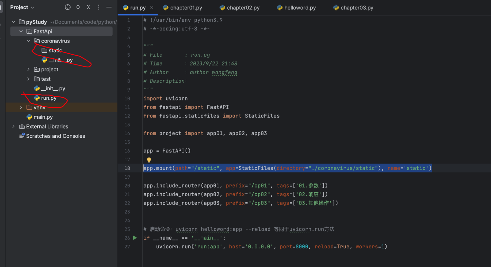
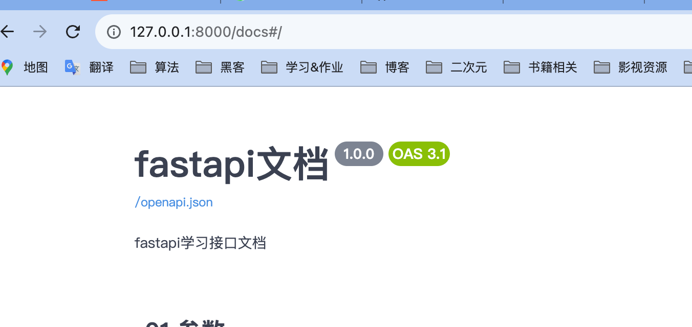

### git : [仓库](https://gitee.com/gyhdx/python-study.git)

### 1.环境配置
安装fastapi与相关的环境包
```powershell
pip install fastapi

pip install "uvicorn[standard]"

pip install sqlalchemy
pip3 install python-jose
pip install passlib
pip install jose
# pip install uvicorn
pip install python-multipart
pip install fastapi
pip install email_validator
pip3 install pyDantic
```
安装完成后就可以使用了

### 2.helloWord
```python
"""
# File       : test.py
"""
from fastapi import FastAPI

app = FastAPI()


@app.get("/")
def read_root():
    return {"Hello": "World"}


if __name__ == '__main__':
    print('Hi, wf')
```
在文件目录下使用命令
```shell
uvicorn test:app --reload
```
在浏览器访问[http://127.0.0.1:8000](http://127.0.0.1:8000/hello)<br />就可以看到结果
```json
{
  "hello": "word"
}
```

#### 查看swagger文档
访问[http://127.0.0.1:8000/docs#/](http://127.0.0.1:8000/docs#/)<br />


#### 查看redoc文档
[http://127.0.0.1:8000/redoc](http://127.0.0.1:8000/redoc)<br />




### 3.路径参数的解析与验证

先给一个各类参数定义<br />[http://127.0.0.1:8000/cp01/query/bool/conversion?param=a](http://127.0.0.1:8000/cp01/query/bool/conversion?param=a)

- 查询参数：该参数位于url的问好后面类似于param就是
- 路径参数：该参数位于url的？之前，cinversion就可以看作一个路径参数
- 请求体参数：post请求时所携带的json数据参数


#### 函数顺序就是路由顺序
```python
from fastapi import APIRouter, Path, Query, Cookie, Header
from typing import Optional, List
from enum import Enum
from pydantic import BaseModel, Field

app01 = APIRouter()

"""路径参数与数字验证"""

@app01.get("/path/param")
def path_params01():
    return {"msg": "this is param01"}


# 函数顺序就是路由顺序
# 路径相同时会现匹配第一个匹配到的路由
@app01.get("/path/{param}")
def path_params01(param: str):
    return {"msg": param}

```

#### 传递枚举
```python
# 传递枚举

class CityName(str, Enum):
    Beijing = 'bj'
    Shanghai = 'sh'


@app01.get("/enum/{city}")
async def enumTest(city: CityName):
    if city == CityName.Beijing:
        return {"cityName": city, "number": 222}
    if city == CityName.Shanghai:
        return {"cityName": city, "number": 333}
    return {"msg": "city nuke"}

```

#### 传递文件名称时的处理
在参数后面加path参数
```python

# 传递文件名称时的处理   在参数后面加path参数
@app01.get("/fileName/{filepath:path}")
def filePath(filepath: str):
    return f"the file path {filepath}"
```

#### 数字参数验证
```python
# 数字参数验证
@app01.get("/numb/{num}")
def pathParamValidate(
        num: int = Path(..., title="this is a number", description="none", ge=1, le=10)
):
    return {"num is": num}
```

#### 选填参数 optional可以将参数变为选填
```python
# 选填参数 optional可以将参数变为选填
@app01.get("/city/{city}")
def result(city: str, query_str: Optional[str] = None):
    if query_str:
        return {"city": city, "query_str": query_str}
    return {"city": city}
```

#### bool参数转换 
yes no 1 Ture ture会转换为bool类型  无法转换为bool类型的会报错
```python
# bool参数转换 yes no 1 Ture ture会转换为bool类型  无法转换为bool类型的会报错
@app01.get("/query/bool/conversion")
def boolConversion(param: bool = False):
    return {"param is ": param}
```

#### 查询参数与字符串的验证
```python
# 查询参数与字符串的验证
@app01.get("/query/validate")
def queryParamValidate(
        value: str = Query(..., min_length=8, max_length=16, regex="^a"),
        values: List[str] = Query(default=['v1', 'v2'], alias="list")
):
    return value, values
```

#### post请求
```python
# post请求请求体的设置
class CityInfo(BaseModel):
    name: str = Field(...,)
    country: str
    # optional 与直接写bool的区别是optional可以不传值，有默认为null
    isAffected: Optional[bool] = None
    num: int = Field(default=2, title="数量", description="城市人口数量", ge=1, le=1000)

    class Config:
        schema_extra = {
            "example": {
                "name": 'ef',
                "country": "hz",
                "num": 1,
            }
        }


@app01.post("/requestBody/city")
def cityInfo(city: CityInfo):
    print(city.num, city.name)
    return city.dict()
```

#### 混合各类型参数
```python
# 混合各类型参数
@app01.put("/requestBody/maxParam/city/{name}")
def mixParam(
        name: str,
        city: CityInfo,
        num: int = Query(ge=0, description="cans", default=0),
        death: int = Query(ge=0, description="第二个参数", default=0)
):
    if name == "wf":
        return {"myName": name,"city": city.dict(), "num": num, "death":death}
    return city.dict()
```

#### 获取cookie与header
```python
"""设置cookie与header"""


@app01.get("/cookie/param")
def cookieParam(cookieId: str = Cookie(None)):
    return {"cookie_id": cookieId}


@app01.get("/header/param")
def headerParam(
        user_agent: Optional[str] = Header(None, convert_underscores=True),
        x_token: List[str] = Header(None, convert_underscores=True)
):
    """
    有些HTTP代理和服务器是不允许在请求头中带有下划线的，所以Header提供convert underscores
    :param user._agent:convert_underscores=True会把user_agent变成user-agent
    :param x_token:x_token是包含多个值的列表
    return:
    """
    return {"userAgent": user_agent, "x_token": x_token}
```

#### 响应类型配置
```python
from fastapi import APIRouter, status, Form, File, UploadFile
from pydantic import BaseModel
from typing import List, Optional

app02 = APIRouter()


class UserIn(BaseModel):
    name: str
    password: str
    email: str
    mobile: str = "10086"
    address: str = None
    fullName: Optional[str] = None


class UserOut(BaseModel):
    name: str
    email: str
    mobile: str = "10086"
    address: str = None
    fullName: Optional[str] = None


users = {
    "user01": {"name": "wf", "password": "wwww", "email": "wangfeng@166.com", "address": "zh"},
    "user02": {"name": "gx", "password": "wwww", "email": "wangfeng@166.com", "address": "zh"}
}


@app02.post("/responseModel", response_model=UserOut, response_model_exclude_unset=False)
def respModel(user: UserIn):
    """response_model_exclude_unset=True表示默认值不包含在响应中，仅包含实际给的值，如果实际给的值与默认值相同也会包含在响应中"""
    return users['user01']


@app02.post("/responseModel2",
            response_model=UserOut,
            # response_model=Union[UserOut, UserIn],
            # response_model=List[UserOut],
            # response_model_exclude=["name"],
            response_model_exclude_unset=False)
def respModel2(user: UserIn):
    """response_model_exclude_unset=True表示默认值不包含在响应中，仅包含实际给的值，如果实际给的值与默认值相同也会包含在响应中"""
    return users['user01']

```

#### 响应状态码
```python
# 响应状态码
@app02.post("/statusCode", status_code=200)
def statusCode():
    return {"code": 200}


@app02.post("/statusCode2", status_code=status.HTTP_200_OK)
def statusCode2():
    return {"code": status.HTTP_200_OK}
```

#### 表单数据处理
```python
'''表单数据处理'''


@app02.post("/login")
def login(user: str = Form(...), password: str = Form(...)):
    """ 使用from需要安装pip install python-multipart """
    return {"name": user, "password": password}
```

#### 文件上传
```python
'''文件上传'''


@app02.post("/fileUpload")
async def fileUpload(file: bytes = File(...)):
    """使用File类文件内容会以bytes,的形式读入内存适合于上传小文件"""
    return {"file.__sizeof__()": len(file)}


@app02.post("/fileUpload2")
async def fileUpload2(files: List[UploadFile] = File(...)):
    """
    使用UploadFile类的优势：
    1.文件存储在内存中，使用的内存达到阈值后，将被保存在磁盘中
    2.适合于图片、视缬大文件
    3.可以获取上传的文件的元数据，如文件名，创建时间等
    4.有文件对象的异步接
    """
    for file in files:
        contents = await file.read()
        print(contents)
    return {"filename": files[0].filename, "type": files[0].content_type}
```
#### fastApi的静态文件处理

```python
app.mount(path="/static", app=StaticFiles(directory="./coronavirus/static"), name='static')
```
文件结构<br />



#### 路径配置参数
```python
@app02.post(
    "/path_operation_configuration",
    response_model=UserOut,
    tags=["Path", "Operation", "Configuration"],
    summary="This is summary",
    description="This is description",
    response_description="This is response description",
    deprecated=True,
    status_code=status.HTTP_200_OK
)
async def path_operation_configuration(user: UserIn):
    """
    Path Operation Configuration路径操作配置
    :param user:用户信息
    return:返回结果
    """
    return user.model_dump()
```
#### fastapi的swagger文档常见配置
```python
app = FastAPI(
    title="fastapi文档",
    description="fastapi学习接口文档",
    version="1.0.0",
    docs_url="/docs",
    redoc_url="/redoes"
              )

```


### 4.错误处理
#### 手动处理
```python
@app02.get("/httpException")
def exceptionDell(city: str):
    if city != "bj":
        raise HTTPException(status_code=401, detail="City Not Found!")
    return {"city": city}
```
#### 全局处理
```python
from fastapi.exceptions import RequestValidationError
from fastapi.responses import PlainTextResponse
from starlette.exceptions import HTTPException as StarletteHTTPException

# 重写默认异常处理
@app.exception_handler(StarletteHTTPException)
async def httpExceptionHandler(request, exc):
    """

    :param request:
    :param exc:
    :return:
    """
    return PlainTextResponse(str(exc.detail), status_code=exc.status_code)


@app.exception_handler(RequestValidationError)
async def validationExceptionHandler(request, exc):
    """

    :param request:
    :param exc:
    :return:
    """
    return PlainTextResponse(str(exc.detail), status_code=400)
```
### 5.依赖处理
#### 注入一个函数

```python
from fastapi import APIRouter, Depends, Header, HTTPException

from typing import Optional

app03 = APIRouter()

"""注入一个函数"""


async def commonParam(q: Optional[str] = None, page: int = 1, limit: int = 10):
    return {"q": q, "page": page, "limit": limit}


@app03.get("/dependency01")
def depend01(common: dict = Depends(commonParam)):
    return common


@app03.get("/dependency02")
async def depend02(common: dict = Depends(commonParam)):
    return common
```

#### 注入一个类
```python
"""注入一个类"""

fake_data = [{"item_name": 'FOO'}, {"item_name": 'wf'}, {"item_name": 'wfwf'}]


class CommonParams:
    def __init__(self, q: Optional[str] = None, page: int = 1, limit: int = 100):
        self.q = q
        self.page = page
        self.limit = limit


@app03.get("/class_dependency01")
async def class_depend02(common=Depends(CommonParams)):
# async def class_depend02(common: CommonParams = Depends()):
# async def class_depend02(common: CommonParams = Depends(CommonParams)):
    response = {}
    if common.q:
        response.update({"q", common.q})

    items = fake_data[common.page: common.page + common.limit]
    response.update({"items": items})
    return response
```

#### 子依赖
```python
"""子依赖"""


def query(q: Optional[str] = None):
    return q


def subQuery(q: str = Depends(query), lastNum: Optional[str] = None):
    if not q:
        return lastNum
    return q


@app03.get("/subDepency")
def subDependency(finalQuery: str = Depends(subQuery, use_cache=True)):
    """userCache是Depends的默认True，当多个依赖有一个共同的子依赖时，会讲第一次的值存在chche中"""
    return {"sub_dependency": finalQuery}
```

#### 路径操作中导入依赖 (可以用作一些header消息的校验)
```python
'''路径操作中导入依赖'''


async def verify_token(x_token: str = Header(...)):
    if x_token != "test_number":
        raise HTTPException(status_code=400, detail="x_token is invalid")
    return x_token


async def verify_key(x_key: str = Header(...)):
    if x_key != "test_number":
        raise HTTPException(status_code=400, detail="x_key is invalid")
    return x_key


@app03.get("/dependencyInPath", dependencies=[Depends(verify_token), Depends(verify_key)])
async def dependencyInPath():
    return [{"user": 'user1'},{"user","user2"}]

```

#### 全局依赖
```python


"""全局依赖"""
# app03 = APIRouter(dependencies=[Depends(verify_token), Depends(verify_key)])
```
### 6.跨域处理
```python
from fastapi.middleware.cors import CORSMiddleware
'''跨域处理'''
app.add_middleware(
    CORSMiddleware,
    allow_origins=[
        "http://127.0.0.1",
        "http://127.0.0.1:8080",
    ],
    allow_credentials=True,
    allow_method=["*"],
    allow_header=["*"],
)
```
### 7.异步任务
```python
from typing import Optional

from fastapi import APIRouter, BackgroundTasks, Depends


def bg_task(framework: str):
    with open("README.md", mode="a") as f:
        f.write(f"## {framework} 框架精讲")


@app08.post("/background_tasks")
async def run_bg_task(framework: str, background_tasks: BackgroundTasks):
    """
    :param framework: 被调用的后台任务函数的参数
    :param background_tasks: FastAPI.BackgroundTasks
    :return:
    """
    background_tasks.add_task(bg_task, framework)
    return {"message": "任务已在后台运行"}


def continue_write_readme(background_tasks: BackgroundTasks, q: Optional[str] = None):
    if q:
        background_tasks.add_task(bg_task, "\n> 整体的介绍 FastAPI，快速上手开发，结合 API 交互文档逐个讲解核心模块的使用\n")
    return q


@app08.post("/dependency/background_tasks")
async def dependency_run_bg_task(q: str = Depends(continue_write_readme)):
    if q:
        return {"message": "README.md更新成功"}
```
