##  1.环境配置

参考视频

https://www.bilibili.com/video/BV1c84y1N7iL/?p=6&spm_id_from=pageDriver&vd_source=d22bedeb38db35b332be1cdfe61e8123

安装pyside

```shell
 pip install pyside6 -i http://pypi.douban.com/simple --trusted-host pypi.douban.com
```

安装pyside6工具

https://www.cnblogs.com/Node-Sans-Blog/p/13588857.html

##  2.基础框架

```python
from PySide6.QtWidgets import QApplication, QWidget, QVBoxLayout


class MyWindow(QWidget):
    def __init__(self):
        super().__init__()
        
        mainLayout = QVBoxLayout()
        self.setLayout(mainLayout)

if __name__ == '__main__':
    app = QApplication([])
    window = MyWindow()
    window.show()
    app.exec()
```

##   3.qtdesigner

详情见**Qt Designer 使用全攻略 _ 智伤帝的个人博客** 

##  4.常用控件

###  resize方法控制界面大小

```python
class MyWindow(QWidget):
    def __init__(self):
        super().__init__()
        self.resize(300, 200)
        mainLayout = QVBoxLayout()
        self.setLayout(mainLayout)
```


###  Qlabel与QLineEdit 文本框与输入框

#### enum QLineEdit::EchoMode

This enum type describes how a line edit should display its contents.

| Constant                        | Value | Description                                                |
| ------------------------------- | ----- | ---------------------------------------------------------- |
| `QLineEdit::Normal`             | `0`   | 在输入字符时显示字符。这是默认设置。                       |
| `QLineEdit::NoEcho`             | `1`   | 不显示任何内容。这可能适用于甚至密码长度都应该保密的密码。 |
| `QLineEdit::Password`           | `2`   | 显示平台相关的密码掩码字符，而不是实际输入的字符。         |
| `QLineEdit::PasswordEchoOnEdit` | `3`   | 在编辑时显示输入的字符，否则显示字符，如`Password`。       |

```python
class MyWindow(QWidget):
    def __init__(self):
        super().__init__()
        
        self.mainLayout = QFormLayout()
        self.mainLayout.addRow('账号', QLineEdit())
        self.mainLayout.addRow('密码', QLineEdit())
        self.mainLayout.addRow(QPushButton('登录'))
        self.setLayout(self.mainLayout)
        

if __name__ == '__main__':
    app = QApplication([])
    window = MyWindow()
    window.show()
    app.exec()
```

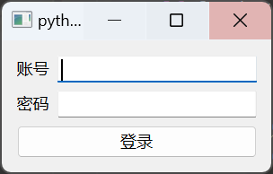


###  QComboBox 下拉框

#### Public Slots

| void | **[clear](http://127.0.0.1:8271/qt_5/doc.qt.io/qt-5/qcombobox.html#clear)**() |
| ---- | ------------------------------------------------------------ |
| void | **[clearEditText](http://127.0.0.1:8271/qt_5/doc.qt.io/qt-5/qcombobox.html#clearEditText)**() |
| void | **[setCurrentIndex](http://127.0.0.1:8271/qt_5/doc.qt.io/qt-5/qcombobox.html#currentIndex-prop)**(int *index*) |
| void | **[setCurrentText](http://127.0.0.1:8271/qt_5/doc.qt.io/qt-5/qcombobox.html#currentText-prop)**(const QString &*text*) |
| void | **[setEditText](http://127.0.0.1:8271/qt_5/doc.qt.io/qt-5/qcombobox.html#setEditText)**(const QString &*text*) |

#### Signals

| void | **[activated](http://127.0.0.1:8271/qt_5/doc.qt.io/qt-5/qcombobox.html#activated)**(int *index*) |
| ---- | ------------------------------------------------------------ |
| void | **[activated](http://127.0.0.1:8271/qt_5/doc.qt.io/qt-5/qcombobox.html#activated-1)**(const QString &*text*) |
| void | **[currentIndexChanged](http://127.0.0.1:8271/qt_5/doc.qt.io/qt-5/qcombobox.html#currentIndexChanged)**(int *index*) |
| void | **[currentIndexChanged](http://127.0.0.1:8271/qt_5/doc.qt.io/qt-5/qcombobox.html#currentIndexChanged-1)**(const QString &*text*) |
| void | **[currentTextChanged](http://127.0.0.1:8271/qt_5/doc.qt.io/qt-5/qcombobox.html#currentTextChanged)**(const QString &*text*) |
| void | **[editTextChanged](http://127.0.0.1:8271/qt_5/doc.qt.io/qt-5/qcombobox.html#editTextChanged)**(const QString &*text*) |
| void | **[highlighted](http://127.0.0.1:8271/qt_5/doc.qt.io/qt-5/qcombobox.html#highlighted)**(int *index*) |
| void | **[highlighted](http://127.0.0.1:8271/qt_5/doc.qt.io/qt-5/qcombobox.html#highlighted-1)**(const QString &*text*) |

使用

```python
def callStr(number):
    print(number)
    
class MyWindow(QWidget):
    def __init__(self):
        super().__init__()
        self.comboxFun()

    def comboxFun(self):
        cb = QComboBox()
        cb.addItems(['张三', '李四', '文武'])
        cb.currentTextChanged.connect(callStr)
        cb.currentIndexChanged.connect(callStr)

        miglayout = QVBoxLayout()
        miglayout.addWidget(cb)
        self.setLayout(miglayout)
```

效果

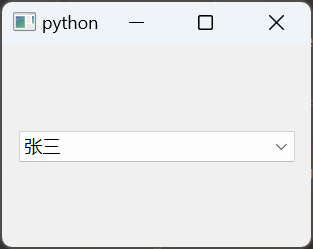

主要参数

    cb.currentTextChanged.connect(callStr)
    cb.currentIndexChanged.connect(callStr)

会显示下拉框的参数（text和index）

###  QCheckBox 多选框

```python
def showState(state):
    print(state)

def checkBoxFun(self):
    cb = QCheckBox('是否被选中')
    cb.stateChanged.connect(showState)

    btn = QPushButton('获取状态')
    btn.clicked.connect(lambda: print(cb.isChecked()))

    miglayout = QVBoxLayout()
    miglayout.addWidget(cb)
    miglayout.addWidget(btn)
    self.setLayout(miglayout)
```

效果

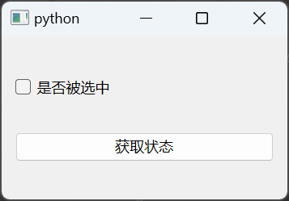

0表示未被选中，2表示选中了。

###  QRadioBox 单选框

两个主要的类QRadioButton和QButtonGroup

QRadioButton是一个具体的按钮，QRadioButtonGroup的作用是给具体的按钮分组。

案例

```python
from PySide6.QtWidgets import QWidget, QApplication, QLabel, QRadioButton, QHBoxLayout, QVBoxLayout, QButtonGroup


class MyWindow(QWidget):
    def __init__(self):
        super().__init__()

        # 分组1
        self.group1 = QButtonGroup(self)
        label1 = QLabel('请选择你的编程语言')
        btn1 = QRadioButton("Python")
        btn2 = QRadioButton("JavaScript")
        btn3 = QRadioButton("C++")
        btn4 = QRadioButton("Java")
        self.group1.addButton(btn1)
        self.group1.addButton(btn2)
        self.group1.addButton(btn3)
        self.group1.addButton(btn4)

        btn1.clicked.connect(self.change_text)
        btn2.clicked.connect(self.change_text)
        btn3.clicked.connect(self.change_text)
        btn4.clicked.connect(self.change_text)

        # 分组2
        self.group2 = QButtonGroup(self)
        label2 = QLabel('请输入你平均敲代码的时间')
        btn5 = QRadioButton("1 hour")
        btn6 = QRadioButton("2 hours")
        btn7 = QRadioButton("3 hours")
        btn8 = QRadioButton("4 hours")
        self.group2.addButton(btn5)
        self.group2.addButton(btn6)
        self.group2.addButton(btn7)
        self.group2.addButton(btn8)

        btn5.clicked.connect(self.change_text)
        btn6.clicked.connect(self.change_text)
        btn7.clicked.connect(self.change_text)
        btn8.clicked.connect(self.change_text)

        # 显示的标签
        self.label_show = QLabel('请选择编程语言和时间！')

        # 调整布局
        h1 = QHBoxLayout()
        h1.addWidget(label1)
        h1.addWidget(btn1)
        h1.addWidget(btn2)
        h1.addWidget(btn3)
        h1.addWidget(btn4)

        h2 = QHBoxLayout()
        h2.addWidget(label2)
        h2.addWidget(btn5)
        h2.addWidget(btn6)
        h2.addWidget(btn7)
        h2.addWidget(btn8)

        mainLayout = QVBoxLayout()
        mainLayout.addLayout(h1)
        mainLayout.addLayout(h2)
        mainLayout.addWidget(self.label_show)

        self.setLayout(mainLayout)

    def change_text(self):
        language = self.group1.checkedButton()  # 返回按钮组中被选中的按钮
        time = self.group2.checkedButton()  # 返回按钮组中被选中的按钮
        if language is not None and time is not None:
            self.label_show.setText(
                f'你的编程语言是：{language.text()}，你平均敲代码的时间是：{time.text()}')


if __name__ == '__main__':
    app = QApplication([])
    window = MyWindow()
    window.show()
    app.exec()
     
```

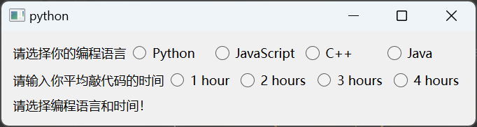

###  QEditText/QEditPlainText  富文本框/文本框

####   QEditPlainText  Slots

| void | **[appendHtml](http://127.0.0.1:8271/qt_5/doc.qt.io/qt-5/qplaintextedit.html#appendHtml)**(const QString &*html*) |
| ---- | ------------------------------------------------------------ |
| void | **[appendPlainText](http://127.0.0.1:8271/qt_5/doc.qt.io/qt-5/qplaintextedit.html#appendPlainText)**(const QString &*text*) |
| void | **[centerCursor](http://127.0.0.1:8271/qt_5/doc.qt.io/qt-5/qplaintextedit.html#centerCursor)**() |
| void | **[clear](http://127.0.0.1:8271/qt_5/doc.qt.io/qt-5/qplaintextedit.html#clear)**() |
| void | **[copy](http://127.0.0.1:8271/qt_5/doc.qt.io/qt-5/qplaintextedit.html#copy)**() |
| void | **[cut](http://127.0.0.1:8271/qt_5/doc.qt.io/qt-5/qplaintextedit.html#cut)**() |
| void | **[insertPlainText](http://127.0.0.1:8271/qt_5/doc.qt.io/qt-5/qplaintextedit.html#insertPlainText)**(const QString &*text*) |
| void | **[setPlainText](http://127.0.0.1:8271/qt_5/doc.qt.io/qt-5/qplaintextedit.html#setPlainText)**(const QString &*text*) |

#### QEditText Slots

| void | **[append](http://127.0.0.1:8271/qt_5/doc.qt.io/qt-5/qtextedit.html#append)**(const QString &*text*) |
| ---- | ------------------------------------------------------------ |
| void | **[insertHtml](http://127.0.0.1:8271/qt_5/doc.qt.io/qt-5/qtextedit.html#insertHtml)**(const QString &*text*) |
| void | **[insertPlainText](http://127.0.0.1:8271/qt_5/doc.qt.io/qt-5/qtextedit.html#insertPlainText)**(const QString &*text*) |
| void | **[paste](http://127.0.0.1:8271/qt_5/doc.qt.io/qt-5/qtextedit.html#paste)**() |
| void | **[setAlignment](http://127.0.0.1:8271/qt_5/doc.qt.io/qt-5/qtextedit.html#setAlignment)**(Qt::Alignment *a*) |
| void | **[setCurrentFont](http://127.0.0.1:8271/qt_5/doc.qt.io/qt-5/qtextedit.html#setCurrentFont)**(const QFont &*f*) |
| void | **[setFontFamily](http://127.0.0.1:8271/qt_5/doc.qt.io/qt-5/qtextedit.html#setFontFamily)**(const QString &*fontFamily*) |
| void | **[setFontItalic](http://127.0.0.1:8271/qt_5/doc.qt.io/qt-5/qtextedit.html#setFontItalic)**(bool *italic*) |
| void | **[setFontPointSize](http://127.0.0.1:8271/qt_5/doc.qt.io/qt-5/qtextedit.html#setFontPointSize)**(qreal *s*) |
| void | **[setFontUnderline](http://127.0.0.1:8271/qt_5/doc.qt.io/qt-5/qtextedit.html#setFontUnderline)**(bool *underline*) |
| void | **[setFontWeight](http://127.0.0.1:8271/qt_5/doc.qt.io/qt-5/qtextedit.html#setFontWeight)**(int *weight*) |
| void | **[setHtml](http://127.0.0.1:8271/qt_5/doc.qt.io/qt-5/qtextedit.html#html-prop)**(const QString &*text*) |
| void | **[setPlainText](http://127.0.0.1:8271/qt_5/doc.qt.io/qt-5/qtextedit.html#setPlainText)**(const QString &*text*) |
| void | **[setText](http://127.0.0.1:8271/qt_5/doc.qt.io/qt-5/qtextedit.html#setText)**(const QString &*text*) |
| void | **[setTextBackgroundColor](http://127.0.0.1:8271/qt_5/doc.qt.io/qt-5/qtextedit.html#setTextBackgroundColor)**(const QColor &*c*) |
| void | **[setTextColor](http://127.0.0.1:8271/qt_5/doc.qt.io/qt-5/qtextedit.html#setTextColor)**(const QColor &*c*) |

```python
        textEdit = QPlainTextEdit()
        textEdit.setPlainText('这是一个大标题')
        textEdit.appendPlainText('这是一个段落')

        edit = QTextEdit()
        edit.setMarkdown("""------


##  1.这是一个测试文档


- 的11
- cc


> this is lllll""")

        btn = QPushButton('追加文本')
        btn.clicked.connect(lambda: textEdit.appendPlainText('这是一个段落'))

        mainLayout = QVBoxLayout()
        mainLayout.addWidget(edit)
        mainLayout.addWidget(textEdit)
        mainLayout.addWidget(btn)
        self.setLayout(mainLayout)
```

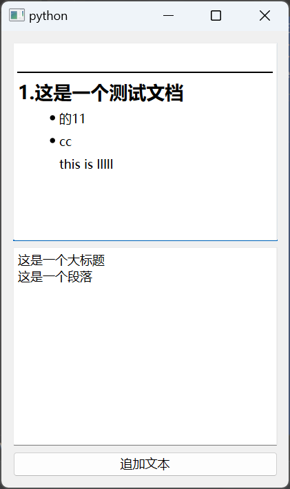

###  Qslider 滑块

| Signal                                                       | Description                                                  |
| ------------------------------------------------------------ | ------------------------------------------------------------ |
| [valueChanged](http://127.0.0.1:8271/qt_5/doc.qt.io/qt-5/qabstractslider.html#valueChanged)() | Emitted when the slider's value has changed. The tracking() determines whether this signal is emitted during user interaction. |

```python
        slider = QSlider(Qt.Orientation.Horizontal)
        slider.setRange(0, 20)

        # 设置刻度
        slider.setTickPosition(QSlider.TickPosition.TicksBelow)
        # 设置刻度间隔
        slider.setTickInterval(5)

        slider.valueChanged.connect(self.showValue)

        mainLayout = QVBoxLayout()
        mainLayout.addWidget(slider)
        self.setLayout(mainLayout)

    def showValue(self, value):
        # sl = self.sender()
        # print(sl.value())
        print(value)
```

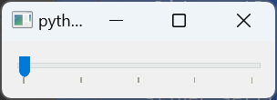

###  常见布局控件

- QVBoxLayout  垂直控件
- QHBoxLayout  水平布局
- QFormLayout  表单控件,行用row控制
- QGridLayout  网格控件，就是一个二维表格，通过参数控制各个控件在二维数组中的位置与控件大小

```python
class MyWindow(QWidget):
    def __init__(self):
        super().__init__()
        self.gridLayout = None
        self.mainLayout = None
        self.gridLay()
        # self.hvlay()
        # self.formLay()


    def gridLay(self):
        self.mainLayout = QVBoxLayout()  # 垂直控件

        self.gridLayout = QGridLayout()  # 网格控件
        # 网格控件后面第一个参数表示控件所在行，第二个参数表示列
        self.gridLayout.addWidget(QLabel('用户名'), 0, 0)
        self.gridLayout.addWidget(QLineEdit(), 0, 1)

        self.gridLayout.addWidget(QLabel('密码'), 1, 0)
        self.gridLayout.addWidget(QLineEdit(), 1, 1)

        # 网格控件后面第三个参数表示控件所占行数，第二个参数表示控件所占列数
        self.gridLayout.addWidget(QPushButton('登陆'), 2, 0, 1, 2)

        self.mainLayout.addLayout(self.gridLayout)
        self.setLayout(self.mainLayout)

    def hvlay(self):
        mainLay = QVBoxLayout()  # 垂直布局
        userLay = QHBoxLayout()  # 水平布局
        userLay.addWidget(QLabel("用户名"))
        userLay.addWidget(QLineEdit())

        passLay = QHBoxLayout()
        passLay.addWidget(QLabel("密码"))
        passLay.addWidget(QLineEdit())

        mainLay.addLayout(userLay)
        mainLay.addLayout(passLay)
        mainLay.addWidget(QPushButton("登录"))
        self.setLayout(mainLay)

    # 表单控件
    def formLay(self):
        self.mainLayout = QFormLayout()
        self.mainLayout.addRow('账号', QLineEdit())
        self.mainLayout.addRow('密码', QLineEdit())
        self.mainLayout.addRow(QPushButton('登录'))
        # self.mainLayout.addWidget(QPushButton('登录'))
        self.setLayout(self.mainLayout)
```

###  综合案例

````python
class MyWindow(QWidget):
    def __init__(self):
        super().__init__()

        self.mainLayout = QVBoxLayout()
        self.lb1 = QLabel('标签1')
        self.lb1.setText('标签1被修改了')
        self.lb1.setAlignment(Qt.AlignmentFlag.AlignCenter)
        self.btn1 = QPushButton('按钮1')

        self.lineedit = QLineEdit()
        self.lineedit.setPlaceholderText('请输入内容')
        self.lineedit.setEchoMode(QLineEdit.EchoMode.Password)

        self.cb1 = QComboBox()
        self.cb1.setPlaceholderText('请选择')
        self.cb1.addItems(['选项1', '选项2', '选项3'])
        self.cb1.removeItem(0)

        self.checkBox1 = QCheckBox('复选框1')
        self.checkBox1.setChecked(True)
        self.checkBox2 = QCheckBox('复选框2')

        # 创建单选按钮组
        self.genderNan = QRadioButton('男')
        self.genderNv = QRadioButton('女')

        # 创建单选按钮组
        self.favoriteGroup = QButtonGroup()
        self.radiobtnMath = QRadioButton('数学')
        self.radiobtnChinese = QRadioButton('语文')
        self.favoriteGroup.addButton(self.radiobtnMath)
        self.favoriteGroup.addButton(self.radiobtnChinese)

        markdownStr = """# 标题1

```python
def hello():
    return 'hello'
```

- 1
- 2
- 3

---

这是一段正常的文字
        """

        # 创建文本框
        self.richText = QTextEdit()
        self.richText.setPlaceholderText('请输入内容')
        self.richText.setMarkdown(markdownStr)
        # self.richText.setHtml('<h1>标题1</h1><p>这是一段正常的文字</p>')
        # self.richText.setPlainText('这是一段正常的文字')

        self.plainText = QPlainTextEdit()
        self.plainText.setPlainText('这是纯文本框')

        self.slider = QSlider()
        self.slider.setOrientation(Qt.Orientation.Horizontal)
        self.slider.setTickPosition(QSlider.TickPosition.TicksBelow)
        self.slider.setTickInterval(10)
        self.slider.setRange(0, 200)

        # 布局添加控件
        self.mainLayout.addWidget(self.lb1)
        self.mainLayout.addWidget(self.btn1)
        self.mainLayout.addWidget(self.lineedit)
        self.mainLayout.addWidget(self.cb1)
        self.mainLayout.addWidget(self.checkBox1)
        self.mainLayout.addWidget(self.checkBox2)
        self.mainLayout.addWidget(self.genderNan)
        self.mainLayout.addWidget(self.genderNv)
        self.mainLayout.addWidget(self.radiobtnMath)
        self.mainLayout.addWidget(self.radiobtnChinese)
        self.mainLayout.addWidget(self.richText)
        self.mainLayout.addWidget(self.plainText)
        self.mainLayout.addWidget(self.slider)
        self.setLayout(self.mainLayout)
        self.bind()

    def bind(self):
        self.btn1.clicked.connect(self.btn1_clicked)
        self.lineedit.returnPressed.connect(self.lineedit_returnPressed)
        self.lineedit.textChanged.connect(self.lineedit_textChanged)
        self.cb1.currentTextChanged.connect(self.cbTextChanged)
        self.checkBox2.stateChanged.connect(self.cb2Changed)
        self.checkBox1.stateChanged.connect(self.cb1Changed)

        # 单选按钮的信号与槽的绑定
        self.genderNan.clicked.connect(lambda: print('男'))
        self.genderNv.clicked.connect(lambda: print('女'))
        self.favoriteGroup.buttonClicked.connect(self.whichButtonClick)

        self.richText.textChanged.connect(lambda: print('文本框内容发生了变化'))
        self.slider.valueChanged.connect(lambda x: print('滑块的值发生了变化:', x))

    def btn1_clicked(self):
        print('按钮1被点击了')

    def lineedit_textChanged(self, text):
        print('文本框内容发生了变化:', text)

    def lineedit_returnPressed(self):
        print('文本框回车了')
        print('文本框的内容是:', self.lineedit.text())

    def cbTextChanged(self, text):
        print('下拉框内容发生了变化:', text)

    def cb1Changed(self, state):
        print('复选框1状态发生了变化:', state)

    def cb2Changed(self):
        print(f'复选框2状态为: {self.checkBox2.isChecked()}')

    def whichButtonClick(self):
        print('单选按钮组被点击了')
        print('选中的是:', self.favoriteGroup.checkedButton().text())
````

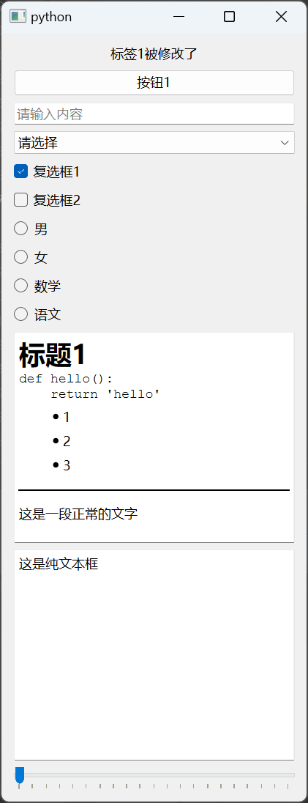

##  5.Dialog 对话框

有三种级别

- 无dialog
- message级：会浮在应用最上层，不关闭无法操作本体应用，不影响其他应用的使用
- application级：浮在系统层面，不关闭无法操作本体及其他应用

###  QMessage 信息提示框

#### Static Public Members

| void           | **[about](http://127.0.0.1:8271/qt_5/doc.qt.io/qt-5/qmessagebox.html#about)**(QWidget **parent*, const QString &*title*, const QString &*text*) |
| -------------- | ------------------------------------------------------------ |
| void           | **[aboutQt](http://127.0.0.1:8271/qt_5/doc.qt.io/qt-5/qmessagebox.html#aboutQt)**(QWidget **parent*, const QString &*title* = QString()) |
| StandardButton | **[critical](http://127.0.0.1:8271/qt_5/doc.qt.io/qt-5/qmessagebox.html#critical)**(QWidget **parent*, const QString &*title*, const QString &*text*, StandardButtons *buttons* = Ok, StandardButton *defaultButton* = NoButton) |
| StandardButton | **[information](http://127.0.0.1:8271/qt_5/doc.qt.io/qt-5/qmessagebox.html#information)**(QWidget **parent*, const QString &*title*, const QString &*text*, StandardButtons *buttons* = Ok, StandardButton *defaultButton* = NoButton) |
| StandardButton | **[question](http://127.0.0.1:8271/qt_5/doc.qt.io/qt-5/qmessagebox.html#question)**(QWidget **parent*, const QString &*title*, const QString &*text*, StandardButtons *buttons* = StandardButtons( Yes \| No ), StandardButton *defaultButton* = NoButton) |
| StandardButton | **[warning](http://127.0.0.1:8271/qt_5/doc.qt.io/qt-5/qmessagebox.html#warning)**(QWidget **parent*, const QString &*title*, const QString &*text*, StandardButtons *buttons* = Ok, StandardButton *defaultButton* = NoButton) |

[QMessageBox](http://127.0.0.1:8271/qt_5/doc.qt.io/qt-5/qmessagebox.html)支持四种预定义的消息严重性级别或消息类型，它们实际上只在它们各自显示的预定义图标中有所不同。通过将[icon](http://127.0.0.1:8271/qt_5/doc.qt.io/qt-5/qmessagebox.html#icon-prop)属性设置为[预定义图标](http://127.0.0.1:8271/qt_5/doc.qt.io/qt-5/qmessagebox.html#Icon-enum)之一来指定四种预定义消息类型中的一种。以下规则是指导方针:

|  | [Question](http://127.0.0.1:8271/qt_5/doc.qt.io/qt-5/qmessagebox.html#Icon-enum) | For asking a question during normal operations.    |
| ----------------------------------- | ------------------------------------------------------------ | -------------------------------------------------- |
|   | [Information](http://127.0.0.1:8271/qt_5/doc.qt.io/qt-5/qmessagebox.html#Icon-enum) | For reporting information about normal operations. |
|   | [Warning](http://127.0.0.1:8271/qt_5/doc.qt.io/qt-5/qmessagebox.html#Icon-enum) | For reporting non-critical errors.                 |
|   | [Critical](http://127.0.0.1:8271/qt_5/doc.qt.io/qt-5/qmessagebox.html#Icon-enum) | For reporting critical errors.                     |

####  按钮状态

```python
class StandardButton(enum.Flag):

    NoButton                 : QDialogButtonBox.StandardButton = ... # 0x0
    FirstButton              : QDialogButtonBox.StandardButton = ... # 0x400
    Ok                       : QDialogButtonBox.StandardButton = ... # 0x400
    Save                     : QDialogButtonBox.StandardButton = ... # 0x800
    SaveAll                  : QDialogButtonBox.StandardButton = ... # 0x1000
    Open                     : QDialogButtonBox.StandardButton = ... # 0x2000
    Yes                      : QDialogButtonBox.StandardButton = ... # 0x4000
    YesToAll                 : QDialogButtonBox.StandardButton = ... # 0x8000
    No                       : QDialogButtonBox.StandardButton = ... # 0x10000
    NoToAll                  : QDialogButtonBox.StandardButton = ... # 0x20000
    Abort                    : QDialogButtonBox.StandardButton = ... # 0x40000
    Retry                    : QDialogButtonBox.StandardButton = ... # 0x80000
    Ignore                   : QDialogButtonBox.StandardButton = ... # 0x100000
    Close                    : QDialogButtonBox.StandardButton = ... # 0x200000
    Cancel                   : QDialogButtonBox.StandardButton = ... # 0x400000
    Discard                  : QDialogButtonBox.StandardButton = ... # 0x800000
    Help                     : QDialogButtonBox.StandardButton = ... # 0x1000000
    Apply                    : QDialogButtonBox.StandardButton = ... # 0x2000000
    Reset                    : QDialogButtonBox.StandardButton = ... # 0x4000000
    LastButton               : QDialogButtonBox.StandardButton = ... # 0x8000000
    RestoreDefaults          : QDialogButtonBox.StandardButton = ... # 0x8000000
```

案例

```python
class MyWindow(QWidget):
    def __init__(self):
        super().__init__()

        self.btn = QPushButton('按钮')
        self.btn.clicked.connect(self.btnClicked)

        self.mainLayout = QVBoxLayout()
        self.mainLayout.addWidget(self.btn)
        self.setLayout(self.mainLayout)

    def btnClicked(self):
        replay = QMessageBox.information(self, '你好', '你好，世界！', QMessageBox.StandardButton.Ok |
                                         QMessageBox.StandardButton.No | QMessageBox.StandardButton.Discard
                                         , QMessageBox.StandardButton.Ok)
        # replay = QMessageBox.question()
        # replay = QMessageBox.warning()
        # replay = QMessageBox.critical()
        # replay = QMessageBox.about()
        print(replay)
        if replay == QMessageBox.StandardButton.Ok:
            print('你点击了OK')
        elif replay == QMessageBox.StandardButton.No:
            print('你点击了No')
        elif replay == QMessageBox.StandardButton.Discard:
            print('你点击了Discard')
```

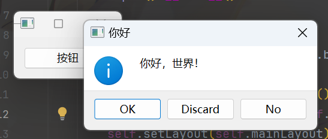

###  QInputDialog输入框

####  Static Public Members

| double  | **[getDouble](http://127.0.0.1:8271/qt_5/doc.qt.io/qt-5/qinputdialog.html#getDouble)**(QWidget **parent*, const QString &*title*, const QString &*label*, double *value* = 0, double *min* = -2147483647, double *max* = 2147483647, int *decimals* = 1, bool **ok* = Q_NULLPTR, Qt::WindowFlags *flags* = Qt::WindowFlags()) |
| ------- | ------------------------------------------------------------ |
| int     | **[getInt](http://127.0.0.1:8271/qt_5/doc.qt.io/qt-5/qinputdialog.html#getInt)**(QWidget **parent*, const QString &*title*, const QString &*label*, int *value* = 0, int *min* = -2147483647, int *max* = 2147483647, int *step* = 1, bool **ok* = Q_NULLPTR, Qt::WindowFlags *flags* = Qt::WindowFlags()) |
| QString | **[getItem](http://127.0.0.1:8271/qt_5/doc.qt.io/qt-5/qinputdialog.html#getItem)**(QWidget **parent*, const QString &*title*, const QString &*label*, const QStringList &*items*, int *current* = 0, bool *editable* = true, bool **ok* = Q_NULLPTR, Qt::WindowFlags *flags* = Qt::WindowFlags(), Qt::InputMethodHints *inputMethodHints* = Qt::ImhNone) |
| QString | **[getMultiLineText](http://127.0.0.1:8271/qt_5/doc.qt.io/qt-5/qinputdialog.html#getMultiLineText)**(QWidget **parent*, const QString &*title*, const QString &*label*, const QString &*text* = QString(), bool **ok* = Q_NULLPTR, Qt::WindowFlags *flags* = Qt::WindowFlags(), Qt::InputMethodHints *inputMethodHints* = Qt::ImhNone) |
| QString | **[getText](http://127.0.0.1:8271/qt_5/doc.qt.io/qt-5/qinputdialog.html#getText)**(QWidget **parent*, const QString &*title*, const QString &*label*, QLineEdit::EchoMode *mode* = QLineEdit::Normal, const QString &*text* = QString(), bool **ok* = Q_NULLPTR, Qt::WindowFlags *flags* = Qt::WindowFlags(), Qt::InputMethodHints *inputMethodHints* = Qt::ImhNone) |

```python
class MyWindow(QWidget):
    def __init__(self):
        super().__init__()

        btn1 = QPushButton('获取一个整形数字')
        btn1.clicked.connect(self.getIntDialog)

        btn2 = QPushButton('获取一个浮点数字')
        btn2.clicked.connect(self.getFloatDialog)

        btn3 = QPushButton('获取一个Item')
        btn3.clicked.connect(
            lambda: print(QInputDialog.getItem(self, '标题', '内容', ['小王', '小丽', '小明'], 0, False)))

        btn4 = QPushButton('获取单行文字')
        btn4.clicked.connect(
            lambda: print(QInputDialog.getText(self, '标题', '内容', QLineEdit.EchoMode.Normal, '默认值')))

        btn5 = QPushButton('获取多行文字')
        btn5.clicked.connect(lambda: print(QInputDialog.getMultiLineText(self, '标题', '内容')))

        self.mainLayout = QVBoxLayout()
        self.mainLayout.addWidget(btn1)
        self.mainLayout.addWidget(btn2)
        self.mainLayout.addWidget(btn3)
        self.mainLayout.addWidget(btn4)
        self.mainLayout.addWidget(btn5)
        self.setLayout(self.mainLayout)

    def getIntDialog(self):
        # 参数含义，self：当前窗体，第二个参数：diglog的标题，第三个参数：窗体显示的内容，第四个参数默认值。最小值，最大值，点击一次的步长（即一次加的值）
        replay, ok = QInputDialog.getInt(self, '标题', '内容', 1, 0, 100, 1)

        if ok:
            print(replay)

    def getFloatDialog(self):
        replay, ok = QInputDialog.getDouble(self, '标题', '内容', 1.0, 0.0, 100.0, 1)
        print(replay)
```

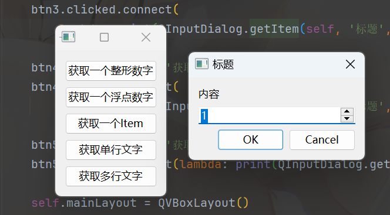

###  QFileDialog 文件选取Dialog

#### Static Public Members

| QString     | **[getExistingDirectory](http://127.0.0.1:8271/qt_5/doc.qt.io/qt-5/qfiledialog.html#getExistingDirectory)**(QWidget **parent* = Q_NULLPTR, const QString &*caption* = QString(), const QString &*dir* = QString(), Options *options* = ShowDirsOnly) |
| ----------- | ------------------------------------------------------------ |
| QString     | **[getOpenFileName](http://127.0.0.1:8271/qt_5/doc.qt.io/qt-5/qfiledialog.html#getOpenFileName)**(QWidget **parent* = Q_NULLPTR, const QString &*caption* = QString(), const QString &*dir* = QString(), const QString &*filter* = QString(), QString **selectedFilter* = Q_NULLPTR, Options *options* = Options()) |
| QStringList | **[getOpenFileNames](http://127.0.0.1:8271/qt_5/doc.qt.io/qt-5/qfiledialog.html#getOpenFileNames)**(QWidget **parent* = Q_NULLPTR, const QString &*caption* = QString(), const QString &*dir* = QString(), const QString &*filter* = QString(), QString **selectedFilter* = Q_NULLPTR, Options *options* = Options()) |
| QString     | **[getSaveFileName](http://127.0.0.1:8271/qt_5/doc.qt.io/qt-5/qfiledialog.html#getSaveFileName)**(QWidget **parent* = Q_NULLPTR, const QString &*caption* = QString(), const QString &*dir* = QString(), const QString &*filter* = QString(), QString **selectedFilter* = Q_NULLPTR, Options *options* = Options()) |

1. 选取文件夹 `QFileDialog.getExistingDirectory()`
2. 选择文件 `QFileDialog.getOpenFileName()`
3. 选择多个文件 `QFileDialog.getOpenFileNames()`
4. 选择保存文件 `QFileDialog.getSaveFileName()`

**文件筛选参数设置**

在 `QFileDialog.getOpenFileName()`、 `QFileDialog.getOpenFileNames()`、 `QFileDialog.getSaveFileName()` 中有一个设置文件扩展名过滤的参数[**具体见源代码中注释**]。其中设置文件扩展名过滤,用`双分号`间隔。eg : `"All Files (*);;PDF Files (*.pdf);;Text Files (*.txt)`

**返回值`filetype`**

在 `QFileDialog.getOpenFileName()`、 `QFileDialog.getOpenFileNames()`、 `QFileDialog.getSaveFileName()` 有两个返回值，直接查询QT文档，发现QT中只有一个`QString`类型的返回值，经过测验，这个返回值是你选择的`文件`的绝对目录，

```python
class MyWindow(QWidget):
    def __init__(self):
        super().__init__()

        btn = QPushButton('选择文件')
        btn.clicked.connect(lambda: print(QFileDialog.getOpenFileName(self, '选择文件这是标题', '.',
                                                                      '所有文件(*.py);;音频文件(*.mp3 *.mp4 *.music)')))

        btn2 = QPushButton('打开多个文件')
        btn2.clicked.connect(lambda: print(QFileDialog.getOpenFileNames(self, '选择文件这是标题', '.',
                                                                        '所有文件(*.py);;音频文件(*.mp3 *.mp4 *.music)')))

        btn3 = QPushButton('选择文件夹')
        btn3.clicked.connect(lambda: print(QFileDialog.getExistingDirectory(self, '选择文件夹这是标题', '.')))

        btn4 = QPushButton('保存文件')
        btn4.clicked.connect(lambda: print(QFileDialog.getSaveFileName(self, '保存文件这是标题', '.',
                                                                       '所有文件(*.py);;音频文件(*.mp3 *.mp4 *.music)')))

        self.mainLayout = QVBoxLayout()
        self.mainLayout.addWidget(btn)
        self.mainLayout.addWidget(btn2)
        self.mainLayout.addWidget(btn3)
        self.mainLayout.addWidget(btn4)
        self.setLayout(self.mainLayout)
```

return：

```shell
('D:/code/python/pyqtStudy/study/00studyBase.py', '所有文件(*.py)')
(['D:/code/python/pyqtStudy/study/02EditText.py', 'D:/code/python/pyqtStudy/study/04布局控件.py'], '所有文件(*.py)')
('', '')
D:/code/python/pyqtStudy/test
```

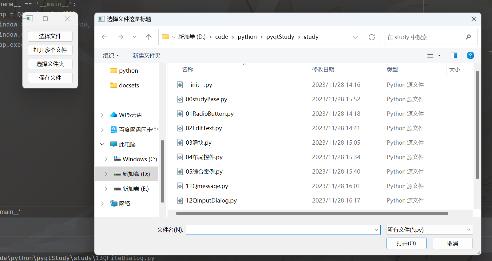

### QFontDialog /QColorDialog  字体/字体颜色

获取一个颜色与字体

```python
class MyWindow(QWidget):
    def __init__(self):
        super().__init__()

        self.edit = QTextEdit()
        self.btn = QPushButton('点我选择字体')
        self.btn.clicked.connect(self.changeFont)
        self.edit.setText("this is a text")

        self.colorBtn = QPushButton("选择字体颜色")
        self.colorBtn.clicked.connect(self.changeColor)

        self.mainLayout = QVBoxLayout()
        self.mainLayout.addWidget(self.edit)
        self.mainLayout.addWidget(self.btn)
        self.mainLayout.addWidget(self.colorBtn)
        self.setLayout(self.mainLayout)

    def changeFont(self):
        ok, color = QFontDialog.getFont()
        if not ok:
            return
        self.edit.setFont(color)

    def changeColor(self):
        font = QColorDialog.getColor()
        self.edit.setTextColor(font)
```

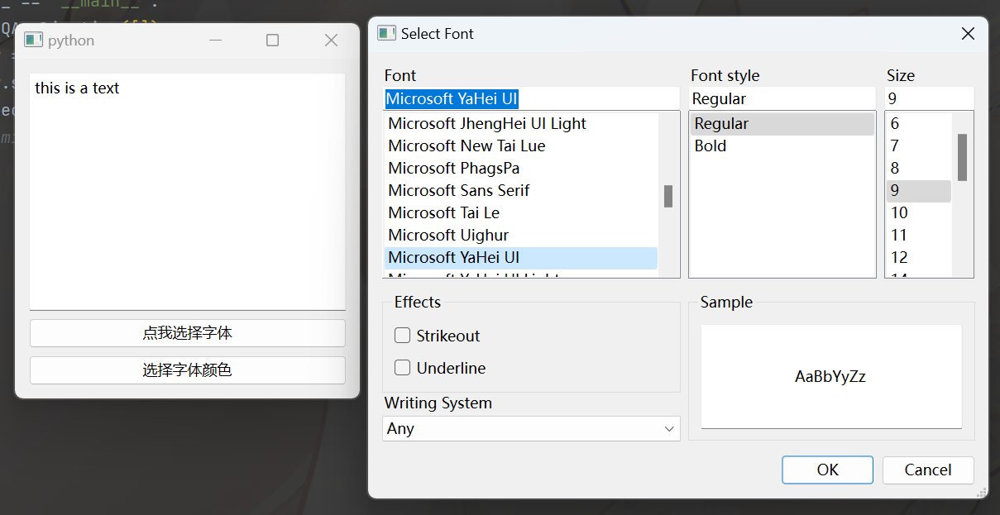

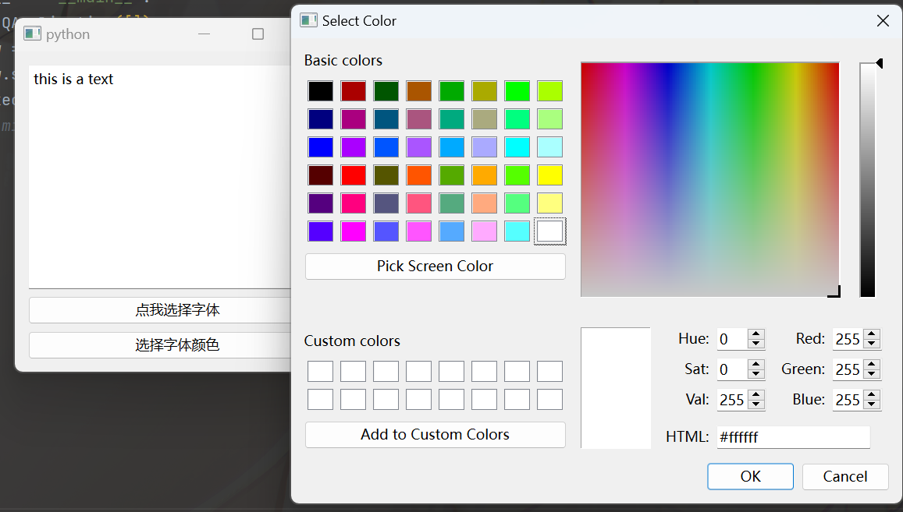

## 6.窗口相关

###  窗口操作

- show
- close
- hide

```python
class MyWindow(QWidget):
    def __init__(self):
        super().__init__()
        self.resize(300, 200)

        # 此处要使用self否则子窗口会被回收，不能持久存在
        # cWindow = ChildWindow()
        # cWindow.show()
        self.cWindow = ChildWindow()
        self.cWindow.show()

        self.btnClose = QPushButton('关闭子窗口')
        self.btnClose.clicked.connect(lambda: self.cWindow.close())

        self.btnShow = QPushButton('显示子窗口')
        self.btnShow.clicked.connect(lambda: self.cWindow.show())

        self.btnHide = QPushButton('隐藏子窗口')
        self.btnHide.clicked.connect(lambda: self.cWindow.hide())

        self.mainLayout = QVBoxLayout()
        lab = QLabel('这个是主窗口')
        self.mainLayout.addWidget(lab)
        self.mainLayout.addWidget(self.btnClose)
        self.mainLayout.addWidget(self.btnShow)
        self.mainLayout.addWidget(self.btnHide)
        self.setLayout(self.mainLayout)


class ChildWindow(QWidget):
    def __init__(self):
        super().__init__()
        self.lb = QLabel('这个是子窗口')
        self.lineEdit = QLineEdit()
        self.lineEdit.setText('这是子窗口的文本框')

        self.mainLayout = QVBoxLayout()
        self.mainLayout.addWidget(self.lb)
        self.mainLayout.addWidget(self.lineEdit)
        self.setLayout(self.mainLayout)
```

###  signal信号-窗口之间的传值

通过from PySide6.QtCore import Signal实现。

代码

```python
class MyWindow(QWidget):
    sendMsgToChild = Signal(str)

    def __init__(self):
        super().__init__()
        self.cWind = None
        self.resize(300, 200)
        mainLayout = QVBoxLayout()
        self.text = QLineEdit()
        self.text.setText("this is main win msg")

        self.btn = QPushButton("send msg to child")

        mainLayout.addWidget(self.text)
        mainLayout.addWidget(self.btn)
        self.setLayout(mainLayout)
        self.bind()

    def bind(self):
        self.cWind = ChildWindow()
        self.cWind.show()

        self.sendMsgToChild.connect(self.cWind.lineEdit.setText)
        self.btn.clicked.connect(self.sendMsg)

    def sendMsg(self):
        # text = self.text.text()
        # self.cWind.lineEdit.setText(text)
        # emit函数的作用是把信号空间的变化同步给signal对象槽中的函数
        self.sendMsgToChild.emit(self.text.text())


class ChildWindow(QWidget):
    def __init__(self):
        super().__init__()
        self.setWindowTitle('this is child win')
        self.lb = QLabel('这个是子窗口')
        self.lineEdit = QLineEdit()
        # self.lineEdit.setText('这是子窗口的文本框')

        self.mainLayout = QVBoxLayout()
        self.mainLayout.addWidget(self.lb)
        self.mainLayout.addWidget(self.lineEdit)
        self.setLayout(self.mainLayout)
```

##  7.菜单栏

有两种菜单：

- 最上层的菜单栏
- 右键菜单栏

###  菜单栏

要使用菜单栏类需要继承QMainWindow类，在self.menuBar()中添加各类菜单，menu是一个大类包含子menu与action。action是一个具体的动作

```python
class MyWindow(QMainWindow):
    def __init__(self):
        super().__init__()
        self.resize(300, 200)

        # 添加动作
        self.openFile = QAction(self.style().standardIcon(QStyle.StandardPixmap.SP_DirOpenIcon), '打开文件')
        self.closeFile = QAction(self.style().standardIcon(QStyle.StandardPixmap.SP_DriveFDIcon), '关闭文件')

        # 添加菜单
        self.fileMenu = QMenu('file')
        self.fileMenu.addAction(self.openFile)
        self.fileMenu.addAction(self.closeFile)

        self.moreMenu = QMenu('more')
        moreAction = QAction('more action')
        self.addAction(moreAction)
        self.moreMenu.addAction('更多2菜单')
        self.fileMenu.addMenu(self.moreMenu)

        # 把菜单添加进菜单栏
        self.menuBar().addMenu(self.fileMenu)
        self.menuBar().addMenu(self.moreMenu)

        mainLayout = QVBoxLayout()
        self.setLayout(mainLayout)

        self.openFile.triggered.connect(lambda: print('打开文件'))
        self.closeFile.triggered.connect(lambda: print('关闭文件'))
        moreAction.triggered.connect(lambda: print('更多1'))
```

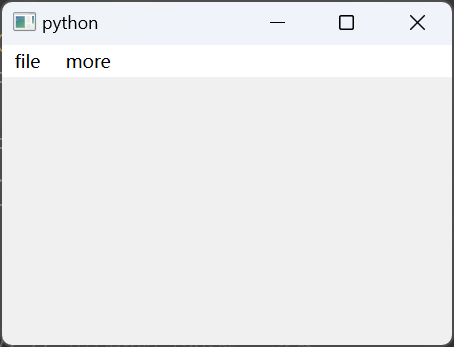

###  上下文菜单--右键菜单

对窗体中的控件添加菜单，

```python
class MyWindow(QWidget):
    def __init__(self):
        super().__init__()
        self.resize(300, 200)

        # 对窗体进行上下文菜单的添加
        self.setContextMenuPolicy(Qt.ContextMenuPolicy.ActionsContextMenu)
        self.openFile = QAction('打开文件')
        self.closeFile = QAction('关闭文件')
        self.addActions([self.openFile, self.closeFile])

        self.lineEdit1 = QLineEdit()
        self.lineEdit2 = QLineEdit()

        # 对单个控件进行上下文菜单的添加
        self.lineEdit1.setContextMenuPolicy(Qt.ContextMenuPolicy.ActionsContextMenu)
        self.sendValue = QAction('把值发送输入框2')
        self.showCurrentValue = QAction('显示当前值')
        self.lineEdit1.addActions([self.sendValue, self.showCurrentValue])

        mainLayout = QVBoxLayout()
        mainLayout.addWidget(self.lineEdit1)
        mainLayout.addWidget(self.lineEdit2)
        self.setLayout(mainLayout)
        self.bind()

    def bind(self):
        self.openFile.triggered.connect(lambda: print('打开文件'))
        self.closeFile.triggered.connect(lambda: print('关闭文件'))
        self.sendValue.triggered.connect(lambda: self.lineEdit2.setText(self.lineEdit1.text()))
        self.showCurrentValue.triggered.connect(lambda: print(self.lineEdit1.text()))
```

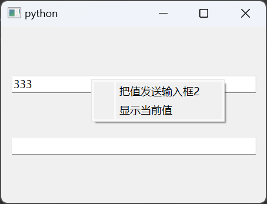

###  折叠选项框

类似qq的用户组

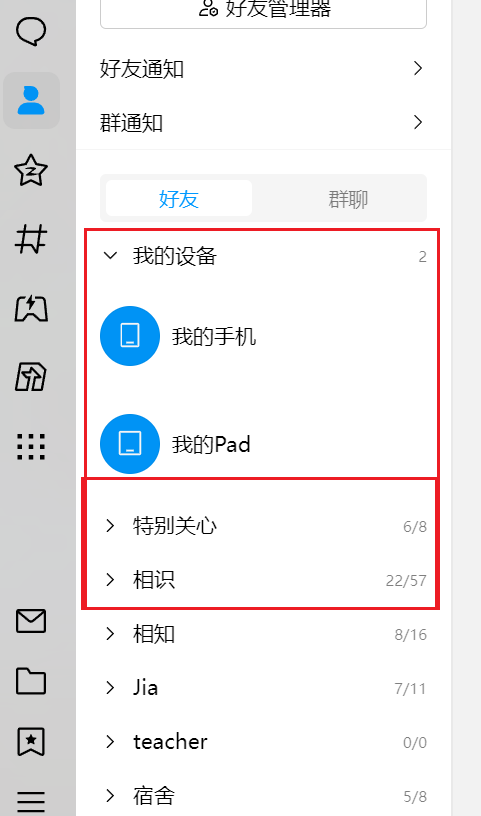

实现：

```python
class MyWindow(QWidget):
    def __init__(self):
        super().__init__()
        self.resize(300, 200)

        self.toolBox = QToolBox()

        # 创建一个右箭头图标和一个下箭头图标
        self.arrowRight = self.style().standardPixmap(QStyle.StandardPixmap.SP_ArrowRight)
        self.arrowDown = self.style().standardPixmap(QStyle.StandardPixmap.SP_ArrowDown)

        # 创建折叠选项卡内容
        self.widget1 = QWidget()
        self.widget1Layout = QVBoxLayout()
        self.widget1Layout.addWidget(QLabel('这是第1个选项卡'))
        self.widget1Layout.addWidget(QPushButton('按钮1'))
        self.widget1.setLayout(self.widget1Layout)

        self.widget2 = QWidget()
        self.widget2Layout = QVBoxLayout()
        self.widget2Layout.addWidget(QLabel('这是第2个选项卡'))
        self.widget2Layout.addWidget(QPushButton('按钮2'))
        self.widget2.setLayout(self.widget2Layout)

        self.widget3 = QWidget()
        self.widget3Layout = QVBoxLayout()
        self.widget3Layout.addWidget(QLabel('这是第2个选项卡'))
        self.widget3Layout.addWidget(QPushButton('按钮2'))
        self.widget3.setLayout(self.widget3Layout)

        self.toolBox.addItem(self.widget1, self.arrowRight, '选项卡1')
        self.toolBox.addItem(self.widget2, self.arrowRight, '选项卡2')
        self.toolBox.addItem(self.widget3, self.arrowRight, '选项卡3')

        self.toolBox.currentChanged.connect(self.onCurrentChanged)

        self.mainLayout = QVBoxLayout()
        self.mainLayout.addWidget(self.toolBox)
        self.setLayout(self.mainLayout)

    def onCurrentChanged(self, index):
        # 全部重置为右箭头
        for i in range(self.toolBox.count()):
            self.toolBox.setItemIcon(i, self.arrowRight)

        self.toolBox.setItemIcon(index, self.arrowDown)
```

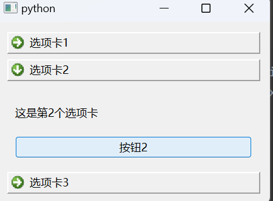

##   8.资源的加载

###  内置图标

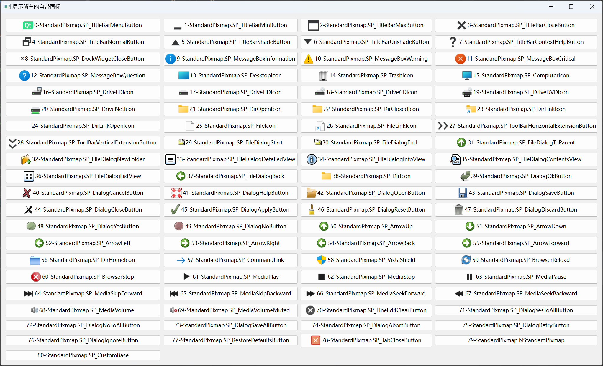

###  资源系统-qrc

> 引用自https://muzing.top/posts/75a2283d/

#### Qt 资源系统简介

Qt 资源系统（[The Qt Resource System](https://doc.qt.io/qt-6/resources.html)）是一种独立于平台的资源管理器，用于在应用程序的可执行文件中存储二进制文件。对 PyQt 而言，这意味着在 Python 代码中直接以二进制形式存储图标、[QSS](https://muzing.top/posts/28a1d80f/)、长文本翻译等资源文件。使用 Qt 资源管理系统可以有效防止资源文件丢失，对于需要打包发布的 PyQt 程序尤其实用。

在项目中使用 Qt 资源系统，大致分为三个步骤：编写 `.qrc` 文件、使用 rcc 编译资源、导入与使用。下文将一一详细讲解。

#### qrc 文件

##### 简介与示例

Qt 资源集合文件（Qt Resource Collection File）一般以 `.qrc` 作为扩展名保存，故简称 `.qrc` 文件。其文件格式基于 [XML](https://www.wikiwand.com/en/XML)，用于将文件系统（硬盘）中的资源文件与 Qt 应用程序关联起来。`.qrc` 还可以实现为资源分组、设置别名等功能。

下面是一个简单的例子：

`Resources` 目录下包含图标、关于文档等资源文件。

```SHELL
$ tree Resources
Resources
├── Icons
│   ├── Py2exe-GUI_icon_72px.png
│   └── Python_128px.png
├── Texts
│   └── About_zh.md
└── resources.qrc
```

在此处新建一个 `resources.qrc` 文件，内容如下：

```XML
<!DOCTYPE RCC>
<RCC>
    <qresource>
        <file>Icons/Py2exe-GUI_icon_72px.png</file>
        <file>Icons/Python_icon.ico</file>
        <file>Texts/About_zh.md</file>
    </qresource>
</RCC>
```

注意文件的相对路径是以 `.qrc` 所在的目录 `Resources\` 为根目录开始计算的。

这样便建立了硬盘上文件系统中原文件与 Qt 资源系统中[资源路径](https://muzing.top/posts/75a2283d/#资源路径)之间的联系。

##### 使用前缀进行分组

在文件系统中，可以通过目录对不同类型的资源进行分组。在上面的例子中，图标文件都在 `Icons/` 目录下，而长文本在 `Texts/` 下。在 `.qrc` 中，也可以通过指定 `<qresource>` 标签的 `prefix` 属性来对资源进行分组：

```XML
<!DOCTYPE RCC>
<RCC>
    <qresource prefix="icons">
        <file>Icons/Py2exe-GUI_icon_72px.png</file>
        <file>Icons/Python_icon.ico</file>
    </qresource>
    <qresource prefix="texts">
        <file>Texts/About_zh.md</file>
    </qresource>
</RCC>
```

##### 为资源创建别名

有些资源的文件名很长，每次使用时都输入完整文件名较为繁琐。可以通过在 `<file>` 标签中添加 `alias` 属性为其创建别名，方便未来在[资源路径](https://muzing.top/posts/75a2283d/#资源路径)中使用：

```XML
<!DOCTYPE RCC>
<RCC>
    <qresource prefix="icons">
        <file alias="Py2exe-GUI_icon">Icons/Py2exe-GUI_icon_72px.png</file>
        <file alias="Python_icon">Icons/Python_icon.ico</file>
    </qresource>
    <qresource prefix="texts">
        <file alias="About_Text">Texts/About_zh.md</file>
    </qresource>
</RCC>
```

#### 使用 rcc 编译资源

##### rcc 简介

Qt 提供了 [Resource Compiler](https://doc.qt.io/qt-6/rcc.html) 命令行工具（简称 rcc），用于在构建过程中将资源嵌入 Qt 应用程序。对于 PyQt，也有对应版本的 rcc 工具，用于将 `.qrc` 中指定的资源文件数据编译至 Python 对象。

##### rcc 的安装与基本使用

当通过 `pip` 安装 PySide6 或其他 PyQt 时，会同时自动安装对应版本的 rcc 工具。这些工具的调用命令有所不同（详见下表），但使用方式与功能是一致的。激活已安装 PyQt 的 Python 虚拟环境，在命令行（注意不是 Python 交互式解释器）中输入对应的 rcc 命令即可。

| 平台    | rcc 命令名称  |
| ------- | ------------- |
| PySide6 | `pyside6-rcc` |
| PyQt5   | `pyrcc5`      |
| PySide2 | `pyside2-rcc` |
| PyQt6   | 不提供        |

使用 PySide6 提供的 `pyside6-rcc` 工具编译出的 `.py` 文件，也可以放入 PyQt6 项目中使用，只需将文件开头的 `from PySide6 import QtCore` 替换为 `from PyQt6 import QtCore` 即可。

例如，对于 PySide6，在命令行调用命令

```SHELL
pyside6-rcc -o compiled_resources.py resources.qrc
```

即可将 `resources.qrc` 中列出的资源文件编译到输出文件 `compiled_resources.py` 中。

##### rcc 命令行选项

此处以 pyside6-rcc 6.4.1 为例，列出了完整的选项列表（翻译版）：

```SHELL
$ pyside6-rcc --help
Usage: /path/to/your/python3/site-packages/PySide6/Qt/libexec/rcc [options] inputs
Qt Resource Compiler version 6.4.1

Options:
  -h, --help                            显示关于命令行选项的帮助
  
  --help-all                            显示包括Qt独有选项在内的所有帮助
  
  -v, --version                         显示版本信息
  
  -o, --output <file>                   将输出写入到 <file> 中，而不是 stdout 中

  -t, --temp <file>                     为大资源文件使用临时文件 <file>
  
  --name <name>                         用 <name> 创建一个外部初始化函数
  
  --root <path>                         用根目录 <path> 作为资源访问路径的前缀
  
  --compress-algo <algo>                使用 <algo> 算法压缩输入文件([zlib], none)
  
  --compress <level>                    按 <level> 级别压缩输入文件
  
  --no-compress                         禁用所有压缩，等同于 --compress-algo=none
  
  --no-zstd                             禁止使用 zstd 压缩
  
  --threshold <level>                   衡量是否值得进行压缩的阈值
  
  --binary                              输出一个作为动态资源使用的二进制文件
  
  -g, --generator <cpp|python|python2>  选择生成器
  
  --pass <number>                       Pass number for big resources
  
  --namespace                           关闭命名空间宏
  
  --verbose                             启用 verbose 模式
  
  --list                                只列出 .qrc 文件条目，不生成代码
  
  --list-mapping                        只输出 .qrc 中定义的资源路径与文件系统路径的
                                        映射，不生成代码
                                        
  -d, --depfile <file>                  向 <file> 中写入一个包含 .qrc 依赖项的 depfile

  --project                             输出一个包含当前目录下所有文件的资源文件
  
  --format-version <number>             写入 RCC 格式的版本

Arguments:
  inputs                                输入文件 (*.qrc)
```

##### 编译出的 Python 文件

运行成功后，在 `.qrc` 中声明的所有资源文件都已经被编译到 `compiled_resources.py` 这个 Python 文件中，不妨打开查看其内容：

```PYTHON
# 以下为 compiled_resources.py 文件中内容

# Resource object code (Python 3)
# Created by: object code
# Created by: The Resource Compiler for Qt version 6.4.1
# WARNING! All changes made in this file will be lost!

from PySide6 import QtCore

qt_resource_data = b"......"

qt_resource_name = b"......"

qt_resource_struct = b"......"

def qInitResources():
    QtCore.qRegisterResourceData(0x03, qt_resource_struct, qt_resource_name, qt_resource_data)

def qCleanupResources():
    QtCore.qUnregisterResourceData(0x03, qt_resource_struct, qt_resource_name, qt_resource_data)

qInitResources()
```

最上方的注释标明了该文件由与 Qt6.4.1 版本匹配的资源编译器生成。并警告用户不要直接编辑该文件，因为所有修改都会被下一次编译操作覆盖掉。

接下来是三段长长的二进制编码字符串，其中正是资源文件：

- `qt_resource_data` - 资源文件内容数据
- `qt_resource_name` - 资源文件名称
- `qt_resource_struct` - 资源结构

还有两个函数 `qInitResources()` 与 `qCleanupResources()`，分别对应向 Qt 中注册资源与清理资源。

代码的最后一行调用了注册资源函数。

#### 在主程序中使用

对于 PyQt 程序，从「直接加载使用资源文件」切换到「使用 Qt 资源系统读取资源」，还需要如下步骤：

1. 在主程序中导入编译后的资源
2. 用「资源路径」替换「文件路径」
3. 由使用 Python 内置 `open()` 函数改为使用 Qt 中 [QFile](https://doc.qt.io/qt-6/qfile.html) 类或 [QDir](https://doc.qt.io/qt-6/qdir.html) 类提供的 `open()` 方法

##### 导入编译后的资源

在主程序中添加 import 导入语句，将刚才获得的 `compiled_resources.py` 导入：

```PYTHON
import compiled_resources  # type: ignore


```

因为 import 的过程会执行该模块中的所有代码，也就自动调用了 `qInitResources()` 函数，完成了资源的注册与加载。

PyCharm 等 IDE 可能将此行代码判断为 “未使用的 import 语句” 而提示一个弱警告。可以通过在该行末尾添加特殊的 `# type: ignore` 注释来显式告知静态检查器忽略此行，消除这种不必要的警告。

##### 资源路径

对于直接使用资源原文件，会使用其在文件系统中的路径，例如

```PYTHON
icon = QPixmap("Icons/Python_icon.ico")


```

而在 Qt 资源系统中使用，则需要将文件路径替换为「资源路径」。资源路径由 `.qrc` 文件决定。

对于最一般的情况，直接在文件名前添加 `:/` 即可得到其资源路径：

```PYTHON
<qresource>
    <file>Icons/Python_icon.ico</file>
</qresource>

XML
icon = QPixmap(":/Icons/Python_icon.ico")


```

对于有前缀进行分组的，则需要在文件名前添加 `:/$prefix$/`作为资源路径：

```PYTHON
<qresource prefix="icons">
    <file>Icons/Python_icon.ico</file>
</qresource>

XML
icon = QPixmap(":/icons/Icons/Python_icon.ico")


```

对于指定了别名的，可以直接使用别名：

```PYTHON
<qresource prefix="icons">
    <file alias="Py_ico">Icons/Python_icon.ico</file>
</qresource>

XML
icon = QPixmap(":/icons/Py_ico")


```

资源路径也可以与 Qt 中的 [QUrl](https://doc.qt.io/qt-6/qurl.html) 系统组合使用，在原有的资源路径前添加 `qrc` 即可：

```PYTHON
QUrl("qrc:/myapp/main.qml")


```

##### 读取资源文件

需要使用 Qt 提供的 [QFile](https://doc.qt.io/qt-6/qfile.html) 或 [QDir](https://doc.qt.io/qt-6/qdir.html) 读取编译后的资源文件，而不再能使用 Python 提供的 `open()` 函数等。

例如，一段从 Markdown 文件中读取应用程序“关于”文本的代码，使用直接读取原资源文件的写法如下：

```PYTHON
def get_about_text():
    about_file = open("Resources/About.md", "r", encoding="utf-8")  # 调用Python内置的open()
    about_text = about_file.read()
    about_file.close()
    return about_text


```

而使用 Qt 资源系统后，需要修改为如下形式：

```PYTHON
from PySide6.QtCore import QFile, QIODevice

def get_about_text():
    # 使用Qt风格读取文本文件
    about_file = QFile(":/texts/About_Text")  # 使用Qt中的QFile类
    about_file.open(QIODevice.ReadOnly | QIODevice.Text)  # 打开文件
    about_text = str(about_file.readAll(), encoding="utf-8")  # 读取文件，并将 QBtyeArray 转为 str
    about_file.close()
    return about_text


```

TODO: 通过自行编写上下文管理器，实现 Python 风格的文件IO.

对于图片，可以在创建 [QIcon](https://doc.qt.io/qt-6/qicon.html)、[QImage](https://doc.qt.io/qt-6/qimage.html)、[QPixmap](https://doc.qt.io/qt-6/qpixmap.html) 对象时将直接资源路径作为参数传入：

```python
icon = QPixmap(":/icons/Python_icon.ico")
```

## 9.美化

#### 直接使用qss主题


- qt_material -- https://github.com/UN-GCPDS/qt-material
- Qtmodern -- https://github.com/gmarull/qtmodern
- QDarkStyleSheet -- https://github.com/ColinDuquesnoy/QDarkStyleSheet
- PyQtDarkTheme -- https://github.com/5yutan5/PyQtDarkTheme

使用；

```python
from PySide6.QtWidgets import QApplication, QWidget, QVBoxLayout, QPushButton, QLineEdit, QSpinBox, QSlider, QComboBox
from PySide6.QtCore import Qt
from qt_material import apply_stylesheet


class MyWindow(QWidget):
    def __init__(self):
        super().__init__()
		...


if __name__ == '__main__':
    app = QApplication([])
    apply_stylesheet(app, theme='light_blue.xml')

    window = MyWindow()
    window.show()
    app.exec()
```

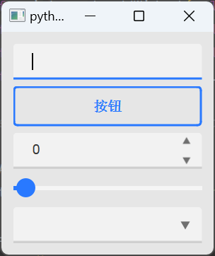

####  隐藏系统标题栏

```python
self.setWindowFlag(Qt.WindowType.FramelessWindowHint)
```

示例：

```python
class MyWidget(QWidget):
    def __init__(self):
        super().__init__()

        # 去除系统标题栏
        self.offsetY = None
        self.offsetX = None
        self.mousePressed = None
        self.setWindowFlags(Qt.WindowType.FramelessWindowHint)

        # 自定义标题栏
        self.titleLabel = QLabel("自定义标题栏")
        self.minimizeButton = QPushButton('最小化')
        self.closeButton = QPushButton('关闭')

        self.hlayout = QHBoxLayout()
        self.hlayout.addWidget(self.titleLabel)
        self.hlayout.addWidget(self.minimizeButton)
        self.hlayout.addWidget(self.closeButton)

        self.setLayout(self.hlayout)

        # 将控件的信号与槽函数关联起来
        self.minimizeButton.clicked.connect(self.showMinimized)
        self.closeButton.clicked.connect(self.close)

    def mousePressEvent(self, event):
        if event.button() == Qt.LeftButton:
            self.mousePressed = True
            self.offsetX = event.globalPosition().x() - self.pos().x()
            self.offsetY = event.globalPosition().y() - self.pos().y()

    def mouseMoveEvent(self, event):
        if self.mousePressed:
            x = event.globalPosition().x() - self.offsetX
            y = event.globalPosition().y() - self.offsetY
            self.move(x, y)

    def mouseReleaseEvent(self, event):
        if event.button() == Qt.LeftButton:
            self.mousePressed = False
```

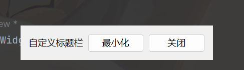

####  PyDracula

> https://github.com/Wanderson-Magalhaes/Modern_GUI_PyDracula_PySide6_or_PyQt6

## 10.常用的高级控件

###  QListWidget

QListWidget 列表控件可以显示多份数据，每份数据习惯称为列表项（简称项），每个列表项都是 QListWidgetItem 类的实例对象。也就是说，QListWidget 中有多少个列表项，就有多少个 QListWidgetItem 类对象。

默认情况下，QListWidget 中每个列表项独自占用一行，每个列表项中可以包含文字、图标等内容。实际开发中，我们还可以将指定的窗口或者控件放置到列表项中显示，例如 QWidget 窗口、QLabel 文本框、QPushButton 按钮、QLineEdit 输入框等。

借助 QListWidgetItem 类，可以轻松管理 QListWidget 中的每个列表项，包括：

- 借助 QListWidgetItemo 类提供的 setIcon()、setText() 等方法，可以轻松地指定每个列表项要包含的内容；
- 借助 QListWidgetItemo 类提供的 setFont()、setBackground() 等方法，可以轻松地设置每个列表项的外观（文字大小、列表项背景等）。

####  增删改查方法

一些需要注意的点：

Qt.MatchFlag[枚举类](https://so.csdn.net/so/search?q=枚举类&spm=1001.2101.3001.7020)定义了以下取值：

- Qt.MatchExactly：表示只有在目标项与搜索项完全匹配时才匹配成功。
- Qt.MatchFixedString：表示搜索项是一个固定字符串，而不是正则表达式。
- Qt.MatchContains：表示目标项包含搜索项即匹配成功。
- Qt.MatchStartsWith：表示目标项以搜索项开头即匹配成功。
- Qt.MatchEndsWith：表示目标项以搜索项结尾即匹配成功。
- Qt.MatchRegExp：表示搜索项是一个正则表达式。

枚举类型Qt.SortOrder用于指定排序是按升序排序还是降序排序，取值及含义如下：

-  AscendingOrder：值为0，表示升序排序
-  DescendingOrder：值为1，表示降序排序


```python
class MyWindow(QWidget):
    def __init__(self):
        super().__init__()
        self.resize(300, 200)

        # 添加一个数字
        fake = Faker(locale='zh_CN')
        self.listWidget = QListWidget()
        self.listWidget.addItem('wf')
        self.listWidget.addItems([fake.name() for _ in range(20)])

        # 插入一个数字
        self.listWidget.insertItem(2, 'gx')
        self.listWidget.insertItems(5, [str(int(random() * 10)) for _ in range(10)])

        # 修改一个元素
        self.listWidget.item(2).setText('yx')

        # 删除
        self.listWidget.insertItem(1, 'dd')
        # self.listWidget.removeItemWidget(self.listWidget.item(1))
        self.listWidget.takeItem(1)

        # 查找一个元素
        # result = self.listWidget.findItems('王', Qt.MatchFlag.MatchContains)
        # for res in result:
        #     pass
        #     # print(res.text())

        # 便利QListWidget元素
        # for i in range(self.listWidget.count()):
        #     print(self.listWidget.item(i).text())

        # 排序
        self.listWidget.sortItems(Qt.SortOrder.AscendingOrder)

        mainLayout = QVBoxLayout()

        self.btn = QPushButton('clear')
        self.btn.clicked.connect(self.clearMsg)

        mainLayout.addWidget(self.listWidget)
        mainLayout.addWidget(self.btn)
        self.setLayout(mainLayout)
        self.bind()

    def bind(self):
        # 常用控件
        self.listWidget.currentItemChanged.connect(self.listChange)
        self.listWidget.itemChanged.connect(lambda: print(self.listWidget.currentItem().checkState()))

    def listChange(self, item):
        print(f'当前选中的值是{item.text()}')

    def clearMsg(self):
        self.listWidget.clear()
```

####  信号和槽

对于给定的 QlistWidget 列表，用户可以选中其中的一个或者某些列表项，甚至还可以修改列表项中的内容。QListWidget 类具有很多信号和槽信息，可以捕捉用户的很多动作，还可以针对用户的动作做出适当地响应。

下表给大家罗列了一些常用的信号和槽函数：

| 信号函数                                                     | 功 能                                                        |
| ------------------------------------------------------------ | ------------------------------------------------------------ |
| itemClicked(QListWidgetItem *item)                           | 用户点击某个列表项时会触发此信号函数，item 参数指的就是被用户点击的列表项。 |
| itemDoubleClicked(QListWidgetItem *item)                     | 用户双击某个列表项时会触发此信号函数，item 参数指的就是被用户双击的列表项。 |
| itemPressed(QListWidgetItem *item)                           | 鼠标按下某个列表项时会触发此信号函数，item 参数指的就是被鼠标按下的列表项， |
| itemSelectionChanged()                                       | 当选择的列表项发生变化时会触发此信号函数。                   |
| currentItemChanged(QListWidgetItem *current, QListWidgetItem *previous) | 当前列表项发生变化时会触发此信号函数，current 参数指的是新选择的列表项；previous 参数指的是先前选择的列表项。 |
| 槽函数                                                       | 功 能                                                        |
| clear()                                                      | 删除列表中的所有列表项。                                     |
| scrollToItem(const QListWidgetItem *item, QAbstractItemView::ScrollHint hint = EnsureVisible) | 用 hint 参数指定的滑动方式，让用户看到指定的 item 列表项。   |
| selectAll()                                                  | 选择所有的列表项。                                           |
| scrollToBottom() scrollToTop()                               | 分别将列表滑动到底部和顶部。                                 |

```python
class MyWindow(QWidget):
    def __init__(self):
        super().__init__()
        self.resize(300, 200)

        # 给窗体添加上下文菜单
        self.sayHello = QAction('你好')
        self.setContextMenuPolicy(Qt.ContextMenuPolicy.ActionsContextMenu)
        self.addAction(self.sayHello)
        self.sayHello.triggered.connect(lambda: print('你好'))

        # 给控件添加上下文菜单
        self.outputCurrentItem = QAction('输出当前选中的值')
        self.listWidget.setContextMenuPolicy(Qt.ContextMenuPolicy.ActionsContextMenu)
        self.listWidget.addAction(self.outputCurrentItem)
        self.outputCurrentItem.triggered.connect(self.outPutCurrentItem)

        self.deleteCurrent = QAction('删除当前元素')
        self.listWidget.addAction(self.deleteCurrent)
        self.deleteCurrent.triggered.connect(lambda: self.listWidget.takeItem(self.listWidget.currentRow()))

        # 将第一个元素设置为能够选中的元素
        self.listWidget.item(0).setCheckState(Qt.CheckState.Unchecked)
        self.listWidget.item(0).setFlags(self.listWidget.item(0).flags() | Qt.ItemFlag.ItemIsUserCheckable)

        self.mainLayout = QVBoxLayout()
        self.mainLayout.addWidget(self.listWidget)
        self.mainLayout.addWidget(self.btn)
        self.setLayout(self.mainLayout)
        self.bind()

    def bind(self):
        self.listWidget.currentItemChanged.connect(self.listChange)
        self.listWidget.itemChanged.connect(lambda: print(self.listWidget.currentItem().checkState()))

    def outPutCurrentItem(self):
        print(self.listWidget.currentItem().text())

    def listChange(self, item):
        print(f'当前选中的值是{item.text()}')

    def clearMsg(self):
        self.listWidget.clear()
```

###  QTableWidget

#### QTableWidget表格的创建

使用 QTableWidget 控件，必须先引入`<QTableWidget>`头文件。

QTableWidget 类提供了 2 个构造函数，分别是：

`QTableWidget(QWidget *parent = Q_NULLPTR)`
`QTableWidget(int rows, int columns, QWidget *parent = Q_NULLPTR)`

第一个构造函数可以在指定的 parent 父窗口中创建一个空的表格，表格中不显示任何单元格（如图 2a) 所示）。第二个构造函数可以在指定的 parent 父窗口中创建一个表格，表格中整齐地排列着 rows 行 columus 列的单元格，每个单元格都是空的（如图 2b) 所示）。


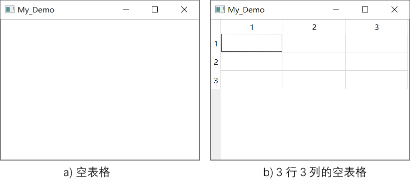
图 2 创建 QTableWidget 表格

实用 QTableWidget 表格之前，必须指定表格的行和列。我们可以直接调用第 2 个构造函数，这样既创建了表格又指定了行和列。当然，也可以调用第 1 个构造函数先创建表格，然后借助 QTableWidget 类提供的成员方法指定行和列，两种方式都可以。

与数组下标类似，QTableWidget 表格单元格的行标和列标都是从 0 开始。例如在图 2b) 中，选中的单元格的坐标是 (0, 0)。

#### QTableWidgetItem单元格

QTableWidget 表格中，每个单元格都是 QTableWidgetItem 类的实例对象。

定义 QTableWidgetItem 类的实例对象之前，程序中要引入`<QTableWidgetItem>`头文件。QTableWidgetItem 类提供了 4 个构造函数：

`QTableWidgetItem(int type = Type)`
`QTableWidgetItem(const QString &text, int type = Type)`
`QTableWidgetItem(const QIcon &icon, const QString &text, int type = Type)`
`QTableWidgetItem(const QTableWidgetItem &other)    //复制（拷贝）构造函数`

text 参数用于指定单元格要显示的文本（字符串），icon 参数用于指定单元格要显示的图标，type 参数配有默认值，很少用到。

QTableWidgetItem 单元格通常用来存放 text 文本和 icon 图标，借助该类提供的 setBackground()、setTextAlignment() 等成员方法，我们可以轻松设置每个单元格的字体、颜色、背景等。

QTableWidgetItem 类还对`<`小于运算符进行了重载，根据各个单元格存储的文本内容（字符串），多个单元格之间可以直接比较大小。借助这一特性，我们可以很轻易地实现“单元格排序”功能。

默认情况下，用户可以选中 QTableWidget 表格中的某个单元格，还可以对目标单元格中的文本内容进行修改。通过设置 QTableWidget 表格，可以禁止用户编辑所有单元格。

QTableWidgetItem 类提供了很多实用的成员方法，其中比较常用的方法如下表所示：


| 成员方法                           | 功 能                        |
| ---------------------------------- | ---------------------------- |
| setText(const QString &text)       | 设置单元格中的文本。         |
| setIcon(const QIcon &icon)         | 给单元格添加图标。           |
| setBackground(const QBrush &brush) | 设置单元格的背景。           |
| setFont(const QFont &font)         | 设置单元格中文本的字体。     |
| setForeground(const QBrush &brush) | 设置单元格中字体的颜色。     |
| setTextAlignment(int alignment)    | 设置单元格中文本的对齐方式。 |
| setToolTip(const QString &toolTip) | 给单元格设置提示信息。       |

#### QTableWidget表格的使用

对于创建好的 QTableWidget 表格，我们可以借助该类提供的成员方法快速地操作它。

QTableWidget 类提供了很多实用的成员方法，它还从父类继承了很多方法，下表给大家罗列了实际场景中操作 QTableWidget 表格用得最多的几个方法，这些方法是初学者必须要掌握的：


| 成员方法                                             | 功 能                                                        |
| ---------------------------------------------------- | ------------------------------------------------------------ |
| setRowCount(int rows)                                | 设置表格的行数。                                             |
| setColumnCount(int columns)                          | 设置表格的列数。                                             |
| setRowHeight(int row, int height)                    | 设置指定行的行高。                                           |
| setColumnWidth(int column, int width)                | 设置指定列的宽度。                                           |
| setCellWidget(int row, int column, QWidget *widget)  | 向表格中的指定位置添加 widget 控件。 通过调用 cellWidget(int row, int column) 方法，可以获取指定位置出的控件。 |
| setHorizontalHeaderLabels(const QStringList &labels) | 设置表格的水平表头。                                         |
| setVerticalHeaderLabels(const QStringList &labels)   | 设置表格的竖直表头。                                         |
| setItem(int row, int column, QTableWidgetItem *item) | 向表格指定位置添加单元格。  获取指定位置的单元格，可以借助 item(int row, int column) 或者 itemAt(int ax, int ay) 方法。 |
| setEditTriggers(EditTriggers triggers)               | 当 triggers 参数值为 QAbstractItemView::NoEditTriggers 时，表示禁止用户编辑单元格。 |
| resize(int w, int h)                                 | 设置表格的尺寸。                                             |
| setFont(const QFont &)                               | 设置表格数据区中文本的字体和大小。                           |

#### QTableWidget信号和槽

QTableWidget 类提供的信号函数，可以监听用户对表格中的哪个单元格进行了何种操作，常见的操作包括点击、双击、按下、编辑等。

下表展示了 QTableWidget 类提供的一些信号函数以及它们各自的功能：


| 信号函数                                  | 功 能                                                        |
| ----------------------------------------- | ------------------------------------------------------------ |
| cellClicked(int row,int column)           | 当某个单元格被点击时，触发该信号，row 和 columu 就是被点击的单元格的位置。 |
| cellDoubleClicked(int row,int column)     | 当某个单元格被双击时，触发该信号，row 和 columu 就是被点击的单元格的位置。 |
| cellEntered(int row,int column)           | 当某个单元格被按下时，触发该信号，row 和 columu 就是被点击的单元格的位置。 |
| cellChanged(int row, int column)          | 当某个单元格中的数据发生改变时，触发该信号，row 和 columu 就是被改变的单元格的位置。 |
| itemClicked(QTableWidgetItem *item)       | 当某个单元格被点击时，触发该信号，item 就是被点击的单元格。  |
| itemDoubleClicked(QTableWidgetItem *item) | 当某个单元格被双击时，触发该信号，item 就是被双击的单元格。  |
| itemEntered(QTableWidgetItem *item)       | 当某个单元格被按下时，触发该信号，item 就是被按下的单元格。  |
| itemChanged(QTableWidgetItem *item)       | 当某个单元格中的数据发生改变时，触发该信号，item 就是被改变的单元格。 |

QTableWiget 表格也可以接收信号并做出相应地响应，例如：


| 槽函数                                                       | 功 能                                                    |
| ------------------------------------------------------------ | -------------------------------------------------------- |
| clear()                                                      | 删除表格中所有单元格的内容，包括表头。                   |
| clearContents()                                              | 不删除表头，仅删除表格中数据区内所有单元格的内容，       |
| insertColumn(int column)                                     | 在表格第 column 列的位置插入一个空列。                   |
| insertRow(int row)                                           | 在表格第 row 行的位置插入一个空行。                      |
| removeColumn(int column)                                     | 删除表格中的第 column 列，该列的所有单元格也会一并删除。 |
| removeRow(int row)                                           | 删除表格中的第 row 行，该行的所有单元格也会一并删除。    |
| scrollToItem(const QTableWidgetItem *item, QAbstractItemView::ScrollHint hint = EnsureVisible) | 滑动到指定的单元格。                                     |

示例

```python
from PySide6.QtWidgets import QApplication, QWidget, QVBoxLayout, QTableWidget, QTableWidgetItem, QHeaderView, \
    QPushButton, QLineEdit, QHBoxLayout
from PySide6.QtGui import QAction
from PySide6.QtCore import Qt
from faker import Faker


class MyWindow(QWidget):
    def __init__(self):
        super().__init__()
        self.fake = Faker(locale='zh_CN')
        self.resize(800, 600)

        # 搜索栏
        self.searchLayout = QHBoxLayout()
        self.lineSearch = QLineEdit()
        # 搜索功能
        self.btnSearch = QPushButton('搜索')
        self.btnSearch.clicked.connect(self.search)
        self.searchLayout.addWidget(self.lineSearch)
        self.searchLayout.addWidget(self.btnSearch)

        # 输出选择数据
        self.btn = QPushButton('输出')
        self.btn.clicked.connect(self.outputSelect)

        self.data = [[self.fake.name(), self.fake.address(), self.fake.ascii_free_email()] for _ in range(80)]
        
        # 新建QTableWidget
        self.table = QTableWidget()
        self.table.setRowCount(80)
        self.table.setColumnCount(3)
        # 设置表头
        self.table.setHorizontalHeaderLabels(['姓名', '地址', '邮箱'])
        # 设置table的缩放
        self.table.horizontalHeader().setSectionResizeMode(QHeaderView.ResizeMode.Stretch)
        # 开启排序
        self.table.setSortingEnabled(True)
        # 设置table元素被点击时的动作
        self.table.itemClicked.connect(
            lambda item: print(f'当前点击了第{item.row()}行，第{item.column()}列，元素叫{item.text()}'))
        # 设置控件上下文
        self.getSelected = QAction('获取选中')
        self.getSelected.triggered.connect(self.outputSelect)
        self.table.setContextMenuPolicy(Qt.ContextMenuPolicy.ActionsContextMenu)
        self.table.addAction(self.getSelected)

        # 在表单中展示数据
        for rowIndex, row in enumerate(self.data):
            for columnIndex, item in enumerate(row):
                self.table.setItem(rowIndex, columnIndex, QTableWidgetItem(item))

        # 设置item的字体颜色
        self.table.item(0, 0).setForeground(Qt.GlobalColor.red)

        # 合并单元格，row，col，row宽，col宽
        self.table.setSpan(0, 0, 2, 2)

        self.mainLayout = QVBoxLayout()
        self.mainLayout.addLayout(self.searchLayout)
        self.mainLayout.addWidget(self.table)
        self.mainLayout.addWidget(self.btn)
        self.setLayout(self.mainLayout)

    def outputSelect(self):
        print('=' * 20)
        for i in self.table.selectedItems():
            print(f'获取到了第{i.row()}行，第{i.column()}列，元素叫{i.text()}')

    def search(self):
        searchContent = self.lineSearch.text()
        result = self.table.findItems(searchContent, Qt.MatchFlag.MatchContains)
        print('=' * 20)

        for rowIndex, row in enumerate(self.data):
            for columnIndex, item in enumerate(row):
                self.table.item(rowIndex, columnIndex).setBackground(Qt.GlobalColor.white)

        for item in result:
            print(f'搜索到了第{item.row()}行，第{item.column()}列，元素叫{item.text()}')
            item.setBackground(Qt.GlobalColor.red)

        self.table.scrollToItem(result[0], QTableWidget.ScrollHint.PositionAtTop)


if __name__ == '__main__':
    app = QApplication([])
    window = MyWindow()
    window.show()
    app.exec()

```

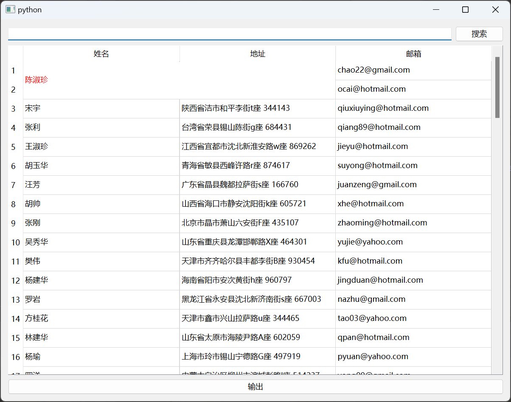

####  简单分页案例

```python
import math

from PySide6.QtGui import QAction, QIntValidator
from PySide6.QtWidgets import QApplication, QWidget, QVBoxLayout, QTableWidget, QLineEdit, QLabel, QHeaderView, \
    QTableWidgetItem, QMessageBox
from faker import Faker


class MyWindow(QWidget):
    def __init__(self):
        super().__init__()
        self.dataShowOnTable = None
        self.pageCount = None
        self.i = 0
        self.resize(800, 600)
        self.setWindowTitle('分页效果的QTableWidget')

        self.fake = Faker(locale='zh_CN')
        self.data = [[str(self.getNum()), self.fake.name(), self.fake.address(), self.fake.ascii_free_email()] for _ in
                     range(100)]
        self.pageSize = 15  # 一页能有多少数据

        self.table = QTableWidget()
        self.table.setColumnCount(4)
        self.table.setHorizontalHeaderLabels(['编号', '姓名', '地址', '邮箱'])
        self.table.horizontalHeader().setSectionResizeMode(QHeaderView.ResizeMode.Stretch)

        self.pager = QLineEdit()
        # 设置只允许输入整数
        self.pager.setValidator(QIntValidator())
        self.pager.setPlaceholderText('输入页码')
        self.pager.setText('0')
        self.enterAction = QAction('回车')
        self.enterAction.setShortcut('Return')
        self.pager.addAction(self.enterAction)
        self.lb = QLabel('等待初始化')

        self.mainLayout = QVBoxLayout()
        self.mainLayout.addWidget(self.table)
        self.mainLayout.addWidget(self.pager)
        self.mainLayout.addWidget(self.lb)
        self.setLayout(self.mainLayout)

        # 初始化表格
        self.initTable()
        self.bind()

    def bind(self):
        # 绑定回车事件
        self.enterAction.triggered.connect(self.updateTable)
        # 绑定文本改变事件
        # self.pager.textChanged.connect(self.updateTable)

    def showData(self):
        # 显示数据
        self.table.setRowCount(len(self.dataShowOnTable))
        for row, data in enumerate(self.dataShowOnTable):
            for col, text in enumerate(data):
                self.table.setItem(row, col, QTableWidgetItem(text))

    def initTable(self):
        # 初始化标签和计算表格有多少
        self.pageCount = math.ceil(len(self.data) // self.pageSize)
        self.lb.setText(f'当前第1页，共{self.pageCount}页')

        self.dataShowOnTable = self.data[:self.pageSize]
        self.showData()

    def updateTable(self):
        # 获取当前页面
        currentPage = int(self.pager.text())
        # 判断输入的页码是否合法
        if currentPage < 1 or currentPage > self.pageCount:
            self.pager.setText('0')
            QMessageBox.warning(self, '页码错误', '请输入正确的页码')
            return

        if currentPage == self.pageCount:
            # 如果是最后一页，就把最后剩余的数据显示出来
            self.dataShowOnTable = self.data[currentPage * self.pageSize:]
            self.lb.setText(f'当前第{currentPage}页，共{self.pageCount}页')
        else:
            # 否则就显示一页的数据
            self.dataShowOnTable = self.data[currentPage * self.pageSize: (currentPage + 1) * self.pageSize]
        self.showData()

    def getNum(self):
        self.i = self.i + 1
        return self.i


if __name__ == '__main__':
    app = QApplication([])
    window = MyWindow()
    window.show()
    app.exec()
```

###  QTableView

表格视图控件 QTableView，需要和 QStandardItemModel 配套使用，这套框架是基于 MVC 设计模式设计的，M(Model) 是 QStandardItemModel 数据模型不能单独显示出来。V(view) 是指 QTableView 视图，要来显示数据模型，C(controllor) 控制在 Qt 中被弱化，与 View 合并到一起。

使用时需要包含`#include <QTableView>`和`#include <QStandardItemModel>`，创建一个`QTableView`对象和`QStandardItemModel`并使用`QTableView`的`setModel()`函数将视图和模型对象进行绑定。

对于表格而言可以对其样式进行调整，常见的设置如下：

**设置表格的线属性**

```c++
this->setShowGrid(false); // 隐藏网格线
this->setGridStyle(Qt::DotLine); // 线的样式
this->setFocusPolicy(Qt::NoFocus); // 取消Item选中后的虚线边框
```

**设置表格的选中模式等**

```c++
this->setWordWrap(false); // 文本过长不换行
this->setEditTriggers(QAbstractItemView::NoEditTriggers); // 设置不可编辑
this->setSelectionBehavior(QAbstractItemView::SelectRows); // 设置选中一整行
this->setSelectionMode (QAbstractItemView::SingleSelection); // 只允许选中单行
//this->setSelectionMode (QAbstractItemView::ExtendedSelection); // 允许选中多行
```

**设置表格的表头**

```c++
/* 设置垂直表格头的显示、对齐方式、高宽等，水平表格头类似 */
this->horizontalHeader()->setVisible(false); // 隐藏水平表头
this->horizontalHeader()->setDefaultAlignment(Qt::AlignLeft);  // 设置水平表头为左对齐
this->verticalHeader()->setDefaultAlignment(Qt::AlignBottom); // 设置垂直表头为底对齐
this->verticalHeader()->setSectionResizeMode(QHeaderView::Fixed); // 固定表格宽度不可扩展，不可手动调整宽度
this->verticalHeader()->setSectionResizeMode(QHeaderView::ResizeToContents); // 表格宽度随内容自动扩展
this->verticalHeader()->setSectionResizeMode(QHeaderView::Stretch); // 表格宽度自动根据UI进行计算，不可手动调整宽度
this->verticalHeader()->setMinimumSectionSize(ITEM_HEIGHT);
this->verticalHeader()->setDefaultSectionSize(ITEM_HEIGHT);
```

**设置表格的内置滚动条**

```c++
this->setVerticalScrollBarPolicy(Qt::ScrollBarAsNeeded); // 显示垂直滑动条
this->setHorizontalScrollBarPolicy(Qt::ScrollBarAlwaysOff); // 隐藏水平滑动条
this->setVerticalScrollMode(QTableView::ScrollPerPixel); // 垂直滚动条设置为像素滚动
this->verticalScrollBar()->setSingleStep(ITEM_HEIGHT/3); // 设置滚动条步长（要先设置为像素滚动，才能生效；ITEM_HEIGHT为项的高度）
```

**其它**

```c++
this->verticalHeader()->setHidden(true); // 隐藏默认行号
this->setIconSize(QSize(30, 30)); // 设置icon尺寸大小（否则显示的图标尺寸很小，即使实际图片文件很大）
this->setDragEnabled(false); // 禁用拖拽，否则此处添加拖拽的话会生成两个item
this->setMouseTracking(true); // 设置鼠标追踪，下面的entered才会触发槽函数
```

**flags QAbstractItemView::EditTriggers**

此枚举描述将启动项目编辑的操作。

| 内容                               | 值   | 描述                             |
| ---------------------------------- | ---- | -------------------------------- |
| QAbstractItemView::NoEditTriggers  | 0    | 无法编辑。                       |
| QAbstractItemView::CurrentChanged  | 1    | 只要当前项目发生变化，即开始编辑 |
| QAbstractItemView::DoubleClicked   | 2    | 当一个项目被双击时开始编辑。     |
| QAbstractItemView::SelectedClicked | 4    | 点击已选项目后开始编辑。         |
| QAbstractItemView::EditKeyPressed  | 8    | 平台编辑键被按下时，编辑开始。   |
| QAbstractItemView::AnyKeyPressed   | 16   | 当任何键被按下时，编辑开始。     |
| QAbstractItemView::AllEditTriggers | 31   | 所有上述操作都将开始编辑。       |

**enum QAbstractItemView::SelectionBehavior**

| 内容                             | 值   | 描述           |
| -------------------------------- | ---- | -------------- |
| QAbstractItemView::SelectItems   | 0    | 选择单个项目。 |
| QAbstractItemView::SelectRows    | 1    | 只选择行。     |
| QAbstractItemView::SelectColumns | 2    | 只选择列。     |


```python
from PySide6.QtWidgets import QApplication, QWidget, QVBoxLayout, QTableView, QHeaderView, QLineEdit
from PySide6.QtGui import QStandardItemModel, QStandardItem
from PySide6.QtCore import Qt, QSortFilterProxyModel, QRegularExpression
from faker import Faker


class MyWindow(QWidget):
    def __init__(self):
        super().__init__()
        self.fake = Faker(locale='zh_CN')
        self.data = [[self.fake.name(), self.fake.phone_number(),
                      self.fake.address()] for _ in range(100)]

        # 搜索栏
        self.searchLineEdit = QLineEdit()

        # 创建模型
        self.model = QStandardItemModel()
        for indexRow, row in enumerate(self.data):
            for indexColumn, column in enumerate(row):
                self.model.setItem(indexRow, indexColumn,
                                   QStandardItem(column))

        # 创建一个代理模型
        self.agentModel = QSortFilterProxyModel()
        self.agentModel.setSourceModel(self.model)
        # 设置过滤范围
        self.agentModel.setFilterKeyColumn(-1)

        # 创建视图层
        self.table = QTableView()
        self.table.horizontalHeader().setSectionResizeMode(QHeaderView.ResizeMode.Stretch)
        self.table.setModel(self.agentModel)

        # 创建排序
        self.table.setSortingEnabled(True)

        # 设置编辑模式与选择行为
        self.table.setEditTriggers(QTableView.EditTrigger.NoEditTriggers)
        self.table.setSelectionBehavior(
            QTableView.SelectionBehavior.SelectRows)

        # 设置表头标签
        header = ['姓名', '电话', '地址']
        for i in header:
            self.agentModel.setHeaderData(header.index(i), Qt.Orientation.Horizontal, i)

        self.mainLayout = QVBoxLayout()
        self.mainLayout.addWidget(self.searchLineEdit)
        self.mainLayout.addWidget(self.table)
        self.setLayout(self.mainLayout)
        self.bind()

    def bind(self):
        self.searchLineEdit.textChanged.connect(
            lambda text: self.agentModel.setFilterRegularExpression(QRegularExpression(text)))


if __name__ == '__main__':
    app = QApplication([])
    window = MyWindow()
    window.show()
    app.exec()
```

####  QSqlQueryModel只读模型/QSqlTableModel可编辑模型

使用；

```python
import sqlite3
import pandas as pd
from faker import Faker
import os
# 构造测试数据
# os.chdir(os.path.dirname(__file__))
#
# fake = Faker(locale='zh_CN')
# data = pd.DataFrame([{'name':fake.name(), 'address': fake.address(), 'email':fake.email()} for _ in range(20000)])
#
# connect = sqlite3.connect('test.db')
# data.to_sql('usr', connect, if_exists='replace', index=False)

from PySide6.QtWidgets import QApplication, QWidget, QTableView, QHeaderView, QVBoxLayout
from PySide6.QtSql import QSqlDatabase, QSqlQueryModel, QSqlTableModel
from PySide6.QtCore import Qt, QSortFilterProxyModel
import os

os.chdir(os.path.dirname(__file__))


class MyWindow(QWidget):
    def __init__(self):
        super().__init__()
        self.setWindowTitle("QSqlQueryModel")
        self.resize(800, 600)

        # 和数据库建立联系
        self.db = QSqlDatabase.addDatabase("QSQLITE")
        self.db.setDatabaseName("./test.db")
        if not self.db.open():
            raise Exception("数据库打开失败")

        # 创建只读模型
        # self.model = QSqlQueryModel()
        # self.model.setQuery("select * from usr")

        # 创建可编辑模型，设置表，查询数据
        self.model = QSqlTableModel()
        self.model.setTable("usr")
        self.model.select()

        # 创建代理类
        self.agentModel = QSortFilterProxyModel()
        self.agentModel.setSourceModel(self.model)
        header = ["姓名", '地址', '邮箱']
        for index, i in enumerate(header):
            self.agentModel.setHeaderData(index, Qt.Orientation.Horizontal, i)

        # 创建表格视图
        self.table = QTableView()
        self.table.horizontalHeader().setSectionResizeMode(QHeaderView.ResizeMode.Stretch)
        self.table.setModel(self.agentModel)

        self.mainLayout = QVBoxLayout()
        self.mainLayout.addWidget(self.table)
        self.setLayout(self.mainLayout)


if __name__ == "__main__":
    app = QApplication([])
    win = MyWindow()
    win.show()
    app.exec()

```

###  QTabWidget

#### QTabWidget简介

在GUI应用软件中，多页面的切换的使用范围十分广泛，在操作过程中，用户使用鼠标点击不同的标题栏就可以方便展示不同页面的内容，众多界面共用一块显示区域，在有限的就显示区域中可以很方便地位用户显示更多的信息。

Qt为多页面切换的实现提供了一个专门的控件QTabWidget, 它可以实现在同一区域中自由切换不同页面的内容，该控件是一个容器类控件，并提供友好的页面切换方式。

QTabWidget常用方法有：

- addTab()： 添加一个标签；
- insertTab()： 在指定位置插入一个标签；
- removeTab()： 删除指定索引的标签；
- setTabText()： 设置指定索引标签的文本信息；
- tabText()： 获得指定索引标签的文本信息；
- setTabIcon()： 设置指定索引标签的图标；
- tabIcon()： 获得指定索引标签的图标；
- currentWidget()： 获得当前活动标签的部件；
- widget()： 获得指定标签索引的部件；
- indexOf()： 获得指定部件的标签索引；
- count()： 总标签数；
- setTabPosition()： 设置标签的显示位置，值为（北：QTabWidget.North, 南：QTabWidget.South, 西：QTabWidget.West, 东：QTabWidget.East）；
- setTabShape()： 设置标签的形状, 值为：（四边形：QTabWidget.Rounded, 三角形：QTabWidget.Triangular）。

QTabWidget常用信号：

- currentChanged： 当前标签页发生改变后，发射该信号；
- tabCloseRequested： 标签页关闭请求时，发射该信号；
- tabBarClicked： 单击了标签条，发射该信号；
- tabBarDoubleClicked： 双击了标签条，发射该信号。

示例:

```python
from PySide6.QtWidgets import QApplication, QWidget, QVBoxLayout, QTabWidget, QPushButton, QLabel


class MyWindow(QWidget):
    def __init__(self):
        super().__init__()

        self.tab1 = QWidget()
        self.tab1Layout = QVBoxLayout()
        self.tab1Layout.addWidget(QPushButton("按钮1"))
        self.tab1Layout.addWidget(QLabel("标签1"))
        self.tab1.setLayout(self.tab1Layout)

        self.tab2 = QWidget()
        self.tab2Layout = QVBoxLayout()
        self.tab2Layout.addWidget(QPushButton("按钮2"))
        self.tab2Layout.addWidget(QLabel("标签2"))
        self.tab2.setLayout(self.tab2Layout)

        self.tab3 = QWidget()
        self.tab3Layout = QVBoxLayout()
        self.tab3Layout.addWidget(QPushButton("按钮3"))
        self.tab3Layout.addWidget(QLabel("标签3"))
        self.tab3.setLayout(self.tab3Layout)

        self.tab = QTabWidget()
        self.tab.addTab(self.tab1, "选项卡1")
        self.tab.addTab(self.tab2, "选项卡2")
        self.tab.addTab(self.tab3, "选项卡3")
        # 设置选项卡为可关闭
        self.tab.setTabsClosable(True)
        # 设置选项卡为可移动
        self.tab.setMovable(True)
        # 修改选项卡位置
        # self.tab.setTabPosition(QTabWidget.TabPosition.East)

        # 关闭选项卡
        self.tab.tabCloseRequested.connect(lambda index: self.tab.removeTab(index))

        self.mainLayout = QVBoxLayout()
        self.mainLayout.addWidget(self.tab)
        self.setLayout(self.mainLayout)


if __name__ == '__main__':
    app = QApplication([])
    window = MyWindow()
    window.show()
    app.exec()
```

###  **QTimer简介**

PyQt5中QTimer类为计时器提供了高级编程接口。 要使用它，请创建一个QTimer，将其超时信号连接到适当的插槽，然后调用start（）。 从那时起，它将以恒定的时间间隔发出超时信号。

#### QTimer类中的常用方法

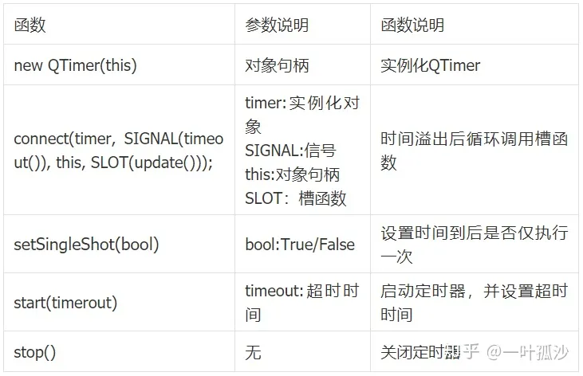

| 方法                       | 描述                                                         |
| :------------------------- | :----------------------------------------------------------- |
| setInterval(self,int msec) | 定时器触发的时间间隔毫秒数。如果interval为0，那么定时器事件在没有窗口系统事件需要处理时都会发生。 |

####  QTimer类中的常用信号


| 信号       | 描述                                         |
| :--------- | :------------------------------------------- |
| singleShot | 在给定的时间间隔后调用一个槽函数时发射此信号 |
| timeout    | 当定时器超时时发射此信号                     |

实现一个轮播图效果

```python
from PySide6.QtWidgets import QApplication, QWidget, QVBoxLayout, QPushButton, QLabel
from PySide6.QtGui import QPixmap
from PySide6.QtCore import QTimer
import os
from pathlib import Path
os.chdir(Path(__file__).parent.absolute())
print(os.getcwd())


class MyWindow(QWidget):
    def __init__(self):
        super().__init__()
        self.resize(800, 600)
        self.count = 0
        self.picPath = ["./pic/1.png", './pic/2.png', './pic/3.png']

        self.lb = QLabel()
        self.lb.setPixmap(QPixmap("./pic/1.png"))

        # self.btnChangeRate()

        self.timer = QTimer()
        # self.timer.timeout.connect(self.showCount)
        self.timer.timeout.connect(self.changePic)
        self.timer.start(1000)

        # self.timer.setInterval(5000)

        self.btn = QPushButton("开始计时")
        self.btn.clicked.connect(lambda: self.timer.start(1000))

        self.mainLayout = QVBoxLayout()
        self.mainLayout.addWidget(self.lb)
        self.mainLayout.addWidget(self.btn)
        self.setLayout(self.mainLayout)

    def showCount(self):
        self.count += 1
        print(self.count)

    def changePic(self):
        self.count += 1
        index = self.count % len(self.picPath)
        print(index)
        self.lb.setPixmap(QPixmap(self.picPath[index]))


if __name__ == '__main__':
    app = QApplication([])
    window = MyWindow()
    window.show()
    app.exec()
```

###  QThread

 **start()：**启动线程

 **wait()：**阻止线程，直到满足如下条件之一

  （1）与此QThread对象关联的线程已完成执行（即从run返回时），如果线程完成执行，此函数返回True，如果线程尚未启动，也返回True

  （2）等待时间的单位是毫秒，如果时间是ULONG_MAX（默认值·），则等待，永远不会超时(线程必须从run返回），如果等待超时，此函数将会返回False

 **sleep()：**强制当前线程睡眠多少秒

**QThread类中的常用信号**

 **started：**在开始执行run函数之前，从相关线程发射此信号

 **finished：**当程序完成业务逻辑时，从相关线程发射此信号

```python
import time
from PySide6.QtCore import QThread, Signal, QObject
from PySide6.QtWidgets import QApplication, QWidget, QVBoxLayout, QLabel

class WorkThread(QObject):
    signal123 = Signal(str)

    def __init__(self):
        super().__init__()
        print('run')

    def work(self):
        for i in range(10):
            self.signal123.emit(str(i))
            print(i)
            time.sleep(1)

class MyWindow(QWidget):
    def __init__(self):
        super().__init__()

        self.lb = QLabel('当前的值为:0')


        self.workThread = WorkThread()
        self.threadList = QThread()
        self.workThread.moveToThread(self.threadList)
        self.workThread.signal123.connect(lambda x: self.lb.setText(f'当前的值为:{x}'))

        self.threadList.started.connect(self.workThread.work)
        self.threadList.finished.connect(lambda: print('finished'))
        self.threadList.start()


        self.mainLayout = QVBoxLayout()
        self.mainLayout.addWidget(self.lb)
        self.setLayout(self.mainLayout)


if __name__ == '__main__':
    app = QApplication([])
    window = MyWindow()
    window.show()
    app.exec()
```

####  实例化

```python
from PySide6.QtWidgets import QApplication, QWidget, QVBoxLayout
from PySide6.QtCore import QThread, Signal, QObject
import time

class MyThread(QObject):
    def run(self):
        for i in range(3):
            print(f'run: {i}')
            time.sleep(1)
    

class MyWindow(QWidget):
    def __init__(self):
        super().__init__()
        # 实例化线程对象
        self.thread = QThread()
        
        # 实例化子类工作对象
        self.woker = MyThread()
        self.woker.moveToThread(self.thread)
        
        # 将子类工作对象的 run() 方法与线程的 started() 信号关联
        self.thread.started.connect(self.woker.run)
        self.thread.finished.connect(lambda: print('finished'))
        self.woker.run()
        
        self.mainLayout = QVBoxLayout()
        self.setLayout(self.mainLayout)

if __name__ == '__main__':
    app = QApplication([])
    window = MyWindow()
    window.show()
    app.exec()

```

