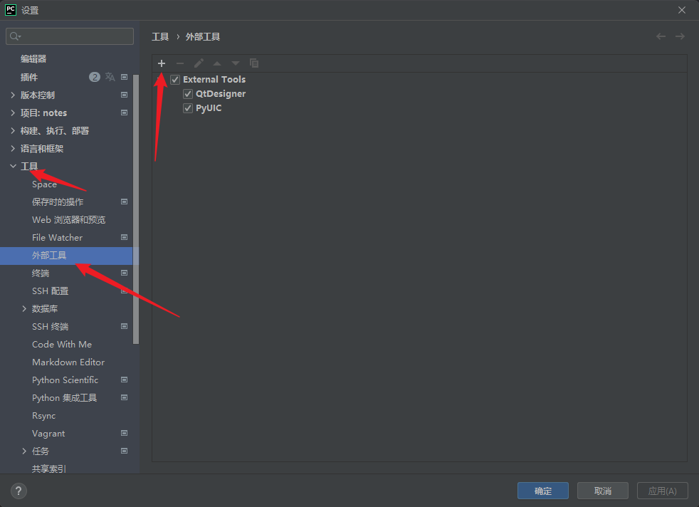
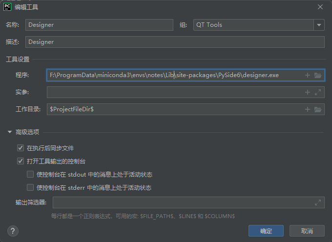
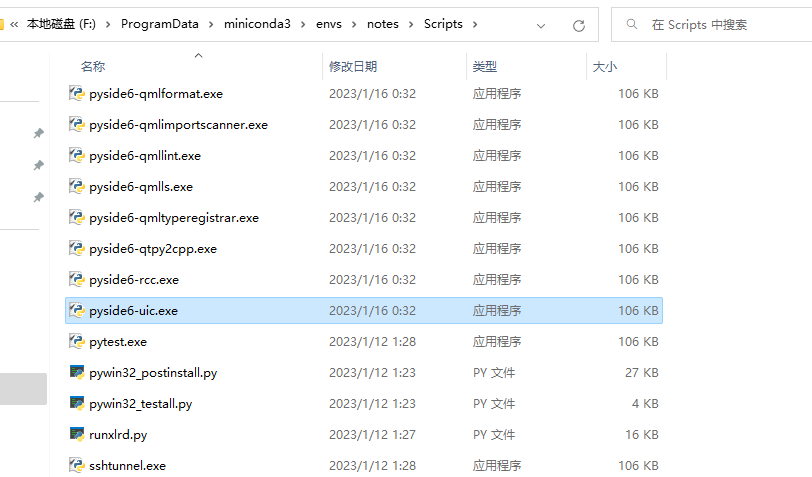
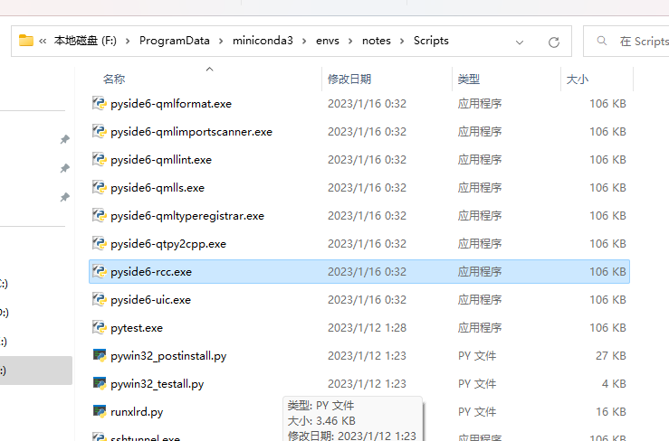
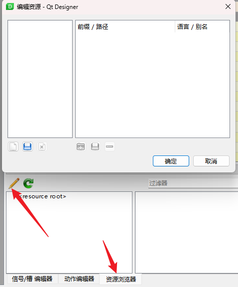

# 01.主要模组简介绍及安装与配置环境

在Qt官网的介绍中，PyQt包括三个主要的基础模组。

- QtCore：提供核心非 GUI 功能，如信号和 槽、属性、项目模型的基类、 序列化等。
- QtGui：使用GUI功能扩展QtCore：事件，窗口 和屏幕，OpenGL和基于光栅的2D绘画，如 以及图像。
- QtWidgets：为您的应用程序提供现成的小部件， 包括 UI 的图形元素。


**调用方式**

如果需要调用某个模块，可以先在官网搜索该模块所在的基础模块，在程序中按以上的方式对应调用即可。

[QT 官网](https://www.qt.io/)

[QT for python](https://doc.qt.io/qtforpython/api.html)

```python
from PySide6.QtWidgets import ...
from PySide6.QtGui import ...
from PySide6.QtCore import ...
```

# 安装与环境配置

## 安装

```python
pip install -i https://pypi.tuna.tsinghua.edu.cn/simple/ pyside6
```

安装PySide6时就已经安装Qt Designer、uic和rcc工具。我们只需要在PyCharm里配置一下即可。

## 配置

使用`PyCharm`集成开发工具,在安装 `QtTools`库以后,还要对 `QtDesigner`和 `PyUIC`进行环境配置,将其集成到 `PyCharm`中



### QtDesigner

Qt Designer是PyQt和PySide通用的工具,通过拖拽窗口部件和属性编辑完成GUI的设计工作,保存为*.ui文件

拷到项目中使用。

安装完 `pyside6`直接在命令行运行 `pyside6-designer`即可打开 `designer`

从顶部菜单栏选择:`File -> Settings`,弹出 `Seetings`窗口；选择:`Tools -> ExternalTools`,在右侧点击 "+" 弹出 `CreateTool`窗口



- `Name`:填写 `QtDesigner`,标识作用
- `Program`:填写 `designer.exe` 的路径,例如 `F:\ProgramData\miniconda3\envs\notes\Scripts\pyside6-designer.exe`
- `Arguments`:不用填写
- `Working directory`:填写生成 UI 文件的保存路径

  - 要将 `.ui`文件保存在当前``Project `路径下,则填写`$ProjectFileDir$`
  - 要将 `.ui`文件保存在当前 `Project`路径下,`\program` 子目录中,则填 `$FileDir$`

在项目名称(新建ui时)或你要编辑的ui文件上打开右键菜单,找到External Tools(或你设置的Group名称),打开PySide6 QtDesinger。

可以通过uic工具转成py文件使用,也可以通过以下代码调用

```python
import sys

from PySide6.QtCore import QFile, QIODevice
from PySide6.QtUiTools import QUiLoader
from PySide6.QtWidgets import QApplication

if __name__ == "__main__":

    app=QApplication(sys.argv)

    ui_file_name="01-窗口创建/demo.ui"
    ui_file=QFile(ui_file_name)
    if not ui_file.open(QIODevice.ReadOnly):
            print(f"Cannot open {ui_file_name}: {ui_file.errorString()}")
        sys.exit(-1)
    loader=QUiLoader()
    window=loader.load(ui_file)
    ui_file.close()
    if not window:
            print(loader.errorString())
        sys.exit(-1)
    window.show()

    sys.exit(app.exec())
```

### PyUIC

pyuic安装在 `Scripts`目录下,对应 `pyside6-uic.exe`



PyUIC将QtDesigner生成的ui文件转换为py文件

从顶部菜单栏选择:`File -> Settings`,弹出 `Seetings`窗口；选择:`Tools -> ExternalTools`,在右侧点击 "+" 弹出 `CreateTool`窗口

CreateTool 窗口依次填写:

- `Name`:填写 `PyUIC`,标识作用
- `Program`:填写 `pyside6-uic` 的路径,需要区分虚拟环境和系统环境 `F:\ProgramData\miniconda3\envs\notes\Scripts\pyside6-uic.exe`
- `Arguments`:填写 `$FileName$ -o ui_$FileNameWithoutExtension$.py`
- `Working directory`:填写将 .ui 文件转换为 .py 文件的保存路径,填写 `$FileDir$`

在要转换的ui文件上点击右键,在右键菜单里使用上述配置好的uic工具即可转换为同名的py文件。

### PyRCC

Program中配置的是pyside6-rcc.exe的文件路径

F:\ProgramData\miniconda3\envs\notes\Scripts\pyside6-rcc.exe



- `Name`:填写 `PyRCC`
- `Program`:填写 `pyside6-rcc` 的路径,`F:\ProgramData\miniconda3\envs\notes\Scripts\pyside6-rcc.exe`
- `Arguments`中填写 `$FileName$ -o rcc_$FileNameWithoutExtension$.py`
- `Working directory`中填写 `$FileDir$`

新建一个resource.qrc文件,把用到的图片资源写到配置文件里

```xml
<!DOCTYPE RCC>

<RCC version="1.0">

    <qresource> 

        <file alias="contacts.png">ico/contacts.png</file>

        <file alias="exit.png">ico/exit.png</file>

        <file alias="about.png">ico/about.png</file>

        <file alias="config.png">ico/config.png</file>

        <file alias="help.png">ico/help.png</file>

    </qresource>

</RCC>
```

也可以用Qt Designer右下角的资源编辑器进行编辑



编辑保存后,到PyCharm中在要转换的qrc文件上点击右键,在右键菜单里使用上述配置好的rcc工具即可转换为同名的py文件。

引用py文件中的资源使用的时候用冒号加图片路径,如:

```python
QtGui.Qpixmap(':images/file.png')
```

要把程序打包成可执行文件的时候,先把资源文件转成py后调用就方便多了。