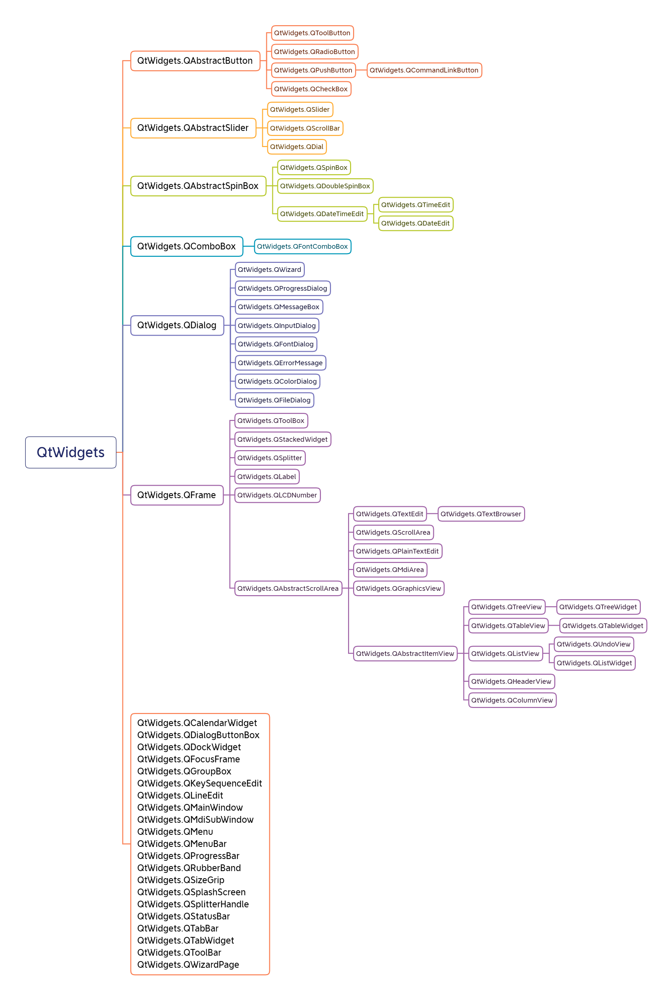
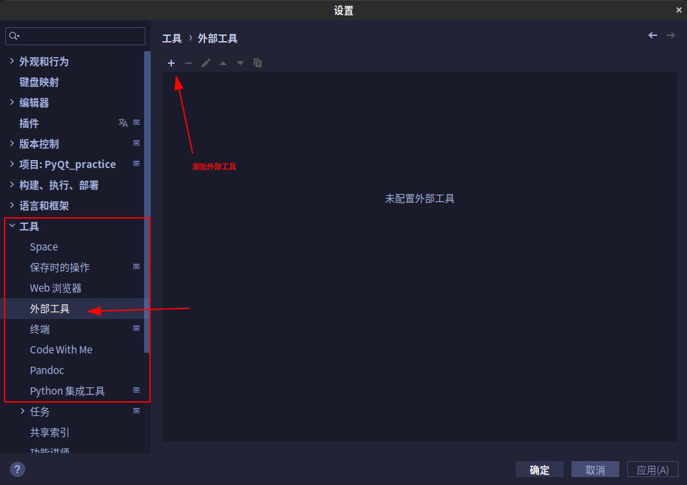
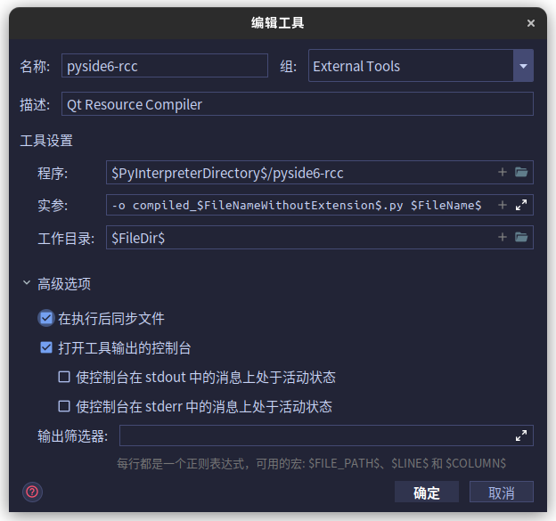
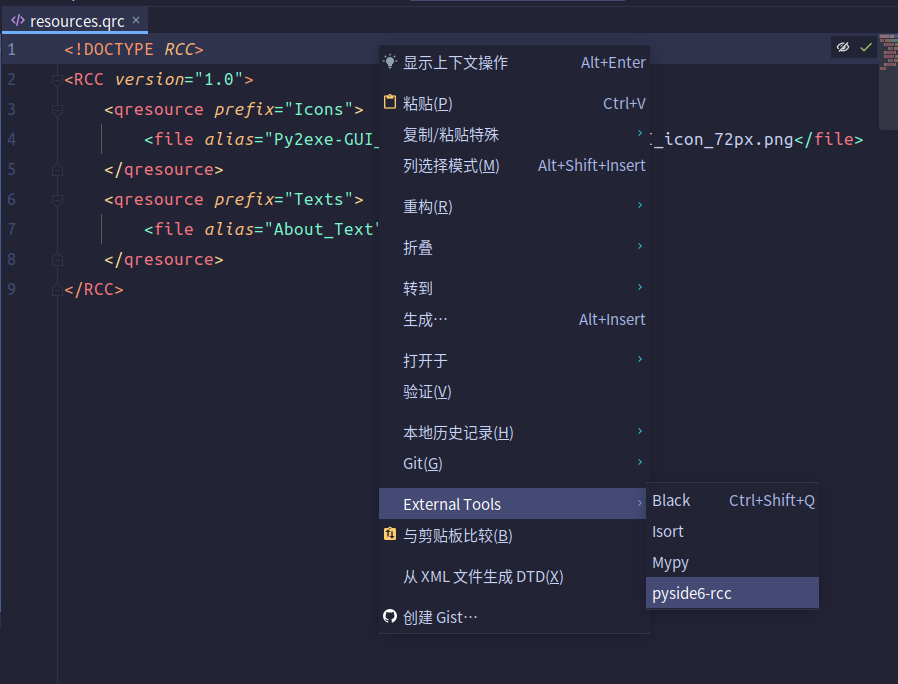
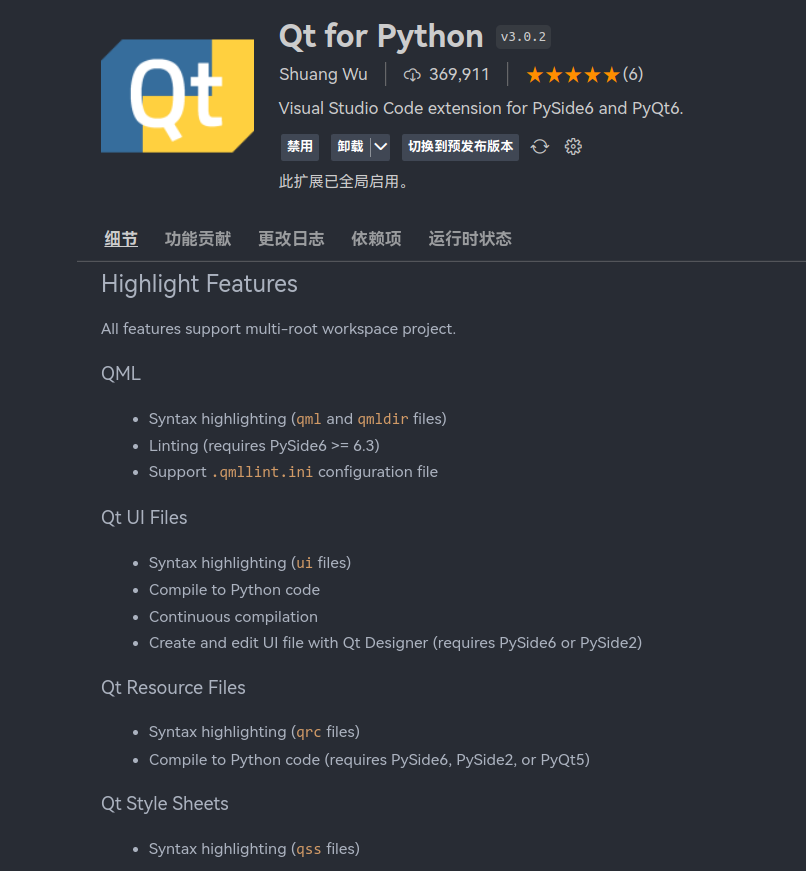
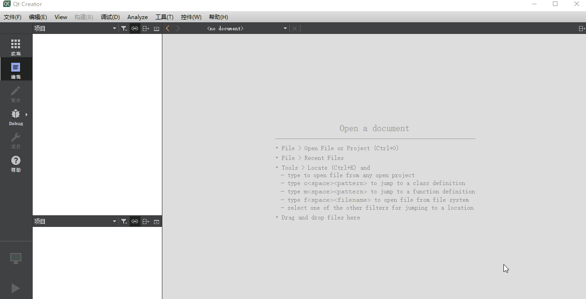
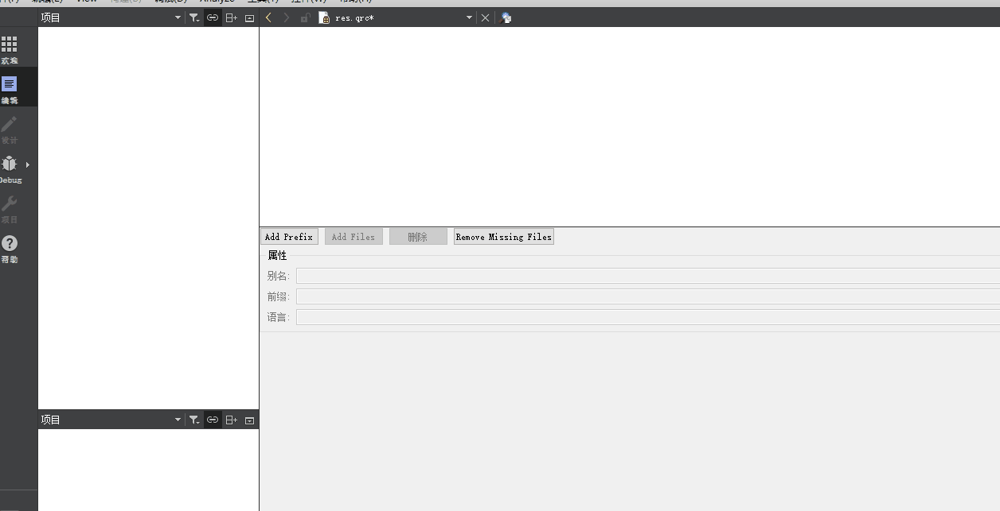
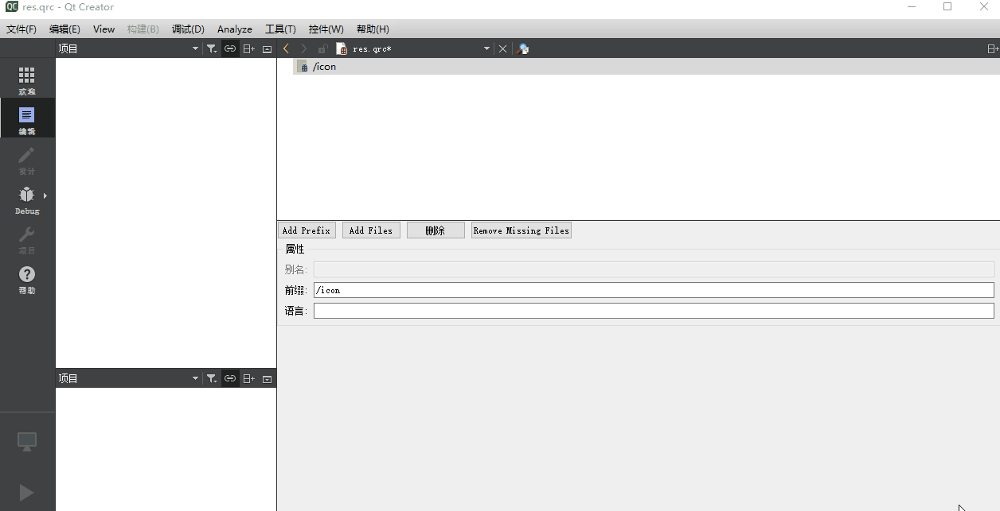
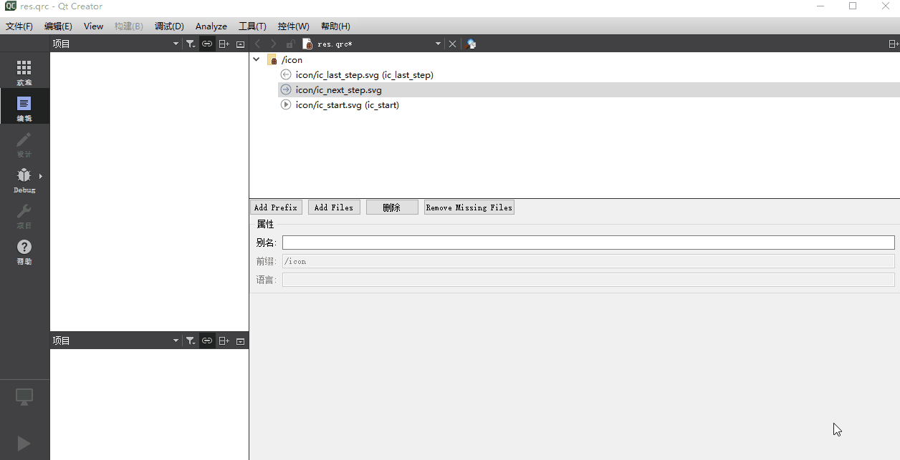

# 02.基础了解

## 元对象系统

> 翻译信息:
>
> 本文翻译自 PySide6 官方文档 *[The Meta-Object System](https://doc.qt.io/qtforpython/overviews/metaobjects.html)*
>
> 协议:本翻译遵守原文档使用的[GNU Free Documentation License version 1.3](https://www.gnu.org/licenses/fdl-1.3.html) 授权
>
> 译者:[muzing](https://muzing.top/about/)
>
> 翻译时间:2022.06
>
> 译者注:本文原文由[Qt 6(C++) 文档](https://doc.qt.io/qt-6/metaobjects.html)直接转换而来,似乎代码部分并未完全替换为有效的 Python 代码,建议与 C++ 原版文档对比阅读

Qt 的元对象系统(meta-object system)和自省(introspection)功能的概述。

Qt 的元对象系统为对象间通信、运行时类型信息和动态属性系统提供了信号与槽机制。

元对象系统基于三件事:

1.`QObject` 类为可以利用元对象系统的对象提供基类。
2.类声明私有部分中的 `Q_OBJECT` 宏用于启用元对象特性,例如动态属性、信号和槽。
3.元对象编译器(`moc`) 为每个 `QObject` 子类提供实现元对象功能所需的代码。

`moc` 工具读取 C++ 源文件。如果它找到一个或多个包含 `Q_OBJECT` 宏的类声明,它会生成另一个 C++ 源文件,其中包含每个类的元对象代码。这个生成的源文件要么是 `#include` 被包含在类的源文件中,要么(更常见地)是被编译并与类的实现链接。

除了提供对象间通信的[信号与槽](https://doc.qt.io/qtforpython/overviews/signalsandslots.html#signals-slots)机制(这是引入系统的主要原因),元对象代码还提供以下附加功能:

- `metaObject()` 返回类的关联 `meta-object`
- `className()` 在运行时将类名作为字符串返回,无需通过 C++ 编译器支持本机运行时类型信息(RTTI)
- `inherits()` 函数返回对象是否继承 `QObject` 继承树中指定类的类的实例
- `tr()` 翻译字符以进行国际化
- `setProperty()` 和 `property()` 按名称动态设置和获取属性
- `newInstance()` 构造一个新的类实例

也可以在 `QObject` 类上使用`qobject_cast()` 执行动态转换。`qobject_cast()` 函数的行为类似于 标准 C++ 的 `dynamic_cast()`,其优点是不需要 RTTI 支持,并且可以跨动态库边界工作。它尝试将其参数转换为尖括号中指定的指针类型,如果对象的类型正确(在运行时确定),则返回非零指针；如果对象的类型不兼容,则返回 `None`。

例如,假设 `MyWidget` 继承自 `QWidget` 并使用`Q_OBJECT` 宏声明:

```python
obj = MyWidget()
```

`QObject *` 类型的 `obj` 变量实际上是指 `MyWidget` 对象,所以我们可以适当地转换它:

```python
widget = QWidget(obj)
```

成功从 `QObject` 转换到 `QWidget`,因为对象其实是一个 `MyWidget`,它是 `QWidget` 的子类。由于我们知道 `obj` 是一个 `MyWidget`,所以也可以将其转换为 `MyWidget *`:

```python
myWidget = MyWidget(obj)
```

转换至 `MyWidget` 成功,因为 `qobject_cast()` 没有区分内置 Qt 类型和自定义类型。

```python
label = QLabel(obj)
# label is 0
```

另一方面,转换为 `QLabel` 失败。指针然后被设置为 0。这使得可以在运行时根据类型以不同的方式处理不同类型的对象:

```python
if(QLabel label = QLabel(obj)) {            label.setText(tr("Ping"))
} else if(QPushButton button = QPushButton(obj)) {
    button.setText(tr("Pong!"))
```

虽然可以在没有 `Q_OBJECT` 宏和元对象代码的情况下使用`QObject` 作为基类,但如果不使用`Q_OBJECT` 宏,则信号和槽、以及此处描述的其他功能都将不可用。从元对象系统的角度来看,没有元代码的 `QObject` 子类等价于最接近的具有元对象代码的祖先 。这意味着,例如,`className()` 不会返回类的实际名称,而是这个祖先的类名。

因此,我们强烈建议 `QObject` 的所有子类都使用`Q_OBJECT` 宏,无论它们是否真的使用信号、槽和属性。

## 对象模型

> **翻译信息**:
>
> 本文翻译自 Qt6 官方文档 *[Object Model](https://doc.qt.io/qt-6/object.html)*
>
> 协议:本翻译遵守原文档使用的[GFDLv1.3](https://www.gnu.org/licenses/fdl-1.3.html) 授权
>
> 译者:[muzing](https://muzing.top/about/)
>
> 翻译时间:2022.06

标准 C++ 对象模型为对象范例提供了非常有效的运行时支持。但它的静态性质在某些具体问题领域不够灵活。GUI 编程是一个需要运行时效率和高灵活性的领域。Qt 通过将 C++ 的速度与 Qt 对象模型的灵活性相结合,来实现这一点。

Qt 为 C++ 添加了如下特性:

- 一种非常强大的无缝对象通信机制,称为[信号与槽](https://doc.qt.io/qt-6/signalsandslots.html)
- 可查询和可设计的[对象属性](https://doc.qt.io/qt-6/properties.html)
- 强大的[事件与事件过滤器](https://doc.qt.io/qt-6/eventsandfilters.html)
- 上下文相关的[用于国际化的字符串翻译](https://doc.qt.io/qt-6/internationalization.html)
- 精巧的间隔驱动[计时器](https://doc.qt.io/qt-6/timers.html),可以在事件驱动的 GUI 中优雅地集成许多任务
- 以自然方式组织对象所有权的,分层和可查询的[对象树](https://doc.qt.io/qt-6/objecttrees.html)
- 受保护的指针([QPointer](https://doc.qt.io/qt-6/qpointer.html))在被引用的对象被销毁时自动设置为 0。这与普通的 C++ 指针不同,后者在其对象被销毁时变成空指针
- 跨库边界工作的[动态转换](https://doc.qt.io/qt-6/metaobjects.html#qobjectcast)
- 支持创建[自定义类型](https://doc.qt.io/qt-6/custom-types.html)

这些 Qt 特性中的许多是基于从[QObject](https://doc.qt.io/qt-6/qobject.html) 的继承,用标准 C++ 技术实现。其他的,比如对象通信机制和动态属性系统,需要由 Qt 自带的[元对象编译器(moc)](https://doc.qt.io/qt-6/moc.html)提供的[元对象系统](https://doc.qt.io/qt-6/metaobjects.html)。

元对象系统是一种 C++ 扩展,使得该语言更适合真正的组件 GUI 编程。

### 重要的类

这些类构成了 Qt 对象模型的基础。

| [QMetaClassInfo](https://doc.qt.io/qt-6/qmetaclassinfo.html) | 关于类的附加信息                              |
| ------------------------------------------------------------ | --------------------------------------------- |
| [QMetaEnum](https://doc.qt.io/qt-6/qmetaenum.html)           | 关于枚举器的元数据                            |
| [QMetaMethod](https://doc.qt.io/qt-6/qmetamethod.html)       | 关于成员函数的元数据                          |
| [QMetaObject](https://doc.qt.io/qt-6/qmetaobject.html)       | 包含有关 Qt 对象的元信息                      |
| [QMetaProperty](https://doc.qt.io/qt-6/qmetaproperty.html)   | 关于属性的元数据                              |
| [QMetaSequence](https://doc.qt.io/qt-6/qmetasequence.html)   | 允许对顺序容器进行类型擦除访问                |
| [QMetaType](https://doc.qt.io/qt-6/qmetatype.html)           | 管理元对象系统中的具名类型                    |
| [QObject](https://doc.qt.io/qt-6/qobject.html)               | 所有 Qt 对象的基类                            |
| [QObjectCleanupHandler](https://doc.qt.io/qt-6/qobjectcleanuphandler.html) | 监视多个 QObject 的生命周期                   |
| [QPointer](https://doc.qt.io/qt-6/qpointer.html)             | 模板类,提供受保护的指向 QObject 的指针        |
| [QSignalBlocker](https://doc.qt.io/qt-6/qsignalblocker.html) | 包裹 QObject::blockSignals() 的异常安全包装器 |
| [QSignalMapper](https://doc.qt.io/qt-6/qsignalmapper.html)   | 绑定来自可识别发送者的信号                    |
| [QVariant](https://doc.qt.io/qt-6/qvariant.html)             | 行为类似于最常见的 Qt 数据类型的集合          |

### Qt 对象:身份？值？

上面列出的 Qt 对象模型的一些附加功能要求我们将 Qt 对象视为身份(identities),而不是值(values)。值被复制或分配,身份被克隆。克隆意味着创建一个新的身份,而不是旧身份的精确复制品。例如,双胞胎有不同的身份。他们可能看起来相同,但名称不同、位置不同,并且可能有完全不同的社交圈子。

克隆身份是比复制或分配更复杂的操作。我们可以在 Qt 对象模型中看到这意味着什么。

**一个 Qt 对象**……

- 可能有一个唯一的[QObject::objectName](https://doc.qt.io/qt-6/qobject.html#objectName-prop)()。如果我们复制一个 Qt 对象,该给这个副本起什么名字呢？
- 在[对象层次结构](https://doc.qt.io/qt-6/objecttrees.html)中占据一个位置。如果我们复制一个 Qt 对象,副本应该放在哪里？
- 可以连接到其他 Qt 对象以向它们发出信号或接收它们发出的信号。如果我们复制一个 Qt 对象,该如何将这些连接转移到副本中呢？
- 可以在运行时添加未在 C++ 类中声明的[新属性](https://doc.qt.io/qt-6/properties.html)。如果我们复制一个 Qt 对象,副本是否应该包括添加到原始对象的属性？

出于这些原因,Qt 对象应该被视为身份而不是值。身份是克隆的,而不是复制或分配的,克隆身份是比复制或分配值更复杂的操作。因此,[QObject](https://doc.qt.io/qt-6/qobject.html) 及其所有直接或间接继承的子类,都被禁用了[复制构造函数和赋值运算符](https://doc.qt.io/qt-6/qobject.html#no-copy-constructor)。

## 对象树与所有状态

### 概述

[QObjects](https://doc.qt.io/qt-6/qobject.html) 在对象树(object trees)中组织自身。当创建一个以另一个对象为父对象的[QObject](https://doc.qt.io/qt-6/qobject.html) 时,它会被添加到父对象的[children](https://doc.qt.io/qt-6/qobject.html#children)() 列表中,并在父对象被销毁时销毁。事实证明,这种方式非常适合 GUI 对象的需求。例如,一个[QShortcut](https://doc.qt.io/qt-6/qshortcut.html)(键盘快捷键)是相关窗口的子对象,因此当用户关闭该窗口时,快捷键也会被销毁。

[QQuickItem](https://doc.qt.io/qt-6/qquickitem.html) 是 Qt Quick 模块的基本视觉元素,继承自[QObject](https://doc.qt.io/qt-6/qobject.html),但有一个与 *[QObject](https://doc.qt.io/qt-6/qobject.html) 父对象*不同的*视觉父项*的概念。一个项目的视觉父项可能并不是其父对象。参阅[Concepts - Visual Parent in Qt Quick](https://doc.qt.io/qt-6/qtquick-visualcanvas-visualparent.html) 获取更多详细信息。

[QWidget](https://doc.qt.io/qt-6/qwidget.html),即 Qt Widgets 模块的基础类,扩展了父子关系。一个普通子对象也成为一个子控件,也就是说,它会被显示在父级的坐标系中,并被其父级的边界按图形方式裁剪。例如,当应用程序在关闭消息框后销毁它时,正如我们所希望的那样,消息框的按钮和标签也被销毁,这是因为按钮和标签是消息框的子控件。

您也可以自行删除子对象,它们会自动从其父控件中移除自己。例如,当用户移除一项工具栏时,可能会导致应用程序删除其[QToolBar](https://doc.qt.io/qt-6/qtoolbar.html) 对象之一,在这种情况下,工具栏的父对象[QMainWindow](https://doc.qt.io/qt-6/qmainwindow.html) 将检测到变化,并相应地重新配置其屏幕空间。

当应用程序视觉上或行为上表现异常时,调试函数[QObject::dumpObjectTree](https://doc.qt.io/qt-6/qobject.html#dumpObjectTree)() 和[QObject::dumpObjectInfo](https://doc.qt.io/qt-6/qobject.html#dumpObjectInfo)() 通常很有用。

### QObjects 的构造/销毁顺序

当[QObjects](https://doc.qt.io/qt-6/qobject.html) 在堆上创建(即,使用*new* 创建)时,可以以任意顺序从它们构建对象树,稍后,可以以任意顺序销毁树中的对象。当任何[QObjects](https://doc.qt.io/qt-6/qobject.html) 被删除时,如果该对象有父对象,则析构函数会自动从其父对象中删除该对象。如果该对象有子对象,则析构函数会自动删除每个子对象。不管销毁的顺序,没有[QObjects](https://doc.qt.io/qt-6/qobject.html) 会被删除两次。

当[QObjects](https://doc.qt.io/qt-6/qobject.html) 在栈上创建时,适用相同的行为。通常,破坏顺序仍不会造成问题。考虑一下代码段:

```c++
int main()
{
    QWidget window;
    QPushButton quit("Quit", &window);
    ...
}
```

父对象 `window` 和子对象 `quit` 都是[QObjects](https://doc.qt.io/qt-6/qobject.html),因为[QPushButton](https://doc.qt.io/qt-6/qpushbutton.html) 继承自[QWidget](https://doc.qt.io/qt-6/qwidget.html),[QWidget](https://doc.qt.io/qt-6/qwidget.html) 又继承自[QObjects](https://doc.qt.io/qt-6/qobject.html)。这段代码是正确的:`quit` 的析构函数*没有*被调用两次,因为 C++ 语言标准 *(ISO/IEC 14882:2003)* 指定本地对象的析构函数按其构造函数的相反顺序调用。因此,先调用子对象 `quit` 的析构函数,然后将自己从其父对象 `window` 中移除,再调用`window` 的析构函数。

但是考虑一下如果交换构造顺序会发生什么,如第二个片段所示:

```c++
int main()
{
    QPushButton quit("Quit");
    QWidget window;

    quit.setParent(&window);
    ...
}
```

在这种情况下,破坏顺序会引发问题。首先调用父对象的析构函数,因为它是最后被创建的。然后调用其子对象 `quit` 的析构函数,但这是不正确的,因为 `quit` 是一个局部变量。当 `quit` 随后超出作用域时,其析构函数再次被调用,这一次是正确的,但已经发生了破坏。

## 继承关系图


所有可视控件都继承自QWidget类



可利用`__subclasses__`魔法方法获取各个组件的继承关系

```python
def get_direct_inherited(widget):
    """获取组件被直接继承的子类,不包含多层继承的"""
    return widget.__subclasses__()


def get_inherit_subclass(widget):
    """"获取组件被继承以及多层继承的所有子类"""
    all_inherit_list=list()

    def get_subclass(cls):
        return cls.__subclasses__()

    def get_widget_all_inherit(_subclass):
        nonlocal all_inherit_list

        if get_subclass(_subclass) !=0:
            for subclass in get_subclass(_subclass):
                all_inherit_list.append("-----------------")
                all_inherit_list.append(subclass)
                get_widget_all_inherit(subclass)

    cls_inherit_list=get_subclass(widget)
    for subclass_inherit in cls_inherit_list:
        all_inherit_list.append(subclass_inherit)
        get_widget_all_inherit(subclass_inherit)

    return all_inherit_list


if __name__=='__main__':
    from PySide6.QtWidgets import QWidget

    get_direct_inherited(QWidget)
    # get_inherit_subclass(QWidget)
```

## Qt 命名空间

[QtCore.Qt 命名空间](https://doc.qt.io/qt-6/qt.html)下包含了整个 Qt 库中所使用的各种标识符。

这些标识符大多为枚举(enum)或标志(flags)类型。本文收录部分标识符文档的中文翻译,按字母顺序排列。

###  [Alignment](https://doc.qt.io/qt-6/qt.html#AlignmentFlag-enum)

Qt.AlignmentFlag 中又分为水平对齐方式与垂直对齐方式,具体有如下数种:

水平对齐:

| 常量            | 值     | 描述                               |
| --------------- | ------ | ---------------------------------- |
| Qt.AlignLeft    | 0x0001 | 与左边缘对齐                       |
| Qt.AlignRight   | 0x0002 | 与右边缘对齐                       |
| Qt.AlignHCenter | 0x0004 | 在可用空间中水平居中               |
| Qt.AlignJustify | 0x0008 | 两端对齐(尽可能使文字占满横向空间) |

垂直对齐:

| 常量             | 值     | 描述                 |
| ---------------- | ------ | -------------------- |
| Qt.AlignTop      | 0x0020 | 与顶部对齐           |
| Qt.AlignBottom   | 0x0040 | 与底部对齐           |
| Qt.AlignVCenter  | 0x0080 | 在可用空间中垂直居中 |
| Qt.AlignBaseline | 0x0100 | 与基线对齐           |

若需同时设置水平、垂直两个维度的对齐方式,只需将两个Flags用或运算符连接,例如:
`Qt.AlignCenter` 等价于 `Qt.AlignVCenter | Qt.AlignHCenter`

### [CursorMoveStyle](https://doc.qt.io/qt-6/qt.html#CursorMoveStyle-enum)

此枚举值描述文本光标移动的风格。逻辑风格中,键盘左箭头意味着光标向文本的前方移动(对于从右至左的文本,前方意味着右方)；而视觉风格中,键盘左箭头意味着光标向视觉上的左侧移动,而不考虑文本书写方向。

| 常量                | 值   | 描述                                                         |
| ------------------- | ---- | ------------------------------------------------------------ |
| Qt.LogicalMoveStyle | 0    | 在从左至右的文本块内,按下键盘左方向键时减少光标位置,右方向键增加光标位置；在从右向左的文本块内相反。 |
| Qt.VisualMoveStyle  | 1    | 无论书写方向如何,按下键盘左方向键光标总会向左移动,按下右方向键光标向右移动。 |

### [FocusPolicy](https://doc.qt.io/qt-6/qt.html#FocusPolicy-enum)

| 常量           | 值                            | 描述                                                      |
| -------------- | ----------------------------- | --------------------------------------------------------- |
| Qt.TabFocus    | 0x1                           | 通过键盘Tab键获取焦点                                     |
| Qt.ClickFocus  | 0x2                           | 通过鼠标点击获取焦点                                      |
| Qt.StrongFocus | TabFocus \| ClickFocus \| 0x8 | 通过键盘Tab或鼠标点击获取焦点                             |
| Qt.WheelFocus  | StrongFocus \| 0x4            | 在StrongFocus基础上,还支持鼠标滚轮滚动获取焦点            |
| Qt.NoFocus     | 0                             | 该控件不接受焦点,QLabel等不需要用户键盘操作的控件的默认值 |

### [LayoutDirection](https://doc.qt.io/qt-6/qt.html#LayoutDirection-enum)

控制 Qt 的布局与文字方向。

| 常量                   | 值   | 描述         |
| ---------------------- | ---- | ------------ |
| Qt.LeftToRight         | 0    | 从左至右布局 |
| Qt.RightToLeft         | 1    | 从右至左布局 |
| Qt.LayoutDirectionAuto | 2    | 自动布局     |

对于阿拉伯语、希伯来语等特定语言,需要从右至左布局。

### [ScrollBarPolicy](https://doc.qt.io/qt-6/qt.html#ScrollBarPolicy-enum)

此枚举类型描述了[QAbstractScrollArea](https://doc.qt.io/qt-6/qabstractscrollarea.html) 滚动条的各种模式。水平滚动条与垂直滚动条的模式相互独立。

| 常量                  | 值   | 描述                                                         |
| --------------------- | ---- | ------------------------------------------------------------ |
| Qt.ScrollBarAsNeeded  | 0    | 只有当内容太大而无法容纳时,QAbstractScrollArea 才显示滚动条。此为默认值。 |
| Qt.ScrollBarAlwaysOff | 1    | QAbstractScrollArea 永不显示滚动条。                         |
| Qt.ScrollBarAlwaysOn  | 2    | QAbstractScrollArea 总显示一个滚动条。此属性在具有瞬态滚动条的操作系统上被忽略。 |

### [TextElideMode](https://doc.qt.io/qt-6/qt.html#TextElideMode-enum)

此枚举值指定显示需省略的文本时省略号应出现的位置:

| 常量           | 值   | 描述                       |
| -------------- | ---- | -------------------------- |
| Qt.ElideLeft   | 0    | 省略号应出现在文本的开头。 |
| Qt.ElideRight  | 1    | 省略号应出现在文本的末尾。 |
| Qt.ElideMiddle | 2    | 省略号应出现在文本的中间。 |
| Qt.ElideNone   | 3    | 省略号不应出现在文本中。   |

`Qt.ElideMiddle` 通常是最适合 URL 的选择(例如,"http://bugreports.qt.../QTWEBSITE-13/"),而 `Qt.ElideRight` 适合其他字符串。

### [TextFormat](https://doc.qt.io/qt-6/qt.html#TextFormat-enum)

| 常量            | 值   | 描述                                 |
| --------------- | ---- | ------------------------------------ |
| Qt.PlaintText   | 0    | 将文本字符串解析为纯文本             |
| Qt.RichText     | 1    | 将文本字符串解析为富文本             |
| Qt.AutoText     | 2    | 自动识别为纯文本或富文本             |
| Qt.MarkdownText | 3    | 将文本字符串解析为Markdown格式的文本 |

### [TextInteractionFlag](https://doc.qt.io/qt-6/qt.html#TextFormat-enum)

| 常量                         | 值                                                           | 描述                                                         |
| ---------------------------- | ------------------------------------------------------------ | ------------------------------------------------------------ |
| Qt.NoTextInteraction         | 0                                                            | 不能与文本进行交互                                           |
| Qt.TextSelectableByMouse     | 1                                                            | 可以使用鼠标选择文本,并用上下文菜单或标准键盘快捷键复制到剪贴板 |
| Qt.TextSelectableByKeyboard  | 2                                                            | 可以用键盘上的光标键选择文本,会显示一个文本光标              |
| Qt.LinksAccessibleByMouse    | 4                                                            | 链接高亮显示,并可用鼠标激活                                  |
| Qt.LinksAccessibleByKeyboard | 8                                                            | 链接可以使用Tab键获得焦点,并通过Enter键激活                  |
| Qt.TextEditable              | 16                                                           | 文本完全可编辑                                               |
| Qt.TextEditorInteraction     | TextSelectableByMouse \| TextSelectableByKeyboard \| TextEditable | 文本编辑器的默认值                                           |
| Qt.TextBrowserInteraction    | TextSelectableByMouse \| LinksAccessibleByMouse \| LinksAccessibleByKeyboard | QTextBrowser的默认值                                         |

### [WindowModality](https://doc.qt.io/qt-6/qt.html#WindowModality-enum)

此枚举值用于控制窗口的模态行为。对话框窗口大多为模态窗口。

| 常量                | 值   | 描述                                                         |
| ------------------- | ---- | ------------------------------------------------------------ |
| Qt.NonModal         | 0    | 窗口为非模态,不阻塞其他窗口的输入                            |
| Qt.WindowModal      | 1    | 窗口对单个窗口结构层次为模态,阻塞对其父窗口(及其的兄弟窗口)、祖父窗口(及其兄弟窗口)的输入 |
| Qt.ApplicationModal | 2    | 窗口对应用程序为模态,阻塞对所有窗口的输入                    |

### [WindowType](https://doc.qt.io/qt-6/qt.html#WindowType-enum)

此枚举值用于为控件指定各种窗口系统(window-system)属性。它们一般比较少见,但在少数情况下是必要的。其中一些标志取决于底层窗口管理器是否支持。

主要类型包括:

| 常量             | 值                   | 描述                                                         |
| ---------------- | -------------------- | ------------------------------------------------------------ |
| Qt.Widget        | 0x00000000           | [QWidget](https://doc.qt.io/qt-6/qwidget.html) 的默认类型。这种类型的控件如果有父控件则作为子控件,若没有父控件则为独立窗口。参见 Qt.Window 和 Qt.SubWindow。 |
| Qt.Window        | 0x00000001           | 表示该控件是一个窗口,不管该控件是否有父控件,一般带有一个窗口系统框架和一个标题栏。注意如果控件没有父对象,则无法取消设置此标志。 |
| Qt.Dialog        | 0x00000002 \| Window | 表示该控件是一个应装饰为对话框的窗口(即,一般在标题栏中没有最大化最小化按钮)。这是[QDialog](https://doc.qt.io/qt-6/qdialog.html) 的默认类型。如果想用它作为模态对话框,它应该从另一个窗口启动,或者有父窗口并与[QWidget.windowModality](https://doc.qt.io/qt-6/qwidget.html#windowModality-prop) 属性一起使用。如果将其设置为模态,对话框将阻止应用程序中的其他顶级窗口获得任何输入。我们将具有父控件的顶级窗口称为次要窗口(secondary window)。 |
| Qt.Sheet         | 0x00000004 \| Window | 表示窗口是 macOS 上的 sheet。由于使用sheet 意味着窗口模式,因此推荐的方法是使用[QWidget.setWindowModality](https://doc.qt.io/qt-6/qwidget.html#windowModality-prop)() 或[QDialog::open](https://doc.qt.io/qt-6/qdialog.html#open)() 替代。 |
| Qt.Popup         | 0x00000008 \| Window | 表示该控件是一个弹出式顶级窗口,即它是模态的,但具有适合弹出式菜单的窗口系统框架。 |
| Qt.Tool          | Popup \| Dialog      | 表示该控件是一个工具窗口。工具窗口通常是一个小窗口,具有比一般窗口更小的标题栏和装饰,一般用于工具按钮的集合。如果有父控件,则工具窗口将始终保留在其顶部。如果没有父级,也可以考虑使用Qt.:WindowStaysOnTopHint。如果窗口系统支持,工具窗口可以用更轻量的框架来装饰。它也可以与 Qt.:FramelessWindowHint 结合使用。在 macOS 上,工具窗口对应于窗口的[NSPanel](https://developer.apple.com/documentation/appkit/nspanel) 类。这意味着窗口位于普通窗口之上,因此无法在其上层放置普通窗口。默认情况下,当应用程序处于非活动状态时,工具窗口将消失。这可以通过[Qt.WA_MacAlwaysShowToolWindow](https://doc.qt.io/qt-6/qt.html#WidgetAttribute-enum) 属性来控制。 |
| Qt.ToolTip       | Popup \| Sheet       | 表明该控件是工具提示。这在内部用于实现工具提示。             |
| Qt.SplashScreen  | ToolTip \| Dialog    | 表明该窗口是闪屏(splash screen)。这是[QSplashScreen](https://doc.qt.io/qt-6/qsplashscreen.html) 的默认类型。 |
| Qt.SubWindow     | 0x00000012           | 表明此控件是子窗口,例如[QMdiSubWindow](https://doc.qt.io/qt-6/qmdisubwindow.html) 控件。 |
| Qt.ForeignWindow | 0x00000020 \| Window | 表明此窗口对象是一个句柄,表示由另一个进程或手动使用本地代码创建的本地平台窗口。 |
| Qt.CoverWindow   | 0x00000040 \| Window | 表示该窗口代表一个覆盖窗口,在某些平台上最小化应用程序时显示。 |

还有许多标志可用于自定义顶级窗口的外观。这对其他窗口没有影响:

| 常量                                   | 值                                                   | 描述                                                         |
| -------------------------------------- | ---------------------------------------------------- | ------------------------------------------------------------ |
| Qt.MSWindowsFixedSizeDialogHint        | 0x00000100                                           | 在微软 Windows 上为窗口提供一个细对话框边框。这种风格传统上用于固定大小的对话框。注意:不建议在多显示器环境中使用此标志,因为系统将强制窗口在跨屏幕移动时保持其原始大小,这在使用具有不同分辨率的显示器时尤其不受欢迎。 |
| Qt.MSWindowsOwnDC                      | 0x00000200                                           | 在微软 Windows 上为窗口提供自己的显示上下文。                |
| Qt.BypassWindowManagerHint             | 0x00000400                                           | 此标志可用于向平台插件指示应禁用"所有"窗口管理器协议。根据应用程序运行的操作系统和窗口管理器运行的情况,该标志的行为会有所不同。该标志可用于获取未设置配置的本机窗口。 |
| Qt.X11BypassWindowManagerHint          | BypassWindowManagerHint                              | 完全绕过窗口管理器。这会导致一个完全不受管理的无边框窗口(即,除非手动调用[QWidget.activateWindow](https://doc.qt.io/qt-6/qwidget.html#activateWindow)(),否则没有键盘输入)。 |
| Qt.FramelessWindowHint                 | 0x00000800                                           | 生成无边框窗口。用户不能通过窗口系统移动或调整无边框窗口的大小。在 X11 上,标志的结果取决于窗口管理器及其理解 Motif 和/或 NETWM 的能力。大多数现有的现代窗口管理器都可以处理这个问题。 |
| Qt.NoDropShadowWindowHint              | 0x40000000                                           | 禁用在支持的平台上的窗口投影。                               |
| Qt.CustomizeWindowHint                 | 0x02000000                                           | 关闭默认窗口标题 hints。                                     |
| Qt.WindowTitleHint                     | 0x00001000                                           | 为窗口添加标题栏。                                           |
| Qt.WindowSystemMenuHint                | 0x00002000                                           | 为窗口添加系统菜单,很可能是一个关闭按钮。如果想要隐藏/显示关闭按钮,更好的做法是使用WindowCloseButtonHint。 |
| Qt.WindowMinimizeButtonHint            | 0x00004000                                           | 为窗口添加最小化按钮。在某些平台上,这意味着 WindowSystemMenuHint 也已生效。 |
| Qt.WindowMaximizeButtonHint            | 0x00008000                                           | 为窗口添加最大化按钮。在某些平台上,这意味着 WindowSystemMenuHint 也已生效。 |
| Qt.WindowMinMaxButtonsHint             | WindowMinimizeButtonHint \| WindowMaximizeButtonHint | 为窗口添加最大化、最小化按钮。在某些平台上,这意味着 WindowSystemMenuHint 也已生效。 |
| Qt.WindowCloseButtonHint               | 0x08000000                                           | 为窗口添加关闭按钮。在某些平台上,这意味着 WindowSystemMenuHint 也已生效。 |
| Qt.WindowContextHelpButtonHint         | 0x00010000                                           | 为对话框添加上下文帮助按钮。在某些平台上,这意味着 WindowSystemMenuHint 也已生效。 |
| Qt.MacWindowToolBarButtonHint          | 0x10000000                                           | 在 macOS 上添加一个工具栏按钮(即,在有工具栏的窗口的右上方的椭圆形按钮) |
| Qt.WindowFullscreenButtonHint          | 0x80000000                                           | 在 macOS 上添加一个全屏按钮                                  |
| Qt.BypassGraphicsProxyWidget           | 0x20000000                                           | 如果父控件已经嵌入,则阻止窗口及其子窗口自动将自己嵌入到 QGraphicsProxyWidget 中。如果希望控件始终是桌面上的顶级控件,则可以设置此标志,无论父控件是否已嵌入场景中。 |
| Qt.WindowShadeButtonHint               | 0x00020000                                           | 如果底层窗口管理器支持,则添加一个阴影按钮替代最小化按钮。    |
| Qt.WindowStaysOnTopHint                | 0x00040000                                           | 通知窗口系统该窗口应位于所有其他窗口之上。注意,在某些基于 X11 的窗口管理器上,还必须传递 Qt.X11BypassWindowManagerHint 才能使此标志正常工作。 |
| Qt.WindowStaysOnBottomHint             | 0x04000000                                           | 通知窗口系统该窗口应位于所有其他窗口之下。                   |
| Qt.WindowTransparentForInput           | 0x00080000                                           | 通知窗口系统该窗口仅用于输出(显示某些内容)而不接受输入。因此输入事件应该像不存在一样略过。 |
| Qt.WindowOverridesSystemGestures       | 0x00100000                                           | 通知窗口系统该窗口实现了自己的一组手势,系统级的手势(例如三指切换屏幕)应当被禁用。 |
| Qt.WindowDoesNotAcceptFocus            | 0x00200000                                           | 通知窗口系统该窗口不接受输入焦点。                           |
| Qt.MaximizeUsingFullscreenGeometryHint | 0x00400000                                           | 通知窗口系统在最大化窗口时应尽可能多地使用可用的屏幕几何空间,包括可能被UI覆盖的区域(例如状态栏或应用程序启动器)。这可能会导致窗口被置于这些系统UI之下,具体情况取决于平台是否支持。启用该标志后,用户负责将[QScreen.availableGeometry](https://doc.qt.io/qt-6/qscreen.html#availableGeometry-prop)() 也考虑在内,以便应用程序中需要用户交互的任何UI元素都不会被系统UI覆盖。 |
| Qt.WindowType_Mask                     | 0x000000ff                                           | 用于从窗口标志中提取窗口类型的掩码。                         |

## 模块简介

PySide是Qt在Python的绑定,是将C++开发环境下的Qt移植到Python环境下。由于Python 语句简单,用Python语言开发Qt应用程序就变得相对容易。

下面内容是PySide几个主要模块的简介,其中 QtWidgets、QtCore和QtGui 是基本模块,开发GUI时都会用这三个模块,其他模块是扩展模块。模块有 QtWidgets、QtCore、QtGui,QtWebEngineWidgets、QtChart、QtMultimedia、QtSql 和 QtPrintSupport。

- QtWidgets是窗口模块,提供窗口类和窗口上的各种控件(按钮、菜单、输人框、列表框等)类。
- QtCore 是核心模块,是其他模块的应用基础,包括五大模块:元对象系统、属性系统、对象模型、对象树、信号与槽。QtCore 模块涵盖了 PySide 核心的非 GUI 功能,此模块被用于处理程序中涉及的时间、文件、目录、数据类型、文本流、链接、MIME.线程或进程等对象。
- QtGui 模块涵盖多种基本图形功能的类,包括事件处理、2D图形、基本的图像和字体文本等。
- QtSql模块提供了常用关系型数据库的接口和数据库模型,方便读写数据库中的数据。
- QtMultimedia 模块包含处理多媒体事件的类库,通过调用API接口访问摄像头、语音设备,播放音频和视频,录制音频和视频及拍照等。
- QtChart 和QtDataVisualization 模块用于数据可视化,可以绘制二维和三维数据图表。
- QtPrintSupport 模块提供打印支持,能识别系统中安装的打印机并进行打印,可以对打印参数进行设置,提供打印对话框和打印预览对话框。
- QtBluetooth 模块包含了处理蓝牙的类库,它的功能包括扫描设备、连接、交互等。QtNetwork 模块包含用于网络编程的类库,这组类库通过提供便捷的TCP/IP及UDP的c/s程式码集合,使得网络编程更容易。
- QtWebEngine 和 QtWebEngineWidgets 模块借助开源的Chromium浏览器,在应用程序中嵌入 Web 浏览功能。
- QtXml模块包含了用于处理XML的类库,提供实现SAX和DOMAPI的方法。· QtOpenGL、QtOpenGLFunctions 和 QtOpenGLWidgets 模块使用OpenGL 库来渲染3D和2D图形,该模块使得Qt GUI库和OpenGL库无缝集成。
- QtDesigner模块可以为Qt Designer 创建白定义控件。
- QtSvg 模块为显示矢量图形文件的内容提供了函数。
- QtTest模块包含了可以通过单元测试调试PySide应用程序的功能。
- QtStateMachine 模块可以创建和执行状态图。
- QtHelp 模块可以为应用程序集成在线帮助。
- QtConcurrent 模块支持多线程程序。
- Qt3DCore、Qt3DInput、Qt3DRender、Qt3DAnimation、Qt3DLogic、Qt3DExtras等模块提供三维渲染、三维实时动画。

## QWidget窗口的创建

PySide6的窗口类主要有三种,分别为QWidget、QMainWindow 和QDialog,其中QMainWindow 和 QDialog 从QWidget类继承而来。要创建和显示窗口,需要用这3个类中的任意一个类实例化对象,并让窗口对象显示并运行起来。窗口类在PySide6的QtWidgets 模块中,使用窗口类之前,需要用"from PySide6.QtWidgets import QWidget,QMainWindow,QDialog"语句把它们导人进来。

下面的代码创建一个空白的QWidget 窗口,读者需要理解这段代码,这是整个PySide6

可视化编程最基础的知识。

```python
import sys
from PySide6.QtWidgets import QApplication, QWidget

app = QApplication(sys.argv)  # 创建应用程序实例对象
myWindow = QWidget()  # 创建窗口实例对象
myWindow.show()  # 显示窗口
n = app.exec()  # 执行 exec()方法,进入事件循环,若遇到窗口退出命令,返回整数工
sys.exit(n)  # 通知Python系统,结束程序运行

```

1.第1行导入系统模块sys,这个系统模块是指Python系统,而不是操作系统。
2.第2行导入QApplication 类和 QWidget 类,PySide6 的类都是以大写字母"Q"开始。
3.第4行创建OAnnlicatinn 类的实例对象ann.为窗口的创建进行初始化、其中svs.
4.argv是字符串列表,记录启动程序时的程序文件名和运行参数,可以通过print(sys.argv)函数输出sys.argv的值,sys.argv的第1个元素的值是程序文件名及路径,也可以不输入参数sys.argv 创建 QApplication 实例对象app。QApplication可以接受的两个参数是-nograb 和-dograb,-nograb告诉Python禁止获取鼠标和键盘事件,dograb则忽略-nograb选项功能,而不管-nograb参数是否存在于命令行参数中。一个程序中只能创建一个QApplication 实例,并且要在创建窗口前创建。
5.第5行用不带参数的QWidget 类创建QWidget 窗口实例对象myWindow,该窗口是独立窗口,有标题栏。
6.第6行用show()方法显示窗口,这时窗口是可见的。
7.第7行执行QApplication实例对象的exec()方法,开始窗口的事件循环,从而保证窗口一直处于显示状态。如果窗口上有其他控件,并为控件的消息编写了处理程序,则可以完成相应的动作。如果用户单击窗口右上角的关闭窗口按钮×正常退出界面,或者因程序崩溃而非正常终止窗口的运行,都将引发关闭窗口(closeA1lWindows())事件,这时app的方法exec()会返回一个整数,如果这个整数是0表示正常退出,如果非0表示非正常退出。请注意,当执行到app的exec()方法时,会停止后续语句的执行,直到所有可视化窗体都关闭(退出)后才执行后续的语句。需要注意的是,还有一个与exec()方法功能相同的方法exec_(),但exec_()方法已过时。
8.第8行调用系统模块的exit()方法,通知Python解释器程序已经结束,如果是sys.exit(0)状态,则Python 认为是正常退出；如果不是sys.exit(0)状态,则Python 认为是非正常退出。无论什么情况,sys.exit()都会抛出一个异常SystemExit,这时可以使用try…except语句捕获这个异常,并执行except中的语句,例如清除程序运行过程中的临时文件；如果没有try…except语句,则 Python解释器终止 sys.exit()后续语句的执行。第7行和第8行可以合并成一行sys.exit(app.exec())来执行。运行上面的程序,会得到一个窗口,这还只是一个空白窗口,在窗口上没有放置任何控件。
9.第78行可以这么简写`sys.exit(app.exec())`

## 在PyQt中使用qrc/rcc资源系统

> 本文摘自[在PyQt中使用qrc/rcc资源系统 - muzing的杂货铺](https://muzing.top/posts/75a2283d/)

### Qt 资源系统简介

Qt 资源系统([The Qt Resource System](https://doc.qt.io/qt-6/resources.html))是一种独立于平台的资源管理器,用于在应用程序的可执行文件中存储二进制文件。对 PyQt 而言,这意味着在 Python 代码中直接以二进制形式存储图标、[QSS](https://muzing.top/posts/28a1d80f/)、长文本翻译等资源文件。使用Qt 资源管理系统可以有效防止资源文件丢失,对于需要打包发布 的 PyQt 程序尤其实用。

在项目中使用Qt 资源系统,大致分为三个步骤:编写 `.qrc` 文件、使用rcc 编译资源、导入与使用。下文将一一详细讲解。

### qrc 文件

#### 简介与示例

Qt 资源集合文件(Qt Resource Collection File)一般以 `.qrc` 作为扩展名保存,故简称 `.qrc` 文件。其文件格式基于[XML](https://www.wikiwand.com/en/XML),用于将文件系统(硬盘)中的资源文件与 Qt 应用程序关联起来。`.qrc` 还可以实现为资源分组、设置别名等功能。

下面是一个简单的例子:

`Resources` 目录下包含图标、关于文档等资源文件。

```shell
$ tree Resources
Resources
├── Icons
│   ├── Py2exe-GUI_icon_72px.png
│   └── Python_128px.png
├── Texts
│   └── About_zh.md
└── resources.qrc
```

在此处新建一个 `resources.qrc` 文件,内容如下:

```xml
<!DOCTYPE RCC>
<RCC>
    <qresource>
        <file>Icons/Py2exe-GUI_icon_72px.png</file>
        <file>Icons/Python_icon.ico</file>
        <file>Texts/About_zh.md</file>
    </qresource>
</RCC>
```

> 注意文件的相对路径是以 `.qrc` 所在的目录 `Resources\` 为根目录开始计算的。

这样便建立了硬盘上文件系统中原文件与 Qt 资源系统中[资源路径](#资源路径)之间的联系。

#### 使用前缀进行分组

在文件系统中,可以通过目录对不同类型的资源进行分组。在上面的例子中,图标文件都在 `Icons/` 目录下,而长文本在 `Texts/` 下。在 `.qrc` 中,也可以通过指定 `<qresource>` 标签的 `prefix` 属性来对资源进行分组:

```xml
<!DOCTYPE RCC>
<RCC>
    <qresource prefix="icons">
        <file>Icons/Py2exe-GUI_icon_72px.png</file>
        <file>Icons/Python_icon.ico</file>
    </qresource>
    <qresource prefix="texts">
        <file>Texts/About_zh.md</file>
    </qresource>
</RCC>
```

#### 为资源创建别名

有些资源的文件名很长,每次使用时都输入完整文件名较为繁琐。可以通过在 `<file>` 标签中添加 `alias` 属性为其创建别名,方便未来在[资源路径](#资源路径)中使用:

```xml
<!DOCTYPE RCC>
<RCC>
    <qresource prefix="icons">
        <file alias="Py2exe-GUI_icon">Icons/Py2exe-GUI_icon_72px.png</file>
        <file alias="Python_icon">Icons/Python_icon.ico</file>
    </qresource>
    <qresource prefix="texts">
        <file alias="About_Text">Texts/About_zh.md</file>
    </qresource>
</RCC>
```

### 使用rcc 编译资源

#### rcc 简介

Qt 提供了[Resource Compiler](https://doc.qt.io/qt-6/rcc.html) 命令行工具(简称 rcc),用于在构建过程中将资源嵌入 Qt 应用程序。对于 PyQt.也有对应版本的 rcc 工具,用于将 `.qrc` 中指定的资源文件数据编译至 Python 对象。

#### rcc 的安装与基本使用

当通过 `pip` 安装 PySide6 或其他 PyQt 时,会同时自动安装对应版本的 rcc 工具。这些工具的调用命令有所不同(详见下表),但使用方式与功能是一致的。激活已安装 PyQt 的 Python 虚拟环境,在命令行(注意不是 Python 交互式解释器)中输入对应的 rcc 命令即可。

| 平台    | rcc 命令名称  |
| ------- | ------------- |
| PySide6 | `pyside6-rcc` |
| PyQt5   | `pyrcc5`      |
| PySide2 | `pyside2-rcc` |
| PyQt6   | 不提供        |

> 使用PySide6 提供的 `pyside6-rcc` 工具编译出的 `.py` 文件,也可以放入 PyQt6 项目中使用,只需将文件开头的 `from PySide6 import QtCore` 替换为 `from PyQt6 import QtCore` 即可。

例如,对于 PySide6,在命令行调用命令

```shell
pyside6-rcc -o compiled_resources.py resources.qrc
```

即可将 `resources.qrc` 中列出的资源文件编译到输出文件 `compiled_resources.py` 中。

#### rcc 命令行选项

此处以 pyside6-rcc 6.4.1 为例,列出了完整的选项列表(翻译版):

```shell
$ pyside6-rcc --help
Usage: /path/to/your/python3/site-packages/PySide6/Qt/libexec/rcc[options]inputs
Qt Resource Compiler version 6.4.1

Options:
  -h, --help                            显示关于命令行选项的帮助
  
  --help-all                            显示包括Qt独有选项在内的所有帮助
  
  -v, --version                         显示版本信息
  
  -o, --output <file>                   将输出写入到 <file> 中,而不是 stdout 中

  -t, --temp <file>                     为大资源文件使用临时文件 <file>
  
  --name <name>                         用<name> 创建一个外部初始化函数
  
  --root <path>                         用根目录 <path> 作为资源访问路径的前缀
  
  --compress-algo <algo>                使用<algo> 算法压缩输入文件([zlib], none)
  
  --compress <level>                    按 <level> 级别压缩输入文件
  
  --no-compress                         禁用所有压缩,等同于 --compress-algo=none
  
  --no-zstd                             禁止使用zstd 压缩
  
  --threshold <level>                   衡量是否值得进行压缩的阈值
  
  --binary                              输出一个作为动态资源使用的二进制文件
  
  -g, --generator <cpp|python|python2>  选择生成器
  
  --pass <number>                       Pass number for big resources
  
  --namespace                           关闭命名空间宏
  
  --verbose                             启用verbose 模式
  
  --list                                只列出 .qrc 文件条目,不生成代码
  
  --list-mapping                        只输出 .qrc 中定义的资源路径与文件系统路径的
                                        映射,不生成代码
                                        
  -d, --depfile <file>                  向 <file> 中写入一个包含 .qrc 依赖项的 depfile

  --project                             输出一个包含当前目录下所有文件的资源文件
  
  --format-version <number>             写入 RCC 格式的版本

Arguments:
  inputs                                输入文件(*.qrc)
```

#### 编译出的 Python 文件

运行成功后,在 `.qrc` 中声明的所有资源文件都已经被编译到 `compiled_resources.py` 这个 Python 文件中,不妨打开查看其内容:

```python
# 以下为 compiled_resources.py 文件中内容

# Resource object code(Python 3)
# Created by: object code
# Created by: The Resource Compiler for Qt version 6.4.1
# WARNING! All changes made in this file will be lost!

from PySide6 import QtCore

qt_resource_data = b"......"

qt_resource_name = b"......"

qt_resource_struct = b"......"

def qInitResources():
    QtCore.qRegisterResourceData(0x03, qt_resource_struct, qt_resource_name, qt_resource_data)

def qCleanupResources():
    QtCore.qUnregisterResourceData(0x03, qt_resource_struct, qt_resource_name, qt_resource_data)

qInitResources()

```

最上方的注释标明了该文件由与 Qt6.4.1 版本匹配的资源编译器生成。并警告用户不要直接编辑该文件,因为所有修改都会被下一次编译操作覆盖掉。

接下来是三段长长的二进制编码字符串,其中正是资源文件:

- `qt_resource_data` - 资源文件内容数据
- `qt_resource_name` - 资源文件名称
- `qt_resource_struct` - 资源结构

还有两个函数 `qInitResources()` 与 `qCleanupResources()`,分别对应向 Qt 中注册资源与清理资源。

代码的最后一行调用了注册资源函数。

### 在主程序中使用

对于 PyQt 程序,从「直接加载使用资源文件」切换到「使用Qt 资源系统读取资源」,还需要如下步骤:

1.在主程序中导入编译后的资源
2.用「资源路径」替换「文件路径」
3.由使用Python 内置 `open()` 函数改为使用Qt 中[QFile](https://doc.qt.io/qt-6/qfile.html) 类或[QDir](https://doc.qt.io/qt-6/qdir.html) 类提供的 `open()` 方法

#### 导入编译后的资源

在主程序中添加 import 导入语句,将刚才获得的 `compiled_resources.py` 导入:

```python
import compiled_resources  # type: ignore
```

因为 import 的过程会执行该模块中的所有代码,也就自动调用了 `qInitResources()` 函数,完成了资源的注册与加载。

> PyCharm 等 IDE 可能将此行代码判断为 "未使用的 import 语句" 而提示一个弱警告。可以通过在该行末尾添加特殊的 `# type: ignore` 注释来显式告知静态检查器忽略此行,消除这种不必要的警告。

#### 资源路径

对于直接使用资源原文件,会使用其在文件系统中的路径,例如

```python
icon = QPixmap("Icons/Python_icon.ico")
```

而在 Qt 资源系统中使用,则需要将文件路径替换为「资源路径」。资源路径由 `.qrc` 文件决定。

对于最一般的情况,直接在文件名前添加 `:/` 即可得到其资源路径:

```xml
<qresource>
    <file>Icons/Python_icon.ico</file>
</qresource>
```

```python
icon = QPixmap(":/Python_icon.ico")
```

对于有前缀进行分组的,则需要在文件名前添加 `:/$prefix$/`作为资源路径:

```xml
<qresource prefix="icons">
    <file>Icons/Python_icon.ico</file>
</qresource>
```

```python
icon = QPixmap(":/icons/Python_icon.ico")
```

对于指定了别名的,可以直接使用别名:

```xml
<qresource prefix="icons">
    <file alias="Py_ico">Icons/Python_icon.ico</file>
</qresource>
```

```python
icon = QPixmap(":/icons/Py_ico")
```

#### 读取资源文件

需要使用Qt 提供的[QFile](https://doc.qt.io/qt-6/qfile.html) 或[QDir](https://doc.qt.io/qt-6/qdir.html) 读取编译后的资源文件,而不再能使用Python 提供的 `open()` 函数等。

例如,一段从 Markdown 文件中读取应用程序"关于"文本的代码,使用直接读取原资源文件的写法如下:

```python
def get_about_text():
    about_file = open(../../Resources/About.md", "r", encoding="utf-8")  # 调用Python内置的open()
    about_text = about_file.read()
    about_file.close()
    return about_text
```

而使用Qt 资源系统后,需要修改为如下形式:

```python
from PySide6.QtCore import QFile, QIODevice

def get_about_text():
    # 使用Qt风格读取文本文件
    about_file = QFile(":/texts/About_Text")  # 使用Qt中的QFile类
    about_file.open(QIODevice.ReadOnly | QIODevice.Text)  # 打开文件
    about_text = str(about_file.readAll(), encoding="utf-8")  # 读取文件,并将 QBtyeArray 转为 str
    about_file.close()
    return about_text
```

对于图片,可以在创建[QIcon](https://doc.qt.io/qt-6/qicon.html)、[QImage](https://doc.qt.io/qt-6/qimage.html)、[QPixmap](https://doc.qt.io/qt-6/qpixmap.html) 对象时将直接资源路径作为参数传入:

```python
icon = QPixmap(":/icons/Python_icon.ico")
```

### 在 IDE 中配置

#### 在 PyCharm 中配置使用rcc

可以将 rcc 工具添加至 PyCharm 中,避免每次使用都需要输入繁琐的命令行。(目前版本的 PyCharm 中已经原生内置了对 `pyrcc4` 和 `pyside-rcc` 的支持,但其他版本的 rcc 工具快捷使用仍需自行在「外部工具」中创建。)

打开 文件 -> 设置 -> 工具 -> 外部工具(File -> Settings -> Tools -> External Tools)



然后创建工具。配置可以参考下图,仍然以 `pyside6-rcc` 为例:



其中比较重要的是「工具设置」里面的三行配置:

```text
程序:        $PyInterpreterDirectory$/pyside6-rcc
实参:        -o compiled_$FileNameWithoutExtension$.py $FileName$
工作目录:     $FileDir$
```

其中凡是以一对 `$` 包裹的字符,均为 PyCharm 提供的宏,分别代表「Python 解释器目录」、「不带扩展名的文件名」、「文件名」和「文件所在目录」。

完成配置后,在待编译的 `.qrc` 文件上打开右键菜单,找到「外部工具 - pyside6-rcc」,点击即可运行,非常方便。



#### 使用VS Code 编辑 qrc

安装[Qt for Python](https://marketplace.visualstudio.com/items?itemName=seanwu.vscode-qt-for-python) 插件后,VS Code 编辑器会对 `.qrc` 文件提供一定的语法高亮、亦可一键编译。

```shell
# VS Code 插件安装命令:
ext install seanwu.vscode-qt-for-python
```



#### 使用QtCreator 编辑 qrc

> 此小节参考自 <https://blog.csdn.net/anbuqi/article/details/120455219>。

直接在文本编辑器中以 XML 形式编写复杂的 `.qrc` 文件时,较为繁琐、易出错,可以考虑安装 Qt 官方的[QtCreater](https://www.qt.io/product/development-tools) IDE 来生成 `.qrc` 文件。

```shell
$ tree resource
resource
├── icon
│   ├── ic_last_step.svg
│   ├── ic_next_step.svg
│   └── ic_start.svg
└── res.qrc
```

首先启动 QtCreater,在 `resource/` 目录中新建 `res.qrc` 文件:



然后以 icon 前缀创建一个分组:



接着用Add Files 按钮把图标文件添加进来,并保存:



此时得到了 `res.qrc`:

```xml
<RCC>
    <qresource prefix="/icon">
        <file>icon/ic_last_step.svg</file>
        <file>icon/ic_next_step.svg</file>
        <file>icon/ic_start.svg</file>
    </qresource>
</RCC>
```

为了缩短引用路径,还可以为每个图标文件设置别名(alias):



现在得到这样的 `res.qrc`:

```xml
<RCC>
    <qresource prefix="/icon">
        <file alias="ic_last_step">icon/ic_last_step.svg</file>
        <file alias="ic_next_step">icon/ic_next_step.svg</file>
        <file alias="ic_start">icon/ic_start.svg</file>
    </qresource>
</RCC>
```

### 进阶话题

#### 国际化多语言

有时应用程序需要在不同的语言环境下使用不同的文件,可以通过设置 `lang` 属性来轻松实现。下面是一个例子:

```xml
<qresource>
    <file>cut.jpg</file>
</qresource>
<qresource lang="fr">
    <file alias="cut.jpg">cut_fr.jpg</file>
</qresource>
```

当系统语言为其他语言时,Qt 程序将会使用文件 `cut.jpg`；而当系统语言为法语时,会自动替换为 `cut_fr.jpg`。

#### 压缩

rcc 会尝试压缩内容以优化硬盘空间使用。默认情况下,它将进行启发式检查以确认是否值得压缩。如果不能充分压缩,则将直接存储非压缩的内容。可以使用`-threshold`[选项](#rcc-命令行选项)控制此判断的阈值。例如,默认情况下阈值为 70,表示只有在压缩后的文件比原文件小 70%(不超过原文件大小的 30%)时才有必要压缩。

```shell
rcc -threshold 25 myresources.qrc
```

在某些情况下也可以关闭压缩功能。一种常见情况是,某些资源已经是压缩后的格式(例如 `.png` 文件),再次压缩几乎不会进一步减小文件体积,但会占用CPU 成本。另一种情况是,硬盘空间非常充裕,期望应用程序在运行时可以将内容存储在干净的内存页中。在[命令行](#rcc-命令行选项)中添加 `-no-compress` 命令以关闭压缩。

```shell
rcc -no-compress myresources.qrc
```

还可以控制 rcc 使用的压缩算法与压缩级别,例如:

```shell
rcc -compress 2 -compress-algo zlib myresources.qrc
```

表示使用zlib 压缩算法,压缩等级为 2。

除了在命令行调用rcc 时指定选项,还可以在 `.qrc` 文件中控制阈值、压缩算法与压缩等级:

```xml
<qresource>
    <file compress="1" compress-algo="zstd">data.txt</file>
</qresource>
```

rcc 具体支持的压缩算法类型与压缩等级,参见[官方文档](https://doc.qt.io/qt-6/resources.html#compression)。

### 参考资料

1.[Qt6 官方文档:The Qt Resource System](https://doc.qt.io/qt-6/resources.html)
2.[Qt6 官方文档:Resource Compiler(rcc)](https://doc.qt.io/qt-6/rcc.html)
3.[Qt for Python 官方教程:Using .qrc Files(pyside6-rcc)](https://doc.qt.io/qtforpython/tutorials/basictutorial/qrcfiles.html)
4.[pyside6(1):Qt 资源系统和qrc文件使用](https://blog.csdn.net/anbuqi/article/details/120455219)
5.[Stack Overflow: How can resources be provided in PyQt6(which has no pyrcc)?](https://stackoverflow.com/questions/66099225)

## 信号与槽

### 信号与槽概念

对于可视化编程,需要将界面上的控件有机结合起来,实现控件功能的联动和交互操作。

通过信号(signal)与槽(slot)机制实现的交互功能。

信号与槽是PySide6编程的基础,也是Qt的一大创新,有了信号与槽的编程机制,在PySide6中处理界面上各个控件的交互操作时变得更加直观和简单。

信号是指从QObject类继承的控件(窗口、按钮、文本框、列表框等)在某个动作下或状态发生改变时发出的一个指令或一个信息

> 例如一个按钮被单击(clicked)、右击一个窗口(customContextMenuRequested)、一个输入框中文字的改变(textChanged)等
>
> 当这些控件的状态发生变化或者外界对控件进行输人时,让这些控件发出一个信息,来通知系统其某种状态发生了变化或者得到了外界的输入,以便让系统对外界的输人进行响应。

槽是系统对控件发出的信号进行的响应,或者产生的动作,通常用函数来定义系统的响应或动作。

> 例如对于单击"计算"按钮,按钮发出被单击的信号,然后编写对应的函数,当控件发出信号时,就会自动执行与信号关联的函数。

信号与槽的关系可以是一对一,也可以是多对多,即一个信号可以关联多个槽函数,一个槽函数也可以接收多个信号。PySide6已经为控件编写了一些信号和槽函数,使用前需要将信号和槽函数进行连接,另外用户还可以自定义信号和自定义槽函数。

### 重载型信号的处理

#### 重载型信号连接

查询控件的信号时,会发现有些控件有多个名字相同但是参数不同的信号。

例如对于按钮有clicked()和 clicked(bool)两种信号,一种不需要传递参数的信号,另一种传递布尔型参数的信号。

这种信号名称相同、参数不同的信号称为重载(overload)型信号。

对于重载型信号定义自动关联槽函数时,需要在槽函数前加修饰符`@Slot(type)`声明是对哪个信号定义槽函数,其中`type`是信号传递的参数类型。

例如如果对按钮的clicked(bool)信号定义自动关联槽函数,需要在槽函数前加入`@Slot(bool)`进行修饰；如果对按钮的clicked()信号定义自动关联槽函数,需要在槽函数前加人@Slot()进行修饰。

需要注意的是,在使用`@Slot(type)`修饰符前,应提前用`from PySide6.QtCore import Slot`语句导人槽函数。

定义一个信号后就有连接`connect()`、发送`emit()`、断开`disconnect()`属性

#### 重载型信号断开

已连接的信号非重载类型的直接使用`signaName.disconnect()`断开连接即可

重载类型的使用`signaName[type].disconnect()`断开连接

### 手动关联内置信号的自定义槽函数

除了使用控件内置信号定义自动连接的槽函数外,还可以将控件内置信号手动连接到其他函数上,这时需要用到信号的 `connect()`方法。

`btnCalculate.clicked.connect(self.method)`语句将按钮的单击信号`clicked`与`method()`函数进行连接

也可以在主程序中,在消息循环语句前用`myWindow.ui.btnCalculate.clicked.connect(myWindow.method)`语句进行消息与槽函数的连接