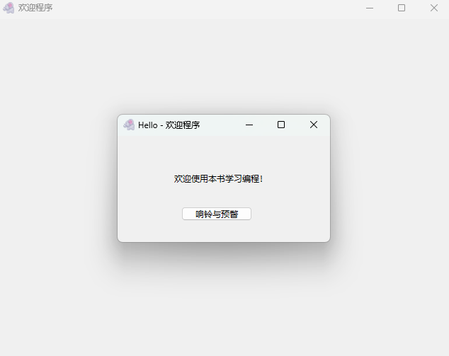
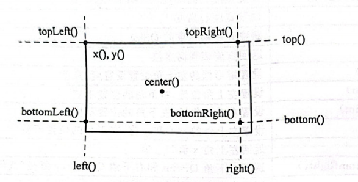
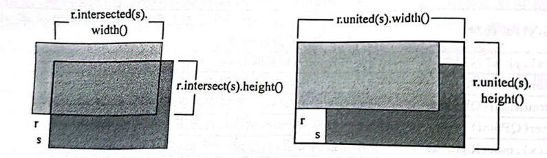
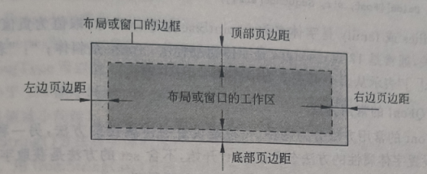
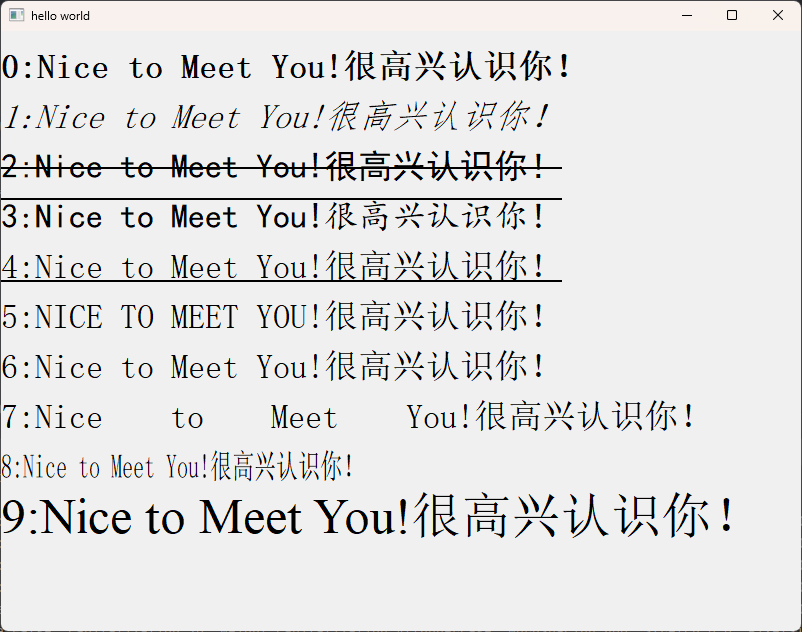

# 04.QApplication

```python
QApplication(self) -> None
QApplication(self, arg__1: Sequence[str]) -> None
```

在进行可视化编程时,无论出现几个窗口,都要创建一个而且只能创建一个QApplication类的实例对象,为窗口的正确显示提供基本的条件。

QApplication的实例对象代表整个运行程序,通过对QApplication实例对象的设置可以对整个应用程序进行设置。

QApplication类提供的方法如表所示,其中一些方法及参数在后续的内容中进行介绍。

需要注意的是,参数类型是以"Qt"开始的枚举类型时,需要用"from PySide6.QtCore import Qt"语句从 QtCore 模块中导入 Qt.例如 setEffectEnabled(Qt.UIEffect,enable=True)方法中,枚举类型Qt.UIEffect 是指 PySide6.QtCore.Qt中的枚举类型；Union[paral, para2...]是类型选择,表示可以从所列的类型中选择其中的一个数据类型作为参数。

## QApplication方法一览

| QApplication的方法及参数类型                                 | 返回值类型    | 说 明                                                        |
| ------------------------------------------------------------ | ------------- | ------------------------------------------------------------ |
| [static]exec()                                               | int           | 进入消息循环,直到遇到 exit()命令                             |
| [static]quit()                                               | None          | 退出程序                                                     |
| [static]exit(retcode:int=0)                                  | None          | 退出程序,exec()的返回值是 retcode                            |
| [static]setQuitOnLastWindowClosed(bool)                      | None          | 设置当最后一个窗口关闭时,程序是否退出, 默认是 True           |
| setAutoSipEnabled(bool)                                      | None          | 对于接受键盘输入的控件,设置是否自动弹出 软件输人面板(software input panel),仅对需 要输入面板的系统起作用 |
| autoSipEnabled()                                             | bool          | 获取是否自动弹出软件输入面板                                 |
| setStyleSheet(sheet:str)                                     | None          | 设置样式表                                                   |
| styleSheet()                                                 | str           | 获取样式表                                                   |
| [static]activeModalWidget()                                  | QWidget       | 获取带模式的活跃对话框                                       |
| [static]activePopupWidget()                                  | QWidget       | 获取活跃的菜单                                               |
| [static]activeWindow()                                       | QWidget       | 返回能接收键盘输入的顶层窗口                                 |
| [static]alert(QWidget, duration: int=0)                      | None          | 使非活跃的窗口发出预警,并持续指定的时间(毫秒)。如果持续时间为0,则一直发出预警, 直到窗口变成活跃的窗口 |
| [static]allWidgets()                                         | List[QWidget] | 获取所有的窗口和控件列表                                     |
| [static]beep()                                               | None          | 发出铃响                                                     |
| [static]closeAllWindows()                                    | None          | 关闭所有窗口                                                 |
| [static]cursorFlashTime()                                    | int           | 获取光标闪烁时间                                             |
| [static]setDoubleClickInterval(int)                          | None          | 设置鼠标双击时间(毫秒)以区分双击和两次 单击                  |
| [static]doubleClickInterval()                                | int           | 获取鼠标双击的时间间隔                                       |
| [static]focusWidget()                                        | QWidget       | 获取接收键盘输人的有焦点的控件                               |
| [static]setFont(QFont)                                       | None          | 设置程序默认字体                                             |
| [statie]font()                                               | QFont         | 获取程序的默认字体                                           |
| [static]font(QWidget)                                        | QFont         | 获取指定控件的字体                                           |
| [static]setEffectEnabled(Qt.UIEffect,enable=True)            | None          | 设置界面特效,Qt.UIEffect 可以取 Qt.UI_ AnimateMenu、Qt.UI_ FadeMenu、Qt.UI_ FadeTooltip、Qt.UI_ AnimateCombo、Qt.UI_ AnimateTooltip,Qt.UI_AnimateToolBox |
| [static]isEffectEnabled(Qt.UIEffect)                         | bool          | 获取是否有某种特效                                           |
| [static]keyboardInputInterval()                              | int           | 获取区分两次键盘输人的时间间隔                               |
| [static]palette()                                            | QPalette      | 获取程序默认的调色板                                         |
| [static]palette(QWidget)                                     | QPalette      | 获取指定控件的调色板                                         |
| [static]setActiveWindow(QWidget)                             | None          | 将窗口设置成活跃窗口以响应事件                               |
| [static]setCursorFlashTime(int)                              | None          | 设置光标闪烁时间(毫秒)                                       |
| [static]setEffectEnabled(Qt.UIEffect,enable: bool=True)      | None          | 设置界面特效                                                 |
| [static]setKeyboardInputInterval(int)                        | None          | 设置区分键盘两次输人的时间间隔                               |
|                                                              |               |                                                              |
|                                                              |               |                                                              |
| [static]setPalelve(Union[QPalette, Qt.GlobalColor,QColor])   | None          | 设置程序默认的调色板                                         |
| [static]setStartDragDistance(int)                            | None          | 设置拖拽动作开始时,光标的移动距离(像 素),默认值是10          |
| [static]startDragDistance()                                  | int           | 获取拖拽起始时光标需移动的距离                               |
| [static]setStartDragTime(ms:int)                             | None          | 设置拖拽动作开始时,鼠标按下的时间(毫 秒),默认是500           |
| [static]startDragTime()                                      | int           | 获取从按下鼠标按键起到拖拽动作开始的 时间                    |
| [static]setStyle(QStyle)                                     | None          | 设置程序的风格                                               |
| [static]style()                                              | QStyle        | 获取风格                                                     |
| [static]setWheelScrollL,ines(int)                            | None          | 设置转动滚轮时,界面控件移动的行数,默认                       |
| [static]topLevelAt(QPoint)                                   | QWidget       | 是3 获取指定位置的顶层窗口                                   |
| [static]topLevelAt(x:int,y: int)                             | QWidget       | 获取指定位置的顶层窗口                                       |
| [static]topLevelWidgets()                                    | List[QWidget] | 获取顶层窗口列表,顶层窗口可能被隐藏                          |
| [static]widgetAt(QPoint)                                     | QWidget       | 获取指定位置的窗口                                           |
| [static]widgetAt(x: int,y:int)                               | QWidget       | 获取指定位置的窗口                                           |
| [static]setApplicationDisplayName(str)                       | None          | 设置程序中所有窗口标题栏上显示的名称                         |
| [static]setLayoutDirection(Qt.LayoutDirection)               | None          | 设置程序中的布局方向,Qt.LayoutDirection 可以取 Qt.LeftToRight、Qt.RightToLeft 或 Qt.LayoutDirectionAuto |
| [static]setOverrideCursor(Union[QCursor,Qt.CursorShape,QPixmap]) | None          | 设置应用程序当前的光标                                       |
| [static]overrideCursor()                                     | QCursor       | 获取当前的光标                                               |
| [static]restoreOverrideCursor()                              | None          | 恢复 set()verrideCursor()之前的光标设置,可 以多次恢复        |
| [static]setWindowIcon(Union[QIcon,QPixmap])                  | None          | 为整个应用程序设置默认的图标                                 |
| [static]windowIcon()                                         | QIcon         | 获取图标                                                     |
| Lstatic]setApplicationName(str)                              | None          | 设置应用程序名称                                             |
| [static]setApplicationVersion(str)                           | None          | 设置应用程序的版本                                           |
| [static]translate(context: bytes, key: bytes,disambiguation: bytes=None, n:int=-1) | str           | 字符串解码,本地化字符串                                      |
| Lstatic]postEvent(receiver:QObject, QEvent,Priority=Qt.EventPriority) | None          | 将事件放入消息队列的尾端,然后立即返回, 不保证事件立即得到处理 |
| Lstatic]sendEvent(receiver: QObject.QEvent)                  | bool          | 用notify()函数将事件直接派发给接收者进行 处理,返回事件处理情况 |
| [static]sendPostedEvents(receiver: QObject=None,event_type:int=0) | None          | 将事件队列中用postEvent()函数放人的事件 立即分发             |
| notify(QObject,QEvent)                                       | bool          | 把事件信号发送给接收者,返回接收者的 event()函数处理的结果    |
| event(QEvent)                                                | bool          | 重写该方法,处理事件                                          |
| [static]sync()                                               | None          | 处理事件使程序与窗口系统同步                                 |

## 例子

下同下面的程序创建两个窗口,通过QApplication的实例对象app为整个程序设置标题栏上的名称和图标,在第2个窗口上单击"响铃与预警"按钮,将会发出响铃,并使第一个窗口在任务栏上闪烁。



```python
import sys
from PySide6.QtWidgets import QApplication, QWidget, QLabel, QPushButton
from PySide6.QtCore import Qt
from PySide6.QtGui import QPixmap


class myWidget(QWidget):

    def __init__(self, parent=None):
        super().__init__(parent)
        self.setupui()

        self.button.clicked.connect(self.bell_alert)

    def setupui(self):
        self.setWindowTitle('Hello')
        self.resize(300, 150)

        self.label = QLabel(self)  # 在窗口上创建标签
        self.label.setText('欢迎学习pyside6编程！')
        self.label.setGeometry(80, 50, 150, 20)

        self.button = QPushButton(self)
        self.button.setText("响铃与预瞥")
        self.button.setGeometry(90, 100, 100, 20)

    def bell_alert(self):
        QApplication.beep()  # 程序发出响铃声
        QApplication.alert(win, duration=0)  # 第2个窗口发出预警


if __name__ == "__main__":
    app = QApplication(sys.argv)
    app.setApplicationDisplayName("欢迎程序")  # 设置所有窗口标题栏上显示的名称
    app.setEffectEnabled(Qt.UIEffect.UI_AnimateCombo)
    app.setWindowIcon(QPixmap(r'../../Resources/animal/m1.png'))  # 为所有窗口设置图标

    win = QWidget()  # 创建第1个窗口
    win.show()

    myWindow = myWidget()  # 用myWidget()创建第2个窗口
    myWindow.show()

    sys.exit(app.exec())
```

# 参数/单位类

## 坐标点类QPoint和QPointF

电脑屏幕的坐标系的原点在左上角,从左到右是x轴方向,从上往下是y轴方向。

要定位屏幕上的一个点的位置,需要用到QPoint类或QPointF类,这两个类的区别是QPoint用`整数`定义x和y值,QPointF用`浮点数`定义x和y值。

QPoint类和 QPointF类在QtCore 模块中,使用前需用`from PySide6.QtCore import QPoint,QPointF`语句导人到当前程序中。

用QPoint 和 QPointF 类定义坐标点实例的方法如下所示,其中xpos和ypos分别表示x和y坐标。

```python
QPoint()
QPoint() -> None
QPoint(QPoint: PySide6.QtCore.QPoint) -> None
QPoint(xpos: int, ypos: int) -> None

QPointF()
QPointF() -> None
QPointF(QPointF: Union[PySide6.QtCore.QPointF, PySide6.QtCore.QPoint]) -> None
QPointF(p: PySide6.QtCore.QPoint) -> None
QPointF(xpos: float, ypos: float) -> None
```

**QPoint 类和 QPointF 类的方法**

| 方法及参数类型                                               | 说明                                          |
| ------------------------------------------------------------ | --------------------------------------------- |
| `setX(int)`<br />`setX(float)`                               | 设置x坐标值                                   |
| `setY(int)`<br />`setY(float)`                               | 设置Y坐标值                                   |
| `x()`                                                        | 获取x坐标值                                   |
| `y()`                                                        | 获取Y坐标值                                   |
| `toTuple()`                                                  | 输出元组(x, y)                                |
| [static]`dotProduct(p1: Union[QPointF, QPoint], p2: Union[QPointF, QPoint]) -->Union[int, float]` | 两个点的x和y坐标乘积之和,即x1\* x2 + y1 \* y2 |
| `isNull(self) -> bool`                                       | 如果x=y=0则返回Ture                           |
| `manhattanLength(self) -> float`                             | 返回x和y绝对值的和                            |
| `transposed(self) -> QPointF`/ `QPoint`                      | 将x和y对调                                    |
| `toPoint(self) -> QPoint`                                    | 用四舍五入把 `QPointF`转换成 `QPoint`         |

QPoint或 QPointF 可以当作二维向量,用于加减运算,也可以与一个整数或浮点数相乘或相除,还可以逻辑判断,例如下面的代码。

```python
from PySide6.QtCore import QPoint, QPointF

p1=QPoint(-3, 4)
p2=QPointF(5, 8)

print(QPoint.dotProduct(p1, p1), QPointF.dotProduct(p1, p2))

p3=p2 - p1

p4=p1 * 3

print(p3.x(), p3.y(), p4.x(), p4.y())
print(p1==p2, p1 !=p2)

"""
运算结果如下:
25 17.0
8.0 4.0 -9 12
False True
"""
```

## 尺寸类Qsize和QsizeF

一个控件或窗口有长度和高度属性,长度和高度可以用QSize类或QSizeF 类来定义

QSize 类和 QSizeF 类在 QtCore 模块中,使用前需用`from PySide6.QtCore import QSize,QSizeF`语句导人到当前程序中。

用QSize 和 QSizeF 定义尺寸实例的方法如下,其中w和h分别表示宽度或高度,QSize 用整数定义,QSizeF 用浮点数定义。

```python
QSize():
QSize(self) -> None
QSize(QSize: PySide6.QtCore.QSize) -> None
QSize(w: int, h: int) -> None


QSizeF():
QSizeF(self) -> None
QSizeF(QSizeF: Union[PySide6.QtCore.QSizeF, PySide6.QtCore.QSize]) -> None
QSizeF(sz: PySide6.QtCore.QSize) -> None
QSizeF(w: float, h: float) -> None
```

QSize 和QSizeF 的方法基本相同

QSizeF的常用方法如表所示。

- 主要方法是用setWidth(float)、setHeight(float)设置宽度和高度；用width()、height()方法获取宽度和高度。
- `scale(width:float, height: float,Qt.AspectRatioMode)`方法中,`Qt.AspectRatioMode` 可以取以下:
  - `Qt.IgnoreAspectRatio`(不保持比例关系,缩放后的QSizeF尺寸(width,height))
  - `Qt.KeepAspectRatio`(保持原比例关系,缩放后的QSizeF 在(width,height)内部尽可能大)
  - `Qt.KeepAspectRatioByExpanding`(保持原比例关系,缩放后的QSizeF 在(width,height)外部尽可能小),参数值不同,返回的值也不同；
- `shrunkBy(Union[QMargins,QMarinsF])`方法中,根据页边距 `QMargins`或 `QMarginsF`指定的收缩距离,返回新的 `QSizeF`,`QMargins `和 `QMarginsF `

| 方法                                                         | 返回值和类型 | 说明                                                         |
| ------------------------------------------------------------ | ------------ | ------------------------------------------------------------ |
| `setWidth(float)`、`setHeight(float)`<br />`setWidth(int)`、`setHeight(int)` | None         | 设置宽和高                                                   |
| `width()`、`height()`                                        | int / float  | 获取宽和高                                                   |
| `shrunkBy(Union[QMargins,QMarginsF])`                        | QSizeF       | 在原QSizeF 基础上根据页边距收缩得到新QSizeF                  |
| `grownBy(Union[QMargins,QMarginsF]))`                        | QSizeF       | 在原QSizeF基础上根据页边距扩充得到新QSizeF                   |
| `boundedTo(Union[QSize,QSizeF])`                             | QSizeF       | 新QSizeF的高度是自己和参数的高度中值小的高度,宽度亦然        |
| `expandedTo(Union[QSize,QSizeF])`                            | QSizeF       | 新QSizeF 的高度是自已和参数的高度中值大的高度,宽度亦然       |
| `toTuple()`                                                  | Tuple        | 返回元组(width,height)                                       |
| `isEmpty()`                                                  | bool         | 当宽度和高度有一个小于等于0时.返回值是True                   |
| `isNull()`                                                   | bool         | 宽度和高度都是0时,返回值是 True                              |
| `isValid()`                                                  | bool         | 当宽度和高度都大于等于0时,返回值是True                       |
| `transpose()`                                                | None         | 高度和宽度对换                                               |
| `transposed()`                                               | QSizeF       | 新QSizeF的高度是原QSizeF的宽度,宽度是原QSizeF的高度          |
| `scale(width:loat, height:float, Qt.AspectRatioMode)`        | None         | 根据高度和宽度的比值参数Qt.AspectRatioMode.重新设置原 QSizeF 的宽度和高度 |
| `scale(QSizeF,Qt.AspectRatioMode)`                           | None         | 根据高度和宽度的比值参数Qt.AspectRatioMode.重新设置原 QSizeF 的宽度和高度 |
| `scaled(width: float, height: float, Qt.AspectRatioMode)`    | QSizeF       | 返回调整后的新 QSizeF                                        |
| `scaled(QSizeF,QAspectRatioMode)`                            | QSizeF       | 返回调整后的新 QSizeF                                        |
| `toSize()`                                                   | QSize        | 将QSizeF 转换成 QSize                                        |

QSize 和 QSizeF类也可以进行加减乘除运算和逻辑运算,例如下面的代码

```python
from PySide6.QtCore import QSize, QSizeF, QMargins, Qt

s1=QSize(5, 6)
s2=QSizeF(8, 10)

s3=s2 - s1
print("s3:", s3.width(), s3.height())

s4=s1
print("s4:", s4.width(), s4.height())

margin=QMargins(1, 2, 3, 4)
s5=s2.shrunkBy(margin)
print("s5:", s5.width(), s5.height())

s1=QSize(5, 6)
ss=s1.scaled(10, 20, Qt.AspectRatioMode.IgnoreAspectRatio)
print("IgnoreAspectRatio:", ss.width(), ss.height())

ss=s1.scaled(10, 20, Qt.AspectRatioMode.KeepAspectRatioByExpanding)
print("KeepAspectRatioByExpanding", ss.width(), ss.height())

"""
s3: 3.0 4.0
s4: 5 6
s5: 4.0 4.0
IgnoreAspectRatio: 10 20
KeepAspectRatioByExpanding 16 20
"""
```

## 矩形框类QRect和QRectF

### 矩形框类QRect和QRectF

矩形框可以定义一个矩形区域,含有 QPoint 和QSize 信息的类形的左上角是QPoint 的信息,矩形框的宽度和高度是 QSize 信息。对于一个控件,在窗口中有位置宽度和高度信息,控件的位置可以通过其左上角的位置确定,控件的位置、宽度和高度都可以通过矩形框类来定义。

矩形框类分为 QRect 和 QRectF 两种它们在 QtCore 块中使用前需要用`from PySide6.QtCore import QRect, QRectF`语句导人到当前程序中。

用QRect 或 QRectF 类来定义矩形框实例对象,可以采用以下几种方法,其中 QRect用整数定义,QRectF 用浮点数定义。

```python
QRect:
QRect(self) -> None
QRect(QRect: PySide6.QtCore.QRect) -> None
QRect(left: int, top: int, width: int, height: int) -> None
QRect(topleft: PySide6.QtCore.QPoint, bottomright: PySide6.QtCore.QPoint) -> None
QRect(topleft: PySide6.QtCore.QPoint, size: PySide6.QtCore.QSize) -> None


QRectF:
QRectF(self) -> None
QRectF(QRectF: Union[PySide6.QtCore.QRectF, PySide6.QtCore.QRect]) -> None
QRectF(left: float, top: float, width: float, height: float) -> None
QRectF(rect: PySide6.QtCore.QRect) -> None
QRectF(topleft: Union[PySide6.QtCore.QPointF, PySide6.QtCore.QPoint], bottomRight: Union[PySide6.QtCore.QPointF, PySide6.QtCore.QPoint]) -> None
QRectF(topleft: Union[PySide6.QtCore.QPointF, PySide6.QtCore.QPoint], size: Union[PySide6.QtCore.QSizeF, PySide6.QtCore.QSize]) -> None
```

矩形框QRect类的常用方法如表所示:

用QRect或QRectF 定的矩形有4个角点 topLeft,topRight,bottomLeft、bottomRight,4 个边 left,right,top,bottom 和1 个中心 center 几何特征,通过一些方法可以获取或者移动角点位置、边位置或中心位置

| 方法                       | 说明                                                         |
| -------------------------- | ------------------------------------------------------------ |
| setLeft(x),setRight(x)     | 设置左边 x值和y 值位置,上边和下边位置不变                    |
| setTop(y)                  | 设置上边位置y值,左右和底边不变                               |
| setBottom(y)               | 设置底部值,真实底部值需要再加 1                              |
| setBottommLeft(QPoint)     | 设置左下角位置,右上角的位置不变                              |
| setBottomRight(QPoint)     | 设置右下角位置,左上角的位置不变                              |
| setCoords(xl,yl,x2,y2)     | 设置左上角坐标 x1y1和右下角坐标 x2y2真实右下角坐标需要横纵坐标都加1 |
| getCoords()                | 返回左上角和右下角坐标元组(int,int,int,int),有下角的x和值都要减去 1 |
| serWidth(w),setHeight(h)   | 设置宽度和高度,左上角的位置不变                              |
| setSize(QSize)             | 设置宽度和高度                                               |
| size()                     | 获取高度和宽度的 QSize                                       |
| width(),height()           | 返回宽度值和高度值                                           |
| setRect(x,y,w,h)           | 设置矩形框的左上角位置及宽度、高度                           |
| setTopLeft(QPoint)         | 设置左上角位置,右下角的位置不变                              |
| setTopRight(QPoint)        | 设置右上角位置,左下角的位置不变                              |
| setX(x) ,setY(y)           | 设置左上角的x值和y值,右下角的位置不变                        |
| x()、y()                   | 返回左上角 x值和y值                                          |
| bottomLeft(),bottomRight() | 返回左下角 QPoint 和右下角 QPoint,y值是(底部 y一1)           |
| center()                   | 返回中心点QPoint                                             |
| getRect()                  | 返回左上角坐标和宽高元组(x,y,w,h)                            |
| isEmpty()                  | 当宽度和高度有一个小于等于0时,返回值是 True                  |
| isNull()                   | 当宽度和高度都是 0时,返回值是 True                           |
| isValid()                  | 当宽度和高度都大于0时,返回值是True                           |
| adjust(xl,yl ,x2,y2)       | 调整位置,调整后的位置是在原左上角的x和分别加x1和y右下角的x和y分别加x2和y2 |
| adjusted(xl,y1,x2 ,y2)     | 调整位置,并返回新的 QRect 对象                               |
| moveBottomLeft(QPoint)     | 移动左下角到QPoint,宽度和高度不变                            |
| moveBottomRight(QPoint)    | 移动右下角到QPoint,宽度和高度不变                            |
| moveCenter(QPoint)         | 移动中心到 QPoint,宽度和高度不变                             |
| moveLeft(x), moveRight(x)  | 移动左边到x值,右边到x+1值,宽度和高度不变                     |
| moveTo(QPoint, moveTo(x,y) | 左上角移动到 QPoint 点或(x;)点,宽度和高度不变                |
| moveTop(y), moveBottom(y)  | 移动上边到 y底部到 y+1值宽度和高度不                         |
| moveTopLeft(QPoint)        | 移动左上角到QPoint宽度和高度不变                             |
| moveTopRight(QPoint)       | 移动右上角到 QPoint,宽度和高度不变                           |
| left(), right()            | 返回左边 x 值和右边 x-1值                                    |
| top(), bottom()            | 获取左上角的 y值和底部 y-1值                                 |
| topLeft(), topRight()      | 获取左上角的QPoint 和右上角的 QPoint                         |
| intersected(QRect)         | 返回两个矩形的公共交叉矩形 QRect                             |
| intersects(QRect)          | 判断两个矩形是否有公共交叉矩形                               |
| united(QRect)              | 返回由两个矩形的边形成的新矩形                               |
| translate(dx,dy)           | 矩形框整体平移 dx, dy                                        |
| translate(QPoint)          | 矩形框整体平移QPoint,x() QPoint.y()                          |
| translated(dx,dy)          | 返回平移 dx和 dy 后的新 QRect                                |
| translated(QPoint)         | 返回平移 QPoint.x()和 QPoint,y()后的新 QRect                 |
| transposed()               | 返回宽度和高度对换后的新 QRect                               |

用表中的方法获取右边线、底边线、右下角左下角和右上角的坐标值时,如下图所示,右下角的 x 值和值返回值比真实值都小1右边线和底边线比真实值都小1。

在算右下角的坐标时,可以用`rect.x()十rect.width()"和"rect.y()十rect.height()`语句到x和y坐标



intersected()方法可以计算两个矩形的交矩形而united()方法可以计算两个矩形的矩形,它们的运算关系如图



矩形框类常用于定义控件的左上角的位置和宽度、高度,例如下面的语句定义一个标签Label 的左上角坐标为(80,150),宽度是 100,高度是 20

```python
label=QLabel(self)
rect=QRect(80, 150, 100, 20)
label.setGeometry(rect)
```

### 页边距类QMargins和QMarginsF

页边距类 QMargins 和 QMarginsF 通常应用于布局窗口和打印中,设置布局控件窗口内的工作区距边框的左边、顶部、右边和底部的距离,如图所示

在打印中设置打印区域距纸张四个边的距离。用布局或窗口的 setContentsMargins(QMargins)方法可设置页边距。



使用前需要使用`from PySide6.QtCore import QMargins, QMarginsF`导入。

QMargins 定义的页边距是整数,QMarginsF 定义的页边距是浮点数(float)。用QMargins和QMarginsF 创建页边距对象的方法如下所示。

```python
QMargins:
QMargins(self) -> None
QMargins(QMargins: PySide6.QtCore.QMargins) -> None
QMargins(left: int, top: int, right: int, bottom: int) -> None


QMarginsF:
QMarginsF(self) -> None
QMarginsF(QMarginsF: Union[PySide6.QtCore.QMarginsF, PySide6.QtCore.QMargins]) -> None
QMarginsF(left: float, top: float, right: float, bottom: float) -> None
QMarginsF(margins: PySide6.QtCore.QMargins) -> None

```

QMargins和QMarginsF 的方法基本相同QMarginsF 的常用方法下表所示,其中isNull()方法获取页边距是否为空,如果所有边距都接近0,则返回值是True。

| QMarginsF的方法  | 返回值类型 | 说明               |
| ---------------- | ---------- | ------------------ |
| setLeft(iloat)   | None       | 设置左边距         |
| left()           | float      | 获取左边距         |
| setTop(float)    | None       | 设置顶边距         |
| top()            | float      | 获取顶边距         |
| isNull()         | bool       | 获取页边距是否为空 |
| setRight(float)  | None       | 设置右边距         |
| right()          | float      | 获取右边距         |
| setBottom(float) | None       | 设置底边距         |
| botlom()         | float      | 获取底边距         |
| toMargins()      | QMargins   | 转换成 QMargins    |

## 字体类QFont类

字体类 QFont 可以设置界面控件上显示的字体,字体属性包括字体名称、字体尺寸粗体字、倾斜字、上/下划线、删除线等。

如果指定的字体在使用时没有对应的字体文件,Qt 将自动选择最接近的字体,如果要显示的字符在字体中不存在,则字符会被显示为一个空心方框。

字体类在QtGui模块中使用前需要用`from PySide6.QtGui import QFont`语句把字体类导人进来。用字体类定义字体实例对象的方法如下。

```python
QFont(self) -> None
QFont(families: Sequence[str], pointSize: int=-1, weight: int=-1, italic: bool=False) -> None
QFont(family: str, pointSize: int=-1, weight: int=-1, italic: bool=False) -> None
QFont(font: Union[PySide6.QtGui.QFont, str, Sequence[str]]) -> None
QFont(font: Union[PySide6.QtGui.QFont, str, Sequence[str]], pd: PySide6.QtGui.QPaintDevice) -> None
```

参数:

- families 或 family 是字体名称;
- pointSize 是字体尺寸,取值为负值或0时,字体尺寸与系统有关,通常是12 点;
- weight 是字体粗细程度;
- italic 是斜体

字体类 QFont 的常用方法分为两种,一种是设置字体属性的方法,另一种是获取字体属性的方法。设置字体属性的方法名称以"set"开始不含 set 的方法是取字体的属性值字体类 QFont 的常用方法如表所示,主要方法介绍如下。

| QFont 的方法及参数类型                     | 返回值的类型         | 说明                                             |
| ------------------------------------------ | -------------------- | ------------------------------------------------ |
| setBold(bool)                              | None                 | 设置粗体                                         |
| bold()                                     | bool                 | 如果 weight()的值大于 QFont.Medium的值,返回 True |
| serCapitalization(QFont.Capitalization)    | None                 | 设置大小写字体                                   |
| capitalization()                           | QFont.Capitalization | 获取大小写状态                                   |
| setFamilies(Sequence[str])                 | None                 | 设置字体名称                                     |
| families()                                 | List[sur]            | 获取字体名称                                     |
| setFamily(str)                             | None                 | 设置字体名称                                     |
| family()                                   | str                  | 获取字体名称                                     |
| setFixedPitch(bool)                        | None                 | 设置固定宽度                                     |
| fixedPitch()                               | bool                 | 获取是否设置了固定宽度                           |
| setItalic(bool)                            | None                 | 设置斜体                                         |
| italic()                                   | bool                 | 获取是否斜体                                     |
| setKerning(bool)                           | None                 | 设置字距,"a"的宽度+"b"的宽度不一定等于"ab"的宽度 |
| kerning()                                  | bool                 | 获取是否设置了字距属性                           |
| setLetterSpacing(QFont, SpacingType.float) | None                 | 设置字符间隙                                     |
| letterSpacing()                            | float                | 获取字符间距                                     |
| setOverline(bool)                          | None                 | 设置上划线                                       |
| overline()                                 | bool                 | 获取是否设置了上划线                             |
| setPixelSize(int)                          | None                 | 设置像素尺寸                                     |
| pixelSize()                                | int                  | 获取像素尺寸                                     |
| setPointSize(int)                          | None                 | 设置点尺寸                                       |
| pointSize()                                | int                  | 获取点尺寸                                       |
| setPointSizeF(float)                       | None                 | 设置点尺寸,参数是浮点数                          |
| pointSizeF()                               | float                | 获取点尺寸                                       |
| setStretch(int)                            | None                 | 设置拉伸百分比                                   |
| stretch()                                  | int                  | 获取拉伸百分比                                   |
| setStrikeOut(bool)                         | None                 | 设置删除线                                       |
| strikeOut()                                | bool                 | 获取是否设置了删除线                             |
| setStyle(QFont.Style)                      | None                 | 设置字体风格                                     |
| style()                                    | QFont.Style          | 获取字体风格                                     |
| setUnderline(bool)                         | None                 | 设置下划线                                       |
| underline()                                | bool                 | 获取是否设置了下划线                             |
| setWeight(QFont.Weight)                    | None                 | 设置字体粗细程度                                 |
| weight()                                   | QFont.Weight         | 获取字体的粗细程度                               |
| setWordSpacing(float)                      | None                 | 设置字间距离                                     |
| wordSpacing()                              | float                | 获取字间距                                       |
| toString()                                 | str                  | 将字体属性以字符串形式输出                       |
| fromString(str)                            | bool                 | 从字符串中读取属性,成功则返回 True               |

- 窗口上的各种控件及窗口都会有字体属性,通过控件或窗口的 font()方法可以获取字体,然后对获取的字体按照表所示的方法进行字体属性设置,设置完成后通过控件或窗口的 setFont(QFont)方法将设置好的字体重新赋给控件或窗口。当然也可以定义一个全新的字体对象,再通过控件或窗口的 setFont(QFont)方法将这个全新的字体赋给控件或窗口,可以用QApplication 的 setFont(QFont)方法为整个应用程序设置默认字体。
- 用setFamily(str)方法设置字体名称,名称中可以用逗号将多个字体名称隔开PySide6 自动根据逗号将名称分解成多个字体名称,也可以直接用setFamilies(Sequence[str])方法设置多个字体名称,第1个是主字体。需要注意的是字体名称的大小写敏感,当设置的字体名称不支持时,会自动搜索匹配的字体,当字体不支持文字符号时,文字符号用方框来表示
- setPixelSize(int)方法使用像素作为单位来设置字体大小。setPointSize(int)方法设置实际中我们肉眼看到的字体的大小,与像素无关。使用setPixelSize(int)方法设置字体尺寸时,在像素大小不同的设备上显示的大小也不同。使用setPointSize(int)方法设置的字体尺寸,在不同设备上显示的大小是相同的。如果指定了pointSize,则像素 pixelSize 尺寸的属性值是-1;反之,如果指定了 pixelSize,则pointSize属性值是-1。字体尺寸也可以用setPointSizeF(float)方法设置,其中参数是浮点数。
- 用setCapitalization(QFont, Capitalization)方法设置大小写方法,枚举类型 QFont.Capitalization 可以取 QFont.MixedCase、QFont, AllUppercase、QFontAllLowercase、QFont,SmallCaps 或 QFont,Capitalize(每个字的首字母大写)。
- 用setWeight(QFont,Weight)方法设置字体的粗细程度,举类型 QFontWeight可以取 QFont, Thin,QFont, ExtraLight,QFont, Light,QFont, Normal、QFont.Medium,QFont, DemiBold、QFont, Bold,QFont, ExtraBold 或 QFont, Black,对应值分别是 100、200、·· 900,字体由细到粗。
- 用setStyle(QFont,Style)方法设置字体的风格,举类型QFont.Style 可以取QFont, StyleNormal,QFont, Styleltalic 或 QFont, StyleOblique
- 用setStretchint()方法设置拉伸百分比,参数大于 100 表示拉长,小于100表示缩的短,参数也可以用枚举值(见下)设置。`AnyStretch`拉伸系数仅应用于轮廓字体。位图字体将忽略拉伸因子。
  - `QFont.AnyStretch`(值为0表示可匹配其他字体属性)标识可匹配其他字体的属性,它将接受任何拉伸因子,不会对字体应用任何变换。
  - QFont.UltraCondensed(值为 50)
  - QFont,ExtraCondensed(值为 62)
  - QFont.Condensed(值为 75)
  - QFont,SemiCondensed(值为87)
  - QFont,Unstretched(值为100)
  - QFont.SemiExpanded(值为 112)
  - QFont Expanded(值为 125)
  - QFont.ExtraExpanded(值为150)
  - QFont,UltraExpanded(值为 200)来
- 用setLetterSpacing(QFont,SpacingType,float)方法设置字符间隙,其中 QFont.SpacingType 可以取 QFont,PercentageSpacing(用百分比来表示,大于 100 增大间隙,小于 100 减小间隙)或 QFont.AbsoluteSpacing(用绝对值来表示正值增大间隙,负值减小间隙)。
- 用toString()方法将宇体的属性以宇符串形式输出,这样可以把字体属性保存到文件中。用fromString(str)方法从字符申获取字体属性。

下面的程序在窗口上创建10个标签控件(QLabel),分别给 10个标签设置不同的字体属性,同时给应用程序设置默认字体。

```python
import sys
from PySide6.QtGui import QFont
from PySide6.QtWidgets import QApplication, QWidget, QLabel


class win_demo(QWidget):
    def __init__(self):
        super().__init__()
        self.set_wininit()

        self.fonts=list()
        self.labels=list()

        self.createFont()  # 调用函数
        self.createLabels()  # 调用函数
        self.getLabelFont()  # 调用函数

    def set_wininit(self):
        self.resize(800, 600)  # 设置窗口大小
        self.setWindowTitle("hello world")  # 设置窗口标题

    def createFont(self):  # 生成10个字体
        # 字体列表
        fontName=('宋体', '仿宋', '黑体', '楷体', '隶书', '幼圆', '华文中宋', '方正舒体', '华文黑体', 'Times New Roman')

        for i in range(10):
            f=QFont()
            f.setPointSizeF(25.5)
            f.setFamily(fontName[i])
            self.fonts.append(f)

        self.fonts[0].setBold(True)
        self.fonts[1].setItalic(True)
        self.fonts[2].setStrikeOut(True)
        self.fonts[3].setOverline(True)
        self.fonts[4].setUnderline(True)
        self.fonts[5].setCapitalization(QFont.AllUppercase)
        self.fonts[6].setWeight(QFont.Thin)
        self.fonts[7].setWordSpacing(50)
        self.fonts[8].setStretch(70)
        self.fonts[9].setPixelSize(50)

    def createLabels(self):
        string="Nice to Meet You!很高兴认识你！"

        for i in range(10):
            label=QLabel(self)  # 在窗口上创建标签控件
            label.setGeometry(0, 50 * i, 800, 70)  # 标签位置和尺寸
            label.setText(str(i) + ':' + string)  # 设置标签文字
            label.setFont(self.fonts[i])  # 设置标签文字的字体
            self.labels.append(label)

    def getLabelFont(self):  # 获取每个字体的信息
        # 标签列表
        print("字体信息:")
        template="Label{}: family:{}, Bold:{}, Italic:{}, StrikeOut:{}, OverLine:{}, UnderLine:{}, Capitalization:{}, Weight:{}, WordSpacing:{}, Stretch:{}, PixelSize:{}, pointSize:{}"
        j=0
        for i in self.labels:
            f=i.font()  # 获取标签的字体
            print(template.format(j, f.family(), f.bold(), f.italic(), f.strikeOut(), f.overline(), f.underline(), f.pointSize(), f.capitalization(), f.weight(), f.wordSpacing(), f.stretch(), f.pixelSize()))
            j +=1


if __name__=='__main__':
    app=QApplication(sys.argv)
    win=win_demo()

    win.show()
    sys.exit(app.exec())

```



## 颜色类QColor

PySide6 的颜色类是 QColor,需要导入 `from PySide6.QtGui import QColor`,颜色可以用以下方法表示:

- RGB(红,red；绿,green；蓝,blue)值来定义,还可以用
- HSV(色相,hue；饱和度,saturation；值,value)值、
- CMYK(青色,cyan；品红,magenta:色,yellow；黑色,black)
- HSL(色相,hue；饱和度,saturation；亮度,lightness)值来定义

RGB 和 HSV 可以用于电脑屏幕的颜色显示,红绿蓝三种颜色的值都为 0~255,值越大表示这种颜色的分量越大,HSV 中 H 的取值为0~359,S 和 V的取值都为0\~255,除了定义红绿蓝3种颜色成分外,通常还需要定义alpha通道值,表示颜色的透明度。alpha通道的取值也是0~255,值越大表示越不透明。

用QColor类定义颜色的方法如下所示,其中 QColor(name:str)中 name 是颜色名称例如'Blue'、Beige'、LightPink'。

- 颜色值还可以用RGB 字符串或ARGB字符串来定义RGB字符串格是"#RRGGBB",

- ARGB字符串格式是"#AARRGGBB"其中 RRGG和BB 分别是用十六进制表示的红、绿、蓝颜色的值,AA 是 alpha 通道的值例如"#00ff0000"表示红色。

- QtCore.Qt.GlobalColor 是指 QtCore.Qt 中定义的一些颜色校举常量,

- Qt.GlobalColor 是枚举常量,可以取

  - Qt.white
  - Qt.black
  - Qt.red
  - Qt.darkRed
  - Qt.green
  - Qt.darkGreen
  - Qt.blue
  - Qt.darkBlue
  - Qt.cyan
  - Qt.darkCyan
  - Qt.magenta
  - Qt.darkMagenta
  - Qt.yellow
  - Qt.darkYellow
  - Qt.gray
  - Qt.darkGray
  - Qt.lightGray

  Qt.transparent(透明黑色)

  Qt.color0(0 像素值,只针对 QBitmap 图像)或 Qt.color1(1像素值,只针对 QBitmap图像)。

  QColor.Spec 是枚举类型,可以取 QColor.RgbQColor.Hsv,QColor.Cmyk.QColor.Hsl、QColor,ExtendedRgb 或 QColor,Invalid,QColor, ExtendedRgb 表示的颜色值取浮点数时可以x小于 0 或大于 1。

```python
QColor(self) -> None
QColor(arg__1: Any) -> None
QColor(color: PySide6.QtCore.Qt.GlobalColor) -> None
QColor(name: str) -> None
QColor(r: int, g: int, b: int, a: int=255) -> None
QColor(rgb: int) -> None
QColor(rgba64: PySide6.QtGui.QRgba64) -> None
QColor(spec: PySide6.QtGui.QColor.Spec, a1: int, a2: int, a3: int, a4: int, a5: int=0) -> None
```

颜色类 QColor 的常用方法如表所示:

颜色类的方法中一种是名称以 set 开始的方法,为设置颜色相关值;另外一种名称没有 set 的是取颜色相关值,如 setRed(int)设置颜色的红色值,而 red()是获取颜色的红色值。

设置或获取颜色的相关值时,一种是用整数表示的值,另一种是用浮点数表示的值,用浮点数表示的值,取值范围是 0~1用setNamedColor(str)方法使用颜色名称或字符串来定义颜色,例如 setNamedColor('blue)setNamedColor('# 0012FF34')。用name(format; QColor.NameFormat=QColor.HexRgb)方法获取字符串颜色,其中 QColor,NameFormat 是举值可以取 QColor.HexRgb 或 QColor HexArgb,返回的颜色字符申分别是#RRGGBB和#AARRGGBBQ。Color 类一般不直接定义控件的颜色,而是与调色板或画刷一起使用。

### Qcolor的方法

| Qcolor的方法及参数类型                                       | 返回值的类型                          | 说 明                            |
| ------------------------------------------------------------ | ------------------------------------- | -------------------------------- |
| seRed(red: int)                                              | None                                  | 设置RGB的R值                     |
| setRedF(red:float)                                           | None                                  | 设置RGB的R值                     |
| red()                                                        | int                                   | 获取RGB值中的R值                 |
| redF()                                                       | float                                 | 获取RGB值中的R值                 |
| setGreen(green:int)                                          | None                                  | 设置RGB的G值                     |
| setGreenF(green:float)                                       | None                                  | 设置RGB的G值                     |
| green()                                                      | int                                   | 获取RGB值中的G值                 |
| greenF()                                                     | float                                 | 获取RGB值中的G值                 |
| setBlue(blue: int)                                           | None                                  | 设置RGB的B值                     |
| setBlueF(blue: float                                         | None                                  | 设置RGB的B值                     |
| blue()                                                       | int                                   | 获取RGB值中的B值                 |
| blueF()                                                      | float                                 | 获取RGB值中的B值                 |
| set Alpha(alpha: int)                                        | None                                  | 设置alpha 通道的值               |
| setAlphaF(alpha:float)                                       | None                                  | 设置alpha 通道的值               |
| alpha()                                                      | int                                   | 获取 alpha 通道的值              |
| alphaF()                                                     | float                                 | 获取 alpha 通道的值              |
| setRgb(r: int,g:int,b: int,a: int=255)                       | None                                  | 设置R、G、B、A值                 |
| setRgbF(r: float,g: float, b: float,a: float=1.0)            | None                                  | 设置R、G、B、A值                 |
| getRgb()                                                     | Tuple[int,int,int, int]               | 获取R、G、B、A值                 |
| getRgbF()                                                    | Tuple[float,float, float, float]      | 获取R、G、B、A值                 |
| setHsl(h:int,s:int,1: int,a: int=255)                        | None                                  | 设置HSL值                        |
| setHslF(h: float,s: float,1: float,a: float=1.0)             | None                                  | 设置HSL值                        |
| getHs1()                                                     | Tuple[int, int, int.int]              | 获取H、S、L和A值                 |
| getHslF()                                                    | Tuple[float, float, float,float]      | 获取H、S、L和A值                 |
| setHsv(h:int,s: int,v:int,a: int=255)                        | None                                  | 设置HSV值                        |
| setHsvF(h: float,s: float,v: float,a: float=1.0)             | None                                  | 设置HSV值                        |
| getHsv()                                                     | TupleCint,int, int, · int]            | 获取H、S、V和A值                 |
| getHsvF()                                                    | Tuple[float.float, float, float]      | 获取H、S、V和A值                 |
| setCmyk(c:int,m: int,y: int, k:int, a: int=255)              | None                                  | 设置CMYK值                       |
| setCmykF(c:float,m: float,y: float,k: float,a: float=1.0)    | None                                  | 设置CMYK值                       |
| getCmyk()                                                    | TupleCint, int,int, int,int]          | 获取C、M、Y、K和A值              |
| getCmykF()                                                   | Tuple[float,float, float,float,float] | 获取C、M、Y、K和A值              |
| setRgb(rgb:int)                                              | None                                  | 设置RGB值                        |
| setRgba(rgba:int)                                            | None                                  | 设置RGBA值                       |
| rgb()                                                        | int                                   | 获取 RGB值                       |
| rgba()                                                       | int                                   | 获取RGBA值                       |
| setNameclColor(str)                                          | None                                  | 设置颜色名称或"#AARRGGBB"        |
| name(format:QColor.NameFormat=QColor.HexRgb)                 | str                                   | 获取颜色的"#RRGGBB"或"#AARRGGBB" |
| convertTo(colorSpec: QColor.Spec)                            | QColor                                | 获取指定格式的颜色副本           |
| spec()                                                       | QColor.Spec                           | 获取颜色输出的格式               |
| isValid()                                                    | bool                                  | 获取颜色是否有效                 |
| toCmyk()                                                     | QColor                                | 转换成CMYK表示的颜色             |
| toHsl()                                                      | QColor                                | 转换成 HSL表示的颜色             |
| toHsv()                                                      | QColor                                | 转换成 HSV表示的颜色             |
| toRgb()                                                      | QColor                                | 转换成 RGB表示的颜色             |
| [static]fromCmyk(c:int,m: int,y:int,k:int,a:int=255)         | QColor                                | 从C、M、Y、K、A值中创建颜色      |
| [static]fromCmykF(c:float,m: float,y: float,k:float,a: float=1.0) | QColor                                | 从C、M、Y、K、A值中创建颜色      |
| [static]fromHsl(h: int,s:int,1: int,a:int=255)               | QColor                                | 从H、S、L、A值中创建颜色         |
| [static]fromHslF(h: float, s: float,1: fIoat,a: float=1.0)   | QColor                                | 从H、S、L、A值中创建颜色         |
| [static]fromHsv(h: int,s: int, v:int,a:int=255)              | QColor                                | 从H、S、V、A值中创建颜色         |
| [static]fromHsvF(h: float, s: float,v:float,a: float=1.0)    | QColor                                | 从H、S、V、A值中创建颜色         |
| [static]fromRgb(r:int,g: int, b: int,a:int=255)              | QColor                                | 从R、G、B、A值中创建颜色         |
| [static]fromRgbF(r:float,g: float,b: float,a: float=1.0)     | QColor                                | 从R、G、B、A值中创建颜色         |
| [static]fromRgb(rgb:int)                                     | QColor                                | 从RGB值中创建颜色                |
| [static]fromRgba(rgba:int)                                   | QColor                                | 从RGBA值中创建颜色               |
| [static]isValidColor(str)                                    | bool                                  | 获取用文本表示的颜色值是否有效   |

### RGB值与颜色名称的对应关系

| RGB                 | 颜色名称 |
| ------------------- | -------- |
| QColor(255,0,0)     | 红       |
| QColor(0,255,0)     | 绿       |
| QColor(0,0,255)     | 蓝       |
| QColor(79,129,189)  | 淡蓝     |
| QColor(192,80,77)   | 朱红     |
| QColor(155,187,89)  | 浅绿     |
| QColor(128,100,162) | 紫       |
| QColor(75,172,198)  | 浅蓝     |
| QColor(151,151,151) | 灰       |
| QColor(36,169,225)  | 天蓝     |
| QColor(91,74,66)    | 深棕     |
| QColor(130,57,53)   | 红棕     |
| QColor(137,190,178) | 蓝绿     |
| QColor(201,186,131) | 泥黄     |
| QColor(222,221,140) | 暗黄     |
| QColor(222,156,83)  | 橙       |
| QColor(199,237,233) | 亮蓝     |
| QColor(175,215,237) | 蓝灰     |
| QColor(92,167,186)  | 蓝绿     |
| QColor(147,224,255) | 浅蓝     |

