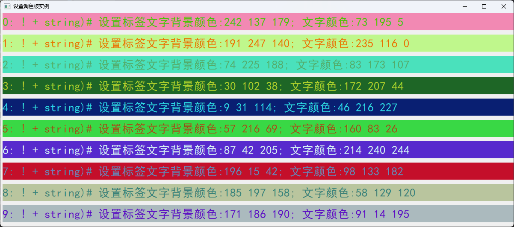
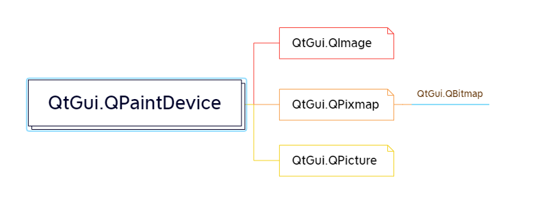
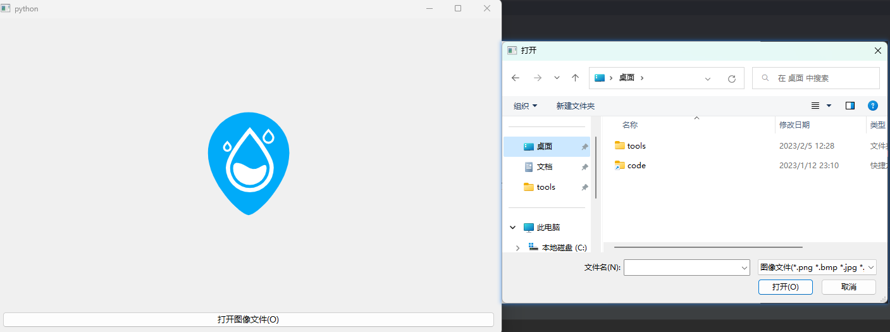
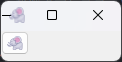
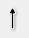
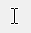
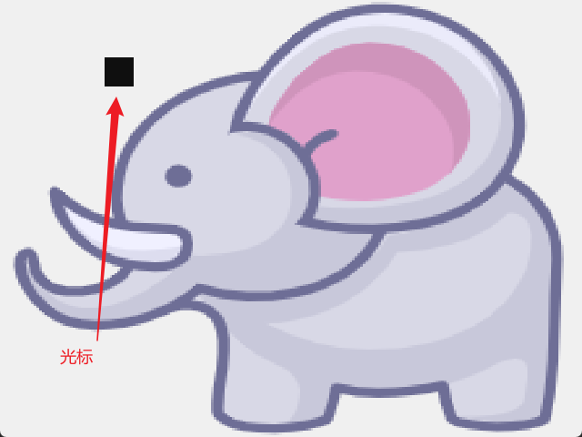
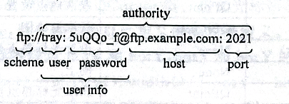

# 04.QApplication2

## 调色板类QPalette

使用调色板需要先导入:`from PySide6.QtGui import QPalette`

调色板实例对象的创建方式如下所示

```python
from PySide6.QtGui import QPalette
QPalette(self) -> None
QPalette(button: PySide6.QtCore.Qt.GlobalColor) -> None
QPalette(button: Union[PySide6.QtGui.QColor, PySide6.QtGui.QRgba64, Any, PySide6.QtCore.Qt.GlobalColor, str, int]) -> None
QPalette(button: Union[PySide6.QtGui.QColor, PySide6.QtGui.QRgba64, Any, PySide6.QtCore.Qt.GlobalColor, str, int], window: Union[PySide6.QtGui.QColor, PySide6.QtGui.QRgba64, Any, PySide6.QtCore.Qt.GlobalColor, str, int]) -> None
QPalette(palette: Union[PySide6.QtGui.QPalette, PySide6.QtCore.Qt.GlobalColor, PySide6.QtGui.QColor]) -> None
QPalette(windowText: Union[PySide6.QtGui.QBrush, PySide6.QtCore.Qt.BrushStyle, PySide6.QtCore.Qt.GlobalColor, PySide6.QtGui.QColor, PySide6.QtGui.QGradient, PySide6.QtGui.QImage, PySide6.QtGui.QPixmap], button: Union[PySide6.QtGui.QBrush, PySide6.QtCore.Qt.BrushStyle, PySide6.QtCore.Qt.GlobalColor, PySide6.QtGui.QColor, PySide6.QtGui.QGradient, PySide6.QtGui.QImage, PySide6.QtGui.QPixmap], light: Union[PySide6.QtGui.QBrush, PySide6.QtCore.Qt.BrushStyle, PySide6.QtCore.Qt.GlobalColor, PySide6.QtGui.QColor, PySide6.QtGui.QGradient, PySide6.QtGui.QImage, PySide6.QtGui.QPixmap], dark: Union[PySide6.QtGui.QBrush, PySide6.QtCore.Qt.BrushStyle, PySide6.QtCore.Qt.GlobalColor, PySide6.QtGui.QColor, PySide6.QtGui.QGradient, PySide6.QtGui.QImage, PySide6.QtGui.QPixmap], mid: Union[PySide6.QtGui.QBrush, PySide6.QtCore.Qt.BrushStyle, PySide6.QtCore.Qt.GlobalColor, PySide6.QtGui.QColor, PySide6.QtGui.QGradient, PySide6.QtGui.QImage, PySide6.QtGui.QPixmap], text: Union[PySide6.QtGui.QBrush, PySide6.QtCore.Qt.BrushStyle, PySide6.QtCore.Qt.GlobalColor, PySide6.QtGui.QColor, PySide6.QtGui.QGradient, PySide6.QtGui.QImage, PySide6.QtGui.QPixmap], bright_text: Union[PySide6.QtGui.QBrush, PySide6.QtCore.Qt.BrushStyle, PySide6.QtCore.Qt.GlobalColor, PySide6.QtGui.QColor, PySide6.QtGui.QGradient, PySide6.QtGui.QImage, PySide6.QtGui.QPixmap], base: Union[PySide6.QtGui.QBrush, PySide6.QtCore.Qt.BrushStyle, PySide6.QtCore.Qt.GlobalColor, PySide6.QtGui.QColor, PySide6.QtGui.QGradient, PySide6.QtGui.QImage, PySide6.QtGui.QPixmap], window: Union[PySide6.QtGui.QBrush, PySide6.QtCore.Qt.BrushStyle, PySide6.QtCore.Qt.GlobalColor, PySide6.QtGui.QColor, PySide6.QtGui.QGradient, PySide6.QtGui.QImage, PySide6.QtGui.QPixmap]) -> None
QPalette(windowText: Union[PySide6.QtGui.QColor, PySide6.QtGui.QRgba64, Any, PySide6.QtCore.Qt.GlobalColor, str, int], window: Union[PySide6.QtGui.QColor, PySide6.QtGui.QRgba64, Any, PySide6.QtCore.Qt.GlobalColor, str, int], light: Union[PySide6.QtGui.QColor, PySide6.QtGui.QRgba64, Any, PySide6.QtCore.Qt.GlobalColor, str, int], dark: Union[PySide6.QtGui.QColor, PySide6.QtGui.QRgba64, Any, PySide6.QtCore.Qt.GlobalColor, str, int], mid: Union[PySide6.QtGui.QColor, PySide6.QtGui.QRgba64, Any, PySide6.QtCore.Qt.GlobalColor, str, int], text: Union[PySide6.QtGui.QColor, PySide6.QtGui.QRgba64, Any, PySide6.QtCore.Qt.GlobalColor, str, int], base: Union[PySide6.QtGui.QColor, PySide6.QtGui.QRgba64, Any, PySide6.QtCore.Qt.GlobalColor, str, int]) -> None
```

### 颜色组ColorGroup,颜色角色ColorRole

PySide6中各种控件和窗口的颜色都由调色板类QPalette来定义,可以为窗体和窗体上的控件设置前景色、背景色,可以用palette()方法和 setPalette(QPalette)方法获取和设置窗体及控件的调色板,另外可以通过QApplication类的setPalette(QPalette)方法为整个应用程序设置默认的调色板。

QPalette类有两个基本的概念,一个是颜色组ColorGroup,另一个是颜色角色ColorRole。

颜色组ColorGroup 分为3种情况:

- 激活状态(`Active`,获得焦点)、
- 非激活状态(`Inactive`,失去焦点)
- 失效状态(`Disabled`,不可用),例如进行多窗口操作时.单击其中的一个窗口,可以在窗口中输人数据,则这个窗口是激活状态,其他窗口是非活跃状态。

当将一个控件的enable属性设置为False时(可通过 setEnabled(bool)方法设置),这个控件就处于失效状态,失效状态的控件不能接受任意输入,例如按钮不能单击、输人框中不能输人文字。对于一个控件,例如一个Label 标签或 PushButton按钮,可以设置其文字的颜色,也可以设置其背景颜色。

颜色角色ColorRole的作用是对控件或窗体的不同部分分别设置颜色。将ColorGroup 和ColorRole结合起来,可以为控件不同部分不同状态设置不同的颜色。

一个窗口由多个控件构成,可以用颜色角色为窗口和窗口中的控件定义不同的颜色角色。

PySide6 中颜色组由枚举常量 QPalettc.ColorGroup 确定,QPalette,ColorGroup 可取:

- `QPalette.ColorGroup.Active`激活,获得焦点
- `QPalette.ColorGroup.Normal`常规状态
- `QPalette.ColorGroup.Inactive`非激活,失去焦点
- `QPalette.ColorGroup.Disabled`失效状态 `Disabled`,禁用

颜色角色由枚举常量 `QPalette.ColorRole`确定, `QPalette.ColorRole`的枚举值如表所示。

| 枚举常量                           | 值   | 说明                                         |
| ---------------------------------- | ---- | -------------------------------------------- |
| QPalette.ColorRole.WindowText      | 0    | 窗口的前景色                                 |
| QPalette.ColorRole.Window          | 10   | 窗口控件的背景色                             |
| QPalette.ColorRole.Text            | 6    | 文本输入控件的前景色                         |
| QPalette.ColorRole.Button          | 1    | 按钮的背景色                                 |
| QPalette.ColorRole.Button Text     | 8    | 按钮的前景色                                 |
| QPalette.ColorRole.PlaceholderText | 20   | 输入框中占位文本的 颜色                      |
| QPalette.ColorRole.ToolTipBase     | 18   | 提示信息的背景色                             |
| QPalette.ColorRole.ToolTipText     | 19   | 提示信息的前景色                             |
| QPalette.ColorRole.BrightText      | 7    | 文本的对比色                                 |
| QPalette.ColorRole.AlternateBase   | 16   | 多行输入输出控件(如 QListWiget)行 交替背景色 |
| QPalette.ColorRole.Highlight       | 12   | 所选物体的背 景色                            |
| QPalette.ColorRole.HighlightedText | 13   | 所选物体的前 景色                            |
| QPalette.ColorRole.Link            | 14   | 超链接的颜色                                 |
| QPalette.ColorRole.LinkVisited     | 15   | 超链接访问后 颜色                            |
| QPalette.ColorRole.Light           | 2    | 与控件的3D效 果和阴影效果有 关的颜色         |
| QPalette.ColorRole.Midlight        | 3    | 与控件的3D效 果和阴影效果有 关的颜色         |
| QPalette.ColorRole.Dark            | 4    | 与控件的3D效 果和阴影效果有 关的颜色         |
| QPalette.ColorRole.Mid             | 5    | 与控件的3D效 果和阴影效果有 关的颜色         |
| QPalette.ColorRole.Shadow          | 11   | 与控件的3D效 果和阴影效果有 关的颜色         |
| QPalette.ColorRole.Base            | 9    | 文本输入控件(如 QTextEdit) 背景色            |

可以用`QColor`,`Qt.GlobalColor` `QBrush `或 `QGradient `来定义有初始颜色的调色板,其中 `QColor `和 `Qt.GlobalColor` 定义的颜色是纯颜色而 `QBrush `和 `QGradient `定义的颜色是可以渐变的。有关 QBrush 和 QGradient 的使用方法参 `QPainter`内容。

### 调色板类QPalctte 的常用方法

- 窗口上的各种控件及窗口都会有调色板属性,通过控件或窗口的 palette()方法可以获取调色板,然后对获取的调色板进行颜色设置,设置完成后通过控件或窗口的setPalette(QPalette)方法将设置好的调色板重新赋给控件或窗口,当然也可以定义一个全新的调色板对象,通过控件或窗口的 setPalette(QPalette)方法将这个全新的调色板赋予控件或窗口。
- 对控件或窗口的不同部分不同状态设置颜色需要用调色板的 setColor()方法或setBrush()方法。用brush()方法可以获得不同状态不同角色的画刷,过画刷的color()方法可以获得颜色 QColor 对象。
- 如果需要设置控件的背景色,应将背景色设置成自动填充模式,通过控件的方法setAutoFillBackground(True)来设置。对于按钮通常还需要关闭3D效果,通过按钮的 setFlat(True)来设定

| QPalette的方法及参数类型                                     | 返回值类型          |
| ------------------------------------------------------------ | ------------------- |
| serColor(QPalette.ColorGroup, QPalette.ColorRole, color: Union[QColcr,Qt.GlobalColor,str]) | None                |
| setColor(QPalette.ColorRole, color: Union[QColor, Qt.GlobalColor,str]) | None                |
| color(QPalette.ColorGroup, QPalette.ColorRole)               | QColor              |
| color(QPalette.ColorRole)                                    | QColor              |
| setBrush(QPalette.ColorGroup, QPalette.ColorRole,brush: Union[QBrush, Qt.BrushStyle, Qt.GlobalColor.QColor, QGradient, QImage,QPixmap]) | None                |
| setBrush(QPalette.ColorRole, brush: Union[QBrush, Qt.BrushStyle, Qt.GlobalColor, QColor, QGradient, QImage.QPixmap]) | None                |
| brush(QPalette.ColorGroup.QPalette.ColorRole)                | QBrush              |
| brush(QPalette.ColorRole)                                    | QBrush              |
| setCurrentColorGroup(QPalette.ColorGroup)                    | None                |
| currentColorGroup()                                          | QPalette.ColorGroup |
| alternateBase()                                              | QBrush              |
| base()                                                       | QBrush              |
| brightText()                                                 | QBrush              |
| button()                                                     | QBrush              |
| buttonText()                                                 | QBrush              |
| dark()                                                       | QBrush              |
| highlight()                                                  | QBrush              |
| highlightedText()                                            | QBrush              |
| isBrushSet(QPalette.ColorGroup, QPalette.ColorRole)          | 6001                |
| isEqual(crl: QPalette.ColorGroup,cr2: QPalette.ColorGroup)   | 6001                |
| light()                                                      | QBrush              |
| link()                                                       | QBrush              |
| linkVisited()                                                | QBrush              |
| mid()                                                        | QBrush              |
| midlight()                                                   | QBrush              |
| placeholderText()                                            | QBrush              |
| shadow()                                                     | QBrush              |
| text()                                                       | QBrush              |
| toolTipBase()                                                | QBrush              |
| toolTipText()                                                | QBrush              |
| window()                                                     | QBrush              |
| windowText()                                                 | QBrush              |

实例:



```python
import sys  # Demo2_4.Py
from PySide6.QtWidgets import QApplication, QWidget, QLabel
from PySide6.QtGui import QFont, QColor, QPalette
from random import randint, seed


class SetPalette(QWidget):
    def __init__(self, parent=None):
        super().__init__(parent)

        self.setGeometry(200, 200, 1200, 500)  # 设置窗口尺寸
        self.setWindowTitle("设置调色板实例")

        self.createLabels()  # 调用函数
        self.setLabelColor()  # 调用函数
        self.getLabelColorRGB()  # 调用函数

    def createLabels(self):
        self.labels=list()
        font=QFont("黑体", pointSize=20)
        string="Nice to meet you!很高兴认识你!"

        for i in range(10):
            label=QLabel(self)  # 在窗口上创建标签控件
            label.setGeometry(5, 50 * i, 1200, 40)  # 标签位置和尺寸
            label.setText(str(i) + ': ! + string)# 设置标签文字')
            label.setFont(font)
            # 设置标签文字的字体
            self.labels.append(label)  # 标签列表

    def setLabelColor(self):
        seed(12)
        for label in self.labels:
            colorBase=QColor(randint(0, 255), randint(0, 255), randint(0, 255))  # 定义颜色
            colorText=QColor(randint(0, 255), randint(0, 255), randint(0, 255))  # 定义颜色

            palette=label.palette()

            palette.setColor(QPalette.ColorGroup.Active, QPalette.ColorRole.Window, colorBase)  # 定义背景色
            palette.setColor(QPalette.ColorGroup.Active, QPalette.ColorRole.WindowText, colorText)  # 定景色
            label.setAutoFillBackground(True)  # 设置背景自动填充
            label.setPalette(palette)  # 设置调色板

    def getLabelColorRGB(self):  # 获取标签前景颜色和背景颜色 RGB 值
        for label in self.labels:
            r, g, b, a=label.palette().window().color().getRgb()  # 获取背景颜色的 RGB 值
            rT, gT, bT, a=label.palette().windowText().color().getRgb()  # 获取文字颜色的 RGB 值
            text=(label.text() + "背景颜色:{} {} {}; 文字颜色:{} {} {}").format(r, g, b, rT, gT, bT)
            label.setText(text)


if __name__=='__main__':
    app=QApplication(sys.argv)

    windows=SetPalette()
    windows.show()
    sys.exit(app.exec())

```

## 图像类



PySide6的图像类有QImage、QPixmap、QPicture、QBitmap 四大类,这几个类都是从QPaintDevice类继承而来的,它们的继承关系如图所示。

- QPixmap 适合将图像显示在电脑屏幕上,可以使用QPixmap 在程序之中打开png、jpeg 等图像文件。QBitmap 是 QPixmap 的一个子类,它的色深限定为1,颜色只有黑白两种,用于制作光标QCursor 或画刷 QBrush 等。

- QImage 专门读取像素文件,其存储独立于硬件,是一种QPaintDevice设备,可以直接在QImage上用QPainter绘制图像,可以在另一个线程中对其进行绘制,而不需要在GUI线程中处理,使用这一方式可以很大幅度提高GUI响应速度。

  当图片较小时,可直接用QPixmap进行加载,当图片较大时用QPixmap加载会占很大的内存,这时用QImage进行加载会快一些,QImage 可以转成QPixmap。QPicture 是一个可以记录和重现QPainter命令的绘图设备,它还可以保存QPainter绘制的图形,QPicture 将QPainter的命令序列化到一个I0设备上,保存为一个平台独立的文件格式。

- QPicture与平台无关,可以用到多种设备之上,比如svg、pdf、ps、打印机或者屏幕。

### QtGui.QPixmap

用QPixmap 类创建实例的方法如下,其中 wh 和QSize 指定图像的像索数(尺寸大小),str 是一个图像文件。

```python
from PySide6.QtGui import QPixmap
QPixmap(self) -> None
QPixmap(arg__1: PySide6.QtCore.QSize) -> None
QPixmap(arg__1: Union[PySide6.QtGui.QPixmap, PySide6.QtGui.QImage, str]) -> None
QPixmap(fileName: Union[str, bytes, os.PathLike], format: Union[bytes, NoneType]=None, flags: PySide6.QtCore.Qt.ImageConversionFlag=Instance(Qt.AutoColor)) -> None
QPixmap(image: Union[PySide6.QtGui.QImage, str]) -> None
QPixmap(w: int, h: int) -> None
QPixmap(xpm: Iterable) -> None
```

QImage,QPixmap,QBitmap,QPicture 这4个类都有 load()和 save()方法,用于从文件中加载图片和保存图片;QImage 和 QPixmap 类有 fill()方法可以填充某种颜色的图形;QPixmap类的 tolmage()方法可以将 QPixmage 图像转换成 QImage图像

QPixmap类的常用方法如表所示其中用save(str,format=None,quality=-1)方法可以保存图像成功则返回True。其中str是保存的文件路径和文件名;format是文件类型,用字节串表示,支持的格式如表2-11所示如果是None,则根据文件的扩展名确定类型;quality的取值为0~100的整数取-1表示采用默认值,对于有损压缩的文件格式来说,它表示图像保存的质量,质量越低压缩率越大。用load(str,format=None,flags=Qt.AutoColor)方法可以从文件中加载图像,其中flags是QtImageConversionFlag的枚举类型表示颜色的转换模式可以取QtAutoColor(由系统自动决定)QtColorOnly(彩色模式)或Qt.MonoOnly(单色模式)用setMask(QBitmap)方法设置遮掩图,黑色区域显示,白色区域不显示

#### QPixmap类的常用方法

| QPixmap的方法及参数类型                                      | 返回值的类型 | 说 明                                                   |
| ------------------------------------------------------------ | ------------ | ------------------------------------------------------- |
| copy(rect: QRect=Default(QRect))                             | QPixmap      | 深度复制图像的局部区域                                  |
| copy(x: int,y: int,width: int,height: int)                   | QPixmap      | 深度复制图像的局部区域                                  |
| load(fileName: str, format: Union[bytes, NoneType]=None, Qt.ImageConversionFlags=Qt.AutoColor) | bool         | 从文件中加载图像,成功则返回True                         |
| save(QIODevice, format: Union[bytes, NoneType]=None,quality: int=-1) | bool         | 保存图像到设备中,成功则返回 True                        |
| save(fileName: str,format: Union[bytes, NoneType]=None,quality:int=-1) | bo01         | 保存图像到文件中,成功则返回True                         |
| scaled(QSize, Qt.AspectRatioMode=Qt.IgnoreAspectRatio)       | QPixmap      | 缩放图像                                                |
| scaled(w: int, h: int, Qt.AspectRatioMode=Qt.IgnoreAspectRatio) | QPixmap      | 缩放图像                                                |
| scaledToHeight(h: int)                                       | QPixmap      | 缩放到指定的高度                                        |
| scaledToWidth(w: int)                                        | QPixmap      | 缩放到指定的宽度                                        |
| setMask(Union[QBitmap,str])                                  | None         | 设置遮掩图,黑色区域显示,白色区域 不显示                 |
| mask()                                                       | QBitmap      | 获取遮掩图                                              |
| swap(Union[QPixmap,QImage])                                  | None         | 与别的图像进行交换                                      |
| tolmage()                                                    | QImage       | 转换成QImage图像                                        |
| convertFromImage(QImage)                                     | bool         | 从QImage 图像转换成 Qpixmap,成功 则返回True             |
| [static]fromImage(QImage)                                    | QPixmap      | 将 QImage 图像转换成 QPixmap                            |
| transformed(QTransform)                                      | QPixmap      | 将图像进行旋转、缩放、平移和错切等 变换,详见6.1节的内容 |
| rect()                                                       | QRect        | 获取图像的矩形尺寸                                      |
| size()                                                       | QSize        | 获取图像的区域尺寸                                      |
| width()height()                                              | int          | 获取图像的宽度和高度                                    |
| fill(fillColor: Union[QColor,Qt.GlobalColor]=Qt.white)       | None         | 用某种颜色填充图像                                      |
| hasAlpha()                                                   | bool         | 是否有 alpha通道值                                      |
| depth()                                                      | int          | 获取图像的深度,例如32bit 图深度 是32                    |
| isQBitmap()                                                  | bool         | 获取是否是QBitmap图                                     |

#### QPixmap 可以读写的文件格式

| 图像格式 | 是否可以读写 |
| -------- | ------------ |
| BMP      | Read/write   |
| GIF      | Read         |
| JPG      | Read/ write  |
| JPEG     | Read/write   |
| PNG      | Read/write   |
| PBM      | Read         |
| PGM      | Read         |
| PPM      | Read/ write  |
| XBM      | Read/ write  |
| XPM      | Read/ write  |

#### 例子

下面的程序在窗口上创建一个 QLabel 标签和一个 QPushButton 按钮,单击QPushButton 按钮选择图像文件,用图像文件创建QPixmap 对象,然后在QLabel标签中显示QPixmap 图像



```python
import sys
from PySide6.QtWidgets import QApplication, QWidget, QLabel, QVBoxLayout, QPushButton, QFileDialog
from PySide6.QtGui import QPixmap
from PySide6.QtCore import Qt


class MyPixmap(QWidget):
    def __init__(self, parent=None):
        super().__init__(parent)
        self.setGeometry(200, 200, 800, 500)  # 设置窗口尺寸
        self.setupUi()  # 调用函数建立界面

    def setupUi(self):  # 创建界面
        self.label=QLabel("单击按钮打开图像文件!")  # 创建标签
        self.label.setAlignment(Qt.AlignCenter)  # 中心对齐
        font=self.label.font()  # 获取字体
        font.setPointSize(10)  # 设置字体大小
        self.label.setFont(font)  # 给标签设置字体
        self.open_button=QPushButton("打开图像文件(&O)")  # 创建按钮
        self.open_button.setFont(font)  # 给按钮设置字体

        self.vertical_layout=QVBoxLayout(self)  # 在窗口上创建竖直布局
        self.vertical_layout.addWidget(self.label)  # 在布局中添加标签
        self.vertical_layout.addWidget(self.open_button)  # 在布局中添加按钮

        self.open_button.clicked.connect(self.open_button_clicked)  # 按钮信号与槽的连接

    def open_button_clicked(self):
        fileName, filter=QFileDialog.getOpenFileName(filter="图像文件(*.png *.bmp *.jpg *.jpeg);; 所有文件(* .*)")  # 打开对话框获取文件名
        pixmap=QPixmap(fileName)  # 创建 QPixmap 图像
        self.label.setPixmap(pixmap)  # 在标签中显示图像


if __name__=='__main__':
    app=QApplication(sys.argv)
    window=MyPixmap()
    window.show()
    sys.exit(app.exec())

```

### QtGui.QImage

QImage 是绘图设备可以直接用QPainter 在 QImage 上绘制图像,QImage 可以直接操作图像上的像素。用QImage类创建实例的方法如下:

```python
from PySide6.QtGui import QImage

QImage(self) -> None
QImage(arg__1: str, arg__2: int, arg__3: int, arg__4: PySide6.QtGui.QImage.Format) -> None
QImage(arg__1: str, arg__2: int, arg__3: int, arg__4: int, arg__5: PySide6.QtGui.QImage.Format) -> None
QImage(arg__1: Union[PySide6.QtGui.QImage, str]) -> None
QImage(data: bytes, width: int, height: int, bytesPerLine: int, format: PySide6.QtGui.QImage.Format, cleanupFunction: Union[Callable, NoneType]=None, cleanupInfo: Union[int, NoneType]=None) -> None
QImage(data: bytes, width: int, height: int, format: PySide6.QtGui.QImage.Format, cleanupFunction: Union[Callable, NoneType]=None, cleanupInfo: Union[int, NoneType]=None) -> None
QImage(fileName: Union[str, bytes, os.PathLike], format: Union[bytes, NoneType]=None) -> None
QImage(size: PySide6.QtCore.QSize, format: PySide6.QtGui.QImage.Format) -> None
QImage(width: int, height: int, format: PySide6.QtGui.QImage.Format) -> None
QImage(xpm: Iterable) -> None
```

其中,format是QImage Format 的枚举值,指定QImage 的图形文件的格式其常用取值如下表所示:

- QImage.Format_ARGB32 表示采用32位ARGB 格式存储(0xAARRGGBB)
- QImage.Format_ARGB8565_Premultiplied 表示采用24 位预乘ARGB格式存储(8-5-6-5)
- QImage.Format_Mono 表示每个像素用1位存储
- QImage.Format.RGB32 表示用32位 RGB 格式存储(0xfIRRGGBB)
- QImage.Format_RGB888 表示用24位RGB格式存储(8-8-8)。

因为涉及存储格式,因此这里需要对图像的类型作一些说明:

- 单色图像就是黑白图像,用1位存储一个像素的颜色。

- 8 位图像是指使用一个8 位的索引把图像存储到颜色表中,因此 8 位图像的每个像占据 8位1B)的存储空间每个像素的颜色与颜色表中某个索引的颜色相对应。颜色表使用QVector 存储 QRgb 类型颜色该类型包含一个0xAARRGGBB 格式的四元组数据。

- 32 位图像没有颜色表每个像素包含一个 QRgb 类型的值,共有 3 种类型的 32 位图像,分别是 RGB(即 0xfRRGGBB)ARGB和预乘 ARGB。

- 带 alpha 通道的图像有两种处理方法:

  一种是直接 alpha,另一种是预乘alpha。直接 alpha 图像的 RGB 数值是原始的数值,而预乘 alpha 图像的 RGB 数值是乘以alpha通道后得到的数值,比如ARGB=(a,rg;),预乘 alpha 的值为(a,a * r,a * g,a * b),PySide6 预乘 alpha 通道图像的算法是把红绿、蓝通道的数值乘以alpha 通道的数值再除以 255

| QImage.Format.Format的取值     | QImage.Format.Format 的取值                 | QImage.Format.Format的取值       |
| ------------------------------ | ------------------------------------------- | -------------------------------- |
| QImage.Format.Format_Invalid   | QImage.Format.Format_ARGB6666_Premultiplied | QImage.Format.Format_RGBX8888    |
| QImage.Format.Format_Mono      | QImage.Format.Format_ARGB32_Premultiplied   | QImage.Format.Format_RGBA8888    |
| QImage.Format.Format_MonoL.SB  | QImage.Format.Format_ARGB8555_Premultiplied | QImage.Format.Format_RGB30       |
| QImage.Format.Format_ Indexed8 | QImage.Format.Format_ARGB8565_Premultiplied | QImage.Format.Format_Alpha8      |
| QImage.Format.Format_RGB32     | QImage.Format.Format_A2BGR30_Premultiplied  | QImage.Format.Format_Grayscale8  |
| QImage.Format.Format_ARGB32    | QImage.Format.Format_ARGB4444_Premultiplied | QImage.Format.Format_Grayscalel6 |
| QImage.Format.Format_RGB555    | QImage.Format.Format_A2RGB30_Premultiplied  | QImage.Format.Format_RGBX64      |
| QImage.Format.Format_RGB16     | QImage.Format.Format_RGBA64_Premultiplied   | QImage.Format.Format_RGBA64      |
| QImage.Format.Format_RGB888    | QImage.Format.Format_RGBA8888_Premultiplied | QImage.Format.Format_RGB444      |
| QImage.Format.Format_RGB666    | QImage.Format.Format_BGR30                  | QImage.Format.Format_BGR888      |

QImage类的常用方法如表所示:

QImage 可以对图像的像素颜色进行深入操作

- 可以对图像的颜色 RGB 值进行翻转
- 可以获取每个像素点的 RGB 值
- 可以设置每个像素点的 RGB值,因此在获取一个像素点的 RGB 值后应对其进行处理。例如将 RGB三个值取原 RGB值的平均值,可以使图像灰度化;
- RGB值都增加或减少一个相同的值,可以使图像亮度增加或降低,但是注意不要超过 255 和低于 0;
- 用卷积计算可以进行锐化模糊化、调节色调等处理,
- 对图像像索颜色的操作与图像的格式有关,例如对单色和 8bit 图像,存储的是索引和颜色表;对32bit 图像,存储的是ARGB值。

| Qlmage的方法及参数类型                                       | 返回值的类型  | 说明                                                         |
| ------------------------------------------------------------ | ------------- | ------------------------------------------------------------ |
| format()                                                     | QImage.Format | 获取图像格式                                                 |
| convertTo(QImage.Format)                                     | None          | 转换成指定的格式                                             |
| copy(QRect)、copy(int.int,int,int)                           | Qlmage        | 从指定的位置复制图像                                         |
| fill(color: Union[QColor.Qt.GlobalColor.str])                | None          | 填充颜色                                                     |
| load(str, format=None,flags=Qt.AutoColor)                    | bool          | 从文件中加载图像,成功则返 回True                             |
| save(str,format=None,quality=-1)                             | bool          | 保存图像,成功则返回True                                      |
| save(QIODevice, format=None,quality=-1)                      | bool          | 保存图像,成功则返回True                                      |
| scaled(QSize, Qt.AspectRatioMode=Qt.IgnoreAspectRatio)       | QImage        | 将图像的长度和宽度缩放到新的宽 度和高度,返回新的 QImage对象  |
| scaled(w: int,h: int,Qt.AspectRatioMode=Qt.IgnoreAspectRatio) | QImage        | 将图像的长度和宽度缩放到新的宽 度和高度,返回新的 QImage对象  |
| scaledtoHeight(int,Qt.TransformationMole)                    | Qlmage        | 将高度缩放到新的高度,返回新 的 QImage 对象                   |
| scaledtoWidth(int.Qt.TransforinationMode)                    | Qlmage        | 将宽度缩放到新的宽度,得到新 的QImage对象                     |
| size()                                                       | QSize         | 返回图像的尺寸                                               |
| width()、height()                                            | int           | 返回图像的宽度和高度                                         |
| setPixelColor(int,int,QColor)                                | None          | 设置指定位置处的颜色                                         |
| setPixelColor(QPoint,QColor)                                 | None          | 设置指定位置处的颜色                                         |
| pixelColor(int,int)、pixelColor(QPoint)                      | QColor        | 获取指定位置处的颜色值                                       |
| pixIndex(int,int)、pixIndex(QPoint)                          | int           | 获取指定位置处的像素索                                       |
| setText(key:str,value: str)                                  | None          | 嵌人字符串                                                   |
| text(key:str='')                                             | str           | 根据关键字获取字符串                                         |
| textKeys()                                                   | List[str]     | 获取文字关键字                                               |
| rgbSwap()                                                    | None          | 颜色翻转,颜色由 RGB转孩 为 BGR                               |
| rgbSwapped()                                                 | QImage        | 返回颜色反转后的图形,颜色曲 RGB转换为BGR                     |
| invertPixels(QImage.InvertMode=QImage.InvertRgb)             | None          | 返回颜色反转后的图形,有 QImage.InvertRgb(反转 RGB值, A值不变)和 QImage.InvernRgta(反转 RGBA值)两种模式,颜色由 ARGB 转 换 成(255-A)(255-R)(255-G)(255-B) |
| transformed(QTransform)                                      | QImage        | 对图像进行变换                                               |
| mirror(horizontally: bool=False,vertically:bool=True)        | None          | 对图像进行镜像操作                                           |
| mirrored(horizontally: bool=False, vertically: bool=True)    | QImage        | 返回镜像后的图像                                             |
| setColorTable(colors:Sequence[int])                          | None          | 设置颜色表,仅用于单色或8 bit 图像                            |
| colorTable()                                                 | ListCint]     | 获取颜色表中的颜色                                           |
| color(i:int)                                                 | int           | 根据索引值获取索引表中的颜色                                 |
| setPixel(QPoint, index_or_rgb:int)                           | None          | 设置指定位置处的颜色值或素引                                 |
| setPixel(x: int,y: int,index_or_rgb; int)                    | None          | 设置指定位置处的颜色值或素引                                 |
| Pixel(pt:QPoint)                                             | int           | 获取指定位置处的颜色值                                       |
| Pixel(x:int,y:int)                                           | int           | 获取指定位置处的颜色值                                       |
| pixelIndex(pt; QPoint)                                       | int           | 获取指定位置处的颜色索引值                                   |
| pixelIndex(x: int,y; int)                                    | int           | 获取指定位置处的颜色索引值                                   |

### QtGui.QBitmap

QBitmap 是只能存储黑白图像的位图,可以用于图标(QCursor)或画刷(QBrush)QBitmap可以从图像文件或 QPixmap 中转换过来,也可以用QPainter 来绘制用QBitmap类创建位图实例对象的方法如下,fileName是图像文件路径

```python
from PySide6.QtGui import QBitmap

QBitmap(self) -> None
QBitmap(QBitmap: Union[PySide6.QtGui.QBitmap, str]) -> None
QBitmap(arg__1: PySide6.QtCore.QSize) -> None
QBitmap(arg__1: Union[PySide6.QtGui.QPixmap, PySide6.QtGui.QImage, str]) -> None
QBitmap(fileName: str, format: Union[bytes, NoneType]=None) -> None
QBitmap(w: int, h: int) -> None
```

QBitmap类继承自 QPixmap,因此具有 QPixmap 的方法

- QBitmap的 clear()方法可以清空图像内容
- transformed(QTransform)方法可以对位图进行转换,返回转换后的位图、参数 QTransform 的介绍参考 `Qpainter绘图`的内容:fromImage(QImage,flags=Qt.AutoColor)方法可以从 QImage 中创建位图并返回位图,其中参数 ags 是Qt.lmageConversionFlag 的枚举值,表示转换模式,可以取 Qt.AutoColor(由系统自动决定)或 QL,Mono0nly(单色模式)。

### QtGui.QPicture

QPicture 是一个读写设备,用QPainter 可以直接在 QPicture 上绘图,并可以记录和重放QPainter 的绘图过程。QPicture 采用专用的二进制存储格式,独立于硬件,可以在任何设备上显示用QPicture 类创建图像实例的方法如下所示,其中 formatVersion 用于设置匹配更早版本的 Qt.-1表示当前版本。

```python
from PySide6.QtGui import QPicture

QPicture(arg__1: Union[PySide6.QtGui.QPicture, int]) -> None
QPicture(formatVersion: int=-1) -> None
```

QPicture类的常用方法如表

| QPicture的方法和参数类型      | 返回值的类型 | 说明                                      |
| ----------------------------- | ------------ | ----------------------------------------- |
| devType()                     | int          | 返回设备号                                |
| play(QPainter)                | boo1         | 重新执行QPainter的绘图命令,成功则返回 Tue |
| load(fileName: str)           | bool         | 从文件中加载图像                          |
| load(dev:QIODevice)           | bool         | 从设备中加载图像                          |
| save(dev: QlODevice)          | bool         | 保存图像到设备                            |
| save(fileName: str)           | bool         | 保存图像到文件                            |
| setBoundingRect(r:QRect)      | None         | 设置绘图区域                              |
| boundingRect()                | QRect        | 返回绘图区域                              |
| setData(data:bytes,size: int) | None         | 设置图像上的数据和数量                    |
| data()                        | object       | 返回指向数据的指针                        |
| size()                        | int          | 返回数据的数量                            |

### 图类的应用实例

下面的程序将窗口划分为 4 个区域,在每个区域中分别显示同一张图片,左上角显示QPixmap 图,右上角显示 QBitmap 图,左下角显示经过灰度处理的 Qlmage 图,右下角显示经过亮化处理的 QImage 图。这里用到了 QPainter 类,我们将在第6章详细介绍 QPainter类的使用方法。程序的运行结果如图所示。

```python
# -*- coding: UTF-8 -*-
# File date: Hi_2023/2/28 21:13
# File_name: 01-图类的应用实例.py
import sys
from PySide6.QtWidgets import QApplication, QWidget
from PySide6.QtGui import QPainter, QPixmap, QBitmap, QImage, QColor
from PySide6.QtCore import QRect


class ShowPictures(QWidget):
    def __init__(self, parent=None):
        super().__init__(parent)
        self.setWindowTitle("绘图")
        self.pix = QPixmap()
        self.bit = QBitmap()
        self.image = QImage()

        self.pix.load("../../Resources/animal/m1.png")
        self.bit.load("../../Resources/animal/m2.png")
        self.image.load("../../Resources/animal/m3.png")

        # 下面创建两个 image 图像,分别存储灰度图和明亮图
        self.image_1 = QImage(self.image.width(), self.image.height(), QImage.Format.Format_ARGB32)
        self.image_2 = QImage(self.image.width(), self.image.height(), QImage.Format.Format_ARGB32)

        self.gray()  # 用灰度处理函数
        self.bright()  # 调用明亮处理函数

    def paintEvent(self, param):
        w = int(self.width() / 2)  # 窗口的一半宽度
        h = int(self.height() / 2)  # 窗口的一半高度

        # 创建4个矩形区域
        rect1 = QRect(0, 0, w - 2, h - 2)
        rect2 = QRect(w, 0, w - 2, h - 2)
        rect3 = QRect(0, h, w, h)
        rect4 = QRect(w, h, w, h)

        # 在4个矩形区域绘画
        painter = QPainter(self)
        painter.drawPixmap(rect1, self.pix)
        painter.drawPixmap(rect2, self.bit)
        painter.drawPixmap(rect3, self.image_1)
        painter.drawPixmap(rect4, self.image_2)

    def gray(self):
        color = QColor()
        for i in range(1, self.image_1.width() + 1):
            for j in range(1, self.image_1.height() + 1):
                alpha = self.image.pixelColor(i, j).alpha()
                r = self.image.pixelColor(i, j).red()
                g = self.image.pixelColor(i, j).green()
                b = self.image.pixelColor(i, j).blue()
                average = int((r + g + b) / 3)
                color.setRgb(average, average, average, alpha)
                self.image_1.setPixelColor(i, j, color)
        self.image_1.save("gray.jpg")

    def bright(self):
        color = QColor()
        delta = 50  # RGB 增加值
        for i in range(1, self.image_1.width() + 1):
            for j in range(1, self.image_1.height() + 1):
                alpha = self.image.pixelColor(i, j).alpha()
                r = self.image.pixelColor(i, j).red() + delta
                g = self.image.pixelColor(i, j).green() + delta
                b = self.image.pixelColor(i, j).blue() + delta

                r = 255 if r > 255 else r
                g = 255 if g > 255 else g
                b = 255 if b > 255 else b
                color.setRgb(r, g, b, alpha)
                self.image_2.setPixelColor(1, j, color)

        self.image_2.save("bright.jpg")


if __name__ == '__main__':
    app = QApplication(sys.argv)
    window = ShowPictures()
    window.show()
    sys.exit(app.exec())

```

## 图标类QIcon

为了增加界面的美观性,可以为窗口和按钮类添加图标。窗口和控件通常有 Normal.ActiveDisabled和Selected状态,有些控件,例如ORadio Button,还可以有on和off状态根据控件所处的不同状态,控件的图标也会有不同的显示效果

- Normal
- Active
- Disabled
- Selected

图标类是QIcon用QIcon类创建图标实例的方法如下。可以从QPixmap中创建也可以从一个图片文件中直接创建,另外还可以利用资源文件中的图片创建图标。当从QPixmap 创建图标时,系统会自动产生窗口不同状态下对应的图像,比如窗口在禁用状态下其图标为灰色;从文件构造图标时,文件并不是立刻加载,而是当图标要显示时才加载。

```python
from PySide6.QtGui import QIcon
QIcon(self) -> None
QIcon(engine: PySide6.QtGui.QIconEngine) -> None
QIcon(fileName: str) -> None
QIcon(other: Union[PySide6.QtGui.QIcon, PySide6.QtGui.QPixmap]) -> None
QIcon(pixmap: Union[PySide6.QtGui.QPixmap, PySide6.QtGui.QImage, str]) -> None
```

QIcon类的主要方法是 addFile()和 addPixmap(),它们的格式为 addFile(fileName[size- QSize()[,mode=Normal[,state=ff]]])和 addPixmap(QPixmap[, modeNormal[,state=0ff]]),其中,mode 可以取 QIcon.Normal(未活)、QIcon.Active(激活)、QIcon.Disabled(禁用)和 QIcon, Seleted(选中),state 可以取 QIcon.On 和 QIcon.off.另外,QIcon的 pixmap()方法可以获取图标的图像,isNull()方法可以判断图标的图像是否是无像素图像。

通过窗口的 setWindowIcon(QIcon)方法或控件的 setIcon(QIcon)方法可以为窗口和控件设置图标,通过应用程序QApplication 的 setWindowIcon(QIcon)方法可以为整个应用程序设置图标,例如下面的程序。



```python
# -*- coding: UTF-8 -*-
# File date: Hi_2023/2/28 21:15
# File_name: 01- 重写contextMenuEvent法.py
import sys
from PySide6.QtWidgets import QApplication, QWidget, QPushButton
from PySide6.QtGui import QPixmap, QIcon


class MyWidget(QWidget):
    def __init__(self, parent=None):
        super().__init__(parent)
        pix = QPixmap()
        pix.load("../../Resources/animal/m1.png")

        icon = QIcon(pix)  # 设置窗口图标
        self.setWindowIcon(icon)
        btn = QPushButton(self)
        btn.setIcon(icon)  # 设置按钮图标


if __name__ == '__main__':
    app = QApplication(sys.argv)
    # pix=QPixmap(":/icons/pic/student.png")
    # #icon=QIcon(pix)

    windows = MyWidget()
    windows.show()
    sys.exit(app.exec())

```

## 光标类QCursor

将光标移动到不同的控件上,并且控件在不同的状态下,可以为控件设置不同的光标形状。定义光标需要用到QtGui模块中的QCursor类。定义光标形状有两种方法,一种是用标准的形状 QtCursorShape,另一种是用自己定义的图片来定义。如果用自定义的图片来定义光标形状,需要设置光标的热点 hotx 和 hotY,hotX 和 hotY 的值是整数如果取负值则以图片中心点为热点,即 hotX=bitmap().width()/2,hotY=bitmap()height()/2。

用QCursor创建光标实例的方式如下,其中 Qt.CursorShape 设置标准的光标形状,mask参数是遮掩图像,可以用QPiyman的setMask(QPixman)方法提前给光标设置遮掩图。

如光标图像和掩图的颜色值都是 1,则结果是黑色;

如光标图像和图的颜值都是0,则结果是透明色;

如果光标图像的颜色值是 ,而掩图的颜色值 1,则结果是色。反之在 Windows 上是 XOR 运算的结果,其他系统上未定义

```python
from PySide6.QtGui import QCursor
QCursor(self) -> None
QCursor(bitmap: Union[PySide6.QtGui.QBitmap, str], mask: Union[PySide6.QtGui.QBitmap, str], hotX: int=-1, hotY: int=-1) -> None
QCursor(cursor: Union[PySide6.QtGui.QCursor, PySide6.QtCore.Qt.CursorShape, PySide6.QtGui.QPixmap]) -> None
QCursor(pixmap: Union[PySide6.QtGui.QPixmap, PySide6.QtGui.QImage, str], hotX: int=-1, hotY: int=-1) -> None
QCursor(shape: PySide6.QtCore.Qt.CursorShape) -> None
```

标准的光标形状是Qt.CursorShape 的举值,Qt.CursorShape 的枚举值及光标形状如表所示。

通过窗口和控件的 setCursor()方法可以设置光标形状如 setCursorOCursor(Qt.PointingHandCursor))

| 参数                 | 形状                                                  | 参数                    | 形状                                                  | 参数                 | 形状                                                  |
| -------------------- | ----------------------------------------------------- | ----------------------- | ----------------------------------------------------- | -------------------- | ----------------------------------------------------- |
| `Qt.ArrowCursor`     |  | `Qt.UpArrowCursor`      |  | `Qt.CrossCursor`     |  |
| `Qt.IBeamCursor`     |  | `Qt.WaitCursor`         |  | `Qt.BusyCursor`      |  |
| `Qt.ForbiddenCursor` |  | `Qt.PointingHandCursor` |  | `Qt.WhatsThisCursor` |  |
| `Qt.SizeVerCursor`   |  | `Qt.SizeHorCursor`      |  | `Qt.SizeBDiagCursor` |  |
| `Qt.SizeAllCursor`   |  | `Qt.SplitVCursor`       |  | `Qt.SplitHCursor`    |  |
| `Qt.OpenHandCursor`  |  | `Qt.ClosedHandCursor`   |  | `Qt.BlankCursor`     | 不显示空白                                            |

### 光标类QCursor的常用方法

光标类QCursor 的常用方法如表 2-16 所示,主要方法是用setShape(Qt.CursorShape)设置光标形状。

| QCursor的方法及参数类型     | 返回值的类型   | 说明                                 |
| --------------------------- | -------------- | ------------------------------------ |
| setShape(Qt.CursorShape     | None           | 设置光标形状                         |
| shape()                     | Qt.CursorShape | 获取形状                             |
| bitmap()                    | QBitmap        | 获取 QBitmap 图                      |
| pixmap()                    | QPixmap        | 获取 QPixmap 图                      |
| hotSpott)                   | QPoint         | 获取热点位置                         |
| mask()                      | QBitmmsp       | 获取遮掩图                           |
| [static]setPos(x:int.y:int) | None           | 设置光标热点到屏幕坐标系下的指定位置 |
| [static]sexPos{p: QPoint)   | None           | 设置光标热点到屏幕坐标系下的指定位置 |
| [static]pos()               | QPoint         | 获取光标热点在屏幕坐标系下的位置     |

### 光标类QCursor 的应用实例

下面的程序在窗口上绘制图片,然后设置两个 32X32 像素的 QBitmap 图片,图片的填充颜色分别为白色和黑色,用这两个 QBitap 作为光标和遮掩图。



```python
# -*- coding: UTF-8 -*-
# File date: Hi_2023/2/28 21:17
# File_name: 光标类QCursor 的应用实例.py
import sys

import PySide6
from PySide6.QtWidgets import QApplication, QWidget
from PySide6.QtGui import QPainter, QPixmap, QBitmap, QCursor
from PySide6.QtCore import QRect, Qt


class SetCursor(QWidget):
    def __init__(self, parent=None):
        super().__init__(parent)
        bit = QBitmap(32, 32)  # 创建32x32的位图
        bit_mask = QBitmap(32, 32)  # 创建32x32的位图
        bit.fill(Qt.black)  # 设置填充颜色
        bit_mask.fill(Qt.white)  # 设置填充颜色
        self.setCursor(QCursor(bit, bit_mask))  # 设置光标

    def paintEvent(self, event: PySide6.QtGui.QPaintEvent) -> None:
        pix = QPixmap()
        rect = QRect(0, 0, self.width(), self.height())
        pix.load("../../Resources/animal/m1.png")

        painter = QPainter(self)
        painter.drawPixmap(rect, pix)


if __name__ == '__main__':
    app = QApplication(sys.argv)
    window = SetCursor()
    window.show()
    sys.exit(app.exec())

```

## 地址类QUrl

要获取网站上的资源或访问一个网站,需要知道资源或网站的 URL 地址。URL(uniform resource locator)是统一资源定位系统,是互联网上用于指定资源位置的表示方法,它有固定的格式。

### URL格式介绍

一个URL 地址的格式如图 所示,由 scheme、user、password、host、port和fragment等部分构成,以下是对各部分的说明



scheme 指定使用的传输协议,它由 URL 起始部分的一个或多个 ASCII字符表示scheme 只能包含 ASCII 字符,对输人不作转换或解码,必须以 ASCII 字母开始scheme可以使用的传输协议如表

所示。

| 协议     | 说 明                                                        |
| -------- | ------------------------------------------------------------ |
| file     | 本地计算机上的文件,格式:file:///                             |
| http     | 通过HTTP访问资源,格式:HTTP://                                |
| bttps    | 通过安全的 HTTPS访问资源,格式:HTTPS://                       |
| ftp      | 通过FTP访问资源,格式:FTP://                                  |
| mailto   | 资源为电子邮件地址,通过SMTP访问,格式:mailto:                 |
| MMS      | 支持 MMS(媒体流)协议(软件如 Windows Media Player),格式:MMS:/ |
| ed2k     | 支持 ed2k(专用下载链接)协议的P2P软件(如电驴)访问资源,格式:ed2k: |
| Flashget | 支持 Flashget(专用下载链接)协议的 P2P 软件(如快车)访问资源,格式:Flashget:/ |
| thunder  | 通过支持thunder(专用下载链接)协议的 P2P 软件(如迅雷)访问资源,格式: thunder:// |
| gopher   | 通过Gopher协议访问资源                                       |

- authority由用户信息、主机名和端口组成。所有这些元素都是可选的即使authority为空,也是有效的。authority的格式为"username:password @hostname:port"用户信息(用户名和密码)和主机用"@"分割,主机和端口用"分割。如果用户信息为空,则"@"必须省略;端口为空时,可以使用":"。
- userinfo指用户信息是URL中authority可选的一部分。用户信息包括用户名和一个可选的密码,由":"分割,如果密码为空,则":"必须省略。
- host 指存放资源的服务器主机名或IP地址
- port是可选的,省略时使用方案的默认端口。各种传输协议都有默认的端口号,如HTTP的默认端口为80。如果输入时省略,则使用默认端口号。有时候出于安全或其他考虑,可以在服务器上对端口进行重定义,即采用非标准端口号,此时 URI中就不能省略端口号。
- Path 是由"/"隔开的字符串,一般用来表示主机上的一个路径或文件地址,path 在authority 之后query 之前。
- fragment指定网络资源中的片断,是 URL 的最后一部分,由"#"后面跟的字符串表示。它通常指的是用于 HTTP 页面上的某个链接或错点。一个网页中有多个名词解释,可使用fragment 直接定位到某一名词解释。例如"https://doc.qt.io/qt-5/qurl.html# setUserInfo"中"# setUserInfo"表示定位到网页中的"setUserInlo"内容
- query 指查询字符串,是可选的,用于给动态网页(如使用CGIISAPIPHP/JSP/ASP、NET 等技术制作的网页)传递参数。可有多个参数,用"&"隔开,每个参数的名和值用`=`连接。

### QUrl类的常用方法

PySide中用QUrl 类定义 URL 地址,QUr1可以用解码模式百分比编码加密模式定义URL。

解码模式适合直接阅读,加密模式适合互联网传播。

用QUrl 类定义 URL 地址的方法如下,其中 url是 URL 的格式地址文本,mode 可以 QUrl.TolerantMode(修正地址中的错误)、QUrlStrictMode(只使用有效的地址)。

```python
from PySide6.QtCore import QUrl

QUrl(self) -> None
QUrl(copy: Union[PySide6.QtCore.QUrl, str]) -> None
QUrl(url: str, mode: PySide6.QtCore.QUrl.ParsingMode=Instance(QUrl.ParsingMode.TolerantMode)) -> None
```

QUrl类的常用方法如表所示。可以给 URL 的每部分单独赋值,也可进行整体赋值,或者用其他方式构造 URL 地址。QUrl类的主要方法介绍如下

- 可以用setScheme(str)、setUserName(str,mode)、setPassword(str,mode)、setHost(str,mode), setPath(str , mode), setPort(int) , setFragment(str, mode).setQuery(str,mode)和setQuery(QUrlQuery)方法分别设置URL 地址的各部分的值,也可以用setUserInfo(str;mode) setAuthority(str,mode)方法设置多个部分的值用setUrl(str,mode)方法设置整个 URL值,其中参数 mode是QUrlParsingModemode枚举值,可以取QUrlTolerantMode(修正地址中的错误)QUrlStrictMode(只使用有效的地址)或 QUrlDecodedMode(百分比解码模式只使用于分项设置)
- QUrl除了用上面的方法,还可以从字符串或本地文件中创建。用fromLocalFile(str)方法可以用本机地址字符串创建一个QUrl;用fromStringList(Sequence[str],mode=QUrlTolerantMode)方法可以将满足URL规则的字符串列表转成QUr1列表,并返回List[QUrl];用fromUserInput(str)方法可以将不是很清足URL地址规则的字符串转换成有效的QUrl例如fromUserInput("ftp.nsdwproject.org")将变换成 QUrl("ftp:// tp.nsdw-project.org");用fromEncoded(bytes;mode=QUrlTolerantMode)方法将编码形式的二进制数据转换成QUrl
- 可以将QUrl表示的地址转换成字符串,用toDisplayString(options=QurlPrettyDecoded)方法转换成易于辨识的字符串用toLocalFile()方法转换成本机地址,用toString(options-QUrl, PrettyDecoded)方法将 URL地址转换成字符串,用toStringList(Sequence[QUrl],options=QUrl, PrettyDecoded)方法将多个 QUr转换成字符串列表,其中参数 options 是 QUr.FormattingOptions 的枚举类型,可以取的值有 QUrl.RemoveScheme(移除传输协议)QUrlRemovePassword.QUrl, RemoveUserInfo, QUrl, RemovePort、QUrl.RemoveAuthority、 QUr.RemovePath, QUrl, RemoveQuery, QUrl, RemoveFragment, QUrl, RemoveFilename.QUrl,None(没有变化)QUrl,PreferLocalFile(如果是本机地址,返回本机地址)QUrl, StripTrailingSlash(移除尾部的斜线)或 QUrl.NormalizePathSegments(移除多余的路径分隔符,解析","和".")
- URL 地址可以分为百分比编码形式或未编码形式未编码形式适用于显示给用户,编码形式通常会发送到 Web 服务。用toEncoded(options=QUrlFullyEncoded)方法将 URL 地址转换成编码形式,并返回 QBytesArray; 用fromEncoded(Union[QByteArray, bytes, bytearray], mode=QUrlTolerantMode)方法将编码的 URL 地址转换成非编码形式,并返回 QUrl

| QUrI的方法及参数类型                                         | 返回值     | 说 明                            |
| ------------------------------------------------------------ | ---------- | -------------------------------- |
| setScheme(scheme: str)                                       | None       | 设置传输协议                     |
| setUserName(userName: str,mode=QUrl.DecodedMode)             | None       | 设置用户名                       |
| setPassword(password: str,mode=QUrI.DecodedMode)             | None       | 设置密码                         |
| setHost(host: str, mode=QUrI.DecodedMode)                    | None       | 设置主机名                       |
| setPath(path: str, mode=QUrI.DecodedMode)                    | None       | 设置路径                         |
| setPort(port:int) .                                          | None       | 设置端口                         |
| setFragment(fragment: str,mode=QUrl.TolerantMode)            | None       | 设置片段                         |
| setQuery(query: str, mode=QUrl.TolerantMode)                 | None       | 设置查询                         |
| setUserInfo(userInfo: str, mode=QUrl.TolerantMode)           | None       | 设置用户名和密码                 |
| setAuthority(authority: str,mode=QUrl.TolerantMode)          | None       | 设置用户信息、主机和端口         |
| setUrl(url: str,mode=QUrl.TolerantMode)                      | None       | 设置整个URI.值                   |
| [static]fromLocalFile(str)                                   | QUrI       | 将本机文件地址转换成QUrl         |
| [static]fromStringList(Sequence[str], mode=QUrl.TolerantMode) | List[QUrl] | 将多个地址转换成 QUrl列表        |
| [static]fromUserInput(str)                                   | QUrI       | 将不是很符合规则的文本转换成QUrl |
| [static]fromEncoded(bytes,mode=QUrl.TolerantMode)            | QUrl       | 将编码形式的二进制数据转换成QUrl |
| toDisplayString(options=QUrI.PrettyDecoded)                  | str        | 转换成字符串                     |
| toLocalFile()                                                | str        | 转换成本机地址                   |
| toString(options=QUrl.PrettyDecoded)                         | Str        | 转换成字符串                     |
| [static]toStringList(Sequence[QUrl], options=QUrl.PrettyDecoded) | List[str]  | 转换成字符串列表                 |
| toEncoded(options=QUrl.FullyEncoded)                         | QByteArray | 转换成编码形式                   |
| isLocalFife()                                                | bool       | 获取是否是本机文件               |
| isValid()                                                    | bool       | 获取 URL地址是否有效             |
| isEmpty()                                                    | bool       | 获取 URL地址是否为空             |
| errorString()                                                | str        | 获取解析地址时的出错信息         |
| clear()                                                      | None       | 清空内容                         |

