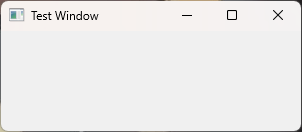
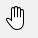

# 05.窗口/窗口控件、对话框以及相关功能类

## 窗口QWidget

```python
QWidget(self, 
        parent: Union[PySide6.QtWidgets.QWidget, NoneType]=None, 
        f: PySide6.QtCore.Qt.WindowType=Default(Qt.WindowFlags)) -> None
```

`QWidget`是所有可视化组件的基类,所有可视组件直接或间接继承,`QWidget`继承 `QObject`,拥有其所有特性,

一个最简单的空白控件,接收各种事件(鼠标键盘),绘制在桌面上, 展示给用户看。

- 每个控件都是矩形的,它们按Z轴顺序排序。
- 控件由其父控件和前面的控件剪切
- 没有父控件的控件, 称之为窗口,系统会自动把之作为窗口处理

### QWidget常用方法

| QWidget的方法及参数类型                                      | 返回值的类型   | 说 明                                                |
| ------------------------------------------------------------ | -------------- | ---------------------------------------------------- |
| [slot]show()                                                 | None           | 显示窗口,等同于setVisible(True)                      |
| [slot]setHidden(bool)                                        | None           | 设置隐藏状态                                         |
| [slot]hide()                                                 | None           | 隐藏窗口                                             |
| setVisible(bool)                                             | None           | 设置窗口是否可见                                     |
| [slot]raise_()                                               | None           | 提升控件,放到控件栈的顶部                            |
| [slot]lower()                                                | None           | 降低控件,放到控件栈的底部                            |
| [slot]close()                                                | bool           | 关闭窗口,如果成功则返回 True                         |
| setWindowIcon(QIcon)                                         | None           | 设置窗口的图标                                       |
| windowIcon()                                                 | QIcon          | 获取窗口的图标                                       |
| [slot]setWindowTitle(str)                                    | None           | 设置窗口的标题文字                                   |
| windowTitle()                                                | str            | 获取窗口标题的文字                                   |
| [slot]setWindowModified(bool)                                | None           | 设置文档是否修改过,可依此在退出程 序时提示保存       |
| isWindowModified()                                           | Bool           | 获取窗口的内容是否修改过                             |
| setWindowIconText(str)                                       | None           | 设置窗口图标的文字                                   |
| windowIconText()                                             | Str            | 获取窗口图标的文字                                   |
| setWindowModality(Qt.WindowModality)                         | None           | 设置窗口的模式特征                                   |
| isModal()                                                    | bool           | 获取窗口是否有模式特征                               |
| setWindowOpacity(float)                                      | None           | 设置窗口的不透明度；参数值从0到1                     |
| windowOpacity()                                              | float          | 获取窗口的不透明度                                   |
| setWindowState(Qt.WindowState)                               | None           | 设置窗口的状态                                       |
| windowState()                                                | Qt.WindowState | 获取窗口的状态,如最大化状态                          |
| windowType()                                                 | Qt.WindowType  | 获取窗口类型                                         |
| activateWindow()                                             | None           | 设置成活动窗口,活动窗口可以获得键 盘输入             |
| isActiveWindow()                                             | bool           | 获取窗口是否是活动窗口                               |
| setMaximun Width(maxw:int)                                   | None           | 设置窗口或控件的最大宽度                             |
| setMaximumHeight(minh:int)                                   | None           | 设置窗口或控件的最大高度                             |
| setMaximumSize(maxw: int,maxh: int)                          | None           | 设置窗口或控件的最大宽度和高度                       |
| setMaximumSize(QSize)                                        | None           | 设置窗口或控件的最大宽度和高度                       |
| setMinimumWidth(minw: int)                                   | None           | 设置窗口或控件的最小宽度                             |
| setMinimumHeight(minh:int)                                   | None           | 设置窗口或控件的最小高度                             |
| setMinimumSize(minw:int,minh: int)                           | None           | 设置窗口或控件的最小宽度和高度                       |
| setMinimumSize(QSize)                                        | None           | 设置窗口或控件的最小宽度和高度                       |
| setFixedHeight(h:int)                                        | None           | 设置窗口或控件的固定高度                             |
| setFixedWidth(w:int)                                         | None           | 设置窗口或控件的固定宽度                             |
| setFixedSize(QSize)                                          | None           | 设置窗口或控件的固定宽度和高度                       |
| setFixedSize(w:int,h: int)                                   | None           | 设置窗口或控件的固定宽度和高度                       |
| [slot]showFullScreen()                                       | None           | 全屏显示                                             |
| [slot]showMaximized()                                        | None           | 最大化显示                                           |
| [slot]showMinimized()                                        | None           | 最小化显示                                           |
| [slot]showNormal()                                           | None           | 最大化或最小化显示后回到正常显示                     |
| isMaximized()                                                | bool           | 是否处于最大化状态                                   |
| isMinimized()                                                | bool           | 是否处于最小化状态                                   |
| isFullScreen()                                               | bool           | 获取窗口是否为全屏状态                               |
| setAutoFillBackGround(bool)                                  | None           | 设置是否自动填充背景                                 |
| autoFillBackground()                                         | bool           | 获取是否自动填充背景                                 |
| setObjectName(name:str)                                      | None           | 设置窗口或控件的名称                                 |
| setFont(QFont)                                               | None           | 设置字体                                             |
| font()                                                       | QFont          | 获取字体                                             |
| setPalette(QPalette)                                         | None           | 设置调色板                                           |
| palette()                                                    | QPalette       | 获取调色板                                           |
| setUpdatesEnabled(bool)                                      | None           | 设置是否可以对窗口进行刷新                           |
| [slot]update()                                               | None           | 刷新窗口                                             |
| uPdate(Union[QRegion, QPolygon, QRect])                      | None           | 刷新窗口的指定区域                                   |
| uPdate(x:int.y:int.w;int,h:int)                              | None           | 刷新窗口的指定区域                                   |
| setCursor(QCursor)                                           | None           | 设置光标                                             |
| cursor()                                                     | QCursor        | 获取光标                                             |
| unsetCursor()                                                | None           | 重置光标,使用父窗口的光标                            |
| setContextMenuPolicy(policy: Qt.ContextMenuPolicy)           | None           | 设置右键快捷菜单的弹出策略                           |
| addAction(action: QAction)                                   | None           | 添加动作,以便形成右键快捷菜单                        |
| addActions(actions: Sequence[QAction])                       | None           | 添加多个动作                                         |
| insertAction(before: QAction,QAction)                        | None           | 插入动作                                             |
| insertActions(before: QAction, actions:                      | None           | 插入多个动作                                         |
| Sequence[QAction]) actions()                                 | List[QAction]  | 获取窗口或控件的动作列表                             |
| [slot]repaint()                                              | None           | 调用paintEvent事件重新绘制窗口                       |
| repaint(x:int,y: int,w:int,h: int)                           | None           | 重新绘制指定区域                                     |
| repaint(Union[QRegion, QPolygon, QRect])                     | None           | 重新绘制指定区域                                     |
| scroll(dx: int,dy:int)                                       | None           | 窗口中的控件向左、向下移动指定的像 素,参数可为负     |
| scroll(dx:int,dy:int,QRect)                                  | None           | 窗口中指定区域向左、向下移动指定的 像素              |
| resize(QSize)、resize(int,int)                               | None           | 重新设置窗口工作区的尺寸                             |
| size()                                                       | QSize          | 获取工作区尺寸                                       |
| move(QPoint)、move(x:int,y:int)                              | None           | 移动左上角到指定位置                                 |
| pos()                                                        | QPoint         | 获取窗口左上角的位置                                 |
| x()、y()                                                     | int            | 获取窗口左上角的x和y坐标                             |
| frameGeometry()                                              | QRect          | 获取包含标题栏的外框架区域                           |
| frameSize()                                                  | QSize          | 获取包含标题栏的外框架的尺寸                         |
| setGeometry(QRect)                                           | None           | 设置工作区的矩形区域                                 |
| setGeometry(x;int, y:int, w: int, h:.int)                    | None           | 设置工作区的矩形区域                                 |
| geometry()                                                   | QRect          | 获取不包含框架和标题栏的工作区域                     |
| width()、height()                                            | int            | 获取工作区的宽度和高度                               |
| rect()                                                       | QRect          | 获取工作区域                                         |
| childrenRect()                                               | QRect          | 获取子控件占据的区域                                 |
| baseSize()                                                   | QSize          | 如果设置了 sizeIncrement属性,获取控 件的合适尺寸     |
| setBaseSize(basew:int,baseh:int)                             | None           | 设置控件的合适尺寸                                   |
| setBaseSize(QSize)                                           | None           | 设置控件的合适尺寸                                   |
| sizeHint()                                                   | QSize          | 获取系统推荐的尺寸                                   |
| isVisible()                                                  | bool           | 获取窗口是否可见                                     |
| [slot]setDisabled(bool)                                      | None           | 设置失效状态                                         |
| [slot]setEnabled(bool)                                       | None           | 设置是否激活                                         |
| isEnabled()                                                  | bool           | 获取激活状态                                         |
| isWindow()                                                   | bool           | 获取是否是独立窗口                                   |
| window()                                                     | QWidget        | 返回控件所在的独立窗口                               |
| setToolTip(str)                                              | None           | 设置提示信息                                         |
| childAt(QPoint)                                              | QWidget        | 获取指定位置处的控件                                 |
| childAt(x:int,y:int)                                         | QWidget        | 获取指定位置处的控件                                 |
| setLayout(QLayout)                                           | None           | 设置窗口或控件内的布局                               |
| layout()                                                     | QLayout        | 获取窗口或控件内的布局                               |
| setL ayoutDirection(Qt.LayoutDirection)                      | None           | 设置布局的排列方向                                   |
| setParent(parent: QWidget)                                   | None           | 设置控件的父窗体                                     |
| setParent(QWidget,f:Qt.WindowFlags)                          | None           | 设置控件的父窗体                                     |
| parentWidget()                                               | QWidget        | 获取父窗体                                           |
| [slot]setFocus()                                             | None           | 设置获得焦点                                         |
| setSizelncrement(w: int.h: int)                              | None           | 设置窗口变化时的增量值                               |
| setSizeIncrement(QSize)                                      | None           | 设置窗口变化时的增量值                               |
| sizeIncrement()                                              | QSize          | 获取窗口变化时的增量值                               |
| [slot]setStyleSheet(str)                                     | None           | 设置窗口或控件的样式表                               |
| setMask(QBitmap)                                             | None           | 设置遮掩,白色部分不显示,黑色部分 显示                |
| setStyle(QStyle)                                             | None           | 设置窗口的风格                                       |
| setContentsMargins(left: int,top: int, right: int,bottom:int) | None           | 设置左、上、右、下的页边距                           |
| setContentsMargins(QMargins)                                 | None           | 设置左、上、右、下的页边距                           |
| setAttribute(Qt.WidgetAttribute.on=True)                     | None           | 设置窗口或控件的属性                                 |
| setAcceptDrops(bool)                                         | None           | 设置是否接受鼠标的拖放                               |
| setToolTip(str)                                              | None           | 设置提示信息                                         |
| set ToolTipDuration(int)                                     | None           | 设置提示信息持续的时间(毫秒)                         |
| setWhats This(str)                                           | None           | 设置按ShiftF1键时的提示信息                          |
| setMouseTracking(enable:bool)                                | None           | 设置是否跟踪鼠标的移动事件                           |
| hasMouseTracking()                                           | bool           | 获取是否有鼠标跟踪事件                               |
| underMouse()                                                 | bool           | 获取控件是否处于光标之下                             |
| setWindowFilePath(str)                                       | None           | 在窗口上记录一个路径,例如打开文件 的路径             |
| mapFrom(QWidget,QPoint)                                      | QPoint         | 将父容器中的点映射成控件坐标系下的点                 |
| mapFrom(QWidget,QPointF)                                     | QPointF        | 将父容器中的点映射成控件坐标系下的点                 |
| mapFromGlobal(QPoint)                                        | QPoint         | 将屏幕坐标系中的点映射成控件的点                     |
| mapFromGlobal(QPointF)                                       | QPointF        | 将屏幕坐标系中的点映射成控件的点                     |
| mapFromParent(QPoint)                                        | QPoint         | 将父容器坐标系下中的点映射成控件的点                 |
| mapFromParent(QPointF)                                       | QPointF        | 将父容器坐标系下中的点映射成控件的点                 |
| mapTo(QWidget,QPoint)                                        | QPoint         | 将控件的点的点映射成父容器坐标系下中                 |
| mapTo(QWidget,QPointF)                                       | QPointF        | 将控件的点的点映射成父容器坐标系下中                 |
| mapToGlobal(QPoint)                                          | QPoint         | 将控件的点映射到屏幕坐标系下的点                     |
| mapToGlobal(QPointF)                                         | QPointF        | 将控件的点映射到屏幕坐标系下的点                     |
| mapToParent(QPoint)                                          | QPoint         | 将控件的点映射到父容器坐标系下的点                   |
| mapToParent(QPointF)                                         | QPointF        | 将控件的点映射到父容器坐标系下的点                   |
| grab(rectangle: QRect=QRect(0,0, -1,-1))                     | QPixmap        | 截取控件指定范围的图像,默认为整个 控件               |
| grabKeyboard()                                               | None           | 获取所有的键盘输入事件,其他控件不 再接收键盘输入事件 |
| releaseKeyboard()                                            | None           | 不再获取键盘输人事件                                 |
| grabMouse()                                                  | None           | 获取所有的鼠标输人事件,其他控件不 再接收鼠标输入事件 |
| grabMouse(Union[QCursor,QPixmap])                            | None           | 获取所有的鼠标输入事件并改变光标 形状                |
| releaseMouse()                                               | None           | 不再获取鼠标输入事件                                 |
| [static]find(int)                                            | QWidget        | 根据控件的识别ID号或句柄ID号获取 控件                |
| [static]keyboardGrabber()                                    | QWidget        | 返回键盘获取的控件                                   |
| [static]mouseGrabber()                                       | QWidget        | 返回鼠标获取的控件                                   |
| [static]setTabOrder(QWidget,QWidget)                         | None           | 设置窗口上的控件的Tab 键顺序                         |

- ·窗口的显示与关闭。用show()方法可以显示窗口,用hide()方法可以隐藏窗口,也可以用setVisible(bool)方法和 setHidden(bool)方法设置窗口的可见性,用isVisible()和 isHidden()方法判断窗口是否可见,用close()方法可以关闭窗口。当窗口被关闭时,首先向这个窗口发送一个关闭事件closeEvent(event:QCloseEvent),如果事件被接受,则窗口被隐藏；如果事件被拒绝,则什么也不做。如果创建窗口时用setAttribute(Qt.WA_QuitOnClose,on=True)方法设置了Qt.WA_QuitOnClose属性,则窗口对象会被析构(删除),大多数类型的窗口都默认设置了这个属性。close()方法的返回值bool表示关闭事件是否被接受,也就是窗口是否真的被关闭了。
- 窗口的提升与降级。如果显示多个窗口,则窗口之间是有先后顺序的,用raise_()方法可把窗口放到前部,用lower()方法可以把窗口放到底部。
- 窗口的状态。独立窗口有正常、全屏、最大化、最小化几种状态,用isMinimized()方法判断窗口是否为最小化,用isMaximized()方法判断窗口是否为最大化,用isFullScreen()方法 判断窗口是否为全屏,用showMinimized()方法设置以最小化方式显示窗口,用showMaximized()方法设置以最大化方式显示窗口,用showFullScreen()方法设置以全屏方式显示窗口,用showNormal()方法设置以正常方式显示窗口。另外用setWindowState(Qt.WindowStates)方法也可以设置窗口的状态,其中参数Qt.WindowStates 可以取Qt.WindowNoState(无标识,正常状态)、Qt.WindowMinimized(最小化状态)、Qt.WindowMaxmized(最大化状态)、Qt.WindowFullScreen(全屏状态)或 Qt.WindowActive(激活状态)；用windowState()方法可以获取状态。


- 窗口的几何参数。QWidget如果作为独立窗口,则有标题栏、框架和工作区；如果作为控件,则没有标题栏。QWidget 提供了设置和获取窗口与工作区尺寸的方法。窗口尺寸的设置是在屏幕坐标系下进行的,屏幕坐标系的原点在左上角,向右表示x方向,向下表示y方向。窗口几何参数的意义如图3-2所示,用x()、y()和pos()方法可以获得窗口左上角的坐标,用frameGeometry()方法可以获得窗口框架的几何参数,用frameSize()方法可以获得框架的宽度和高度,用geometry()方法可以获得工作区的几何参数,包括左上角的位置和宽度、高度,用rect()、size(),width()和height()方法可以获得工作区的宽度、高度。用move(int:x,int:y)方法可以将窗口左上角移动到坐标(x,y)处,用move(QPoint)方法可以将窗口左上角移动到QPoint处,用resize(w:int,h:int)方法可以设置工作区的宽度和高度,用resize(QSize)方法可以将工作区宽度和高度设置成QSize,用setGeometry(x:int,y:int,w:int,h:int)方法可以将工作区的左上角移动到(x,y)处,宽度改为w,高度改为h。

- 焦点。焦点用来控制同一个独立窗口内哪一个控件可以接受键盘事件,同一时刻只能有一个控件获得焦点。用setFocus()方法可以使一个控件获得焦点,用clearFocus()方法可以使控件失去焦点,用hasFocus()方法可以获取控件是否有焦点。

- 活跃。当有多个独立窗口同时存在时,只有一个窗口能够处于活跃状态。系统产生的键盘、鼠标等输入事件将被发送给处于活跃状态的窗口。一般来说,这样的窗口会被提升到堆叠层次的最上面,除非其他窗口有总在最上面的属性。用activateWindow()方法可以使窗口活跃,用isActiveWindow()方法可以查询窗口是否活跃。

- 激活。处于激活状态的窗口才有可能处理键盘和鼠标等输入事件；反之,处于禁用状态的窗口不能处理这些事件。用setEnabled(bool)方法或 setDisabled(bool)方法可以使窗口激活或失效,用isEnabled()方法可以查询窗口是否处于激活状态。

- 窗口标题和图标。用setWindowTitle(str)方法可以设置窗口的标题文字,用setWindowIcon(QIcon)方法可以设置窗口的图标,用setWindowIconText(str)方法可以设置图标的文字,用windowTitle()方法和 windowIcon()方法可以获取窗口的标题文字和图标。

- 字体和调色板。用setFont(QFont)和 setPalette(QPalette)方法可以设置窗口的字体和调色板,用font()和 palette()方法可以获取字体和调色板。

- 窗口的布局。用setLayout(QLayout)方法可以设置窗口的布局,用layout()方法可以获取窗口的布局,用setLayoutDirection(Qt.LayoutDirection)方法可以设置布局的方向,其中参数Qt.LayoutDirection 可以取 Qt.LeftToRight、Qt.RightToLeft或Qt.LayoutDirectionAuto。

- 光标。用setCursor(QCursor)方法可以为窗口或控件设置光标,用cursor()方法可以获取光标,用unsetCursor()方法可以重置光标,重置后的光标使用父窗口的光标。

- 父窗口。用setParent(QWidget)方法可以设置控件的父窗口或容器,用parentWidget()方法可以获取父窗口或容器。

- 窗口属性。用setAttribute(Qt.WidgetAttribute,on=True)方法可以设置窗口的属性,用testAttribute(Qt.WidgetAttribute)方法可以测试是否设置了某个属性,其中参数Qt.WidgetAttribute的常用取值如表3-4所示。

  | Qt.WidgetAttribute的取值        | 说 明                                                        |
  | ------------------------------- | ------------------------------------------------------------ |
  | Qt.WA_DeleteOnClose             | 调用close()方法时删除窗口而不是隐藏窗口                      |
  | Qt.WA_QuitOnClose               | 最后一个窗口如果有Qt.WA_DeleteOnClose 属性,则执行 close()方法时退出程序 |
  | Qt.WA_AcceptDrops               | 接受鼠标拖放的数据                                           |
  | Qt.WA_AlwaysShowToolTips        | 窗口失效时也显示提示信息                                     |
  | Qt.WA_Disabled                  | 窗口处于失效状态,不接收键盘和鼠标的输入                      |
  | Qt.WA_DontShowOnScreen          | 窗口隐藏                                                     |
  | Qt.WA_ForceDisabled             | 即使父窗口处于激活状态,窗口也强制失效                        |
  | Qt.WA_TransparentForMouseEvents | 窗口和其子窗口忽略鼠标事件                                   |
  | Qt.WA_RightToLeft               | 布局方向从右向左                                             |
  | Qt.WA_ Show WithoutActivating   | 当不激活窗口时,显示窗口                                      |

- 右键快捷菜单的弹出策略。在窗口或控件上右击鼠标时,将弹出右键快捷菜单(上下文菜单)

  - 用setContextMcenuPolicy(policy: Qt.ContextMenuPolicy)方法设置弹出快捷菜单的策略和处理方式,其中 policy 是 Qt.ContextMenuPolicy的枚举值,可取值如下表所示。

    | Qt.ContextMenuPolicy的取值 | 值   | 说 明                                                        |
    | -------------------------- | ---- | ------------------------------------------------------------ |
    | Qt.NoContextMenu           | 0    | 控件没有自己特有的快捷菜单,使用控件父窗口或父容器 的快捷菜单 |
    | Qt.DefaultContextMenu      | 1    | 鼠标右键事件交给控件的contextMenuEvent()函数处理             |
    | Qt.ActionsContextMenu      | 2    | 右键快捷菜单是控件或窗口的actions()方法获取的动作            |
    | Qt.CustomContextMenu       | 3    | 用户自定义快捷菜单,右击鼠标时,发射 customContextMenuRequested(QPoint)信号,其中 QPoint 是鼠标右击时光标的位置 |
    | Qt.PreventContextMenu      | 4    | 鼠标右键事件交给控件的mousePressEvent()和 mouseReleaseEvent()函数进行处理 |

  - policy 取 Qt.DefaultContextMenu 或 Qt.PreventContextMenu时,鼠标右击事件交给控件的事件处理函数进行处理,有关事件处理方面的内容详见事件处理章节；

  - policy 取 Qt.CustomContextMenu 时,右击鼠标时会发射customContextMenuRequested(QPoint)信号,此时用户可以在槽函数中编写菜单,用菜单的popup(pos:QPoint)方法弹出菜单,pos是菜单的弹出位置,有关菜单的内容见3.2节,policy 取Qt.ActionsContextMenu时,快捷菜单由窗口或控件的动作构成,有关动作的内容菜单节

  - 用窗口或控件的addAction(action:QAction)或addActions(actions: Sequence[QAction])方法可以添加动作,

  - 用insertAction(before: QAction, action: QAction)或 insertActions(before: QAction.actions:Sequence[QAction])方法可以插入动作,用actions()方法获取动作列表。

### 顶层窗口设置

#### 窗口控件的创建和样式设置

##### 创建窗口

```python
__init__(self, parent=None, flags)
```

创建控件的时候, 设置父控件, 以及标志位,调整整个应用程序窗口外观

- parent 父控件,没有父控件的控件,即顶层控件,控件 一般指非窗口控件
- flags 标志位,创建时直接传入 `type: PySide6.QtCore.Qt.WindowType`即可见下面窗口外观标志表

##### 创建窗口后设置窗口标志

不同于直接创建窗口时传入标志后面设置样式,创建后设置和创建时设置窗口WindowType效果一样

```python
from PySide6.QtCore import Qt
from PySide6.QtWidgets import QWidget

win=QWidget(parent=None, f=Qt.WindowType.Widget)

win.setWindowFlags(Qt.WindowType.Dialog)
```

| 方法                                                        | 说明                            |
| ----------------------------------------------------------- | ------------------------------- |
| `window.setWindowFlags(type: PySide6.QtCore.Qt.WindowType)` | 设置窗口样式,WindowType见标志表 |
| `windowFlags()`                                             | 获取当前窗口标志                |

##### 窗口类型Qt.WindowsFlaga

| Qt.WindowFlags的取值 | 说明                                                         |
| -------------------- | ------------------------------------------------------------ |
| Qt.Widget            | 这是默认值,如果QWidget有父容器或窗口,它成为一个控件；如果没有, 则它会成为独立的窗口 |
| Qt.Window            | 不管QWidget是否有父容器或窗口,它都将成为一个有窗口框架和标题栏 的窗口 |
| Qt.Dialog            | QWidget将成为一个对话框窗口(QDialog)。对话框窗口在标题栏上通常 没有最大化按钮和最小化按钮,如果是从其他窗口中弹出了对话框窗口,可 以通过 setWindowModality()方法将其设置成模式窗口。在关闭模式窗口之前,不允许对其他窗口进行操作 |
| Qt.Sheet             | 在 Mac系统中,QWidget 将是一个表单(sheet)                     |
| Qt.Drawer            | 在 Mac 系统中,QWidget 将是一个抽屉(drawer)                   |
| Qt.Popup             | QWidget是弹出式顶层窗口,这个窗口是带模式的,常用来做弹出式菜单 |
| Qt.Tool              | QWidget 是一个工具窗,工具窗通常有比正常窗口小的标题栏,可以在其上 面放置按钮。如果QWidget 有父窗口,则QWidget 始终在父窗口的顶层 |
| Qt.ToolTip           | QWidget是一个提示窗,没有标题栏和边框                         |
| Qt.SplashScreen      | QWidget是一个欢迎窗,这是 QSplashScreen的默认值               |
| Qt.Desktop           | QWidget是个桌面,这是QDesktopWidget的默认值                   |
| Qt.SubWindow         | QWidget 是子窗口,例如QMidSubWidow窗口                        |
| Qt.ForeignWindow     | QWidget是其他程序创建的句柄窗口                              |
| Qt.CoverWindow       | QWidget是一个封面窗口,当程序最小化时显示该窗口               |

##### 影响窗口外观的Qt.WindowFlags的取值

| Qt.WindowFlags的取值                   | 说 明                                                        |
| -------------------------------------- | ------------------------------------------------------------ |
| Qt.MSWindowsFixedSizeDialogHint        | 对于不可调整尺寸的对话框Qdialog添加窄的边框                  |
| Qt.MSWindowsOwnDC                      | 为Windows 系统的窗口添加上下文菜单                           |
| Qt.BypassWindowManagerHint             | 窗口不受窗口管理协议的约束,与具体的操作系统有关              |
| Qt.X11BypassWindowManagerHint          | 无边框窗口,不受任务管理器的管理。如果不是用activateWindow()方法激活,不接受键盘输人 |
| Qt.FramelessWindowHint                 | 无边框和标题栏窗口,无法移动和改变窗口的尺寸                  |
| Qt.NoDropShadowWindowHint              | 不支持拖放操作的窗口                                         |
| Qt.CustomizeWindowHint                 | 自定义窗口标题栏,不显示窗口的默认提示信息,以下6 个可选值可配合该值一起使用 |
| Qt.WindowTitleHint                     | 有标题栏的窗口                                               |
| Qt.WindowSystemMenuHint                | 有系统菜单的窗口                                             |
| Qt.WindowMinimizeButtonHint            | 有最小化按钮的窗口                                           |
| Qt.WindowMaximizeButtonHint            | 有最大化按钮的窗口                                           |
| Qt.WindowMinMaxButtonsHint             | 有最小化和最大化按钮的窗口                                   |
| Qt.WindowCloseButtonHint               | 有关闭按钮的窗口                                             |
| Qt.WindowContextHelpButtonHint         | 有帮助按钮的窗口                                             |
| Qt.MacWindowToolBarButtonHint          | 在 Mac 系统中,添加工具栏按钮                                 |
| Qt.WindowFullscreenButtonHint          | 有全屏按钮的窗口                                             |
| Qt.WindowShadeButtonHint               | 在最小化按钮处添加背景按钮                                   |
| Qt.WindowStaysOnTopHint                | 始终在最前面的窗口                                           |
| Qt.WindowStaysOnBottomHint             | 始终在最后面的窗口                                           |
| Qt.WindowTransparentForInput           | 只用于输出,不能用于输入的窗口                                |
| Qt.WindowDoesNotAcceptFocus            | 不接受输入焦点的窗口                                         |
| Qt.MaximizeUsingFullscreenGeometryHint | 窗口最大化时,最大化地占据屏幕                                |

下面举一个有关窗口类型的实例,程序运行的界面如图所示。

运行下面的程序,先出现一个欢迎界面,窗口类型是Qt.SplashScreen,这个界面上没有标题栏,只有一个标签和一个按钮,

单击"进入>>"按钮后,弹出两个新的窗口,这两个窗口的类型分别是Qt CustomizeWindowHint和Qt.Window。窗口类型是 Qt.CustomizeWindowHint 时将不会有标题栏,程序中用竖直布局在窗口上部放置QWidget 控件作为标题栏,并添加一个QLabel 和一个 QPushButton,可以放置更多的控件以丰富标题栏。窗口现在还不能移动,可以为窗口编写鼠标按键事件,以便在拖动标题栏时窗口能移动。




```python
import sys
from PySide6.QtWidgets import QApplication, QWidget, QLabel, QPushButton, QFrame, QVBoxLayout, QHBoxLayout
from PySide6.QtCore import Qt
from PySide6.QtGui import QFont


class MyWindow(QWidget):
    def __init__(self, parent=None, f=Qt.Widget):
        super().__init__(parent, f)
        self.setStyleSheet("border : 0px")
        self.setContentsMargins(0, 0, 0, 0)
        self.resize(400, 300)
        self.move(300, 200)
        font=QFont()
        font.setPointSize(10)

        # 自定义标题栏
        title=QLabel("欢迎来到我的世界")
        title.setFont(font)
        closeBtn=QPushButton("关闭")
        closeBtn.clicked.connect(self.close)
        closeBtn.setFixedSize(30, 15)
        closeBtn.setFont(font)
        closeBtn.setContentsMargins(0, 0, 0, 0)

        titleBar=QWidget()
        titleBar.setFixedHeight(13)
        H=QHBoxLayout(titleBar)
        H.setAlignment(Qt.AlignTop)
        H.setContentsMargins(0, 0, 0, 0)
        H.setSpacing(0)

        H.addWidget(title)
        H.addWidget(closeBtn)
        workArea=QFrame()
        V=QVBoxLayout(self)
        V.setSpacing(0)
        V.addWidget(titleBar)
        V.addWidget(workArea)
        V.setContentsMargins(0, 0, 0, 0)
        # add more...,下面创建有父窗口的窗口,窗口类型是Qt.windows
        test_window=QWidget(parent=self, f=Qt.Window)
        test_window.setWindowTitle("Test Window")
        test_window.show()
        test_window.resize(300, 100)


class WelcomeWindoes(QWidget):
    def __init__(self, parent=None, f=Qt.Widget):
        super().__init__(parent, f)
        self.resize(300, 100)
        self.setupUi()

    def setupUi(self):
        label=QLabel("欢迎来到我的世界!")
        label.setParent(self)
        label.setGeometry(70, 30, 200, 30)
        font=label.font()
        font.setPointSize(15)
        label.setFont(font)
        btn=QPushButton("进入>>", self)
        btn.setGeometry(200, 70, 70, 20)
        btn.clicked.connect(self.enter)

    def enter(self):
        self.win=MyWindow(f=Qt.FramelessWindowHint)  # 无边框窗口
        self.win.show()  # 显示另一个窗口
        self.close()


if __name__=='__main__':
    app=QApplication(sys.argv)
    welcome=WelcomeWindoes(parent=None, f=Qt.SplashScreen)  # 欢迎窗口
    welcome.show()
    sys.exit(app.exec())

```

#### 窗口图标

| 方法                                             | 说明         |
| ------------------------------------------------ | ------------ |
| setWindowIcon(QIcon("resource/header_icon.png")) | 设置窗口图标 |
| windowIcon()                                     | 获取窗口图标 |

#### 窗口标题

| 方法                    | 说明         |
| ----------------------- | ------------ |
| setWindowTitle("title") | 设置窗口标题 |
| windowTitle()           | 获取窗口标题 |

#### 窗口不透明度

| 方法                    | 说明                                         |
| ----------------------- | -------------------------------------------- |
| setWindowOpacity(level) | 设置窗口不透明度, level限制0-1,1为完全不透明 |
| windowOpacity()         | 获取窗口不透明度                             |

#### 窗口状态

| 方法                                                         | 说明                                       |
| ------------------------------------------------------------ | ------------------------------------------ |
| `setWindowState(self, state: PySide6.QtCore.Qt.WindowState) -> None` | 设置窗口状态 `WindowState`可为状态值对象表 |
| `windowState()`                                              | 获取窗口状态                               |

**状态值对象表**

| 值                    | 说明                                                         |
| --------------------- | ------------------------------------------------------------ |
| `Qt.WindowNoState`    | 无状态(默认)                                                 |
| `Qt.WindowMinimized`  | 最小化                                                       |
| `Qt.WindowMaximized`  | 最大化                                                       |
| `Qt.WindowFullScreen` | 全屏,不显示任务栏标题栏等全屏显示(慎用最好配好相关快捷键切换其他状态) |
| `Qt.WindowActive`     | 活动窗口                                                     |

#### 最大化最小化

##### 控制

| 方法               | 说明                    |
| ------------------ | ----------------------- |
| `showFullScreen()` | 全屏显示 不包含窗口框架 |
| `showMaximized()`  | 最大化 包括窗口框架     |
| `showMinimized()`  | 最小化                  |
| `showNormal()`     | 正常                    |

##### 判定

| 方法             | 说明             |
| ---------------- | ---------------- |
| `isMinimized()`  | 是否是最小化窗口 |
| `isMaximized()`  | 是否是最大化窗口 |
| `isFullScreen()` | 是否全屏         |

### 大小位置


| 方法                                               | 说明                                                         |
| -------------------------------------------------- | ------------------------------------------------------------ |
| `x()`                                              | 相对于父控件的x位置,包含窗口框架。顶层控件(没有父控件)则相对于桌面的x位置 |
| `y()`                                              | 相对于父控件的y位置,包含窗口框架。顶层控件(没有父控件)则相对于桌面的y位置 |
| `pos()`                                            | x和y的组合,包含窗口框架返回QPoint(x, y)                      |
| `width()`                                          | 控件的宽度,不包含任何窗口框架                                |
| `height()`                                         | 控件的高度,不包含任何窗口框架                                |
| `size()`                                           | width和height的组合,不包含任何窗口框架,QSize(width, height)  |
| `geometry()`                                       | 用户区域相对于父控件的位置和尺寸组合,QRect(x, y, width, height) |
| `rect()`                                           | 0, 0, width, height的组合,QRect(0, 0, width, height)         |
| `frameSize()`                                      | 框架大小                                                     |
| `frameGeometry()`                                  | 框架尺寸                                                     |
| `minimumWidth()`                                   | 最小尺寸的宽度                                               |
| `minimumHeight()`                                  | 最小尺寸的高度                                               |
| `minimumSize()`                                    | 最小尺寸                                                     |
| `maximumWidth()`                                   | 最大尺寸的宽度                                               |
| `maximumHeight()`                                  | 最大尺寸的高度                                               |
| `maximumSize()`                                    | 最大尺寸                                                     |
|                                                    |                                                              |
| `move(x, y)`                                       | 操控的是x, y；也就是pos包括窗口框架                          |
| `resize(width, height)`                            | 操控的是宽高 不包括窗口框架                                  |
| `setGeometry(x_noFrame, y_noFrame, width, height)` | 注意,此处参照为用户区域                                      |
| `adjustSize()`                                     | 根据内容自适应大小                                           |
| `setFixedSize()`                                   | 设置固定尺寸                                                 |
| `setMaximumWidth()`                                | 设置最大宽度                                                 |
| `setMaximumHeight()`                               | 设置最大高度                                                 |
| `setMaximumSize()`                                 | 设置最大尺寸                                                 |
| `setMinimumWidth()`                                | 设置最小宽度                                                 |
| `setMinimumHeight()`                               | 设置最小高度                                                 |
| `setMinimumSize()`                                 | 设置最小尺寸                                                 |

==注意: 控件显示完毕之后, 具体的位置或者尺寸数据才会正确==

### 内容边距

调整控件内容边距, 使得显示更自然

| 方法                                 | 说明                              |
| ------------------------------------ | --------------------------------- |
| `setContentsMargins(左, 上, 右, 下)` | 设置内容边距                      |
| `getContentsMargins()`               | 获取内容边距,返回(左, 上, 右, 下) |
| `contentsRect()`                     | 获取内容区域                      |

==必须是控件本身留够对应的大小==

### 控件区域鼠标形状

- 设置鼠标形状:`setCursor(sizexxCursor)`
- 重置形状,恢复设置鼠标原样:`qwidget.unsetCursor()`

```python
setCursor(arg__1: Union[PySide6.QtGui.QCursor, PySide6.QtCore.Qt.CursorShape, PySide6.QtGui.QPixmap]) -> None
```

#### 设置鼠标形状

CursorShape需要导入 `from PySide6.QtCore import Qt`

支持以下形状:

| 参数                             | 形状                                                         | 参数                                | 形状                                                         | 参数                             | 形状                                                         |
| -------------------------------- | ------------------------------------------------------------ | ----------------------------------- | ------------------------------------------------------------ | -------------------------------- | ------------------------------------------------------------ |
| `Qt.CursorShape.ArrowCursor`     |  | `Qt.CursorShape.UpArrowCursor`      |  | `Qt.CursorShape.CrossCursor`     |  |
| `Qt.CursorShape.IBeamCursor`     |  | `Qt.CursorShape.WaitCursor`         |  | `Qt.CursorShape.BusyCursor`      |  |
| `Qt.CursorShape.ForbiddenCursor` |  | `Qt.CursorShape.PointingHandCursor` |  | `Qt.CursorShape.WhatsThisCursor` |  |
| `Qt.CursorShape.SizeVerCursor`   |  | `Qt.CursorShape.SizeHorCursor`      |  | `Qt.CursorShape.SizeBDiagCursor` |  |
| `Qt.CursorShape.SizeAllCursor`   |  | `Qt.CursorShape.SplitVCursor`       |  | `Qt.CursorShape.SplitHCursor`    |  |
| `Qt.CursorShape.OpenHandCursor`  |  | `Qt.CursorShape.ClosedHandCursor`   |  | `Qt.CursorShape.BlankCursor`     | 不显示空白                                                   |

```python
import sys
from PySide6.QtCore import Qt
from PySide6.QtWidgets import QWidget, QApplication, QComboBox

cur={
    "ArrowCursor": Qt.CursorShape.ArrowCursor,
    "UpArrowCursor": Qt.CursorShape.UpArrowCursor,
    "CrossCursor": Qt.CursorShape.CrossCursor,
    "IBeamCursor": Qt.CursorShape.IBeamCursor,
    "WaitCursor": Qt.CursorShape.WaitCursor,
    "BusyCursor": Qt.CursorShape.BusyCursor,
    "ForbiddenCursor": Qt.CursorShape.ForbiddenCursor,
    "PointingHandCursor": Qt.CursorShape.PointingHandCursor,
    "WhatsThisCursor": Qt.CursorShape.WhatsThisCursor,
    "SizeVerCursor": Qt.CursorShape.SizeVerCursor,
    "SizeHorCursor": Qt.CursorShape.SizeHorCursor,
    "SizeBDiagCursor": Qt.CursorShape.SizeBDiagCursor,
    "SizeAllCursor": Qt.CursorShape.SizeAllCursor,
    "SplitVCursor": Qt.CursorShape.SplitVCursor,
    "SplitHCursor": Qt.CursorShape.SplitHCursor,
    "OpenHandCursor": Qt.CursorShape.OpenHandCursor,
    "ClosedHandCursor": Qt.CursorShape.ClosedHandCursor,
    "BlankCursor": Qt.CursorShape.BlankCursor
}


def change_cur(win, _cur):
    win.setCursor(cur[_cur])


app=QApplication(sys.argv)  # 初始化界面

qwidget=QWidget()  # 生成一个主窗口
qwidget.resize(500, 500)
qwidget.setWindowFlags(Qt.WindowStaysOnTopHint)  # 置顶

cue_l=list(cur.keys())
qcombobox=QComboBox(qwidget)
qcombobox.resize(300, 35)
qcombobox.move((qwidget.width() - qcombobox.width()) // 2,(qwidget.height() - qcombobox.height()) // 4)
qcombobox.addItems(cue_l)

qcombobox.activated.connect(lambda: change_cur(qwidget, qcombobox.currentText()))

qwidget.show()  # 显示窗口以及其子控件

sys.exit(app.exec())  # 主循环和退出

```

#### 自定义QCursor对象

##### 获取鼠标

导入:`from PySide6.QtGui import QCursor, QPixmap`

获取QCursor对象

```
QCursor(self) -> None
QCursor(self, bitmap: Union[PySide6.QtGui.QBitmap, str], mask: Union[PySide6.QtGui.QBitmap, str], hotX: int=-1, hotY: int=-1) -> None
QCursor(self, cursor: Union[PySide6.QtGui.QCursor, PySide6.QtCore.Qt.CursorShape, PySide6.QtGui.QPixmap]) -> None
QCursor(self, pixmap: Union[PySide6.QtGui.QPixmap, PySide6.QtGui.QImage, str], hotX: int=-1, hotY: int=-1) -> None
QCursor(self, shape: PySide6.QtCore.Qt.CursorShape) -> None
```

以上是方法注释

##### 自定义鼠标形状

自定义 QCursor对象

后通过 `setCursor(QCursor)`设置自定义形状

```python
import sys
from PySide6.QtCore import Qt
from PySide6.QtGui import QCursor, QPixmap
from PySide6.QtWidgets import QWidget, QApplication

app = QApplication(sys.argv)  # 初始化界面

qwidget = QWidget()  # 生成一个主窗口
qwidget.resize(500, 500)
qwidget.setWindowFlags(Qt.WindowStaysOnTopHint)  # 置顶

shape = QPixmap(../../Resources/Images/d8.png")  # QPixmap对象鼠标形状
qcursor = QCursor(shape)  # 获取QCursor对象
qwidget.setCursor(qcursor)  # 设置鼠标形状为自定义QCursor对象

qwidget.show()  # 显示窗口以及其子控件

sys.exit(app.exec())  # 主循环和退出
```


##### 设置自定义鼠标大小

通过设置 `QPixmap`对象设置

```python
shape=QPixmap("./d8.png")  # QPixmap对象鼠标形状
shape=shape.scaled(50, 50)	# scaled修改尺寸需要注意返回的是一个新的对象
```

```python
import sys
from PySide6.QtCore import Qt
from PySide6.QtGui import QCursor, QPixmap
from PySide6.QtWidgets import QWidget, QApplication

app = QApplication(sys.argv)  # 初始化界面

qwidget = QWidget()  # 生成一个主窗口
qwidget.resize(500, 500)
qwidget.setWindowFlags(Qt.WindowStaysOnTopHint)  # 置顶

shape = QPixmap(../../Resources/Images/d8.png")  # QPixmap对象鼠标形状
shape = shape.scaled(50, 50)

qcursor = QCursor(shape)  # 获取QCursor对象
qwidget.setCursor(qcursor)  # 设置鼠标形状为自定义QCursor对象

qwidget.show()  # 显示窗口以及其子控件

sys.exit(app.exec())  # 主循环和退出

```

对比上一个自定义发现明显变小


##### 设置自定义鼠标热点位置

默认自定义时鼠标形状时间可点击位置为鼠标图标中间

在获取QCursor对象时传入参数hotX、hotY即可

```python
qcursor=QCursor(shape, 0, 0)
"""
QCursor(self, pixmap: Union[PySide6.QtGui.QPixmap, PySide6.QtGui.QImage, str], hotX: int=-1, hotY: int=-1) -> None
"""
```

```python
import sys
from PySide6.QtCore import Qt
from PySide6.QtGui import QCursor, QPixmap
from PySide6.QtWidgets import QWidget, QApplication

app = QApplication(sys.argv)  # 初始化界面

qwidget = QWidget()  # 生成一个主窗口
qwidget.resize(500, 500)
qwidget.setWindowFlags(Qt.WindowStaysOnTopHint)  # 置顶

shape = QPixmap(../../Resources/Images/d8.png")  # QPixmap对象鼠标形状
shape = shape.scaled(50, 50)

qcursor = QCursor(shape, 25, 50)  # 获取QCursor对象
qwidget.setCursor(qcursor)  # 设置鼠标形状为自定义QCursor对象

qwidget.show()  # 显示窗口以及其子控件

sys.exit(app.exec())  # 主循环和退出

```


### 鼠标跟踪

所谓的鼠标跟踪,其实就是设置检测鼠标移动事件的条件.

不跟踪 鼠标移动时,必须处于按下状态,才会触发mouseMoveEvent事件 跟踪 鼠标移动时,不处于按下状态,也会触发mouseMoveEvent事件

- `hasMouseTracking()`  判定是否设置了鼠标跟踪
- `setMouseTracking(bool)`  设置鼠标是否跟踪

### 事件

当一个控件被触发了一个特定的行为时, 就会调用特定的方法, 来将事件传递给开发人员, 方便处理 重写这些事件方法, 就可以监听相关的信息

| 事件           | 说明                                                         |
| -------------- | ------------------------------------------------------------ |
| 显示和关闭事件 | showEvent(QShowEvent) 控件显示时调用``closeEvent(QCloseEvent) 控件关闭时调用 |
| 移动事件       | moveEvent(QMoveEvent) 控件移动时调用                         |
| 调整大小       | moveEvent(QMoveEvent) 控件移动时调用``resizeEvent(QResizeEvent) 控件调整大小时调用 |
| 鼠标事件       | enterEvent(QEvent) 鼠标进入时触发 ``leaveEvent(QEvent) 鼠标离开时触发``mousePressEvent(QMouseEvent) 鼠标按下时触发 ``mouseReleaseEvent(QMouseEvent) 鼠标释放时触发``mouseDoubleClickEvent(QMouseEvent) 鼠标双击时触发 ``mouseMoveEvent(QMouseEvent) 鼠标按下后移动时触发``    setMouseTracking(True) 追踪设置后,没有按下的移动也能触发 |
| 键盘事件       | keyPressEvent(QKeyEvent) 键盘按下时调用``keyReleaseEvent(QKeyEvent) 键盘释放时调用 |
| 焦点事件       | focusInEvent(QFocusEvent) 获取焦点时调用``focusOutEvent(QFocusEvent) 失去焦点时调用 |
| 拖拽事件       | dragEnterEvent(QDragEnterEvent) 拖拽进入控件时调用``dragLeaveEvent(QDragLeaveEvent) 拖拽离开控件时调用``dragMoveEvent(QDragMoveEvent) 拖拽在控件内移动时调用``dropEvent(QDropEvent) 拖拽放下时调用 |
| 绘制事件       | paintEvent(QPaintEvent) 显示控件, 更新控件时调用             |
| 改变事件       | changeEvent(QEvent) 窗体改变, 字体改变时调用                 |
| 右键菜单       | contextMenuEvent(QContextMenuEvent) 访问右键菜单时调用       |
| 输入法         | inputMethodEvent(QInputMethodEvent) 输入法调用               |

### 父子关系

| 方法             | 说明                                                 |
| ---------------- | ---------------------------------------------------- |
| `childAt(x, y)`  | 获取在指定坐标的控件                                 |
| `parentWidget()` | 获取指定控件的父控件                                 |
| `childrenRect()` | 所有子控件组成的边界矩形(左上X, 左上Y, 右下X, 右下Y) |

用法扩展:

- 点击哪个标签, 就让哪个标签背景变红,利用鼠标点击事件和childAt()(监听标签的点击事件也可以代码比较麻烦)

### 层级控制

同级控件需要调整控件Z轴顺序用

| 方法              | 说明               |
| ----------------- | ------------------ |
| `lower()`         | 将控件降低到最底层 |
| `raise_()`        | 将控件提升到最上层 |
| `a.stackUnder(b)` | 让a放在b下面       |

### 交互状态

#### 是否可用

| 方法               | 说明             |
| ------------------ | ---------------- |
| `setEnabled(bool)` | 设置控件是否禁用 |
| `isEnabled()`      | 获取控件是否可用 |

#### 是否显示/隐藏

| 方法                  | 说明                                                         |
| --------------------- | ------------------------------------------------------------ |
| `setVisible(bool)`    | 设置控件是否绘制(默认是绘制的),不绘制则不可见,配合绘制事件一起使用<br />绘制是先绘制父控件后绘制子控件,未绘制父控件子控件也不展示,控件被遮挡覆盖也是会绘制的<br />setVisible(True) 绘制<br />setVisible(False) 不绘制 |
| `setHidden(bool)`     | 设置控件是否隐藏,同样需要父控件绘制了才能展示,本质还是调用setVisible(bool)<br />setHidden(False)展示控件``setHidden(True)隐藏控件 |
| `show()`              | 展示控件,效果同 `setVisible(False)`、`setHidden(True)`       |
| `hide()`              | 隐藏控件,效果同 `setVisible(True)`、`setHidden(False)`       |
| `isHidden()`          | 判定控件是否被隐藏,无论是否绘制父控件 没有直接对控件设置 `setVisible(True)`、`setHidden(False)`、`isHidden()`均是True |
| `isVisible()`         | 判定控件是否设置绘制,当控件的父控件和自身均被绘制才会返回True |
| `isVisibleTo(widget)` | 判断控件是否会随着widget控件显示和隐藏同步变化               |

注意 visible:代表控件最终的状态, 是否被我们所见(被其他控件遮挡也属于可见)
hide:可理解为相对于父控件是否可见

隐藏的一定是不可见的, 反之不然

#### 显示正在编辑状态

| 方法                      | 说明                                                         |
| ------------------------- | ------------------------------------------------------------ |
| `setWindowModified(bool)` | 设置窗口是否是被编辑状态<br />仅支持在设置 `[*]`其他符号不支持<br />应用:设置如窗口标题等在设置标题str中任意索引位置加入 `[*]`,当设置 `setWindowModified(True)`时会自动显示 `*`,反之则不显示 `*`<br /> |
| isWindowModified()        | 获取是否是被编辑状态                                         |

#### 是否为活跃窗口

| 方法               | 说明                                                         |
| ------------------ | ------------------------------------------------------------ |
| `isActiveWindow()` | 是否为活跃窗口,主要用于多窗口当前焦点出口则处是活跃的<br />会自动在活跃窗口周围加上光效阴影<br />层级控制也不会影响活跃状态 |

#### 关闭

| 方法                                      | 说明                                                         |
| ----------------------------------------- | ------------------------------------------------------------ |
| `close()`                                 | 关闭窗口,效果同隐藏<br />但设置 `setAttribute(Qt.WA_DeleteOnClose, True)`后会在隐藏的同时销毁原对象 |
| `setAttribute(Qt.WA_DeleteOnClose, True)` | 设置 `close()`时并一同销毁对象会触发销毁事件                 |

### 信息提示

#### 状态栏提示

需要添加状态栏才能使用

| 方法                | 说明                           |
| ------------------- | ------------------------------ |
| `statusTip()`       | 获取状态栏提示                 |
| `setStatusTip(str)` | 鼠标停在控件上时, 展示在状态栏 |

#### 工具提示

| 方法                       | 说明                  |
| -------------------------- | --------------------- |
| `toolTip()`                | 获取工具提示          |
| `setToolTip(str)`          | 设置工具提示          |
| `toolTipDuration()`        | 获取工具提示时长      |
| `setToolTipDuration(msec)` | 设置提示时长,单位毫秒 |

#### whatsThis提示

需要更改状态flags, 进入？模式

| 方法                | 说明                                     |
| ------------------- | ---------------------------------------- |
| `whatsThis()`       |                                          |
| `setWhatsThis(str)` | 切换到"查看这是啥"模式, 点击该控件时显示 |

### 焦点控制

#### 单个控件角度

| 方法                     | 说明             |
| ------------------------ | ---------------- |
| `setFocus()`             | 指定控件获取焦点 |
| `setFocusPolicy(Policy)` | 设置焦点获取策略 |

| Policy枚举     | 说明                                                        |
| -------------- | ----------------------------------------------------------- |
| `Qt.TabFocus`  | 通过Tab键获得焦点                                           |
| Qt.ClickFocus  | 通过被单击获得焦点                                          |
| Qt.StrongFocus | 可通过上面两种方式获得焦点                                  |
| Qt.NoFocus     | 不能通过上两种方式获得焦点(默认值),setFocus仍可使其获得焦点 |
| `clearFocus()` | 取消焦点,系统会自动给第一个控件赋予焦点                     |


#### 父控件角度

结合程序的业务逻辑, 来调整焦点的操作。如按下TAB时切换到下一个输入框等

| 方法                                   | 说明                                  |
| -------------------------------------- | ------------------------------------- |
| `clearFocus()`                         | 取消焦点                              |
| `focusWidget()`                        | 获取子控件中当前聚焦的控件            |
| `focusNextChild()`                     | 聚焦下一个子控件                      |
| `focusPreviousChild()`                 | 聚焦上一个子控件                      |
| `focusNextPrevChild(bool)`             | True下一个; False上一个               |
| `setTabOrder(pre_widget, next_widget)` | 静态方法 设置子控件获取焦点的先后顺序 |

### 属性

`setAttribute(Qt :: WidgetAttribute 属性,bool on=true)`

### 遮罩

`QWidget :: mask()const`

返回当前在小部件上设置的遮罩。如果没有设置掩码,返回值将是一个空白区域。

另请参阅setMask(),clearMask(),QRegion :: isEmpty()和形状时钟示例。

### 内容拖拽

```python
setAcceptDrops()
acceptDrops()
```

### 交互控制

```python
scroll(int dx,int dy)
repaint()
```

### 状态控件

```python
keyboardGrabber()
mouseGrabber()
grabMouse()
nextInFocusChain()
previousInFocusChain()
releaseKeyboard()
```

### 快捷方式

```python
setShortcutAutoRepeat(int id,bool enable=true)
setShortcutEnabled(int id,bool enable=true)
grabShortcut()和releaseShortcut()
```

### 坐标转换

| 方法                     | 返回参数 | 说明                                 |
| ------------------------ | -------- | ------------------------------------ |
| mapFrom(QWidget,QPoint)  | QPoint   | 将父容器中的点映射成控件坐标系下的点 |
| mapFrom(QWidget,QPointF) | QPointF  | 将父容器中的点映射成控件坐标系下的点 |
| mapFromGlobal(QPoint)    | QPoint   | 将屏幕坐标系中的点映射成控件的点     |
| mapFromGlobal(QPointF)   | QPointF  | 将屏幕坐标系中的点映射成控件的点     |
| mapFromParent(QPoint)    | QPoint   | 将父容器坐标系下中的点映射成控件的点 |
| mapFromParent(QPointF)   | QPointF  | 将父容器坐标系下中的点映射成控件的点 |
| mapTo(QWidget,QPoint)    | QPoint   | 将控件的点的点映射成父容器坐标系下中 |
| mapTo(QWidget,QPointF)   | QPointF  | 将控件的点的点映射成父容器坐标系下中 |
| mapToGlobal(QPoint)      | QPoint   | 将控件的点映射到屏幕坐标系下的点     |
| mapToGlobal(QPointF)     | QPointF  | 将控件的点映射到屏幕坐标系下的点     |
| mapToParent(QPoint)      | QPoint   | 将控件的点映射到父容器坐标系下的点   |
| mapToParent(QPointF)     | QPointF  | 将控件的点映射到父容器坐标系下的点   |

### 信号

| QWidget的信号及参数类型            | 说 明                                                        |
| ---------------------------------- | ------------------------------------------------------------ |
| objectNameChanged(str)             | 当控件的名称改变时发送信号                                   |
| windowlconChanged(QIcon)           | 窗口图标改变时发送信号                                       |
| windowlconTextChanged(str)         | 窗口图标的文字改变时发送信号                                 |
| windowTitleChanged(str)            | 窗口标题改变时发送信号                                       |
| customContextMenuRequested(QPoint) | 通过setContextMenuPolicy(Qt.CustomContextMenu)方法设 置快捷菜单是自定义菜单,此时右击鼠标时发送信号,参数是 右击鼠标时光标的位置 |
| destroyed()                        | QObject对象析构时,先发送信号,然后才析构它的所有控件          |
| destroyed(QObject)                 | QObject对象析构时,先发送信号,然后才析构它的所有控件          |


## 窗口QMainWindow


主窗口QMainWindow 通常由一个菜单栏、一个状态栏、一个中心控件、多个可以停靠的工具栏和可停靠控件QDockWidget构成,中心控件为主显示区,工具栏和可停靠控件可以用鼠标进行拖拽、悬浮和停靠操作。

QMainWindow 主窗口是从QWidget类继承而来的。用QMainWindow 创建主窗口实例的方法如下所示,其中参数parent通常不用设置,当作独立窗口使用。

```python
from PySide6.QtWidgets import QMainWindow

QMainNindow(parent=None)
QMainWindow(parent: Union[PySide6.QtWidgets.QWidget, NoneType]=None, flags: PySide6.QtCore.Qt.WindowType=Default(Qt.WindowFlags)) -> None
```

### 主窗口QMainWindow 的常用方法

主窗口QMainWindow 的方法主要针对中心控件、菜单栏、状态栏、停靠控件、工具栏进行设置,主要方法介绍如下。

- 对中心控件的设置。

  - setCentralWidget(QWidget)方法可以将某个控件设置成中心控件；
  - takeCentralWidget()方法可以将中心控件从布局中移除,使用这种方法中心控件只是从布局移走,并没有真正被删除。

- 对菜单栏的设置。

  - QMainWindow 提供了创建菜单栏的方法menuBar(),用这个方法可以获取或创建新菜单栏并返回新创建的菜单栏,可以往菜单栏中添加菜单和动作。
  - setMenuBar(menubar:QMenuBar)把已经创建好的菜单栏设置成QMainWindow 的菜单栏,用自己创建的菜单栏替换主窗口提供的菜单栏。
  - 不想把菜单栏中的菜单显示出来,可以用setMenuWidget(menubar:QWidget)方法在菜单栏中添加控件。

- 对状态栏的设置。

  - QMainWindow 提供了创建状态栏的方法 statusBar(),用这个方法可以创建新状态栏并返回新创建的状态栏,可以往状态栏中添加控件。
  - 把已经创建好的状态栏设置成 QMainWindow 的状态栏,需要用到 setStatusBar(QStatusBar)方法,用自己创建的状态栏替换主窗口提供的状态栏。
  - setStatusBar(None)方法可以删除状态栏。

- 对工具栏的设置。.

  - QMainWindow 可以有一个或多个工具栏,而且工具栏可以拖放到上、下、左、右不同的停靠区。

    - addToolBar(str)方法可以新建名称为str的工具栏,并返回新建的工具栏；
    - addToolBar(QToolBar)方法可以在主窗口的顶部放置已经定义好的工具栏；
    - addToolBar(Qt.ToolBarArea,QToolBar)方法可以在指定位置放置已经定义好的工具栏,其中参数Qt.ToolBarArea 的取值为Qt.Left ToolBarArea,Qt.RightToolBarArea,Qt.TopToolBarArea .Qt.BottomToolBarArea、Qt.AllToolBarAreas 或 Qt.NoToolBarArea;
    - toolBarArea(QToolBar)方法可以返回工具栏的停靠区位置；
    - removeToolBar(QToolBar)方法可以从布局中移除工具栏。
    - 通常在一个停靠区放置多个工具栏时,工具栏成一行或一列状态,如果要在一个停靠区使多个工具栏成多行或多列停放,需要用`addToolBarBreak(ares:Qt.ToolBarArea=Qt.TopToolBarArea)`方法为停靠区设置断点；也可以用insertToolBarBreak(before:QToolBar)方法在某个工具栏前添加断点,用removeToolBarBreak(before:QToolBar)方法移除工具栏前的断点。

  - 停靠控件设置。

    - QDockWidget(str,parent=None,Qt.WindowType)方法可以创建停靠控件,停靠控件通常作为容器使用；

    - 用停靠控件的setWidget(QWidget)方法可以为停靠控件设置控件,通常设置为容器类控件。

    - 在主窗口中用addDockWidget(Qt.DockWidgetArea,QDockWidget)方法或addDockWidget(Qt.DockWidgetArea,QDockWidget,Qt.Orientation)方法可以在指定停靠区域添加停靠控件,其中参数Qt.DockWidgetArea 可以取以下值:

      - Qt.LeftDockWidgetArea
      - Qt.RightDockWidgetArea
      - Qt.TopDockWidgetArea
      - Qt.BottomDockWidgetArea
      - Qt.AllDockWidgetAreas
      - Qt.NoDockWidgetArea

      Qt.Orientation 可以取 Qt.Horizontal或 Qt.Vertical;

    - removeDock Widget(QDockWidget)方法可以从布局中移除停靠控件。如果在一个停靠区域内放置多个停靠控件,通常用QTabWidget 控件的形式将多个停靠控件层叠在一起；如果要在一个停靠区内并排或并列放置停靠控件,需要用setDockNestingEnabled(bool)方法进行设置。

    - setTabPosition(Qt.Dock WidgetArea,QTabWidget.TabPosition)方法设置多个停靠控件层叠时 Tab 标签的位置,其中参数 QTabWidget.TabPosition 可以取以下值(分别表示上,下、右和左):

      - QTabWidget.North
      - QTabWidget.South
      - QTabWidget.East
      - QTabWidget.West

  - 用setTabShape(QTabWidget.TabShape)方法设置Tab 标签的形状,其中参数QTabWidget.TabShape 可以取以下值:

    - QTabWidget.Rounded 圆角
    - QTabWidget.Triangular 三角形。

- 用tabifyDockWidget(first:QDockWidget,second:QDockWidget)方法可以将两个停靠控件放到一个停靠区层叠显示；tabifiedDockWidgets(QDockWidget)方法可以获取停靠区中与指定的停靠控件层叠显示的停靠控件列表List[QDockWidget]。

- 当拖动停靠控件到其他停靠区时,中心控件和其他控件会进行缩放或移动,腾出停靠空间。

  - setAnimated(bool)方法可以设置腾出停靠空间的过程中,中心控件或其他控件的缩放比较连贯。
  - setDock()ptions(QMainWindow.DockOption)方法可以设置停靠控件的停靠参数,其中QMainWindow.DockOption可以取以下值:
    - QMainWindow.AnimatedDocks(功能与 setAnimated(True)相同)
    - QMainWindow.AllowNestedDocks(功能与setDockNestingEnabled(True)相同)
    - QMainWindow.AllowTabbedDocks(多个停靠控件可以层叠显示,也可以并排显示)
    - QMainWindow.ForceTabbedDocks(多个停靠控件必须层叠显示,AllowNestedDocks 属性失效)
    - QMainWindow.VerticalTabs(Tab标签竖直显示,默认在底部水平显示)。
  - restoreDockWidget(QDockWidget)方法可以使停靠控件复位,成功则返回True。

- 主窗口上的工具栏和可停靠控件的状态可以保存起来,必要时可以恢复其状态

  - saveStare(version: int=0)方法保存界面状态到 QByteArray 中,
  - restoreState.(QByteArray,version:int=0)方法使界面状态复位,成功则返回True。

- 用setCorner(Qt.Corner, Qt.DockWidgetArea)方法可以设置停靠区重叠部分属于哪个停靠区域的一部分,其中参数Qt.Corner 可以取:

  - Qt.TopRightCorner
  - Qt.BottomRightCorner
  - Qt.TopLeftCorner
  - Qt.BottomLeftCorner

- corner(Qt.Corner)方法可以获取角落所属的停靠区域Qt.DockWidgetArea。

主窗口QMainWindow的常用方法如表所示。

| QMainWindow的方法及参数类型                                  | 返回值的类型       | 说 明                                                     |
| ------------------------------------------------------------ | ------------------ | --------------------------------------------------------- |
| setCentralWidget(QWidget)                                    | None               | 设置中心控件                                              |
| centralWidget()                                              | QWidget            | 获取中心控件                                              |
| takeCentralWidget()                                          | QWidget            | 将中心控件从布局中移除                                    |
| setMenuBar(menubar:QMenuBar)                                 | None               | 设置菜单栏                                                |
| menuBar()                                                    | QMenuBar           | 新建菜单栏,并返回菜单栏                                   |
| setMenuWidget(menubar: QWidget)                              | None               | 设置菜单栏中的控件                                        |
| menuWidget()                                                 | QWidget            | 获取菜单栏中的控件                                        |
| createPopupMenu()                                            | QMenu              | 创建弹出菜单,并返回菜单                                   |
| setStatusBar(QStatusBar)                                     | None               | 设置状态栏                                                |
| statusBar()                                                  | QStatusBar         | 获取状态栏,如状态栏不存在,则创建新 状态栏                 |
| addToolBar(Qt.ToolBarArea ,QToolBar)                         | None               | 在指定位置添加工具栏                                      |
| addToolBar(QToolBar)                                         | None               | 在顶部添加工具栏                                          |
| addToolBar(title; str)                                       | QToolBar           | 添加工具栏并返回新建的工具栏                              |
| insertToolBar(QToolBar,QToolBar)                             | None               | 在第1个工具条前插入工具条                                 |
| addToolBarBreak(area: Qt.ToolBarArea=Qt.TopToolBarArea)      | None               | 添加工具条放置区域,两个工具栏可以 并排或并列显示          |
| insertToolBarBreak(before:QToolBar)                          | None               | 在某个工具条前插人放置区域                                |
| removeToolBarBreak(before:QToolBar)                          | None               | 移除工具栏前的放置区域                                    |
| toolBarArea(QToolBar)                                        | Qt.ToolBarArea     | 获取工具栏的停靠区                                        |
| toolBarBreak(QToolBar)                                       | bool               | 获取工具栏区是否分割                                      |
| removeToolBar(QToolBar)                                      | None               | 从布局中移除工具栏                                        |
| setToolButtonStyle(Qt.ToolButtonStyle)                       | None               | 设置按钮样式                                              |
| toolButtonStyle()                                            | Qt.ToolButtonStyle | 获取按钮样式                                              |
| aadDockWidget(Qi.DockWidgetAre, QDockWidget)                 | None               | 在指定停靠区域添加停靠控件                                |
| gdDockWidget(Qt.DockWidgetArea, QDockWidget.Qt.Orientation)  | None               | 在指定停靠区域添加停靠控件,同时可 设置方向                |
| removeDockWidge(QDockWidget)                                 | bool               | 从布局中移除停靠控件                                      |
| dockWidgetArea(QDockWidget)                                  | Qt.DockWidgetArea  | 获取停靠控件的停靠位置                                    |
| [sIot]setDockNestingEnabled(bool)                            | None               | 设置停靠区是否可容纳多个控件                              |
| isDockNestingEnabled()                                       | bool               | 获取停靠区是否只可放一个控件                              |
| restoreDockWidget(QDockWidget)                               | bool               | 停靠控件复位,成功则返回True                               |
| saveState(version:int=0)                                     | QByteArray         | 保存界面状态                                              |
| restoreState(QByteArray,version: int=0)                      | bool               | 界面状态复位,成功则返回True                               |
| [slot]setAnimated(bool)                                      | None               | 设置动画状态,动画状态下腾出停靠区 比较连贯,否则捕捉停靠区 |
| isAnimated()                                                 | Bool               | 是否是动画样式                                            |
| setCorner(Qt.Corner, Qt.DockWidgetArea)                      | None               | 设置某个角落属于哪个停靠区的一部分                        |
| corner(Qt.Corner)                                            | Qt.DockWidgetArea  | 获取角落所属的停靠区域                                    |
| setDockOptions(QMainWindow.DockOption)                       | None               | 设置停靠参数                                              |
| setDocumentMode(bool)                                        | None               | 设置Tab标签是否是文档模式                                 |
| documentMode()                                               | bool               | 获取 Tab 标签是否是文档模式                               |
| setIconSize(QSize)                                           | None               | 设置工具栏上的按钮图标尺寸                                |
| iconSize()                                                   | QSize              | 获取图标尺寸                                              |
| setTabPosition(Qt.DockWidgetArea, QTabWidget.TabPosition)    | None               | 多个停部控件重叠时,设置Tab标签的 位置,默认在底部          |
| setTabShape(QTabWidget.TabShape)                             | None               | 多个停靠控件重叠时,设置Tab标签的 形状                     |
| splitDockWidget(after: QDockWidget, dockwidget: QDockWidget, orientation: Qt.Orientation) | None               | 将被挡住的停靠控件分成两部分                              |
| tabifiedDockWidgets(QDockWidget)                             | List[QDockWidget]  | 获取停靠区中停靠控件列表                                  |
| tabifyDockWidget(first:QDockWidget, second: QDockWidget)     | None               | 将第二个停靠控件放在第一个停靠控件 的上部,通常创建停靠区  |

### 主窗口 QMainWindow 的信号

| QMaimWindcw的信号及参数类型                | 主窗口QMainWindow的信号 说 明        |
| ------------------------------------------ | ------------------------------------ |
| iconSizeChanged(QSize)                     | 当工具栏按钮的尺寸发生变化时发送信号 |
| tabifiedDockWidgetActivated(QDockWidget)   | 重叠的停靠控件激活时发送信号         |
| toolButtonStyleChanged(Qt.TcolButtonStyle) | 工具栏按钮的样式发生变化时发送信号   |

### 主窗口QMainWindow 的应用实例

下面的程序在主窗口中建立一个菜单栏、一个中心控件、两个工具栏、两个悬停控件和一个状态栏,工具栏和悬停控件可以拖放到其他位置。悬停控件中一个用于控制字体和字体大小,另一个用于控制字体的颜色。程序运行界面如图所示。


```python
# -*- coding: UTF-8 -*-
# File date: Hi_2023/2/28 21:28
# File_name: 02-主窗口QMainWindow 的应用实例.py
import sys, os
from PySide6.QtWidgets import(QApplication, QPlainTextEdit, QLabel, QMainWindow, QDockWidget, QSlider, QFontComboBox, QComboBox, QVBoxLayout, QWidget, QFileDialog)
from PySide6.QtGui import QIcon, QColor, QPalette
from PySide6.QtCore import Qt


class MyWindows(QMainWindow):
    def __init__(self, parent=None):
        super().__init__(parent)
        self.setWindowTitle("QMainWindow")
        self.setupUi()

    def setupUi(self):
        self.plainText = QPlainTextEdit(self)
        self.setCentralWidget(self.plainText)  # 设置中心控件
        menuBar = self.menuBar()  # 创建菜单栏

        file_menu = menuBar.addMenu("文件(&F)")  # 创建菜单
        act_new = file_menu.addAction(QIcon("../../Resources/animal/m1.png"), "新建(N)")
        act_open = file_menu.addAction(QIcon("../../Resources/animal/m2.png"), "打开(O)")
        act_save = file_menu.addAction(QIcon("../../Resources/animal/m3.png"), "保存(S)")

        file_menu.addSeparator()
        act_exit = file_menu.addAction(QIcon("../../Resources/animal/m4.png"), "退出(T)")

        edit_menu = menuBar.addMenu("编辑(&E)")
        act_copy = edit_menu.addAction(QIcon("../../Resources/animal/m5.png"), "复制(C)")
        act_paste = edit_menu.addAction(QIcon("../../Resources/animal/m6.png"), "粘贴(V)")
        act_cut = edit_menu.addAction(QIcon("../../Resources/animal/m7.png"), "剪贴(X)")

        file_toolbar = self.addToolBar("文件")  # 创建工具栏
        file_toolbar.addAction(act_new)
        file_toolbar.addAction(act_open)
        file_toolbar.addAction(act_save)
        file_toolbar.addSeparator()  # 添加分割线
        file_toolbar.addAction(act_exit)

        self.addToolBarBreak(Qt.ToolBarArea.TopToolBarArea)  # 添加断点
        edit_toolbar = self.addToolBar("编辑")
        edit_toolbar.addAction(act_copy)
        edit_toolbar.addAction(act_paste)
        edit_toolbar.addAction(act_cut)

        self.statusbar = self.statusBar()  # 添加状态栏
        label = QLabel("版本号:1.0")
        self.statusbar.addPermanentWidget(label)

        # 信号和自定义槽链接
        act_new.triggered.connect(self.act_new_triggered)
        act_open.triggered.connect(self.act_open_triggered)
        act_save.triggered.connect(self.act_save_triggered)

        act_copy.triggered.connect(self.plainText.cut)
        act_paste.triggered.connect(self.plainText.paste)
        act_cut.triggered.connect(self.plainText.cut)
        act_exit.triggered.connect(self.close)

        act_new.hovered.connect(self.act_new_hovered)
        act_open.hovered.connect(self.act_open_hovered)
        act_save.hovered.connect(self.act_save_hovered)

        act_copy.hovered.connect(self.act_copy_hovered)
        act_paste.hovered.connect(self.act_paste_hovered)
        act_cut.hovered.connect(self.act_cut_hovered)

        self.dock_font = QDockWidget("字体", self)  # 创建停靠控件
        self.addDockWidget(Qt.DockWidgetArea.LeftDockWidgetArea, self.dock_font)  # 主窗口中添加停靠控件
        self.dock_font.setFeatures(QDockWidget.DockWidgetFeature.NoDockWidgetFeatures)  # 设置停靠控件特征
        self.dock_font.setFeatures(QDockWidget.DockWidgetFeature.DockWidgetFloatable | QDockWidget.DockWidgetFeature.DockWidgetMovable | QDockWidget.DockWidgetFeature.DockWidgetFloatable)  # 设置停靠控件特征

        fw = QWidget()  # 创建悬停控件上的控件
        self.dock_font.setWidget(fw)  # 设置悬停控件上的控件
        fv = QVBoxLayout(fw)  # 在控件上添加布局

        self.fontcombobox = QFontComboBox()
        self.sizecombox = QComboBox()
        self.sizecombox.addItems(str(i) for i in list(range(5, 50)))
        self.sizecombox.setCurrentText(str(self.plainText.font().pointSize()))
        fv.addWidget(self.fontcombobox)  # 布局添加控件
        fv.addWidget(self.sizecombox)

        self.fontcombobox.currentTextChanged.connect(self.font_name_changed)
        self.sizecombox.currentTextChanged.connect(self.font_size_changed)

        self.dock_color = QDockWidget("颜色", self)  # 创建悬停控件
        self.addDockWidget(Qt.DockWidgetArea.LeftDockWidgetArea, self.dock_color)
        self.dock_color.setFeatures(QDockWidget.DockWidgetFeature.NoDockWidgetFeatures | QDockWidget.DockWidgetFeature.DockWidgetMovable | QDockWidget.DockWidgetFeature.DockWidgetFloatable)  # 设置停靠控件特征
        self.tabifyDockWidget(self.dock_font, self.dock_color)  # 把两个悬停控件层叠

        self.red_slider = QSlider(Qt.Orientation.Horizontal)
        self.green_slider = QSlider(Qt.Orientation.Horizontal)
        self.blue_slider = QSlider(Qt.Orientation.Horizontal)
        self.red_slider.setRange(0, 255)
        self.green_slider.setRange(0, 255)
        self.blue_slider.setRange(0, 255)

        cw = QWidget()
        self.dock_color.setWidget(cw)
        cv = QVBoxLayout(cw)
        cv.addWidget(self.red_slider)
        cv.addWidget(self.green_slider)
        cv.addWidget(self.blue_slider)
        self.red_slider.valueChanged.connect(self.color_slider_changed)
        self.green_slider.valueChanged.connect(self.color_slider_changed)
        self.blue_slider.valueChanged.connect(self.color_slider_changed)

        self.setAnimated(True)
        self.setCorner(Qt.Corner.TopLeftCorner, Qt.DockWidgetArea.LeftDockWidgetArea)
        self.setDockNestingEnabled(True)

    def font_name_changed(self, name):
        font = self.plainText.font()
        font.setFamily(name)
        self.plainText.setFont(font)

    def font_size_changed(self, size):
        font = self.plainText.font()
        font.setPointSize(int(size))
        self.plainText.setFont(font)

    def color_slider_changed(self, value):
        color = QColor(self.red_slider.value(), self.green_slider.value(), self.blue_slider.value())
        palette = self.plainText.palette()
        palette.setColor(QPalette.ColorRole.Text, color)
        self.plainText.setPalette(palette)

    def act_new_triggered(self):
        self.plainText.clear()

    def act_open_triggered(self):
        filename, filter = QFileDialog.getOpenFileName(self, "打开", ".", "文本文件(*.txt)")
        if os.path.exists(filename):
            self.plainText.clear()
            fp = open(filename, mode="r", encoding="utf-8")
            string = fp.readlines()
            for i in string:
                i = i.strip()
                self.plainText.appendPlainText(i)
            fp.close()

    def act_save_triggered(self):
        filename, filter = QFileDialog.getSaveFileName(self, "打开文件", ".", "文本文件(*.txt)")
        string = self.plainText.toPlainText()
        if filename != "":
            if os.path.exists(filename):
                fp = open(filename, mode="r", encoding="utf-8")
                fp.writelines(string)
                fp.close()
            else:
                fp = open(filename, "w", encoding="UTE-8")
                fp.writelines(string)
                fp.close()

    def act_new_hovered(self):
        self.statusbar.showMessage("新建文档", 5000)

    def act_open_hovered(self):
        self.statusbar.showMessage("打开文档", 5000)

    def act_save_hovered(self):
        self.statusbar.showMessage("保存文档", 5000)

    def act_copy_hovered(self):
        self.statusbar.showMessage("复制文档", 5000)

    def act_paste_hovered(self):
        self.statusbar.showMessage("复制选中的内容", 5000)

    def act_cut_hovered(self):
        self.statusbar.showMessage("剪贴选中的内容", 5000)


if __name__ == '__main__':
    app = QApplication(sys.argv)
    win = MyWindows()

    win.show()
    sys.exit(app.exec())

```

## 子窗口QMdiSubWindow

QMdiSubWindow是从QWidget类继承而来的。

```python
from PySide6.QtWidgets import QMdiSubWindow

QMdiSubWindow(parent: Union[PySide6.QtWidgets.QWidget, NoneType]=None, flags: PySide6.QtCore.Qt.WindowType=Default(Qt.WindowFlags)) -> None
```

### 子窗口QMdiSubWindow 的常用方法

- 用QMdiSubWindow 的setWidget(QWidget)方法可以往子窗口上添加控件；用widget()方法可以获取子窗口上的控件。
- 用QMdiSubWindow 的 showShaded()方法可以把子窗口折叠起来,只显示标题栏。
- 用QMdiSubWindow 的 setOption(QMdiSubWindow.SubWindowOption,bool)方法可以设置子窗口缩放或移动时只显示外轮廓,参数 QMdiSubWindow.SubWindowOption 可以取:

  - QMdiSubWindow.RubberBandResize(缩放时只显示外轮廓)
  - QMdiSubWindow.RubberBandMove(移动时只显示外轮廓)

子窗口QMdiSubWindow 的常用方法:

| QMdiSubWindow的方法及参数类型                  | 返回值的类型 | 说明                                             |
| ---------------------------------------------- | ------------ | ------------------------------------------------ |
| setWidget(QWidget)                             | None         | 设置子窗口中的控件                               |
| widget()                                       | QWidget      | 获取子窗口中的控件                               |
| [slot]showShaded()                             | None         | 只显示标题栏                                     |
| isShaded()                                     | bool         | 获取子窗口是否处于只显示标题栏状态               |
| mdiArea()                                      | QMdiArea     | 返回子窗口所在的多文档区域                       |
| setSystemMenu(QMenu)                           | None         | 设置系统菜单                                     |
| systemMenu()                                   | QMenu        | 获取系统菜单                                     |
| [slot]showSystemMenu()                         | None         | 在标题栏的系统菜单图标下显示系统 菜单            |
| setKeyboardPageStep(step:int)                  | None         | 设置用键盘Page 键控制子窗口移动或 缩放时的增量步 |
| keyboardPageStep()                             | int          | 获取用键盘Page键控制子窗口移动或 缩放时的增量步  |
| setKeyboardSingleStep(step:int)                | None         | 设置用键盘箭头键控制子窗口移动或缩 放时的增量步  |
| keyboardSingleStep()                           | int          | 获取用键盘箭头键控制子窗口移动或缩 放时的增量步  |
| setOption(QMdiSubWindow.SubWindowOption, bool) | None         | 设置选项,bool 默认为 True                        |

### 子窗口 QMdiSubWindow的信号

子窗口 QMdiSubWindow 的信号有 `aboutToActivate()`和 `windowStateChanged(oldState,newState)`

- 当子窗口活跃时发送aboutToActivate()信号
- 主窗口状态发生变化时发送 windowStateChanged(oldState: Qt.WindowStates,newState: Qt.WindowStates)信号,其中枚举值 Qt.WindowStates 可取:
  - Qt.WindowNoState(正常状态)
  - Qt.WindowMinimized(最小化状态)
  - Qt.WindowMaximized(最大化状态)
  - Qt.WindowFullScreen(全屏状态)
  - Qt.WindowActive(活跃状态)。

