# 05.窗口/窗口控件、对话框以及相关功能类2


## 对话框QDialog

对话框窗口是一个用来完成简单任务或者和用户进行临时交互的顶层窗口,通常用于输人信息、确认信息或者提示信息。QDialog 类是所有对话框窗口类的基类,继承自QDialog 的类有:

- QAbstractPrintDialog
- QPageSetupDialog
- QPrintDialog
- QPrintPreviewDialog
- QColorDialog
- QErrorMessage
- QFileDialog
- QFontDialog
- QInputDialog
- QMessageBox
- QProgressDialog
- QWizard

按照运行时是否可以和其他窗口进行交互操作,对话框分为模式(或模态)对话框和非模式对话框。

对于带有模式的对话框,只有在关闭该对话框的情况下才可以对其他窗口进行操作；而对于非模式对话框,在没有关闭对话框的情况下,既可以对该对话框进行操作,也可以对其他窗口进行操作,例如记事本中的查询对话框和替换对话框就是非模式对话框。

为方便编程,PySide6 提供了一些常用的标准对话框,例如文件打开保存对话框QFileDialog、字体 对话框 QFontDialog、颜色 对话框 QColorDialog、信息对话框QMessageBox等,用户可以直接调用这些对话框,而无须再为这些对话框编写代码。

对话框在操作系统的管理器中没有独立的任务栏,而是共享父窗口的任务栏,无论对话框是否处于活跃状态,对话框都将位于父窗口之上,除非关闭或隐藏对话框。

### 自定义对话框QDialog

利用QDialog类,用户可以创建自己的对话框,在对话框上放置控件,实现特定的目的。

QDialog 是从 QWidget 类继承而来的,用QDialog 类创建一般对话框实例的方法如下,其中parent是QDialog 对话框的父窗口,Qt.WindowFlags的取值参考QWidget窗口讲解部分。通常将QDialog对话框作为顶层窗口使用,在主程序界面中进行调用。

```python
from PySide6.QtWidgets import QDialog

QDialog(parent: Union[PySide6.QtWidgets.QWidget, NoneType]=None, f: PySide6.QtCore.Qt.WindowType=Default(Qt.WindowFlags)) -> None
```

#### 自定义对话框QDialog的常用方法

自定义对话框QDialog ,主要方法介绍如下。

- 对话框的模式特性设置。

  对话框的模式特性可以用setModal(bool)或setWindowModality(Qt.WindowModality)方法设置,其中枚举参数Qt.WindowModality 可以取:

  > - Qt.NonModal(非模式,可以和程序的其他窗口进行交互操作)
  > - Qt.WindowModal(窗口模式,在未关闭当前对话框时,将阻止该窗口与父窗口的交互操作)
  > - Qt.ApplicationModal(应用程序模式,在未关闭当前对话框时,将阻止与任何其他窗口的交互操作)

     - 用windowModality()方法可以获取窗口的模式特性；
     - 用isModel()方法可以获取窗口是否有模式特性；
     - 用setModal(True)方法设置模式特性,默认是窗口模式。

- 对话框的显示方法。

  - 显示对话框的方法有show()、open()和exec()三种。

    - 如果对话框已经有模式特性,则用show()方法显示的对话框具有模式特性
    - 如果对话框没有模式特性,则用show()方法显示的对话框没有模式特性
    - 无论对话框是否有模式特性,用open()或exec()方法显示的对话框都是模式对话框,其中用open()方法显示的对话框默认是窗口模式,用exec()方法显示的对话框默认是应用程序模式。

    当程序执行到show()或open()方法时,显示对话框后,会继续执行后续的代码,而用exec()方法显示对话框时,需关闭对话框后才执行exec()语句的后续代码。

    show()、open()和exec()三种显示对话框的方法不会改变对话框的模式属性的值。

  - 对话框的返回值。

    这里所说的返回值不是在对话框的控件中输入的值,而是指对话框被隐藏或删除时返回的一个整数,用这个整数表示用户对对话框的操作。

    通常对话框上有"确定"按钮(或OK按钮)、"应用"按钮(或Apply按钮)和"取消"按钮(或Cancel按钮)。单击"确定"按钮表示接受和使用对话框中输入的值,单击"取消"按钮表示放弃或不使用对话框中输人的值。为了区分客户选择了哪个按钮,可以为对话框设个返回值,例如用1表示单击"确定"按钮,用0表示单击"放弃"按钮,用2表示单击"应用"按钮。QDialog定义了两个枚举类型常量QDialog.Accepted和QDialog.Rejected,这两个常量的值分别是1和0。

    可以用setResult(result:int)方法为对话框设置一个返回值,用result()方法获取对话框的返回值,

    例如单击"确认"按钮时,隐藏对话框,并把对话框的返回值设置成 setResult(QDialog.Accepted)；

    单击"取消"按钮时,隐藏对话框,并把对话框的返回值设置成setResult(QDialog.Rejected)。

- 隐藏对话框的方法。

  - QDialog的accept()方法可以隐藏对话框,并把对话框的返回值设置成 QDialog.Accepted;
    - reject()方法会隐藏对话框,并把对话框的返回值设置成 QDialog.Rejected；
    - done(int)方法会隐藏对话框,并把对话框的返回值设置成int。
    - 其实accept()方法调用的就是done(QDialog.Accepted)方法,reject()方法调用的就是done(QDialog.Rejected)方法。
  - 如果对话框是用exec()方法显示的,则exec()方法会返回对话框的值,而show()和open()方法不会返回对话框的值。

自定义对话框QDialog 的常用方法如表所示:

| QDialog的方法及参数类型  | 返回值的类型 | 说 明                                                        |
| ------------------------ | ------------ | ------------------------------------------------------------ |
| [slot]open()             | None         | 以模式方法显示对话框                                         |
| [slot]exec()             | int          | 以模式方法显示对话框,并返回对话框的值                        |
| [slot]accept()           | None         | 隐藏对话框,并将返回值设置成 QDialog.Accepted,同时发送 accepted()和 finished(int) 信号 |
| [slot]done(int)          | None         | 隐藏对话框,并将返回值设置成int,同时发送 finished(int)信号    |
| [slot]reject()           | None         | 隐藏对话框,并将返回值设置成QDialog.Rejected,同时发送 accepted()和finished(int)信号 |
| setModal(bool)           | None         | 设置对话框为模式对话框                                       |
| isModal()                | boo1         | 获取对话框是否是模式对话框                                   |
| setResult(result:int)    | None         | 设置对话框的返回值                                           |
| result()                 | int          | 获取对话框的返回值                                           |
| setSizeGripEnabled(bool) | None         | 设置对话框的右下角是否有三角形                               |
| isSizeGripEnabled()      | boo1         | 获取对话框的右下角是否有三角形                               |
| setVisible(bool)         | None         | 设置对话框是否隐藏                                           |

#### 自定义对话框QDialog的信号

自定义对话框QDialog 的信号如表所示。

- 当执行QDialog的accept()方法时会发送 accepted()信号
- 执行 reject()方法时会发送 rejected()信号
- 执行 accept()、reject()或done(int)方法时都会发送 finished(result:int)信号

其中参数 result 是对话框的返回值,用hide()或 setVisible(False)方法隐藏对话框时,不会发送信号。

| QDialog的信号及参数类型 | 说 明                                            |
| ----------------------- | ------------------------------------------------ |
| accepted()              | 执行accept()和 done(int)方法时发送信号           |
| finished(result:int)    | 执行accept()、reject()和 done(int)方法时发送信号 |
| rejected()              | 执行 reject()和done(int)方法时发送信号           |

#### 自定义对话框QDialog的应用实例

下面的程序用于输人学生成绩,其界面如图所示。

在主界面上建立菜单,单击菜单中的"输人成绩",弹出对话框,用于输人姓名、学号和成绩。单击对话框中的"应用"按钮,将输入的信息在主界面上显示,并不退出对话框,继续输人新的信息;单击"确定"按钮,将输入的信息在主界面上显示,并退出对话框;单击"取消"按钮,放弃输入的内容,并退出对话框。单击主界面上菜单中的"保存",将显示的内容保存到 txt 文件中,单击"退出"退出整个程序。

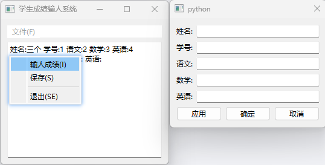

```python
import sys
from PySide6.QtWidgets import QApplication, QWidget, QDialog, QPushButton, QLineEdit, QMenuBar, QTextBrowser, QVBoxLayout, QHBoxLayout, QFormLayout, QFileDialog


class MyWindows(QWidget):
    def __init__(self, parent=None):
        super().__init__(parent)
        self.setWindowTitle("学生成绩输人系统")
        self.widget_setupUi()
        self.dialog_setupUi()

    def widget_setupUi(self):  # 建立主程序界面
        menuBar=QMenuBar(self)  # 定义菜单栏
        file_menu=menuBar.addMenu("文件(&F)")  # 定义菜单
        action_input=file_menu.addAction("输人成绩(&I)")  # 添加动作
        action_save=file_menu.addAction("保存(&S)")  # 添加动作
        file_menu.addSeparator()
        action_exit=file_menu.addAction("退出(SE)")  # 添加动作
        self.textBrowser=QTextBrowser(self)  # 显示数据控件

        v=QVBoxLayout(self)  # 主程序界面的布局
        v.addWidget(menuBar)
        v.addWidget(self.textBrowser)

        action_input.triggered.connect(self.action_input_triggered)  # 信号与槽函数连接
        action_save.triggered.connect(self.action_save_triggered)  # 信号与槽函数连接
        action_exit.triggered.connect(self.close)  # 信号与槽雨数连接

    def dialog_setupUi(self):  # 建立对话框界面
        self.dialog=QDialog(self)
        self.btn_apply=QPushButton("应用")
        self.btn_ok=QPushButton("确定")
        self.btn_cancel=QPushButton("取消")
        h=QHBoxLayout()
        h.addWidget(self.btn_apply)
        h.addWidget(self.btn_ok)
        h.addWidget(self.btn_cancel)

        self.line_name=QLineEdit()
        self.line_number=QLineEdit()
        self.line_chinese=QLineEdit()
        self.line_math=QLineEdit()
        self.line_english=QLineEdit()

        f=QFormLayout(self.dialog)
        f.addRow("姓名:", self.line_name)
        f.addRow("学号:", self.line_number)
        f.addRow("语文:", self.line_chinese)
        f.addRow("数学:", self.line_math)
        f.addRow("英语:", self.line_english)
        f.addRow(h)

        self.btn_apply.clicked.connect(self.btn_apply_clicked)  # 信号与槽函数连接
        self.btn_ok.clicked.connect(self.btn_ok_clicked)  # 信号与槽函数连接
        self.btn_cancel.clicked.connect(self.dialog.close)  # 信号与槽函数连接

    def action_input_triggered(self):
        self.dialog.open()

    def action_save_triggered(self):
        string=self.textBrowser.toPlainText()
        if len(string) > 0:
            filename, filter=QFileDialog.getSaveFileName(self, "保存文件", ".", "文本文件(*.txt)")
            if len(filename) > 0:
                fp=open(filename, "+", encoding="UTF-8")
                fp.writelines(string)
                fp.close()

    def btn_apply_clicked(self):  # 自定义槽函数,单击"应用"按钮
        template="姓名:{} 学号:{} 语文:{} 数学:{} 英语:{}"
        string=template.format(self.line_name.text(), self.line_number.text(), self.line_chinese.text(), self.line_math.text(), self.line_english.text())
        self.textBrowser.append(string)
        self.line_name.clear()
        self.line_number.clear()
        self.line_chinese.clear()
        self.line_math.clear()
        self.line_english.clear()

    def btn_ok_clicked(self):
        self.btn_apply_clicked()
        self.dialog.close()


if __name__=='__main__':
    app=QApplication(sys.argv)
    win=MyWindows()

    win.show()
    sys.exit(app.exec())

```

### 字体对话框QFontDialog

字体对话框 QFontDialog 用于选择字体,其界面是 PySide6 已经编辑好的,用户可以直接在对话框中选择与字体有关的选项。字体对话框的界面如图所示

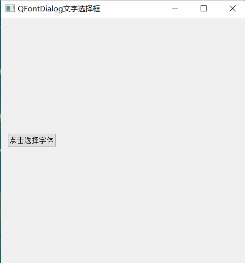

用QFontDialog 类创建标准字体对话框的方法如下,其中 QFont 用于始化对话:

```python
from PySide6.QtWidgets import QFontDialog

QFontDialog(initial: Union[PySide6.QtGui.QFont, str, Sequence[str]], parent: Union[PySide6.QtWidgets.QWidget, NoneType]=None) -> None
QFontDialog(parent: Union[PySide6.QtWidgets.QWidget, NoneType]=None) -> None 
```

#### 字体对话框QFontDialog 的常用方法

字体对话框 QFontDialog 主要方法介如下:

- 创建字体对话框

  - 一种方法是先创建对话框实例对象,设置对话框的属性,然后用show()open()或 exec()方法显示对话框
  - 另一种法是直接用getFont()方法getFont()方法是静态方法,可直接使用"类名getFont()"方法调用也可用实例对调用

- setOption(QFontDialog.FoniDinlogOption[,on=True])方法设置宇体对话框的选项,其中QFontDialog.FontDialogOption 可以取:

  - QFontDialog,NoButtons(不显示 OK 和Cancel按纽)
  - QFontDialog.DontUseNativeDialog(在 Mac 机上不使用本机字体对话框,使用PySide6 的字体对话框)
  - QFontDialog.ScalableFonts(显亲可缩放字体)
  - QFontDialog.NonScalableFonts(显示不可缩放字体)
  - QFontDialogMonospacedFonts(显示等宽字体)
  - QFontDialog.ProportionalFonts(显示比宇体)

- 用selectedFont()方法可以获取在单击 OK 按后,最终选中的字体。在对话中单击 OK 按钮时,同时也发送信号 fontSelected(QFont),其中参数 QFont 是最后中的宇体。

- setCurrentFont(QFont)方法可以设置对话框显示时,初始选中的字体。在对话框中选择不同的字体时,会发送 currentFontChanged(QFont信号,其中参数QFont 是当前选中的字体。

- `getFont(initial: QFont, widget=None, title="", QFontDialog.FontDialogOption)`方法可以用模式方式显示对话框,获取字体,其中参数:

  - initial是初始化字体
  - title是对话框标题,返回值是元组 Tuple[bool,QFont]。

  如在对话中单击 OK按钮,bool为True,单击 Cancel按钮,bool为 False,返回的字体是初始化字体。如果用getFont(widget=None)方法不能设置初始字体,则单击 Cancel按钮后返回的是默认字体。

字体对话框 QFontDialog 的常用方法如表所示:

| QFoniDialog的方法及参数类型                                  | 返回值的类型      | 说 明                                                        |
| ------------------------------------------------------------ | ----------------- | ------------------------------------------------------------ |
| selectedFont()                                               | QFont             | 获取在对话框中单击OK 按钮后,最终选 中的字体                  |
| setCurrentFont(QFont)                                        | None              | 设置字体对话框中当前的字体,用于初始 化字体对话框             |
| currentFont()                                                | QFont             | 获取字体对话框中当前的字体                                   |
| setOption(QFontDialog.FontDialogOption:boo=True],[on:bool=True])) | None              | 设置对话框的选项                                             |
| testOption(QFontDialog.FontDialogOption)                     | bool              | 测试是否设置了属性                                           |
| [static]getFont(initial: QFont, widget=None, title='', QFontDialog.FontDialogOption) | Tuple[bool,QFont] | 用模式方式显示对话框,获取字体,参数 initial是初始化字体,title 是对话框标题, 返回值是元组 Tuple[bool,QFont] |
| [static]getFont(widget: QWidget=None)                        | Tuple[bool,QFont] | 用模式方式显示对话框,获取字体,参数 initial是初始化字体,title 是对话框标题, 返回值是元组 Tuple[bool,QFont] |

#### 字体对话框 QFontDialog 的信号

字体对话框QFontDialog 的信号有 currentFontChanged(QFont)和 fontSelected(QFont)

- 在对话框中选择字体时发送 currentFontChanged(QFont)信号,在最终确定之前,可能会选择不同的字体
- 单击 OK 按钮时,发送 fontSelected(QFont)信号,参数是最选择的字体。

#### QFontDialog例子

```python
# -*- coding: UTF-8 -*-
# File date: Hi_2023/3/14 23:14
# File_name: 04-QFontDialog 例子.py
"""
QFontDialog 控件是一个常用的字体选择对话框，可以让用户选择所显示文本的字号、样式和格式。
使用QFontDialog 的函数getFont()，可以从字体选择对话框中选择显示文本的字号、样式和格式。

这个案例的代码非常简单，先通过getFont()函数获取字体,然后通过QLabelL.setfont()函数设置字体，如下所示：
还可以通过QWidget.setFont()设置窗口字体
"""

import sys
from PySide6.QtCore import *
from PySide6.QtGui import *
from PySide6.QtWidgets import *


class FontDialogDemo(QWidget):
    def __init__(self, parent=None):
        super(FontDialogDemo, self).__init__(parent)
        layout = QVBoxLayout()

        self.fontLabel = QLabel("Hello,我来显示字体效果")
        layout.addWidget(self.fontLabel)

        self.fontButton1 = QPushButton("设置QLabel字体")
        self.fontButton1.clicked.connect(self.set_label_font)
        layout.addWidget(self.fontButton1)

        self.fontButton2 = QPushButton("设置Qwidget字体")
        self.fontButton2.clicked.connect(lambda: self.setFont(QFontDialog.getFont(self.font(), self)[1]))
        layout.addWidget(self.fontButton2)

        self.setLayout(layout)
        self.setWindowTitle("Font Dialog 例子")
        # self.setFont(QFontDialog.getFont(self.font(),self)[1])

    def set_label_font(self):
        ok, font = QFontDialog.getFont()
        if ok:
            self.fontLabel.setFont(font)


if __name__ == '__main__':
    app = QApplication(sys.argv)
    demo = FontDialogDemo()
    demo.show()
    sys.exit(app.exec())

```


### 颜色对话框QColorDialog

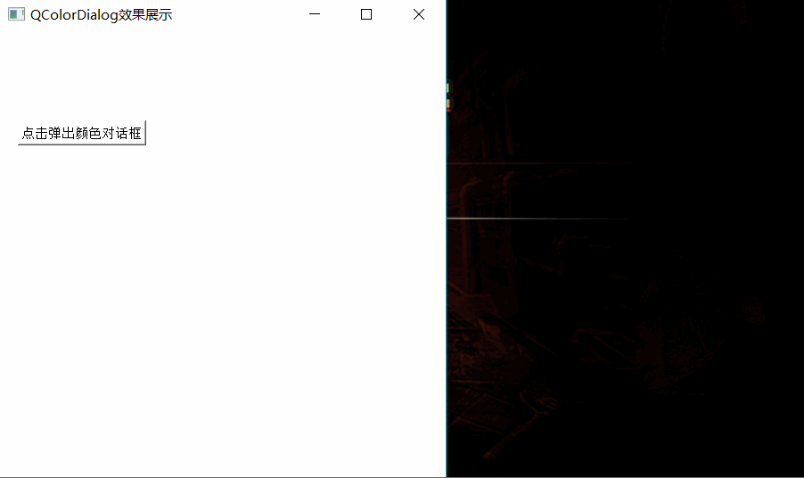

颜色对话框 QColorDialog 和字体对话框 QFontDialog 类似,也是一种标准对话框,供用户选择颜色。颜色对话框的界面如图所示,在对话框中用户可以自己设定和选择颜色,还可使用标准颜色,另外用户也可保存自己设定的颜色

用QColorDialog 类创建标准颜色对话框的方法如下,其中参数 QColor 用于初始化对话框,还可以用Qt.GlobalColor 和 QGradient 初始化颜色

```python
from PySide6.QtWidgets import QColorDialog

QColorDialog(initial: Union[PySide6.QtGui.QColor, PySide6.QtGui.QRgba64, Any, PySide6.QtCore.Qt.GlobalColor, str, int], parent: Union[PySide6.QtWidgets.QWidget, NoneType]=None) -> None
QColorDialog(parent: Union[PySide6.QtWidgets.QWidget, NoneType]=None) -> None 
```


#### 颜色对话框QColorDialog 的常用方法

颜色对话框 QColorDialog 的常用方法如表所示,大部分与字体对话的用法相同。

- 颜色对话框的显示可以用show()open()和 exec()方法,也可以用gelColor()方法。getColor()方法是静态方法,直接使用"类名.getColor()"方法调用,也可用实例对象调用
- 用setOption(QColorDialog.ColorDialogOption[,on=True])方法设置颜色,对话框的选项(默认情况下所有选项都是禁用的),其中 QColorDialog.ColorDialogOption 可以取 :

  - QColorDialog.ShowAlphaChannel(在对话据上显示 Alpha 通道)
  - QColorDialog.NoButtons(不显示0K Cancel 按钮)
  - QColorDialog.DontUseNativeDialog(使用Qt的标准颜色对话框，不使用本机的对话框)。
- 颜色对话中有标准的颜色,可以用standardColor(index:int)方法获取标准颜色,用setStandardColor(index:int,QColor)方法设置标准颜色
- 颜色对话框可以存储用户指定的颜色,用setCustomColor(index: int,QColor)方装设置用户颜色,用customColor(index:int)方法获取用户颜色

| QColorDialog的方法及参数类型                                 | 返回值的类型 | 说 明                                      |
| ------------------------------------------------------------ | ------------ | ------------------------------------------ |
| selectedColor()                                              | QColor       | 获取颜色对话框中单击 OK 按钮后 选中的颜色  |
| setCurrentColor(QColor)                                      | None         | 设置颜色对话框中当前颜色,用于 初始化对话框 |
| currentColor()                                               | QColor       | 获取对话框中当前的颜色                     |
| setOption(QColorDialog.ColorDialogOption[,on=True])          | .None        | 设置颜色对话框的选项                       |
| testOption(QColorDialog.ColorDialogOption)                   | bool         | 测试是否设置了选项                         |
| [static]setCustomColor(index:int, QColor)                    | None         | 设置用户颜色                               |
| [static]customColor(index: int)                              | QColor       | 获取用户颜色                               |
| [static]customCount()                                        | Int          | 获取用户颜色的数量                         |
| [static]setStandardColor(index: int,QColor)                  | None         | 设置标准颜色                               |
| [static]standardColor(index:int)                             | QColor       | 获取标准颜色                               |
| [static]getColor(initial: QColor=Qt.white, parent:QWidget=None, title: str="",options: QColorDialog.ColorDialogOptions) | QColor       | 显示对话框,获取颜色                        |

#### 颜色对话框 QColorDialog 的信号

颜色对话框 QColorDialog 的信号有 currentColorChanged(QColor)和 colorSelected(QColor)

- 在对话框中选择颜色时发送 currentColorChanged(QColor)信号,在最终确定之前,可能会选择不同的颜色;
- 在对话框中单击 OK 按钮时发送colorSelected(QColor)信号参数是最终选择的颜色。


#### 颜色对话框 QColorDialog 的例子

```python
# -*- coding: UTF-8 -*-
# File date: Hi_2023/3/14 23:27
# File_name: 05-QColorDialog 例子.py


import sys
from PySide6.QtWidgets import *
from PySide6.QtCore import *
from PySide6.QtGui import *


class ColorDlg(QDialog):

    def __init__(self, parent=None):
        super(ColorDlg, self).__init__(parent)
        self.setWindowTitle('QColorDialog案例')

        layout = QVBoxLayout()
        self.setLayout(layout)

        self.colorLabel = QLabel('显示颜色效果')
        layout.addWidget(self.colorLabel)

        colorButton = QPushButton("QColorDialog.get&Color()")
        colorButton.clicked.connect(self.setColor)
        layout.addWidget(colorButton)

        # 颜色选项
        self.colorDialogOptionsWidget = DialogOptionsWidget()
        self.colorDialogOptionsWidget.addCheckBox("使用Qt对话框(非系统)", QColorDialog.DontUseNativeDialog)
        self.colorDialogOptionsWidget.addCheckBox("显示透明度alpha", QColorDialog.ShowAlphaChannel)
        self.colorDialogOptionsWidget.addCheckBox("不显示buttons", QColorDialog.NoButtons)
        layout.addWidget(self.colorDialogOptionsWidget)

        # 自定义颜色设置
        layout.addSpacerItem(QSpacerItem(100, 20))
        self.label2 = QLabel('设置自定义颜色')
        layout.addWidget(self.label2)
        self.combobox = QComboBox(self, minimumWidth=100)
        item_list =['#ffffff', '#ffff00', '#ff0751', '#52aeff']
        index_list =[2, 3, 4, 5]
        for i in range(len(item_list)):
            self.combobox.addItem(item_list[i], index_list[i])
        self.combobox.activated.connect(lambda: self.on_activate(self.combobox))
        layout.addWidget(self.combobox)

    def setColor(self):
        options = self.colorDialogOptionsWidget.value()
        if options:
            color = QColorDialog.getColor(Qt.green, self, "Select Color", options)
        else:
            color = QColorDialog.getColor(Qt.green, self, "Select Color")
        if color.isValid():
            self.colorLabel.setText(color.name())
            self.colorLabel.setPalette(QPalette(color))
            self.colorLabel.setAutoFillBackground(True)

    def on_activate(self, combobox):
        color = QColor(combobox.currentText())
        index = combobox.currentData()
        QColorDialog.setCustomColor(index, color)
        self.label2.setText('QColorDialog在位置{} 已经添加自定义颜色{}'.format(index, combobox.currentText()))
        self.label2.setPalette(QPalette(color))
        self.label2.setAutoFillBackground(True)


class DialogOptionsWidget(QWidget):

    def __init__(self, parent=None):
        super(DialogOptionsWidget, self).__init__(parent)

        self.layout = QVBoxLayout()
        self.setLayout(self.layout)
        self.checkBoxList =[]

    def addCheckBox(self, text, value):
        checkBox = QCheckBox(text)
        self.layout.addWidget(checkBox)
        self.checkBoxList.append((checkBox, value))

    def value(self):
        result = 0
        for checkbox_tuple in self.checkBoxList:
            if checkbox_tuple[0].isChecked():
                result = checkbox_tuple[1]
        return result


if __name__ == '__main__':
    app = QApplication(sys.argv)
    form = ColorDlg()
    form.show()
    app.exec()

```


### 文件对话框QFileDialog

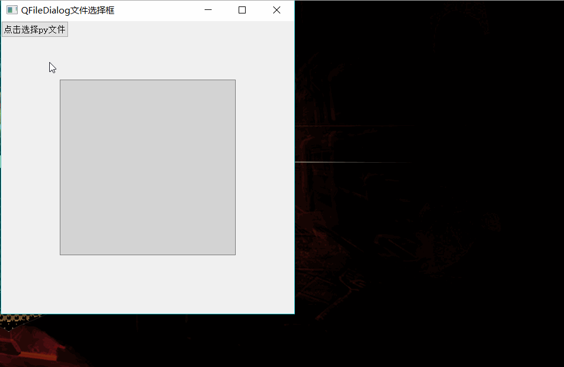

文件对话框 QFileDialog 用于打开或保存文件时获取文件路径和文件名。

在文件对话框中可以根据文件类型对文件进行过滤,只显示具有某些扩展名的文件。

文件对话框的界面分为两种,,一种是 PySide6 提供的界面另一种是本机操作系统提供的界面,可以通过文件对话框的 setOption(QFileDialog.DontUseNativeDialog,bool)方法设置显示的是哪种界面。

对话框上的标签和按钮名称都可以通过对话框的属性进行修改。

用QFileDialog类创建文件对话框实例的方法如下所示其中

- caption 用于设置对话框的标题
- directory设置默认路径
- filter 设置只显示具有某种扩展名的文件,filter 的取值则见下面的内容

```python
from PySide6.QtWidgets import QFileDialog

QFileDialog(parent: PySide6.QtWidgets.QWidget, f: PySide6.QtCore.Qt.WindowType) -> None
QFileDialog(parent: Union[PySide6.QtWidgets.QWidget, NoneType]=None, caption: str='', directory: str='', filter: str='') -> None
```

#### 文件对话框QFileDialog 的常用方法

文件对话框QFileDialog 主要方法介绍如下:

- 文件对话框也用show()、open()和exec()方法显示,最简便的方法是用QFileDialog 提供的静态方法来打开文件对话框获取文件路径和文件名。

- 用setFileMode(QFileDialog.FileMode)方法可以设置对话框的文件模式,文件模式是指对话框显示的内容或允许选择的内容,其中参数 QFileDialog.FileMode 可以取:

  - QFileDialog.AnyFile(任意文件和文件夹,也可以输入不存在的文件或文件夹)
  - QFileDialog.ExistingFile(只能选择一个存在的文件,不能是文件夹或不存在的文件)
  - QFileDialog.Directory(只能选择文件夹)
  - QFileDialog.ExistingFiles(可以选择多个存在的文件);

  用fileMode()方法可以获取文件模式。

- 用setOption(QFileDialog.Option,on=True)方法设置文件对话框的外观选项,需在显示对话框之前设置,参数 QFileDialog.Option 可以取:

  - QFileDialog.ShowDirsOnly(只显示文件夹)
  - QFileDialog.DontResolveSymlinks(不解析链接)
  - QFileDialog.DontConfirmOverwrite(存盘时若选择了存在的文件,不提示覆盖信息)
  - QFileDialog.DontUseNativeDialog(不使用操作系统的对话框)
  - QFileDialogReadOnly(只读)
  - QFileDialog.HideNameFilterDetails(隐藏名称过滤器的详细信息)
  - QFileDialog.DontUseCustomDirectoryIcons(不使用用户的目录图标,有些系统允许使用)。

- 用setAcceptMode(QFileDialog.AcceptMode)方法设置文件对话框是打开对话框还是保存对话框,参数 QFileDialog.AcceptMode 可取QFileDialog.AcceptOpen 或QFileDialog.AcceptSave。

  用setViewMode(QFileDialog, ViewMode)方法设置对话框的视图模式参数QFileDialog.ViewMode可取:

     - QFileDialog.Detail(详细显示)
     - QFileDialog.List(列表显示,只显示图标和名称)。

- 用setDefaultSuffix(str)方法设置默认的扩展名,例如在保存文件时只需输入文件名,系统自动会附加默认的扩展名。

- 用selectFile(str)方法可以设置对话框中初始选中的文件,用setDirectory(str)setDirectory(QDir)方法设置对话框的初始路径,关于QDir 的内容见数据读写和文件管理相关章节

- 设置过滤器 filter。

  - 过滤器的作用是在文件对话框中只显示某些类型的文件,例如通过方法setNameFilter("Picture(*.png *.bmp *.jpeg *jpg")设置过滤器之后,对话框只显示扩展名为 png、bmp、jpeg 和jpg 的文件。
  - 创建过滤器时,过滤器间用空格隔开,如果有括号,则用括号中的内容作为过滤器,多个过滤器用两个分号";;"隔开,例如 setNameFilter("Picture(* ,png *.bmp);; text(*.txt)")。
  - 用setNameFilter(str)方法或 setNameFilters(Sequence[str])方法设置对话框中的过滤器。
  - 用selectedFiles()方法可以获得最终选中的文件名(含路径)的列表
  - 用selectedNameFilter()方法可以获得最终选中的过滤器对话框上的标签和按钮的文字
  - 用setLabelText(QFileDialog.DialogLabel,str)方法重新设置,其中参数 QFileDialog.DialogLabel可以取 :
    - QFileDialog.LookInQFileDialogFileName
    - QFileDialog.FileType
    - QFileDialog.Accept
    - QFileDialog.Reject

- 用QFileDialog 的静态方法快速显示文件对话框,这些静态方法的格式如下所示:

  - caption 是对话框的标题,
  - dir 是初始路径,
  - ilter 是对话框中可选的过滤器
  - selectedFilter 是对话框中已经选中的过滤器,

  这些静态函数的返回值除getExistingDirectory()和 getExistingDirectoryUrl()外其都是元组,元组的第 1个元素是文件名或文件名列表,第 2个元素是选中的过滤器。

  ```python
  getExistingDirectory(parent: Union[PySide6.QtWidgets.QWidget, NoneType]=None, caption: str='', dir: str='', options: PySide6.QtWidgets.QFileDialog.Option=Instance(PySide6.QtWidgets.QFileDialog.Option.ShowDirsOnly)) -> str
  getExistingDirectoryUrl(parent: Union[PySide6.QtWidgets.QWidget, NoneType]=None, caption: str='', dir: Union[PySide6.QtCore.QUrl, str]=Default(QUrl), options: PySide6.QtWidgets.QFileDialog.Option=Instance(PySide6.QtWidgets.QFileDialog.Option.ShowDirsOnly), supportedSchemes: Sequence[str]=[]) -> PySide6.QtCore.QUrl
  getOpenFileName(parent: PySide6.QtWidgets.QWidget, caption: Union[str, NoneType]=None, dir: str='', filter: str='', selectedFilter: str='', options: PySide6.QtWidgets.QFileDialog.Option=Default(QFileDialog.Options)) -> Tuple
  getOpenFileNames(parent: PySide6.QtWidgets.QWidget, caption: Union[str, NoneType]=None, dir: str='', filter: str='', selectedFilter: str='', options: PySide6.QtWidgets.QFileDialog.Option=Default(QFileDialog.Options)) -> Tuple
  getOpenFileUrl(parent: PySide6.QtWidgets.QWidget, caption: Union[str, NoneType]=None, dir: Union[PySide6.QtCore.QUrl, str]='', filter: str=Default(QUrl), selectedFilter: str='', options: PySide6.QtWidgets.QFileDialog.Option=Default(QFileDialog.Options), supportedSchemes: Sequence[str]=[]) -> Tuple
  getOpenFileUrls(parent: PySide6.QtWidgets.QWidget, caption: Union[str, NoneType]=None, dir: Union[PySide6.QtCore.QUrl, str]='', filter: str=Default(QUrl), selectedFilter: str='', options: PySide6.QtWidgets.QFileDialog.Option=Default(QFileDialog.Options), supportedSchemes: Sequence[str]=[]) -> Tuple
  getSaveFileName(parent: PySide6.QtWidgets.QWidget, caption: Union[str, NoneType]=None, dir: str='', filter: str='', selectedFilter: str='', options: PySide6.QtWidgets.QFileDialog.Option=Default(QFileDialog.Options)) -> Tuple
  getSaveFileUrl(parent: PySide6.QtWidgets.QWidget, caption: Union[str, NoneType]=None, dir: Union[PySide6.QtCore.QUrl, str]='', filter: str=Default(QUrl), selectedFilter: str='', options: PySide6.QtWidgets.QFileDialog.Option=Default(QFileDialog.Options), supportedSchemes: Sequence[str]=[]) -> Tuple
  ```

文件对话框QFileDialog 的常用方法如表所示:

| QFileDialog的方法及参数类型                                  | 返回值的类型 | 说明                                                         |
| ------------------------------------------------------------ | ------------ | ------------------------------------------------------------ |
| serAcceptMode(QFileDialog.AceptMode)                         | None         | 设置是打开还是保存对话框                                     |
| setDefaultSuffix(str)                                        | None         | 设置默认的扩展名                                             |
| defaultSuffix()                                              | Str          | 获取默认的扩展名                                             |
| saveState()                                                  | QByteArray   | 保存对话框状态到 QByteArray 中                               |
| restoreState(QByteArray)                                     | bool         | 恢复对话框的状态                                             |
| selectFile(str)                                              | None         | 设置初始选中的文件,可当作默认文件                            |
| selectedFiles()                                              | List[str]    | 获取被选中的文件的绝对文件路径列表, 如果没有选择文件,则返回值只有路径 |
| selectNameFilter(str)                                        | None         | 设置对话框初始名称过滤器                                     |
| selectedNameFilter()                                         | stI          | 获取当前选择的名称过滤器                                     |
| selectUrl(url: Union[QUrl,str])                              | None         | 设置对话框中初始选中的文件                                   |
| selectedUrls()                                               | ListLQUrlJ   | 获取被选中的文件的绝对文件路径列表, 如果没有选择文件,则返回值只有路径 |
| directory()                                                  | QDir         | 获取对话框的当前路径                                         |
| directoryUrl()                                               | QUrl         | 获取对话框的当前路径                                         |
| setDirectory(directory: Union[QDir, str])                    | None         | 设置对话框的初始路径                                         |
| setFileMode(QFileDialog.FileMode)                            | None         | 设置文件模式,对话框是用于选择路径、单 个文件还是多个文件     |
| setHistory(paths:Sequence[str])                              | None         | 设置对话框的浏览记录                                         |
| history()                                                    | List[str]    | 获取对话框的浏览记录列表                                     |
| setLabelText(QFileDialog.DialogLabel, str)                   | None         | 设置对话框上各标签或按钮的名称                               |
| labelText(QFileDialog.DialogLabel)                           | str          | 获取对话框上标签或按钮的名称                                 |
| setNameFilter(str)                                           | None         | 根据文件的扩展名设置过滤器                                   |
| setNameFilters(Sequence[str])                                | None         | 设置多个过滤器                                               |
| nameFilters()                                                | List[str]    | 获取过滤器列表                                               |
| setFilter(filters: QDir.Filters)                             | None         | 根据文件的隐藏、已被修改、系统文件等特 性设置过滤器          |
| setOption(QFileDialog.Option,on=True)                        | None         | 设置对话框的外观选项                                         |
| testOption(QFileDialog.Option)                               | bool         | 测试是否设置了某种外观样式                                   |
| setViewMode(QFileDialog.ViewMode)                            | None         | 设置对话框中文件的视图方式,是列表显 示还是详细显示           |
| getExistingDirectory(parent: Union[PySide6.QtWidgets.QWidget, NoneType]=None, caption: str='', dir: str='', options: PySide6.QtWidgets.QFileDialog.Option=Instance(PySide6.QtWidgets.QFileDialog.Option.ShowDirsOnly)) -> str | str          | 打开文件对话框,获取路径或文件及过滤器                        |
| getExistingDirectoryUrl(parent: Union[PySide6.QtWidgets.QWidget, NoneType]=None, caption: str='', dir: Union[PySide6.QtCore.QUrl, str]=Default(QUrl), options: PySide6.QtWidgets.QFileDialog.Option=Instance(PySide6.QtWidgets.QFileDialog.Option.ShowDirsOnly), supportedSchemes: Sequence[str]=[]) -> PySide6.QtCore.QUrl | QUrl         | 打开文件对话框,获取路径或文件及过滤器                        |
| getOpenFileName(parent: PySide6.QtWidgets.QWidget, caption: Union[str, NoneType]=None, dir: str='', filter: str='', selectedFilter: str='', options: PySide6.QtWidgets.QFileDialog.Option=Default(QFileDialog.Options)) -> Tuple | Tuple        | 打开文件对话框,获取路径或文件及过滤器                        |
| getOpenFileNames(parent: PySide6.QtWidgets.QWidget, caption: Union[str, NoneType]=None, dir: str='', filter: str='', selectedFilter: str='', options: PySide6.QtWidgets.QFileDialog.Option=Default(QFileDialog.Options)) -> Tuple | Tuple        | 打开文件对话框,获取路径或文件及过滤器                        |
| getOpenFileUrl(parent: PySide6.QtWidgets.QWidget, caption: Union[str, NoneType]=None, dir: Union[PySide6.QtCore.QUrl, str]='', filter: str=Default(QUrl), selectedFilter: str='', options: PySide6.QtWidgets.QFileDialog.Option=Default(QFileDialog.Options), supportedSchemes: Sequence[str]=[]) -> Tuple | Tuple        | 打开文件对话框,获取路径或文件及过滤器                        |
| getOpenFileUrls(parent: PySide6.QtWidgets.QWidget, caption: Union[str, NoneType]=None, dir: Union[PySide6.QtCore.QUrl, str]='', filter: str=Default(QUrl), selectedFilter: str='', options: PySide6.QtWidgets.QFileDialog.Option=Default(QFileDialog.Options), supportedSchemes: Sequence[str]=[]) -> Tuple | Tuple        | 打开文件对话框,获取路径或文件及过滤器                        |
| getSaveFileName(parent: PySide6.QtWidgets.QWidget, caption: Union[str, NoneType]=None, dir: str='', filter: str='', selectedFilter: str='', options: PySide6.QtWidgets.QFileDialog.Option=Default(QFileDialog.Options)) -> Tuple | Tuple        | 打开文件对话框,获取路径或文件及过滤器                        |
| getSaveFileUrl(parent: PySide6.QtWidgets.QWidget, caption: Union[str, NoneType]=None, dir: Union[PySide6.QtCore.QUrl, str]='', filter: str=Default(QUrl), selectedFilter: str='', options: PySide6.QtWidgets.QFileDialog.Option=Default(QFileDialog.Options), supportedSchemes: Sequence[str]=[]) -> Tuple | Tuple        | 打开文件对话框,获取路径或文件及过滤器                        |

#### QFileDialog的信号

文件对话框 QFileDialog 的信号如表所示。

- 用户在文件对话框中选择不同的文件或目录时会发送currentChanged(file:str)信号,其中参数 file是包含文件名的完整路径
- 在对话框中单击 open 按钮或 save 按钮后会发送fileSelected(file;str)或者 filesSelected(files: List[str])信号
- 在对话框中更改路径时会发送 directoryEntered(directory:str)信号。

| QFileDialog的信号及参数类型     | 说 明                                                        |
| ------------------------------- | ------------------------------------------------------------ |
| currentChanged(file: str)       | 在对话框中所选择的文件或路径发生改变时发送信号,参数是当前 选择的文件或路径 |
| currentUrlChanged(QUrl)         | 在对话框中所选择的文件或路径发生改变时发送信号,,传递的参数是 QUrl |
| directoryEntered(directory:str) | 进入新路径时发送信号,参数是新路径                            |
| directoryUrlEntered(QUrl)       | 进入新路径时发送信号,传递的参数是QUrl                        |
| fileSelected(file: str)         | 单击open或save按钮后发送信号,参数是选中的文件                |
| urlSelected(QUrI)               | 单击open或save按钮后发送信号,传递的参数是 QUrl               |
| filesSelected(files:List[str])  | 单击open或save按钮后发送信号,参数是选中的文件列表            |
| urlsSelected(List[QUrl])        | 单击open或save按钮后发送信号,传递的参数是List[QUr1]          |
| filterSelected(str)             | 选择新的过滤器后发送信号,参数是新过滤器                      |

#### QFileDialog 例子

```python
# -*- coding: UTF-8 -*-
# File date: Hi_2023/3/14 23:19
# File_name: 10-QFileDialog 例子.py


import sys
from PySide6.QtCore import *
from PySide6.QtGui import *
from PySide6.QtWidgets import *
import os


class filedialogdemo(QWidget):
    def __init__(self, parent=None):
        super(filedialogdemo, self).__init__(parent)
        layout = QVBoxLayout()
        self.label = QLabel("此处显示文件信息")
        layout.addWidget(self.label)
        self.label2 = QLabel()
        layout.addWidget(self.label2)

        self.button_pic_filter1 = QPushButton("加载图片-过滤1(静态方法)")
        self.button_pic_filter1.clicked.connect(self.file_pic_filter1)
        layout.addWidget(self.button_pic_filter1)

        self.button_pic_filter2 = QPushButton("加载图片-过滤2(实例化方法)")
        self.button_pic_filter2.clicked.connect(self.file_pic_filter2)
        layout.addWidget(self.button_pic_filter2)

        self.button_pic_filter3 = QPushButton("加载图片-过滤3(实例化方法)")
        self.button_pic_filter3.clicked.connect(self.file_pic_filter3)
        layout.addWidget(self.button_pic_filter3)

        self.button_MultiFile1 = QPushButton("选择多个文件-过滤1(静态方法)")
        self.button_MultiFile1.clicked.connect(self.file_MultiFile1)
        layout.addWidget(self.button_MultiFile1)

        self.button_MultiFile2 = QPushButton("选择多个文件-过滤2(实例化方法)")
        self.button_MultiFile2.clicked.connect(self.file_MultiFile2)
        layout.addWidget(self.button_MultiFile2)

        self.button_file_mode = QPushButton("file_mode示例：选择文件夹")
        self.button_file_mode.clicked.connect(self.file_mode_show)
        layout.addWidget(self.button_file_mode)

        self.button_directory = QPushButton("选择文件夹(静态方法)")
        self.button_directory.clicked.connect(self.directory_show)
        layout.addWidget(self.button_directory)

        self.button_save = QPushButton("存储文件")
        self.button_save.clicked.connect(self.file_save)
        layout.addWidget(self.button_save)

        self.setLayout(layout)
        self.setWindowTitle("File Dialog 例子")

    def file_pic_filter1(self):
        fname, _ = QFileDialog.getOpenFileName(self, caption='Open file1', dir=os.path.abspath('.') + '\\images',
                                               filter="Image files(*.jpg *.png);;Image files2(*.ico *.gif);;All files(*)")
        self.label.setPixmap(QPixmap(fname))
        self.label2.setText('你选择了:\n' + fname)

    def file_pic_filter2(self):
        file_dialog = QFileDialog(self, caption='Open file2', directory=os.path.abspath('.') + '\\images',
                                  filter="Image files(*.jpg *.png);;Image files2(*.ico *.gif);;All files(*)")

        if file_dialog.exec():
            file_path_list = file_dialog.selectedFiles()
            self.label.setPixmap(QPixmap(file_path_list[0]))
            self.label2.setText('你选择了:\n' + file_path_list[0])

    def file_pic_filter3(self):
        file_dialog = QFileDialog()
        file_dialog.setWindowTitle('Open file3')
        file_dialog.setDirectory(os.path.abspath('.') + '\\images')
        file_dialog.setNameFilter("Image files(*.jpg *.png);;Image files2(*.ico *.gif);;All files(*)")

        if file_dialog.exec():
            file_path_list = file_dialog.selectedFiles()
            self.label.setPixmap(QPixmap(file_path_list[0]))
            self.label2.setText('你选择了:\n' + file_path_list[0])

    def file_MultiFile1(self):
        file_path_list, _ = QFileDialog.getOpenFileNames(self, caption='选择多个文件', dir=os.path.abspath('.'),
                                                         filter="All files(*);;Python files(*.py);;Image files(*.jpg *.png);;Image files2(*.ico *.gif)")
        self.label.setText('你选择了如下路径：\n' + ';\n'.join(file_path_list))
        self.label2.setText('')

    def file_MultiFile2(self):
        file_dialog = QFileDialog(self, caption='选择多个文件', directory=os.path.abspath('.'),
                                  filter="All files(*);;Python files(*.py);;Image files(*.jpg *.png);;Image files2(*.ico *.gif)")
        file_dialog.setFileMode(file_dialog.ExistingFiles)
        if file_dialog.exec():
            file_path_list = file_dialog.selectedFiles()
            self.label.setText('你选择了如下路径：\n' + ';\n'.join(file_path_list))
            self.label2.setText('')

    def file_mode_show(self):
        file_dialog = QFileDialog(self, caption='file_mode示例：选择文件夹', directory=os.path.abspath('.'))
        file_dialog.setFileMode(file_dialog.Directory)
        if file_dialog.exec():
            file_path_list = file_dialog.selectedFiles()
            self.label.setText('你选择了如下路径：\n' + ';\n'.join(file_path_list))
            self.label2.setText('')

    def directory_show(self):
        directory_path = QFileDialog.getExistingDirectory(caption='获取存储路径', dir=os.path.abspath('.'))
        self.label.setText('获取目录：\n' + directory_path)
        self.label2.setText('')

    def file_save(self):
        file_save_path, _ = QFileDialog.getSaveFileName(self, caption='获取存储路径', dir=os.path.abspath('.'),
                                                        filter="All files(*);;Python files(*.py);;Image files(*.jpg *.png);;Image files2(*.ico *.gif)")
        self.label.setText('存储路径如下：\n' + file_save_path)
        self.label2.setText('')


if __name__ == '__main__':
    app = QApplication(sys.argv)
    ex = filedialogdemo()
    ex.show()
    sys.exit(app.exec())

```


### 输入对话框QInputDialog


输人对话框 QImputDialog 用于输人简单内容或选择内容,分为整数输入框浮点数输人框、文本输人框、多行文本输入框和下拉列表输入框5种,它们的界面如图所示输人对话框由一个标签、一个输入控件和两个按钮构成。

- 如果是整数输人框,输人控件息QSpinBox;
- 如果是浮点数输人框,输入控件是 QDoubleSpinltox;
- 如果是单行文本输人框输入控件是 QlineEdit;
- 如果是多行文本输人框,输人控件是 QPinTextEdit,
- 如果是下物列表输入框,输入控件是 QComboBox 或 QListViw。

输人的类型用setInputMode(QInputDialog.InputMode)方法设置。

用QInputDialog 类创建输入框实例的方法如下所示

```python
from PySide6.QtWidgets import QInputDialog

QInputDialog(self, parent: Union[PySide6.QtWidgets.QWidget, NoneType]=None, flags: PySide6.QtCore.Qt.WindowType=Default(Qt.WindowFlags)) -> None
```

#### 输入对话框QInputDialog 的常用方法

输人对话框 QInputDialog 主要方法介绍如下:

- 输人对话框分为整数输入对话框、浮点数输人对话框和文本输人对话框,其中文本输人对话框又分为单行文本输人对话框、多行文本输人对话框和列表输人对话框列表输入对话框通常是从 QComboBox 控件或 QListWiew 控件中选择内容。

  - 用setInputMode(QInputDialog.InputMode)方法设置输人对话框的类型,其中参数QInputDialog.InputMode 可以取:
    - QInputDialog.IntInput(整数输人对话框)
    - QInputDialog.Double(浮点数输入对话框)
    - InputQInputDialog,TextInput(文本输入对话框)。

- 对于整数输入对话框

  - 用setIntValue(int)方法可以设置对话框初次显示时的值,用intValue()方法可以获取单击 OK 按后的整数值。
  - 整数输入对话框中允许输人值的范围用setIntMinimum(int)、setIntMaximum(int)方法设置,或者用setIntRange(int,int)方法设置。
  - 整数输人对话框的输入控件是 QSpinBox,单击右侧上下箭头可微调整数,微调整数值变化的步长用setIntStep(int)方法设置。

- 对于浮点数输人对话框

  - 用setDoubleValue(lont)方法可以设置对话框初次显示时的值,
  - 用doubleValue()方法可以获取单击 OK 按后的浮点数值。
  - 浮点数对话框中允许输人值的范围用setDoubleMinimum(float) setDoubleMaximum(float)方法设置,或者用setDoubleRange(float,float)方法设置。
  - 浮点数对话框的输入控件是QDoubleSpinBox,单击右侧上下头可微调数据,点数值变化的步长用setDoubleStep(float)方法设置。

- 对于文本输人对话框

  - 默认的输入控件是 QLineEdit
  - setOption(QInputDialog.UscPlainTextEditForTextInput)方法将 QLineEdit 控件换成 QPlainTextEdit, 当用setComboBoxllems(Sequence[str])方法设置控件的项(item)时,输入控件替换成QComboBox,如果设置成 setOption(QInputDialog.UseListViewForComboBoxItems)则输入控件替换成 QListView。

- 对于文本输入对话框

  - 用setTextValue(str)方法可以设置对话框中初始文本
  - 用textValue()方法获取单击 OK 按后输人对话的值。
  - 当输人控件是 QLineEdit时
    - 用setTextEchoMode(QLineEdit, EchoMode)方法可以设置QLineEidt 控件的输人模式其中QLineEdit.EchoMode 可以取:
      - QLineEdit,Norma(正常显示)
      - QLineEdit.NoEcho(输人文字时,没有任何显示)
      - QLineEdit,Password(输人文学时,按照密码方式显示)
      - QLineEdit,PasswordEchoOnEdit(失去焦点时,密码显示状态,编辑文本时,正常显示)。
    - 用setLabelText(str)方法设置输人对话框中标签显示的名称
    - 用setOkButtonTex(str)方法和 setCancelButtonText(str)方法分别设置 OK 按和 Cancel 按钮的名称
    - 用setOption(QInputDialog.NoButtons)方法设置成没有按钮。

- 除了用以上方法显示和设置对话框的类型和外观外,还可以直接使用下面的静态数来显示对话框和获得返回值,其中

  - title 是设置对话框的标题名称
  - label是对话中标签的名称。

  在对话框中单击 OK 按钮后,返回值是元组(输人值,True);单击Cancel按钮后,返回值是元组(0,False)或("", False)

  ```python
  getDouble(parent: PySide6.QtWidgets.QWidget, title: str, label: str, value: float=0, minValue: float=-2147483647, maxValue: float=2147483647, decimals: int=1, flags: PySide6.QtCore.Qt.WindowType=Default(Qt.WindowFlags), step: float=1) -> Tuple[float, bool]
  getInt(parent: PySide6.QtWidgets.QWidget, title: str, label: str, value: int=0, minValue: int=-2147483647, maxValue: int=2147483647, step: int=1, flags: PySide6.QtCore.Qt.WindowType=Default(Qt.WindowFlags)) -> Tuple[int, bool]
  getItem(parent: PySide6.QtWidgets.QWidget, title: str, label: str, items: Sequence[str], current: int=0, editable: bool=True, flags: PySide6.QtCore.Qt.WindowType=Default(Qt.WindowFlags), inputMethodHints: PySide6.QtCore.Qt.InputMethodHint=Instance(Qt.ImhNone)) -> Tuple[str, bool]
  getMultiLineText(parent: PySide6.QtWidgets.QWidget, title: str, label: str, text: str='', flags: PySide6.QtCore.Qt.WindowType=Default(Qt.WindowFlags), inputMethodHints: PySide6.QtCore.Qt.InputMethodHint=Instance(Qt.ImhNone)) -> Tuple[str, bool]
  getText(parent: PySide6.QtWidgets.QWidget, title: str, label: str, echo: PySide6.QtWidgets.QLineEdit.EchoMode=Instance(PySide6.QtWidgets.QLineEdit.Normal), text: str='', flags: PySide6.QtCore.Qt.WindowType=Default(Qt.WindowFlags), inputMethodHints: PySide6.QtCore.Qt.InputMethodHint=Instance(Qt.ImhNone)) -> Tuple[str, bool]
  ```

输人对话框 QInputDialog 的常用方法如表所示:

| QInputDialog的方法及参数类型                      | 返回值的类型      | 说 明                                                   |
| ------------------------------------------------- | ----------------- | ------------------------------------------------------- |
| setInputMode(QInputDialog.InputMode)              | None              | 设置输入对话框的类型                                    |
| setOption(QInputDialog.InputDialogOption,on=True) | None              | 设置输人对话框的参数                                    |
| testOption(QInputDialog.InputDialogOption)        | bool              | 测试是否设置某些参数                                    |
| setLabelText(str)                                 | None              | 设置对话框中标签的名称                                  |
| setOkButtonText(str)                              | None              | 设置对话框中OK按钮的名称                                |
| setCancelButtonText(str)                          | None              | 设置Cancel按钮的名称                                    |
| setIntValue(int)                                  | None              | 设置对话框中初始整数                                    |
| intValue()                                        | int               | 获取对话框中的整数                                      |
| setIntMaximum(int)                                | None              | 设置整数的最大值                                        |
| setIntMinimum(int)                                | None              | 设置整数的最小值                                        |
| setlntRange(min: int,max:int)                     | None              | 设置整数的范围                                          |
| setIntStep(int)                                   | None              | 设置单击向上或向下箭头时整数调整的 步长                 |
| setDoubleValue(float)                             | None              | 设置对话框中初始浮点数                                  |
| doubleValue()                                     | float             | 获取对话框中的浮点数                                    |
| setDoubleDecimals(int)                            | None              | 设置浮点数的小数位数                                    |
| setDoubleMaximum(float)                           | None              | 设置浮点数的最大值                                      |
| setDoubleMinimum(float)                           | None              | 设置浮点数的最小值                                      |
| setDoubleRange(min: float,max: float)             | None              | 设置浮点数的范围                                        |
| setDoubleStep(float)                              | None              | 设置单击向上或向下箭头时浮点数调整 的步长               |
| setTextValue(str)                                 | None              | 设置对话框中初始文本                                    |
| setComboBoxItems(Sequence[str])                   | None              | 设置下拉列表的值                                        |
| textValue()                                       | Str               | 获取对话框中的文本                                      |
| setTextEchoMode(QLineEdit.EchoMode)               | None              | 设置QLineEdit控件的输人模式                             |
| comboBoxItems()                                   | List[str]         | 获取下拉列表中的值                                      |
| setComboBoxEditable(bool)                         | None              | 设置下拉列表是否可编辑,用户是否可 输入数据              |
| [static]getInt(parameters)                        | Tuple[int.bool]   | 静态函数,显示输入对话框,并返回输入 的值和单击按钮的类型 |
| [static]getDouble(parameters)                     | Tuple[float,bool] | 静态函数,显示输入对话框,并返回输入 的值和单击按钮的类型 |
| [static]getText(parameters)                       | Tuple[str,bool]   | 静态函数,显示输入对话框,并返回输入 的值和单击按钮的类型 |
| [static]getMultiLineText(parameters)              | Tuple[str,bool]   | 静态函数,显示输入对话框,并返回输入 的值和单击按钮的类型 |
| [static]getItem(parameters)                       | Tuple[str,bool]   | 静态函数,显示输入对话框,并返回输入 的值和单击按钮的类型 |

#### 输入对话框QInputDialog 的信号

输入对话框 QInputDialog 的信号如表所示。

对于3类型的输人对话框

- 单击 OK按钮时分别发送intValueSelected(int)、doubleValueSelected(float)和 textValueSelected(str)信号
- 编辑状态会分别发送intValueChanged(int)、doubleValueChanged(float)和 textValueChanged(str)信号

| QInputDialog的信号及参数类型 | 说 明                                |
| ---------------------------- | ------------------------------------ |
| intValueChanged(int)         | 输人对话框中的整数值改变时发送信号   |
| intValueSelected(int)        | 单击OK按钮后发送信号                 |
| doubleValueChanged(float)    | 输人对话框中的浮点数值改变时发送信号 |
| doubleValueSelected(float)   | 单击OK按钮后发送信号                 |
| textValueChanged(str)        | 输人对话框中的文本改变时发送信号     |
| textValueSelected(str)       | 单击OK按钮后发送信号                 |

### 信息对话框QMessageBox

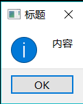   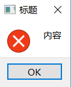   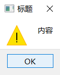   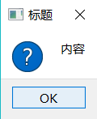    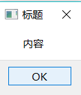

信息对话框QMessageBox 用于向用户提供一些信息,或者询问用户如何进行下一步作,信息对话框的界面如图所示,由文本(textinformativeText、detailedText)、图标和按钮3 部分构成,因此在建立信息对话框时,主要设置这 3部分的参数。

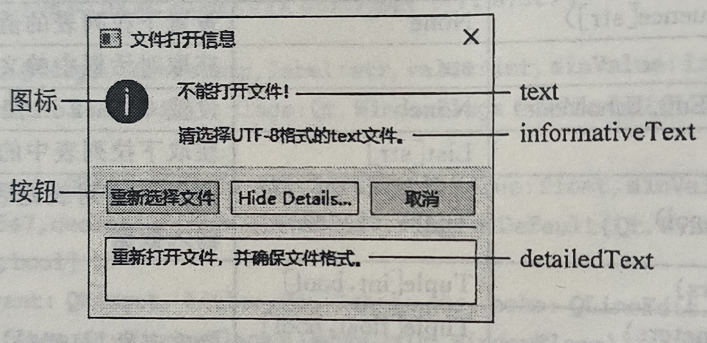

用QMessageBox类创建信息对话框的方法如下,设置对话框中的按钮icon和 button的取值见下面的内容

- icon 是对话框中的图标title是对话框的标题
- text是对话框中显示的文本buttons
- flags 设置窗口的类型使用默认值即可。

```python
from PySide6.QtWidgets import QMessageBox

QMessageBox(icon: PySide6.QtWidgets.QMessageBox.Icon, title: str, text: str, buttons: PySide6.QtWidgets.QMessageBox.StandardButton=Instance(QMessageBox.StandardButton.NoButton), parent: Union[PySide6.QtWidgets.QWidget, NoneType]=None, flags: PySide6.QtCore.Qt.WindowType=Instance(Qt.Dialog | Qt.MSWindowsFixedSizeDialogHint)) -> None
QMessageBox(parent: Union[PySide6.QtWidgets.QWidget, NoneType]=None) -> None 
```

#### 信息对话框 QMessageBox 的常用方法

信息对话框 QMessageBox 的常用方法如表所示

| QMessageBox的方法及参数类型                                  | 返回值的类型                      | 说 明                                                        |
| ------------------------------------------------------------ | --------------------------------- | ------------------------------------------------------------ |
| setText(str)                                                 | None                              | 设置信息对话框的文本                                         |
| text()                                                       | str                               | 获取信息对话框的文本                                         |
| setInformativeText(str)                                      | None                              | 设置对话框的信息文本                                         |
| informativeText()                                            | str                               | 获取信息文本                                                 |
| setDetailedText sr)                                          | None                              | 设置对话框的详细文本                                         |
| detailedText()                                               | str                               | 获取详细文本                                                 |
| setTextFormat(QL.TextFormat)                                 | None                              | 设置文本的格式, 是纯文本还是富文本                           |
| seIcon(QMessageBox.Icon)                                     | None                              | 设置标准图标                                                 |
| setIconPixmap(QPixmap)                                       | None                              | 设置自定义图标                                               |
| icon(QMessageBox.Icon)                                       | QMessageBox.Icon                  | 获取标准图标的图像                                           |
| iconPixmap()                                                 | QPixmap                           | 获取图标的图像                                               |
| setCheckBox(QCheckBox)                                       | None                              | 信息对话框中添加QCheckBox控件                                |
| checkBox()                                                   | QCheckBox                         | 获取QCheckBox控件                                            |
| addButton(button:QAbstractButton, role: QMessageBox.ButtonRole) | None                              | 对话框中添加按钮, 并设置按钮的作用                           |
| addButton(text: str, QMessageBox ButtonRole)                 | QPushButton                       | 对话框中添加新建的按钮, 并返回新建的 按钮                    |
| addButton(QMessageBox.StandardButton)                        | QPushButton                       | 添加标准按钮, 标准按钮有固定的角色(作 用)                    |
| buttons()                                                    | List[QAbstractButtonJ             | 获取对话框中按钮列表                                         |
| button(QMessageBox StandardButton)                           | QAbstractButton                   | 获取对话框中标准按钮                                         |
| buttonText(button:int)                                       | Str                               | 获取按钮上的文本                                             |
| removeButton(QAbstractButton)                                | None                              | 移除按钮                                                     |
| buttonRole(button: QAbstractButton)                          | QMessageBox ButtonRole            | 获取按钮的角色                                               |
| setDefaultButton(QPushButton)                                | None                              | 设置默认按钮                                                 |
| setDefaultButton(QMessageBox.StandardButton)                 | None                              | 将某标准按钮设置成默认按钮                                   |
| defaultButton()                                              | QPushButton                       | 获取默认按钮                                                 |
| setEscapeButton(QAbstractButton)                             | None                              | 设置按 Esc键对应的按钮                                       |
| setEscapeButton(QMessageBox.StandardButton)                  | None                              | 将某标准按钮设置成 Esc键对应的按钮                           |
| escapeButton()                                               | QAbstractButton                   | 获取Esc键对应的按钮                                          |
| clickedButton()                                              | QAbstractButton                   | 获取被单击的按钮                                             |
| [static]about(QWidget, title： str, text: str)               | None                              | 构建"关于"对话框<br />parameters参数可选如下：<br />parent:指定父窗口<br />title:对话框标题<br />text:对话框文本 |
| Lstatic]information(parameters)                              | QMessageBox.StandardButton 或 int | 静态函数, 快速构建消息对话框, 并返回被 单击的按钮<br />parameters参数可选如下：<br />parent:指定父窗口<br />title:对话框标题<br />text:对话框文本<br />buttons:多个标准按钮，默认为ok按钮<br />defaultButton:默认选中的标准按钮，默认是第一个标准按钮 |
| [static]question(parameters)                                 | QMessageBox.StandardButton 或 int | 静态函数, 快速构建消息对话框, 并返回被 单击的按钮<br />parameters参数可选如下：<br />parent:指定父窗口<br />title:对话框标题<br />text:对话框文本<br />buttons:多个标准按钮，默认为ok按钮<br />defaultButton:默认选中的标准按钮，默认是第一个标准按钮 |
| [static]warning(parameters)                                  | QMessageBox.StandardButton 或 int | 静态函数, 快速构建消息对话框, 并返回被 单击的按钮<br />parameters参数可选如下：<br />parent:指定父窗口<br />title:对话框标题<br />text:对话框文本<br />buttons:多个标准按钮，默认为ok按钮<br />defaultButton:默认选中的标准按钮，默认是第一个标准按钮 |
| [static]critical(parameters)                                 | QMessageBox.StandardButton 或 int | 静态函数, 快速构建消息对话框, 并返回被 单击的按钮<br />parameters参数可选如下：<br />parent:指定父窗口<br />title:对话框标题<br />text:对话框文本<br />buttons:多个标准按钮，默认为ok按钮<br />defaultButton:默认选中的标准按钮，默认是第一个标准按钮 |

信息对话框 QMessageBox主要方法介绍如下

- 信息对话框的创建方法有两种

  - 一种是先创建信息对话框的实例对象,然后往实例对象中添加文本、图标和按钮,最后用show() open()或 xec()方法把信息对话框显示出来
  - 另一种是用QMessageBox 提供的静态函数来创建信息对话框

- 信息对话框上显示的文本分为 text、informativeText 和 detailedText

  - 如果设置detailedText,会出现"Show Details..."按钮
    - 3个文本分别用setText(str)、setInformativeText(str)和 setDetailedText(str)方法设置。
  - detailedText 文本只能以纯文本形式显示,text 和 informativeText 文本可以用纯文本或富文本的形式易示
  - 用setTextFormat(Qt.TextFormat)方法设置是用纯文本还是富文本显示其中参数 Qt.TextFormat 可以取:
    - Qt.PlainText(纯文本)
    - Qt.RichText(富文本)
    - QtAutoText(由系统决定)
    - Qt.MarkdownText(Markdown 文本)。

- 信息对话框的图标可以由用户自己定义,也可以使用QMessageBox 提供的标准图标。

  - 自定义图标需要用setIconPixmap(QPixmap)方法定义,标准图标用setIcon(QMessageBox.Icon)方法设置,其中 QMessageBox.Icon 可以取以下值，这几种图标的样式如上面开头介绍图所示
    - QMessageBox.Nolcon 该消息框没有任何按钮
    - QMessageBox.Question 询问问号图标
    - QMessageBox.Information 信息图标
    - QMessageBox.Warning 警告图标
    - QMessageBox,Critical 标识非常严重问题图标

- 信息对话框的按钮分为自定义按钮和标准按钮,不论哪种按钮都要赋予角色,按钮的角色用来说明按钮的作用。按钮的角色由枚举类型QMessageBox.ButtonRole确定,QMessageBoxButtonRole 可以取的值如下表所示:

  | QMessageBox.ButtonRole的取值 | 值   | 说 明                             |
  | ---------------------------- | ---- | --------------------------------- |
  | QMessageBox.InvalidRole      | -1   | 不起作用的按钮                    |
  | QMessageBox.AcceptRole       | 0    | 接受对话框内的信息,例如OK按钮     |
  | QMessageBox.RejectRole       | 1    | 拒绝对话框内的信息,例如Cancel按钮 |
  | QMessageBox.DestructiveRole  | 2    | 重构对话框                        |
  | QMessageBox.ActionRole       | 3    | 使对话框内的控件产生变化          |
  | QMessageBox.HelpRole         | 4    | 显示帮助的按钮                    |
  | QMessageBox.YesRole          | 5    | Yes 按钮                          |
  | QMessageBox.NoRole           | 6    | No按钮                            |
  | QMessageBox.ResetRole        | 7    | 重置按钮,恢复对话框的默认值       |
  | QMessageBox ApplyRole        | 8    | 确认当前的设置,例如Apply 按钮     |

- 在信息对话框中添加的按钮可以是自定义的按钮,也可以是标准按钮。

  - 用addButton(button:QAbstractButton,role: QMessageBox.ButtonRole)方法方法自定义按钮,将一个已经存在的按钮加人到对话框中,

  - 或者用addButton(text:str, QMessageBox.ButtonRole)方法自定义按钮,创建名称是 text 的按钮,同时返回该按钮;

  - 用addButton(QMessageBox.StandardButton)方法可以添加标准按钮,并返回按钮添加按钮后可以为按钮设置槽函数。标准按钮已经有角色,参数 QMessageBox.StandardButton 用于设置标准按钮,标准按钮与其对应的角色如表所示,用removeButton(QAbstractButton)方法可以移除按钮。信息对话框中也可添加QCheckBox 控件,方法是 setCheckBox(QCheckBox)

    | 标准按钮                    | 标准按钮的角色  | 描述                             |
    | --------------------------- | --------------- | -------------------------------- |
    | QMessageBox.Ok              | AcceptRole      | 确定按钮                         |
    | QMessageBox.Open            | AcceptRole      | 打开按钮                         |
    | QMessageBox.Save            | AcceptRole      | 保存按钮                         |
    | QMessageBox.Cancel          | RejectRole      | 取消按钮                         |
    | QMessageBox.Close           | RejectRole      | 关闭按钮                         |
    | QMessageBox.Discard         | DestructiveRole | 根据平台定义的放弃或者不保存按钮 |
    | QMessageBox.Apply           | ApplyRole       | 应用按钮                         |
    | QMessageBox.Reset           | ResetRole       | 重置按钮                         |
    | QMessageBox.RestoreDefaults | ResetRole       | 恢复默认值按钮                   |
    | QMessageBox.Help            | HelpRole        | 帮助按钮                         |
    | QMessageBox.SaveAIl         | AcceptRole      | 全部保存按钮                     |
    | QMessageBox.Yes             | YesRole         | 是按钮                           |
    | QMessageBox.YesToAll        | YesRole         | 全部同意按钮                     |
    | QMessageBox.No              | NoRole          | 否按钮                           |
    | QMessageBox.NoToAll         | NoRole          | 全部拒绝按钮                     |
    | QMessageBox.Abort           | RejectRole      | 终止按钮                         |
    | QMessageBox.Retry           | AcceptRole      | 重试按钮                         |
    | QMessageBox.Ignore          | AcceptRole      | 忽略按钮                         |
    | QMessageBox.NoButton        |                 | 无效的按钮                       |

- 默认按钮是按 Enter 键时执行动作的按

  - 默认按用stDefaultButton(QPushButton)方法或 setDefaultButton(QMessageBox StandardButton)方法设置
  - 若未指定,则根据按钮的角色来确定默认按钮。
    - Esc 按钮是按 Esc 键时执行动作的按钮,Esc按钮用setEscapeButton(QAbstractButton)方法或 setEscapeButton(QMessageBoxStandardButton)方法设置。
    - 如果没有设置 Esc 按钮,则将角色是CancelRole的按钮作为 Esc 按钮,如果只有一个按钮则将这个按作为 Esc按钮。

- 对话框上被单击的按钮可以用clickedButton()方法获得也可通过信号buttonClicked(QAbstractButton)获得,单击按钮后发送该信号,并传递被单击的按钮。

- 可以用静态函数快速构建信息对话框,这些静态函数的格式如下。除 about()函数外,其他函数返回值是被单击的按钮或按钮的角色识别号。

  ```python
  about(parent: PySide6.QtWidgets.QWidget, title: str, text: str) -> None
  critical(parent: PySide6.QtWidgets.QWidget, title: str, text: str, button0: PySide6.QtWidgets.QMessageBox.StandardButton, button1: PySide6.QtWidgets.QMessageBox.StandardButton) -> int
  critical(parent: PySide6.QtWidgets.QWidget, title: str, text: str, buttons: PySide6.QtWidgets.QMessageBox.StandardButton=Instance(QMessageBox.StandardButton.Ok), defaultButton: PySide6.QtWidgets.QMessageBox.StandardButton=Instance(QMessageBox.StandardButton.NoButton)) -> PySide6.QtWidgets.QMessageBox.StandardButton
  information(parent: PySide6.QtWidgets.QWidget, title: str, text: str, button0: PySide6.QtWidgets.QMessageBox.StandardButton, button1: PySide6.QtWidgets.QMessageBox.StandardButton=Instance(QMessageBox.StandardButton.NoButton)) -> PySide6.QtWidgets.QMessageBox.StandardButton
  information(parent: PySide6.QtWidgets.QWidget, title: str, text: str, buttons: PySide6.QtWidgets.QMessageBox.StandardButton=Instance(QMessageBox.StandardButton.Ok), defaultButton: PySide6.QtWidgets.QMessageBox.StandardButton=Instance(QMessageBox.StandardButton.NoButton)) -> PySide6.QtWidgets.QMessageBox.StandardButton
  question(parent: PySide6.QtWidgets.QWidget, title: str, text: str, button0: PySide6.QtWidgets.QMessageBox.StandardButton, button1: PySide6.QtWidgets.QMessageBox.StandardButton) -> int
  question(parent: PySide6.QtWidgets.QWidget, title: str, text: str, buttons: PySide6.QtWidgets.QMessageBox.StandardButton=Instance(QMessageBox.StandardButtons(QMessageBox.StandardButton.Yes | QMessageBox.StandardButton.No)), defaultButton: PySide6.QtWidgets.QMessageBox.StandardButton=Instance(QMessageBox.StandardButton.NoButton)) -> PySide6.QtWidgets.QMessageBox.StandardButton
  warning(parent: PySide6.QtWidgets.QWidget, title: str, text: str, button0: PySide6.QtWidgets.QMessageBox.StandardButton, button1: PySide6.QtWidgets.QMessageBox.StandardButton) -> int
  warning(parent: PySide6.QtWidgets.QWidget, title: str, text: str, buttons: PySide6.QtWidgets.QMessageBox.StandardButton=Instance(QMessageBox.StandardButton.Ok), defaultButton: PySide6.QtWidgets.QMessageBox.StandardButton=Instance(QMessageBox.StandardButton.NoButton)) -> PySide6.QtWidgets.QMessageBox.StandardButton
  parameters参数可选如下：
  	parent:指定父窗口
      title:对话框标题
      text:对话框文本
      buttons:多个标准按钮，默认为ok按钮
      defaultButton:默认选中的标准按钮，默认是第一个标准按钮
  ```

- 自定义对话框，如果标准的消息框无法满足需求，则可以自定义消息框。

  - 使用setText0函数可以设置消息框文本。
  - 使用setlnformativeText()函数可以设置更多信息，主要用来补充text()函数的内容，向用户提供更多信息。
  - 使用setStandardButtonsO函数可以添加标准的按钮控件，标准按钮信息请参考上面的表格。
  - 使用 setDetailedTextO函数可以设置详细信息区域要显示的纯文本信息，默认是空字符串
  - 使用setIconO函数可以添加消息框的标准图标，默认无图，支持的参数见上面
    - 使用setlconPixmap()函数可以设置一个自定义的图标，适用于标准图标不能满足需求的情况。

  - 使用 addButton0函数可以添加自定义按钮，适用于标准按钮不能满足需求的情况。


#### 信息对话框QMessageBox 的信号

信息对话框 QMessageBox 只有一个按钮,在对话框中单击任意按钮时发送buttonClicked(button:QAbstractButton)信号,参数是被单击的按钮。


### 错误消息对话框QErrorMessage

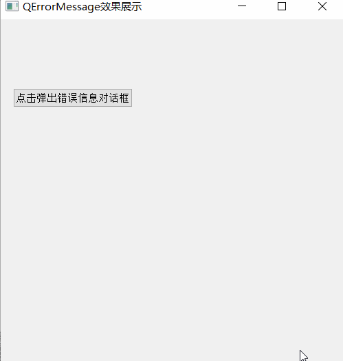

错误信息对话框 QErrorMessage 用于将程序运行时出现的错误内容显示出来。错误信息对话框的界面如图所示,由一个显示信息的文本框和一个勾选按钮构成

用QErrorMessage类创建错误信息对话框实例的方法如下:

```python
from PySide6.QtWidgets import QErrorMessage

QErrorMessage(parent: Union[PySide6.QtWidgets.QWidget, NoneType]=None) -> None 
```

错误信息对话框只有两个重载型槽函数 showMessage(message: str)和 showMessage(message: str,type: str),执行该方法后立即显示对话框

- message参数是错误信息
- type参数指定错误信息的类型。

如果用户在对话框中不勾选"Show this messageagain",则遇到相同的错误信息或相同类型的错误信息时,将不再弹出对话框。

