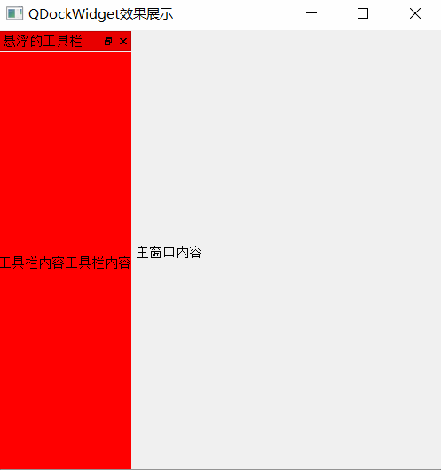
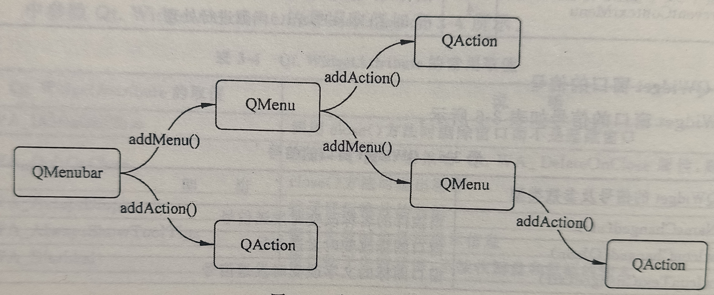
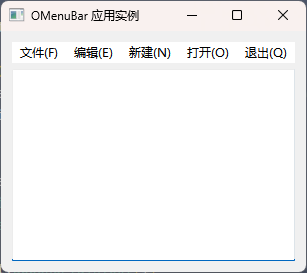
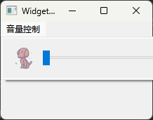
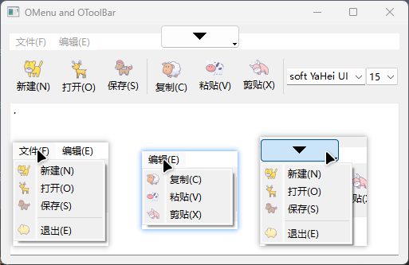

# 05.窗口/窗口控件、对话框以及相关功能类3


## QDialogButtonBox

上面介绍的几个对话框都是QDialog的子类，QDialogButtonBox有些特殊，和QDialog一样，也是 QWidget 的子类。

严格来说，QDialogButtonBox并不是一个对话框，只是一个管理按钮的容器，可以根据不同的系统环境匹配相应的布局。

```python
from PySide6.QtWidgets import QDialogButtonBox

QDialogButtonBox(buttons: PySide6.QtWidgets.QDialogButtonBox.StandardButton, orientation: PySide6.QtCore.Qt.Orientation, parent: Union[PySide6.QtWidgets.QWidget, NoneType] = None) -> None
QDialogButtonBox(buttons: PySide6.QtWidgets.QDialogButtonBox.StandardButton, parent: Union[PySide6.QtWidgets.QWidget, NoneType] = None) -> None
QDialogButtonBox(orientation: PySide6.QtCore.Qt.Orientation, parent: Union[PySide6.QtWidgets.QWidget, NoneType] = None) -> None
QDialogButtonBox(parent: Union[PySide6.QtWidgets.QWidget, NoneType] = None) -> None
```

#### 方法介绍

常见的使用场景是将QDialogButtonBox 嵌入 QDialog中，用它管理 QDialog 的按钮。

当然，也可以将QDialogButonBox 嵌入主窗口中管理主窗口按钮。

Qt会为不同的系统自动匹配相应的样式，QDialogButtonBox会根据系统自动改变 应布局，主要的系统布局如表所示。

| 系统布局                       | 值   | 描 述                                                        |
| ------------------------------ | ---- | ------------------------------------------------------------ |
| QDialogButtonBox.WinLayout     | O    | 适用于 Windows 中的应用程序的策略                            |
| QDialogButtonBox.MacLayout     | 1    | 适用于macOS中的应用程序的策略                                |
| QDialogButtonBox.KdeLayout     | 2    | 适用于 KDE 中的应用程序的策略                                |
| QDialogButtonBox.GnomeLayout   | 3    | 适用于GNOME中的应用程序的策略                                |
| QDialogButtonBox.AndroidLayout | 4    | 适用于Android中的应用程序的策略 这个枚举值是在Qt5.10中添加的 |

- 使用 QStyleFactory.keys0函数可以知道当前系统支持哪些样式

  - Windows 10 支持'windowsvista'、'Windows'和'Fusion'这3种样式：

    ```python
    from PySide6.QtWidgets import QStyleFactory
    
    print(QStyleFactory.keys())#['windowsvista', 'Windows', 'Fusion']
    ```

- 使用QApplication.setStyle()函数可以设置样式

  ```python
  import sys
  from PySide6.QtWidgets import QApplication, QDialogButtonBox
  
  if __name__ == '__main__':
      app = QApplication(sys.argv)
      app.setStyle('Fusion')
      demo = QDialogButtonBox()
      demo.show()
      sys.exit(app.exec())
  ```

  

- QDialogButtonBox 和QMessageBox 类似

  - 它们共用一套标准化按钮(如 Ok、Cancel,Yes 和 No等)
  - 一套按钮角色(如 AcceptRole、RejectRole 等)，
  - 及槽函数 accepted 和rejected 的实现方式。
  - 除此之外，QDialogButtonBox多了两个信号发射方式。
    - helpRequested()：当基于 HelpRole 的按钮单击时触发。
    - clicked(button:QAbstractButton)： 当单击任意按钮时触发，携带参数 QAbstractButton


#### QDialogButtonBox例子

```python
# -*- coding: UTF-8 -*-
# File date: Hi_2023/3/14 23:49
# File_name: 01-QDialogButtonBox例子.py


import sys
from PySide6.QtCore import *
from PySide6.QtGui import *
from PySide6.QtWidgets import *


class DialogButtonBox(QWidget):
    def __init__(self):
        super(DialogButtonBox, self).__init__()
        self.setWindowTitle("QDialogButtonBox 例子")
        self.resize(300, 100)
        layout = QVBoxLayout()
        self.setLayout(layout)
        self.label = QLabel('显示信息')
        layout.addWidget(self.label)

        buttonBox_dialog = self.create_buttonBox()
        button1 = QPushButton("1、嵌入对话框中")
        layout.addWidget(button1)
        button1.clicked.connect(lambda: self.show_dialog(buttonBox_dialog))

        layout.addWidget(QLabel('2、嵌入窗口中：'))
        layout.addWidget(self.create_buttonBox())

    def show_dialog(self, buttonBox):
        dialog = QDialog(self)
        dialog.setWindowTitle("Dialog + QDialogButtonBox demo")
        layout = QVBoxLayout()
        layout.addWidget(QLabel('QDialogButtonBox嵌入到对话框中实例'))
        layout.addWidget(buttonBox)
        dialog.setLayout(layout)
        dialog.move(self.geometry().x(), self.geometry().y() + 180)
        # 绑定相应信号与槽，用于退出对话框
        buttonBox.accepted.connect(dialog.accept)
        buttonBox.rejected.connect(dialog.reject)
        buttonBox.setOrientation(Qt.Vertical)  # 垂直排列
        dialog.exec()

    def create_buttonBox(self):
        buttonBox = QDialogButtonBox()
        buttonBox.setStandardButtons(QDialogButtonBox.Cancel | QDialogButtonBox.Ok | QDialogButtonBox.Reset | QDialogButtonBox.Help | QDialogButtonBox.Yes | QDialogButtonBox.No | QDialogButtonBox.Apply)
        # 自定义按钮
        buttonBox.addButton(QPushButton('MyOk-ApplyRole'), buttonBox.ButtonRole.ApplyRole)
        buttonBox.addButton(QPushButton('MyOk-AcceptRole'), buttonBox.ButtonRole.AcceptRole)
        buttonBox.addButton(QPushButton('MyNo-AcceptRole'), buttonBox.ButtonRole.RejectRole)
        # 绑定信号与槽
        buttonBox.accepted.connect(lambda: self.label.setText(self.label.text() + '\n触发了accepted'))
        buttonBox.rejected.connect(lambda: self.label.setText(self.label.text() + '\n触发了rejected'))
        buttonBox.helpRequested.connect(lambda: self.label.setText(self.label.text() + '\n触发了helpRequested'))
        buttonBox.clicked.connect(lambda button: self.label.setText('点击了按钮：' + button.text()))
        return buttonBox


if __name__ == '__main__':
    app = QApplication(sys.argv)
    app.setStyle('Fusion')
    demo = DialogButtonBox()
    demo.show()
    sys.exit(app.exec())

```


## 停靠控件QDockWidget



停靠控件QDockWidget主要应用在主窗口中,用鼠标可以将其拖拽到不同的停靠区域中。停靠控件通常作为容器来使用,需要在其内部添加一些常用控件。

停靠控件由标题栏和内容区构成,标题栏上显示窗口标题,还有浮动按钮和关闭按钮。

停靠控件QDockWidget继承自QWidget。用QDockWidget类创建停靠控件实例的方法如下所示,其中title是停靠控件的窗口标题,parent是停靠控件所在的窗口。

```python
from PySide6.QtWidgets import QDockWidget

QDockWidget(parent: Union[PySide6.QtWidgets.QWidget, NoneType]=None, flags: PySide6.QtCore.Qt.WindowType=Default(Qt.WindowFlags)) -> None
QDockWidget(title: str, parent: Union[PySide6.QtWidgets.QWidget, NoneType]=None, flags: PySide6.QtCore.Qt.WindowType=Default(Qt.WindowFlags)) -> None
```

### 停靠控件 QDockWidget的常用方法

停靠控件 QDockWidget主要方法介绍如下。

- setWidget(QWidget)方法设置停靠控件工作区中的控件,通常选择容器类控件和表格类控件作为工作区的控件,用widget()方法获取工作区中的控件。
- setTitleBarWidget(QWidget)方法设置标题栏中的控件,用titleBarWidget()方法获取标题栏中的控件。
- setAllowedAreas(Qt.DockWidgetArea)方法设置停靠控件可以停靠的区域,用allowedAreas()方法获取可以停靠的区域,用isAreaAllowed(Qt.DockWidgetArea)方法获取指定的区域是否允许停靠。
- setFeatures(QDock Widget.DockWidgetFeatures)方法设置停靠控件的特征,其中参数QDock Widget.Dock WidgetFeature 可以取以下值,用features()方法获取特征。
  - QDockWidget.DockWidgetClosable(可关闭)
  - QDock Widget.DockWidgetMovable(可移动)
  - QDockWidget.DockWidgetFloatable(可悬停)
  - QDockWidget.DockWidgetVerticalTitleBar(有竖向标题)
  - QDockWidget.AllDockWidgetFeatures(有以上所有特征)
  - QDockWidget.NoDockWidgetFeatures(没有以上特征)
- toggleViewAction()方法返回一个QAction动作对象,单击该动作对象可以切换停靠窗口的可见状态,即该动作是一个对停靠控件窗口进行显示或关闭的开关。如果将该动作加到菜单上,对应菜单栏的文字即为停靠窗口的title文字,这样就可以在菜单上单击对应菜单项进行停靠窗口的关闭和显示。

停靠控件 QDockWidget的常用方法如表所示:

| QDock Widget的方法及参数类型                | 返回值的类型      | 说 明                |
| ------------------------------------------- | ----------------- | -------------------- |
| setAllowedAreas(Qt.Dock WidgetArea)         | None              | 设置可停靠区域       |
| isAreaAllowed(Qt.Dock WidgetArea)           | bool              | 获取区域是否允许停靠 |
| allowedAreas()                              | Qt.DockWidgetArea | 获取可停靠的区域     |
| setFeatures(QDockWidget.DockWidgetFeatures) | None              | 设置特征             |
| setFloating(bool)                           | None              | 设置成浮动状态       |
| isFloating()                                | bool              | 获取是否处于浮动状态 |
| setTitleBarWidget(QWidget)                  | None              | 设置标题栏中的控件   |
| titleBarWidget()                            | QWidget           | 获取标题栏中的控件   |
| setWidget(QWidget)                          | None              | 添加控件             |
| widget()                                    | QWidget           | 获取控件             |
| toggleViewAction()                          | QAction           | 获取隐藏或显示的动作 |

### 停靠控件 QDockWidget的信号

| QDockWidget的信号及参数类型                    | 说明                             |
| ---------------------------------------------- | -------------------------------- |
| allowedAreasChanged(Qt.DockWidgetArea)         | 允许停靠的区域发生改变时发送信号 |
| dockLocationChanged(Qt.DockWidgetArea)         | 停靠的区域发生改变时发送信号     |
| featuresChanged(QDockWidget.DockWidgetFeature) | 特征改变时发送信号               |
| topLevelChanged(bool)                          | 悬浮和停靠状态转换时发送信号     |
| visibilityChanged(bool)                        | 可见性改变时发送信号             |

## 菜单栏QMenuBar、菜单QMenu、动作QAction

对于一个可视化程序界面,往往将各种操作命令集中到菜单栏或工具栏的按钮上,通过单击菜单或工具栏中的按钮来触发动作,每个菜单和按钮实现一定的功能。一般菜单栏由多个菜单构成,如图3-3所示,菜单下面又有动作、子菜单和分隔条,子菜单下面又有动作,还可以有子菜单,动作上有图标和快捷键。

### 菜单的构成

建立一个菜单分为3步,如图所示。

- 第1步需要建立放置菜单的容器,即菜单栏;
- 第2步,在菜单栏上添加菜单,或者在菜单上添加子菜单；
- 第3步,在菜单栏、菜单或子菜单下面添加动作,并为动作编写槽函数。菜单一般不执行命令,其作用类似于标签,只有动作才可以发送信号,执行关联的槽函数。



### 菜单栏QMenuBar

菜单栏QMenuBar 用于放置菜单和动作,它继承自QWidget。用QMenuBar创建菜单栏实例的方法如下,其中parent 是放置菜单栏的父窗口。

```python
from PySide6.QtWidgets import QMenuBar

QMenuBar(parent: Union[PySide6.QtWidgets.QWidget, NoneType]=None) -> None
```

#### 菜单栏QMenuBar的方法与信号

菜单栏QMenuBar 的常用方法如表所示。

菜单栏上可以添加菜单、动作和分隔条,用addMenu(QMenu)方法和 addAction(QAction)方法可以添加已经提前定义好的菜单和动作；

用addMenu(str)方法和addMenu(QIcon,str)方法可以创建并添加菜单,并返回新建立的菜单；

用addAction(str)方法可以用字符串创建并添加动作,并返回动作；

用setCornerWidget(QWidget, Qt.Corner=Qt.TopRightCorner)方法可以在菜单栏的角落位置添加控件,位置可取 Qt.TopLeftCorner,Qt.TopRightCorner,Qt.BottomLeftCorner或 Qt.BottomRightCorner。

| QMenuBar的方法及参数类型                            | 返回值的类型 | 说明                              |
| --------------------------------------------------- | ------------ | --------------------------------- |
| addMenu(QMenu)                                      | QAction      | 添加已经存在的菜单                |
| addMenu(title: str)                                 | QMenu        | 用字符串添加菜单,并返回菜单       |
| addMenu(QIcon,title: str)                           | QMenu        | 用字符串和图标添加菜单,并返回菜单 |
| addAction(QAction)                                  | None         | 添加已经存在的动作                |
| addAction(text:str)                                 | QAction      | 用字符串添加动作,并返回添加的动作 |
| insertMenu(before:QAction,QMenu)                    | QAction      | 在动作之前插入菜单                |
| addSeparator()                                      | QAction      | 添加分隔条                        |
| insertSeparator(before:QAction)                     | QAction      | 在动作之前插入分隔条              |
| clear()                                             | None         | 清空所有的菜单和动作              |
| setConerWidget(QWidget, Qt.Comer=Qt.TopRightCorner) | None         | 在菜单栏的角落位置添加控件        |
| cornerWidget(Qt.Coner=Qt.TopRightCorner)            | QWidget      | 获取角落位置的控件                |
| Cslot]setVisible(visible: bool)                     | None         | 设置菜单栏是否可见                |
| setActiveAction(QAction)                            | None         | 设置高亮显示的动作                |
| actionAt(QPoint)                                    | QAction      | 获取指定位置处的动作              |
| actionGeometry(QAction)                             | QRect        | 获取动作所处的区域                |

菜单栏QMenuBar有两个信号,当单击莱单栏上的菜单或动作时,会发送riggered(QAction)信号；当光标滑过动作时,会发送 hovered(QAction)信号。

#### 菜单栏QMenuBar 的应用实例

下面的程序创建一个菜单栏和一个多行纯文本控件,采用竖直布局。在菜单栏中添加两个菜单和两个动作,一个动作可以打开文件,另一个动作退出程序。单击动作,通过菜单栏的信号triggered(QAction)识别单击的是哪个动作,从而采取不同的对应方法。



```python
# -*- coding: UTF-8 -*-
# File date: Hi_2023/3/19 1:38
# File_name: 01-菜单栏QMenuBar 的应用实例.py


import sys
from PySide6.QtWidgets import(QApplication, QMenuBar, QPlainTextEdit, QVBoxLayout, QWidget, QFileDialog, QMessageBox)


class MyWindow(QWidget):
    def __init__(self, parent=None):
        super().__init__(parent)
        self.setWindowTitle("OMenuBar 应用实例")
        self.setupUi()

    def setupUi(self):
        self.menuBar = QMenuBar()  # 创建菜单栏
        self.plainText = QPlainTextEdit()  # 创建文本编辑器
        vlayout = QVBoxLayout(self)  # 创建竖直布局
        vlayout.addWidget(self.menuBar)
        vlayout.addWidget(self.plainText)
        vlayout.addWidget(self.menuBar)
        vlayout.addWidget(self.plainText)

        self.fileMenu = self.menuBar.addMenu("文件(&F)")  # 菜单栏中添加菜单
        self.editMenu = self.menuBar.addMenu("编辑(&E)")  # 菜单栏中添加菜单
        self.menuBar.addSeparator()  # 菜单栏中添加分隔条
        self.actNew = self.menuBar.addAction('新建(&N)')  # 菜单栏中添加动作
        self.actOpen = self.menuBar.addAction("打开(&O)")  # 菜单栏中添加动作
        self.actQuit = self.menuBar.addAction("退出(&Q)")  # 菜单栏中添加动作
        self.menuBar.triggered.connect(self.action_triggered)  # 菜单栏信号与槽函数的连接

    def action_triggered(self, action):  # 菜单栏的槽函数
        if action == self.actNew:  # 新建动作
            self.plainText.clear()
        elif action == self.actOpen:  # 打开动作
            filename, filter = QFileDialog.getOpenFileName(self, "打开", ".", "文本文件(*.txt)")

            try:
                fp = open(filename, encoding="UTF-8")
                string = fp.readlines()
                self.plainText.clear()
                for i in string:
                    self.plainText.appendPlainText(i)
                fp.close()

            except:
                QMessageBox.critical(self, "打开文件失败", "请选择适合的文件!")

        elif action == self.actQuit:  # 退出动作
            self.close()


if __name__ == '__main__':
    app = QApplication(sys.argv)
    windows = MyWindow()
    windows.show()
    sys.exit(app.exec())

```

### 菜单QMenu

菜单QMenu用于放置动作和子菜单,通常将动作分类放到不同的菜单中。菜单QMenu 继承自QWidget。用QMenu类创建菜单实例的方法如下所示:

```python
from PySide6.QtWidgets import QMenu

QMenu(parent: Union[PySide6.QtWidgets.QWidget, NoneType]=None) -> None
QMenu(title: str, parent: Union[PySide6.QtWidgets.QWidget, NoneType]=None) -> None
```

#### 菜单QMenu的常用方法

菜单QMenu的常用方法如表3-8所示。菜单的主要方法是在菜单列表中添加动作、子菜单和分隔条、主要方法介绍如下。

- 用addAction(QAction)方法可以添加一个已经定义好的动作；用addAction(text;str)或addAction(icon:QIcon,text:str)方法可以添加一个新创建的动作,并返回动作,其中text是动作在菜单中的名称,icon是图标。
- 用addMenu(QMenu)方法可以将已定义好的菜单作为子菜单加入到菜单中；用addMenu(title:str)方法或addMenu(icon:QIcon,title:str)方法可以添加新的子菜单,并返回子菜单
- 用addSection(text: str)、addSection(icon: QIcon,text: str)或addSeparator()方法可以添加分隔条,并返回对应的动作。分隔条的显示样式与操作系统有关,例如忽略动作的名称、图标或子菜单,或者显示成横线或名称。利用分隔条返回的动作,用动作的setSeparator(bool)方法可以将分隔条切换成动作,或者将动作切换成分隔条。
- 用setTearOffEnabled(bool)方法可以将菜单定义成可撕扯菜单,可撕扯菜单在其动作列表中显示一条虚线,单击该虚线可以把菜单及动作列表弹出；用showTearOffMenu()方法或 showTearOf[Menu(QPoint)方法可以将可撕扯菜单在指定位置显示。
- 用popup(pos: QPoint, at: QAction=None)方法或 exec(pos; QPoint, at: QAction=None)方法可以在指定位置(全局坐标系)弹出菜单,如果指定了 at参数,则指定的动作显示在指定位置。

| QMenu的方法及参数类型                                        | 返回值的类型  | 说 明                                                        |
| ------------------------------------------------------------ | ------------- | ------------------------------------------------------------ |
| addAction(QAction)                                           | None          | 在菜单中添加已存在的动作                                     |
| addAction(text: str)                                         | QAction       | 在菜单中添加新动作                                           |
| addAction(icon: QIcon,text, str)                             | QAction       | 在菜单中添加新动作                                           |
| addMenu(QMenu)                                               | QAction       | 在菜单中添加子菜单                                           |
| addMenu(title: str)                                          | QMenu         | 在菜单中添加新子菜单                                         |
| addMenu(icon: Qlcon,title: str)                              | QMenu         | 在菜单中添加新子菜单                                         |
| addSection(text: str)                                        | QAction       | 添加分隔条                                                   |
| addSection(icon: Qlcon,text, s1r)                            | QAction       | 添加分隔条                                                   |
| addSeparator()                                               | QAction       | 添加分隔条                                                   |
| insertMenu(before: QAction, menu: QMenu)                     | QAction       | 在动作前插入子菜单                                           |
| insertSection(before: QAction, text: str)                    | QAction       | 在动作前插人分隔条                                           |
| insertSection(before: QAction, Qlcon, text:str)              | QAction       | 在动作前插人分隔条                                           |
| insertSection(before:QAction)                                | QAction       | 在动作前插人分隔条                                           |
| insertSeparator(before: QAction)                             | QAction       | 在动作前插人分隔条                                           |
| removeAction(action:QAction)                                 | None          | 从菜单中移除动作                                             |
| clear()                                                      | None          | 清空菜单                                                     |
| actions()                                                    | List[QAction] | 获取菜单中的动作                                             |
| isEmpty()                                                    | int           | 获取菜单是否为空                                             |
| actionAt(QPoint)                                             | QAction       | 获取指定位置处的动作                                         |
| columnCount()                                                | int           | 获取列的数量                                                 |
| menuAction()                                                 | QAction       | 获取菜单对应的动作                                           |
| setSeparatorsCollapsible(bool)                               | None          | 合并相邻的分隔条,开始和结尾的分隔条 不可见                   |
| setTearOffEnabled(bool)                                      | None          | 设置成可撕扯菜单                                             |
| showTearOffMenu()                                            | None          | 以可撕扯菜单形式弹出菜单                                     |
| showTearOffMenu(pos:QPoint)                                  | None          | 以可撕扯菜单形式在指定位置弹出菜单                           |
| hideTearOffMenu()                                            | None          | 隐藏可撕扯菜单                                               |
| isTearOffEnabled()                                           | bool          | 获取是否是可撕扯菜单                                         |
| isTearOffMenuVisible()                                       | None          | 获取可撕扯菜单是否可见                                       |
| setTitle(title: str)                                         | None          | 设置菜单的标题                                               |
| title()                                                      | str           | 获取菜单的标题                                               |
| setActiveAction(act: QAction)                                | None          | 设置活跃的动作高亮显示                                       |
| activeAction()                                               | QAction       | 获取活跃的动作                                               |
| setDefaultAction(QAction)                                    | None          | 设置默认动作,以粗体字显示                                    |
| defaultAction()                                              | QAction       | 获取默认的动作                                               |
| setIcon(icon:Union[QIcon,QPixmap])                           | None          | 设置菜单的图标                                               |
| setToolTipsVisible(visible: bool)                            | None          | 设置提示信息是否可见                                         |
| POPup(pos: QPoint, at: QAction=None)                         | None          | 在指定位置显示菜单,并可使菜单中的动 作显示在指定位置         |
| [static]exec()                                               | QAction       | 显示菜单,返回被触发的动作,如果没有则 返回 None               |
| [static]exec(pos;QPoint,at: QAction=None)                    | QAction       | 在指定位置显示菜单                                           |
| [static]exec(Sequence[QAction], pos: QPoint, at: QAction=None, parent: QWidget=None) | QAction       | 在指定位置显示菜单,当用pos无法确定 位置时,用父控件 parent辅助确定位置 |

#### 菜单QMenu的信号

菜单QMenu的信号如表所示,最常用的是triggered(QAction)信号,其发送的是被激发的动作。

| QMenu的信号及参数类型 | 说 明                  |
| --------------------- | ---------------------- |
| aboutToShow()         | 菜单将要显示时发送信号 |
| aboutToHide()         | 菜单将要隐藏时发送信号 |
| hovered(QAction)      | 鼠标滑过菜单时发送信号 |
| triggered(QAction)    | 动作被激发时发送信号   |

#### Qmenu 例子

```python
import sys
from PySide6.QtCore import *
from PySide6.QtGui import *
from PySide6.QtWidgets import *
import os

os.chdir(os.path.dirname(__file__))


class MenuDemo(QMainWindow):
    def __init__(self, parent=None):
        super(MenuDemo, self).__init__(parent)

        widget = QWidget(self)
        self.setCentralWidget(widget)

        topFiller = QWidget()
        topFiller.setSizePolicy(QSizePolicy.Expanding, QSizePolicy.Expanding)

        self.infoLabel = QLabel("<i>Choose a menu option, or right-click to invoke a context menu</i>")
        self.infoLabel.setFrameStyle(QFrame.StyledPanel | QFrame.Sunken)
        self.infoLabel.setAlignment(Qt.AlignCenter)

        bottomFiller = QWidget()
        bottomFiller.setSizePolicy(QSizePolicy.Expanding, QSizePolicy.Expanding)

        layout = QVBoxLayout()
        layout.setContentsMargins(5, 5, 5, 5)
        layout.addWidget(topFiller)
        layout.addWidget(self.infoLabel)
        layout.addWidget(bottomFiller)
        widget.setLayout(layout)

        self.createActions()
        self.createMenus()

        message = "A context menu is available by right-clicking"
        self.statusBar().showMessage(message)

        self.setWindowTitle("Menus")
        self.setMinimumSize(160, 160)
        self.resize(480, 320)

    def contextMenuEvent(self, event):
        menu = QMenu(self)
        menu.addAction(self.cutAct)
        menu.addAction(self.copyAct)
        menu.addAction(self.pasteAct)
        menu.exec(event.globalPos())

    def newFile(self):
        self.infoLabel.setText("Invoked <b>File|New</b>")

    def open(self):
        self.infoLabel.setText("Invoked <b>File|Open</b>")

    def save(self):
        self.infoLabel.setText("Invoked <b>File|Save</b>")

    def print(self):
        self.infoLabel.setText("Invoked <b>File|Print</b>")

    def undo(self):
        self.infoLabel.setText("Invoked <b>Edit|Undo</b>")

    def redo(self):
        self.infoLabel.setText("Invoked <b>Edit|Redo</b>")

    def cut(self):
        self.infoLabel.setText("Invoked <b>Edit|Cut</b>")

    def copy(self):
        self.infoLabel.setText("Invoked <b>Edit|Copy</b>")

    def paste(self):
        self.infoLabel.setText("Invoked <b>Edit|Paste</b>")

    def bold(self):
        self.infoLabel.setText("Invoked <b>Edit|Format|Bold</b>")

    def italic(self):
        self.infoLabel.setText("Invoked <b>Edit|Format|Italic</b>")

    def leftAlign(self):
        self.infoLabel.setText("Invoked <b>Edit|Format|Left Align</b>")

    def rightAlign(self):
        self.infoLabel.setText("Invoked <b>Edit|Format|Right Align</b>")

    def justify(self):
        self.infoLabel.setText("Invoked <b>Edit|Format|Justify</b>")

    def center(self):
        self.infoLabel.setText("Invoked <b>Edit|Format|Center</b>")

    def setLineSpacing(self):
        self.infoLabel.setText("Invoked <b>Edit|Format|Set Line Spacing</b>")

    def setParagraphSpacing(self):
        self.infoLabel.setText("Invoked <b>Edit|Format|Set Paragraph Spacing</b>")

    def about(self):
        self.infoLabel.setText("Invoked <b>Help|About</b>")
        QMessageBox.about(self, "About Menu",
                          "The <b>Menu</b> example shows how to create menu-bar menus and context menus.")

    def aboutQt(self):
        self.infoLabel.setText("Invoked <b>Help|About Qt</b>")

    def createActions(self):
        self.newAct = QAction(QIcon("./images/new.png"), "&New")
        self.newAct.setShortcuts(QKeySequence.New)
        self.newAct.setStatusTip("Create a new file")
        self.newAct.triggered.connect(self.newFile)

        self.openAct = QAction(QIcon("./images/open.png"), "&Open...")
        self.openAct.setShortcuts(QKeySequence.Open)
        self.openAct.setStatusTip("Open an existing file")
        self.openAct.triggered.connect(self.open)

        self.saveAct = QAction(QIcon("./images/save.png"), "&Save")
        self.saveAct.setShortcuts(QKeySequence.Save)
        self.saveAct.setStatusTip("Save the document to disk")
        self.saveAct.triggered.connect(self.save)

        self.printAct = QAction("&Print...")
        self.printAct.setShortcuts(QKeySequence.Print)
        self.printAct.setStatusTip("Print the document")
        self.printAct.triggered.connect(self.print)

        self.exitAct = QAction("E&xit")
        self.exitAct.setShortcuts(QKeySequence.Quit)
        self.exitAct.setStatusTip("Exit the application")
        self.exitAct.triggered.connect(self.close)

        self.undoAct = QAction("&Undo")
        self.undoAct.setShortcuts(QKeySequence.Undo)
        self.undoAct.setStatusTip("Undo the last operation")
        self.undoAct.triggered.connect(self.undo)

        self.redoAct = QAction("&Redo")
        self.redoAct.setShortcuts(QKeySequence.Redo)
        self.redoAct.setStatusTip("Redo the last operation")
        self.redoAct.triggered.connect(self.redo)

        self.cutAct = QAction("Cu&t")
        self.cutAct.setShortcuts(QKeySequence.Cut)
        self.cutAct.setStatusTip("Cut the current selection's contents to the clipboard")
        self.cutAct.triggered.connect(self.cut)

        self.copyAct = QAction("&Copy")
        self.copyAct.setShortcuts(QKeySequence.Copy)
        self.copyAct.setStatusTip("Copy the current selection's contents to the clipboard")
        self.copyAct.triggered.connect(self.copy)

        self.pasteAct = QAction("&Paste")
        self.pasteAct.setShortcuts(QKeySequence.Paste)
        self.pasteAct.setStatusTip("Paste the clipboard's contents into the current selection")
        self.pasteAct.triggered.connect(self.paste)

        self.boldAct = QAction("&Bold")
        self.boldAct.setCheckable(True)
        self.boldAct.setShortcut(QKeySequence.Bold)
        self.boldAct.setStatusTip("Make the text bold")
        self.boldAct.triggered.connect(self.bold)

        boldFont = self.boldAct.font()
        boldFont.setBold(True)
        self.boldAct.setFont(boldFont)

        self.italicAct = QAction("&Italic")
        self.italicAct.setCheckable(True)
        self.italicAct.setShortcut(QKeySequence.Italic)
        self.italicAct.setStatusTip("Make the text italic")
        self.italicAct.triggered.connect(self.italic)

        italicFont = self.italicAct.font()
        italicFont.setItalic(True)
        self.italicAct.setFont(italicFont)

        self.setLineSpacingAct = QAction("Set &Line Spacing...")
        self.setLineSpacingAct.setStatusTip("Change the gap between the lines of a paragraph")
        self.setLineSpacingAct.triggered.connect(self.setLineSpacing)

        self.setParagraphSpacingAct = QAction("Set &Paragraph Spacing...")
        self.setParagraphSpacingAct.setStatusTip("Change the gap between paragraphs")
        self.setParagraphSpacingAct.triggered.connect(self.setParagraphSpacing)

        self.aboutAct = QAction("&About")
        self.aboutAct.setStatusTip("Show the application's About box")
        self.aboutAct.triggered.connect(self.about)

        self.aboutQtAct = QAction("About &Qt")
        self.aboutQtAct.setStatusTip("Show the Qt library's About box")
        self.aboutQtAct.triggered.connect(QApplication.aboutQt)
        self.aboutQtAct.triggered.connect(self.aboutQt)

        self.leftAlignAct = QAction("&Left Align")
        self.leftAlignAct.setCheckable(True)
        self.leftAlignAct.setShortcut("Ctrl+L")
        self.leftAlignAct.setStatusTip("Left align the selected text")
        self.leftAlignAct.triggered.connect(self.leftAlign)

        self.rightAlignAct = QAction("&Right Align")
        self.rightAlignAct.setCheckable(True)
        self.rightAlignAct.setShortcut("Ctrl+R")
        self.rightAlignAct.setStatusTip("Right align the selected text")
        self.rightAlignAct.triggered.connect(self.rightAlign)

        self.justifyAct = QAction("&Justify")
        self.justifyAct.setCheckable(True)
        self.justifyAct.setShortcut("Ctrl+J")
        self.justifyAct.setStatusTip("Justify the selected text")
        self.justifyAct.triggered.connect(self.justify)

        self.centerAct = QAction("&Center")
        self.centerAct.setCheckable(True)
        self.centerAct.setShortcut("Ctrl+E")
        self.centerAct.setStatusTip("Center the selected text")
        self.centerAct.triggered.connect(self.center)

        alignmentGroup = QActionGroup(self)
        alignmentGroup.addAction(self.leftAlignAct)
        alignmentGroup.addAction(self.rightAlignAct)
        alignmentGroup.addAction(self.justifyAct)
        alignmentGroup.addAction(self.centerAct)
        self.leftAlignAct.setChecked(True)

    def createMenus(self):
        fileMenu = self.menuBar().addMenu("&File")
        fileMenu.addAction(self.newAct)

        fileMenu.addAction(self.openAct)

        fileMenu.addAction(self.saveAct)
        fileMenu.addAction(self.printAct)

        fileMenu.addSeparator()

        fileMenu.addAction(self.exitAct)

        editMenu = self.menuBar().addMenu("&Edit")
        editMenu.addAction(self.undoAct)
        editMenu.addAction(self.redoAct)
        editMenu.addSeparator()
        editMenu.addAction(self.cutAct)
        editMenu.addAction(self.copyAct)
        editMenu.addAction(self.pasteAct)
        editMenu.addSeparator()

        helpMenu = self.menuBar().addMenu("&Help")
        helpMenu.addAction(self.aboutAct)
        helpMenu.addAction(self.aboutQtAct)

        formatMenu = editMenu.addMenu("&Format")
        formatMenu.addAction(self.boldAct)
        formatMenu.addAction(self.italicAct)
        formatMenu.addSeparator().setText("Alignment")
        formatMenu.addAction(self.leftAlignAct)
        formatMenu.addAction(self.rightAlignAct)
        formatMenu.addAction(self.justifyAct)
        formatMenu.addAction(self.centerAct)
        formatMenu.addSeparator()
        formatMenu.addAction(self.setLineSpacingAct)
        formatMenu.addAction(self.setParagraphSpacingAct)


if __name__ == '__main__':
    app = QApplication(sys.argv)
    demo = MenuDemo()
    demo.show()
    sys.exit(app.exec())
```


### 动作QAction

动作QAction是定义菜单和工具栏的基础,单击菜单或工具栏上的动作可以触发动作的triggered()信号,执行动作关联的槽函数,完成需要完成的工作。动作在菜单中以项(item)的形式显示,在工具栏中以按钮的形式显示。

动作 QAction 继承自QObject,位于 QtGui 模块中。用QAction创建动作对象的方法如下所示,其中 parent通常是窗口、工具栏、菜单栏或菜单；text是显示的文字,如果将动作放到菜单或工具栏上,text将成为菜单或工具栏中按钮的文字；icon 是图标,将成为菜单或工具栏中按钮的图标。

```python
from PySide6.QtGui import QAction

QAction(icon: Union[PySide6.QtGui.QIcon, PySide6.QtGui.QPixmap], text: str, parent: Union[PySide6.QtCore.QObject, NoneType]=None) -> None
QAction(parent: Union[PySide6.QtCore.QObject, NoneType]=None) -> None
QAction(text: str, parent: Union[PySide6.QtCore.QObject, NoneType]=None) -> None
```

#### 动作QAction的常用方法

动作 QAction 的常用方法如表所示,主要方法介绍如下。

- 用setMenu(QMenu)方法把动作添加到菜单中,用菜单的addAction(QAction)方法也可以把动作添加到菜单中,作为菜单下拉列表中的一项。
- 用setCheckable(bool)方法设置动作是否可以勾选,用setChecked(bool)方法设置是否处于勾选状态。
- 对于互斥的一些动作,如同QRadioButton一样,需要将其放到一个组中,可以先用Broup=QActionGroup(self)创建一个对象,然后用group.addAction(QAction)方
- 法把动作放到一个组中,并将 setExclusive(bool)设置成 True,这样就可以保证组内的动作是互斥的。
- 用setShortcut(str)方法可以给动作设置快捷键,例如setShortcut("Ctrl+A")；用setShortcut(QKeySequence)方法或 setShortcut(QKeySequence.StandardKey)方法也可设置快捷键,其中 QKeySequence定义按键顺序类,QKeySequence,StandardKey 是一些标准的快捷键。
- 用setIconVisiblelnMenu(bool)方法设置菜单中是否显示动作的图标,而在工具档中不受影响；用setShortcutVisibleInContextMenu(bool)方法设置在右键快捷菜单中是否显示动作的快捷键(如果动作出现在快捷菜单中)。
- 用setPriority(QAction.Priority)方法设置动作在界面上的优先级,参数是QAction.Priority 的枚举值,可取 QAction.LowPriority、QAction.NormalPriority或QAction.HighPriority,例如工具栏设置了 Qt.ToolButtonTextBesideIcon 模式,具有QAction.LowPriority 的动作将不显示文本。

| QAction的方法及参数类型               | 返回值类型 | 说 明                                            |
| ------------------------------------- | ---------- | ------------------------------------------------ |
| setText(str)                          | None       | 设置名称                                         |
| text()                                | str        | 获取名称                                         |
| setIcon(QIcon)                        | None       | 设置图标                                         |
| icon()                                | QIcon      | 获取图标                                         |
| setCheckable(bool)                    | None       | 设置是否可以勾选                                 |
| isCheckable()                         | bool       | 获取是否可以勾选                                 |
| [slot]setChecked(bool)                | None       | 设置是否处于勾选状态                             |
| isChecked()                           | bool       | 获取是否处于勾选状态                             |
| setIconVisibleInMenu(bool)            | None       | 设置在菜单中图标是否可见                         |
| isIconVisibleInMenu()                 | bool       | 获取在菜单中图标是否可见                         |
| setShortcutVisibleInContextMenu(bool) | None       | 设置动作的快捷键在右键快捷菜单中是否 显示        |
| setFont(QFont)                        | None       | 设置字体                                         |
| font()                                | QFont      | 获取字体                                         |
| setMenu(QMenu)                        | None       | 将动作添加到菜单中                               |
| menu()                                | QMenu      | 获取动作所在的菜单                               |
| setShortcut(str)                      | None       | 设置快捷键                                       |
| setShortcut(QKeySequence)             | None       | 设置快捷键                                       |
| setShortcut(QKeySequence.StandardKey) | None       | 设置快捷键                                       |
| [slot]setDisabled(bool)               | None       | 设置是否失效                                     |
| [slot]setEnabled(bool)                | None       | 设置是否激活                                     |
| isEnabled()                           | Bool       | 获取是否处于激活状态                             |
| [slot]resetEnabled()                  | None       | 恢复激活状态                                     |
| setActionGroup(QActionGroup)          | None       | 设置动作所在的组                                 |
| [slot]setVisible(bool)                | None       | 设置是否可见                                     |
| isVisible()                           | bool       | 获取是否可见                                     |
| setSeparator(bool)                    | None       | 将动作当作分割线来使用                           |
| setAutoRepeat(bool)                   | None       | 设置长按快捷键时是否可以重复执行动 作,默认是True |
| autoRepeat()                          | bool       | 获取是否可以重复执行动作                         |
| setData(var:Any)                      | None       | 给动作设置任意类型的数据                         |
| data()                                | Any        | 获取动作的数据                                   |
| setPriority(QAction.Priority)         | None       | 设置动作的优先级                                 |
| setToolTip(str)                       | None       | 设置提示信息                                     |
| setStatusTip(str)                     | None       | 设置状态提示信息                                 |
| setWhatsThis(str)                     | None       | 设置按Shift+F1键时的提示信息                     |
| [slot]trigger()                       | None       | 发送 triggered()或 triggered(bool)信号           |
| [slot]hover()                         | None       | 发送hovered()信号                                |
| [slot]toggle()                        | None       | 发送 toggled(bool)信号                           |

#### 动作QAction的信号

如表所示,主要信号是toggled()和toggled(bool)信号

| QMenu的信号及参数类型  | 说 明                                                        |
| ---------------------- | ------------------------------------------------------------ |
| hovered()              | 光标滑过动作时发送信号                                       |
| triggered()            | 单击动作或按快捷键时发送信号                                 |
| triggered(bool)        | 单击动作或按快捷键时发送信号                                 |
| toggled(bool)          | 动作的切换状态发生改变时发送信号                             |
| changed()              | 当动作的属性(如文本、图标、可见性、优先级、快捷键、提示信息等)发生改 变时发送信号 |
| checkableChanged(bool) | 动作勾选状态发生改变时发送信号                               |
| enabledChanged(bool)   | 动作使能状态发生改变时发送信号                               |
| visibleChanged()       | 动作的可见性发生改变时发送信号                               |

#### 自定义动作QWidgetAction的实例

创建动作的方式是用QAction类来创建,这样创建的动作用户无法定制自己需要的功能或外观。若要自己定义动作,可继承QWidgetAction创建自定义动作类,QWidgetAction 继承自 QAction。

在自定义类中重写 createWidget(parent; QWidget)函数,其中 parent 是自定义动作所在的容器,如菜单或工具栏。在将自定义动作添加到菜单或工具栏中时,会自动调用createWidget(parent:QWidget)函数;当从菜单或工具栏中移除自定义的动作时,会调用deleteWidget(widget:QWidget)函数,重写该函数可以删除控件。

下面的代码是自定义动作的应用实例,该程序创建了继承自 QWidgetAction 的MyAction,在 MyAction类中重写了 createWidget()函数,在 createWidget()函数中创建了一个QPushButton 控件和一个 QSlider 控件,单击 QPushButton 控件,可以切换喇叭图像的显示。程序运行结果如图所示。



```python
# -*- coding: UTF-8 -*-
# File date: Hi_2023/2/28 21:38
# File_name: 03-自定义动作QWidgetAction的实例.py
import sys
from PySide6.QtWidgets import(QApplication, QMenuBar, QWidgetAction, QPushButton, QSlider, QHBoxLayout, QWidget)
from PySide6.QtGui import QPixmap
from PySide6.QtCore import Qt.QSize


class MyAction(QWidgetAction):  # 创建继承自 oidgetAction 的类
    def createWidget(self, parent):  # 重写createWidget函数
        self.widget = QWidget(parent)
        self.setDefaultWidget(self.widget)
        self.button = QPushButton()
        self.button.setFlat(True)
        self.button.setIcon(QPixmap("../../Resources/animal/m2.png"))
        self.button.setIconSize(QSize(30, 30))
        self.slide = QSlider(Qt.Orientation.Horizontal)
        self.slide.setFixedWidth(200)

        H = QHBoxLayout(self.widget)
        H.addWidget(self.button)
        H.addWidget(self.slide)

        self.mute = False

        self.button.clicked.connect(self.mute_requested)  # 信号与槽函数的连接

    def mute_requested(self):  # 槽函数
        self.mute = not self.mute
        if self.mute:
            self.button.setIcon(QPixmap("../../Resources/animal/m3.png"))
            self.slide.setEnabled(False)
        else:
            self.button.setIcon(QPixmap("../../Resources/animal/m4.png"))
            self.slide.setEnabled(True)


class Mywindow(QWidget):
    def __init__(self, parent=None):
        super().__init__(parent)
        self.setWindowTitle("WidgetAction 应用实例")
        self.setupUi()

    def setupUi(self):
        menuBar = QMenuBar(self)
        self.menuVolume = menuBar.addMenu("音量控制")
        self.actVolume = MyAction(self.menuVolume)  # 自定义动作的实例
        self.menuVolume.addAction(self.actVolume)  # 将自定义动作加人到菜单中


if __name__ == '__main__':
    app = QApplication(sys.argv)
    win = Mywindow()

    win.show()
    sys.exit(app.exec())

```

### 右键菜单(上下文菜单)

右键菜单有两种实现方式。

- 重写父类(QWidget)的默认右键调用对象方法 `contextMenuEvent(event: PySide6.QtGui.QContextMenuEvent)`

- 通过设置上下文菜单策略 `setContextMenuPolicy(policy: PySide6.QtCore.Qt.ContextMenuPolicy)`后自定义上下文菜单

  `policy`设置策略可设置:

     - Qt.ContextMenuPolicy.DefaultContextMenu # 默认上下文菜单,默认策略,右键调用对象方法contextMenuEvent()即第一种方法
     - Qt.ContextMenuPolicy.CustomContextMenu # 自定义上下文菜单,点击发送信号customContextMenuRequested(QPoint)在信号连接方法实现相关功能
     - Qt.ContextMenuPolicy.NoContextMenu # 无上下文菜单
     - Qt.ContextMenuPolicy.PreventContextMenu # 阻止上下文菜单
     - Qt.ContextMenuPolicy.ActionsContextMenu # 操作上下文菜单

#### 重写contextMenuEvent法

```python
# -*- coding: UTF-8 -*-
# File date: Hi_2023/2/28 21:45
# File_name: 01- 重写contextMenuEvent法.py
import sys
import PySide6
from PySide6.QtCore import Qt
from PySide6.QtGui import QAction, QIcon
from PySide6.QtWidgets import *


class win_demo(QWidget):
    def __init__(self):
        app = QApplication(sys.argv)  # 初始化界面
        super().__init__()

        self.resize(500, 500)
        self.setWindowFlags(Qt.WindowStaysOnTopHint)  # 置顶

        self.show()  # 显示窗口以及其子控件
        sys.exit(app.exec())  # 主循环和退出

    @staticmethod
    def get_menu(parent):
        menu = QMenu(parent)
        new_action = menu.addAction(QIcon(r"../../Resources/animal/m1.png"), "菜单动作")
        new_action.triggered.connect(lambda: print("点击菜单动作"))

        menu.addSection("")

        submenu = QMenu("更多", menu)
        sub_action = submenu.addAction(QIcon(r"../../Resources/animal/m1.png"), "子菜单动作")
        sub_action.triggered.connect(lambda: print("点击子菜单动作"))
        menu.addMenu(submenu)

        return menu

    def contextMenuEvent(self, event: PySide6.QtGui.QContextMenuEvent):
        """重写contextMenuEvent设置右键菜单"""
        print("展示默认菜单")
        default_menu = self.get_menu(self)

        default_menu.exec(event.globalPos())


if __name__ == '__main__':
    win_demo()

```

#### 自定义上下文策略方法

```python
# -*- coding: UTF-8 -*-
# File date: Hi_2023/2/28 21:47
# File_name: 02-自定义上下文策略方法.py
import sys
import PySide6
from PySide6.QtCore import Qt.QPoint
from PySide6.QtGui import QAction, QIcon
from PySide6.QtWidgets import *


class win_demo(QWidget):
    def __init__(self):
        app = QApplication(sys.argv)  # 初始化界面
        super().__init__()

        self.resize(500, 500)
        self.setWindowFlags(Qt.WindowStaysOnTopHint)  # 置顶

        self.custom_menu()

        self.show()  # 显示窗口以及其子控件
        sys.exit(app.exec())  # 主循环和退出

    @staticmethod
    def get_menu(parent):
        menu = QMenu(parent)
        new_action = menu.addAction(QIcon(r"../../Resources/animal/m1.png"), "菜单动作")
        new_action.triggered.connect(lambda: print("点击菜单动作"))

        menu.addSection("")

        submenu = QMenu("更多", menu)
        sub_action = submenu.addAction(QIcon(r"../../Resources/animal/m1.png"), "子菜单动作")
        sub_action.triggered.connect(lambda: print("点击子菜单动作"))
        menu.addMenu(submenu)

        return menu

    def show_menu(self, point: QPoint):
        """point默认是,相对位置即相对窗口的位置"""
        print("展示自定义菜单策略")
        default_menu = self.get_menu(self)
        point = self.mapToGlobal(point)  # 把局部位置映射到全局
        default_menu.exec(point)  # 按钮展示位置

    def custom_menu(self):
        """修改上下文策略自定义菜单
        Qt.ContextMenuPolicy.CustomContextMenu  # 自定义上下文菜单
        Qt.ContextMenuPolicy.DefaultContextMenu  # 默认上下文菜单
        Qt.ContextMenuPolicy.NoContextMenu  # 无上下文菜单
        Qt.ContextMenuPolicy.PreventContextMenu  # 阻止上下文菜单
        Qt.ContextMenuPolicy.ActionsContextMenu  # 操作上下文菜单
        """

        self.setContextMenuPolicy(Qt.ContextMenuPolicy.CustomContextMenu)  # 自定义上下文菜单
        self.customContextMenuRequested.connect(self.show_menu)  # 自定义上下文菜单信号连接


if __name__ == '__main__':
    win_demo()

```

## 工具栏和工具栏按钮

与菜单类似,工具栏也是一组命令的集合地。菜单上放置的动作也可放到工具栏上,实现工具栏和菜单的同步。

工具栏上除了放置动作外,还可以放置其他控件,例如 QLineEdit、QSpinBox,QComboBox、QToolButton 和 FontComboBox 等。在 QMainWindow 窗口中,工具栏还可以拖动和悬浮。

工具栏QToolBar 用于存放动作,动作在工具栏中一般呈现按钮状态。QToolBar继承自QWidget。用QToolBar类创建工具栏实例的方法如下,其中 title 是工具栏控件的标题名称,可通过 setWindowTitle(str)方法修改; parent 是工具栏所在的窗口。

```python
from PySide6.QtWidgets import QToolBar

QToolBar(parent: Union[PySide6.QtWidgets.QWidget, NoneType]=None) -> None
QToolBar(title: str, parent: Union[PySide6.QtWidgets.QWidget, NoneType]=None) -> None
```

### 工具栏QToolBar的常用方法

主要方介绍如下。

- 用addAction(QAction)方法可以将已经存在的动作添加到工具栏申,用a66kcics(text: str)方法、addAction(icon:QIcon,text;str)方法可以同时创建和参加动作,并返回动作；用addSeparator()方法可以添加分隔条；用addWidget(Qwidges)方法可以把一个控件添加到工具栏上。
- 用setOrientation(Qt.Orientation)方法可以设置工具栏的方向,其中QtOrientation 可以取 Qt.Horizontal(水平)或 Qt.Vertical(竖直)。
- 用setToolButtonStyle(Qt.ToolButtonStyle)方法可以设置工具栏上按钮约风格Qt.ToolButtonStyle 可以取以下值
  - Qt.ToolButtonIconOnly(只显示图标)
  - Qr.ToolButtonTextOnly(只显示文字)
  - Qt.ToolButtonTextBesidelcon(文字在图标的旁边)
  - Qt.ToolButtonTextUnderIcon(文字在图标的下面)
  - Qt.ToolButtonFollowStyle(遵循风格设置)。
- 在 QMainWindow 窗口中,可以用setMovable(bool)方法可以设置工具栏是否可以移动,用setFloatable(bool)方法设置工具栏是否可以浮动。
- 在QMainWindow 窗口中,用setAllowedAreas(Qt.ToolBarArea)方法可以设置工具栏的停靠区域,其中Qt.ToolBarArea 参数指定可以停靠的区域,可以取值如下。如果工具栏是可移动的,则无论allowedAreas 设置何值都可以移动,但只有在进入toolBar 的allowedAreas 范围内时才会自动显示toolBar停靠区域范围,并在鼠标释放后自动在该范围内缩放,否则将保持最适合的大小浮动在窗口之上。
  - Qt.LeftToolBarArea(左侧)
  - Qt.RightToolBarArea(右侧)
  - Qt.TopToolBarArea(顶部,菜单栏下部)
  - Qt.BottomToolBarArea(底 部,状态栏上部)
  - Qt.AllToolBarAreas(所有区域都可以停靠)
  - Qt.NoToolBarArea(不可停靠)。
- 用toggleViewAction()方法返回一个动作对象,通过单击该动作对象可以切换停靠窗口的可见状态,即该动作是一个对停靠控件窗口进行显示或关闭的开关,如果将该动作加到菜单上,对应菜单栏的文字即为停靠窗口的标题名称,这样就可以在菜单上单击对应菜单项进行停靠窗口的关闭和显示。

工具栏QToolBar的常用方法如表所示:

| QToolBar的方法及参数类型                     | 返回值的类型       | 说明                            |
| -------------------------------------------- | ------------------ | ------------------------------- |
| addAction(QAction)                           | None               | 添加已定义的动作到工具栏上      |
| addAction(text: str)                         | QAction            | 创建并添加动作,返回新建立的动作 |
| addAction(icon: QIcon,text; str)             | QAction            | 创建并添加动作,返回新建立的动作 |
| addSeparator()                               | QAction            | 添加分隔条                      |
| addWidget(QWidget)                           | QAction            | 添加控件,返回与控件关联的动作   |
| insertSeparator(before: QAction)             | QAction            | 在动作的前面插入分隔条          |
| insertWidget(QAction,QWidget)                | QAction            | 在动作的前面插入控件            |
| clear()                                      | None               | 清空工具栏中的动作和控件        |
| widgetForAction(QAction)                     | QWidget            | 获取与动作关联的控件            |
| actionAt(QPoint)                             | QAction            | 获取指定位置的动作              |
| setionAt(x: int,y: int)                      | QAction            | 获取指定位置的动作              |
| ationGeometry(QAction)                       | QRect              | 获取动作按钮的几何尺寸          |
| setFlontable(booL)                           | None               | 在QMinWindow中设置是否可以浮动  |
| isFloatable()                                | bool               | 获取是否可以浮动                |
| isFloating()                                 | bool               | 获取是否正处于浮动状态          |
| setMovable(bool)                             | None               | 在QMainWindow中设置是否可以推动 |
| isMcvable()                                  | bool               | 获取是否可以移动                |
| [slot]setlconSize(QSize)                     | None               | 设置图标允许的最大尺寸          |
| iconSize()                                   | QSize              | 获取图标尺寸                    |
| setOrientation(Qt.Orientation)               | None               | 设置工具栏的方向                |
| orientation()                                | Qt.Orientation     | 获取工具栏的方向                |
| [slot]setToolButtonStyle(Qt.ToolButtonStyle) | None               | 设置工具栏上按钮的风格          |
| toolButtonStyle()                            | Qt.ToolButtonStyle | 获取按钮风格                    |
| setAllowedAreas(Qt.ToolBarArea)              | None               | 设置QMainWindow中可停靠的区域   |
| allowedAreas()                               | Qt.ToolBarArea     | 获取可以停靠的区域              |
| isAreaAllowed(Qt.ToolBarArea)                | bo0l               | 获取指定的区域是否可以停靠      |
| toggleViewAction()                           | QAction            | 切换停靠窗口的可见状态          |

### 工具栏QToolBar的信号和槽函数

工具栏的槽函数只有:

- setToolButtonStyle(Qt.ToolButtonStyle)
- setIconSize(QSize)。

信号见下表:

| QToolBar的信号及参数类型                   | 说明                             |
| ------------------------------------------ | -------------------------------- |
| actionTriggered(QAction)                   | 动作被触发时发送信号             |
| allowedAreasChanged(Qt.ToolBarArea)        | 允许的停靠区域发生改变时发送信号 |
| iconSizeChanged(QSize)                     | 按钮的尺寸发生改变时发送信号     |
| movableChanged(bool)                       | 可移动状态发生改变时发送信号     |
| orientationChanged(Qt.Orientation)         | 工具栏的方向发生改变时发送信号   |
| toolButtonStyleChanged(Qt.ToolButtonStyle) | 工具栏的风格发生改变时发送信号   |
| topLevelChanged(bool)                      | 悬浮状态发生改变时发送信号       |
| visibilityChanged(bool)                    | 可见性发生改变时发送信号         |

### 工具按钮控件QToolButton

工具按钮控件 QToolButton 常放在工具栏中,显示图标而不显示文字。通常为工具按钮设置弹出式菜单,用于选择之前的操作,例如更多选择项等。

```python
from PySide6.QtWidgets import QToolButton

QToolButton(parent: Union[PySide6.QtWidgets.QWidget, NoneType]=None) -> None
```

#### 工具按钮QToolButton的常用方法

工具按钮QToolButton的主要方法介绍如下。

- 用工具栏的 addWidget()方法可以将工具按钮加人到工具栏中。
  - setMenu(QMenu)方法可以为工具按钮设置一个菜单。
  - setPopupMode(QToolButton.ToolButtonPopupMode)方法可以设置菜单的弹出方式。其中参数 QToolButton.ToolButtonPopupMode 可取值如下:
    - QToolButton.DelayedPopup,表示用鼠标按下按钮并保持一会儿后弹出菜单
    - QToolButton.MenuButtonPopup,表示在工具按钮的右下角上出现一个向下的黑三角,单击这个黑三角,弹出菜单
    - QToolButton.InstantPopup,表示立即弹出菜单
  - showMenu()方法可以让菜单弹出。
- 用setAutoRaise(bool)方法可以设置工具按钮的自动弹起特征,当光标放到按钮上面时会有三维立体感。
- 按钮的外观和尺寸可通过 setToolButtonStyle(Qt.ToolButtonStyle)方法和setIconSize(QSize)方法来设置,其中参数Qt.ToolButtonStyle 可以取值 `Qt.ToolButtonIconOnly`、`Qt.ToolButtonTextOnly`、`Qt.ToolButtonTextBesidelcon`、`Qt.ToolButtonTextUnderIcon` 或 `Qt.ToolButtonFollowStyle`。在 QMainWindow的QToolBar 中使用工具按钮时,按钮会自动调节尺寸来适应QMainWindow 的设置。
- 用setArrowType(Qt.ArrowType)方法可以设置工具按钮上的箭头形状,其中Qt.ArrowType 可以取 `Qt.NoArrow`, `Qt.UpArrow`, `Qt.DownArrow`、`Qt.LeftArrow`或 `Qt.RightArrow`。

工具按钮QToolButton的常用方法如表所示:

| QToolButton的方法及参数类型                  | 说 明               |
| -------------------------------------------- | ------------------- |
| setMenu(QMenu)                               | 设置菜单            |
| [slot]showMenu()                             | 弹出菜单            |
| setText(str)                                 | 设置文本            |
| setIcon(QIcon)                               | 设置图标            |
| setPopupMode(QToolButton.ToolButtonPopupMode | 设置菜单的弹出 方式 |
| [slot]setDefaultAction(QAction)              | 设置默认动作        |
| setArrowType(Qt.ArrowIype)                   | 设置箭头形状        |
| [slot]setToolButtonStyle(Qt.ToolButtonStyle) | 设置按钮外观        |
| setAutoExclusive(bool)                       | 设置是否互斥        |
| setShortcut(str)                             | 设置快捷键          |
| [slot]setlconSize(QSize)                     | 设置图标尺寸        |
| setCheckable(bool)                           | 设置是否可勾选      |
| [slot]setChecked(bool)                       | 设置勾选状态        |
| setAutoRaise(bool)                           | 设置自动弹起        |
| showMenu()                                   | 弹出菜单            |
| [sIot]click()                                | 鼠标单击事件        |

#### 工具按钮QToolButton的信号

| QToolButton的信号  | 说 明                      |
| ------------------ | -------------------------- |
| triggered(QAction) | 激发动作时发送信号         |
| clicked()          | 单击时发送信号             |
| pressed()          | 按钮被按下时发送信号       |
| released()         | 按钮被按下又弹起时发送信号 |

#### 实例

下面的程序是在上节程序的基础之上添加了工具栏,在工具栏上添加动作、字体下拉列表、字体尺寸下拉列表和工具按钮,用下拉列表控制字体和字体尺寸。程序运行界面如图所示。程序只能打开 UTF-8 格式的文本文件



```python
# -*- coding: UTF-8 -*-
# File date: Hi_2023/2/28 21:48
# File_name: 工具按钮QToolButton的信号.py
import sys, os
from PySide6.QtCore import Qt
from PySide6.QtGui import QIcon
from PySide6.QtWidgets import(QApplication, QMenuBar, QPlainTextEdit, QComboBox, QFontComboBox, QToolBar, QVBoxLayout, QWidget, QFileDialog, QToolButton)


class MyWindow(QWidget):
    def __init__(self, paprent=None):
        super().__init__()
        self.setWindowTitle("OMenu and OToolBar")
        self.setupUi()

    def setupUi(self):
        menuBar = QMenuBar()  # 创建菜单栏
        toolBar = QToolBar()  # 创建工具栏
        toolBar.setToolButtonStyle(Qt.ToolButtonTextUnderIcon)  # 设置工具栏上按钮的样式

        self.plainText = QPlainTextEdit()  # 创建文本编辑器
        vlayout = QVBoxLayout(self)  # 创建竖直布局
        vlayout.addWidget(menuBar)
        vlayout.addWidget(toolBar)
        vlayout.addWidget(self.plainText)  # 工具栏上添加动作

        act_new = toolBar.addAction(QIcon("../../../Resources/animal/m4.png"), "新建(&N)")  # 添加动作
        act_open = toolBar.addAction(QIcon("../../../Resources/animal/m5.png"), "打开(&O)")  # 添加动作
        act_save = toolBar.addAction(QIcon("../../../Resources/animal/m6.png"), "保存(&S)")  # 添加动作

        toolBar.addSeparator()  # 分割线

        act_copy = toolBar.addAction(QIcon("../../../Resources/animal/m7.png"), "复制(&C)")  # 添加动作
        act_paste = toolBar.addAction(QIcon("../../../Resources/animal/m8.png"), "粘贴(&V)")  # 添加动作
        act_cut = toolBar.addAction(QIcon("../../../Resources/animal/m9"), "剪贴(&X)")  # 添加动作

        toolBar.addSeparator()  # 分割线

        self.fontComboBox = QFontComboBox(self)  # 字体下拉列表
        self.fontComboBox.setFixedWidth(100)
        toolBar.addWidget(self.fontComboBox)  # 工具栏上添加字体下拉列表
        self.plainText.setFont(self.fontComboBox.currentFont())  # 设置字体
        self.fontComboBox.currentFontChanged.connect(self.plainText.setFont)  # 信号与槽连接

        self.comboBox = QComboBox(self)  # 下拉列表
        for i in range(5, 50):
            self.comboBox.addItem(str(i))

        self.comboBox.setCurrentText("15")  # 工具栏上添加下拉列表
        toolBar.addWidget(self.comboBox)
        self.comboBox.currentTextChanged.connect(self.comboBox_text_changed)  # 信号与槽连接
        menu_file = menuBar.addMenu("文件(&F)")  # 菜单栏中添加菜单
        menu_file.addAction(act_new)  # 菜单栏中添加动作
        menu_file.addAction(act_open)  # 菜单栏中添加动作
        menu_file.addAction(act_save)  # 菜单栏中添加动作
        menu_file.addSeparator()

        act_exit = menu_file.addAction(QIcon("../../../Resources/animal/m10.png"), "退出(&E)")  # 添加动作

        menu_edit = menuBar.addMenu("编辑(&E)")
        menu_edit.addAction(act_copy)
        menu_edit.addAction(act_paste)
        menu_edit.addAction(act_cut)

        act_new.triggered.connect(self.act_new_triggered)
        act_open.triggered.connect(self.act_open_triggered)
        act_save.triggered.connect(self.act_save_triggered)
        act_copy.triggered.connect(self.plainText.copy)

        act_cut.triggered.connect(self.plainText.cut)
        act_paste.triggered.connect(self.plainText.paste)
        act_exit.triggered.connect(self.close)

        toolButton = QToolButton(self)  # 工具按钮
        toolButton.move(200, 0)
        toolButton.setMenu(menu_file)  # 为工具按钮添加菜单
        toolButton.setArrowType(Qt.DownArrow)
        toolButton.setPopupMode(QToolButton.ToolButtonPopupMode.InstantPopup)  # 设置工具按钮样式

    def comboBox_text_changed(self, text):  # 下拉列表的槽函数
        font = self.plainText.font()
        font.setPointSize(int(text))
        self.plainText.setFont(font)

    def act_new_triggered(self):
        self.plainText.clear()

    def act_open_triggered(self):
        filename, filter = QFileDialog.getOpenFileName(self, "打开", ".", "文本文件(*.txt)")
        if os.path.exists(filename):
            self.plainText.clear()
            fp = open(filename, mode="r", encoding="utf-8")
            string = fp.readlines()
            for i in string:
                i = i.strip()
                self.plainText.appendPlainText(i)
            fp.close()
        self.comboBox_text.changed(self.comboBox.currentText())

    def act_save_triggered(self):
        filename, filter = QFileDialog.getSaveFileName(self, "打开文件", ".", "文本文件(*.txt)")
        string = self.plainText.toPlainText()
        if filename != "":
            if os.path.exists(filename):
                fp = open(filename, mode="r", encoding="utf-8")
                fp.writelines(string)
                fp.close()
            else:
                fp = open(filename, "w", encoding="UTE-8")
                fp.writelines(string)
                fp.close()


if __name__ == '__main__':
    app = QApplication(sys.argv)
    window = MyWindow()
    window.show()
    sys.exit(app.exec())

```

## 状态栏QStatusBar

状态栏QStatusBar一般放在独立窗口的底部,用于显示程序运行过程中的程序状态信息、提示信息、简要说明信息等,这些信息经过一小段时间后会自动消失。状态栏上也可以放置一些小控件,例如QLabel、QComboBox、QSpinBox等,用于显示永久信息,永久信息不会被实时信息遮挡住。

状态栏 QStatusBar 继承自 QWidget。用QStatusBar 类创建状态栏实例的方法如下,其中parent是状态的父窗口,一般是独立窗口。

```python
from PySide6.QtWidgets import QStatusBar

QStatusBar(parent: Union[PySide6.QtWidgets.QWidget, NoneType]=None) -> None
```

### 状态栏QStatusBar的常用方法

状态栏QStatusBar的主要方法介绍如下。

- showMessage(text:str,timeout: int=0)方法设置状态栏要显示的信息,显示的信息从状态的左侧开始,其中参数timeout的单位是毫秒,设置信息显示的时间,经过timeout 毫秒后信息自动消失,如果timeout=0,则显示的信息一直保留到调用clearMessage()方法或再次调用showMessage()方法；用clearMessage()方法清除显示的信息；用currentMessage()方法获取当前显示的信息。
- addPermanentWidget(QWidget,stretch:int=0)方法或 insertPermanentWidget(index:int,widget:QWidget,stretch:int=0)方法可以把其他控件(如 QLabel)添加到状态栏的右侧,用于显示一些永久的信息,例如软件版本号、公司名称、键盘大小写状态等,这些信息不会被状态栏的信息遮挡住,其中参数stretch用于指定控件的相对缩放系数,index是控件的索引号。
- addtWidget(widget:QWidget,stretch: int=0)方法或insertWidget(index: int,QWidget,stretch:int=0)方法可以把其他控件添加到状态栏的左侧,用于显示正常的信息,这些信息会被状态栏的信息遮挡住。
- removeWidget(QWidget)方法可以把控件从状态栏上移除,但控件并没有被真状态栏真正删除,可以用addWidget()方法和show()方法将控件重新添加到状态栏中。
- setSizeGripEnabled(bool)方法可以设置状态栏的右侧是否有一个小三角形标识。

QStatusBar的常用方法如表所示,主要方法介绍如下:

| QStatusBar的方法及参数类型                                   | 返回值的类型 | 说 明                         |
| ------------------------------------------------------------ | ------------ | ----------------------------- |
| [slod]showMessage(rext: str, timeout:int=0)                  | None         | 显示信息,timeout 是显示时间   |
| currentMessage()                                             | Str          | 获取当前显示的信息            |
| [slot]clearMessage()                                         | None         | 删除信息                      |
| aadPermanentWidget(Qwidget,stretch: int=0)                   | None         | 在状态栏的右边添加永久控件    |
| addWidget(widget: QWidget,stretch: int=0)                    | None         | 在状态栏的左边添加控件        |
| insertPermanentWidget(index: int, widget: QWidget,stretch:int=0) | int          | 根据索引值,在右边插入永久控件 |
| insertWidget(index: int,QWidget,stretch: int=0)              | int          | 根据索引值,在左边插入控件     |
| removeWidget(widget: QWidget)                                | None         | 从状态栏中移除控件            |
| setSizeGripEnabled(bool)                                     | None         | 设置在右下角是否有三角形      |
| isSizeGripEnabled()                                          | bool         | 获取右下角是否有三角形        |
| hideOrShow()                                                 | None         | 确保右边的控件可见            |

### 状态栏QStatusBar的信号

状态栏QStatusBar 只有1个信号 `messageChanged(text: str)`,当显示的信息发生改变时发送该信号。


### QStatusBar 例子

```python
# -*- coding: UTF-8 -*-
# File date: Hi_2023/2/28 22:59
# File_name: QStatusBar 例子.py


import sys
from PySide6.QtCore import *
from PySide6.QtGui import *
from PySide6.QtWidgets import *
import time
import os

os.chdir(os.path.dirname(__file__))


class StatusDemo(QMainWindow):
    def __init__(self, parent=None):
        super(StatusDemo, self).__init__(parent)
        self.resize(300, 200)

        bar = self.menuBar()
        file = bar.addMenu("File")
        new = QAction(QIcon("./images/new.png"), "new", self)
        new.setStatusTip('select menu: new')
        open_ = QAction(QIcon("./images/open.png"), "open", self)
        open_.setStatusTip('select menu: open')
        save = QAction(QIcon("./images/save.png"), "save", self)
        save.setStatusTip('select menu: save')
        file.addActions([new, open_, save])
        file.triggered[QAction].connect(self.processTrigger)
        self.init_statusBar()

        self.timer = QTimer(self)
        self.timer.timeout.connect(lambda: self.label.setText(time.strftime("%Y-%m-%d %a %H:%M:%S")))
        self.timer.start(1000)

    def init_statusBar(self):
        self.status_bar = QStatusBar()
        self.status_bar2 = QStatusBar()
        self.status_bar2.setMinimumWidth(150)
        self.label = QLabel('显示永久信息：时间')
        self.button = QPushButton('清除时间')

        self.status_bar.addWidget(self.status_bar2)
        self.status_bar.addWidget(self.label)
        self.status_bar.addWidget(self.button)

        self.setWindowTitle("QStatusBar 例子")
        self.setStatusBar(self.status_bar)
        self.button.clicked.connect(lambda: self.status_bar.removeWidget(self.label))

    def processTrigger(self, q):
        self.status_bar2.showMessage('点击了menu: ' + q.text(), 5000)


if __name__ == '__main__':
    app = QApplication(sys.argv)
    demo = StatusDemo()
    demo.show()
    sys.exit(app.exec())

```

