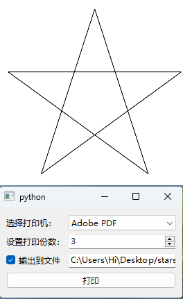

# 05.窗口/窗口控件、对话框以及相关功能类3


### 进度对话框QProgressDialog


进度对话框 QProgressDialog 用于表明某项任务正在进行及任务的完成进度。

进度对话框的界面如图所示,由 1个标签 QLabel1个进度条 QProgressBar 和 1个按钮QPushButton 构成。

进度对话框可以与定时器一起工作每隔一段时间获取一项任务的完成值,再设置进度条的当前值。当然,如果任务能自动输出其完成值,可直接与进度条的槽函数setValue(int)连接。

用QProgressDialog 类创建进度对话框的方法如下所示:

- 第1个 str 是进度对话窗口的标题栏
- 第 2个 str 是签的文本
- 第 1个 int 是进度条的最小值
- 第2个int 是进度条的最大值。

```python
from PySide6.QtWidgets import QProgressDialog

QProgressDialog(labelText: str, cancelButtonText: str, minimum: int, maximum: int, parent: Union[PySide6.QtWidgets.QWidget, NoneType]=None, flags: PySide6.QtCore.Qt.WindowType=Default(Qt.WindowFlags)) -> None
QProgressDialog(parent: Union[PySide6.QtWidgets.QWidget, NoneType]=None, flags: PySide6.QtCore.Qt.WindowType=Default(Qt.WindowFlags)) -> None 
```

#### 进度对话框QProgressDialog 的常用方法

进度对话框 QProgressDialog 的常用方法如表所示:

| QProgressDialog的方法及参数类型 | 返回值的类型 | 说 明                                 |
| ------------------------------- | ------------ | ------------------------------------- |
| setMinimumDuration(int)         | None         | 设置对话框从创建到显示出来的过渡时间  |
| minimumDuration()               | int          | 获取从创建到显示时的时间              |
| [slot]setValue(int)             | None         | 设置进度条的当前值                    |
| value                           | int          | 获取进度条的当前值                    |
| [slot]setMaximum(int)           | None         | 设置进度条的最大值                    |
| maximum()                       | int          | 获取进度条的最大值                    |
| [slot]setMinimum(int)           | None         | 设置进度条的最小值                    |
| minimum()                       | int          | 获取进度条的最小值                    |
| [slot]setRange(int,int)         | None         | 设置进度条的最小值和最大值            |
| [slot]setLabelText(str)         | None         | 设置对话框中标签的文本                |
| labelText()                     | Str          | 获取进度条中标签的文本                |
| [slot]setCancelButtonText(str)  | None         | 设置"取消"按钮的文本                  |
| [slot]cancel()                  | Str          | 取消对话框                            |
| wasCanceled()                   | bool         | 获取对话框是否被取消了                |
| [slot]forceShow()               | None         | 强制显示对话框                        |
| [slot]reset()                   | None         | 重置对话框                            |
| setAutoClose(bool)              | None         | 调用reset()方法时,设置是否自动隐藏    |
| autoClose()                     | 6001         | 获取是否自动隐藏                      |
| setAutoReset(bool)              | None         | 进度条的值达到最大时,设置是否自动重置 |
| autoReset()                     | bool         | 获取进度条的值达到最大时,是否自动重置 |
| setBar(QProgressBar)            | None         | 重新设置对话框中的进度条              |
| setCancelButton(QPushButton)    | None         | 重新设置对话框中的"取消"按钮          |
| setLabel(QLabel)                | None         | 重新设置对话框中的标签按钮            |

进度对话框 QProgressDialog主要方法介绍如下:

- 进度对话框显示
  - 进度对话框显示可以不用show()等方法来显示在创建进度对话后,经过某段时间后对话框会自动显示出来,这段时间是通过 setMinimumDuration(int)来设置的。参数 int 的单位是毫秒,默认是 4000 毫秒如果设置为0,则立即显示对话。
  - 可以forceShow()方法强制显示对话框。设置这个显示时间的目的是防止任务进展大快,进度对话框一闪而过。
- 进度条需要设置最小值和最大值及当前值
  - 最小值和最大值分别用setMinimum(int)方法和 setMaximum(int)方法设置默认是0和100;
  - 进度条的最小值和最大值也可以用setRange(int,int)方法来设置。
  - 进度条的当前值用setValue(int)方法设置。
  - 进度条上显示的百分比用公式(valueminumum)/(maximum-minimum)来计算,
- 对话框如果设置了 setAutoClose(True),调用reset()方法重置进度条时,会自动隐藏对话框。
- 对话框如果设置了 setAutoReset(True)则进度条的值达到最大值时会调用reset()方法重置进度条;如果设置了 setAutoClose(True),会隐藏对话框
- 用setLabelText(str)方法和 setCancelButtonText(str)方法可以设置对话框中标签和按钮显示的文字
- 当单击对话框中的 Cancel 按钮或执行 cancel()方法时会取消对话框,并且会重置和隐藏对话框,同时 wasCanceled()的值为 True。

#### 进度对话框QProgressDialog 的信号

进度对话框 QProgressDialog 只有一个信号 canceled(),单击对话中的 Cancel 按时发送信号。

#### 进度对话框QProgressDialog 的应用实例

下面的程序将进度对话框和定时器相结合,定时器每隔 200 毫秒发送一个信息。进度条的值随时间的推移逐渐增大,当超过进度条的最大值或单击 Cancel 按钮后,进度条被隐藏和重置。


```python
import sys
from PySide6.QtWidgets import QApplication, QWidget, QProgressDialog
from PySide6.QtCore import QTimer


class MyWindow(QWidget):

    def __init__(self, parent=None):
        super().__init__(parent)
        self.pd=QProgressDialog("Copying...", "Cancel", 0, 100, self)
        self.pd.canceled.connect(self.cancel)
        self.t=QTimer(self)
        self.t.setInterval(200)
        self.t.timeout.connect(self.perform)
        self.t.start()
        self.steps=0

    def perform(self):
        self.pd.setValue(self.steps)
        self.steps=self.steps + 1

        if self.steps > self.pd.maximum():
            self.t.stop()

    def cancel(self):
        self.t.stop()
        self.close()


if __name__=='__main__':
    app=QApplication(sys.argv)

    window=MyWindow()

    window.show()

    sys.exit(app.exec())
```

#### QProgressDialog(Bar) 例2

```python
# -*- coding: UTF-8 -*-
# File date: Hi_2023/3/14 23:29
# File_name: 03-QProgressDialog(Bar) 例子.py


from PySide6.QtCore import Qt.QTimer
from PySide6.QtWidgets import *

import sys
import time


class Main(QMainWindow):

    def __init__(self):
        super().__init__()
        self.setWindowTitle("QProgressDialog Demo")
        widget = QWidget()
        self.setCentralWidget(widget)
        layout = QVBoxLayout()
        widget.setLayout(layout)
        self.label = QLabel('显示进度条取消信息')
        layout.addWidget(self.label)

        button_modeless = QPushButton('显示无模式进度条，不会阻断其他窗口', self)
        button_modeless.clicked.connect(self.show_modeless)
        layout.addWidget(button_modeless)

        button_model = QPushButton('模式进度条，会阻断其他窗口', self)
        button_model.clicked.connect(self.show_modal)
        layout.addWidget(button_model)

        button_auto = QPushButton('不会自动关闭和重置的进度条', self)
        button_auto.clicked.connect(self.show_auto)
        layout.addWidget(button_auto)

        # 自定义进度条，
        button_custom = QPushButton('自定义QProgressDialog', self)
        button_custom.clicked.connect(self.show_custom)
        layout.addWidget(button_custom)

        # 水平滑块
        self.pd_slider = QProgressDialog("滑块进度条：点击滑块我会动", "Cancel", 10, 100, self)
        self.pd_slider.move(300, 400)
        self.pd_slider.canceled.connect(lambda: self.cancel(self.pd_slider))
        self.slider_horizon = QSlider(Qt.Horizontal)
        self.slider_horizon.setRange(10, 120)
        layout.addWidget(self.slider_horizon)
        self.slider_horizon.valueChanged.connect(lambda: self.valuechange(self.slider_horizon))
        bar = QProgressBar(self)  # QProgressBar
        bar.valueChanged.connect(lambda value: print('自定义Bar的Value值：', value))
        bar.setRange(1, 80)
        self.slider_horizon.valueChanged.connect(lambda value: bar.setValue(value))
        layout.addWidget(bar)
        # self.slider_horizon.valueChanged.connect(self.pd_slider.setValue)

        self.resize(300, 200)

    def show_modeless(self):
        pd_modeless = QProgressDialog("无模式进度条：可以操作父窗口", "Cancel", 0, 12)
        pd_modeless.move(300, 600)

        self.steps = 0

        def perform():
            pd_modeless.setValue(self.steps)
            self.label.setText(
                '当前进度条值: {}\n最大值: {}\n是否取消(重置)过进度条: {}'.format(pd_modeless.value(), pd_modeless.maximum(), pd_modeless.wasCanceled()))

            # // perform one percent of the operation
            self.steps += 1
            if self.steps > pd_modeless.maximum():
                self.timer.stop()

        self.timer = QTimer(self)
        self.timer.timeout.connect(perform)
        self.timer.start(1000)

        pd_modeless.canceled.connect(lambda: self.cancel(pd_modeless))
        pd_modeless.canceled.connect(self.timer.stop)

    def show_modal(self):
        max = 10
        pd_modal = QProgressDialog("模式进度条：不可以操作父窗口", "终止", 0, max, self)
        pd_modal.move(300, 600)
        pd_modal.setWindowModality(Qt.WindowModal)
        # pd_modal.setWindowModality(Qt.ApplicationModal)
        pd_modal.setMinimumDuration(1000)  # 一秒后出现对话框

        # 信号和槽要放在计时器后面，否则不会被执行
        pd_modal.canceled.connect(lambda: self.cancel(pd_modal))

        for i in range(max + 1):
            pd_modal.setValue(i)
            self.label.setText('当前进度条值: {}\n最大值: {}\n是否取消(重置)过进度条: {}'.format(pd_modal.value(), pd_modal.maximum(), pd_modal.wasCanceled()))
            if pd_modal.value() >= pd_modal.maximum() or pd_modal.wasCanceled():
                break
            # print('you can do something  here')
            time.sleep(1)
            # pd_modal.setValue(max)

    def get_pd_auto(self):
        if not hasattr(self, 'pd_auto'):
            max = 5
            self.pd_auto = QProgressDialog("我不会自动关闭和重置，哈哈", "终止", 0, max, self)
            self.pd_auto.move(300, 600)
            self.pd_auto.setWindowModality(Qt.ApplicationModal)
            self.pd_auto.setMinimumDuration(1000)
            # self.pd_auto.setValue(0)

            self.pd_auto.setAutoClose(False)  # 取消满值自动关闭(默认情况下满值自动重置)
            self.pd_auto.setAutoReset(False)  # 取消自动重置  (默认情况下满值自动重置)

            self.pd_auto.canceled.connect(lambda: self.cancel(self.pd_auto))
        return self.pd_auto

    def show_auto(self):
        pd_auto = self.get_pd_auto()

        for i in range(1000):
            if pd_auto.value() >= pd_auto.maximum() or pd_auto.wasCanceled():
                self.label.setText('当前进度条值: {}\n最大值: {}\n是否取消(重置)过进度条: {}'.format(pd_auto.value(), pd_auto.maximum(), pd_auto.wasCanceled()))
                break
            pd_auto.setValue(pd_auto.value() + 1)
            self.label.setText('当前进度条值: {}\n最大值: {}\n是否取消(重置)过进度条: {}'.format(pd_auto.value(), pd_auto.maximum(), pd_auto.wasCanceled()))
            # print('you can do something  here')
            time.sleep(1)
            # pd_auto.setValue(max)

    def show_custom(self):

        pd_custom = QProgressDialog(self)
        bar = QProgressBar()
        bar.setMaximum(9)
        bar.setMinimum(2)
        bar.valueChanged.connect(lambda value: print('自定义Bar的Value值：', value))
        pd_custom.setBar(bar)
        pd_custom.setLabel(QLabel('自定义进度条，使用自定义的QProgressBar'))
        pd_custom.setCancelButton(QPushButton('取消按钮'))

        pd_custom.move(300, 600)
        pd_custom.setWindowModality(Qt.WindowModal)
        # pd_custom.setWindowModality(Qt.ApplicationModal)
        pd_custom.setMinimumDuration(1000)  # 一秒后出现对话框

        # 信号和槽要放在计时器后面，否则不会被执行
        pd_custom.canceled.connect(lambda: self.cancel(pd_custom))

        for i in range(-1, bar.maximum() + 1):
            pd_custom.setValue(i)
            self.label.setText('当前进度条值: {}\n最大值: {}\n是否取消(重置)过进度条: {}'.format(pd_custom.value(), pd_custom.maximum(), pd_custom.wasCanceled()))
            if pd_custom.value() >= pd_custom.maximum() or pd_custom.wasCanceled():
                break
            # print('you can do something  here')
            time.sleep(1)
            # pd_modal.setValue(max)

    def cancel(self, pg):
        self.statusBar().showMessage('你手动取消了进度条： “%s”' % pg.labelText(), 3000)

    def valuechange(self, slider):
        size = slider.value()
        self.pd_slider.setValue(size)
        self.label.setText(
            '当前进度条值: {}\n最大值: {}\n是否取消(重置)过进度条: {}'.format(self.pd_slider.value(), self.pd_slider.maximum(), self.pd_slider.wasCanceled()))


if __name__ == "__main__":
    app = QApplication(sys.argv)
    window = Main()
    window.show()
    sys.exit(app.exec())

```


### 向导对话框QWizard


向导对话框 QWizard 由多页构成,可以引导客户按步骤完成某项工作

向导对话框在 ModernStyle 风格界面中,对话框的顶部是横幅(banner),横幅中有标题、子标题和logo,左侧是水印区(watermark),底部有一排按钮,右侧是向导页的内容

在MacStyle风格界面中,顶部没有 logo.左侧用背景(background)代替。

 

与其他对话框不同的是,向导对话框由多页构成,同一时间只能显示其中的一页,单击next按或 Back 按钮可以向后或向前显示其他页。对话框中的页是向导页WizzrdPage.向导页有自己的布局和控件,向导会为向导页分配从0开始的ID号

向导对话框QWizard 是从QDialog类继承来的, QWizardPage 是从QWidget类继承来的,用QWizard 类和QWizardPage类创建实例对象的方法如下所示:

```python
from PySide6.QtWidgets import QWizard, QWizardPage

QWizard(parent: Union[PySide6.QtWidgets.QWidget, NoneType]=None, flags: PySide6.QtCore.Qt.WindowType=Default(Qt.WindowFlags)) -> None
QWizardPage(parent: Union[PySide6.QtWidgets.QWidget, NoneType]=None) -> None
```

#### 向导对话框QWizard 和向导页 QWizardPage 的常用方法

##### 向导对话框QWizard的常用方法如表所示:

| QWizard的方法及参数类型                                      | 返回值的类型    | 说明                                                      |
| ------------------------------------------------------------ | --------------- | --------------------------------------------------------- |
| addPage(page: QWizardPage)                                   | int             | 添加向导页,并返回D号                                      |
| setPage(id:int, page: QWizardPage)                           | None            | 用指定的ID号添加向导页                                    |
| removePage(id: int)                                          | None            | 移除ID是int的向导页                                       |
| currentId()                                                  | int             | 获取当前向导页的ID号                                      |
| currentPage()                                                | QWizardPage     | 获取当前向导页                                            |
| basVisitedPage(int)                                          | bool            | 获取向导页是否被访问过                                    |
| [slot]restart()                                              | None            | 回到初始页                                                |
| [slot]back()                                                 | None            | 显示上一页                                                |
| [slot]next()                                                 | None            | 显示下一页                                                |
| page(id:int)                                                 | QWizardPage     | 获取指定ID号的向导页                                      |
| pageIds()                                                    | ListCint]       | 获取向导页的ID列表                                        |
| setButton(which: QWizard.WizardButton, button:QAbstractButton) | None            | 添加某种用途的按钮                                        |
| button(QWizard.WizardButton)                                 | QAbstractButton | 获取某种用途的按钮                                        |
| setButtonLayout(Sequence[QWizard.WizardButton])              | None            | 设置按钮的布局(相对位置)                                  |
| setButtonText(QWizard.WizardButton, str)                     | None            | 设置按钮的文本                                            |
| buttonText(which: QWizard.WizardButton)                      | str             | 获取按钮的文本                                            |
| setField(name:str,value:Any)                                 | None            | 设置字段的值                                              |
| field(name: str)                                             | Any             | 获取字段的值                                              |
| setOption(QWizard.WizardOption, on=True)                     | None            | 设置向导对话框的选项                                      |
| options()                                                    | WizardOptions   | 获取向导对话框的选项                                      |
| testOption(QWizard.WizardOption)                             | bool            | 测试是否设置了某个选项                                    |
| setPixmap(which: QWizard.WizardPixmap, pixmap:Union[QPixmap,Qlmage,str]) | None            | 在对话框的指定区域设置图片                                |
| pixmap(which: QWizard.WizardPixmap)                          | QPixmap         | 获取指定位置处的图片                                      |
| setSideWidget(QWidget)                                       | None            | 在向导对话框左侧设置控件                                  |
| setStartId(id:int)                                           | None            | 用指定ID号的向导页作为起始页,默认用ID值最小的页作为起始页 |
| startId()                                                    | int             | 获取起始页的ID号                                          |
| setSubTitleFormat(format: Qt.TextFormat)                     | None            | 设置子标题的格式                                          |
| setTitleFormat(format: Qt.TextFormat)                        | None            | 设置标题的格式                                            |
| setWizardStyle(style:QWizard.WizardStyle)                    | None            | 设置向导对话框的风格                                      |
| wizardStyle()                                                | WizardStyle     | 获取向导对话框的风格                                      |
| visitedIds()                                                 | ListCint]       | 获取访问过的向导页ID列表                                  |
| cleanupPage(id:int)                                          | None            | 清除内容,恢复默认值                                       |
| initializePage(id:int)                                       | None            | 初始化向导页                                              |
| nextId()                                                     | int             | 获取下一页的ID号                                          |
| validateCurrentPage()                                        | bool            | 验证当前页的输入是否正确                                  |

##### 向导页QWizardPage的常用方法如表所示:

| QWizardPage的方法及参数类型                                  | 返回值的类型 | 说 明                                            |
| ------------------------------------------------------------ | ------------ | ------------------------------------------------ |
| setButtonText(QWizard.WizardButton,str)                      | None         | 设置某种用途按钮的文字                           |
| buttonText(which: QWizard.WizardButton)                      | str          | 获取指定用途的按钮的文本                         |
| setCommitPage(commitPage:bool)                               | None         | 设置成提交页                                     |
| isCommitPage()                                               | bool         | 获取是否是提交页                                 |
| setFinalPage(bool)                                           | None         | 设置成最后页                                     |
| isFinalPage()                                                | bool         | 获取是否是最后页                                 |
| setPixmap(which: QWizard.WizardPixmap,pixmap:QPixmap)        | None         | 在指定区域设置图片                               |
| pixmap(which: QWizard.WizardPixmap)                          | QPixmap      | 获取指定区域的图片                               |
| setSubTitle(subTitle:str)                                    | None         | 设置子标题                                       |
| setTitle(title:str)                                          | None         | 设置标题                                         |
| subTitle()                                                   | str          | 获取子标题                                       |
| title()                                                      | Str          | 获取标题                                         |
| registerField(name: str, widget: QWidget, property: str=None, changedSignal: str=None) | None         | 创建字段                                         |
| setField(name: str,value: Any)                               | None         | 设置字段的值                                     |
| field(name:str)                                              | Any          | 获取字段的值                                     |
| setDefaultProperty(classNane: str, property: str,changedSignal:str) | None         | 设置某类控件的某个属性与某个信号相 关联          |
| validatePage()                                               | bool         | 验证向导页中的输入内容                           |
| wizard()                                                     | QWizard      | 获取向导页所在的向导对话框                       |
| cleanupPage()                                                | None         | 清除页面的内容,恢复默认值                        |
| initializePage()                                             | None         | 用于初始化向导页                                 |
| isComplete()                                                 | bool         | 获取是否完成输人,以便激活Next 按钮或 Finish 按钮 |
| validatePage()                                               | bool         | 验证向导页中的内容,若为True则显示下 一页         |
| nextId()                                                     | int          | 获取下一页的ID号                                 |

##### 向导对话框QWizar和向导页QWizardPage主要方法介绍

- 向导对话框的风格

  - 用setWizardStyle(style;QWizard.WizardStyle)方法设置,其中参数 style是QWizard,WizardStyle 的枚举值,可以取:
    - QWizard.ClassicStyle
    - QWizard.ModernStyle
    - QWizard.MacStyle
    - QWizard.AeroStyle。

- 添加向导页

  - 用向导对话框的 addPage(page:QWizardPage)方法可以添加向导页,并返回向导页的ID号
  - 也可用setPage(id;int,page:QWizardPage)方法用指定的ID号添加向导页。

- 向导对话框的标题和子标题

  - 向导页的 setTitle(title; str)方法和 setSubTitle(subTitle: str)方法设置标题和子标题
  - 虽然由向导页设置标题和子标题,但是它们会显示在向导对话框的横幅中。
  - 标题和子标题的格式由向导对话框的setTitleFormat(format:Qt.TextFormat)法和 setSubTitleFormat(format:Qt.TextFormat)方法设置,其中参数 format 的取值是 QtTextFormat 举值可以取:
    - Qt.PlainText(纯文本)
    - Qt.RichText(富文本)
    - Qt.AutoText(由系统决定)
    - Qt.MarkdownText(Markdown 文本)

- 向导对话框的选项由 setOption(QWizard,WizardOption,on=True)方法设置中QWizard.WizardOption 参数是枚举类型,其可以取的值如表所示:

  | QWizard.WizardOption的取值           | 说 明                                   |
  | ------------------------------------ | --------------------------------------- |
  | QWizard.IndependentPages             | 向导页之间是相互独立的,相互间不传递数据 |
  | QWizard.IgnoreSubTitles              | 不显示子标题                            |
  | QWizard.ExtendedWatermarkPixmap      | 将水印图片拓展到窗口边缘                |
  | QWizard.NoDefaultButton              | 不将Next按钮和Finish按钮设置成默认按钮  |
  | QWizard.NoBackButtonOnStartPage      | 在起始页中不显示Back按钮                |
  | QWizard.NoBackButtonOnLastPage       | 在最后页中不显示Back按钮                |
  | QWizard.DisabledBackButtonOnLastPage | 在最后页中 Back 按钮失效                |
  | QWizard.HaveNextButtonOnLastPage     | 在最后页中显示失效的Next按钮            |
  | QWizard.HaveFinishButtonOnEarlyPages | 在非最后页中显示失效的 Finish 按钮      |
  | QWizard.NoCancelButton               | 不显示Cancel 按钮                       |
  | QWizard.CancelButtonOnLeft           | 将 Cancel 按钮放到 Back 按钮的左边      |
  | QWizard.HaveHelpButton               | 显示 Help 按钮                          |
  | QWizard.HelpButtonOnRight            | 将帮助按钮放到右边                      |
  | QWizard.HaveCustomButtonl            | 显示用户自定义的第1个按钮               |
  | QWizard.HaveCustomButton2            | 显示用户自定义的第2个按钮               |
  | QWizard.HaveCustomButton3            | 显示用户自定义的第3个按钮               |
  | QWizard.NoCancelButtonOnLastPage     | 在最后页中不显示Cancel 按钮             |

- 显示的图片

  - 向导对话框和向导页都可以用setPixmap(which:QWizard.WizardPixmappixmap:QPixmap)方法设置向导对话框中显示的图片
  - 用向导对话框设置的图片作用于所有页,用向导页设置的图片只作用于向导页所在的页面,其中参 which的取值是QWizard,WizardPixmap 的校举值,用于设置图片放置的位置,可以取:
    - QWizard.WatermarkPixmap
    - QWizard.LogoPixmap
    - QWizard.BannerPixmap
    - QWizard.BackgroundPixmap。

- 往对话框中添加按钮

  - 用setButton(which;QWizard,WizardButton,button;QAbstractButton)方法往对话框中添加某种用途的按钮,其中参数 which 的取值是 QWizardWizardButton的枚举值,用于指定按钮的用途。QWizard,WizardButton 的取值如表所示。

    | Qwizard.wizard Button 的取值 | 说 明       | Qwizard.wizard Button 的取值 | 说 明               |
    | ---------------------------- | ----------- | ---------------------------- | ------------------- |
    | QWizard.BackButton           | Back 按钮   | QWizard.HelpButton           | Help 按钮           |
    | QWizard.NextButton           | Next 按钮   | QWizard.CustomButtonl        | 用户自定义第1个按钮 |
    | QWizard.CommitButton         | Commit 按钮 | QWizard.CustomButton2        | 用户自定义第2个按钮 |
    | QWizard.FinishButton         | Finish按钮  | QWizard.CustomButton3        | 用户自定义第3个按钮 |
    | QWizard.CancelButton         | Cancel按钮  | QWizard.Stretch              | 布局中的水平伸缩器  |

  - 对话框中最多可以添加3个自定义的按钮,要使自定义按钮可见,还需要用setOption()方法把自定义按钮显示出米。通常情况下 Next 按钮和 Finish 按钮是互斥的

- 提交页

  - 用向导页的 setCommitPage(bool)方法可以把向导页设置成提交页,提交页上用Commit 按钮替换 Next 按钮,且不能用Back 或 Cancel 按钮来撤销。
  - 单击 Commit 按钮后,下一页的 Back 按钮失效。用isCommit()方法可以获取该页是否是提交页

- 把向导页设置成最后页

  - 用向导页的 setFinalPage(bool)方法可以把向导页设置成最后页,最后页上用Finish 按钮替换 Next 按钮,此时用nextld()方法取下一页的ID 时返回-1

- 多个向导页之间的数据通信

  - 向导对话框中的多个向导页之间的数据不能自动进行通信

  - 要实现向导页之间的数据传递,可以将向导页上的控件属性定义成字段,并可以将控件属性与某信号关联这样当属性值发生变化时发送信号,也可以通过字段设置或获取控件的属性值,字段对于向导对话框来说是全局性的。字段的定义通过 registerField(name: str,widget:QWidget,property:str=None,changedSignal: str=None)函数来实现,其中

    - name 是字段名称
    - widget 是向导页上的控件
    - property 是字段的属性
    - changedSignal是与字段属性相关的信号。

    定义好字段后,可以利用setField(name:str,value:Any)方法和 field(name:str)方法设置和获取字段的值。

    用setDefaultProperty(className: str,property: str,changedSignal: str)方法可以设置某类控件的某个属性与某个信号相关联。PySide6 对大多数控件能自动将某个属性与某个信号相关联,如表所示。

    | 控件            | 属性         | 关联的信号                 |
    | --------------- | ------------ | -------------------------- |
    | QAbstractButton | checked      | toggled(bool)              |
    | QAbstractSlider | value        | valueChanged(int)          |
    | QComboBox       | currentIndex | currentIndexChanged(int)   |
    | QDateTimeEdit   | dateTime     | dateTimeChanged(QDatetime) |
    | QLLineEdit      | text         | textChanged(str)           |
    | QListWidget     | currentRow   | currentRowChanged(int)     |
    | QSpinBox        | value        | valueChanged(int)          |

- 当isComplete()函数的返回值为 True 时,会激活 Next 按钮或 Finish 按钮

  可以重写该函数,用户在页面上输入信息后,当满足一定条件时改变 isComplete()的返回值,以便激活 Next 按钮或 Finish 按钮。

  如果重写 isComplete()函数,一定要确保completeChange()信号也能发送

- 用户单击 Next 按钮或 Finish 按后,需要验证页面上输人的内容是否合法

  - 这时会调用向导对话框的 validateCurrentPage()函数和向导页的 validatePage()函数通常需要重写这两个函数以便完成对输人内容的验证,如果返回 True 则显示下一页

- 单击 Next 按钮后,在显示下一页之前,会调用向导页的 initializePage()函数。可以重写该函数,以便根据前面的向导页的内容初始化本向导页的内容。

- 单击 Back 按钮后,在显示前一页之前,会调用向导页的 cleanupPage()函数。可以重写该函数,以保证向导页能恢复默认值。

- 根据 nextId()函数的返回值,决定要显示的下一页,如果没有后续页,则返回-1。单击 next 按钮和 back 按都会调用nextId()函数如果重写该函数会根据已经输入和选择的内容让 nextId()返回相应页的ID号,从而控制页面显示的顺序

#### 向导对话框QWizard 和向导页QWizardPage的信号

向导页 QWizardPage 只有一个信号completeChanged()当 isCompleted()的返回值发生变化时发送该信号。

向导对话框 QWizard 的信号如表所示:

| QWizard的信号              | 说 明                                                        |
| -------------------------- | ------------------------------------------------------------ |
| currentIdChanged(ID)       | 当前页发生变化时发送信号,参数是新页的ID                      |
| customButtonCIicked(which) | 单击自定义按钮时发送信号,参数 which 可能是 CustomButtonl、 CustomButton2 或 CustomButton3 |
| helpRequested()            | 单击 Help 按钮时发送信号                                     |
| pageAdded(ID)              | 添加向导页时发送信号,参数是新页的ID                          |
| pageRemoved(ID)            | 移除向导页时发送信号,参数是被移除页的ID                      |

#### 向导对话框QWizard 和向导页QWizardPage 的应用实例

下面的程序建立由3个向导页构成的导航对话框,通过单击菜单显示出对话框,用于人学生基本信息、联系方式和考试成绩。

其中第 1个向导页输人姓名和学号,在这个向导页中重写了 isComplete()函数和 validatePage()函数,当姓名和学号中都输人了内容时isComplete()的返回值是True。

这时"下一步"按钮会激活单击"下一步"按钮时,会验学号中输人的内容是否为数字如果是则 validatePage()的返回值是True,显示下一个导航页;

如果不是会弹出警告信息对话框,validatePage()的返回值是 False,不会显示下一个导页。其他向导页也可作类似的处理。在最后一页中单击"完成"按钮,通过字段获取输人的值,并输出到界面上。


```python
import sys
from PySide6.QtWidgets import(QApplication, QWidget, QMenuBar, QPlainTextEdit, QVBoxLayout, QWizard, QWizardPage, QMessageBox, QPushButton, QLineEdit, QFormLayout)


class QWizardPage_1(QWizardPage):  # 第1个向导页类
    def __init__(self, parent=None):
        super().__init__(parent)
        form=QFormLayout(self)
        self.line_name=QLineEdit()
        self.line_number=QLineEdit()
        form.addRow("姓名:", self.line_name)
        form.addRow("学号:", self.line_number)

        self.setTitle("学生成绩输入系统")
        self.setSubTitle("基本信息")

        self.line_name.textChanged.connect(self.isComplete)
        self.line_number.textChanged.connect(self.isComplete)
        self.line_name.textChanged.connect(self.completeChanged_emit)
        self.line_number.textChanged.connect(self.completeChanged_emit)

        self.registerField("name", self.line_name)  # 创建字段创建字段#重写isComplete()函数
        self.registerField("number", self.line_number)

    def isComplete(self):  # 重写isComplete()函数
        if self.line_name.text() !="" and self.line_number.text() !="":
            return True
        else:
            return False

    def completeChanged_emit(self):  # 重写isComplete()函数后,需要重新发送信号
        self.completeChanged.emit()

    def validatePage(self):  # 重写validatePage()函数
        if self.line_number.text().isdigit():  # 确保学号中输人的是数字
            return True
        else:
            QMessageBox.warning(self, "警告", "输人有误,请检查输人的信息")
            return False


class QWizardPage_2(QWizardPage):  # 第2个向导页类
    def __init__(self, parent=None):
        super().__init__(parent)

        form=QFormLayout(self)
        self.line_telephone=QLineEdit()
        self.line_address=QLineEdit()
        form.addRow("电话:", self.line_telephone)
        form.addRow("地址:", self.line_address)

        self.setTitle("学生成绩输人系统")
        self.setSubTitle("联系方式")
        self.registerField("telephone", self.line_telephone)
        self.registerField("address", self.line_address)


class QWizardPage_3(QWizardPage):
    def __init__(self, parent=None):
        super().__init__(parent)
        form=QFormLayout(self)
        self.line_chinese=QLineEdit()
        self.line_math=QLineEdit()
        self.line_english=QLineEdit()

        form.addRow("语文:", self.line_chinese)
        form.addRow("数学:", self.line_math)
        form.addRow("英语:", self.line_english)

        self.setTitle("学生成绩输入系统")
        self.setSubTitle("考试成绩")

        self.registerField("chinese", self.line_chinese)  # 创建字段
        self.registerField("math", self.line_math)  # 创建字段
        self.registerField("english", self.line_english)  # 创建字段


class QWizard_studentnumber(QWizard):  # 向导对话框

    def __init__(self, parent=None):
        super().__init__(parent)

        self.setWizardStyle(QWizard.WizardStyle.ModernStyle)
        self.addPage(QWizardPage_1(self))  # 添加向导页
        self.addPage(QWizardPage_2(self))  # 添加向导页
        self.addPage(QWizardPage_3(self))  # 添加向导页

        self.btn_back=QPushButton("上一步")
        self.btn_next=QPushButton("下一步")
        self.btn_finish=QPushButton("完成")

        self.setButton(QWizard.WizardButton.BackButton, self.btn_back)  # 添加按钮
        self.setButton(QWizard.WizardButton.FinishButton, self.btn_finish)
        self.setButton(QWizard.WizardButton.NextButton, self.btn_next)  # 添加按钮

        self.setButtonLayout([self.WizardButton.Stretch, self.WizardButton.BackButton, self.WizardButton.NextButton, self.WizardButton.FinishButton])


class MyWindow(QWidget):
    def __init__(self, parent=None):
        super().__init__(parent)
        self.widget_setupUi()  # 建立主界面
        self.wizard=QWizard_studentnumber(self)  # 实例化向导对话框
        self.wizard.btn_finish.clicked.connect(self.btn_finish_clicked)  # 完成按钮信号与槽的连接

    def widget_setupUi(self):  # 建立主程序界面
        menuBar=QMenuBar(self)  # 定义菜单栏
        file_menu=menuBar.addMenu("文件(&F)")  # 定义文件菜单
        action_enter=file_menu.addAction("进入")
        action_enter.triggered.connect(self.action_enter_triggered)  # 动作的信号与槽函数的连接
        self.plainText=QPlainTextEdit(self)  # 显示数据控件

        v=QVBoxLayout(self)  # 主界面的布局
        v.addWidget(menuBar)
        v.addWidget(self.plainText)

    def action_enter_triggered(self):
        self.wizard.setStartId(0)
        self.wizard.restart()
        self.wizard.open()

    def btn_finish_clicked(self):  # 单击最后一页的"完成"按钮,输人的数据在plainText中显示
        template="姓名:{}   学号:{}  电话:{}  地址:{}  语文:{}  数学:{}  英语:{}"
        string=template.format(self.wizard.field("name"), self.wizard.field("number"), self.wizard.field("telephone"), self.wizard.field("address"), self.wizard.field("chinese"), self.wizard.field("math"), self.wizard.field("english"))  # 获取字段值, 格式化输出文本
        self.plainText.appendPlainText(string)


if __name__=='__main__':
    app=QApplication(sys.argv)
    window=MyWindow()
    window.show()
    sys.exit(app.exec())  # 动作的槽函数
 
```

### 打印

应用程序一般都有打印功能,可以将重要内容打印成纸质资料。PySide支持打印操作,它可以识别系统中已经安装的打印机,驱动打印机进行工作,可以用与打印机有关的类直接打印,也可通过打印对话框进行打印,还可对打印的内容在打印前进行打印预览。与打印有关的类主要在QtPrintSupport模块中。

PySide提供识别打印机硬件的类QPrinterInfo和进行打印的类QPrinter,将QPrinter 作为QPainter的绘图设备,可以将图形、文字和图像等用打印机进行输出,保存到纸质介质上。

#### 打印机信息 QPrinterInfo

打印机信息QPrinterInfo代表本机上可以使用的一台打印机,通过QPrinterInfo可以获取打印机的参数。用QPrinterInfo创建打印机信息实例对象的方法如下所示。

```python
from PySide6.QtPrintSupport import QPrinterInfo

QPrinterInfo(self) -> None
QPrinterInfo(other: PySide6.QtPrintSupport.QPrinterInfo) -> None
QPrinterInfo(printer: PySide6.QtPrintSupport.QPrinter) -> None
QPrinterInfo()
```

打印机信息QPrinterInfo的常用方法如表所示

| QPrinterInfo的方法及参数类型          | 返回值的类型              | 说 明                               |
| ------------------------------------- | ------------------------- | ----------------------------------- |
| [static]availablePrinterNames()       | List[str]                 | 获取可用的打印机名称列表            |
| [static]availablePrinters()           | List[QPrinterInfo]        | 获取可用的打印机列表                |
| [static]defaultPrinter()              | QPrinterInfo              | 获取当前默认的打印机                |
| [static]defaultPrinterName()          | str                       | 获取当前默认打印机的名称            |
| [static]printerInfo(printerName: str) | QPrinterInfo              | 根据打印机名称获取打印机            |
| isDefault()                           | bool                      | 获取是否是默认的打印机              |
| isNull()                              | bool                      | 获取是否不含打印机信息              |
| isRemote()                            | bool                      | 获取是否是远程网络打印机            |
| defaultColorMode()                    | QPrinter.ColorMode        | 获取打印机默认的颜色模式            |
| defaultDuplexMode()                   | QPrinter.DuplexMode       | 获取默认的双面打印模式              |
| description()                         | Str                       | 获取对打印机的描述信息              |
| location()                            | Str                       | 获取打印机的位置信息                |
| makeAndModel()                        | str                       | 获取打印机的制造商和型号            |
| defaultPageSize()                     | QPageSize                 | 获取默认的打印纸尺寸                |
| maximumPhysicalPageSize()             | QPageSize                 | 获取支持的最大打印纸尺寸            |
| minimumPhysicalPageSize()             | QPageSize                 | 获取支持的最小打印纸尺寸            |
| printerName()                         | str                       | 获取打印机的名称                    |
| state()                               | QPrinter.PrinterState     | 获取打印机的状态                    |
| supportedColorModes()                 | List[QPrinter.ColorMode]  | 获取打印机支持的颜色模式            |
| supportedDuplexModes()                | List[QPrinter.DuplexMode] | 获取打印机支持的双面模式            |
| supportedPageSizes()                  | List[QPageSize]           | 获取打印机支持的打印尺寸            |
| supportedResolutions()                | List[int]                 | 获取打印机支持的打印质量            |
| supportsCustomPageSizes()             | bool                      | 获取打印机是否支持自定义打 印纸尺寸 |

打印机信息QPrinterInfo的常用方法主要方法介绍如下。

- 用QPrinterInfo提供的静态方法 availablePrinterNames()和 availablePrinters()可分别获取本机上的打印机名称列表和打印机列表；

- 用静态方法defaultPrinter()和defaultPrinterName()可分别获取默认的打印机和默认打印机的名称。

- 用isNull()方法获取QPrinterInfo()对象是否不含打印机信息,例如本机上如果没有安装打印机,则用defaultPrinter()方法获得的打印机是无效的。

- 用defaultColorMode()方法获取打印机默认的颜色模式,返回值是 QPrinter.ColorMode 的枚举值,可取:

  - QPrinter.GrayScale(值为 0)
  - QPrinter.Color(值为 1)。

  用defaultDuplexMode()方法获取打印机默认的双面打印模式,返回值是 QPrinter.DuplexMode 的枚举值,可取:

     - QPrinter.DuplexNone(单 面 模 式)
     - QPrinter.DuplexAuto(用打印机的默认设置来决定是单面模式还是双面模式)
     - QPrinter.DuplexLongSide(双面模式,打印第2面前沿纸张长边翻面)
     - QPrinter.DuplexShortSide(双面模式,打印第2面前沿纸张短边翻面),对应值分别是0~3。

- 用state()方法获取打印机当前的状态,返回值是 QPrinter.PrinterState,可取以下值,对应值分别是0~3。

  - QPrinter.Idle
  - QPrinter.Active
  - QPrinter.Aborted(已取消)
  - QPrinter.Error

#### 打印机QPrinter及实例

QPrinter 表示打印出来的纸张,可以作为QPainter的绘图设备来使用,QPainter 可以按照QPrinter绘制图形、文字和图像等内容。

QPrinter 继承自QPagedPaintDevice 和 QPaintDevice。用QPrinter 创建打印机实例的方法如下所示,其中参数 mode 设置打印模式,取值是 QPrinter.PrinterMode的枚举值,可取以下值,取不同的值会影响QPainter的视口。

- QPrinter.ScreenResolution(使用屏幕分辨率)
- QPrinter.HighResolution

```python
from PySide6.QtPrintSupport import QPrinter

QPrinter(mode: PySide6.QtPrintSupport.QPrinter.PrinterMode=Instance(PySide6.QtPrintSupport.QPrinter.PrinterMode.ScreenResolution)) -> None
QPrinter(printer: PySide6.QtPrintSupport.QPrinterInfo, 
         mode: PySide6.QtPrintSupport.QPrinter.PrinterMode=Instance(PySide6.QtPrintSupport.QPrinter.PrinterMode.ScreenResolution)) -> None
```

##### 打印机QPrinter的常用方法

打印机QPrinter 的常用方法如表:

| QPrinter的方法及参数类型                                     | 返回值的类型               | 说 明                      |
| ------------------------------------------------------------ | -------------------------- | -------------------------- |
| setPrinterName(str)                                          | None                       | 设置打印机名称             |
| printerName()                                                | str                        | 获取打印机名称             |
| setOutputFileName(str)                                       | None                       | 设置打印到文件的文件名     |
| outputFileName()                                             | str                        | 获取打印文件名             |
| setOutputFomat(QPrinter.OutputFormat)                        | None                       | 设置打印到文件时的格式     |
| setFullPage(bool)                                            | None                       | 设置是否整页模式打印       |
| setPageMargins(margins: Union[QMarginsF, QMargins], units: QPageLayout.Unit=QPageLayout.Millimeter) | bool                       | 设置打印页边距             |
| setCopyCount(int)                                            | None                       | 设置打印份数               |
| copyCount()                                                  | int                        | 获取打印份数               |
| setCollateCopies(collate:bool)                               | None                       | 设置是否对照打印           |
| collateCopies()                                              | bool                       | 获取对照打印               |
| setPromTo(fromPage: int,toPage:int)                          | None                       | 设置打印页数的范围         |
| fromPage()                                                   | int                        | 获取打印范围起始页         |
| toPage()                                                     | int                        | 获取打印范围终止页         |
| setPageOrder(QPrinter.PageOrder)                             | None                       | 设置打印顺序               |
| pageOrder()                                                  | QPrinter.PageOrder         | 获取打印顺序               |
| setResolution(int)                                           | None                       | 设置打印精度               |
| resolution()                                                 | int                        | 获取打印精度               |
| setPageOrientation(QPageLayout.Orientation)                  | bool                       | 设置打印方向               |
| newPage()                                                    | bool                       | 生成新页                   |
| abort()                                                      | bool                       | 取消正在打印的文档         |
| fllPage()                                                    | bool                       | 获取是否整页模式           |
| isValid()                                                    | bool                       | 获取打印机是否有效         |
| PaPerRect(QPrinter.Unit)                                     | QRectF                     | 获取纸张范围               |
| setPrintRange(tange: QPrinter.PrintRange)                    | None                       | 设置打印范围的模式         |
| printRange()                                                 | QPrinter.PrintRange        | 获取打印范围的模式         |
| printerState()                                               | QPrinter.PrinterState      | 获取打印状态               |
| serColorMode(QPrinter.ColorMode)                             | None                       | 设置颜色模式               |
| colorMode()                                                  | QPrinter.ColorMode         | 获取颜色模式               |
| setDocName(str)                                              | None                       | 设置打印来源文档名         |
| docName()                                                    | str                        | 获取文档名                 |
| setDuplex(duplex: QPrinter.DuplexMode)                       | None                       | 设置双面模式               |
| duplex()                                                     | QPrinter.DuplexMode        | 获取双面模式               |
| setFontEmbeddingEnabled(enable: bool)                        | None                       | 设置是否启用内置字体       |
| fontEmbeddingEnabled()                                       | b001                       | 获取是否启用内置字体       |
| setPageSize(Union[QPageSize, QPageSize.PageSizeId,QSize])    | bool                       | 设置打印纸的尺寸           |
| pageRect(QPrinter.Unit)                                      | QRectF                     | 获取打印范围               |
| setPaperSource(QPrinter.PaperSource)                         | None                       | 设置纸张来源               |
| paperSource()                                                | QPrinter.PaperSource       | 获取纸张来源               |
| supportedPaperSources()                                      | List[QPrinter.PaperSource] | 获取支持的纸张来源列表     |
| setPdfVersion(QPagedPaintDevice.PdfVersion)                  | None                       | 设置 pdf文档的版本         |
| setPageRanges(ranges:QPageRanges)                            | None                       | 设置选中的页数             |
| pageRanges()                                                 | QPageRanges                | 获取选中的页数对象         |
| setPageLayout(pageLayout: QPageLayout)                       | bool                       | 设置页面布局               |
| pageLayout()                                                 | QPageLayout                | 获取页面布局对象           |
| supportedResolutions()                                       | List[int]                  | 获取打印机支持的分辨率列表 |
| supportsMultipleCopies()                                     | bool                       | 获取是否支持多份打印       |

打印机QPrinter主要方法介绍如下。

- 用QPrinterInfo的静态方法availablePrinterNames()可以获得本机已经安装的打印机名称列表,然后用QPrinter 的setPrinterName(str)方法将其中一台打印机设置成QPrinter。

- 用setOutputFileName(str)方法设置打印机将打印内容打印到文件中而不是纸质介质上

  - 参数是文件名。如果不设置该内容或设置为空字符串,则将内容打印到纸张上；
  - 如果设置了扩展名是pdf的文件名,则将打印内容输出到pdf文档中；
  - 如果设置的扩展名不是pdf,则将打印内容输出到按照 setOutputFormat(QPrinter.OutputFormat)方法设置的文件格式的文件中,其中QPrinter.OutputFormat枚举值可取:
    - QPrinter.NativeFormat(本机定义格式,值是0)
    - QPrinter.PdfFormat(pdf格式,值是1)。

- 在打印完第一页后,需要用newPage()方法通知打印机弹出当前正在打印的纸张,继续进行下一页的打印,成功则返回True;用abort()方法取消当前的打印,成功则返回True。

- 用setFullPage(bool)方法设置是否是整页模式打印。

  - 在setFullPage(True)时,QPainter的坐标原点在可打印区的左上角,与纸张坐标系的原点重合,如图11-1(a)所示,但由于页边距的限制,实际上不能在整张纸上打印；

  - 在 setFullPage(False)时,QPainter的坐标原点在打印区域的左上角。

  - 页边距用setPageMargins(margins: Union[QMarginsF,QMargins],units: QPageLayout.Unit=QPageLayout,Millimeter)方法设置,其中单位 Unit 可取:

    - QPageLayout.Millimeter,QPageLayout.Point(=in/72)、
    - QPageLayout.Inch、QPageLayout.Pica(=in/6)
    - QPageLayout.Didot(=0.375mm)
    - QPageLayout.Cicero(=4.5mm)

    对应值分别是0~6。

  - 用paperRect(QPrinter,Unit)方法和 pageRect(QPrinter.Unit)方法可以分别获取纸张和打印区的矩形区域QRectF,

    - QPrinter.Unit可取以下值,对应值分别是0~6。
      - QPrinter.Millimeter
      - QPrinter.Point
      - QPrinter.Inch
      - QPrinter.Pica
      - QPrinter.Didot
      - QPrinter,Cicero
      - QPrinter.DevicePixel

- 用setCopyCount(int)方法设置打印份数；

  - 用setCollateCopies(collate:bool)方法设置是否对照打印,在setCollateCopies(False)时,每张都会连续打印指定的份数。

- 用setResolution(int)方法设置打印精度(分辨率),单位是dpi(dots per inch)。

- 用setPageOrientation(QPageLayout.Orientation)方法设置打印方向,参数是·QPageLayout.Orientation 的枚举值,可取 `QPageLayout.Portrait`(纵向,值是0)、`QPageLayout.Landscape`(横向,值是1)

  - 用setPageOrder(QPrinter.PageOrder)方法设置打印顺序,参数是QPrinter.PageOrder的枚举值,可取:

    - QPrinter.FirstPageFirst(正常顺序,值是0)
    - QPrinter.LastPageFirst(反向顺序,值是1)。

- 用setPrintRange(range:QPrinter.PrintRange)方法设置打印范围的模式,参数range 可取:

  - QPrinter.AllPages(打印所有页,值是0)
  - QPrinter.Selection(打印选中的页,值是1)
  - QPrinter.PageRange(打印指定范围的页,值是2)
  - QPrinter.CurrentPage(打印当前页,值是3)；

- 用setFromTo(fromPage: int,toPage:int)方法或setPageRanges(ranges: QPageRanges)方法设置打印范围

  - 参数ranges是QPageRanges的对象,可以用QPageRanges的addPage(pageNumber:int)方法或addRange(from_: int,to: int)方法添加要打印的页；
  - 用clear()方法清除已经添加的页数；
  - 用静态方法fromString(ranges:str)将字符串转换成QPageRanges对象,QPageRanges类在QtGui 模块中。

- 用setPageSize(Union[QPageSize,QPageSize.PageSizeId,QSize])方法可以设置纸张的尺寸,其中枚举值QPageSize.PageSizeld定义了一些常用的纸张尺寸,常用的纸张尺寸如表所示:

  - 也可用QPageSize(pageSizeId: QPageSize.PageSizeId)、QPageSize(size:Union[QSizeF,QSize],units: QPageSize.Unit)方法定义新的尺寸。

  - 用QPageSize的size(units:QPageSize.Unit)方法获取纸张尺寸 QSizeF；

  - 用sizePixels(resolution: int)方法获取用像素表示的尺寸QSize,或用sizePoints()方法获取用点表示的尺寸QSize。

    | QPageSize.PageSizeId 的取值 | 值   | 尺寸/(mmXmm) | QPageSize.PageSizeId 的取值 | 值   | 尺寸/(mmXmm) |
    | --------------------------- | ---- | ------------ | --------------------------- | ---- | ------------ |
    | QPageSize.Letter            | 0    | 215.9×279.4  | QPageSize.B2                | 16   | 500×707      |
    | QPageSize.Legal             | 1    | 215.9×355.6  | QPageSize.B3                | 17   | 353X500      |
    | QPageSize.Executive         | 2    | 190.5×254    | QPageSize.B4                | 18   | 250X353      |
    | QPageSize.A0                | 3    | 841X1189     | QPageSize.B5                | 19   | 176X250      |
    | QPageSize.Al                | 4    | 594×841      | QPageSize.B6                | 20   | 125×176      |
    | QPageSize.A2                | 5    | 420×594      | QPageSize.B7                | 21   | 88X125       |
    | QPageSize.A3                | 6    | 297×420      | QPageSize.B8                | 22   | 62×88        |
    | QPageSize.A4                | 7    | 210×297      | QPageSize.B9                | 23   | 44X62        |
    | QPageSize.A5                | 8    | 148X210      | QPageSize.B10               | 24   | 31X44        |
    | QPageSize.A6                | 9    | 105×148      | QPageSize.C5E               | 25   | 163X229      |
    | QPageSize.A7                | 10   | 74X105       | QPageSize.Col0E             | 26   | 105×241      |
    | QPageSize.A8                | 11   | 52×74        | QPageSize.DLE               | 27   | 110X220      |
    | QPageSize.A9                | 12   | 37X52        | QPageSize.Folio             | 28   | 210X330      |
    | QPageSize.BO                | 14   | 1000×1414    | QPageSize.Ledger            | 29   | 431.8×279.4  |
    | QPageSize, B1               | 15   | 707×1000     | QPageSize.Tabloid           | 30   | 279.4×431.8  |

- 用setPaperSource(QPrinter.PaperSource)方法设置纸张来源(位置),参数可取:

  - QPrinter.Auto
  - QPrinter.Cassette
  - QPrinter.Envelope
  - QPrinter.EnvelopeManual
  - QPrinter.FormSource
  - QPrinter.LargeCapacity
  - QPrinter.LargeFormat
  - QPrinter.Lower
  - QPrinter.MaxPageSource
  - QPrinter.Middle
  - QPrinter.Manual
  - QPrinter.OnlyOne
  - QPrinter.Tractor
  - QPrinter.SmallFormat
  - QPrinter.Upper
  - QPrinter.CustomSource
  - QPrinter.LastPaperSource

  用supportedPaperSources()方法获取打印机支持的纸张来源列表。

- 用setPageLayout(pageLayout:QPageLayout)方法为打印机设置页面布局页面布局QPageLayout 用于设置页面的方向、页面尺寸和页边距。

  - 用QPageLayout 创建页面布局的方法是以下方法:

    ```python
    from PySide6.QtGui import QPageLayout
    
    QPageLayout(self) -> None
    QPageLayout(other: PySide6.QtGui.QPageLayout) -> None
    
    QPageLayout(pageSize: Union[PySide6.QtGui.QPageSize, PySide6.QtGui.QPageSize.PageSizeId, PySide6.QtCore.QSize], 
                                orientation: PySide6.QtGui.QPageLayout.Orientation, 
                                margins: Union[PySide6.QtCore.QMarginsF, PySide6.QtCore.QMargins], 
                                units: PySide6.QtGui.QPageLayout.Unit=Instance(QPageLayout.Unit.Point), 
                                minMargins: Union[PySide6.QtCore.QMarginsF, 
                                PySide6.QtCore.QMargins]=Instance(QMarginsF(0, 0, 0, 0))) -> None
    ```

  - 利用QPageLayout 的 setPageSize(pageSize: Union[QPageSize,QPageSize.PageSizeld, QSize], minMargins: Union[QMarginsF, QMargins]=QMarginsF(0,0,0,0))方法可以设置纸张尺寸；

  - 用setOrientation(orientation:QPageLayout.Orientation)方法设置方向(横向或纵向)；

  - 用setMargins(margins:Union[QMarginsF,QMargins])方法设置 页边距；

  - 用setUnits(units:QPageLayout.Unit)方法设置单位；

  - 用setMode(mode:QPageLayout.Mode)方法设置布局模式,参数mode 可取:

    - QPageLayout.StandardMode(打印范围包含页边距,值是0)
    - QPageLayout.FullPageMode(打印范围不含页边距,值是1)

##### 实例

运行下面的程序,选择合适的打印机、设置打印份数,并可选择是否打印到文件,单击

打印"按钮后开始打印。在每页上打印一个五角星。



```python
import sys
from PySide6.QtWidgets import QApplication, QWidget, QComboBox, QPushButton, QCheckBox, QLineEdit, QSpinBox, QFormLayout
from PySide6.QtPrintSupport import QPrinter, QPrinterInfo
from PySide6.QtGui import QPen, QPainter, QPageSize, QPageLayout
from PySide6.QtCore import QPointF, QPoint
from math import cos, sin, pi


class MyWidget(QWidget):

    def __init__(self, parent=None):
        super().__init__(parent)
        self.comboBox=QComboBox()
        self.comboBox.currentTextChanged.connect(self.comboBox_currentText)  # 信号与槽连接

        self.spin_copies=QSpinBox()
        self.spin_copies.setRange(1, 100)

        self.checkBox=QCheckBox('输出到文件')
        self.checkBox.clicked.connect(self.checkBox_clicked)

        self.line_file=QLineEdit()
        self.line_file.setText('d:/stars.pdf')
        self.line_file.setEnabled(self.checkBox.isChecked())

        self.btn_printer=QPushButton('打印')
        self.btn_printer.clicked.connect(self.btn_printer_clicked)  # 信号与槽连接

        formLayout=QFormLayout(self)
        formLayout.addRow("选择打印机:", self.comboBox)
        formLayout.addRow("设置打印份数:", self.spin_copies)
        formLayout.addRow(self.checkBox, self.line_file)
        formLayout.addRow(self.btn_printer)

        printerNames=QPrinterInfo.availablePrinterNames()
        self.comboBox.addItems(printerNames)
        self.comboBox.setCurrentText(QPrinterInfo.defaultPrinterName())

    def comboBox_currentText(self, text):  # 槽函数
        printInfo=QPrinterInfo.printerInfo(text)

        self.printer=QPrinter(printInfo)  # 打印机
        self.printer.setPageOrientation(QPageLayout.Orientation.Portrait)
        self.printer.setFullPage(False)
        self.printer.setPageSize(QPageSize.A4)
        self.printer.setColorMode(QPrinter.ColorMode.GrayScale)

    def checkBox_clicked(self, checked):  # 槽函数
        self.line_file.setEnabled(checked)

    def btn_printer_clicked(self):  # 槽函数
        self.printer.setOutputFileName(None)

        if self.checkBox.isChecked():
            self.printer.setOutputFileName(self.line_file.text())  # 设置打印到文件中if self.printer.isValid():
            self.painter=QPainter()

            if self.painter.begin(self.printer):
                pen=QPen()  # 钢笔
                pen.setWidth(3)  # 线条宽度
                self.painter.setPen(pen)  # 设置钢笔

                x=self.printer.paperRect(QPrinter.Unit.DevicePixel).width() / 2  # 中心x坐标
                y=self.printer.paperRect(QPrinter.Unit.DevicePixel).height() / 2  # 中心y坐标
                r=min(self.printer.pageRect(QPrinter.Unit.DevicePixel).width() / 2, self.printer.paperRect(QPrinter.Unit.DevicePixel).height() / 2)  # 外接圆半径

                p1=QPointF(r * cos(-90 * pi / 180) + x, r * sin(-90 * pi / 180) + y)
                p2=QPointF(r * cos(-18 * pi / 180) + x, r * sin(-18 * pi / 180) + y)
                p3=QPointF(r * cos(54 * pi / 180) + x, r * sin(54 * pi / 180) + y)
                p4=QPointF(r * cos(126 * pi / 180) + x, r * sin(126 * pi / 180) + y)
                p5=QPointF(r * cos(198 * pi / 180) + x, r * sin(198 * pi / 180) + y)
                pageCopies=self.spin_copies.value()

                for i in range(1, pageCopies + 1):
                    self.painter.drawPolyline([p1, p3, p5, p2, p4, p1])  # 绘制五角星
                    print("正在提交第{}页,共{}页".format(i, pageCopies))
                    if i !=pageCopies:
                        self.printer.newPage()
                self.painter.end()


if __name__=='__main__':
    app=QApplication(sys.argv)

    win=MyWidget()

    win.show()

    sys.exit(app.exec())

```

#### 控件界面打印render

如果要打印窗口或控件的界面,需要利用QWidget的render()函数,它可以把窗口或控件的指定区域打印到纸张或文件中。

render()函数的格式如下所示:

```python
render(painter: PySide6.QtGui.QPainter, 
       targetOffset: PySide6.QtCore.QPoint, 
       sourceRegion: Union[PySide6.QtGui.QRegion, PySide6.QtGui.QBitmap, PySide6.QtGui.QPolygon, PySide6.QtCore.QRect]=Default(QRegion), 
       renderFlags: PySide6.QtWidgets.QWidget.RenderFlag=Instance(QWidget.RenderFlags(QWidget.RenderFlag.DrawWindowBackground | QWidget.RenderFlag.DrawChildren))) -> None

render(target: PySide6.QtGui.QPaintDevice, 
       targetOffset: PySide6.QtCore.QPoint=Default(QPoint), 
       sourceRegion: Union[PySide6.QtGui.QRegion, PySide6.QtGui.QBitmap, PySide6.QtGui.QPolygon, PySide6.QtCore.QRect]=Default(QRegion), 
       renderFlags: PySide6.QtWidgets.QWidget.RenderFlag=Instance(QWidget.RenderFlags(QWidget.RenderFlag.DrawWindowBackground | QWidget.RenderFlag.DrawChildren))) -> None
```

- targetOffset是指在纸张或文件中的偏移量；
- sourceRegion是指窗口或控件的区域,如果不给出则取rect()的返回值；
- target是指绘图设备,如 QPixmap; renderFlags 是枚举值QWidget.RenderFlag 取值的组合,可取:
  - QWidget.DrawWindowBackground(打印背景)
  - QWidget.DrawChildren(打印子控件)
  - QWidget.IgnoreMask(忽略mask()函数)。

如果将对话框-->打印-->打印机QPrinter例子中的槽函数btn_printer_clicked(self)作如下的修改,就可以把整个窗口打印到纸上或文件中。

```python
import sys
from PySide6.QtWidgets import QApplication, QWidget, QComboBox, QPushButton, QCheckBox, QLineEdit, QSpinBox, QFormLayout
from PySide6.QtPrintSupport import QPrinter, QPrinterInfo
from PySide6.QtGui import QPen, QPainter, QPageSize, QPageLayout
from PySide6.QtCore import QPointF, QPoint
from math import cos, sin, pi


class MyWidget(QWidget):

    def __init__(self, parent=None):
        super().__init__(parent)
        self.comboBox=QComboBox()
        self.comboBox.currentTextChanged.connect(self.comboBox_currentText)  # 信号与槽连接

        self.spin_copies=QSpinBox()
        self.spin_copies.setRange(1, 100)

        self.checkBox=QCheckBox('输出到文件')
        self.checkBox.clicked.connect(self.checkBox_clicked)

        self.line_file=QLineEdit()
        self.line_file.setText(r'C:\Users\Hi\Desktop/stars.pdf')
        self.line_file.setEnabled(self.checkBox.isChecked())

        self.btn_printer=QPushButton('打印')
        self.btn_printer.clicked.connect(self.btn_printer_clicked)  # 信号与槽连接

        formLayout=QFormLayout(self)
        formLayout.addRow("选择打印机:", self.comboBox)
        formLayout.addRow("设置打印份数:", self.spin_copies)
        formLayout.addRow(self.checkBox, self.line_file)
        formLayout.addRow(self.btn_printer)

        printerNames=QPrinterInfo.availablePrinterNames()
        self.comboBox.addItems(printerNames)
        self.comboBox.setCurrentText(QPrinterInfo.defaultPrinterName())

    def comboBox_currentText(self, text):  # 槽函数
        printInfo=QPrinterInfo.printerInfo(text)

        self.printer=QPrinter(printInfo)  # 打印机
        self.printer.setPageOrientation(QPageLayout.Orientation.Portrait)
        self.printer.setFullPage(False)
        self.printer.setPageSize(QPageSize.A4)
        self.printer.setColorMode(QPrinter.ColorMode.GrayScale)

    def checkBox_clicked(self, checked):  # 槽函数
        self.line_file.setEnabled(checked)

    def btn_printer_clicked(self):  # 新的按钮槽函数
        self.printer.setOutputFileName(None)

        if self.checkBox.isChecked():
            self.printer.setOutputFileName(self.line_file.text())  # 设置打印到文件中

        if self.printer.isValid():
            self.painter=QPainter()

        if self.painter.begin(self.printer):
            self.render(self.painter, QPoint(200, 0))
            self.painter.end()

    def btn_printer_clicked_old(self):  # 旧的按钮槽函数,可去掉old对比
        self.printer.setOutputFileName(None)

        if self.checkBox.isChecked():
            self.printer.setOutputFileName(self.line_file.text())  # 设置打印到文件中if self.printer.isValid():
            self.painter=QPainter()

            if self.painter.begin(self.printer):
                pen=QPen()  # 钢笔
                pen.setWidth(3)  # 线条宽度
                self.painter.setPen(pen)  # 设置钢笔

                x=self.printer.paperRect(QPrinter.Unit.DevicePixel).width() / 2  # 中心x坐标
                y=self.printer.paperRect(QPrinter.Unit.DevicePixel).height() / 2  # 中心y坐标
                r=min(self.printer.pageRect(QPrinter.Unit.DevicePixel).width() / 2, self.printer.paperRect(QPrinter.Unit.DevicePixel).height() / 2)  # 外接圆半径

                p1=QPointF(r * cos(-90 * pi / 180) + x, r * sin(-90 * pi / 180) + y)
                p2=QPointF(r * cos(-18 * pi / 180) + x, r * sin(-18 * pi / 180) + y)
                p3=QPointF(r * cos(54 * pi / 180) + x, r * sin(54 * pi / 180) + y)
                p4=QPointF(r * cos(126 * pi / 180) + x, r * sin(126 * pi / 180) + y)
                p5=QPointF(r * cos(198 * pi / 180) + x, r * sin(198 * pi / 180) + y)
                pageCopies=self.spin_copies.value()

                for i in range(1, pageCopies + 1):
                    self.painter.drawPolyline([p1, p3, p5, p2, p4, p1])  # 绘制五角星
                    print("正在提交第{}页,共{}页".format(i, pageCopies))
                    if i !=pageCopies:
                        self.printer.newPage()
                self.painter.end()


if __name__=='__main__':
    app=QApplication(sys.argv)
    win=MyWidget()
    win.show()
    sys.exit(app.exec())

```


#### 控件内容打印

有些控件中可以输人文本、图片等内容,例如在QTextEdit 中可以输入图像、表格和较长的文本,如果只是想把控件中输入的内容打印出来,就需要用控件提供的打印函数。

能打印控件内容的控件和打印函数如表所示,当打印内容较长时,会自动分成多页内容打印。

| 控件           | 控件的打印函数                                               | 打印设备 |
| -------------- | ------------------------------------------------------------ | -------- |
| QTextEdit      | print_(printer:QPrinter)                                     | QPrinter |
| QGraphicsView  | render(painter: QPainter, target: Union[QRectF,QRect]=Default(QRectF), source: QRect=Default(QRect),aspectRatioMode: Qt.AspectRatioMode=Qt.KeepAspectRatio) | QPainter |
| QWebEngineView | print(printer:QPrinter)                                      | QPrinter |
| QSvgWidget     | render(painter: QPainter, targetOffset: QPoint, sourceRegion: Union[QRegion,QBitmap,QPolygon, QRect]=Default(QRegion), renderFlags=QWidget.DrawWindowBackground \| QWidget.DrawChildren) | QPainter |
| QTextLine      | draw(painter: QPainter,position:Union[QPointF,QPoint]) draw(p: QPainter, pos: Union[QPointF.QPoint], selections: | QPainter |
| QTextLayout    | Sequence[QTextLayout.FormatRange]), clip: Union[QRectF- QRect]=Default(QRectF)) | QPzinter |

#### pdf生成器QPdfWriter

现在越来越多的资料以pdf文档的形式进行保存,PySide可以将QPainter绘制的图形、文字和图像等转换成 pdl文档。

转换成pdf文档的类是QPdfWriter.它继承自QObject和 QPagedPaintDevice。用QPdfWriter 创建实例对象的方法如下所示。

```python
from PySide6.QtGui import QPdfWriter

QPdfWriter(device: PySide6.QtCore.QIODevice) -> None
QPdfWriter(filename: str) -> None
```

##### pdf文档生成器QPdfWriter 的常用方法

pdf 文档生成器QPdfWriter的常用方法如表所示。

主要方法是用newPage()方法生成新页；

用setPageSize(pageSize:Union[QPageSize,QSize,QPageSize.PageSizeld])方法设置页面尺寸；

用setPageOrientation(QPageLayout.Orientation)友法设置文档的方向(横向或纵向)；

用setPageLayout(pageLayout:QPageLayout)方法设置布局(纸张尺寸、页边距和文档方向)；

用setPdfVersion(version)方法设置pdf文档的版本,参数version可取 QPdfWriter.PdfVersion_1_4,QPdfWriter, PdfVersion_A1b 或 QPd[Writer.PdfVersion_I_6.对应的值分别是0、1、2。

| QPdfWriter的方法及参数类型                                   | 返回值的类型 | 说 明                 |
| ------------------------------------------------------------ | ------------ | --------------------- |
| newPage()                                                    | bool         | 生成新页              |
| setCreator(creator:str)                                      | None         | 设置pdi文档的创建者   |
| creator()                                                    | Str          | 获取创建者            |
| setPdfVersion(version:QPagedPaintDevice.PdfVersion)          | None         | 设置版本号            |
| setResolution(resolution:int)                                | None         | 设置分辨率(单位是dpi) |
| resolution()                                                 | int          | 获取分辨率            |
| setTitle(title: str)                                         | None         | 设置pdf文档标题       |
| tirle()                                                      | Str          | 获取标题              |
| setPageLayout(pageLayout:QPageLayout)                        | bool         | 设置布局              |
| pageLayout()                                                 | QPageLayout  | 获取布局              |
| setPageMargins(margins: Union[QMarginsF, QMargins], units: QPageLayout.Unit=QPageLayout.Millimeter) | bool         | 设置页边距            |
| setPageOrientation(QPageLayout.Orientation)                  | bool         | 设置文档方向          |
| setPageRanges(ranges:QPageRanges)                            | None         | 设置页数范围          |
| pageRanges()                                                 | QPageRanges  | 获取页数范围          |
| setPageSize(pageSize: Union[QPageSize, QSize, QPageSize.PageSizeId]) | bool         | 设置页面尺寸          |

##### pdf文档生成器QPdfWriter 的应用实例

下面的程序创建3页pdf文档,每页中用QPainter绘制一个五角星。

```python
import sys
from PySide6.QtWidgets import QApplication, QWidget, QPushButton
from PySide6.QtGui import QPainter, QPageSize, QPdfWriter, QPagedPaintDevice
from PySide6.QtCore import QPointF
from math import sin, cos, pi


class NyWidget(QWidget):
    def __init__(self, parent=None):
        super().__init__(parent)
        btn_printer=QPushButton('Pdf 打印', self)
        btn_printer.clicked.connect(self.btn_printer_clicked)  # 信号与槽连接

    def btn_printer_clicked(self):  # 槽函数
        pdfWriter=QPdfWriter(r'C:\Users\Hi\Desktop/mystrars.pdf')  # 创建 pdf 文档生成器,设置文件名
        pageSize=QPageSize(QPageSize.A4)  # 纸张尺寸
        pdfWriter.setPageSize(pageSize)  # 设置纸张尺寸

        pdfWriter.setPdfVersion(QPagedPaintDevice.PdfVersion.PdfVersion_1_6)  # 设置版本号

        painter=QPainter()
        if painter.begin(pdfWriter):
            size=pageSize.size(QPageSize.Unit.Millimeter)
            x=size.width() * 20  # 绘图区中心x坐标
            y=size.height() * 20  # 绘图区中心y坐标
            r=min(x / 2, y / 2)  # 五角星的外接圆半径

            p1=QPointF(r * cos(-90 * pi / 180) + x, r * sin(-90 * pi / 180) + y)
            p2=QPointF(r * cos(-18 * pi / 180) + x, r * sin(-18 * pi / 180) + y)
            p3=QPointF(r * cos(54 * pi / 180) + x, r * sin(54 * pi / 180) + y)
            p4=QPointF(r * cos(126 * pi / 180) + x, r * sin(126 * pi / 180) + y)
            p5=QPointF(r * cos(198 * pi / 180) + x, r * sin(198 * pi / 180) + y)

            pageCopies=3  # 页数for

            for i in range(1, pageCopies + 1):
                painter.drawPolyline([p1, p3, p5, p2, p4, p1])  # 绘制五角星
                print("正在打印第{}页,共{}页.".format(i, pageCopies))
                if i !=pageCopies:
                    pdfWriter.newPage()
            painter.end()


if __name__=='__main__':
    app=QApplication(sys.argv)
    win=NyWidget()
    win.show()
    sys.exit(app.exec())

```

#### 打印对话框和打印预览

除了直接用QPrinter 进行打印外,还可以利用打印对话框 QPrintDialog 来打印,在对话框中完成对 QPrinter的设置并进行打印。

一般在打印前需要对打印的内容进行打印预览,打印预览对话框是 QPrintPreviewDialog,还可以利用打印预览控件 QPrintPreiewWidget创建打印预览对话框。PySide提供的 Windows 10平台下的打印对话框和打印预览对话框

##### 打印对话框QPrintDialog

打印对话框QPrintDialog提供了对QPrinter 各种参数的设置功能,例如打印机的选择、打印方向、颜色模式、打印份数、纸张和页边距 等。

QPrintDialog 继承自QAbstractPrintDialog 和QDialog,用QPrintDialog创建打印对话框的方法如下所示,为指定的QPrinter对象创建对话框需要提供QPrinter,如果没有提供QPrinter,将使用系统默认的打印机。

```python
from PySide6.QtPrintSupport import QPrintDialog

QPrintDialog(parent: Union[PySide6.QtWidgets.QWidget, NoneType]=None) -> None
QPrintDialog(printer: PySide6.QtPrintSupport.QPrinter, parent: Union[PySide6.QtWidgets.QWidget, NoneType]=None) -> None
```

###### 打印对话框QPrintDialog的常用方法

打印对话框 QPrintDialog的常用方法如表所示,主要方法介绍如下。

- 一般用exec()方法模式显示对话框,在对话框中单击"打印"按钮,返回值为1,同时发送accepted(printer:QPrinter)信号,在对话框中单击"取消"按钮,返回值为0。也可用setVisible(visible: bool)方法或 show()方法显示对话框,这两种方法没有返回值。
- 用setOption(option,on:bool=True)方法可以在显示对话框之前预先设置一些选项,其中 option 可取 QPrintDialog.PrintToFile、QPrintDialog.PrintSelection,QPrintDialog.PrintPageRange、QPrintDialog.PrintShowPageSize、QPrintDialog.PrintCollateCopies 或 QPrintDialog.PrintCurrentPage; 用testOption(option)方法测试是否设置了某个选项。
- 用setPrintRange(range)方法设置打印范围选项,range 可取 QPrintDialog.AllPages、QPrintDialog.Selection、QPrintDialog.PageRange 或 QPrintDialog.CurrentPage;用setFromTo(fromPage: int,toPage:int)方法设置打印页数范围。

| QPrintDialog的方法及参数类型         | 返回值的类型 | 说明                       |
| ------------------------------------ | ------------ | -------------------------- |
| exec()                               | int          | 模式显示对话框             |
| setVisible(visible:bool)             | None         | 显示打印对话框             |
| setOption(option,on:bool=True)       | None         | 设置可选项                 |
| setOptions(options)                  | None         | 设置多个可选项             |
| testOption(option)                   | bool         | 测试是否设置了某种选项     |
| setPrintRange(range)                 | None         | 设置打印范围选项           |
| setFromTo(fromPage: int,toPage: int) | None         | 设置打印页数范围           |
| setMinMax(min:int,max: int)          | None         | 设置打印页数的最小和最大值 |
| printer()                            | QPrinter     | 获取打印机                 |

###### 打印对话框QPrintDialog的信号

QPrintDialog只有一个信号 accepted(printer:QPrinter),在对话框中单击"打印"按钮时发送信号,参数是设置了打印参数的QPrinter 对象。

###### 打印对话框QPrintDialog的应用实例

运行下面的程序,单击"打印"按钮,弹出打印对话框,选择系统中的打印机、设置打印份数后,单击对话框中的"打印"按钮后开始打印。

这里打印的是五角星:

```python
import sys
from PySide6.QtWidgets import QApplication, QWidget, QPushButton
from PySide6.QtPrintSupport import QPrinter, QPrintDialog
from PySide6.QtGui import QPen, QPainter
from PySide6.QtCore import QPointF
from math import sin, cos, pi


class MyWidget(QWidget):
    def __init__(self, parent=None):
        super().__init__(parent)
        self.btn_printer=QPushButton('打印', self)
        self.btn_printer.clicked.connect(self.btn_printer_clicked)
        self.printDialog=QPrintDialog(self)
        self.printDialog.accepted.connect(self.printDialog_accepted)

    def btn_printer_clicked(self):
        self.printDialog.exec()

    def printDialog_accepted(self, printer: QPrinter):
        if printer.isValid():
            painter=QPainter()
            if painter.begin(printer):
                pen=QPen()  # 钢笔
                pen.setWidth(3)  # 线条宽度
                painter.setPen(pen)  # 设置钢笔

                x=printer.paperRect(QPrinter.Unit.DevicePixel).width() / 2  # 中心x坐标
                y=printer.paperRect(QPrinter.Unit.DevicePixel).height() / 2  # 中心y坐标
                r=min(printer.pageRect(QPrinter.Unit.DevicePixel).width() / 2, printer.paperRect(QPrinter.Unit.DevicePixel).height() / 2)  # 外接圆半径

                p1=QPointF(r * cos(-90 * pi / 180) + x, r * sin(-90 * pi / 180) + y)
                p2=QPointF(r * cos(-18 * pi / 180) + x, r * sin(-18 * pi / 180) + y)
                p3=QPointF(r * cos(54 * pi / 180) + x, r * sin(54 * pi / 180) + y)
                p4=QPointF(r * cos(126 * pi / 180) + x, r * sin(126 * pi / 10) + y)
                p5=QPointF(r * cos(198 * pi / 180) + x, r * sin(198 * pi / 180) + y)

                painter.drawPolyline([p1, p3, p5, p2, p4, p1])  # 绘制五角星
                painter.end()


if __name__=='__main__':
    app=QApplication(sys.argv)
    win=MyWidget()
    win.show()
    sys.exit(app.exec())

```

##### 打印预览对话框QPrintPreviewDialog

在开始打印之前,一般需要预览打印的效果。预览打印效果可在打印预览对话框QPrintPreviewDialog 中进行。

用QPrintPreviewDialog 创建打印预览对话框的方法如下所示,一般需要提供一个已经定义的QPrinter 对象,如果没有提供则用系统默认的打印机。

```python
from PySide6.QtPrintSupport import QPrintPreviewDialog

QPrintPreviewDialog(parent: Union[PySide6.QtWidgets.QWidget, NoneType]=None, flags: PySide6.QtCore.Qt.WindowType=Default(Qt.WindowFlags)) -> None
QPrintPreviewDialog(printer: PySide6.QtPrintSupport.QPrinter, parent: Union[PySide6.QtWidgets.QWidget, NoneType]=None, flags: PySide6.QtCore.Qt.WindowType=Default(Qt.WindowFlags)) -> None
```

打印预览对话框 QPrintPreviewDialog的显示方法仍是exec()、setVisible(visible:bool)或 show()方法,

在显示对话框之前会发送 paintRequested(printer:QPrinter)信号,需要在 paintRequested(printer:QPrinter)对应的槽函数中编写要预览的内容,把内容输人到参数printer 上。

要获取打印对话框中关联的打印机,可以使用QPrintPreviewDialog 的printer()方法。

下面的程序是打印预览对话框和打印对话框的应用实例。运行该程序,在QTextEdit控件中输人内容,单击文件菜单中的"打印预览"命令,弹出打印预览对话框,可查看打印效果；在打印预览对话框中单击按钮,弹出打印对话框即可进行打印,或者关闭打印预览对话框,单击文件菜单中的"打印"命令,弹出打印对话框进行打印。


```python
import sys
from PySide6.QtWidgets import QApplication, QWidget, QTextEdit, QMenuBar, QVBoxLayout
from PySide6.QtPrintSupport import QPrintPreviewDialog, QPrintDialog, QPrinter, QPrinterInfo
from PySide6.QtCore import Qt


class MyWidget(QWidget):
    def __init__(self, parent=None):
        super().__init__(parent)
        self.showMaximized()
        menuBar=QMenuBar()
        fileMenu=menuBar.addMenu("文件(&F)")
        openaction=fileMenu.addAction("打开")
        openaction.triggered.connect(self.openaction_triggered)  ##信号与槽连接

        previewAction=fileMenu.addAction("打印预览")
        previewAction.triggered.connect(self.previewhction_triggered)  # 信号与槽连接

        printAction=fileMenu.addAction("打印")
        printAction.triggered.connect(self.printAction_triggered)  # 信号与槽连接

        fileMenu.addSeparator()
        fileMenu.addAction("退出").triggered.connect(self.close)  # 信号与槽连接

        self.textEdit=QTextEdit()

        V=QVBoxLayout(self)
        V.addWidget(menuBar)
        V.addWidget(self.textEdit)
        self.printer=QPrinter(QPrinterInfo.defaultPrinter())  # 创建默认的打印机

    def openaction_triggered(self):  # 槽函数
        # 在此添加打开文件代码,将内容读取到QTextEdit 中,这里以简单文本代替
        font=self.textEdit.font()
        font.setPointSize(30)
        self.textEdit.setFont(font)
        for i in range(100):
            self.textEdit.append("北京诺思多维科技有限公司")

    def previewhction_triggered(self):  # 槽函数
        # 打印预览对话框
        previewDialog=QPrintPreviewDialog(self.printer, self, flags=Qt.WindowFlags.WindowMinimizeButtonHint | Qt.WindowFlags.WindowMaximizeButtonHint | Qt.WindowFlags.WindowCloseButtonHint)
        previewDialog.paintRequested.connect(self.preview_paintRequested)
        previewDialog.exec()

        self.printer=previewDialog.printer()

    def preview_paintRequested(self, printer):  # 槽函数
        self.textEdit.print_(printer)  # 预览QTextEdit控件中的内容

    def printAction_triggered(self):  # 槽函数
        printDialog=QPrintDialog(self.printer)
        printDialog.accepted.connect(self.printDialog_accepted)  # 信号与槽连接
        printDialog.exec()

    def printDialog_accepted(self, printer):  # 槽函数
        self.textEdit.print_(printer)  # 打印QTextEdit控件中的内容


if __name__=='__main__':
    app=QApplication(sys.argv)
    win=MyWidget()
    win.show()
    sys.exit(app.exec())

```

##### 打印预览控件QprintPreviewWidget

打印预览对话框 QPrintPreviewDialog 实际上包含一个打印预览控件QPrintPreviewWidget,用户可以将打印预览控件QPrintPreviewWidget 嵌入到自己的应用程序中,从而不使用打印预览对话框进行打印预览,而是在自定义的界面中进行打印预览。

用QPrintPreviewWidget进行打印预览的过程与用打印预览对话框QPrintPreviewDialog进行预览的过程相同。

首先要创建QPrintPreviewWidget的应用实例,可以将其放入其他控件中,然后将QPrintPreviewWidget的信号 paintRequested(printer:QPrinter)与槽函数连接,最后在对应的槽函数中编写要打印的内容。

QPrintPreviewWidge 继承自QWidget,用QPrintPreviewWidge创建打印预览控件的方法如下所示,如果没有指定printer 参数,则使用系统默认的打印机。

```python
from PySide6.QtPrintSupport import QPrintPreviewWidget

QPrintPreviewWidget(parent: Union[PySide6.QtWidgets.QWidget, NoneType]=None, 
                    flags: PySide6.QtCore.Qt.WindowType=Default(Qt.WindowFlags)) -> None

QPrintPreviewWidget(printer: PySide6.QtPrintSupport.QPrinter, 
                    parent: Union[PySide6.QtWidgets.QWidget, NoneType]=None, 
                    flags: PySide6.QtCore.Qt.WindowType=Default(Qt.WindowFlags)) -> None
```

###### 打印预览控件QPrintPreviewWidget 的常用方法

打印预览控件QPrintPreviewWidget 的常用方法如表所示,主要方法介绍如下。

- 用updatePreview()方法可以更新预览,发送 paintRequested(printer)信号；用print_)方法打印预览的内容。

- 用setViewMode(viewMode:QPrintPreviewWidget.ViewMode)方法设置预览模式,参数 viewMode 可取:

  - PrintPreviewWidget.SinglePageView(单页模式,值是0)
  - QPrintPreviewWidget.FacingPagesView(左右两页模式,值是1)
  - QPrintPreviewWidget.AllPagesView(所有页模式,值是2)

  也可分别使用setSinglePageViewMode()方法、setFacingPagesViewMode()方法或 setAlIPagesViewMode()方法设置。

- 可以对预览进行缩放,用setZoomMode(zoomMode:QPrintPreviewWidget,ZoomMode)方法设置缩放模式,参数 zoomMode 可取 :

  - QPrintPreviewWidget.CustomZoom(自定义缩放模式,值是0)
  - QPrintPreviewWidget.FitToWidth(以最大宽度方式显示,值是1)
  - QPrintPreviewWidget.PitInView(以最大适合方式显示,值是2)。

  后两种模式可以用{fitToWidth()方法和fitInView()方法代替；

  对于自定义缩放模式,可以先用setZoomFactor(zoomFactor:float)方法定义缩放系数,然后用zoomIn(zoom:float=1.1)方法和zoomOut(zoom:float=1.1)方法进行缩放。

| QPrintPreviewWidget的方法及参数类型                        | 返回值的类型 | 说 明                                      |
| ---------------------------------------------------------- | ------------ | ------------------------------------------ |
| [slot]updatePreview()                                      | None         | 更新预览,发送 paintRequested(printer) 信号 |
| pageCount()                                                | int          | 获取页数                                   |
| [slot]print_()                                             | None         | 用关联的QPrinter进行打印                   |
| [slot]setCurrentPage(pageNumber:int)                       | None         | 设置当前预览的页                           |
| currentPage()                                              | int          | 获取当前预览的页                           |
| [slot]setOrientation(orientation: QPageLayout.Orientation) | None         | 设置预览方向                               |
| [slot]setLandscapeOrientation()                            | None         | 横向预览                                   |
| [slot]setPortraitOrientation()                             | None         | 纵向预览                                   |
| [slot]setViewMode(viewMode: QPrintPreviewWidget.ViewMode)  | None         | 设置预览模式                               |
| [slot]setSinglePageViewMode()                              | None         | 以单页模式预览                             |
| [slot]setFacingPagesViewMode()                             | None         | 以左右两页模式预览                         |
| [slot]setAllPagesViewMode()                                | None         | 以所有页全部显示模式预览                   |
| [sIot]setZoomMode(zoomMode: QPrintPreviewWidget.ZoomMode)  | None         | 设置缩放模式                               |
| [sIot]fitToWidth()                                         | None         | 以最大宽度方式显示当前页                   |
| [slot]fitInView()                                          | None         | 以最大适合方式显示当前页                   |
| [slot]setZoomFactor(z00mFactor:float)                      | None         | 设置缩放系数                               |
| zoomFactor()                                               | float        | 获取缩放系数                               |
| [slot]zoomIn(zoom:float=1.1)                               | None         | 缩小显示                                   |
| [slot]zoomOut(zoom: float=1.1)                             | None         | 放大显示                                   |

###### 打印预览控件QPrintPreviewWidget信号

打印预览控件 QPrintPreviewWidget 的信号有 paintRequested(printer: QPrinter)和previewChanged()

- 当显示打印预览控件或更新预览控件时发送 paintRequested(printer:QPrinter)信号,需要在参数 printer 上写人需要预览的内容；
- 当打印预览控件的内部状态发生改变时,例如预览方向发生改变,就会发送previewChanged()信号。


