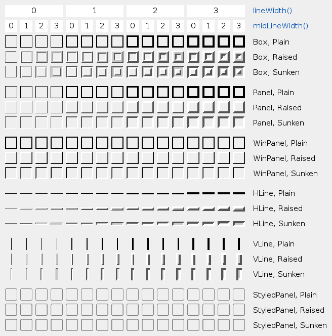
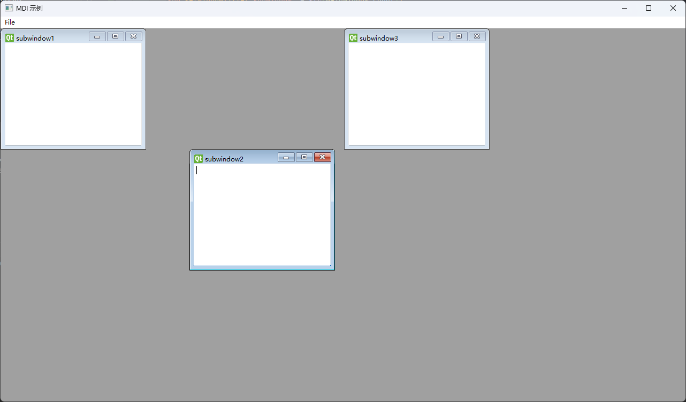
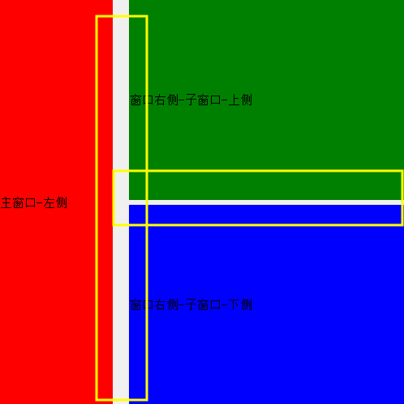
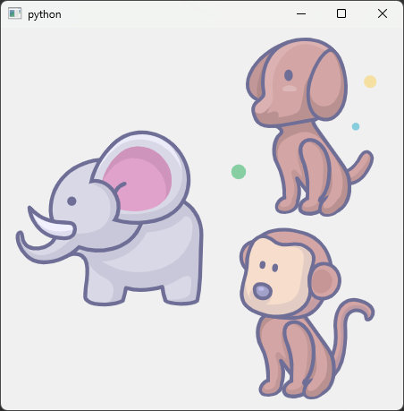
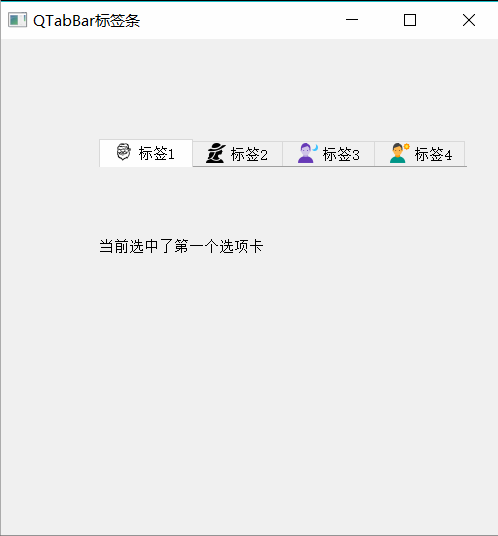
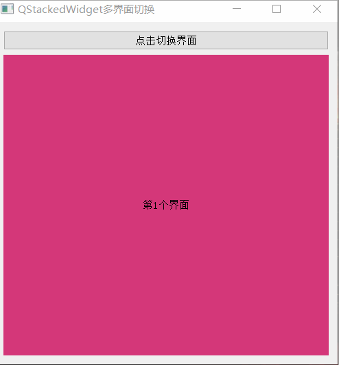
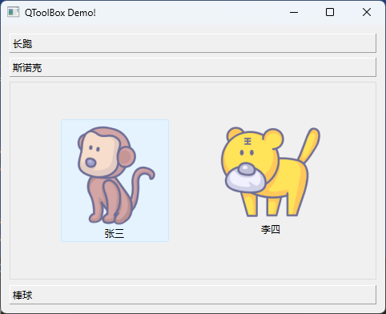

# 06.容器和容器控件


容器类控件不能输人输出数据,通常作为常用控件的载体,将常用控件"放置"到其内部。

容器控件对放到其内部的控件进行管理,并成为控件的父控件。

常用的容器控件如表所示:

| 容器控件类     | 中文名       |
| -------------- | ------------ |
| QGroupBox      | 分组框控件   |
| QFrame         | 框架控件     |
| QScrollArea    | 滚动区控件   |
| QTabWidget     | 切换卡控件   |
| QStackedWidget | 控件栈控件   |
| QToolBox       | 工具箱控件   |
| QWidget        | 容器窗口控件 |
| QMdiArea       | 多文档区     |
| QDockWidget    | 停靠窗口控件 |
| QAxWidget      | 插件窗口控件 |

## 框架控件(帧窗口)QFrame

框架控件 QFrame作为容器可以在其内部放置各种可视控件。

QFrame没有属于自己特有的信号和槽函数,一般不接受用户的输人,它只能提供一个外形.可以设置外形的样式线宽等。

QFrame作为父类被其他一些控件所继承,这些控件如QAbstractScrollArea、QLabel、QLCDNumber,QSplitter、QStackedWidget 和 QToolBox 等

### 框架控件QFrame的常用方法

框架控件QFrame是从QWidget类继承而来的用QFrame创建实例对象的常用方法如下所示,其中parent是窗口或者容器类控件,f用于设置控件的窗口类型可参考窗口flags的内容,默认值是QtWidget。

```python
from PySide6.QtWidgets import QFrame

QFrame(parent: Union[PySide6.QtWidgets.QWidget, NoneType]=None, 
       f: PySide6.QtCore.Qt.WindowType=Default(Qt.WindowFlags))
```

| QFrame的方法及参数类型                  | 返回值的类型  | 说明                                    |
| --------------------------------------- | ------------- | --------------------------------------- |
| setFrameShadow(QFrame.Shadow)           | None          | 设置QFrame窗口的阴影形式                |
| frameShadow()                           | QFrame.Shadow | 获取窗口的阴影形式                      |
| setFrameShape(QFrame.Shape)             | None          | 设置QFrame窗口的边框形状                |
| frameShape()                            | QFrame, Shape | 获取窗口的边框形状                      |
| setFrameStyle(int)                      | None          | 设置边框的样式                          |
| frameStyle()                            | int           | 获取边框的样式                          |
| setLineWidth(int)                       | None          | 设置边框线的宽度                        |
| lineWidth()                             | int           | 获取边框的宽度                          |
| setMidLineWidth(int)                    | None          | 设置边框线的中间线的宽度                |
| midLineWidth()                          | int           | 获取边框线的中间线的宽度                |
| frameWidth()                            | int           | 获取边框的宽度                          |
| setFrameRect(QRect)                     | None          | 设置边框线所在的范围                    |
| frameRect()                             | QRect         | 获取边框线所在的范围                    |
| drawFrame(QPainter)                     | None          | 绘制边框线                              |
| setLayout(QLayout)                      | None          | 设置框架中的布局                        |
| setGeometry(QRect)                      | None          | 设置QFrame控件左上角的位置和长 度、宽度 |
| setGeometry(x:int,y: int,w; int,h; int) |               |                                         |
| resize(QSize)、resize(w:int,h;int)      | None          | 设置QFrame控件的长度和宽度              |

- 框架主要由边框线构成,边框线由外线、内线和中间线构成。

  - 外线和内线的宽度可以通过setLineWidth(int)方法设置,
  - 中间线宽度可以通过 setMidLineWidth(int)方法设置,
  - 外线和内线的宽度通过 lineWidth()方法获取,
  - 中间线的宽度通过midLineWidth()方法获取,
  - 外线内线和中间线宽度通过 frameWidth()方法获取

- 通过给边框的内线、外线设置不同的颜色,可以让外框有凸起和凹陷的立体感觉

  - 用setFrameShadow(QFrameShadow)方法设置边框线的立体感觉,参数QFrameShadow可以取:
    - QFrame.Plain(平面)
    - QFrame.Raised(凸起)
    - QFrame.Sunken(凹陷)

- 外框线的形状

  - 通过 setFrameShape(QFrameShape)方法设置,其中参数QFrame.Shape是枚举类型可取值如表所示。

    | QFrame.Shape的取值 | 值   | 说明lacm                                   |
    | ------------------ | ---- | ------------------------------------------ |
    | QFrame.NoFrame     | 0    | 无边框,默认值                              |
    | QFrame.Box         | 1    | 矩形框,边框线内部不填充                    |
    | QFrame.Panel       | 2    | 面板,边框线内部填充                        |
    | QFrame.WinPanel    | 3    | Windows 2000风格的面板,边框线的宽度是2像素 |
    | QFrame.HLine       | 4    | 边框线只在中间有一条水平线(用作分隔线)     |
    | QFrame.VLine       | 5    | 边框线只在中间有一条竖直线(用作分隔线)     |
    | QFrame.StyledPanel | 6    | 依据当前GUI类型,画一个矩形面板             |

  - QFrame的frameStyle属性由frameShadow属性和frameShape属性决定,因此设置frameShadow和frameShape的值,就不需要再设置 frameStyle 的值了。将以上参数进行组合可以得到不同感觉的边框线。


QFreme样式图：



- 在界面上,经常在不同类型的控件之间划分一条横线或竖线。横线和竖线可以用QFrame来创建,方法是设置setFrameShape(QFrameHLine)或 setFrameShape(QFrameVLine)并结合 setGeometry()或resize()方法确定线的位置和尺寸

### 框架控件QFrame的应用实例

下面的程序将两组互斥的QRadioButton 分别放到两个 QFrame中,这两个QFrame又放到QGroupBox控件中。由于 QFrame 的边框线不可见,所以从外观上看,所有互斥的QRadioButton都放到了 QGroupBox控件中,但是选择时两组是可以分别选择的

```python
import sys
from PySide6.QtWidgets import QApplication, QWidget, QGroupBox, QFrame, QRadioButton, QHBoxLayout, QRadioButton, QHBoxLayout


class MyWidget(QWidget):
    def __init__(self, parent=None):
        super().__init__(parent)
        self.setWindowTitle("QFrame 的应用")
        self.resize(300, 100)
        self.setupUi()

    def setupUi(self):  # 创建界面上的控件
        self.r_1=QRadioButton("男")
        self.r_2=QRadioButton("女")
        self.r_3=QRadioButton("党员")
        self.r_4=QRadioButton("团员")
        self.r_5=QRadioButton("群众")
        self.frame_1=QFrame()
        self.frame_2=QFrame()

        self.h_layout_1=QHBoxLayout(self.frame_1)
        self.h_layout_1.addWidget(self.r_1)
        self.h_layout_1.addWidget(self.r_2)

        self.h_layout_2=QHBoxLayout(self.frame_2)
        self.h_layout_2.addWidget(self.r_3)
        self.h_layout_2.addWidget(self.r_4)
        self.h_layout_2.addWidget(self.r_5)

        self.groupBox=QGroupBox("选择基本信息", self)
        self.h_layout_3=QHBoxLayout(self.groupBox)
        self.h_layout_3.addWidget(self.frame_1)
        self.h_layout_3.addWidget(self.frame_2)

        self.r_1.setChecked(True)
        self.r_3.setChecked(True)


if __name__=='__main__':
    app=QApplication(sys.argv)
    win=MyWidget()

    win.show()
    sys.exit(app.exec())

```

## 滚动区域容器QScollArea

滚动区控件 QScrollArea 作为其他控件的容器当其内部的控件超过滚动区的尺寸时滚动区自动提供水平或竖直滚动条,通过拖动滚动条的位置,用户可以看到内部所有控件的内容。例如在滚动区中放置 QLabel控件,用QLabel控件显示图片,当QLabel显示的图片超过 QScrollArea 的范围时,通过拖动滚动条可以看到被挡住的图片。

用QScrollArea类创建实例对象的方法如下所示,其中 parent 是窗口或者容器类控件,它是从抽象类QAbstractScrollArea 继承而来的。

```python
from PySide6.QtWidgets import QScrollArea

QScrollArea(parent: Union[PySide6.QtWidgets.QWidget, NoneType]=None) -> None 
```

### 滚动区控件QScrollArea 的常用方法

滚动区控件QScrollArea 的常用方法

主要方法介绍如下:

- 必须用setWidget(QWidget)方法将某个控件设置成可滚动显示的控件,只有当该控件移出了滚动区控件的窗口,才能用滚动条移动控件。
- 用setAlignment(Qt.Alignment)方法设置QScrollArea 内部控件的对齐位置,其中参数 Qt.Alignment 可以取:
  - Qt.AlignCenter
  - Qt.AlignLeft
  - Qt.AlignHCenter
  - Qt.AlignRight
  - Qt.AlignTop
  - Qt.AlignVCenter
  - Qt.AlignBottom。
- 用setHorizontalScrollBarPolicy(Qt.ScrollBarPolicy)方法和 setVerticalScrollBarPolicy(QtScrollBarPolicy)方法设置竖直滚动条和水平滚动条出现的策略,其中参数 QScrollBarPolicy可以取:
  - QtScrollBarAsNeeded(根据情况自动决定何时出现滚动条)
  - Qt.ScrollBarAlwaysOf[(从不出现滚动条)
  - Qt.ScrollBarAlwaysOn(一直出现滚动条)。
- ensureVisible(x,y[,xmargin=50[,ymargin=50]])方法和ensureWidgetVisible(childWidget[,xmargin=50[;ymargin=50]])方法可以确保某个点或某个控件是可见的,如果无法使其可见,将会使距其最近的有效点可见。当点或控件可见时,点或控件距离边界的位置是xmargin和ymargin。

滚动区控件 QScrollArea 的常用方法如表所示,

| QScrollArea的方法及参数类型                                  | 说明                                                         |
| ------------------------------------------------------------ | ------------------------------------------------------------ |
| setWidget(QWidget)                                           | 将某个控件设置成可滚动显示的控件                             |
| widget()                                                     | 获取可滚动显示的控件                                         |
| setWidgetResizable(bool)                                     | 设置内部控件是否可调节尺寸,尽量不显示滚动条                  |
| widgetResizable()                                            | 获取内部控件是否可以调节尺寸                                 |
| setAlignment(Qt.Alignment)                                   | 设置内部控件在滚动区的对齐位置                               |
| aligament()                                                  | 返回内部控件在滚动区的对齐位置                               |
| ensureVisible(x:int,y:int,xmargin:int=50, ymargin:int=50)    | 自动移动滚动条的位置,确保(x,y)像素点是可见 的。可见时,点到边框的距离是xmargin 和 ymargin,默认距离是50个像素 |
| ensureWidgetVisible(childWidget: QWidget, xmargin: int=50,ymargin: int=50) | 自动移动滚动条的位置,确保控件childWidget是可 见的            |
| setHorizontalScrollBarPolicy(Qt.ScrollBarPolicy)             | 设置竖直滚动条的显示策略                                     |
| setVerticalScrollBarPolicy(Qt.ScrollBarPolicy)               | 设置水平滚动条的显示策略                                     |

### 滚动区控件QScrollArea的应用实例

```python
# -*- coding: UTF-8 -*-
# File date: Hi_2023/2/28 21:52
# File_name: 04-滚动区控件QScrollArea的应用实例.py
import sys
from PySide6.QtWidgets import QApplication, QWidget, QLabel, QHBoxLayout, QScrollArea
from PySide6.QtGui import QPixmap

from PySide6.QtCore import Qt


class MyWindow(QWidget):
    def __init__(self, parent=None):
        super().__init__(parent)
        self.setupUi()

    def setupUi(self):  # 建立界面上的控件
        self.resize(300, 300)
        self.scroArea = QScrollArea(self)

        label = QLabel(self.scroArea)
        pix = QPixmap("../../Resources/animal/m1.png")
        pix = pix.scaled(666, 666, Qt.AspectRatioMode.IgnoreAspectRatio)  # 调整图像大小

        label.resize(pix.width(), pix.height())  # 设置标签的宽度和高度
        label.setPixmap(pix)

        self.scroArea.ensureVisible(150, 100)  # 设置可滚动显示的控件
        self.scroArea.setHorizontalScrollBarPolicy(Qt.ScrollBarAsNeeded)  # 设置对齐方式
        self.scroArea.setWidget(label)  # 设置可见点
        self.scroArea.setAlignment(Qt.AlignCenter)  # 设置显示策略
        self.scroArea.setVerticalScrollBarPolicy(Qt.ScrollBarAsNeeded)  # 设置显示策略
        self.h = QHBoxLayout(self)  # 布局
        self.h.addWidget(self.scroArea)


if __name__ == '__main__':
    app = QApplication(sys.argv)
    win = MyWindow()

    win.show()
    sys.exit(app.exec())

```


## 多文档区QMdiArea

用QMainWindow 建立的主界面,通常会同时建立或打开多个相互独立的文档,这些文档共享主界面的菜单、工具栏和停靠控件,多文档中只有一个文档是活跃的文档,菜单和工具栏的操作只针对当前活跃的文档。

主界面要实现多文档操作需要用QMdiArea控件,通常把QMdiArea 定义成中心控件。

可以在QMdiArea 控件中添加多个子窗口QMdiSubWindow,通常每个子窗口都有相同的控件,当然控件也可以不相同,这时代码会比较复杂。

QMdiArea 是从抽象类QAbastractScrollArea 继承而来的

```python
from PySide6.QtWidgets import QMdiArea

QMdiArea(parent: Union[PySide6.QtWidgets.QWidget, NoneType]=None) -> None 
```

### 多文档区QMdiArea的常用方法

多文档区QMdiArea常用方法方法介绍如下:

- 用QMdiArea 的addSubWindow(QWidget,Qt.WindowFlags)方法可以往多文档区中添加子窗口,并返回子窗口,参数QWidget 可以是子窗口,也可以是其他控件,如果是其他控件,则先创建其他控件,然后在子窗口上添加该控件；
  - QMdiArea中的子窗口类型是QMdiSubWindow的实例，但可以使用addSubWindow()方法将任何QWidget或其派生类的实例添加到MDI区域作为子窗口，此时QMdiArea会自动创建子窗口的QMdiSubWindow实例，并作为addSubWindow()方法的结果返回。

- 用removeSubWindow(QWidget)方法可以从多文档中移除子窗口或子窗口上的控件,使用该方法子窗口或控件并没有真正删除,其父窗口变成 None。如果移除的是控件,则控件所在的子窗口并没有被移除。
- 用QMdiArea 的setViewMode(QMdiArea.ViewMode)方法可以设置多文档区中子窗口的显示模式,其中参数 QMdiArea.ViewMode 可 以取:

  - QMdiArea.SubWindowView(子窗口视图)
  - QMdiArea.TabbedView(Tab标签视图),这两种视图的样式如图所示。
- 在子窗口视图模式下,可以随意缩放和拖动窗口,还可以设置子窗口的排列形式。用cascadeSubWindows()方法可以设置子窗口为层叠排列显示,用tileSubWindows()方法可以设置子窗口为平铺排列显示,这两种排列形式如图所示。
- 用QMdiArea 的currentSubWindow()方法可以获得当前子窗口,如果没有子窗口或活跃窗口,则返回值是 None;用setActiveSubWindow(QMdiSubWindow)方法可以使某个子窗口变成活跃窗口。
- 如果用户在界面上单击某个子窗口,则单击的子窗口变成活跃窗口。如果用代码使某个窗口活跃,则要考虑子窗口的顺序。

  - setActivationOrder(QMdiArea.WindowOrder)方法可以设置子窗口的活跃顺序的规则,其中参数QMdiArea.WindowOrder 可以取:
    - QMdiArea.CreationOrder(创建 顺序)
    - QMdiArea.StackingOrder(堆放顺序)
    - QMdiArea.ActivationHistoryOrder(历史活跃顺序);
  - 用activateNextSubWindow()方法和activatePreviousSubWindow()方法可以按照活跃顺序分别激活下一个子窗口和前一个子窗口
  - subWindowList(QMdiArea.WindowOrder)方法可以按照指定的顺序获取子窗口的列表List[QMdiSubWindowJ。
- 用QMdiArea 的setOption(QMdiArea.AreaOption,bool)方法可以设置子窗口在活跃时的状态,其中参数QMdiArea.AreaOption 只有一个取值 `QMdiArea.DontMaximizeSubWindowOnActivation`,在子窗口变成活跃窗口时不进行最大化显示。
- 子窗口数量
  - QMdiArea中的子窗口数量无法直接通过QMdiArea方法获取，必须先通过方法subWindowList()返回所有子窗口的列表，再通过Python的len函数获取子窗口的数量。

- 

多文档区QMdiArea常用方法:

| QMdiArea的方法及参数类型                                     | 返回值的类型           | 说明                                 |
| ------------------------------------------------------------ | ---------------------- | ------------------------------------ |
| addSubWindow(QWidget.Qt.WindowFlags)                         | QMdiSubWindow          | 用控件创建一个子窗口,并返回子窗口    |
| removeSubWindow(QWidget)                                     | None                   | 移除控件所在的子窗口                 |
| setViewMode(QMdiArea.ViewMode)                               | None                   | 设置子窗口在QMdiArea中的显示样式     |
| viewMode()                                                   | QMdiArea.ViewMode      | 获取子窗口的显示样式                 |
| [slot]cascadeSubWindows()                                    | None                   | 层叠显示子窗口                       |
| [slot]tileSubWindows()                                       | None                   | 平铺显示子窗口                       |
| [slot]closeActiveSubWindow()                                 | None                   | 关闭活跃的子窗口                     |
| [slot]closeAllSubWindows()                                   | None                   | 关闭所有的子窗口                     |
| currentSubWindow()                                           | QMdiSubWindow          | 获取当前的子窗口                     |
| scrollContentsBy(dx: int,dy:int)                             | None                   | 移动子窗口中的控件                   |
| setActivationOrder(QMdiArea.WindowOrder)                     | None                   | 设置子窗口的活跃顺序                 |
| activationOrder()                                            | QMdiArea.WindowOrder   | 获取活跃顺序                         |
| subWindowList(QMdiArea.WindowOrder=QMdiArea.                 | List[QMdiSubWindowJ    | 按照指定的顺序获取子窗口列表         |
| CreationOrder)[slot]activateNextSubWindow()                  | None                   | 激活下一个子窗口                     |
| [slot]activatePreviousSubWindow()                            | None                   | 激活前一个子窗口                     |
| [slot]setActiveSubWindow                                     | None                   | 设置活跃的子窗口                     |
| (QMdiSubWindow) activeSubWindow()                            | QMdiSubWindow          | 获取活跃的子窗口                     |
| setBackground(Union[QBrush, QColor,Qt.GlobalColor,QGradient]) | None                   | 设置背景颜色,默认是灰色              |
| background()                                                 | QBrush                 | 获取背景色画刷                       |
| setOption(QMdiArea.AreaOption, bool)                         | None                   | 设置子窗口的模式                     |
| testOption(QMdiArea.AreaOption)                              | bool                   | 获取是否设置了选项                   |
| setTabPosition(QTabWidget.TabPosition)                       | None                   | 设置Tab 标签的位置                   |
| setTabShape(QTabWidget.TabShape)                             | None                   | 设置Tab标签的形状                    |
| setTabsClosable(bool)                                        | None                   | Tab 模式时设置Tab 标签是否有关闭按钮 |
| setTabsMovable(bool)                                         | None                   | Tab 模式时设置Tab 标签是否可移动     |
| setDocumentMode(bool)                                        | None                   | Tab 模式时设置Tab 标签是否文档模式   |
| documentMode()                                               | bool                   | Tab 模式时获取Tab 标签是否文档模式   |
| tabPosition()                                                | QTabWidget.TabPosition | 获取 Tab标签的位置                   |
| tabShape()                                                   | QTabWidget.TabShape    | 获取 Tab标签的形状                   |
| tabsClosable()                                               | bool                   | 获取 Tab标签上是否有关闭按钮         |
| tabsMovable()                                                | bool                   | 获取 Tab标签是否可移动               |

### 多文档区 QMdiArea 的信号

多文档区QMdiArea只有一个信号 `subWindowActivated(QMdiSubWindow)`,当子窗口活跃时发送该信号。


### 实例



```python
# -*- coding: UTF-8 -*-
# File date: Hi_2023/2/28 22:59
# File_name: demo.py

import sys
from PySide6.QtCore import *
from PySide6.QtGui import *
from PySide6.QtWidgets import *


class MainWindow(QMainWindow):
    count = 0

    def __init__(self, parent=None):
        super(MainWindow, self).__init__(parent)
        self.mdi = QMdiArea()
        self.setCentralWidget(self.mdi)
        # 添加菜单栏
        bar = self.menuBar()
        file = bar.addMenu("File")
        file.addAction("New")
        file.addAction("cascade")
        file.addAction("Tiled")
        file.triggered[QAction].connect(self.windowaction)
        self.setWindowTitle("MDI 示例")

    def windowaction(self, q):
        # 通过点击不同的按钮实现不同布局的显示方式
        if q.text() == "New":
            MainWindow.count = MainWindow.count + 1
            sub = QMdiSubWindow()
            sub.setWidget(QTextEdit())
            sub.setWindowTitle("subwindow" + str(MainWindow.count))
            self.mdi.addSubWindow(sub)
            sub.show()
        if q.text() == "cascade":
            self.mdi.cascadeSubWindows()
        if q.text() == "Tiled":
            self.mdi.tileSubWindows()


if __name__ == '__main__':
    app = QApplication(sys.argv)
    demo = MainWindow()
    demo.show()
    sys.exit(app.exec())

```


## 分割容器QSplitter



分割器控件QSplitter 中可以加人多个控件,在两个相邻的控件之间自动用一个分隔条把这两个控件分开,可以拖拽分割条改变它的位置。

分割器可以分为水平分割和竖直分割两种,分割器中还可以加入其他分割器,这样形成多级分割。只能往分割器中加控件,不能直接加布局。分割器的外观如图所示。

在往窗体或布局中添加分割器控件时,应以控件形式而不能以布局形式加入,因此应该将分割器当成控件而不是布局。

QSplitter 继承自QFrame。用QSplitter 类创建实例对象的方法如下所示其中 parent是窗口或容器控件;Qt.Orientation 是分方向,可以取 Qt.Vertical或 Qt.Horizontal。

```python
from PySide6.QtWidgets import QSplitter

QSplitter(arg__1: PySide6.QtCore.Qt.Orientation, parent: Union[PySide6.QtWidgets.QWidget, NoneType]=None) -> None
QSplitter(parent: Union[PySide6.QtWidgets.QWidget, NoneType]=None) -> None 
```

### 分割器控件QSplitter 的常用方法

分割器控件 QSplitter 的常用方法如表所示,主要方法介绍如下。

- 控件添加

  - 用addWidget(QWidget)方法在末尾添加控件;

  - 用insertWidget(index:int, QWidget)方法插人控件,不能添加布局;

  - 用replaceWidget(index:int,QWidget)方法替换指定索引的控件;

  - 用widget(index:int)方法获取索引值是index的控件;

  - 用indexOf(QWidget)方法获取指定控件的索引值

  - 用count()方法获取控件的数量。

- 分割方向

  - 用setOrientation(Qt.Orientation)方法设置分制方向;
  - 用setOpaqueResize(bool)方法设置移动分割条时,是否是动态显示的,动态显示时控件随鼠标的移动进行缩放,非动态显示时释放鼠标后才缩放控件。

- 用setChildrenCollapsible(bool)和 setCollapsible(int,bool)方法设置控件是否是可以折叠的,在折叠情况下,两个分隔条可以合并在一起。

| QSplitter的方法及参数类型           | 说 明                                                        |
| ----------------------------------- | ------------------------------------------------------------ |
| addWidget(QWidget)                  | 在末尾添加控件                                               |
| insertWidget(index:int,QWidget)     | 在指定索引位置插人控件                                       |
| widget(index: int)                  | 获取指定索引的控件                                           |
| replaceWidget(index:int,QWidget)    | 替换指定索引的控件                                           |
| count()                             | 获取控件的数量                                               |
| indexOf(QWidget)                    | 获取控件的索引值                                             |
| setOrientation(Qt.Orientation)      | 设置分割方向                                                 |
| orientation()                       | 获取分割方向                                                 |
| setOpaqueResize(bool)               | 设置拖动分隔条时,是否是动态的                                |
| setStretchFactor(index:int,stretch) | 设置分割区在窗口缩放时的缩放系数                             |
| setHandJeWidth(int)                 | 设置分隔条的宽度                                             |
| setChildrenCollapsible(bool)        | 设置内部控件是否可以折叠,默认为True                          |
| setCollapsible(index:int, bool)     | 设置索引号为int的控件是否可以折叠                            |
| setSizes(list: Sequence[int])       | 使用可迭代序列(列表、元组等)设置内部控件的宽度(水平分 割)或高度(竖直分割) |
| sizes()                             | 获取分割器中控件的宽度(水平分割)列表或高度(竖直分割) 列表    |
| setRubberBand(position:int)         | 设置橡皮筋到指定位置,如果分割条不是动态的,则会看到橡 皮筋    |
| moveSplitter(pos:int,index; int)    | 将索引为index的分割线移到pos处                               |
| getRange(index;int)                 | 获取索引为int的分割线的可调节范围,返回元组                   |
| saveState()                         | 保存状态到QByteArray                                         |
| restoreState(QByteArray)            | 恢复保存的状态                                               |

### 分割器控件QSplitter 的信号

分割器控件QSplitter 只有一个信号 splitterMoved(pos:int,index;int),当分隔条移动时发送信号,信号的参数是分割条的位置和索引值。

### 分割器控件QSplitter 的应用实例

下面的程序用两个 QSplitter 分割器将窗日分成三部分,每部分显示一个图片。



```python
# -*- coding: UTF-8 -*-
# File date: Hi_2023/2/28 21:53
# File_name: 01-分割器控件QSplitter 的应用实例.py
from PySide6.QtWidgets import QApplication, QWidget, QSplitter, QLabel, QHBoxLayout
from PySide6.QtCore import Qt
import sys
from PySide6.QtGui import QPixmap


class MyWindow(QWidget):
    def __init__(self, parent=None):
        super().__init__(parent)
        self.widget_setupUi()

    def widget_setupUi(self):  # 建立主程序界面
        label_1 = QLabel()
        label_2 = QLabel()
        label_3 = QLabel()

        label_1.setPixmap(QPixmap('../../Resources/animal/m1.png'))
        label_2.setPixmap(QPixmap('../../Resources/animal/m2.png'))
        label_3.setPixmap(QPixmap('../../Resources/animal/m3.png'))

        splitter_H = QSplitter(Qt.Orientation.Horizontal)
        splitter_V = QSplitter(Qt.Orientation.Vertical)
        h = QHBoxLayout(self)
        h.addWidget(splitter_H)
        splitter_H.addWidget(label_1)
        splitter_H.addWidget(splitter_V)
        splitter_V.addWidget(label_2)
        splitter_V.addWidget(label_3)


if __name__ == '__main__':
    app = QApplication(sys.argv)
    win = MyWindow()

    win.show()
    sys.exit(app.exec())

```

## 切换卡控件QTabWidget



切换卡控件QTabWidget 由多页卡片构成,每页卡片就是一个窗口(QWidget)。

可以将不同的控件放到不同的卡片上,这样可以节省界面资源。切换卡控件的外观如图所示,当无法显示全部卡片时,可单击右上角显示滚动按钮。

切换卡控件继承自QWidget。用QTabWidget类创建实例对象的方法如下所示,其中parent 是窗口或者容器类控件。

```python
from PySide6.QtWidgets import QTabWidget

QTabWidget(parent: Union[PySide6.QtWidgets.QWidget, NoneType]=None) -> None 
```

### 切换卡控件QTabWidget 的常用方法

切换卡控件QTabWidget 的常用方法如表所示主要方法介绍如下。

切换卡的每页卡片都是一个窗口(QWidget)或者从QWidget继承的可视化子类因此添加卡片时,需要实例化的QWidget。

- QTabWidget 添加卡片的方法是 addTab(QWidget,label:str)和 addTab(QWidget,QIcon,label:str)

  - QWidger 是继承自QWidget 的实例
  - label是卡片标题的名称,可以在名称中添加"&"和字母设置快捷键;
  - QIcon 是卡片的图标,
  - 卡片的索引从0开始。

- 在某个位置插入卡片用insertTab(index; int,QWidget,label: str)和 insertTab(index: int,QWidget,QIcon,str)方法;

- 删除所有卡片用clear()方法;

- 删除索引号是int 的卡片用removeTab(index:int)方法;

- 卡片标题可以用setTabText(index:int,str)方法设置,其中参数index是卡片的索引。

- 卡片标题栏可以放到上、下左、右位置

  - 卡片标题的位置用setTabPosition(QTabWidget TabPosition)方法设置,其中参数 QTabWidget.TabPosition 可以取:
    - QTabWidget.North 上
    - QTabWidget.South 下
    - QTabWidget.East 右
    - QTabWidget.West 左。

- 标题栏的位置如图所示

  - 可以用tabPosition()方法获取标题栏的位置。

- 卡片标题栏的形状

  - 用setTabShape(QTabWidget,TabShape)方法定义,其中参数QTabWidget.TabShape可以取 :
    - QTabWidget.Rounded 圆角
    - QTabWidget.Triangular 三角形
  - 用tabShap()方法可以获取标题栏的形状。

- 如果显示标题栏文字的空间不足,可以用省略号来表示。

  - 用setElideMode(Qt.TextElideMode)方法设置卡片标题栏文字在显示空间不足时的省略号显示方式,其中参数 Qt.TextElideMode 可以取:
    - Qt.ElideNone 没有省略号
    - Qt.ElideLeft 省略号在左边
    - Qt.ElideMiddle 省略号在中间
    - Qt.ElideRight 省略号在右边

- 当卡片较多时,父窗口中无法显示出所有的卡片标题,这时可以用滚动条来显示出被隐藏的卡片。

  - 用setUsesScrollButtons(bool)方法设置是否有滚动按钮。每页卡片显示时,默认为有框架并呈立体形状显示在父窗口上。
  - 用setDocumentMode(bool)方法设置卡片是否有框架,如果没有框架,则卡片上内容与父窗口看起来是一个整体。

- 当setTabsClosable(bool)为 True 时,卡片的标题栏上显示关闭标识,单击该关闭标识,可发送tabCloseRequested(int)信号。

- 用setCornerWidget(QWidget,Qt.Corner)方法可以在 QTabWidget 的右上角下角、左上角和左下角处放置控件,例如放置标签、单击按钮等,其中参数 Qt.Corner 可以取:

  - Qt.TopRightCorner
  - Qt.BottomRightCorner
  - Qt.TopLeftCorner
  - Qt.BottomLeftCorner

  用cornerWidget(Qt.Corner)方法可以获取角上的控件

- 用setTabBarAutoHide(bool)方法可以设置当只有1张卡片时,卡片标题是否自动隐藏。

| QTabWidget的方法及参数类型               | 返回值的类型 | 说 明                                    |
| ---------------------------------------- | ------------ | ---------------------------------------- |
| addTab(QWidget,label:str)                | int          | 在末尾添加新卡片                         |
| addTab(QWidget,QIcon,label: str)         | int          | 在末尾添加新卡片                         |
| insertTab(index: int,QWidget,label; str) | int          | 在索引int处插入卡片                      |
| insertTab(index: int,QWidget,QIcon,str)  | int          | 在索引int处插入卡片                      |
| widget(index:int)                        | QWidget      | 根据索引获取卡片窗口                     |
| clear()                                  | None         | 清空所有卡片                             |
| count()                                  | int          | 获取卡片数量                             |
| indexOf(QWidget)                         | int          | 获取窗口对应的卡片索引号                 |
| removeTab(index: int)                    | None         | 根据索引移除卡片                         |
| setCornerWidget(QWidget,Qt.Corner)       | None         | 在角上设置控件                           |
| cornerWidget(Qt.Corner)                  | QWidget      | 获取角位置处的控件                       |
| [slot]setCurrentIndex(index;int)         | None         | 根据索引设置当前卡片                     |
| currentIndex()                           | int          | 获取当前卡片的索引号                     |
| [slot]setCurrentWidget(QWidget)          | None         | 将窗口控件是 QWidget的卡片设置成当前卡片 |
| currentWidget()                          | QWidget      | 获取当前卡片的窗口                       |
| setDocumentMode(bool)                    | None         | 设置卡片是否为文档模式                   |
| documentMode()                           | bool         | 获取卡片是否为文档模式                   |
| setElideMode(Qt.TextElideMode)           | None         | 设置卡片标题是否为省略模式               |
| setlconSize(QSize)                       | None         | 设置卡片图标的尺寸                       |
| iconSize()                               | QSize        | 获取卡片图标的尺寸                       |
| setMovable(bool)                         | None         | 设置卡片之间是否可以交换位置             |
| isMovable()                              | bool         | 获取卡片是否可以交换位置                 |
| setTabBarAutoHide(bool)                  | None         | 设置卡片标题是否自动隐藏                 |
| tabBarAutoHide()                         | bool         | 获取标题是否可以自动隐藏                 |
| setTabEnabled(index:int,bool)            | None         | 设置是否将索引为int的卡片激活            |
| isTabEnabled(index:int)                  | bool         | 获取索引为int的卡片是否激活              |
| setTabIcon(index:int,QIcon)              | None         | 设置索引为int的卡片的图标                |
| tabIcon(index:int)                       | QIcon        | 获取索引为int的卡片的图标                |
| setTabPosition(QTabWidget.TabPosition)   | None         | 设置标题栏的位置                         |
| setTabShape(QTabWidget.TabShape)         | None         | 设置标题栏的形状                         |
| setTabText(index:int,str)                | None         | 根据索引设置卡片的标题名称               |
| tabText(index:int)                       | str          | 获取卡片标题的名称                       |
| setTabToolTip(index:int,str)             | None         | 根据索引设置卡片的提示信息               |
| tabToolTip(index:int)                    | Str          | 获取卡片的提示信息                       |
| setVisible(bool)                         | None         | 设置切换卡是否显示                       |
| setTabsClosable(bool)                    | None         | 设置卡片标题上是否有关闭标识             |
| tabsClosable()                           | bool         | 获取卡片是否可以关闭                     |
| setUsesScrollButtons(bool)               | None         | 设置是否可以有滚动按钮                   |
| usesScrollButtons()                      | bool         | 获取是否有滚动按钮                       |

### 切换卡控件QTabWidget的信号

切换卡控件QTabWidget的信号如表所示

| QTabWidget 的信号及参数类型     | 说明                         |
| ------------------------------- | ---------------------------- |
| currentChanged(index: int)      | 当前卡片改变时发送信号       |
| tabBarClicked(index:int)        | 单击卡片的标题时发送信号     |
| tabBarDoubleClicked(index: int) | 双击卡片的标题时发送信号     |
| tabCloseRequested(index: int)   | 单击卡片的关闭标识时发送信号 |

### 实例

```python
import sys
from PySide6.QtCore import *
from PySide6.QtGui import *
from PySide6.QtWidgets import *
import os

os.chdir(os.path.dirname(__file__))


class TabDemo(QWidget):
    def __init__(self, parent=None):
        super(TabDemo, self).__init__(parent)
        self.tabWidget = QTabWidget(self)
        self.tab1 = QWidget()
        self.tab2 = QWidget()
        self.tab3 = QWidget()
        self.tabWidget.addTab(self.tab1, "Page 0")
        self.tabWidget.insertTab(1, self.tab2, "Page 1")
        self.tabWidget.addTab(self.tab3, "Page 2")
        self.tab1Init()
        self.tab2Init()
        self.tab3Init()

        # 修改选项卡默认信息
        self.tabWidget.setTabShape(self.tabWidget.TabShape.Triangular)
        self.tabWidget.setTabPosition(self.tabWidget.TabPosition.South)

        pageComboBox = QComboBox()
        pageComboBox.addItem("Goto Page 0")
        pageComboBox.addItem("Goto Page 1")
        pageComboBox.addItem("Goto Page 2")
        # 导航与页面链接
        pageComboBox.activated.connect(self.tabWidget.setCurrentIndex)

        vlayout = QVBoxLayout(self)
        self.label = QLabel('用来显示信息')
        vlayout.addWidget(pageComboBox)
        vlayout.addWidget(self.label)
        vlayout.addWidget(self.tabWidget)
        self.setLayout(vlayout)

        self.setWindowTitle("QTabWidget 例子")
        self.resize(400, 200)

        self.tabWidget.currentChanged.connect(self.tabChanged)

    def tab1Init(self):
        layout = QFormLayout()
        line1 = QLineEdit()
        line2 = QLineEdit()
        layout.addRow("姓名", line1)
        layout.addRow("电话", line2)
        self.tab1.setLayout(layout)
        self.tabWidget.setTabText(0, "联系方式")
        line1.editingFinished.connect(lambda: self.label.setText(f'page0，更新了姓名：{line1.text()}'))
        line2.editingFinished.connect(lambda: self.label.setText(f'page0，更新了电话：{line2.text()}'))

    def tab2Init(self):
        layout = QFormLayout()
        sex = QHBoxLayout()
        radio1 = QRadioButton("男")
        radio2 = QRadioButton("女")
        sex.addWidget(radio1)
        sex.addWidget(radio2)
        layout.addRow(QLabel("性别"), sex)
        line = QLineEdit()
        layout.addRow("教育程度", line)
        self.tab2.setLayout(layout)
        self.tabWidget.setTabText(1, "个人信息")
        self.tabWidget.setTabToolTip(1, '更新：个人信息')
        self.tabWidget.setTabIcon(1, QIcon(r'images/cartoon1.ico'))
        self.tabWidget.tabBar().setTabTextColor(1, QColor(40, 120, 120))

        radio1.clicked.connect(lambda: self.label.setText('page 1 更新了性别:男'))
        radio2.clicked.connect(lambda: self.label.setText('page 1 更新了性别:女'))
        line.editingFinished.connect(lambda: self.label.setText(f'page1，更新了教育程度：{line.text()}'))

    def tab3Init(self):
        layout = QHBoxLayout()
        check1 = QCheckBox('一等奖')
        check2 = QCheckBox('二等奖')
        check3 = QCheckBox('三等奖')
        layout.addWidget(check1)
        layout.addWidget(check2)
        layout.addWidget(check3)
        self.tab3.setLayout(layout)
        self.tabWidget.setTabText(2, "获奖情况")
        self.tabWidget.setTabToolTip(2, '更新：获奖情况')
        self.tabWidget.setTabIcon(2, QIcon(r'images/bao13.png'))
        self.tabWidget.tabBar().setTabTextColor(2, 'red')

        _dict = {0: False, 2: True, 1: True}
        check1.stateChanged.connect(lambda x: self.label.setText(f'page2，更新了“1等奖”获取情况：{_dict[x]}'))
        check2.stateChanged.connect(lambda x: self.label.setText(f'page2，更新了“2等奖”获取情况：{_dict[x]}'))
        check3.stateChanged.connect(lambda x: self.label.setText(f'page2，更新了“3等奖”获取情况：{_dict[x]}'))

    def tabChanged(self, index: int):
        a = self.tabWidget.currentWidget()
        text = self.tabWidget.tabBar().tabText(index)
        self.label.setText(f'切换到页面{index},{text}')


if __name__ == '__main__':
    app = QApplication(sys.argv)
    demo = TabDemo()
    demo.show()
    sys.exit(app.exec())

```


## 控件栈,层次容器QStackedWidget



控件栈控件QStackedWidget与QTabWidget 在功能上有些相似。

控件栈也是包含多个窗口的控件,但是与QTabWidget不同的是,控件栈不是通过卡片管理窗口控件,而是根据需要从多个控件中选择某个窗口作为当前窗口,当前窗口是要显示的窗口,而不是当前的窗口不显示。

QStackedWidget 通常与 QComboBox和QListWidget等控件一起使用,当选择QComboBox或QListWidget 中的某项(Item)内容时,从QStackedWidget 中显示与之相关的某个窗口界面。

QStackedWidget类是从QFrame继承而来的。用QStackedWidget 类创建实例对象的方法如下所示其中parent 是窗口或者容器类控件。

```python
from PySide6.QtWidgets import QStackedWidget

QStackedWidget(parent: Union[PySide6.QtWidgets.QWidget, NoneType]=None) -> None
```

### 控件栈控件QStackedWidget的常用方法

控件栈控件QStackedWidget 的常用方法如表示。

- 控件栈通过 addWidget(QWidget)方法添加窗口,根据窗口添加的顺序,窗口的索引值从0开始逐渐增加。

- 用insertWidget(index:int;QWidget)方法可以插人新窗口插入的窗口的索引值是int,如果需要把某个窗口显示出来,需要将窗口设置为当前窗口。
- 设置当前窗口的方法是SetCurrentWidget(QWidget)或 setCurrentIndex(index:int)可以将指定的窗口或索引值是int的窗口设置成当前窗口。

| QStackedWidget的方法及参数类型   | 返回值的类型 | 说明                              |
| -------------------------------- | ------------ | --------------------------------- |
| addWidget(QWidget)               | int          | 在末尾添加窗口,并返回索引值       |
| insertWidget(index:int,QWidget)  | int          | 插入新窗口,插入的窗口索引值是int  |
| [slof]setCurrentWidget(QWidget)  | None         | 将指定的窗口设置成当前窗口        |
| [slot]setCurrentIndex(index:int) | None.        | 将索引值是int的窗口设置成当前窗口 |
| widget(index:int)                | QWidget      | 获取索引值是int的窗口             |
| currentIndex()                   | int          | 获取当前窗口的索引值              |
| currentWidget()                  | QWidget      | 获取当前的窗口                    |
| indexOf(QWidget)                 | int          | 获取指定窗口的索引值              |
| removeWidget(QWidget)            | None         | 移除窗口                          |
| count()                          | int          | 获取窗口数量                      |

### 控件栈控件QStackedWidget的信号

控件栈控件QStackedWidget 的信号有 currentChanged(index:int)和widgetRemoved(index:int)

- 当前窗口发生变化时发送currentChanged(index:int)信号
- 移除窗口时发送widgetRemoved(index:int)信号。


### QStackedWidget例子

```python
# -*- coding: UTF-8 -*-
# File date: Hi_2023/3/19 2:08
# File_name: 01-QStackedWidget实例.py


import sys
from PySide6.QtWidgets import *


class QStackedWidgetDemo(QMainWindow):
    def __init__(self):
        super(QStackedWidgetDemo, self).__init__()

        self.resize(400, 150)
        # 设置窗口标题
        self.setWindowTitle("QStackedWidgetDemo")

        # 创建列表窗口，添加条目
        listWidget = QListWidget()
        listWidget.insertItem(0, '联系方式')
        listWidget.insertItem(1, '个人信息')
        listWidget.insertItem(2, '教育程度')
        listWidget.currentRowChanged.connect(self.rowChanged)

        # 创建三个小控件
        stack1 = QLabel('标签一', self)
        stack2 = QLabel('标签二', self)
        stack3 = QLabel('标签三', self)

        # 在QStackedWidget对象中填充了三个子控件
        self.stackedWidget = QStackedWidget(self)
        self.stackedWidget.addWidget(stack1)
        self.stackedWidget.addWidget(stack2)
        self.stackedWidget.addWidget(stack3)

        layout = QHBoxLayout()
        layout.addWidget(listWidget)
        layout.addWidget(self.stackedWidget)

        mainFrame = QWidget()
        mainFrame.setLayout(layout)
        self.setCentralWidget(mainFrame)

    def rowChanged(self, i):
        self.stackedWidget.setCurrentIndex(i)


if __name__ == '__main__':
    app = QApplication(sys.argv)
    main = QStackedWidgetDemo()
    main.show()
    sys.exit(app.exec())

```


## 分组容器QGroupBox

分组框控件 QGroupBox 通常是其他控件的容器,将一组意义相同或者一组互斥的QRadioButton 控件放到 QGroupBox 中。QGroupBox 通常带有一个边框和一个标题栏标题栏上可以有勾选项,标题栏可以放到左边、中间或右边。分组框控件的外观如图 2-29 所示。布局时 QGroupBox 可用作一组控件的容器,内部使用布局控件(如 QBoxLayout)进行布局。

用QGroupBox类创建实例对象的方法如下所示。用QGroupBox类创建实例对象的方法如下所示。

- parent 是窗口或者容器类控件
- title是控件上显示的文字

```python
from PySide6.QtWidgets import QGroupBox

QGroupBox(parent: Union[PySide6.QtWidgets.QWidget, NoneType]=None) -> None
QGroupBox(title: str, parent: Union[PySide6.QtWidgets.QWidget, NoneType]=None) -> None
```

### 分组框控件QGroupBox的常用方法

分组框控件QGroupBox的常用方法如表所示。

- 用setTitle(str)方法可以设置分组框的标题名称;用title()方法可以获取标题名称
- 用setCheckable(bool)方法可以设置标题栏上是否有勾选项;
- 用setAlignment(QAlignment)方法可以设置标题栏的对齐位置,其中参数 Qt.Alignment 可以取:
  - Qt.AlignLeft 把标题栏放到左边
  - QtAlignRight 把标题栏放到右边
  - Qt.AlignHCenter 把标题栏放到中间;
- 用setGeometr(QRect)方法可以设置分组框在父容器中的位置宽度和高度;
- 用resize(QSize)方法设置分组框的宽度和高度。
- 创建分组框控件后,如果要往分组框中添加其他控件,可以在创建控件对象时将其parent 参数设置成QGroupBox 的实例对象,或者用控件的 setParent(QWidget)方法设置控件所在的容器。对其他容器类控件,添加控件的操作方法相同。也可以先创建布局,将控件放到布局中,然后用分组框的 setLayout(QLayout)方法将布局添加到分组框中。

| QGroupBox的方法及参数类型                                | 返回值的类型 | 说明                                    |
| -------------------------------------------------------- | ------------ | --------------------------------------- |
| set Title(str)                                           | None         | 设置标题的名称                          |
| title()                                                  | Str          | 获取标题的名称                          |
| setFlat(bool)                                            | None         | 设置是否处于扁平状态                    |
| isFlat()                                                 | bo0l         | 获取是否处于扁平状态                    |
| setCheckable(bool)                                       | None         | 设置标题栏上是否有勾选项                |
| isCheckable()                                            | bool         | 获取是否有勾选项                        |
| [slot]setChecked(bool)                                   | None         | 设置是否处于勾选状态                    |
| isChecked()                                              | bool         | 获取勾选项是否处于勾选状态              |
| setAlignment(Qt.Alignment)                               | None         | 设置标题栏的对齐位置                    |
| alignment()                                              | Qt.Alignment | 获取标题栏的对齐位置                    |
| setGeometry(QRect) setGeometry(x:int,y:int,w: int,h:int) | None         | 设置分组框在父容器中的位置、宽度 和高度 |
| resize(QSize) resize(w: int,h:int)                       | None         | 设置分组框的宽度和高度                  |
| setLayout(QLayout)                                       | None         | 设置分组框中的布局                      |

### 分组框控件的信号

分组框控件的信号有 clicked(),clicked(bool)和 toggled(bool)

- 有勾选项时,切换勾选状态时的信号 toggled(bool)。

### QGroupBox例子

```python
# -*- coding: UTF-8 -*-
# File date: Hi_2023/2/28 22:59
# File_name: demo.py


import sys
from PySide6.QtWidgets import QRadioButton, QGroupBox, QHBoxLayout, QWidget, QApplication, QMainWindow


class QGroupBoxDemo(QMainWindow):
    def __init__(self):
        super(QGroupBoxDemo, self).__init__()

        # 设置窗口大小
        self.resize(400, 150)
        # 设置窗口标题
        self.setWindowTitle("QGroupBoxDemo")

        groupBox = QGroupBox('性别')
        radio1 = QRadioButton('男')
        radio2 = QRadioButton('女')
        radio1.setChecked(True)
        hlayout = QHBoxLayout()
        groupBox.setLayout(hlayout)
        hlayout.addWidget(radio1)
        hlayout.addWidget(radio2)

        # 创建水平布局
        layout = QHBoxLayout()
        layout.addWidget(groupBox)

        mainFrame = QWidget()
        mainFrame.setLayout(layout)
        self.setCentralWidget(mainFrame)


if __name__ == '__main__':
    app = QApplication(sys.argv)
    main = QGroupBoxDemo()
    main.show()
    sys.exit(app.exec())

```


## 工具栏容器ToolBox

工具箱控件QToolBox与切换卡控件QTabWidget 有些类似,也是由多页构成每页有标题名称。

与切换卡不同的是,工具箱的标题是从上到下依次排列,每页的标题呈按钮状态,单击每页的标题,每页的窗口会显示在标题按钮下面,而切换卡的标题是按顺序展开,切换卡的标题面积比卡片窗口的面积小。工具箱界面的外观由两个按钮构成。

QToolBox是从QFrame类继承而来的。用QTolBox类创建实例对象的方法如下所示,其中parent是窗口或者容器类控件,参数 QtWindowFlags 用于设置窗口类型其取值参考31节中的内容,默认值是Qt.Widget。

```python
from PySide6.QtWidgets import QToolBox

QToolBox(parent: Union[PySide6.QtWidgets.QWidget, NoneType]=None, f: PySide6.QtCore.Qt.WindowType=Default(Qt.WindowFlags)) -> None
```

### 工具箱控件QToolBox的常用方法

工具箱控件QToolBox的常用方法如表所示。

工具箱中的每个窗口称为item(项或条目)。

- 用addItem(QWidget,text; str)或addItem(QWidget,QIcon,text;str)方法在末尾添加项
  - QWidget 是对应的窗口或控件,
  - text是项的标题名称,可以在文本中添加"&"和字母设置快捷键;
- 用insertItem(index:int,QWidget,text:str)或 insertItem(index:int,QWidget,QIcon,text;str)方法可以在指定位置插项;
- 用removeItem(index:int)方法可以删除指定的项;
- 用count()方法可以获取项的数量;
- 用setItemText(int;str)方法可以设置项的标题名称;
- 用setItemIcon(int,QIcon)方法可以指定项的图标
- 用currentWidget()方法可以获取当前项的窗口;
- 用widget(index:int)方法可以根据索引值获取项的窗口。

| QToolBox的方法及参数类型                 | 返回值的类型 | 说 明                                                    |
| ---------------------------------------- | ------------ | -------------------------------------------------------- |
| addItem(QWidget,text:str)                | int          | 在末尾添加项,text 是标题名称,QIcon 是图 标或QPixmap 图像 |
| addItem(QWidget,QIcon,text;str)          | int          | 在末尾添加项,text 是标题名称,QIcon 是图 标或QPixmap 图像 |
| insertltem(index: int,QWidget,text: str) | int          | 根据索引插入项,新插入项的索引值是index                   |
| insertltem(index:int.QWidget,QIcon,str)  | int          | 根据索引插入项,新插入项的索引值是index                   |
| [slot]setCurrentIndex(index:int)         | None         | 将索引值是int的项设置成当前项                            |
| currentIndex()                           | int          | 获取当前项的索引                                         |
| [slot]setCurrentWidget(QWidget)          | None         | 将指定窗口设置成当前窗口                                 |
| currentWidget()                          | QWidget      | 获取当前项的窗口                                         |
| widget(index:int)                        | int          | 获取索引值是int的窗口                                    |
| removeItem(index:int)                    | None         | 移除索引值是 int的项                                     |
| count()                                  | int          | 获取项的数量                                             |
| indexOf(QWidget)                         | int          | 获取指定窗口的索引值                                     |
| setItenEnabled(index: int, bool)         | None         | 设置索引值是int的项是否激活                              |
| isltemEnabled(index:int)                 | bool         | 获取索引值是int的项是否激活                              |
| setltemIcon(index: int,QIcon)            | None         | 设置项的图标                                             |
| itemIcon(index:int)                      | QIcon        | 获取项的图标                                             |
| setItemText(index:int,str)               | None         | 设置项的标题名称                                         |
| item Text(index:int)                     | str          | 获取项的标题名称                                         |
| setItemToolTip(index: int,str)           | None         | 设置项的提示信息                                         |
| itemToolTip(index:int)                   | str          | 获取项的提示信息                                         |

### 工具箱控件QToolBox的常用方法和信号

工具箱控件只有1个信号currentChanged(index:int)当前项发生变化时发送参数是当前项的索引。


### 工具箱控件QToolBox实例



```python
# -*- coding: UTF-8 -*-
# File date: Hi_2023/2/28 22:59
# File_name: 01-ToolBox例子.py


import sys
from PySide6.QtCore import Qt.QSize
from PySide6.QtGui import QIcon
from PySide6.QtWidgets import(QApplication, QWidget, QToolBox, QToolButton, QGroupBox, QVBoxLayout, QHBoxLayout)


class DemoToolBox(QWidget):
    def __init__(self, parent=None):
        super(DemoToolBox, self).__init__(parent)

        # 设置窗口标题
        self.setWindowTitle('QToolBox Demo!')
        # 设置窗口大小
        self.resize(480, 360)

        self.initUi()

    def initUi(self):
        self.names =['长跑', '斯诺克', '棒球']

        self.gamers =[
           [
                {'name': '赵一', 'pic': ':../../../Resources/animal/m1.png'},
                {'name': '钱二', 'pic': '../../../Resources/animal/m2.png'},
            ],
           [
                {'name': '张三', 'pic': '../../../Resources/animal/m3.png'},
                {'name': '李四', 'pic': '../../../Resources/animal/m4.png'},
            ],
           [
                {'name': '王五', 'pic': '../../../Resources/animal/m5.png'},
                {'name': '郑六', 'pic': '../../../Resources/animal/m6.png'},
            ]
        ]

        vLayout = QVBoxLayout(self)
        self.toolBox = QToolBox(self)

        self.toolBox.currentChanged.connect(self.onToolBoxCurrentChanged)

        for index in range(0, 3):
            self.toolBox.addItem(self.createGroup(index), self.names[index])

        vLayout.addWidget(self.toolBox)
        self.setLayout(vLayout)

    def createGroup(self, index):
        grpBox = QGroupBox(self)
        layout = QHBoxLayout(self)

        for category in self.gamers[index]:
            gamer = QToolButton(self)
            gamer.setText(category['name'])
            gamer.setIcon(QIcon(category['pic']))
            gamer.setIconSize(QSize(128, 128))
            gamer.setAutoRaise(True)
            gamer.setToolButtonStyle(Qt.ToolButtonTextUnderIcon)
            layout.addWidget(gamer)

        grpBox.setLayout(layout)
        return grpBox

    def onToolBoxCurrentChanged(self):
        info = '您正在查看{}项目.'.format(self.names[self.toolBox.currentIndex()])
        print(info)


if __name__ == '__main__':
    app = QApplication(sys.argv)
    window = DemoToolBox()
    window.show()
    sys.exit(app.exec())

```

