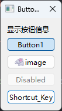
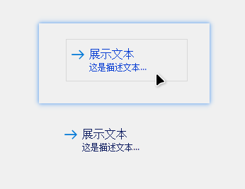
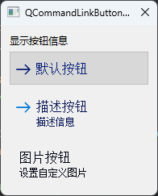
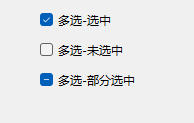
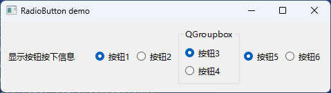
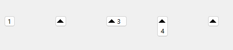
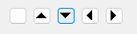
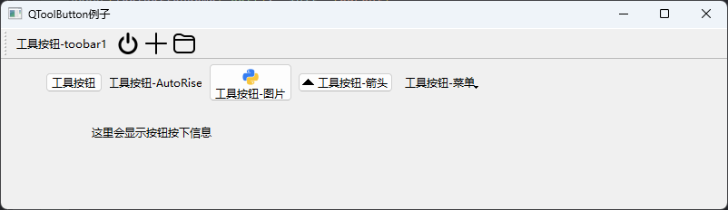
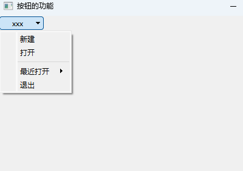

# 07.按钮控件

## 抽象按钮QAbstractButton

```python
QAbstractButton(self, parent: Union[PySide6.QtWidgets.QWidget, NoneType]=None) -> None
```

该类QAbstractButton是按钮小部件的抽象基类,提供按钮通用的功能。

QAbstractButton提供对按钮和可检查(切换)按钮的支持。

可检查按钮在QRadioButton和QCheckBox类中实现。按钮在QPushButton和QToolButton类中实现；如果需要,这些还提供切换行为。

可以通过 setDefault()和 setAutoDefault()使按钮成为对话框中的默认按钮。

### 设置文本/图标

任何按钮都可以显示包含文本和图标的标签。如果一个按钮被禁用,它的标签将被更改为按钮一个"禁用"的外观。

Qt 提供的所有按钮(QPushButton、QToolButton、QCheckBox和QRadioButton)都可以同时显示text和图标。

| 方法                                | 说明                                                         |
| ----------------------------------- | ------------------------------------------------------------ |
| `setText(text)`                     | 参数 text:文字str ``设置按钮上显示的文本。默认没有文本。``如果按钮没有文本,text() 函数将返回一个空字符串。<br />如果文本包含一个符号字符('&'),则会自动为其创建一个快捷方式。'&' 后面的字符将用作快捷键。<br />如果文本未定义任何快捷方式,则任何先前的快捷方式都将被覆盖或清除。要显示 `&`实际的符号,使用"&&"。 |
| `text()`                            | 获取按钮提示文本                                             |
| `setIcon(QIcon("resource/h1.png"))` | 设置图标                                                     |
| `setIconSize(QSize(w, h))`          | 设置图标大小<br />参数 图标–PySide6.QtGui.QIcon 设置按钮上显示的图标。图标的默认大小由 GUI 样式定义,但可以通过设置iconSize属性进行调整。 |
| `icon()`                            | 获取图标(QSize对象)<br />返回类型 `PySide6.QtGui.QIcon`<br />此属性保存按钮上显示的图标。图标的默认大小由 GUI 样式定义,但可以通过设置iconSize属性进行调整。 |
| `iconSize()`                        | 获取图标大小(QSize对象)<br />参数 尺寸–`PySide6.QtCore.QSize`设置按钮的图标大小。默认大小由 GUI 样式定义。这是图标的最大尺寸。较小的图标不会按比例放大。 |

### 快捷键

当用户按下快捷键,按钮将调用[`animateClick()`](https://doc.qt.io/qtforpython/PySide6/QtWidgets/QAbstractButton.html#PySide6.QtWidgets.PySide6.QtWidgets.QAbstractButton.animateClick)。

设置快捷键有两种方法,一种有设置文本(仅支持英文)可在提示文本中插入 `&`符号,快捷键将会设置为 `ALT`和其后面字母的快捷键

可以通过方法设置自定义组合快捷键。

| 方法                            | 说明                                                         |
| ------------------------------- | ------------------------------------------------------------ |
| `but.setText("&xxx")`           | button=QPushButton(self)``button.setText("&ert")  # 设置提示文本并自动添加快捷键ALT+E``button.setText("e&rt")  # 设置提示文本并自动添加快捷键ALT+R``button.setText("er&t")  # 设置提示文本并自动添加快捷键ALT+T |
| `button.setShortcut("key+key")` | button.setShortcut("Alt+E")  # 设置快捷键为ALT+E ``button.setShortcut("Alt+R")  # 设置快捷键为ALT+R``button.setShortcut("Alt+T")  # 设置快捷键为ALT+T |
| `shortcut()`                    | 返回类型 PySide6.QtGui.QKeySequence 查看按钮关联的助记符。   |

### 长按重复点击

| 方法                            | 说明                                                         |
| ------------------------------- | ------------------------------------------------------------ |
| `setAutoRepeat(arg__1)`         | 设置按钮是否会在用户按住时自动重复。autoRepeatDelay并autoRepeatInterval定义自动重复是如何完成的。<br />参数 arg__1 – 布尔值``如果启用了autoRepeat,则在按下按钮时会定期发出pressed()、released()和信号。clicked()autoRepeat 默认关闭。<br />初始延迟和重复间隔由autoRepeatDelay和以毫秒为单位定义autoRepeatInterval。<br />注意:如果一个按钮被快捷键按下,那么自动重复将被系统启用和计时,而不是这个类。pressed()信号将像正常情况下一样发出released()。clicked() |
| `autoRepeat()`                  | 返回类型 整数<br />返回是否启用autoRepeat。<br />如果启用了,则在按钮按下时会定期发出pressed()、released()和clicked()信号。autoRepeat默认关闭。初始延迟和重复间隔由autoRepeatDelay和autoRepeatInterval定义,单位为毫秒。<br />注意:如果一个按钮被快捷键按下,那么自动重复将启用,并由系统计时,而不是由这个类计时。pressed()、released()和clicked()信号将像正常情况下一样发出。 |
| `setAutoRepeatInterval(arg__1)` | 参数 arg__1 – 整数``设置自动重复的间隔。如果autoRepeat启用,则 autoRepeatInterval 定义自动重复间隔的长度(以毫秒为单位)。 |
| `autoRepeatInterval()`          | 返回类型 整数<br />返回自动重复的间隔。``如果autoRepeat启用,则 autoRepeatInterval 定义自动重复间隔的长度(以毫秒为单位)。 |
| `setAutoRepeatDelay(arg__1)`    | 参数 arg__1 – 整数``设置自动重复的触发时间。如果autoRepeat启用,则 autoRepeatDelay 定义自动重复开始前的初始延迟(以毫秒为单位)。 |
| `autoRepeatDelay()`             | 返回自动重复的触发时间 ,返回类型 整数。如果启用autoRepeat,则autoRepeatDelay定义自动重复开始之前的初始延迟(以毫秒为单位)。 |

### 状态

QAbstractButton提供用于按钮的大多数状态:

| 判断状态               | 说明                                                         |
| ---------------------- | ------------------------------------------------------------ |
| `setEnabled(arg__1)`   | arg__1 – bool<br />返回按钮是否已启用。禁用按钮会将其标签绘制为灰色。``禁用小部件会隐式禁用其所有子部件。启用会启用所有子部件,除非它们已被显式禁用。当父控件保持禁用状态时,不可能显式启用不是窗口的子控件。``默认情况下,此属性为true。 |
| `setCheckable(arg__1)` | 参数 arg__1 – 布尔值``设置按钮是否可选中。默认情况下,该按钮不可选中,可判断按钮是否为切换按钮。。<br />返回类型 布尔值,返回按钮是否可选择。默认情况下,该按钮不可选中。 |
| `setDown(arg__1)`      | 参数 arg__1 – 布尔值``设置按钮是否被按下。如果此属性为true,则按钮被按下。如果将此属性设置为 true,则不会发出信号pressed()/clicked()默认为假。 |
| `isEnabled()`          | 返回按钮是否启用。。(与其他小部件相反,派生自的按钮[`QAbstractButton`](https://doc.qt.io/qtforpython/PySide6/QtWidgets/QAbstractButton.html#PySide6.QtWidgets.PySide6.QtWidgets.QAbstractButton)在禁用时接受鼠标和上下文菜单事件。) |
| `isCheckable`          | 按钮是否可以被选中。<br />返回类型 布尔值                    |
| `isDown()`             | 指示按钮是否被按下。<br />返回类型 布尔值``该属性保存按钮是否被按下。如果此属性为true,则按钮被按下。如果将此属性设置为 true,则不会发出信号pressed()和。clicked()默认为假。 |
| `isChecked()`          | 表示按钮是否被选中。<br />返回类型 布尔值``该属性保存按钮是否被选中。只能检查可检查的按钮。默认情况下,该按钮未选中。 |

isDown()和isChecked()的区别如下。

当用户点击一个切换按钮来选中它时,该按钮首先被按下然后释放到选中状态。当用户再次单击它(取消选中它)时,按钮首先移动到按下状态,然后移动到未选中状态(isChecked()并且isDown()都是false)。(需要注意在多选可点击按钮时的区别)

### 点击

| 方法                 | 说明                                                         |
| -------------------- | ------------------------------------------------------------ |
| `animateClick()`     | 执行动画点击:立即按下按钮,并在 100 毫秒后释放。 在释放按钮之前再次调用此函数会重置释放计时器。 与点击相关的所有信号都会适当发出。<br />如果按钮未启用(PySide6.QtWidgets.QWidget.setEnabled()),此函数不执行任何操作 |
| `click()`            | 执行点击。 所有与点击相关的常见信号都会适当发出。如果按钮选择按钮,则切换按钮状态。<br />如果按钮未启用(PySide6.QtWidgets.QWidget.setEnabled()),此函数不执行任何操作.类似于animateClick()但无动画 |
| `setChecked(arg__1)` | 参数 arg__1 – 布尔值 设置按钮被选中。 只能设置可选中的按钮。默认情况下,该按钮未选中。 也可以看看checkable |
| `toggle()`           | 切换可选择按钮的状态。 也可以看看checkable                   |

### 排他性

| 方法                       | 说明                                                         |
| -------------------------- | ------------------------------------------------------------ |
| `setAutoExclusive(arg__1)` | 参数 arg__1 – 布尔值<br />设置是否启用自动排他性。``如果启用了自动排他性,那么属于同一个父小部件的可检查按钮的行为就像它们属于同一个排他按钮组一样。在独占按钮组中,每次只能选中一个按钮;选中另一个按钮会自动取消选中前一个按钮。``该属性对属于按钮组的按钮不起作用。autoExclusive默认是关闭的,单选按钮除外。 |
| `autoExclusive()`          | 返回类型 布尔值<br />此属性用于确定是否启用自动排他性。      |

### 信号

QAbstractButton提供四种信号:

- 当在按钮上按下鼠标左键:pressed()
- 在按钮上松开左键时,先发送released(),在发送clicked()
- 如果在按钮上按下左键不放则光标移开时发送released(),不再发送clicked()

| 方法                       | 说明                                                         |
| -------------------------- | ------------------------------------------------------------ |
| `pressed()`                | 按下按钮时会发出此信号。<br />也可以看看released() clicked() |
| `released()`               | 当鼠标按下后释放按钮(不松开移出控件范围也会)发出此信号。     |
| `clicked([checked=false])` | 当鼠标光标在按钮内时按下左键并释放(快捷键被触发 、`click()`或 `animateClick()`被调用时),这个信号被发出。调用`setDown()`/``setChecked()`/`toggle()`则不会发出此信号。参数`checked`:布尔值,checked参数表示是否选中该按钮,按钮被选中-true,按钮未选中-false。 |
| `toggled(checked)`         | 参数 check- 布尔 ``按钮选中状态改变时发送信号<br />只要可检查按钮改变其状态,就会发出此信号。checked如果按钮被选中则为 true,如果按钮未被选中则为 false。``这可能是用户操作、click()插槽激活或setChecked()调用的结果。``独占按钮组中按钮的状态在发出此信号之前更新。这意味着插槽可以根据状态已更改的组中按钮发出的"关闭"信号或"打开"信号进行操作。 |

### 点击有效区域

| 方法             | 说明                                                         |
| ---------------- | ------------------------------------------------------------ |
| `hitButton(pos)` | 查看指定坐标是否可点击,返回类型 布尔值 ``参数 pos-PySide6.QtCore.QPoint``true如果pos在可点击按钮矩形内则返回；否则返回false。默认情况下,可点击区域是整个小部件。子类可以重新实现此功能以提供对不同形状和大小的可点击区域的支持。 |

重写 `hitButton(QPoint)`

QPoint时参考按钮的左上角坐标

- 有效返回True
- 无效返回False

### 虚函数

| 方法               | 说明                                                         |
| ------------------ | ------------------------------------------------------------ |
| `checkStateSet()`  | 此虚拟处理程序在使用时被调用setChecked(),除非它是从内部调用的nextCheckState()。它允许子类重置它们的中间按钮状态。 |
| `nextCheckState()` | 单击按钮时将调用此虚拟处理程序。默认实现调用setChecked(! isChecked()) 如果按钮isCheckable()。它允许子类实现中间按钮状态。 |

### 重写

要继承QAbstractButton,您必须至少重新实现paintEvent()以绘制按钮的轮廓及其文本或像素图。通常也建议重新实现sizeHint(),有时hitButton()(确定按钮按下是否在按钮内)。对于具有两种以上状态的按钮(如三态按钮),您还必须重新实现checkStateSet()和nextCheckState()。

## 按压按钮控件QPushButton


按钮或命令按钮可能是任何图形用户界面中最常用的小部件。按下(单击)按钮以命令计算机执行某些操作或回答问题。

QPushButton继承自QAbstractButton,具有QAbstractButton的方法。

命令按钮是矩形的,通常显示描述其操作的文本标签。可以通过在文本中的首选字符前面加上与号来指定快捷键。

按钮显示文本标签和小图标(可选)。这些可以使用构造函数进行设置,并在以后使用`setText()` 和 `setIcon()`进行更改。如果按钮被禁用,文本和图标的外观将根据 GUI 样式进行操作,以使按钮看起来"禁用"。

按钮在鼠标、空格键或键盘快捷键激活时发出[`clicked()`](https://doc.qt.io/qtforpython/PySide6/QtWidgets/QAbstractButton.html#PySide6.QtWidgets.PySide6.QtWidgets.QAbstractButton.clicked) 信号。连接到此信号以执行按钮的操作。按钮还提供不太常用的信号,例如 `pressed()`和 `release()`。

对话框中的命令按钮默认为自动默认按钮,即,当它们收到键盘输入焦点时,它们会自动成为默认按钮。默认按钮是当用户在对话框中按 Enter 或 Return 键时激活的按钮。可以使用`setAutoDefault()`更改此设置。请注意,自动默认按钮会保留一些额外的空间,这是绘制默认按钮指示器所必需的。如果不希望按钮周围有此空间,请调用`setAutoDefault(false)`。

```python
QPushButton(icon: Union[PySide6.QtGui.QIcon, PySide6.QtGui.QPixmap], text: str, parent: Union[PySide6.QtWidgets.QWidget, NoneType]=None) -> None
QPushButton(parent: Union[PySide6.QtWidgets.QWidget, NoneType]=None) -> None
QPushButton(text: str, parent: Union[PySide6.QtWidgets.QWidget, NoneType]=None) -> None
```

### QPushButton特有方法

| 方法和参数                           | 返回值类型                | 说明                                             |
| ------------------------------------ | ------------------------- | ------------------------------------------------ |
| `setMenu(menu: QMenu)`               | `None`                    | 设置菜单                                         |
| `menu(self)`                         | `PySide6.QtWidgets.QMenu` | 获取菜单                                         |
| [slot]`showMenu(self)`               | `None`                    | 弹出菜单                                         |
| `setAutoDefault(self, arg__1: bool)` | `None`                    | 设置按钮是否是自动默认按钮                       |
| `autoDefault(self)`                  | `bool`                    | 获取按钮是否是自动默认按钮                       |
| `setDefault(self, arg__1: bool)`     | `None`                    | 设置按钮是否默认按钮,按下Enter键发送该按钮的信号 |
| `isDefault(self)`                    | `bool`                    | 获取按钮是否是默认按钮                           |
| `setFlat(self, arg__1: bool)`        | `None`                    | 设置按钮是否没有突起效果                         |
| `isFlat(self)`                       | `bool`                    | 获取按钮是否没有突起效果                         |

### QPushButton例子



```python
# -*- coding: UTF-8 -*-
# File date: Hi_2023/3/15 0:54
# File_name: 05-QButton例子.py


import sys
from PySide6.QtCore import *
from PySide6.QtGui import *
from PySide6.QtWidgets import *
import os

os.chdir(os.path.dirname(__file__))


class Form(QDialog):
    def __init__(self, parent=None):
        super(Form, self).__init__(parent)
        layout = QVBoxLayout()
        self.label_show = QLabel('显示按钮信息')
        layout.addWidget(self.label_show)

        self.button1 = QPushButton("Button1")
        self.button1.setCheckable(True)
        self.button1.toggle()
        self.button1.clicked.connect(lambda: self.button_click(self.button1))
        layout.addWidget(self.button1)

        self.button_image = QPushButton('image')
        self.button_image.setCheckable(True)
        self.button_image.setIcon(QIcon(QPixmap("../../../Resources/animal/m1.png")))
        self.button_image.clicked.connect(lambda: self.button_click(self.button_image))
        layout.addWidget(self.button_image)

        self.button_disabled = QPushButton("Disabled")
        self.button_disabled.setEnabled(False)
        layout.addWidget(self.button_disabled)

        self.button_shortcut = QPushButton("&Shortcut_Key")
        self.button_shortcut.setDefault(True)
        self.button_shortcut.setCheckable(True)
        self.button_shortcut.clicked.connect(lambda: self.button_click(self.button_shortcut))
        layout.addWidget(self.button_shortcut)

        self.setWindowTitle("Button demo")
        self.setLayout(layout)

    def button_click(self, button):
        if button.isChecked():
            self.label_show.setText('你按下了' + button.text() + "  isChecked=True")
        else:
            self.label_show.setText('你按下了' + button.text() + "  isChecked=False")


if __name__ == '__main__':
    app = QApplication(sys.argv)
    btnDemo = Form()
    btnDemo.show()
    sys.exit(app.exec())

```


## 命令链接按钮QCommandLinkButton



命令链接是Windows Vista引入的新控件 它的用途类似于单选按钮的用途,因为它用于在一组互斥选项之间进行选择 命令链接按钮不应单独使用,而应作为向导和对话框中单选按钮的替代选项 外观通常类似于平面按钮的外观,但除了普通按钮文本之外,它还允许描述性文本

QCommandLinkButton从QPushButton继承而来

命令链接按钮QCommandLinkButton主要用于由多个对话框构成的向导对话框,其外观通常类似于平面按钮,除了默认按钮文本外还带有一个向右的箭头可通过 `setIcon`更换

```python
QCommandLinkButton(parent: Union[PySide6.QtWidgets.QWidget, NoneType]=None) -> None
QCommandLinkButton(text: str, description: str, parent: Union[PySide6.QtWidgets.QWidget, NoneType]=None) -> None
QCommandLinkButton(text: str, parent: Union[PySide6.QtWidgets.QWidget, NoneType]=None) -> None
```

`description`是QCommandLinkButton按钮上的功能性描述文本

### 设置描述性文本

| 方法                                             | 说明           |
| ------------------------------------------------ | -------------- |
| `setDescription(self, description: str) -> None` | 设置描述性文本 |
| `description(self) -> str`                       | 获取描述性文本 |

### 例子



```python
# -*- coding: UTF-8 -*-
# File date: Hi_2023/3/15 0:46
# File_name: 02-QCommandLinkButton例2.py


import sys
from PySide6.QtCore import *
from PySide6.QtGui import *
from PySide6.QtWidgets import *
import os

os.chdir(os.path.dirname(__file__))


class CommandLinkButtonDemo(QDialog):
    def __init__(self, parent=None):
        super(CommandLinkButtonDemo, self).__init__(parent)
        layout = QVBoxLayout()
        self.label_show = QLabel('显示按钮信息')
        layout.addWidget(self.label_show)

        self.button1 = QCommandLinkButton("默认按钮")
        self.button1.setCheckable(True)
        self.button1.toggle()
        self.button1.clicked.connect(lambda: self.button_click(self.button1))
        layout.addWidget(self.button1)

        self.button_descript = QCommandLinkButton("描述按钮", '描述信息')
        self.button_descript.clicked.connect(lambda: self.button_click(self.button_descript))
        layout.addWidget(self.button_descript)

        self.button_image = QCommandLinkButton('图片按钮')
        self.button_image.setCheckable(True)
        self.button_image.setDescription('设置自定义图片')
        self.button_image.setIcon(QIcon("./images/python.png"))
        self.button_image.clicked.connect(lambda: self.button_click(self.button_image))
        layout.addWidget(self.button_image)

        self.setWindowTitle("QCommandLinkButton demo")
        self.setLayout(layout)

    def button_click(self, button):
        if button.isChecked():
            self.label_show.setText('你按下了 ' + button.text() + "  isChecked=True")
        else:
            self.label_show.setText('你按下了 ' + button.text() + "  isChecked=False")


if __name__ == '__main__':
    app = QApplication(sys.argv)
    btnDemo = CommandLinkButtonDemo()
    btnDemo.show()
    sys.exit(app.exec())

```

## 复选框按钮控件QCheckBox



```python
QCheckBox(parent: Union[PySide6.QtWidgets.QWidget, NoneType]=None) -> None
QCheckBox(text: str, parent: Union[PySide6.QtWidgets.QWidget, NoneType]=None) -> None
```

复选框按钮 `QCheckBox`是从 `QAbstractButton`类继承而来的,因此有 `QAbstractButton`的信号和方法

### 特有方法

| 方法及参数                                                   | 说明                                                         |
| ------------------------------------------------------------ | ------------------------------------------------------------ |
| `setTristate(y: bool=True) -> None`                          | 设置是否有不确定状态                                         |
| `isTristate() -> bool`                                       | 获取是否有不确定状态                                         |
| `setCheckState(state: PySide6.QtCore.Qt.CheckState) -> None` | 设置选中状态                                                 |
| `Qt.CheckState.Unchecked`                                    | 没有选中                                                     |
| `Qt.CheckState.PartiallyChecked`                             | 部分选中                                                     |
| `Qt.CheckState.Checked`                                      | 选中                                                         |
| `checkState()`                                               | 获取当前选择状态,返回值:<br />0-没有选中 <br />1-不确定<br />2-选中 |
| `nextCheckState()`                                           | 设置当前状态的下一个状态                                     |

### 信号

复选框按钮 `QCheckBox`比 `QAbstractButton`多了一个 `stateChanged(int)`信号。

`stateChanged(int)`信号在状态发生改变时都会发送信号,而 `toggled(bool)`信号在从不确定状态转向确定状态时间不发送信号,其他信号相同。

如果过只有一个单选按钮可通过单击改变其选中状态,但多个单选按钮则必须选择其他单击按钮才能改变其选中状态。


### 例子

```python
import sys
import PySide6
from PySide6.QtCore import Qt.QPoint
from PySide6.QtGui import QAction, QIcon
from PySide6.QtWidgets import *


class win_demo(QWidget):
    def __init__(self):
        app=QApplication(sys.argv)  # 初始化界面
        super().__init__()

        self.resize(500, 500)
        self.setWindowFlags(Qt.WindowStaysOnTopHint)  # 置顶

        self.demo_check_btn()

        self.show()  # 显示窗口以及其子控件
        sys.exit(app.exec())  # 主循环和退出

    def demo_check_btn(self):
        check_btn1=QCheckBox("多选-选中", self)
        check_btn2=QCheckBox("多选-未选中", self)
        check_btn3=QCheckBox("多选-部分选中", self)

        check_btn1.move(self.width() // 2 - 20, 20)
        check_btn2.move(self.width() // 2 - 20, 50)
        check_btn3.move(self.width() // 2 - 20, 80)

        check_btn1.setCheckState(Qt.CheckState.Checked)
        check_btn2.setCheckState(Qt.CheckState.Unchecked)
        check_btn3.setCheckState(Qt.CheckState.PartiallyChecked)


if __name__=='__main__':
    win_demo()

```

## 单选按钮控件QRadioButton


`QRadioButton`是一个选项按钮,可以打开(选中)或关闭(未选中)。单选按钮通常为用户提供"众多"选项之一。在一组单选按钮中,一次只能选中一个单选按钮;如果用户选择另一个按钮,则先前选择的按钮将关闭。

默认情况下,单选按钮是自动排除的。如果启用了自动独占,则属于同一父构件的单选按钮的行为就像它们是同一独占按钮组的一部分一样。如果属于同一父小部件的单选按钮需要多个独占按钮组,请将它们放入 `QButtonGroup`中。

每当按钮打开或关闭时,它都会发出[`toggled()`](https://doc.qt.io/qtforpython/PySide6/QtWidgets/QAbstractButton.html#PySide6.QtWidgets.PySide6.QtWidgets.QAbstractButton.toggled) 信号。如果要在每次按钮更改状态时触发操作,连接到此信号。使用[`isChecked()`](https://doc.qt.io/qtforpython/PySide6/QtWidgets/QAbstractButton.html#PySide6.QtWidgets.PySide6.QtWidgets.QAbstractButton.isChecked) 查看是否选择了特定按钮。

像 `QPushButton`一样,单选按钮显示文本,并可选择一个小图标。该图标使用`setIcon()` 设置。文本可以在构造函数中设置,也可以使用`setText()`设置。可以通过在文本中的首选字符前面加上与号来指定快捷键。

单选按钮控件 `QRadioButton`为用户提供多个选项,一般只能选择一个。

在一个容器中如果有多个单选按钮,那么这些单选按钮一般都是互斥的,选择其中一个单选按钮时,其它按钮都会取消选择。

```python
QRadioButton(parent: Union[PySide6.QtWidgets.QWidget, NoneType]=None) -> None
QRadioButton(text: str, parent: Union[PySide6.QtWidgets.QWidget, NoneType]=None) -> None
```

单选按钮控件 `QRadioButton`是从 `QAbstractButton`类继承而来的,因此有 `QAbstractButton`的信号和方法。


### 例子



```python
# -*- coding: UTF-8 -*-
# File date: Hi_2023/3/15 0:55
# File_name: 05-QRadio例子.py


import sys
from PySide6.QtCore import *
from PySide6.QtGui import *
from PySide6.QtWidgets import *


class Radiodemo(QWidget):
    def __init__(self, parent=None):
        super(Radiodemo, self).__init__(parent)
        layout = QHBoxLayout(self)
        self.label = QLabel('显示按钮按下信息')
        self.label.setFixedWidth(120)
        layout.addWidget(self.label)

        # button1,button2未接管按钮
        self.button1 = QRadioButton("按钮1")
        self.button1.setChecked(True)
        self.button1.toggled.connect(lambda: self.button_select(self.button1))
        layout.addWidget(self.button1)

        self.button2 = QRadioButton("按钮2")
        self.button2.toggled.connect(lambda: self.button_select(self.button2))
        layout.addWidget(self.button2)

        # button3,button4 使用groupbox接管按钮
        group_box1 = QGroupBox('QGroupbox', self)
        layout_group_box = QVBoxLayout()
        self.button3 = QRadioButton("按钮3")
        self.button3.setChecked(True)
        self.button3.toggled.connect(lambda: self.button_select(self.button3))
        layout_group_box.addWidget(self.button3)

        self.button4 = QRadioButton("按钮4")
        self.button4.toggled.connect(lambda: self.button_select(self.button4))
        layout_group_box.addWidget(self.button4)
        group_box1.setLayout(layout_group_box)

        layout.addWidget(group_box1)

        # button5,button6 使用button_group接管按钮
        button_group = QButtonGroup(self)
        self.button5 = QRadioButton("按钮5")
        self.button5.setChecked(True)
        self.button5.toggled.connect(lambda: self.button_select(self.button5))
        button_group.addButton(self.button5)
        layout.addWidget(self.button5)

        self.button6 = QRadioButton("按钮6")
        self.button6.toggled.connect(lambda: self.button_select(self.button6))
        button_group.addButton(self.button6)
        layout.addWidget(self.button6)

        self.setLayout(layout)
        self.setWindowTitle("RadioButton demo")

    def button_select(self, button):
        if button.isChecked() == True:
            self.label.setText(button.text() + " is selected")
        else:
            self.label.setText(button.text() + " is deselected")


if __name__ == '__main__':
    app = QApplication(sys.argv)
    radioDemo = Radiodemo()
    radioDemo.show()
    sys.exit(app.exec())

```


## 工具按钮QToolButton

```python
QToolButton(self, parent: Union[PySide6.QtWidgets.QWidget, NoneType]=None) -> None
```

参数:

- arent – PySide6.QtWidgets.QWidget
- 使用parent 构造一个空的工具按钮。

工具按钮是一种特殊按钮,可提供对特定命令或选项的快速访问。

普通命令按钮相反,工具按钮通常不显示文本标签,而是显示图标。当然可以同时设置文本和图标但是默认情况下都设置只显示图标。

工具按钮通常在使用创建新QAction实例addAction()或将现有操作添加到工具栏时创建addAction()。也可以用与任何其他小部件相同的方式构建工具按钮,并将它们与布局中的其他小部件一起排列。

工具按钮的一个经典用途是选择工具；例如,绘图程序中的"钢笔"工具。这将通过使用aQToolButton作为切换按钮来实现

QToolButton支持自动提升。在 auto-raise 模式下,按钮仅在鼠标指向它时绘制 3D 框架。当在QToolBar.改变它setAutoRaise()。

工具按钮的图标设置为QIcon。这使得为禁用和活动状态指定不同的像素图成为可能。当按钮的功能不可用时,将使用禁用的像素图。由于鼠标指针悬停在按钮上而自动抬起按钮时,会显示活动像素图。

按钮的外观和尺寸可以用setToolButtonStyle()和调整setIconSize()。当在 a 内使用QToolBar时QMainWindow,该按钮会自动调整为QMainWindow的设置(参见setToolButtonStyle()和setIconSize())。除了图标,工具按钮还可以显示箭头符号,用指定arrowType。

工具按钮可以在弹出菜单中提供额外的选择。可以使用设置弹出菜单setMenu()。用于setPopupMode()配置可用于具有菜单集的工具按钮的不同模式。默认模式是 DelayedPopupMode,它有时与网络浏览器中的"后退"按钮一起使用。按住按钮一段时间后,会弹出一个菜单,显示可能跳转到的页面列表。超时取决于样式,请参阅SH_ToolButton_PopupDelay。

### 按钮样式风格

| 方法                                                         | 说明                                                         |
| ------------------------------------------------------------ | ------------------------------------------------------------ |
| `toolButtonStyle()`                                          | 返回类型 ToolButtonStyle ``此属性保存工具按钮是仅显示图标、仅显示文本还是在图标旁边/下方显示文本。``默认值为ToolButtonIconOnly。``要使工具按钮的样式遵循系统设置,请将此属性设置为ToolButtonFollowStyle。在 Unix 上,将使用桌面环境中的用户设置。在其他平台上,ToolButtonFollowStyle仅表示图标。``QToolButton自动将此插槽连接到所在位置的相关信号QMainWindow。 |
| [slot]`setToolButtonStyle(style: PySide6.QtCore.Qt.ToolButtonStyle) -> None` | 设置工具按钮是否仅显示图标、仅显示文本、文本显示在图标旁边/下方<br />style可选:<br /><br />Qt.ToolButtonStyle.ToolButtonTextOnly - 仅文本 <br />Qt.ToolButtonStyle.ToolButtonIconOnly - 仅图标<br />Qt.ToolButtonStyle.ToolButtonTextBesideIcon - 文本在图标右侧 <br />Qt.ToolButtonStyle.ToolButtonTextUnderIcon - 文本在图标下方<br />Qt.ToolButtonStyle.ToolButtonFollowStyle - 工具按钮跟随样式,遵循风格 |
| `initStyleOption(option)`                                    | option-`PySide6.QtWidgets.QStyleOptionToolButton`使用此 QToolButton 中的值初始化选项。当子类需要 QStyleOptionToolButton 但不想自己填写所有信息时,此方法很有用。 |

### 图标箭头

| 方法                                             | 说明                                                         |
| ------------------------------------------------ | ------------------------------------------------------------ |
| `setArrowType(type:PySide6.QtCore.Qt.ArrowType)` | 参数 输入-ArrowType ``设置按钮是否显示箭头而不是普通图标。这会显示一个箭头作为QToolButton的图标。``默认情况下,此属性设置为NoArrow。<br />type可选:<br /><br />`Qt.ArrowType.NoArrow` - 无箭头 <br />`Qt.ArrowType.UpArrow` - 向上箭头<br />`Qt.ArrowType.DownArrow` - 向下箭头<br />`Qt.ArrowType.LeftArrow` - 向左箭头<br />`Qt.ArrowType.RightArrow` - 向右箭头 |
| `arrowType()`                                    | 返回类型 ArrowType``此属性保存按钮是否显示箭头而不是普通图标。这会显示一个箭头作为 的图标QToolButton。默认情况下,此属性设置为NoArrow。 |

### 自动提升

| 方法                        | 说明                                                         |
| --------------------------- | ------------------------------------------------------------ |
| `autoRaise()`               | 返回类型 布尔值``此属性保存是否启用自动提升(突起效果)。默认为禁用(即 false)。在自动提升模式下,该按钮仅在鼠标指向时才会绘制3D帧使用QMacStyle 时,此属性目前在 macOS 上被忽略。 |
| `setAutoRaise(enable:bool)` | 参数 启用- 布尔``此属性保存是否启用自动提升(突起效果)。默认为禁用(即 false)。在自动提升模式下,该按钮仅在鼠标指向时才会绘制3D帧.<br />在工具栏(QToolBar)中, 默认就是自动提升<br />使用QMacStyle 时,此属性目前在 macOS 上被忽略 |

### 设置样式例子

```python
import sys
from PySide6.QtCore import Qt
from PySide6.QtWidgets import *


class win_demo(QWidget):
    def __init__(self):
        app=QApplication(sys.argv)  # 初始化界面
        super().__init__()

        self.resize(500, 500)
        self.setWindowFlags(Qt.WindowStaysOnTopHint)  # 置顶

        def creat_tool_btn(num, x):
            tool_button=QToolButton(self)
            tool_button.setText(str(num))
            tool_button.setArrowType(Qt.ArrowType.UpArrow)
            tool_button.move(x, 50)

            return tool_button

        tool_button1=creat_tool_btn(1, 10)
        tool_button2=creat_tool_btn(2, 110)
        tool_button3=creat_tool_btn(3, 210)
        tool_button4=creat_tool_btn(4, 310)
        tool_button5=creat_tool_btn(5, 410)

        tool_button1.setToolButtonStyle(Qt.ToolButtonStyle.ToolButtonTextOnly)
        tool_button2.setToolButtonStyle(Qt.ToolButtonStyle.ToolButtonIconOnly)
        tool_button3.setToolButtonStyle(Qt.ToolButtonStyle.ToolButtonTextBesideIcon)
        tool_button4.setToolButtonStyle(Qt.ToolButtonStyle.ToolButtonTextUnderIcon)
        tool_button5.setToolButtonStyle(Qt.ToolButtonStyle.ToolButtonFollowStyle)

        # qlabel.move((self.width() - qlabel.width()) // 2,(self.height() - qlabel.height()) // 2)  # 居中展示文本

        self.show()  # 显示窗口以及其子控件
        sys.exit(app.exec())  # 主循环和退出


if __name__=='__main__':
    win_demo()
```

### 按钮菜单弹出模式

| 方法                                                 | 说明                                                         |
| ---------------------------------------------------- | ------------------------------------------------------------ |
| `popupMode()`                                        | 返回类型 ToolButtonPopupMode ``此属性描述弹出菜单与工具按钮一起使用的方式。``默认情况下,此属性设置为DelayedPopup。 |
| `setPopupMode(mode:QToolButton.ToolButtonPopupMode)` | 参数 模式——ToolButtonPopupMode ``此属性描述弹出菜单与工具按钮一起使用的方式。``默认情况下,此属性设置为DelayedPopup。<br />   QToolButton.DelayedPopup:鼠标按住一会才显示 类似于浏览器后退按钮,点击clicked()信号不会发射 ``   QToolButton.MenuButtonPopup:点击指示箭头才显示,只有点击左侧才会触发点击clicked()信号``   QToolButton.InstantPopup:点了按钮就显示 点击clicked()信号不会发射 |


### 例子



```python
# -*- coding: UTF-8 -*-
# File date: Hi_2023/3/15 1:03
# File_name: 07-QToolButton例子.py


import sys
from PySide6.QtCore import *
from PySide6.QtGui import *
from PySide6.QtWidgets import QToolButton, QMainWindow, QVBoxLayout, QHBoxLayout, QApplication, QWidget, QToolBar, QMenu, QLabel
import os

os.chdir(os.path.dirname(__file__))


class ToolButtonDemo(QMainWindow):

    def __init__(self, parent=None):
        super(ToolButtonDemo, self).__init__(parent)
        self.setWindowTitle("QToolButton例子")
        self.resize(800, 200)
        self.label_show = QLabel('这里会显示按钮按下信息', self)
        self.label_show.setGeometry(QRect(100, 100, 200, 30))

        # 在QWidget中显示工具按钮
        widget = QWidget(self)
        widget.setGeometry(QRect(40, 30, 500, 60))
        layout = QHBoxLayout()
        widget.setLayout(layout)

        # 文本工具按钮
        tool_button = QToolButton(self)
        tool_button.setText("工具按钮")
        layout.addWidget(tool_button)

        # 自动提升
        tool_button_AutoRaise = QToolButton(self)
        tool_button_AutoRaise.setText("工具按钮-AutoRise")
        tool_button_AutoRaise.setAutoRaise(True)
        layout.addWidget(tool_button_AutoRaise)

        # 图片工具按钮
        tool_button_pic = QToolButton(self)
        tool_button_pic.setText("工具按钮-图片")
        tool_button_pic.setIcon(QIcon("../../../Resources/Icons/python_96px.ico"))
        tool_button_pic.setIconSize(QSize(22, 22))
        tool_button_pic.setToolButtonStyle(Qt.ToolButtonTextUnderIcon)
        layout.addWidget(tool_button_pic)

        # 工具按钮+箭头
        tool_button_arrow = QToolButton(self)
        tool_button_arrow.setText("工具按钮-箭头")
        tool_button_arrow.setToolButtonStyle(Qt.ToolButtonTextBesideIcon)
        tool_button_arrow.setArrowType(Qt.UpArrow)
        layout.addWidget(tool_button_arrow)

        # 菜单工具按钮
        tool_button_menu = QToolButton(self)
        tool_button_menu.setText("工具按钮-菜单")
        tool_button_menu.setAutoRaise(True)
        layout.addWidget(tool_button_menu)

        # 以下是为tool_button_menu添加menu信息。
        menu = QMenu(tool_button_menu)
        new_action = QAction("新建", menu)
        new_action.setData('NewAction')
        menu.addAction(new_action)
        open_action = QAction("打开", menu)
        open_action.setData('OpenAction')
        menu.addAction(open_action)
        menu.addSeparator()
        #    添加子菜单
        sub_menu = QMenu(menu)
        sub_menu.setTitle("子菜单")
        recent_action = QAction("最近打开", sub_menu)
        recent_action.setData('RecentAction')
        sub_menu.addAction(recent_action)
        menu.addMenu(sub_menu)
        tool_button_menu.setMenu(menu)
        tool_button_menu.setPopupMode(QToolButton.InstantPopup)

        # 工具按钮，嵌入到toolbar
        toobar = self.addToolBar("File")
        #   添加工具按钮1
        tool_button_bar1 = QToolButton(self)
        tool_button_bar1.setText("工具按钮-toobar1")
        toobar.addWidget(tool_button_bar1)
        #   添加工具按钮2
        tool_button_bar2 = QToolButton(self)
        tool_button_bar2.setText("工具按钮-toobar2")
        tool_button_bar2.setIcon(QIcon("../../../Resources/Icons/power_48px.ico"))
        tool_button_arrow.setToolButtonStyle(Qt.ToolButtonTextBesideIcon)
        toobar.addWidget(tool_button_bar2)
        #    添加其他QAction按钮
        new = QAction(QIcon("../../../Resources/Icons/FlatIcon-regular-rounded/plus.png"), "new", self)
        toobar.addAction(new)
        open = QAction(QIcon("../../../Resources/Icons/FlatIcon-regular-rounded/folder.png"), "open", self)
        toobar.addAction(open)

        # 槽函数
        tool_button.clicked.connect(lambda: self.button_click(tool_button))
        tool_button_AutoRaise.clicked.connect(lambda: self.button_click(tool_button_AutoRaise))
        tool_button_pic.clicked.connect(lambda: self.button_click(tool_button_pic))
        tool_button_arrow.clicked.connect(lambda: self.button_click(tool_button_arrow))
        tool_button_bar1.clicked.connect(lambda: self.button_click(tool_button_bar1))
        tool_button_bar2.clicked.connect(lambda: self.button_click(tool_button_bar2))
        tool_button_menu.triggered.connect(self.action_call)

    def button_click(self, button):
        self.label_show.setText('你按下了: ' + button.text())

    def action_call(self, action):
        self.label_show.setText('触发了菜单action: ' + action.data())


if __name__ == '__main__':
    app = QApplication(sys.argv)
    demo = ToolButtonDemo()
    demo.show()
    sys.exit(app.exec())

```


## 按钮组QButtonGroup

```python
QButtonGroup(self, parent: Union[PySide6.QtCore.QObject, NoneType]=None) -> None
```

继承自QObject类

提供一个抽象的按钮容器, 可以将多个按钮划分为一组,在有多组拥有互斥性的按钮时间使用,保证彼此独立互不影响。

- 不具备可视化的效果
- 一般放的都是可以被检查的按钮

### QButtonGroup的API

| 方法                                            | 说明                                                         |
| ----------------------------------------------- | ------------------------------------------------------------ |
| `addButton(Button:QAbstractButton,[id:int=-1])` | 往按钮组添加按钮<br />id选填,如果id为-1,则将为该按钮分配一个id。自动分配的ID保证为负数,从-2开始。如果要分配自己的ID,请使用正值以避免冲突 |
| `button(ID:int)`                                | 根据ID获取对应按钮, 没有则返回None。ID为addButton添加时设置的值 |
| `checkedId()`                                   | 按钮组当前选中的按钮的ID,如果没有选中按钮则返回-1            |
| `buttons()    `                                 | 查看所有按钮组中的按钮                                       |
| `checkedButton()`                               | 获取选中按钮                                                 |
| `id(Button:QAbstractButton)`                    | 获取按钮组中指定按钮对象的id,传入按钮对象                    |
| `setId(Button:QAbstractButton,id:int)`          | 设置按钮组已有组员的id                                       |
| `setExclusive(bool)`                            | 统一设置按钮组中的按钮是否互斥                               |
| `exclusive()`                                   | 获取按钮组内所有按钮是否互斥                                 |
| `removeButton(Button:QAbstractButton)`          | 从按钮组移除指定按钮                                         |

### 信号

| 信号                                    | 说明                                                         |
| --------------------------------------- | ------------------------------------------------------------ |
| `buttonClicked(button:QAbstractButton)` | 当按钮组中的按钮被点击时, 发射此信号,传递参数为按钮对象      |
| `buttonPressed(QAbstractButton)`        | 当按钮组中的按钮被按下时, 发射此信号,传递参数为按钮对象      |
| `buttonReleased(QAbstractButton)`       | 当按钮组中的按钮被释放时, 发射此信号,传递参数为按钮对象      |
| `buttonToggled(QAbstractButton, bool)`  | 当按钮组中的指定按钮切换到指定选中状态时, 发射此信号<br />QAbstractButton:指定按钮对象<br />bool:指定选中状态,如果选中该按钮则为true,如果未选中该按钮则为false。 |
| `idClicked(id:int)`                     | 当按钮组中的按钮被点击时, 发射此信号,,传递参数为按钮对象在按钮组的id |
| `idPressed(id:int)`                     | 当按钮组中的按钮被按下时, 发射此信号,,传递参数为按钮对象在按钮组的id |
| `idReleased(id:int)`                    | 当按钮组中的按钮被释放时, 发射此信号,,传递参数为按钮对象在按钮组的id |
| `idToggled(id:int, bool)`               | 当按钮组中的指定id的按钮切换到指定选中状态时, 发送此信号。<br />id:参按钮对象在按钮组的id<br />bool:指定选中状态,如果选中该按钮则为true,如果未选中该按钮则为false。 |

信号发射可选参数为int(按钮组内按钮id值),或按钮对象

信号默认传递的是按钮对象,通过如下方式可获取指定类型也可获取到按钮对象后通过按钮组的 `id(Button:QAbstractButton)`方法获取 `id`

PYqt5库没有下面几个id类型的信号,可通过 `buttonClicked[int](button:QAbstractButton)`直接获取id


### 例子

```python
import sys
from PySide6.QtCore import *
from PySide6.QtGui import *
from PySide6.QtWidgets import *

app = QApplication(sys.argv)

window = QWidget()
window.setWindowTitle("QButtonGroup的使用")
window.resize(500, 500)
window.move(400, 250)

rb_male = QRadioButton("男", window)
rb_male.move(100, 100)
rb_female = QRadioButton("女", window)
rb_female.move(180, 100)

sex_group = QButtonGroup(window)
sex_group.addButton(rb_male)  # 把rb_male按钮添加到sex_group按钮组
sex_group.addButton(rb_female)  # 把rb_female按钮添加到sex_group按钮组

rb_yes = QRadioButton("yes", window)
rb_yes.move(100, 220)
rb_no = QRadioButton("no", window)
rb_no.move(180, 220)

answer_group = QButtonGroup(window)
answer_group.addButton(rb_yes)
answer_group.addButton(rb_no)

"""
男、女属于同一按钮组，互斥，只能选中其中之一
yes、no属于另一按钮组，不受男女的影响
"""

window.show()

sys.exit(app.exec())

```


## 按钮菜单

可通过 `QPushButton`、`QToolButton`或重写 `QAbstractButton`配合 `QMenu`实现按钮菜单功能

**QMenu实例化**

```python
QMenu(parent: Union[PySide6.QtWidgets.QWidget, NoneType]=None) -> None
QMenu(title: str, parent: Union[PySide6.QtWidgets.QWidget, NoneType]=None) -> None
```

**QAction实例化**

```python
QAction(icon: Union[PySide6.QtGui.QIcon, PySide6.QtGui.QPixmap], text: str, parent: Union[PySide6.QtCore.QObject, NoneType]=None) -> None
QAction(parent: Union[PySide6.QtCore.QObject, NoneType]=None) -> None
QAction(text: str, parent: Union[PySide6.QtCore.QObject, NoneType]=None) -> None
```

### 按钮对象添加菜单

| 方法                    | 说明     |
| ----------------------- | -------- |
| `button.setMenu(QMenu)` | 设置菜单 |
| `button.menu()`         | 获取菜单 |
| `button.showMenu()`     | 弹出菜单 |

### QMenu API

菜单QMenu的常用方法如表所示。菜单的主要方法是在菜单列表中添加动作、子菜单和分隔条,主要方法介绍如下:

- 用`addAction(QAction)`方法可以添加一个已经定义好的动作；用`addAction(text:str)`或 `addAction(icon:QIcon,text:str)`方法可以添加一个新创建的动作,并返回动作,其中text是动作在菜单中的名称,icon是图标。
- 用`addMenu(QMenu)`方法可以将已定义好的菜单作为子菜单加入到菜单中；用`addMenu(title:str)`方法或 `addMenu(icon:QIcon,title:str)`方法可以添加新的子菜单,并返回子菜单。
- 用`addSection(text:str)`、`addSection(icon: QIcon,text: str)`或 `addSeparator()`方法可以添加分隔条,并返回对应的动作。分隔条的显示样式与操作系统有关,例如忽略动作的名称、图标或子菜单,或者显示成横线或名称。利用分隔条返回的动作,用动作的setSeparator(bool)方法可以将分隔条切换成动作,或者将动作切换成分隔条。
- 用`setTearOffEnabled(bool)`方法可以将菜单定义成可撕扯菜单,可撕扯菜单在其动作列表中显示一条虚线,单击该虚线可以把菜单及动作列表弹出；用`showTearOffMenu()`方法或 `showTearOffMenu(QPoint)`方法可以将可撕扯菜单在指定位置显示。
- 用`popup(pos: QPoint,at: QAction-None)`方法或 `exec(pos: QPoint,at:QAction-None)`方法可以在指定位置(全局坐标系)弹出菜单,如果指定了at参数,则指定的动作显示在指定位置。

### `addAction`、`addMenu`、`addSection`用法

```python
addAction用法
addAction(action: PySide6.QtGui.QAction) -> None
addAction(arg__1: Union[PySide6.QtGui.QIcon, PySide6.QtGui.QPixmap], text: str, arg__3: object, shortcut: Union[PySide6.QtGui.QKeySequence, PySide6.QtCore.QKeyCombination, PySide6.QtGui.QKeySequence.StandardKey, str, int, NoneType]=None) -> None
addAction(icon: Union[PySide6.QtGui.QIcon, PySide6.QtGui.QPixmap], text: str) -> PySide6.QtGui.QAction
addAction(icon: Union[PySide6.QtGui.QIcon, PySide6.QtGui.QPixmap], text: str, callable: object) -> PySide6.QtGui.QAction
addAction(icon: Union[PySide6.QtGui.QIcon, PySide6.QtGui.QPixmap], text: str, receiver: PySide6.QtCore.QObject, member: bytes, shortcut: Union[PySide6.QtGui.QKeySequence, PySide6.QtCore.QKeyCombination, PySide6.QtGui.QKeySequence.StandardKey, str, int]) -> PySide6.QtGui.QAction
addAction(icon: Union[PySide6.QtGui.QIcon, PySide6.QtGui.QPixmap], text: str, receiver: PySide6.QtCore.QObject, member: bytes, type: PySide6.QtCore.Qt.ConnectionType=Instance(Qt.AutoConnection)) -> PySide6.QtGui.QAction
addAction(icon: Union[PySide6.QtGui.QIcon, PySide6.QtGui.QPixmap], text: str, shortcut: Union[PySide6.QtGui.QKeySequence, PySide6.QtCore.QKeyCombination, PySide6.QtGui.QKeySequence.StandardKey, str, int]) -> PySide6.QtGui.QAction
addAction(icon: Union[PySide6.QtGui.QIcon, PySide6.QtGui.QPixmap], text: str, shortcut: Union[PySide6.QtGui.QKeySequence, PySide6.QtCore.QKeyCombination, PySide6.QtGui.QKeySequence.StandardKey, str, int], callable: object) -> PySide6.QtGui.QAction
addAction(icon: Union[PySide6.QtGui.QIcon, PySide6.QtGui.QPixmap], text: str, shortcut: Union[PySide6.QtGui.QKeySequence, PySide6.QtCore.QKeyCombination, PySide6.QtGui.QKeySequence.StandardKey, str, int], receiver: PySide6.QtCore.QObject, member: bytes, type: PySide6.QtCore.Qt.ConnectionType=Instance(Qt.AutoConnection)) -> PySide6.QtGui.QAction
addAction(text: str) -> PySide6.QtGui.QAction
addAction(text: str, arg__2: object, shortcut: Union[PySide6.QtGui.QKeySequence, PySide6.QtCore.QKeyCombination, PySide6.QtGui.QKeySequence.StandardKey, str, int, NoneType]=None) -> None
addAction(text: str, callable: object) -> PySide6.QtGui.QAction
addAction(text: str, receiver: PySide6.QtCore.QObject, member: bytes, shortcut: Union[PySide6.QtGui.QKeySequence, PySide6.QtCore.QKeyCombination, PySide6.QtGui.QKeySequence.StandardKey, str, int]) -> PySide6.QtGui.QAction
addAction(text: str, receiver: PySide6.QtCore.QObject, member: bytes, type: PySide6.QtCore.Qt.ConnectionType=Instance(Qt.AutoConnection)) -> PySide6.QtGui.QAction
addAction(text: str, shortcut: Union[PySide6.QtGui.QKeySequence, PySide6.QtCore.QKeyCombination, PySide6.QtGui.QKeySequence.StandardKey, str, int]) -> PySide6.QtGui.QAction
addAction(text: str, shortcut: Union[PySide6.QtGui.QKeySequence, PySide6.QtCore.QKeyCombination, PySide6.QtGui.QKeySequence.StandardKey, str, int], callable: object) -> PySide6.QtGui.QAction
addAction(text: str, shortcut: Union[PySide6.QtGui.QKeySequence, PySide6.QtCore.QKeyCombination, PySide6.QtGui.QKeySequence.StandardKey, str, int], receiver: PySide6.QtCore.QObject, member: bytes, type: PySide6.QtCore.Qt.ConnectionType=Instance(Qt.AutoConnection)) -> PySide6.QtGui.QAction


addMenu用法
addMenu(self, icon: Union[PySide6.QtGui.QIcon, PySide6.QtGui.QPixmap], title: str) -> PySide6.QtWidgets.QMenu
addMenu(self, menu: PySide6.QtWidgets.QMenu) -> PySide6.QtGui.QAction
addMenu(self, title: str) -> PySide6.QtWidgets.QMenu


addSection用法
addSection(icon: Union[PySide6.QtGui.QIcon, PySide6.QtGui.QPixmap], text: str) -> PySide6.QtGui.QAction
addSection(text: str) -> PySide6.QtGui.QAction
```

### `QMenu`常用API

| 方法                                                         | 说明                                                         |
| ------------------------------------------------------------ | ------------------------------------------------------------ |
| `menu.addMenu() --> PySide6.QtGui.QAction`                   | 在菜单中添加子菜单                                           |
| `menu.addAction(QAciton)`                                    | 添加已有动作                                                 |
| `menu.addAction(text:str)`                                   | 在菜单中添加新的动作并设置文字                               |
| `menu.addAction(icon:QIcon, text:str)`                       | 同上但设置图标和文字                                         |
| `addActions(actions: Sequence[PySide6.QtGui.QAction]) -> None` | 添加多个行为动作                                             |
| `menu.addSeparator(self) -> PySide6.QtGui.QAction`           | 添加分割线                                                   |
| `menu.addSection(text:str) -> PySide6.QtGui.QAction`         | 添加分割条                                                   |
| `menu.addSection([icon:PySide6.QtGui.QIcon], text:str) -->PySide6.QtGui.QAction` | 添加分割条<br />部件样式可以在呈现部分时使用文本和图标信息,也可以选择忽略它们并像简单分隔符一样呈现部分 |
| `menu.setTitle(str)`                                         | 给菜单添加文字                                               |
| `menu.setIcon(QIcon)`                                        | 给菜单添加图标                                               |

发现添加行为动作时需要严格按照说明传参数不然报各种错

### `QAction`常用API

| 方法                                 | 说明                                                         |
| ------------------------------------ | ------------------------------------------------------------ |
| `QAction.setTitle(str)`              | 给动作添加文字提示                                           |
| `QAction.setIcon(QIcon)`             | 给动作添加提示                                               |
| [signal]`triggered(QAction *action)` | 当点击某个action时触发, 并会将action传递出来<br />QAction对象可以通过 ``    setData(Any):绑定数据``    data():获取数据 |


### 按钮菜单例子



```python
# -*- coding: UTF-8 -*-
# File date: Hi_2023/2/28 23:02
# File_name: 实例.py


import sys

from PySide6.QtGui import QAction
from PySide6.QtWidgets import *

app = QApplication(sys.argv)
window = QWidget()

btn = QPushButton("xxx", window)

# 菜单的设置
# 首先创建一个menu对象
menu = QMenu()
# menu后可以添加行为、分割线、图标、子菜单等，可以进入类中查看方法
# 子菜单 最近打开
# 行为动作 新建 打开 分割线 退出
# 方案一
# new_action = QAction()
# new_action.setText("新建")
# 方案二
new_action = QAction("新建", menu)
# 监听行为的信号
new_action.triggered.connect(lambda: print("新建文件"))
open_action = QAction("打开", menu)
open_action.triggered.connect(lambda: print("打开文件"))
exit_action = QAction("退出", menu)
exit_action.triggered.connect(lambda: print("退出文件"))

# 子菜单
oprn_recent_menu = QMenu(menu)
oprn_recent_menu.setTitle("最近打开")
file_action = QAction("python-pyqt")
oprn_recent_menu.addAction(file_action)

menu.addAction(new_action)
menu.addAction(open_action)
menu.addSeparator()
menu.addMenu(oprn_recent_menu)

menu.addAction(exit_action)

# 给按钮后添加菜单
btn.setMenu(menu)
# 菜单的获取
# print(btn.menu())

window.setWindowTitle("按钮的功能")
window.resize(500, 500)

window.show()
# 菜单的显示
# menu.show()
sys.exit(app.exec())

```


