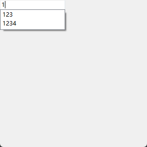
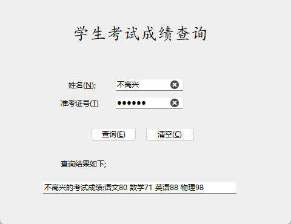
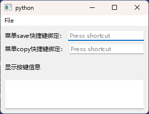
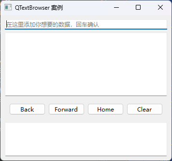
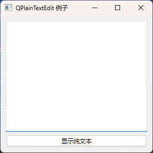

# 08.输入和显示

输人输出控件用于向程序输入数据、显示程序输出的数据,输人输出控件是可视化编程最基本的控件

## 单行文本控件QLineEdit

图形界面上需要输入信息,与程序进行沟通,输人数据信息的控件有单行文本控件、多行文本控件数值输人控件。单行文本输入控件是QLineEdit,继承自QWidget。

可视化应用程序需要在界面上输入数据和显示数据。QLineEdit 控件是单行文本编辑器.用于接收用户输入的字符串数据,并显示字符串数据,输人的整数和浮点数也会当作字符串数据。

可以利用int()和 float()函数将字符串型整数和浮点数转换成整数和浮点数

用QLineEdit类创建单行文本控件的方法如下其中parent是QLineEdit 所在的窗口或容器类控件,text 是显示的文字。

```python
from PySide6.QtWidgets import QLineEdit

QLineEdit(text: str, parent: Union[PySide6.QtWidgets.QWidget, NoneType]=None) -> None
QLineEdit(parent: Union[PySide6.QtWidgets.QWidget, NoneType]=None) -> None
```

### 单行文本控件QLineEdit 的常用方法

QLineEdit 控件可以用于密码输人,可以进行复制粘贴、删除等操作。单行文本控件QLineEdit 的常用方法如表所示

#### 主要方法介绍

| QLineEdit的方法及参数类型       | 返回值的类型 | 说明                           |
| ------------------------------- | ------------ | ------------------------------ |
| [slot]setText(str)              | None         | 设置文本内容                   |
| insert(str)                     | None         | 在光标处插人文本               |
| text()                          | str          | 获取真实文本,而不是显示的文本  |
| displayText()                   | str          | 获取显示的文本                 |
| setMask(QBitmap)                | None         | 设置遮掩图像                   |
| setModified(bool)               | None         | 设置文本更改状态               |
| setPlaceholderText(str)         | None         | 设置占位符                     |
| placeholderText()               | str          | 获取占位符                     |
| setClearButtonEnabled(bool)     | None:        | 设置是否有清空按钮             |
| isClearButtonEnabled()          | bool         | 获取是否有清空按钮             |
| setMaxLength(int)               | None         | 设置文本的最大长度             |
| maxLength()                     | int          | 获取文本的最大长度             |
| setReadOnly(bool)               | None         | 设置只读模式,只能显示,不能输人 |
| setAlignment(Q1.Alignment)      | None         | 设置对齐方式                   |
| setFrame(bool)                  | None         | 设置是否显示外框               |
| backspace()                     | None         | 删除光标左侧或选中的文字       |
| isModified()                    | bool         | 获取文本是否被更政             |
| isReadOnly()                    | bool         | 获取是否只读模式               |
| del()                           | None         | 删除光标右侧或选中的文字       |
| [slot]clear()                   | None         | 删除所有内容                   |
| [slot]copy()                    | None         | 复制选中的文本                 |
| [slot]cut()                     | None         | 剪切选中的文字                 |
| [slot]paste()                   | None         | 粘贴文字                       |
| isUndoAvailable()               | bool         | 是否可以撤销操作               |
| [slot]undo()                    | None         | 撤销操作                       |
| isRedoAvailable(                | None         | 是否可以恢复撤销操作           |
| [slot]redo()                    | None         | 恢复撤销操作                   |
| setDragEnabled(bool)            | None         | 设置文本是否可以拖放           |
| setEchoMode(QLineEdit.EchoMode) | None         | 设置显示模式                   |
| setTextMargins(QMargins)        | None         | 设置文本区域到外框的距离       |
| setCompleter(QCompleter)        | None         | 设置辅助补全的内容             |

- 由于单行文本控件可以用于输入密码,其显示的内容并不一定是输人的内容。用setText(str)方法设置文本内容,

  - 用text)方法获取真实的文本而不是界面上显示的文本,例如在密码输人模式下,得到的是输人的密码,而不是界面上显示的掩码
  - 用displayText()方法获取显示的文本内容。

- 用setEchoMode(QLineEdit.EchoMode)方法可以设置成密码输入方式,其中QLineEditEchoMode的取值是枚举类型,可以设置的值如表所示

  | QLineEdit.EchoMode的取值     | 值   | 说 明                                                        |      |
  | ---------------------------- | ---- | ------------------------------------------------------------ | ---- |
  | QLineEdit.Normal             | 0    | 正常显示输入的字符,这是默认值                                |      |
  | QLineEdit.NoEcho             | 1    | 输入文字时不显示任何输入,文字内容和个数都不可见,常用于密码保护 | i    |
  | QLineEdit.Password           | 2    | 显示密码掩码,不显示实际输入的字符,能显示字符个数             |      |
  | OLineEdit.PasswordEchoOnEdit | 3    | 在编辑的时候显示字符,不编辑的时候显示掩码                    |      |

- setPlaceholderText()是在 QLineEdit 中灰色显示的字符常用于提示信息,例如setPlaceholderText("请输人密码")。当输人真实文字时,不再显示提示信息。

- QLineEdit 中输人的数据有时只能为整数,有时只能为点数,这时就需要对输人的数据进行合法性检验。

  - QLineEdit 的合法性检验用setValidator(QValidator)方法它的参数是一个QValidator类,QValidator 类用来检查输人内容的合法性,当输人内容合法时,才能成功输人并在输人框中显示。
  - QValidator 是一个抽象类其子类QIntValidator,QDoubleValidator分别用来设置合法整数和合法浮点数,还有一个子类QRegExpValidator 结合正则表达式来判断输人的合法性。
    - QIntValidator 设置整数范围的下限和上限,其使用方法是QIntValidator(int,int,parent=None),其中第1个int是下限,第2个int是上限;
      - 用QIntValidator的setRange(int,int)、setBottom(int)和 setTop(int)方法来设置下限和上限,
      - 例如 QLineEdit.setValidator(QIntValidator(0,100))可以设置 QLineEdit 只能输人0到100的整数。
    - QDoubleValidator
      - 使用方法是 QDoubleValidator(float,float,int,parent=None),其中第 1个float 参数是下限第2个at 参数是上限int 是小数的位数
        - 同样也可通过 setRange(float,float, int)、setBottom(float)、setTop(float)和setDecimals(int)方法来设置下限、上限和小数位数。

- 在QLineEdit 中输入数据时,可以有辅助性的提示信息帮助快速完成输入

  - 用setCompleter(QCompleter)方法设置辅助补全的内容,其中QCompleter 是辅助补全的类。

        - 创建辅助补全的方法为 
        QCompleter(cornpletions:Sequence[str],parent:QObject=None)
        QCompleter(model: QAbstractItemModel,parent; QObject=None)
        QCompleter(parent: QObject]=None)
        用QCompleter 的 setModel(QAbstractItemModel)方法设置数据模型有关数据模型的内容参见第5章。

       - 用setCompletionMode(mode:QCompleter,CompletionMode)方法设置模式,其中枚举类型QCompleter.CompletionMode可以取:

         - QCompleter,PopupCompletion(弹窗模式)
         - QCompleter.InlineCompletion(输框内选中模式)
         - QCompleter.UnfilteredPopupCompletion(以弹窗模式列出所有可能的选项)

         用代码在QLineEdit 中插人文字或选择文字时,需要定位光标的位置,获取或移动光标的方法如表所示。

         | QLineEdit的光标方法               | 说明                                          |
         | --------------------------------- | --------------------------------------------- |
         | cursorBackward(mark=True,steps=1) | 向左移动step个字符,mark为True时带选中效果     |
         | cursorForward(mark=True,steps=1)  | 向右移动step个字符,mark为True时带选中效果     |
         | cursorWordBackward(mark=True)     | 向左移动一个单词的长度,mark为True时带选中效果 |
         | cursorWordForward(mark=True)      | 向右移动一个单词的长度,mark为True时带选中效果 |
         | home(mark=True)                   | 光标移动至行首,mark为True时带选中效果         |
         | end(mark=True)                    | 光标移动至行尾,mark为True时带选中效果         |
         | setCursorPosition(int)            | 光标移动至指定位置                            |
         | cursorPosition()                  | 获取光标位萱,返回值是int                      |
         | cursorPositionAt(OPoint)          | 获取指定位置处光标位置,返回值是int            |

- 对 QLineEdit 中的文本可以进行复制粘贴删除等操作,一般都需要先选择文本然后再操作。选择文本的方法如表所示。

  | 文本选择方法           | 说明                     |
  | ---------------------- | ------------------------ |
  | setSelection(int, int) | 选择指定范围内的文本     |
  | [slot]selectAll()      | 选择所有的文本           |
  | deselect()             | 取消选择                 |
  | hasselectedText()      | 是否有选择的文本         |
  | selectionLength()      | 获取选择的文本的长度     |
  | selectionStart()       | 获取选择的文本的起始位置 |
  | selectionEnd(          | 获取选择的文本的终止位置 |
  | selectedText()         | 获取选择的文本           |

- 对于需要输人固定格式的文本,例如 IP 地址、MAC 地址License 序列号,可以用setInputMask()方法来定义这种固定的格式。

  - 例如 setInputMask("000.000.000.000")和setInputMask("000.000.000.000;_")方法都可以输人IP地址。后者在未输入字符的位置用下划线来表示空位;

  - setInputMask("HH:HH:HH:HH:HH:HH")和 setInputMask("HH,HH:HH:HH:HH:HH;")方法都可以输MAC地址;

  - setInputMask("0000-00-00")方法可以输入ISO标准格式日期,

  - setInputMask(">AAAAA-AAAAA-AAAAA-AAAAA-AAAAA;#")方法可以用于输人 License 序列号,所有字母转换为大写。可以用于格式化输入的字符如表所示

    | 字符 | 含义                                            |
    | ---- | ----------------------------------------------- |
    | `A`  | ASCI字母是必需的,取值范围为A~2、a~z             |
    | `a`  | ASCI字母是允许的,但不是必需的                   |
    | `N`  | ASCII字母和数字是必需的,取值范围为A~Z,a~z,0-9   |
    | `n`  | ASCI字母和数字是允许的,但不是必需的             |
    | `X`  | 任何字符都是必需的                              |
    | `x`  | 任何字符都是允许的,但不是必需的                 |
    | `9`  | ASCI数字是必需的,取值范围为0~9                  |
    | `0`  | ASCII数字是允许的,但不是必需的                  |
    | `D`  | ASCII数字是必需的,取值范围为1-9                 |
    | `d`  | ASCII数字是允许的,但不是必需的,取值范围为1~9    |
    | `#`  | ASCII数字或加/减符号是允许的,但不是必需的       |
    | `H`  | 十六进制数据字符是必需的,取值范围为A~F、a~f,0-9 |
    | `h`  | 十六进制数据字符是允许的,但不是必需的           |
    | `B`  | 二进制数据字符是必需的,取值为0、1               |
    | `b`  | 二进制数据字符是允许的,但不是必需的             |
    | `>`  | 所有的字符字母都大写                            |
    | `<`  | 所有的字符字母都小写                            |
    | `!`  | 关闭大小写转换                                  |
    | `\`  | 使用\去转义上述列出的特殊字符                   |
    | `;c` | 终止输入遮掩,并把空余输入设置成c                |

#### 文本的设置和获取

- setText(str) 设置内容文本
- insert(newText) 在光标处插入文本
- text() 获取真实内容文本
- displayText() 获取用户能看到的内容文本

#### 输出模式

- setEchoMode(QLineEdit.EchoMode)
  - QLineEdit.EchoMode
    - NoEcho=1 不输出
    - Normal=0 正常输出
    - Password=2 密文形式
    - PasswordEchoOnEdit=3 编辑时明文, 结束后密文
- echoMode() -> QLineEdit.EchoMode 获取输出模式

#### 灰色输入提示字符串(占位文本)

- setPlaceholderText(notice_str) 设置灰色提示字符串
- placeholderText() 获取灰色提示字符串

#### 清空按钮显示

用作快速清空文本框内容,实现快速清空已输入信息

- setClearButtonEnabled(bool) 设置是否添加清空
- isClearButtonEnabled() -> bool 是否添加清空

#### 添加操作行为

常用于用于密码输入框的明文密文输入切换。

- addAction(QAction, QLineEdit.ActionPosition)
  - QLineEdit.ActionPosition 添加动作放的位置
    - QLineEdit.LeadingPosition 搁前面
    - QLineEdit.TrailingPosition 搁后面
- addAction(QIcon, QLineEdit.ActionPosition) -> QAction 添加动作,同菜单的addAction方法

#### 自动补全

设置当输入部分文文本下拉框提示完整文本,类似于QQ登录时输入登录账号不需要输入完整账号名称就提示历史已输入账号名称

- setCompleter(QCompleter) 设置完成器

  - completer() -> QCompleter 完成器对象

    - 导入:`from PySide6.QtWidgets import QCompleter`

    - 实例化:

    - ```python
      QCompleter(completions: Sequence[str], parent: Union[PySide6.QtCore.QObject, NoneType]=None) -> None 
      
      QCompleter(model: PySide6.QtCore.QAbstractItemModel, parent: Union[PySide6.QtCore.QObject, NoneType]=None) -> None 
      
      QCompleter(parent: Union[PySide6.QtCore.QObject, NoneType]=None) -> None
      ```

  - 例子:

    

    ```python
    import sys
    from PySide6.QtWidgets import QApplication, QWidget, QLabel, QLineEdit, QCompleter
    
    
    class win_demo(QWidget):
        def __init__(self, parent=None):
            super().__init__(parent)
            self.set_windows()
            self.business_demo()
    
        def set_windows(self):
            self.resize(300, 300)  # 设置窗口大小
            self.setWindowTitle("hello world")  # 设置窗口标题
    
        def business_demo(self):
            line_edit=QLineEdit(self)
    
            # 创建完成器对象,第一个参数需要用字符串即使输入的是数字
            completer=QCompleter(["123", "234", "235", "345", "356", "456", "457", "1234"], self)
    
            # 设置完成其
            line_edit.setCompleter(completer)
    
    
    if __name__=='__main__':
        app=QApplication(sys.argv)
        win=win_demo()
    
        win.show()
        sys.exit(app.exec())
    ```

#### 输入限制

限制用户在文本框中输入的内容

- 内容长度限制

  - setMaxLength(int) 设置限制输入的最大长度
  - maxLength() 获取输入最大长度

- 只读限制

  - setReadOnly(bool)
  - isReadOnly()

- 规则验证

  setValidator(QValidator) 设置验证器

     - QValidator 验证器 用于验证用户输入数据的合法性,下面单独说明

     - setInputMask(mask_str) 掩码验证

- 判定输入文本是否通过验证

  - hasAcceptableInput()

##### QValidator验证器

如果一个输入框设置了验证器,用户在文本框中输入内容时,首先会将内容传递给验证器验证方法(validate)进行验证:validate(self, input_text, pos)

- return QValidator.State.Acceptable, input_text, pos_int #验证通过
- return QValidator.State.Intermediate, input_text, pos_int #暂不作判定是否通过验证,用于输入过渡时不做判断
- return QValidator.State.Invalid, input_text, pos_int #验证不通过

如果输入框结束输入后, 上述的验证状态并非有效, 则会调用修复方法fixup(self, input_text)

- return 修正后文本,
- 返回修正后的的文本还会再次调用validate验证

是一个抽象类, 使用前需要进行子类化操作

- 自定义子类
  - 需要实现validate方法
  - 修复方法fixup可以根据需要选择是否进行实现,当validate验证不通过时会把输入字符传给fixup进行修复。
- 系统提供子类
  - QIntValidator(bottom, top, parent) 限制整型数据范围
  - QDoubleValidator 浮点类型数据限制范围 经测试, 无效 需要手动实现
  - QRegExpValidator 通过正则表达式限定

例子:

```python
import sys

from PySide6.QtGui import QValidator
from PySide6.QtWidgets import QApplication, QWidget, QLabel, QLineEdit, QCompleter


class IntValidator60(QValidator):
    """验证输入整数且60-80"""

    def validate(self, input_text: str, pos_int: int) -> object:
        """验证方法"""
        try:
            if input_text=="":
                return QValidator.State.Intermediate, input_text, pos_int  # 暂不作判定是否通过验证
                # return QValidator.State.Acceptable, input_text, pos_int  # 验证通过
            elif 1 <=int(input_text) <=17:
                return QValidator.State.Intermediate, input_text, pos_int  # 暂不作判定是否通过验证
            elif any([80 > int(input_text), int(input_text) > 180]):
                return QValidator.State.Invalid, input_text, pos_int  # 验证不通过
            else:
                return QValidator.State.Acceptable, input_text, pos_int  # 验证通过
        except(ValueError, BaseException):
            return QValidator.State.Invalid, input_text, pos_int  # 验证不通过

    def fixup(self, arg__1: str) -> str:
        """修复方法"""
        print(f"修复方法传入{arg__1},验证不通过,但是强制修复通过了")
        return "100"


class IntValidator30(QValidator):
    """验证输入整数且30-40"""

    def validate(self, input_text: str, pos_int: int) -> object:
        """验证方法"""
        try:
            if input_text in["3", ""]:
                return QValidator.State.Intermediate, input_text, pos_int  # 暂不作判定是否通过验证
            elif input_text=="":
                return QValidator.State.Acceptable, input_text, pos_int  # 验证通过
            elif any([40 < int(input_text), int(input_text) < 10]):
                return QValidator.State.Invalid, input_text, pos_int  # 验证不通过
            else:
                return QValidator.State.Acceptable, input_text, pos_int  # 验证通过
        except(ValueError, BaseException):
            return QValidator.State.Invalid, input_text, pos_int  # 验证不通过


class win_demo(QWidget):
    def __init__(self, parent=None):
        super().__init__(parent)
        self.set_windows()
        self.business_demo()

    def set_windows(self):
        self.resize(300, 300)  # 设置窗口大小
        self.setWindowTitle("hello world")  # 设置窗口标题

    def business_demo(self):
        line_60_180=QLineEdit(self)
        line_60_180.setPlaceholderText("输入60-180,有修复方法")

        line_30_40=QLineEdit(self)
        line_30_40.setPlaceholderText("输入30-40,无修复方法")
        line_30_40.move(0, line_60_180.height())

        # 设置验证器
        line_60_180.setValidator(IntValidator60())
        line_30_40.setValidator(IntValidator30())


if __name__=='__main__':
    app=QApplication(sys.argv)
    win=win_demo()

    win.show()
    sys.exit(app.exec())

```

#### 是否被编辑

标识文本内容是否被修改过

- isModified() 获取文本是否原始状态(一般为空白)
- setModified(bool) 设置当前为原始状态(即使修改过内容也会更改状态,但不会修改文本)

#### 光标控制

控制光标, 以及文本选中操作

- cursorBackward(mark:bool ,steps :int=1) 向后(左)移动steps个字符
  - mark: bool 是否带选中效果
- cursorForward(mark:bool ,steps :int=1) 向前(右)移动steps个字符
  - mark: True 是否带选中效果
- cursorWordBackward(bool mark) 向后(左)移动一个单词长度(以空格为间隔)
  - mark: True 是否带选中效果
- cursorWordForward(bool mark) 向前(右)移动一个单词长度(以空格为间隔)
  - mark: True 是否带选中效果
- home(bool) 移动到行首
  - bool标识是否带选中效果
- end(bool) 移动到行尾
  - bool标识是否带选中效果
- setCursorPosition(int) 设置光标位置
- cursorPosition() 获取光标位置
- cursorPositionAt(pos: PySide6.QtCore.QPoint) 获取指定坐标位置对应文本光标位置

#### 文本边距设置

实际作用是在指定空间内 左右调整输入区域,上下以中心为原点调整文字位置

- setTextMargins(left: int,top: int,right: int,bottom: int) 设置文本内容边距
- getTextMargins() 获取文本内容边距

#### 对齐方式

设置用户输入的内容文本对齐方式

setAlignment(Qt.Alignment) 设置输入文本的对齐方式

可通过`|`连接水平和垂直参数同时设置两个方向对齐方式。

- Qt.Alignment
  - 水平方向
    - Qt.AlignLeft
    - Qt.AlignRight
    - Qt.AlignHCenter
    - Qt.AlignJustify 自适应
  - 垂直方向
    - Qt.AlignTop
    - Qt.AlignBottom
    - Qt.AlignVCenter
    - Qt.AlignBaseline
  - 居中对齐
    - Qt.AlignCenter 垂直和水平都居中,等同于 Qt.AlignHCenter | Qt.AlignVCenter

#### 常用编辑功能

| 方法                              | 说明                                            |
| --------------------------------- | ----------------------------------------------- |
| `backspace()`                     | 退格,删除选中文本(如果有)或删除光标左侧一个字符 |
| `del_()`                          | 删除选中文本(如果有)或删除光标右侧一个字符      |
| `clear()`                         | 清空,删除所有文本框内容                         |
| `copy()`                          | 复制选中文本                                    |
| `cut()`                           | 剪切选中文本                                    |
| `paste()`                         | 粘贴已复制文本                                  |
| `isUndoAvailable() -> bool`       | 判断当前是否可以撤销                            |
| `undo()`                          | 撤消                                            |
| `isRedoAvailable() -> bool`       | 判断当前是否可以重做                            |
| `redo()`                          | 重做                                            |
| `setDragEnabled(bool)`            | 设置选中文本后是否可以拖拽到其他位置            |
| `setSelection(start_pos, length)` | 选中指定区间的文本                              |
| `setSelection(start_pos, length)` | 选中指定区间的文本                              |
| `selectAll()`                     | 选中所有文本                                    |
| `deselect()`                      | 取消选中已选择文本                              |
| `hasSelectedText()`               | 是否有选中文本                                  |
| `selectedText() -> str`           | 获取选中的文本                                  |
| `selectionStart() -> int`         | 选中的开始位置                                  |
| `selectionEnd() -> int`           | 选中的结束位置                                  |
| `selectionLength() -> int`        | 选中的长度                                      |

### 单行文本控件QLineEdit 的信号

| QLineDdit 的信号及参数类型                    | 说 明                                                        |
| --------------------------------------------- | ------------------------------------------------------------ |
| textEdited(tex: str)                          | 文本被编辑时发送信号,不适用setText()方法引起的文本改变       |
| textChanged(text: str)                        | 文本发生变化时发送信号,包括setIext()方法引起的文本改变       |
| returnPressed()                               | 按 Enter键时发送信号                                         |
| editingfinished()                             | 按 Enter或失去焦点时发送信号                                 |
| cursorPostionChanged(oldPosr int,newPos: int) | 光标位置发生变化时发送信号,第1个参数是光标原位置,第2个参 数是光标移动后的位置 |
| selectionChanged)                             | 选中的文本发生变化时发送信号                                 |
| inputRejectedO                                | 拒绝输入时发送信号                                           |

### 单行文本控件QLineEdit的应用实例

下面的程序建立一个学牛考试成绩查询的界面如图所示。在界面中输人名和准考证号,单击"查询"按钮,可以显示查找的学生成绩,如果查不到,会显示"查无此人",单击"清空"按钮删除输入的姓名、准考证号和查询到的成绩。



```python
from PySide6.QtWidgets import QApplication, QWidget, QPushButton, QLabel, QLineEdit
from PySide6.QtGui import QFont, QIntValidator
from PySide6.QtCore import QRect
import sys


class MyWidget(QWidget):
    def __init__(self, parent=None):
        super().__init__(parent)
        self.setWindowTitle("生成绩查询系统")
        self.setGeometry(400, 200, 480, 370)
        self.setupUi()

        self.__data=[[202003, '没头脑', 89, 88, 93, 87],
                   [202002, '不高兴', 80, 71, 88, 98],
                   [202004, '倒惩蛋', 95, 92, 88, 94],
                   [202001, "鸭梨头", 93, 84, 84, 77],
                   [202005, "墙头草", 93, 86, 73, 86]] # 学生信息和成绩,可从文件读取

    def setupUi(self):  # 创建界面上的控件
        self.label_1=QLabel(self)
        self.label_1.setGeometry(QRect(120, 40, 231, 31))
        font=QFont("楷体", pointSize=20)
        self.label_1.setFont(font)
        self.label_1.setText("学生考试成绩查询")

        self.label_2=QLabel(self)
        self.label_2.setGeometry(QRect(113, 130, 60, 20))
        self.label_2.setText("姓名(&N);")

        self.label_3=QLabel(self)
        self.label_3.setGeometry(QRect(100, 160, 70, 20))
        self.label_3.setText("准考证号(&T)")

        self.label_4=QLabel(self)
        self.label_4.setGeometry(QRect(100, 260, 100, 20))
        self.label_4.setText("查询结果如下;")

        self.lineEdit_name=QLineEdit(self)
        self.lineEdit_name.setGeometry(QRect(190, 130, 113, 20))
        self.lineEdit_name.setClearButtonEnabled(True)

        # 设置"清空"按钮
        self.lineEdit_number=QLineEdit(self)
        self.lineEdit_number.setGeometry(QRect(190, 160, 113, 20))
        self.lineEdit_number.setValidator(QIntValidator(202001, 202100))  # 设置验证
        self.lineEdit_number.setEchoMode(QLineEdit.EchoMode.Password)  # 设置密码形式
        self.lineEdit_number.setClearButtonEnabled(True)  # 设置"清空"按钮
        self.lineEdit_results=QLineEdit(self)
        self.lineEdit_results.setGeometry(QRect(70, 300, 321, 20))

        self.lineEdit_results.setReadOnly(True)  # 设置只读属性

        self.label_2.setBuddy(self.lineEdit_name)  # 伙伴关系
        self.label_3.setBuddy(self.lineEdit_number)  # 伙伴关系
        self.btn_enquire=QPushButton(self)
        self.btn_enquire.setGeometry(QRect(150, 210, 75, 23))
        self.btn_enquire.setText("查询(&E)")
        self.btn_enquire.clicked.connect(self.inquire)  # 信号与槽的连接

        self.btnClear=QPushButton(self)
        self.btnClear.setGeometry(QRect(240, 210, 81, 23))
        self.btnClear.setText("清空(&C)")
        self.btnClear.clicked.connect(self.lineEdit_name.clear)  # 信号与槽的连接
        self.btnClear.clicked.connect(self.lineEdit_number.clear)  # 信号与槽的连接
        self.btnClear.clicked.connect(self.lineEdit_results.clear)  # 信号与槽的连接
        self.lineEdit_name.textChanged.connect(self.text_changed)  # 信号与槽的连接
        self.lineEdit_number.textChanged.connect(self.text_changed)  # 信号与槽的连接
        self.text_changed()

    def inquire(self):
        number=int(self.lineEdit_number.text())
        template="{}的考试成绩:语文{} 数学{} 英语{} 物理{}"
        for i in range(len(self.__data)):
            stu=self.__data[i]
            if stu[0]==number and stu[1]==self.lineEdit_name.text():
                self.lineEdit_results.setText(template.format(stu[1], stu[2], stu[3], stu[4], stu[5]))
                break
            else:
                if i==len(self.__data) - 1:
                    self.lineEdit_results.setText("查无此人")

    def text_changed(self):
        if self.lineEdit_number.text() !="" and self.lineEdit_name.text() !="":
            self.btn_enquire.setEnabled(True)

        else:
            self.btn_enquire.setEnabled(False)

            if self.lineEdit_number.text() !="" or self.lineEdit_name.text() !="":
                self.btnClear.setEnabled(True)
            else:
                self.btnClear.setEnabled(False)


if __name__=='__main__':
    app=QApplication(sys.argv)
    win=MyWidget()

    win.show()
    sys.exit(app.exec())

```

## 键位序列编辑keySequenceEdit

控件允许允许用户选择QKeySequence,它通常用作快捷方式。当小部件接收到焦点时开始录制,并在用户释放最后一个键后一秒结束录制。

keySequenceEdit直接继承自QtWidgets

```python
from PySide6.QtGui import QKeySequence

QKeySequence(self) -> None
QKeySequence(k1: int, k2: int=0, k3: int=0, k4: int=0) -> None
QKeySequence(k1: Union[PySide6.QtCore.QKeyCombination, PySide6.QtCore.Qt.KeyboardModifier, PySide6.QtCore.Qt.Key], k2: Union[PySide6.QtCore.QKeyCombination, PySide6.QtCore.Qt.KeyboardModifier, PySide6.QtCore.Qt.Key]=Instance(QKeyCombination.fromCombined(0)), k3: Union[PySide6.QtCore.QKeyCombination, PySide6.QtCore.Qt.KeyboardModifier, PySide6.QtCore.Qt.Key]=Instance(QKeyCombination.fromCombined(0)), k4: Union[PySide6.QtCore.QKeyCombination, PySide6.QtCore.Qt.KeyboardModifier, PySide6.QtCore.Qt.Key]=Instance(QKeyCombination.fromCombined(0))) -> None
QKeySequence(key: PySide6.QtGui.QKeySequence.StandardKey) -> None
QKeySequence(key: str, format: PySide6.QtGui.QKeySequence.SequenceFormat=Instance(PySide6.QtGui.QKeySequence.SequenceFormat.NativeText)) -> None
QKeySequence(ks: Union[PySide6.QtGui.QKeySequence, PySide6.QtCore.QKeyCombination, PySide6.QtGui.QKeySequence.StandardKey, str, int]) -> None
```

例子:

```python
import sys

from PySide6.QtGui import QKeySequence
from PySide6.QtWidgets import QWidget, QKeySequenceEdit, QApplication


class Window(QWidget):
    def __init__(self):
        super().__init__()
        self.setWindowTitle("QKeySequenceEdit-快捷键设置 - PyQt5中文网")
        self.resize(600, 500)
        self.func_list()

    def func_list(self):
        self.func()

    def func(self):
        # 设置快捷键
        kse=QKeySequenceEdit(self)
        ks=QKeySequence('Ctrl+A')  # 直接使用字符串设置
        # ks=QKeySequence(QKeySequence.Copy)  # 使用枚举值设置
        # ks=QKeySequence(Qt.CTRL + Qt.Key_C, Qt.CTRL + Qt.Key_A)  # 使用枚举值设置
        kse.setKeySequence(ks)

        # 获取快捷键
        # print(kse.keySequence())  # 获取快捷键对象
        # print(kse.keySequence().toString())  # 获取快捷键

        # 清除
        # kse.clear()

        # 信号
        # editingFinished()  # 结束编辑时
        # keySequenceChanged()  # 键位序列发生改变时
        kse.editingFinished.connect(lambda: print(kse.keySequence().toString()))  # 结束之后一秒
        # kse.keySequenceChanged.connect(lambda val: print('AAAA', val.toString()))


if __name__=='__main__':
    app=QApplication(sys.argv)
    window=Window()

    window.show()
    sys.exit(app.exec())

```

### 方法

| 方法                                                         | 返回值                     | 说明                                                         |
| ------------------------------------------------------------ | -------------------------- | ------------------------------------------------------------ |
| setClearButtonEnabled(enable:bool)                           | None                       | 设置键序列编辑在不为空时是否显示清除按钮。<br/>如果启用,键序列编辑在包含某些文本时会显示尾随清除按钮,否则行编辑不会显示清除按钮(默认)。 |
| isClearButtonEnabled()                                       | bool                       | 获取键序列编辑在不为空时是否显示清除按钮。<br/>如果启用,键序列编辑在包含某些文本时会显示尾随清除按钮,否则行编辑不会显示清除按钮(默认)。 |
| [Slots]clear()                                               | None                       | 清除当前键序列。                                             |
| [Slots]setKeySequence(keySequence:PySide6.QtGui.QKeySequence) | None                       | 设置当前选定键序列。<br/>快捷方式可以由用户或通过setter函数进行更改。 |
| keySequence()                                                | PySide6.QtGui.QKeySequence | 返回当前选定的键序列。。<br/>快捷方式可以由用户或通过setter函数进行更改。 |

### 信号

| 信号                                                       | 说明                                 |
| ---------------------------------------------------------- | ------------------------------------ |
| editingFinished()                                          | 当用户完成输入快捷方式时发出该信号。 |
| keySequenceChanged(keySequence:PySide6.QtGui.QKeySequence) | 快捷方式改变时发出该信号。           |


### 例子



```python
# -*- coding: UTF-8 -*-
# File date: Hi_2023/3/14 23:54
# File_name: 03-QKeySequenceEdit的用法.py
"""
QKeySequenceEdit的用法，QKeySequence用法请见qt_QShortcut文件。
"""
import sys
from PySide6.QtCore import *
from PySide6.QtGui import *
from PySide6.QtWidgets import *


class KeySequenceEdit(QMainWindow):
    def __init__(self, parent=None):
        super(KeySequenceEdit, self).__init__(parent)

        # 基本框架
        label1 = QLabel('菜单save快捷键绑定：')
        self.keyEdit1 = QKeySequenceEdit(self)
        label2 = QLabel('菜单copy快捷键绑定：')
        self.keyEdit2 = QKeySequenceEdit(self)
        layout1 = QHBoxLayout()
        layout1.addWidget(label1)
        layout1.addWidget(self.keyEdit1)
        layout2 = QHBoxLayout()
        layout2.addWidget(label2)
        layout2.addWidget(self.keyEdit2)
        self.label_show = QLabel('显示按键信息')
        self.text_show = QTextBrowser()
        self.text_show.setMaximumHeight(60)

        # 信号与槽绑定
        # self.keyEdit1.editingFinished.connect(lambda :print('输入完毕1'))
        # self.keyEdit2.editingFinished.connect(lambda :print('输入完毕2'))
        self.keyEdit1.keySequenceChanged.connect(lambda key: self.save.setShortcut(key))
        self.keyEdit2.keySequenceChanged.connect(lambda key: self.copy.setShortcut(key))
        self.keyEdit1.keySequenceChanged.connect(self.show_key)
        self.keyEdit2.keySequenceChanged.connect(self.show_key)

        # 菜单栏
        bar = self.menuBar()
        file = bar.addMenu("File")
        file.addAction("New")
        self.save = QAction("Save", self)
        file.addAction(self.save)
        self.copy = QAction('Copy', self)
        file.addAction(self.copy)
        file.triggered[QAction].connect(lambda q: self.statusBar().showMessage('触发菜单：%s；快捷键:%s' %(q.text(), q.shortcuts()), 3000))

        # 布局管理
        layout = QVBoxLayout()
        layout.addLayout(layout1)
        layout.addLayout(layout2)
        layout.addWidget(self.label_show)
        layout.addWidget(self.text_show)
        widget = QWidget(self)
        widget.setLayout(layout)
        self.setCentralWidget(widget)
        self.resize(300, 200)

    def show_key(self, key: QKeySequence):
        self.statusBar().showMessage('更新快捷键' + str(key), 2000)
        key1 = self.keyEdit1.keySequence()
        key2 = self.keyEdit2.keySequence()
        _str = f'菜单栏快捷键更新成功；\nsave绑定：{key1}\ncopy绑定：{key2}'
        # self.label_show.setText(_str)
        self.text_show.setText(_str)


if __name__ == '__main__':
    app = QApplication(sys.argv)
    demo = KeySequenceEdit()
    demo.show()
    sys.exit(app.exec())

```


## 多行文本控件QTextEdit

多行文本控件可以用于编辑和显示多行文本和图片,并可对文本进行格式化。

多行文本编辑控件有QTextEdit 和QPlainTextEdit 两种,QTextEdit 和QPlainTextEdit 都是直接继承自QAbstractScrollArea。

QAbstractScrollArea 为其子类提供中心视口(viewport)控件,从而保证子类显示的内容超过控件窗口的范围时,提供竖直和水平滚动条。QTextEdit 是主要用于显示并编辑多行文本的控件,支持富文本,当文本内容超出控件显示范围时,可以显示水平和竖直滚动条。

QTextEdit 不仅可以用来显示文本,还可以用来显示html文档。用QTextEdit类创建实例的方法如下,其中 :

- parent 是 QTextEdit 所在的窗口或容器类控件
- text 是要显示的文本内容。

QTextEdit 可以显示、输入和编辑文本。另外还有个从QTextEdit 继承的类QTextBrowser,通常只用于显示文本。

```python
from PySide6.QtWidgets import QTextEdit

QTextEdit(parent: Union[PySide6.QtWidgets.QWidget, NoneType]=None) -> None
QTextEdit(text: str, parent: Union[PySide6.QtWidgets.QWidget, NoneType]=None) -> None
```

### 多行文本控件QTextEdit的常用方法

多行文本控件QTextEdit 的常用方法如表所示,用这些方法可以编写文字处理工具。

- QTextEdit通常用setPlainText(str)方法设置纯文本;
  - 用setHtml(str)方法设置 html格式的文本;
  - 用toPlainText()方法获取纯文本,
  - 用toHtml()方法获取 tml格式的文本
  - 用append(str)方法在末尾追加文本;
  - 用insertPlainText(str)和isertHtml(str)方法在光标处插入纯文本和 html格式文本;
  - 用setReadOnly(bool)方法可以设置成只读模式,这时用户不能输入数据;
  - 用setCurrentCharFormat(QTextCharFormat)方法设置当前的文本格式
  - 用setTextCuror(QTextCursor)方法设置文档中的光标,可以在光标处插入文字、图像表格选择文字;
  - 用setHorizontalScrollBarPolicy(Qt ScrollBarPolicy)方法和 setVerticalScrollBarPolicy(Qt ScrollBarPolicy)方法可以分别设置水平滚动条和竖直滚动条的调整策略,枚举值 Qt.ScrollBarPolicy 可取:
    - Qt.ScrollBarAsNeeded
    - Qt.ScrollBarAlwaysOff
    - Qt.ScrollBarAlwaysOn;
  - QTextEdit显示的内容是一个QTextDocument文档,用setDocument(QTextDocument)方法可以对文档进行设置。

| QTextEdit的方法及参数类型                                    | 返回值的类型 | 说明                                                         |
| ------------------------------------------------------------ | ------------ | ------------------------------------------------------------ |
| [slot]setText(str)                                           | None         | 设置显示的文字                                               |
| slotlappend(str)                                             | None         | 添加文本                                                     |
| slotlsetPlainText(str)                                       | None         | 设置纯文本文字                                               |
| slot setHtml(str                                             | None         | 设置成html格式的文字                                         |
| slotlinsert Html(str)                                        | None         | 插入html格式的文本                                           |
| slot]insertPlainText(str)                                    | None         | 插入文本                                                     |
| toHtml()                                                     | str          | 获取html格式的文字                                           |
| toPlainText()                                                | str          | 获取纯文本文字                                               |
| createStandardContextMenu([QPoint1)                          | QMenu        | 创建标准的右键快捷菜单                                       |
| setCurrentCharFormat(OTextCharFormat)                        | None         | 设置当前的文本格式                                           |
| find(str)                                                    | bool         | 查找,若找到则返回True                                        |
| print(QPrinter)                                              | None         | 打印文本                                                     |
| setAcceptRichText(bool)                                      | None         | 设置是否接受富文本                                           |
| acceptRichText()                                             | bool         | 获取是否接受富文本                                           |
| setCursorWidth(int)                                          | None         | 设置光标宽度(像素)                                           |
| [slot]setAlignment(Qt.Alignment)                             | None         | 设置文字对齐方式                                             |
| setTextCuror(QTextCursor)                                    | None         | 设置文本光标                                                 |
| textCursor                                                   | QTextCursor  | 获取文本光标                                                 |
| setHorizontalScrollBarPolicy(Qt.ScrollBarPolicy)             | None         | 设置水平滚动条的策略                                         |
| setDocument(QTextDocument)                                   | None         | 设置文档                                                     |
| setDocumentTitle(str)                                        | None         | 设置文档标题                                                 |
| [slot]setCurrentFont(QFont)                                  | None         | 设置当前的字体                                               |
| currentFont()                                                | OFont        | 获取当前的文字字体                                           |
| [slot setFontFamily(str)                                     | None         | 设置当前字体名称                                             |
| fontFamily()                                                 | str          | 获取当前的字体名称                                           |
| [slot]setFontItalic(bool)                                    | None         | 设置当前为斜体                                               |
| fontItalic()                                                 | bool         | 查询当前是否斜体                                             |
| [slot]setFontPointSize(float)                                | None         | 设置当前字体大小                                             |
| fontPointSize()                                              | float        | 获取当前字体大小                                             |
| [slot]setFontUnderline(booll                                 | None         | 设置当前为下划线                                             |
| fontUnderline()                                              | bool         | 查询当前是否为下划线                                         |
| [slot]setFontWeight(int)                                     | None         | 设置当前字体加粗                                             |
| fontWeight()                                                 | in           | 获取当前字体粗细值                                           |
| setOverwriteMode(bool)                                       | None         | 设置替换模式                                                 |
| overwriteMode()                                              | bool         | 查询是否是替换模式                                           |
| setPlaceholderText(str)                                      | None         | 设置占位文本                                                 |
| placeholderText()                                            | str          | 获取占位文本                                                 |
| setReadOnly(bool)                                            | None         | 设置是否只读                                                 |
| isReadOnly()                                                 | bool         | 获取是否只读                                                 |
| setTabStopDistance(float)                                    | None         | 设置按Tab键时后退距离(像素)                                  |
| tabStopDistance()                                            | float        | 获取按Tab键时的后退距离                                      |
| [slot]set TextBackgroundColor(QColor)                        | None         | 设置背景色                                                   |
| textBackgroundColor()                                        | QColor       | 获取背景色                                                   |
| [slot]set TextColor(QColor)                                  | None         | 设置文字颜色                                                 |
| textColor()                                                  | QColor       | 获取文字颜色                                                 |
| setUndoReloEnabled(bool)                                     | None         | 设置是否可以撤销恢复                                         |
| setWordWrapMode(WrapMode: PySide6.QtGui.QTextOption.WrapMode) | None         | 设置长单词换行到下一行模式<br />`from PySide6.QtGui import QTextOption`<br />WrapMode可选(前三个都是不换行，后两个会换行)：<br />NoWrap<br />WordWrap<br />ManualWrap<br />WrapAnywhere<br />WrapAtWordBoundaryOrAnywhere |
| setVerticalScrollBarPolicy(Qt.ScrollBar Policy)              | None         | 设置竖直滚动条的策略                                         |
| [slot]zoomIn(range: int=1)                                   | None         | 放大                                                         |
| zoomlnF(range: float)                                        | None         | 放大                                                         |
| [slot]zoomOut(range: int=1)                                  | None         | 缩小                                                         |
| [slot]select AllC)                                           | None         | 全选                                                         |
| [slot]clear()                                                | None         | 清空全部内容                                                 |
| [slot]copy()                                                 | None         | 复制旋转的内容                                               |
| [slot]cut()                                                  | None         | 剪切选中的内容                                               |
| canPaste()                                                   | bool         | 查询是否可以粘贴                                             |
| [slot]paste()                                                | None         | 粘贴                                                         |
| isUndoRedoEnabled()                                          | bool         | 获取是否可以进行撤销、恢复                                   |
| [slot]undo()                                                 | None         | 撤销上步操作                                                 |
| [slot]redo()                                                 | None         | 恢复撤销                                                     |

### 多行文本控件QTextEdit的信号

多行文本控件QTextEdit的信号如表

| 信号                                     | 描述                             |
| ---------------------------------------- | -------------------------------- |
| copyAvailable(bool)                      | 可以进行复制时发送信号           |
| urrentCharFormatChanged(QTextCharFormat) | 当前文字的格式发生变化时发送信号 |
| cursorPositionChanged()                  | 光标位置变化时发送信号           |
| redoAvailable(bool)                      | 可以恢复撤销时发送信号           |
| selectionChanged()                       | 选择的内容发生变化时发送信号     |
| texiChanged()                            | 文本内容发生变化时发送信号       |
| undoAvailable(bool)                      | 可以撤销操作时发送信号           |

### 文字格式QTextCharFormat

用QTextEdit的 setCurrentCharFormat(QTextCharFormat)方法可以设置文字的字体格式,QTextCharFormat类用于定义宇体的格式参数。文字格式QTextCharFormat的常用方法如表所示。

- 用setFont(QFont,behavior=QTextCharFormat.FontProperticsAll)方法设置字体,其中参数 behavior 可以取:

  - QTextCharFormat.FontPropertiesSpccifiedOnly 在没有明确改变一个属性时不改变属性的值
  - QTextCharFormat.FontPropertiesAll,用默认的值覆盖现有的值

- 用setUnderlineStyle(QTextCharFormat.UnderlineStyle)方法设置下划线的风格,其中枚举值 QTextCharFormat.UnderlineStyle 可以取以下值,对应值分别是0~7:

  - QTextCharFormat.NoUnderline
  - QTextCharFormat.SingleUInderline
  - QTextCharFormat.DashUnderline
  - QTextCharFormat.DotLine
  - QTextCharFormat.DashDotLine
  - QTextCharFormat.DashDotDotLine
  - QTextCharFormat.WaveUnderline
  - QTextCharFormat.SpellCheckUnderline

- 用setVerticalAlignment(QTextCharFormat.VerticalAlignment)方法设置文字在竖直方向的对齐方式举值 QTextCharFormat.VerticalAlignment 可以取以下值,对应值分别是 0~6:

  - QTextCharFormat.AlignNormal
  - QTextCharFormat.AlignSuperScript
  - QTextCharFormat.AlignSubScript
  - QTextCharFormat.AlignMiddle
  - QTextCharFormat.AlignBottom
  - QTextCharFormat.AlignTop
  - QTextCharFormat.AlignBaseline

  | QTextCharFormat的方法及参数类型                            | 说明                                                         |
  | ---------------------------------------------------------- | ------------------------------------------------------------ |
  | setFont(QFont, bebavior=QTextCharFormat FontPropertiesAll) | 设置字体                                                     |
  | setFontCapitalization(QFont.Capitalization)                | 设置大小写                                                   |
  | setFontFamilies(families: Sequence[str])                   | 设置字体名称                                                 |
  | setFontFamily(family: str)                                 | 设置字体                                                     |
  | setFontFixedPitch(fixedPitch: bool)                        | 设置固定宽度                                                 |
  | setFontItalic(italic: bool)                                | 设置斜体                                                     |
  | setFontKerning(enable: bool)                               | 设置字距                                                     |
  | setFontLetterSpacing(float)                                | 设置字符间院                                                 |
  | setFontLetterSpacing Type(QFont.Spacing Type)              | 设置字符间隙样式                                             |
  | setFontOverline(overline: bool)                            | 设置上划线                                                   |
  | setFontPointSize(size: float)                              | 设置字体尺寸                                                 |
  | setFontStretch(factor: int)                                | 设置拉伸百分比                                               |
  | setFontStrikeOut(strikeOut: bool)                          | 设置删除线                                                   |
  | setFontUnderline(underline: bool)                          | 设置下划线                                                   |
  | setFontWeight(weight; int)                                 | 设置字体粗细程度                                             |
  | setFont WordSpacing(spacing: float)                        | 设置字间距                                                   |
  | setSubScriptBaseline(baseline: float=16,67)                | 设置下标位置(字体高度百分比值)                               |
  | setSuperScriptBaseline(baseline: float=50)                 | 设置上标位置(字体高度百分比值)                               |
  | setTextOutline(pen: Union Qt.PenStyle.OColorl)             | 设置轮廓线的颜色                                             |
  | setBaselineOffset(baseline: float)                         | 设置文字上下偏移的百分比,正值向上移动,负值向下移动           |
  | setToolTip(tip: str)                                       | 设置片段文字的提示信息                                       |
  | setUnderlineColor(Union[QColor, Qt.GlobalColor])           | 设置下划线的颜色                                             |
  | setUnderlineStyle(QTextCharFormat.UnderlineStvle)          | 设置下划线的风格                                             |
  | setVerticalAlicnment(QTextCharFormat.VerticalAlianmet)     | 设置文字竖直方向对齐样式                                     |
  | setAnchor(anchor: bool)                                    | 设置成锚点                                                   |
  | setAnchorHref(value: str)                                  | 将给定文本设置成超链接                                       |
  | setAnchorNames(names: Sequence[str])                       | 设置超链接名,目标公须用setAnchor()和 setAnchorHref()方法设置过 |

### 文本光标QTextCursor

QTextCursor 类是 QTextEdit 文档中的光标用于获光标在文档中的位置,选择文字,在光标位置处插人文本、图像文本块(段落)和表格等。

用QTextCursor 创建光标对象的方法如下所示,可以为一个文档创建多个 QTextCursor 光标。

```python
from PySide6.QtGui import QTextCursor

QTextCursor(self) -> None
QTextCursor(block: PySide6.QtGui.QTextBlock) -> None
QTextCursor(cursor: PySide6.QtGui.QTextCursor) -> None
QTextCursor(document: PySide6.QtGui.QTextDocument) -> None
QTextCursor(frame: PySide6.QtGui.QTextFrame) -> None 
```

#### 文本光标 QTextCursor 的常用方法

如果文档中有锚点 anchor(),则在锚点位置和光标位置 position()之间的文本会被选中。

- 用setPosition(pos:int,mode=QTextCursorMoveAnchor)方法移动光标或点到指定位置,参数 mode可取:
  - QTextCursor。MoveAnchor
  - QTextCursor。KeepAnchor;
- 用setCharFormat(QTextCharFormat)方法可以设置文本的格式;
- 用insertText(str)或insertHtml(str)方法插人文本;
- 用insertImage(QTextImageFormat)方法插入图像;
- 用insertTable(rows;int;cols:int)方法插人表格

| QTextCursor的方法及参数类型                       | 返回值的类型     | 说 明                         |
| ------------------------------------------------- | ---------------- | ----------------------------- |
| setCharFormat(QTextCharFormat)                    | None             | 设置文本的格式                |
| setPosition(pos: int,mode=QTextCursor.MoveAnchor) | None             | 移动光标或锚点到指定位置      |
| setBlockCharFormat(QTextCharFormat)               | None             | 设置块内文本的格式            |
| setBlockFormat(QTextBlockFormat)                  | None             | 设置块(段落)的格式            |
| insertText(str)                                   | None             | 插人文本                      |
| insertText(str,QTextCharFormat)                   | None             | 同上                          |
| insertBlock()                                     | None             | 插人新文本块                  |
| insertBlock(QTextBlockFormat)                     | None             | 同上                          |
| insertFragment(fragment: QTextDocumentFragment)   | None             | 插人文本片段                  |
| insertFrame(QTextFrameFormat)                     | QTextFrame       | 插人框架                      |
| insertHtml(str)                                   | None             | 插人 html文本                 |
| insertImage(QTextImageFormat)                     | None             | 插入带格式的图像              |
| insertImage(QImagename: str=")                    | None             | 插入图像                      |
| insertImage(name:str)                             | None             | 同上                          |
| insertList(QTextListFormat)                       | QTextList        | 插入列表标识                  |
| insertList(QTextListFormat.Style)                 | QTextList        | 同上                          |
| insertTable(rows: int,cols: int)                  | QTextTable       | 插入表格                      |
| insertTable(rows: int,cols: int,QTextTableFormat) | QTextTable       | 插入带格式的表格              |
| atBlockStart()                                    | bool             | 获取光标是否在块的起始位置    |
| atEnd()                                           | b001             | 获取光标是否在文档的末尾      |
| atStart()                                         | bool             | 获取光标是否在文档的起始 位置 |
| block()                                           | QTextBlock       | 获取光标所在的文本块(段落)    |
| blockCharFormat()                                 | QTextCharFormat  | 获取字符格式                  |
| blockFormat()                                     | QTextBlockFormat | 获取文本块的格式              |
| charPormat()                                      | QTextCharFormat  | 获取字符格式                  |
| clearSelection()                                  | None             | 清除选择,将锚点移到光标 位置  |
| deleteChar()                                      | None             | 删除选中的或当前的文字        |
| deletePreviousChar()                              | None             | 删除选中的或光标之前的文字    |
| document()                                        | QTextDocument    | 获取文档                      |
| position()                                        | int              | 获取光标的绝对位置            |
| positionInBlock()                                 | int              | 获取光标在块中的位置          |
| removeSelectedText()                              | None             | 删除选中的文字                |
| selectedText()                                    | Str              | 获取选中的文本                |

扩展:

对QTextEdit 中的文字进行更详细的排版格式化插人表格等操作,还需要其他一些类的支持,这些类包括:

> - QTextBlock
> - QTextBlockFormat
> - QTextBlockGroup
> - QTextBlockUserData
> - QTextDocument
> - QTextDocumentFragment
> - QlextDocumentWriter
> - QTextFragment
> - QTextFrame
> - QTextFrameFormat
> - QTextInlineObject
> - QTextltem
> - QTextLayout
> - QTextLength
> - QTextLineQTextList
> - QTextListFormat
> - QTextObject
> - QTextObjectInterface
> - QTextOption
> - QTextTabale
> - QTextTableCell
> - QTextTableCellFormat
> - QTextTableFormat

### 多行文本控件QTextEdit的应用实例

下面的程序建立一个简单的文字处理界面,如图所示,单击"打开文本文件"按钮可以从 txt文件中导人数据到 QTextEdit 中;

单击"插人文本"按钮,可以在光标处插人文本和超链接文本;

单击"插人图像文件"按钮,可以从硬盘上打开一个图形文件并插人到光标位置;

单击"作为系统输出"按钮,将把 help()print()函数的输出内容直接输出到QTextEdit中。

为了将窗口作为系统的标准输出这里使用了sysstdout=self和sysstderr=self语另外还必须为窗口编写write()函数读者还可以进一步编写设置字体名称、尺寸和颜色的代码,还可以增加复制粘贴剪切撤销、恢复撤销等的代码


```python
import sys
from PySide6.QtWidgets import(QApplication, QWidget, QPushButton, QHBoxLayout, QVBoxLayout, QTextEdit)
from PySide6.QtGui import QTextImageFormat
from PySide6.QtWidgets import QFileDialog


class MyWidget(QWidget):

    def __init__(self, parent=None):
        super().__init__(parent)
        self.setWindowTitle("文字处理")

        self.setupUi()
        self.btnOpen.clicked.connect(self.openText)  # 信号与槽的连接
        self.btnInsert.clicked.connect(self.insertText)  # 信号与槽的连接
        self.btnImage.clicked.connect(self.openImage)  # 信号与槽的连接
        self.btnOutput.clicked.connect(self.sysOutput)  # 信号与槽的连接

    def setupUi(self):  # 建立界面上的控件
        self.textEdit=QTextEdit(self)

        self.btnOpen=QPushButton(self)
        self.btnOpen.setText("打开文本文件")

        self.btnInsert=QPushButton(self)
        self.btnInsert.setText("插人文本")

        self.btnImage=QPushButton(self)
        self.btnImage.setText("插入图像文件")

        self.btnOutput=QPushButton(self)
        self.btnOutput.setText("作为系统输出")

        self.horizontalLayout=QHBoxLayout()  # 水平排列
        self.horizontalLayout.addWidget(self.btnOpen)
        self.horizontalLayout.addWidget(self.btnInsert)
        self.horizontalLayout.addWidget(self.btnImage)
        self.horizontalLayout.addWidget(self.btnOutput)

        self.verticalLayout=QVBoxLayout(self)  # 竖直排列
        self.verticalLayout.addWidget(self.textEdit)
        self.verticalLayout.addLayout(self.horizontalLayout)

    def openText(self):  # 按钮的槽函数
        name=""

        name, filter=QFileDialog.getOpenFileName(self, "选择文件", ".", "文本(*.txt)")

        print(name)

        if len(name) > 0:
            fp=open(name, 'r')
            strings=fp.readlines()
            for i in strings:
                i=i.strip("\n")
                self.textEdit.append(i)
            fp.close()

    def insertText(self):  # 按钮的槽函数
        self.textEdit.setFontFamily('楷体')  # 定义格式字体

        self.textEdit.setFontPointSize(20)  # 定义格式字体大小

        self.textEdit.insertHtml("<a href='http://www.qq.com'>QQ</a>")  # 插入html 文本

    def openImage(self):  # 按钮的槽函数
        self.textEdit.insertPlainText('Hello,Nice to meet you!')  # 按格式插入字体

        name, filter=QFileDialog.getOpenFileName(self, "选择文件", ".", "图像(*.png *.jpg)")

        textCursor=self.textEdit.textCursor()

        pic=QTextImageFormat()

        pic.setName(name)  # 图片路径
        pic.setHeight(100)  # 图片高度
        pic.setWidth(100)  # 图片宽度

        textCursor.insertImage(pic)  # 插入图片

    def sysOutput(self):  # 按钮的槽函数
        sys.stdout=self  # 修改系统的标准输出
        sys.stderr=self  # 修改系统的异常信息输出
        print("我是chuiniubi公司,很高兴认识你！")

    def write(self, info):  # 将系统标准输出改成窗口,需要定义一个write()函数
        info=info.strip("\r\n")

        self.textEdit.insertPlainText(info)


if __name__=='__main__':
    app=QApplication(sys.argv)
    win=MyWidget()

    win.show()
    sys.exit(app.exec())

```

## 文本浏览器QTextBrowser

扩展了[`QTextEdit`](https://doc.qt.io/qtforpython/PySide6/QtWidgets/QTextEdit.html#PySide6.QtWidgets.PySide6.QtWidgets.QTextEdit)(只读模式),添加了一些导航功能,以便用户可以跟踪超文本文档中的链接。

- 如果要为用户提供可编辑的富文本编辑器,请使用QTextEdit 。
- 如果想要一个没有超文本导航的文本浏览器,使用QTextEdit,并使用setReadOnly()禁用编辑。
- 如果只需要显示一小段富文本,使用QLabel

QTextBrowser 是 QTextEdit 的只读版本,它继承了 QTextEdit 全部的特性,支持的 HTML 标记语言子集也是一样的。

QTextBrowser 还有更多增强功能,用于打开浏览 HTML 内部的超链接。QTextBrowser 本身就是 HTML 文件浏览器,虽然支持的只是 HTML 子集。

```
from PySide6.QtWidgets import QTextBrowser

QTextBrowser(parent: Union[PySide6.QtWidgets.QWidget, NoneType]=None) -> None
```

QTextBrowser 显示的内容可以用基类的 setHtml() 、setPlainText() 等函数,另外　QTextBrowser　还有自己专属的打开文件链接函数:

setSource(const :QUrl str)

```python
doSetSource(name: Union[PySide6.QtCore.QUrl, str], 
            type: PySide6.QtGui.QTextDocument.ResourceType=Instance(PySide6.QtGui.QTextDocument.UnknownResource)) -> None
```

这是一个槽函数,它参数类似 QUrl("file:///D:/QtProjects/ch05/simplebrowser/opensuse.htm") 文件链接,自动打开并解析 HTML 文件内容,然后显示到控件界面。

当源文件链接 Source 发生变化时,会触发信号:

sourceChanged(const QUrl & src)

参数 src 是新的链接地址,通过这个信号可以跟踪浏览的源文件链接变化。

```python
import sys
from PySide6.QtWidgets import QApplication, QWidget, QLabel, QTextEdit, QTextBrowser, QHBoxLayout, QVBoxLayout


class Demo(QWidget):
    def __init__(self):
        super(Demo, self).__init__()
        self.edit_label=QLabel('QTextEdit', self)
        self.browser_label=QLabel('QTextBrowser', self)
        self.text_edit=QTextEdit(self)
        self.text_edit.insertPlainText("<font color='red'>Hello World~</font>")

        self.text_browser=QTextBrowser(self)

        self.edit_v_layout=QVBoxLayout()
        self.browser_v_layout=QVBoxLayout()
        self.all_h_layout=QHBoxLayout()

        self.layout_init()
        self.text_edit_init()

    def layout_init(self):
        self.edit_v_layout.addWidget(self.edit_label)
        self.edit_v_layout.addWidget(self.text_edit)

        self.browser_v_layout.addWidget(self.browser_label)
        self.browser_v_layout.addWidget(self.text_browser)

        self.all_h_layout.addLayout(self.edit_v_layout)
        self.all_h_layout.addLayout(self.browser_v_layout)

        self.setLayout(self.all_h_layout)

    def text_edit_init(self):
        self.text_edit.textChanged.connect(self.show_text_func)  # 1

    def show_text_func(self):
        self.text_browser.setText(self.text_edit.toPlainText())  # 2


if __name__=='__main__':
    app=QApplication(sys.argv)
    demo=Demo()
    demo.show()
    sys.exit(app.exec())

```

### 方法

| 方法                                                         | 返回值              | 说明                                                         |
| ------------------------------------------------------------ | ------------------- | ------------------------------------------------------------ |
| backwardHistoryCount()                                       | int                 | 返回历史中向后的位置数。                                     |
| clearHistory()                                               | None                | 清除已访问文档的历史记录,并禁用向前和向后导航。              |
| forwardHistoryCount()                                        | int                 | 返回历史记录中向前的位置数。                                 |
| historyTitle(arg__1:int)                                     | str                 | 返回 HistoryItem 的文档标题()。<br />i< 0 向后() 历史<br/>i==0 当前,请参阅源()<br/>i> 0 前进() 历史 |
| historyUrl(arg__1:int)                                       | PySide6.QtCore.QUrl | 返回历史记录项的 URL。<br />i< 0 向后() 历史<br/>i==0 当前,请参阅源()<br/>i> 0 前进() 历史 |
| isBackwardAvailable()                                        | bool                | 返回在文档历史记录中是否可以回退使用back()                   |
| isForwardAvailable()                                         | bool                | 返回在文档历史记录中是否可以前进使用forward()                |
| openExternalLinks()                                          | bool                | 获取是否应使用openUrl()自动打开指向外部源的链接,而不是发出anchorClickd信号。如果链接的方案既不是文件也不是qrc,则将其视为外部链接。<br/>默认值为false。 |
| openLinks()                                                  | bool                | 获取是否自动打开用户通过鼠标或键盘激活的链接。<br/>无论此属性的值如何,始终发出 anchorClicked 信号。 |
| setSearchPaths(paths)                                        | None                | 设置存文本浏览器用于查找支持内容的搜索路径。<br />paths:list |
| searchPaths()                                                | list of strings     | 此属性保存文本浏览器用于查找支持内容的搜索路径。<br/>QTextBrowser使用此列表来查找图像和文档。<br/>默认情况下,此属性包含一个空字符串列表。 |
| setOpenExternalLinks(open)                                   | bool                | 指定 QTextBrowser 是否应使用openUrl()而不是发出 anchorClicked 信号自动打开指向外部源的链接。如果链接的方案既不是文件也不是 qrc,则将其视为外部链接。<br/>默认值为 false。 |
| setOpenLinks(open)                                           | bool                | 此属性指定 QTextBrowser 是否应自动打开用户尝试通过鼠标或键盘激活的链接。<br/>无论此属性的值如何,始终发出 anchorClicked 信号。<br/>默认值为 true。 |
| [Slots]setSource(name:PySide6.QtCore.QUrl[,type=QTextDocument.UnknownResource]) | None                | 尝试以指定类型加载给定url处的文档。<br/>如果类型为UnknownSource(默认值),则将检测文档类型:<br />如果url以扩展名.md、.mkd或.makdown结尾,则将通过setMarkdown()加载文档；<br />否则将通过setHtml()加载。可以通过显式指定类型来绕过此检测。 |
| source()                                                     | PySide6.QtCore.QUrl | 此属性保存所显示文档的名称。。<br/>如果没有显示文档或源未知,则这是一个无效的url。<br/>设置此属性时,QTextBrowser会尝试在当前源的searchPaths属性和目录的路径中查找具有指定名称的文档,除非该值是绝对文件路径。它还检查可选的锚点并相应地滚动文档<br/>如果文档中的第一个标记是<qt-type=detail>,则该文档在浏览器窗口中显示为弹出窗口,而不是新文档。否则,文档将在文本浏览器中正常显示,文本将通过setHtml()或setMarkdown()设置为命名文档的内容,具体取决于文件名是否以任何已知的Markdown文件扩展名结尾。<br/>如果希望避免自动类型检测并显式指定类型,请调用setSource()而不是设置此属性。<br/>默认情况下,此属性包含空URL。 |
| sourceType()                                                 | ResourceType        | 此属性保存所显示文档的类型。<br/>如果未显示任何文档或源的类型未知,则为UnknownSource。<br />否则,它保存检测到的类型,或调用setSource()时指定的类型。 |

**功能性方法**

| 槽方法                                                  | 说明                                                         |
| ------------------------------------------------------- | ------------------------------------------------------------ |
| backward()                                              | 将显示的文档更改为通过导航链接生成的文档列表中的上一个文档。如果没有以前的文档,则不执行任何操作。 |
| doSetSource(name[, type=QTextDocument.UnknownResource]) | 尝试以指定类型加载给定url处的文档。<br/>setSource()调用doSetSource。在Qt 5中,setSource(const QUrl&url)是虚拟的。<br />在Qt6中,doSetSource()是虚拟的,因此可以在子类中重写。 |
| forward()                                               | 将显示的文档更改为通过导航链接生成的文档列表中的下一个文档。如果没有下一个文档,则不执行任何操作。 |
| home()                                                  | 将显示的文档更改为历史记录中的第一个文档。                   |
| reload()                                                | 重新加载当前集合源。                                         |

#### 文档来源和内容

QTextEdit的内容是使用setHtml() 或 setPlainText() 设置的,

QTextBrowser 实现了 setSource()函数,可设置文本,在搜索路径列表和当前系统目录中查找指定名称名称。

如果文档名称以锚点结尾(例如`#anchor`),文本浏览器会自动滚动到该位置(使用scrollToAnchor())。

当用户单击超链接时,浏览器将使用链接的值作为参数调用setSource() 本身。可以通过连接到 sourceChanged() 信号来跟踪当前源。

#### 导航

- back()和forward()槽,可以使用它们来实现"后退"和"前进"按钮

- home() 插槽将文本设置为显示的第一个文档。
- 当用户单击锚点时,会发出 anchorClicked() 信号。要覆盖浏览器的默认导航行为,调用setSource() 函数以在连接到此信号的插槽中提供新的文档文本。
- 如果要加载存储在Qt资源系统中的文档,使用URL中的方案来加载。例如,对于文档资源路径`qrc:/docs/index.html`作为 URL,使用setSource() 。

### 信号

| 信号                                    | 说明                                                         |
| --------------------------------------- | ------------------------------------------------------------ |
| anchorClicked(QUrl:PySide6.QtCore.QUrl) | 当用户单击锚点时发出该信号。锚引用的URL在链接中传递。<br/>注意,除非openLinks属性设置为false或在连接的插槽中调用setSource(),否则浏览器将自动处理导航到link指定的位置。此机制用于覆盖浏览器的默认导航功能。 |
| backwardAvailable(bool)                 | 当backward()的可用性发生变化时,会发出此信号。当用户在家时,available为false()；否则这是真的。 |
| forwardAvailable(bool)                  | 当forward()的可用性发生变化时,会发出此信号。available在用户向后导航()后为true,在用户向前导航()时为false。 |
| highlighted(QUrl:PySide6.QtCore.QUrl)   | 当用户已选择但未激活文档中的锚点时,发出该信号。锚引用的URL在链接中传递。 |
| historyChanged()                        | 当历史发生变化时,会发出此信号。                              |
| sourceChanged(src)                      | 该信号在源发生变化时发出,src是新的源。<br/>当调用setSource()、forward()、backward()或home()时,或者当用户单击链接或按下等效的键序列时,都会以编程方式更改源代码。 |

### QTextBrowser例子



```python
# -*- coding: UTF-8 -*-
# File date: Hi_2023/3/15 1:01
# File_name: 02-QTextBrowser例子.py


import sys
from PySide6.QtWidgets import(QApplication, QWidget, QMainWindow
, QLineEdit, QTextBrowser, QPushButton, QVBoxLayout, QHBoxLayout, QFrame, QLabel)
from PySide6.QtCore import QUrl
import urllib
import os

os.chdir(os.path.dirname(__file__))


class TextBrowser(QMainWindow):

    def __init__(self):
        super().__init__()
        self.initUI()

    def initUI(self):
        self.lineEdit = QLineEdit()
        self.lineEdit.setPlaceholderText("在这里添加你想要的数据，回车确认")
        self.lineEdit.returnPressed.connect(self.append_text)

        self.textBrowser = QTextBrowser()
        self.textBrowser.setAcceptRichText(True)
        self.textBrowser.setOpenExternalLinks(True)
        self.textBrowser.setSource(QUrl(r'.\support\textBrowser.html'))
        self.textBrowser.anchorClicked.connect(lambda url: self.statusBar().showMessage('你点击了url' + urllib.parse.unquote(url.url()), 3000))
        self.textBrowser.historyChanged.connect(self.show_anchor)

        self.back_btn = QPushButton('Back')
        self.forward_btn = QPushButton('Forward')
        self.home_btn = QPushButton('Home')
        self.clear_btn = QPushButton('Clear')

        self.back_btn.pressed.connect(self.textBrowser.backward)
        self.forward_btn.pressed.connect(self.textBrowser.forward)
        self.clear_btn.pressed.connect(self.clear_text)
        self.home_btn.pressed.connect(self.textBrowser.home)

        layout = QVBoxLayout()
        layout.addWidget(self.lineEdit)
        layout.addWidget(self.textBrowser)
        frame = QFrame()
        layout.addWidget(frame)

        self.text_show = QTextBrowser()
        self.text_show.setMaximumHeight(70)
        layout.addWidget(self.text_show)

        layout_frame = QHBoxLayout()
        layout_frame.addWidget(self.back_btn)
        layout_frame.addWidget(self.forward_btn)
        layout_frame.addWidget(self.home_btn)
        layout_frame.addWidget(self.clear_btn)
        frame.setLayout(layout_frame)

        widget = QWidget()
        self.setCentralWidget(widget)
        widget.setLayout(layout)

        self.setWindowTitle('QTextBrowser 案例')
        self.setGeometry(300, 300, 300, 300)
        self.show()

    def append_text(self):
        text = self.lineEdit.text()
        self.textBrowser.append(text)
        self.lineEdit.clear()

    def show_anchor(self):
        back = urllib.parse.unquote(self.textBrowser.historyUrl(-1).url())
        now = urllib.parse.unquote(self.textBrowser.historyUrl(0).url())
        forward = urllib.parse.unquote(self.textBrowser.historyUrl(1).url())
        _str = f'上一个url:{back},<br>当前url:{now},<br>下一个url:{forward}'
        self.text_show.setText(_str)

    def clear_text(self):
        self.textBrowser.clear()


if __name__ == '__main__':
    app = QApplication(sys.argv)
    ex = TextBrowser()
    sys.exit(app.exec())

```


## 多行纯文本控件QPlainTextEdit

QPlainTextEdit是一个多行纯文本编辑器,用于显示和编辑多行纯文本,不支持富文本其功能比QTextEdit 很多。QPlainTextEdit 继承自QAbstractScrollArea。用QPlainTextEdit创建实例对象的方法如下所示其中parent 是继承自QWidget的窗口或控件,text是显示的文字。

```python
from PySide6.QtWidgets import QPlainTextEdit

QPlainTextEdit(parent: Union[PySide6.QtWidgets.QWidget, NoneType]=None) -> None
QPlainTextEdit(text: str, parent: Union[PySide6.QtWidgets.QWidget, NoneType]=None) -> None
```

### 多行纯文本控件OPlainTextEdit的常用方法

QPlainTextEdit的大部分方法与QTextEdit 的方法相同其常用方法如表所示:

- 用setPlainText(str)方法可以设置显示的纯文本;
- 用toPlainText()方法可以获取纯文本内容;
- 用insertPlainText(str)方法可以在光标处插人文本;
- 用appendPlainText(str)方法和appendHtml(str)方法可以在末尾添加文本和 html格式的文本;
- 用setOverwriteMode(boo1)方法可以设置是否是覆盖模式

| aPhTxEdt的方法及参数类型    | 返回值的类型 | 说明                               |
| --------------------------- | ------------ | ---------------------------------- |
| gckgroundVisiblebool        | None         | 设置文档区之外调色板背景是否可见   |
| rTibStopDistance float      | None         | 设置按Tab 键时光标移动的距离(像素) |
| 8Doeument(QTextDocument     | None         | 设置文档                           |
| getDoeumentTitletstr        | None         | 设置文档标题                       |
| setCursorWidth(int)         | None         | 设置光标宽度(像素)                 |
| setReadOnly(bool)           | None         | 设置是否只读模式                   |
| sUndoRedoEnabled(bool)      | None         | 设置是否可以撤销、重复             |
| setPlaceholderText(str)     | None         | 设置掩码                           |
| setOverwriteMode(bool)      | None         | 设置是否是覆盖模式                 |
| setTextCursOr(QTextCursor)  | None         | 设置文本光标                       |
| [slot]centerCursor()        | None         | 将光标移到竖直中间位置             |
| [slot]selectAll()           | None         | 选中所有文本                       |
| [slot]undo()                | None         | 撤销                               |
| [slot]clear()               | None         | 清空内容                           |
| [slot]copy()                | None         | 复制选中的内容                     |
| [slot]cut()                 | None         | 剪切选中的内容                     |
| [slot]paste()               | None         | 粘贴内容                           |
| [slot]redo()                | None         | 恢复撤销                           |
| [slot]zoomIn(range: int=1)  | None         | 缩小                               |
| [slot]zoomOut(range: int=1) | None         | 放大                               |
| [slot]setPlainText(str)     | None         | 设置纯文本                         |
| toPlainText()               | Str          | 获取纯文本                         |
| [slot]insertPlainText(str)  | None         | 在光标处插入文本                   |
| [slot]appendPlainText(str)  | None         | 在末尾添加文本                     |
| [slot]appendHtml(str)       | None         | 在末尾添加html格式文本             |
| setCenterOnScroll(bool)     | None         | 移动竖直滚动条使光标所在的位置可见 |

### 多行纯文本控件QPlainTextEdit的信号

多行纯文本控件QPlainTextEdit 的信号如表所示

| copy Available(available:bool)        | 有选中的文本时发送信号         |
| ------------------------------------- | ------------------------------ |
| cursorPositionChanged()               | 光标位置发生变化时发送信号     |
| modificationChanged(changed: bool)    | 修改内容发生变化时发送信号     |
| redoAvailable(available: bool)        | 可以恢复撤销时发送信号         |
| selectionChanged()                    | 选中的内容发生变化时发送信号   |
| textChanged()                         | 文本内容发生变化时发送信号     |
| undoAvailable(available: bool)        | 可以撤销时发送信号             |
| blockCountChanged(newBlockCount; int) | 块(段落)数量发生变化时发送信号 |

### QPlainTextEdit例子



```python
# -*- coding: UTF-8 -*-
# File date: Hi_2023/3/15 0:54
# File_name: 09-QPlainTextEdit例子.py


from PySide6.QtWidgets import QApplication, QWidget, QTextEdit, QPlainTextEdit, QVBoxLayout, QPushButton
from PySide6.QtGui import QFont
import sys


class TextEditDemo(QWidget):
    def __init__(self, parent=None):
        super(TextEditDemo, self).__init__(parent)
        self.setWindowTitle("QPlainTextEdit 例子")
        self.resize(300, 270)
        self.textEdit = QPlainTextEdit()
        # 布局管理
        layout = QVBoxLayout()
        layout.addWidget(self.textEdit)

        # 显示文本
        self.btn_plain = QPushButton("显示纯文本")
        self.btn_plain.clicked.connect(self.btn_plain_Clicked)
        layout.addWidget(self.btn_plain)

        self.setLayout(layout)

    def btn_plain_Clicked(self):
        font = QFont()
        font.setFamily("Courier")
        font.setFixedPitch(True)
        font.setPointSize(14)
        self.textEdit.setFont(font)
        self.textEdit.setPlainText("Hello Qt for Python!\n单击按钮")


if __name__ == "__main__":
    app = QApplication(sys.argv)
    win = TextEditDemo()
    win.show()
    sys.exit(app.exec())

```


