# 08.输入和显示2


## 标签控件QLabel

在可视化图形界面上标签通常用来显示提示性信息,也可以显示图片和 gif 格式的动画。它通常放到输入控件的左边,也用在状态栏上。

标签控件的类是 QLabel,继承自QFrame,QFrame为其子类提供外边框,可以设置外边框是否显示和显示的样式。

QLabel类在QtWidgets模块中,用QLabel类创建实例的方法如下

- parent是容纳QLabel控件的容器该容器通常是继承自QWidget 的窗口或容器类控件,
- text 是标签上显示的文字
- f的取值为Qt.WindowFlags 的举值。有关QtWindowFlags 的取值请参考QWidget相关

```python
from PySide6.QtWidgets import QLabel

QLabel(parent: Union[PySide6.QtWidgets.QWidget, NoneType]=None, f: PySide6.QtCore.Qt.WindowType=Default(Qt.WindowFlags)) -> None
QLabel(text: str, parent: Union[PySide6.QtWidgets.QWidget, NoneType]=None, f: PySide6.QtCore.Qt.WindowType=Default(Qt.WindowFlags)) -> None
```

### 标签控件QLabel的方法

标签控件QLabel的主要方法介绍如下

- 可以在创建标签控件时设置其所在的父容器,也可用setParent(QWidget)方法设置标签控件的父容器或父控件。

- 用setText(str)方法设置标签上的文字,用text()方法获取标签的文本用setNum(float)和 setNum(int)方法显示数值,用clear()方法清空显示的内容。

- 用setPixmap(QPixmap)方法设置标签上显示的图像,参数QPixmap 表示QPixmap的实例对象;用pixmap()方法获取标签上显示的QPixmap图像,显示图像也可用setPicture(QPicture)方法;

- 用setMovie(QMovie)方法播放 gif格式的动画。关于QMovie的介绍请参考 9.1.4节的内容。如果所显示的图片较小,可用setScaledContents(True)方法设置将图像填充整个空间。

- 用setAlignment(Qt.Alignment)方法设置文字的水平和竖直对齐方式,用alignment()方法获取对齐方式。

  - 其中参数Qt.Alignment 是举类型水平方向的对齐方式可以取:
    - Qt.AlignLeft(左对齐)
    - Qt.AlignRight(右对齐)
    - Qt.AlignCenter(中心对齐)
  - AtAlignJustify(两端对齐)竖直方向的对齐方式有
    - Qt.AlignTop(上对齐)
    - Qt.AlignBottom(下对齐)
    - Qt.AlignVCenter(居中对齐)。
  - Qt.AlignCenter 是水平和竖直中心对齐。

  当同时对水平和竖直方向进行设置时,可以用运算符""将两个对齐方式连接起来,例如`Qt.AlignLeftl | Qt.AlignVCenter`


- 用setFont(QFont)方法设置标签显示的文字的字体,用font()方法获取文字的字体,用setPalette(QPalette)方法设置调色板,用palette()方法获取调色板。

- 用setBuddy(QWidget)方法设置具有伙伴关系的控件,用buddy()方法获取具有伙伴关系的控件

标签控件QLabel的常用方法如表所示

| QLabel的方法及参数类型         | 返回值的类型 | 说明                                              |
| ------------------------------ | ------------ | ------------------------------------------------- |
| [slot]setText(str)             | None         | 设置显示的文字                                    |
| text()                         | str          | 获取QLabel的文字                                  |
| setText Format(Qt.Text Format) | None         | 设置文本格式                                      |
| [slot]setNum(float)            | None         | 设置要显示的数值                                  |
| [slot]setNum(int)              | None         | 设置要显示的数值                                  |
| [slot]clear()                  | None         | 清空显示的内容                                    |
| setParent(QWidget)             | None         | 设置标签所在的父容器                              |
| setSelection(int,int)          | None         | 根据文字的起始和终止索引,选中相应的文字           |
| selectedText()                 | str          | 获取被选中的文字                                  |
| hasSelectedText()              | bool         | 判断是否有选择的文字                              |
| selectionStart()               | int          | 获取选中的文字起始位置的索引,-1表示没有选中的文字 |
| setIndent(int)                 | None         | 设置缩进量                                        |
| indent()                       | int          | 获取缩进量                                        |
| Fslot]setPixmap(QPixmap)       | None         | 设置图像                                          |
| pixmap()                       | QPixmap      | 获取图像                                          |
| setToolTip(str)                | None         | 当光标放到标签上时,设置显示的提示信息             |
| setWordWrap(bool)              | None         | 设置是否可以换行                                  |
| wordWrap()                     | bool         | 获取是否可以换行                                  |
| setAlignment(Qt.Alignment)     | None         | 设置文字在水平和竖直方向的对齐方式                |
| setOpen ExternalLinks(bool)    | None         | 设置是否打开超链接                                |
| setFont(QFont)                 | None         | 设置字体                                          |
| font()                         | Qfont        | 获取字体                                          |
| setPalette(QPalette)           | None         | 设置调色板                                        |
| palette()                      | QPalette     | 获取调色板                                        |
| setGeometry(QRect)             | None         | 设置标签在父容器中的范围                          |
| geometry()                     | Red          | 获取标签的范围                                    |
| [slot]setMovie(QMovie)         | Non          | 没置动画                                          |
| setBuddy(QWidget)              | None         | 设置具有伙伴关系的控件                            |
| buddy()                        | QWidget      | 获取具有伙伴关系的控件                            |
| minimumSizeHint()              | QSize        | 获取最小尺寸                                      |
| setScaledContents(bool)        | None         | 设置显示的图片是否充满整个标签空间                |
| setMargin(int)                 | None         | 设置内部文字边框与外边框的距离,默认为0            |
| setEnabled(bool)               | None         | 设置是否激活标签控件                              |
| setAutoFillBackground(bool)    | None         | 设置是否自动填充背景色                            |

### QLabel的信号

QLabel的信号有 linkActivated(link)和 linkHovered(link).

- linkActivated(link)为单击文字中嵌入的超链接时发送信号,如果需要打开超链接,需要把setOpenExternalLink()设置成True,传递的参数link 是链接地址;
- linkHovered(link)为当光标放在文字中的超链接上时发送信号。

### 标签控件OLabel的应用实例

下面的程序涉及 QLabel的图形显示超链接和信号的应用。这个程序可以改用QtDesigner 来设计界面,并进行界面布置,这样在窗口缩放时可以保证控件同时移动或缩放,也可手动编写布局。

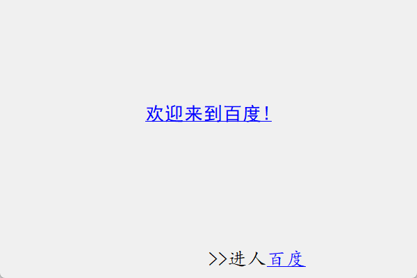

```python
# -*- coding: UTF-8 -*-
# File date: Hi_2023/2/28 21:58
# File_name: 09- 标签控件OLabel的应用实例.py
import sys
from PySide6.QtGui import QPixmap, QFont
from PySide6.QtWidgets import QApplication, QWidget, QLabel
from PySide6.QtCore import QRect, Qt.QSize


class MyWidget(QWidget):
    def __init__(self, parent=None):
        super().__init__(parent)
        self.setFixedSize(QSize(600, 400))
        w = self.width()  # 窗口的宽度
        h = self.height()  # 窗口的高度

        self.label1 = QLabel(self)
        self.label2 = QLabel(self)
        self.label3 = QLabel(self)
        self.label4 = QLabel(self)

        self.label1.setGeometry(QRect(0, 0, w, h))
        self.label1.setPixmap(QPixmap("../../Resources/animal/m1.png"))

        self.label2.setGeometry(QRect(int(w / 2) - 150, 150, 300, 30))
        font = QFont("黑体", pointSize=20)
        self.label2.setFont(font)
        self.label2.setText("<A href='https://www.baidu.com/'>欢迎来到百度!</A>")
        self.label2.setToolTip("我喜欢的网站 www.mysmth.net")
        # 设置提示信息
        self.label2.setAlignment(Qt.AlignCenter | Qt.AlignVCenter)
        self.label2.linkHovered.connect(self.hover)
        # 定义信号与槽的连接
        self.label2.linkActivated.connect(self.activated)

        # 定义信号与槽的连接
        self.label3.setGeometry(QRect(int(w / 2), h - 50, int(w / 2), 50))
        font = QFont("楷体", pointSize=20)
        self.label3.setFont(font)
        self.label3.setText(">>进人<A href='https://www.baidu.com/'>百度</A>")
        self.label3.setOpenExternalLinks(True)

    def hover(self, link):
        # 光标经过超链接的关联函数
        print("欢迎来到我的世界!")

    def activated(self, link):
        # 单击超链接的关联函数
        rect = self.label3.geometry()
        rect.setY(rect.y() - 50)
        self.label4.setGeometry(rect)
        self.label4.setText("单击此链接, 进人网站" + link)


if __name__ == '__main__':
    app = QApplication(sys.argv)
    window = MyWidget()
    window.show()
    sys.exit(app.exec())

```

## 液晶显示控件QLCDNumber

液晶显示控件QLCDNumber 用来显示数字和一些特殊符号,常用来显示数值日期和时间。可以显示的数字和符号有 `O`、`0`、`1`、`2`、`3`、`4`、`5`、`6`、`7`、`8`、`9`、`-`、`g`、`.`(小数点)、`A`,`B`,`C`、`D`、`E`、`F`、`h`、`H`、`L`、`o`、`P`、`r`、`u`、`U`、`Y`、`:`、`‘`度数(在字符串中用单引号表示)和空格。QLCDNumber将非法字符换为空格。
用QLCDNumber 类创建实例对象的方法如下所示其中参数如下,QLCDNumber 是从 QFrame类继承而来的。

- parent 是控件所在的窗体或容器控件,
- numDigits是能显示的数字个数。

```python
from PySide6.QtWidgets import QLCDNumber

QLCDNumber(numDigits: int, parent: Union[PySide6.QtWidgets.QWidget, NoneType]=None) -> None
QLCDNumber(parent: Union[PySide6.QtWidgets.QWidget, NoneType]=None) -> None
```

### 液晶显示控件OLCDNumber的常用方法

液晶显示控件QLCDNumber 的常用方法如表所示。

由于液晶显示控件是从QFrame类继承来的,因而可以设置液晶显示控件的边框样式,如凸起、凹陷、平面等,液晶显示控件的主要方法介绍如下。

- 用setDigitCount(int)方法设置液晶显示控件的最大显示数字个数,包括小数点。

- 用display(str)display(float)和 display(int)方法分别显示字符串、浮点数和整数显示的内容只能是`O`、`0`、`1`、`2`、`3`、`4`、`5`、`6`、`7`、`8`、`9`、`-`、`g`、`.`(小数点)、`A`,`B`,`C`、`D`、`E`、`F`、`h`、`H`、`L`、`o`、`P`、`r`、`u`、`U`、`Y`、`:`、`‘`度数(在字符串中用单引号表示)和空格,如果显示的整数部分长度超过了允许的最大数字个数则会产生溢出,溢出时会发送overflow()信号。

  - 可以用checkOverflow(float)和checkOverflow(int)方法检查浮点数和整数值是否会溢出,
  - 用intValue()和 value()方法可以分别返回整数和浮点数如果显示的是整数,
  - 以用setMode(QLCDNumber.Mode)方法将整数转换成二进制、八进制和十六进制显示,其中参数 QLCDNumber.Mode可以取以下值。也可以使用setDecMode()、setHexMode()、setOctMode(),setBinMode()方法设置
    - QLCDNumber.Hex 十六进制
    - QLCDNumber.Dec 十进制
    - QLCDNumber.Oct 八进制
    - QLCDNumber.Bin 二进制
  - 用setSegmentStyle(QLCDNumber.SegmentStyle)方法可以设置液晶显示器的外观,其中参数QLCDNumber.SegmentStyle可以取:
    - QLCDNumber.Outline(用背景色显示数字,只显示数字的轮廓)
    - QLCDNumber。Filled(用窗口的文字颜色显示文字)
    - QLCDNumber.Flat(平面,没有凸起效果)。

  | QLCDNumber的方法及参数类型               | 返回值的类型 | 说明                                               |
  | ---------------------------------------- | ------------ | -------------------------------------------------- |
  | setDigitCount(int)                       | None         | 设置可以显示的数字个数                             |
  | digitCount()                             | int          | 获取可以显示的数字个数                             |
  | setSegmentStyle(QLCDNumber.SegmentStyle) | None         | 设置外观显示样式                                   |
  | [slot]display(str:str)                   | None         | 显示字符串                                         |
  | [slot]display(num:float)                 | None         | 显示浮点数                                         |
  | [slot]display(num:int)                   | None         | 显示整数                                           |
  | checkOverflow(float)                     | bool         | 取浮点数是否会溢出                                 |
  | checkOverflow(int)                       | bool         | 获取整数是否会溢出                                 |
  | intValue()                               | int          | 按四舍五入规则返回整数值,老 显示的不是数值,则返回0 |
  | value()                                  | float        | 返回浮点数值                                       |
  | setMode(QLCDNumber.Mode)                 | None         | 设置数字的显示模式                                 |
  | [slot]setDecMode()                       | None         | 转成十进制显示模式                                 |
  | [slot]setHexMode()                       | None         | 转成十六进制显示模式                               |
  | [slot]setOctMode()                       | None         | 转成八进制显示模式                                 |
  | [slot]setBinMode()                       | None         | 转成二进制显示模式                                 |
  | [slot]setSmallDecimalPoint(bool)         | None         | 设置小数点的显示是否占用一位                       |

### 液晶显示控件OLCDNumber的信号

液晶显示控件QLCDNumber 只有一个信号overflow(),当显示的整数部分长度超过了允许的最大数字个数时发送信号。

### 液晶显示控件QLCDNumber的应用实例

下面的程序从本机上读取时间,计算到 2024 年春节的剩余时间,并用液晶显示控件显示剩余时间。

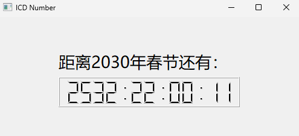

```python
import sys
from PySide6.QtWidgets import QApplication, QWidget, QLabel, QLCDNumber
from PySide6.QtCore import QTimer, QDateTime


class MyWindow(QWidget):

    def __init__(self, parent=None):
        super().__init__(parent)
        self.setWindowTitle("ICD Number")
        self.resize(500, 200)
        self.label=QLabel("距离2030年春节还有:", self)
        font=self.label.font()
        font.setPointSize(20)

        self.label.setFont(font)
        self.label.setGeometry(100, 50, 300, 50)

        self.LcdNumber=QLCDNumber(13, self)

        self.LcdNumber.setGeometry(100, 100, 300, 50)
        self.sprintDay=QDateTime(2030, 2, 2, 0, 0, 0)  # 2030年春节时间
        self.timer=QTimer(self)

        self.timer.setInterval(1000)

        self.timer.timeout.connect(self.change)

        self.timer.start()

    def change(self):
        self.current=QDateTime.currentDateTime()  # 获取系统的当前日期时间

        seconds=self.current.secsTo(self.sprintDay)  # 计算到目的日期的秒数
        days=seconds //(3600 * 24)  # 计算剩余天
        hours=(seconds - days * 3600 * 24) // 3600  # 计算剩余小时
        minutes=(seconds - days * 3600 * 24 - hours * 3600) // 60  # 计算剩余分钟
        seconds=seconds - days * 3600 * 24 - hours * 3600 - minutes * 60  # 计算剩余秒

        string="{:03d}:{:02d}:{:02d}:{:02d}".format(days, hours, minutes, seconds)

        self.LcdNumber.display(string)


if __name__=='__main__':
    app=QApplication(sys.argv)
    win=MyWindow()

    win.show()
    sys.exit(app.exec())

```

## 数字输入控件QSpinBox和QDoubleSpinBox

QSpinBox 和QDoubleSpinBox 控件是专门用于输入数值的控件,前者只能输人整数后者只能输人浮点数,在右边可以有按钮,也可以没有。

QSpinBox和 QDoubleSpinBox 控件是 QLineEdit 控件和按钮控件组合而来的。

这两个控件都继承自抽象类 QAbstractSpinBox,它们的方法信号和槽函数基本一致。

用QSpinBox和 QDoubleSpinBox 实例化对象的方法如下所示,其中 parent 是控件所在的父窗口或容器控件。

```python
from PySide6.QtWidgets import QSpinBox, QDoubleSpinBox

QSpinBox(parent: Union[PySide6.QtWidgets.QWidget, NoneType]=None) -> None 
QDoubleSpinBox(parent: Union[PySide6.QtWidgets.QWidget, NoneType]=None) -> None
```

### 数字输入控件QSpinBox和QDoubleSpinBox 的常用方法

数字输人控件 QSpinBox和 QDoubleSpinBox 的常用方法如表所示,主要方法介绍如下:

- 可以设置允许输入的最小值和最大值
  - 通过 setMinimum()setMaximum()和setRange()方法来设置允许输入的最小值和最大值。
- QSpinBox和QDoubleSpinBox 控件都提供一个微调控件,通过单击向上/向下按钮或按键盘的↑/↓键来增加/减少当前显示的值。
  - 用setSingleStep()方法可以设置每次增加或减少的微调量,
  - 用setWrapping(True)方法可以设置到达最大或最小值时是否进行循环。
- QDoubleSpinBox的默认精度是2位小数,
  - 可以通过 setDecimals(int)方法设置允许输人的小数的位数。
- 用setPrefix(str)和setSuffix(str)方法分别可以设置前缀符号和后缀符号,例如货币或计量单位。
- 值可以用setValue(int)方法来设置,
  - 当前值可以用value()方法获取,
  - 文本可以用text()方法(包括前缀和后缀)或者 cleanText()方法(没有前缀和后缀)来获取。
  - 按钮的样式可以用setButtonSymbols(QAbstractSpinBox ButtonSymbols)方法设置,枚举类型参数QAbstractSpinBox ButtonSymbols可以取:
    - QAbstractSpinBox.UpDownArrows
    - QAbstractSpinBox.PlusMinus
    - QAbstractSpinBox.NoButtons。
- 用setCorrectionMode(QAbstractSpinBox,CorrectionMode)方法设置当输人有误时使用自动修正模式参数可取:
  - QAbstractSpinBoxCorrectToPreviousValue(修正成最近正确的值)
  - QAbstractSpinBoxCorrectToNearestValue(修正成最接近正确的值)
- setKeyboardTracking(bool)方法设置是否可以跟踪按键输入
  - 例如要输人 123,在setKeyboardTracking(True)时,会发送3信号valueChanged() andtextChanged(),信号传递的值分别是 112和123;
  - setKeyboardTracking(False)时,只发送最后的值 123。

| QSpinBox和 QDoubleSpinBox的方法及参数类型        | 说 明                                                        |
| ------------------------------------------------ | ------------------------------------------------------------ |
| [slot]setValue(int)                              | 设置当前的值,用于QSpinBox控件                                |
| [slot]setValue(float)                            | 设置当前的值,用于QDoubleSpinBox控件                          |
| value()                                          | 获取当前的值                                                 |
| setDisplayIntegerBase(int)                       | 设置整数的进位值,例如2、8、16,默认为10                       |
| displayIntegerBase()                             | 获取整数的进位值,仅用于QSpinBox控件                          |
| setDecimals(int)                                 | 设置允许的小数位数,用于QDoubleSpinBox控件                    |
| decimals()                                       | 获取允许的小数位数,用于QDoubleSpinBox控件                    |
| setMaximum(inb)、setMaximum(float)               | 设置允许输人的最大值                                         |
| setMinimum(int)、setMinimum(float)               | 设置允许输入的最小值                                         |
| setRange(int,int),setRangel(float, float)        | 设置允许输入的最小值和最大值                                 |
| minimum()、maximum(                              | 获取允许的最小值和最大值                                     |
| selSingleStep(int),setSingleStep(float)          | 设置微调步长                                                 |
| singleStep() .                                   | 获取微调值                                                   |
| setPrefix(str)                                   | 设置前缀符号,例如‘¥                                          |
| setSuffix(str)                                   | 设置后缀符号,例如‘km                                         |
| cleanText()                                      | 获取不含前缀和后缀的文本                                     |
| text()                                           | 获取含前缀和后缀的文本                                       |
| [slot]selectA11()                                | 选择显示的值,不包括前级和后级                                |
| setAlignment(Qt.Alignment)                       | 设置对齐方式                                                 |
| setButonSymbols(QAbstractSpinBox BurtonSymbols)  | 设置右侧的按钮样式                                           |
| selCorrectionMode(QAbstractSpinBoxCarrectionMode | 设置自动修正模式                                             |
| setFrame(bool)                                   | 设置是否有外边框                                             |
| setGroupSeparatorShown(bool)                     | 设置按照千位(3位)用逗号隔开                                  |
| setKeyboardTracking(bool)                        | 设置是否跟踪键盘的每次输入                                   |
| setReadOnly(bool)                                | 设置只读,不能编辑                                            |
| setSpecialValueText(str)                         | 设置特殊文本,当显示的值等于允许的最小值时,显 示该文本        |
| setWrapping(bool)                                | 设置是否可以循环,即最大值后再增大则变成最小 值,最小值后再减小则变成最大值 |
| setAccelerated(bool)                             | 当按住增大和减小按钮时,是否加速显示值                        |
| [slot]clear()                                    | 清空内容,不包含前缀和后缀                                    |
| [slot]stepDown()                                 | 增大值                                                       |
| [slot]stepUp()                                   | 减小值                                                       |

### 数字输入控件 QSpinBox和 QDoubleSpinBox的信号

数字输人控件 QSpinBox 和 QDoubleSpinBox 的信号相同,如表所示。

当QSpinBox和QDoubleSpinBox 的值发生改变时,都会发送重载型信号 valueChanged()其中一个带int(或 float)类型参数,另一个带 str 类型参数str 类型的参数包含前缀和后缀

| 信号及参数类型      | 说 明                                         |
| ------------------- | --------------------------------------------- |
| editingFinished()   | 输人完成,按Enter键或失去焦点时发送信号        |
| textChanged(str)    | 文本发生变化时发送信号                        |
| valueChanged(int)   | 数值发生变化时发送信号,用于 QSpinBox控件      |
| valueChanged(float) | 数值发生变化时发送信号,用于QDoubleSpinBox控件 |

### QSpinBox 例子

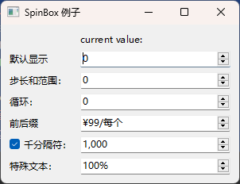

```python
# -*- coding: UTF-8 -*-
# File date: Hi_2023/3/15 0:57
# File_name: 05-QSpinBox 例子.py


import sys
from PySide6.QtCore import *
from PySide6.QtGui import *
from PySide6.QtWidgets import *


class spindemo(QWidget):
    def __init__(self, parent=None):
        super(spindemo, self).__init__(parent)
        self.setWindowTitle("SpinBox 例子")
        self.resize(300, 100)

        layout = QFormLayout()

        self.label = QLabel("current value:")
        # self.label.setAlignment(Qt.AlignCenter)
        self.label.setAlignment(Qt.AlignLeft)
        layout.addWidget(self.label)

        self.spinbox = QSpinBox()
        layout.addRow(QLabel('默认显示'), self.spinbox)
        self.spinbox.valueChanged.connect(lambda: self.on_valuechange(self.spinbox))

        label = QLabel("步长和范围：")
        self.spinbox_int = QSpinBox()
        self.spinbox_int.setRange(-20, 20)
        self.spinbox_int.setMinimum(-10)
        self.spinbox_int.setSingleStep(2)
        self.spinbox_int.setValue(0)
        layout.addRow(label, self.spinbox_int)
        self.spinbox_int.valueChanged.connect(lambda: self.on_valuechange(self.spinbox_int))

        label = QLabel("循环：")
        self.spinbox_wrap = QSpinBox()
        self.spinbox_wrap.setRange(-20, 20)
        self.spinbox_wrap.setSingleStep(5)
        self.spinbox_wrap.setWrapping(True)
        layout.addRow(label, self.spinbox_wrap)
        self.spinbox_wrap.valueChanged.connect(lambda: self.on_valuechange(self.spinbox_wrap))

        label = QLabel("前后缀")
        self.spinbox_price = QSpinBox()
        self.spinbox_price.setRange(0, 999)
        self.spinbox_price.setSingleStep(1)
        self.spinbox_price.setPrefix("¥")
        self.spinbox_price.setSuffix("/每个")
        self.spinbox_price.setValue(99)
        layout.addRow(label, self.spinbox_price)
        self.spinbox_price.valueChanged.connect(lambda: self.on_valuechange(self.spinbox_price))

        self.groupSeparatorSpinBox = QSpinBox()
        self.groupSeparatorSpinBox.setRange(-99999999, 99999999)
        self.groupSeparatorSpinBox.setValue(1000)
        self.groupSeparatorSpinBox.setGroupSeparatorShown(True)
        groupSeparatorChkBox = QCheckBox()
        groupSeparatorChkBox.setText("千分隔符：")
        groupSeparatorChkBox.setChecked(True)
        layout.addRow(groupSeparatorChkBox, self.groupSeparatorSpinBox)
        groupSeparatorChkBox.toggled.connect(self.groupSeparatorSpinBox.setGroupSeparatorShown)
        self.groupSeparatorSpinBox.valueChanged.connect(lambda: self.on_valuechange(self.groupSeparatorSpinBox))

        label = QLabel("特殊文本：")
        self.spinbox_zoom = QSpinBox()
        self.spinbox_zoom.setRange(0, 1000)
        self.spinbox_zoom.setSingleStep(10)
        self.spinbox_zoom.setSuffix("%")
        self.spinbox_zoom.setSpecialValueText("Automatic")
        self.spinbox_zoom.setValue(100)
        layout.addRow(label, self.spinbox_zoom)
        self.spinbox_zoom.valueChanged.connect(lambda: self.on_valuechange(self.spinbox_zoom))

        self.setLayout(layout)

    def on_valuechange(self, spinbox):
        self.label.setText("current value:" + str(spinbox.value()))


if __name__ == '__main__':
    app = QApplication(sys.argv)
    ex = spindemo()
    ex.show()
    sys.exit(app.exec())

```

### QDoubleSpinBox 例子

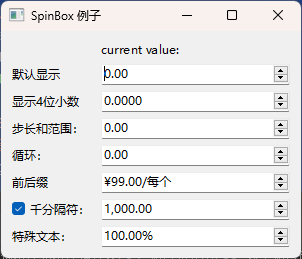

```python
# -*- coding: UTF-8 -*-
# File date: Hi_2023/3/15 0:49
# File_name: 02-QDoubleSpinBox 例子.py


import sys
from PySide6.QtCore import *
from PySide6.QtGui import *
from PySide6.QtWidgets import *


class spindemo(QWidget):
    def __init__(self, parent=None):
        super(spindemo, self).__init__(parent)
        self.setWindowTitle("SpinBox 例子")
        self.resize(300, 100)

        layout = QFormLayout()

        self.label = QLabel("current value:")
        # self.label.setAlignment(Qt.AlignCenter)
        self.label.setAlignment(Qt.AlignLeft)
        layout.addWidget(self.label)

        self.spinbox = QDoubleSpinBox()
        layout.addRow(QLabel('默认显示'), self.spinbox)
        self.spinbox.valueChanged.connect(lambda: self.on_valuechange(self.spinbox))

        self.spinbox_decimal = QDoubleSpinBox()
        self.spinbox_decimal.setDecimals(4)
        layout.addRow(QLabel('显示4位小数'), self.spinbox_decimal)
        self.spinbox_decimal.valueChanged.connect(lambda: self.on_valuechange(self.spinbox_decimal))

        label = QLabel("步长和范围：")
        self.spinbox_int = QDoubleSpinBox()
        self.spinbox_int.setRange(-20, 20)
        self.spinbox_int.setMinimum(-10)
        self.spinbox_int.setSingleStep(2)
        self.spinbox_int.setValue(0)
        layout.addRow(label, self.spinbox_int)
        self.spinbox_int.valueChanged.connect(lambda: self.on_valuechange(self.spinbox_int))

        label = QLabel("循环：")
        self.spinbox_wrap = QDoubleSpinBox()
        self.spinbox_wrap.setRange(-20, 20)
        self.spinbox_wrap.setSingleStep(5)
        self.spinbox_wrap.setWrapping(True)
        layout.addRow(label, self.spinbox_wrap)
        self.spinbox_wrap.valueChanged.connect(lambda: self.on_valuechange(self.spinbox_wrap))

        label = QLabel("前后缀")
        self.spinbox_price = QDoubleSpinBox()
        self.spinbox_price.setRange(0, 999)
        self.spinbox_price.setSingleStep(1)
        self.spinbox_price.setPrefix("¥")
        self.spinbox_price.setSuffix("/每个")
        self.spinbox_price.setValue(99)
        layout.addRow(label, self.spinbox_price)
        self.spinbox_price.valueChanged.connect(lambda: self.on_valuechange(self.spinbox_price))

        self.groupSeparatorSpinBox = QDoubleSpinBox()
        self.groupSeparatorSpinBox.setRange(-99999999, 99999999)
        self.groupSeparatorSpinBox.setValue(1000)
        self.groupSeparatorSpinBox.setGroupSeparatorShown(True)
        groupSeparatorChkBox = QCheckBox()
        groupSeparatorChkBox.setText("千分隔符：")
        groupSeparatorChkBox.setChecked(True)
        layout.addRow(groupSeparatorChkBox, self.groupSeparatorSpinBox)
        groupSeparatorChkBox.toggled.connect(self.groupSeparatorSpinBox.setGroupSeparatorShown)
        self.groupSeparatorSpinBox.valueChanged.connect(lambda: self.on_valuechange(self.groupSeparatorSpinBox))

        label = QLabel("特殊文本：")
        self.spinbox_zoom = QDoubleSpinBox()
        self.spinbox_zoom.setRange(0, 1000)
        self.spinbox_zoom.setSingleStep(10)
        self.spinbox_zoom.setSuffix("%")
        self.spinbox_zoom.setSpecialValueText("Automatic")
        self.spinbox_zoom.setValue(100)
        layout.addRow(label, self.spinbox_zoom)
        self.spinbox_zoom.valueChanged.connect(lambda: self.on_valuechange(self.spinbox_zoom))

        self.setLayout(layout)

    def on_valuechange(self, spinbox):
        self.label.setText("current value:" + str(spinbox.value()))


if __name__ == '__main__':
    app = QApplication(sys.argv)
    ex = spindemo()
    ex.show()
    sys.exit(app.exec())

```


## 下拉列表框控件QComBox

下拉列表框控件提供一个下拉式选项列表供用户选择,它可以最大限度地减少所占窗口的面积。

下拉列表框控件的类是 QComboBox,它继承自QWidget。下拉列表框由多行内容构成,下拉列表框控件可以看成是一个 QLineEdit 和一个列表控件的组合体,每行除有必要的文字外,还可以设置图标。

下拉列表中的内容可以是程序运行前就确定的内容,也可以是用户临时添加的内容。当单击下拉列表框时,下拉列表框呈展开状态,显示多行选项供用户选择,根据用户选择的内容发送信号,进行不同的动作。

通常下拉列表框处于折叠状态,只显示一行当前内容。

QComboBox 除了显示可见的文字和图标外,还可以给每行设置一个关联数据,数据类型任意,可以是字符串、文字、图片、类的实例等.通过客户选择的内容,可以读取关联的数据。

可以采用下列方式创建QComboBox类的实例对象其中parent是继承自QWidget的窗口或容器控件

```python
from PySide6.QtWidgets import QComboBox

QComboBox(parent: Union[PySide6.QtWidgets.QWidget, NoneType]=None) -> None 
```

### 下拉列表框控件QComboBox的常用方法

QComboBox由一列多行内容构成每行称为一个项(item)。

QComboBox的方法主要是有关项的方法,可以添加项、插入项和移除项。如果用Qt Designer 设计界面,则双击QComboBox控件,可以为QComboBox添加项。

下拉列表框控件QComboBox的常用方法如表所示,主要方法介绍如下。

- 在QComboBox控件中添加项的方法有

  - addItem(str[,userData=None])
  - addItem(QIcon;str[,userData=None])
  - addItems(Sequence[str])

  前两种只能逐个增加,最后一种可以把一个元素是字符串的迭代序列(列表、元组)加人到 QComboBox中。前两种在增加项时,可以为项关联任何类型的数据。

- 在QComboBox控件中插人项的方法有

  - insertItem(index:int,str[;userData=None])
  - insertItem(index: int, QIcon, str[,userData=None])
  - insertItems(index;int,Sequence[str])。

  当插人项时,用setInsertPolicy(QComboBox.InsertPolicy)方法可以设置插入项的位置其中QComboBoxInsertPolicy 的取值如表2所示:

  | QComboBox.InsertPolicy的取值   | 说明               |
  | ------------------------------ | ------------------ |
  | QComboBox.NoInsert             | 不允许插人项       |
  | QComboBox.InsertAtTop          | 在顶部插人项       |
  | QComboBox.InsertAtCurrent      | 在当前位置插入项   |
  | QComboBox.InsertAtBottom       | 在底部插人项       |
  | QComboBox.InsertAfterCurrent   | 在当前项之后插入   |
  | QComboBox.InsertBeforeCurrent  | 在当前项之前插入   |
  | QComboBox.InsertAlphabetically | 根据字母顺序插人项 |

- 移除

  - 用removeItem(index:int)方法可以从列表中移除指定索引值的项;
  - 用clear()方法可以清除所有的项;
  - 用clearEditText()方法可以清除显示的内容,而不影响项

- 项编辑和获取

  - 通过设置 setEditable(True),即QComboBox 是可编辑状态,可以输人文本,按Enter键后文本将作为项插入列表中在添加和插入项时,可以定义关联的数据
  - 另外也可以用setItemData(index:int,any[,role=QtUserRole])方法为索引号是int 的项追加关联的数据,数据类型任意。
  - 可以为项定义多个关联数据,第1个数据的角色值 role=QtUserRole(Q.UserRole 的值为256),当追加第2个关联的数据时取role=Qt.UserRole+1,追加第3个关联的数据时取role=QtUserRole+2依次类推

  - 用currentData(role=QtUserRole+i)或itemData(index:int,role=Qt.UserRole十i)方法获取关联的数据,其中role=QtUserRole+i表示第i个关联数据的索引,i=0,1,2,

- 宽高调整策略

  - 利用setSizeAdjustPolicy(QComboBox,SizeAdjustPolicy)方法可以设置QComboBox的宽度和高度根据项的文字的长度进行调整,其中 QComboBox.SizeAdjustPolicy可以取 :
    - QComboBox.AdjustToContents(根据内容调整)
    - QComboBox.AdjustToContentsOnFirstShow(根据第1次显示的内容调整)
    - QComboBox.AdjustToMinimumContentsLengthWithIcon(根据最小长度调整)

| QComboBox的方法及参数类型                       | 说明                                    |
| ----------------------------------------------- | --------------------------------------- |
| addItem(str,userData=None)                      | 添加项,并可设置关联的任意类型的数据     |
| addItem(QIcon,str,userData=None)                | 添加带图标的项                          |
| addItems(Sequence[str])                         | 用列表、元组等序列添加多个项            |
| insertItem(index:int,str,userData=None)         | 在索引处插入项                          |
| insertItem(index; int,QIcon,str,userData=None)  | 在索引处插入带图标的项                  |
| insertItems(index: int,Sequence[str])           | 在索引处插人多个项                      |
| renoveItem(index:int)                           | 根据索引值移除项                        |
| count()                                         | 返回项的数量                            |
| currentIndex()                                  | 返回当前项的索引                        |
| currentText()                                   | 返回当前项的文本                        |
| [slot]setCurrentText(str)                       | 设置当前显示的文本                      |
| [slot]setCurrentIndex(index:int)                | 根据索引设置为当前项                    |
| [slot]setEditText(str)                          | 设置编辑文本                            |
| setEditable(bool)                               | 设置是否可编辑                          |
| setIconSize(QSize)                              | 设置图标的尺寸                          |
| set1nsertPolicy(QComboBox.InsertPolicy)         | 设置插入项的策略                        |
| setltemData(index: int,any[.role=Qt.UserRole])  | 根据索引设置关联数据                    |
| setItemIcon(index: int.QIcon)                   | 根据索引设置图标                        |
| setltemText(index: int.str)                     | 根据索引设置文本                        |
| setMaxCount(int)                                | 设置项的最大数量,超过部分不显示         |
| setMaxVisibleltems(int)                         | 设置最多能显示的项的数量,超过显示滚动条 |
| setMinimumContentsLength(int)                   | 设置子项目显示的最小长度                |
| setSizeAdjustPolicy(QComboBox.SizeAdjustPolicy) | 设置宽度和高度的调整策略                |
| serValidator(QValidator)                        | 设置输入内容的合法性验证                |
| currentData(role=Qt.UserRole)                   | 获取当前项关联的数据                    |
| iconSize()                                      | 返回图标尺寸 QSize                      |
| itemIcon(index:int)                             | 根据索引获取图标QIcon                   |
| itemText(index:int)                             | 根据索引获取项的文本                    |
| showPopup()、hidePopup()                        | 显示或隐裁列表                          |
| itemData(index: int,role=Qt.UserRole)           | 根据索引获取项的关联数据                |
| [slot]clear()                                   | 从控件中清空所有的项                    |
| [slot]clearEditText()                           | 只清空可编辑的文字,不影响项             |

### 下拉列表框控件QComboBox的信号

下拉列表框控件QComboBox的信号如表所示

| QComboBox的信号                | 说明                                                         |
| ------------------------------ | ------------------------------------------------------------ |
| activated(text:str)            | 由用户激活某项时发送信号,而程序激活时不发送信号。如果有两个项的名称相同,则只发送带整数参数的信号 |
| activated(index: int)          | 由用户激活某项时发送信号,而程序激活时不发送信号。如果有两个项的名称相同,则只发送带整数参数的信号 |
| currentIndexChanged(text:str)  | 用户或程序改变当前项的索引时发送信号                         |
| currentIndexChanged(index:int) | 用户或程序改变当前项的索引时发送信号                         |
| highlighted(text: str)         | 当光标经过列表的项时发送信号                                 |
| highlighted(index: int)        | 当光标经过列表的项时发送信号                                 |
| editTextChanged(text:str)      | 在可编辑状态下,改变可编辑文本时发送信号                      |
| currentTextChanged(text: str)  | 用户或程序改变当前项的文本时发送信号                         |


### QComboBox 案例：地区选择

```python
import sys

from PySide6 import QtWidgets

"""
QComboBox 案例：地区选择

由2个combobox组成，分别用于选择省、市，选中城市后获得对应的邮政编码

当第1个combobox的选中改变时，第2个combobox中的选项自动变换至对应列表
当第2个combobox的选中改变时，使用QLabel显示该地的邮政编码
"""


class MyWidget(QtWidgets.QWidget):
    def __init__(self, *args, **kwargs):
        super().__init__(*args, **kwargs)
        self.setWindowTitle("QComboBox-案例")
        self.resize(800, 600)

        # 创建存储城市信息的字典
        self.city_dic = {
            "北京": {
                "东城区": "100010",
                "西城区": "100032",
                "朝阳区": "100020",
                "丰台区": "100071",
                "石景山区": "100043",
                "海淀区": "100080",
            },
            "上海": {"黄浦区": "200001", "徐汇区": "200030", "长宁区": "200050"},
        }
        self.setup_ui()

    def setup_ui(self) -> None:
        """设置界面并初始化"""

        self.province_cbb = QtWidgets.QComboBox()
        self.city_cbb = QtWidgets.QComboBox()
        self.code_label = QtWidgets.QLabel()

        # 使用布局管理器布局控件
        layout = QtWidgets.QHBoxLayout()
        layout.addWidget(self.province_cbb)
        layout.addWidget(self.city_cbb)
        layout.addWidget(self.code_label)
        self.setLayout(layout)

        # 初始化并连接信号
        self.province_cbb.addItems(self.city_dic.keys())
        self.province_cbb.currentTextChanged.connect(self.province_changed)  # type: ignore
        self.city_cbb.currentIndexChanged.connect(self.city_changed)  # type: ignore

        # 手动执行一次以为城市combobox添加初始项
        self.province_changed(self.province_cbb.currentText())

    def province_changed(self, pro_name: str) -> None:
        """
        省份改变时的槽函数 \n
        :param pro_name: 新的省名
        :return: None
        """
        # 先清空之前的条目
        self.city_cbb.clear()

        # 再添加条目
        cities = self.city_dic[pro_name]
        for city_name, city_code in cities.items():
            # 将城市名作为text、邮政代码作为data添加条目
            self.city_cbb.addItem(city_name, city_code)

    def city_changed(self, item_index: int) -> None:
        """
        城市改变时的槽函数 \n
        :param item_index: 新的选中的条目索引
        :return: None
        """
        city_name = self.city_cbb.itemText(item_index)
        city_code = self.city_cbb.itemData(item_index)
        self.code_label.setText(f"{city_name}的邮政编码为{city_code}")
        self.code_label.adjustSize()  # 调节标签控件尺寸以适应新的内容


if __name__ == "__main__":
    app = QtWidgets.QApplication(sys.argv)
    window = MyWidget()
    window.show()
    sys.exit(app.exec())

```


## 字体选择下拉框QFontComboBox

PySide6专门定义了一个字体下拉列表框控件QFontComboBox,列表内容是操作系统支持的字体,这个控件主要用在工具栏中,用于选择字体。

```python
from PySide6.QtWidgets import QFontComboBox

QFontComboBox(parent: Union[PySide6.QtWidgets.QWidget, NoneType] = None) -> None
```


### QFontComboBox 方法

QFontComboBox 继承自QComboBox,因此具有QComboBox 的方法。

QFontComhoBox也有自己的方法主要有:

- setCurrentFont(QFont)(设置当前的字体,槽函数)
- currentFont()(获取当前字体)
- setFontFilters(QFontComboBox.FontFilter)(设置字体列表的过滤器),其中字体过滤器可以取:
  - QFontComboBox.AllFonts(显示所有字体)
  - QFontComboBox.ScalableFonts(显示可缩放字体)
  - QFontComboBox,NonScalableFonts(显示不可缩放的字体)
  - QFontComboBox,MonospacedFonts(显示等宽字体)
  - QFontComboBox.ProportionalFonts(显示比例字体)

QFontComhoBox也有自己的信号:

QFontComhoBox的特有信号为currentFontChanged(QFont)当前字体更改时发送

### QFontComboBox 例子

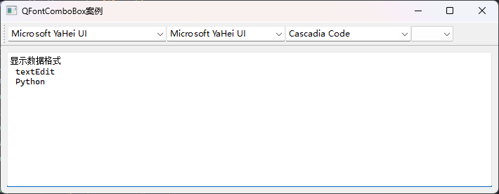

```python
# -*- coding: UTF-8 -*-
# File date: Hi_2023/2/28 23:02
# File_name: 03-QFontComboBox 例子.py


import sys
from PySide6.QtWidgets import *
from PySide6.QtGui import *
from PySide6.QtCore import *
import os

os.chdir(os.path.dirname(__file__))


class FontComboBoxDemo(QMainWindow):
    def __init__(self, *args, **kwargs):
        super(FontComboBoxDemo, self).__init__(*args, **kwargs)
        self.setWindowTitle("QFontComboBox案例")
        widget = QWidget()
        self.setCentralWidget(widget)
        layout = QVBoxLayout(widget)
        self.text_show = QTextBrowser()

        layout.addWidget(self.text_show)

        toolbar = self.addToolBar('toolbar')

        # 设置字体，all
        font = QFontComboBox()
        font.currentFontChanged.connect(lambda font: self.text_show.setFont(font))
        toolbar.addWidget(font)

        # 设置字体,仅限中文
        font2 = QFontComboBox()
        font2.currentFontChanged.connect(lambda font: self.text_show.setFont(font))
        font2.setWritingSystem(QFontDatabase.SimplifiedChinese)
        toolbar.addWidget(font2)

        # 设置字体,等宽字体
        font3 = QFontComboBox()
        font3.currentFontChanged.connect(lambda font: self.text_show.setFont(font))
        font3.setFontFilters(QFontComboBox.MonospacedFonts)
        toolbar.addWidget(font3)

        # 设置字体大小
        font_size_list =[str(i) for i in range(5, 40, 2)]
        combobox = QComboBox(self, minimumWidth=60)
        combobox.addItems(font_size_list)
        combobox.setCurrentIndex(-1)
        combobox.activated.connect(lambda x: self.set_fontSize(int(font_size_list[x])))
        toolbar.addWidget(combobox)

        # 加粗按钮
        buttonBold = QToolButton()
        buttonBold.setShortcut('Ctrl+B')
        buttonBold.setCheckable(True)
        buttonBold.setIcon(QIcon("./images/Bold.png"))
        toolbar.addWidget(buttonBold)
        buttonBold.clicked.connect(lambda: self.setBold(buttonBold))

        # 倾斜按钮
        buttonItalic = QToolButton()
        buttonItalic.setShortcut('Ctrl+I')
        buttonItalic.setCheckable(True)
        buttonItalic.setIcon(QIcon("./images/Italic.png"))
        toolbar.addWidget(buttonItalic)
        buttonItalic.clicked.connect(lambda: self.setItalic(buttonItalic))

        self.text_show.setText('显示数据格式\n textEdit \n Python')

    def setBold(self, button):
        if button.isChecked():
            self.text_show.setFontWeight(QFont.Bold)
        else:
            self.text_show.setFontWeight(QFont.Normal)
        self.text_show.setText(self.text_show.toPlainText())

    def setItalic(self, button):
        if button.isChecked():
            self.text_show.setFontItalic(True)
        else:
            self.text_show.setFontItalic(False)
        self.text_show.setText(self.text_show.toPlainText())

    def set_fontSize(self, x):
        self.text_show.setFontPointSize(x)
        self.text_show.setText(self.text_show.toPlainText())


if __name__ == "__main__":
    app = QApplication(sys.argv)
    w = FontComboBoxDemo()
    w.show()
    sys.exit(app.exec())

```


## 滚动条控件QScrolIBar和滑块控件QSlider

滚动条控件QScrollBar 和滑块控件QSlider 用于输人整数通过滚动条和滑块的位置来确定控件输人的值。

滚动条和滑块控件的外观都有水平和竖直两种样式。这两个控件的功能相似,外观有所不同,QScrollBar 两端有箭头而QSlider没有,QSlider可以设置刻度。

用QScrolIBar 和QSlider 创建实例对象的方法如下所示,QScrollBar 类和QSlider 类是从 QAbstraotSlider 类继承而来的。

- parent是窗口或者容器类控件
- Qt.Orientation.Orientation 可以取
  - Qt.Orientation.Horizontal 水平
  - Qt.Orientation.Vertical 垂直

```python
from PySide6.QtWidgets import QScrollBar, QSlider

QScrollBar(arg__1: PySide6.QtCore.Qt.Orientation, parent: Union[PySide6.QtWidgets.QWidget, NoneType]=None) -> None
QScrollBar(parent: Union[PySide6.QtWidgets.QWidget, NoneType]=None) -> None

QSlider(orientation: PySide6.QtCore.Qt.Orientation, parent: Union[PySide6.QtWidgets.QWidget, NoneType]=None) -> None
QSlider(parent: Union[PySide6.QtWidgets.QWidget, NoneType]=None) -> None
```

### 滚动条控件QScrollBar 和滑块控件QSlider 的常用方法

QScrollBar和QSlider 都是从 QAbstractSlider类继承而来的,因此它们的多数方法是相同的。

QScrollBar和QSlider 的常用方法如表所示,主要方法介绍如下:

- 滑块的位置和值

  - 通过 setMaximum()和setMinium()方法来设置也可以用setRange()方法来设置;
  - 滑块的当前值可以通过setValue()和setPosition()方法来设置,通过 value()方法可以获取滑块的当前值

- 步长

  - 鼠标或键盘改变
    - 可以用鼠标拖动滑块的位置或单击两端的箭头
    - 如果焦点在控件上,还可以通过键盘上的左右箭头来控制
      - 如果用键盘来移动滑块的位置QScrollBar 控件默认是不获得焦点的,可以通过setFocusPolicy(Qt.FocusPolicy)方法设置其能获得焦点,例如Qt.FocusPolicy 取 QtClickFocus 可以通过单击获得焦点,取QtTabFocus 可以通过按 Tab键获得焦点当设置setTracking()为 False时,用鼠标拖动滑块连续移动时(鼠标按住不松开)控件不发送valueChanged 信号。
    - 还可以单击滑块的滑行轨道,或者用键盘上的PageUp和PageDown键来改变值
    - 值的增加或减少的步长由setSingleStep()方法来设置

  - 移动控件改变
    - 在 Windows 系统中光标移动到 slider 上使用滚轮操作时的默认步长是min(3*singleStep;pageStep)。
  - setInvertedControls()方法可以使键盘上的PageUP和PageDown 键的作用反向。

- 设置刻度

  - QSlider可以设置刻度,方法是 setTickInterval(int),其中参数int 是刻度间距。
  - 用tickInterval()方法可以获取刻度间距值,
  - 用setTickPosition(QSliderTickPosition)方法可以设置刻度的位置,
  - 用tickPosition()方法可以获取刻度位置其中 QSlider.TickPosition可以取:
    - QSlider.NoTicks
    - QSlider.TicksBothSides
    - QSlider.TicksAbove
    - QSlider.TicksBelow
    - QSlider.TicksLeft
    - QSlider.TicksRight。
  - 用setTickPosition(QSlider.TickPosition)方法设置 QSlider 控件刻度的位置,其中QSlider,TickPosition 可取:
    - QSlider.NoTicks
    - QSlider.TicksBothSides
    - QSlider.TicksAbove
    - QSlider.TicksBelow
    - QSlider.TicksLeft
    - QSlider.TicksRight

| QScrollBar 和 QSlider的方法及参数类型 | 说 明                                                        |
| ------------------------------------- | ------------------------------------------------------------ |
| [slot]setOrientation(Qt.Orientation)  | 设置控件的方向,可设置为水平或竖直方向                        |
| orientation()                         | 获取方向                                                     |
| setInvertedAppearance(bool)           | 设置几何外观左右或上下颠倒                                   |
| invertedAppearance()                  | 获取几何外观是否颠倒                                         |
| setInvertedControls(bool)             | 设置键盘上PageUP和PageDown键是否进行逆向控制                 |
| invertedControls()                    | 获取是否进行逆向控制                                         |
| setMaximum(int)                       | 设置最大值                                                   |
| maximum()                             | 获取最大值                                                   |
| setMinimum(int)                       | 设置最小值                                                   |
| minimum()                             | 获取最小值                                                   |
| setPageStep(int)                      | 设置每次单击滑动区域,控件值的变化量                          |
| pageStep()                            | 获取单击滑块区域,控件值的变化量                              |
| [slot]setRange(int,int)               | 设置最小值和最大值                                           |
| setSingleStep(int)                    | 设置单击两端的箭头或拖动滑块时,控件值的变化量                |
| singleStep()                          | 获取单击两端的箭头或拖动滑块时,控件值的变化量                |
| setSliderDown(bool)                   | 设置滑块是否被按下,该值的设置会影响isSliderDown 的返回值     |
| isSliderDown()                        | 用鼠标移动滑块时,返回True；单击两端的箭头或滑动 区域时,返回False |
| setSliderPosition(int)                | 设置滑块的位置                                               |
| sliderPosition()                      | 获取滚动条的位置                                             |
| setTracking(bool)                     | 设置是否追踪滑块的连续变化                                   |
| [slot]setValue(int)                   | 设置滑块的值                                                 |
| value()                               | 获取滑块的值                                                 |
| setTicklnterval(int)                  | 设置滑块两个刻度之间的值,仅用于 QSlider 控件                 |
| setTickPosition(QSlider.TickPosition) | 设置刻度的位置,仅用于 QSlider 控件                           |

### 滚动条控件QScrollBar和滑块控件QSlider 的信号

滚动条控件QScrollBar 和滑块控件 QSlider 的信号如表所示

- 最常用的信号是valueChanged(value:int)

- actionTriggered(action:int)信号在用户用鼠标或键盘键改变滑块位置时发送,根据改变方式的不同,信号的参数值也不同action 的值可以取以下值,对应的值分别是0~7,例如

  - 单击两端的箭头改变滑块位置,参数的值是1或2
  - 如果单击滑块的轨道改变滑块位置,参数的值是3或4
  - 如果拖动滑块参数的值是 7

  | 值                                  |
  | ----------------------------------- |
  | QAbstractSlider.SliderNoAction      |
  | QAbstractSlider.SliderSingleStepAdd |
  | QAbstractSlider.SliderSingleStepSub |
  | QAbstractSlider.SliderPageStepAdd   |
  | QAbstractSlider.SliderPageStepSub   |
  | AbstractSlider.SliderToMinimum      |
  | QAbstractSlider.SliderToMaximum     |
  | QAbstractSlider.SliderMove          |

| QScrollBar和QSlider的信号及参数类型 | 说 明                                                        |
| ----------------------------------- | ------------------------------------------------------------ |
| valueChanged(value:int)             | 当值发生变化时发送信号                                       |
| rangeChanged(min:int, max: int)     | 当最小值和最大值发生变化时发送信号                           |
| sliderMoved(value:int)              | 当滑块移动时发送信号                                         |
| sliderPressed()                     | 当按下滑块时发送信号                                         |
| sliderReleased()                    | 当释放滑块时发送信号                                         |
| actionTriggered(action:int)         | 当用鼠标改变滑块位置时发送信号,参数 action根据改 变方式的不同也会不同 |


### QScrollBar 例子

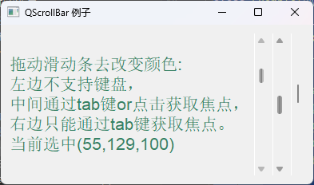

```python
# -*- coding: UTF-8 -*-
# File date: Hi_2023/3/15 0:56
# File_name: 02-QScrollBar 例子.py


import sys
from PySide6.QtCore import *
from PySide6.QtGui import *
from PySide6.QtWidgets import *


class Example(QWidget):
    def __init__(self):
        super(Example, self).__init__()
        self.initUI()

    def initUI(self):
        hbox = QHBoxLayout()
        self.label = QLabel("拖动滑动条去改变颜色")
        self.label.setFont(QFont("Arial", 16))
        hbox.addWidget(self.label)

        self.scrollbar1 = QScrollBar()
        self.scrollbar1.setMaximum(255)
        self.scrollbar1.sliderMoved.connect(self.sliderval)
        hbox.addWidget(self.scrollbar1)

        self.scrollbar2 = QScrollBar()
        self.scrollbar2.setMaximum(255)
        self.scrollbar2.setSingleStep(5)
        self.scrollbar2.setPageStep(50)
        self.scrollbar2.setValue(150)
        self.scrollbar2.setFocusPolicy(Qt.StrongFocus)
        self.scrollbar2.valueChanged.connect(self.sliderval)
        hbox.addWidget(self.scrollbar2)

        self.scrollbar3 = QScrollBar()
        self.scrollbar3.setMaximum(255)
        self.scrollbar3.setSingleStep(5)
        self.scrollbar3.setPageStep(50)
        self.scrollbar3.setValue(100)
        self.scrollbar3.setFocusPolicy(Qt.TabFocus)
        self.scrollbar3.valueChanged.connect(self.sliderval)
        hbox.addWidget(self.scrollbar3)

        self.setGeometry(300, 300, 300, 200)
        self.setWindowTitle('QScrollBar 例子')
        self.setLayout(hbox)

    def sliderval(self):
        value_tup =(self.scrollbar1.value(), self.scrollbar2.value(), self.scrollbar3.value())
        _str = "拖动滑动条去改变颜色:\n左边不支持键盘，\n中间通过tab键or点击获取焦点，\n右边只能通过tab键获取焦点。\n当前选中(%d,%d,%d)" % value_tup
        palette = QPalette()
        palette.setColor(QPalette.WindowText, QColor(*value_tup, 255))
        self.label.setPalette(palette)
        self.label.setText(_str)


if __name__ == '__main__':
    app = QApplication(sys.argv)
    demo = Example()
    demo.show()
    sys.exit(app.exec())

```

### QSlider 例子

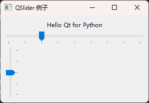

```python
# -*- coding: UTF-8 -*-
# File date: Hi_2023/3/15 0:57
# File_name: 05-QSlider 例子.py


import sys
from PySide6.QtCore import *
from PySide6.QtGui import *
from PySide6.QtWidgets import *


class SliderDemo(QWidget):
    def __init__(self, parent=None):
        super(SliderDemo, self).__init__(parent)
        self.setWindowTitle("QSlider 例子")
        self.resize(300, 100)

        layout = QVBoxLayout()
        self.label = QLabel("Hello Qt for Python")
        self.label.setAlignment(Qt.AlignCenter)
        layout.addWidget(self.label)

        # 水平滑块
        self.slider_horizon = QSlider(Qt.Horizontal)
        self.slider_horizon.setMinimum(10)
        self.slider_horizon.setMaximum(50)
        self.slider_horizon.setSingleStep(3)
        self.slider_horizon.setPageStep(10)
        self.slider_horizon.setValue(20)
        self.slider_horizon.setTickPosition(QSlider.TicksBelow)
        self.slider_horizon.setTickInterval(5)
        layout.addWidget(self.slider_horizon)

        # 垂直滑块
        self.slider_vertical = QSlider(Qt.Vertical)
        self.slider_vertical.setMinimum(5)
        self.slider_vertical.setMaximum(25)
        self.slider_vertical.setSingleStep(1)
        self.slider_vertical.setPageStep(5)
        self.slider_vertical.setValue(15)
        self.slider_vertical.setTickPosition(QSlider.TicksRight)
        self.slider_vertical.setTickInterval(5)
        self.slider_vertical.setMinimumHeight(100)
        layout.addWidget(self.slider_vertical)

        # 连接信号槽
        self.slider_horizon.valueChanged.connect(lambda: self.valuechange(self.slider_horizon))
        self.slider_vertical.valueChanged.connect(lambda: self.valuechange(self.slider_vertical))

        self.setLayout(layout)

    def valuechange(self, slider):
        size = slider.value()
        self.label.setText('选中大小：%d' % size)
        self.label.setFont(QFont("Arial", size))


if __name__ == '__main__':
    app = QApplication(sys.argv)
    demo = SliderDemo()
    demo.show()
    sys.exit(app.exec())

```


## 仪表盘控件QDial

仪表盘控件 QDial与滑块控件 QSlider 类似,只不过是把滑槽由直线变成圆。仪表盘控件可以设置仪表盘上显示的刻度,最大值刻度和最小值刻度可以重合,也可以不重合。

QDial 继承自 QAbstractSlider,继承了QAbstractSlider 的方法和信号。

用QDial类创建仪表盘实例的方法如下所示其中参数parent是仪表盘控件所在的窗口或容器控件。

```python
from PySide6.QtWidgets import QDial

QDial(parent: Union[PySide6.QtWidgets.QWidget, NoneType]=None) -> None
```

### 仪表盘控件QDial的常用方法

仪表盘控件QDial的常用方法如表所示。

- 用setNotchesVisible(visible:bool)方法设置刻度是否可见,
- 用setNotchTarget(target: float)方法设置刻度之间的像素距离,
- 用setWrapping(on:bool)方法设置最大值刻度和最小值刻度是否重合,
- 用setRange(min:int,max;int)方法设置最小值刻度和最大值刻度所代表的值
- 用setValue(int)方法设置滑块当前指向的值,
- 用value()方法获取滑块的值。

| QDial的方法及参数类型                 | 返回值的类型 | 说 明                                            |
| ------------------------------------- | ------------ | ------------------------------------------------ |
| [slot]setNotchesVisible(visible:bool) | None         | 设置刻度是否可见                                 |
| notchesVisible()                      | bool         | 获取刻度是否可见                                 |
| setNotchTarget(target:float)          | None         | 设置刻度之间的距离(像素)                         |
| notchTarget()                         | float        | 获取刻度之间的距离                               |
| [slot]setWrapping(on: bool)           | None         | 设置最大刻度和最小刻度是否重合                   |
| wrapping()                            | bool         | 获取最大值和最小值刻度是否重合                   |
| notchSize()                           | int          | 获取相邻刻度之间的值                             |
| setRange(min: int,max: int)           | None         | 设置刻度代表的最小值和最大值                     |
| setMaximum(int)                       | None         | 设置刻度代表的最大值                             |
| setMinimum(int)                       | None         | 设置刻度代表的最小值                             |
| setInvertedAppcarance(bool)           | None         | 设置刻度反向                                     |
| [slot]setValue(int)                   | None         | 设置滑块当前所在的位置                           |
| value()                               | int          | 获取滑块的值                                     |
| setPageStep(int)                      | None         | 设置按PgUp键和PgDn键时滑块移动的 距离            |
| setSingleStep(int)                    | None         | 设置按上下左右箭头键时滑块移动的距离             |
| setTracking(enable: bool)             | None         | 设置移动滑块时是否连续发送 valueChanged(int)信号 |

### QDial控件的信号

QDial控件的信号与 QSlider 控件的信号相同

滚动条控件QScrollBar 和滑块控件 QSlider 的信号如表所示

- 最常用的信号是valueChanged(value:int)

- actionTriggered(action:int)信号在用户用鼠标或键盘键改变滑块位置时发送,根据改变方式的不同,信号的参数值也不同action 的值可以取以下值,对应的值分别是0~7,例如

  - 单击两端的箭头改变滑块位置,参数的值是1或2
  - 如果单击滑块的轨道改变滑块位置,参数的值是3或4
  - 如果拖动滑块参数的值是 7

  | 值                                  |
  | ----------------------------------- |
  | QAbstractSlider.SliderNoAction      |
  | QAbstractSlider.SliderSingleStepAdd |
  | QAbstractSlider.SliderSingleStepSub |
  | QAbstractSlider.SliderPageStepAdd   |
  | QAbstractSlider.SliderPageStepSub   |
  | AbstractSlider.SliderToMinimum      |
  | QAbstractSlider.SliderToMaximum     |
  | QAbstractSlider.SliderMove          |

| QScrollBar和QSlider的信号及参数类型 | 说 明                                                        |
| ----------------------------------- | ------------------------------------------------------------ |
| valueChanged(value:int)             | 当值发生变化时发送信号                                       |
| rangeChanged(min:int, max: int)     | 当最小值和最大值发生变化时发送信号                           |
| sliderMoved(value:int)              | 当滑块移动时发送信号                                         |
| sliderPressed()                     | 当按下滑块时发送信号                                         |
| sliderReleased()                    | 当释放滑块时发送信号                                         |
| actionTriggered(action:int)         | 当用鼠标改变滑块位置时发送信号,参数 action根据改 变方式的不同也会不同 |

### QDial 例子

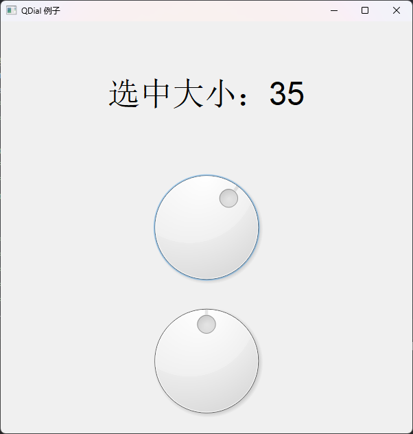

```python
# -*- coding: UTF-8 -*-
# File date: Hi_2023/3/15 0:48
# File_name: 03-QDial 例子.py


import sys
from PySide6.QtCore import *
from PySide6.QtGui import *
from PySide6.QtWidgets import *


class dialDemo(QWidget):
    def __init__(self, parent=None):
        super(dialDemo, self).__init__(parent)
        self.setWindowTitle("QDial 例子")
        self.resize(600, 600)

        layout = QVBoxLayout()
        self.label = QLabel("Hello Qt for Python")
        self.label.setAlignment(Qt.AlignCenter)
        layout.addWidget(self.label)

        # 普通qdial
        self.dial1 = QDial()
        self.dial1.setMinimum(10)
        self.dial1.setMaximum(50)
        self.dial1.setSingleStep(3)
        self.dial1.setPageStep(5)
        self.dial1.setValue(20)
        layout.addWidget(self.dial1)

        # 开启循环
        self.dial_wrap = QDial()
        self.dial_wrap.setMinimum(5)
        self.dial_wrap.setMaximum(25)
        self.dial_wrap.setSingleStep(1)
        self.dial_wrap.setPageStep(5)
        self.dial_wrap.setValue(15)
        self.dial_wrap.setWrapping(True)
        self.dial_wrap.setMinimumHeight(100)
        layout.addWidget(self.dial_wrap)

        # 连接信号槽
        self.dial1.valueChanged.connect(lambda: self.valuechange(self.dial1))
        self.dial_wrap.valueChanged.connect(lambda: self.valuechange(self.dial_wrap))

        self.setLayout(layout)

    def valuechange(self, dial):
        size = dial.value()
        self.label.setText('选中大小：%d' % size)
        self.label.setFont(QFont("Arial", size))


if __name__ == '__main__':
    app = QApplication(sys.argv)
    app.setWheelScrollLines(2)
    demo = dialDemo()
    demo.show()
    sys.exit(app.exec())

```


## 进度条控件QProgressBar

进度条控件QProgressBar 通常用来显示一项任务完成的进度例如复制文件导出数据的进度。进度条QProgressBar是从QWidget 继承而来的。

用QProgressBar类创建实例对象的方法如下所示其中 parent 是窗口或者容器类控件。
QProgressBar(parent;QWidget=None)

### 进度条控件QProgressBar的常用方法

进度条控件QProgressBar 的常用方法如表所示,主要方法介绍如下

- 值设置

  - 设置进度条的最小值可以用setRange(int,int)方法,也可以用setMinimum(int)和setMaximum(int)方法;

  - 设置当前值用setValue(int)方法;

  - 获取当前值用value()方法;

  - 用reset()方法可以清空进度,重新回到初始位置。

  - 当不知道总的工作量,或工作量还无法估计时,可以设置进度条的最大值和最小值都是 0。进度条显示繁忙指示时,不会显示当前的值。

- 进度条的方向

  - 用setOrientation(Qt.Orientation)方法可以设置进度条的方向,参数Q.Orientation 可以取:

    - Qt.Horizontal
    - Qt.Vertical;

  - 用setTextDirection(QProgressBar,Direction)方法设置进度条上文本的方向,参数 QProgressBar.Direction可以取:

    - QProgressBar,TopToBottom 文本顺时针旋转 90°
    - QProgressBar.BottomToTop 逆时针旋转 90

  - 设置文本在进度条上的对齐方式

    - 用setAlignment(Qt.Alignment)方法,如果Qt.Alignment 取 Qt.AlignHCenter,文本将会放置到进度条的中间。

  - 用setFormat(str)方法设置显示的文字格式,

    - 在文字中%p%表示百分比值
    - %v表示当前值
    - %m 表示总数,
    - 默认显示的是%p%,例如 setFormat("当前步数%v/总步数%m,%p%");获取文本格式用ormat)方法;

    - 获取格式化的文本用text()方法。

| QProgressBar的方法及参数类型             | 返回值的类型           | 说明                     |
| ---------------------------------------- | ---------------------- | ------------------------ |
| [slot]setMaximum(int)                    | None                   | 设置最大值               |
| [slot]setMinimurm(int)                   | None                   | 设置最小值               |
| [slot]setRange(int,int)                  | None                   | 设置范围(最小值和最大值) |
| maximum()、minimum()                     | int                    | 获取最大值和最小值       |
| [slot]setOrientation(Qt.Orientation)     | None                   | 设置方向                 |
| orientation()                            | Qt.Orientation         | 获取方向                 |
| setAlignment(Qt.Alignment)               | None                   | 设置文本对齐方式         |
| alignment()                              | Qt.Alignment           | 获取文本对齐方式         |
| setFormat(str)                           | None                   | 设置文本的格式           |
| format()                                 | str                    | 获取文本的格式           |
| resetFormat()                            | None                   | 重置文本格式             |
| setInverted Appearance(bool)             | None                   | 设置外观是否反转         |
| invertedAppearance()                     | bool                   | 获取外观是否反转         |
| setTextDirection(QProgressBar.Direction) | None                   | 设置进度条文本的方向     |
| textDirection()                          | QProgressBar.Direction | 获取进度条文本的方向     |
| setTextVisible(bool)                     | None                   | 设置进度条文本是否可见   |
| isTextVisible()                          | bool                   | 获取进度条文本是否可见   |
| [slot]setValue(int)                      | None                   | 设置当前值               |
| value()                                  | int                    | 获取当前值               |
| text()                                   | Str                    | 获取文本                 |
| [slot]reset()                            | None                   | 重置进度条,返回初始位置  |

### 进度条控件QProgressBar的信号

进度条控件QProgressBar 只有一个信号 valueChanged(value;int),当值发生变化时发送该信号。


### 进度条控件QProgressBar例子


```python
import sys

from PySide6.QtCore import QTimer
from PySide6.QtGui import Qt
from PySide6.QtWidgets import QWidget, QProgressBar, QPushButton, QApplication


class Window(QWidget):
    def __init__(self):
        super().__init__()
        self.setWindowTitle("QProgressBar")
        self.resize(500, 500)
        self.move(400, 250)
        self.setup_ui()

    def setup_ui(self):
        pb = QProgressBar(self)
        pb.move(100, 100)

        timer = QTimer(pb)

        def change_progress():
            if pb.value() == pb.maximum():
                timer.stop()
            pb.setValue(pb.value() + 1)

        timer.timeout.connect(change_progress)
        timer.start(500)

        pb.valueChanged.connect(lambda val: print(f"当前进度值为{val}"))


if __name__ == "__main__":
    app = QApplication(sys.argv)

    window = Window()
    window.show()

    sys.exit(app.exec())

```


## 尺寸手柄QSizeGrip

此小部件的工作方式类似于标准的Windows调整大小手柄。在X11版本中,如果X11窗口管理器不支持必要的现代后ICCCM规范,则该调整大小句柄的工作方式通常与系统提供的不同。
将此小部件放在小部件树中的任何位置,用户可以使用它来调整顶层窗口或设置了SubWindow标志的任何小部件的大小。通常,这应该在右下角。

注意,QStatusBar已经使用了这个小部件,所以如果有一个状态栏(例如,您正在使用QMainWindow),那么您不需要显式使用这个小部件。QDialog也是如此,只需调用setSizeGripEnabled()即可。
在某些平台上,当窗口全屏显示或最大化时,QSizeGrip会自动隐藏。

在macOS上,尺寸夹不再是人机界面指南的一部分,除非在QMdiSubWindow中使用,否则不会显示。在要在主窗口中显示的尺寸夹点上设置另一种样式。

QSizeGrip类继承了QWidget,并重新实现了mousePressEvent()和mouseMoveEvent()函数,以提供调整大小功能,以及paintEvent()功能,以渲染大小夹控件。

构造一个调整大小的角作为给定父控件的子控件

```python
from PySide6.QtWidgets import QSizeGrip

QSizeGrip(parent: PySide6.QtWidgets.QWidget) -> None
```

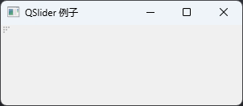

```python
# -*- coding: UTF-8 -*-
# File date: Hi_2023/2/28 23:03
# File_name: 尺寸手柄QSizeGrip例子.py


import sys
from PySide6.QtWidgets import *


class qsizegripDemo(QWidget):
    def __init__(self, parent=None):
        super(qsizegripDemo, self).__init__(parent)
        self.setWindowTitle("QSlider 例子")
        self.resize(300, 100)

        self.setUi()

    def setUi(self):
        qsizegrip = QSizeGrip(self)
        # 需要自己移动到指定位置


if __name__ == '__main__':
    app = QApplication(sys.argv)
    demo = qsizegripDemo()
    demo.show()
    sys.exit(app.exec())

```


## 橡皮筋选中QRubberBand

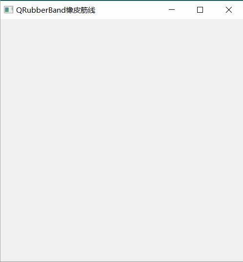

提供一个矩形或线来指示选择或边界, 一般结合鼠标事件一同协作

如果将父级传递给QRubberBand的构造函数,则橡皮筋将仅显示在其父级内部,但保留在其他子部件的顶部。如果没有传递父级,QRubberBand将充当顶级小部件。

### 构造方法

调用show()使橡皮筋可见；当橡皮筋不是顶级时也是如此。隐藏或破坏小部件将使橡皮筋消失。橡皮筋可以是矩形或直线(垂直或水平),这取决于构造时给出的形状()。

继承自QWidget

Shape-此枚举指定QRubberBand应具有的形状。这是一个传递给样式系统的绘图提示,可以由每个QStyle解释。

- `QRubberBand.Line` QRubberBand可以表示垂直或水平线。几何体仍然是在rect()中给出的,在大多数样式中,线条将填充给定的几何体。
- `QRubberBand.Rectangle` QRubberBand可以表示矩形。有些样式会将其解释为填充(通常为半透明)矩形或矩形轮廓。

构造形状为Shape的橡皮筋,父对象为parent。
默认情况下,矩形橡皮筋将使用遮罩,以便矩形的小边框是可见的。某些样式(例如,本机macOS)将更改此设置,并调用setWindowOpcity()以生成半透明的填充选择矩形。

```python
from PySide6.QtWidgets import QRubberBand

QRubberBand(Shape: PySide6.QtWidgets.QRubberBand.Shape, 
            parent: Union[PySide6.QtWidgets.QWidget, NoneType]=None) -> None
```

### 方法

继承自QWidget直接使用move、resize、setGeometry等父类方法即可

| 方法                                                         | 说明                                                         |
| ------------------------------------------------------------ | ------------------------------------------------------------ |
| move(x, y)                                                   | 移动到指定xy坐标点                                           |
| move(QPoint)                                                 | 移动到指定坐标                                               |
| resize(width, height)                                        | 更新橡皮筋的大小传入宽高值                                   |
| resize(QSize)                                                | 更新橡皮筋的大小传入QSize对象                                |
| setGeometry(x:int, y:int, width:int, height:int)             | 设置显示大小和位置,传入xy坐标和宽高                          |
| setGeometry(rect:QRect)                                      | 设置显示大小和位置,传入QRect对象                             |
| shape() -> QRubberBand.Shape                                 | 返回此橡皮筋的形状。                                         |
| initStyleOption(option:PySide6.QtWidgets.QStyleOptionRubberBand) | 用这个QRubberBand的值初始化选项。当子类需要QStyleOptionRubberBand,但不想自己填写所有信息时,此方法非常有用。 |

橡皮筋通常用于显示新的边界区域(如QSpliter或QDockWidget中的脱离坞)。历史上,这是使用QPainter和XOR实现的,但这种方法并不总是正常工作,因为渲染可能发生在橡皮筋下方的窗口中,但在橡皮筋被"擦除"之前。
每当需要渲染给定区域周围的橡皮筋(或表示一条直线)时,可以创建一个QRubberBand,然后调用setGeometry()、move()或resize()来定位和调整其大小。一种常见的模式是结合鼠标事件执行此操作。例如:

```python
def mousePressEvent(self, event):

    origin = event.pos()
    if not rubberBand:
        rubberBand = QRubberBand(QRubberBand.Rectangle, self)
    rubberBand.setGeometry(QRect(origin, QSize()))
    rubberBand.show()

def mouseMoveEvent(self, event):

    rubberBand.setGeometry(QRect(origin, event.pos()).normalized())

def mouseReleaseEvent(self, event):

    rubberBand.hide()
    # determine selection, for example using QRect::intersects()
    # and QRect::contains().
```

### 案例

在一个空白窗口内, 展示多个复选框控件,通过橡皮筋实现批量选中与取消选中效果

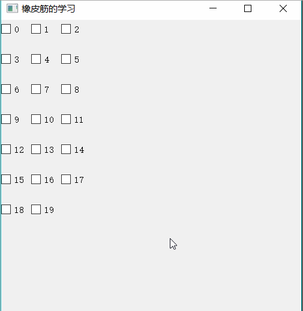

```python
import sys

from PySide6.QtCore import QRect, QSize, QPoint
from PySide6.QtGui import QMouseEvent
from PySide6.QtWidgets import QWidget, QRubberBand, QApplication, QCheckBox


class Window(QWidget):
    def __init__(self):
        super().__init__()
        self.setWindowTitle("QRubberBand-综合案例")
        self.resize(500, 500)
        self.move(400, 250)
        self.setup_ui()

    def setup_ui(self):
        # 0. 添加许多子控件
        for i in range(0, 32):
            cb = QCheckBox(self)
            cb.setText(f"{i}")
            cb.move(i % 4 * 50, i // 4 * 60)

        # 1. 创建一个橡皮筋选中控件
        self.rb = QRubberBand(QRubberBand.Rectangle, self)

    def mousePressEvent(self, a0) -> None:
        # 2. 尺寸大小：鼠标点击的位置点，00
        self.origin_pos = a0.position().toPoint()
        self.rb.setGeometry(QRect(self.origin_pos, QSize()))
        # 3. 展示橡皮筋控件
        self.rb.show()

    def mouseMoveEvent(self, a0) -> None:
        # 4. 调整橡皮筋选中的位置以及尺寸
        self.rb.setGeometry(QRect(self.origin_pos, a0.position().toPoint()).normalized())
        # QRect.normalized() 方法解决反向拖动矩形出现负数的情况

    def mouseReleaseEvent(self, a0) -> None:
        # 5. 获取橡皮筋控件的尺寸范围
        rect = self.rb.geometry()
        # 6. 遍历所有子控件，查看哪些子控件在区域范围
        for child in self.children():
            if rect.contains(child.geometry()) and child.inherits("QCheckBox"):
                child.toggle()
        self.rb.hide()


if __name__ == "__main__":
    app = QApplication(sys.argv)

    window = Window()
    window.show()

    sys.exit(app.exec())

```


## 欢迎界面QSplashScreen

[`QSplashScreen`](https://doc.qt.io/qtforpython/PySide6/QtWidgets/QSplashScreen.html#PySide6.QtWidgets.PySide6.QtWidgets.QSplashScreen) 小组件提供了一个初始屏幕,可以在应用程序启动期间显示。

初始屏幕是通常在启动应用程序时显示的小组件。初始屏幕通常用于启动时间较长的应用程序(例如,需要时间建立连接的数据库或网络应用程序),以向用户提供应用程序正在加载的反馈。

初始屏幕显示在屏幕中央。如果要将其保留在桌面上所有其他窗口之上,则将其添加到初始小部件的窗口标志可能会很有用。`WindowStaysOnTopHint`

某些 X11 窗口管理器不支持"停留在顶部"标志。解决方案是设置一个计时器,该计时器定期在初始屏幕上调用,以模拟"保持最佳"效果。`raise()`

最常见的用法是在主小部件显示在屏幕上之前显示初始屏幕。以下代码片段对此进行了说明,其中显示初始屏幕,并在显示应用程序的主窗口之前执行一些初始化任务:

```python
if __name__ == "__main__":

    app = QApplication([])
    pixmap = QPixmap(":/splash.png")
    splash = QSplashScreen(pixmap)
    splash.show()
    app.processEvents()            ...
window = QMainWindow()
window.show()
splash.finish(window)
sys.exit(app.exec())
```

用户可以通过用鼠标单击初始屏幕来隐藏它。由于初始屏幕通常在事件循环开始运行之前显示,因此需要定期调用以接收鼠标单击。`processEvents()`

有时,使用消息更新初始屏幕很有用,例如,在应用程序启动时宣布已建立的连接或加载的模块:

```python
pixmap = QPixmap(":/splash.png")
splash = QSplashScreen(pixmap)
splash.show()
...// Loading some items
splash.showMessage("Loaded modules")
QCoreApplication.processEvents()
...// Establishing connections
splash.showMessage("Established connections")
QCoreApplication.processEvents()
```

QSplashScreen 通过 showMessage() 函数支持这一点。

如果你想自己绘制,可以用pixmap()获得一个指向初始屏幕中使用的pixmap的指针。

或者可以对 QSplashScreen 进行子类化并重新实现 drawContent()。


如果有多个屏幕,也可以在与主屏幕不同的屏幕上显示初始屏幕。例如:

```python
screen = QGuiApplication.screens().at(1)
pixmap = QPixmap(":/splash.png")
splash = QSplashScreen(screen, pixmap)
splash.show()
```


### 实例化

```python
from PySide6.QtWidgets import QSplashScreen

QSplashScreen(pixmap: Union[PySide6.QtGui.QPixmap, PySide6.QtGui.QImage, str]= Default(PySide6.QtGui.QPixmap), 
              f: PySide6.QtCore.Qt.WindowType = Default(Qt.WindowFlags)) -> None
QSplashScreen(screen: PySide6.QtGui.QScreen, pixmap: Union[PySide6.QtGui.QPixmap, PySide6.QtGui.QImage, str]= Default(PySide6.QtGui.QPixmap), 
              f: PySide6.QtCore.Qt.WindowType = Default(Qt.WindowFlags)) -> None
```

- screen – PySide6.QtGui.QScreen
- pixmap – PySide6.QtGui.QPixmap
- f –WindowFlags

这是一个重载函数。此功能允许您指定屏幕的屏幕。

此构造函数的典型用法是,如果您有多个屏幕,并且希望在与主屏幕不同的屏幕上显示启动屏幕。在这种情况下,通过适当的屏幕。构建一个显示像素图的启动屏幕。

不需要设置小部件标志f,除了WindowStaysOnTopHint。


### 方法

| 方法                                                         | 返回值                | 说明                                                         |
| ------------------------------------------------------------ | --------------------- | ------------------------------------------------------------ |
| `finish(w)`                                                  | str                   | w – PySide6.QtWidgets.QWidget <br />在调用close()之前,使启动屏幕等待小部件mainWin显示。 |
| `message()`                                                  | str                   | 返回当前显示在初始屏幕上的消息。                             |
| `pixmap()`                                                   | PySide6.QtGui.QPixmap | 返回启动屏幕中使用的位图。<br />该图像没有通过showMessage()调用绘制的任何文本。 |
| `setPixmap(pixmap)`                                          | None                  | pixmap – PySide6.QtGui.QPixmap <br />将用作启动屏幕图像的位图设置为pixmap |
| `drawContents(painter)`                                      | None                  | painter– PySide6.QtGui.QPainter <br />使用painter.painter绘制闪屏的内容。<br />默认实现绘制showMessage()传递的消息。如果您想在启动屏幕上绘制自己的图形,请重新实现此功能。 |
| `[Slot]clearMessage()`                                       | None                  | 删除启动屏幕上显示的消息                                     |
| `showMessage(message[,alignment=Qt.AlignLeft[,color=Qt.black]])` | None                  | message -  – STR<br />alignment- 对齐方式<br />color – PySide6.QtGui.QColor<br />用彩色将消息文本绘制到启动屏幕上,并根据对齐的标志对齐文本。此函数调用重新绘制()以确保立即重新绘制启动屏幕。因此,该消息将与应用程序正在执行的操作(例如加载文件)保持最新。 |


### 信号

| 信号                                  | 说明                                                         |
| ------------------------------------- | ------------------------------------------------------------ |
| QSplashScreen.messageChanged(message) | message – str<br />当启动屏幕上的信息发生变化时,会发出此信号。message是新消息,当消息被删除时为空字符串。 |


### 例子

首先我们实例化一个QSplashScreen控件，并调用setPixmap()方法设置图片，接着调用show()方法进行显示。

showMessage(str, alignment, color)方法在程序启动画面上显示文字。

alignment为文字在启动画面上的位置，我们这里设为底部居中；color为文字的颜色，我们这里设为白色。

由于程序启动并不耗时，启动画面会一闪而过，所以我们在这里加一行time.sleep(2)来暂停两秒看一下效果。当我们决定可以开始显示主窗口时，调用finish()传入主窗口实例就可以了。

```python
# -*- coding: UTF-8 -*-
# File date: Hi_2023/2/28 23:03
# File_name: demo.py


import sys
import time
from PySide6.QtGui import QIcon, QPixmap
from PySide6.QtCore import QMimeData, Qt
from PySide6.QtWidgets import *


class MyWindow(QWidget):
    def __init__(self, parent=None):
        super().__init__(parent)
        self.set_windows()
        self.business_demo()

    def set_windows(self):
        self.resize(300, 300)  # 设置窗口大小
        self.setWindowTitle("hello world")  # 设置窗口标题

    def business_demo(self):
        qlabel = QLabel(self)
        qlabel.setText("hello world")  # 设置label文字
        qlabel.move((self.width() - qlabel.width()) // 2,(self.height() - qlabel.height()) // 2)  # 居中展示文本


if __name__ == '__main__':
    app = QApplication(sys.argv)

    splash = QSplashScreen()
    splash.setPixmap(QPixmap('../../../Resources/Images/Python-code.jpg'))
    splash.show()
    splash.showMessage('Welcome to Use This PySide6 Notebook~', Qt.AlignBottom | Qt.AlignCenter, Qt.white)
    time.sleep(2)

    demo = MyWindow()
    demo.show()
    splash.finish(demo)

    sys.exit(app.exec())

```


## 日