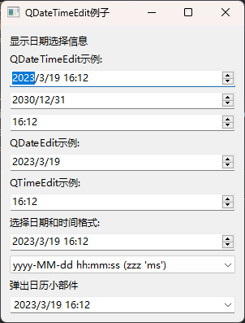

#  09.时间网页及音视频控件

## 日期时间类及控件

日期和时间类也是PySide6 中的基本类,利用它们可以设置纪年法、记录某个日期时间点、对日期时间进行计算等。用户输入日期时间及显示日期时间时需要用到日期时间控件

### 日历类QCalender

#### 日历类QCalender构造方法

日历类QCalendar 主要用于确定纪年法,当前通用的是公历纪年法,这也是默认值QCalendar 类在 PySide6,QtCore 块中。

用QCalendar 类创建日历实例的方法如下:

```python
from PySide6.QtCore import QCalendar

QCalendar(self) -> None
QCalendar(QCalendar: PySide6.QtCore.QCalendar) -> None
QCalendar(id: PySide6.QtCore.QCalendar.SystemId) -> None
QCalendar(name: str) -> None
QCalendar(system: PySide6.QtCore.QCalendar.System) -> None 
```

- name 可以取以下值(均是字符串):

  ```python
  Julian
  Jalali
  IslamicCivil
  Milankovic
  Gregorian
  islamicc
  Islamic
  gregory
  Persian
  islamic-civil
  ```

- system是QCalendar,System 的枚举值,可取以下值,默认值是 QCalendar.System.Gregorian

  - QCalendar.System.Gregorian
  - QCalendar.System.Julian
  - QCalendar.System.Milankovic
  - QCalendar.System.Jalali
  - QCalendar.System.IslamicCivil

#### 日历类QCalendar 的常用方法

日历类QCalendar 的常用方法如表所示

- 用name()方法获取当前使用的日历纪年法
- 用dateFromParts(year,month,day)方法可以创建一个 QDate对象。

| QCalendar的方法及参数类型                    | 返回值的类型 | 说明                         |
| -------------------------------------------- | ------------ | ---------------------------- |
| name()                                       | str          | 获取当前使用的日历纪年法     |
| [static]availableCalendars()                 | ListCstr]    | 获取可以使用的日历纪年法     |
| dateFromParts(year: int.month; int,day: int) | QDate        | 返回指定年、月、日构成的日期 |
| dayOfWeek(QDate)                             | int          | 获取指定日期在一周的第几天   |
| daysInMonth(month:int,year:int=None)         | int          | 获取指定年指定月的总天数     |
| daysInYear(year:int)                         | int          | 获取指定年中的总天数         |
| isDateValid(year:int,month: int,day:int)     | bool         | 获取指定的年、月、日是否有效 |
| isGregorian()                                | bool         | 获取是否是公历纪年           |
| isLeapYear(year: int)                        | bool         | 获取某年是否是闰年           |
| isLunar()                                    | bool         | 获取是否是月历               |
| isSolar()                                    | bool         | 获取是否是太阳历             |
| maximumDaysInMonth()                         | int          | 获取月中最大天数             |
| maximumMonthsInYear()                        | int          | 获取年中最大月数             |
| minimumDaysInMonth()                         | int          | 获取月中最小天数             |

#### 日历类QCalendar例子


```python
# -*- coding: UTF-8 -*-
# File date: Hi_2023/2/28 23:03
# File_name: 01-QCalendarWidget 例子.py


import sys
from PySide6 import QtCore
from PySide6.QtGui import *
from PySide6.QtWidgets import *
from PySide6.QtCore import QDate


class CalendarExample(QWidget):
    def __init__(self):
        super(CalendarExample, self).__init__()
        self.setGeometry(100, 100, 400, 350)
        self.setWindowTitle('Calendar 例子')
        layout = QVBoxLayout()
        self.dateTimeEdit = QDateTimeEdit(self)
        self.dateTimeEdit.setCalendarPopup(True)

        self.cal = QCalendarWidget(self)
        self.cal.setMinimumDate(QDate(1980, 1, 1))
        self.cal.setMaximumDate(QDate(3000, 1, 1))
        self.cal.setGridVisible(True)
        self.cal.setSelectedDate(QDate(2010, 1, 30))
        self.cal.setHorizontalHeaderFormat(QCalendarWidget.LongDayNames)
        # self.cal.setFirstDayOfWeek(Qt.Wednesday)
        self.cal.setFirstDayOfWeek(Qt.Wednesday)
        self.cal.move(20, 20)

        self.label = QLabel('此处会显示选择日期信息')

        self.cal.clicked.connect(lambda: self.showDate(self.cal))
        self.dateTimeEdit.dateChanged.connect(lambda x: self.cal.setSelectedDate(x))
        self.cal.clicked.connect(lambda x: self.dateTimeEdit.setDate(x))

        layout.addWidget(self.dateTimeEdit)
        layout.addWidget(self.cal)
        layout.addWidget(self.label)
        self.setLayout(layout)

    def showDate(self, cal):
        date = cal.selectedDate().toString("yyyy-MM-dd dddd")
        month = cal.monthShown()
        year = cal.yearShown()
        _str = '当前选择日期: %s;\n当前选择月份: %s;\n当前选择年份: %s;' %(date, month, year)
        self.label.setText(_str)


if __name__ == '__main__':
    app = QApplication(sys.argv)
    demo = CalendarExample()
    demo.show()
    sys.exit(app.exec())

```


### 日期类QDate

#### 日期类QDate构造方法

日期类QDate 用年、月日来记录某天,例如date=QDate(2023,8,22)date记录的是2023年8月22日,它可以从系统时钟中读取当前日期。

QDate提供了操作日期的方法,例如添加和减去日期、月份和年份得到新的日期,与日期字符串相互转换等。

QDate 在PySide6,QtCore模块中,用QDate创建日期实例的方法如下所示:

```python
from PySide6.QtCore import QDate

QDate(self) -> None
QDate(QDate: PySide6.QtCore.QDate) -> None
QDate(y: int, m: int, d: int) -> None
QDate(y: int, m: int, d: int, cal: PySide6.QtCore.QCalendar) -> None
```

#### 日期QDate的常用方法

日期QDate的常用方法如表所示,其中[]中的内容是可选项,主要方法介绍如下。

- 日期时间设置获取

  - 用setDate(year:int,month;int,day;int)方法可以设置年、月
  - 用getDate()方法可以获取记录的年月日,返回值是元组Tuple(year,month,day);
  - 用currentDate()方法可以获取系统日期;
  - 用day()month()和 year()方法可分别获取日、月、年。

- 时间计算

  - 用addDays(days:int) addMonths(months:int) addYears(years:int)方法可以在当前记录的时间上增加或减少天月和年;
  - 用daysTo(QDate)方法可计算与指定日期之间的天数间隔

- 字符串<==>QDate时间转换

  - 用fromString(string: str,format:Qt.DateFormat=Qt.TextDate)或 fromString(string:str,format:str)方法可以将字符串型的日期数据转换成QDate
  - 用toString(format:Qt.DateFormat=Qt.TextDate)或 toString(format: str)方法将记录的年、月、日转换成字符串

以上 Qt.DateFormat 是枚举类型常量,Qt.DateFormat可以取的值如表所示,用Qt.DateFormat 进行指定格式的转换时与操作系统有关。

| Qt.DateFormat的取值       | 举例                                                  |
| ------------------------- | ----------------------------------------------------- |
| Qt.DefaultLocaleLongDate  | [romString("2022年8月22 日*,Q1.DefaultLocaleLongDate) |
| Qt.DefaultIocaleShortDate | [romString("2022/08/22",Qt.DelaultLocaleSbortDate)    |
| Qt.ISODate                | fromString(*2022-G8-22",Qt.ISODate)                   |
| Qt.LocaleDate             | fromString(*2022/08/22",Qt.LocaleDate)                |
| Qt.SystemLocaleDate       | fromString("2022/08/22",Qt.SystemLocaleDate)          |
| Qt.SystemLocaleLongDate   | fromString("2022年8月 22 日*:Qt.SystemLocaleLongDate) |
| Qt.SystemLocaleShortDate  | fromString("2022/8/22".Qt.SystemLocaleShortDate)      |
| Qt.TextDate               | fromString("周六8月 22 2022*.Qt.TextDate)             |

format 是格式化文本,可以取的格式符号如表所示

| 日期格式符 | 说 明                                              |
| ---------- | -------------------------------------------------- |
| d          | 天数用1到31表示(不补0)                             |
| dd         | 天数用01到31表示(补0)                              |
| ddd        | 天数用英文简写表示('Mon'~'Sun')或汉字表示          |
| dddd       | 天数用英文全写表示('Monday'~'Sunday')或汉字表示    |
| M          | 月数用1到12表示(不补0)                             |
| MM         | 月数用01到12 表示(补 0)                            |
| MMM        | 月数用英文简写表示('Jan'～'Dec')或汉字表示         |
| MMMM       | 月数用英文全写表示('January'~'December')或汉字表示 |
| yy         | 年数用C0～99表示                                   |
| yyyy       | 年数用4 位数表示                                   |

例如date=QDate(2022,822),datetoString("日期是yyyy年M月d日")的返回值是"日期是2022年8月22日

datetoString("今天是dddd"的返回值是"今天是星期六",date.toString("今天是ddd")的返回值是"今天是周六"。

再例如以下方法的返回值都是 QDate(2022,8,22):

  ```python
QDate.fromString('20220822','yyyyMMdd')
QDate.fromString('2022/08/22', 'yyyy/MM/dd')
QDate.fromString('2022-08-22','yyyy-MM-dd')
QDate.fromString('2022,08,22','yyyy,MM,dd')
  ```

| QDate的方法及参数类型                                        | 返回值的类型         | 说 明                                                        |
| ------------------------------------------------------------ | -------------------- | ------------------------------------------------------------ |
| setDate(year: int, month: int, day: int[, cal: QCalendar])   | bool                 | 根据年、月、日设置日期                                       |
| getDate()                                                    | Tuple[int, int, int] | 获取记录的年、月、日                                         |
| day(), day(cal:QCalendar)                                    | int                  | 获取记录的日                                                 |
| month()、month(cal:QCalendar)                                | int                  | 获取记录的月                                                 |
| year()、year(cal:QCalendar)                                  | int                  | 获取记录的月                                                 |
| addDays(days:int)                                            | QDate                | 返回增加指定天后的日期, 参数可为负                           |
| addMonths(months: int[, cal: Qcalendar])                     | QDate                | 返回增加指定月后的日期, 参数可为负                           |
| addYears(years:int[, cal:Qcalendar])                         | QDate                | 返回增加指定年后的日期, 参数可为负                           |
| dayOfWeek([cal: Qcalendar])                                  | int                  | 获取记录的日期是一周中的第几天                               |
| dayOfYear([cal: Qcalendar])                                  | int                  | 获取记录的日期是一年中的第几天                               |
| dayslnMonth([cal:Qcalendar])                                 | int                  | 获取日期所在月的月天数                                       |
| daysInYear([cal: Qcalendar])                                 | int                  | 获取日期所在年的年天数                                       |
| daysTo(d:QDate)                                              | int                  | 获取记录的日期到指定日期的天数 ·                             |
| isNull()                                                     | bool                 | 获取是否不含日期数据                                         |
| toJulianDay()                                                | int                  | 换算成儒略日                                                 |
| toString(format=Qt.TextDate)                                 | Str                  | 将年、月、日按指定格式转换成字符串                           |
| toString(format: str, cal: QCalendar=Default(QCalendar))     | str                  | 将年、月、日按指定格式转换成字符串                           |
| weekNumber()                                                 | Tuple[int, int]      | 获取日期在一年中的第几周, 返回的元 组的第1个整数是周数, 第2个是年 |
| [static]currentDate()                                        | QDate                | 获取系统的日期                                               |
| [static]fromJulianDay(jd:int)                                | QDate                | 将儒略日时间转换成日期                                       |
| [static]fromString(string: str, format: Qt.DateFormat=Qt.TextDate) | QDate                | 从字符串中获取日期                                           |
| [static]fromString(string:str, format: str, cal=Default(QCalendar)) | QDate                | 从字符串中获取日期                                           |
| [static]isLeapYear(year:int)                                 | b001                 | 获取指定的年份是否是闰年                                     |
| [static]isValid(Ly: int.m:int, d:int])                       | bool                 | 获取指定的年、月、日是否有效                                 |

### 时间类QTime

#### 时间类QTime的构造方法

时间类QTime用时分秒和毫秒来记录某个时间点,它采用24 小时制,没有AM/PM和时区概念

例如time=QTime(22,35,15,124),time 记录的时间是22时35分15秒124 毫秒。

它可以对时间进行操作,例如增加或减少毫秒、秒；进行时间与字符串的相互转换等。

用QTime创建时间实例的方法如下所示:

```python
from PySide6.QtCore import QTime

QTime(self) -> None
QTime(QTime: PySide6.QtCore.QTime) -> None
QTime(h: int, m: int, s: int=0, ms: int=0) -> None
```

#### 时间QTime的常用方法

时间QTime的常用方法如表所示,主要方法介绍如下:

- 时间设置和获取

  - 用setHMS(h:int, m:int, s:int, ms:int=0)方法可以设置一个时间点
  - 用hour() minute() second()和 mse()方法可以分别获取小时分钟秒和毫秒数据。
  - 用addMSecs(ms:int)方法获取在记录的时间上增加ms 毫秒后的时间
  - 用addSecs(secs:int)方法获取在记录的时间上增加 secs 秒后的时间。

- 时间<==>字符串转换

  - 用fromString(str,format; Qt.DateFormat=Qt.TextDate)或 fromString(str,format:str)方法可以将时间字符串转换成日期
  - 用toString(f:QtDateFormat=Qt.TextDate)或toString(format:str)方法可以按照格式将时间转换成字符串

以上其中format是格式字符串可以取的格式字符如表所示。

- 例如`time=QTime(18,23,15,124)`,则`time.toString("hh:mm:ssA")`的值是`"06:23:15下午"`
- 再如`time=QTime.currentTime()`,则 `timetoString("现在时间是h: m: s: zzz")`的值是`"现在时间是 16:19:44:698"`

| 时间格式字符 | 说 明                                        |
| ------------ | -------------------------------------------- |
| +            | 小时用0～23表示,或 1～12表示(如果显示am/pm)  |
| hh           | 小时用00～23表示,或01～12表示(如果显示am/pm) |
| H            | 小时用0~23表示(不论是否显示am/pm)            |
| HH           | 小时用00~23表示(不论是否显示am/pm)           |
| m            | 分钟用0～59表示(不补0)                       |
| mm           | 分钟用00~59表示(补0)                         |
| S            | 秒用0～59表示(不补0)                         |
| SS           | 秒用00~59表示(补0)                           |
| z            | 毫秒用0~999表示(不补0)                       |
| zzz          | 毫秒用000~999表示(补0)                       |
| t            | 时区,例如"CEST"                              |
| ap或a        | 使用am/pm表示上午/下午或汉字                 |
| AP或A        | 使用AM/PM表示上午/下午或汉字                 |

### 日期时间类QDateTime

#### 日期时间类QDateTime的构造方法

日期时间类QDateTime是将 QDate 和QTime的功能合并到一个类中,用年、月、日、时、分、秒、毫秒记录某个日期和某个时间点,它有时区的概念。

用QDateTime创建日期时间实例的方法如下所示,其中Qt.TimeSpec 可以取以下值,对应的值分别是 0~3;当spec取 Qt.OffsetFromUTC时,offsetSeconds 才有意义。

- Qt.LocalTime
- Qt.UTC
- Qt.OffsetFromUTC
- Qt.TimeZone

```python
from PySide6.QtCore import QDateTime

QDateTime(self) -> None
QDateTime(arg__1: int, arg__2: int, arg__3: int, arg__4: int, arg__5: int, arg__6: int) -> None
QDateTime(arg__1: int, arg__2: int, arg__3: int, arg__4: int, arg__5: int, arg__6: int, arg__7: int, arg__8: PySide6.QtCore.Qt.TimeSpec = Instance(Qt.LocalTime)) -> None
QDateTime(arg__1: int, arg__2: int, arg__3: int, arg__4: int, arg__5: int, arg__6: int, arg__7: int, arg__8: int = Instance(Qt.LocalTime)) -> None
QDateTime(date: PySide6.QtCore.QDate, time: PySide6.QtCore.QTime, spec: PySide6.QtCore.Qt.TimeSpec = Instance(Qt.LocalTime), offsetSeconds: int = 0) -> None
QDateTime(date: PySide6.QtCore.QDate, time: PySide6.QtCore.QTime, timeZone: PySide6.QtCore.QTimeZone) -> None
QDateTime(other: PySide6.QtCore.QDateTime) -> None
```

#### 日期时间类QDateTime的常用方法

日期时间类QDateTime的常用方法如表所示其大部分方法与QDate 和QTime的方法相同。

利用QDateTime将日期时间与字符串进行相互转换时,可以参考 QDate 和QTime的格式字符。.

| QDateTime的方法及参数类型                                    | 返回值的类型 | 说 明                                                        |
| ------------------------------------------------------------ | ------------ | ------------------------------------------------------------ |
| setDate(date:QDate)                                          | None         | 设置日期                                                     |
| setTime(time: QTime)                                         | None         | 设置时间                                                     |
| date()                                                       | QDate        | 获取日期                                                     |
| time()                                                       | QTime        | 获取时间                                                     |
| setTimeSpec(spec:Qt.TimeSpec)                                | None         | 设置计时准则                                                 |
| setSecsSinceEpoch(secs: int)                                 | None         | 设置从1970年1月1日零时开始的时间(秒)                         |
| setMSecsSinceEpoch(msecs；int)                               | None         | 将日期时间设置为从1970年1月1日零时开 始的时间                |
| setOffsetFromUtc(offsetSeconds:int)                          | None         | 将日期时间设置为国际统一时间偏移指定 offsetSeconds秒开始的时间,偏移时间不超 过士14小时 |
| addYears(years:int)                                          | QDateTime    | 增加年                                                       |
| addMonths(months:int)                                        | QDateTime    | 增加月                                                       |
| addDays(days:int)                                            | QDateTime    | 增加天                                                       |
| addSecs(secs:int)                                            | QDateTime    | 增加秒                                                       |
| addMSecs(msecs:int)                                          | QDateTime    | 增加毫秒                                                     |
| [static]currentDateTime()                                    | QDateTime    | 获取当前系统的日期和时间                                     |
| [static]currentDateTimeUtc()                                 | QDateTime    | 获取当前世界统一时间                                         |
| [static]currentSecsSinceEpoch()                              | int(秒)      | 返回从1970年1月1日零时到现在为止的秒数                       |
| [static]currentMSecsSinceEpoch()                             | int          | 返回从1970年1月1日零时到现在为止的毫秒数                     |
| daysTo(QDateTime)                                            | int(天)      | 获取与指定日期时间的间隔                                     |
| secsTo(QDateTime)                                            | int(秒)      | 获取与指定日期时间的间隔                                     |
| msecsTo(QDateTime)                                           | int(毫秒)    | 获取与指定日期时间的间隔                                     |
| [static]fromString(str, format: Qt.DateFormat=Qt.TextDate)   | QDateTime    | 将字符串转换成日期时间                                       |
| [static]fromString(str,format: str,cal: QCalendar=Default(QCalendar)) | QDate Time   | 将字符串转换成日期时间                                       |
| [static]fromSecsSinceEpoch(secs:int, spec:Qt.TimeSpec=Qt.LocalTime, offsetFromUtc:int=0) | QDateTime    | 指定秒创建日期时间                                           |
| [static]fromMSecsSinceEpoch(msecs: int, spec: Qt.TimeSpec=Qt.LocalTime, offsetFromUte: int=0) | QDateTime    | 指定毫秒创建日期时间                                         |
| toString(format: str, cal: QCalendar=Default(QCalendar))     | str          | 根据格式将日期时间转换成字符串                               |
| toString(format=Qt.TextDate)                                 | Str          | 根据格式将日期时间转换成字符串                               |
| toUTC()                                                      | QDateTime    | 转换成国际统一时间                                           |
| toTimeSpec(spec;Qt.TimeSpec)                                 | QDateTime    | 转换成指定的计时时间                                         |
| toSecsSinceEpoch()                                           | int(秒)      | 返回从1970年1月1日开始计时的秒数                             |
| toMSecsSinceEpoch()                                          | int(毫秒)    | 返回从1970年1月1日开始计时的毫秒数                           |
| toLocalTime()                                                | QDateTime    | 转换成当地时间                                               |
| isNull()                                                     | boo1         | 所记录的日期时间是否为空                                     |
| isValid()                                                    | b001         | 所记录的日期时间是否有效                                     |


### 日历控件QCalenderWidget


#### 日历控件QCalenderWidget的构造方法

日历控件QCalendarWidget 主要用于显示日期星期和周数,可以设置日历控件显示的最小日期和最大日期,还可以设置日历表头的样式。

用QCalendarWidget类创建实例对象的方法如下所示其中parent是日历控件所在的窗体或容器控件。QCalendarWidget 继承自QWidget类。

```python
from PySide6.QtWidgets import QCalendarWidget

QCalendarWidget(parent: Union[PySide6.QtWidgets.QWidget, NoneType]=None) -> None 
```

#### 日历控件QCalendarWidget的常用方法

日历控件QCalendarWidget 的常用方法如表所示,主要方法介绍如下。

- 日期选择和选择模式
  - 用selectedDate()方法可以获取当前选择的日期;
  - 用setSelectedDate(QDate)方法可以用代码选中某个日期;
  - 用setDateRange(min:QDate,max:QDate)方法或setMaximumDate(date:QDate)和 setMinimumDate(date:QDate)方法可以设置选择的日期范围;
  - 用setSelectionMode(QCalendarWidget,SelectionMode)方法可以设置选择日期的模式,其中参数QCalendarWidget.SelectionMode可以取:
    - QCalendarWidget,NoSelection(不允许选择)
    - QCalendarWidget,SingleSelection(单选)
- 显示指定时间段
  - 用showSelectedDate()方法可以跳转到选中的日期
  - 用setCurrentPage(yearmonth)方法可以显示指定年指定月的日历
  - 用showNextMonth()showNextYear()方法可以显示下个月、明年同一日期的日历。
- 日历控件外观
  - 用setGridVisible(bool)方法可以设置是否显示网格线,
  - 用setNavigationBarVisible(bool)方法可以设置是否显示导航条。
  - 用setVerticalHeaderFormat((QCalendarWidget.VerticalHeaderFormat)方法可以设置竖直表头的格式,其中参数 QCalendarWidget.VerticalHeaderFormat 可以取:
    - QCalendarWidget,ISOWeekNumbers(标准格式的周数)
    - QCalendarWidget,NoVerticalHeader(隐藏周数)。
  - 用setHorizontalHeaderFormat(QCalendarWidget.HorizontalHeaderFormat)方法可以设置水平表头的格式其中参数QCalendarWidget.HorizontalHeaderFormat 可以取:
    - QCalendarWidget.SingleLetterDayNames(用单个字母代替全拼,如M代表Monday)
    - QCalendarWidget.ShortDayNames(用缩写代替全拼,如Mon 代表Monday)
    - QCalendarWidget,LongDayNames(全名)
    - QCalendarWidget.NoHorizontalHeader(隐藏表头)。
  - 用setFirstDayOfWeek(Qt.DayOfWeek)方法可以设置一周中哪天排在最前面,其中参数 QtDayOfWeek 可以取Qt.Monday~Qt.Sunday。

| QCalendarWidget 的方法及参数类型                             | 返回值的类型    | 说明                                    |
| ------------------------------------------------------------ | --------------- | --------------------------------------- |
| [slot]setSelectedDate(date:QDate)                            | None            | 用代码设置选中的日期                    |
| selectedDate()                                               | QDate           | 获取选中的日期                          |
| setCalendar(calendar:QCalendar)                              | None            | 设置日历                                |
| calendar()                                                   | QCalendar       | 获取日历                                |
| [slot]setCurrentPage(year:int,month:int)                     | None            | 设置当前显示的年和月                    |
| setDateTextFormat(QDate,QTextCharFormat)                     | None            | 设置表格的样式                          |
| dateTextFormat(date:QDate) .                                 | QTextCharFormat | 获取表格的样式                          |
| setFirstDayOfWeek(Qt.DayOfWeek)                              | None            | 设置一周第一天显示哪天                  |
| firstDayOfWeek()                                             | Qt.DayOfWeek    | 获取一周第一天显示的是哪天              |
| [slot]setGridVisible(bool)                                   | None            | 设置是否显示网格线                      |
| isGridVisible()                                              | bool            | 获取是否已经显示网格线                  |
| setHorizontalHeaderFormat(QCalendarWidget.HorizontalHeaderFormat) | None            | 设置水平表头的格式                      |
| setVerticalHeaderFormat(QCalendarWidget.VerticalHeaderFormat) | None            | 设置竖直表头的格式                      |
| [slot]setDateRange(min:QDate.max: QDate)                     | None            | 设置日历控件可选择的最小日期 和最大日期 |
| setMaximumDate(date: QDate)                                  | None            | 设置日历控件可选的最大日期              |
| maximumDate()                                                | QDate           | 获取日历控件可选的最大日期              |
| setMinimumDate(date:QDate)                                   | None            | 设置日历控件可选的最小日期              |
| minimumDate()                                                | QDate           | 获取日历控件可选的最小日期              |
| setSelectionMode(QCalendarWidget.SelectionMode)              | None            | 设置选择模式                            |
| [slot]setNavigationBarVisible(bool)                          | None            | 设置导航条是否可见                      |
| isNavigationBarVisible()                                     | bo01            | 获取导航条是否可见                      |
| [slot]showSelectedDate()                                     | None            | 显示已经选中日期的日历                  |
| [slot]showNextMonth()                                        | None            | 显示下个月的日历                        |
| [slot]showNextYear()                                         | None            | 显示明年的日历                          |
| [slot]showPreviousMonth()                                    | None            | 显示上个月的日历                        |
| [slot]showPreviousYear()                                     | None            | 显示去年的日历                          |
| [slot]showToday()                                            | None            | 显示当前日期的日历                      |
| monthShown()                                                 | int             | 获取日历显示的月份                      |
| yearShown()                                                  | Int             | 获取日历显示的年份                      |

#### 日历控件QCalendarWidget例1

```python
# -*- coding: UTF-8 -*-
# File date: Hi_2023/2/28 23:03
# File_name: 01-QCalendarWidget 例子.py


import sys
from PySide6 import QtCore
from PySide6.QtGui import *
from PySide6.QtWidgets import *
from PySide6.QtCore import QDate


class CalendarExample(QWidget):
    def __init__(self):
        super(CalendarExample, self).__init__()
        self.setGeometry(100, 100, 400, 350)
        self.setWindowTitle('Calendar 例子')
        layout = QVBoxLayout()
        self.dateTimeEdit = QDateTimeEdit(self)
        self.dateTimeEdit.setCalendarPopup(True)

        self.cal = QCalendarWidget(self)
        self.cal.setMinimumDate(QDate(1980, 1, 1))
        self.cal.setMaximumDate(QDate(3000, 1, 1))
        self.cal.setGridVisible(True)
        self.cal.setSelectedDate(QDate(2010, 1, 30))
        self.cal.setHorizontalHeaderFormat(QCalendarWidget.LongDayNames)
        # self.cal.setFirstDayOfWeek(Qt.Wednesday)
        self.cal.setFirstDayOfWeek(Qt.Wednesday)
        self.cal.move(20, 20)

        self.label = QLabel('此处会显示选择日期信息')

        self.cal.clicked.connect(lambda: self.showDate(self.cal))
        self.dateTimeEdit.dateChanged.connect(lambda x: self.cal.setSelectedDate(x))
        self.cal.clicked.connect(lambda x: self.dateTimeEdit.setDate(x))

        layout.addWidget(self.dateTimeEdit)
        layout.addWidget(self.cal)
        layout.addWidget(self.label)
        self.setLayout(layout)

    def showDate(self, cal):
        date = cal.selectedDate().toString("yyyy-MM-dd dddd")
        month = cal.monthShown()
        year = cal.yearShown()
        _str = '当前选择日期: %s;\n当前选择月份: %s;\n当前选择年份: %s;' %(date, month, year)
        self.label.setText(_str)


if __name__ == '__main__':
    app = QApplication(sys.argv)
    demo = CalendarExample()
    demo.show()
    sys.exit(app.exec())

```


#### 日历控件QCalendarWidget例2

```python
# -*- coding: UTF-8 -*-
# File date: Hi_2023/3/19 15:54
# File_name: 01-例2.py


import sys
from PySide6.QtWidgets import *
from PySide6.QtGui import *
from PySide6 import QtCore
from PySide6.QtCore import QDate


class CalendarExample(QWidget):
    def __init__(self):
        super(CalendarExample, self).__init__()
        self.initUI()

    def initUI(self):
        # 实例化日历控件
        self.cal = QCalendarWidget(self)
        # 设置日历的最小日期
        self.cal.setMinimumDate(QDate(1980, 1, 1))
        # 设置日历的最大日期
        self.cal.setMaximumDate(QDate(3000, 1, 1))
        # 设置日历的网格是否可见
        self.cal.setGridVisible(True)
        # 控件位置移动
        self.cal.move(20, 20)
        # 点击绑定自定义的槽函数
        self.cal.clicked[QtCore.QDate].connect(self.showDate)

        # 创建标签
        self.lb1 = QLabel(self)
        # 设置标签的文本为日历控件所选中的日期，并转为str数据显示
        date = self.cal.selectedDate()
        self.lb1.setText(date.toString('yyyy-MM-dd dddd'))

        # 标签移动位置
        self.lb1.move(20, 300)
        # 设置主窗口的位置及初始大小和标题
        self.setGeometry(200, 100, 400, 350)
        self.setWindowTitle('Calendar例子')

    def showDate(self, date):
        # 设置标签的文本值
        self.lb1.setText(date.toString('yyyy-MM-dd dddd'))


if __name__ == '__main__':
    app = QApplication(sys.argv)
    demo = CalendarExample()
    demo.show()
    sys.exit(app.exec_())

```


### 日期时间控件QDateTimeEdit

日期时间控件包括QDateTimeEdit,QDateEdit 和QTimeEdit 三个控件。

这三个控件可以显示日期时间,但更多的是用于输入日期时间,

- QDateTimeEdit可以输入日期和时间,QDateTimeEdit是有下拉列表的日历控件用于选择日期
- QDateEdit 只能输入日期
- QTimeEdit 只能输人时间

用QDateTimeEdit、QDateEdit和QTimeEdit类创建实例对象的方法如下所示,其中parent是控件所在的窗体或容器控件。

QDateTimeEdit是从QAbstractSpinBox类继承而来的

QDateEdit和QTimeEdit都是从QDateTimeEdit类继承而来的。

```python
from PySide6.QtWidgets import QDateTimeEdit, QTimeEdit, QDateEdit

QDateTimeEdit(d: PySide6.QtCore.QDate, parent: Union[PySide6.QtWidgets.QWidget, NoneType]= None) -> None
QDateTimeEdit(dt: PySide6.QtCore.QDateTime, parent: Union[PySide6.QtWidgets.QWidget, NoneType]= None) -> None
QDateTimeEdit(parent: Union[PySide6.QtWidgets.QWidget, NoneType]= None) -> None
QDateTimeEdit(t: PySide6.QtCore.QTime, parent: Union[PySide6.QtWidgets.QWidget, NoneType]= None) -> None
QDateTimeEdit(val: Any, parserType: PySide6.QtCore.QMetaType.Type, parent: Union[PySide6.QtWidgets.QWidget, NoneType]= None) -> None

QDateEdit(date: PySide6.QtCore.QDate, parent: Union[PySide6.QtWidgets.QWidget, NoneType]= None) -> None
QDateEdit(parent: Union[PySide6.QtWidgets.QWidget, NoneType]= None) -> None

QTimeEdit(parent: Union[PySide6.QtWidgets.QWidget, NoneType]= None) -> None
QTimeEdit(time: PySide6.QtCore.QTime, parent: Union[PySide6.QtWidgets.QWidget, NoneType]= None) -> None
```

#### QDateTimeEdit、QDateEdit和QTimeEdit的方法

日期时间控件 QDateTimeEdit 的常用方法如表所示。

由于QDateEdit 和QTimeEdit 都继承自QDateTimeEdit,因此 QDateEdit 和 QTimeEdit 的方法与QDateTimeEdit 的大多数方法相同。

QDateTimeEdit 的主要方法介绍如下:

- 设置时间日期
  - 用setDate(QDate),setTime(QTime)和 setDateTime(QDateTime)方法为时间和日期控件QDateEditQTimeEdit 和 QDateTimeEdit 设置日期和时间
  - 用setDateRange(QDate, QDate),setTimeRange(QTime, QTime)或 setDateTimeRange(QDateTime, QDateTime)方法设置日期和时间的最小值和最大值
- 时间格式和获取
  - 用setDisplayFormat(format)方法可以设置QDateTimeEdit 显示日期时间的格式
  - 用displayFormat()方法获取显示格式。关于格式符号的使用,请参考日期类和时间类的内容。
- 字符串和日期时间对象转换
  - 用dateTimeFromText(str)方法可以将字符串转换成日期时间对象
  - 用textFromDateTime(QDateTime)方法可以将日期时间转换成字符串
- 日期时间控件的输入部分被分割成年、月、日、时、分、秒、毫秒多个部分,
  - 用setSelectedSection(QDateTimeEdit.Section)方法可以使某个部分被选中,其中QDateTimeEdit.Section可以取:
    - QDateTimeEdit.NoSection
    - QDateTimeEdit.AmPmSection AM/PM
    - QDateTimeEdit, MSecSection 毫秒
    - QDateTimeEdit.SecondSection 秒
    - QDateTimeEdit.MinuteSection 分
    - QDateTimeEdit.HourSection 时
    - QDateTimeEdit.DavSection 日
    - QDateTimeEdit.MonthSection 月
    - QDateTimeEdit.YearSection 年
  - 用sectionText(section:QDateTimeEdit.Section)方法可以获取各个部分的文本;
  - 用sectionAtindex:int)方法可以根据索引获取对应部分,例如sectionAt(0)为QDateTimeEdit.YearSection。

| QDateTimeEdit的方法及参数类型                                | 返回值的类型 | 说明                       |
| ------------------------------------------------------------ | ------------ | -------------------------- |
| [slot]setTime(time: QTime)                                   | None         | 设置时间                   |
| time()                                                       | QTime        | 获取时间                   |
| [slot]setDate(date: QDate)                                   | None         | 设置日期                   |
| date()                                                       | QDate        | 获取日期                   |
| [slot]setDateTime(dateTime: QDateTime)                       | None         | 设置日期时间               |
| dateTime()                                                   | QDateTime    | 获取日期时间               |
| setDateRange(min:QDate, max: QDate)                          | None         | 设置日期的范围             |
| setTimeRange(min: QTime,max: QTime)                          | None         | 设置时间的范围             |
| setDateTimeRange(min: QDateTime, max: QDateTime)             | None         | 设置日期时间的范围         |
| sefMaximumDate(max: QDate)<br />setMaximumDateTime(dt:QDateTime)<br />setMaximumTime(max: QTime) | None         | 设置显示的最大日期时间     |
| setMinimumDate(min:QDate)<br />setMinimumDateTime(dt:QDateTime)<br />setMinimumTime(min:QTime) | None         | 设置显示的最小日期时间     |
| clearMaximumDate()<br />clearMaximumDateTime()<br />clearMaximumTime() | None         | 清除最大日期时间限制       |
| clearMinimumDate()<br />clearMinimumDateTime()<br />clearMinimumTime() | None         | 清除最小日期时间限制       |
| setCalendarPopup(bool)                                       | None         | 设置是否有日历控件         |
| calendarPopup()                                              | bool         | 获取是否有日历控件         |
| setCalendarWidget(QCalendarWidget)                           | None         | 设置日历控件               |
| setDisplayFormat(format:str)                                 | None         | 设置显示格式               |
| displayFormat()                                              | str          | 获取显示格式               |
| dateTimeFromText(str)                                        | QDateTime    | 将字符串转换成日期时间对象 |
| textFromDateTime(QDateTime)                                  | str          | 将日期时间对象转换成字符串 |
| setCalendar(QCalendar)                                       | None         | 设置日历                   |
| setSelectedSection(QDateTimeEdit.Section)                    | None         | 设置被选中的部分           |
| sectionText(section:QDateTimeEdit.Section)                   | Str          | 获取对应部分的文本         |
| sectionCount()                                               | int          | 获取总共分几部分           |
| setTimeSpec(spec: Qt.TimeSpec)                               | None         | 设置时间计时参考点         |

#### QDateTimeEdit、QDateEdit和QTimeEdit的信号

日期时间控件的信号有

- 当日期改变时发送 dateChanged(QDate)信号
- 当日期或时间改变时发送dateTimeChanged(QDateTime)信号
- 当时间改变时发送timeChangedQTime)信号
- 当编辑完成按Enter 键或失去焦点时发送editingFinished()信号


#### QDateTime、QDate、QTime例子

```python
import sys
import time

from PySide6.QtCore import *
from PySide6.QtGui import *
from PySide6.QtWidgets import *


class Window(QWidget):
    def __init__(self):
        super().__init__()
        self.setWindowTitle("QDateTime")
        self.resize(500, 500)
        self.move(400, 250)
        self.setup_ui()

    def setup_ui(self):
        # QDateTime QDate QTime 这三个类之间没有继承关系

        # QDateTime
        # -------------创建----------------
        # dt = QDateTime()
        # dt = QDateTime(2021, 5, 8, 12, 30)  # 创建时设置年、月、日、时、分
        dt = QDateTime.currentDateTime()  # 静态方法，获取当前时间
        # dt = QDateTime.currentDateTimeUtc()  # 静态方法，获取当前的UTC时间
        print("dt:", dt)

        # -------------调整日期时间------------
        dt_add_year = dt.addYears(1)  # 增加1年，返回一个新的QDateTime对象
        print("dt_add_year:", dt_add_year)
        print("dt_add_secs", dt.addSecs(600))  # 增加小时或分钟没有专门的函数，需要通过增加秒来设置
        dt.setTime(QTime(12, 5, 31, 0))  # 设置时间

        # -----------计算时间差-----------
        print("offset from UTC", QDateTime.offsetFromUtc(QDateTime.currentDateTime()))  # 本地时间与UTC时间之差(单位为s)
        print(dt.secsTo(QDateTime.currentDateTime()))  # 计算两个时间之差，单位s

        # ----------展示时间-------
        dte = QDateTimeEdit(dt, self)  # 方便查看起见，展示一下dt的信息
        dte.move(100, 100)

        # QDate
        # ---------构造----------
        # qd = QDate(2020, 1, 1)  # 构造时传入年月日信息
        qd = QDate.currentDate()
        print(QDate.currentDate())  # 获取当前日期

        # --------调整日期------
        # 类似QDateTime

        # ---------计算时间差-----
        print("dates to 2001.1.1:", QDate(2001, 1, 1).daysTo(qd))

        # ---------获取时间--------
        print("day of week", qd.dayOfWeek())  # 这一周的第几日
        print("day of year", qd.dayOfYear())  # 这一年的第几日
        print("days in month", qd.daysInMonth())  # 这一月总共多少天
        print("days in year", qd.daysInYear())  # 这一年总共多少天

        # QTime
        # --------构造--------
        my_time = QTime(12, 00)
        # my_time = QTime.currentTime()

        # -------调整时间-------
        # 类似QDAteTime

        # --------计算时间差------
        print("secs to:", my_time.secsTo(QTime(12, 0)))


if __name__ == "__main__":
    app = QApplication(sys.argv)

    window = Window()
    window.show()

    sys.exit(app.exec())

"""
dt: PySide6.QtCore.QDateTime(2023, 3, 19, 16, 10, 34, 323, 0)
dt_add_year: PySide6.QtCore.QDateTime(2024, 3, 19, 16, 10, 34, 323, 0)
dt_add_secs PySide6.QtCore.QDateTime(2023, 3, 19, 16, 20, 34, 323, 0)
offset from UTC 28800
14703
PySide6.QtCore.QDate(2023, 3, 19)
dates to 2001.1.1: 8112
day of week 7
day of year 78
days in month 31
days in year 365
secs to: 0
"""
```

#### DateTimeEdit 例子



```python
# -*- coding: UTF-8 -*-
# File date: Hi_2023/2/28 23:03
# File_name: 04-DateTimeEdit 例子.py


import sys
from PySide6.QtGui import *
from PySide6.QtWidgets import *
from PySide6.QtCore import QDate, QDateTime, QTime


class DateTimeEditDemo(QWidget):
    def __init__(self):
        super(DateTimeEditDemo, self).__init__()
        self.initUI()

    def initUI(self):
        self.setWindowTitle('QDateTimeEdit例子')
        self.resize(300, 90)
        vlayout = QVBoxLayout()
        self.label = QLabel('显示日期选择信息')
        vlayout.addWidget(self.label)

        # QDateTimeEdit示例
        dateTimeLabel = QLabel('QDateTimeEdit示例:')
        dateTimeEdit = QDateTimeEdit(QDateTime.currentDateTime(), self)
        dateTimeEdit01 = QDateTimeEdit(QDate.currentDate(), self)
        dateTimeEdit01.setDate(QDate(2030, 12, 31))
        dateTimeEdit02 = QDateTimeEdit(QTime.currentTime(), self)
        vlayout.addWidget(dateTimeLabel)
        vlayout.addWidget(dateTimeEdit)
        vlayout.addWidget(dateTimeEdit01)
        vlayout.addWidget(dateTimeEdit02)

        # QDateEdit 示例
        dateEdit = QDateEdit(QDate.currentDate())
        dateEdit.setDateRange(QDate(2015, 1, 1), QDate(2030, 12, 31))
        dateLabel = QLabel('QDateEdit示例:')
        vlayout.addWidget(dateLabel)
        vlayout.addWidget(dateEdit)

        # QTimeEdit 示例
        timeEdit = QTimeEdit(QTime.currentTime())
        timeEdit.setTimeRange(QTime(9, 0, 0, 0), QTime(16, 30, 0, 0))
        timeLabel = QLabel('QTimeEdit示例:')
        vlayout.addWidget(timeLabel)
        vlayout.addWidget(timeEdit)

        # 设置日期和时间格式
        meetingEdit = QDateTimeEdit(QDateTime.currentDateTime())
        formatLabel = QLabel("选择日期和时间格式:")
        formatComboBox = QComboBox()
        formatComboBox.addItems(
           ["yyyy-MM-dd hh:mm:ss(zzz 'ms')", "hh:mm:ss MM/dd/yyyy", "hh:mm:ss dd/MM/yyyy", "北京时间: hh:mm:ss",
             "hh:mm ap"])
        formatComboBox.textActivated.connect(
            lambda: self.setFormatString(formatComboBox.currentText(), meetingEdit))
        vlayout.addWidget(formatLabel)
        vlayout.addWidget(meetingEdit)
        vlayout.addWidget(formatComboBox)

        # 弹出日历小部件
        dateTimeEdit_cal = QDateTimeEdit(QDateTime.currentDateTime(), self)
        dateTimeEdit_cal.setCalendarPopup(True)
        vlayout.addWidget(QLabel('弹出日历小部件'))
        vlayout.addWidget(dateTimeEdit_cal)

        # 信号与槽
        dateTimeEdit.dateTimeChanged.connect(lambda: self.showDate(dateTimeEdit))
        dateTimeEdit01.dateTimeChanged.connect(lambda: self.showDate(dateTimeEdit01))
        dateTimeEdit02.dateTimeChanged.connect(lambda: self.showDate(dateTimeEdit02))
        dateEdit.dateTimeChanged.connect(lambda: self.showDate(dateEdit))
        timeEdit.dateTimeChanged.connect(lambda: self.showDate(timeEdit))
        meetingEdit.dateTimeChanged.connect(lambda: self.showDate(meetingEdit))
        dateTimeEdit_cal.dateTimeChanged.connect(lambda: self.showDate(dateTimeEdit_cal))

        self.setLayout(vlayout)

    def showDate(self, dateEdit):
        # 当前日期时间
        dateTime = dateEdit.dateTime().toString()
        date = dateEdit.date().toString('yyyy-MM-dd')
        time = dateEdit.time().toString()
        # 最大最小日期时间
        maxDateTime = dateEdit.maximumDateTime().toString('yyyy-MM-dd hh:mm:ss')
        minDateTime = dateEdit.minimumDateTime().toString(Qt.ISODate)

        # 最大最小日期
        maxDate = dateEdit.maximumDate().toString(Qt.ISODate)
        minDate = dateEdit.minimumDate().toString()

        # 最大最小时间
        maxTime = dateEdit.maximumTime().toString()
        minTime = dateEdit.minimumTime().toString()

        _str = '当前日期时间：{}\n当前日期：{}\n当前时间：{}\n最大日期时间：{}\n最小日期时间：{}\n最大日期：{}\n最小日期：{}\n最大时间：{}\n最小时间：{}\n'.format(
            dateTime, date, time, maxDateTime, minDateTime, maxDate, minDate, maxTime, minTime)
        self.label.setText(_str)

    def setFormatString(self, formatString, meetingEdit):
        meetingEdit.setDisplayFormat(formatString)

        if meetingEdit.displayedSections() & QDateTimeEdit.DateSections_Mask:
            meetingEdit.setDateRange(QDate(2004, 11, 1), QDate(2005, 11, 30))
        else:
            meetingEdit.setTimeRange(QTime(0, 7, 20, 0), QTime(21, 0, 0, 0))


if __name__ == '__main__':
    app = QApplication(sys.argv)
    demo = DateTimeEditDemo()
    demo.show()
    sys.exit(app.exec())

```


## 网页浏览QWebEngineView

PySide6 提供了可以浏览网页的控件 QWebEngineView 和 QWebEnginePage;可以利用它们编写网页浏览器,它们位于QtWebEngineWidgets 模块中

#### 网页浏览器控件QWebEngineView 

网页浏览器控件QWebEngineView 继承自QWidget,用于管理其内部的网页QWebEnginePage,设置内部网页的一些属性。

用QWebEngineView 创建网页浏览器控件的方法如下所示,其中parent 是网页浏览器控件所在的窗体或容器控件。

```python
from PySide6.QtWebEngineWidgets import QWebEngineView

QWebEngineView(page: PySide6.QtWebEngineCore.QWebEnginePage, parent: Union[PySide6.QtWidgets.QWidget, NoneType]= None) -> None
QWebEngineView(parent: Union[PySide6.QtWidgets.QWidget, NoneType]= None) -> None
QWebEngineView(profile: PySide6.QtWebEngineCore.QWebEngineProfile, parent: Union[PySide6.QtWidgets.QWidget, NoneType]= None) -> None 
```


##### 网页浏览器控件QWebEngineView的常用方法

网页浏览器控件 QWebEngineView 的常用方法如表所示,主要方法:

- 用load(url: Union[QUrl,str])方法或 setUrl(url: Union[QUrl,str])方法加载网页;
- 用url()方法获取当前网页的 QUrl 地址; 
- 根据浏览历史记录,用forward()方法向前浏览网页;用back()方法向后浏览网页;用history()方法获取览记录QWebEngineHistory
- 用reload()方法重新加载网页,如果已经有 HTML 格式的文本,用setHtml(html:str)方法显示 HTML格式的文本内容。
- 对于网页中需要弹出新窗日的链接,需要创建 QWebEngineView的子类,并重写 createWindow(QWebEnginePage.WebWindowType)函数,其中枚举类型参数QWebEnginePage.WebWindowType 用于判断链接的类型,可取以下值,分别对应的值是 0~3。:
  - QWebEnginePage.WebBrowserWindow(纯浏览器窗口)
  - QWebEnginePage.WebBrowserTab(浏览器切换卡)
  - QWebEnginePage.WebDialog(网页对话框)
  - QWebEnginePage.WebBrowserBackgroundTab(没有隐藏当前可见的网页浏览器控件的切换卡)

| QWebEngineView的方法及参数类型             | 返回值的类型      | 说明                                                    |
| ------------------------------------------ | ----------------- | ------------------------------------------------------- |
| load(url:Union[QUrl,str])                  | None              | 加载网页                                                |
| setUrl(url:Union[QUrl,str])                | None              | 加载网页                                                |
| [slot]reload()                             | None              | 重新加载网页                                            |
| [slot]forward()                            | None              | 向前浏览网页                                            |
| [slot]back()                               | None              | 向后浏览网页                                            |
| [slot]stop()                               | None              | 停止加载网页                                            |
| url()                                      | QUrl              | 获取网页的 url 地址                                     |
| title()                                    | str               | 获取当前网页中用HTML 定义 的标题                        |
| createStandardContextMenu()                | QMenu             | 创建标准的快捷菜单                                      |
| createWindow(QWebEnginePage.WebWindowType) | QWebEngineView    | 创建QWebEngineView的子类,并重写 该函数,用于弹出新的窗口 |
| findText(subString:str)                    | None              | 查找网页中的文本                                        |
| hasSelection()                             | b001              | 获取当前页中是否有选中的内容                            |
| selectedText()                             | str               | 获取当前页中选中的内容                                  |
| history()                                  | QWebEngineHistory | 返回浏览器中当前网页的访问记录                          |
| icon()                                     | QIcon             | 获取当前页的图标                                        |
| iconUrl()                                  | QUrI              | 获取当前页的图标的 QUrI地址                             |
| print(printer:QPrinter)                    | None              | 默认用A4纸打印网页                                      |
| printToPdf(filePath: str)                  | None              | 将网页输出成pdf文档                                     |
| setHtml(html; str)                         | None              | 显示HTML格式的文本                                      |
| setPage(page:QWebEnginePage)               | None              | 设置网页                                                |
| page()                                     | QWebEnginePage    | 取当前的网页                                            |
| setZoomFactor(factor: float)               | None              | 设置网页的缩放比例,参数取值范围为 0.25~5.0,耿认是1.0    |
| zoomFactor()                               | float             | 获取缩放比例                                            |
| [static]forPage(QWebEnginePage)            | QWebEngineView    | 返回与网页关联的网页浏览器                              |

##### 网页浏览器控件QWebEngineView 的信号

网页浏览器控件 QWebEngineView 的信号如表所示

主要信号 urlChanged(QUrl),当网页地址发生改变时发送该信号,开始加载网页时发送 loadStarted()信号;

加载网页元素时发送loadProgress(int)信号,参数的范数是0~100,可以用QProgressBar 布局来显示加载进度;

网页加载完成时发送 loadFinished(bool)信号,成功是 True,出现错误是False。

| QWebEngineView的信号及参数类型                  | 说明                                                |
| ----------------------------------------------- | --------------------------------------------------- |
| urlChanged(QUrl)                                | 网页地址发生改变时发送信号                          |
| iconChanged(QIcon)                              | 网页图标发生改变时发送信号                          |
| iconUrlChanged(QUrl)                            | 网页图标的url地址发生改变时发送信号                 |
| loadFinished(bool)                              | 网页加载完成时发送信号,成功是True,出现错误 是 False |
| loadProgress(int)                               | 加载网页元素时发送信号,参数的范数是0~100            |
| loadStarted()                                   | 开始加载网页时发送信号                              |
| pdfPrintingFinished(filePath: str,success:bool) | 打印成pdf文件结束时发送信号                         |
| printFinished(success:bool)                     | 打印完成时发送信号                                  |
| printRequested()                                | 请求打印时发送信号                                  |
| selectionChanged()                              | 网页中选择的内容发生改变时发送信号                  |
| titleChanged(title:str)                         | 网页标题名称发生改变时发送信号                      |

##### 网页浏览器控件的应用实例

下面的程序创建一个简单的浏览器,用QWebEngineView 类创建子类myWebView,并重写了createWindow()函数这样在单击 QWebEnginePage,WebBrowserTab(浏览器切换卡)类型的链接时能够显示链接的内容如果是非QWebEnginePage WebBrowserTab 类型的链接,则根据浏览记录可以向前和向后导航。

```python
# -*- coding: UTF-8 -*-
# File date: Hi_2023/3/3 12:57
# File_name: 01-网页浏览器控件的应用实例.py.py


import sys
from PySide6.QtWidgets import QApplication, QWidget, QLabel, QPushButton, QLineEdit, QHBoxLayout, QVBoxLayout, QTabWidget, QProgressBar
from PySide6.QtWebEngineWidgets import QWebEngineView
from PySide6.QtCore import QUrl, Qt
from PySide6.QtGui import QIcon


class WidgetInTab(QWidget):
    # 切换卡中的控件 # 参数tab用于切换卡控件的传递
    def __init__(self, parent=None, tab=None):
        super().__init__(parent)
        self.tab = tab
        self.urlLabel = QLabel("网址(&D):")
        self.urlLine = QLineEdit()  # 地址栏
        self.urlLabel.setBuddy(self.urlLine)

        self.backBtn = QPushButton(icon=QIcon("../../../Resources/Icons/FlatIcon-regular-rounded/arrow-small-left.png"))  # 后退按钮
        self.forwardBtn = QPushButton(icon=QIcon("../../../Resources/Icons/FlatIcon-regular-rounded/arrow-small-right.png"))  # 前进按钮
        self.reloadBtn = QPushButton(icon=QIcon("../../../Resources/Icons/FlatIcon-regular-rounded/refresh.png"))  # 重新加载按钮
        self.homeBtn = self.homeBtn = QPushButton(icon=QIcon("../../../Resources/Icons/FlatIcon-regular-rounded/home.png"))  # 主页按钮

        self.webView = self.webView = QWebEngineView()  # 浏览器控件
        self.webPage = self.webView.page()  # 浏览器内部的网页
        self.history = self.webPage.history()  # 网页上的历史记录
        self.progressBar = QProgressBar()  # 进度条控件

        self.progressBar.setRange(0, 100)  # 进度条
        self.progressBar.setAlignment(Qt.AlignCenter)
        self.progressBar.setFormat("加载中,已完成%p%")

        self.homeAddress = "https://www.sohu.com"  # 主页地址
        self.webPage.setUrl(self.homeAddress)

        H = QHBoxLayout()  # 水平布局
        H.addWidget(self.urlLabel)
        H.addWidget(self.urlLine)
        H.addWidget(self.backBtn)
        H.addWidget(self.forwardBtn)
        H.addWidget(self.reloadBtn)
        H.addWidget(self.homeBtn)

        V = QVBoxLayout(self)  # 竖直布局
        V.addLayout(H)
        V.addWidget(self.webView)
        V.addWidget(self.progressBar)  # 布局添加控件

        # 信号与槽函数的连接
        self.urlLine.returnPressed.connect(self.urlLine_returnPressed)
        self.webPage.urlChanged.connect(self.url_changed)
        self.webPage.titleChanged.connect(self.title_changed)
        self.webPage.iconChanged.connect(self.icon_changed)
        self.webPage.newWindowRequested.connect(self.new_WindowRequested)
        self.forwardBtn.clicked.connect(self.forwardBtn_clicked)
        self.backBtn.clicked.connect(self.backBtn_clicked)
        self.reloadBtn.clicked.connect(self.webView.reload)
        self.homeBtn.clicked.connect(self.homeBtn_clicked)
        self.webPage.loadProgress.connect(self.progressBar.setValue)
        self.webPage.loadFinished.connect(self.load_finished)
        self.webPage.loadStarted.connect(self.load_started)

    def urlLine_returnPressed(self):  # 输人新地址并按Enter键后的槽函数
        url = QUrl.fromUserInput(self.urlLine.text())
        if url.isValid():
            self.webPage.load(url) # 加载网页

    def url_changed(self, url):  # URL地址发生变化时的槽函数
        self.urlLine.setText(url.toString())  # 显示新的地址
        self.backBtn.setEnabled(self.history.canGoBack())
        self.forwardBtn.setEnabled(self.history.canGoForward())

    def title_changed(self, title):  # 网页地址发生变化时的槽函数
        tab_index = self.tab.indexOf(self)  # 获取当前页的索引
        self.tab.setTabText(tab_index, title)

    def icon_changed(self, icon):  # 网页图标发生变化时的槽函数
        tab_index = self.tab.indexOf(self)
        self.tab.setTabIcon(tab_index, icon)

    def new_WindowRequested(self, request):  # 需要新网页时的槽函数
        tab_index = self.tab.indexOf(self)
        newWindow = WidgetInTab(parent=None, tab=self.tab)  # 创建切换卡内部的控件
        self.tab.insertTab(tab_index + 1, newWindow, '加载中．．．')  # 插入新卡片
        self.tab.setCurrentIndex(tab_index + 1)  # 将新插入的卡片作为当前卡片
        newWindow.webPage.load(request.requestedUrl())  # 加载新网页

    def load_started(self):  # 网页开始加载时的槽函数
        self.progressBar.show()

    def load_finished(self, ok):  # 网页加载结束时的槽函数
        self.progressBar.hide()

    def backBtn_clicked(self):  # 后退按钮的槽函数
        self.history.back()
        if not self.history.canGoBack():
            self.backBtn.setEnabled(False)

    def forwardBtn_clicked(self):  # 前进按钮的槽函数
        self.history.forward()
        if not self.history.canGoForward():
            self.forwardBtn.setEnabled(False)

    def homeBtn_clicked(self):  # 主页按钮的槽函数
        self.webPage.load(self.homeAddress)


class MyWindow(QWidget):  # 主窗口
    def __init__(self, parent=None):
        super().__init__(parent)
        self.setWindowTitle("QWebEnginePage的应用实例")
        self.resize(800, 600)
        self.setupUi()

    def setupUi(self):
        self.tab = QTabWidget()  # 切换卡控件
        self.tab.setTabsClosable(True)
        self.tab.setElideMode(Qt.TextElideMode.ElideMiddle)
        H = QHBoxLayout(self)
        H.addWidget(self.tab)
        firstTab = WidgetInTab(parent=None, tab=self.tab)
        self.tab.addTab(firstTab, firstTab.webPage.title())  # 第一个卡片中的内容

        self.tab.tabCloseRequested.connect(self.tab_closeRequested)

    def tab_closeRequested(self, index):
        if self.tab.count() > 1:
            self.tab.removeTab(index)


if __name__ == '__main__':
    app = QApplication(sys.argv)
    win = MyWindow()

    win.show()
    sys.exit(app.exec())

```


#### 网页QWebEnginePage 

网页QWebEnginePage 是指网页浏览器控件QWebEngineView中的网页内容。

- 用QWebEngineView 的page()方法可以取QWebEnginePage,
- 用setPage(page:QWebEnginePage)方法可以给浏览器控件设置网页。

用QWebEnginePage创建网页实例的方法如下所示,其中参数 profile 是对网页的设置、脚本、缓存地址、cookie 的保存策略等。QWebEnginePage 继承自QObject。

```python
from PySide6.QtWebEngineWidgets import QWebEngineView

QWebEngineView(page: PySide6.QtWebEngineCore.QWebEnginePage, parent: Union[PySide6.QtWidgets.QWidget, NoneType]= None) -> None
QWebEngineView(parent: Union[PySide6.QtWidgets.QWidget, NoneType]= None) -> None
QWebEngineView(profile: PySide6.QtWebEngineCore.QWebEngineProfile, parent: Union[PySide6.QtWidgets.QWidget, NoneType]= None) -> None 
```


##### 网页QWebEnginePage的常用方法

网页QWebEnginePage 的常用方法如表所示,主要方法介绍如下

- 用setUrl(url:Union[QUrl,str])方法或 load(url:Union[QUrl,str])方法设置网页地址;用requestedUrl()方法或 url()方法获取当前网页的地址

- 重写createWindow(QWebEnginePageWebWindowType)函数单击链接后需要产生新网页时可以创建新的网页如果不重写该函数或者返回值不是QWebEnginePage对象,将发送newWindowRequested()信号;

- 重写acceptNavigationRequest(url:Union[QUrl;str],QWebEnginePage.NavigationType;isMainFrame:bool)函数方法可以设置导航到新地址的处理方式其中枚举值QWebEnginePageNavigationType确定导航的原因可取:

  - QWebEnginePage, NavigationTypeLinkClicked(单击链接)
  - QWebEnginePageNavigationTypeTyped(加载)
  - QWebEnginePage NavigationTypeFormSubmitted(表格提交)
  - QWebEnginePageNavigationTypeBackForward(前进或后退动作)
  - QWebEnginePageNavigationTypeReload(重新加载)
  - QWebEnginePage.avigationTypeRedirect(目录或服务器重新定位或自动重新加载)
  - QWebEnginePageNavigationTypeOther(除以上方式之外的其他方式)

- 用findText(str,QWebEnginePage.FindFlags,function(QWebEngineFindTextResult))方法

  - 可以在网页中查找指定的文本,查找结束后会发送indTextFinished(QWebEngineFindTextResult)信号和调用function(QWebEngineFindTextResult)函数,
    - 参数QWebEngineFindTextResult 是查找后的结果对象,其有两个方法numberOfMatches()和 activeMatch(),分别获取匹配的个数和当前匹配的索引;
    - 参数QWebEnginePage.FindFlags 设置查找方向,可以取(默认向前查找和大小写不敏感。):
      - QWebEnginePage.FindBackward(向后查找)
      - QWebEnginePage.FindCaseSensitively(大小写敏感)

- 用setFeaturePermission(securityOrigin; Union[QUrl,str], feature:QWebEnginePage,Feature,policy;QWebEnginePage.PermissionPolicy)方法可以给网页需要的一些设备进行权限设置

  - 其中参数 feature 是QWebEnginePage.Feature枚举值,可取值如表所示:

    | QWebEnginePage.Feature的取值            | 值   | 说 明                               |
    | --------------------------------------- | ---- | ----------------------------------- |
    | QWebEnginePage.Notifications            | 0    | 网站通知最终用户                    |
    | QWebEnginePage.Geolocation              | 1    | 当地硬件或服务                      |
    | QWebEnginePage.MediaAudioCapture        | 2    | 音频设备.如麦克风                   |
    | QWebEnginePage.MediaVideoCapture        | 3    | 视频设备.如摄像头                   |
    | QWebEnginePage.MediaAudioVideoCapture   | 4    | 音频和视频设备                      |
    | QWebEnginePage.MouseLock                | 5    | 将光标锁定在浏览器中.通常用于游戏中 |
    | QWebEnginePage.DesktopVideoCapture      | 6    | 视频输出.如多人可共享桌面           |
    | QWebEnginePage.DesktopAudioVideoCapture | 7    | 视频和音频输出                      |

  - policy设置权限可取:

    - QWebEnginePagePermissionUnknown(不确定是否已经用户授权)
    - QWebEnginePage.PermissionGrantedByUser(用户已经授权)
    - QWebEnginePage.PermissionDeniedByUser(用户已经拒绝)

- 网页中有一些默认的动作,由动作构成右键快捷菜单,有关动作的内容参见动作节,网页中的动作由 action(action:QWebEnginePage.WebAction)方法获取,其中放举值QWebEnginePage.WebAction 可取值如表所示

  | QWebEnginePage.WebAction的取值            | 值   | QWebEnginePage.WebAction 的取值     | 值   |
  | ----------------------------------------- | ---- | ----------------------------------- | ---- |
  | QWebEnginePage.NoWebAction                | -1   | QWebEnginePage.ToggleMediaPlayPause | 23   |
  | QWebEnginePage.Back                       | 0    | QWebEnginePage.ToggleMediaMute      | 24   |
  | QWebEnginePage.Forward                    | 1    | QWebEnginePage.DownloadLinkToDisk   | 16   |
  | QWebEnginePage.Stop                       | 2    | QWebEnginePage.DownloadImageToDisk  | 19   |
  | QWebEnginePage.Reload                     | 3    | QWebEnginePage.DownloadMediaToDisk  | 25   |
  | QWebEnginePage.Cut                        | 4    | QWebEnginePage.InspectElement       | 26   |
  | QWebEnginePage.Copy                       | 5    | QWebEnginePage.ExitFullScreen       | 27   |
  | QWebEnginePage.Paste                      | 6    | QWebEnginePage.RequestClose         | 28   |
  | QWebEnginePage.Undo                       | 7    | QWebEnginePage.Unselect             | 29   |
  | QWebEnginePage.Redo                       | 8    | QWebEnginePage.SavePage             | 30   |
  | QWebEnginePage.SelectAll                  | 9    | QWebEnginePage.ViewSource           | 32   |
  | QWebEnginePage.ReloadAndBypassCache       | 10   | QWebEnginePage.ToggleBold           | 33   |
  | QWebEnginePage.PasteAndMatchStyle         | 11   | QWebEnginePage.ToggleItalic         | 34   |
  | QWebEnginePage.OpenLinkInThisWindow       | 12   | QWebEnginePage.ToggleUnderline      | 35   |
  | QWebEnginePage.OpenLinkInNewWindow        | 13   | QWebEnginePage.ToggleStrikethrough  | 36   |
  | QWebEnginePage.OpenLinkInNewTab           | 14   | QWebEnginePage.AlignLeft.           | 37   |
  | QWebEnginePage.CopyLinkToClipboard        | 15   | QWebEnginePage.AlignCenter          | 38   |
  | QWebEnginePage.CopylmageToClipboard       | 17   | QWebEnginePage.AlignRight           | 39   |
  | QWebEnginePage.CopyImageUrlToClipboard    | 18   | QWebEnginePage.AlignJustified       | 40   |
  | QWebEnginePage.CopyMediaUrlToClipboard    | 20   | QWebEnginePage.Indent               | 41   |
  | QWebEnginePage.ToggleMediaControls        | 21   | QWebEnginePage, Outdent             | 42   |
  | QWebEnginePage.ToggleMediaLoop            | 22   | QWebEnginePage.InsertOrderedList    | 43   |
  | QWebEnginePage.OpenLinkInNewBackgroundTab | 31   | QWebEnginePage.InsertUnorderedList  | 44   |

  - 用triggerAction(action;QWebEnginePage,WebAction,checked;bool=False)方法可以激发某个动作

- 用chooseFiles(QWebEnginePage.FileSelectionMode, oldFiles: Sequence[str])方法设置网页中选择文件时(如上传文件)的文件选择模式,其中QWebEnginePage.FileSelectionMode枚举值可取以下值；oldFiles 是提供建议的文件名前半部分。

  - QWebEnginePage.FileSelectOpen(只能选择一个文件)
  - QWebEnginePage.FileSelectOpenMultiple(可选多个文件)
  - QWebEnginePage FileSelectUploadFolder(选择文件夹); 

- 用save(filePath:str,format: QWebEngineDownloadRequest, SavePageFormat)方法保存网页内容到指定文件,其中参数format设置文件格式,可取:

  - QWebEngineDownloadRequest.UnknownSaveFormat
  - QWebEngineDownloadRequest.SingleHtmlSaveFormat(保存到一个HTML文件中,有些信息如图片不保持)
  - QWebEngineDownloadRequest,CompleteHtmlSaveFormat(保存整个 HTML文件,有些信息如图片保存到文件夹中)
  - QWebEngineDownloadRequest,MimeHtmlSaveFormat(保存成MIMEHTML格式)


| QWebEnginePage的方法及参数类型                               | 返回值的类型       | 说明                                     |
| ------------------------------------------------------------ | ------------------ | ---------------------------------------- |
| setUrl(url: Union[QUrl,str])                                 | None               | 加载指定的网页地址                       |
| load(url: Union[QUrl,str])                                   | None               | 加载QUrl地址网页                         |
| load(request: QWebEngineHttpRequest)                         | None               | 加载特定的网页                           |
| requestedUrl()                                               | QUrI               | 获取当前网页的地址                       |
| url()                                                        | QUrI               | 获取当前网页的地址                       |
| isLoading()                                                  | bool               | 获取网页是否在加载                       |
| createWindow(QWebEnginePage.WebWindowType)                   | QWebEnginePage     | 重写该方法创建新网页                     |
| acceptNavigationRequest(url: Union[QUrl, str], QWebEnginePage.NavigationType, isMainFrame:bool) | bool               | 重写该函数,设置导航到新地 址的处理方式   |
| setFeaturePermission(securityOrigin:Union[QUr1,str],feature:QWebEnginePage.Feature,policy: QWebEnginePage.PermissionPolicy) | None               | 给网页需要的设备进行权限 设置            |
| setUrlRequestInterceptor(interceptor: QWebEngineUrlRequestInterceptor) | None               | 设置拦截器                               |
| action(action: QWebEnginePage.WebAction)                     | QAction            | 获取网页的指定动作,用于创 建右键快捷菜单 |
| triggerAction(action: QWebEnginePage.WebAction,checked: bool=False) | None               | 执行指定的动作                           |
| setBackgroundColor(color:Union[QColor,Qt.GlobalColor,str])   | None               | 设置背景颜色                             |
| backgroundColor()                                            | QColor             | 获取网页背景颜色                         |
| contentsSize()                                               | QSizeF             | 获取网页内容的尺寸                       |
| setDevToolsPage(page:QWebEnginePage)                         | None               | 设置开发者工具                           |
| devToolsPage()                                               | QWebEnginePage     | 获取开发工具网页                         |
| download(url: Union[QUrl,str].filename:str='')               | None               | 下载资源到文件中                         |
| findText(str:QWebEnginePage FindFlags,function(QWebEngineFindTextResult)) | None               | 调用指定的函数查找,函数参 数是查找结果   |
| findText(subString: str,QWebEnginePage.FindFlags=})          | None               | 查找指定的内容                           |
| hasSelection()                                               | bool               | 获取是否有选中的内容                     |
| history()                                                    | QWebEngineHistory  | 获取历史导航                             |
| icon()                                                       | QIcon              | 获取网页的图标                           |
| iconUrl()                                                    | QUrI               | 获取网页的地址                           |
| title()                                                      | str                | 获取网页标题                             |
| chooseFiles(QWebEnginePage.FileSelectionMode, oldFiles: Sequence[str]) | ListCstr]          | 设置选择文件时(如上传文 件),文件选择模式 |
| setAudioMuted(muted: bool)                                   | None               | 设置网页静音状态                         |
| isAudioMuted()                                               | bool               | 获取是否处于静音状态                     |
| setVisible(visible:bool)                                     | None               | 设置网页是否可见                         |
| isVisible()                                                  | bool               | 获取网页是否可见                         |
| printToPdf(filePath:str)                                     | None               | 将网页转换成 pdl 文档                    |
| profile()                                                    | QWebEngineProfile  | 获取 QWebEngineProile                    |
| recentlyAudible()                                            | bool               | 获取是否播放过音频                       |
| renderProcessPid()                                           | int                | 获取渲染进度                             |
| replaceMisspelledWord(replacement: str)                      | None               | 用指定的文本替换不能识别的 文本          |
| runJavaScript(scriptSource: str,worldId:int= 0,function(any)) | None               | 运行 Java 脚本                           |
| runJavaScript(seriptSource: str,function(any))               | None               | 运行 Java 脚本                           |
| save(filePath: str,format: QWebEngineDownloadRequest SavePageFormat) | None               | 保存网页内容到文件中                     |
| scrollPosition()                                             | QPointF            | 获取网页滚动的位置                       |
| selectedText()                                               | str                | 获取网页上选中的文本                     |
| setHtml(html: str, baseUrl: Union[QUrl, str])                | None               | 显示HTML文档内容                         |
| setWebChannel(QWebChannel,worldId:int=0)                     | None               | 设置网络通道                             |
| webChannel()                                                 | QWebChannel        | 获取当前的网络通道                       |
| setZoomFactor(factor:float)                                  | None               | 设置缩放系数                             |
| zoomFactor()                                                 | float              | 获取当前的缩放系数                       |
| settings()                                                   | QWebEngineSettings | 获取对网页的设置                         |

##### 网页QWebEnginePage 的信号

网页QWebEnginePage的信号如表所示,主要信号介绍如下

- 当网页的QUrl地址发生改变时,发送urChanged(QUrl)信号开始加载网页内容时发送loadStarted()信号;

  - 加载过程中发送 loadProgress(int)参数的值是加载进度取值范围是0~100;
  - 加载结束时发送 loadFinished(bool)信号,如果加载成功则参数是 True。

- 网页加载发生改变时发送 loadingChanged(QWebEngineLoadingInfo)信号;

  - 其中QWebEngineLoadingInfo记录加载过程信息,用QWebEngineLoadingInfo 的 url()方法获取加载网页的QUrl 地址;

  - 用isErrorPage()方法判断加载过程是否出错;

  - status()方法获取加载状态,返回值可能是以下值,对应的值分别是0~3:

    > - QWebEngineLoadingInfoLoadStartedStatus(加载开始)
    > - QWebEngineLoadingInfo.LoadStoppedStatus(加载停止)
    > - QWebEngineLoadingInfo,LoadSucceededStatus(加载成功)
    > - QWebEngineLoadingInfo.LoadFailedStatus(加载失败)

    - 如果加载失败,可以用errorDomain()方法获取失败类型返值可能是以下值,对应的值分别是0~6:
      - QWebEngineLoadingInfo.NoErrorDomain(出错类型未知)
      - QWebEngineLoadingInfoInternalErrorDomain(内容不能被 PySide识别)
      - QWebEngineLoadingInfoConnectionErrorDomain(网络连接出错)
      - QWebEngineLoadingInfo CertificateErrorDomain(证书出错)
      - QWebEngineLoadingInfo.HttpErrorDomain(HTTP连接出错)
      - QWebEngineLoadingInfo.FtpErrorDomain(FTE连接出错)
      - QWebEngineLoadingInfo.DnsErrorDomain(DNS 连接出错)

- 当网页中视频播放器需要全屏显示时发送ullScreenRequested(QWebEngineFullScreenRequest)信号,信号的参数是 QWebEngineFullScreenRequest 对象

  - 可以用QWebEngineFullScreenRequest 对象的accept()方法接受全屏模式;用reject()方法放弃全屏模式;
  - 如果 toggleOn()方法的返回值是True,则表示处于全屏状态
  - 另外用origin()方法获取全屏状态时的 QUrl地址。

- 网页上需要输人授权(用户名和密码)时发送authenticationRequired(QUrl,QAuthenticator)信号

  - 其中QUrl是需要授权的网页地址
  - QAuthenticator 用于记录用户名和密码的类
    - 可以用setUser(str)和 setPassWord(str)方法分别设置用户名和密码
    - 用user()和 password()方法获取用户名和密码

- 需要设备授权时发送featurePermissionRequested(QUrl,QWebEnginePage Feature)信号

  - 设备使用完不再需要设备授权时发送 featurePermissionRequestCanceled(QUrl,QWebEnginePageFeature)信号。

- 在网页上搜索文本,搜索完成时发送 findTextFinished(QWebEngineFindTextResult)信号

  - 其中QWebEngineFindTextResult 记录查询到的与目标匹配的结果的个数和当前匹配的索引。
    - 用QWebEngineFindTextResult 的 nuberOfMatches()方法获取匹配的个数用activeMatch()方法获取当前匹配的索引。

- 调用acceptNavigationRequest()方法时发送 navigationRequested(QWebEngineNavigationRequest)信号

  - 利用QWehEngineNavigationRequest 的accept()或 reject()方法可以接受或拒绝导航到指定网页;
  - 用url()方法获取要导航到的网页地址。

- 需要在另外一个窗口中加载新网页时发送newWindowRequested(QWebEngineNewWindowRequest)信号,如果用户重写了 createWindow()函数则不会发送该信号。

  - QWebEngineNewWindowRequest 的openIn(QWebEnginePage)方法指定在哪个网页中打开;
  - isUserInitiated()方法获取是否由用户(键盘或鼠标事件)引起requestedUrl()方法取新网页的 QUrl 地址
  - requestedGeometry()方法获取新网页的尺寸QRect; 
  - destination()方法获取新网页的类型,返回值是枚举类型QWebEngineNewWindowRequest,DestinationType可取以下值,对应的值分别是0~3。:
    - QWebEngineNewWindowRequest.InNewWindow(新窗口中)
    - QWebEngineNewWindowRequest, InNewTab(同窗的切换卡中)
    - QWebEngineNewWindowRequest,InNewDialog(在没有切换卡、工具栏和 URL输人框的新窗口中)
    - QWebEngineNewWindowRequest.InNewBackgroundTab(在同一个窗口中,没有隐藏当前可见的浏览器)

- 需要获取比应用程序分配的更大存储空间时发送quotaRequested(QWebEngineQuotaRequest)信号

  - 用QWebEngineQuotaRequest 的 accept()方法或reject()方法接受请求或拒绝请求;
  - 用requestedSize()方法获取需要的存储空间(单位是 B);
  - 用origin()方法获取发出请求的网页地址 QUrl。

- 选择客户证书时发送 selectClientCertificate(QWebEngineClientCertificateSelection)信号

  - 用QWebEngineClientCertificateSelection 的 certificates()方法获取可选的证书列表List[QSslCertificate];
  - 用select(QSslCertificate)方法选择一个证书;
  - 用selectNone()方法不选择任何证书继续加载网页;
  - 用host()方法获取需要客户证书的服务器的地址 QUrI(主机名和端口)。

- 渲染非正常中断时发送renderProcessTerminated(QWebEnginePage.RenderProcessTerminationStatus,exitCode:int)信号,举值QWebEnginePage.RenderProcessTerminationStatus 可取以下值,分别对应0~3:

  - QWebEnginePage NormalTerminationStatus 
  - QWebEnginePage AbnormalTerminationStatus 
  - QWebEnginePage.CrashedTerminationStatus
  - QWebEnginePage KilledTerminationStatus 

| QWebEnginePage 的信号及参数类型                              | 说明                                           |
| ------------------------------------------------------------ | ---------------------------------------------- |
| urlChanged(QUrl)                                             | 网页地址发生改变时发送信号                     |
| selectionChanged()                                           | 网页所选内容发生改变时发送信号                 |
| iconChanged(QIcon)                                           | 网页图标发生改变时发送信号                     |
| iconUrlChanged(QUrl)                                         | 网页图标的地址发生改变时发送信号               |
| titleChanged(str)                                            | 网页标题发生改变时发送信号                     |
| visibleChanged(bool)                                         | 可见性发生改变时发送信号                       |
| contentsSizeChanged(QSizeF)                                  | 网页的尺寸发生改变时发送信号                   |
| geometryChangeRequested(QRect)                               | 网页位置和尺寸发生改变时发送信号               |
| fullScreenRequested(QWebEngineFullScreenRequest)             | 全屏显示时(如播放视频)发送信号                 |
| windowCloseRequested()                                       | 需要关闭窗口时发送信号                         |
| audioMutedChanged(bool)                                      | 网页静音状态发生改变时发送信号                 |
| scrollPositionChanged(QPointF)                               | 滚动位置发生改变时发送信号                     |
| linkHovered(str)                                             | 光标移到网页中的链接时发送信号                 |
| new WindowRequested(QWebEngineNewWindowRequest)              | 在另一个窗口中加载新网页时发送信号             |
| authenticationRequired(QUrl,QAuthenticator)                  | 网页上需要输人授权(用户名和密码)时发送信号     |
| certificateError(QWebEngineCertificateError)                 | 证书出错时发送信号                             |
| featurePermissionRequested(QUrl; QWebEnginePage, Feature)    | 需要设备授权时发送信号                         |
| featurePermissionRequestCanceled(QUrl, QWebEnginePage.Feature) | 不再需要设备授权时发送信号                     |
| findTextFinished(QWebEngineFindTextResult)                   | 查找结束时发送信号                             |
| loadStarted()                                                | 开始加载网页内容时发送信号                     |
| loadProgress(int)                                            | 加载过程中发送信号,参数值的范围是0~100         |
| loadFinished(bool)                                           | 加载结束时发送信号                             |
| loadingChanged(QWebEngineLoadingInfo)                        | 加载发生改变时发送信号                         |
| navigationRequested(QWebEngineNavigationRequest)             | 调用acceptNavigationRequest()方法时发送信号    |
| pdfPrintingFinished(filePath: str, success: bool)            | 转换完pdf格式文档时发送信号                    |
| proxyAuthenticationRequired(QUrl, QAuthenticator, proxyHost: str) | 需要代理授权时发送信号                         |
| quotaRequested(QWebEngineQuotaRequest)                       | 需要获取比应用程序分配的更大存储空间时发送信号 |
| recentlyAudibleChanged(recentlyAudible:bool)                 | 静音状态发生改变时发送信号                     |
| renderProcessPidChanged(int)                                 | 渲染过程发生改变时发送信号                     |
| renderProcessTerminated(QWebEnginePage.RenderProcessTerminationStatus, exitCode: int) | 渲染非正常中断时发送信号                       |
| selectClientCertificate(QWebEngineClientCertificateSelection) | 选择客户证书时发送信号                         |

##### QWebEngineHistory 与 QWebEngineHistoryltem

每个网页都会有一个QWebEngineHistory 对象

- QWebEngineHistory 对象由多个历史记录构成,每个历史记录称为QWebEngineHistoryItem(历史项),
- QWebEngineHistorylItem 项用于记录曾经访问过的QUrl地址和访问时间。

用QWebEnginePage 或 QWebEngineView的 history()方法可以获得网页的 QWebEngineHistory 对象。


网页加载的内容是当前历史项记录的网址,如果当前历史项发生改变,则网页加载的内容也同时改变。

当前历史项将 QWebEngineHistory 中的历史项分为之前的历史项和之后的历史项。

- 用QWebEngineHistory 的 currentItem()方法和currentItemIndex()方法可以分别获取当前的历史项和历史项的索引; 
- 用back()方法和 forward)方法可以分别将当前项之前的历史项或之后的历史项作为当前历史项,网页也同时跳转,网页也同时跳转,
- 用goToItem(QWebEngineHistoryItem)方法可以将指定的历史项作为当前项,网页也同时跳转;
- 用canGoBack()方法或canGoForward()方法可以判断当前项之前或之后是否有历史项,如果有,则可以后退或前进;
- 用QWebEngineHistoryItem 的 url()方法可以获取历史项关联的网址;
- 用lastVisited()方法获取历史项关联的网页最后访问日期和时间。

**QWebEngineHistory常用方法如表所示**

| QWebEngineHistory的方法         | 返回值的类型                | 说明                                          |
| ------------------------------- | --------------------------- | --------------------------------------------- |
| currentItem()                   | QWebEngineHistoryItem       | 获取当前的历史项                              |
| currentItemIndex()              | int                         | 获取当前历史项的索引                          |
| back()                          | None                        | 将当前项之前的历史项作为当前项,网页也同时后退 |
| forward()                       | None                        | 将当前项之后的历史项作为当前项,网页也同时前进 |
| goToItem(QWebEngineHistoryltem) | None                        | 将指定的历史项作为当前项,网页也同时跳转       |
| backItem()                      | QWebEngineHistoryItem       | 获取当前项之前的历史项                        |
| backItems(maxItems:int)         | List[QWebEngineHistoryItem] | 获取当前项之前的最多maxItems个历史项          |
| forwardItem()                   | QWebEngineHistoryItem       | 获取当前项之后的历史项                        |
| forwardItems(maxItems:int)      | List[QWebEngineHistoryItemJ | 获取当前项之后的最多maxItems个历史项          |
| canGoBack()                     | bool                        | 获取是否可以后退                              |
| canGoForward()                  | bool                        | 获取是否可以前进                              |
| itemAt(i:int)                   | QWebEngineHistoryltem       | 根据索引获取历史项                            |
| items()                         | List[QWebEngineHistoryItem] | 获取所有的历史项                              |
| count()                         | int                         | 获取记录的历史项的个数                        |
| clear()                         | None                        | 清空所有记录                                  |

**QWebEngineHistoryItem常用方法如表所示**

| QWebEngineHistoryItem的方法 | 返回值的类型 | 说明                                   |
| --------------------------- | ------------ | -------------------------------------- |
| url()                       | QUrl         | 获取历史项关联的网址                   |
| title()                     | Str          | 获取历史项关联的网页的标题             |
| lastVisited()               | QDateTime    | 获取历史项关联的网页最后访问日期和时间 |
| iconUrl()                   | QUrI         | 获取历史项关联的图标的网址             |
| isValid()                   | bool         | 获取历史项是否有效                     |
| originalUrl()               | QUrI         | 获取历史项关联的初始网址               |

#### QWebEnginePage 和 QWebEngineHistory 的应用实例

下面程序建立一个复杂些的网站浏览器,将浏览器放到切换卡控件中,在需要弹出窗口时自己添加卡片;可以进行页面的前进、后退导航,可以显示加载页面的进度

```python
# -*- coding: UTF-8 -*-
# File date: Hi_2023/3/3 12:56
# File_name: 02-QWebEnginePage 和 QWebEngineHistory的应用实例.py

from PySide6.QtWidgets import QApplication, QWidget, QLabel, QPushButton, QLineEdit, QHBoxLayout, QVBoxLayout
from PySide6.QtWebEngineWidgets import QWebEngineView
from PySide6.QtCore import QUrl
from PySide6.QtGui import QIcon
import sys


class myWebView(QWebEngineView):  # 创建QWebEngineView的子类
    def __init__(self, parent=None):
        super().__init__(parent)

    def createwindow(self, type):  # 重写 createWindow()函数
        return self


class MyWindow(QWidget):
    def __init__(self, parent=None):
        super().__init__(parent)

        self.setWindowTitle("QWebEngineView的应用实例")
        self.resize(800, 600)
        self.setupUi()

    def setupUi(self):
        self.urlLabel = QLabel("网址(&D):")
        self.urlLine = QLineEdit()  # 地址栏
        self.urlLabel.setBuddy(self.urlLine)

        self.backBtn = QPushButton(icon=QIcon("../../../Resources/Icons/FlatIcon-regular-rounded/arrow-small-left.png"))  # 后退按钮
        self.forwardBtn = QPushButton(icon=QIcon("../../../Resources/Icons/FlatIcon-regular-rounded/arrow-small-right.png"))  # 前进按钮
        self.reloadBtn = QPushButton(icon=QIcon("../../../Resources/Icons/FlatIcon-regular-rounded/refresh.png"))  # 重新加载按钮
        self.homeBtn = self.homeBtn = QPushButton(icon=QIcon("../../../Resources/Icons/FlatIcon-regular-rounded/home.png"))  # 主页按钮

        self.webEngineView = myWebView()  # 用QWebEngineView的子类创建浏览器
        self.homeAddress = "https://www.sohu.com"  # 主页地址
        self.webEngineView.setUrl(self.homeAddress)

        H = QHBoxLayout()
        H.addWidget(self.urlLabel)
        H.addWidget(self.urlLine)
        H.addWidget(self.backBtn)
        H.addWidget(self.forwardBtn)
        H.addWidget(self.reloadBtn)
        H.addWidget(self.homeBtn)

        V = QVBoxLayout(self)
        V.addLayout(H)
        V.addWidget(self.webEngineView)

        self.urlLine.returnPressed.connect(self.urlLine_return_Pressed)
        self.webEngineView.titleChanged.connect(self.setWindowTitle)
        self.webEngineView.urlChanged.connect(self.urChanged)
        self.webEngineView.iconChanged.connect(self.setWindowIcon)
        self.forwardBtn.clicked.connect(self.webEngineView.forward)
        self.backBtn.clicked.connect(self.webEngineView.back)
        self.reloadBtn.clicked.connect(self.webEngineView.reload)
        self.homeBtn.clicked.connect(self.homeBtn_clicked)

    def urlLine_return_Pressed(self):
        url = QUrl.fromUserInput(self.urlLine.text())
        if url.isValid():
            self.webEngineView.load(url)  # 加载网页

    def urChanged(self, url):
        self.urlLine.setText(url.toString())  # 显示新的地址

    def homeBtn_clicked(self):
        self.webEngineView.load("https;//www.sohu.com")


if __name__ == '__main__':
    app = QApplication(sys.argv)
    win = MyWindow()

    win.show()
    sys.exit(app.exec())

```


