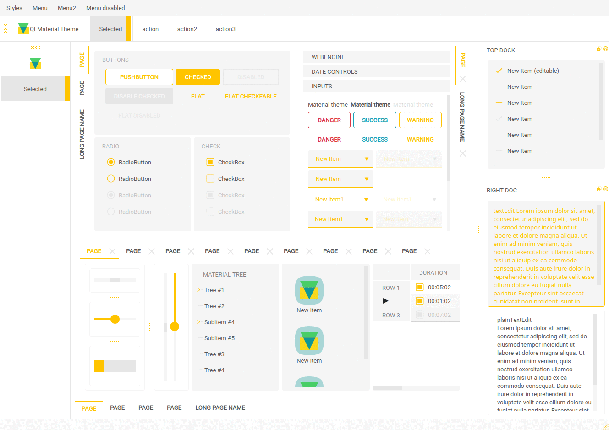

# 10.QSS 主题与编辑器

QSS 全称 Qt Style Sheets(Qt样式表),用于美化 Qt 程序界面,类似于 CSS,但不如 CSS 强大,选择器和属性较少。

本文介绍在 PySide6 中使用QSS,但同样适用于 PyQt6、PyQt5、PySide2 等。

本文主要介绍 QSS 的加载使用以及分享,QSS 本身的语法详解请参考官方文档和其他教程。

## 官方文档

[Customizing Qt Widgets Using Style Sheets](https://doc.qt.io/qt-6/stylesheet-customizing.html)

[Qt Style Sheets Reference](https://doc.qt.io/qt-6/stylesheet-reference.html)

官方参考文档才是最官方全面的文档,有时间最好仔细阅读一下。

主要包括:

- 可应用样式表的控件列表
- 属性列表
- 图标列表
- 属性值列表
- 伪类选择器列表
- 子控件控制列表

内容非常多,在此就不展开了。


## 窗口风格QStyle

PySide6是一个跨平台的类库,相同的窗口和界面在不同的平台上显示的样式不一样,可以根据需要在不同的平台上设置界面不同的外观风格。

QStyle是封装GUI外观的抽象类。PySide6定义了QStyle类的一些子类,应用于不同的操作系统中。

可以用窗口、控件或应用程序的setStyle(QStyle)方法给窗口、控件或整个应用程序设置风格,用style()方法获取风格。

一个平台支持的风格名称可以用QStyleFactory.keys()方法获取,返回平台支持的风格列表,例如['windowsvista',Windows','Fusion'],用QStyleFactory.create(str)方法根据风格名称创建风格,并返回QStyle。

下面的程序是为整个应用程序设置风格的例子。从QComboBox列表中选择不同的界面风格,整个程序的界面风格也随之改变。


```python
import sys
from PySide6.QtWidgets import QApplication, QWidget, QVBoxLayout, QStyleFactory, QPushButton, QComboBox, QSpinBox


class MyWindow(QWidget):
    def __init__(self, parent=None):
        super().__init__(parent)
        self.setupJi()

    def setupJi(self):
        v=QVBoxLayout(self)
        self.comb=QComboBox()
        self.spinBox=QSpinBox()

        self.pushButton=QPushButton("Close")

        v.addWidget(self.comb)
        v.addWidget(self.spinBox)
        v.addWidget(self.pushButton)

        self.comb.addItems(QStyleFactory.keys())  # 将风格名称添加到下拉列表中

        self.pushButton.clicked.connect(self.close)


class MyApplication(QApplication):
    def __init__(self, argv):
        super().__init__(argv)

        window=MyWindow()  # 创建窗口
        style=QStyleFactory.create(window.comb.currentText())  # 创建风格

        self.setStyle(style)  # 设置初始风格
        window.comb.currentTextChanged.connect(self.reSetStyle)  # 信号与槽的连接
        window.show()

        sys.exit(self.exec())

    def reSetStyle(self, new_style):  # 槽函数
        style=QStyleFactory.create(new_style)  # 创建新风格
        self.setStyle(style)  # 设置新风格
        print("当前风格是:", new_style)  # 输出当前的风格


if __name__=='__main__':
    app=MyApplication(sys.argv)

```

## 样式表

为了美化窗口或控件的外观,可以通过窗口或控件的调色板给窗口或控件按照角色和分组设置颜色,还可以对窗口或控件的每个部分进行更细致的控制,这涉及窗口或控件的样式表(Qt style sheets,QSS),它是从 HTML 的层叠样式表(cascading style sheets,CSS)演化而来的。

- 样式表由固定格式的文本构成,用窗口或控件的 setStyleSheet(styleSheet:str)方法设置样式,其中参数 styleSheet 是样式格式符。

  例如一个窗体上有多个继承自QPushButton 的按钮,用窗口的setStyleSheet方法可以将窗体上所有QPushButton类型的按钮定义成字体大小是20个像素、字体名称是宋体、字体颜色是红色,背景色是灰黑色的样式。

  ```python
  self.setStyleSheet("""
  				   QPushButton{
                     font: 20pt'宋体';
                     color:rgb(255,0,0);
                     background-color: rgb(100,100,100)
                     }
  					""")
  ```


- 也可以单独给某个按钮定义样式,例如有个 objectName 名称是btn_open 按钮,则用以下方法设置该按钮的字体大小是30个像素、宇体名称是黑体、字体颜色是白色,背景色是黑色的样式。

  ```python
  btn_open.setStyleSheet("""
  					  font:30pt 黑体;
  					  color: rgb(255,255.255);
  					  background-color: rgb(0,0,0)
  					  """)
  # 三对引号是为了方便观看,实际使用单对引号
  ```


- 可以看出定义样式表的一般规则:

  - 用`样式属性:值`的形式定义样式属性的值
  - 多个样式的`样式属性:值`对之间用分号`;`隔开
  - 如果是对某一类控件进行设置,需要先说明控件的类,然后后面跟一对大括号`{}`,把`样式属性:值`放到`{}`中。

下面详细介绍样式表的格式。

### 选择器

样式表除了类名、对象名和属性名外,一般不区分大小写。

样式表由选择器(selector)和声明(declaration)两部分构成,选择器用于选择某种类型或多个类型的控件,声明是要设置的属性和属性的值,例如以下 QPushButton 和 QLineEdit 就是选择器,用于选择继承自QPushButton 和 QLineEdit 的所有控件和子控件。

```python
"QPushButton,QLineEdit {font: 20pt 宋体;color: rgb(255,0,0);background-color: rgb(100,100,100))"
```

选择器的使用方法如表所示:

| 选择器       | 示 例                     | 说 明                                                        |
| ------------ | ------------------------- | ------------------------------------------------------------ |
| 全局选择器   | *                         | 选择所有的控件                                               |
| 类型选择器   | QWidget                   | 选择QWidget及其子类                                          |
| 属性选择器   | QPushButton[flat="false"] | 只选择属性 flat的值是 False的 QPushButton 控件               |
| 类选择器     | QPushButton               | 选择QPushButton但不选择其子类                                |
| ID选择器     | QPushButton#btn_open      | 选择名称是 btn_open(用setObjectName("btn_ open")方法设置)的所有 QPushButton |
| 后代选择器   | QWidget QPushButton       | 选择QWidget后代中所有的QPushButton                           |
| 子对象选择器 | QWidget>QPushButton       | 选择直接从属于QWidget的QPushButton                           |

### 子控件

一些复合型控件,例如 QComboBox,由 QLineEdit 和向下的箭头构成,向下的箭头可以称为子控件。

对子控件的引用是在控件和子控件之间用两个连续的冒号`::`隔开,例如`"QComboBox::drop-down(image: url(:/image/down.png))"`在资源文件中设置具有向下箭头的图片。

控件的子控件名称如表所示。

| 子控件的名称   | 说 明                                                        |
| -------------- | ------------------------------------------------------------ |
| groove         | QSlider的凹槽                                                |
| handle         | QScrollBar、QSplitter、QSlider 的手柄或滑块                  |
| corner         | QAbstractScrollArea中两个滚动条之间的角落                    |
| add-line       | QScrollBar增加行的按钮,即按下该按钮滚动条增加一行            |
| add-page       | QScrollBar在手柄(滑块)和增加行之间的区域                     |
| sub-line       | QScrollBar 减少行的按钮,即按下该按钮滚动条减少一行           |
| sub-page       | QScrollBar 在手柄(滑块)和减少行之间的区域                    |
| down-arrow     | QComboBox、QHeaderView(排序指示器)、QScrollBar、QSpinBox的向下箭头 |
| down-button    | QScrollBar或QSpinBox的向下按钮                               |
| up-arrow       | QHeaderView(排序指示器)、QScrollBar、QSpinBox的向上箭头      |
| up-button      | QSpinBox的向上按钮                                           |
| left-arrow     | QScrollBar 的左箭头                                          |
| right-arrow    | QMenu或QScrolBar的右箭头                                     |
| branch         | QTreeView的分支指示符                                        |
| section        | QHeardeView的段                                              |
| text           | QAbstractltemView的文本                                      |
| chunk          | QProgressBar的进度块                                         |
| drop-down      | QComboBox的下拉按钮                                          |
| indicator      | QAbstractltemView、QCheckBox、QRadioButton、QMenu(可被选中的)、QGroupBox(可被选中的)的指示器 |
| pane           | QTabWidget的面板(边框)                                       |
| right-corner   | QTabWidget的右角落,可用于控件QTabWidget中右角落控件的位置    |
| left-corner    | QTabWidget的左角落,可用于控件QTabWidget中左角落控件的位置    |
| tab-bar        | QTabWidget的选项卡栏,仅用于控制 QTabBar 在 QTabWidget 中的位置 |
| 1ab            | QTabBar或QToolBox的选项卡                                    |
| tear           | QTabBar的可分离指示器                                        |
| close-button   | QTabBar选项卡或QDockWidget上的关闭按钮                       |
| float-button   | QDockWidget 的浮动按钮                                       |
| title          | QDockWidget 或 QGroupBox的标题                               |
| scroller       | QMenu或QTabBar的滚动条                                       |
| separator      | QMenu或 QMainWindow 中的分隔符                               |
| tearoff        | QMenu的可分离指示器                                          |
| item           | 8AbstrscttemView.QMenuBar.QMenu.QStatusBar 中的个项          |
| icon           | QAbstractItemView 或QMenu的图标                              |
| menu-arrow     | 带有菜单的QToolButton的箭头                                  |
| menu-button    | QToolButton的菜单按钮                                        |
| menu-indicator | QPushButton的菜单指示器                                      |

### 状态选择

一个控件有多种状态,例如活跃(active)激活(enabled)失效(disabled)、鼠标悬停(hover)、选中(checked)、未选中(unchecked)和可编辑(editable)等

根据控件所处的状态可以给控件设置不同的外观。

- 样式表的格式字符串中,控件与状态之间用冒号`:`隔开,例如`QPushButton:active(...)`设置激活时的外观
- 可以同时对多个状态进行设置,例如`QPushButton:active: hoverl...`
- 设置激活或者光标悬停时的外观;可以在状态前加`!`表示相反的状态。

控件的常用状态如表所示。

| 控件的状态        | 说 明                                                        |
| ----------------- | ------------------------------------------------------------ |
| active            | 控件处于激活状态                                             |
| focus             | 该项具有输入焦点                                             |
| default           | 该项是默认值                                                 |
| disabled          | 控件已失效                                                   |
| enabled           | 该控件已启用                                                 |
| hover             | 光标悬停在该控件上                                           |
| pressed           | 使用鼠标按下该控件                                           |
| no-frame          | 该控件没有边框,例如无边框的 QLineEdit等                      |
| flat              | 该控件是平的(flat),例如,一个平的 QPushButton                 |
| checked           | 该控件被选中                                                 |
| unchecked         | 该控件未被选中                                               |
| off               | 适用于处于关闭状态的控件                                     |
| on                | 适用于处于开启状态的控件                                     |
| editable          | QComboBox是可编辑的                                          |
| read-only         | 该控件为只读,例如只读的 QLineEdit                            |
| indeterminate     | 该控件具有不确定状态,例如,三态的QCheckBox                    |
| exclusive         | 该控件是排他项目组的一部分                                   |
| non-exclusive     | 该控件是非排他项目组的一部分                                 |
| bottom            | 该控件位于底部                                               |
| top               | 该控件位于顶部                                               |
| left              | 该控件位于左侧,例如QTabBar的选项卡位于左侧                   |
| right             | 该控件位于右侧,例如QTabBar的选项卡位于右侧                   |
| middle            | 该控件位于中间,例如不在QTabBar 开头或结尾的选项卡            |
| first             | 该控件是第一个,例如 QTabBar 中的第一个选项卡                 |
| last              | 该控件是最后一个,例如 QTabBar中的最后一个选项卡              |
| horizontal        | 该控件具有水平方向                                           |
| vertical          | 该控件具有垂直方向                                           |
| maximized         | 该控件是最大化的,例如最大化的QMdiSubWindow                   |
| minimized         | 该控件是最小化的,例如最小化的QMdiSubWindow                   |
| floatable         | 该控件是可浮动的                                             |
| movable           | 该控件可移动,例如,可移动的QDockWidget                        |
| only-one          | 该控件是唯一的,例如只有一个选项卡的QTabBar                   |
| next-selected     | 下一控件被选择                                               |
| previous-selected | 上一控件被选择                                               |
| selected          | 该控件被选择                                                 |
| window            | 控件是一个窗口,即顶级控件                                    |
| closable          | 该控件可被关闭,例如可关闭的QDockWidget                       |
| closed            | 该控件处于关闭状态,例如QTreeView中的非展开控件               |
| open              | 该控件处于打开状态,例如QTreeView中的展开控件,或带有打开菜单的 QComboBox或 QPushButton控件 |
| has-children      | 该控件具有孩子,例如 QTreeView中具有子控件的控件              |
| has-siblings      | 该控件具有兄弟姐妹(即同级的控件)                             |
| alternate         | 当QAbstractltemView.alternatingRowColors()被设置为true时,为每个交替行设 置此状态,以绘制QAbstractItemView的行 |

### 样式的属性

#### 颜色属性的设置

控件有背景色、前景色及选中状态时的背景色和前景色,可以对这些颜色分别进行设置,这些颜色的属性名称如表所示

例:

```python
"QPushButton(background: gray url(d:/s.png); background-repeat: repeat-x; background-position: left)"
```

设置 QPushButton 类的颜色为灰色,设置背景图片为 d:/s.png,沿着 x 方向从左侧重复显示图片。

| 颜色属性名称               | 类型       | 说 明                                                        |
| -------------------------- | ---------- | ------------------------------------------------------------ |
| background                 | Background | 设置背景的简写方法,相当于指定 background-color、 background-image, background-repeat, background-position |
| background-color           | Brush      | 控件的背景色                                                 |
| background-image           | Url        | 设置控件的背景图像                                           |
| background-repeat          | Repeat     | 如何使用背景图像填充背景区域background-origin,若未 指定此属性,则在两个方向重复背景图像 |
| background-position        | Alignment  | 好通楼a语内的皮 为 topleft                                   |
| background-attachment      | Attachment | 中度合条的法用门心中防m免 于视口滚动还是固定,默认值为cr      |
| background-clip            | Origin     | 格件能制有来的形,所属性指庭kecodn 时强程架起Te的数的矩形。此属桂获认值为通(即边框矩形) |
| background-origin          | Origin     | 整件背景的原点矩形,通常与Dekehmdpom和 bekgroundimage一起使用,默认为piedang(即边程醒 形) |
| color                      | Brush      | 渲染文本的颜色,所有遵守 QWiaget.palete的控件都支 持此属性    |
| selection-background-color | Brush      | 所选文本或项的背景色,默认为调色板的QPalete.Highlight 角色的值 |
| selection-color            | Brush      | 所选文本或项的前景色,默认为调色板的 QPalete.HighlightedText角色的值 |

#### 盒子的模型

大多数控件都是长方形的,一个长方形控件由 Content、Padding、Border、Margin 4部分构成,每个部分都是矩形。

Content 矩形是除掉边距、边框和填充之后的部分,默认情况下,边距、边框和填充的距离都为 0,因此这 4 个矩形是重合的,如图所示。


可以用样式表分别设置这四个矩形之间的距离、边框的颜色。

- Content 是输人内容的区域,可以设置 Content 区域宽度和高度的最大值和最小值,属性名称分别为 maxwidth、maxheight、min-width 和 min-height

  - "QSpinBox(min-height: 30px; max-height: 40px; min-width: 100px; max-width: 150px)"

- 对于 Padding 区域,用padding 属性可以分别设置 Padding 与 Content 在上、右、下和左方向的距离,也可用padding-top、padding-right、padding-bottom 和 paddingleft 属性分别设置距离

  - "QSpinBox(padding: 10px 20px 25px 30px)"等价于"QSpinBox(padding-top: 10px; padding-right: 20px; padding-bottom: 25px;padding-left:30px)"

- Border 区域可以设置的属性比较多,如表所示

  | 属性名称                   | 类 型          | 说明                                                         |
  | -------------------------- | -------------- | ------------------------------------------------------------ |
  | border                     | Border         | 设置边框的简写方法,相当于指定 border-color、 border-style、border-width |
  | border-top                 | Border         | 设置控件顶部边框的简写方法,相当于指定 border- top-color、border-top-style、border-top-width |
  | border-right               | Border         | 设置控件右边框的简写方法,相当于指定border-right- color,border-right-style,border-right-width |
  | border-bottom              | Border         | 设置控件底部边框的简写方法,相当于指定 border-bottom-color、border-bottom-style、border-bottom-width |
  | border-left                | Border         | 设置控件左边框的简写方法,相当于指定 border-leftr- color、border-left-style、border-left-width |
  | border-color gh04          | Box Colors     | 边框边界线的颜色,相当于指定 border toprcolor、 border-bottom-color、border-left-color、border-right-color,默认值为 color(即控件的前景色) |
  | border-top-color           | Brush          | 边框顶部边界线的颜色                                         |
  | border-right-color         | Brush          | 边框右边界线的颜色                                           |
  | border-bottom-color        | Brush          | 边框底部边界线的颜色                                         |
  | border-left-color          | Brush          | 边框左边界线的颜色                                           |
  | border-radius              | Radius         | 边框角落的半径,等效于指定 border-top-left-radius、 border-top-right-radius、 border-bottom-left-radius、 border-bottom-right-radius.默认为0 |
  | border-top-left-radius     | Radius         | 边框左上角的半径                                             |
  | border-top-right-radius    | Radius         | 边框右上角的半径                                             |
  | border-bottom-right-radius | Radius         | 边框右下角的半径                                             |
  | order-bottom-left-radius   | Radius         | 边框左下角的半径                                             |
  | border-style               | Border Style   | 边框边界线的样式(虚线、实线、点划线等),歌认 为 None          |
  | border-top-style           | Border Style   | 边框顶部边界线的样式                                         |
  | border-right-style         | Border Style   | 边框右侧边界线的样式                                         |
  | border-bottom-style        | Border Style   | 边框底部边界线的样式                                         |
  | border-left-style          | Border Style   | 边框左侧边界线的样式                                         |
  | border-width               | Border Lengths | 边框的宽度,等效于指定 border-top-width 、border-bottom-width、borde-left-width、border-right-width |
  | border-top-width           | L ength        | 边框顶部边界线的宽度                                         |
  | border-right-width         | Length         | 边框右侧边界线的宽度                                         |
  | border-bottom-width        | Length         | 边框底部边界线的宽度                                         |
  | border-left-width          | Length         | 边框左侧边界线的宽度                                         |
  | border-image               | Border Image   | 填充边框的图像,该图像皱分割成9个部分,并在必要时适当地拉伸    |

- 对于 Margin 区域可以设置页边距。

  - margin 属性设篮控件的边距,等效于指定margin-top、margin-right、margin-bottom、margin-left,默认为0,margin-top、margin-right、margin-bottom、margin-left 分别设置控件的上、右、下和左侧的边距

#### 与位置有关的属性

对于子控件,可以设置其在父控件中的位置,与此有关的属性名称如表所示

| 属性名称                 | 类型              | 说 明                                                        |
| ------------------------ | ----------------- | ------------------------------------------------------------ |
| subcontrol-origin        | Onigin            | 子控件的矩形原点,默认为 padding                              |
| subcontrol-position      | Alignment         | 子控件在subcontrolorigin 属性指定的矩形内的对齐方式,殿记 值取决于子控件 |
| position                 | Relative Absolute | 使用left、right top、bottom 属性的偏移是相对坐标还是绝对星 标,默认为 relative |
| spacing                  | Length            | 控件的内部间距(比如复选按钮和文本之间的距离),默认值 决于当前风格 |
| top、right、bottom、left | Length            | 以 bottom 属性为例,若 position属性是relative(默认值),则将 子控件向上移动；若 position 是 absolute(绝对的),则 botom 属 性是指与子控件的下边缘的距离,该距离与subcontrol-origin 属 性有关,默认为0 |
| height width             | Length            | 子控件的高度/宽度,默认值取决于当前样式。注意:除非另有 规定,否则在控件上设置此属性无效。若想要控件有一个固定 的高度,应将 min-height 和 max-height的值设置为相同,宽度 类似 |
| max-height               | Length            | 控件或子控件的最大高度                                       |
| max-width                | Length            | 控件或子控件的最大宽度                                       |
| min-height               | Length            | 控件或子控件的最小高度,默认值依赖于控件的内容和风格          |
| min-width                | Length            | 控件或子控件的最小宽度,默认值依赖于控件的内容和风格          |

由于样式表是字符串,因此对于比较复杂的样式表,可以将其保存到文本文件或二进制文件中,需要用时再读人进来。


## 基本语法

类似 CSS,QSS 每一条都是由一个选择器和一组声明构成:

选择器选出要对哪种控件进行样式修改,

每个声明都是键值对,键为属性,值为属性值


## 使用方式

为降低耦合,往往把 QSS 写在一个单独的style.qss文件中,然后在 `main.py` 的 `QApplication` 或 `QMainWindow` 中加载样式

### 编写QSS

新建一个扩展名为`.qss`的文件,如style.qss,编辑内容。(本文后面有完整的样式主题、QSS 编辑器推荐)

把写好的 `.qss` 添加到 `qrc` 中

### 加载QSS

创建一个加载QSS样式表的公共类:

```python
class QSSLoader:
    def __init__(self):
        pass

    @staticmethod
    def read_qss_file(qss_file_name):
        with open(qss_file_name, 'r',  encoding='UTF-8') as file:
            return file.read()
```

在代码中加载qss样式表:

```python
app = QApplication(sys.argv)
window = MainWindow()
 
style_file = './style.qss'
style_sheet = QSSLoader.read_qss_file(style_file)
window.setStyleSheet(style_sheet)

window.show()
sys.exit(app.exec_())
```


## 用第三方包设置样式

第三方包 qt-material提供了一些样式主题,在使用qt-material之前,需要用命令"pipinstall qt-material"安装 gt-material。

- 用gt-material的 list_themes()方法可获得主题名称列表
- 用apply_stylesheet(parent,theme)方法可以应用样式主题。

## QSS 样式分享

### Qt 官方例子

[Qt Style Sheets Examples](https://doc.qt.io/qt-5/stylesheet-examples.html)

Qt官方给出的一些小例子,不一定好看但有很强的学习参考性

### Qt-Material

[UN-GCPDS/qt-material](https://github.com/UN-GCPDS/qt-material)

> This is another stylesheet for **PySide6**, **PySide2** and **PyQt5**, which looks like Material Design(close enough).

"一个仿Material的样式,适用于PySide6, PySide2以及PyQt5"




使用这套样式表也非常简单,作者已经打包发布到了pypi,所以我们只需要

```shell
pip install qt-material
```

安装,并在代码中import即可

```python
# 使用例子
import sys
# from PySide6 import QtWidgets
# from PySide2 import QtWidgets
from PyQt5 import QtWidgets
from qt_material import apply_stylesheet

# create the application and the main window
app = QtWidgets.QApplication(sys.argv)
window = QtWidgets.QMainWindow()

# setup stylesheet
apply_stylesheet(app, theme='dark_teal.xml')

# run
window.show()
app.exec_()
```

更多详细内容请查阅[该项目的README](https://github.com/UN-GCPDS/qt-material/blob/master/README.md)

### qtmodern

[GitHub 首页](https://github.com/gmarull/qtmodern)


该库也已经添加至 PyPI,可以通过 pip 安装使用:

```shell
pip install qtmodern
```

```python
import qtmodern.styles
import qtmodern.windows

...

app = QApplication()
win = YourWindow()

qtmodern.styles.dark(app)
mw = qtmodern.windows.ModernWindow(win)
mw.show()

...

```

### PyDracula

[GitHub 首页](https://github.com/Wanderson-Magalhaes/Modern_GUI_PyDracula_PySide6_or_PyQt6)

[YouTube 演示与教程](https://youtu.be/9DnaHg4M_AM)

注意此项目对应 **PySide6 / PyQt6** ,而不是 PyQt5


一个现代化的 GUI ,对高 DPI 有更好支持:

> Qt Widgets 是一项老技术,对高 DPI 设置没有很好的支持,当您的系统应用DPI 高于 100% 时,这些图像看起来会失真。 通过在 Qt 模块导入正下方的"main.py"中应用以下代码,您可以使用一种变通方法来最小化此问题。

```python
# ADJUST QT FONT DPI FOR HIGHT SCALE
# ////////////////////////////////////
from modules import *
from widgets import *
os.environ["QT_FONT_DPI"]= "96"
```

### PyOneDark

[GitHub 首页](https://github.com/Wanderson-Magalhaes/PyOneDark_Qt_Widgets_Modern_GUI)

[YouTube 展示视频](https://youtu.be/1v5errwE8ew)

和上面的 PyDracula 是同一作者

同样是对应 **PySide6** 的


该作者还有一个[Simple_PySide_Base](https://github.com/Wanderson-Magalhaes/Simple_PySide_Base) 的仓库,对 PySide2 或 PyQt5 初学者如何创建一个美观的 GUI 程序是不错的参考

### PyQtDarkTheme

[GitHub 首页](https://github.com/5yutan5/PyQtDarkTheme)

- 扁平风格的深色/浅色主题
- 支持 PySide 与 PyQt
- 支持 PyInstaller
- 解决了 Qt 版本间的风格差异
- 深色和浅色主题的 QPalette


此主题的详细使用方法请参考[文档](https://github.com/5yutan5/PyQtDarkTheme#usage)

### 飞扬青云-QSS

在飞扬青云的[QWidgetDemo](https://github.com/feiyangqingyun/QWidgetDemo) 项目中的[styledemo](https://github.com/feiyangqingyun/QWidgetDemo/tree/master/styledemo) 子项目包含了3套很好看的QSS样式


[QSS目录链接](https://github.com/feiyangqingyun/QWidgetDemo/tree/master/styledemo/other)

### QDarkStyleSheet

> The most complete dark/light style sheet for Qt applications

"最完整的深色/浅色Qt主题"

-[文档](https://qdarkstylesheet.readthedocs.io/)

-[GitHub](https://github.com/ColinDuquesnoy/QDarkStyleSheet)


也可以通过pip直接安装使用

```shell
pip install qdarkstyle
```

```python
# PyQt5 使用例子
import sys
import qdarkstyle
from PyQt5 import QtWidgets

# create the application and the main window
app = QtWidgets.QApplication(sys.argv)
window = QtWidgets.QMainWindow()

# setup stylesheet
app.setStyleSheet(qdarkstyle.load_stylesheet_pyqt5())
# or in new API
app.setStyleSheet(qdarkstyle.load_stylesheet(qt_api='pyqt5'))

# run
window.show()
app.exec_()
```

### GTRONICK-QSS

[GTRONICK/QSS: QT Style Sheets templates](https://github.com/GTRONICK/QSS)

一组QSS样式


## PyQt 图标库`QtAwesome`


[GitHub 主页](https://github.com/spyder-ide/qtawesome)

> QtAwesome enables iconic fonts such as Font Awesome and Elusive Icons in PyQt and PySide applications.
>
> It started as a Python port of the[QtAwesome](https://github.com/Gamecreature/qtawesome) C++ library by Rick Blommers.

可以通过 `conda` 或者 `pip` 安装

```shell
conda install qtawesome
```

```shell
pip install qtawesome
```


QtAwesome 还附带一个图标浏览器,可以显示所有可用的图标。你可以使用它来搜索适合需求的图标,然后复制应该用于创建该图标的名称到代码中以应用图标


## QSS 编辑器

如果对上面推荐的这几个主题还不满意,你可以设计自己的QSS,下面推荐一些专用编辑器

### QssStylesheetEditor

[GitHub首页](https://github.com/hustlei/QssStylesheetEditor)

[中文README](https://github.com/hustlei/QssStylesheetEditor/blob/master/readme_zh-CN.md)

> QssStylesheetEditor 是一个功能强大的 Qt 样式表(QSS)编辑器,支持实时预览,自动提示,自定义变量, 支持预览自定义ui代码,引用QPalette等功能。


这个软件有如下特点:

- Qss代码高亮,代码折叠
- Qss代码自动提示,自动补全
- 实时预览 Qss 样式效果,可以预览几乎所有的 qtwidget 控件效果
- 支持预览自定义界面代码
- 支持在 Qss 中自定义变量
- 自定义变量可以在颜色对话框中拾取变量的颜色
- 支持通过颜色对话框改变QPalette,并在Qss中引用
- 支持相对路径引用图片,以及引用资源文件中的图片
- 支持切换不同的系统 theme,如 xp 主题,vista 主题等(不同 theme 下 qss 效果会略有差异)
- 能够在 windows,linux,unix 上运行
- 支持多国语言(目前已有中文,英文,俄文翻译)

还有许多强大而实用的功能,可以在[README](https://github.com/hustlei/QssStylesheetEditor/blob/master/readme_zh-CN.md)中查看

### QSS Editor

> 🎨 Cross-platform application to edit and preview Qt style sheets(QSS).

跨平台的QSS编辑/预览应用

[GitHub主页](https://github.com/HappySeaFox/qsseditor)

[GitHub realeases](https://github.com/HappySeaFox/qsseditor/releases)

[下载地址2](https://sourceforge.net/projects/qsseditor/)


### Pycharm、VScode 插件

在Pycharm中可以安装[Qt Style Sheet Highlighter](https://plugins.jetbrains.com/plugin/13963-qt-style-sheet-highlighter) 插件,提供对QSS的代码高亮功能


在VScode里可以安装[Qt for Python](https://marketplace.visualstudio.com/items?itemName=seanwu.vscode-qt-for-python) 插件,该插件不仅支持qss文件的代码高亮,还支持qml、qrc、pro等代码的高亮


 

