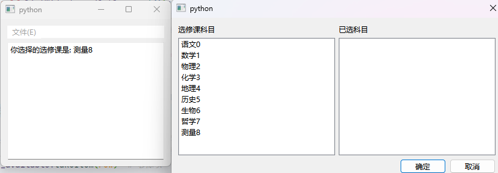
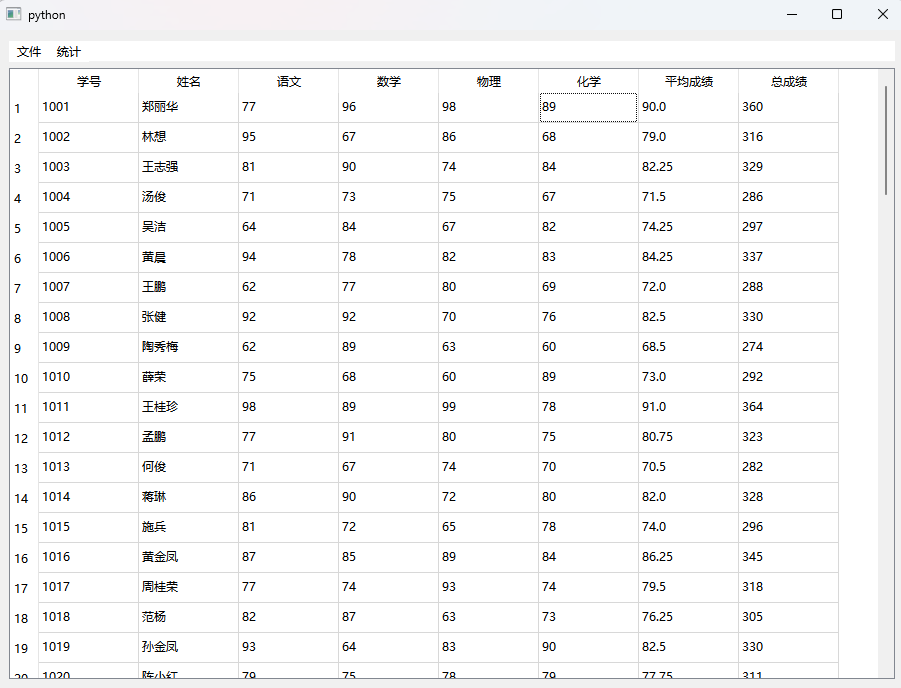
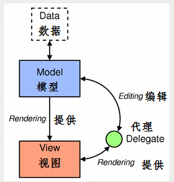

# 11.基于项和模型的控件

人们在工作中经常会处理大量数据,数据类型多种多样,数据的表现形式也很多,如列表结构树结构(层级关系)和二维表格结构数据。

PySide6 有专门的显示数据的控件和存储数据的模型可以显示和存储不同形式的数据,本章详细介绍显示数据的控件和存储数据的模型。

显示数据的控件分为两类,一类是基于项(item).的控件,另一类是基于模型model)的控件

- 基于项的控件是基于模型的控件的简便类。基于项的控件把读取到的数据存储到项中
- 基于模型的控件把数据存储到模型中,或通过模型提供读取数据的接口,然后通过控件把数据模型中的数据或关联的数据显示出来。

### 基于项的控件

基于项的控件有

- 列表控件 QListWidget
- 表格控件 QTaleWidget
- 树结构控件 QTreeWidget

它们是从基于模型的控件继承而来的,基于模型的控件有 QListViewQTableView和QTreeView,这些控件之间的继承关系如图所示


#### 列表控件QListWidget及其项QListWidgetltem

列表控件QListWidget 由一列多行构成,每行称为一个项(item),每个项是一个QListWidgetItem对象。

可以继承 QListWidgetItem 创建用户自定义的项;也可以先创建QWidget实例,在其上添加一些控件,然后把QWidget 放到 QListWidgetItem 的位置形成复杂的列表控件。

列表控件QListWidget是从QListView 类继承而来的用QListWidget 类创建列表控件的方法如下所示,其中parent是QListWidget列表控件所在的父窗口或控件。

用QListWidgetItem创建列表项的方法如下所示其中type可取QListWidgetItemType(值为0)或QListWidgetItem.UserType(值为1000),前者是默认值,后者是用户自定义类型的最小值。可以用QListWidgetItem类创建子类定义新的类型。

```python
from PySide6.QtWidgets import QListWidget, QListWidgetItem

QListWidget(parent: Union[PySide6.QtWidgets.QWidget, NoneType]= None) -> None

QListWidgetItem(icon: Union[PySide6.QtGui.QIcon, PySide6.QtGui.QPixmap], text: str, listview: Union[PySide6.QtWidgets.QListWidget, NoneType]= None, type: int = < ItemType.Type: 0 >) -> None
QListWidgetItem(listview: Union[PySide6.QtWidgets.QListWidget, NoneType]= None, type: int = < ItemType.Type: 0 >) -> None
QListWidgetItem(other: PySide6.QtWidgets.QListWidgetItem) -> None
QListWidgetItem(text: str, listview: Union[PySide6.QtWidgets.QListWidget, NoneType]= None, type: int = < ItemType.Type: 0 >) -> None
```

##### 列表控件QListWidget 的常用方法

列表控件QListWidget的常用方法如表所示主要方法介绍如下

- 插入、新增、统计项

  - 用addItem(item: QListWidgetItem)方法可以在列表控件的末尾添加已经存在的项;

  - 用addItem(label: str)方法可以用文本创建一个新项,并添加到列表控件的末尾;

  - 用addItems(labels;Sequence[str])方法可以用文本列表添加多个项;

  - 用insertItem(row: int,item: QListWidgetItem)方法insertItem(row: int,label: str)方法和insertItems(row: int, labels:Sequence[str])方法可以在指定的行插人项;

  - 用count()方法可以获得项的数量,包括隐藏的项。

- 设置项、获取项

  - 用setCurrentItem(QListWidgetItem)方法可以把指定的项设置成当前的项,
  - 用setCurrentRow(int)方法将指定行的项设置成当前项;

  - 用currentItem()方法获取当前的项;

  - 用currentRow()方法获取当前项所在的行;

  - 用rowQListWidgetItem)方法获取项所在的行号。

- 获取项信息
  - 用item(row:int)方法可以获取指定行上的项(行的编号从0开始);
  - 用itemAt(QPoint)方法或itemAt(x:int,y:int)方法可以获取指定位置的项
  - 用visualItemRect(QListWidgetItem)方法可以获取项所占据的区域 QRect。
- 移除项
  - 用takeItem(row:int)方法从列表中移除指定行上的项,并返回该项;
  - 用clear()方法清空所有的项.
- 项排序
  - 用setSortingEnabled(bool)方法设置是否可以进行排序;
  - 用sortItems(order=Qt.AscendingOrder)方法设置排序方法,其中 order 可取 Qt.AscendingOrder(升序)或Qt.DescendingOrder(降序)。

- 项放置到控件
  - 用setItemWidget(QListWidgetItem,QWidget)方法可以把一个控件放到项的位置,例如在一个 QWidget 上放置控件布局,然后把QWidget 对象放到项的位置形成复杂的项;
  - 用removeItemWidget(QListWidgetItem)方法可以移除项上的控件用itemWidget(QListWidgetItem)方法可以获取项的控件。
- 查找项
  - 用findItems(text;str,flags;Qt.MatchFlags)方法可以查找满足匹配规则的项List[QListWidgetItem],其中参数flags 可取:
    - Qt.MatchExactly
    - Qt.MatchFixedString
    - Qt.MatchContains
    - Qt.MatchStartsWith
    - Qt.MatchEndsWith
    - Qt.MatchCaseSensitive
    - Qt.MatchRegularExpression
    - Qt.MatchWildcard
    - Qt.MatchWrap
    - Qt.MatchRecursive

- 用setModel(model: QAbstractItemModel) 方法和 setSelectionModel(QItemSelectionModel)方法可分别设置数据模型和选择模型关于数据模型和选择模型见后续内容。
- 用supportedDropActions()方法获取支持的拖放动作QtDropAction,其中Qt.DropAction 可以取:
  - Qt.CopyAction(复制)
  - Qt.MoveAction(移动)
  - Qt.LinkAction(链接)
  - Qt.IgnoreAction(什么都不做)
  - Qt.TargetMoveAction(目标对象接管)

| QListWidget的方法及参数类型                  | 说明                                      |
| -------------------------------------------- | ----------------------------------------- |
| addItem(item: QListWidgetItem)               | 在列表控件中添加项                        |
| addItem(label: str)                          | 用文本创建项并添加项                      |
| addItems(labels: Sequence[str])              | 用文本列表添加多个项                      |
| insertItem(row: int,item: QListWidgetItem)   | 在列表中插人项                            |
| insertItem(row:int,label: str)               | 用文本创建项并插人项                      |
| insertItems(row: int, labels: Sequence[str]) | 用文本列表创建项并插入多个项              |
| setCurrentItem(QListWidgetItem)              | 设置当前项                                |
| currentItem()                                | 获取当前项QListWidgetItem                 |
| count()                                      | 获取列表控件中项的数量                    |
| takeItem(row:int)                            | 移除指定索引值的项,并返回该项             |
| [slot]clear()                                | 清空所有项                                |
| openPersistentEditor(QListWidgetItem)        | 打开指定项的编辑框,用于编辑文本           |
| isPersistentEditorOpen(QListWidgetltem)      | 获取编辑框是否已打开                      |
| closePersistentEditor(QListWidgetltem)       | 关闭编辑框                                |
| currentRow()                                 | 获取当前行的索引号                        |
| item(row:int)                                | 获取指定行的项                            |
| itemAt(QPoint)                               | 获取指定位置处的项                        |
| itemAt(x;int,y:int)                          | 获取指定位置处的项                        |
| itemFromIndex(QModelIndex)                   | 获取指定模型索引QModelIndex的项           |
| indexFromItem(QListWidgetItem)               | 获取指定项的模型索引QModelIndex           |
| setItemWidget(QListWidgetItem,QWidget)       | 把某控件显示在指定项的位置处              |
| removeItemWidget(QListWidgetItem)            | 移除指定项上的控件                        |
| itemWidget(QListWidgetItem)                  | 获取指定项的位置处的控件                  |
| findItems(text: str,flags: Qt.MatchFlags)    | 查找满足匹配规则的项List[QListWidgetItem] |
| [slot]scrollToItem(QListWidgetItem)          | 滚动到指定的项,使其可见                   |
| selectedItems()                              | 获取选中项的列表 List[QListWidgetItem]    |
| setCurrentRow(int)                           | 指定行的项为当前项                        |
| row(QListWidgetItem)                         | 获取指定项所在的行号                      |
| visualItemRect(item: QListWidgetItem)        | 获取项所占据的区域QRect                   |
| setSortingEnabled(bool)                      | 设置是否可以进行排序                      |
| isSortingEnabled()                           | 获取是否可以排序                          |
| sortItems(order=Qt.AscendingOrder)           | 按照排序方式进行项的排序                  |
| supportedDropActions()                       | 获取支持的拖放动作 Qt.DropAction          |
| setModel(model:QAbstractItemModel)           | 设置数据模型                              |
| setSelectionModel(QItemSelectionModel)       | 设置选择模型                              |
| clearSelection()                             | 清除选择                                  |
| setAlternatingRowColors(enable:bool)         | 设置交替色                                |
| mimeData(items:Sequence[QListWidgetItem])    | 获取多个项的 mime数据 QMimeData           |
| mimeTypes()                                  | 获取mime数据的类型List[str]               |

##### 列表项QListWidgetItem的常用方法

列表项QListWidgetItem的常用方法如表所示,主要方法介绍如下

- 用setText(str)方法和 setIcon(QIcon)方法可以分别设置项的文字和图标;用text()方法和 icon()方法可以分别获取项的文字和图标。

- 用setForeground(QColor)方法和 setBackground(QColor)方法可以设置前景色和背景色,其中参数 QColor 可以取:

  - QBrush
  - Qt.BrushStyle
  - Qt.GlobalColor
  - QGradientQImage
  - QPixmap

- 用setSelected(bool)方法可以设置项是否处于选中状态,用isSelected()方法可以获取项是否处于选中状态。

- 用setCheckState(Qt.CheckState)方法设置项是否处于勾选状态,其中参数 QCheckState 可以取以下值,用checkState()方法获取项的选状态。:

  - Qt.Unchecked(未勾选)
  - Qt.PartiallyChecked(部分勾选如果有子项)
  - QtChecked(勾选);

- 用setFlags(Qt.ItemFlags)方法设置项的标识其中参数 QtItemFlags可取的值如表所示。

  例如setFlags(Qt.ItemIsEnabled Qt.ItemIsEditable)将使项处于可编辑状态,双击该项可以编辑项的文字。

  | Qt.ItemFlags 的取值  | 说明       | Qt.ItemFlags的取值      | 说明                    |
  | -------------------- | ---------- | ----------------------- | ----------------------- |
  | Qt.NoItemFlags       | 没有标识符 | Qt.ItemIsUserCheckable  | 项可以勾选              |
  | Qt.ItemIsSelectable  | 项可选     | Qt.ItemIsEnabled        | 项被激活                |
  | Qt.ItemIsEditable    | 项可编辑   | Qt.ItemIsAutoTristate   | 如有子项,则有第3种状态  |
  | Qt.ItemIsDragEnabled | 项可以拖拽 | Qt.ItemNeverHasChildren | 项没有子项              |
  | Qt.ItemIsDropEnabled | 项可以拖放 | Qt.ItemlsUserTristate   | 可在3种状态之间循环切换 |


- 用setData(role:int,value:Any)方法可以设置项的某种角色的值,用data(role:int)方法可以获取某种角色的值
- 用write(QDataStream)方法可以把项对象写人到数据流 QDataStream 中,用read(QDataStream)方法从数据流中读取项,数据流可以直接保存到文件中。有关数据流的内容见流数据章节

| QListWidgetItem的方法           | 说明                                        |
| ------------------------------- | ------------------------------------------- |
| setText(str)                    | 设置文字                                    |
| text()                          | 获取文字                                    |
| setIcon(QIcon)                  | 设置图标                                    |
| set TextAlignment(Qt.Alignment) | 设置文字的对齐 方式                         |
| setForeground(QColor)           | 设置前景色                                  |
| setBackground(QColor)           | 设置背景色                                  |
| setCheckState(Qt.CheckState)    | 设置勾选状态                                |
| checkState()                    | 获取勾选状态                                |
| setFlags(Qt.ItemFlags)          | 设置标识                                    |
| setFont(QFont)                  | 设置字体                                    |
| setHidden(bool)                 | 设置是否隐藏                                |
| isHidden()                      | 获取是否隐藏                                |
| setSelected(bool)               | 设置是否被选中                              |
| isSelected()                    | 获取是否被选中                              |
| icon()                          | 获取图标                                    |
| setStatusTip(str)               | 设置状态提示信息, 需激活 mouseTracking 属性 |
| setToolTip(str)                 | 设置提示信息                                |
| setWhatsThis(str)               | 设置按 Shift+F1 键的提示信息                |
| write(QDataStream)              | 将项写人数据流                              |
| read(QDataStream)               | 从数据流中读取项                            |
| setData(role: int,value: Any)   | 设置某角色的数据                            |
| data(role:int)                  | 获取某角色的数据                            |
| clone()                         | 克隆出新的项                                |
| listWidget()                    | 获取所在的列表 控件                         |

##### 列表控件QListWidget 的信号

列表控件QListWidget 的信号如表所示

| QListWidget的信号及参数类型                  | 说明                                  |
| -------------------------------------------- | ------------------------------------- |
| currentItemChanged(currentItem,previousltem) | 当前项发生改变时发送信号              |
| currentRowChanged(currentRow)                | 当前行发生改变时发送信号              |
| currentTextChanged(currentText)              | 当前项的文本发生改变时发送信号        |
| itemActivated(QListWidgetItem)               | 单击或双击项,使其变成活跃项时发送信号 |
| itemChanged(QListWidgetltem)                 | 项的数据发生改变时发送信号            |
| itemClicked(QListWidgetItem)                 | 单击某个项时发送信号                  |
| itemDoubleClicked(QListWidgetItem)           | 双击某个项时发送信号                  |
| item Entered(QListWidgetItem)                | 光标进人某个项时发送信号              |
| itemPressed(QListWidgetltem)                 | 当鼠标在某个项上按下按键时发送信号    |
| itemSelectionChanged()                       | 项的选择状态发生改变时发送信号        |

##### 列表控件QListWidget的应用实例

下面的程序建立一个自定义对话框,通过菜单显示对话框。

对话框中放置两个列表控件第1个列表控件中放置可选科目,对每个项根据其所在的行把行号定义成项的角色值单击其中的项,将会移到第2个列表控件中,且按照角色值顺序插入,

同样,单击第2个列表控件中的项,也是按照角色值顺序插入到第1个列表控件中,单击对话框中的"确定"按钮,会把第2个列表控件中的内容输出到主界面上。



```python
# -*- coding: UTF-8 -*-
# File date: Hi_2023/3/4 15:43
# File_name: 01-列表控件QListWidget的应用实例.py

import sys
from PySide6.QtWidgets import(QApplication, QDialog, QWidget, QPushButton, QMenuBar, QLabel, QGridLayout, QListWidget, QTextBrowser, QVBoxLayout, QHBoxLayout, QFileDialog)
from PySide6.QtCore import Qt


class MyDialog(QDialog):
    def __init__(self, parent=None):
        super().__init__(parent)

        self.setupui()

    def setupui(self):
        label1 = QLabel("选修课科目")
        label2 = QLabel("已选科目")

        self.listWidget_available = QListWidget()  # 列表控件
        self.listWidget_selected = QListWidget()  # 列表控件

        btn_ok = QPushButton("确定")
        btn_cancel = QPushButton("取消")

        h = QHBoxLayout()
        h.addStretch(1)
        h.addWidget(btn_ok)
        h.addWidget(btn_cancel)

        grid = QGridLayout(self)  # 标签、列表框采用格棚布局
        grid.addWidget(label1, 0, 0)
        grid.addWidget(label2, 0, 1)
        grid.addWidget(self.listWidget_available, 1, 0)
        grid.addWidget(self.listWidget_selected, 1, 1)
        grid.addLayout(h, 2, 0, 1, 2)

        class_available =["语文0", "数学1", "物理2", "化学3", "地理4", "历史5", "生物6", "哲学7", "测量8"]
        self.listWidget_available.addItems(class_available)  # 添加项

        for i in range(self.listWidget_available.count()):  # 用角色数据记录项的初始位置
            item = self.listWidget_available.item(i)  # 获取项
            item.setData(Qt.UserRole, i)  # 设置项的角色值,值为行号

        self.listWidget_available.itemClicked.connect(self.listWidget_available_clicked)
        self.listWidget_selected.itemClicked.connect(self.listWidget_selected_clicked)
        btn_ok.clicked.connect(self.btn_ok_clicked)
        btn_cancel.clicked.connect(self.btn_cancel_clicked)
        # "确定"按钮的单击#"取消"按钮的单击

    def listWidget_available_clicked(self, item):  # 列表控件的单击槽函数
        row = self.listWidget_available.row(item)  # 获取项的行号
        self.listWidget_available.takeItem(row)  # 移除项
        i = item.data(Qt.UserRole)  # 移除项的角色值
        for j in range(self.listWidget_selected.count()):
            if i < self.listWidget_selected.item(j).data(Qt.UserRole):
                self.listWidget_selected.insertItem(j, item)  # 根据角色值插人到列表中

        self.listWidget_selected.addItem(item)

    def listWidget_selected_clicked(self, item):  # 列表控件的单击槽函数
        row = self.listWidget_selected.row(item)
        self.listWidget_selected.takeItem(row)
        i = item.data(Qt.UserRole)

        for j in range(self.listWidget_selected.count()):
            if i < self.listWidget_available.item(j).data(Qt.UserRole):
                self.listWidget_available.insertItem(j, item)  # 根据角色值插人到列表中

        self.listWidget_available.addItem(item)

    def btn_ok_clicked(self):  # "确定"按钮的槽函数
        self.setResult(QDialog.Accepted)

        self.setVisible(False)

    def btn_cancel_clicked(self):  # "取消"按钮的槽函数
        self.setResult(QDialog.Rejected)
        self.setVisible(False)


class MyWindow(QWidget):
    def __init__(self, parent=None):
        super().__init__(parent)

        self.widget_setupUi()

    def widget_setupUi(self):  # 建立主程序界面
        menuBar = QMenuBar(self)  # 定义菜单栏

        file_menu = menuBar.addMenu("文件(E)")  # 定义菜单
        # 添加动作
        action_selection = file_menu.addAction("选修课(&C)")
        action_save = file_menu.addAction("保存(&S")
        file_menu.addSeparator()
        action_exit = file_menu.addAction("退出(&E)")

        self.textBrowser = QTextBrowser(self)  # 显示数据控件#主程序界面的布局
        v = QVBoxLayout(self)
        v.addWidget(menuBar)
        v.addWidget(self.textBrowser)
        action_selection.triggered.connect(self.action_selection_triggered)
        action_save.triggered.connect(self.action_save_triggered)  # 信号与槽的连接
        action_exit.triggered.connect(self.close)  # 退出动作的信号与窗口关闭的连接

    def action_selection_triggered(self):  # 自定义槽函数
        dialog = MyDialog(self)  # 自定义对话框实例
        if dialog.exec():  # 模式显示对话框
            n = dialog.listWidget_selected.count()
            text = "你选择的选修课是:"
            if n > 0:
                for i in range(n):
                    text = text + " " + dialog.listWidget_selected.item(i).text()
                self.textBrowser.append(text)

            else:
                self.textBrowser.append("你没有选择任何选修课!")

    def action_save_triggered(self):  # 自定义槽函数
        string = self.textBrowser.toPlainText()
        if len(string) > 0:
            filename, filter = QFileDialog.getSaveFileName(self, "保存文件", ".", "文本文件(*.txt)")
            if len(filename) > 0:
                fp = open(filename, "a+", encoding="UTE -8")
                fp.writelines(string)
                fp.close()


if __name__ == '__main__':
    app = QApplication(sys.argv)
    win = MyWindow()

    win.show()
    sys.exit(app.exec())

```

#### 表格控件QTableWidget及其项QTableWidgetltem 

表格控件QTableWidget 是从QTableView 类继承而来的,由多行多列构成,并且含有行表头和列表头

表格控件的每个单元格称为一个项(item),每个项是一个QTableWidgetItem 对象,可以设置每个项的文本图标颜色前景色和背景色等属性用QTableWidget 


类创建表格控件的方法如下所示,其中parent 是表格控件QTableWidget所在的父窗口或控件,rows 和 columns 分别指定表格对象的行和列的数量。

```python
from PySide6.QtWidgets import QTableWidget

QTableWidget(parent: Union[PySide6.QtWidgets.QWidget, NoneType]= None) -> None
QTableWidget(rows: int, columns: int, parent: Union[PySide6.QtWidgets.QWidget, NoneType]= None) -> None
```

用QIableWidgetItem 创建表格项的方法如下所示其中type可取QTableWidgetItemType值为0)或QTableWidgetItem,UserType(值为1000),前者是默认值,后者是用户自定义

```python
from PySide6.QtWidgets import QTableWidgetItem

QTableWidgetItem(icon: Union[PySide6.QtGui.QIcon, PySide6.QtGui.QPixmap], text: str, type: int = < ItemType.Type: 0 >) -> None
QTableWidgetItem(other: PySide6.QtWidgets.QTableWidgetItem) -> None
QTableWidgetItem(text: str, type: int = < ItemType.Type: 0 >) -> None
QTableWidgetItem(type: int = < ItemType.Type: 0 >) -> None
```

##### 表格控件QTableWidget 的常用方法

表格控件 QTableWidget 的常用方法如表所示,主要方法介绍如下

- 用setRowCount(rows;int)方法和setColumnCount(columns;int)方法分别设置表格控件的行数和列数,行数和列数不含表头;
  - 用rowCount()方法和columnCount()方法可以获取表格控件的行数和列数。
- 用insertRow(row:int)方法和insertColumn(column;int)方法可以插入行和插人列;
  - 用removeRow(row;int)方法和 removeColumn(column:int)方法可以分别删除指定的行和列;
  - 用clear()方法可以清空包含表头在内的所有内容;
  - 用clearContents()方法可以清空不含表头的内容。
- 用setItem(row:int;column:int,QTableWidgetItem)方法可以在指定的行和列处设置表格项;
- 用takeItem(row;int,column:int)方法可以从表格控件中移除表格项,并返回此表格项。
- 用setCurrentCell(row:int,column:int)方法可以将指定的行列单元设为当前单元格,
- 用setCurrentItem(QTableWidgetItem)方法将指定的表格项设置成当前项,
- 项信息获取
  - 用currentItem()方法获取当前的表格项。
  - 用item(row:int,column;int)方法获取指定行和列处的表格项;
  - 用itemAt(QPoint)或itemAt(x:int,y;int)方法获取指定位置处的表格项,如果没有,则返回 None。
  - 用row(QTableWidgetItem)方法和 column(QTableWidgetItem)方法获取表格项所在的行号和列号。
- 用setSortingEnabled(bool)方法设置表格控件是否可排序,
  - 用sortItems(column:int,order= Qt.AscendingOrder)方法对指定的列进行升序或降序排列。
- 用setHorizontalHeaderItem(column; int,QTableWidgetItem)和 setVerticalHeaderItem(row;int,QTableWidgetItem)方法设置水平和竖直表头;
  - 用setHorizontalHeaderLabels(labels; Sequence[str])和 setVerticalHeaderLabels(labels;Sequence[str])方法用宇符串序列定义水平和竖直表头;
  - 用horizontalHeaderItem(column:int)和verticalHeaderItem(row:int)方法取水平和垂直表头的表格项;
  - 用takeHorizontalHeaderItern(column; int)和 takeVerticalHeaderItem(row; int)方法可以移除表头,并返回被移除的表格项

| QTableWidget 的方法及参数类型                        | 说 明                             |
| ---------------------------------------------------- | --------------------------------- |
| setRowCount(rows; int)                               | 设置行数                          |
| setColumnCount(columns:int)                          | 设置列数                          |
| [slot]insertRow(row:int)                             | 在指定位置插入行                  |
| [slot]insertColumn(column:int)                       | 在指定位置插人列                  |
| rowCount()                                           | 获取行数                          |
| columnCount()                                        | 获取列数                          |
| [slot]removeRow(row:int)                             | 移除指定的行                      |
| [slot]removeColumn(column:int)                       | 移除指定的列                      |
| setItem(row:int,column:int,QTableWidgetItem)         | 在指定行和列处设置表格项          |
| takeItem(row:int,column: int)                        | 移除并返回表格项                  |
| setCurrentCell(row:int,column:int)                   | 设置当前的单元格                  |
| setCurrentItem(QTableWidgetltem)                     | 设置当前的表格项                  |
| currentItem()                                        | 获取当前的表格项                  |
| row(QTableWidgetItem)                                | 获取表格项所在的行                |
| column(QTableWidgetItem)                             | 获取表格项所在的列                |
| currentRow()                                         | 获取当前行                        |
| currentColumn()                                      | 获取当前列                        |
| setHorizontalHeaderItem(column:int,QTableWidgetItem) | 设置水平表头                      |
| setHorizontalHeaderLabels(labels:Sequence[str]).     | 用字符串序列设置水平表头          |
| horizontalHeaderItem(column:int)                     | 获取水平表头的表格项              |
| takeHorizontalHeaderItem(column: int)                | 移除水平表头的表格项,并返回表格项 |
| setVerticalHeaderItem(row:int,QTableWidgetItem)      | 设置竖直表头                      |
| setVerticalHeaderLabels(labels:Sequence[str])        | 用字符串序列设置竖直表头          |
| verticalHeaderItem(row:int)                          | 获取竖直表头的表格项              |
| takeVerticalHeaderItem(row: int)                     | 移除竖直表头的表格项,并返回表格项 |
| [slot]clear()                                        | 清空表格项和表头的内容            |
| [slot]clearContents()                                | 清空表格项的内容                  |
| editItem(QTableWidgetItem)                           | 开始编辑表格项                    |
| findItems(text: str,flags: Qt.MatchFlags)            | 获取满足条件的表格项列表          |
| item(row:int,column:int)                             | 获取指定行和列处的表格项          |
| itemAt(QPoint)                                       | 获取指定位置的表格项              |
| itemAt(x:int,y:int)                                  | 获取指定位置的表格项              |
| openPersistentEditor(QTableWidgetItem)               | 打开编辑框                        |
| isPersistentEditorOpen(QTableWidgetItem)             | 获取编辑框是否已经打开            |
| closePersistentEditor(QTableWidgetItem)              | 关闭编辑框                        |
| [slot]scrollToItem(QTableWidgetItem)                 | 滚动表格使表格项可见              |
| selectedItems()                                      | 获取选中的表格项列表              |
| setCellWidget(row:int,column:int,QWidget)            | 设置单元格的控件                  |
| cellWidget(row:int,column; int)                      | 获取单元格的控件QWidget           |
| removeCellWidget(row:int,column:int)                 | 移除单元格上的控件                |
| setSortingEnabled(bool)                              | 设置是否可以排序                  |
| isSortingEnabled()                                   | 获取是否可以排序                  |
| sortItems(column: int,order=Qt.AscendingOrder)       | 按列排序                          |
| supportedDropActions()                               | 获取支持的拖放动作 Qt.DropAction  |

##### 表格项QTableWidgetltem的常用方法

表格项QTableWidgetItem 的常用方法如表所示,其方法与列表项的方法基本

| QTableWidgetItem 的方法及参数类型 | 说明                                                  |
| --------------------------------- | ----------------------------------------------------- |
| setText(str)                      | 设置文本                                              |
| text()                            | 获取文本                                              |
| setIcon(QIcon)                    | 设置图标                                              |
| setTextAlignment(Qt.Alignment)    | 设置文字的对齐方式                                    |
| setForeground(QColor)             | 设置前景色                                            |
| setBackground(QColor)             | 设置背景色                                            |
| setCheckState(Qt.CheckState)      | 设置勾选状态                                          |
| checkState()                      | 获取勾选状态                                          |
| setFlags(Qt.ItemFlag)             | 设置标识                                              |
| setFont(QFont)                    | 设置字体                                              |
| Tow()                             | 获取所在的行                                          |
| column                            | 获取所在的列.                                         |
| setSelected(bool)                 | 设置是否被选中                                        |
| isSelected()                      | 获取是否被选中                                        |
| icon()                            | 获取图标                                              |
| setStatusTip(str)                 | 设置状态提示信息,需 激活列表控件的 mouseTracking 属性 |
| setToolTip(str)                   | 设置提示信息                                          |
| setWhatsThis(str)                 | 设置按Shift十Fl键的 提示信息                          |
| write(QDataStream)                | 将项写人数据流                                        |
| read(QDataStream)                 | 从数据流中读取项                                      |
| setData(role: int,Any)            | 设置某种角色的数据                                    |
| data(role:int)                    | 获取某种角色的数据                                    |
| clone()                           | 复制出新的项                                          |
| tableWidget()                     | 获取所在的表格控件                                    |

##### 表格控件QTableWidget的信号

表格控件QTableWidget的信号如表所示

| QTableWidget的信号及参数类型                                 | 说明                             |
| ------------------------------------------------------------ | -------------------------------- |
| cellActivated(row:int,column:int)                            | 单元格活跃时发送信号             |
| cellChanged(row:int, column:int)                             | 单元格的数据变化时发送信号       |
| cellClicked(row:int,column:int)                              | 单击单元格时发送信号             |
| cellDoubleClicked(row: int,column:int)                       | 双击单元格时发送信号             |
| cellEntered(row:int,column: int)                             | 光标进人单元格时发送信号         |
| cellPressed(row: int,column: int)                            | 光标在单元格上按下按键时发送信号 |
| currentCellChanged(currentRow: int,currentColumn:int, previousRow: int, previousColumn: int) | 当前单元格发生改变时发送信号     |
| currentItemChanged(currentItem,previousltem)                 | 当前表格项发生改变时发送信号     |
| itemActivated(QTableWidgetltem)                              | 表格项活跃时发送信号             |
| itemChanged(QTableWidgetltem)                                | 表格项的数据发生改变时发送信号   |
| itemClicked(QTableWidgetItem)                                | 单击表格项时发送信号             |
| itemDoubleCIicked(QTableWidgetItem)                          | 双击表格项时发送信号             |
| itemEntered(QTableWidgetltem)                                | 光标进入表格项时发送信号         |
| itemPressed(QTableWidgetItem)                                | 光标在表格项上按下按键时发送信号 |
| itemSelectionChanged()                                       | 选择的表格项发生改变时发送信号   |

##### 表格控件QTableWidget的应用实例

下面的程序从Excel文档studentxlsx中读取数据用表格控件显示读取的数据可以统计总成绩和平均成绩,并可以把数据保存到新的 Excel 文档中。



```python
# -*- coding: UTF-8 -*-
# File date: Hi_2023/3/4 17:42
# File_name: 02-表格控件QTableWidget的应用实例.py

import sys, os
from PySide6.QtWidgets import(QApplication, QWidget, QMenuBar, QVBoxLayout, QFileDialog, QTableWidget, QTableWidgetItem)
from openpyxl import load_workbook, Workbook


class MyWindow(QWidget):
    def __init__(self, parent=None):
        super().__init__(parent)

        self.setupUi()

    def setupUi(self):
        menuBar = QMenuBar(self)
        fileMenu = menuBar.addMenu("文件")
        self.action_open = fileMenu.addAction("打开")
        self.action_saveAs = fileMenu.addAction("另存")
        fileMenu.addSeparator()
        self.action_exit = fileMenu.addAction("退出")
        statisticMenu = menuBar.addMenu("统计")
        self.action_total = statisticMenu.addAction("插人总成绩")
        self.action_average = statisticMenu.addAction("插人平均分")

        self.action_saveAs.setEnabled(False)
        self.action_total.setEnabled(False)
        self.action_average.setEnabled(False)

        self.tableWidget = QTableWidget(self)
        v = QVBoxLayout(self)
        v.addWidget(menuBar)
        v.addWidget(self.tableWidget)

        self.action_open.triggered.connect(self.action_open_triggered)  # 信号与槽连接
        self.action_saveAs.triggered.connect(self.action_saveAs_triggered)  # 信号与槽连接
        self.action_exit.triggered.connect(self.close)  # 信号与槽连接
        self.action_total.triggered.connect(self.action_total_triggered)  # 信号与槽连接
        self.action_average.triggered.connect(self.action_average_triggered)  # 信号与槽连接

    def action_open_triggered(self):  # 打开Excel文件#读取数据后,保存数据的列表
        fileName, file = QFileDialog.getOpenFileName(self, "打开文件", ".", "Excel文件(*.xlsx *.xls)")
        score = list()  # 读取数据后,保存数据的列表

        if os.path.exists(fileName):
            wbook = load_workbook(fileName)
            wsheet = wbook.active
            cell_range = wsheet[wsheet.dimensions] # 按行排列的单元格对象元组

            for i in cell_range:  # i是Excel行单元格元组
                temp = list()  # 临时列表
                for j in i:  # j是单元格对象
                    temp.append(str(j.value))
                score.append(temp)

            row_count = len(score) - 1  # 行数,不包含表头
            column_count = len(score[0])  # 列数

            self.tableWidget.setRowCount(row_count)
            self.tableWidget.setColumnCount(column_count)
            self.tableWidget.setHorizontalHeaderLabels(score[0])
            for i in range(row_count):
                for j in range(column_count):
                    cell = QTableWidgetItem()
                    cell.setText(score[i + 1][j])
                    self.tableWidget.setItem(i, j, cell)

            self.action_saveAs.setEnabled(True)
            self.action_total.setEnabled(True)
            self.action_average.setEnabled(True)

    def action_saveAs_triggered(self):  # 另存
        score = list()

        filename, fil = QFileDialog.getOpenFileName(self, "打开文件", ".", "excel文件(*.xlsx)")

        if filename != "":
            temp = list()
            for j in range(self.tableWidget.columnCount()):
                temp.append(self.tableWidget.horizontalHeaderItem(j).text())

            score.append(temp)

            for i in range(self.tableWidget.rowCount()):
                temp = list()
                for j in range(self.tableWidget.columnCount()):
                    temp.append(self.tableWidget.item(i, j).text())
                score.append(temp)

            wbook = Workbook()
            wsheet = wbook.create_sheet("学生成绩", 0)
            for i in score:
                wsheet.append(i)
                wbook.save(filename)

    def action_total_triggered(self):
        column = self.tableWidget.columnCount()
        self.tableWidget.insertColumn(column)
        item = QTableWidgetItem("总成绩")
        self.tableWidget.setHorizontalHeaderItem(column, item)
        for i in range(self.tableWidget.rowCount()):  # 计算总成绩
            total = 0
            for j in range(2, 6):
                total = total + int(self.tableWidget.item(i, j).text())
            item = QTableWidgetItem(str(total))
            self.tableWidget.setItem(i, column, item)

    def action_average_triggered(self):  # 计算平均成绩
        column = self.tableWidget.columnCount()
        self.tableWidget.insertColumn(column)
        item = QTableWidgetItem("平均成绩")
        self.tableWidget.setHorizontalHeaderItem(column, item)
        for i in range(self.tableWidget.rowCount()):
            total = 0
            for j in range(2, 6):
                total = total + int(self.tableWidget.item(i, j).text())
                item = QTableWidgetItem(str(total / 4))
                self.tableWidget.setItem(i, column, item)


if __name__ == '__main__':
    app = QApplication(sys.argv)
    win = MyWindow()

    win.show()
    sys.exit(app.exec())

```

#### 树结构控件QTreeWidget 及其项QTreeWidgetltem 

树结构控件QTreeWidget 继承自QTreeView类它是QTreeView 的便利类。

树结构控件由 1列或多列构成,没有行的概念。

树结构控件有 1个或多个顶层项,顶层项下面有任意多个子项,子项下面还可以有子项,顶层项没有父项。

顶层项和子项都是QTreeWidgetItem,每个QTreeWidgetItem 可以定义在每列显示的文字和图标,一般应在第1列中定义文字或图标,其他列中是否设置文字和图标,需要用户视情况而定。

可以把每个项理解成树结构控件的一行,只不过行之间有层级关系,可以折叠和展开。


用QTreeWidget 类创建树结构控件的方法如下。其中parent是QTreeWidget 树结构控件所在的父窗口或控件

```python
from PySide6.QtWidgets import QTreeWidget

QTreeWidget(parent: Union[PySide6.QtWidgets.QWidget, NoneType]= None) -> None 
```


用QTreeWidgetItem类创建树结构项的方法如下。其中Sequence[str]表示字符串序列,是各列上的文字。

- 第1个参数是QTreeWidget 时表示项追加到树结构控件中,这时新创建的项是顶层项;
- 第1个参数是QTreeWidgetItem表示父项,这时新创建的项作为子项追加到父项下面;
- 第2个参数是QTreeWidgetItem 时表示新创建的项插人到该项

```python
from PySide6.QtWidgets import QTreeWidgetItem

QTreeWidgetItem(other: PySide6.QtWidgets.QTreeWidgetItem) -> None
QTreeWidgetItem(parent: PySide6.QtWidgets.QTreeWidgetItem, after: PySide6.QtWidgets.QTreeWidgetItem, type: int = < ItemType.Type: 0 >) -> None
QTreeWidgetItem(parent: PySide6.QtWidgets.QTreeWidgetItem, strings: Sequence[str], type: int = < ItemType.Type: 0 >) -> None
QTreeWidgetItem(parent: PySide6.QtWidgets.QTreeWidgetItem, type: int = < ItemType.Type: 0 >) -> None
QTreeWidgetItem(strings: Sequence[str], type: int = < ItemType.Type: 0 >) -> None
QTreeWidgetItem(treeview: PySide6.QtWidgets.QTreeWidget, after: PySide6.QtWidgets.QTreeWidgetItem, type: int = < ItemType.Type: 0 >) -> None
QTreeWidgetItem(treeview: PySide6.QtWidgets.QTreeWidget, strings: Sequence[str], type: int = < ItemType.Type: 0 >) -> None
QTreeWidgetItem(treeview: PySide6.QtWidgets.QTreeWidget, type: int = < ItemType.Type: 0 >) -> None
QTreeWidgetItem(type: int = < ItemType.Type: 0 >) -> None
```

##### 树结构控件 QTreeWidget 的常用方法

树结构控件 QTreeWidget 的常用方法如表所示主要方法介绍如下

树结构控件的列的数量由 setColumnCount(columns:int)方法定义,可以为项的每个列定义文字、图标、背景色和前景色、控件和角色值。

树结构控件可以添加顶层项,往项中添加子项需要用项的方法。

- 用addTopLevelItem(QTreeWidgetItem)方法和 addTopLevelItems(Sequence[QTreeWidgetItem])方法添加顶层项;
  - 用insertTopLevelItem(index: int,QTreeWidgetItem)方法和 insertTopLevelItems(index; int, Sequence[QTreeWidgetItem])方法可以插人顶层;
- 用takeTopLevelItem(index:int)方法可以移除顶层项,并返回该项;
- 用topLevelItemCount()方法可以获取顶层项的数量;
- 用topLevelItem(index;int)方法可以获取索引值是index 的顶层项。
- 用setCurrentItem(QTreeWidgetItem)方法设置当前项,
- 用setCurrentItem(QTreeWidgetItem,column:int)方法设置当前项和当前列,用currentItem()方法获取当前项。
- 用setHeaderItem(QTreeWidgetItem)方法可以设置表头项,
  - 用setHeaderLabel(label:str)方法和 setHeaderLabels(labels;Sequence[str])方法设置表头文字。
- 用collapseItem(QTreeWidgetItem)方法可以折叠指定的项
  - 用collapseAlI()方法可以折叠所有的项,
- 用expandItem(QTreeWidgetItem)方法可以展开指定的项
  - 用expandAl1()方法可以展开所有的项。

| QTreeWidget的方法及参数类型                              | 说明                      |
| -------------------------------------------------------- | ------------------------- |
| setColumnCount(columns: int)                             | 设置列数                  |
| columnCount()                                            | 获取列数                  |
| currentColumn()                                          | 获取当前列                |
| setColumnWidth(column:int,width:int)                     | 设置列的宽度              |
| setColumnHidden(column:int,hide:bool)                    | 设置列是否隐藏            |
| addTopLevelltem(QTreeWidgetItem)                         | 添加顶层项                |
| addTopLevelItems(Sequence[QTreeWidgetItem])              | 添加多个顶层项            |
| insertTopLevelltem(index: int,QTreeWidgetItem)           | 插人顶层项                |
| insertTopLeveltems(index: int,Sequence[QTreeWidgetltem]) | 插入多个顶层项            |
| takeTopLevelltem(index: int)                             | 移除顶层项,并返回移除的项 |
| 1opLevelItem(index:int)                                  | 获取索引值是int的顶层项   |
| topLevelItemCount()                                      | 获取顶层项的数量          |
| setCurrentItem(QTreeWidgetltem)                          | 把指定的项设置成当前项    |
| setCurrentItem(QTreeWidgetItem,column:int)               | 设置当前项和当前列        |
| currentItem()                                            | 获取当前项                |
| editItem(QTreeWidgetItem,column:int=0)                   | 开始编辑项                |
| findItems(str,Qt.MatchFlag,column:int=0)                 | 搜索项,返回项的列表       |
| setHeaderItem(QTreeWidgetItem)                           | 设置表头                  |
| setHeaderLabel(label:str)                                | 设置表头第1列文字         |
| setHeaderLabels(labels: Sequence[str])                   | 设置表头文字              |
| headerItem() :0830109293319                              | 获取表头项                |
| indexOfTopLevelItem(QTreeWidgetltem)                     | 获取顶层项的索引值        |
| invisibleRo0tItem()                                      | 获取不可见的根项          |
| itemAbove(QTreeWidgetltem)                               | 获取指定项之前的项        |
| itemBelow(QTreeWidgetItem)                               | 获取指定项之后的项        |
| itemAr(QPoint)                                           | 获取指定位置的项          |
| itemAt(x:int,y:int)                                      | 获取指定位置的项          |
| openPersistentEditor(QTreeWidgetItem,column=0)           | 打开编辑框                |
| isPersistentEditorOpen(QTreeWidgetItem,column=0)         | 获取编辑框是否已经打开    |
| closePersistentEditor(QTreeWidgetItem,column=0)          | 关闭编辑框                |
| [slot]scrolToItem(QTreeWidgetItem)                       | 滚动树结构,使指定的项可见 |
| selectedItems()                                          | 获取选中的项列表          |
| setFirstItemColumnSpanned(QTreeWidgetItem,bool)          | 只显示指定项的第1列的值   |
| isFirstItemColumnSpanned(QTreeWidgetItem)                | 获取是否只显示第1列的值   |
| setItemWidget(QTreeWidgetItem,column: int,QWidget)       | 在指定项的指定列设置控件  |
| itemWidget(QTreeWidgetItem,column:int)                   | 获取项上的控件            |
| removeItem Widget(QTreeWidgetItem,column:int)            | 移除项上的控件            |
| [slot]collapseItem(QTreeWidgetItem)                      | 折叠项                    |
| collapseA1()                                             | 折叠所有的项              |
| [slot]expandItem(QTreeWidgetItem)                        | 展开项                    |
| expandAII()                                              | 展开所有的项              |
| [slot]clear()                                            | 清空所有项                |

##### 树结构项QTreeWidgetItem 的常用方法

树结构项QTreeWidgetItem 的常用方法如表所示,主要方法介绍如下

- 用addChild(QIreeWidgetItem)方法或addChildren(Sequence[QTreeWidgetItem])方法可以为项添加子项
  - 用insertChild(index;int,QTreeWidgetItem)方法或insertChildren(index:int,Sequence[QTreeWidgetItem])方法可以在项的子项中插人子项,
  - 用childCount()方法可以获取子项的数量,
  - 用child(index:int)方法可以获取指定索引号的子项。
- 用takeChild(int)方法移除指定索引号的项,并返回该项;
  - 用removeChild(QTreeWidgetItem)方法移除指定的子项;
  - 用takeChildren()方法移除所有的子项,并返回子项列表。
- 用setText(index:int,str)方法设置项的第int 列的文字,
  - 用setIcon(index:int;QIcon)方法设置项的第int列的图标,
  - 用setFont(index;int,QFont)方法设置项的第int列的字体,
  - 用setBackground(index:int,QColor)方法设置项第int列的背景色,
  - 用setForeground(index:int,QColor)方法设置项第int列的前景色
- 用setCheckState(column:int,Qt.CheckState)方法设置项的第 int 列的选状态,其中Qt.CheckState可以取以下值；用checkState(column;int)方法获取项的勾选状态。
  - Qt.Unchecked(未勾选)
  - QtPartiallyChecked(部分勾选,如果有子项)
  - Qt.Checked(勾选)
- 用setExpanded(True)方法展开项
  - 用setExpanded(False)方法折叠项

- 用setChildIndicatorPolicy(QTreeWidgetItem,ChildIndicatorPolicy)方法设置展开折叠标识的显示策略,其中QTreeWidgetItem.ChildIndicatorPolicy 可以取:
  - QTreeWidgetItem.ShowIndicator(不论有没有子项,都显示标识)
  - QTreeWidgetItem.DontShowIndicator(即便有子项,也不显示标识)
  - QTreeWidgetItem.DontShowIndicatorWhenChildless(当没有子项时不显示标识)

| QTreeWidgetItem 的方法及参数类型                             | 说 明                       |
| ------------------------------------------------------------ | --------------------------- |
| addChild(QTreeWidgetItem)                                    | 添加子项                    |
| addChildren(Sequence[QTreeWidgetItem])                       | 添加多个子项                |
| insertChild(int.QTreeWidgetItem)                             | 插人子项                    |
| insertChildren(int,Sequence[QTreeWidgetItem])                | 插人多个子项                |
| child(int)                                                   | 获取子项                    |
| childCount()                                                 | 获取子项数量                |
| takeChild(index:int)                                         | 移除子项,并返回子项         |
| takeChildren()                                               | 移除所有子项,返回子项列表   |
| removeChild(QTreeWidgetItem)                                 | 移除子项                    |
| setCheckState(column:int,Qt.CheckState)                      | 设置勾选状态                |
| checkState(column:int)                                       | 获取勾选状态                |
| setText(column:int,text: str)                                | 设置列的文本                |
| text(column:int)                                             | 获取列的文本                |
| setTextAlignment(column: int,alignment: int)                 | 设置列的文本对齐方式        |
| setIcon(column:int,QIcon)                                    | 设置列的图标                |
| setFont(column:int,QFont)                                    | 设置列的字体                |
| {ont(column:int)                                             | 获取列的字体                |
| setData(column:int.role: int,Any)                            | 设置列的角色值              |
| data(column:int,role:int)                                    | 获取列的角色值              |
| setBackground(column:int,QColor)                             | 设置背景色                  |
| setForeground(column:int,QColor)                             | 设置前景色                  |
| columnCount()                                                | 获取列的数量                |
| indexOfChild(QTreeWidgetItem)                                | 获取子项的索引              |
| setChildIndicatorPolicy(QTreeWidgetItem.ChildIndicatorPolicy) | 设置展开/折叠标识的显示策略 |
| childIndicatorPolicy()                                       | 获取展开策略                |
| setDisabled(bool)                                            | 设置是否激活                |
| isDisabled()                                                 | 获取是否激活                |
| setExpanded(bool)                                            | 设置是否展开                |
| isExpanded()                                                 | 获取是否已经展开            |
| setFirstColunnSpanned(bool)                                  | 设置只显示第1列的内容       |
| setFlags(Qt.ItemFlag)                                        | 设置标识                    |
| setHidden(bool)                                              | 设置是否隐藏                |
| setSelected(bool)                                            | 设置是否选中                |
| setStatusTip(column; int,str)                                | 设置状态信息                |
| setToolTip(column:int,str)                                   | 设置提示信息                |
| setWhatsThis(column:int,str)                                 | 设置按Shift十F1键显示的信息 |
| sortChildren(column;int,Qt.SortOrder)                        | 对子项进行排序              |
| parent()                                                     | 欢取项的父项                |
| treeWidget()                                                 | 获取项所在的树结构控件      |

##### 树结构控件QTreeWidget 的信号

树结构控件QTreeWidget 的信号如表所示

| QTreeWidget的信号及参数类型                  | 说明                         |
| -------------------------------------------- | ---------------------------- |
| currentItemChanged(currentltem,previousItem) | 当前项发生改变时发送信号     |
| itemActivated(item,column)                   | 项变成活跃项时发送信号       |
| itemChanged(item,column)                     | 项发生改变时发送信号         |
| itemClicked(item,column)                     | 单击项时发送信号             |
| itemDoubleClicked(item,column)               | 双击项时发送信号             |
| itemEntered(item,column)                     | 光标进人项时发送信号         |
| itemPressed(item,column)                     | 在项上按下鼠标按键时发送信号 |
| itemExpanded(item)                           | 展开项时发送信号             |
| itemCollapsed(item)                          | 折叠项时发送信号             |
| itemSelectionChanged()                       | 选择的项发生改变时发送信号   |

##### 树结构控件QTreeWidget 的应用实例

下面的程序建立一个树结构控件,单击树结构控件的子项,可以把子项上的内容输出程序运行界面如图所示。


```python
# -*- coding: UTF-8 -*-
# File date: Hi_2023/3/4 21:42
# File_name: 03-树结构控件QTreeWidget的应用实例.py

from PySide6.QtWidgets import QApplication, QWidget, QSplitter, QTextBrowser, QHBoxLayout, QTreeWidget, QTreeWidgetItem
from PySide6.QtCore import Qt
import sys


class MyWindow(QWidget):
    def __init__(self, parent=None):
        super().__init__(parent)
        self.resize(900, 600)

        self.widget_setupUi()
        self.treeWidget_setUp()

    def widget_setupUi(self):  # 建立主程序界面
        h = QHBoxLayout(self)
        splitter = QSplitter(Qt.Horizontal, self)
        h.addWidget(splitter)
        self.treeWidget = QTreeWidget()
        self.textBrowser = QTextBrowser()
        splitter.addWidget(self.treeWidget)
        splitter.addWidget(self.textBrowser)

    def treeWidget_setUp(self):  # 建立树结构控件
        self.treeWidget.setColumnCount(2)  # 设置列数
        header = QTreeWidgetItem()  # 表头项
        header.setText(0, "噪声源")
        header.setText(1, "噪声值")
        header.setTextAlignment(0, Qt.AlignCenter)
        header.setTextAlignment(1, Qt.AlignCenter)
        self.treeWidget.setHeaderItem(header)

        self.topItem_1 = QTreeWidgetItem(self.treeWidget)  # 顶层项
        self.topItem_1.setText(0, "高铁")

        child_1 = QTreeWidgetItem(self.topItem_1,["结构噪声", "70"])
        child_2 = QTreeWidgetItem(self.topItem_1,["电机噪", "60"])
        child_3 = QTreeWidgetItem(self.topItem_1,["空调噪声", "44"])
        child_4 = QTreeWidgetItem(self.topItem_1,["气动噪声"])
        child_5 = QTreeWidgetItem(child_4,["受电弓噪声", "66"])
        child_6 = QTreeWidgetItem(child_4,["外壳气流噪声", "66"])

        self.topItem_2 = QTreeWidgetItem(self.treeWidget)
        self.topItem_2.setText(0, "地铁")
        child_7 = QTreeWidgetItem(self.topItem_2,["结构噪声", "60"])
        child_8 = QTreeWidgetItem(self.topItem_2,["电机噪声", "50"])
        child_9 = QTreeWidgetItem(self.topItem_2,["空调噪声", "44"])
        child_10 = QTreeWidgetItem(self.topItem_2,["气动噪声"])
        child_11 = QTreeWidgetItem(child_10,["受电弓噪声", "56"])
        child_12 = QTreeWidgetItem(child_10,["外壳气流噪声", "56"])

        self.treeWidget.itemClicked.connect(self.treeWidget_clicked)  # 信号与槽的连接
        self.treeWidget.expandAll()

    def treeWidget_clicked(self, item, column):
        if item.text(1) != "":
            self.textBrowser.append("噪声源:%s 噪声值:%s" %(item.text(0), item.text(1)))


if __name__ == '__main__':
    app = QApplication(sys.argv)
    win = MyWindow()

    win.show()
    sys.exit(app.exec())

```

### Qt 中的 Model/View 结构

[Qt 官方文档-Model/View编程](https://doc.qt.io/qt-6/model-view-programming.html)

#### Qt Model/View 编程思想

##### 简介

源数据由模型(Model) 读取,然后在视图(View) 组件上显示和编辑,在界面上编辑修改的数据又通过模型保存到源数据。

Model/View 结构将数据模型和用户界面分离开来,分别用不同的实现,是一种显示和编辑数据的有效结构,在处理大型数据时尤其明显。



- Data(源数据)是原始数据,如数据库的一个数据表或SQL查询结果、内存中的一个字符串列表或磁盘文件结构等
- Model(模型/数据模型)与源数据通信,并为视图组件提供数据接口。它从源数据提取需要的数据,用于视图组件进行显示和编辑
- View(视图/视图组件)是界面控件,视图从数据模型中根据一定条件(如行号、列号等)获得模型索引(一个指向数据项的引用),然后显示在界面上
- Delegate(代理)在视图与模型之间交互操作时提供临时编辑组件的功能

由于通过 Model/View 结构将原始数据与显示/编辑界面分离开来,可以将一个数据模型在不同的视图中显示,也可以在不修改数据模型的情况下,设计特殊的视图组件

##### 通信机制

模型、视图、代理之间使用信号与槽通信。

- 当源数据发生变化时,数据模型发射信号通知视图组件

- 当用户在界面上操作数据时,视图组件发射信号表示这些操作信息

- 在编辑数据时,代理会发射信号告知数据模型和视图组件编辑器的状态

##### 数据模型基本结构


##### model index 模型索引

[QModelIndex](https://doc.qt.io/qt-6/qmodelindex.html)是表示模型索引的类。通过数据模型存取的每个数据都有一个模型索引,视图组件和代理都通过索引来获取数据。这样保证了数据的表示与数据存取方式的分离。

模型索引提供数据存取的一个临时指针,用于通过数据模型提取或修改数据。

模型内部组织数据的结构可能随时改变,所以模型索引是临时的。例如,对于一个QTreeView组件,如果获取一个节点的模型索引后又修改了模型数据,则先前获得的模型索引或不再指向原节点。

##### 行号和列号

数据模型的基本形式是用行和列定义的表格数据,但这并不意味着底层的数据是用二维数组存储的,"行"与"列"的概念只是为了组件之间交互方便而做的人为规定。

一个模型索引只包含行号和列号。通过行号、列号、父项的模型索引三个参数来获得需要的模型索引。

##### 父项

当数据模型是列表或表格模型时,所有数据项的父项就是顶层项

对于树状模型,一个节点(项)有父节点,也可以是其他节点的父节点。故在构建数据项的模型索引时,必须指定正确的行号、列号和父节点

##### item role 项的角色

为数据模型的一个项设置数据时,可以为项设置不同角色的数据。

一个项可以有不同角色的数据,对应不同的用途。

数据角色定义在Qt.ItemDataRole枚举中,主要包括以下枚举值

###### 一般角色

| Qt.ItemDataRole   | 值   | 描述                                                 |
| ----------------- | ---- | ---------------------------------------------------- |
| Qt.DisplayRole    | 0    | 以文本形式呈现的键数据                               |
| Qt.DecorationRole | 1    | 数据被渲染为图标等装饰(数据为QColor/ QIcon/ QPixmap) |
| Qt.EditRole       | 2    | 编辑器中正在编辑的数据                               |
| Qt.ToolTipRole    | 3    | 工具提示中显示的数据                                 |
| Qt.StatusTipRole  | 4    | 状态栏中显示的数据                                   |
| Qt.WhatsThisRole  | 5    | "What’s This?"模式下显示的数据                       |
| Qt.SizeHintRole   | 13   | 将会应用到视图的数据项的大小提示                     |

###### 描述外观和元数据的角色

| Qt.ItemDataRole      | 值   | 描述                                                        |
| -------------------- | ---- | ----------------------------------------------------------- |
| Qt.FontRole          | 6    | 在默认代理中呈现数据时使用的字体(QFont)                     |
| Qt.TextAlignmentRole | 7    | 数据项对齐方式,当设置了数据项的对齐格式时有效(Qt.ALignment) |
| Qt.CheckStateRole    | 10   | 获取项目的选中状态(Qt.CheckState)                           |

下图是几种常用数据角色的示意图:


#### Delegate 代理

代理在视图与模型之间交互操作时提供临时编辑组件的功能。模型向视图提供数据是单向的,一般仅用于显示。当需要在视图上编辑数据时,代理功能会为编辑数据提供一个编辑器,这个编辑器获取模型的数据、接受用户编辑的数据后又提交给模型。

例如在QTableView组件上双击一个单元格编辑数据时,在单元格里就会出现一个QLineEdit组件,这个编辑框就是代理提供的临时编辑器。代理的主要任务就是为视图组件提供代理编辑器。

对于一些特殊的数据编辑需求,例如只允许输入整型数,使用一个QSpinBox作为代理组件更合适；

从列表中选择一个数据,使用一个QComboBox作为代理组件更好。这时就需要从QStyledItemDelegate继承创建自定义代理类。

#### 自定义代理


不管从QStyledItemDelegate还是QItemDelegate继承设计自定义代理,都必须实现下面的4个方法

- createEditor()  创建用于编辑模型数据的widget组件,如一个QSpinBox或一个QComboBox组件
- setEditorData()  从模型获得数据,供widget组件进行编辑
- setModelData()  将widget上的数据更新到数据模型
- updateEditorGeometry()  用于给widget组件设置合适的大小

#### Qt model 类


##### QFileSystemModel

为本机的文件系统提供一个数据模型,可用于访问本机的文件系统。

比如和QTreeView视图组件结合使用,可以用目录树的形式显示本机上的文件系统,类似Windows的文件资源管理器。

使用QFileSystemModel提供的接口函数,可以创建目录、删除目录、重命名目录,可以获得文件名称、目录名称、文件大小等参数,可以获得文件的详细信息

##### QStringListModel

用于处理字符串列表的数据模型,可以作为QListView的数据模型,在界面上显示和编辑字符串列表。

##### QStandardItemModel

以项数据(item data)为基础的标准数据结构模型类,通常与QTableView配合使用,实现通用的二维数据的管理

#### Qt view 类


可以参考 QAbstractItemView、QListView、QTableView、QTreeView

- QListView:用于显示单列的列表数据,适用于一维数据的操作
- QTreeView:用于显示树状结构数据,适用于树状结构数据的操作
- QTableView:用于显示表格状数据,适用于二维表格型数据的操作
- QColumnView:用多个QListView显示树状层次结构,树状结构的一层用一个QListView显示
- QHeaderView:提供行表头或列表头的视图组件,如QTableView的行表头和列表头

#### MVC

Model、View、Controller,即模型、视图、控制器


"**MVC由三种对象组成。模型Model是应用程序对象,视图View是其屏幕表示,控制器Controller定义用户界面对用户输入的反应方式。在MVC之前,用户界面设计倾向于将这些对象组合在一起。MVC将它们解耦以增加灵活性和重用性。**"


### 数据模型基础

#### Model/View 机制

对于存储在本机上的数据,可以采用另外一种机制将其显示出来。

可以先把数据读取到一个能保存数据的类中,或者类不直接读取数据,但能提供读取数据的接口,然后用能显示数据的控件把数据从模型中读取并显示出来,显示数据的控件并不存储数据,显示的数据只是数据的一个映射。

像这种能保存数据或者能提供数据接口的类称为数据模型(model),

把数据模型中的数据显示出来的控件称为视图(view)控件。

要修改或增删视图控件中显示的数据,一种方法是在后台的数据模型中直接修改或增删数据,数据模型中的数据改变了,视图控件中显示的数据也会同时改变,视图控件不直接编辑数据,视图控件显示的数据只是对数据模型中数据的一种映射,是单向的;

另一种方法是调用可以编辑数据的控件,在编辑控件中修改数据,例如编辑文本数据时调用QLineEdit 控件,文本数据在QLineEdit 中修改,编辑整数和点数数据时可以调用QSpiBox 控件和QDoubleSpinBox 控件,修改完成后,通过信号通知数据模型和视图控件,数据模型中的数据和视图控件显示的数据也同时发生改变,像这种用于编辑数据的控件称为代理控件。


下面的程序先建立一个数据模型QStringListModel(),并添加数据然后建立两个QListView 视图控件,并设置相同的数据模型,双击任意一个视图控件中的文字,修改其值后,另一个视图控件同时发生变化。

```python
# -*- coding: UTF-8 -*-
# File date: Hi_2023/3/5 0:03
# File_name: 01-数据模型基础.py

import sys
from PySide6.QtWidgets import QApplication, QWidget, QListView, QHBoxLayout
from PySide6.QtCore import QStringListModel


class Mywindow(QWidget):
    def __init__(self, parent=None):
        super().__init__(parent)

        self.setupUi()

    def setupUi(self):
        self.listMode1 = QStringListModel(self)  # 数据模型
        self.listMode1.setStringList(["语文", "数学", "物理", "化学"])  # 数据模型中添加数据

        self.listView1 = QListView()  # 视图控件
        self.listView2 = QListView()  # 视图控件

        self.listView1.setModel(self.listMode1)  # 为视图控件设置数据模型
        self.listView2.setModel(self.listMode1)  # 为视图控件设置数据模型

        h = QHBoxLayout(self)  # 水平布局
        h.addWidget(self.listView1)
        h.addWidget(self.listView2)


if __name__ == '__main__':
    app = QApplication(sys.argv)
    win = Mywindow()

    win.show()
    sys.exit(app.exec())

```


#### 数据模型的类型

根据用途不同,数据模型分为多种类型,它们的继承关系如图所示


QAbstractItemModel是所有数据模型的类,继承自QAbstractItemModel 的类有

- StandardItemModel
- QFileSystemModel
- CHelpContentModel
- QAbstractListModel
- QAbstractTableMode
- QAbstractProxyModel

其中 QAbstractListModel、QAbstractTableModel 和 QAbstractProxyModel有不同的派生类。

本章主要对 QStringListModel、QFileSystemModel 和 QStandardItemModel 进行讲解


数据模型存储数据的3种常见结构形式如图所示主要有

- 列表模型(list model)列表模型中的数据没有层级关系,由一列多行数据构成;
- 表格模型(table model)表格模型由多行多列数据构成;
- 树结构模型(tree model)。树结构模型的数据是有层级关系的,每层数据下面还有子层数据。

不管数据的存储形式如何,每个数据都称为数据项(data item)数据项存储不同角色不同用途的数据,每个数据项都有一个索引(modelindex),通过数据索引可以获取数据项上存储的数据。


#### 数据项的索引QModellndex

数据模型中存放着数据,要获取或写入数据,需要知道数据所在的行和列。行和列单独构成一个类称为数据项索引QModelIndex,通过数据项索引可以定位到对应的数据。

由于数据模型可能是一个列表、表格、树或更复杂的结构,所以数据模型的数据索引也会比较复杂。通常用QModelIndex()表示指向数据模型根部的索引这个索引不指向任何数据表示最高层索引。

用数据模型的 index(row,column,parent)表示索引parent(类型是QModelIndex)下的第 row 行第 column 列的数据项索引

- 例如index_l=index(2,1,QModelIndex())表示根目录下的第 row=2行第 column=1列数据的索引
- 如果在该数据项下还有子数据项,则index_2=index(1,3,index_1)表示在 index_1下的第row=1行第column=3列数据项的索引,其他情况类推

数据项索引的常用方法如表所示。

- 用parent()方法可以获得父数据项的索引;
- 用sibling(row,column)方法,siblingAtColumn(column)方法和 siblingAtRow(row)方法可以获取同级别的 row行 column 列的数据项的索引,
- 用isValid()方法可以判断索引是否有效;
- 用row()方法和 column)方法可以获取数据索引所指向的行值和列值;
- 用flags()方法获取数据项的状态,返回值是 Qt.ItemFlag 的枚举值可能是:
  - Qt.NoltemFlags(没有任何属性)
  - Qt.ItemIsSelectable(可选择)
  - Qt.ItemIsEditable(可编辑)
  - Qt.ItemIsDragEnabled(可拖拽)
  - Qt.ItemIsDropEnabled(可拖放)
  - Qt.ItemIsUserCheckable(可选)
  - Qt.ItemIsEnabled(可激活)
  - Qt.ItemIsAutoTristate(由子项的状态决定)
  - Qt.ItemNeverHasChildren禁止有子项)
  - Qt.ItemIsUserTristate(用户可以在3种状态间切换)

| QModellndex的方法及参数类型     | 返回值的类型       | 说明                     |
| ------------------------------- | ------------------ | ------------------------ |
| model()                         | QAhstractItemModel | 获取数据模型             |
| parent()                        | QModelIndex        | 获取父索引               |
| sibling(row:int,column:int)     | QModelIndex        | 获取同级别的索引         |
| siblingAtColumn(column:int)     | QModelIndex        | 按列获取同级别的索引     |
| siblingAtRow(row;int)           | QModelIndex        | 按行获取同级别的索引     |
| row()                           | int                | 获取索引所指向的行值     |
| column()                        | int                | 获取索引所指向的列值     |
| data(role: int=Qt.ItemDataRole) | Any                | 获取数据项指定角色的数据 |
| flags()                         | Qt.ItemFlag        | 获取标识                 |
| isValid()                       | bool               | 获取索引是否有效         |

#### 抽象模型OAbstractltemModel

##### 抽象模型QAbstractItemModel的方法

抽象模型QAbstractItemModel提供数据模型与视图控件的数据接口不能直接使用该类需要用其子类定义数据模型。QAbstractItemModel的方法会被其子类继承,因此有必要介绍QAbstractItemModel提供的方法。

抽象模型QAbstractItemModel 的方法如表所示,主要方法介绍如下。

| QAbstractItemModel的方法及参数类型                           | 说 明                                                        |
| ------------------------------------------------------------ | ------------------------------------------------------------ |
| index(row: int, column: int, parent: QModelIndex)            | 获取父索引下的指定行和列的数据项索引                         |
| parent(QModelIndex)                                          | 获取父数据项的索引                                           |
| sibling(row:int,column:int,QModelIndex)                      | 获取同级别的指定行和列的数据索引                             |
| flags(QModelIndex)                                           | 获取指定数据项的标识Qt.temFlag                               |
| hasChildren(parent=QModelIndex())                            | 获取是否有子数据项                                           |
| hasIndex(row: int, column; int, parent = QModelIndex())      | 获取是否能创建数据项索引                                     |
| insertColumn(column:int,parent=QModelIndex())                | 插入列,成功则返回True                                        |
| insertColumns(column: int,count;int,parent= QModelIndex())   | 插人多列,成功则返回 True                                     |
| insertRow(row:int,parent=QModelIndex())                      | 插入行,成功则返回True                                        |
| inseriRows(row: int, count; int, parent = QModelIndex())     | 插人多行,成功则返回True                                      |
| setData(QModelIndex, Any,role =,Qt.ItemDataRole)             | 设置数据项的角色值,成功则返回True                            |
| data(QModellndex, role=Qt.ItemDataRole)                      | 获取角色值                                                   |
| setltemData(QModelIndex, roles: Dict[int, Any])              | 用字典设置数据项的角色值,成功则返回True                      |
| itemData(QModelIndex)                                        | 获取数据项的角色值 Dict[int,Any]                             |
| moveColumn(sourceParent: QModelIndex, sourceColumn: int,destinationParent: QModelIndex, destinationChild:int) | 将目标数据项索引的指定列移动到目标数据项索引 的指定列处,成功则返回True |
| moveColumns(sourceParent: QModelIndex, sourceColumn: int,count:int,destinationParent: QModelIndex,destinationChild:int) | 移动多列到目标索引的指定列处,成功则返回True                  |
| moveRow(QModelIndex,int,QModelIndex,int)                     | 移动单行,成功则返回True                                      |
| moveRows(QModelIndex,int, int,QModelIndex, int)              | 移动多行,成功则返回 True                                     |
| removeColumn(column: int,parent: QModelIndex)                | 移除单列,成功则返回 True                                     |
| removeColumns(column:int,count:int,parent: QModelIndex) :    | 移除多列,成功则返回True                                      |
| removeRow(row:int,parent:QModelIndex)                        | 移除单行,成功则返回True                                      |
| removeRows(row:int, count: int, parent: QModelIndex)         | 移除多行,成功则返回True                                      |
| rowCount(parent:QModelIndex)                                 | 获取行数                                                     |
| columnCount(parent: QModelIndex)                             | 获取列数                                                     |
| setHeaderData(section: int, orientation: Qt.Orientation,value:Any,role:int=Qt.EditRole) | 设置表头数据,成功则返回True                                  |
| headerData(section: int, orientation: Qt.Orientation,role: int=Qt.DisplayRole) | 获取表头数据                                                 |
| supportedDragActions()                                       | 获取支持的拖放动作Qt.DropActions                             |
| [slot]submit()                                               | 提交缓存信息到永久存储中                                     |
| [slot]revert()                                               | 放弃提交缓存信息到永久存储中                                 |
| sort(column:int,order:=Qt.AscendingOrder)                    | 对指定列进行排序                                             |

- 用index(row;int,column;int,parent;QModelIndex)方法可以获取某数据项的子项的索引

  - 用parent(QModelIndex)方法可以获取父项的索引
  - 用sibling(row:int;column;int,QModelIndex)方法可以获取同级别的数据项的索引。

- 用setData(QModelIndex,Any,role=Qt.ItemDataRole)方法可以设置数据项的某角色值,

  - 用setItemData(QModelIndex;roles;Dict[int,Any])方法可以用字典方式设置某数据项的多个角色值,

- 用data(QModelIndex,role= Qt.ItemDataRole)和itemData(QModelIndex)方法取角色值,其中参数 QtItemDataRole 的取值如表所示。

  | Qt.ltemDataRole 的取值       | 值     | 对应的数据类型                   | 说明                                                         |
  | ---------------------------- | ------ | -------------------------------- | ------------------------------------------------------------ |
  | Qt.DisplayRole               | 0      | str                              | 视图控件显示的文本                                           |
  | QL.DecorationRole            | 1      | QIcon、QPixmap                   | 图标                                                         |
  | Qt.EditRole                  | 2      | str                              | 视图控件中编辑时显示的文本                                   |
  | Qt.ToolTipRole               | 3      | sLr                              | 提示信息                                                     |
  | Q1.StatusTipRole             | 4      | str                              | 状态提示信息                                                 |
  | Qt.WhatsThisRole             | 5      | str                              | 按下Shilt+F1键时显示的数据                                   |
  | Qt.SizeHitRole               | 13     | QSize                            | 尺寸提示                                                     |
  | Qt.FontRole                  | 6      | QFont                            | 默认代理控件的字体                                           |
  | Qt.TextAlignmentRole         | 7      | Qt.AlignmentFlag                 | 默认代理控件的对齐方式                                       |
  | Qt.BackgroundRole            | 8      | QBrush、 QColor、 Qt.GlobalColor | 默认代理控件的背景色                                         |
  | Qt.ForegroundRole            | 9      | 默认代理控件的前景色             |                                                              |
  | Qt.CheckStateRole            | 10     | Qt.CheckState                    | 勾选状态                                                     |
  | Qt.InitialSortOrderRole      | 14     | Qt.SortOrder                     | 初始排序                                                     |
  | Qt.AccessibleTextRole        | 11     | Str                              | 用于可访问插件扩展的文本                                     |
  | Qt.AccessibleDescriptionRole | 12     | Str                              | 用于可访问功能的描述                                         |
  | Qt.UserRole                  | Ox0100 | any(数据类型不限)                | 自定义角色,可使用多个自定义角色,第 1个为 Qt.UserRole,第 2 个为 Qt) UserRole+1,依次类推 |

- 用setHeaderData(section: int, orientation: Qt.Orientation, value: Any,role; int一 Qt.EditRole)方法设置表头某角色的值

  - 当 orientation 取 Qt.Horizontal时,section是指列;
  - orientation 取Qt.Vertical时,section 是指行。

- 用rowCount(parent;QModelIndex)方法可获取行的数量,

  - 用columnCount(parent;QModelIndex)方法可获取列的数量。

- 可以用多个方法对列和行进行插入、移动和移除等操作。


##### 抽象模型QAbstractItemModel的信号

抽象模型QAbstractItemModel 提供的信号也会被其子类继承,抽象模型QAbstractItemModel 的信号如表所示。

| QAbstracttemModel的信号及参数类型                            | 说 明                                                        |
| ------------------------------------------------------------ | ------------------------------------------------------------ |
| columnsAboutToBeInserted(parent: QModelIndex; first:int,last:int) | 插入列之前发送信号,其中parent是目标的父 索引,first 和 last分别是目标的起始和终止列 |
| columnsInserted(parent:QModelIndex,first: int,last: int)     | 插人列之后发送信号                                           |
| columnsAboutToBeMoved(sourceParent:QModelIndex, sourceStart; int.sourceEnd; int, destinationParent: QModelIndex,destinationColumn；int) | 移动列之前发送信号                                           |
| columnsMoved(parent; QModelIndex, start; int,end; int,destination: QModelIndex,column；int) | 移动列之后发送信号                                           |
| columnsAboutToBeRemoved(parent; QModelIndex, first;int,last:int) | 移除列之前发送信号                                           |
| columnsRenoved(parent; QModelIndex,first; int, last: int) 11L | 移除列之后发送信号                                           |
| rowsAboutToBeInserted(parent;QModelIndex,first: int,last: int) | 插人行之前发送信号                                           |
| rowslnserted(parent;QModellndex, first: int,last; int)       | 捅入行之后发送信号                                           |
| rowsAboutToBeMoved(sourceParent: QModelIndex, sourceStart: int,sourceEnd: int, destinationParent: QModelIndex,destinationRow:int) | 移动行之前发送信号                                           |
| rowsMoved(parent: QModelIndex,start: int,end: int,destination: QModelIndex,row:int) | 移动行之后发送信号                                           |
| rowsAboutToBeRemoved(parent: QModelIndex, first: int,last:int) | 移除行之前发送信号·                                          |
| rowsRemoved(parent:QModelIndex, first:int, last: int)        | 移除行之后发送信号                                           |
| dataChanged(topLeft: QModelIndex, bottomRight: QModelIndex, roles: List[int]) | 数据发生改变时发送信号                                       |
| headerDataChanged(orientation:Qt.Orientation,first: int,last:int) | 标题数据发生改变时发送信号                                   |
| modelAboutToBeReset()                                        | 重置数据模型前发送信号                                       |
| modelReset()                                                 | 重置数据模型后发送信号                                       |

### 常用数据模型和视图控件

#### 文本列表模型QStringListModel

文本列表模型QStringListModel通常用于存储一维文本列表它由一列多行文本数据构成。用于显示QStringListModel模型中文本数据的控件是QListView 控件。

用QStringListModel类创建文本列表模型实例的方法如下:

- parent 是继承自QObject的实例对象;
- strings 是字符串型列表或元组用于确定文本列表模型中显示角色和编辑角色的数据

```python
from PySide6.QtCore import QStringListModel

QStringListModel(parent: Union[PySide6.QtCore.QObject, NoneType]= None) -> None
QStringListModel(strings: Sequence[str], parent: Union[PySide6.QtCore.QObject, NoneType]= None) -> None
```


文本列表模型QStringListModel的常用方法如表所示,主要方法介绍如下

- 用setStringList(strings;Sequence[str])方法设置文本列表模型的显示角色和编辑角色的数据,

  - 用stringList()方法获取文本列表。

- 用setData(QModelIndex,Any,role:int=Qt.EditRole)方法设置单个角色的值

- 用setItemData(QModelIndex,Dict[int,Any])方法按照宇典形式设置角色值,关键字是角色,

- 用data(QModelIndex,role;int= Qt.DisplayRole)方法和 itemData(QModelIndex)方法可获得数据,数据的角色可参考下表。

  | Qt.ltemDataRole 的取值       | 值     | 对应的数据类型                   | 说明                                                         |
  | ---------------------------- | ------ | -------------------------------- | ------------------------------------------------------------ |
  | Qt.DisplayRole               | 0      | str                              | 视图控件显示的文本                                           |
  | Qt.DecorationRole            | 1      | QIcon、QPixmap                   | 图标                                                         |
  | Qt.EditRole                  | 2      | str                              | 视图控件中编辑时显示的文本                                   |
  | Qt.ToolTipRole               | 3      | sLr                              | 提示信息                                                     |
  | Qt.StatusTipRole             | 4      | str                              | 状态提示信息                                                 |
  | Qt.WhatsThisRole             | 5      | str                              | 按下Shilt+F1键时显示的数据                                   |
  | Qt.SizeHitRole               | 13     | QSize                            | 尺寸提示                                                     |
  | Qt.FontRole                  | 6      | QFont                            | 默认代理控件的字体                                           |
  | Qt.TextAlignmentRole         | 7      | Qt.AlignmentFlag                 | 默认代理控件的对齐方式                                       |
  | Qt.BackgroundRole            | 8      | QBrush、 QColor、 Qt.GlobalColor | 默认代理控件的背景色                                         |
  | Qt.ForegroundRole            | 9      | 默认代理控件的前景色             |                                                              |
  | Qt.CheckStateRole            | 10     | Qt.CheckState                    | 勾选状态                                                     |
  | Qt.InitialSortOrderRole      | 14     | Qt.SortOrder                     | 初始排序                                                     |
  | Qt.AccessibleTextRole        | 11     | Str                              | 用于可访问插件扩展的文本                                     |
  | Qt.AccessibleDescriptionRole | 12     | Str                              | 用于可访问功能的描述                                         |
  | Qt.UserRole                  | Ox0100 | any(数据类型不限)                | 自定义角色,可使用多个自定义角色,第 1个为 Qt.UserRole,第 2 个为 Qt) UserRole+1,依次类推 |

- 用index(row;int,column=0,parent=QModelIndex())方法获得某行的模型数据索引

  - 用sibling(row;int,column:int,idx;QModelIndex)方法获得同级别的数据项的索引。

- 用insertRows(row:int,count;int,parent=QModelIndex)方法可以插人多行

  - 用moveRows(sourceParent: QModelIndex, sourceRow: int, count: int,destinationParent:QModelIndex,destinationChild: int)方法可以移动多行到目标行,
  - 用removeRows(row:int,count:int,parent=QModelIndex)方法可以移除多行。

| QStringListModel的方法及参数类型                             | 说1 明                               |
| ------------------------------------------------------------ | ------------------------------------ |
| setStringList(strings:Sequence[str])                         | 设置列表模型显示和编辑角色的文本数据 |
| stringList()                                                 | 获取文本列表 List[str]               |
| rowCount(parent=QModelIndex())                               | 获取行的数量                         |
| parent()                                                     | 获取模型所在的父对象QObject          |
| parent(child:QModelIndex)                                    | 获取父索引QModelIndex                |
| index(row: int,column=0,parent:QModelIndex)                  | 获取row行的模型数据索引              |
| sibling(row: int,column: int.idx: QModelIndex)               | 获取同级别的模型数据索引             |
| setData(QModelIndex,Any,role: int=Qt.EditRole)               | 按角色设置数据                       |
| data(QModelIndex,role:int=Qt.DisplayRole)                    | 获取角色的值                         |
| setItemData(QModelIndex,Dict[int,Any])                       | 用字典设置角色值                     |
| itemData(QModelIndex)                                        | 获取字典角色值                       |
| flags(QModelIndex)                                           | 获取数据的标识 Qt.ItemFlag           |
| insertRows(row: int, count: int, parent = QModelIndex)       | 插入多行,成功则返回True              |
| moveRows(sourceParent:QModelIndex.sourceRow: int.count: int, destinationParent: QModelIndex, destinationChild:int) | 移动多行,成功则返回True              |
| removeRows(int,int,parent=QModelIndex())                     | 移除多行,成功则返回True              |
| clearItemData(index: QModelIndex)                            | 清空角色数据,成功则返回 True         |
| sort(column:int.order=Qt.AscendingOrder)                     | 对列进行排序                         |

#### 列表视图控件QListView

列表视图控件QListView 用于显示文本列表模型 QStringListModel 中的文本数据

用QListView创建列表视图控件的方法如下,其中 parent 是继承自QWidget 的窗口或容器控件。

```python
from PySide6.QtWidgets import QListView

QListView(parent: Union[PySide6.QtWidgets.QWidget, NoneType]= None) -> None
```

##### 列表视图控件QListView 的常用方法

列表视图控件 QListView 用于显示数据模型中某数据项下的所有子数据项的显示角色的文本。

列表视图控件没有表头,可以把数据显示成一列,也可以显示成一行。列表视图控件不仅可以显示文本列表模型中的数据,也可显示其他模型中的数据。

列表视图控件的常用方法如表 所示,主要方法介绍如下。

| QListView的方法及参数类型                                    | 说 明                                |
| ------------------------------------------------------------ | ------------------------------------ |
| setModel(QAbstractItemModel)                                 | 设置数据模型                         |
| setSelectionModel(QItemSelectionModel)                       | 设置选择模型                         |
| selectionModel()                                             | 获取选择模型 QItemSelectionModel     |
| setSelection(rect: QRect,command: QItemSelectionModel.SelectionFlags) | 选择指定范围内的数据项               |
| indexAt(QPoint)                                              | 获取指定位置处数据项的模型数据 索引  |
| selectedIndexes()                                            | 获取选中的数据项的索引列表List Cint] |
| clearSelection()                                             | 取消选择                             |
| clearPropertyFlags()                                         | 清空属性标志                         |
| contentsSize()                                               | 获取包含的内容所占据的尺寸QSize      |
| resizeContents(width:int,height: int)                        | 重新设置尺寸                         |
| scrollTo(QModelIndex)                                        | 使数据项可见                         |
| setModelColumn(int)                                          | 设置数据模型中要显示的列             |
| modelColumn()                                                | 获取模型中显示的列                   |
| setFlow(QListView.Flow)                                      | 设置显示的方向                       |
| setGridSize(QSize)                                           | 设置数据项的尺寸                     |
| setItemAlignment(Qt.Alignment)                               | 设置对齐方式                         |
| setLayoutMode(QListView.LayoutMode)                          | 设置数据的显示方式                   |
| setBatchSize(int)                                            | 设置批量显示的数量,默认为100         |
| setMovement(QListView.Movement)                              | 设置数据项的移动方式                 |
| setResizeMode(QListView.ResizeMode)                          | 设置尺寸调整模式                     |
| setRootIndex(QModelIndex)                                    | 设置根目录的数据项索引               |
| setRowHidden(int,bool)                                       | 设置是否隐藏                         |
| setSpacing(int)                                              | 设置数据项之间的间距                 |
| setUniformItemSizes(bool)                                    | 设置数据项是否统一尺寸               |
| setViewMode(QListView.ViewMode)                              | 设置显示模式                         |
| setWordWrap(bool)                                            | 设置单词是否可以写到两行上           |
| setWrapping(bool)                                            | 设置文本是否可以写到两行             |
| setAlternatingRowColors()                                    | 设置是否用交替颜色                   |
| setSelectionMode(QAbstractItemView.SelectionMode)            | 设置选择模式                         |
| setSelectionModel(QItemSelectionModel)                       | 设置选择模型                         |
| selectionModel()                                             | 获取选择模型                         |
| setPositionForIndex(position:QPoint,index:QModelIndex)       | 将指定索引的项放到指定位置处         |

- 用setModel(QAbstractItemModel)方法可以给列表视图控件设置关联的数据模型,

  - 用setRootIndex(QModelIndex)方法设置列表视图控件
  - 需要显示的数据索引下的子数据项如果数据项由多列构成则用setModelColumn(int)方法设置数据模型中要显示的列。

- 用selectedIndexes()方法取选中的数据项的行索引 List[int];

  - 用setCurrentIndex(QModelIndex)方法设置当前的模型数据索引;
  - 用currentIndex()方法获取当前项的模型数据索引;用
  - indexAt(QPoint)方法获取指定位置处的数据项的模型数据索引。

- 用setFlow(QListView.Flow)方法设置数据项的排列方向,其中 QListView.Flow可以取:

  - QListView,LeftToRight(值是0)
  - QListView.TopToBottom(值是1)。

- 用setLayoutMode(QListView.LayoutMode)方法设置数据的显示方式,其中QListView.LayoutMode 可取:

  - QListView.SinglePass(值是0,全部显示)
  - QListView,Batched(值是1,分批显示);
  - 用setBatchSize(int)方法设置分批显示的个数。

- 用setMovement(QListView.Movement)方法设置数据项的拖拽方式,其中QListView.Movement 可取:

  - QListView.Static(不能移动)
  - QListView.Free(可以自由移动)
  - QListView.Snap(捕捉到数据项的位置)。

- 用setViewMode(QListView.ViewMode)方法设置显示模式,参数 QListViewViewMode

  - 如果取QListView.ListMode,则采用QListView.TopToBottom 排列小尺寸和QListView.Static不能移动方式;
  - 如果取 QListView.IconMode,则采用QListView.LeftToRight 排列、大尺寸和QListView.Free自由移动方式。

- 用setResizeMode(QListView.ResizeMode)方法设置尺调整模式,参数可取QListView.Fixed或QListView.Adjust。

- 用setSelectionMode(QAbstractItemView.SelectionMode)方法可以设置选择模式其中参数QAbstractItemView.SelectionMode 的取值如表所示

  | QAbstractItemView.SelectionMode的取值 | 值   | 说 明                                                        |
  | ------------------------------------- | ---- | ------------------------------------------------------------ |
  | QAbstractItemView.NoSelection         | 0    | 禁止选择                                                     |
  | QAbstractItemView.SingleSelection     | 1    | 单选,当选择一个数据项时,其他任何已经选中的数 据项都变成未选中项 |
  | QAbstractItemView.MultiSelection      | 2    | 多选,当单击一个数据项时,将改变选中状态,其他还 未单击的数据项状态不变 |
  | QAbstractItemView.ExtendedSelection   | 3    | 当单击某数据项时,清除已选择的数据项；当按住 Ctrl键选择时,会改变被单击数据项的选中状态；当 按住 Shift 键选择两个数据项时,这两个数据项之间 的数据项的选中状态发生改变 |
  | QAbstractItemView.ContiguousSelection | 4    | 当单击一个数据项时,清除已经选择的项；当按住 Shift 键或Ctrl键选择两个数据项时,这两个数据项 之间的选择状态发生改变 |

##### 列表视图控件QListView的信号

列表视图控件QListView的信号如表所示

| QListView的信号及参数类型       | 说明                       |
| ------------------------------- | -------------------------- |
| activated(QModelIndex)          | 数据项活跃时发送信号       |
| clicked(QModelIndex)            | 单击数据项时发送信号       |
| doubleClicked(QModelIndex)      | 双击数据项时发送信号       |
| entered(QModelIndex)            | 光标进入数据项时发送信号   |
| iconSizeChanged(QSize)          | 图标尺寸发生变化时发送信号 |
| indexesMoved(List[QModelIndex]) | 数据索引发生移动时发送信号 |
| pressed(QModelIndex)            | 按下鼠标按键时发送信号     |
| viewportEntered()               | 光标进人视图时发送信号     |

##### 文本列表模型OStringListModel和列表视图控件QListView 的应用实例

下面的程序建立两个QListView 控件,并分别关联两个 QStringListModel。

程序初始从Excel文件"学生 IDxlsx"中的ID工作页中读取学生名单,在学生名单中选择学生姓名后,单击"添加"按钮,数据会从学生名单中删除,并移到三好学生中;

单击"删除"按钮,数据会从三好学生中移到学生名单中,并插人到原来的位置。左侧选择1个或多个学生姓名,右侧只有 1个选中时,可以使用"插人"按钮。

程序运行界面如图所示


```python
# -*- coding: UTF-8 -*-
# File date: Hi_2023/3/6 0:22
# File_name: 02-文本列表模型OStringListModel和列表视图控件QListView 的应用实例.py


import sys, os
from PySide6.QtWidgets import QApplication, QWidget, QListView, QHBoxLayout, QLabel, QPushButton, QVBoxLayout
from PySide6.QtCore import QStringListModel, QModelIndex, Qt
from openpyxl import load_workbook


class MyWindow(QWidget):
    def __init__(self, parent=None):
        super().__init__(parent)

        self.fileName = "./学生ID.xlsx"
        self.reference_Model = QStringListModel(self)  # 从 Excel中读数据存储数据的模型
        self.selection_Model = QStringListModel(self)  # 选择数据后,存储选择数据的模型

        self.setup_Ui()  # 建立界面
        self.data_import()  # 从Excel中读取数据
        self.view_clicked()  # 单击视图控件,判断按钮是否激活或失效

    def setup_Ui(self):
        label1 = QLabel("学生名单")
        self.listView_1 = QListView()  # 列表视图控件,显示Exce1 中的数据的控件
        v1 = QVBoxLayout()
        v1.addWidget(label1)
        v1.addWidget(self.listView_1)

        label2 = QLabel("三好学生")
        self.listView_2 = QListView()  # 列表视图控件,显示选中的数据
        self.btn_add = QPushButton("添加")
        self.btn_insert = QPushButton("插人")
        self.btn_delete = QPushButton("删除")
        h1 = QHBoxLayout()
        h1.addWidget(self.btn_add)
        h1.addWidget(self.btn_insert)
        h1.addWidget(self.btn_delete)
        v2 = QVBoxLayout()
        v2.addWidget(label2)
        v2.addWidget(self.listView_2)
        v2.addLayout(h1)
        h2 = QHBoxLayout(self)
        h2.addLayout(v1)
        h2.addLayout(v2)

        self.listView_1.setModel(self.reference_Model)  # 设置模型
        self.listView_2.setModel(self.selection_Model)  # 设置模型
        self.listView_1.setSelectionMode(QListView.SelectionMode.ExtendedSelection)  # 设置选择模式
        self.listView_2.setSelectionMode(QListView.SelectionMode.ExtendedSelection)  # 设置选择模式

        self.btn_add.clicked.connect(self.btn_add_clicked)
        self.btn_insert.clicked.connect(self.btn_insert_clicked)
        self.btn_delete.clicked.connect(self.btn_delete_clicked)
        self.listView_1.clicked.connect(self.view_clicked)
        self.listView_2.clicked.connect(self.view_clicked)

    def data_import(self):
        if os.path.exists(self.fileName):
            wbook = load_workbook(self.fileName)
            if "ID" in wbook.sheetnames:
                wsheet = wbook["ID"]
                cell_range = wsheet[wsheet.dimensions] # 取 Excel中数据存储范围

                student = list()
                for cell_row in cell_range:
                    string = ""
                    for cell in cell_row:  # cell_row.Excel行单元格元组
                        string = string + str(cell.value) + " "  # 取Excel单元格中数据

                    student.append(string.strip())
                self.reference_Model.setStringList(student)  # 在模型中添加数据列表

    def btn_add_clicked(self):  # 添加按钮的槽函数
        while len(self.listView_1.selectedIndexes()):
            selectedIndexes = self.listView_1.selectedIndexes()
            index = selectedIndexes[0]
            string = self.reference_Model.data(index, Qt.DisplayRole)  # 获取数据
            self.reference_Model.removeRow(index.row(), QModelIndex())
            count = self.selection_Model.rowCount()  # 获取行的数量
            self.selection_Model.insertRow(count)  # 在末尾插人数据
            last_index = self.selection_Model.index(count, 0, QModelIndex())  # 获取末尾索引
            self.selection_Model.setData(last_index, string, Qt.DisplayRole)  # 设置末尾的数据
        self.view_clicked()  # 控制按钮的激活与失效

    def btn_insert_clicked(self):
        while len(self.listView_1.selectedIndexes()):
            selectedIndexs_1 = self.listView_1.selectedIndexes()  # 获取选中数据项的索引
            selectedIndex_2 = self.listView_2.selectedIndexes()  # 获取选中数据项的索引

            index = selectedIndexs_1[0]
            string = self.reference_Model.data(index, Qt.DisplayRole)
            self.reference_Model.removeRow(index.row(), QModelIndex())
            row = selectedIndex_2[0].row()
            self.selection_Model.insertRow(row)
            index = self.selection_Model.index(row)
            self.selection_Model.setData(index, string, Qt.DisplayRole)

        self.view_clicked()  # 控制按钮的激活与失效

    def btn_delete_clicked(self):  # 删除按钮的槽函数
        while len(self.listView_2.selectedIndexes()):
            selectedIndexes = self.listView_2.selectedIndexes()
            index = selectedIndexes[0]
            string = self.selection_Model.data(index, Qt.DisplayRole)
            self.selection_Model.removeRow(index.row(), QModelIndex())
            count = self.reference_Model.rowCount()
            self.reference_Model.insertRow(count)
            last_index = self.reference_Model.index(count, 0, QModelIndex())  # 获取末尾索引
            self.reference_Model.setData(last_index, string, Qt.DisplayRole)

        self.view_clicked()
        self.reference_Model.sort(0)  # 排序

    def view_clicked(self):
        n1 = len(self.listView_1.selectedIndexes())  # 获取选中数据项的数量
        n2 = len(self.listView_2.selectedIndexes())  # 获取选中数据项的数量
        self.btn_add.setEnabled(n1)
        self.btn_insert.setEnabled(n1 and n2 == 1)
        self.btn_delete.setEnabled(n2)


if __name__ == '__main__':
    app = QApplication(sys.argv)
    win = MyWindow()

    win.show()
    sys.exit(app.exec())

```

#### 文件系统模型QFileSystemModel

利用文件系统模型 QFileSystemModel 可以访问本机的文件系统,可以获得文件目录文件名称和文件大小等信息,可以新建目录删除目录和文件、移动目录和文件及重命名目录和文件。

用QFileSystemModel类定义文件系统模型的方法如下所示其中parent 是继承自QObject的实例。

```python
from PySide6.QtWidgets import QFileSystemModel

QFileSystemModel(parent: Union[PySide6.QtCore.QObject, NoneType]= None) -> None 
```

##### 文件系统模型QFileSystemModel的常用方法

文件系统模型QFileSystemModel的常用方法如表所示,主要方法介绍如下

- 用setRootPath(path:str)方法设置模型的根目录,并返回指向该目录的模型数据索引。
  - 改变根目录时,发送rootPathChanged(newPath)信号。
  - 用rootPath()方法获取根目录。
- 用fileName(QModelIndex)方法获取文件名;
  - 用filePath(QModelIndex)方法获取文件名和路径;
  - 用fileInfo(QModelIndex)方法获取文件信息;
  - 用lastModified(QModelIndex)方法获取文件最后修改日期。
- 用mkdir(QModelIndex,str)方法创建目录,并返回指向该目录的模型数据索引。
- 用rmdir(QModelIndex)方法除目录成功则返回True否则返回 False,删除后不可恢复。
- 用setOption(QFileSystemModelOptionon=True)方法设置文件系统模型的参数,其中QFileSystemModel Option 可取:
  - QFileSystemModel, DontWatchForChanges(不使用监控器)
  - QFileSystemModel, DontResolveSymlinks(不解析链接)
  - QFileSystemModel.DontUseCustomDirectoryIcons(不使用客户图标),
  - 默认都是关闭的用setNameFilters(filters; Sequence[str])方法设置名称过滤器;
- 用setFilter(filters;QDir.Filter)方法设置路径过滤器,其中filters 可取:
  - QDir.DirsQDir.AllDirs
  - QDir.Files
  - QDir.Drives
  - QDir.NoSymLinks
  - QDir.NoDotAndDotDot
  - QDir.NoDot
  - QDir.NoDotDot
  - QDir.AllEntries
  - QDir, Readable
  - QDir.Writable
  - QDir.Executable
  - QDir.Modified
  - QDir.Hidden
  - QDir.System
  - QDir.CaseSensitive。
  - 设置路径过滤器时一定要包括QDir.AllDirs,否则无法识别路径的结构。

| QFileSystemModel的方法及参数类型                    | 返回值的类型 | 说明                                             |
| --------------------------------------------------- | ------------ | ------------------------------------------------ |
| setRootPath(path；str)                              | QModelIndex  | 设置模型的根目录,并返回指向该目录的 模型数据索引 |
| setData(QModelIndex,Any, role = Qt.EditRole)        | bool         | 设置角色数据,成功则返回True                      |
| data(index: QModelIndex, role: int=Qt.DisplayRole)  | Any          | 获取角色数据                                     |
| setFilter(filters:QDir.Filter)                      | None         | 设置路径过滤器                                   |
| setNameFilters(filters:Sequence[str])               | None         | 设置名称过滤器                                   |
| nameFilters()                                       | List[str]    | 获取名称过滤器                                   |
| setNameFilterDisables(enable:bool)                  | None         | 设置名称过滤器是否激活                           |
| nameFilterDisables()                                | bool         | 获取名称过滤器是否激活                           |
| setOption(QFileSystemModel.Option, on=True)         | None         | 设置文件系统模型的参数                           |
| setReadOnly(enable: bool)                           | None         | 设置是否是只读的                                 |
| isReadOnly()                                        | bool         | 获取是否有只读属性                               |
| fileIcon(QModelIndex)                               | QIcon        | 获取文件的图标                                   |
| fileInfo(QModelIndex)                               | QFileInfo    | 获取文件信息                                     |
| fileName(QModelIndex)                               | str          | 获取文件名                                       |
| filePath(QModelIndex)                               | Str          | 获取路径和文件名                                 |
| headerData(int, Qt.Orientation,role=Qt.DisplayRole) | Any          | 获取表头数据                                     |
| index(row: int,column: int, parent:QModelIndex)     | QModelIndex  | 获取索引                                         |
| index(path:str,column:int=0)                        | QModelIndex  | 获取索引                                         |
| hasChildren(parent:QModelIndex)                     | bool         | 获取是否有子目录或文件                           |
| isDir(QModelIndex)                                  | bool         | 获取是否是路径                                   |
| lastModified(QModelIndex)                           | QDateTime    | 获取最后修改时间                                 |
| mkdir(QModelIndex,str)                              | QModelIndex  | 创建目录,并返回指向该目录的模型数据 索引         |
| myComputer(role=Qt.DisplayRole)                     | Any          | 获取myComputer下的数据                           |
| parent(child: QModelIndex)                          | QModelIndex  | 获取父模型数据索引                               |
| remove(QModelIndex)                                 | bool         | 删除文件或目录,成功则返回True                    |
| rmdir(QModelIndex)                                  | bool         | 删除目录,成功则返回True                          |
| rootDirectory()                                     | QDir         | 返回根目录QDir                                   |
| rootPath()                                          | Str          | 返回根目录文本                                   |
| rowCount(parent; QModelIndex)                       | int          | 返回目录下的文件数量                             |
| sibling(row: int, column; int, idx: QModelIndex)    | QModelIndex  | 获取同级别的模型数据索引                         |
| type(index: QModelIndex)                            | Str          | 返回路径或文件类型,例如"Directory" "JPEG file"   |
| size(QModelIndex)                                   | int          | 获取文件的大小                                   |
| columnCount(parent:QModelIndex)                     | int          | 获取父索引下的列数                               |

##### 文件系统模型 QFileSystemModel的信号

文件系统模型 QFileSystemModel 的信号如表所示

| QFileSystemModel的信号及参数类型                 | 说 明                    |
| ------------------------------------------------ | ------------------------ |
| directoryLoaded(path:str)                        | 当加载路径时发送信号     |
| rootPathChanged(newPath:str)                     | 根路径发生改变时发送信号 |
| fileRenamed(path: str,oldName: str,newName: str) | 更改文件名时发送信号     |

#### 树视图控件QTreeView

树视图控件 QTreeView 以树列表的形式显示文件系统模型关联的本机文件系统,显示出本机的目录、文件名、文件大小等信息,也可以以层级结构形式显示其他类型的数据模型。

用QTreeView类创建树视图控件的方法如下,其中parent是继承自QWidget 的窗口或容器控件。

```python
from PySide6.QtWidgets import QTreeView

QTreeView(parent: Union[PySide6.QtWidgets.QWidget, NoneType]= None) -> None 
```

##### 树视图控件QTreeView的方法

树视图控件QTreeView 的常用方法如表所示,主要方法介绍如下

- 用setModel(QAbstractItemModel)方法可以给树视图控件设置关联的数据模型
- 用setRootIndex(QModelIndex)方法可以设置树视图控件根部指向的模型数据位置。
- 用setItemsExpandable(bool)方法设置是否可以展开节点;
  - 用setExpanded(QModelIndex;bool)方法设置展开或折叠某节点;
  - 用expand(QModelIndex)方法展开某节点;用expandAll()方法展开所有节点;
  - 用collapse(QModelIndex)方法折叠某节点;
  - 用collapseAl1()方法折叠所有节点;
  - 用setExpandsOnDoubleClick(bool)方法设置双击节点时是否展开节点。
    - 展开或折叠节点时,将会发送expanded(QModelIndex)信号或 collapsed(QModelIndex)信号。
  - 用setColumnHidden(column;int,hide:bool)方法可以设置隐藏或显示某列,
    - 用showColumn(column;int)方法和hideColumn(column:int)方法可以显示和隐藏指定的列。
    - 用setColumnWidth(int,int)方法设置列的宽度,用setUniformRowHeights(bool)方法设置行是否有统一的高度。"

| QTreeView的方法及参数类型                                    | 说 明                                                        |
| ------------------------------------------------------------ | ------------------------------------------------------------ |
| setModel(QAbstractItemModel)                                 | 设置数据模型                                                 |
| setSelectionModel(QItemSelectionModel)                       | 设置选择模型                                                 |
| selectionModel()                                             | 获取选择模型 QItemSelectionModel                             |
| ctSelection(reet: QRect,command: QItemSelectionModel.SelectionFlags) | 选择指定范图内的数据项                                       |
| setRootIndex(QModellndex)                                    | 设置根部的索引                                               |
| setRootIsDecorated(bool)                                     | 设置根部是否有折叠或展开标识                                 |
| rootlsDecorated()                                            | 获取根部是否有折叠或展开标识                                 |
| [slot]collapse(QModellndex)                                  | 折叠节点                                                     |
| [slot]collapseAII()                                          | 折叠所有节点                                                 |
| [slot]expand(QModellndex)                                    | 展开节点                                                     |
| isExpanded(QModelIndex)                                      | 获取节点是否已经展开                                         |
| [slot]expandAII()                                            | 股开所有节点                                                 |
| [slot]expandRecursively(QModelIndex,depth=-1)                | 逐级展开,腰开探度是 depth。一1表示展开所有节点,0表示只展开本层 |
| [slot]expandToDepth(depth:int)                               | 展开到指定的深度                                             |
| [slot]hideColumn(column:int)                                 | 隐藏列                                                       |
| [slot]showColumn(column:int)                                 | 显示列                                                       |
| indexAbove(QModelIndex)                                      | 获取某索引之前的索引                                         |
| indexAt(QPoint)                                              | 获取某个点处的索引                                           |
| indexBelow(QModelIndex)                                      | 获取某索引之后的索引                                         |
| selectAII()                                                  | 全部选择                                                     |
| selectedIndexes()                                            | 获取选中的项的行列表 List[int]                               |
| setAnimated(bool)                                            | 设置展开或折叠时是否比较连贯                                 |
| isAnimated()                                                 | 获取展开或折叠时是否比较连贯                                 |
| setColumnHidden(column:int,hide: bool)                       | 设置是否隐藏列                                               |
| isColumnHidden(column:int)                                   | 获取列是否隐藏                                               |
| setRowHidden(row: int, parent: QModelIndex, hide:bool)       | 设置相对于QModelIndex的第int行是否隐藏                       |
| isRowHidden(row: int,parent: QModelIndex)                    | 获取行是否隐藏                                               |
| setColumnWidth(column: int,width: int)                       | 设置列的宽度                                                 |
| columnWidth(column:int)                                      | 获取列的宽度                                                 |
| rowHeight(index: QModelIndex)                                | 获取行的高度                                                 |
| setItemsExpandable(enable:bool)                              | 设置是否可以展开节点                                         |
| itemsExpandable()                                            | 获取节点是否可以展开                                         |
| setExpanded(QModelIndex,bool)                                | 设置是否展开某节点                                           |
| setExpandsOnDoubleClick(bool)                                | 设置双击时是否展开节点                                       |
| setFirstColumnSpanned(row: int, parent: QModelIndex,span:bool) | 设置某行的第1列的内容是否占据所有列                          |
| isFirstColumnSpanned(int,QModelIndex)                        | 获取某行的第1列的内容是否占据所有列                          |
| setHeader(QHeaderView)                                       | 设置表头                                                     |
| header()                                                     | 获取表头                                                     |
| setHeaderHidden(bool)                                        | 设置是否隐藏表头                                             |
| setIndentation(int)                                          | 设置缩进量                                                   |
| indentation()                                                | 获取缩进量                                                   |
| resetIndentation()                                           | 重置缩进量                                                   |
| setAutoExpandDelay(delay:int)                                | 拖放操作中设置项打开的延迟时间(毫秒)                         |
| autoExpandDelay()                                            | 获取项打开的延迟时间,如为负则不能打开                        |
| setAllColumnsShowFocus(enable:bool)                          | 设置所有列是否显示键盘焦点,否则只有一列显示 焦点             |
| allColumnsShowFocus()                                        | 获取所有列是否显示键盘焦点                                   |
| setItemsExpandable(bool)                                     | 设置是否可以展开节点                                         |
| setUniformRowHeights(uniform:bool)                           | 设置项是否有相同的高度                                       |
| uniformRowHeights()                                          | 获取项是否有相同的高度                                       |
| setWordWrap(on:bool)                                         | 设置一个单词是否可以写到两行上                               |
| serTextElideMode(mode:Qt.TextElideMode)                      | 设置省略号"…"的位置,参数可取Qt.ElideLelt、Qt.ElideRight、Qt.ElideMiddle 或 Qt.ElideNone |
| setTreePosition(logicalIndex:int)                            | 设置树的位置                                                 |
| treePosition()                                               | 获取树的位置                                                 |
| setSortingEnabled(bool)                                      | 设置是否可以进行排序                                         |
| isSortingEnabled()                                           | 获取是否可以排序                                             |
| [slot]sortByColumn(int,Qt.SortOrder)                         | 按列进行排序                                                 |
| [slotJresizeColumnToContents(column:int)                     | 根据内容调整列的尺寸                                         |
| scrollContentsBy(dx:int,dy:int)                              | 将内容移动指定的距离                                         |
| setUniformRowHeights(bool)                                   | 设置行是否有统一高度                                         |

##### 树视图控件QTreeView的信号

树视图控件QTreeView的信号如表所示

| QTreeView的信号及参数类型  | 说明                       |
| -------------------------- | -------------------------- |
| collapsed(QModelIndex)     | 折叠节点时发送信号         |
| expanded(QModelIndex)      | 展开节点时发送信号         |
| activated(QModelIndex)     | 数据项活跃时发送信号       |
| clicked(QModelIndex)       | 单击数据项时发送信号       |
| doubleClicked(QModelIndex) | 双击数据项时发送信号       |
| entered(QModelIndex)       | 光标进入数据项时发送信号   |
| iconSizeChanged(QSize)     | 图标尺寸发生变化时发送信号 |
| pressed(QModelIndex)       | 按下鼠标按键时发送信号     |
| viewportEntered()          | 光标进入树视图时发送信号   |


#### 标准数据模型QStandardltemModel

标准数据模型QStandardItemModel可以存储多行多列的数据

- 表格数据表格中的每个数据称为数据项QStandardItem
- 每个数据项下面还可以存储多行多列的子数据表格并形成层级关系,这样会形成比较复杂的结构关系。数据项可以存储文本、图标勾选状态等信息。

用QStandardItemModel创建标准数据模型的方法如下所示其中parent是QObject或继承自QObject的实例对象,rows 和columns 分别是行数和列数

用QStandardItem创建数据项的方法如下所示用QStandardItem(rows,columns)方法可以创建一个含有多行多列子数据项的数据项。

```python
from PySide6.QtGui import QStandardItemModel, QStandardItem

QStandardItemModel(parent: Union[PySide6.QtCore.QObject, NoneType]= None) -> None
QStandardItemModel(rows: int, columns: int, parent: Union[PySide6.QtCore.QObject, NoneType]= None) -> None

QStandardItem(self) -> None
QStandardItem(icon: Union[PySide6.QtGui.QIcon, PySide6.QtGui.QPixmap], text: str) -> None
QStandardItem(other: PySide6.QtGui.QStandardItem) -> None
QStandardItem(rows: int, columns: int = 1) -> None
QStandardItem(text: str) -> None
```

##### 标准数据模型QStandardItemModel的常用方法

标准数据模型QStandardItemModel的常用方法如表所示,主要方法介绍如下标

- 准数据模型最高层的列数和行数用setColumnCount(columns:int)和setRowCount(row;int)方法设置;
  - 用columnCount(parent;QModelIndex)方法和rowCount(parent:QModelIndex)方法可获得某层的列数和行数。
- 用appendColumn(Sequence[QStandardItem])方法可以添加列;
  - 用appendRow(Sequence[QStandardItem])方法或appendRow(QStandardItem)方法可添加行
  - 用insertColumn(Sequence[QStandardItem])方法和insertRow(Sequence[QStandardItem])方法插人列行;
  - 用takeColumn(column:int)方法和 takeRow(row:int)方法移除列和行。
- 用setItem(row;int,column;int,item;QStandardItem)方法或 setItem(row; int,item:QStandardItem)方法可以在数据模型中设置数据项,
  - 用item(row:int,column:int=0)方法可以获取数据项,
  - 用takeltem(row:int,column:int=0)方法可移除数据项,
  - 用clear()方法可清除所有的数据项。
- 用setData(QModelIndex,Any,role =Qt EditRole)方法和setItemData(QModelIndex,Dict[int,Any])方法可以设置数据项的角色数据,
  - 用clearItemData(QModelIndex)方法可以清除数据项上的角色数据。
- 获得数据项的索引
  - index(row:int,column:int,parent: QModelIndex)
  - indexFromItem(QStandardItem)
  - sibling(row:int,column:int,idx:QModelIndex)
- 标准数据模型有行表头和列表头
  - 用setHorizontalHeaderItem(column:int,item:QStandardItem)方法和 setVerticalHeaderItem(row;int,item: QStandardItem)方法设置水平表头和竖直表头的数据项;
  - 用takeHorizontalHeaderItem(column;int)方法和takeVerticalHeaderItem(row;int)方法移除表头的数据项,并返回被移除的表头数据项。

| QStandardItemModel的方法及参数类型                         | 返回值的类型        | 说明                         |
| ---------------------------------------------------------- | ------------------- | ---------------------------- |
| removeRows(row:int,count:int, parent: QModelIndex)         | bool                | 移除多行                     |
| setltem(row: int, column: int, item: QStandardItem)        | None                | 根据行和列设置项             |
| setltem(row: int, item: QStandardItem)                     | None                | 根据行设置数据项             |
| item(row: int,column: int=0)                               | QStandardItem       | 根据行和列获取项             |
| takeltem(row: int,column: int=0)                           | QStandardItem       | 移除数据项                   |
| setData(QModelIndex,Any,role = Qt.EditRole)                | bool                | 设置角色值                   |
| data(QModellndex, role=Qt.DisplayRole)                     | Any                 | 获取角色值                   |
| setItemData(QModelIndex,Dict[int,Any])                     | bool                | 用字典设置项的值             |
| itemData(QModelIndex)                                      | Dict[int,Any]       | 获取多个项的值               |
| setHeaderData(int, Qt.Orientation, Any, role= Qt.EditRole) | bool                | 设置表头值                   |
| headerData(int, Qt.Orientation, role=Qt.DisplayRole)       | Any                 | 获取表头的值                 |
| setHorizontalHeaderltem(column: int, QStandardItem)        | None                | 设置水平表头的项             |
| setHorizontalHeaderLabels(labels: Sequence[str])           | None                | 设置水平表头的文本内容       |
| horizontalHeaderItem(column:int)                           | QStandardItem       | 获取水平表头的项             |
| setVerticalHeaderItem(row: int, item: QStandardItem)       | None                | 设置竖直表头的项             |
| setVerticalHeaderLabels(labels: Sequence[str])             | None                | 设置竖直表头的文本内容       |
| verticalHeaderItem(row: int)                               | QStandardItem       | 获取竖直表头的项             |
| takeHorizontalHeaderItem(coloumn:int)                      | QStandardItem       | 移除水平表头的项             |
| takeVerticalHeaderItem(row:int)                            | QStandardItem       | 移除竖直表头的项             |
| index(row: int, column: int, parent: QModelIndex)          | QModelIndex         | 根据行列获取数据项索引       |
| indexFromItem(QStandardItem)                               | QModelIndex         | 根据项获取索引               |
| sibling(row: int, column: int, idx: QModelIndex)           | QModelIndex         | 获取同级别的索引             |
| invisibleRootItem()                                        | QStandardItem       | 获取根目录的项               |
| clear()                                                    | None                | 清除所有的数据项             |
| clearItemData(index: QModelIndex)                          | bool                | 清除项中的数据               |
| findItems(str,Qt.MatchFlag,column=0)                       | List[QStandardItem] | 获取满足匹配条件的数据项列表 |
| flags(QModelIndex)                                         | Qt.ItemFlags        | 获取数据项的标识             |
| hasChildren(parent:QModelIndex)                            | bool                | 获取是否有子项               |
| itemFromIndex(QModelIndex)                                 | QStandardItem       | 根据索引获取项               |
| parent(child: QModelIndex)                                 | QModelIndex         | 获取父项的索引               |
| setSortRole(role:int)                                      | None                | 设置排序角色                 |
| sortRole()                                                 | int                 | 获取排序角色                 |
| sort(column:int,order=Qt.AscendingOrder)                   | None                | 根据角色值排序               |

##### 数据项QStandardItem的常用方法

数据项QStandardItem的常用方法如表所示,主要方法介绍如下

- 数据项可以设置文本、字体、图标、前景色、背景色勾选状态和提示信息等。
  - 用setText(str)方法设置数据项显示的文本;
  - 用setIcon(QIcon)方法设置图标;
  - 用setFont(QFont)方法设置数据项的字体;
  - 用setForeground(QColor)方法设置前景色;
  - 用setCheckable(bool)方法设置是否可以勾选,
  - 用setCheckState(Qt.CheckState)方法设置勾选状态
- 数据项下面可以有多行多列子数据项
  - 行和列可以在创建数据项时用构造函数设置,
  - 也可用setRowCount(int)方法和 setColumnCount(int)方法设置;
  - 用rowCount()方法和columnCount()方法获取行和列的数量。
- 可用多种方法添加插入和移除子数据项的行和列,
  - 用setChild(row:int,column;int,QStandardItem)方法和setChild(row:intQStandardItem)方法设置子数据项;
  - 用row()和column()方法获取数据项所在的行和列;
  - 用child(row:int,column;int=0)方法获取子数据项;
  - 用hasChildren()方法获取是否有子数据项;
  - 用takeChild(row:int;column:int-0)方法移除子数据项,并返回被移除的子数据项。

| QStandardltem的方法及参数类型                                | 返回值的类型        | 说 明                           |
| ------------------------------------------------------------ | ------------------- | ------------------------------- |
| index()                                                      | QModelIndex         | 获取数据项的索引                |
| setColumnCount(int)                                          | None                | 设置列数                        |
| columnCount()                                                | Int                 | 获取列数                        |
| setRowCount(int)                                             | None                | 设置行数                        |
| rowCount()                                                   | int                 | 获取行数                        |
| setChild(row: int.column:int, QStandardltem)                 | None                | 根据行和列设置子数据项          |
| setChild(row:int,QStandardItem)                              | None                | 根据行设置子数据项              |
| hasChildren()                                                | bool                | 获取是否有子数据项              |
| child(row: int,column: int=0)                                | QStandardItem       | 根据行和列获取子数据项          |
| takeChild(row: int,column:int=0)                             | QStandardltem       | 移除并返回子数据项              |
| row()、column()                                              | int                 | 获取数据项所在的行和列          |
| appendColumn(Sequence[QStandardItern.])                      | None                | 添加列                          |
| appendRow(Sequence[QStandardItem])                           | None                | 添加行                          |
| appendRow(QStandardItem)                                     | None                | 添加行                          |
| appendRows(Sequence[QStandardItem])                          | None                | 添加多行                        |
| insertColumn(column:int,Sequence[QStandardItem])             | None                | 插人列                          |
| insertColumns(column: int,count:int)                         | None                | 插人多列                        |
| insertRow(row: int,Sequence[QStandardItem])                  | None                | 插人行                          |
| insertRow(row:int,QStandardItem)                             | None                | 插人行                          |
| insertRows(row:int,count:int)                                | None                | 插人多行                        |
| insertRows(row:int,Sequence[QStandardItem])                  | None                | 插人多行                        |
| removeColumn(column:int)                                     | None                | 移除列                          |
| removeColumns(column: int, count: int)                       | None                | 移除多列                        |
| removeRow(row:int)                                           | None                | 移除行                          |
| removeRows(row:int,count:int)                                | None-               | 移除多行                        |
| takeColumn(column:int)                                       | List[QStandardItem] | 移除列,并返回被移除的数据项列表 |
| takeRow(row:int)                                             | List[QStandardItem] | 移除行,并返回被移除的数据项列表 |
| model()                                                      | QStandardItemModel  | 获取数据模型                    |
| parent()                                                     | QStandardItem       | 获取父数据项                    |
| setAutoTristate(bool)                                        | None                | 设置自动有第3种状态             |
| isAutoTristate()                                             | bool                | 获取自动有第3种状态             |
| setTristate(bool)                                            | None                | 设置是否有弟3种状态             |
| setForeground(brush: Union[QBrush, Qt.BrushStyle, Qt.GlobalColor, QColor,QGradient,QImage,QPixmap]) | None                | 设置前景色                      |
| foreground()                                                 | QBrush              | .获取前景画刷                   |
| setBackground(brush: Union[QBrush, Qt.BrushStyle, Qt.GlobalColor, QColor:QGradient,QImage,QPixmap]) | None                | 设置背景色                      |
| background()                                                 | QBrush              | 获取背景画刷                    |
| setCheckable(bool)                                           | None                | 设置是否可以勾选                |
| setCheckState(Qt.CheckState)                                 | None                | 设置勾选状态                    |
| checkState()                                                 | Qt.CheckState       | 获取勾选状态                    |
| isCheckable()                                                | bool                | 获取是否可以勾选                |
| setData(value: Any,role: int=257)                            | None                | 设置数据                        |
| data(role:int=257)                                           | Any                 | 获取数据                        |
| clearData()                                                  | None                | 清空数据                        |
| setDragEnabled(bool)                                         | None                | 设置是否可以拖拽                |
| isDragEnabled()                                              | bool                | 获取是否可以拖拽                |
| setDropEnabled(bool)                                         | None                | 设置是否可以拖放                |
| isDropEnabled()                                              | bool                | 获取是否可以拖放                |
| setEditable(bool)                                            | None                | 设置是否可以编辑                |
| setEnabled(bool)                                             | None                | 设置是否激活                    |
| setFlags(Qt.ItemFlag)                                        | None                | 设置标识                        |
| isEditable()                                                 | bool                | 获取是否可编辑                  |
| isEnabled()                                                  | bool                | 获取是否激活                    |
| isSelectable()                                               | bool                | 获取是否可选择                  |
| isUserTristate()                                             | bool                | 获取是否有用户第3状态           |
| setFont(QFont)                                               | None                | 设置字体                        |
| setIcon(QIcon)                                               | None                | 设置图标                        |
| setSelectable(bool)                                          | None                | 设置选中状态                    |
| setStatusTip(str)                                            | None                | 设置状态信息                    |
| setText(str)                                                 | None                | 设置文本                        |
| text()                                                       | str                 | 欢取文本                        |
| setTextAlignment(Qt.Alignment)                               | None                | 设置文本对齐方式                |
| setToolTip(str)                                              | None                | 设置提示信息                    |
| setWhatsThis(str)                                            | None                | 设置按Shilt+F1键的提示信息      |
| write(QDataStream)                                           | None                | 把项写人到数据流中              |
| read(QDataStream)                                            | None                | 从数据流中读取项                |
| sortChildren(column:int,order = Qt.AscendingOrder)           | None                | 对列进行排序                    |

#### 表格视图控件QTableView

表格视图控件QTableView 可以用多行多列的单元格来显示标准数据模型,也可显示其他类型的数据模型

用QTableView创建表格视图控件的方法如下所示,其中parent是继承自QWidget的窗口或容器控件。

```python
from PySide6.QtWidgets import QTableView

QTableView(parent: Union[PySide6.QtWidgets.QWidget, NoneType]= None) -> None
```

##### 表格视图控件QTableView的常用方法

表格视图控件QTableView 以二维表格的形式显示数据模型中的数据,其常用方法如表所示,主要方法介绍如下。

- 用setModel(QAbstractItemModel)方法设置表格视图控件的数据模型
- 用setRootIndex(QModelIndex)方法设置根目录(不可见)的数据索引,
- 用setSelectionModel(QItemSelectionModel)方法设置选择模型
- 用setColumnWidth(int, int)方法和 setRowHeight(int, int)方法设置列的宽度和行的高度,
  - 用columnWidth(int)方法和 rowHeight(int)方法获取列的宽度和行的高度。
- 表格视图控件有坐标系
  - 用columnAt(x;int)方法获取坐标位置处的列号
  - 用rowAt(y:int)方法获取y坐标位置处的行号,
  - 用columnViewportPasition(column;int)方法获取指定列的x坐标值,
  - 用rowViewportPosition(row;int)方法获取指定行的坐标值。
- 行和列可以根据内容调整高度和宽度
  - 用resizeColumnToContents(column; int)方法和resizeColumnsToContents()方法自动调整列的宽度,
  - 用resizeRowToContents(row:int)方法和 resizeRowsToContents()方法自动调整行的高度。
- 在表格的左上角有个按钮,单击该按钮可以选中所有数据,
  - 用setCornerButtonEnabled(bool)方法设置是否激活该按钮。
  - 用setShowGrid(bool)方法设置是否显示表格线条,
- 用setGridStyle(Qt.PenStyle)方法可以设置表格线条的样式,其中参数 Qt PenStyle 可取: 
  - Qt.NoPen(没有表格线条)
  - Qt.SolidLine,
  - Qt.DashLine、
  - Qt.DotLine,
  - Qt.DashDotLine,
  - Qt.DashDotDotLine 
  - Qt.CustomDashLine(用setDashPattern()方法自定义)

| QTableView的方法及参数类型                                   | 返回值的类型        | 说明                         |
| ------------------------------------------------------------ | ------------------- | ---------------------------- |
| setModel(QAbstractItemModel)                                 | None                | 设置关联的数据模型           |
| setRootIndex(QModelIndex)                                    | None                | 设置根目录的数据索引         |
| setSelectionModel(QItemSelectionModel)                       | None                | 设置选择模型                 |
| selectionModel()                                             | QItemSelectionModel | 获取选择模型                 |
| setSelection(rect:QRect,command: QItemSelectionModel.SelectionFlags) | None                | 选择指定范围内的数据项       |
| columnAt(x:int)                                              | int                 | 获取×坐标位置处的列号        |
| rowAt(y: int)                                                | int                 | 获取y坐标位置处的行号        |
| columnViewportPosition(column:int)                           | int                 | 获取指定列的×坐标值          |
| rowViewportPosition(row:int)                                 | int                 | 获取指定行的y坐标值          |
| indexAt(QPoint)                                              | QModelIndex         | 获取指定位置的数据索引       |
| selectedIndexes()                                            | List[int]           | 获取选中的项的索引列表       |
| resizeColumnToContents(column:int)                           | None                | 自动调整指定列的宽度         |
| resizeColumnsToContents()                                    | None                | 根据内容自动调整列的宽度     |
| resizeRowToContents(row:int)                                 | None                | 自动调整指定行的高度         |
| resizeRowsToContents()                                       | None                | 根据内容自动调整行的高度     |
| scrollTo(QModelIndex)                                        | None                | 滚动表格使指定内容可见       |
| selectColumn(column:int)                                     | None                | 选择列                       |
| selectRow(row:int)                                           | None                | 选择行                       |
| setColumnHidden(column:int,bool)                             | None                | 设置是否隐藏列               |
| hideColumn(column:int)                                       | None                | 隐藏列                       |
| setRowHidden(row:int,bool)                                   | None                | 设置是否隐藏行               |
| hideRow(row:int)                                             | None                | 隐藏行                       |
| showColumn(column:int)                                       | None                | 显示列                       |
| showRow(row:int)                                             | None                | 显示行                       |
| isColumnHidden(column:int)                                   | bool                | 获取指定的列是否隐藏         |
| isRowHidden(row:int)                                         | bool                | 获取指定的行是否隐藏         |
| islndexHidden(QModelIndex)                                   | bool                | 获取索引对应的单元格是否隐藏 |
| setShowGrid(bool)                                            | None                | 设置是否显示表格线条         |
| showGrid()                                                   | bo01                | 获取表格线条是否已显示       |
| setGridStyle(Qt.PenStyle)                                    | None                | 设置表格线的样式             |
| setColumnWidth(column:int,width:int)                         | None                | 设置列的宽度                 |
| columnWidth(column:int)                                      | int                 | 获取列的宽度                 |
| setRowHeight(row: int,height: int)                           | None                | 设置行的高度                 |
| rowHeight(row:int)                                           | int                 | 获取行的高度                 |
| setCornerButtonEnabled(bool)                                 | None                | 设置是否激活右下角按钮       |
| isCornerButtonEnabled()                                      | bool                | 获取右下角按钮是否激活       |
| setVerticalHeader(QHeaderView)                               | None                | 设置竖直表头                 |
| verticalHeader()                                             | QHeaderView         | 获取竖直表头                 |
| setHorizontalHeader(QHeaderView)                             | None                | 设置水平表头                 |
| horizontalHeader()                                           | QHeaderView         | 获取水平表头                 |
| setSpan(row:int,column: int, rowSpan: intcolumnSpan:int)     | None                | 设置单元格的行跨度和列跨度   |
| columnSpan(row:int,column:int)                               | int                 | 获取单元格的列跨度           |
| rowSpan(row:int,column:int)                                  | int                 | 获取单元格的行跨度           |
| clearSpans()                                                 | None                | 清除跨度                     |
| setWordWrap(bool)                                            | None                | 设置字可以写到多行上         |
| setSortingEnabled(bool)                                      | None                | 设置是否可以排序             |
| isSortingEnabled()                                           | bool                | 获取是否可以排序             |
| sortByColumn(int,Qt.SortOrder)                               | None                | 按列进行排序                 |
| scrollContentsBy(dx: int,dy:int)                             | None                | 把表格移动指定的距离         |
| scrollTo(index: QModelIndex,hint = QAbstractItemView.EnsureVisible) | None                | 使指定的项可见               |
| setAlternatingRowColors(enable: bool)                        | None                | 设置行的颜色交替变化         |

##### 表格视图控件QTableView的信号

表格视图控件QTableView的信号如表所示

| QTableView的信号及参数类型 | 说 明                      |
| -------------------------- | -------------------------- |
| activated(QModelIndex)     | 数据项活跃时发送信号       |
| clicked(QModelIndex)       | 单击数据项时发送信号       |
| doubleCIicked(QModelIndex) | 双击数据项时发送信号       |
| entered(QModelIndex)       | 光标进入数据项时发送信号   |
| iconSizeChanged(QSize)     | 图标尺寸发生变化时发送信号 |
| pressed(QModelIndex)       | 按下鼠标按时发送信号       |
| viewportEntered()          | 光标进入视图控件时发送信号 |

### 选择模型和代理控件

#### 选择模型 QltemSelectionMode

在列表、树和表格视图中,如要对数据项进行操作,需要先选中数据项,被选中的数据项高亮或反色显示。

在 PySide6 中被选中的数据项记录在选择模型 QItemSelectionModel中,如果多个视图控件同时关联到一个数据模型,选择模型可以记录多个视图控件中被选中的数据项,形成数据选择集 QItemSelection。视图控件有自已默认的选择模型,般可以满足用户的需要;另外可以单独创建新的选择模型,以实现特殊目的。

视图控件都有 setSelectionModel(QItemSelectionModel)方法和 selectionModel()方法,用于设置视图控件的选择模型和获取选择模型。

用selectionModel()方法获取某一个视图控件的选择模型后,可以使用setSelectionModel()方法提供给其他视图共享选择模型因此一般没有必要新建选择模型

用QItemSelectionModel 创建选择模型的方法如下

```python
from PySide6.QtCore import QItemSelectionModel

QItemSelectionModel(model: PySide6.QtCore.QAbstractItemModel, parent: PySide6.QtCore.QObject) -> None
QItemSelectionModel(model: Union[PySide6.QtCore.QAbstractItemModel, NoneType]= None) -> None 
```

##### 选择模型 QItemSelectionModel 的常用方法

- 用selection()方法可以获取项的选择集 QItemSelection; 

- 用select(index; QModelIndex,command:QItemSelectionModel,SelectionFlags)方法可以往选择集中添加内容,或从选择集中移除选择,其中command是QItemSelectionModel,SelectionFlags 的枚举值,可取的值如表示。

  | QItemSelectionModel.SelectionFlags 的取值 | 说明                     |
  | ----------------------------------------- | ------------------------ |
  | QItemSelectionModel, NoUpdate             | 选择集没有变化           |
  | QItemSelectionModel.Clear                 | 清空选择集               |
  | QItemSelectionModel, Select               | 选择所有指定的项         |
  | QItemSelectionModel.Deselect              | 取消选择所有指定的项     |
  | QItemSelectionModel.Toggle                | 根据项的状态选择或不选择 |
  | QItemSelectionModel.Current               | 更新当前的选择           |
  | QItemSelectionModel.Rows                  | 选择整行                 |
  | QItemSelectionModel.Columns               | 选择整列                 |
  | QItemSelectionModel.SelectCurrent         | Select \| Current        |
  | QItemSelectionModel.ToggleCurrent         | Toggle \| Current        |
  | QItemSelectionModel.ClearAndSelect        | Clear \| Select          |


| QtemSelectionModel的方法及参数类型                           | 返回值的类型   | 说明                                                         |
| ------------------------------------------------------------ | -------------- | ------------------------------------------------------------ |
| [slot]clear()                                                | None           | 清空选择模型并发送selectionChanged() 和currentChanged()信号  |
| [slot]reset()                                                | None           | 清空选择模型,不发送信号                                      |
| [slot]clearCurrentIndex()                                    | None           | 清空当前的数据索引模型并发送 currentChanged()信号            |
| [slot]clearSelection()                                       | None           | 清空选择模型并发送 selectionChanged() 信号                   |
| [slot]setCurrentIndex(index: QModelIndex,command: QItemSelectionModel.SelectionFlags) | None           | 设置当前的项,并发送currentChanged() 信号                     |
| [slot]select(index: QModelIndex, command: QItemSelectionModel, SelectionFlags) | None           | 选择项,并发送selectionChanged()信号                          |
| [slot]select(selection:QItemSelection, command:QItemSelectionModel.SelectionFlags) | None           | 选择项,并发送selectionChanged()信号                          |
| rowIntersectsSelection(row: int,parent: QModelIndex)         | bool           | 如果选择的数据项与parent的子数据项的 指定行有交集,则返回True |
| columnIntersectsSelection(column:int, parent:QModelIndex)    | bool           | 如果选择的数据项与parent的子数据项的 指定列有交集,则返回True |
| currentIndex()                                               | QModelIndex    | 获取当前数据项的索引                                         |
| hasSelection()                                               | b001           | 获取是否有选择项                                             |
| isColumnSelected(column: int,parent: QModelIndex)            | bool           | 获取parent下的某列是否全部选中                               |
| isRowSelected(row:int,parent: QModelIndex)                   | bool           | 获取parent下的某行是否全部选中                               |
| isSelected(index:QModelIndex)                                | bool           | 获取某数据项是否选中                                         |
| selectedRows(column:int=0)                                   | ListCint]      | 获取某行中被选中的数据项的索引列表                           |
| selectedColumns(row:int=0)                                   | ListCint]      | 获取某列中被选中的数据项的索引列表                           |
| selectedIndexes()                                            | ListCint]      | 获取被选中的数据项的索引列表                                 |
| selection()                                                  | QItemSelection | 获取项的选择集                                               |
| setModel(QAbstractItemModel)                                 | None           | 设置数据模型                                                 |

##### 选择模型QItemSelectionModel 的信号

选择模型QItemSelectionModel的信号如表所示

| QItemSelectionModel的信号及参数类型                          | 说明                         |
| ------------------------------------------------------------ | ---------------------------- |
| curentChanged(current: QModelIndex, previous: QModellndex)   | 当前数据项发生改变时发送信号 |
| currentColumnChanged(current: QModelIndex, previous: QModelIndex) | 当前数据项的列改变时发送信号 |
| currentRowChanged(current:QModelIndex, previous:QModelIndex) | 当前数据项的行改变时发送信号 |
| modelChanged(QAbstractItemModel)                             | 数据模型发生改变时发送信号   |
| selectionChanged(selected: QItemSelection, deselected: QItemSelection) | 选择区域发生改变时发送信号   |

##### 选择集QItemSelection

选择集QItemSelection是指数据模型中已经被选中的项的集合其方法如表所示。

| QItemSelection的方法及参数类型                               | 返回值的类型      | 说月 明                             |
| ------------------------------------------------------------ | ----------------- | ----------------------------------- |
| select(topLeft: QModelIndex, bottomRight: QModelIndex)       | None              | 添加从左上角到右下角位置处的 所有项 |
| merge(other: QItemSelection, command: QItemSelectionModel.SelectionFlags) | None              | 与其他选择集合并                    |
| indexes()                                                    | List[QModelIndexJ | 获取选择集中的数据索引列表          |
| contains(index:QModelIndex)                                  | bool              | 获取指定的项是否在选择集中          |
| clear()                                                      | None              | 清空选择集                          |
| count()                                                      | int               | 获取选择集中元素的个数              |

#### 代理控件QStyledltemDelegate 

在视图控件中双击某个数据项,可以修改数据项当前显示的值,即可以输入新的值。

- 输人新值时,并不是直接在视图控件上输入(视图控件只具有显示数据的功能),而是在视图控件的单元格位置出现一个新的可以输入数据的控件,
- 例如 QLieEdit。QLineEdit 读取数据项的值作为初始值,供用户修改,修改完成后通过数据项的索引把数据保存到数据模型中,并通知视图控件显示新的数据,像这种为视图控件提供编辑功能的控件称为代理控件或委托控件。

系统为每种数据类型定义了默认的代理控件,用户也可以自定义代理控件。

- 例如某个数据项存储性别值该数据项只有"男"和"女"两个选择可以用QComboBox作为代理控件双击该数据项,弹出QComboBox 控件,从QComboBox 的列表中选择"男"或"女";

- 再如对于存储成绩的数据项,用QDoubleSpinBox作为代理控件,设置其可以输人1位小数定义代理控件需要用QStyledItemDelegate类或 QItemDelegate类创建子类,这两个类都继承自QAbstractItemDelegate类。

- 这两个类的主要区别是前者可以使用当前的样式表来设置代理控件的样式因此建议使用前者来定义代理控件。

- 在QStyledItemDelegate或QItemDelegate 的子类中定义代理控件的类型位置,以及如何读取和返回数据。

- 视图控件都有从 QAbstractItemView 继承而来的:

  - setItemDelegate(delegate: QAbstractltemDelegate)方法为所有的数据项设置代理控件
  - setItemDelegateForColumn(column; int,delegate: QAbstractItemDelegate) 方法为列数据项设置代理控件
  - setItemDelegateForRow(row;int,delegate:QAbstractItemDelegate)方法为行数据项设置代理控件

- 创建代理控件可以用项编辑器工厂QItemEditorFactory定义默认的代理控件,也可以自定义代理控件的类型本书讲解自定义代理控件。自定义代理控件需要重写 QStyledItemDelegate 类或 QItemDelegate 类的下面4个函数:

  > - createEditor(parent: QWidget, option: QStyleOptionViewItem, index: QModelIndex)->QWidget函数用于创建代理控件的实例对象并返回该实例对象
  > - setEditorData(editor:QWidget,index:QModelIndex)-> None 函数,用于读取视图控件的数据项的值到代理控件中。
  > - setModelData(editor: QWidget, model: QAbstractItemModel, index:QModelIndex)->None函数,用于将编辑后的代理控件的值返回到数据模型中
  > - updateEditorGeometry(editor: QWidget, option: QStyleOptionViewItem,index:QModelIndex)->None 函数,用于设置代理控件显示的位置。

  - createEditor)函数中的参数 parent 指代理控件所在的窗口,通常取视图控件所在的窗体;
  - 其他3个函数的editor 指 createEditor()返回的代理控件,用于传递数据;
  - QModelIndex是数据项的索引,系统会给实参传递索引;
  - QStyleOptionViewItem 传递的一些属性用于确定代理控件的位置和外观,其属性如表所示。其中枚举值QStyleOptionViewltem.Position 可取: 
    - QStyleOptionViewItem.Left
    - QStyleOptionViewItem.Right
    - QStyleOptionViewltem.op 
    - QStyleOptionViewItem.Bottom; 
  - 枚举值 QStyleOptionViewItem.ViewItemFeatures 可取:
    - QStyleOptionViewltem None
    - QStyleOptionViewItem.WrapText
    - QStyleOptionViewltem.Alternate
    - QStyleOptionViewItem.HasCheckIndicator
    - OStyleOptionViewltem.HasDisplay
    - QStyleOptionViewItem.HasDecoration;
  - 枚举值 QStyleOptionViewItem.ViewItemPosition 可取:
    - QStyleOptionViewItem.Beginning
    - QStyleOptionViewItem.Middle 
    - QStyleOptionViewItem.End
    - QStyleOptionViewItem.OnlyOne(行中只有一个项.两端对齐)。

| QStyleOptionViewltem的属性 | 属性值的类型                          | 说明             |
| -------------------------- | ------------------------------------- | ---------------- |
| backgroundBrush            | QBrush                                | 项的背景画刷     |
| checkState                 | Qt.CheckState                         | 项的勾选状态     |
| decorationAlignment        | Qt.Alignment                          | 项的图标对齐位置 |
| decorationPosition         | QStyleOptionViewItem.Position         | 项的图标位置     |
| decorationSize             | QSize                                 | 项的图标尺寸     |
| displayAlignment           | Qt.Alignment                          | 项的文字对齐位置 |
| features                   | QStyleOptionViewItem.ViewItemFeatures | 项所具有的特征   |
| font                       | QFont                                 | 项的字体         |
| icon                       | QIcon                                 | 项图标           |
| index                      | QModelIndex                           | 项的模型索引     |
| showDecorationSelected     | bool                                  | 项是否显示图标   |
| text                       | QString                               | 项显示的文本     |
| textElideMode              | Qt.TextElideMode                      | 省略号的模式     |
| viewItemPosition           | QStyleOptionViewltem.ViewItemPosition | 项在行中的位置   |
| direction                  | Qt.LayoutDirection                    | 布局方向         |
| palette                    | QPalette                              | 调色板           |
| Tect                       | QRect                                 | 项的矩形区域     |
| styleObject                | QObject                               | 项的窗口类型     |
| version                    | int                                   | 版本             |


