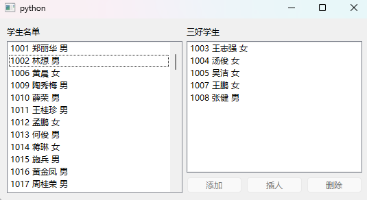

# 11.基于项和模型的控件2

### 常用数据模型和视图控件

#### 文本列表模型QStringListModel

文本列表模型QStringListModel通常用于存储一维文本列表它由一列多行文本数据构成。用于显示QStringListModel模型中文本数据的控件是QListView 控件。

用QStringListModel类创建文本列表模型实例的方法如下:

- parent 是继承自QObject的实例对象;
- strings 是字符串型列表或元组用于确定文本列表模型中显示角色和编辑角色的数据

```python
from PySide6.QtCore import QStringListModel

QStringListModel(parent: Union[PySide6.QtCore.QObject, NoneType]= None) -> None
QStringListModel(strings: Sequence[str], parent: Union[PySide6.QtCore.QObject, NoneType]= None) -> None
```


文本列表模型QStringListModel的常用方法如表所示,主要方法介绍如下

- 用setStringList(strings;Sequence[str])方法设置文本列表模型的显示角色和编辑角色的数据,

  - 用stringList()方法获取文本列表。

- 用setData(QModelIndex,Any,role:int=Qt.EditRole)方法设置单个角色的值

- 用setItemData(QModelIndex,Dict[int,Any])方法按照宇典形式设置角色值,关键字是角色,

- 用data(QModelIndex,role;int= Qt.DisplayRole)方法和 itemData(QModelIndex)方法可获得数据,数据的角色可参考下表。

  | Qt.ltemDataRole 的取值       | 值     | 对应的数据类型                   | 说明                                                         |
  | ---------------------------- | ------ | -------------------------------- | ------------------------------------------------------------ |
  | Qt.DisplayRole               | 0      | str                              | 视图控件显示的文本                                           |
  | Qt.DecorationRole            | 1      | QIcon、QPixmap                   | 图标                                                         |
  | Qt.EditRole                  | 2      | str                              | 视图控件中编辑时显示的文本                                   |
  | Qt.ToolTipRole               | 3      | sLr                              | 提示信息                                                     |
  | Qt.StatusTipRole             | 4      | str                              | 状态提示信息                                                 |
  | Qt.WhatsThisRole             | 5      | str                              | 按下Shilt+F1键时显示的数据                                   |
  | Qt.SizeHitRole               | 13     | QSize                            | 尺寸提示                                                     |
  | Qt.FontRole                  | 6      | QFont                            | 默认代理控件的字体                                           |
  | Qt.TextAlignmentRole         | 7      | Qt.AlignmentFlag                 | 默认代理控件的对齐方式                                       |
  | Qt.BackgroundRole            | 8      | QBrush、 QColor、 Qt.GlobalColor | 默认代理控件的背景色                                         |
  | Qt.ForegroundRole            | 9      | 默认代理控件的前景色             |                                                              |
  | Qt.CheckStateRole            | 10     | Qt.CheckState                    | 勾选状态                                                     |
  | Qt.InitialSortOrderRole      | 14     | Qt.SortOrder                     | 初始排序                                                     |
  | Qt.AccessibleTextRole        | 11     | Str                              | 用于可访问插件扩展的文本                                     |
  | Qt.AccessibleDescriptionRole | 12     | Str                              | 用于可访问功能的描述                                         |
  | Qt.UserRole                  | Ox0100 | any(数据类型不限)                | 自定义角色,可使用多个自定义角色,第 1个为 Qt.UserRole,第 2 个为 Qt) UserRole+1,依次类推 |

- 用index(row;int,column=0,parent=QModelIndex())方法获得某行的模型数据索引

  - 用sibling(row;int,column:int,idx;QModelIndex)方法获得同级别的数据项的索引。

- 用insertRows(row:int,count;int,parent=QModelIndex)方法可以插人多行

  - 用moveRows(sourceParent: QModelIndex, sourceRow: int, count: int,destinationParent:QModelIndex,destinationChild: int)方法可以移动多行到目标行,
  - 用removeRows(row:int,count:int,parent=QModelIndex)方法可以移除多行。

| QStringListModel的方法及参数类型                             | 说1 明                               |
| ------------------------------------------------------------ | ------------------------------------ |
| setStringList(strings:Sequence[str])                         | 设置列表模型显示和编辑角色的文本数据 |
| stringList()                                                 | 获取文本列表 List[str]               |
| rowCount(parent=QModelIndex())                               | 获取行的数量                         |
| parent()                                                     | 获取模型所在的父对象QObject          |
| parent(child:QModelIndex)                                    | 获取父索引QModelIndex                |
| index(row: int,column=0,parent:QModelIndex)                  | 获取row行的模型数据索引              |
| sibling(row: int,column: int.idx: QModelIndex)               | 获取同级别的模型数据索引             |
| setData(QModelIndex,Any,role: int=Qt.EditRole)               | 按角色设置数据                       |
| data(QModelIndex,role:int=Qt.DisplayRole)                    | 获取角色的值                         |
| setItemData(QModelIndex,Dict[int,Any])                       | 用字典设置角色值                     |
| itemData(QModelIndex)                                        | 获取字典角色值                       |
| flags(QModelIndex)                                           | 获取数据的标识 Qt.ItemFlag           |
| insertRows(row: int, count: int, parent = QModelIndex)       | 插入多行,成功则返回True              |
| moveRows(sourceParent:QModelIndex.sourceRow: int.count: int, destinationParent: QModelIndex, destinationChild:int) | 移动多行,成功则返回True              |
| removeRows(int,int,parent=QModelIndex())                     | 移除多行,成功则返回True              |
| clearItemData(index: QModelIndex)                            | 清空角色数据,成功则返回 True         |
| sort(column:int.order=Qt.AscendingOrder)                     | 对列进行排序                         |

#### 列表视图控件QListView

列表视图控件QListView 用于显示文本列表模型 QStringListModel 中的文本数据

用QListView创建列表视图控件的方法如下,其中 parent 是继承自QWidget 的窗口或容器控件。

```python
from PySide6.QtWidgets import QListView

QListView(parent: Union[PySide6.QtWidgets.QWidget, NoneType]= None) -> None
```

##### 列表视图控件QListView 的常用方法

列表视图控件 QListView 用于显示数据模型中某数据项下的所有子数据项的显示角色的文本。

列表视图控件没有表头,可以把数据显示成一列,也可以显示成一行。列表视图控件不仅可以显示文本列表模型中的数据,也可显示其他模型中的数据。

列表视图控件的常用方法如表 所示,主要方法介绍如下。

| QListView的方法及参数类型                                    | 说 明                                |
| ------------------------------------------------------------ | ------------------------------------ |
| setModel(QAbstractItemModel)                                 | 设置数据模型                         |
| setSelectionModel(QItemSelectionModel)                       | 设置选择模型                         |
| selectionModel()                                             | 获取选择模型 QItemSelectionModel     |
| setSelection(rect: QRect,command: QItemSelectionModel.SelectionFlags) | 选择指定范围内的数据项               |
| indexAt(QPoint)                                              | 获取指定位置处数据项的模型数据 索引  |
| selectedIndexes()                                            | 获取选中的数据项的索引列表List Cint] |
| clearSelection()                                             | 取消选择                             |
| clearPropertyFlags()                                         | 清空属性标志                         |
| contentsSize()                                               | 获取包含的内容所占据的尺寸QSize      |
| resizeContents(width:int,height: int)                        | 重新设置尺寸                         |
| scrollTo(QModelIndex)                                        | 使数据项可见                         |
| setModelColumn(int)                                          | 设置数据模型中要显示的列             |
| modelColumn()                                                | 获取模型中显示的列                   |
| setFlow(QListView.Flow)                                      | 设置显示的方向                       |
| setGridSize(QSize)                                           | 设置数据项的尺寸                     |
| setItemAlignment(Qt.Alignment)                               | 设置对齐方式                         |
| setLayoutMode(QListView.LayoutMode)                          | 设置数据的显示方式                   |
| setBatchSize(int)                                            | 设置批量显示的数量,默认为100         |
| setMovement(QListView.Movement)                              | 设置数据项的移动方式                 |
| setResizeMode(QListView.ResizeMode)                          | 设置尺寸调整模式                     |
| setRootIndex(QModelIndex)                                    | 设置根目录的数据项索引               |
| setRowHidden(int,bool)                                       | 设置是否隐藏                         |
| setSpacing(int)                                              | 设置数据项之间的间距                 |
| setUniformItemSizes(bool)                                    | 设置数据项是否统一尺寸               |
| setViewMode(QListView.ViewMode)                              | 设置显示模式                         |
| setWordWrap(bool)                                            | 设置单词是否可以写到两行上           |
| setWrapping(bool)                                            | 设置文本是否可以写到两行             |
| setAlternatingRowColors()                                    | 设置是否用交替颜色                   |
| setSelectionMode(QAbstractItemView.SelectionMode)            | 设置选择模式                         |
| setSelectionModel(QItemSelectionModel)                       | 设置选择模型                         |
| selectionModel()                                             | 获取选择模型                         |
| setPositionForIndex(position:QPoint,index:QModelIndex)       | 将指定索引的项放到指定位置处         |

- 用setModel(QAbstractItemModel)方法可以给列表视图控件设置关联的数据模型,

  - 用setRootIndex(QModelIndex)方法设置列表视图控件
  - 需要显示的数据索引下的子数据项如果数据项由多列构成则用setModelColumn(int)方法设置数据模型中要显示的列。

- 用selectedIndexes()方法取选中的数据项的行索引 List[int];

  - 用setCurrentIndex(QModelIndex)方法设置当前的模型数据索引;
  - 用currentIndex()方法获取当前项的模型数据索引;用
  - indexAt(QPoint)方法获取指定位置处的数据项的模型数据索引。

- 用setFlow(QListView.Flow)方法设置数据项的排列方向,其中 QListView.Flow可以取:

  - QListView,LeftToRight(值是0)
  - QListView.TopToBottom(值是1)。

- 用setLayoutMode(QListView.LayoutMode)方法设置数据的显示方式,其中QListView.LayoutMode 可取:

  - QListView.SinglePass(值是0,全部显示)
  - QListView,Batched(值是1,分批显示);
  - 用setBatchSize(int)方法设置分批显示的个数。

- 用setMovement(QListView.Movement)方法设置数据项的拖拽方式,其中QListView.Movement 可取:

  - QListView.Static(不能移动)
  - QListView.Free(可以自由移动)
  - QListView.Snap(捕捉到数据项的位置)。

- 用setViewMode(QListView.ViewMode)方法设置显示模式,参数 QListViewViewMode

  - 如果取QListView.ListMode,则采用QListView.TopToBottom 排列小尺寸和QListView.Static不能移动方式;
  - 如果取 QListView.IconMode,则采用QListView.LeftToRight 排列、大尺寸和QListView.Free自由移动方式。

- 用setResizeMode(QListView.ResizeMode)方法设置尺调整模式,参数可取QListView.Fixed或QListView.Adjust。

- 用setSelectionMode(QAbstractItemView.SelectionMode)方法可以设置选择模式其中参数QAbstractItemView.SelectionMode 的取值如表所示

  | QAbstractItemView.SelectionMode的取值 | 值   | 说 明                                                        |
  | ------------------------------------- | ---- | ------------------------------------------------------------ |
  | QAbstractItemView.NoSelection         | 0    | 禁止选择                                                     |
  | QAbstractItemView.SingleSelection     | 1    | 单选,当选择一个数据项时,其他任何已经选中的数 据项都变成未选中项 |
  | QAbstractItemView.MultiSelection      | 2    | 多选,当单击一个数据项时,将改变选中状态,其他还 未单击的数据项状态不变 |
  | QAbstractItemView.ExtendedSelection   | 3    | 当单击某数据项时,清除已选择的数据项；当按住 Ctrl键选择时,会改变被单击数据项的选中状态；当 按住 Shift 键选择两个数据项时,这两个数据项之间 的数据项的选中状态发生改变 |
  | QAbstractItemView.ContiguousSelection | 4    | 当单击一个数据项时,清除已经选择的项；当按住 Shift 键或Ctrl键选择两个数据项时,这两个数据项 之间的选择状态发生改变 |

##### 列表视图控件QListView的信号

列表视图控件QListView的信号如表所示

| QListView的信号及参数类型       | 说明                       |
| ------------------------------- | -------------------------- |
| activated(QModelIndex)          | 数据项活跃时发送信号       |
| clicked(QModelIndex)            | 单击数据项时发送信号       |
| doubleClicked(QModelIndex)      | 双击数据项时发送信号       |
| entered(QModelIndex)            | 光标进入数据项时发送信号   |
| iconSizeChanged(QSize)          | 图标尺寸发生变化时发送信号 |
| indexesMoved(List[QModelIndex]) | 数据索引发生移动时发送信号 |
| pressed(QModelIndex)            | 按下鼠标按键时发送信号     |
| viewportEntered()               | 光标进人视图时发送信号     |

##### 文本列表模型OStringListModel和列表视图控件QListView 的应用实例

下面的程序建立两个QListView 控件,并分别关联两个 QStringListModel。

程序初始从Excel文件"学生 IDxlsx"中的ID工作页中读取学生名单,在学生名单中选择学生姓名后,单击"添加"按钮,数据会从学生名单中删除,并移到三好学生中;

单击"删除"按钮,数据会从三好学生中移到学生名单中,并插人到原来的位置。左侧选择1个或多个学生姓名,右侧只有 1个选中时,可以使用"插人"按钮。

程序运行界面如图所示



```python
# -*- coding: UTF-8 -*-
# File date: Hi_2023/3/6 0:22
# File_name: 02-文本列表模型OStringListModel和列表视图控件QListView 的应用实例.py


import sys, os
from PySide6.QtWidgets import QApplication, QWidget, QListView, QHBoxLayout, QLabel, QPushButton, QVBoxLayout
from PySide6.QtCore import QStringListModel, QModelIndex, Qt
from openpyxl import load_workbook


class MyWindow(QWidget):
    def __init__(self, parent=None):
        super().__init__(parent)

        self.fileName = "./学生ID.xlsx"
        self.reference_Model = QStringListModel(self)  # 从 Excel中读数据存储数据的模型
        self.selection_Model = QStringListModel(self)  # 选择数据后,存储选择数据的模型

        self.setup_Ui()  # 建立界面
        self.data_import()  # 从Excel中读取数据
        self.view_clicked()  # 单击视图控件,判断按钮是否激活或失效

    def setup_Ui(self):
        label1 = QLabel("学生名单")
        self.listView_1 = QListView()  # 列表视图控件,显示Exce1 中的数据的控件
        v1 = QVBoxLayout()
        v1.addWidget(label1)
        v1.addWidget(self.listView_1)

        label2 = QLabel("三好学生")
        self.listView_2 = QListView()  # 列表视图控件,显示选中的数据
        self.btn_add = QPushButton("添加")
        self.btn_insert = QPushButton("插人")
        self.btn_delete = QPushButton("删除")
        h1 = QHBoxLayout()
        h1.addWidget(self.btn_add)
        h1.addWidget(self.btn_insert)
        h1.addWidget(self.btn_delete)
        v2 = QVBoxLayout()
        v2.addWidget(label2)
        v2.addWidget(self.listView_2)
        v2.addLayout(h1)
        h2 = QHBoxLayout(self)
        h2.addLayout(v1)
        h2.addLayout(v2)

        self.listView_1.setModel(self.reference_Model)  # 设置模型
        self.listView_2.setModel(self.selection_Model)  # 设置模型
        self.listView_1.setSelectionMode(QListView.SelectionMode.ExtendedSelection)  # 设置选择模式
        self.listView_2.setSelectionMode(QListView.SelectionMode.ExtendedSelection)  # 设置选择模式

        self.btn_add.clicked.connect(self.btn_add_clicked)
        self.btn_insert.clicked.connect(self.btn_insert_clicked)
        self.btn_delete.clicked.connect(self.btn_delete_clicked)
        self.listView_1.clicked.connect(self.view_clicked)
        self.listView_2.clicked.connect(self.view_clicked)

    def data_import(self):
        if os.path.exists(self.fileName):
            wbook = load_workbook(self.fileName)
            if "ID" in wbook.sheetnames:
                wsheet = wbook["ID"]
                cell_range = wsheet[wsheet.dimensions] # 取 Excel中数据存储范围

                student = list()
                for cell_row in cell_range:
                    string = ""
                    for cell in cell_row:  # cell_row.Excel行单元格元组
                        string = string + str(cell.value) + " "  # 取Excel单元格中数据

                    student.append(string.strip())
                self.reference_Model.setStringList(student)  # 在模型中添加数据列表

    def btn_add_clicked(self):  # 添加按钮的槽函数
        while len(self.listView_1.selectedIndexes()):
            selectedIndexes = self.listView_1.selectedIndexes()
            index = selectedIndexes[0]
            string = self.reference_Model.data(index, Qt.DisplayRole)  # 获取数据
            self.reference_Model.removeRow(index.row(), QModelIndex())
            count = self.selection_Model.rowCount()  # 获取行的数量
            self.selection_Model.insertRow(count)  # 在末尾插人数据
            last_index = self.selection_Model.index(count, 0, QModelIndex())  # 获取末尾索引
            self.selection_Model.setData(last_index, string, Qt.DisplayRole)  # 设置末尾的数据
        self.view_clicked()  # 控制按钮的激活与失效

    def btn_insert_clicked(self):
        while len(self.listView_1.selectedIndexes()):
            selectedIndexs_1 = self.listView_1.selectedIndexes()  # 获取选中数据项的索引
            selectedIndex_2 = self.listView_2.selectedIndexes()  # 获取选中数据项的索引

            index = selectedIndexs_1[0]
            string = self.reference_Model.data(index, Qt.DisplayRole)
            self.reference_Model.removeRow(index.row(), QModelIndex())
            row = selectedIndex_2[0].row()
            self.selection_Model.insertRow(row)
            index = self.selection_Model.index(row)
            self.selection_Model.setData(index, string, Qt.DisplayRole)

        self.view_clicked()  # 控制按钮的激活与失效

    def btn_delete_clicked(self):  # 删除按钮的槽函数
        while len(self.listView_2.selectedIndexes()):
            selectedIndexes = self.listView_2.selectedIndexes()
            index = selectedIndexes[0]
            string = self.selection_Model.data(index, Qt.DisplayRole)
            self.selection_Model.removeRow(index.row(), QModelIndex())
            count = self.reference_Model.rowCount()
            self.reference_Model.insertRow(count)
            last_index = self.reference_Model.index(count, 0, QModelIndex())  # 获取末尾索引
            self.reference_Model.setData(last_index, string, Qt.DisplayRole)

        self.view_clicked()
        self.reference_Model.sort(0)  # 排序

    def view_clicked(self):
        n1 = len(self.listView_1.selectedIndexes())  # 获取选中数据项的数量
        n2 = len(self.listView_2.selectedIndexes())  # 获取选中数据项的数量
        self.btn_add.setEnabled(n1)
        self.btn_insert.setEnabled(n1 and n2 == 1)
        self.btn_delete.setEnabled(n2)


if __name__ == '__main__':
    app = QApplication(sys.argv)
    win = MyWindow()

    win.show()
    sys.exit(app.exec())

```

#### 文件系统模型QFileSystemModel

利用文件系统模型 QFileSystemModel 可以访问本机的文件系统,可以获得文件目录文件名称和文件大小等信息,可以新建目录删除目录和文件、移动目录和文件及重命名目录和文件。

用QFileSystemModel类定义文件系统模型的方法如下所示其中parent 是继承自QObject的实例。

```python
from PySide6.QtWidgets import QFileSystemModel

QFileSystemModel(parent: Union[PySide6.QtCore.QObject, NoneType]= None) -> None 
```

##### 文件系统模型QFileSystemModel的常用方法

文件系统模型QFileSystemModel的常用方法如表所示,主要方法介绍如下

- 用setRootPath(path:str)方法设置模型的根目录,并返回指向该目录的模型数据索引。
  - 改变根目录时,发送rootPathChanged(newPath)信号。
  - 用rootPath()方法获取根目录。
- 用fileName(QModelIndex)方法获取文件名;
  - 用filePath(QModelIndex)方法获取文件名和路径;
  - 用fileInfo(QModelIndex)方法获取文件信息;
  - 用lastModified(QModelIndex)方法获取文件最后修改日期。
- 用mkdir(QModelIndex,str)方法创建目录,并返回指向该目录的模型数据索引。
- 用rmdir(QModelIndex)方法除目录成功则返回True否则返回 False,删除后不可恢复。
- 用setOption(QFileSystemModelOptionon=True)方法设置文件系统模型的参数,其中QFileSystemModel Option 可取:
  - QFileSystemModel, DontWatchForChanges(不使用监控器)
  - QFileSystemModel, DontResolveSymlinks(不解析链接)
  - QFileSystemModel.DontUseCustomDirectoryIcons(不使用客户图标),
  - 默认都是关闭的用setNameFilters(filters; Sequence[str])方法设置名称过滤器;
- 用setFilter(filters;QDir.Filter)方法设置路径过滤器,其中filters 可取:
  - QDir.DirsQDir.AllDirs
  - QDir.Files
  - QDir.Drives
  - QDir.NoSymLinks
  - QDir.NoDotAndDotDot
  - QDir.NoDot
  - QDir.NoDotDot
  - QDir.AllEntries
  - QDir, Readable
  - QDir.Writable
  - QDir.Executable
  - QDir.Modified
  - QDir.Hidden
  - QDir.System
  - QDir.CaseSensitive。
  - 设置路径过滤器时一定要包括QDir.AllDirs,否则无法识别路径的结构。

| QFileSystemModel的方法及参数类型                    | 返回值的类型 | 说明                                             |
| --------------------------------------------------- | ------------ | ------------------------------------------------ |
| setRootPath(path；str)                              | QModelIndex  | 设置模型的根目录,并返回指向该目录的 模型数据索引 |
| setData(QModelIndex,Any, role = Qt.EditRole)        | bool         | 设置角色数据,成功则返回True                      |
| data(index: QModelIndex, role: int=Qt.DisplayRole)  | Any          | 获取角色数据                                     |
| setFilter(filters:QDir.Filter)                      | None         | 设置路径过滤器                                   |
| setNameFilters(filters:Sequence[str])               | None         | 设置名称过滤器                                   |
| nameFilters()                                       | List[str]    | 获取名称过滤器                                   |
| setNameFilterDisables(enable:bool)                  | None         | 设置名称过滤器是否激活                           |
| nameFilterDisables()                                | bool         | 获取名称过滤器是否激活                           |
| setOption(QFileSystemModel.Option, on=True)         | None         | 设置文件系统模型的参数                           |
| setReadOnly(enable: bool)                           | None         | 设置是否是只读的                                 |
| isReadOnly()                                        | bool         | 获取是否有只读属性                               |
| fileIcon(QModelIndex)                               | QIcon        | 获取文件的图标                                   |
| fileInfo(QModelIndex)                               | QFileInfo    | 获取文件信息                                     |
| fileName(QModelIndex)                               | str          | 获取文件名                                       |
| filePath(QModelIndex)                               | Str          | 获取路径和文件名                                 |
| headerData(int, Qt.Orientation,role=Qt.DisplayRole) | Any          | 获取表头数据                                     |
| index(row: int,column: int, parent:QModelIndex)     | QModelIndex  | 获取索引                                         |
| index(path:str,column:int=0)                        | QModelIndex  | 获取索引                                         |
| hasChildren(parent:QModelIndex)                     | bool         | 获取是否有子目录或文件                           |
| isDir(QModelIndex)                                  | bool         | 获取是否是路径                                   |
| lastModified(QModelIndex)                           | QDateTime    | 获取最后修改时间                                 |
| mkdir(QModelIndex,str)                              | QModelIndex  | 创建目录,并返回指向该目录的模型数据 索引         |
| myComputer(role=Qt.DisplayRole)                     | Any          | 获取myComputer下的数据                           |
| parent(child: QModelIndex)                          | QModelIndex  | 获取父模型数据索引                               |
| remove(QModelIndex)                                 | bool         | 删除文件或目录,成功则返回True                    |
| rmdir(QModelIndex)                                  | bool         | 删除目录,成功则返回True                          |
| rootDirectory()                                     | QDir         | 返回根目录QDir                                   |
| rootPath()                                          | Str          | 返回根目录文本                                   |
| rowCount(parent; QModelIndex)                       | int          | 返回目录下的文件数量                             |
| sibling(row: int, column; int, idx: QModelIndex)    | QModelIndex  | 获取同级别的模型数据索引                         |
| type(index: QModelIndex)                            | Str          | 返回路径或文件类型,例如"Directory" "JPEG file"   |
| size(QModelIndex)                                   | int          | 获取文件的大小                                   |
| columnCount(parent:QModelIndex)                     | int          | 获取父索引下的列数                               |

##### 文件系统模型 QFileSystemModel的信号

文件系统模型 QFileSystemModel 的信号如表所示

| QFileSystemModel的信号及参数类型                 | 说 明                    |
| ------------------------------------------------ | ------------------------ |
| directoryLoaded(path:str)                        | 当加载路径时发送信号     |
| rootPathChanged(newPath:str)                     | 根路径发生改变时发送信号 |
| fileRenamed(path: str,oldName: str,newName: str) | 更改文件名时发送信号     |

#### 树视图控件QTreeView

树视图控件 QTreeView 以树列表的形式显示文件系统模型关联的本机文件系统,显示出本机的目录、文件名、文件大小等信息,也可以以层级结构形式显示其他类型的数据模型。

用QTreeView类创建树视图控件的方法如下,其中parent是继承自QWidget 的窗口或容器控件。

```python
from PySide6.QtWidgets import QTreeView

QTreeView(parent: Union[PySide6.QtWidgets.QWidget, NoneType]= None) -> None 
```

##### 树视图控件QTreeView的方法

树视图控件QTreeView 的常用方法如表所示,主要方法介绍如下

- 用setModel(QAbstractItemModel)方法可以给树视图控件设置关联的数据模型
- 用setRootIndex(QModelIndex)方法可以设置树视图控件根部指向的模型数据位置。
- 用setItemsExpandable(bool)方法设置是否可以展开节点;
  - 用setExpanded(QModelIndex;bool)方法设置展开或折叠某节点;
  - 用expand(QModelIndex)方法展开某节点;用expandAll()方法展开所有节点;
  - 用collapse(QModelIndex)方法折叠某节点;
  - 用collapseAl1()方法折叠所有节点;
  - 用setExpandsOnDoubleClick(bool)方法设置双击节点时是否展开节点。
    - 展开或折叠节点时,将会发送expanded(QModelIndex)信号或 collapsed(QModelIndex)信号。
  - 用setColumnHidden(column;int,hide:bool)方法可以设置隐藏或显示某列,
    - 用showColumn(column;int)方法和hideColumn(column:int)方法可以显示和隐藏指定的列。
    - 用setColumnWidth(int,int)方法设置列的宽度,用setUniformRowHeights(bool)方法设置行是否有统一的高度。"

| QTreeView的方法及参数类型                                    | 说 明                                                        |
| ------------------------------------------------------------ | ------------------------------------------------------------ |
| setModel(QAbstractItemModel)                                 | 设置数据模型                                                 |
| setSelectionModel(QItemSelectionModel)                       | 设置选择模型                                                 |
| selectionModel()                                             | 获取选择模型 QItemSelectionModel                             |
| ctSelection(reet: QRect,command: QItemSelectionModel.SelectionFlags) | 选择指定范图内的数据项                                       |
| setRootIndex(QModellndex)                                    | 设置根部的索引                                               |
| setRootIsDecorated(bool)                                     | 设置根部是否有折叠或展开标识                                 |
| rootlsDecorated()                                            | 获取根部是否有折叠或展开标识                                 |
| [slot]collapse(QModellndex)                                  | 折叠节点                                                     |
| [slot]collapseAII()                                          | 折叠所有节点                                                 |
| [slot]expand(QModellndex)                                    | 展开节点                                                     |
| isExpanded(QModelIndex)                                      | 获取节点是否已经展开                                         |
| [slot]expandAII()                                            | 股开所有节点                                                 |
| [slot]expandRecursively(QModelIndex,depth=-1)                | 逐级展开,腰开探度是 depth。一1表示展开所有节点,0表示只展开本层 |
| [slot]expandToDepth(depth:int)                               | 展开到指定的深度                                             |
| [slot]hideColumn(column:int)                                 | 隐藏列                                                       |
| [slot]showColumn(column:int)                                 | 显示列                                                       |
| indexAbove(QModelIndex)                                      | 获取某索引之前的索引                                         |
| indexAt(QPoint)                                              | 获取某个点处的索引                                           |
| indexBelow(QModelIndex)                                      | 获取某索引之后的索引                                         |
| selectAII()                                                  | 全部选择                                                     |
| selectedIndexes()                                            | 获取选中的项的行列表 List[int]                               |
| setAnimated(bool)                                            | 设置展开或折叠时是否比较连贯                                 |
| isAnimated()                                                 | 获取展开或折叠时是否比较连贯                                 |
| setColumnHidden(column:int,hide: bool)                       | 设置是否隐藏列                                               |
| isColumnHidden(column:int)                                   | 获取列是否隐藏                                               |
| setRowHidden(row: int, parent: QModelIndex, hide:bool)       | 设置相对于QModelIndex的第int行是否隐藏                       |
| isRowHidden(row: int,parent: QModelIndex)                    | 获取行是否隐藏                                               |
| setColumnWidth(column: int,width: int)                       | 设置列的宽度                                                 |
| columnWidth(column:int)                                      | 获取列的宽度                                                 |
| rowHeight(index: QModelIndex)                                | 获取行的高度                                                 |
| setItemsExpandable(enable:bool)                              | 设置是否可以展开节点                                         |
| itemsExpandable()                                            | 获取节点是否可以展开                                         |
| setExpanded(QModelIndex,bool)                                | 设置是否展开某节点                                           |
| setExpandsOnDoubleClick(bool)                                | 设置双击时是否展开节点                                       |
| setFirstColumnSpanned(row: int, parent: QModelIndex,span:bool) | 设置某行的第1列的内容是否占据所有列                          |
| isFirstColumnSpanned(int,QModelIndex)                        | 获取某行的第1列的内容是否占据所有列                          |
| setHeader(QHeaderView)                                       | 设置表头                                                     |
| header()                                                     | 获取表头                                                     |
| setHeaderHidden(bool)                                        | 设置是否隐藏表头                                             |
| setIndentation(int)                                          | 设置缩进量                                                   |
| indentation()                                                | 获取缩进量                                                   |
| resetIndentation()                                           | 重置缩进量                                                   |
| setAutoExpandDelay(delay:int)                                | 拖放操作中设置项打开的延迟时间(毫秒)                         |
| autoExpandDelay()                                            | 获取项打开的延迟时间,如为负则不能打开                        |
| setAllColumnsShowFocus(enable:bool)                          | 设置所有列是否显示键盘焦点,否则只有一列显示 焦点             |
| allColumnsShowFocus()                                        | 获取所有列是否显示键盘焦点                                   |
| setItemsExpandable(bool)                                     | 设置是否可以展开节点                                         |
| setUniformRowHeights(uniform:bool)                           | 设置项是否有相同的高度                                       |
| uniformRowHeights()                                          | 获取项是否有相同的高度                                       |
| setWordWrap(on:bool)                                         | 设置一个单词是否可以写到两行上                               |
| serTextElideMode(mode:Qt.TextElideMode)                      | 设置省略号"…"的位置,参数可取Qt.ElideLelt、Qt.ElideRight、Qt.ElideMiddle 或 Qt.ElideNone |
| setTreePosition(logicalIndex:int)                            | 设置树的位置                                                 |
| treePosition()                                               | 获取树的位置                                                 |
| setSortingEnabled(bool)                                      | 设置是否可以进行排序                                         |
| isSortingEnabled()                                           | 获取是否可以排序                                             |
| [slot]sortByColumn(int,Qt.SortOrder)                         | 按列进行排序                                                 |
| [slotJresizeColumnToContents(column:int)                     | 根据内容调整列的尺寸                                         |
| scrollContentsBy(dx:int,dy:int)                              | 将内容移动指定的距离                                         |
| setUniformRowHeights(bool)                                   | 设置行是否有统一高度                                         |

##### 树视图控件QTreeView的信号

树视图控件QTreeView的信号如表所示

| QTreeView的信号及参数类型  | 说明                       |
| -------------------------- | -------------------------- |
| collapsed(QModelIndex)     | 折叠节点时发送信号         |
| expanded(QModelIndex)      | 展开节点时发送信号         |
| activated(QModelIndex)     | 数据项活跃时发送信号       |
| clicked(QModelIndex)       | 单击数据项时发送信号       |
| doubleClicked(QModelIndex) | 双击数据项时发送信号       |
| entered(QModelIndex)       | 光标进入数据项时发送信号   |
| iconSizeChanged(QSize)     | 图标尺寸发生变化时发送信号 |
| pressed(QModelIndex)       | 按下鼠标按键时发送信号     |
| viewportEntered()          | 光标进入树视图时发送信号   |


#### 标准数据模型QStandardltemModel

标准数据模型QStandardItemModel可以存储多行多列的数据

- 表格数据表格中的每个数据称为数据项QStandardItem
- 每个数据项下面还可以存储多行多列的子数据表格并形成层级关系,这样会形成比较复杂的结构关系。数据项可以存储文本、图标勾选状态等信息。

用QStandardItemModel创建标准数据模型的方法如下所示其中parent是QObject或继承自QObject的实例对象,rows 和columns 分别是行数和列数

用QStandardItem创建数据项的方法如下所示用QStandardItem(rows,columns)方法可以创建一个含有多行多列子数据项的数据项。

```python
from PySide6.QtGui import QStandardItemModel, QStandardItem

QStandardItemModel(parent: Union[PySide6.QtCore.QObject, NoneType]= None) -> None
QStandardItemModel(rows: int, columns: int, parent: Union[PySide6.QtCore.QObject, NoneType]= None) -> None

QStandardItem(self) -> None
QStandardItem(icon: Union[PySide6.QtGui.QIcon, PySide6.QtGui.QPixmap], text: str) -> None
QStandardItem(other: PySide6.QtGui.QStandardItem) -> None
QStandardItem(rows: int, columns: int = 1) -> None
QStandardItem(text: str) -> None
```

##### 标准数据模型QStandardItemModel的常用方法

标准数据模型QStandardItemModel的常用方法如表所示,主要方法介绍如下标

- 准数据模型最高层的列数和行数用setColumnCount(columns:int)和setRowCount(row;int)方法设置;
  - 用columnCount(parent;QModelIndex)方法和rowCount(parent:QModelIndex)方法可获得某层的列数和行数。
- 用appendColumn(Sequence[QStandardItem])方法可以添加列;
  - 用appendRow(Sequence[QStandardItem])方法或appendRow(QStandardItem)方法可添加行
  - 用insertColumn(Sequence[QStandardItem])方法和insertRow(Sequence[QStandardItem])方法插人列行;
  - 用takeColumn(column:int)方法和 takeRow(row:int)方法移除列和行。
- 用setItem(row;int,column;int,item;QStandardItem)方法或 setItem(row; int,item:QStandardItem)方法可以在数据模型中设置数据项,
  - 用item(row:int,column:int=0)方法可以获取数据项,
  - 用takeltem(row:int,column:int=0)方法可移除数据项,
  - 用clear()方法可清除所有的数据项。
- 用setData(QModelIndex,Any,role =Qt EditRole)方法和setItemData(QModelIndex,Dict[int,Any])方法可以设置数据项的角色数据,
  - 用clearItemData(QModelIndex)方法可以清除数据项上的角色数据。
- 获得数据项的索引
  - index(row:int,column:int,parent: QModelIndex)
  - indexFromItem(QStandardItem)
  - sibling(row:int,column:int,idx:QModelIndex)
- 标准数据模型有行表头和列表头
  - 用setHorizontalHeaderItem(column:int,item:QStandardItem)方法和 setVerticalHeaderItem(row;int,item: QStandardItem)方法设置水平表头和竖直表头的数据项;
  - 用takeHorizontalHeaderItem(column;int)方法和takeVerticalHeaderItem(row;int)方法移除表头的数据项,并返回被移除的表头数据项。

| QStandardItemModel的方法及参数类型                         | 返回值的类型        | 说明                         |
| ---------------------------------------------------------- | ------------------- | ---------------------------- |
| removeRows(row:int,count:int, parent: QModelIndex)         | bool                | 移除多行                     |
| setltem(row: int, column: int, item: QStandardItem)        | None                | 根据行和列设置项             |
| setltem(row: int, item: QStandardItem)                     | None                | 根据行设置数据项             |
| item(row: int,column: int=0)                               | QStandardItem       | 根据行和列获取项             |
| takeltem(row: int,column: int=0)                           | QStandardItem       | 移除数据项                   |
| setData(QModelIndex,Any,role = Qt.EditRole)                | bool                | 设置角色值                   |
| data(QModellndex, role=Qt.DisplayRole)                     | Any                 | 获取角色值                   |
| setItemData(QModelIndex,Dict[int,Any])                     | bool                | 用字典设置项的值             |
| itemData(QModelIndex)                                      | Dict[int,Any]       | 获取多个项的值               |
| setHeaderData(int, Qt.Orientation, Any, role= Qt.EditRole) | bool                | 设置表头值                   |
| headerData(int, Qt.Orientation, role=Qt.DisplayRole)       | Any                 | 获取表头的值                 |
| setHorizontalHeaderltem(column: int, QStandardItem)        | None                | 设置水平表头的项             |
| setHorizontalHeaderLabels(labels: Sequence[str])           | None                | 设置水平表头的文本内容       |
| horizontalHeaderItem(column:int)                           | QStandardItem       | 获取水平表头的项             |
| setVerticalHeaderItem(row: int, item: QStandardItem)       | None                | 设置竖直表头的项             |
| setVerticalHeaderLabels(labels: Sequence[str])             | None                | 设置竖直表头的文本内容       |
| verticalHeaderItem(row: int)                               | QStandardItem       | 获取竖直表头的项             |
| takeHorizontalHeaderItem(coloumn:int)                      | QStandardItem       | 移除水平表头的项             |
| takeVerticalHeaderItem(row:int)                            | QStandardItem       | 移除竖直表头的项             |
| index(row: int, column: int, parent: QModelIndex)          | QModelIndex         | 根据行列获取数据项索引       |
| indexFromItem(QStandardItem)                               | QModelIndex         | 根据项获取索引               |
| sibling(row: int, column: int, idx: QModelIndex)           | QModelIndex         | 获取同级别的索引             |
| invisibleRootItem()                                        | QStandardItem       | 获取根目录的项               |
| clear()                                                    | None                | 清除所有的数据项             |
| clearItemData(index: QModelIndex)                          | bool                | 清除项中的数据               |
| findItems(str,Qt.MatchFlag,column=0)                       | List[QStandardItem] | 获取满足匹配条件的数据项列表 |
| flags(QModelIndex)                                         | Qt.ItemFlags        | 获取数据项的标识             |
| hasChildren(parent:QModelIndex)                            | bool                | 获取是否有子项               |
| itemFromIndex(QModelIndex)                                 | QStandardItem       | 根据索引获取项               |
| parent(child: QModelIndex)                                 | QModelIndex         | 获取父项的索引               |
| setSortRole(role:int)                                      | None                | 设置排序角色                 |
| sortRole()                                                 | int                 | 获取排序角色                 |
| sort(column:int,order=Qt.AscendingOrder)                   | None                | 根据角色值排序               |

##### 数据项QStandardItem的常用方法

数据项QStandardItem的常用方法如表所示,主要方法介绍如下

- 数据项可以设置文本、字体、图标、前景色、背景色勾选状态和提示信息等。
  - 用setText(str)方法设置数据项显示的文本;
  - 用setIcon(QIcon)方法设置图标;
  - 用setFont(QFont)方法设置数据项的字体;
  - 用setForeground(QColor)方法设置前景色;
  - 用setCheckable(bool)方法设置是否可以勾选,
  - 用setCheckState(Qt.CheckState)方法设置勾选状态
- 数据项下面可以有多行多列子数据项
  - 行和列可以在创建数据项时用构造函数设置,
  - 也可用setRowCount(int)方法和 setColumnCount(int)方法设置;
  - 用rowCount()方法和columnCount()方法获取行和列的数量。
- 可用多种方法添加插入和移除子数据项的行和列,
  - 用setChild(row:int,column;int,QStandardItem)方法和setChild(row:intQStandardItem)方法设置子数据项;
  - 用row()和column()方法获取数据项所在的行和列;
  - 用child(row:int,column;int=0)方法获取子数据项;
  - 用hasChildren()方法获取是否有子数据项;
  - 用takeChild(row:int;column:int-0)方法移除子数据项,并返回被移除的子数据项。

| QStandardltem的方法及参数类型                                | 返回值的类型        | 说 明                           |
| ------------------------------------------------------------ | ------------------- | ------------------------------- |
| index()                                                      | QModelIndex         | 获取数据项的索引                |
| setColumnCount(int)                                          | None                | 设置列数                        |
| columnCount()                                                | Int                 | 获取列数                        |
| setRowCount(int)                                             | None                | 设置行数                        |
| rowCount()                                                   | int                 | 获取行数                        |
| setChild(row: int.column:int, QStandardltem)                 | None                | 根据行和列设置子数据项          |
| setChild(row:int,QStandardItem)                              | None                | 根据行设置子数据项              |
| hasChildren()                                                | bool                | 获取是否有子数据项              |
| child(row: int,column: int=0)                                | QStandardItem       | 根据行和列获取子数据项          |
| takeChild(row: int,column:int=0)                             | QStandardltem       | 移除并返回子数据项              |
| row()、column()                                              | int                 | 获取数据项所在的行和列          |
| appendColumn(Sequence[QStandardItern.])                      | None                | 添加列                          |
| appendRow(Sequence[QStandardItem])                           | None                | 添加行                          |
| appendRow(QStandardItem)                                     | None                | 添加行                          |
| appendRows(Sequence[QStandardItem])                          | None                | 添加多行                        |
| insertColumn(column:int,Sequence[QStandardItem])             | None                | 插人列                          |
| insertColumns(column: int,count:int)                         | None                | 插人多列                        |
| insertRow(row: int,Sequence[QStandardItem])                  | None                | 插人行                          |
| insertRow(row:int,QStandardItem)                             | None                | 插人行                          |
| insertRows(row:int,count:int)                                | None                | 插人多行                        |
| insertRows(row:int,Sequence[QStandardItem])                  | None                | 插人多行                        |
| removeColumn(column:int)                                     | None                | 移除列                          |
| removeColumns(column: int, count: int)                       | None                | 移除多列                        |
| removeRow(row:int)                                           | None                | 移除行                          |
| removeRows(row:int,count:int)                                | None-               | 移除多行                        |
| takeColumn(column:int)                                       | List[QStandardItem] | 移除列,并返回被移除的数据项列表 |
| takeRow(row:int)                                             | List[QStandardItem] | 移除行,并返回被移除的数据项列表 |
| model()                                                      | QStandardItemModel  | 获取数据模型                    |
| parent()                                                     | QStandardItem       | 获取父数据项                    |
| setAutoTristate(bool)                                        | None                | 设置自动有第3种状态             |
| isAutoTristate()                                             | bool                | 获取自动有第3种状态             |
| setTristate(bool)                                            | None                | 设置是否有弟3种状态             |
| setForeground(brush: Union[QBrush, Qt.BrushStyle, Qt.GlobalColor, QColor,QGradient,QImage,QPixmap]) | None                | 设置前景色                      |
| foreground()                                                 | QBrush              | .获取前景画刷                   |
| setBackground(brush: Union[QBrush, Qt.BrushStyle, Qt.GlobalColor, QColor:QGradient,QImage,QPixmap]) | None                | 设置背景色                      |
| background()                                                 | QBrush              | 获取背景画刷                    |
| setCheckable(bool)                                           | None                | 设置是否可以勾选                |
| setCheckState(Qt.CheckState)                                 | None                | 设置勾选状态                    |
| checkState()                                                 | Qt.CheckState       | 获取勾选状态                    |
| isCheckable()                                                | bool                | 获取是否可以勾选                |
| setData(value: Any,role: int=257)                            | None                | 设置数据                        |
| data(role:int=257)                                           | Any                 | 获取数据                        |
| clearData()                                                  | None                | 清空数据                        |
| setDragEnabled(bool)                                         | None                | 设置是否可以拖拽                |
| isDragEnabled()                                              | bool                | 获取是否可以拖拽                |
| setDropEnabled(bool)                                         | None                | 设置是否可以拖放                |
| isDropEnabled()                                              | bool                | 获取是否可以拖放                |
| setEditable(bool)                                            | None                | 设置是否可以编辑                |
| setEnabled(bool)                                             | None                | 设置是否激活                    |
| setFlags(Qt.ItemFlag)                                        | None                | 设置标识                        |
| isEditable()                                                 | bool                | 获取是否可编辑                  |
| isEnabled()                                                  | bool                | 获取是否激活                    |
| isSelectable()                                               | bool                | 获取是否可选择                  |
| isUserTristate()                                             | bool                | 获取是否有用户第3状态           |
| setFont(QFont)                                               | None                | 设置字体                        |
| setIcon(QIcon)                                               | None                | 设置图标                        |
| setSelectable(bool)                                          | None                | 设置选中状态                    |
| setStatusTip(str)                                            | None                | 设置状态信息                    |
| setText(str)                                                 | None                | 设置文本                        |
| text()                                                       | str                 | 欢取文本                        |
| setTextAlignment(Qt.Alignment)                               | None                | 设置文本对齐方式                |
| setToolTip(str)                                              | None                | 设置提示信息                    |
| setWhatsThis(str)                                            | None                | 设置按Shilt+F1键的提示信息      |
| write(QDataStream)                                           | None                | 把项写人到数据流中              |
| read(QDataStream)                                            | None                | 从数据流中读取项                |
| sortChildren(column:int,order = Qt.AscendingOrder)           | None                | 对列进行排序                    |

#### 表格视图控件QTableView

表格视图控件QTableView 可以用多行多列的单元格来显示标准数据模型,也可显示其他类型的数据模型

用QTableView创建表格视图控件的方法如下所示,其中parent是继承自QWidget的窗口或容器控件。

```python
from PySide6.QtWidgets import QTableView

QTableView(parent: Union[PySide6.QtWidgets.QWidget, NoneType]= None) -> None
```

##### 表格视图控件QTableView的常用方法

表格视图控件QTableView 以二维表格的形式显示数据模型中的数据,其常用方法如表所示,主要方法介绍如下。

- 用setModel(QAbstractItemModel)方法设置表格视图控件的数据模型
- 用setRootIndex(QModelIndex)方法设置根目录(不可见)的数据索引,
- 用setSelectionModel(QItemSelectionModel)方法设置选择模型
- 用setColumnWidth(int, int)方法和 setRowHeight(int, int)方法设置列的宽度和行的高度,
  - 用columnWidth(int)方法和 rowHeight(int)方法获取列的宽度和行的高度。
- 表格视图控件有坐标系
  - 用columnAt(x;int)方法获取坐标位置处的列号
  - 用rowAt(y:int)方法获取y坐标位置处的行号,
  - 用columnViewportPasition(column;int)方法获取指定列的x坐标值,
  - 用rowViewportPosition(row;int)方法获取指定行的坐标值。
- 行和列可以根据内容调整高度和宽度
  - 用resizeColumnToContents(column; int)方法和resizeColumnsToContents()方法自动调整列的宽度,
  - 用resizeRowToContents(row:int)方法和 resizeRowsToContents()方法自动调整行的高度。
- 在表格的左上角有个按钮,单击该按钮可以选中所有数据,
  - 用setCornerButtonEnabled(bool)方法设置是否激活该按钮。
  - 用setShowGrid(bool)方法设置是否显示表格线条,
- 用setGridStyle(Qt.PenStyle)方法可以设置表格线条的样式,其中参数 Qt PenStyle 可取: 
  - Qt.NoPen(没有表格线条)
  - Qt.SolidLine,
  - Qt.DashLine、
  - Qt.DotLine,
  - Qt.DashDotLine,
  - Qt.DashDotDotLine 
  - Qt.CustomDashLine(用setDashPattern()方法自定义)

| QTableView的方法及参数类型                                   | 返回值的类型        | 说明                         |
| ------------------------------------------------------------ | ------------------- | ---------------------------- |
| setModel(QAbstractItemModel)                                 | None                | 设置关联的数据模型           |
| setRootIndex(QModelIndex)                                    | None                | 设置根目录的数据索引         |
| setSelectionModel(QItemSelectionModel)                       | None                | 设置选择模型                 |
| selectionModel()                                             | QItemSelectionModel | 获取选择模型                 |
| setSelection(rect:QRect,command: QItemSelectionModel.SelectionFlags) | None                | 选择指定范围内的数据项       |
| columnAt(x:int)                                              | int                 | 获取×坐标位置处的列号        |
| rowAt(y: int)                                                | int                 | 获取y坐标位置处的行号        |
| columnViewportPosition(column:int)                           | int                 | 获取指定列的×坐标值          |
| rowViewportPosition(row:int)                                 | int                 | 获取指定行的y坐标值          |
| indexAt(QPoint)                                              | QModelIndex         | 获取指定位置的数据索引       |
| selectedIndexes()                                            | List[int]           | 获取选中的项的索引列表       |
| resizeColumnToContents(column:int)                           | None                | 自动调整指定列的宽度         |
| resizeColumnsToContents()                                    | None                | 根据内容自动调整列的宽度     |
| resizeRowToContents(row:int)                                 | None                | 自动调整指定行的高度         |
| resizeRowsToContents()                                       | None                | 根据内容自动调整行的高度     |
| scrollTo(QModelIndex)                                        | None                | 滚动表格使指定内容可见       |
| selectColumn(column:int)                                     | None                | 选择列                       |
| selectRow(row:int)                                           | None                | 选择行                       |
| setColumnHidden(column:int,bool)                             | None                | 设置是否隐藏列               |
| hideColumn(column:int)                                       | None                | 隐藏列                       |
| setRowHidden(row:int,bool)                                   | None                | 设置是否隐藏行               |
| hideRow(row:int)                                             | None                | 隐藏行                       |
| showColumn(column:int)                                       | None                | 显示列                       |
| showRow(row:int)                                             | None                | 显示行                       |
| isColumnHidden(column:int)                                   | bool                | 获取指定的列是否隐藏         |
| isRowHidden(row:int)                                         | bool                | 获取指定的行是否隐藏         |
| islndexHidden(QModelIndex)                                   | bool                | 获取索引对应的单元格是否隐藏 |
| setShowGrid(bool)                                            | None                | 设置是否显示表格线条         |
| showGrid()                                                   | bo01                | 获取表格线条是否已显示       |
| setGridStyle(Qt.PenStyle)                                    | None                | 设置表格线的样式             |
| setColumnWidth(column:int,width:int)                         | None                | 设置列的宽度                 |
| columnWidth(column:int)                                      | int                 | 获取列的宽度                 |
| setRowHeight(row: int,height: int)                           | None                | 设置行的高度                 |
| rowHeight(row:int)                                           | int                 | 获取行的高度                 |
| setCornerButtonEnabled(bool)                                 | None                | 设置是否激活右下角按钮       |
| isCornerButtonEnabled()                                      | bool                | 获取右下角按钮是否激活       |
| setVerticalHeader(QHeaderView)                               | None                | 设置竖直表头                 |
| verticalHeader()                                             | QHeaderView         | 获取竖直表头                 |
| setHorizontalHeader(QHeaderView)                             | None                | 设置水平表头                 |
| horizontalHeader()                                           | QHeaderView         | 获取水平表头                 |
| setSpan(row:int,column: int, rowSpan: intcolumnSpan:int)     | None                | 设置单元格的行跨度和列跨度   |
| columnSpan(row:int,column:int)                               | int                 | 获取单元格的列跨度           |
| rowSpan(row:int,column:int)                                  | int                 | 获取单元格的行跨度           |
| clearSpans()                                                 | None                | 清除跨度                     |
| setWordWrap(bool)                                            | None                | 设置字可以写到多行上         |
| setSortingEnabled(bool)                                      | None                | 设置是否可以排序             |
| isSortingEnabled()                                           | bool                | 获取是否可以排序             |
| sortByColumn(int,Qt.SortOrder)                               | None                | 按列进行排序                 |
| scrollContentsBy(dx: int,dy:int)                             | None                | 把表格移动指定的距离         |
| scrollTo(index: QModelIndex,hint = QAbstractItemView.EnsureVisible) | None                | 使指定的项可见               |
| setAlternatingRowColors(enable: bool)                        | None                | 设置行的颜色交替变化         |

##### 表格视图控件QTableView的信号

表格视图控件QTableView的信号如表所示

| QTableView的信号及参数类型 | 说 明                      |
| -------------------------- | -------------------------- |
| activated(QModelIndex)     | 数据项活跃时发送信号       |
| clicked(QModelIndex)       | 单击数据项时发送信号       |
| doubleCIicked(QModelIndex) | 双击数据项时发送信号       |
| entered(QModelIndex)       | 光标进入数据项时发送信号   |
| iconSizeChanged(QSize)     | 图标尺寸发生变化时发送信号 |
| pressed(QModelIndex)       | 按下鼠标按时发送信号       |
| viewportEntered()          | 光标进入视图控件时发送信号 |

### 选择模型和代理控件

#### 选择模型 QltemSelectionMode

在列表、树和表格视图中,如要对数据项进行操作,需要先选中数据项,被选中的数据项高亮或反色显示。

在 PySide6 中被选中的数据项记录在选择模型 QItemSelectionModel中,如果多个视图控件同时关联到一个数据模型,选择模型可以记录多个视图控件中被选中的数据项,形成数据选择集 QItemSelection。视图控件有自已默认的选择模型,般可以满足用户的需要;另外可以单独创建新的选择模型,以实现特殊目的。

视图控件都有 setSelectionModel(QItemSelectionModel)方法和 selectionModel()方法,用于设置视图控件的选择模型和获取选择模型。

用selectionModel()方法获取某一个视图控件的选择模型后,可以使用setSelectionModel()方法提供给其他视图共享选择模型因此一般没有必要新建选择模型

用QItemSelectionModel 创建选择模型的方法如下

```python
from PySide6.QtCore import QItemSelectionModel

QItemSelectionModel(model: PySide6.QtCore.QAbstractItemModel, parent: PySide6.QtCore.QObject) -> None
QItemSelectionModel(model: Union[PySide6.QtCore.QAbstractItemModel, NoneType]= None) -> None 
```

##### 选择模型 QItemSelectionModel 的常用方法

- 用selection()方法可以获取项的选择集 QItemSelection; 

- 用select(index; QModelIndex,command:QItemSelectionModel,SelectionFlags)方法可以往选择集中添加内容,或从选择集中移除选择,其中command是QItemSelectionModel,SelectionFlags 的枚举值,可取的值如表示。

  | QItemSelectionModel.SelectionFlags 的取值 | 说明                     |
  | ----------------------------------------- | ------------------------ |
  | QItemSelectionModel, NoUpdate             | 选择集没有变化           |
  | QItemSelectionModel.Clear                 | 清空选择集               |
  | QItemSelectionModel, Select               | 选择所有指定的项         |
  | QItemSelectionModel.Deselect              | 取消选择所有指定的项     |
  | QItemSelectionModel.Toggle                | 根据项的状态选择或不选择 |
  | QItemSelectionModel.Current               | 更新当前的选择           |
  | QItemSelectionModel.Rows                  | 选择整行                 |
  | QItemSelectionModel.Columns               | 选择整列                 |
  | QItemSelectionModel.SelectCurrent         | Select \| Current        |
  | QItemSelectionModel.ToggleCurrent         | Toggle \| Current        |
  | QItemSelectionModel.ClearAndSelect        | Clear \| Select          |


| QtemSelectionModel的方法及参数类型                           | 返回值的类型   | 说明                                                         |
| ------------------------------------------------------------ | -------------- | ------------------------------------------------------------ |
| [slot]clear()                                                | None           | 清空选择模型并发送selectionChanged() 和currentChanged()信号  |
| [slot]reset()                                                | None           | 清空选择模型,不发送信号                                      |
| [slot]clearCurrentIndex()                                    | None           | 清空当前的数据索引模型并发送 currentChanged()信号            |
| [slot]clearSelection()                                       | None           | 清空选择模型并发送 selectionChanged() 信号                   |
| [slot]setCurrentIndex(index: QModelIndex,command: QItemSelectionModel.SelectionFlags) | None           | 设置当前的项,并发送currentChanged() 信号                     |
| [slot]select(index: QModelIndex, command: QItemSelectionModel, SelectionFlags) | None           | 选择项,并发送selectionChanged()信号                          |
| [slot]select(selection:QItemSelection, command:QItemSelectionModel.SelectionFlags) | None           | 选择项,并发送selectionChanged()信号                          |
| rowIntersectsSelection(row: int,parent: QModelIndex)         | bool           | 如果选择的数据项与parent的子数据项的 指定行有交集,则返回True |
| columnIntersectsSelection(column:int, parent:QModelIndex)    | bool           | 如果选择的数据项与parent的子数据项的 指定列有交集,则返回True |
| currentIndex()                                               | QModelIndex    | 获取当前数据项的索引                                         |
| hasSelection()                                               | b001           | 获取是否有选择项                                             |
| isColumnSelected(column: int,parent: QModelIndex)            | bool           | 获取parent下的某列是否全部选中                               |
| isRowSelected(row:int,parent: QModelIndex)                   | bool           | 获取parent下的某行是否全部选中                               |
| isSelected(index:QModelIndex)                                | bool           | 获取某数据项是否选中                                         |
| selectedRows(column:int=0)                                   | ListCint]      | 获取某行中被选中的数据项的索引列表                           |
| selectedColumns(row:int=0)                                   | ListCint]      | 获取某列中被选中的数据项的索引列表                           |
| selectedIndexes()                                            | ListCint]      | 获取被选中的数据项的索引列表                                 |
| selection()                                                  | QItemSelection | 获取项的选择集                                               |
| setModel(QAbstractItemModel)                                 | None           | 设置数据模型                                                 |

##### 选择模型QItemSelectionModel 的信号

选择模型QItemSelectionModel的信号如表所示

| QItemSelectionModel的信号及参数类型                          | 说明                         |
| ------------------------------------------------------------ | ---------------------------- |
| curentChanged(current: QModelIndex, previous: QModellndex)   | 当前数据项发生改变时发送信号 |
| currentColumnChanged(current: QModelIndex, previous: QModelIndex) | 当前数据项的列改变时发送信号 |
| currentRowChanged(current:QModelIndex, previous:QModelIndex) | 当前数据项的行改变时发送信号 |
| modelChanged(QAbstractItemModel)                             | 数据模型发生改变时发送信号   |
| selectionChanged(selected: QItemSelection, deselected: QItemSelection) | 选择区域发生改变时发送信号   |

##### 选择集QItemSelection

选择集QItemSelection是指数据模型中已经被选中的项的集合其方法如表所示。

| QItemSelection的方法及参数类型                               | 返回值的类型      | 说月 明                             |
| ------------------------------------------------------------ | ----------------- | ----------------------------------- |
| select(topLeft: QModelIndex, bottomRight: QModelIndex)       | None              | 添加从左上角到右下角位置处的 所有项 |
| merge(other: QItemSelection, command: QItemSelectionModel.SelectionFlags) | None              | 与其他选择集合并                    |
| indexes()                                                    | List[QModelIndexJ | 获取选择集中的数据索引列表          |
| contains(index:QModelIndex)                                  | bool              | 获取指定的项是否在选择集中          |
| clear()                                                      | None              | 清空选择集                          |
| count()                                                      | int               | 获取选择集中元素的个数              |

#### 代理控件QStyledltemDelegate 

在视图控件中双击某个数据项,可以修改数据项当前显示的值,即可以输入新的值。

- 输人新值时,并不是直接在视图控件上输入(视图控件只具有显示数据的功能),而是在视图控件的单元格位置出现一个新的可以输入数据的控件,
- 例如 QLieEdit。QLineEdit 读取数据项的值作为初始值,供用户修改,修改完成后通过数据项的索引把数据保存到数据模型中,并通知视图控件显示新的数据,像这种为视图控件提供编辑功能的控件称为代理控件或委托控件。

系统为每种数据类型定义了默认的代理控件,用户也可以自定义代理控件。

- 例如某个数据项存储性别值该数据项只有"男"和"女"两个选择可以用QComboBox作为代理控件双击该数据项,弹出QComboBox 控件,从QComboBox 的列表中选择"男"或"女";

- 再如对于存储成绩的数据项,用QDoubleSpinBox作为代理控件,设置其可以输人1位小数定义代理控件需要用QStyledItemDelegate类或 QItemDelegate类创建子类,这两个类都继承自QAbstractItemDelegate类。

- 这两个类的主要区别是前者可以使用当前的样式表来设置代理控件的样式因此建议使用前者来定义代理控件。

- 在QStyledItemDelegate或QItemDelegate 的子类中定义代理控件的类型位置,以及如何读取和返回数据。

- 视图控件都有从 QAbstractItemView 继承而来的:

  - setItemDelegate(delegate: QAbstractltemDelegate)方法为所有的数据项设置代理控件
  - setItemDelegateForColumn(column; int,delegate: QAbstractItemDelegate) 方法为列数据项设置代理控件
  - setItemDelegateForRow(row;int,delegate:QAbstractItemDelegate)方法为行数据项设置代理控件

- 创建代理控件可以用项编辑器工厂QItemEditorFactory定义默认的代理控件,也可以自定义代理控件的类型本书讲解自定义代理控件。自定义代理控件需要重写 QStyledItemDelegate 类或 QItemDelegate 类的下面4个函数:

  > - createEditor(parent: QWidget, option: QStyleOptionViewItem, index: QModelIndex)->QWidget函数用于创建代理控件的实例对象并返回该实例对象
  > - setEditorData(editor:QWidget,index:QModelIndex)-> None 函数,用于读取视图控件的数据项的值到代理控件中。
  > - setModelData(editor: QWidget, model: QAbstractItemModel, index:QModelIndex)->None函数,用于将编辑后的代理控件的值返回到数据模型中
  > - updateEditorGeometry(editor: QWidget, option: QStyleOptionViewItem,index:QModelIndex)->None 函数,用于设置代理控件显示的位置。

  - createEditor)函数中的参数 parent 指代理控件所在的窗口,通常取视图控件所在的窗体;
  - 其他3个函数的editor 指 createEditor()返回的代理控件,用于传递数据;
  - QModelIndex是数据项的索引,系统会给实参传递索引;
  - QStyleOptionViewItem 传递的一些属性用于确定代理控件的位置和外观,其属性如表所示。其中枚举值QStyleOptionViewltem.Position 可取: 
    - QStyleOptionViewItem.Left
    - QStyleOptionViewItem.Right
    - QStyleOptionViewltem.op 
    - QStyleOptionViewItem.Bottom; 
  - 枚举值 QStyleOptionViewItem.ViewItemFeatures 可取:
    - QStyleOptionViewltem None
    - QStyleOptionViewItem.WrapText
    - QStyleOptionViewltem.Alternate
    - QStyleOptionViewItem.HasCheckIndicator
    - OStyleOptionViewltem.HasDisplay
    - QStyleOptionViewItem.HasDecoration;
  - 枚举值 QStyleOptionViewItem.ViewItemPosition 可取:
    - QStyleOptionViewItem.Beginning
    - QStyleOptionViewItem.Middle 
    - QStyleOptionViewItem.End
    - QStyleOptionViewItem.OnlyOne(行中只有一个项.两端对齐)。

| QStyleOptionViewltem的属性 | 属性值的类型                          | 说明             |
| -------------------------- | ------------------------------------- | ---------------- |
| backgroundBrush            | QBrush                                | 项的背景画刷     |
| checkState                 | Qt.CheckState                         | 项的勾选状态     |
| decorationAlignment        | Qt.Alignment                          | 项的图标对齐位置 |
| decorationPosition         | QStyleOptionViewItem.Position         | 项的图标位置     |
| decorationSize             | QSize                                 | 项的图标尺寸     |
| displayAlignment           | Qt.Alignment                          | 项的文字对齐位置 |
| features                   | QStyleOptionViewItem.ViewItemFeatures | 项所具有的特征   |
| font                       | QFont                                 | 项的字体         |
| icon                       | QIcon                                 | 项图标           |
| index                      | QModelIndex                           | 项的模型索引     |
| showDecorationSelected     | bool                                  | 项是否显示图标   |
| text                       | QString                               | 项显示的文本     |
| textElideMode              | Qt.TextElideMode                      | 省略号的模式     |
| viewItemPosition           | QStyleOptionViewltem.ViewItemPosition | 项在行中的位置   |
| direction                  | Qt.LayoutDirection                    | 布局方向         |
| palette                    | QPalette                              | 调色板           |
| Tect                       | QRect                                 | 项的矩形区域     |
| styleObject                | QObject                               | 项的窗口类型     |
| version                    | int                                   | 版本             |


