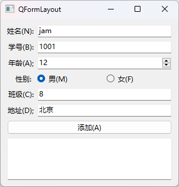
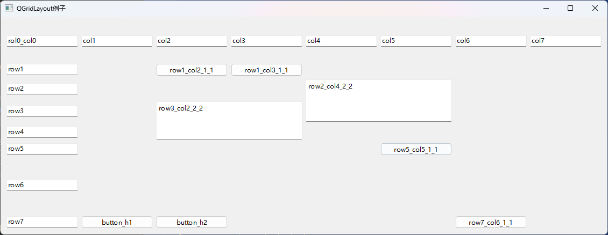
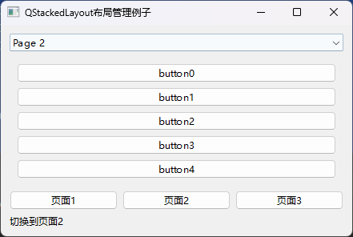

# 12.Layout布局

## 控件表单布局QFormLayout

表单布局QFormLayout 由左右两列和多行构成将控件放到左右两列中,通常左列放置QLabel 控件,右列放置 QLineEdit 控件QSpinBox 等输人控件,也可以让一个控件单独占据一行。表单布局支持嵌套。

表单布局QFormLayout 继承自QLayout,用QFormLayout类创建实例对象的方法如下所示,其中 parent 是窗口或容器类控件。

```python
from PySide6.QtWidgets import QFormLayout

QFormLayout(parent: Union[PySide6.QtWidgets.QWidget, NoneType]= None) -> None
```

### 表单布局QFormLayout 的常用方法

表单布局QFormLayout 的常用方法如表所示,主要方法介绍如下。

- 用addRow()方法在底部添加行,用insertRow()方法在中间插人行。addRow()和insertRow()方法是重构型方法,有多种不同的参数。

  - 用addRow(label.QWidget,field;QWidget)和addRow(label:QWidget;field;QLayout)方法在左列放置第1个QWidget,在右列放置第2个QWidget或 QLayout;
  - 用addRow(labelText:str,field:QWidget) addRow(labelText:str,field;QLayout)方法在左列创建标题是 str的 QLabel 控件,在右列放置QWidget或QLayout,这时新建的 QLabel和QWidget 或 QLayouthis 已经是伙伴关系;
  - 用addRow(widget:QWidget)和 addRow(layout;QLayout)方法把控件和布局放置到一行上,占据左右两列的位置。

- 水平和竖直方向的间距

  - 用setHorizontalSpacing(spacing:int) setVerticalSpacing(spacing:int)方法可以分别设置控件在水平和竖直方向的间距。

- 对齐方式

  - 用setLabelAlignment(Qt.Alignment)方法可以设置左列控件的文字对齐方式
  - 用setFormAlignment(Qt.Alignment)方法可以设置表单布局内控件的水平和竖直方向的对齐方式,其中参数Qt.Qlignment 可以取:
    - 水平方向的对齐方式
      - Qt.Alignleft
      - Qt.AlignRight
      - Qt.AlignHCenter
      - Qt.AlignJustify
    - 竖直方向的对齐方式有
      - Qt.AlignTop
      - Qt.AlignBottom
      - Qt.AlignVCenter
      - Qt.AlignBaseline。
    - Qt.AlignCenter 方式是水平和竖直都在中心。

- 左列控件和右列控件的换行策略

  - 用setRowWrapPolicy(QFormLayout,RowWrapPolicy)方法可以设置左列控件和右列控件的换行策略,参数QFormLayoutRowWrapPolicy :
    - 如果取QFormLayout.DontWrapRows,表示右列的输人控件(如QLieEdit、QSpinBox和QDoubleSpinBox)始终在左列标签控件的右边;
    - 如果取QFormLayout.WrapLongRows,表示如果左侧标签的标题文字很长标签所占据的空间会挤压右侧输人控件的空间,如果整行的空间不足以放置标签,则右侧的输入控件会放到下一行;
    - 如果取QFormLayout,WrapAllRows,表示左侧标签控件始终在右侧输入控件的上面。

- 设置可伸缩控件的伸缩方式

  - 用setFieldGrowthPolicy(QFormLayout, FieldGrowthPolicy)方法可以设置可伸缩控件的伸缩方式,右列的输人控件通常可以随着窗体的改变而改变,宽度是可调节的。参数QFormLayout.FieldGrowthPolicy:
    - 如果取QFormLayout.FieldsStayAtSizeHint,表示控件的伸缩量不会超过有效的范围,控件尺寸由sizeHint()方法获取的值设置;
    - 如果取QFormLayout,ExpandingFieldsGrow,则对于设置了水平setSizePolicy()属性或最小伸缩量的控件使其扩充到可以使用的空间,其他没有设置setSizePolicy()属性的控件在有效的范围内变化;
    - 如果取QFormLayout.AllNonFixedFieldsGrow,则对于设置了 setSizePolicy()属性的控件,使其扩充到可以使用的空间。
  - 设置控件随窗口大小改变时尺寸的变化方式
    - 用setSizeConstraint(QLayout,SizeConstraint)方法可以设置控件随窗口大小改变时尺寸的变化方式,这是从 QLayout 继承过来的方法。枚举类型参数 QLayout.SizeConstraint:
      - 如果取 QLayout,SetDefaultConstraint,表示控件的最小尺寸根据setMinimunSize(QSize)方法或setMinimunSize(int,int)方法设定的值确定;
      - 如果取QLayout.SetNoConstraint;表示控件尺寸的变化量不受限制;
      - 如果取QLayout.SetMinimumSize;表示将控件的尺寸设置成由控件的setMinimumSize()方法设定的尺寸值;
      - 如果取 QLayoutSetFixedSize,表示将控件的尺寸设置成由控件的sizeHint()方法获取的尺寸值;
      - 如果取QLayout;SetMaximumSize,表示将控件的尺寸设置成由控件的 setMaximumSize()方法设定的尺寸值;
      - 如果取QLayout.SetMinAndMaxSize,表示控件的尺寸可以在最小值和最大值之间变化。

  | QFormLayout的方法及参数类型                                  | 说 .明                                             |
  | ------------------------------------------------------------ | -------------------------------------------------- |
  | addRow(label: QWidget,field:QWidget)                         | 末尾添加行,两个控件分别在左右                      |
  | addRow(label:QWidget,field: QLayout)                         | 末尾添加行,控件在左,布局在右                       |
  | addRow(labelText: str,field:QWidget)                         | 末尾添加行,左侧创建名称为str的标签,右侧是控件      |
  | addRow(labelText: str,field:QLayout)                         | 末尾添加行,左侧创建名称为str的标签,右侧是布局      |
  | addRow(widget: QWidget)                                      | 末尾添加行,只有1个控件,控件占据左右两列            |
  | addRow(layout: QLayout)                                      | 末尾添加行,只有:1个布局,布局占据左右两列           |
  | insertRow(row:int,QWidget,QWidget)                           | 在第row行插人,两个控件分别在左右                   |
  | insertRow(row:int,QWidget,QLayout)                           | 在第row行插人,控件在左,布局在右                    |
  | insertRow(row:int,str,QWidget)                               | 在第row行插人,左侧创建名称为 str的标签,右侧是控件  |
  | insertRow(row:int,str,QLayout)                               | 在第row行插人,左侧创建名称为str的标签,右侧是布局   |
  | insertRow(row:int,QWidget)                                   | 在第row行插入,只有1个控件,控件占据左右两列         |
  | insertRow(row:int,QLayout)                                   | 在第row行插入,只有1个布局,布局占据左右两列         |
  | removeRow(row:int)                                           | 删除第row行及其控件 .                              |
  | removeRow(layout:QLayout)                                    | 删除布局                                           |
  | removeRow(widget:QWidget)                                    | 删除控件                                           |
  | setHorizontalSpacing(spacing:int)                            | 设置水平方向的间距                                 |
  | setVerticalSpacing(spacing: int)                             | 设置竖直方向的间距                                 |
  | setRowWrapPolicy(QFormLayout RowWrapPolicy)                  | 设置左列控件和右列控件的换行策略                   |
  | rowCount()                                                   | 返回表单布局中行的数量                             |
  | setLabelAlignment(Qt.Alignment)                              | 设置左列的对齐方法                                 |
  | setFormAlignment(Qt.Alignment)                               | 设置控件在表单布局中的对齐方法                     |
  | setContentsMargins(int,int,int,int) setContentsMargins(QMargins) | 设置布局内的控件与布局外边界的左、上、右、下的距离 |
  | setFieldGrowthPolicy(QFormLayout FieldGrowthPolicy)          | 设置可伸缩控件的伸缩方式                           |
  | setSizcConstraint(QLayout.SizeConstraint)                    | 设置控件随窗口大小改变时尺寸的变化方式             |

### 表单布局QFormLayout 的应用实例

下面的程序在窗口中用表单布局建立一些控件的布局,用于输人一些基本信息,程序运行界面如图所示。



```python
from PySide6.QtWidgets import(QApplication, QWidget, QLineEdit, QSpinBox, QLabel, QTextBrowser, QFormLayout, QRadioButton, QHBoxLayout, QPushButton)
from PySide6.QtCore import Qt
import sys


class myWindow(QWidget):
    def __init__(self):
        super().__init__()
        self.setWindowTitle("QFormLayout")
        self.resize(300, 200)
        self.setupUi()

    def setupUi(self):
        formLayout = QFormLayout(self)

        name = QLabel("姓名(&N):")
        self.name_lineEdit = QLineEdit()
        name.setBuddy(self.name_lineEdit)
        formLayout.addRow(name, self.name_lineEdit)  # 添加行

        number = QLabel("学号(&B):")
        self.number_lineEdit = QLineEdit()
        number.setBuddy(self.number_lineEdit)  # 定义伙伴关系
        formLayout.addRow(number, self.number_lineEdit)  # 添加行

        self.age_spinBox = QSpinBox()
        formLayout.addRow("年龄(&A);", self.age_spinBox)  # 添加行
        self.male_radioButton = QRadioButton("男(&M)")
        self.male_radioButton.setChecked(True)
        self.female_radioButton = QRadioButton("女(&F)")

        h_layout = QHBoxLayout()
        h_layout.addWidget(self.male_radioButton)
        h_layout.addWidget(self.female_radioButton)
        formLayout.addRow("性别: ", h_layout)  # 添加行
        self.append_btn = QPushButton("添加(&A)")
        formLayout.addRow(self.append_btn)  # 添加行
        self.address_lineEdit = QLineEdit()
        formLayout.insertRow(4, "地址(&D);", self.address_lineEdit)  # 插人行

        self.class_lineEdit = QLineEdit()
        formLayout.insertRow(4, "班级(&C):", self.class_lineEdit)  # 插人行
        self.textBrowser = QTextBrowser()
        formLayout.addRow(self.textBrowser)  # 添加行,按钮单独占据一行
        formLayout.setLabelAlignment(Qt.AlignRight)  # 对齐方式

        self.append_btn.clicked.connect(self.append_clicked)  # 信号与槽函数的连接

    def append_clicked(self):
        sex = "男"
        if self.female_radioButton.isChecked():
            sex = "女"
            template = "姓名:{} 学号:{} 年龄:{} 性别:{} 班级:{} 地址:{}"
            self.textBrowser.append(template.format(self.name_lineEdit.text(),
                                                    self.number_lineEdit.text(),
                                                    self.age_spinBox.value(),
                                                    sex,
                                                    self.class_lineEdit.text(),
                                                    self.address_lineEdit.text()))


if __name__ == '__main__':
    app = QApplication(sys.argv)
    win = myWindow()

    win.show()
    sys.exit(app.exec())

```

## 盒子布局QBoxLayout

QBoxLayout 占用它获得的空间(来自其父布局或 parentWidget())，将其划分为一排框，并使每个托管小部件填充一个框。


如果QBoxLayout的方向是将框放置在一行中，大小合适。每个小部件(或其他盒子)将至少获得其最小尺寸，最多获得其最大尺寸。任何多余的空间都会根据拉伸系数进行共享(详细信息如下)。


如果QBoxLayout的方向是垂直，则框被放置在一列中，同样具有合适的尺寸。

创建QBoxLayout的最简单方法是使用其中一个便利类，例如QHBoxLayout(用于盒子)或QVBoxLayout。您也可以直接使用QBoxLayout构造函数，将其方向指定


建议使用QVBoxLayout和QBoxLayout，而不是QBoxLayout，因为它们的构造函数很方便。

### 构造

```python
from PySide6.QtWidgets import QBoxLayout

QBoxLayout(Direction: PySide6.QtWidgets.QBoxLayout.Direction, 
           parent: Union[PySide6.QtWidgets.QWidget, NoneType] = None) -> None
```

使用direction和parent widget.dirparent构建一个新的QBoxLayout
布局直接设置为的顶级布局。一个小部件只能有一个顶层布局。由layout() parent返回

- Direction:PySide6.QtWidgets.QBoxLayout.Direction

  此类型用于确定长方体布局的方向。

  | 方向                   | 描述           |
  | ---------------------- | -------------- |
  | QBoxLayout.LeftToRight | 从左到右水平。 |
  | QBoxLayout.RightToLeft | 从右向左水平。 |
  | QBoxLayout.TopToBottom | 从上到下垂直。 |
  | QBoxLayout.BottomToTop | 从下到上垂直。 |

### 方法

- 添加布局或组件

  如果QBoxLayout不是顶级布局(即它没有管理小部件的所有区域和子级)，则必须先将其添加到其父布局中，然后才能对其执行任何操作。

  - 添加布局的正常方法是调用parentLayout.addLayout(QBoxLayout)
  - 完成此操作后，您可以使用以下四个功能之一将方框添加到QBoxLayout：
    - `addWidget()`将一个小部件添加到QBoxLayout并设置小部件的拉伸因子。(拉伸因子沿着一排方框。)
    - `addSpacing()`:创建一个空框；这是您用来创建漂亮而宽敞的对话框的功能之一。有关设置边距的方法，请参见下文。
    - `addStretch()`:以创建一个空的、可拉伸的框。
    - `addLayout()`:将包含另一个QLayout的框添加到行中，并设置该布局的拉伸因子。

- 指定位置插入

  - 使用insertWidget()、insertSpacing()、insertStretch()或insertLayout()在布局中的指定位置插入框。

- QBoxLayout还包括两种边距宽度：

  - `setContentsMargins()`:设置小部件每一侧的外部边界的宽度。这是沿着QBoxLayout的四条边中的每一条保留空间的宽度。
  - `setSpacing()`:设置相邻方框之间的宽度。(您可以使用addSpacing()在特定位置获得更多空间。)
  - 默认边距由样式提供。大多数Qt样式指定的默认边距对于子窗口小部件是9，对于窗口是11。
  - 间距默认与顶层布局的页边距相同，或与父布局相同。

- 要从布局中删除小部件

  - 调用removeWidget()
  - 在小部件上调用hide()也可以有效地将小部件从布局中删除，直到调用show()为止。

| 方法                                                         | 参数                                                         | 描述                                                         |
| ------------------------------------------------------------ | ------------------------------------------------------------ | ------------------------------------------------------------ |
| `addLayout(layout[, stretch=0])`                             | layout – PySide6.QtWidgets.QLayout<br/>stretch – int         | 添加到框的末尾，使用序列拉伸因子。布局拉伸                   |
| `addSpacerItem(spacerItem)`                                  | spacerItem – PySide6.QtWidgets.QSpacerItem                   | 添加到此方框布局的末尾。spacerItem                           |
| `addSpacing(size)`                                           | size – int                                                   | 将大小为的不可拉伸空间(QSpacerItem)添加到此方框布局的末尾。QBoxLayout提供默认的边距和间距。此函数可添加额外的空间。size |
| `addStretch([stretch=0])`                                    | stretch – int                                                | 将最小大小和拉伸因子为零的可拉伸空间(QSpacerItem)添加到此方框布局的末尾。stretch |
| `addStrut(arg__1)`                                           | arg__1 – int                                                 | 将盒子的垂直尺寸(例如，如果盒子是的话，高度)限制在最小值。其他限制可能会增加限制。左到右尺寸 |
| `addWidget(arg__1[, stretch=0[, alignment=Qt.Alignment()]])` | arg__1 – PySide6.QtWidgets.QWidget<br/>stretch – int<br/>alignment – Alignment | 添加到此方框布局的末尾，拉伸因子为，对齐方式为。widgetstretchalignment<br/>拉伸因子仅适用于QBoxLayout的方向，并且相对于该QBoxLayout中的其他框和小部件。拉伸系数越高的小工具和盒子越长。<br/>如果拉伸因子为0，并且QBoxLayout中的任何其他控件的拉伸因子都不大于零，则空间将根据所涉及的每个小部件的QWidget:sizePolicy()进行分配。<br/>路线由指定。默认对齐方式为0，这意味着小部件填充整个单元格。对齐 |
| `direction()`                                                | RETURN TYPE Direction                                        | 返回长方体的方向。addWidget()和addSpacing()朝着这个方向工作；拉伸向这个方向伸展。 |
| `insertItem(index, arg__2)`                                  | index – int<br/>arg__2 – PySide6.QtWidgets.QLayoutItem       | 插入到此方框布局中的位置。如果为负，则将该项添加到末尾       |
| `insertLayout(index, layout[, stretch=0])`                   | index – int<br/><br/>layout – PySide6.QtWidgets.QLayout<br/><br/>stretch – int | 插入位置，带拉伸因子。如果为负数，则在末尾添加布局。layoutinedexstretchindex<br/>布局成为长方体布局的子级。 |
| `insertSpacerItem(index, spacerItem)`                        | index – int<br/><br/>spacerItem – PySide6.QtWidgets.QSpacerItem | 插入位置，最小尺寸和拉伸系数为零。如果为负数，则在末尾添加空格。spacerItemindexindex |
| `insertSpacing(index, size)`                                 | index – int<br/><br/>size – int                              | 在位置插入不可拉伸的空格(QSpacerItem)，大小为。如果为负数，则在末尾添加空格。indexsizeindex<br/>方框布局具有默认的边距和间距。此功能增加了额外的空间。 |
| `insertStretch(index[, stretch=0])`                          | index – int<br/><br/>stretch – int                           | 在最小大小和拉伸因子为零的位置插入可拉伸空间(QSpacerItem)。如果为负数，则在末尾添加空格。indexstretchindex |
| `insertWidget(index, widget[, stretch=0[, alignment=Qt.Alignment()]])` | index – int<br/><br/>widget – PySide6.QtWidgets.QWidget<br/><br/>stretch – int<br/><br/>alignment – Alignment | 插入位置，带拉伸因子和对齐方式。如果为负数，则在末尾添加小部件。idgetindexstretchalignmentindex<br/>拉伸因子仅适用于QBoxLayout的方向，并且相对于该QBoxLayout中的其他框和小部件。拉伸系数越高的小工具和盒子越长。<br/>如果拉伸因子为0，并且QBoxLayout中的任何其他控件的拉伸因子都不大于零，则空间将根据所涉及的每个小部件的QWidget:sizePolicy()进行分配。<br/>路线由指定。默认对齐方式为0，这意味着小部件填充整个单元格。对齐 |
| `setDirection(arg__1)`                                       | arg__1 – Direction                                           | 将此布局的方向设置为.direction                               |
| `setStretch(index, stretch)`                                 | index – int<br/><br/>stretch – int                           | 设置位置处的拉伸因子。到.indexstretch                        |
| `setStretchFactor(l, stretch)`                               | l – PySide6.QtWidgets.QLayout<br/><br/>stretch – int<br /><br />RETURN TYPE bool | 这是一个重载函数。<br/>将布局的拉伸因子设置为，如果在此布局中找到，则返回(不包括子布局)；否则返回.layoutstretchtrue.layoutfalse |
| `setStretchFactor(w, stretch)`                               | w – PySide6.QtWidgets.QWidget<br/><br/>stretch – int<br/><br/>RETURN TYPE bool | 将的拉伸因子设置为，如果在此布局(不包括子布局)中找到，则返回true；否则返回.widgetstretchwidgetfalse |
| `stretch(index)`                                             | PARAMETERS<br/>index – int<br/><br/>RETURN TYPE<br/>int      | 返回位置.index处的拉伸因子                                   |

## 水平布局QHBoxLayout和竖直布局QVBoxLayout

表单布局QFormLayout 可把多个控件分成两列多行

水平布局QHBoxLayout只能把多个控件水平排列成一行,竖直布局 QVBoxLayout 只能把多个控件竖直排列成一列。

### 构造方法

QHBoxLayout和QVBoxLayout 是从QBoxLayout.类继承而来的。

用QHBoxLayout类和QVBoxLayout类创建水平布局和竖直布局对象的方法如下所示其中parent是窗口或容器类控件。

```python
from PySide6.QtWidgets import QHBoxLayout, QVBoxLayout

QHBoxLayout(self) -> None
QHBoxLayout(parent: PySide6.QtWidgets.QWidget) -> None


QVBoxLayout(self) -> None
QVBoxLayout(parent: PySide6.QtWidgets.QWidget) -> None
```

### 常用方法

水平布局QHBoxLayout 和竖直布局QVBoxLayout 使用从父类QBoxLayout 继承的方法,常用方法如表所示,主要方法介绍如下。

- 添加控件和子布局
  - 用addWidget(QWidget,stretch:int =0, Qt.Alignment)方法和 addLayout(QLayout,stretch;int=0)方法可在末尾添加控件和子布局,其中参数 stretch 是布局内部各控件和子布局的相对伸缩系数,相对伸缩系数取整数,同时可以指定控件的对齐方式Qt.Alignment;
  - 用insertWidget(index:int,QWidget,stretch:int=0,Qt.Alignment)方法和insertLayout(index:int,QLayout,stretch:int=0)方法可以在指定的索引位置插人控件和子布局。
- 插入占位符
  - 用addSpacing(size:int)方法和insertSpacing(index:int,size:int)方法可以在未尾添加或在某个位置插人固定长度的占位空间;
  - 用addStretch(stretch:int =0)方法或insertStretch(index:int,stretch:int=0)方法可以在末尾添加或在某个位置插入可以伸缩的占位空间;
- 设置最小宽高
  - 用addStrut(int)方法可以设置水平布局在竖直方向的最小高度,也可设置竖直布局在水平方向的最小宽度。
- 设置布局方向
  - 用setDirection(QBoxLayout.Direction)方法可以设置布局的方向.例如把水平布局改变成竖直布局,参数QBoxLayout,Direction 可以取:
    - QBoxLayout.LeftToRight(从左到右水平布局)
    - QBoxLayout.RightToLeft(从右到左水平布局)
    - QBoxLayout.TopToBottom(从上到下竖直布局)
    - QBoxLayout.BottomToTop(从下到上竖直布局)

| QHBoxLayoui或QVBoxLayout的方法及参效类型                     | 说 明                                     |
| ------------------------------------------------------------ | ----------------------------------------- |
| addWidger(Qwidget, stretch: int= 0, Qt.Alignment)            | 添加控件,可设置伸缩系数和对齐方式         |
| addLayout(QLayout.stretch:int=0)                             | 添加子布局,可设置伸缩系数                 |
| addSpacing(size:int)                                         | 添加固定长度的占位空间                    |
| addStretch(stretch:int=0)                                    | 添加可伸缩空间                            |
| addStrut(int)                                                | 指定垂向最小值                            |
| insertWidget(index: int, QWidget.stretch: int=0, Qt.Alignment) | 根据索引插入控件,可设置伸缩系数和对齐方式 |
| insertLayout(index: int,QLayout.stretch:int=0)               | 根据索引插人子布局,可设置伸缩系数         |
| insertSpacing(index: int,size:int)                           | 根据索引插入固定长度的占位空间            |
| insertStretch(index:int,stretch:int=0)                       | 根据索引插入可伸缩的空间                  |
| count()                                                      | 获取控件、布局和占位空间的数量            |
| maximumSize()                                                | 获取最大尺寸                              |
| minimumSize()                                                | 获取最小尺寸                              |
| setDirection(QBoxLayout.Direction)                           | 设置布局的方向                            |
| setGeometry(QRect)                                           | 设置左上角位置和宽度、高度                |
| setSpacing(spacing:int)                                      | 设置布局内部控件之间的间隙                |
| spacing()                                                    | 获取内部控件之间的间隙                    |
| setStretch(index: int,stretch; int)                          | 根据索引设置控件或布局的伸缩系数          |
| stretch(index: int)                                          | 获取第int 个控件的伸缩比例系数            |
| setStretchFactor(QWidget,stretchi int)                       | 给控件设置伸缩系数,成功则返回True         |
| setStretchFactor(QLayout.stretch；int)                       | 给布局设置伸缩系数、成功则返回True        |
| setContentsMargins(int,int,int,int)<br />setContentsMargins(margins; QMargins) | 设置布局内的控件与边框的页边距            |
| setSizeConstraint(QLayout, SizeConstraint)                   | 设置控件随窗口尺寸改变时的变化方式        |

### QVBoxLayout、QHBoxLayout例子

```python
# -*- coding: UTF-8 -*-
# File date: Hi_2023/2/28 23:03
# File_name: 01-QVBoxLayout、QHBoxLayout.py


import sys
from PySide6.QtWidgets import QWidget, QVBoxLayout, QBoxLayout, QLabel, QApplication


# 除名称、方向外，和父类QBoxLayout完全一致
# 甚至可以通过 setDirection() 方法把水平布局和垂直布局互换


class Window(QWidget):
    def __init__(self):
        super().__init__()
        self.setWindowTitle("QVBoxLayout")
        self.resize(500, 500)
        self.move(400, 250)
        self.setup_ui()

    def setup_ui(self):
        v_layout = QVBoxLayout()
        self.setLayout(v_layout)
        v_layout.setDirection(QBoxLayout.BottomToTop)
        # v_layout.setDirection(QBoxLayout.RightToLeft)  # 甚至可以改变为水平布局

        lb1 = QLabel("lb1")
        lb1.setStyleSheet("background-color: cyan;")
        lb2 = QLabel("lb2")
        lb2.setStyleSheet("background-color: orange;")

        v_layout.addWidget(lb1)
        v_layout.addWidget(lb2)


if __name__ == "__main__":
    app = QApplication(sys.argv)

    window = Window()
    window.show()

    sys.exit(app.exec())

```


## 格栅布局QGridLayout

格栅布局QGridLayout(或称为网格布局)提供多行多列的布局位置,可以把控件或子布局放到这些布局节点上,也可以让一个控件或子布局占用多行多列的布局位置。

### 构造方法

QGridLayout继承自QLayout。用QGridLayout类创建实例对象的方法如下所示,其中parent 是窗口或容器类控件。

```python
from PySide6.QtWidgets import QGridLayout

QGridLayout(parent: Union[PySide6.QtWidgets.QWidget, NoneType]= None) -> None
```

### 格栅布局QGridLayout 的常用方法

格栅布局QGridLayout 的常用方法如表所示,主要方法介绍如下

- 添加添加控件和子布局控件
  - 用addWidget(QWidget)方法可以在格栅布局第1列的末尾添加控件;
  - 用addWidget(QWidget,row,column[,Qt.Alignment])方法和 addLayout(QLayout,row,column[,Qt.Alignment])方法可以在指定行和指定列添加控件和子布局,同时可选是否指定控件的对齐方式;
  - 用addWidget(QWidget,row,column,rowspan,column_span[,Qt.Alignment])方法和addLayout(row,column,row_span,column_span[,Qt.Alignment])方法可以在指定行和指定列处添加控件和子布局控件和子布局可以跨多行多列。
- 缩放系数
  - 用setRowStretch(row,stretch)方法和 setColumnStretch(column,stretch)方法可以设置行和列的相对缩放系数。
- 行列间距
  - 用setHorizontalSpacing(int)和 setVerticalSpacing(int)方法可以分别设置行之间的距离和列之间的距离
  - 用setSpacing(int)方法可以同时设置行列之间的距离

| QGridLayout 的方法及参数类型                                 | 说 明                                              |
| ------------------------------------------------------------ | -------------------------------------------------- |
| addWidget(QWidget)                                           | 在第1列的末尾添加控件                              |
| addWidget(QWidget,row:int, column:int, Qt.Alignment)         | 在指定的行列位置添加控件                           |
| addWidget(QWidget, row:int, column: int, rowSpan: int,columnSpan:int,Qt.Alignment) | 在指定的行列位置添加控件,控件可以设置成跨多 行多列 |
| addLayout(QLayout, row:int, column:int,Qt.Alignment)         | 添加子布局                                         |
| addLayout(QLayout, row:int,column:int, rowSpan:int,columnSpan:int,Qt.Alignment) | 添加子布局                                         |
| setRowStretch(row:int,stretch;int)                           | 设置行的伸缩系数                                   |
| setColumnStretch(column:int,stretch；int)                    | 设置列的伸缩系数                                   |
| setHorizontalSpacing(spacing:int)                            | 设置控件的水平间距                                 |
| setVerticalSpacing(spacing:int)                              | 设置控件的竖直间距                                 |
| setSpacing(spacing:int)                                      | 设置控件的水平和竖直间距                           |
| rowCount()                                                   | 获取行数                                           |
| columnCount()                                                | 获取列数                                           |
| setRowMinimumHeight(row:int,minSize:int)                     | 设置行最小高度                                     |
| setColumnMinimumWidth(column:int,minSize: int)               | 设置列最小宽度                                     |
| setGeomelry(QRect)                                           | 设置格栅布局的位置和尺寸                           |
| setContentsMargins(left:int,top:int,right: int, bottom:int)<br />setContentsMargins(margins: QMargins) | 设置布局内的控件与边框的页边距                     |
| setSizeConstraint(QLayout.SizeConstraint)                    | 设置控件随窗口尺寸改变时的变化方式                 |
| cellRect(row:int,column:int)                                 | 获取单元格的矩形区域 QRect                         |


### 格栅布局QGridLayout例子



```python
import sys
from PySide6.QtWidgets import QApplication, QWidget, QGridLayout, QPushButton, QSpacerItem, QSizePolicy, QHBoxLayout, QLineEdit, QPlainTextEdit


class GridLayoutDemo(QWidget):
    def __init__(self, parent=None):
        super(GridLayoutDemo, self).__init__(parent)
        grid = QGridLayout()
        self.setLayout(grid)

        # 添加行列标识
        for i in range(1, 8):
            rowEdit = QLineEdit('row%d' %(i))
            rowEdit.setReadOnly(True)
            grid.addWidget(rowEdit, i, 0)
            colEdit = QLineEdit('col%d' %(i))
            colEdit.setReadOnly(True)
            grid.addWidget(colEdit, 0, i)
        col_rol_Edit = QLineEdit('rol0_col0')
        col_rol_Edit.setReadOnly(True)
        grid.addWidget(col_rol_Edit, 0, 0, 1, 1)

        # 开始表演
        spacer = QSpacerItem(100, 70, QSizePolicy.Maximum)
        grid.addItem(spacer, 0, 0, 1, 1)
        grid.addWidget(QPushButton('row1_col2_1_1'), 1, 2, 1, 1)
        grid.addWidget(QPushButton('row1_col3_1_1'), 1, 3, 1, 1)
        grid.addWidget(QPlainTextEdit('row2_col4_2_2'), 2, 4, 2, 2)
        grid.addWidget(QPlainTextEdit('row3_col2_2_2'), 3, 2, 2, 2)
        grid.addWidget(QPushButton('row5_col5_1_1'), 5, 5, 1, 1)
        spacer2 = QSpacerItem(100, 100, QSizePolicy.Maximum)
        grid.addItem(spacer2, 6, 5, 1, 2)
        grid.addWidget(QPushButton('row7_col6_1_1'), 7, 6, 1, 1)

        hlayout = QHBoxLayout()
        hlayout.addWidget(QPushButton('button_h1'))
        hlayout.addWidget(QPushButton('button_h2'))
        grid.addLayout(hlayout, 7, 1, 1, 2)

        grid.setColumnStretch(5, 1)
        grid.setColumnStretch(2, 1)
        grid.setColumnMinimumWidth(0, 80)

        self.move(300, 150)
        self.setWindowTitle('QGridLayout例子')


if __name__ == "__main__":
    app = QApplication(sys.argv)
    demo = GridLayoutDemo()
    demo.show()
    sys.exit(app.exec())

```


## 层次布局QStackedLayout

[`QStackedLayout`](https://doc.qt.io/qtforpython/PySide6/QtWidgets/QStackedLayout.html#PySide6.QtWidgets.PySide6.QtWidgets.QStackedLayout) 类提供了一堆小部件，其中一次只有一个小部件可见。

[`QStackedLayout`](https://doc.qt.io/qtforpython/PySide6/QtWidgets/QStackedLayout.html#PySide6.QtWidgets.PySide6.QtWidgets.QStackedLayout)可用于创建类似于[`QTabWidget`](https://doc.qt.io/qtforpython/PySide6/QtWidgets/QTabWidget.html#PySide6.QtWidgets.PySide6.QtWidgets.QTabWidget)提供的用户界面。还有一个建立在[`QStackedLayout`](https://doc.qt.io/qtforpython/PySide6/QtWidgets/QStackedLayout.html#PySide6.QtWidgets.PySide6.QtWidgets.QStackedLayout)之上的[`方便的QStackedWidget`](https://doc.qt.io/qtforpython/PySide6/QtWidgets/QStackedWidget.html#PySide6.QtWidgets.PySide6.QtWidgets.QStackedWidget)类。

[`QStackedLayout`](https://doc.qt.io/qtforpython/PySide6/QtWidgets/QStackedLayout.html#PySide6.QtWidgets.PySide6.QtWidgets.QStackedLayout)可以用许多子小部件(“页面”)填充。例如：

```python
firstPageWidget = QWidget()
secondPageWidget = QWidget()
thirdPageWidget = QWidget()
stackedLayout = QStackedLayout()
stackedLayout.addWidget(firstPageWidget)
stackedLayout.addWidget(secondPageWidget)
stackedLayout.addWidget(thirdPageWidget)
mainLayout = QVBoxLayout()        mainLayout.addLayout(stackedLayout)
setLayout(mainLayout)
```


```python
from PySide6.QtWidgets import QStackedLayout

QStackedLayout(self) -> None
QStackedLayout(parent: PySide6.QtWidgets.QWidget) -> None
QStackedLayout(parentLayout: PySide6.QtWidgets.QLayout) -> None
```

- parentLayout – PySide6.QtWidgets.QLayout
- parent – PySide6.QtWidgets.QWidget

构造一个没有父级的 QStackedLayout。此QStackedLayout必须稍后安装在小部件上才能生效。

构造一个新的 QStackedLayout 并将其插入到给定的 parentLayout，使用给定的 parent，此布局将自行安装在控件上，parent管理其子项的几何图形。


### 方法

QStackedLayout没有为用户提供切换页面的内在方法。这通常是通过QComboBox或QListWidget来完成的，QListWidget存储QStackedLayout页面的标题。


- 填充布局时，微件将添加到内部列表中。
  - indexOf() 函数返回该列表中小部件的索引。
  - 可以使用addWidget()函数将小部件添加到列表的末尾，也可以使用 insertWidget() 函数插入给定索引处。
  - removeWidget() 函数从布局中删除给定索引处的小部件。
  - 布局中包含的小部件数量可以使用count()函数获得。
- widget() 函数返回给定索引位置的小部件。
- 屏幕上显示的小部件的索引由currentIndex()给出，可以使用setCurrentIndex()进行更改。
  - 以类似的方式，可以使用currentWidget()函数检索当前显示的小部件，并使用setCurrentWidget()函数进行更改。
- 每当布局中的当前小部件发生更改或从布局中删除小部件时，都会分别发出 currentChanged() 和 widgetRemoved() 信号。

| 方法                            | 参数                                                         | 描述                                                         |
| ------------------------------- | ------------------------------------------------------------ | ------------------------------------------------------------ |
| `currentIndex()`                | RETURN TYPE<br/>int                                          | 此属性保存可见小部件的索引位置。<br/>如果没有当前小部件，则当前索引为-1。 |
| `currentWidget()`               | PySide6.QtWidgets.QWidget                                    | 返回当前小部件，或者如果此布局中没有小部件。无               |
| `insertWidget(index, w)`        | index – int<br/><br/>w – PySide6.QtWidgets.QWidget<br/><br/>RETURN TYPE<br/>int | 在此QStackedLayout中的给定位置插入给定。如果超出范围，则附加小部件(在这种情况下，返回的是的实际索引)<br/>如果在调用此函数之前，QStackedLayout为空，则给定的将成为当前的小部件.widget<br/>在小于或等于当前索引的索引处插入新的小部件将增加当前索引，但保留当前小部件。 |
| `setStackingMode(stackingMode)` | stackingMode – StackingMode                                  | 此属性确定处理子窗口小部件可见性的方式。。<br/>默认值为。将属性设置为允许您使用覆盖窗口小部件的布局，这些窗口小部件在其他窗口小部件(例如图形编辑器)上进行额外绘制。StackOneStackAll |
| `stackingMode()`                | RETURN TYPE<br/>StackingMode                                 | 此属性确定处理子窗口小部件可见性的方式。。<br/>默认值为。将属性设置为允许您使用覆盖窗口小部件的布局，这些窗口小部件在其他窗口小部件(例如图形编辑器)上进行额外绘制。StackOneStackAll |
| `widget(arg__1)`                | PARAMETERS<br/>arg__1 – int<br/><br/>RETURN TYPE<br/>PySide6.QtWidgets.QWidget | 返回给定位置的小部件，或者如果给定位置没有小部件，则返回。index无 |
| `[Slots]setCurrentIndex(index)` | index – int                                                  | 此属性保存可见小部件的索引位置。<br/>如果没有当前小部件，则当前索引为-1。 |
| `[Slots]setCurrentWidget(w)`    | w – PySide6.QtWidgets.QWidget                                | 将当前小部件设置为指定的。新的当前小部件必须已包含在此堆叠布局中。小部件 |

PySide6.QtWidgets.QStackedLayout.StackingMode：

| 显示模式                | 描述                                   |
| ----------------------- | -------------------------------------- |
| QStackedLayout.StackOne | 只有当前小部件可见。这是默认设置。     |
| QStackedLayout.StackAll | 所有小部件都可见。当前小部件仅被提升。 |

### 实例



```python
# -*- coding: utf-8 -*-


import sys
from PySide6.QtWidgets import *


class StackedLayoutDemo(QWidget):
    def __init__(self, parent=None):
        super(StackedLayoutDemo, self).__init__(parent)
        self.setWindowTitle("QStackedLayout布局管理例子")
        self.resize(400, 100)
        layout = QVBoxLayout()
        self.setLayout(layout)

        # 添加页面导航
        pageComboBox = QComboBox()
        pageComboBox.addItem("Page 1")
        pageComboBox.addItem("Page 2")
        pageComboBox.addItem("Page 3")
        layout.addWidget(pageComboBox)

        # 添加QStackedLayout
        stackedLayout = QStackedLayout()
        layout.addLayout(stackedLayout)

        # 添加页面1-3
        pageWidget1 = QWidget()
        layout1 = QHBoxLayout()
        pageWidget1.setLayout(layout1)
        stackedLayout.addWidget(pageWidget1)
        pageWidget2 = QWidget()
        layout2 = QVBoxLayout()
        pageWidget2.setLayout(layout2)
        stackedLayout.addWidget(pageWidget2)
        pageWidget3 = QWidget()
        layout3 = QFormLayout()
        pageWidget3.setLayout(layout3)
        stackedLayout.addWidget(pageWidget3)

        # 设置页面1-3
        for i in range(5):
            layout1.addWidget(QPushButton('button%d' % i))
            layout2.addWidget(QPushButton('button%d' % i))
            layout3.addRow('row%d' % i, QPushButton('button%d' % i))

        # 导航与页面链接
        pageComboBox.activated.connect(stackedLayout.setCurrentIndex)

        # 添加按钮切换导航页1-3
        buttonLayout = QHBoxLayout()
        layout.addLayout(buttonLayout)
        button1 = QPushButton('页面1')
        button2 = QPushButton('页面2')
        button3 = QPushButton('页面3')
        buttonLayout.addWidget(button1)
        buttonLayout.addWidget(button2)
        buttonLayout.addWidget(button3)
        button1.clicked.connect(lambda: stackedLayout.setCurrentIndex(0))
        button2.clicked.connect(lambda: stackedLayout.setCurrentWidget(pageWidget2))
        button3.clicked.connect(lambda: stackedLayout.setCurrentIndex(2))

        label = QLabel('显示信息')
        layout.addWidget(label)
        stackedLayout.currentChanged.connect(lambda x: label.setText('切换到页面%d' %(x + 1)))


if __name__ == "__main__":
    app = QApplication(sys.argv)
    form = StackedLayoutDemo()
    form.show()
    sys.exit(app.exec())

```


### 信号

| 信号                            | 描述                                                         |
| ------------------------------- | ------------------------------------------------------------ |
| `[Signal]currentChanged(index)` | **index** – int<br />每当布局中的当前窗口小部件发生变化时，就会发出此信号。指定新的当前小部件的索引，如果没有新的小部件，则指定-1(例如，如果QStackedLayoutidex中没有小部件) |
| `[Signal]widgetRemoved(index)`  | **index** – int<br />每当小部件从布局中移除时，就会发出此信号。小部件的作为parameter.index传递 |

