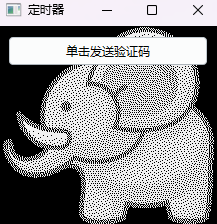
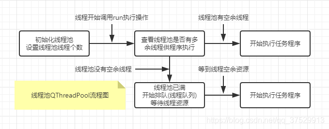

# 14.多线程、线程池、定时器

在一般情况下，应用程序都是单线程运行的，但是对于 GUI程序来说，单线程有时满足不了需求。

例如，如果需要执行一个特别耗时的操作，在执行过程中整个程序就会卡顿，此时用户可能以为程序出错，所以就把程序关闭了;

或者 Widows 系统也认为程序出错，自动关闭程序。要解决这种问题就涉及多线程的知识。

一般来说，多线程技术涉及3种方法:

- 一是使用计时器模块QTimer
- 二是使用多线程模块QThread
- 三是使用事件处理功能。

## 定时器QTimer

定时器 QTimer 像个闹钟,其作用是经过一个固定的时间间隔发送一个信号,执行与信号连接的槽函数,实现自动完成某些功能。

可以设置定时器只发送一次信号,或多次发送信号;

可以启动发送信号,也可以停止发送信号。


用QTimer 创建定时器的方法如下所示,其中parent 是继承自QObejct 的对象。QTimer 是不可见的,当父类删除时,定时器也同时删除。

```python
from PySide6.QtCore import QTimer

QTimer(parent: Union[PySide6.QtCore.QObject, NoneType]= None) -> None
```

如果要在应用程序中周期性地执行某个操作，如周期性地检测主机的 CPU值，则需要使用QTimer(定时器)，QTimer 类提供了重复的和单次的定时器。

要使用定时器，需要先创建一个QTimer实例，将其 timeout 信号连接到相应的槽，并调用start()函数。

然后定时器会以恒定的间隔发射 timeout 信号。start(2000)表示设置时间间隔为2秒并启动定时器，代码如下:

```python
from PySide6.QtCore import QTimer

# 初始化一个定时器
self.timer = QTimer(self)
# 计时结束并调用 operate()
# 设置时间间隔并启动定时器
self.timer.timeout.connect(self.operate)
self.timer.start(2000)
```

在默认情况下，isSingleShot0返回 False，如果返回 True，则计时器信号只会触发一次，可以通过 setSingleShot(True)修改默认值

计时器的另一种使用方法是延迟计时，这种方法要使用 sigleShot 信号(前者是timeout 信号)，如 singleShot(5000,receiver)表示5 秒之后会触发 receiver 信号。


### 定时器QTimer的常用方法

定时器QTimer的常用方法如表所示,主要方法介绍如下

| QTimer的方法及参数类型                                       | 返回值的类型 | 说明                                                         |
| ------------------------------------------------------------ | ------------ | ------------------------------------------------------------ |
| setInterval(msec:int)                                        | None         | 设置信号发送的时间间隔(毫秒)                                 |
| interval()                                                   | int          | 获取信号发送的时间间隔(毫秒)                                 |
| isActive()                                                   | bool         | 获取定时器是否激活                                           |
| remainingTime()                                              | int          | 获取距下次发送信号的时间(毫秒)                               |
| setSingleShot(bool)                                          | None         | 设置定时器是否为单次发送                                     |
| isSingleShot()                                               | bool         | 获取定时器是否为单次发送                                     |
| setTimerType(atype: Qt.TimerType)                            | None         | 设置定时器的类型                                             |
| timerType()                                                  | Qt.TimerType | 获取定时器的类型                                             |
| [slot]start(msec:int)                                        | None         | 经过msec毫秒后启动定时器                                     |
| [slot]start()                                                | None         | 启动或重新启动定时器，时间间隔的单位为毫秒。<br />如果定时器已经运行，那么它将被停止并重新启动。<br />如果isSingleShot0为True，那么定时器将仅被激活一次 |
| [slot]stop()                                                 | None         | 停止定时器                                                   |
| timerId()                                                    | int          | 获取定时器的ID号                                             |
| [static]singleShot(int,Callable)                             | None         | 经过int毫秒后,调用Python的可执行函数 Callable                |
| [static]singleShot(msec: int, receiver: QObject,member: bytes) | None         | 经过int毫秒后,执行receiver的槽函数 member                    |
| [static]singleShot(msec: int, timerType: Qt.TimerType, receiver:QObject,member: bytes) | None         | 经过int毫秒后,执行receiver的槽函数 member                    |

- 定时器的使用

  - 一般是先建立定时器对象,用setInterval(int)方法设置定时器发送信号的时间间隔,然后将定时器的信号 timeout 与某个槽函数关联最后用start()方法启动定时器。
  - 如果只需要定时器发送1次信号,可以设置 setSingleShot(bool)为True,否则将会连续不断地发送信号,可以用stop()方法停止定时器信号的发送
  - 如果只是 1次发送信号,也可以不用创建定时器对象,用定时器类的静态方法singleShot()直接连接某个控件的槽函数。
  - 如果定义了多个定时器,可以用timeld()方法获取定时器的编号。

- 定时器的精度

  - 与系统和硬件有关用setTimerType(QtTimerType)方法可以设置定时器的精度,其中参数Qt.TimerType 的取值如表所示

    | Qt.TimerType的取值 | 值   | 说 明                                         |
    | ------------------ | ---- | --------------------------------------------- |
    | Qt.PreciseTimer    | 0    | 精确的定时器,保持1毫秒精度                    |
    | Qt.CoarseTimer     | 1    | 精确度差的定时器,精度保持在时间间隔的5%范围内 |
    | Qt.VeryCoarseTimer | 2    | 精确度非常差的定时器,精度是500毫秒            |

### 定时器QTimer的信号

定时器只有一个信号 timeout(),每经过固定的时间间隔发送一次信号,或者只发送1次信号

也可以自定义信号，给定时间间隔后，在调用一个槽函数时发射信号

### 定时器QTimer 的应用实例

下面的程序定义了两个定时器,第1个定时器用于窗口背景图片的切换,第2个定时器用于设置按钮激活的时间,并改变按钮显示的文字,这里设置单击按钮后 10 秒激活按钮

  

```python
# -*- coding: UTF-8 -*-
# File date: Hi_2023/2/28 22:00
# File_name: 定时器QTimer 的应用实例.py
from PySide6.QtWidgets import QApplication, QWidget, QPushButton
from PySide6.QtGui import QPainter, QPixmap, QBitmap
from PySide6.QtCore import QRect, QTimer
import sys


class MyWindow(QWidget):
    def __init__(self, parent=None):
        super().__init__(parent)
        self.setWindowTitle("定时器")
        path = r"../../Resources/animal//m1.png"
        self.pix = QPixmap(path)
        self.bit = QBitmap(path)
        self.rect = QRect(0, 0, self.pix.width(), self.pix.height())
        self.resize(self.rect.size())

        self.timer_1 = QTimer(self)  # 第1个定时器
        self.timer_1.setInterval(2000)  # 第1个定时器的时间间隔连接
        self.timer_1.timeout.connect(self.timer_1_slot)  # 第1个定时器信号与槽函数的

        self.timer_1.start()  # 启动第1个定时器
        self.status = True  # 指示变量
        self.timer_2 = QTimer(self)  # 第2个定时器
        self.timer_2.setInterval(1000)  # 第2个定时器的时间间隔
        self.timer_2.timeout.connect(self.pushButton_enable)  # 第2个定时器信号与槽函数的连接

        self.duration = 9  # 按钮激活时间
        self.pushButton = QPushButton("单击发送验证码", self)
        self.pushButton.setGeometry(10, 10, 200, 30)
        self.pushButton.clicked.connect(self.timer_2.start)  # 按钮单击信号与槽函数的#连接

    def timer_1_slot(self):
        self.status = not self.status
        self.update()  # 更新窗口会发paintEvent(),调用paintEvent()函数

    def paintEvent(self, event):  # paintEvent 事件
        painter = QPainter(self)

        if self.status:
            painter.drawPixmap(self.rect, self.pix)
        else:
            painter.drawPixmap(self.rect, self.bit)

    def timer_2_start(self):  # 按钮的槽函数
        self.timer_2.start()
        self.pushButton.setEnabled(False)
        self.pushButton.setText(str(self.duration + 1) + "后可重新发送验证码")

    def pushButton_enable(self):
        if self.duration > 0:
            self.pushButton.setText(str(self.duration) + "后可重新发送验证码")
            self.duration = self.duration - 1
        else:
            self.pushButton.setEnabled(True)
            self.pushButton.setText("单击发送验证码")
            self.timer_2.stop()  # 停止定时器
            self.duration = 9


if __name__ == '__main__':
    app = QApplication(sys.argv)
    win = MyWindow()

    win.show()
    sys.exit(app.exec())

```

## QThread多线程

Qt中多线程最常用的方法是QThread，QThread是Ot中所有线程控制的基础，每个QThread实例代表并控制一个线程。

QThread 有两种使用方式，子类化或实例化。

- 子类化QThread 需要重写run0函数并在该函数中进行多线程运算，这种方式相对简单一些;
- 实例化QThread 需要通过QObject.moveToThread(targetThread:QThread)函数接管多线程类

### 官方介绍

QThread 对象管理程序中的一个控制线程。QThreads 在 run() 中开始执行。默认情况下，run() 通过调用 exec() 来启动事件循环，并在线程内运行 Qt 事件循环。

您可以通过使用 moveToThread() 将工作器对象移动到线程来使用工作线程。

```python
class Worker(QObject):

    Q_OBJECT
# public slots
    def doWork(parameter):
        result = QString()
        /* ... here is the expensive or blocking operation ... */
        resultReady.emit(result)

# signals
    def resultReady(result):

class Controller(QObject):

    Q_OBJECT
    workerThread = QThread()
# public
    Controller() {
        worker = Worker()
        worker.moveToThread(workerThread)
        workerThread.finished.connect(worker.deleteLater)
        self.operate.connect(worker.doWork)
        worker.resultReady.connect(self.handleResults)
        workerThread.start()

    ~Controller() {
        workerThread.quit()
        workerThread.wait()

# public slots
    def handleResults():
# signals
    def operate():
```

然后，Worker 插槽中的代码将在单独的线程中执行。

可以自由地将工人的插槽连接到任何线程中来自任何对象的任何信号。跨不同线程连接信号和插槽是安全的，这要归功于一种称为 queued 的机制。

使代码在单独的线程中运行的另一种方法是子类QThread并重新实现run()。例如：

```python
class WorkerThread(QThread):

    Q_OBJECT
    def run():
        result = QString()
        /* ... here is the expensive or blocking operation ... */
        resultReady.emit(result)

# signals
    def resultReady(s):

def startWorkInAThread(self):

    workerThread = WorkerThread(self)
    workerThread.resultReady.connect(self.handleResults)
    workerThread.finished.connect(workerThread.deleteLater)
    workerThread.start()
```

在该示例中，线程将在 run 函数返回后退出。线程中不会运行任何事件循环，除非调用 exec()。

重要的是要记住，QThread 实例是实例化它的旧线程，而不是在调用 run() 的新线程中。这意味着 QThread 的所有排队插槽和调用的方法都将在旧线程中执行。因此，希望在新线程中调用槽的开发人员必须使用工作线程-对象方法;新插槽不应直接实现到子类化的 QThread 中。lives in

与排队的插槽或调用的方法不同，直接在 QThread 对象上调用的方法将在调用该方法的线程中执行。当子类化 QThread 时，请记住构造函数在旧线程中执行，而 run() 在新线程中执行。如果从两个函数访问成员变量，则从两个不同的线程访问该变量。检查这样做是否安全。

### 管理线程

- QThread 会在线程start() 和 done() 时发送信号，或者可以使用 isDone() 和 isRunning() 来查询线程的状态。
- 可以通过调用 exit() 或 quit() 来停止线程。在极端情况下，您可能希望强制终止()正在执行的线程。但是，这样做是危险且不鼓励的。有关详细信息，请阅读 terminate() 和 setTerminationEnabled() 的文档。

从Qt 4.8开始，可以通过将finish()信号连接到deleteLater()来释放刚刚结束的线程中的对象。

使用 wait() 阻止调用线程，直到另一个线程完成执行(或直到指定的时间过去)。

QThread 还提供静态的、独立于平台的睡眠函数：sleep()、msleep() 和 usleep() 分别允许全秒、毫秒和微秒分辨率。这些功能在Qt 5.0中公开。

- 静态函数和 currentThread() 返回当前正在执行的线程的标识符。前者返回线程的平台特定 ID;后者返回一个 QThread 指针。
- currentThreadId()要选择将为您的线程指定的名称(例如，由 Linux 上的命令标识)，您可以在启动线程之前调用 setObjectName()。如果不调用 setObjectName() ，则为线程指定的名称将是线程对象的运行时类型的类名(例如，在 Mandelbrot 示例的情况下，因为这是 QThread 子类的名称)。请注意，这目前不适用于 Windows 上的发布版本。


```python
class WorkThread(QThread):
    count = int(0)
    countSignal = Signal(int)

    def __init__(self):
        super(WorkThread, self).init()

    def run(self):
        self.flag = True
        while self.flag:
            self.count += 1
            self.countSignal.emit(self.count)
            time.sleep(1)

# 上述代码的启动方式如下:
if __name__ == '__main__':
    self.thread = WorkThread()
    self.threadcountSignal.connect(self.flush)
    self.label = QLabel('0')
    self.thread.start()


    def flush(self, count):
        self.label.setText(str(count))
```


### 用法介绍

实例化代码也需要新建一个类实例化之后需要通过moveToThread()函数让QThread接管，标准模板如下.

```python
# -*- coding: UTF-8 -*-
# File date: Hi_2023/3/13 21:52
# File_name: 01-实例化多线程模板.py
import time

from PySide6.QtCore import QObject, Signal, QThread


class work(QObject):
    count = int(0)
    conuntSignal = Signal(int)

    def __init__(self):
        super().__init__()

    def work(self):
        self.flag = True
        while self.flag:
            self.count += 1
            self.conuntSignal.emit(self.count)
            time.sleep(1)


if __name__ == '__main__':
    def flush():
        ...


    worker = work()
    thread = QThread()
    worker.moveToThread(thread)
    worker.conuntSignal.connect(flush)
    thread.started.connect(worker.work)
    thread.start()

```


上面是QThread的最基础的用法。
QThread会在线程启动和结束时发射 started 信号和 finished 信号，也可以使用函数isFinished0和isRunning0查询线程的状态。

从Qt4.8开始，可以通过将inished信号连接到 QObject.deleteLater()函数来释放刚刚结束的线程中的对象。

如果要终止线程，则可以使用函数exit()或quit()。

- 在极端情况下，要使用terminate0函数强制终止正在运行的线程非常危险(并不鼓励这样做)
  - 同时要确保在terminate0函数之后使用wait()函数
- 使用wait()函数可以阻塞调用线程，直到另一个线程完成执行(或直到经过指定的时间)。
  - 从 Qt 5.0 开始，QThread 还提供了静态的、与平台无关的睡眠函数，如 sleep()、msleep()和 usleep()，分别允许整秒、毫秒和微秒计时。
  - 需要注意的是，一般不使用函数wait()和sleep()，因为Qt是一个事件驱动的框架。
    - 可以使用finished 信号代替 wait()函数
    - 使用QTimer代替 sleep0函数。
- 使用静态函数currentThreadId()和 currentThread()可以返回当前执行线程的标识符
  - 前者返回线程的平台特定ID，后者返回一个 QThread 指针。

### QThread类中常用方法

| 方法                                                        | 参数/返回值类型                                              | 说明                                                         |
| ----------------------------------------------------------- | ------------------------------------------------------------ | ------------------------------------------------------------ |
| `eventDispatcher()`                                         | PySide6.QtCore.QAbstractEventDispatcher                      | 返回线程的事件分派器对象的指针。如果线程不存在事件分派器，则此函数返回None。 |
| `exec()`                                                    | int                                                          | 进入事件循环并等待，直到调用exit()，返回传递给exit(的值。如果通过quit()调用exit()，则返回的值为0。<br />此函数旨在从run()内调用。需要调用此函数来启动事件处理。 |
| `exec_()`                                                   | int                                                          | 已经启用调用exec()                                           |
| `isFinished()`                                              | bool                                                         | 如果线程完成，则返回true；否则返回false。                    |
| `isInterruptionRequested()`                                 | bool                                                         | 如果应停止此线程上运行的任务，则返回true。<br />可以通过requestInterrupt()请求中断。<br/>此函数可用于使长时间运行的任务完全可中断。从不检查或执行此函数返回的值是安全的，但建议在长时间运行的函数中定期执行此操作。注意不要经常打电话，以保持开销低。 |
| `isRunning()`                                               | bool                                                         | 如果线程正在运行，则返回true；否则返回false。                |
| `loopLevel()`                                               | int                                                          | 返回线程的当前事件循环级别。                                 |
| `priority()`                                                | priority                                                     | 返回正在运行的线程的优先级(见下表)。如果线程未运行，则此函数返回InheritPriority。 |
| `requestInterruption()`                                     |                                                              | 请求线程中断。该请求是建议性的，由线程上运行的代码决定是否以及如何响应该请求。此函数不会停止线程上运行的任何事件循环，也不会以任何方式终止它。 |
| `setEventDispatcher(eventDispatcher)`                       | eventDispatcher – PySide6.QtCore.QAbstractEventDispatcher    | 将线程的事件分派器设置为eventDispatcher。只有在尚未为线程安装事件分派器的情况下，这才是可能的。<br/>当QCoreApplication被实例化时，会自动为主线程创建事件分派器，并在辅助线程的start()上创建事件分派程序。<br/>此方法获取对象的所有权。 |
| `setPriority(priority)`                                     | priority – Priority                                          | 此函数设置正在运行的线程的优先级。如果线程未运行，则此函数不执行任何操作并立即返回。使用start()启动具有特定优先级的线程。<br/>优先级参数可以是QThread:：priority枚举中的任何值，InheritPriority除外。<br/>优先级参数的效果取决于操作系统的调度策略。特别是，在不支持线程优先级的系统上(例如在Linux上，请参见 |
| `setStackSize(stackSize)`                                   | **stackSize** – `uint`                                       | 将线程的最大堆栈大小设置为stackSize。如果stackSize大于零，则最大堆栈大小设置为stackSize字节，否则最大堆栈大小由操作系统自动确定。 |
| `stackSize()`                                               | uint                                                         | 返回线程的最大堆栈大小(如果使用setStackSize()设置)；否则返回零。 |
| `wait([deadline=QDeadlineTimer(QDeadlineTimer.Forever)])`   | PARAMETERS<br/>deadline – PySide6.QtCore.QDeadlineTimer<br/><br/>RETURN TYPE<br/>bool | 阻塞线程，直到满足以下任一条件：<br />与此QThread对象关联的线程已完成执行(即，当它从run()返回时)。如果线程完成，此函数将返回true。如果线程尚未启动，它也会返回true。<br/>截止日期已到。如果达到最后期限，此函数将返回false。<br />设置为QDeadlineTimer:：Forever(默认值)的截止时间计时器永远不会超时：在这种情况下，该函数仅在线程从run()返回或线程尚未启动时返回。<br/>这提供了与POSIX pthread_join()函数类似的功能。 |
| `wait(time)`                                                | PARAMETERS<br/>deadline – PySide6.QtCore.QDeadlineTimer<br/><br/>RETURN TYPE<br/>bool | 阻塞线程，直到满足以下任一条件：其他同上                     |
| `run()`                                                     |                                                              | 线程的起点。调用start()后，新创建的线程将调用此函数。默认实现只调用exec()。<br/>您可以重新实现此函数以促进高级线程管理。从该方法返回将结束线程的执行。 |
| [Slots]`exit([retcode=0])`                                  | retcode – int                                                | 告诉线程的事件循环退出并返回代码。<br/>调用此函数后，线程离开事件循环，并从对exec()的调用中返回。exec()函数返回returnCode。<br/>按照惯例，returnCode为0表示成功，任何非零值表示错误。<br/>请注意，与同名的C库函数不同，此函数确实会返回到调用者——停止的是事件处理。<br/>在再次调用exec()之前，此线程中不会再启动QEventLoops。如果exec()中的事件循环未运行，那么下一次对exec(的调用也将立即返回。 |
| [Slots]`quit()`                                             |                                                              | 告诉线程的事件循环退出，返回代码为0(成功)。相当于调用出口(0)。<br/>如果线程没有事件循环，则此函数不起作用。 |
| [Slots]`start([priority=QThread.Priority.InheritPriority])` | priority – Priority                                          | 通过调用run()开始执行线程。操作系统将根据优先级参数调度线程。如果线程已经在运行，则此函数不执行任何操作。<br/>优先级参数的效果取决于操作系统的调度策略。特别是，在不支持线程优先级的系统上(如在Linux上，请参阅sched_setscheduler文档以了解更多详细信息)，优先级将被忽略。 |
| [Slots]`terminate()`                                        |                                                              | 终止线程的执行。根据操作系统的调度策略，线程可能会立即终止，也可能不会立即终止。请务必在terminate()之后使用wait()。<br/>当线程终止时，等待线程完成的所有线程都将被唤醒。<br />此功能很危险，不鼓励使用。线程可以在其代码路径的任何位置终止。修改数据时可以终止线程。线程没有机会自行清理、解锁任何持有的互斥锁等。简而言之，只有在绝对必要时才使用此函数。<br />可以通过调用setTerminationEnabled()显式启用或禁用终止。在禁用终止时调用此函数会导致延迟终止，直到重新启用终止。有关详细信息，请参阅setTerminationEnabled()的文档。 |
| [Static]`currentThread()`                                   | PySide6.QtCore.QThread                                       | 返回指向管理当前执行线程的QThread的指针。                    |
| [Static]`idealThreadCount()`                                | int                                                          | 返回此进程可以并行运行的理想线程数。这是通过查询此进程可用的逻辑处理器的数量(如果此操作系统支持)或系统中逻辑处理器的总数来完成的。如果两个值都无法确定，则此函数返回1。 |
| [Static]`msleep(arg__1)`                                    | arg__1 – int                                                 | 强制当前线程休眠毫秒。<br/>如果需要等待给定条件发生变化，请避免使用此函数。相反，将插槽连接到指示更改的信号或使用事件处理程序(请参阅event())。<br />此功能不能保证准确性。在重载条件下，应用程序的休眠时间可能超过毫秒。一些操作系统可能将毫秒舍入为10毫秒或15毫秒。 |
| [Static]`setTerminationEnabled([enabled=true])`             | enabled – bool                                               | 根据启用的参数启用或禁用当前线程的终止。该线程必须已由QThread启动。<br/>如果启用为false，则禁用终止。以后对terminate()的调用将立即返回而不起作用。相反，将延迟终止，直到启用终止。<br/>如果启用为true，则启用终止。以后调用terminate()将正常终止线程。如果终止被延迟(即，在禁用终止的情况下调用terminate())，则此函数将立即终止调用线程。请注意，在这种情况下，此函数不会返回。 |
| [Static]`sleep(arg__1)`                                     | **arg__1** – int                                             | 强制当前线程休眠秒。<br/>如果需要等待给定条件发生变化，请避免使用此函数。相反，将插槽连接到指示更改的信号或使用事件处理程序(请参阅event())。<br />此功能不能保证准确性。在重载条件下，应用程序可能会休眠超过秒。 |
| [Static]`usleep(arg__1)`                                    | **arg__1** – int                                             | 强制当前线程休眠usecs微秒。<br/>如果需要等待给定条件发生变化，请避免使用此函数。相反，将插槽连接到指示更改的信号或使用事件处理程序(请参阅event())。<br />此功能不能保证准确性。在重载条件下，应用程序可能比usecs休眠更长时间。一些操作系统可能将usecs舍入到10ms或15ms；在Windows上，它将舍入为1ms的倍数。 |
| [Static]`yieldCurrentThread()`                              |                                                              | 将当前线程的执行交给另一个可运行的线程(如果有的话)。<br />注意，操作系统决定切换到哪个线程。 |

- 优先级枚举值PySide6.QtCore.QThread.Priority
  此枚举类型指示操作系统应如何调度新创建的线程。

  | Constant                     | Description                              |
  | ---------------------------- | ---------------------------------------- |
  | QThread.IdlePriority         | 仅在没有其他线程运行时计划。             |
  | QThread.LowestPriority       | 计划频率低于低优先级。                   |
  | QThread.LowPriority          | 计划频率低于正常优先级。                 |
  | QThread.NormalPriority       | 操作系统的默认优先级。                   |
  | QThread.HighPriority         | 比正常优先级更频繁地安排。               |
  | QThread.HighestPriority      | 比高优先级更频繁地安排。                 |
  | QThread.TimeCriticalPriority | 尽可能频繁地安排。                       |
  | QThread.InheritPriority      | 使用与创建线程相同的优先级。这是默认值。 |

### QThread类信号

| 信号         | 说明                                                         |
| ------------ | ------------------------------------------------------------ |
| `finished()` | 该信号在相关线程完成执行之前从其发出。<br/>发出此信号时，事件循环已停止运行。除延迟删除事件外，线程中不会再处理其他事件。该信号可以连接到deleteLater()，以释放该线程中的对象。<br />如果使用terminate()终止了关联的线程，则不确定该信号是从哪个线程发出的。 |
| `started()`  | 当相关线程开始执行时，在调用run()函数之前，该信号从该线程发出。 |


### QThread的使用方法

本案例涉及两个文件，两个脚本的功能是一样的，只是实现方法稍微不同，前者采用子类化的方式，后者采用实例化的方式，内容稍微不同，

#### QThread 子类化的使用

```python
# -*- coding: UTF-8 -*-
# File date: Hi_2023/3/13 22:33
# File_name: 02- QThread 子类化的使用.py


from PySide6.QtCore import Signal, QThread, Qt
from PySide6.QtWidgets import QMainWindow, QWidget, QLabel, QApplication, QPushButton, QHBoxLayout
from PySide6.QtGui import QFont
import sys
import time


class WorkThread(QThread):
    count = int(0)
    countSignal = Signal(int)

    def __init__(self):
        super(WorkThread, self).__init__()

    def run(self):
        self.flag = True
        while self.flag:
            self.count += 1
            self.countSignal.emit(self.count)
            time.sleep(1)


class MainWindow(QMainWindow):

    def __init__(self):
        super(MainWindow, self).__init__()
        self.setWindowTitle('QThread demo')
        self.resize(515, 208)
        self.widget = QWidget()
        self.buttonStart = QPushButton('开始')
        self.buttonStop = QPushButton('结束')
        self.label = QLabel('0')
        self.label.setFont(QFont("Adobe Arabic", 28))
        self.label.setAlignment(Qt.AlignCenter)

        layout = QHBoxLayout()
        layout.addWidget(self.label)
        layout.addWidget(self.buttonStart)
        layout.addWidget(self.buttonStop)
        self.widget.setLayout(layout)
        self.setCentralWidget(self.widget)

        self.buttonStart.clicked.connect(self.onStart)
        self.buttonStop.clicked.connect(self.onStop)

        self.thread = WorkThread()
        self.thread.countSignal.connect(self.flush)

        self.thread.started.connect(lambda: self.statusBar().showMessage('多线程started信号'))
        self.thread.finished.connect(self.finished)

    def flush(self, count):
        self.label.setText(str(count))

    def onStart(self):
        self.statusBar().showMessage('button start.')
        print('button start.')
        self.buttonStart.setEnabled(False)
        self.thread.start()

    def onStop(self):
        self.statusBar().showMessage('button stop.')
        self.thread.flag = False
        self.thread.quit()

    def finished(self):
        self.statusBar().showMessage('多线程finish信号')
        self.buttonStart.setEnabled(True)


if __name__ == "__main__":
    app = QApplication(sys.argv)
    demo = MainWindow()
    demo.show()
    sys.exit(app.exec())

```

#### QThread实例化

```python
# -*- coding: UTF-8 -*-
# File date: Hi_2023/3/13 22:33
# File_name: 03- QThread实例化.py


from PySide6.QtCore import Signal, QObject, QThread, Qt
from PySide6.QtWidgets import QMainWindow, QWidget, QLabel, QApplication, QPushButton, QHBoxLayout
from PySide6.QtGui import QFont
import sys
import time


class Work(QObject):
    count = int(0)
    countSignal = Signal(int)

    def __init__(self):
        super(Work, self).__init__()

    def work(self):
        self.flag = True
        while self.flag:
            self.count += 1
            self.countSignal.emit(self.count)
            time.sleep(1)


class MainWindow(QMainWindow):

    def __init__(self):
        super(MainWindow, self).__init__()
        self.setWindowTitle('QThread demo')
        self.resize(515, 208)
        self.widget = QWidget()
        self.buttonStart = QPushButton('开始')
        self.buttonStop = QPushButton('结束')
        self.label = QLabel('0')
        self.label.setFont(QFont("Adobe Arabic", 28))
        self.label.setAlignment(Qt.AlignCenter)

        layout = QHBoxLayout()
        layout.addWidget(self.label)
        layout.addWidget(self.buttonStart)
        layout.addWidget(self.buttonStop)
        self.widget.setLayout(layout)
        self.setCentralWidget(self.widget)

        self.buttonStart.clicked.connect(self.onStart)
        self.buttonStop.clicked.connect(self.onStop)

        self.thread = QThread()
        self.worker = Work()
        self.worker.countSignal.connect(self.flush)

        self.worker.moveToThread(self.thread)
        self.thread.started.connect(self.worker.work)
        self.thread.finished.connect(self.finished)

    def flush(self, count):
        self.label.setText(str(count))

    def onStart(self):
        self.statusBar().showMessage('button start.')
        self.buttonStart.setEnabled(False)
        self.thread.start()

    def onStop(self):
        self.statusBar().showMessage('button stop.')
        self.worker.flag = False
        self.thread.quit()

    def finished(self):
        self.statusBar().showMessage('多线程finish.')
        self.buttonStart.setEnabled(True)


if __name__ == "__main__":
    app = QApplication(sys.argv)
    demo = MainWindow()
    demo.show()
    sys.exit(app.exec())

```

## 事件处理

Q为事件处理提供了两种机制：高级的信号/槽机制，低级的事件处理机制。

本节只介绍事件处理机制的processEvents()函数的使用方法，因为这个函数能够实现实时刷新，表现形式就像多线程一样。详细介绍信号/槽机制和事件处理机制的具体用法可以在其他章节查看。

虽然使用processEvents()函数可以刷新页面，但是一般不建议这样操作，而是把耗时的操作放到子线程中。

对于执行很耗时的程序来说，PySide6需要等待程序执行完毕才能进行下一步，这个过程表现在界面上就是卡顿；

如果在执行这个耗时的程序时不断运行 QApplication processEvents()函数，那么就可以实现一边执行耗时的程序，一边刷新页面的功能，给人的感觉就是程序运行很流畅。

因此，QApplication.processEvents)函数的使用方法就是，在主函数执行耗时操作的地方加入 QApplication.processEvents()函数。

```python
# -*- coding: UTF-8 -*-
# File date: Hi_2023/3/13 23:13
# File_name: 04-processEvents例子.py


from PySide6.QtWidgets import QWidget, QPushButton, QApplication, QListWidget, QGridLayout
import sys
import time


class WinForm(QWidget):

    def __init__(self, parent=None):
        super(WinForm, self).__init__(parent)
        self.setWindowTitle("实时刷新界面例子")
        self.listFile = QListWidget()
        self.btnStart = QPushButton('开始')
        layout = QGridLayout(self)
        layout.addWidget(self.listFile, 0, 0, 1, 2)
        layout.addWidget(self.btnStart, 1, 1)
        self.btnStart.clicked.connect(self.slotAdd)
        self.setLayout(layout)

    def slotAdd(self):
        for n in range(10):
            str_n = 'File index {0}'.format(n)
            self.listFile.addItem(str_n)
            QApplication.processEvents()
            time.sleep(1)


if __name__ == "__main__":
    app = QApplication(sys.argv)
    form = WinForm()
    form.show()
    sys.exit(app.exec())

```


## 线程池

### QThreadPool



QThreadPool管理和回收单个QThread对象，以帮助减少使用线程的程序中的线程创建成本。

每个Qt应用程序都有一个全局QThreadPool对象，可以通过调用globalInstance()来访问该对象。

```python
from PySide6.QtCore import QThreadPool

QThreadPool(parent: Union[PySide6.QtCore.QObject, NoneType] = None) -> None
```


要使用QThreadPool线程之一，请子类QRunable并实现run()虚拟函数。然后创建该类的对象并将其传递给start()。

```python
class HelloWorldTask(QRunnable):

    def run():

        print("Hello world from thread", QThread.currentThread())


hello = HelloWorldTask()
# QThreadPool takes ownership and deletes 'hello' automatically
QThreadPool.globalInstance().start(hello)
```

- 默认情况下，QThreadPool 会自动删除 QRunnable。使用 setAutoDelete() 更改自动删除标志。
- QThreadPool 支持通过从 run() 中调用 tryStart(this) 多次执行相同的 QRunnable。
  - 如果启用了自动删除，则当最后一个线程退出运行函数时，将删除 QRunnable。
  - 启用自动删除时，使用相同的 QRunnable 多次调用 start() 会产生争用条件，不建议这样做。

- 在一定时间内未使用的线程将过期。默认到期超时为 30000 毫秒(30 秒)。这可以使用 setExpiryTimeout() 进行更改。设置负到期超时将禁用到期机制。
- 调用 maxThreadCount() 查询要使用的最大线程数。如果需要，您可以使用 setMaxThreadCount() 更改限制。默认的 maxThreadCount() 是 idealThreadCount() 。activeThreadCount() 函数返回当前正在工作的线程数。
- reserveThread() 函数保留一个线程供外部使用。当你完成线程时，请使用 releaseThread()，以便可以重用它。从本质上讲，这些功能会暂时增加或减少活动线程计数，并且在实现 QThreadPool 不可见的耗时操作时很有用。


请注意，QThreadPool 是用于管理线程的低级类，有关更高级别的替代方案，请参阅 Qt 并发模块。

| 方法                              | 说明                                                         |
| --------------------------------- | ------------------------------------------------------------ |
| activeThreadCount()               | 此属性保存线程池中活动线程的数量。。                         |
| clear()                           | 从队列中删除尚未启动的可运行文件。runnable->autoDelete()返回true的可运行文件将被删除。 |
| contains(thread)                  | 如果线程是由该线程池管理的线程，则返回true。                 |
| expiryTimeout()                   | 此属性以毫秒为单位保存线程过期超时值。。<br/>在expiryTimeout毫秒内未使用的线程被视为已过期并将退出。这些线程将根据需要重新启动。默认expiryTimeout为30000毫秒(30秒)。如果expiryTimeout为负，则新创建的线程不会过期，例如，在线程池被销毁之前，它们不会退出。<br/>注意，设置expiryTimeout对已经运行的线程没有影响。只有新创建的线程才会使用新的expiryTimeout。我们建议在创建线程池之后，但在调用start()之前立即设置expiryTimeout |
| maxThreadCount()                  | 此属性保存线程池使用的最大线程数。在创建QThreadPool对象时，此属性将默认为idealThreadCount()的值。 |
| releaseThread()                   | 释放先前通过调用reservedThread()保留的线程。                 |
| reserveThread()                   | 保留一个线程，忽略activeThreadCount()和maxThreadCount(()。完成线程后，调用releaseThread()以允许重用它。<br />即使保留maxThreadCount()线程或更多线程，线程池仍将允许至少一个线程。<br />此函数将增加报告的活动线程数。这意味着通过使用此函数，activeThreadCount()可以返回一个大于maxThreadCount(()的值。 |
| setExpiryTimeout(expiryTimeout)   | 此属性以毫秒为单位保存线程过期超时值。。<br/>在expiryTimeout毫秒内未使用的线程被视为已过期并将退出。这些线程将根据需要重新启动。默认expiryTimeout为30000毫秒(30秒)。如果expiryTimeout为负，则新创建的线程不会过期，例如，在线程池被销毁之前，它们不会退出。<br/>注意，设置expiryTimeout对已经运行的线程没有影响。只有新创建的线程才会使用新的expiryTimeout。我们建议在创建线程池之后，但在调用start()之前立即设置expiryTimeout |
| setMaxThreadCount(maxThreadCount) | 此属性保存线程池使用的最大线程数。在创建QThreadPool对象时，此属性将默认为idealThreadCount()的值。<br />线程池将始终至少使用1个线程，即使maxThreadCount限制为零或负。 |
| setStackSize(stackSize)           | 此属性保存线程池工作线程的堆栈大小。。<br/>该属性的值仅在线程池创建新线程时使用。更改它对已创建或正在运行的线程无效。<br/>默认值为0，这使QThread使用操作系统默认堆栈大小。 |
| setThreadPriority(priority)       | 此属性保存新工作线程的线程优先级。。<br/>该属性的值仅在线程池启动新线程时使用。更改它对已经运行的线程没有影响。<br/>默认值为InheritPriority，这使QThread使用与QThreadPool对象所在的优先级相同的优先级。 |
| stackSize()                       | 此属性保存线程池工作线程的堆栈大小。。<br/>该属性的值仅在线程池创建新线程时使用。更改它对已创建或正在运行的线程无效。<br/>默认值为0，这使QThread使用操作系统默认堆栈大小。 |
| start(arg__1[, priority=0])       | arg__1 – PyCallable<br/>priority – int                       |
| start(runnable[, priority=0])     | runnable – PySide6.QtCore.QRunnable<br/>priority – int<br />保留一个线程并使用它来运行可运行的线程，除非该线程将使当前线程计数超过maxThreadCount()。在这种情况下，runable将被添加到运行队列中。优先级参数可用于控制运行队列的执行顺序。<br/>注意，如果runnable->autoDelete()返回true，线程池将拥有可运行文件的所有权，并且在runnable->run()返回后，线程池会自动删除可运行文件。如果runnable->autoDelete()返回false，则runnable的所有权仍属于调用者。请注意，在调用此函数后更改runable上的自动删除会导致未定义的行为。 |
| startOnReservedThread(runnable)   | runnable – PySide6.QtCore.QRunnable<br />释放先前使用reserveThread()保留的线程，并使用它运行可运行的线程。<br/>注意，如果runnable->autoDelete()返回true，线程池将拥有可运行文件的所有权，并且在runnable->run()返回后，线程池会自动删除可运行文件。如果runnable->autoDelete()返回false，则runnable的所有权仍属于调用者。请注意，在调用此函数后更改runable上的自动删除会导致未定义的行为。 |
| threadPriority()                  | 此属性保存新工作线程的线程优先级。。<br/>该属性的值仅在线程池启动新线程时使用。更改它对已经运行的线程没有影响。<br/>默认值为InheritPriority，这使QThread使用与QThreadPool对象所在的优先级相同的优先级。 |
| tryStart(arg__1)                  | RETURN TYPE bool                                             |
| tryStart(runnable)                | arg__1 – PyCallable<br />RETURN TYPE bool                    |
| tryTake(runnable)                 | PARAMETERS runnable – PySide6.QtCore.QRunnable<br/>RETURN TYPE bool<br />如果指定的可运行文件尚未启动，则尝试将其从队列中删除。如果runnable尚未启动，则返回true，runnable的所有权将转移给调用者(即使runnable->autoDelete()=true)。否则返回false。<br />如果runnable->autoDelete()=true，则此函数可能会删除错误的runnable。这被称为ABA问题：原始的可运行文件可能已经执行，并且已经被删除。内存被重新用于另一个可运行文件，然后将其移除，而不是预期的。因此，我们建议仅对非自动删除的可运行文件调用此函数。 |
| waitForDone([msecs=-1])           | **msecs** – int<br />RETURN TYPE bool<br />等待所有线程退出并从线程池中删除所有线程，最长为毫秒。如果删除了所有线程，则返回true；否则返回false。如果毫秒为-1(默认值)，则忽略超时(等待最后一个线程退出)。 |
| [Static]globalInstance()          | RETURN TYPE PySide6.QtCore.QThreadPool<br />返回全局QThreadPool实例。 |

### QRunnable 

QRunnable 类是所有可运行对象的基类。

QRunnable 类是一个接口，用于表示需要执行的任务或代码段，由 run() 函数的重新实现表示。

您可以使用 QThreadPool 在单独的线程中执行代码。如果 autoDelete() 返回(默认值)，QThreadPool 会自动删除 QRunnable。使用 setAutoDelete() 更改自动删除标志。true

QThreadPool 支持通过在 run() 函数中调用 tryStart(this) 多次执行相同的 QRunnable。如果启用了自动删除，则当最后一个线程退出运行函数时，将删除 QRunnable。启用自动删除时，使用相同的 QRunnable 多次调用 start() 会产生争用条件，不建议这样做。

```python
from PySide6.QtCore import QRunnable

QRunnable(self) -> None 
```


| 方法                           | 说明                                                         |
| ------------------------------ | ------------------------------------------------------------ |
| autoDelete()                   | RETURN TYPE bool<br />如果启用自动删除，则返回true；否则为false。<br/>如果启用了自动删除，QThreadPool将在调用run()后自动删除此可运行文件；否则，所有权仍属于应用程序程序员。 |
| setAutoDelete(autoDelete:bool) | 如果autoDelete为true，则启用自动删除；否则将禁用自动删除。<br/>如果启用了自动删除，QThreadPool将在调用run()后自动删除此可运行文件；否则，所有权仍属于应用程序程序员。<br/>注意，必须在调用start()之前设置此标志。在start()之后调用此函数会导致未定义的行为。 |
| run()                          | 在子类中实现这个纯虚拟函数。                                 |


