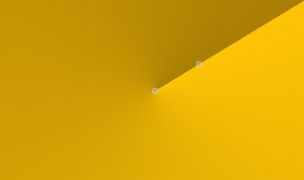
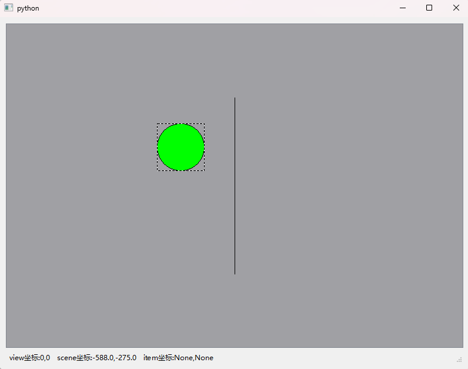
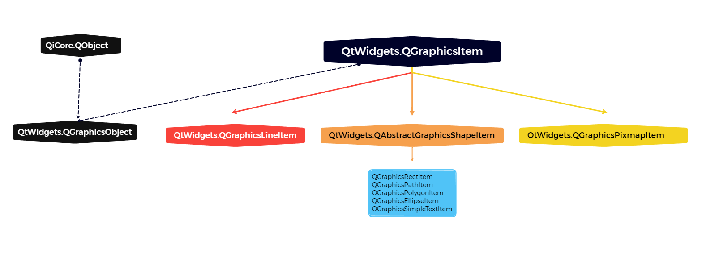

# 15.QPainter和Graphics/View绘图

绘图是指在绘图设备(窗口、控件、图像、打印机等)上将用户构思出的图形绘制出来,图形包括点、线、矩形、多边形、椭圆、文字及保存到磁盘上的图像等。

可以对绘制的图形进行处理如给封闭的图形填充颜色。

PySide6中绘制图形有两种方式,一种是用QPainter类来绘图,另一种是用Graphics/View 框架来绘图。

- QPainter 绘图是过程性绘图,Graphics/View框架绘图是面向对象的绘图;
- QPainter 绘制的图形不能选择和再编辑Graphics/View框架绘制的图形可以选择移动和编辑;
- QPainter 绘图是Graphics/View 绘图的基础。Graphics/View框架可以自定义图项(QGraphicsItem),在自定义图项中用QPainter绘制自己的图形,形成面向对象的图项,进而形成用户自定义的控件

### QPainter绘图

QPainter 是基本的绘图方法,可以绘制各种各样的图形、文字和图像,可以用渐变色填充区域。同时 QPainter 绘图方法是 Graphics/View 绘图框架的基础。

#### QPainter类

利用QPainer 类可以在绘图设备上绘制图片,文字和几何形状,几何形状有点、线、矩形、椭圆、弧形、弦形、饼图、多边形和贝塞尔曲线等。

绘图设备是从 QPaintDevice 继承的类,包括继承自QWidget 的窗口各种控件QPixmap 和 Qlmage。

如果绘图设备是窗口或控件,则QPainter 绘图一般放到 paintEvent()事件或者被 paintEvent()事件调用的函数中用QPainter 类创建

绘图实例的方法如下其中QPaintDevice 是指继承自QPaintDevice的绘图设备。

如果使用不带设备的 QPainter()方法创建实例对象,例如 painter=QPainter(),则在开始绘图前需要用painter,begin(QPaintDevice)方法指定绘图设备,此时painter.isActive()的返回值是 True绘图完成后,需要用painter.end()方法声明完成绘图,之后可以用begin()方法重新指定绘图设备。begin()和 end()方法都返回 bool值。

```python
from PySide6.QtGui import QPainter

QPainter(self) -> None
QPainter(arg__1: PySide6.QtGui.QPaintDevice) -> None 
```


##### QPainter 状态设置的方法

| QPainter的状态设置方法及参数类型                             | 说明                                                 |
| ------------------------------------------------------------ | ---------------------------------------------------- |
| setBackground(bg: Union[QBrush,Qt.BrushStyle,Qt.GlobalColor, QColor,QGradient,QImage,QPixmap]) | 设置背景色,背景色只对不透明 的文字、虚线或位图起作用 |
| setBackgroundMode(mode:Qt.BGMode)                            | 设置透明或不透明背景模式                             |
| setBrush(brush:Union[QBrush,Qt.BrushStyle, Qt.GlobalColor, QColor,QGradient,QImage,QPixmap]) | 设置画刷                                             |
| setBrush(style:Qt.BrushStyle)                                | 设置画刷                                             |
| setBrushOrigin(Union[QPointF,QPoint,QPainterPath.Element])   | 设置画刷的起点                                       |
| setBrushOrigin(x:int,y:int)                                  | 设置画刷的起点                                       |
| setClipPath(QPainterPath,op:Qt.ClipOperation=Qt.ReplaceClip) | 设置剪切路径                                         |
| setClipRect(QRect,op:Qt.ClipOperation=Qt.ReplaceClip)        | 设置剪切矩形区域                                     |
| setClipRect(Union[QRectF,QRect],op=Qt.ReplaceClip)           | 设置剪切矩形区域                                     |
| setClipRect(x: int,y: int,w: int,h:int,op=Qt.ReplaceClip)    | 设置剪切矩形区域                                     |
| setClipRegion(Union[QRegion,QBitmap, QPolygon,QRect],op: Qt.ClipOperation=Qt.ReplaceClip) | 设置剪切区域:                                        |
| setClipping(enable:bool)                                     | 设置是否启动剪切                                     |
| setCompositionMode(mode:QPainter.CompositionMode)            | 设置图形合成模式                                     |
| setFont(f:Union[QFont,str,Sequence[str]])                    | 设置字体                                             |
| setLayoutDirection(direction:Qt.LayoutDirection)             | 设置布局方向                                         |
| setOpacity(opacity:float)                                    | 设置不透明度                                         |
| setPen(color: Union[QColor,Qt.GlobalColor,str])              | 设置钢笔                                             |
| setPen(pen: Union[QPen,Qt.PenStyle,QColor])                  | 设置钢笔                                             |
| setPen(style: Qt.PenStyle)                                   | 设置钢笔                                             |
| setRenderHint(hint: QPainter.RenderHint,on:bool=True)        | 设置渲染模式,例如抗锯齿                              |
| setRenderHints(hints:QPainter.RenderHints,on: bool=True)     | 设置多个渲染模式                                     |
| setTransform(transform:QTransform,combine: bool=False)       | 设置全局变换矩阵                                     |
| setWorldTransform(matrix: QTransform,combine: bool=False)    | 设置全局变换矩阵                                     |
| setViewTransformEnabled(enable:bool)                         | 设置是否启动视口变换                                 |
| setViewport(viewport: QRect)                                 | 设置视口                                             |
| setViewport(x:int,y:int.w:int,h:int)                         | 设置视口                                             |
| setWindow(window:QRect)                                      | 设置逻辑窗口                                         |
| setWindow(x: int,y: int,w:int,h:int)                         | 设置逻辑窗口                                         |
| setWorldMatrixEnabled(enabled: bool)                         | 设置是否启动全局矩阵变换                             |
| save()                                                       | 保存状态到堆栈中                                     |
| restore()                                                    | 从堆栈中恢复状态                                     |

- isActive() 函数指示画家是否处于活动状态。
  - 画家由 begin() 函数和采用QPaintDevice 参数的构造函数激活。
  - end() 函数和析构函数将其停用。
- font() 是用于绘制文本的字体。如果画家是 Active() ,则可以分别使用fontInfo() 和 fontMetrics() 函数检索有关当前设置的字体及其度量的信息。
- brush() 定义用于填充形状的颜色或图案。
- pen() 定义用于绘制线条或边界的颜色或点画。
- backgroundMode() 定义是否存在 background(),即它是 or 或 。OpaqueMode TransparentMode
- background() 仅在 backgroundMode() 为 而 pen() 为 stipple 时才适用。在这种情况下,它描述了小节中背景像素的颜色。OpaqueMode
- brushOrigin() 定义了平铺画笔的原点,通常是小部件背景的原点。
- viewport() , window() , worldTransform() 构成了画家的坐标变换系统。有关详细信息,请参阅坐标系文档。Coordinate Transformations
- hasClipping() 告诉画家是否剪辑。(绘画装置也会夹住。如果画家剪辑,它会剪辑到剪辑区域()。
- layoutDirection() 定义绘制者在绘制文本时使用的布局方向。
- worldMatrixEnabled() 指示是否启用了世界转换。
- viewTransformEnabled() 指示是否启用了视图转换。


##### 用QPainter 绘制五角星的实例

下面先举一个用QPainter 绘制五角星的实例,实例中计算

- 5个顶点的坐标,用QPainter绘制折线方法 

- drawPolyline()绘制五角星并在每个顶点上绘制名称

  

```python
# -*- coding: UTF-8 -*-
# File date: Hi_2023/3/6 23:23
# File_name: 01-用QPainter绘制五角星的实例.py


import sys, math
from PySide6.QtWidgets import QApplication, QWidget
from PySide6.QtGui import QPen, QPainter
from PySide6.QtCore import QPointF
from math import cos, sin, pi


class MyWindow(QWidget):
    def __init__(self, parent=None):
        super().__init__(parent)

        self.resize(600, 500)
        self.painter = QPainter()

    def paintEvent(self, event):
        if self.painter.begin(self):
            font = self.painter.font()
            font.setPixelSize(20)
            self.painter.setFont(font)  # 设置字体

            pen = QPen()  # 钢笔
            pen.setWidth(5)  # 线条宽度
            self.painter.setPen(pen)  # 设置钢笔
            r = 100  # 五角星的外接圆半径

            x = self.width() / 2
            y = self.height() / 2
            p1 = QPointF(r * cos(-90 * pi / 180) + x, r * sin(-90 * pi / 180) + y)
            p2 = QPointF(r * cos(-18 * pi / 180) + x, r * sin(-18 * pi / 180) + y)
            p3 = QPointF(r * cos(54 * pi / 180) + x, r * sin(54 * pi / 180) + y)
            p4 = QPointF(r * cos(126 * pi / 180) + x, r * sin(126 * pi / 180) + y)
            p5 = QPointF(r * cos(198 * pi / 180) + x, r * sin(198 * pi / 180) + y)

            self.painter.drawPolyline([p1, p3, p5, p2, p4, p1])  # 绘制折线
            self.painter.drawText(p1, "p1")  # 绘制文字
            self.painter.drawText(p2, "p2")
            self.painter.drawText(p3, "p3")
            self.painter.drawText(p4, "p4")
            self.painter.drawText(p5, "p5")

            if self.painter.isActive():
                self.painter.end()


if __name__ == '__main__':
    app = QApplication(sys.argv)
    win = MyWindow()

    win.show()
    sys.exit(app.exec())

```

#### 钢笔QPen的用法

钢笔 QPen 用于绘制线条,线条有样式(实线、虚线、点虚线)、颜色、宽度等属性用QPainter 的 setPen(QPen)方法为 QPainter 设置钢笔。

用QPen 创建钢笔的方法如下

- s是QtPenStyle的举值用于设置钢笔的样式;
- 画刷 brush 可以用QBrush,QColorQt.GlobalColor和 QGradient 来设置;
- c是 Qt.PenCapStyle 的枚举值,用于设置线条端点样式;
- j是Qt.PenJoinStyle 的枚举值,用于设置线条连接点处的样式。
- 钢笔默认的颜色是黑色,宽度是1像素,样式是实线,端点样式是 Qt.SquareCap,连接处是 Qt.BevelJoin。

```python
from PySide6.QtGui import QPen

QPen(self) -> None
QPen(arg__1: PySide6.QtCore.Qt.PenStyle) -> None
QPen(brush: Union[PySide6.QtGui.QBrush, PySide6.QtCore.Qt.BrushStyle, PySide6.QtCore.Qt.GlobalColor, PySide6.QtGui.QColor, PySide6.QtGui.QGradient, PySide6.QtGui.QImage, PySide6.QtGui.QPixmap], width: float, s: PySide6.QtCore.Qt.PenStyle = Instance(Qt.SolidLine), c: PySide6.QtCore.Qt.PenCapStyle = Instance(Qt.SquareCap), j: PySide6.QtCore.Qt.PenJoinStyle = Instance(Qt.BevelJoin)) -> None
QPen(color: Union[PySide6.QtGui.QColor, PySide6.QtGui.QRgba64, Any, PySide6.QtCore.Qt.GlobalColor, str, int]) -> None
QPen(pen: Union[PySide6.QtGui.QPen, PySide6.QtCore.Qt.PenStyle, PySide6.QtGui.QColor]) -> None 
```

##### 钢笔QPen的常用方法

钢笔QPen的常用方法如表所示,主要方法介绍如下

| QPen的方法及参数类型                                         | > 说 明                              |
| ------------------------------------------------------------ | ------------------------------------ |
| setStyle(Qt.PenStyle)                                        | 设置线条样式                         |
| style()                                                      | 获取线条样式                         |
| setWidth(int)、setWidthF(float)                              | 设置线条宽度                         |
| widtb()、widthF()                                            | 获取线条宽度                         |
| isSolid()                                                    | 获取线条样式是否是实线填充           |
| setBrush(brush:Union[QBrush, Qt.BrushStyle, QColor, Qt.GlobalColor,QGradient,QImage,QPixmap]) | 设置画刷                             |
| brusb()                                                      | 获取画刷 QBrush                      |
| setCapStyle(Qt.PenCapStyle)                                  | 设置线端部的样式                     |
| capStyle()                                                   | 获取线端部的样式 Qt.PenCapStyle      |
| setColor(Union[QColor,Qt.GlobalColor,str,int])               | 设置颜色                             |
| color()                                                      | 获取颜色QColor                       |
| setCosmetic(cosmetic:bool)                                   | 设置是否进行装饰                     |
| isCosmetic()                                                 | 获取是否进行装饰                     |
| setDashOffset(doffset: float)                                | 设置虚线开始绘制的点与线起始点的距离 |
| setDashPattern(pattern:Sequence[float])                      | 设置用户自定义虚线样式               |
| dashPattern()                                                | 获取自定义样式                       |
| setJoinStyle(Qt.PenJoinStyle)                                | 设置两相交线连接点处的样式           |
| setMiterLimit(float)                                         | 设置斜接延长线的长度                 |

- 线条的宽度用setWidth(int)或 setWidthF(float)方法设置

  - 如果宽度始终为0,表示是装饰线条;
  - 装饰线条也可用setCosmetic(bool)方法设置。

- 装饰线条是指具有恒定宽度的边,可确保线条在不同缩放比例下具有相同的宽度。

  - 线条的样式用setStyle(Qt.PenStyle)方法设置参数 Qt.PenStyle可取的值如表所示

    | Qt.PenStyle的取值 | 值   | 说明       | Qt.PenStyle的取值 | 值   | 说 明    |
    | ----------------- | ---- | ---------- | ----------------- | ---- | -------- |
    | Qt.NoPen          | 0    | 不绘制线条 | Qt.DashDotLine    | 4    | 点画线   |
    | Qt.SolidLine      | 1    | 实线       | Qt.DashDotDotLine | 5    | 双点画线 |
    | Qt.DashLine       | 2    | 虚线       | Qt.CustomDashLine | 6    | 自定义线 |
    | Qt.DotLine        | 3    | 点线       |                   |      |          |

  - 其中自定义样式需要用setDashPattern(Sequence[float])方法设置,这些样式的外观如图所示。

    

  - 钢笔的端点样式用SetCapStyle(Qt.PenCapStyle)方法设置,其中参数 Qt.PenCapStyle可取以下值,这些样式的区别如图所示。

    

    - Qt.FlatCap 不包含端点
    - Qt.SquareCap 包含端点,并延长半个宽度。
    - Qt.RoundCap

  - 两个线条连接点处的样式用setJoinStyle(QtPenJoinStyle)方法设置,其中参数Qt.PenJoinStyle 可取以下值,样式如图所示。

    

    - Qt.MiterJoin

    - Qt.BevelJoin 

    - Qt.RoundJoin 

    - Qt.SvgMiterJoin

    - 当线条连接样式是Qt.MiterJoin 时,用setMiterLimit(float)方法设置延长线的长度其中参数 float 是线条宽度的倍数,默认是 20其延长线的含义如图所示:

      

      

  - 用setDashPattern(Sequence[float])方法可以自定义虚线样式,其中参数的奇数项表示实线的长度,偶数项表示空白处的长度,长度以线宽为单位表示为线宽的倍数。

    - 例如 setDashPattern([4,2,4,2])表示实线的长度是线宽的四倍
    - 而空白处的长度是线宽的两倍用setDashOffset(float)方法可以设置虚线开始绘制的点与线起始点之间的距离,如果这个距离是动态的,则会形成动画效果。

##### 钢笔QPen的应用实例

下面的程序用钢笔绘制一个带有背景图像、形状是"Z"形的虚线图


```python
# -*- coding: UTF-8 -*-
# File date: Hi_2023/3/6 23:45
# File_name: 02- 钢笔QPen的应用实例.py


import sys, math
from PySide6.QtWidgets import QApplication, QWidget
from PySide6.QtGui import QPen, QPainter, QPixmap
from PySide6.QtCore import QPointF, Qt


class MyWindow(QWidget):
    def __init__(self, parent=None):
        super().__init__(parent)

        self.resize(600, 500)

    def paintEvent(self, event):
        painter = QPainter(self)

        pix = QPixmap(r"../../Resources/images/d8.png")  # 图像
        pen = QPen(pix, 10)  # 含有背景图像的钢笔,线宽是 40
        pen.setStyle(Qt.DashLine)
        pen.setJoinStyle(Qt.MiterJoin)
        painter.setPen(pen)  # 设置钢笔

        p1 = QPointF(50, 50)
        p2 = QPointF(self.width() - 50, 50)
        p3 = QPointF(50, self.height() - 50)
        p4 = QPointF(self.width() - 50, self.height() - 50)
        painter.drawPolyline([p1, p2, p3, p4])  # 绘制折线


if __name__ == '__main__':
    app = QApplication(sys.argv)
    win = MyWindow()

    win.show()
    sys.exit(app.exec())

```

#### 画刷QBrush的用法

对于封闭的图形,如矩形、圆等,用画刷 QBrush 可以在其内部填充颜色、样式、渐变、纹理或图案。

用QBrush类创建画刷的方法如下所示其中 bs是 Qt.BrushStyle 的枚举值,用于设置画刷的风格。

```python
from PySide6.QtGui import QBrush

QBrush(self) -> None
QBrush(brush: Union[PySide6.QtGui.QBrush, PySide6.QtCore.Qt.BrushStyle, PySide6.QtCore.Qt.GlobalColor, PySide6.QtGui.QColor, PySide6.QtGui.QGradient, PySide6.QtGui.QImage, PySide6.QtGui.QPixmap]) -> None
QBrush(bs: PySide6.QtCore.Qt.BrushStyle) -> None
QBrush(color: PySide6.QtCore.Qt.GlobalColor, bs: PySide6.QtCore.Qt.BrushStyle = Instance(Qt.SolidPattern)) -> None
QBrush(color: PySide6.QtCore.Qt.GlobalColor, pixmap: Union[PySide6.QtGui.QPixmap, PySide6.QtGui.QImage, str]) -> None
QBrush(color: Union[PySide6.QtGui.QColor, PySide6.QtGui.QRgba64, Any, PySide6.QtCore.Qt.GlobalColor, str, int], bs: PySide6.QtCore.Qt.BrushStyle = Instance(Qt.SolidPattern)) -> None
QBrush(color: Union[PySide6.QtGui.QColor, PySide6.QtGui.QRgba64, Any, PySide6.QtCore.Qt.GlobalColor, str, int], pixmap: Union[PySide6.QtGui.QPixmap, PySide6.QtGui.QImage, str]) -> None
QBrush(gradient: Union[PySide6.QtGui.QGradient, PySide6.QtGui.QGradient.Preset]) -> None
QBrush(image: Union[PySide6.QtGui.QImage, str]) -> None
QBrush(pixmap: Union[PySide6.QtGui.QPixmap, PySide6.QtGui.QImage, str]) -> None 
```

##### 画刷QBrush的常用方法

画刷 QBrush 的常用方法如表所示,主要方法介绍如下

| QBrush的方法和参数类型                     | 返回值的类型  | 说明           |
| ------------------------------------------ | ------------- | -------------- |
| setStyle(Qt.BrushStyle)                    | None          | 设置风格       |
| style()                                    | Qt.BrushStyle | 获取风格       |
| set Texture(QPixmap)                       | None          | 设置纹理图片   |
| texture()                                  | QPixmap       | 获取纹理图片   |
| setTextureImage(QImage)                    | None          | 设置纹理图片   |
| textureImage()                             | Qlmage        | 获取纹理图片   |
| setColor(Union[QColor,Qt.GlobalColor,str]) | Nonei         | 设置颜色       |
| color()                                    | QColor        | 获取颜色       |
| gradient()                                 | QGradient     | 获取渐变色·    |
| setTransform(QTransform)                   | None \(k      | 设置变换矩阵 5 |
| transform()                                | QTransform    | 返回变换矩阵5  |
| isOpaque()                                 | bool          | 获取是否不透明 |

- 画刷的风格用setStyle(Qt.BrushStyle)方法设置,其中参数 QtBrushStyle 的取值和示意图如图示。

  

- 画刷的纹理可以用setTexture(QPixmap)或 setTexturelmage(QImage)方法来设置,这时样式被设置成QtTexturePattern。

##### 画刷QBrush的应用实例

下面的程序在窗口中绘制一个矩形框,并在矩形框中用画刷填充网格线


```python
# -*- coding: UTF-8 -*-
# File date: Hi_2023/3/7 0:03
# File_name: 03- 画刷QBrush的应用实例.py


import sys
from PySide6.QtWidgets import QApplication, QWidget
from PySide6.QtGui import QPen, QPainter, QBrush
from PySide6.QtCore import Qt.QPointF, QRectF


class MyWindow(QWidget):
    def __init__(self, parent=None):
        super().__init__(parent)

    def paintEvent(self, event):
        painter = QPainter(self)

        pen = QPen()  # 钢笔
        pen.setColor(Qt.blue)
        pen.setWidth(5)  # 线条宽度
        painter.setPen(pen)  # 设置钢笔

        brush = QBrush(Qt.red, Qt.DiagCrossPattern)  # 画刷,同时设置颜色和风格
        painter.setBrush(brush)  # 设置画刷

        p1 = QPointF(self.width() / 4, self.height() / 4)
        p2 = QPointF(3 * self.width() / 4, 3 * self.height() / 4)
        painter.drawRect(QRectF(p1, p2))  # 绘制矩形


if __name__ == '__main__':
    app = QApplication(sys.argv)
    win = MyWindow()

    win.show()
    sys.exit(app.exec())

```


#### 新变色QGradient的用法

在用画刷进行填充时,可以设置填充颜色为渐变色。

所谓渐变色是指在两个不重合的点处分别设置不同的颜色,这两个点一个是起点,另一个是终点,这两个点之间的颜色从起点的颜色逐渐过渡到终点的颜色。

定义渐变色的类是 QGradient,渐变样式分为 3 种类型分别为

- 线性渐变 QLinearGradient
- 径向渐变QRadialGradient 
- 圆渐变QConicalGradient


它们都继承自 QGradient 类,也会继承QGradient 类的属性和方法。这3种渐变的样式如图所示。

- 用QLinearGradient类创建线性渐变色的方法如下所示。线性渐变需要一个线性渐变矩形区域(起始和终止位置),参数用于确定这个矩形区域

  

  ```python
  from PySide6.QtGui import QLinearGradient
  
  QLinearGradient(self) -> None
  QLinearGradient(QLinearGradient: PySide6.QtGui.QLinearGradient) -> None
  QLinearGradient(start: Union[PySide6.QtCore.QPointF, PySide6.QtCore.QPoint, PySide6.QtGui.QPainterPath.Element], finalStop: Union[PySide6.QtCore.QPointF, PySide6.QtCore.QPoint, PySide6.QtGui.QPainterPath.Element]) -> None
  QLinearGradient(xStart: float, yStart: float, xFinalStop: float, yFinalStop: float) -> None
  ```

  

- 用QRadialGradient类创建径向渐变色的方法如下。径渐变需要的几何参数如图所示,需要确定圆心位置、半径、焦点位置和焦点半径。径向渐变的构造函数中,

  - 第 1个参数是圆心位置,可以用点或坐标定义;
  - 第 2 个参数是半径;
  - 第 3 个参数是焦点位置,可以用点或坐标定义;
  - 第 4 个参数是焦点半径。

  如果焦点设置到圆的外面则取圆上的点作为焦点。

  

  ```python
  from PySide6.QtGui import QRadialGradient
  
  QRadialGradient(self) -> None
  QRadialGradient(QRadialGradient: PySide6.QtGui.QRadialGradient) -> None
  QRadialGradient(center: Union[PySide6.QtCore.QPointF, PySide6.QtCore.QPoint, PySide6.QtGui.QPainterPath.Element], centerRadius: float, focalPoint: Union[PySide6.QtCore.QPointF, PySide6.QtCore.QPoint, PySide6.QtGui.QPainterPath.Element], focalRadius: float) -> None
  QRadialGradient(center: Union[PySide6.QtCore.QPointF, PySide6.QtCore.QPoint, PySide6.QtGui.QPainterPath.Element], radius: float) -> None
  QRadialGradient(center: Union[PySide6.QtCore.QPointF, PySide6.QtCore.QPoint, PySide6.QtGui.QPainterPath.Element], radius: float, focalPoint: Union[PySide6.QtCore.QPointF, PySide6.QtCore.QPoint, PySide6.QtGui.QPainterPath.Element]) -> None
  QRadialGradient(cx: float, cy: float, centerRadius: float, fx: float, fy: float, focalRadius: float) -> None
  QRadialGradient(cx: float, cy: float, radius: float) -> None
  QRadialGradient(cx: float, cy: float, radius: float, fx: float, fy: float) -> None
  ```

- 用QConicalGradient 创建圆锥渐变色的方法如下所示。如图所示圆锥渐变需要的几何参数为圆心位置和起始角度a,角度必须在0~360之间,圆心位置可以用点或坐标来定义

  

  ```python
  from PySide6.QtGui import QConicalGradient
  
  QConicalGradient(self) -> None
  QConicalGradient(QConicalGradient: PySide6.QtGui.QConicalGradient) -> None
  QConicalGradient(center: Union[PySide6.QtCore.QPointF, PySide6.QtCore.QPoint, PySide6.QtGui.QPainterPath.Element], startAngle: float) -> None
  QConicalGradient(cx: float, cy: float, startAngle: float) -> None 
  ```

  


##### QGradient,OLinearGradient,ORadialGradient 和 OConicalGradient 的常用方法

QGradient,QLinearGradient,QRadialGradient 和 QConicalGradient 的常用方法如表所示,主要方法介绍如下。

QLinearGradient,QRadialGradient 和 QConicalGradient 继承自QGradient,因此也会继承 QGradient 的方法

| QGradient渐变类的常用方法及参数类型                     | 说明         |
| ------------------------------------------------------- | ------------ |
| setCoordinateMode(QGradient.CoordinateMode)             | 设置坐标模式 |
| setColorAt(pos:float,Union[QColor,Qt.GlobalColor,str])  | 设置颜色     |
| setStops(stops:Sequence[Tuple[float,QColor]])           | 设置颜色     |
| setInterpolationMode(mode: QGradient.InterpolationMode) | 设置插值模式 |
| setSpread(QGradient.Spread)                             | 设置扩展方式 |
| type()->QGradient.Type                                  | 获取类型     |


| QLinearGradient渐变类的常用方法及参数类型                | 说明       |
| -------------------------------------------------------- | ---------- |
| setStart(Union[QPointF,QPoint,QPainterPath.Element])     | 设置起始点 |
| setStart(x: float,y:float)                               | 设置起始点 |
| start()->QPointF                                         | 获取起始点 |
| setFinalStop(Union[QPointF,QPoint,QPainterPath.Element]) | 设置终止点 |
| setFinalStop(x: float,y: float)                          | 设置终止点 |
| finalStop()> QPointF                                     | 获取终止点 |


| QRadialGradient渐变类的常用方法及参数类型 | 说明         |
| ----------------------------------------- | ------------ |
| setCenter(Union[QPointF,QPoint])          | 设置圆心     |
| setCenter(x: float,y:float)               | 设置圆心     |
| setRadius(radius: float)                  | 设置半径     |
| setCenterRadius(radius:float)             | 设置半径     |
| setFocalPoint(Union[QPointF,QPoint])      | 设置焦点位置 |
| setFocalPoint(float,float)                | 设置焦点位置 |
| setFocalRadius(radius:float)              | 设置焦点半径 |


| QConicalGradient渐变类的常用方法及参数类型 | 说明         |
| ------------------------------------------ | ------------ |
| setCenter(Union[QPointF,QPoint])           | 设置圆心     |
| setCenter(x: float,y: float)               | 设置圆心     |
| setAngle(float)                            | 设置起始角度 |

- 在渐变区域内,可以在多个点设置颜色值,这些点之间的颜色值根据两侧的颜色来确定

  - 在定义内部点的颜色值时,通常通过逻辑坐标来定义,渐变区域内的起始点的逻辑值是 0终止点的逻辑值是 1。
  - 如果要在中间位置定义颜色,可以用setColorAt()方法来定义,例如 setColorAt(0.1,Qtblue)、setColorAt(0.4,Qt.yellow)和 setColorAt(0.6,Qtred)定义了3个位置处的颜色值;
  - 也可以用setStops()方法一次定义多个颜色值,例如 setStops([(0.1,Qt.red),(0.5,Qt.blue)])定义了两个点处的颜色值。

- 用stops()方法可以获得逻辑坐标和颜色值。

  - 用setCoordinateMode(QGradient,CoordinateMode)方法可以设置坐标的模式,参数 QGradient.CoordinateMode 的取值如表所示

    | QGradient.CoordinateMode 的取值 | 值   | 说明                                                         |
    | ------------------------------- | ---- | ------------------------------------------------------------ |
    | QGradient.LogicalMode           | 0    | 逻辑方式,起始点为0,终止点为1。这是默认值                     |
    | QGradient.ObjectMode            | 3    | 相对于绘图区域矩形边界 的逻辑坐标,左上角的坐标是(0, 0),右下角的坐标是(1,1) |
    | QGradient.StretchToDeviceMode   | 1    | 相对于绘图设备矩形边界的逻辑坐标,左上角的坐标是(0, 0),右下角的坐标是(1,1) |
    | QGradient.ObjectBoundingMode    | 2    | 该方法与QGradient.ObjectMode 基本相同,除了 QBrush.translorm()应用于逻辑空间而不是物理空间 |

- 当设置的渐变区域小于填充区域时,渐变颜色可以扩展到渐变区域以外的空间。

  - 扩展模式用setSpread(QGradient.Spread)方法定义,参数 QGradient.Spread 的取值如表所示。

    | QGradient.Spread的取值  | 值   | 说:明            |
    | ----------------------- | ---- | ---------------- |
    | Qgradient.PadSpread     | 0    | 用最近的颜色扩展 |
    | Qgradient.RepeatSpread  | 2    | 重复渐变         |
    | Qgradient.ReflectSpread | 1    | 对称渐变         |

  - 扩展模式不适合圆锥渐变,圆锥渐变没有固定的边界。

- 用setInterpolationMode(mode; QGradientInterpolationMode)方法设置渐变色内部的插值模式,参数可取 QGradient,ColorInterpolation 或 QGradient,ComponentInterpolation。

- 用type()方法可以获取渐变类型,返回值可能是:

  - QGradient.LinearGradient
  - QGradient.RadialGradient
  - QGradient.ConicalGradient 
  - QGradient.NoGradient(无渐变色)


##### QGradient、QLinearGradient,ORadialGradient 和 OConicalGradient 的应用实例

下面的程序将窗口工作区分成4个矩形,在这4个矩形中分别绘制线性渐变圆锥渐变和径向渐变,并应用扩展,程序运行界面如图所示


```python
# -*- coding: UTF-8 -*-
# File date: Hi_2023/3/7 13:25
# File_name: 04- QGradient、QLinearGradient,ORadialGradient 和 OConicalGradient 的应用实例.py


import sys
from PySide6.QtWidgets import QApplication, QWidget
from PySide6.QtGui import QPen, QPainter, QBrush, QLinearGradient, QRadialGradient, QConicalGradient
from PySide6.QtCore import Qt.QPointF, QRectF


class MyWindow(QWidget):
    def __init__(self, parent=None):
        super().__init__(parent)

        self.resize(800, 400)

    def paintEvent(self, event):
        painter = QPainter(self)

        pen = QPen()
        pen.setColor(Qt.darkBlue)
        pen.setStyle(Qt.DashLine)
        pen.setWidth(5)
        painter.setPen(pen)
        w = self.width()
        h = self.height()

        linear = QLinearGradient(QPointF(0, 0), QPointF(w / 8, 0))  # 线性渐变
        linear.setStops([(0, Qt.red),(0.3, Qt.yellow),(0.6, Qt.green),(1, Qt.blue)])  # 设置颜色

        linear.setSpread(QLinearGradient.ReflectSpread)  # 镜像扩展
        brush1 = QBrush(linear)  # 用线性渐变定义刷子
        painter.setBrush(brush1)
        painter.drawRect(QRectF(0, 0, w / 2, h / 2))  # 画矩形

        conical = QConicalGradient(QPointF(w / 4 * 3, h / 4), h / 6)
        conical.setAngle(60)  # 起始角度
        conical.setColorAt(0, Qt.red)
        conical.setColorAt(1, Qt.yellow)
        brush2 = QBrush(conical)
        painter.setBrush(brush2)
        painter.drawRect(QRectF(w / 2, 0, w / 2, h / 2))

        radial1 = QRadialGradient(QPointF(w / 4, h / 4 * 3), w / 8, QPointF(w / 4, h / 4 * 3) / 15)
        radial1.setColorAt(0, Qt.red)
        radial1.setColorAt(0.5, Qt.yellow)
        radial1.setColorAt(1, Qt.blue)
        radial1.setSpread(QRadialGradient.RepeatSpread)
        brush3 = QBrush(radial1)
        painter.setBrush(brush3)
        painter.drawRect(QRectF(0, h / 2, w / 2, h / 2))

        radial2 = QRadialGradient(QPointF(w / 4 * 3, h / 4 * 3), w / 6, QPointF(w / 5 * 4, h / 5 * 4), w / 10)
        radial2.setColorAt(0, Qt.red)
        radial2.setColorAt(0.5, Qt.yellow)
        radial2.setColorAt(1, Qt.blue)
        radial2.setSpread(QRadialGradient.ReflectSpread)
        brush4 = QBrush(radial2)
        painter.setBrush(brush4)
        painter.drawRect(QRectF(w / 2, h / 2, w / 2, h / 2))


if __name__ == '__main__':
    app = QApplication(sys.argv)
    win = MyWindow()

    win.show()
    sys.exit(app.exec())

```


#### 绘制几何图形

QPainter 可以在绘图设备上绘制点、直线、折线矩形、圆、弧弦文本和图像等,绘制几何图形的方法介绍如下。

##### 绘制点

QPainter 绘制点的方法如表所示。可以一次绘制一个点,也可以一次绘制多个点其中QPolygon和QPolygonF 是用于存储QPoint 和QPointF 的类

| QPainter绘制单点的方法              | QPainter绘制多点的方法                                       |
| ----------------------------------- | ------------------------------------------------------------ |
| drawPoint(p:QPoint)                 | drawPoints(Sequence[QPointF])                                |
| drawPoint(pt:Union[QPointF,QPoint]) | drawPoints(Sequence[QPoint])                                 |
| drawPoint(x:int,y: int)             | drawPoints(points:Union[QPolygon,Sequence[QPoint], QRect])   |
| drawPoint(pt: QPainterPath.Element) | drawPoints(points: Union[QPolygonF, .Sequence[QPointF],QPolygon,QRectF]) |

QPolygon和QPolygonF用于存储多个QPoint和QPointF,

- 创建QPolygon实例的方法是QPolygon()或者QPolygon(Sequence[QPoint])
- 创建 QPolygonF 实例的方法是QPolygonF()或QPolygonF(Sequence[Union[QPointF,QPoint]])。
- 用QPolygon的append(QPoint)方法可以添加点,用insert(int,QPoint)方法可以插人点,用setPoint(int;QPoint)方法可以更改点;
- 用QPolygonF的append(Union[QPointF,QPoint])方法可以添加点,用insert(int,Union[QPointF,QPoint])方法可以插人点。

##### 绘制直线

QPainter 绘制直线的方法如表所示。绘制直线需要用两个点。可以一次绘制一条直线,也可一次绘制多条直线,其中 QLine或 QLineF 是2D 直线类。

| QPainter绘制单条直线的方法                                   | QPainter绘制多条直线的方法              |
| ------------------------------------------------------------ | --------------------------------------- |
| drawLine(line:QLine)                                         | drawLines(lines:Sequence[QLineF])       |
| drawLine(line:Union[QLineF,QLine])                           | drawLines(lintes:Sequence[QLine])       |
| drawLine(pl:QPoint,p2:QPoint)                                | drawLines(pointPairs:Sequence[QPointF]) |
| drawLine(pl:Union[QPointF, QPoint],p2: Union[QPointF,QPoint]) | drawLines(pointPairs:Sequence[QPoint])  |
| drawLine(x1:int,y1:int,x2:int,y2:int)                        | drawLines(pointPairs:Sequence[QPoint])  |

QLine和 QLineF 用于定义二维直线,绘制二维直线需要用两个点。

- 用QLine 类定义直线实例的方法有 
  - QLine()
  - QLine(QPoint,QPoint)
  - QLine(xl:int,yl;int,x2:int;y2:int),
- 用QLineF 类定义直线实例的方法有 
  - QLineF(QLine)
  - QLineF()
  - QLineF(Union[QPointF,QPoint],Union[QPointF, QPoint])
  - QLineF(xl: float,yl: float, x2: float,y2: float)。
- 用QLine的 setLine(xl;int,yl:int,x2;int,y2; int)方法、setP1(QPoint)方法、setP2(QPoint)或setPoints(QPoint,QPoint)方法可以设置线两端的点。
  - QLineF 也有同样的方法,只需把参数 int 改成float,或QPoint改成QPointF。

##### 绘制折线

绘制折线必须用两个点,即使两条折线的终点和起始点相同,每条折线也必须用两个点来定义。折线由多个折线段构成,绘制折线需要给出多个点,上个折线段的终点是下个折线段的起始点。QPainter绘制折线的方法如表所示。

| QPainter绘制折线的方法                                       | 说明 |
| ------------------------------------------------------------ | ---- |
| drawPolyline(Sequence[QPointF])                              |      |
| drawPolyline(polygon: Union[QPolygon, Sequence[QPoint], QRect]) |      |
| drawPolyline(Sequence[QPoint])                               |      |
| drawPolyline(Union[QPolygonF,Sequence[QPointF],QPolygon, QRectF]) |      |

##### QPainter 绘制多边形和凸多边形的方法

QPainter 绘制多边形和凸多边形的方法如表所示。

- 使用这些方法时,需要给出多边形或凸多边形的顶点,系统会自动在起始点和终止点之间建立直线,使多边形封闭。

- 参数fillRule是QtFillRule的举类型用于确定一个点是否在图形内部在内部的区域可以进行填充。filiRule可以取Qt.OddEvenFill或Qt.WindingFill,这两种填充规则如图所示。

  

  - Qt.OddEvenFill是奇偶填充规则,要判断一个点是否在图形中可以从该点向图形外引一条水平线,如果该水平线与图形的交点个数为奇数,那么该点在图形中。

  - Qt.WindingFil1是非零绕组填充规则要判断一个点是否在图形中可以从该点向图形外引一条水平线,如果该水平线与图形的边线相交,这个边线是顺时针绘制的,就记为1,是逆时针绘制的就记为-1,然后将所有数值相加,若结果不为 0,那么该点就在图形中。图形的绘制方向会影响填充的判断。

    

| QPainter 绘制多边形的方法                                    | 说明                                                    |
| ------------------------------------------------------------ | ------------------------------------------------------- |
| drawPolygon(Sequence[QPointF],Qt.FillRule)                   | 使用填充规则fillRule绘制由给定点(QPointF)定义的多边形。 |
| drawPolygon(Sequence[QPoint],Qt.FillRule)                    | 使用填充规则fillRule绘制由给定点(QPoint)定义的多边形。  |
| drawPolygon(polygon: Union[QPolygon, Sequence[QPoint], QRect], fillRule: Qt.FillRule = Qt.OddEvenFill) |                                                         |
| drawPolygon(polygon: Union[QPolygonF,Sequence[QPointF],QPolygon,QRectF],fillRule: Qt.FillRule = Qt.OddEvenFill) |                                                         |

| QPainter 绘制凸多边形的方法                                  | 说明 |
| ------------------------------------------------------------ | ---- |
| drawConvexPolygon(Sequence[QPointF])                         |      |
| drawConvexPolygon(Sequence[QPoint])                          |      |
| drawConvexPolygon(polygon:Union[QPolygon,Sequence[QPoint],QRect]) |      |
| drawConvexPolygon(polygon: Union[QPolygonF,Sequence[QPointF], QPolygon, QRectF]) |      |


下面的程序用绘制多边形的方法绘制两个五角星,并分别采用奇偶填充规则和非零绕组填充规则进行填充,程序运行结果如图所示,


```python
# -*- coding: UTF-8 -*-
# File date: Hi_2023/3/8 13:24
# File_name: 05-绘制多边形的方法绘制两个五角星.py


from PySide6.QtWidgets import QApplication, QWidget
from PySide6.QtGui import QPen, QPainter, QBrush
from PySide6.QtCore import QPointF, Qt
from math import cos, sin, pi
import sys


class MyWindow(QWidget):
    def __init__(self, parent=None):
        super().__init__(parent)

        self.resize(600, 500)

    def paintEvent(self, event):
        painter = QPainter(self)

        pen = QPen()  # 钢笔
        pen.setWidth(2)  # 线条宽度
        painter.setPen(pen)  # 设置钢笔
        bush = QBrush(Qt.SolidPattern)
        painter.setBrush(bush)

        r = 100  # 五角星的外接圆半径

        x = self.width() / 4
        y = self.height() / 2
        p1 = QPointF(r * cos(-90 * pi / 180) + x, r * sin(-90 * pi / 180) + y)
        p2 = QPointF(r * cos(-18 * pi / 180) + x, r * sin(-18 * pi / 180) + y)
        p3 = QPointF(r * cos(54 * pi / 180) + x, r * sin(54 * pi / 180) + y)
        p4 = QPointF(r * cos(126 * pi / 180) + x, r * sin(126 * pi / 180) + y)
        p5 = QPointF(r * cos(198 * pi / 180) + x, r * sin(198 * pi / 180) + y)

        # 绘制多边形
        painter.drawPolygon([p1, p3, p5, p2, p4], Qt.FillRule.OddEvenFill)
        offset = QPointF(self.width() / 2, 0)
        painter.drawPolygon([p1 + offset, p3 + offset, p5 + offset, p2 + offset, p4 + offset], Qt.WindingFill)


if __name__ == '__main__':
    app = QApplication(sys.argv)
    win = MyWindow()

    win.show()
    sys.exit(app.exec())

```

##### 绘制矩形

QPainter 可以一次绘制一个矩形,也可以一次绘制多个矩形。

QPainter 绘制矩形的方法如表所示,其中drawRect(xl:int,yl;int,w:int,h:int)方法中xl和y1参数确定左上角的位置,w 和h参数确定宽度和高度。

| QPainter绘制单个矩形的方法          | QPainter绘制多个矩形的方法             |
| ----------------------------------- | -------------------------------------- |
| drawRect(rect:QRect)                | drawRects(rectangles:Sequence[QRectF]) |
| drawRect(rect: Union[QRectF,QRect]) | drawRects(rectangles:Sequence[QRect])  |
| drawRect(xl:int,yl:int,w:int,h:int) |                                        |

##### 绘制圆角矩形

圆角矩形是在矩形的基础上对4个角分别用一个圆进行倒圆角,其示意图如图所示。要绘制圆角矩形,除了需要设置绘制矩形的参数外,还需要设置椭圆的两个半径。


QPainter 绘制椭圆的方法有 

- drawRoundedRect(rect: Union[QRectF,QRect]xRadius: float,yRadius: float, mode; Qt.SizeMode =Qt AbsoluteSize)
- drawRoundedRect(x; int,y: int,w; int,h; int,xRadius; float,yRadius: float,mode: Qt.SizeMode = QtAbsoluteSize)
- 其中参数 mode是 Qt.SizeMode 的枚举类型可以取 Qt.AbsoluteSize或Qt.RelativeSize,分别确定圆半径是绝对值还是相对于矩形边长的相对值。


##### 绘制椭圆、扇形、弧和弦

一个椭圆有两个半径。确定一个椭圆有两种方法:

- 一种是先确定一个矩形边界,在矩形内部作一个与矩形相切的内切椭圆
- 另一种是先定义一个中心,再定义两个半径。

绘制椭圆示意图如图所示。

- 如果矩形边界是正方形或者圆的两个半径相等,圆就变成了圆。

- 扇形是椭圆的一部分,绘制扇形时除了确定椭圆的几何数据外,还需要确定扇形的起始角和跨度角。需要特别注意的是,起始角和跨度角都是用输人值的 1/16 计算,如要求起始角为45°,跨度角为60则需要输人的起始角为`45*16`,跨度角为`60*16`,例如 painter.drawPie(QRect(300,300,200,100),45 * 16,60*16)。

  

QPainter 绘制圆和扇形的方法如表所示

| QPainter绘制椭圆的方法                                       | QPainter 绘制扇形的方法                            |
| ------------------------------------------------------------ | -------------------------------------------------- |
| drawEllipse(center:[QPointF,QPoint],rx:int, ry: int)         | drawPie(QRect,a: int,alen:int)                     |
| drawEllipse(r:QRect)                                         | drawPie(rect:Union[QRectF,QRect],a: int,alen: int) |
| drawEllipse(r:Union[QRectF,QRect]) Q)7x53                    | drawPie(x;int,y:int,w:int,h;int,a: int, alen: int) |
| drawEllipse(x；int,y:int,w:int,h:int)                        |                                                    |
| drawEllipse(center:QPainterPath.Element,rx: float,ry: float) |                                                    |


绘制弧和绘制弦的参数与绘制扇形的参数相同,只不过是从圆上截取的部分不同QPainter绘制弧和弦的方法如表所示。

| QPainter绘制弧的方法                                | QPainter绘制弦的方法                                    |
| --------------------------------------------------- | ------------------------------------------------------- |
| drawArc(QRect,a: int,alen: int)                     | drawChord(QRect,a; int,alen:int)                        |
| drawArc(rect: Union[QRectF,QRect],a: int, alen:int) | drawChord(rect:Union[QRectF, QRect], a: int, alen: int) |
| drawArc(x:int,y;int,w:int,h;int,a: int,alen: int)   | drawChord(x;int,y:int,w:int,h:int,a: int,alen: int)     |

##### 抗锯齿

在绘制几何图像和文字时,如果线条是斜线,对线条进行放大后会发现它呈现锯齿状为防止出现锯齿状需要对线条边缘进行模糊化处理。

- 用QPainter 的setRenderHint(hint;QPainter, RenderHint,on; bool=True)或 setRenderHints(hints; QPainter.RenderHints.on;bool=True)方法可以设置是否进行抗锯齿处理,
- 用testRenderHint(hint;QPainter.RenderHint)方法可以获取是否设置了抗锯算法其中枚举参数 QPainter.RenderHint可以取:
  - QPainter.Antialiasing(启用抗锯齿)
  - QPainter,TextAntialiasing(对文本进行抗锯齿)
  - QPainter.SmoothPixmapTransform(使用平滑的像素图像算法)
  - QPainter.LosslessImageRendering(用于PDF文档)。

#### 绘制文本

可以在指定位置绘制文本,绘制文本时,通常需要先用setFont(QFont)方法设置QPainter的字体。

绘制文本的方法如表所示所绘文本默认是反锯齿的

| QPainter绘制文本的方法                                       | QPainter绘制文本的方法                                       |
| ------------------------------------------------------------ | ------------------------------------------------------------ |
| drawStaticText(left: int,top: int, staticText: QStaticText)  | drawText(p:Union[QPointF,QPoint],s: str)                     |
| drawStaticText(topLeftPosition: Union[QPointF, QPoint, QPainterPath.Element], staticText:QStaticText) | drawText(r: Union[QRectF,QRect],flags: int, text: str,br:Union[QRectF,QRect]) |
| drawText(r:Union[QRectF,QRect],text: str, Qt.Alignment)      | drawText(p:QPoint,s:str)                                     |
| drawText(x:int,y:int,w:int,h:int,flags: int, text: str,br:QRect) | drawText(x:int,y: int,s:str)                                 |
| drawText(r: QRect, flags: int, text: str,br: QRect)          | drawText(p: QPainterPath.Element,s: str)                     |

- 绘制文本可以用drawStaticText()方法该方法比较快且每次不用重新计算文本的排列位置。

  - QStaticText 是静态文本类,
    - 用QStaticText 类创建静态文本的方法是QStaticText()或 QStaticText(str)。
    - 可以用QStatciText 的 setText(str)方法设置文本
    - 用setTextFormat(Qt.TextFormat)方法设置静态文本的格式参数Qt.TextFormat可取:
      - Qt.PlainText、
      - Qt.RichText、 
      - Qt.AutoText 
      - Qt.MarkdownText; 
    - 用setTextOption(QTextOption)方法设置选项;
    - 用setTextWidth(float)方法设置静态文本的宽度。

- 绘制文本的方法中,flags 参数可取 

  > - Qt.AlignLeft
  > - Qt.AlignRight
  > - Qt.AlignHCenter
  > - QtAlignJustify
  > - Qt.AlignTop,
  > - Qt.AlignBottom
  > - Qt.AlignVCenter
  > - Qt.AlignCenter
  > - Qt.TextSingleLine
  > - Qt.TextExpandTabs
  > - Qt.TextShowMnemonic 
  > - QtTextWordWrap

  - 参数r是要绘制文本的矩形范围;
  - 参数 br 是指边界矩形(ounding rectangle),所绘文本应该包含在边界矩形中。

- 如果所绘制的文本用当前的字体绘制时,给定的矩形范围不合适,可以用boundingRect(···)方法获取边界矩形。获取文本边界矩形的方法如表所示

  | 获取文本边界矩形的方法                                       | 返回值的类型 |
  | ------------------------------------------------------------ | ------------ |
  | boundingRect(rect:QRect,flags: int,texti str)                | QRect        |
  | boundingRect(rect: Union[QRectF,QRect],flags:int,text: str)  | QRectF       |
  | boundingRect(rect:Union[QRectF,QRect],text: str,Qt.Alignment) | QRectF       |
  | boundingRect(x: int,y:int,w:int,h: int,flags: int,text: str) | QRect        |

#### 绘图路径QPainterPath的用法

前文中绘制的几何图形比较简单,各个图形之间也是相互独立的,例如用line()或 lines()方法绘制的多个线条之间相互独立,即便是首尾相连,它们也不是封闭的,不能在其内部填充图案。

为了将简单的图形组合成复杂且封闭的图形,需要用到绘图路径 QPainterPath,前面介绍的绘图方法所绘制的图形都可以加入QPainterPath 中,构成QPainterPath的元素。

用QPainter 的drawPath(path; QPainterPath)方法或strokePath(path:QPainterPath,pen;Union[QPen,Qt.PenStyle,QColor])方法可以将绘图路径的图形绘制出来

用绘图路径绘制的图形不论是否封闭,都隐含是封闭的,可以在其内部进行填充QPainterPath是一些绘图命令按照先后顺序的有序组合创建一次后可以反复使用用QPainterPath类

创建绘图路径实例对象的方法如下所示其中startPoint是绘制路径的起始点,也可以用绘图路径的 moveTo(Union[QPointF,QPoint])或 moveTo(x:float;y:float)方法将绘图路径的当前点移到起始点

```python
from PySide6.QtGui import QPainterPath

QPainterPath(self) -> None
QPainterPath(other: PySide6.QtGui.QPainterPath) -> None
QPainterPath(startPoint: Union[PySide6.QtCore.QPointF, PySide6.QtCore.QPoint, PySide6.QtGui.QPainterPath.Element]) -> None
```

##### 绘图路径中与绘图有关的方法

| QPainterPath的绘图方法及参数类型                             | 说 明                                                        |
| ------------------------------------------------------------ | ------------------------------------------------------------ |
| moveTo(Union[QPointF,QPoint])                                | 将当前点移动到指定的点,作为下一个绘图单元的 起始点           |
| moveTo(x:float,y:float)                                      | 将当前点移动到指定的点,作为下一个绘图单元的 起始点           |
| currentPosition()                                            | 获取当前的起始点 QPointF                                     |
| arcMoveTo(rect: Union[QRectF,QRect],angle: float)            | 将当前点移动到指定矩形框内的椭圆上,最后的 float是起始角度    |
| arcMoveTo(x: float,y: float,w: float,h: float, angle: float) | 将当前点移动到指定矩形框内的椭圆上,最后的 float是起始角度    |
| lineTo(Union[QPointF, QPoint,QPainterPath.Element])          | 在当前点与指定点之间绘制直线                                 |
| lineTo(x: float,y: float)                                    | 在当前点与指定点之间绘制直线                                 |
| cubicTo(ctrlPt1: Union[QPointF,QPoint, QPainterPath.Element], ctrlPt2: Union[QPointF, QPoint, QPainterPath, Element], endPt: Union[QPointF,QPoint, QPainterPath.Element]) | 在当前点和终点间绘制三次贝塞尔曲线,前两个点 是中间控制点,最后一个点是终点 |
| cubicTo(ctrlPt1x: float,ctrlPtly: float, ctrlPt2x: float, ctrlPt2y:float,endPtx: float,endPty:float) | 在当前点和终点间绘制三次贝塞尔曲线,前两个点 是中间控制点,最后一个点是终点 |
| quadTo(ctrlPt: Union[QPointF, QPoint, QPainterPath.Element],endPt: Union[QPointF, QPoint,QPainterPath.Element]) | 在当前点和终点间添加二次贝塞尔曲线,第一个点 是控制点         |
| quadTo(ctrlPtx: float, ctrlPty: float, endPtx: float,endPty: float) | 在当前点和终点间添加二次贝塞尔曲线,第一个点 是控制点         |
| arcTo(rect: Union[QRectF,QRect], startAngle: float,arcLength: float) | 在矩形框内绘制圆弧,startAngle和 arcLength分别 是起始角和跨度角. |
| arcTo(x: float, y: float, w: float, h: float, startAngle: float,arcLength: float) | 在矩形框内绘制圆弧,startAngle和 arcLength分别 是起始角和跨度角. |
| addEllipse(center: Union[QPointF,QPoint],rx: float,ry: float) | 绘制封闭的椭圆                                               |
| addEllipse(rect:Union[QRectF,QRect])                         | 绘制封闭的椭圆                                               |
| addEllipse(x: float,y: float,w: float,h:float)               | 绘制封闭的椭圆                                               |
| addPolygon(Union[QPolygonF, Sequence[QPointF],QPolygon,QRectF]) | 绘制多边形                                                   |
| addRect(rect: Union[QRectF,QRect])                           | 绘制矩形                                                     |
| addRect(x: float,y: float,w; float,h;float)                  | 绘制矩形                                                     |
| addRoundedRect(rect: Union[QRectF,QRect], xRadius: float,yRadius; float, mode: Qt.SizeMode=Qt.AbsoluteSize) | 绘制圆角矩形                                                 |
| addRoundedRect(x: float,y; float,w: float,h: float, xRadius: float, yRadius: float, mode: Qt.SizeMode=Qt.AbsoluteSize) | 绘制圆角矩形                                                 |
| addText(point: Union[QPointF, QPoint, QPainterPath.Element],f: Union[QFont,str, Sequence[str]],text: str) | 绘制文本                                                     |
| addText(x:float,y: float,f:Union[QFont,str, Sequence[str]],text:str) | 绘制文本                                                     |
| addRegion(region: :Union[QRegion,QBitmap, QPolygon,QRect])   | 绘制QRegion的范围                                            |
| closeSubpath()                                               | 由当前子路径首尾绘制直线,开始新的子路径的 绘制               |
| connectPath(QPainterPath)                                    | 由当前路径的终点位置与给定路径的起始位置绘制 直线            |
| addPath(QPainterPath)                                        | 将其他绘图路径添加进来                                       |
| translate(dx: float,dy: float)                               | 将绘图路径进行平移,dx和dy是x和y方向的移动 量,或用点表示      |
| translate(offset: Union[QPointF, QPoint, QPainterPath.Element]) | 将绘图路径进行平移,dx和dy是x和y方向的移动 量,或用点表示      |

##### 绘图路径QPainterPath 与查询有关的方法

| QPainterPath的查询方法                         | 返回值的类型    | 说明                                                         |
| ---------------------------------------------- | --------------- | ------------------------------------------------------------ |
| angleAtPercent(t: float)                       | float           | 获取绘图路径长度百分比处的切向角                             |
| slopeAtPercent(t: float)                       | float           | 获取斜率                                                     |
| boundingRect()                                 | QRectF          | 获取路径所在的边界矩形区域                                   |
| capacity()                                     | int             | 返回路径中单元的数量                                         |
| clear()                                        | None            | 清空绘图路径中的元素                                         |
| contains(Union[QPointF,QPoint])                | bool            | 如果指定的点在路径内部,则返回True                            |
| contains(QRectF)                               | 6001            | 如果矩形区域在路径内部,则返回True                            |
| contains(QPainterPath)                         | bool            | 如果包含指定的路径,则返回 True                               |
| controlPointRect()                             | QRectF          | 获取包含路径中所有点和控制点构成的矩形                       |
| elementCount()                                 | int             | 获取绘图路径的单元数量                                       |
| intersected(QPainterPath)                      | QPainterPath    | 获取绘图路径和指定路径填充区域相交的 路径                    |
| united(QPainterPath)                           | QPainterPath    | 获取绘图路径和指定路径填充区域合并的 路径                    |
| interseets(QRectF)                             | bo01            | 获取绘图路径与矩形区域是否相交                               |
| intersects(QPainterPath)                       | bool            | 获取绘图路径与指定路径是否相交                               |
| subtracted(QPainterPath)                       | QPainterPath    | 获取减去指定路径后的路径                                     |
| isEmpty()                                      | bool            | 获取绘图路径是否为空                                         |
| length()                                       | float           | 获取绘图路径的长度                                           |
| pointAtPercent(float)                          | QPointF         | 获取百分比长度处的点                                         |
| reserve(size:int)                              | None            | 在内存中预留指定数量的绘图单元内存空间                       |
| setElementPositionAt(i; int,x; float,y: float) | None            | 将索引是int的元素的x和y坐标设置成指 定值                     |
| setFillRule(Qt.FillRule)                       | None            | 设置填充规则                                                 |
| simplified()                                   | QPainterPath    | 获取简化后的路径,如果路径元素有交叉或 重合,则简化后的路径没有重合 |
| swap(QPainterPath)                             | None            | 交换绘图路径                                                 |
| toReversed()                                   | QPainterPath    | 获取顺序反转后的绘图路径                                     |
| toSubpathPolygons()                            | List[QPolygonF] | 将每个元素转换成QPolygonF                                    |
| toSubpathPolygons(QTransform)                  | List[QPolygonF] | 将每个元素转换成QPolygonF                                    |
| translated(dx: float,dy: float)                | QPainterPath    | 获取平动后的绘图路径,float是x方向和y 方向的移动量,或者用点来表示 |
| translated(Union[QPointF,QPoint])              | QPainterPath    | 获取平动后的绘图路径,float是x方向和y 方向的移动量,或者用点来表示 |


##### 方法说明

路径是由多个图形构成的,每个图形中可能包括直线、贝塞尔曲线、弧、椭圆、多边形、矩形或文本。

- 使用moveTo()方法把当前路径移到指定位置,作为绘图开始的起点位置,移动当前点会启用一个新的子路径,并自动封闭之前的路径
- 绘制
  - 用lineTo()方法绘制直线,
  - 用arcTo()方法绘制弧,
  - 用quadTo()方法和 cubicTo()方法绘制二次和三次贝塞尔曲线,
  - 用addEllipse()方法绘制封闭的圆,
  - 用addPolygon()方法绘制多边形,
  - 用addRect()方法和addRoundedRect()方法绘制矩形。
  - 在添加直线、弧或贝塞尔曲线后,当前点移动到这些元素的最后位置。
  - 绘制弧时,弧的婴度角与钟表的 3 时方向相同,逆时针方向为正。
- 路径中每个绘图步骤称为单元(element)
  - 比如 moveTo()lineTo()arcTo)都是单元,addRect() addPolygon()等都是用moveTo() lineTo()、arcTo()等绘制的。
  - 例如 addRect(100,50,200,200)由 movetTo(100,50)、lineTo(300,50)、lineTo(300,250)、lineTo(100,250)和 lineTo(100,50)共5个单元构成
- 路径可以进行交、并、减和移动操作。


##### 绘图路径OPainterPath的应用实例

作为应用实例,下面我们绘制一个太极图像,程序中使用非零绕组填充


```python
# -*- coding: UTF-8 -*-
# File date: Hi_2023/3/8 14:19
# File_name: 06-绘图路径QPainterPath 的应用实例.py


from PySide6.QtWidgets import QApplication, QWidget
from PySide6.QtGui import QPen, QPainter, QPainterPath, QBrush
from PySide6.QtCore import QPointF, Qt
import sys


class MyWindow(QWidget):
    def __init__(self, parent=None):
        super().__init__(parent)

        self.resize(600, 500)

    def paintEvent(self, event):
        path = QPainterPath()  # 路径
        self.center = QPointF(self.width() / 2, self.height() / 2)
        r = min(self.width(), self.height()) / 3  # 外面大圆的半径
        r1 = r / 7  # 内部小圆的半径

        path.moveTo(self.center.x(), self.center.y() - r)
        path.arcTo(self.center.x() - r, self.center.y() - r, 2 * r, 2 * r, 90, 360)  # 外部大圆
        path.arcTo(self.center.x() - r, self.center.y() - r, 2 * r, 2 * r, 90, -180)  # 反向半圆

        path.moveTo(self.center.x(), self.center.y() + r)
        path.arcTo(self.center.x() - r / 2, self.center.y(), r, r, -90, 180)  # 外部大圆
        path.arcTo(self.center.x() - r / 2, self.center.y() - r / 2 - r / 2, r, r, 270, -180)  # 反向半圆

        path.moveTo(self.center.x() + r1, self.center.y() - r / 2)
        path.arcTo(self.center.x() - r1, self.center.y() - r / 2 - r1, 2 * r1, 2 * r1, 0, 360)  # 内部小圆

        path.moveTo(self.center.x() + r1, self.center.y() + r / 2)
        path.arcTo(self.center.x() - r1, self.center.y() + r / 2 - r1, 2 * r1, 2 * r1, 0, -360)  # 内部小圆

        path.setFillRule(Qt.FillRule.WindingFill)  # 填充方式

        painter = QPainter(self)
        pen = QPen()
        pen.setWidth(5)
        pen.setColor(Qt.black)
        painter.setPen(pen)

        brush = QBrush(Qt.SolidPattern)
        painter.setBrush(brush)  # 设置画刷
        painter.drawPath(path)  # 设置绘制路径
        super().paintEvent(event)


if __name__ == '__main__':
    app = QApplication(sys.argv)
    win = MyWindow()

    win.show()
    sys.exit(app.exec())

```

#### 填充

用QPainter 绘图时如果所绘制的图形是封闭的,且为QPainter设置了画刷,则系统自动在封闭的图形内填充画刷的图案,封闭的图形包括绘图路径、矩形、椭圆、多边形。

除此之外,还可以为指定的矩形范围填充图案,此时不需要有封闭的边界线QPainter的方法中用于填充的方法如表所示主要方法介绍如下

- 用fillPath0)方法可以用画刷颜色渐变色给指定路径填充颜色用fillRect()方法可以给指定的矩形区域绘制填充颜色,这时无须封闭的空间,也不会绘制出轮廓;
- 用eraseRect()方法可以擦除矩形区域的填充用setBackgroundMode(Qt.BGMode)方法设置背景的模式,其中参数QtBGMode可以取:
  - Qt.TransparentMode(透明模式)
  - Qt.OpaqueMode(不透明模式)
- 用setBackground(Union[QBrush,QColor,Qt.GlobalColor,QGradient7)方法设置背景色,背景色只有在不透明模式下才起作用。
- 用setBrushOrigin(Union[QPointF,QPoint]), setBrushOrigin(int, int)或 setBrushOrigin(QPoint)方法设置画刷的起始点,起始点会影响纹理、渐变色的布局。

| QPainter的填充方法                                           | 说 明                                  |
| ------------------------------------------------------------ | -------------------------------------- |
| fillPath(path; QPainterPath,brush: Union[QBrush, Qt.BrushStyle,Qt.GlobalColor, QColor,QGradient, QImage, QPixmap]) | 为指定的路径填充颜色                   |
| fillRect(Union[QRectF, QRect], Union[QBrush, Qt.BrushStyle, Qt.GlobalColor, QColor, str,QGradient, QImage,QPixmap]) | 用画刷,颜色和渐变色填充指定的矩形 区域 |
| fillRect(x; int,y:int,w: int,h:int,Union[QBrush,Qt.BrushStyle, Qt.GlobalColor,QColor, str, QGradient, QImage,QPixmap]) | 用画刷,颜色和渐变色填充指定的矩形 区域 |
| eraseRect(Union[QRectF,QRect])                               | 擦除指定区域的填充                     |
| eraseRect(x:int,y:int,w:int,h:int)                           | 擦除指定区域的填充                     |
| setBackground(Union[QBrush,QColor, Qt.GlobalColor, QGradient]) | 设置背景色                             |
| background()                                                 | 获取背景画刷 QBrush                    |
| setBackgroundMode(Qt.BGMode)                                 | 设置背景模式                           |
| setBrushOrigin(Union[QPointF,QPoint, QPainterPath.Element])  | 设置画刷的起始点                       |
| setBrushOrigin(x:int,y:int)                                  | 设置画刷的起始点                       |
| brushOrigin()                                                | 获取起始点QPoint                       |


下面的程序绘制文字,用渐变色分别显示文字和背景色,并用定时器实现动态移动画刷的起始点,产生动画效果。


```python
# -*- coding: UTF-8 -*-
# File date: Hi_2023/3/8 15:01
# File_name: 07-填充.py


import sys
from PySide6.QtWidgets import QApplication, QWidget
from PySide6.QtGui import QPen, QPainter, QLinearGradient, QBrush
from PySide6.QtCore import Qt.QRect, QTimer


class MyWindow(QWidget):
    def __init__(self, parent=None):
        super().__init__(parent)

        self.resize(1000, 300)
        self.__text = "狂拽炫酷吊炸天"
        self.__start = 0
        self.__rect = QRect(0, 0, self.width(), self.height())
        self.timer = QTimer(self)
        self.timer.timeout.connect(self.timeout)
        self.timer.setInterval(10)
        self.timer.start()

    def paintEvent(self, event):
        painter = QPainter(self)

        font = painter.font()
        font.setFamily("黑体")
        font.setBold(True)
        font.setPointSize(50)
        painter.setFont(font)

        linear = QLinearGradient(self.__rect.topLeft(), self.__rect.bottomRight())  # 字体渐变
        linear.setColorAt(0, Qt.red)
        linear.setColorAt(0.5, Qt.yellow)
        linear.setColorAt(1, Qt.green)

        linear2 = QLinearGradient(self.__rect.left(), 0, self.__rect.right(), 0)  # 背景渐变
        linear2.setColorAt(0.4, Qt.darkBlue)
        linear2.setColorAt(0.5, Qt.white)
        linear2.setColorAt(0.6, Qt.darkBlue)

        brush = QBrush(linear)  # 字体画刷
        brush2 = QBrush(linear2)  # 背景画刷
        pen = QPen()  # 钢笔
        pen.setBrush(brush)  # 设置钢笔画刷
        painter.setPen(pen)
        painter.setBackgroundMode(Qt.OpaqueMode)  # 背景模式不透明
        painter.setBackground(brush2)  # 设置背景画刷
        painter.setBrushOrigin(self.__start, self.__rect.top())  # 设置画刷的起始点

        self.__rect = painter.drawText(self.rect(), Qt.AlignCenter, self.__text)  # 绘制文字

    def timeout(self):  # 定时器槽函数
        if self.__start > self.__rect.width() / 2:
            self.__start = int(- self.__rect.width() / 2)
        self.__start = self.__start + 5
        self.update()


if __name__ == '__main__':
    app = QApplication(sys.argv)
    win = MyWindow()

    win.show()
    sys.exit(app.exec())

```

#### 绘制图像

除了可以直接绘制几何图形外,QPainter 还可以把QPixmapQImage和QPicture图像直接绘制在绘图设备上。

绘制 QPixmap 图像的方法如表所示,可以将图像按照原始尺寸显示,也可以缩放图像到一个矩形区域中显示,还可以从原图像上截取一部分绘制到一个矩形区域。

用drawPixmapFragments(fragments; List[QPainter, PixmapFragment], fragmentCount:int,pixmap: Union[QPixmap,Qlmage,str], hints: QPainter, PixmapFragmentHints)方法可以截取图像的多个区域,并对每个区域进行缩放、旋转操作

- 其中参数 hints 只能取QPainter.OpaqueHint ;
- 参数 QPainter,PixmapFragment 的创建方法是QPainter.PixmapFragment, create(pos; QPointF, sourceRect; QRectF,scaleX = 1,scaley = 1.rotation =0,opacity = 1)
  - 其中 pos 是图像绘制地点,
  - sourceRect 是截取的图像的部分区域,
  - scaleX和scaleY 是缩放比例,
  - rotation 是旋转角度,
  - opacity 是不透明度值

| QPainter 绘制 QPixmap 图像的方法                             | 说 明                                                        |
| ------------------------------------------------------------ | ------------------------------------------------------------ |
| drawPixmap(p: Union[QPointF,QPoint,QPainterPath.Element],pm:Union[QPixmap,QImage,str]) | 指定绘图设备上的一个点作为左上角,按 照图像原始尺寸显示       |
| drawPixmap(x:int,y:int,pm:Union[QPixmap,QImage, str])        | 指定绘图设备上的一个点作为左上角,按 照图像原始尺寸显示       |
| drawPixmap(r:QRect,pm:Union[QPixmap,Qlmage, str])            | 指定绘图设备上的矩形区域,以缩放尺寸 方式显示                 |
| drawPixmap(x:int,y:int,w:int,h:int, pm:Union[QPixmap,QImage,str]) | 指定绘图设备上的矩形区域,以缩放尺寸 方式显示                 |
| drawPixmap(p:Union[QPointF, QPoint, QPainterPath.Element],pm:Union[QPixmap,QImage,str],sr:Union[QRectF,QRect]) | 指定绘图设备上的一个点和图像的矩形区 域,裁剪显示图像         |
| drawPixmap(x:int,y:int,pm:Union[QPixmap,QImage, str],sx:int,sy:int,sw:int,sh:int) | 指定绘图设备上的一个点和图像的矩形区 域,裁剪显示图像         |
| drawPixmap(targetRect: Union[QRectF,QRect],pixmap: Union[QPixmap, QImage, str], sourceRect: Union[QRectF,QRect]) | 指定绘图设备上的矩形区域和图像的矩形 区域,裁剪并缩放显示图像 |
| drawPixmap(x:int,y: int,w:int,h:int, pm: Union[QPixmap,QImage,str],sx: int,sy:int,sw:int,sh:int) | 指定绘图设备上的矩形区域和图像的矩形 区域,裁剪并缩放显示图像 |
| drawTiledPixmap(QRect, Union[QPixmap,QImage, str], pos: QPoint) | 以平铺样式绘制图片                                           |
| drawTiledPixmap(rect: Union[QRectF, QRect],pm: Union[QPixmap, QImage, str], offset: Union[QPointF, QPoint,QPainterPath.Element]) | 以平铺样式绘制图片                                           |
| drawTiledPixmap(x:int,y: int,w:int, h: int, Union[QPixmap,QImage,str],sx:int=0,sy:int=0) | 以平铺样式绘制图片                                           |
| drawPixmapFragments(fragments: List[QPainter.PixmapFragment], fragmentCount: int, pixmap: Union[QPixmap, QImage, str], hints: QPainter.PixmapFragmentHints) | 绘制图像的多个部分,可以对每个部分进 行缩放、旋转操作         |


绘制 QImage 图像的方法如表所示。可以将图像按照原始尺寸显示,也可以缩放图像到一个矩形区域中显示,还可以从原图像上截取一部分绘制到一个矩形区域。

其中flags 参数是 Qt.ImageConversionFlags 枚举值,可取

- Qt.AutoColor
- Qt.ColorOnly 
- Qt.MonoOnly

| QPainter绘制QImage图像的方法                                 | 说明                                                 |
| ------------------------------------------------------------ | ---------------------------------------------------- |
| drawImage(p: Union[QPointF, QPoint, QPainterPath, Element],image:Union[QImage,str]) | 在指定位置,按图像实际尺寸显示                        |
| drawImage(r: Union[QRectF,QRect],image:Union[QImage,str])    | 在指定矩形区域内,图像进行缩放显示                    |
| drawImage(p: Union[QPointF, QPoint, QPainterPath.Element],image:Union[Qlmage,str], sr: Union[QRectF, QRect], flags: Qt.ImageConversionFlags=Qt.AutoColor) | 在指定位置,从图像上截取一部分显示                    |
| drawImage(x: int,y: int,image: Union[QImage, str],sx:int=0,sy:int=0,sw:int=-1,sh: int= -1,flags: Qt.ImageConversionFlags= Qt.AutoColor) drawImage(targetRect:Union[QRectF, QRect], |                                                      |
| image: Union[QImage, str], sourceRect: Union[QRectF,QRect],flags: Qt.ImageConversionFlags= Qt.AutoColor) - | 从图像上截取一部分,以缩放形式显示在指定 的矩形区域内 |


对于QPicture 图像,只能在绘图设备的指定点上按照原始尺寸进行绘制。

绘制QPicture 图像的方法有 drawPicture(p;Union[QPointF,QPoint,QPainterPath,Element]picture: Union[QPicture,int])和 drawPicture(x; int,y: int,picture: Union[QPictureint]) 


下面的程序从磁盘图片文件上创建QPixmap然后以QPixmap作为绘图设备直接在图片上绘制一个矩形和一个椭圆,并在矩形和椭圆之间填充黑色最后在窗口上绘制出图像。把图形先绘制到QPixmap或QImage图像中,然后再把QPixmap或QImage图像绘制到窗体上,可以避免出现屏幕闪烁现象。


```python
# -*- coding: UTF-8 -*-
# File date: Hi_2023/3/8 15:30
# File_name: 08-绘制QPicture 图.py


from PySide6.QtWidgets import QApplication, QWidget, QGraphicsWidget
from PySide6.QtGui import QPainter, QPixmap, QPainterPath, QBrush
from PySide6.QtCore import QRectF, Qt
import sys, os


class MyWindow(QWidget):
    def __init__(self, parent=None):
        super().__init__(parent)

        # self.resize(600, 500)
        self.__pixmap = QPixmap("../../Resources/Images/正方形.png")

    def paintEvent(self, event):
        painter = QPainter()  # 未确定绘图设备
        rect = QRectF(0, 0, self.__pixmap.width(), self.__pixmap.height())  # 获取图片的矩形

        path = QPainterPath()  # 绘图路径
        path.addRect(rect)  # 添加矩形
        path.addEllipse(rect)  # 添加椭圆
        path.setFillRule(Qt.OddEvenFill)  # 设道填充方式
        brush = QBrush(Qt.SolidPattern)  # 画刷
        brush.setColor(Qt.black)  # 画刷颜色

        painter.begin(self.__pixmap)  # 以QPixmap作为绘图设备
        painter.setBrush(brush)  # 设置画刷
        painter.setRenderHint(QPainter.Antialiasing)  # 抗锯齿
        painter.drawPath(path)  # 在QPixmap上绘图
        painter.end()  # 结束绘图

        # 保存图像
        # if not os.path.exists("new.png"):
        #     self.__pixmap.save("new.png")

        painter.begin(self)  # 以窗口作为位图设备
        painter.drawPixmap(self.rect(), self.__pixmap)  # 在窗口上绘制图像
        painter.end()  # 结束绘图


if __name__ == '__main__':
    app = QApplication(sys.argv)
    win = MyWindow()

    win.show()
    sys.exit(app.exec())

```


#### 裁剪区域QRegion

##### QPainter 中有关裁剪区域的方法

当所绘图形比较大时,若只想显示绘图上的一部分区域的内容,其他区域的内容不显示,就需要使用裁剪区域。

用QPainter 设置裁剪区域的方法如表所示其中参数op是Qt.ClipOperation 的枚举值,可以取:

- Qt.NoClipQt.ReplaceClip(替换裁剪区域)
- Qt.IntersectClip(与现有裁区域取交集)

| QPainter设置裁剪区域的方法                                   | 说明                              |
| ------------------------------------------------------------ | --------------------------------- |
| setClipping(bool)                                            | 设置是否启用裁剪区域              |
| hasClipping()                                                | 获取是否有裁剪区域                |
| setClipPath(path: QPainterPath, op: :Qt.ClipOperation=Qt.ReplaceClip) | 用路径设置裁剪区域                |
| setClipRect(Union[QRectF, QRect], op: Qt.ClipOperation=Qt.ReplaceClip) | 用矩形框设置裁剪区域              |
| setClipRect(x: int,y: int,w: int,h: int, op: Qt.ClipOperation=Qt.ReplaceClip) | 用矩形框设置裁剪区域              |
| setClipRegion(Union[QRegion,QBitmap,QPolygon, QRect],op: Qt.ClipOperation=Qt.ReplaceClip) | 用QRegion设置裁剪区域             |
| clipBoundingRect()                                           | 获取裁剪区域QRectF                |
| clipPath()                                                   | 获取裁剪区域绘图路径 QPainterPath |
| clipRegion()                                                 | 获取裁剪区域 QRegion              |

##### QRegion的方法

QRegion类专门用于定义裁剪区域,QWidget 的 repaint()方法可以接受 QRegion参数,限制刷新的范围。用QRegion 类创建裁剪区域实例的方法如下,其中t是QRegion.RegionType枚举类型,可以取 :

- QRegion.Rectangle
- QRegion.Ellipse

```python
from PySide6.QtGui import QRegion

QRegion(self) -> None
QRegion(bitmap: Union[PySide6.QtGui.QBitmap, str]) -> None
QRegion(pa: Union[PySide6.QtGui.QPolygon, Sequence[PySide6.QtCore.QPoint], PySide6.QtCore.QRect], fillRule: PySide6.QtCore.Qt.FillRule = Instance(Qt.OddEvenFill)) -> None
QRegion(r: PySide6.QtCore.QRect, t: PySide6.QtGui.QRegion.RegionType = Instance(PySide6.QtGui.QRegion.RegionType.Rectangle)) -> None
QRegion(region: Union[PySide6.QtGui.QRegion, PySide6.QtGui.QBitmap, PySide6.QtGui.QPolygon, PySide6.QtCore.QRect]) -> None
QRegion(x: int, y: int, w: int, h: int, t: PySide6.QtGui.QRegion.RegionType = Instance(PySide6.QtGui.QRegion.RegionType.Rectangle)) -> None
```

QRegion 的常用方法如表所示主要方法介绍如下

| QRegion的方法及参数类型                              | 返回值类型 | 说明                   |
| ---------------------------------------------------- | ---------- | ---------------------- |
| boundingRect()                                       | QRect      | 获取边界               |
| contains(QPoint)                                     | bool       | 获取是否包含指定的点   |
| contains(QRect)                                      | bool       | 获取是否包含矩形       |
| intersects(Union[QRegion, QBitmap, QPolygon, QRect]) | bool       | 获取是否与区域相交     |
| isEmpty()                                            | bool       | 获取是否为空           |
| isNull()                                             | bool       | 获取是否无效           |
| setRects(rect:QRect,num:int)                         | None       | 设置多个矩形区域       |
| rectCount()                                          | int        | 获取矩形区域的数量     |
| begin()、cbegin()                                    | QRect      | 获取第一个非重合矩形   |
| end()、cend()                                        | QRect      | 获取最后一个非重合矩形 |
| intersected(Union[QRegion, QBitmap,QPolygon, QRect]) | QRegion    | 获取相交区域           |
| subtracted(Union[QRegion, QBitmap,QPolygon, QRect])  | QRegion    | 获取减去区域后的区域   |
| united(Union[QRegion,QBitmap,QPolygon,QRect])        | QRegion    | 获取合并后的区域       |
| xored(Union[QRegion,QBitmap,QPolygon,QRect])         | QRegion    | 获取异或区域           |
| translate(dx: int,dy:int)                            | QRegion    | 获取平移后的区域       |
| 1ranslated(QPoint)                                   | QRegion    | 获取平移后的区域       |
| swap(other:Union[QRegion,QBitmap, QPolygon, QRect])  | None       | 交换区域               |
| translate(dx:int,dy:int)                             | None       | 平移区域               |
| translate(p: QPoint)                                 | None       | 平移区域               |

- QRegion可以进行交、减并和异或运算,这些运的示意图如图所示


- 用setRects(Sequence[QRect])方法可以设置多个矩形区域,多个矩形之间不能相互交叉,处于同一层的矩形必须有相同的高度,而不能连在一起,多个矩形可以合并成一个矩形。多个矩形首先按 值以升序排列,其次按 x值以升序排列。


##### QRegion 的应用实例

下面的程序将一个图像绘制到窗口中,只显示两个矩形和两个椭圆形区域内的图像,程序运行结果如图所示。


```python
# -*- coding: UTF-8 -*-
# File date: Hi_2023/3/8 15:58
# File_name: 09- QRegion 的应用实例.py


from PySide6.QtWidgets import QApplication, QWidget, QGraphicsWidget
from PySide6.QtGui import QPainter, QPixmap, QPainterPath, QBrush, QRegion
from PySide6.QtCore import QRect, Qt
import sys, os


class MyWindow(QWidget):
    def __init__(self, parent=None):
        super().__init__(parent)

        self.resize(600, 500)
        self.__pixmap = QPixmap("../../Resources/Images/正方形.png")

    def paintEvent(self, event):
        painter = QPainter(self)  # 未确定绘图设备
        painter.setClipping(True)

        rect_1 = QRect(self.width() / 20, self.height() / 10, self.width() / 10 * 4, self.height() / 10 * 3)
        rect_2 = QRect(self.width() / 20, self.height() / 10 * 5, self.width() / 10 * 4, self.height() / 10 * 3)
        rect_3 = QRect(self.width() / 20 * 11, self.height() / 10, self.width() / 10 * 4, self.height() / 10 * 3)
        rect_4 = QRect(self.width() / 20 * 11, self.height() / 10 * 5, self.width() / 10 * 4, self.height() / 10 * 3)

        region_1 = QRegion(rect_1)  # 矩形剪切区域
        region_2 = QRegion(rect_2)  # 矩形剪切区域
        region_3 = QRegion(rect_3, t=QRegion.Ellipse)  # 椭圆形剪切区域
        region_4 = QRegion(rect_4, t=QRegion.Ellipse)  # 椭圆形剪切区域

        region = region_1.united(region_2)  # 剪切区域并运算
        region = region.united(region_3)  # 剪切区域并运算
        region = region.united(region_4)  # 剪切区域并运算

        painter.setClipRegion(region)  # 在窗口上绘制图像
        painter.drawPixmap(self.rect(), self.__pixmap)


if __name__ == '__main__':
    app = QApplication(sys.argv)
    win = MyWindow()

    win.show()
    sys.exit(app.exec())

```


#### 坐标变换QTransform

前面介绍的绘图都是在窗口坐标系下进行的,窗口坐标系的原点在屏幕的左上角,x轴水平向右,y轴竖直向下。使用窗口坐标系经常会不太方便,例如绘制一个对称的多边形时,需要计算出多边形的顶点坐标,这样比较麻烦,如果能把坐标系的原点移到对称多边形的中心,在移动后的坐标系中计算顶点坐标就比较简单了。

##### 用QPainter 提供的变换坐标系方法进行坐标系变换

PySide6 提供了两种变换坐标系的方法

- 一种方法是使用QPainter 提供的变换坐标系的方法
- 另外一种方法是使用QTransform类。

QPainter 提供的变换坐标系的方法如表所示,可以对坐标系进行平移、缩放、旋转和错切。

对于错切 `shear(sx,sy)`方法的理解为,设(x0,y0)是变换前的一个点的坐标,则错切后的坐标是`(sx*yo+x0,sy* x+y0)`。

| 变换坐标系的方法                  | 说 明            |
| --------------------------------- | ---------------- |
| translate(Union[QPointF, QPoint]) | 平移坐标系       |
| translate(dx: float,dy: float)    | 平移坐标系       |
| rotate(float)                     | 旋转坐标系       |
| scale(sx:float,sy: float)         | 缩放坐标系       |
| shear(sh: float,sv: float)        | 错切坐标系       |
| resetTransform()                  | 重置坐标系       |
| save()                            | 保存当前绘图状态 |
| restore()                         | 恢复绘图状态     |

下面的程序首先建立一个myPainterTransform类它继承自QWidget在该类中采用坐标变换的方法,重绘前面用到的太极图,并通过参数控制是否对太极图进行旋转、缩放和平移,这个 myPainterTransform 类相当于自定义的控件。在主程序类中,建立了四个myPainterTransform类的实例对象第一个能够旋转第二个能够缩放第三个能够平动第四个错切不动。


```python
# -*- coding: UTF-8 -*-
# File date: Hi_2023/3/8 16:18
# File_name: 10-用QPainter 提供的变换坐标系方法进行坐标系变换.py


from PySide6.QtWidgets import QApplication, QWidget, QSplitter, QHBoxLayout
from PySide6.QtGui import QPen, QPainter, QPainterPath, QBrush, QPalette, QTransform
from PySide6.QtCore import QPointF, Qt.QTimer
import sys


class myPainterTransform(QWidget):  # 用坐标变换的方法创建太极图像
    def __init__(self, rotational=False, scaled=False, translational=False, sheared=False, parent=None):
        super().__init__(parent)

        palette = self.palette()
        palette.setColor(QPalette.Window, Qt.darkYellow)

        self.setPalette(palette)  # 设置窗口背景
        self.setAutoFillBackground(True)
        self.__rotational = rotational  # 获取输人的参数值
        self.__scaled = scaled  # 获取输人的参数值
        self.__translational = translational  # 获取输人的参数值
        self.__sheared = sheared  # 获取输人的参数值

        self.__rotation = 0  # 旋转角度
        self.__scale = 1  # 缩放系数
        self.__translation = 0  # 平移量
        self.__sx = 0  # 错切系数
        self.__sy = 0  # 错切系数

        self.timer = QTimer(self)
        self.timer.timeout.connect(self.timeout)
        self.timer.setInterval(10)
        self.timer.start()  # 定时器

    def paintEvent(self, event):
        self.center = QPointF(self.width() / 2, self.height() / 2)
        painter = QPainter(self)
        painter.translate(self.center)  # 将坐标系移动到中心位置

        pen = QPen()
        pen.setWidth(3)
        pen.setColor(Qt.black)
        painter.setPen(pen)

        path = QPainterPath()  # 路径
        r = min(self.width(), self.height()) / 3  # 外部大圆的半径
        r1 = r / 7  # 内部小圆的半径

        path.moveTo(0, -r)
        path.arcTo(-r, -r, 2 * r, 2 * r, 90, 360)  # 外部大圆
        path.arcTo(-r, -r, 2 * r, 2 * r, 90, -180)  # 反向半圆

        path.moveTo(0, r)
        path.arcTo(-r / 2, 0, r, r, -90, 180)  # 内部半圆
        path.arcTo(-r / 2, -r, r, r, 270, -180)  # 内部半圆

        path.moveTo(r1, -r / 2)  # 内部小圆
        path.arcTo(-r1, -r / 2 - r1, 2 * r1, 2 * r1, 0, 360)

        path.moveTo(r1, r / 2)  # 内部小圆
        path.arcTo(-r1, r / 2 - r1, 2 * r1, 2 * r1, 0, -360)

        path.setFillRule(Qt.WindingFill)  # 填充方式
        brush = QBrush(Qt.SolidPattern)
        painter.setBrush(brush)  # 设置画刷

        painter.rotate(self.__rotation)  # 坐标系旋转
        painter.scale(self.__scale, self.__scale)  # 坐标系缩放

        painter.translate(self.__translation, 0)  # 坐标系平移
        if self.__sheared:
            painter.shear(self.__sx, self.__sy)

        painter.drawPath(path)  # 绘制路径
        super().paintEvent(event)

    def timeout(self):
        if self.__rotational:  # 设置坐标系的旋转角度值参数
            if self.__rotation < - 360:
                self.__rotation = 0
            self.__rotation = self.__rotation - 1

        if self.__scaled:  # 设置坐标系的缩放比例参数
            if self.__scale > 2:
                self.__scale = 0.2
            self.__scale = self.__scale + 0.005

        if self.__translational:  # 设置坐标系的平移量参数
            if self.__translation > self.width() / 2 + min(self.width(), self.height()) / 3:
                self.translation = - self.width() / 2 - min(self.width(), self.height()) / 3

            self.translation = self.__translation + 1

        self.update()

    def setShearFactor(self, sx=0, sy=0):
        self.__sx = sx
        self.__sy = sy


class MyWindow(QWidget):
    def __init__(self, parent=None):
        super().__init__(parent)

        self.setupUi()
        self.resize(800, 600)

    def setupUi(self):
        h = QHBoxLayout(self)  # 布局
        splitter_1 = QSplitter(Qt.Horizontal)
        splitter_2 = QSplitter(Qt.Vertical)
        splitter_3 = QSplitter(Qt.Vertical)
        h.addWidget(splitter_1)
        splitter_1.addWidget(splitter_2)
        splitter_1.addWidget(splitter_3)

        taiji_1 = myPainterTransform(rotational=True)  # 第一个太极图,能够旋转
        taiji_2 = myPainterTransform(scaled=True)  # 第二个太极图,能够缩放
        taiji_3 = myPainterTransform(translational=True)  # 第三个太极图,能够平动
        taiji_4 = myPainterTransform(sheared=True)  # 第四个太极图,错切

        taiji_4.setShearFactor(0.4, 0.2)  # 设置错切系数
        splitter_2.addWidget(taiji_1)
        splitter_2.addWidget(taiji_2)

        splitter_3.addWidget(taiji_3)
        splitter_3.addWidget(taiji_4)


if __name__ == '__main__':
    app = QApplication(sys.argv)
    win = MyWindow()

    win.show()
    sys.exit(app.exec())

```

##### 用QTransform方法进行坐标系变换

采用坐标变换 QTransform可以进行更复杂的变换。

QTransform 是一个3X3的阵,用QTransform类创建变换矩阵的方法如下所示其中 hij参数是矩阵的元素值,类型都是 float。

```python
from PySide6.QtGui import QTransform

QTransform(self) -> None
QTransform(h11: float, h12: float, h13: float, h21: float, h22: float, h23: float, h31: float, h32: float, h33: float) -> None
QTransform(h11: float, h12: float, h21: float, h22: float, dx: float, dy: float) -> None
QTransform(other: PySide6.QtGui.QTransform) -> None 
```

- 参数h11和h22是沿x轴和y轴方向的缩放比例;
- h31和32是沿x轴和y轴方向的位移dx和d;
- h21和h12是沿x轴和轴方的错切:
- h13和h23是x轴和y轴方向的投影;
- h33 是附加投影系数,通常取 1

对于二维空间中的一个坐标(x,y),可用(x,y,k)表示,其中k是一个不为0的缩放比例系数。当k-1时,坐标可以表示成(x,y,1),通过变换矩阵,可以得到新的坐标(x,y,1),

- 用变换矩阵可以表示成

  

- 对于沿着x和y方向的平移可以表示成

  

- 对于沿着x和y方向的缩放可以表示成

  

- 对于绕z轴旋转θ角可以表示成

  

- 对于错切可以表示成

  

如果要进行多次不同的变换,可以将以上变换矩阵依次相乘,得到总的变换矩阵。以上是针对二维图形的变换,这些方法也可推广到三维变换

QTransform的常用方法如表所示

| QTransform的方法及参数类型                                   | 返回值的类型       | 说明                                                         |
| ------------------------------------------------------------ | ------------------ | ------------------------------------------------------------ |
| rotate(a:float, axis: Qt.Axis = Qt.ZAxis)                    | QTransform         | 获取以度表示的旋转矩阵,axis可取 Qt.XAxis,Qt.YAxis 或 Qt.ZAxis |
| rotateRadians(a: float,axis:Qt.Axis= Qt.ZAxis)               | QTransform         | 获取以弧度表示的旋转矩阵                                     |
| scale(sx: float,sy: float)                                   | QTransform         | 获取缩放矩阵                                                 |
| shear(sh:float,sv: float)                                    | QTransform         | 获取错切矩阵                                                 |
| translate(dx: float,dy: float)                               | QTransform         | 获取平移矩阵                                                 |
| dx()、dy()                                                   | float              | 获取平移量                                                   |
| setMatrix(m11: float,m12: float,m13: float, m21: float, m22: float, m23: float, m31: float, m32: float, m33:float) | None               | 设置矩阵的各个值                                             |
| m11()、m12()、m13()、m21()、m22()、 m23()、m31()、m32()、m33() | float              | 获取矩阵的各个值                                             |
| transposed()                                                 | QTransform         | 获取转置矩阵                                                 |
| isInvertible()                                               | bool               | 获取是否可逆                                                 |
| inverted()                                                   | Tuple[Tuple,bool]  | 获取逆矩阵                                                   |
| isIdentity()                                                 | bool               | 获取是否是单位矩阵                                           |
| isAffine()                                                   | bool               | 获取是否是放射变换                                           |
| isRotating()                                                 | bool               | 获取是否只是旋转变换                                         |
| isScaling()                                                  | bool               | 获取是否只是缩放变换                                         |
| is Translating()                                             | bool               | 获取是否只是平移变换                                         |
| adjoint()                                                    | QTransform         | 获取共轭矩阵                                                 |
| determinant()                                                | float              | 获取矩阵的秩                                                 |
| reset()                                                      | None               | 重置矩阵,对角线值为1,其他全部 为0                            |
| map(x:float,y: float)                                        | Tuple[float,float] | 变换坐标值,即坐标值与变换矩阵 相乘                           |
| map(Union[QPointF,QPoint])                                   | QPointF            | 变换点                                                       |
| map(Union[QLineF,QLine])                                     | QLineF             | 变换线                                                       |
| map(Union[QPolygon, Sequence[QPoint],QRect])                 | QPolygon           | 变换多点到多边形                                             |
| map(Union[QPolygonF,Sequence[QPointF],QPolygon.QRectF])      | QPolygonF          | 变换多点到多边形                                             |
| map(Union[QRegion, QBitmap, QPolygon,QRect])                 | QRegion            | 变换区域                                                     |
| map(p: QPainterPath)                                         | QPainterPath       | 变换路径                                                     |
| mapRect(Union[QRectF,QRect])                                 | QRectF             | 变换矩形                                                     |
| mapToPolygon(QRect)                                          | QPolygon           | 将矩形变换到多边形                                           |
| [static]fromScale(sx:float,sy: float)                        | QTransform         | 由缩放量获取变换矩阵                                         |
| [static]fromTranslate(dx: float, dy: float)                  | QTransform         | 由平移量获取变换矩阵                                         |


- QPainter 用setTransform(QTransform, combine = False)或 setWorldTransform(QTransform;combine=False)方法设置变换矩阵
  - 参数 combine表示是否在现有的变换上叠加新的变换矩阵,如果是 False 则设置新的变换矩阵;

- 用transform()方法获取变换矩阵;
- 用resetTransform()方法重置变换矩阵包括 window 和 viewport 的设置;
- 用combinedTransform()方法获取 window、viewport 和 world 的组合变换矩阵;
- 用deviceTransform(方法获取从逻辑坐标到设备坐标的变换矩阵。


下面的程序在新坐标系中绘制一个五角星。

窗口坐标系的原点在屏幕的左上角,从左到右是x轴,从上到下是轴。在屏幕坐标系下绘制几何图形时通常不方便。

下面的程序先利用translate()方法将坐标系的原点平移到屏幕的中心位置,再利用rotate()方法将坐标系沿着x轴旋转180,此时坐标系的y轴竖直向上,这就是我们通常意义上的坐标系的方向。

在绘制图形时,几何点位置直接在新坐标系中计算即可。


```python
# -*- coding: UTF-8 -*-
# File date: Hi_2023/3/8 17:21
# File_name: 11-用QTransform方法进行坐标系变换.py


import sys, math
from PySide6.QtWidgets import QApplication, QWidget
from PySide6.QtGui import QPainter, QTransform
from PySide6.QtCore import QPointF, Qt


class MyWindow(QWidget):
    def __init__(self, parent=None):
        super().__init__(parent)

        self.resize(600, 500)

    def paintEvent(self, event):
        transform = QTransform()
        transform.translate(self.width() / 2, self.height() / 2)  # 沿着x轴旋转 180,轴向上
        transform.rotate(180, Qt.Axis.XAxis)  # 原点平移到窗口中心位置

        painter = QPainter(self)
        painter.setTransform(transform)  # 设置变换
        r = 100  # 五角星的外接圆半径

        points = list()
        for i in range(5):
            x = r * math.cos((90 + 144 * i) * math.pi / 180)
            y = r * math.sin((90 + 144 * i) * math.pi / 180)
            points.append(QPointF(x, y))

        painter.drawPolygon(points)  # 绘制多边形


if __name__ == '__main__':
    app = QApplication(sys.argv)
    win = MyWindow()

    win.show()
    sys.exit(app.exec())

```


#### 视口、逻辑窗口

除了用坐标变换进行绘图外,还可以把绘图设备的一部分区域定义成逻辑坐标,在逻辑坐标中绘制图形

- 例如图(a)所示的屏幕窗口中有个矩形区域,在窗口坐标系 o‘x’y‘ 中表示为 QRect(100,100,30,200),如果把逻辑坐标系o’x'y定义在矩形区域的左上角,矩形区域的宽度和高度都定义成 100,则矩形区域在逻辑坐标系 o‘x’y‘ 中可以表示成 QRect(0.0,100,100),如图(b)所示。
- 同样,如果把逻辑坐标系 o'xy 定义在矩形区域的中心,宽度和高度仍定义成 100,且y轴向上,则矩形区域可以表示成 QRect(-50,50,100,-100).如图(c)所示。


- 定义视口需要用QPainter 的 setViewport(viewport:QRect)方法或 setViewport(x:int, y:int, w:int, h:int)方法
- 定义窗口的逻辑坐标需要用setWindow(window:QRect)方法或者 setWindow(x:int, y:int, w:int, h:int)方法。
  - 例如上图中的窗口,用painter.setViewport(100,100,300,200)定义视口,用painter.setWindow(0,0,100,100)或painter.setWindow(-50,50,100,100)定义窗口的逻辑坐标。
  - 如果要把坐标系的原点移到屏幕的左下角,x轴向左,y轴向上,则需要用setViewport(0,0,self.width(),self.height())方法定义视口,用setWindow(0,self.height(),self.width(),-self.height())方法定义逻辑窗口


下面的程序先在窗口中心建立一个逻辑窗口,逻辑坐标系的原点在中心位置,x 轴向左,y轴向上,绘制五角星,再将整个窗口定义成逻辑窗口,逻辑坐标系的原点在窗口的左下角,x轴向左,y轴向上。

```python
# -*- coding: UTF-8 -*-
# File date: Hi_2023/3/8 17:32
# File_name: 12-视口、逻辑窗口.py


import sys, math
from PySide6.QtWidgets import QApplication, QWidget
from PySide6.QtGui import QPainter
from PySide6.QtCore import QPointF, QRect


class MyWindow(QWidget):
    def __init__(self, parent=None):
        super().__init__(parent)

        # self.resize(600, 500)

    def paintEvent(self, event):
        painter = QPainter(self)
        rect = QRect(int(self.width() / 2) - 200, int(self.height() / 2) - 100, 400, 200)
        painter.drawRect(rect)
        painter.setViewport(rect)
        painter.setWindow(-100, 100, 200, -200)

        r = 100  # 五角星的外接圆半径

        points = list()
        for i in range(5):
            x = r * math.cos((90 + 144 * i) * math.pi / 180)
            y = r * math.sin((90 + 144 * i) * math.pi / 180)
            points.append(QPointF(x, y))

        painter.drawPolygon(points)  # 绘制多边形

        painter.resetTransform()  # 重置变换
        painter.setViewport(0, 0, self.width(), self.height())  # 整个窗口是视口
        painter.setWindow(0, self.height(), self.width(), - self.height())  # 窗口左下角为原点

        painter.drawPolygon(points)  # 在窗口左下角绘制多边形


if __name__ == '__main__':
    app = QApplication(sys.argv)
    win = MyWindow()

    win.show()
    sys.exit(app.exec())

```

#### 图形合成

图形合成是指当绘制新图形时,绘图设备上已经存在旧图形,对新图形和旧图形进行处理的方法。

图形合成是基于像素,将旧图形的颜色值和 Alpha 通道的值与新图形的颜色值和Alpha 通道的值进行合成处理。

- 图形合成的处理使用QPainter 的 setCompositionMode(mode:QPainter.CompositionMode)方法设置,

- 用compositionMode()方法获取合成模式其中参数 mode是QPainter,CompositionMode 的举值,常用的几个取值如表所示,默认值是QPainter.CompositionMode_SourceOver。

  | QPainter.CompositionMode的常用取值           | 说明                                                         |
  | -------------------------------------------- | ------------------------------------------------------------ |
  | QPainter.CompositionMode_SourceOver          | 这是默认模式。源的alpha用于混合目标顶部的像素。              |
  | QPainter.CompositionMode_Source              | 输出是源像素。(这意味着基本的复制操作,当源像素不透明时,与SourceOver相同)。 |
  | QPainter.CompositionMode_Destination         | 输出是目标像素。这意味着混合没有效果。此模式与CompositionMode_Source相反。 |
  | QPainter.CompositionMode_DestinationOver     | 目标的alpha用于将其混合在源像素的顶部。此模式与CompositionMode_SourceOver相反。 |
  | QPainter.CompositionMode_SourceIn            | 输出是源,其中alpha减去目标的alpha。                          |
  | QPainter.CompositionMode_DestinationIn       | 输出是目的地,其中alpha减少了源的alpha。此模式与CompositionMode_SourceIn相反。 |
  | QPainter.CompositionMode_SourceOut           | 输出是源,其中alpha减少目标的倒数。                           |
  | QPainter.CompositionMode_DestinationOut      | 输出是目的地,其中alpha减少了源的倒数。此模式与CompositionMode_SourceOut相反。 |
  | QPainter.CompositionMode_SourceAtop          | 源像素在目标像素的顶部混合,源像素的alpha减去目标像素的alpha。 |
  | QPainter.CompositionMode_DestinationAtop     | 目标像素在源的顶部混合,目标像素的alpha值减去目标像素的alpha值。此模式与CompositionMode_SourceAtop相反。 |
  | QPainter.CompositionMode_Clear               | 目标中的像素被清除(设置为完全透明),与源无关。                |
  | QPainter.CompositionMode_Xor                 | 源(其alpha与目标alpha的倒数减小)与目标(其alpha减小源alpha的倒数)合并。CompositionMode_Xor与按位Xor不同。 |
  | QPainter.CompositionMode_Plus                | 源像素和目标像素的alpha和颜色都添加在一起。                  |
  | QPainter.CompositionMode_Multiply            | 输出是源颜色乘以目标颜色。将颜色与白色相乘会使颜色保持不变,而将颜色与黑色相乘会产生黑色。 |
  | QPainter.CompositionMode_Screen              | 源颜色和目标颜色被反转,然后相乘。用白色屏蔽颜色会产生白色,而用黑色屏蔽颜色会使颜色保持不变。 |
  | QPainter.CompositionMode_Overlay             | 根据目标颜色倍增或屏蔽颜色。目的地颜色与源颜色混合,以反映目的地的明度或暗度。 |
  | QPainter.CompositionMode_Darken              | 选择源颜色和目标颜色中较深的颜色。                           |
  | QPainter.CompositionMode_Lighten             | 选择源颜色和目标颜色中的较浅颜色。                           |
  | QPainter.CompositionMode_ColorDodge          | 目标颜色变亮以反映源颜色。黑色源颜色保持目标颜色不变。       |
  | QPainter.CompositionMode_ColorBurn           | 目标颜色变暗以反映源颜色。白色源颜色保持目标颜色不变。       |
  | QPainter.CompositionMode_HardLight           | 根据源颜色倍增或屏蔽颜色。光源颜色将使目标颜色变亮,而暗光源颜色将变暗目标颜色。 |
  | QPainter.CompositionMode_SoftLight           | 根据源颜色使颜色变暗或变亮。类似于CompositionMode_HardLight。 |
  | QPainter.CompositionMode_Difference          | 从较亮的颜色中减去较暗的颜色。使用白色绘制将反转目标颜色,而使用黑色绘制将保持目标颜色不变。 |
  | QPainter.CompositionMode_Exclusion           | 类似于CompositionMode_Difference,但对比度较低。使用白色绘制将反转目标颜色,而使用黑色绘制将保持目标颜色不变。 |
  | QPainter.RasterOp_SourceOrDestination        | 对源像素和目标像素执行逐位OR运算(src OR dst)。               |
  | QPainter.RasterOp_SourceAndDestination       | 对源像素和目标像素执行逐位AND运算(src AND dst)。             |
  | QPainter.RasterOp_SourceXorDestination       | 对源像素和目标像素执行逐位XOR运算(src XOR dst)。             |
  | QPainter.RasterOp_NotSourceAndNotDestination | 对源像素和目标像素((NOT src)and(NOT dst))执行逐位NOR操作。   |
  | QPainer.RasterOp_NotSource或NotDestination   | 对源像素和目标像素执行逐位"与非"运算((NOT src)OR(NOT dst))。 |
  | QPainter.RasterOp_NotSourceXorDestination    | 执行逐位操作,其中源像素被反转,然后与目标像素进行异或运算((NOT src)XOR dst)。 |
  | QPainter.RasterOp_NotSource                  | 在源像素反转的情况下执行逐位操作(NOT src)。                  |
  | QPainter.RasterOp_NotSourceAndDestination    | 执行逐位操作,其中源被反转,然后与目标进行"与"运算((NOT src)and dst)。 |
  | QPainter.RasterOp_SourceAndNotDestination    | 执行逐位操作,其中源与反转的目标像素进行"与"运算(src AND(NOT dst))。 |
  | QPainter.RasterOp_NotSourceOrDestination     | 执行逐位操作,其中源被反转,然后与目标进行"或"运算((NOT src)OR dst)。 |
  | QPainter.RasterOp_ClearDestination           | 目标中的像素被清除(设置为0),与源无关。                       |
  | QPainter.RasterOp_SetDestination             | 目标中的像素设置(设置为1)与源无关。                          |
  | QPainter.RasterOp_NotDestination             | 执行目标像素反转(NOT dst)的逐位操作。                        |
  | QPainter.RasterOp_SourceOrNotDestination     | 执行逐位运算,其中源与反转的目标像素进行"或"运算(src OR(NOT dst))。 |

  - 这几种取值的效果如图所示其中Source表示新绘制的图形,Destination 表示旧图形。

    

下面所示绘图程序先绘制一个图片,再用绘图路径添加矩形和一个椭圆,在矩形和椭圆之间填充黑色。采用QPainter.CompositionMode_SourceOver 合成方式将两个图形合成后的效果如图所示。


```python
# -*- coding: UTF-8 -*-
# File date: Hi_2023/3/8 17:43
# File_name: 13-图形合成实例.py


import sys
from PySide6.QtWidgets import QApplication, QWidget
from PySide6.QtGui import QPainter, QPixmap, QPainterPath, QBrush
from PySide6.QtCore import QRectF, Qt


class MyWindow(QWidget):
    def __init__(self, parent=None):
        super().__init__(parent)

        self.resize(600, 500)
        self.__pixmap = QPixmap("../../Resources/Images/正方形.png")

    def paintEvent(self, event):
        painter = QPainter(self)

        painter.drawPixmap(self.rect(), self.__pixmap)  # 绘制图片

        rect = QRectF(0, 0, self.width(), self.height())  # 获取窗口的矩形
        path = QPainterPath()  # 绘图路径
        path.addRect(rect)  # 添加短形
        path.addEllipse(rect)  # 添加椭圆
        path.setFillRule(Qt.FillRule.OddEvenFill)  # 设置填究方式

        brush = QBrush(Qt.SolidPattern)  # 画刷
        brush.setColor(Qt.black)
        painter.setBrush(brush)  # 设登画刷

        painter.setCompositionMode(QPainter.CompositionMode_SourceOver)  # 设置图像合成方式
        painter.drawPath(path)


if __name__ == '__main__':
    app = QApplication(sys.argv)
    win = MyWindow()

    win.show()
    sys.exit(app.exec())

```


### Graphics/View绘图

#### Graphics/View绘图框架介绍

Graphics/View 绘图框架类似于前面介绍的Model/View 机制。Graphics 指QGraphicsScene(场景)类,它是不可见的,相当于一个容器,在它里面放置各种图项(QGraphicsItem)并对放置的图项进行管理;View 指QGraphicsView 控件,QGraphicsScene 中的绘图项通过 QGraphicsView 控件显示出来,同一个 QGraphicsScene可以用多个QGraphicsView 显示

Graphics/View 框架结构主要包含三个主要的类:QGraphicsScene QGraphicsView和各种QGraphicsItem。QGraphicsScene(场景)本身不可见,但又是存储和管理2D图项的容器,场景没有自己的视觉外观,只负责管理图项,必须通过与之相连的 QGraphicsView 控件来显示图项及与外界进行交互操作。QGraphicsScene主要提供图项的操作接口,传递事件和管理各个图项的状态,提供无变换的绘制功能(如打印)。QGraphicsView 提供一个可视的窗口,用于显示场景中的图项。QGraphicsItem是场景中图项的基类图项有自定义的图项(继承自QGraphicsItem 的子类),还有标准的图项,例如矩形(QGraphicsRectItem)多边形(QGraphicsPolygonItem)、椭圆(QGraphicsEllipseItem)、路径(QGraphicsPathItem)线条(GraphicsLineltem)和文本(QGraphicsTextItem)等。读者可以把 QGraphicsScene理解成电影胶卷,把QGraphicsView 理解成电影放映机,而把图项理解成电影胶卷中的人物、树木、建筑物等。

QPainter采用面向过程的描述方式绘图,而 Graphics/View 采用面向对象的描述方式绘图。Graphics/View 框架中的每一个图项都是一个独立的元素,可以对图项进行操作,图项支持鼠标操作,可以对图项进行按下、移动、释放、双击、滚轮滚动和右键菜单操作,还支持键盘输人和拖放操作。Grphics/View 绘图时首先创建一个场景,然后创建图项对象(如直线对象、矩形对象),再使用场景的 add()丽数,将图项对象添加到场景中,最后通过视图控件进行显示。对于复杂的图像来说,如果其中包含大量的直线、曲线、多边形等对象,管理图项对象比管理 QPainter 的绘制过程语句要容易,并且图项对象更符合面向对象的思想,图形的重复使用性更好。

#### Graphics/View坐标系

Graphics/View 坐标系基于笛卡儿坐标系,图项在场景中的位置和几何形状通过 x坐标和y坐标表示。当使用没有变换的视图观察场景时,场景中的一个单位对应屏幕上的一个像素。
Graphics/View 架构中有三种坐标系统,分别是图项坐标、场景坐标和视图坐标。场景坐标类似于 QPainter 的逻辑坐标,一般以场景的中心为原点;视图标是窗口界面的物理坐标,其左上角为坐标原点,图项坐标是局部逻辑坐标,通常以图项的中心为原点。Graphics/View 提供了三个坐标系统之间的转换函数。

##### 图项坐标、场景坐标和视图坐标

图项存在于自己的本地坐标上,图项的坐标系通常以图项中心为原点,图项中心也是所有坐标变换的原点,图项坐标方向是 x轴正方向向右,y 轴正方向向下。

创建自定义图项时,需要注意图项的坐标,QGraphicsScene 和 QGraphicsView 会完成所有的变换。

- 例如,如果接收到一个鼠标按下或拖人事件,所给的事件位置是基于图项坐标系的。如果某个点位于图项内部,使用图项上的点作为 QGraphicsItem.contains()虚函数的参数,函数会返回True。类似地,图项的边界矩形和形状也基于图项坐标系。
- 图项的位置是图项的中心点在其父图项坐标系统的坐标,场景可以理解成顶层图项,子图项的坐标与父图项的坐标相关,如果子图项无变换,则子图项坐标和父图项坐标之间的区别与它们的父图项的坐标相同。例如,如果一个无变换的子图项精确地位于父图项的中心点,则父子图项的坐标系统是相同的。
- 如果子图项的位置是(100,0),子图项上的点(0,100)就是父图项上的点(100,100)。即使图项的位置和变换与父图项相关,子图项的坐标也不会被父图项的变换影响,虽然父图项的变换会隐式地变换子图项。例如,即使父图项被翻转和缩放,子图项上的点(0,100)仍旧是父图项上的点(100,100)。
- 如果调用QGraphicsItem类的 paint()函数重绘图项,应以图项坐标系为基准场景坐标是所有图项的基础坐标系统。场景坐标系统描述了顶层图项的位置,并且构成从视图到场景的所有场景事件的基础。每个图项在场景上都有场景坐标和边界矩形。场景坐标的原点在场景中心,坐标方向是x轴正方向向右,轴正方向向下。视图坐标是窗口控件的坐标,视图坐标的单位是像素,QGraphicsView 的左上角是(00)。所有鼠标事件、拖拽事件最开始都使用视图坐标,为了和图项交瓦,需要转换为场景坐标。

##### 坐标变换函数

在Graphics/View框架中,经常需要在不同种坐标间进行变换:从视图到场景,从场景到图项,从图项到图项。Graphics/View 框架中的坐标变换函数如下

- QGraphicsView.mapToScene()视图到场景
- QGraphicsView.mapFromScene()场景到视图
- QGraphicsItemmapFromScene()场景到图项
- QGraphicsItem.mapToScene()图项到场景
- QGraphicsItem.mapToParent()子图项到父图项
- QGraphicsItem.mapFromParent()父图项到子图项
- QGraphicsItem.mapToItem()本图项到其他图项
- QGraphicsItem,mapFromItem()其他图项到本图项

在场景中处理图项时,经常需要在场景到图项、图项到图项、视图到场景间进行坐标和图形转换。

- 当在 QGraphicsView 的视口中单击鼠标时,应该通过调用QGraphicsView.mapToScence()与 QGraphicsScene,itemAt()函数来获知光标下是场景中的哪个图项;
- 如果想获知一个图项在视口中的位置,应该先在图项上调用QGraphicsItemmapToScene()函数,然后调用QGraphicsView,mapFromScene()函数;
- 如果想获知在一个视图中有哪些图项,应该把 QPainterPath 传递到 mapToScene()函数,然后再把映射后的路径传递到QGraphicsScene, items()函数。
- 可以调用QGraphicsItem,mapToScene()函数与QGraphicsItem,mapFromScene()函数在图项与场景之间进行坐标与形状的映射,也可以在子图项与其父图项之间通过QGraphicsItem,mapToParent()与QGraphicsItem.mapFromItem()函数进行映射。
- 所有映射函数可以包括点、矩形、多边形路径。视图与场景之间的映射也与此类似。对于视图与图项之间的映射,应该先从视图映射到场景,然后再从场景映射到图项。

#### 视图控件QGraphicsVicw

视图控件QGraphicsView 用于显示场景中的图项,当场景超过视图区域时,视图会提供滚动条。

视图控件QGraphicsView 继承自 QAbstractScrollArea,视图控件根据场景的尺寸提供滚动区,当视图尺寸小于场景尺寸时会提供滚动条。

用QGraphicsView 类创建视图控件对象的方法如下所示其中parent是继承自QWidget 的窗口或控件;QGraphicsScene是场景实例对象,用于设置视图控件中的场景。

```python
from PySide6.QtWidgets import QGraphicsView

QGraphicsView(parent: Union[PySide6.QtWidgets.QWidget, NoneType]= None) -> None
QGraphicsView(scene: PySide6.QtWidgets.QGraphicsScene, parent: Union[PySide6.QtWidgets.QWidget, NoneType]= None) -> None
```

##### 视图控件QGraphicsView的常用方法

视图控件的方法较多,一些常用方法如表所示

| QGraphicsView的常用方法及参数类型                            | 说:明                                                        |
| ------------------------------------------------------------ | ------------------------------------------------------------ |
| setScene(scene:QGraphicsScene)                               | 设置场景                                                     |
| scene()                                                      | 获取场景QGraphicsScene                                       |
| setSceneRect(rect:Union[QRectF,QRect])                       | 设置场景在视图中的范围                                       |
| setSceneRect(x: float,y: float,w: float,h: float)            | 设置场景在视图中的范围                                       |
| sceneRect()                                                  | 获取场景在视图中的范围 QRectF                                |
| setAlignment(alignment: Qt.Alignment)                        | 设置场景全部可见时的对齐方式                                 |
| setBackgroundBrush(brush:Union[QBrush,Qt.BrushStyle, Qt.GlobalColor, QColor, QGradient, QImage,QPixmap]) | 设置视图背景画刷                                             |
| setForegroundBrush(brush: Union[QBrusb, Qt.BrushStyle, Qt.GlobalColor, QColor, QGradient, QImage,QPixmap]) | 设置视图前景画刷                                             |
| drawBackground(painter:QPainter,rect:Union[QRectF,QRect])    | 重写该函数,在显示前景和图项前绘制背景                        |
| drawForeground(painter: QPainter,rect: Union[QRectF,QRect])  | 重写该函数,在显示背景和图项后绘制前景                        |
| centerOn(pos: :Union[QPointF, QPoint.QPainterPath.Element])  | 使某个点位于视图控件中心                                     |
| centerOn(x:float,y: float)                                   | 使某个点位于视图控件中心                                     |
| centerOn(item: QGraphicsItem)                                | 使某个图项位于视图控件中心                                   |
| ensureVisible(rect: Union[QRectF,QRectJ.xmargin:int=50,ymargin: int=50) | 确保指定的矩形区域可见,可见时按指定的边距显 示；如不可见,滚动到最近的点 |
| ensureVisible(x: float.y:float,w: float,h: float.xmargin:int=50,ymargin: int=50) | 确保指定的矩形区域可见,可见时按指定的边距显 示；如不可见,滚动到最近的点 |
| ensureVisible(QGraphicsItem,xmargin:int=50, ymargin: int=50) | 确保指定的图项可见                                           |
| fitInView(rect: Union[QRectF, QRect], aspectRadioMode: Qt.AspectRatioMode = Qt.IgnoreAspectRatio) | 以适合方式使矩形区域可见                                     |
| fitInView(x:float,y: float,w: float,h: float, aspectRadioMode: Qt.AspectRatioMode = Qt.IgnoreAspectRatio) | 以适合方式使矩形区域可见                                     |
| fitInView(item: QGraphicsItem,aspectRadioMode: Qt.AspectRatioMode=Qt.IgnoreAspectRatio) | 以适合方式使图项可见                                         |
| render(painter: QPainter,target: Union[QRectF, QRect], source: QRect, aspectRatioMode = Qt.KeepAspectRatio) | 从source(视图)把图像复制到target(其他设备如 QImage)上        |
| resetCachedContent()                                         | 重置缓存                                                     |
| rubberBandRect()                                             | 获取用鼠标框选的范围 QRect                                   |
| setCacheMode(mode: QGraphicsView.CacheMode)                  | 设置缓存模式 .                                               |
| setDragMode(mode; QGraphicsView.DragMode)                    | 设置鼠标拖拽模式                                             |
| setInteractive(allowed:bool)                                 | 设置是否是交互模式                                           |
| isInteractive()                                              | 获取是否是交互模式                                           |
| setOptimizationFlag(flag: QGraphicsView.OptimizationFlag,enabled: bool=True) | 设置优化显示标识                                             |
| setOptimizationFlags(flags: QGraphicsView.OptimizationFlags) | 设置优化显示标识                                             |
| setRenderHint(hint: QPainter.RenderHint, enabled: bool=True) 恋雯豆济 | 设置提高绘图质量标识                                         |
| setRenderHints(hints:QPainter.RenderHints)                   | 设置提高绘图质量标识                                         |
| setResizeAnchor(QGraphicsView.ViewportAnchor)                | 设置视图控件改变尺寸时的锚点                                 |
| resizeAnchor()                                               | 获取锚点                                                     |
| setRubberBandSelectionMode(Qt.ItemSelectionMode)             | 设置用鼠标框选模式                                           |
| setTransform(matrix: QTransform,combine: bool=False)         | 用变换矩阵变换视图                                           |
| transform()                                                  | 获取变换矩阵 QTransform                                      |
| isTransformed()                                              | 获取是否进行过变换                                           |
| resetTransform()                                             | 重置变换                                                     |
| setTransformationAnchor(QGraphicsView.ViewportAnchor)        | 设置变换时的锚点                                             |
| setViewportUpdateMode(QGraphicsView.ViewportUpdateMode)      | 设置刷新模式                                                 |
| [slot]updateScene(rects: Sequence[QRectF])                   | 更新场景                                                     |
| [slot]updateSceneRect(rect: Union[QRectF, QRect])            | 更新场景                                                     |
| [slot]invalidateScene(rect: Union[QRectF, QRect], layers: QGraphicsScene.SceneLayers= QGraphicsScene.AllLayers) | 使指定的场景区域进行更新和重新绘制,相当于对 指定区域进行 update()操作 |
| setupViewport(QWidget)                                       | 重写该函数,设置视口控件                                      |
| scale(sx: float, sy: float)                                  | 缩放                                                         |
| rotate(angle: float)                                         | 旋转角度,瞬时针方向为正                                      |
| shear(sh: float,sv:float)                                    | 错切                                                         |
| translate(dx: float,dy:float)                                | 平移                                                         |

视图控件获取图项的方法如表所示

| QGraphicsView 获取图项的方法                                 | 返回值的类型               |
| ------------------------------------------------------------ | -------------------------- |
| itemAt(pos:QPoint)                                           | QGraphicsItem              |
| itemAt(x:int,y:int)                                          | QGraphicsItem              |
| items()                                                      | List[QGraphicsItem]        |
| items(pos: QPoint)                                           | List[QGraphicsItem]        |
| items(x:int,y:int)                                           | List[QGraphicsItem]        |
| items(x: int, y: int, w: int,h: int, mode = Qt.IntersectsItemShape) | List[QGraphicsItem]        |
| items(rect: QRect, mode: Qt.ItemSelectionMode = Qt.IntersectsItemShape) | List[QGraphicsItem]        |
| items(polygon: Union[QPolygon,Sequence[QPoint],QRect], mode: Qt.ItemSelectionMode=Qt.IntersectsItemShape) | List[QGraphicsItem]        |
| items(QPainterPath, mode: Qt.ItemSelectionMode = Qt.IntersectsItemShape) | List[QGraphicsItem]887:590 |

视图控件中点的坐标与场景坐标互相转换的方法如表所示

| 场景到视图的坐标变换方法                                     | 返回值类型   |
| ------------------------------------------------------------ | ------------ |
| mapFromScene(Union[QPointF, QPoint])                         | QPoint       |
| mapFromScene(QRectF)                                         | QPolygon     |
| mapFromScene(polygon: Union[QPolygonF,Sequence[QPointF], QPolygon,QRectF]) | QPolygon     |
| mapFromScene(path:QPainterPath)                              | QPainterPath |
| mapFromScene(x: float.y: float)                              | QPoint       |
| mapFromScene(x: float,y: float, w:float,h: float)            | QPolygon     |
| mapToScene(point:QPoint)                                     | QPointF      |
| mapToScene(rect: QRect)                                      | QPolygonF    |
| mapToScene(Union[QPolygon, Sequence[QPoint],QRect])          | QPolygonF    |
| mapToScene(QPainterPath)                                     | QPainterPath |
| mapToScene(x:int,y: int)                                     | QPointF      |
| mapToScene(int,int,int,int)                                  | QPolygonF    |

主要方法介绍如下。

- 给视图控件设置场景,可以在创建视图对象时设置,也可以用setScene(QGraphicsScene)方法设置;用scene()方法获取场景。
- 用setSceneRect(rect; Union[QRectF,QRect])方法或 setSceneRect(x: float,y:float,w;float,h;float)方法设置场景在视图中的范围,用sceneRect()方法获取场景在视图中的范围,当场景的面积超过视图所显示的范围时,可用滚动条来移动场景。
- 用setAlignment(Qt.Alignment)方法设置场景在视图控件全部可见时的对齐方式Qt.Alignment 可以取以下值,默认是 Qt.AlignCenter
  - Qt.AlignLeft
  - Qt.AlignRight
  - Qt.AlignHCenter
  - Qt.AlignJustify
  - Qt.AlignTop,
  - Qt.AlignBottom
  - Qt.AlignVCenter
  - Qt.AlignBaseline
  - Qt.AlignCenter
- 创建视图控件的子类,并重写 drawBackground(QPainter,QRectF)函数可以在显示前景和图项之前绘制背景;
  - 重写 drawForeground(QPainter;QRectF)函数,可以在显示背景和图项之后绘制前景。
  - 场景分为背景层、图项层和前景层三层,前面的层会挡住后面的层。
- 用setCacheMode(mode:QGraphicsView.CacheMode)方法可以设置缓存模式,参数 mode可取:
  - QGraphicsView.CacheNone(没有缓存)
  - QGraphicsView.CacheBackground(缓存背景)
- 用setInteractive(bool)方法设置视图控件是否是交互模式在交互模式下可以接受鼠标键盘事件;
- 用isInteractive()方法可以获取是否是交互模式用setDragMode(mode:QGraphicsViewDragMode)方法设置在视图控件中按住鼠标左键选择图项时的拖拽模式,参数 mode 可取:
  - QGraphicsView.NoDrag(忽略鼠标事件)
  - QGraphicsView.ScrollHandDrag(在交互或非交互模式下,光标变成手的形状,拖动鼠标会移动整个场景)
  - QGraphicsView.RubberBandDrag(在交互模式下可以框选图项)。
- 用setRubberBandSelectionMode(QtItemSelectionMode)方法设置框选图项时,图项是否能被选中,其中参数 Qt ItemSelectionMode可以取:
  - QtContainsItemShapeQt.IntersectsItemShape
  - Qt.ContainsItemBoundingRect
  - Qt.IntersectsItemBoundingRect
- 用setOptimizationFlag(flag;QGraphicsView.OptimizationFlag,enabled: bool=True)方法设置视图控件优化显示标识,参数 lag可以取:
  - QGraphicsView.DontSavePainterState(不保存绘图状态)
  - QGraphicsView.DontAdjustForAntialiasing(不调整反锯齿)
  - QGraphicsView.IndirectPainting(间接绘制)。
- 用scale(sx; float,sy:float)方法、rotate(angle; float)方法、shear(sh; float;sv:float)方法和translate(dx:floatdy: flat)方法可以对场景进行缩放、旋转、错切和平移,
- 用setTransform(matrix;QTransform;combine:bool=False)方法可以用变换矩阵对场景进行变换。
- 用setResizeAnchor(QGraphicsViewViewportAnchor)方法设置视图尺寸发生改变时的错点;
- 用setTransformationAnchor(QGraphicsViewViewportAnchor)方法设置对视图进行坐标变换时的锚点,锚点的作用是定位场景在视图控件中的位置。其中QGraphicsView.ViewportAnchor可取:
  - QGraphicsView.NoAnchor(没有锚点,场景位置不变) 
  - QGraphicsView.AnchorViewCenter(场景在视图控件的中心点作为锚点)
  - QGraphicsView.AnchorUnderMouse(光标所在的位置作为错点)。
  - 如果场景在视图控件中全部可见将使用对齐设置 setAlignment(alignment:QtAlignment)的参数
- 用setViewportUpdateMode(QGraphicsView.ViewportUpdateMode)方法设置视图刷新模式,参数 QGraphicsView,ViewportUpdateMode 可以取:
  -  QGraphicsView.FullViewportUpdate
  -  QGraphicsView.MinimalViewportUpdate
  -  QGraphicsView.SmartViewportUpdate
  -  QGraphicsView.BoundingRectViewportUpdate
  -  QGraphicsView.NoViewportUpdate;
- 可用槽函数 updateScene(rects; Sequence[QRectF])updateSceneRect(rect;Union[QRectF,QRect])或 invalidateScene(rect; UnionQGraphicsScene.SceneLayers = QGraphicsScene.[QRectF,QRect],layers:AllLayers)方法只刷新指定的区域,参数 layers 可以取:
  - QGraphicsScene.ItemLayer
  - QGraphicsScene.BackgroundLayer
  - QGraphicsScene.ForegroundLayer
  - QGraphicsScene.AllLayers
- 用itemAt()方法可以获得光标位置处的一个图项,如果有多个图项,则获得最上面的图项;
  - 用items()方法可以获得多个图项列表,图项列表中的图项按照z值从顶到底的顺序排列。
  - 可以用矩形、多边形或路径获取其内部的图项,例如 items(QRect,mode=Qt、IntersectsItemShape)方法,参数 mode可取:
    - Qt.ContainsItemShape(图项完全在选择框内部)
    - Qt.IntersectsItemShape(图项在选择框内部和与选择框相交)
    - Qt.ContainsItemBoundingRect(图项的边界矩形完全在选择框内部)
    - Qt.IntersectsItemBoundingRect(图项的边界矩形完全在选择框内部和与选择框交叉)
- 用mapFromScene()方法可以把场景中的一个点坐标转换成视图控件的坐标
  - mapToScene()方法可以把视图控件的一个点转换成场景中的坐标。
- 由于QGraphicsView 继承自QWidget,因此 QGraphicsView 提供了拖拽功能Graphics/View框架也为场景图项提供拖拽支持。
  - 当视图控件接收到拖拽事件GraphicsView框架会将拖拽事件翻译成 QGraphicsSceneDragDropEvent 事件时再发送到场景,场景接管事件,再把事件发送到光标下接受拖拽的第一个图项。为了开启图项拖拽功能,需要在图项上创建一个 QDrag 对象。
- 用setViewport(QWidget)方法可以设置视口的控件,如果不设置,会使用默认的控件。如果要使用OpenGL渲染,则需设置 setViewport(QOpenGLWidget)。

##### 视图控件QGraphicsView信号 

视图控件QGraphicsView只有一个信号 rubberBandChanged(viewportRect:QRect,fromScenePoint:QPointF,toScenePoint:QPointF),当框选的范围发生改变时发送信号。


##### 视图控件QGraphicsView的应用实例

下面的程序首先建立视图控件的子类,创建自定义信号,信号的参数是单击鼠标或移动鼠标时光标在视图控件的位置,并重写了鼠标单击、移动事件和背景函数,然后在场景中建立一个矩形和一个圆用鼠标可以拖动矩形和圆,并在状态栏上显示鼠标拖动点的视图坐标、场景坐标和图项坐标。



```python
# -*- coding: UTF-8 -*-
# File date: Hi_2023/3/6 23:23
# File_name: 01- 视图控件QGraphicsView的应用实例.py


import sys
from PySide6.QtWidgets import QApplication, QWidget, QGraphicsScene, QGraphicsView, QVBoxLayout, QStatusBar, QGraphicsRectItem, QGraphicsItem, QGraphicsEllipseItem
from PySide6.QtCore import Qt.Signal, QPoint, QRectF


class myGraphicsView(QGraphicsView):  # 视图控件的子类
    point_position = Signal(QPoint)  # 自定义信号,参数是光标在视图中的位置

    def __init_(self, parent=None):
        super().__init__(parent)

    def mousePressEvent(self, event):  # 鼠标单击事件
        self.point_position.emit(event.position())  # 发送信号,参数是光标位置
        super().mousePressEvent(event)

    def mouseMoveEvent(self, event):  # 鼠标移动事件
        self.point_position.emit(event.position())
        super().mouseMoveEvent(event)  # 发送信号,参数是光标位置

    def drawBackground(self, painter, rectF):
        painter.fillRect(rectF, Qt.gray)  # 重写背景函数,设置背景颜色


class MyWindow(QWidget):
    def __init__(self, parent=None):
        super().__init__(parent)

        self.resize(800, 600)
        self.setupUI()

    def setupUI(self):
        self.graphicsView = myGraphicsView()  # 视图窗口
        self.statusbar = QStatusBar()  # 状态栏
        v = QVBoxLayout(self)
        v.addWidget(self.graphicsView)
        v.addWidget(self.statusbar)
        rectF = QRectF(-200, - 150, 00, 300)
        self.graphicsScene = QGraphicsScene(rectF)  # 创建场景

        self.graphicsView.setScene(self.graphicsScene)  # 视图窗口设置场景
        rect_item = QGraphicsRectItem(rectF)  # 以场景为坐标创建矩形

        rect_item.setFlags(QGraphicsItem.ItemIsSelectable | QGraphicsItem.ItemIsMovable)  # 标识
        self.graphicsScene.addItem(rect_item)  # 在场景中添加图项
        rectF = QRectF(-40, -40, 80, 80)
        ellipse_item = QGraphicsEllipseItem(rectF)  # 以场景为坐标创建椭圆
        ellipse_item.setBrush(Qt.green)  # 设置画刷

        ellipse_item.setFlags(QGraphicsItem.ItemIsSelectable | QGraphicsItem.ItemIsMovable)  # 标识
        self.graphicsScene.addItem(ellipse_item)  # 在场景中添加图项
        self.graphicsView.point_position.connect(self.mousePosition)  # 信号与槽的连接

    def mousePosition(self, point):  # 槽函数
        template = "view坐标:{},{}   scene坐标:{},{}   item坐标:{},{}"
        point_scene = self.graphicsView.mapToScene(point)  # 视图中的点映射到场景中
        item = self.graphicsView.itemAt(point)  # 获取视图控件中的图项

        # item = self.graphicsScene.itemAt(point_scene, self.graphicsView.transform()) # 场景中图项

        if item:
            point_item = item.mapFromScene(point_scene)  # 把场景坐标转换为图项坐标
            string = template.format(point.x(), point.y(), point_scene.x(), point_scene.y(), point_item.x(), point_item.y())

        else:
            string = template.format(point.x(), point.y(), point_scene.x(), point_scene.y(), "None", "None")
            self.statusbar.showMessage(string)  # 在状态栏中显示坐标信息


if __name__ == '__main__':
    app = QApplication(sys.argv)
    win = MyWindow()

    win.show()
    sys.exit(app.exec())

```

#### 场景QGraphicsScene

场景 QGraphicsScene是图项的容器,用于存放和管理图项。

QGraphicsScene 继承自QObject,用QGraphicsScene 类创建场景实例对象的方法如下,其中parent 是继承自QObiect 的实例对象,QRetQRectF 定义场景的范围。

用场景范围来确定视图的默认可滚动区域,场景主要使用它来管理图形项索引。如果未设置或者设置为无效的矩形则sceneRect()方法将返回自创建场景以来场景中所有图形项的最大边界矩形即当在场景中添加或移动图形项时范围会增大,但不会减小。

```python
from PySide6.QtWidgets import QGraphicsScene

QGraphicsScene(parent: Union[PySide6.QtCore.QObject, NoneType]= None) -> None
QGraphicsScene(sceneRect: Union[PySide6.QtCore.QRectF, PySide6.QtCore.QRect], parent: Union[PySide6.QtCore.QObject, NoneType]= None) -> None
QGraphicsScene(x: float, y: float, width: float, height: float, parent: Union[PySide6.QtCore.QObject, NoneType]= None) -> None
```

##### 场景 QGraphicsScene 的常用方法

###### 场景中添加和删除图项的方法如表所示

| QGraphicsScene 中添加和移除图项的方法                        | 返回值的类型            | 说明         |
| ------------------------------------------------------------ | ----------------------- | ------------ |
| addItem(QGraphicsItem)                                       | None                    | 添加图项     |
| addEllipse(rect:Union[QRectF,QRect],pen:Union[QPen,Qt.PenStyle,QColor],brush: Union[QBrush, Qt.BrushStyle, Qt.GlobalColor,QColor, QGradient, QImage,QPixmap]) | QGraphicsEllipseItem    | 添加椭圆     |
| addEllipse(x: float,y: float,w: float,h: float,pen, brush)   | QGraphicsEllipseItem    | 添加椭圆     |
| addLine(line: Union[QLineF,QLine],pen)                       | QGraphicsLineItem       | 添加线       |
| addLine(xl: float,yl:float,x2: float,y2: float,pen)          | QGraphicsLineItem       | 添加线       |
| addPath(path:QPainterPath,pen,brusb)                         | QGraphicsPathItem       | 添加绘图路径 |
| addPixmap(pixmap:Union[QPixmap,QImage,str])                  | QGraphicsPixmapItem     | 添加图像     |
| addPolygon(polygon:Union[QPolygonF, Sequence[QPointF],QPolygon,QRectF],pen,brush) | QGraphicsPolygonItem    | 添加多边形   |
| addRect(rect: Union[QRectF,QRect],pen,brush)                 | QGraphicsRectItem       | 添加矩形     |
| addRect(x: float, y: float,w: float, h: float, pen, brush) . | QGraphicsRectItem       | 添加矩形     |
| addSimpleText(text: str,font; Union[QFont,str])              | QGraphicsSimpleTextItem | 添加简单文字 |
| addText(text: str,font:Union[QFont,str])                     | QGraphicsTextItem       | 添加文字     |
| addWidget(QWidget,wFlags:Qt.WindowFlags)                     | QGraphicsProxyWidget    | 添加图形控件 |
| removeItem(QGraphicsItem)                                    | None                    | 移除图项     |
| [slot]clear()                                                | None                    | 清空所有图项 |

###### 场景获取图项的方法如表所示

| QGraphicsScene 获取图项的方法及参数类型                      | 返回值的类型          |
| ------------------------------------------------------------ | --------------------- |
| itemAt(pos: Union[QPointF, QPoint, QPainterPath.Element].deviceTransform: QTransform) | QGraphiesItem         |
| itemAt(x: float,y: float.deviceTransform: QTransform)        | QGraphicsItem         |
| jtems(order:Qt.SortOrder=Qt.DescendingOrder)                 | List[QGraphicsItem]   |
| items(path: QPainterPath, mode: Qt.ItemSelectionMode = Qt.IntersectsItemShape,order,deviceTransform) | List[QGraphiesItemJ . |
| items(polygon: Union[QPolygonF,Sequence[QPointF],QPolygon,QRectF], mode.order,deviceTransform) | List[QGraphicsItem]   |
| items(pos: Union[QPointF, QPoint, QPainterPath.Element],mode, order, deviceTransform) | List[QGraphiesItem]   |
| items(rect: Union[QRectF,QRect],mode,order,deviceTransform)  | List[QGraphicsItem]   |
| items(x: float,y: float,w: float,h: float, mode,order,deviceTransform) | List[QGraphicsItem]   |

###### 场景的其他常用方法如表所示

| QGraphicsScene的其他常用方法及参数类型                       | 说 明                                                        |
| ------------------------------------------------------------ | ------------------------------------------------------------ |
| setSceneRect(rect:Union[QRectF,QRect])                       | 设置场景范围                                                 |
| setSceneRect(x:float,y:float,w: float,h: float)              | 设置场景范围                                                 |
| sceneRect()                                                  | 获取场景范围 QRectF                                          |
| width()、height()                                            | 获取场景的宽度和高度                                         |
| collidingItems(QGraphicsItem,mode=Qt.IntersectsItemShape)    | 获取碰撞的图项列表 List[QGraphicsltem]                       |
| createItemGroup(Sequence[QGraphicsItem])                     | 创建组,返回QGraphicsItemGroup                                |
| destroyItemGroup(QGraphicsItemGroup)                         | 打散图项组                                                   |
| hasFocus()                                                   | 获取场景是否有焦点,有焦点时可以接受键盘 事件                 |
| clearFocus()                                                 | 使场景失去焦点                                               |
| [slot]invalidate(rect: Union[QRectF, QRect], layers =QGraphicsScene.AllLayers) | 刷新指定的区域                                               |
| invalidate(x:float,y: float,w: float,h: float, layers=QGraphicsScene.AllLayers) | 刷新指定的区域                                               |
| [slot]update(rect:Union[QRectF,QRect])                       | 更新区域                                                     |
| update(x:float,y: float,w: float.h: float)                   | 更新区域                                                     |
| isActive()                                                   | 场景用视图显示且视图活跃时返回True                           |
| itemsBoundingRect()                                          | 获取图项的矩形区域 QRectF                                    |
| mouseGrabberItem()                                           | 获取光标抓取的图项 QGraphicsltem                             |
| render(QPainter, target=QRectF(),source=QRectF(),mode=Qt.KeepAspectRatio) | 将指定区域的图形复制到其他设备的指定区 域上                  |
| selectedItems()                                              | 获取选中的图项列表 List[QGraphicsltem]                       |
| setActivePanel(item; QGraphicsItem)                          | 将场景中的图项设置成活跃图项                                 |
| activePanel()                                                | 获取活跃的图项                                               |
| setActiveWindow(widget:QGraphicsWidget)                      | 将场景的视图控件设置成活跃控件                               |
| setBackgroundBrush(Union[QBrush, QColor, Qt.GlobalColor,QGradient]) | 设置背景画刷                                                 |
| setForegroundBrush(Union[QBrush,QColor,Qt.GlobalColor,QGradient]) | 设置前景画刷                                                 |
| drawBackground(QPainter,QRectF)                              | 重写该函数,绘制背景                                          |
| drawForeground(QPainter,QRectF)                              | 重写该函数,绘制前景                                          |
| backgroundBrush()、foregroundBrush()                         | 获取背景画刷、获取前景画刷QBrush                             |
| setFocus(focusReason=Qt.OtherFocusReason)                    | 使场景获得焦点                                               |
| setFocusItem(QGraphicsltem,focusReason: Qt.FocusReason=Qt.OtherFocusReason) | 使某个图项获得焦点                                           |
| focusItem()                                                  | 获取有焦点的图项                                             |
| setFocusOnTouch(bool)                                        | 在平板电脑上通过手触碰获得焦点                               |
| focusNextPrevChild(next:bool)                                | 查找一个新的图形控件,以使键盘焦点对准 Tab 键和Shift+ Tab键,如果可以找到则返回 true；否则返回false。如果next为true则此函 数向前搜索,否则向后搜索 |
| setItemIndexMethod(QGraphicsScene.ItemIndexMethod)           | 设置图项搜索方法                                             |
| setBspTreeDepth(int)                                         | 设置 BSP 树的搜索深度                                        |
| setMinimumRenderSize(float)                                  | 图项变换后,尺寸小于设置的尺寸时不渲染                        |
| setSelectionArea(path: QPainterPath,deviceTransform)         | 将绘图路径内的图项选中,外部的图项取消选 中。对于需要选中的图项,必须标记为 QGraphicsItem.ItemIsSelectable |
| setSelectionArea(path: QPainterPath, selectionOperation: Qt.ItemSelectionOperation = Qt.ReplaceSelection, mode: Qt.ItemSelectionMode = Qt.IntersectsItemShape, deviceTransform: QTransform =Default(QTransform)) | 将绘图路径内的图项选中,外部的图项取消选 中。对于需要选中的图项,必须标记为 QGraphicsItem.ItemIsSelectable |
| selectionArea()                                              | 获取选中区域内的绘图路径QPainterPath                         |
| [slot]clearSelection()                                       | 取消选择                                                     |
| setStickyFocus(enabled:bool)                                 | 单击背景或者单击不接受焦点的图项时,是否 失去焦点             |
| setFont(QFont)                                               | 设置字体                                                     |
| setPalette(QPalette)                                         | 设置调色板                                                   |
| setStyle(QStyle)                                             | 设置风格                                                     |
| views()                                                      | 获取场景关联的视图控件列表                                   |
| [slot]advance()                                              | 调用图项的advance()方法,通知图项可移动                       |

###### 主要方法介绍如下

- 场景中添加从 QGraphicsItem 继承的子类的方法是 addItem(QGraphicsItem)。

  - 另外还可以添加一些标准的图项,用addEllipse()、addLine() addPath() addPixmap()、addPolygon()、addRect()addSimpleText()addText()和 addWidget()方法可以添加椭圆、直线、绘图路径、图像、多边形、矩形、简单文本、文本和控件,并返回图项。
  - 其中用addWidget(QWidget,Qt.WindowType)方法可以将一个控件以代理控件的方法添加到场景中,并返回代理控件,按照添加顺序,后添加的图项会在先添加图项的前端;
  - 用removeItem(QGraphicsItem)方法可以从场景中移除图项用clear()方法可以移除所有的图项。

- 用itemAt(pos: Union[QPointF, QPoint, QPainterPath, Element], deviceTransform :QTransform)或itemAt(x: float,y:float,deviceTransform:QTransform)方法可以获得某个位置处z值最大的图项,参数 QTransform 表示变换矩阵可以取graphicsView.transform()。

  - 用items()方法可以获得某个位置的图项列表,例如items(QPoint,mode,order,QTransform),
    - 其中参数 mode 是 Qt ItemSelectionMode类型值,可以取:
      - QtContainsItemShape(完全包含)
      - Qt.IntersectsItemShape(完全包含和交叉)
      - Qt.ContainsItemBoundingRect(完全包含边界矩形)
      - Qt.IntersectsItemBoundingRect(完全包含矩形边界和交叉边界);
    - order 是指图项z值的顺序,可以取以下值,默认是Qt.DescendingOrder。
      - Qt.DescendingOrder(降序)
      - Qt.AscendingOrder(升序)

- 用collidingItems(QGraphicsItem,mode=Qt.IntersectsItemShape)方法可以获取与指定图项产生碰撞的图项列表,参数 mode可以取:

  - QContainsItemShape 
  - Qt.IntersectsItemShape
  - Qt.ContainsltemBoundingRect 
  - Qt.IntersectsltemBoundingRect。

- 用createItemGroup(Sequence[QGraphicsItem])方法可以将多个图项定义成组并返回QGraphicsItemGroup 对象

  - 可以把组内的图项当成一个图项进行操作内的图项可以同时进行缩放平移和旋转操作。

- 可以用QGraphicsItemGroup的ddToGroup(QGraphicsItem)方法添加图项

  - 用removeFromGroup(QGraphicsItem)方法移除图项。
  - 用setSceneRect(rect; Union[QRectF,QRect])或 setSceneRect(x: float,y: float,w:float,h:float)方法设置场景的范围,用sceneRect()方法获取场景范围

- 用setItemIndexMethod(QGraphicsScene ItemIndexMethod)方法设置在场景中搜索图项位置的方法,其中QGraphicsScene.ItemIndexMethod 可取:

  - QGraphicsScene BspTreeIndex(BSP树方法,适合静态场景)
  - QGraphicsScene.Nolndex(适合动态场景)。
  - BSP(binary space partitioning)树是二维空间分制树方法,又称为二叉法。用setBspTreeDepth(int)方法设置 BSP树的搜索深度

- 场景分为背景层图项层和前景层,

  - QGraphicsScene.BackgroundLayer

  - QGraphicsScene.ItemLayer 

  - QGraphicsScene.ForegroundLayer 

    分别用以上值表示,这三层可用QGraphicsScene.AllLayers 表示。

  - 用invalidate(rect: Union[QRectF,QRect],layers:QGraphicsScene.SceneLayers = QGraphicsScene.AllLayers)方法或invalidate(x; float,y: float, w; float, h: float, layers; QGraphicsScene.SceneL ayers =QGraphicsScene.AllLayers)方法将指定区域的指定层设置为失效后再重新绘制,以达到更新指定区域的目的,

    - 也可用视图控件的 invalidateScene(rect:Union[QRectF,QRect],QGraphicsScene.SceneLayer)方法达到相同的目的。
    - 也可以用update(rect: Union[QRectF, QRect])或 update(x: float,y: float, w; float,h;float)方法更新指定的区域。

- Graphics/View 框架通过染函数 QGraphicsScene.render()和 QGraphicsView.render()支持单行打印。

  - 场景和视图的染函数的不同在于 QGraphicsScene.render()使用场景坐标,QGraphicsView.render()使用视图坐标。
  - 用addWidget(QWidget,Qt.WindowType)方法可以将一个控件或窗口嵌人到场景中,如QLineEdit、QPushButton;或是复杂的控件如 QTableWidget,甚至是主窗口该方法返回 QGraphicsProxyWidget,或先创建一个QGraphicsProxyWidget 实例手动嵌入控件。
  - 通过QGraphicsProxyWidget,Graphics/View 框架可以深度整合控件的特性,如光标、提示、鼠标、平板和键盘事件、子控件、动画、下拉框、Tab 顺序
  - 用setFont(QFont)setPalette(QPalette)或 setStype(QStyle)方法为视图控件设置字体、调色板和风格。

- 用setActivePanel(item:QGraphicsItem)方法激活场景中的图项,参数若是None场景将停用任何当前活动的图项。

  - 如果场景当前处于非活动状态,则图项将保持不活动状态,直到场景变为活动状态为止。

  - 用setActiveWindow(widget;QGraphicsWidget)方法激活场景中的视图控件,参数如是None,场景将停用任何当前活动的视图控件。


##### 场景QGraphicsScene 的信号

场景QGraphicsScene的信号如表所示

| QGraphicsScene 的信号及参数类型                              | 说明                                                         |
| ------------------------------------------------------------ | ------------------------------------------------------------ |
| changed(region: List[QRectF])                                | 场景中的内容发生改变时发送信号,参数包含场景 矩形的列表,这些矩形指示已更改的区域 |
| focusltemChanged(newFocusltem: QGraphicsltem, oldFocusltem: QGraphicslten1,reason:Qt.FocusReason) | 图项的焦点发生改变,或者焦点从一个图项转移到 另一个图项时发送信号 |
| sceneRectChanged(rect:QRectF)                                | 场景的范围发生改变时发送信号                                 |
| selectionChanged()                                           | 场景中选中的图形发生改变时发送信号                           |

#### 图项QGraphicsltem

QGraphicsItem类是 QGraphicsScene 中所有图项的基类用于编写自定义图项,包括定义图项的几何形状、碰撞检测、绘图实现,以及通过其事件处理程序进行图项的交互,继承自QGraphicsItem 的类有:

- QAbstractGraphicsShapelfem
- QGraphicsEllipseltem
- QGraphicsItemGroup
- QGraphicsLineltem
- QGraphicsPathItem
- QGraphicsPixmapItem
- QGraphicsPolygonItem
- QGraphicsRectItem
- QGraphicsSimpleTextItem。

图项支持鼠标拖放、滚轮右键菜单按下释放、移动、双击以及键盘等事件,进行分组和碰撞检测,还可以给图项设置数据

用QGraphicsItem类创建图项实例对象的方法如下,其中parent是QGraphicsItem的实例,在图项间形成父子关系。

```python
from PySide6.QtWidgets import QGraphicsItem

QGraphicsItem(parent: Union[PySide6.QtWidgets.QGraphicsItem, NoneType]= None) -> None
```

##### 图项的常用方法如表所示

| QGraphicsItem的方法及参数类型                                | 说一明                                                       |
| ------------------------------------------------------------ | ------------------------------------------------------------ |
| paint(painter:QPainter,option: QStyleOptionGraphicsItem,widget: QWidget=None) | 重写该函数,绘制图形                                          |
| boundingRect()                                               | 重写该函数,返回边界矩形QRectF                                |
| itemChange(change: QGraphicsIten.GraphicsltemChange,value:Any) | 重写该函数,以便在图项的状态发生改变时做出 响应               |
| advance(phase)                                               | 重写该函数,用于简单动画,由场景的advance()调 用。phase=0时通知图项即将运动,phase=1时可 以运动 |
| setCacheMode(mode: QGraphicsItem, CacheMode,cacheSize:QSize=Default(QSize)) | 设置图项的级冲模式                                           |
| childItems()                                                 | 获取子项列表 List[QGraphicsItem]                             |
| childrenBoundingRect()                                       | 获取子项的边界矩形                                           |
| clearFocus()                                                 | 清除焦点                                                     |
| collides Withltem(other: QGraphicsltem, mode: Qt.ItemSelectionMode=Qt.IntersectsltemShape) | 获取是否能与指定的图项发生碰撞                               |
| collides WithPath(path:QPainterPath,mode:Qt.ItemSelectionMode= Qt.IntersectsItemShape) | 获取是否能与指定的路径发生碰撞                               |
| collidingItems(mode= Qt.IntersectsItemShape)                 | 获取能发生碰撞的图项列表                                     |
| contains(Union[QPointF,QPoint])                              | 获取图项是否包含某个点                                       |
| grabKeyboard()、ungrabKeyboard()                             | 接受、不接受键盘的所有事件                                   |
| grabMouse()、ungrabMouse()                                   | 接受、不接受鼠标的所有事件                                   |
| isActive()                                                   | 获取图项是否活跃                                             |
| isAncestorOf(QGraphicsItem)                                  | 获取图项是否是指定图项的父辈                                 |
| isEnabled()                                                  | 获取是否激活                                                 |
| isPanel()                                                    | 获取是否面板                                                 |
| isSelected()                                                 | 获取是否被选中                                               |
| isUnderMouse()                                               | 获取是否处于光标下                                           |
| parentItem()                                                 | 获取父图项                                                   |
| resetTransform()                                             | 重置变换                                                     |
| scene()                                                      | 获取图项所在的场景                                           |
| sceneBoundingRect()                                          | 获取场景的范围                                               |
| scenePos()                                                   | 获取在场景中的位置 QPointF                                   |
| sceneTransform()                                             | 获取变换矩阵 QTransform                                      |
| setAcceptDrops(bool)                                         | 设置是否接受鼠标释放事件                                     |
| setAcceptedMouseButtons(Qt.MouseButton)                      | 设置可接受的鼠标按钮                                         |
| setActive(bool)                                              | 设置是否活跃                                                 |
| setCursor(Union[QCursor,Qt.CursorShape])                     | 设置光标形状                                                 |
| unsetCursor()                                                | 重置光标形状                                                 |
| setData(key:int,value:Any)                                   | 给图项设置数据                                               |
| data(key:int)                                                | 获取图项存储的数据                                           |
| setEnabled(bool)                                             | 设置图项是否激活                                             |
| setFlag(QGraphicsItem.GraphicsItemFlag, enabled=True)        | 设置图项的标识                                               |
| setFocus(focusReason=Qt.OtherFocusReason)                    | 设置焦点                                                     |
| setGroup(QGraphicsItemGroup)                                 | 将图项加入到组中                                             |
| group()                                                      | 获取图项所在的组                                             |
| setOpacity(opacity: float)                                   | 设置不透明度                                                 |
| setPanelModality(QGraphicsItem.PanelModality)                | 设置面板的模式                                               |
| setParentItem(QGraphicsltem)                                 | 设置父图项                                                   |
| setPos(Union[QPointF,QPoint]) setPos(x: float,y: float)      | 设置在父图项坐标系中的位置                                   |
| setX(float)、setY(float)                                     | 设置在父图项中的x和y坐标                                     |
| pos()                                                        | 获取图项在父图项中的位置 QPointF                             |
| x()、y()                                                     | 获取×坐标、获取y坐标                                         |
| setRotation(angle:float)                                     | 设置沿z轴顺时针旋转角度(°)                                   |
| setScale(scale:float)                                        | 设置缩放比例系数                                             |
| moveBy(dx:float,dy: float)                                   | 设置移动量                                                   |
| setSelected(selected:bool)                                   | 设置是否选中                                                 |
| setToolTip(str)                                              | 设置提示信息                                                 |
| setTransform(QTransform,combine=False)                       | 设置矩阵变换                                                 |
| setTransformOriginPoint(origin: Union[QPointF, QPoint])      | 设置变换的中心点                                             |
| setTransformOriginPoint(ax:float,ay:float)                   | 设置变换的中心点                                             |
| set Transformations(Sequence[QGraphicsTransform])            | 设置变换矩阵                                                 |
| transform()                                                  | 获取变换矩阵 QTransform                                      |
| transformOriginPoint()                                       | 获取变换原点QPointF                                          |
| setVisible(bool)                                             | 设置图项是否可见                                             |
| show()、hide()                                               | 显示图项、隐藏图项,子项也隐藏                                |
| isVisible()                                                  | 获取是否可见                                                 |
| setZValue(float)                                             | 设置z值                                                      |
| zValue()                                                     | 获取z值                                                      |
| shape()                                                      | 重写该函数,返回图形的绘图路径 QPainterPath,用于碰撞检测等    |
| stackBefore(QGraphicsItem)                                   | 在指定的图项前插入                                           |
| isWidget()                                                   | 获取图项是否是图形控件 QGraphicsWidget                       |
| isWindow()                                                   | 获取图形控件的窗口类型是否是Qt.Window                        |
| window()                                                     | 获取图项所在的图形控件 QGraphicsWidget                       |
| topLevelWidget()                                             | 获取顶层图形控件 QGraphicsWideet                             |
| topLevelItem()                                               | 获取顶层图项(没有父图项)                                     |
| update(rect: Union[QRectF, QRect]= Default(QRectF))          | 更新指定的区域                                               |
| update(x: float, y: float, width: float,height: float)       | 更新指定的区域                                               |

##### 在图项场景间的映射方法如表所示

###### 从其他图顶映射

| 图项坐标的映射方法及参数类型                                 | 返回值类型   |
| ------------------------------------------------------------ | ------------ |
| mapFromltem(item:QGraphicsltem,path:QPainterPath)            | QPainterPath |
| mapFromItem(item; QGraphicsltem, point:Union[QPointF,QPoint]) | QPointF      |
| mapFromItem(item: QGraphicsItem,polygon:Union[QPolygonF, Sequence[QPointF],QPolygon,QRectF]) | QPolygonF    |
| mapFromItem(item; QGraphiesltem.rect: Union[QRectF.QRect])   | QPolygonF    |
| napFromItem(item;QGraphicsltem,xi float,y: float)            | QPointF      |
| mapFromItem(item, QGraphicsltem,xi float,y: float,w: float,h: float) | QPolygonF    |
| mapRectFromItem(item；QGraphicsltem,rect, Union[QRectF,QRect]) | QRectF       |
| mapRectFromItem(item: QGraphicsltem,x; float,y; float,w: float,h: float) / | QRectF       |

###### 从父图项映射

| 图项坐标的映射方法及参数类型                                 | 返回值类型   |
| ------------------------------------------------------------ | ------------ |
| mapFromParent(path: QPainterPath)                            | QPainterPath |
| mapFromParent(point:Union[QPointF,QPoint])                   | QPointF      |
| mapFromParent(polygon:Union[QPolygonF, Sequence[QPointF], QPolygon,QRectF]) | QPoIygonF    |
| mapFromParent(rect:Union[QRectF,QRect])                      | QPolygonF    |
| mapFromParent(x:float,y:float)                               | QPointF      |
| mapFromParent(x:float,y: float,w: float,h: float)            | QPolygonF    |
| mapRectFromParent(rect: Union[QRectF,QRect])                 | QRectF       |
| mapRectFromParent(x:float,y:float,w: float,h: float)         | QRectF       |

###### 从场景映射

| 图项坐标的映射方法及参数类型                                 | 返回值类型   |
| ------------------------------------------------------------ | ------------ |
| mapFromScene(path: QPainterPath)                             | QPainterPath |
| mapFromScene(point: Union[QPointF,QRoint])                   | QPointF      |
| mapFromScene(polygon: Union[QPolygonF, Sequence[QPointF], QPolygon,QRectF]) | QPolygonF    |
| mapFromScene(rect:Union[QRectF,QRect])                       | QPolygonF    |
| mapFromScene(x: float,y:float)                               | QPointF      |
| mapFromScene(x: float,y:float,w: float,h: float)             | QPolygonF    |
| mapRectFromScene(rect;Union[QRectF,QRect])                   | QRectF       |
| mapRectFromScene(x: float,y: float,w: float,h:float)         | QRectF       |

###### 映射到父图项

| 图项坐标的映射方法及参数类型                                 | 返回值类型     |
| ------------------------------------------------------------ | -------------- |
| mapToParent(path:QPainterPath)                               | QPainterPath . |
| mapToParent(point:Union[QPointF,QPoint])                     | QPointF        |
| mapToParent(polygon: Union[QPolygonF,Sequence[QPointF], QPolygon,QRectF]) | QPolygonF      |
| mapToParent(rect:Union[QRectF,QRect])                        | QPolygonF      |
| mapToParent(x:float,y:float)                                 | QPointF        |
| mapToParent(x: float,y: float,w: float,h;float)              | QPolygonF      |
| mapRectToParent(rect:Union[QRectF,QRect])                    | QRectF         |
| mapRectToParent(x: float,y;float,w; float,h:float)           | QRectF         |

###### 映射到场景

| 图项坐标的映射方法及参数类型                                 | 返回值类型   |
| ------------------------------------------------------------ | ------------ |
| mapToScene(x: float,y: float)                                | QPointF      |
| mapToScene(x:loat.y: float.w: float,h: loat)                 | QPolygonP    |
| mapRect ToScene(rect: Union[QReetF,QRect])                   | QRectF       |
| mapRect ToScene(x:float,y: float.w: float.h: float)          | QRectF       |
| mapToScene(path: QPainterPath)                               | QPainterPath |
| mapToScene(point:Union[QPointF,QPoint])                      | QPointF      |
| mapToScene(polygon: Union[QPolygonF, Sequence[QPointF], QPolygon,QRectF]) | QPolygonF    |
| mapToScene(rect:Union[QRectF,QRect])                         | QPolygonF    |

##### 主要方法介绍如下

- 用户需要从QGraphicsItem 类继承并创建自己的子图项类,需要在子类中重写paint(painter: QPainter, option: QStyle(ptionGraphicsItem, widget:QWidget 一None)函数和 boundingRect()函数

  - boundingRect()函数的返回值是图项的范围QRectF。
  - paint()函数会被视图控件调用需要在paint()函数中用QPainter绘制图形图形是在图项的局部坐标系中绘制的。
    - QPainter 的钢笔宽度初始值是1,
    - 画刷的颜色是QPalette.window,
    - 线条的颜色是 QPalette text,
    - QStyleOptionGraphicsItem 是绘图选项,
    - QWidget 是指将绘图绘制到哪个控件上如果为 None,则绘制到缓存上
  - boundingRect()函数需要返回QRectF,用于确定图项的边界。paint()中绘制的图形不能超过边界矩形

- 用setFlag(QGraphicsItem.GraphicsItemFlag,enabled=True)方法设置图项的标志,其中参数QGraphicsItemGraphicsItemFlag 可取的值如表所示

  | QGraphicsltem.GraphicsltemFlag的取值                | 说 明                                                        |
  | --------------------------------------------------- | ------------------------------------------------------------ |
  | QGraphicsItem.ItemIsMovable                         | 可移动                                                       |
  | QGraphicsItenm.ItemlsSelectable                     | 可选择                                                       |
  | QGraphicsItem.ItemIsFocusable                       | 可获得键盘输入焦点、鼠标按下和释放事件                       |
  | QGraphicsItem.ItemClipsToShape                      | 剪切自己的图形,在图项之外不能接收鼠标拖放和 悬停事件         |
  | QGraphicsItem.ItemClipsChildrenToShape              | 剪切子类的图形,子类不能在该图项之外绘制                      |
  | QGraphicsItem.ItemIgnoresTransformations            | 忽略来自父图项或视图控件的坐标变换,例如文字 可以保持水平或竖直,文字比例不缩放 |
  | QGraphicsItem.ItemIgnoresParentOpacity              | 使用自己的透明设置,不使用父图项的透明设置                    |
  | QGraphicsltem ItermDoesntPropagateOpacityIoChildren | 图项的透明设置不影响其子图项的透明值                         |
  | QGraphicsItem.ItemStacksBehindParent                | 放置于父图项的后面而不是前面                                 |
  | QGraphicsltem,ItemHasNoContents                     | 图项中不绘制任何图形,调用paint()方法也不起任 何作用          |
  | QGraphicsItem.ItemSendsGeometryChanges              | 该标志使itemChange()函数可以处理图项几何形 状的改变,例如ItemPositionChange、 ItemScaleChange、ItemPositionHasChanged、Item TransformChange、ItemTransformHasChanged、 ItemRotationChange、 ItemRotationHasChanged、 ItemScaleHasChanged、Item TransformOriginPointChange、ItemTransformOriginPointHasChanged |
  | QGraphicsItem.ItemAcceptslnputMethod                | 图项支持亚洲语言                                             |
  | QGraphicsItem.ItemNegativeZStacksBehindParent       | 如果图项的z值是负值,则自动放置于父图项的后 面,可以用setZValue()方法切换图项与父图项的 位置 |
  | QGraphicsItem.ItemIsPanel                           | 图项是面板,面板可被激活和获得焦点,在同一时间 只有一个面板能被激活,如果没有面板,则激活所有 非面板图项 |
  | QGraphicsItem.ItemSendsScenePositionChanges         | 该标志是itemChange()函数可以处理图项在视图控 件中的位置变化事件ItemScenePositionHasChanged |
  | QGraphicsItem.ItemContainsChildrenInShape           | 该标志说明图项的所有子图项在图项的形状范围内 绘制,这有利于图形绘制和碰撞检测。与 ItemContainsChildrenInShape标志相比,该标志不是 强制性的 |

- 重写itemChange(change:QGraphicsItem,GraphicsItemChange,value: Any)函数可以在图项的状态发生改变时及时做出反应,用于代替图项的信号,

  - 其中 value 值根据状态change确定,状态参数cange的取值是QGraphicsItem.GraphicsItemChange的枚举值,可取值如表所示。

  - 需要注意的是要使itemChange()函数能处理几何位置改变的通知,需要首先通过 setFlag()方法给图项设置QGraphicsItem,ItemSendsGeometryChanges标志,另外也不能在itemChange()函数中直接改变几何位置,否则会陷入死循环。

    | QGraphIcsItem.GraphIcsltemChange的取值           | 值   | 说明                                                         |
    | ------------------------------------------------ | ---- | ------------------------------------------------------------ |
    | QGraphIcsItem.ItemEnabledChange                  | 3    | 图项的激活状态(setEnable())即将改变时发送通 知。ItemChange()函数中的参数 value是新状态, value=True 时表明图项处于激活状态,value= False时表明图项处于失效状态。原激活状态可 用IsEnabled()方法获得 |
    | QGraphIcsItem.ItemEnabledHasChanged              | 13   | 图项的激活状态已经改变时发送通知, ItemChange()函数中的参数 value 是新状态 |
    | QGraphIcsItem.ItemPosItIonChange                 | 0    | 图项的位置(setPos()、moveBy())即将改变时发 送通知,参数 value是相对于父图项改变后的位置 QPoIntF,原位置可以用pos()获得 |
    | QGraphIcsItem.ItemPosItIonHasChanged             | 9    | 图项的位置已经改变时发送通知,参数value是相 对于父图项改变后的位置QPoIntF,与pos()方法 获取的位置相同 |
    | QGraphIcsltem.ItemTransformChange                | 8    | 图项的变换矩阵(setTransform())即将改变时发 送通知,参数 value 是变换后的矩阵 QTransform, 原变换矩阵可以用transform()方法获得 |
    | QGraphIcsltem.ItemTransformHasChanged            | 10   | 图项的变换矩阵已经改变时发送通知,参数value 是变换后的矩阵QTransform,与transform()方法 获得的矩阵相同 |
    | QGraphIcsltem.ItemRotatIonChange                 | 28   | 图项即将产生旋转(setRotatIon())时发送通知,参 数 valIe是新的旋转角度,原旋转角可用rotatIon() 方法获得 |
    | QGraphIcsltem.ltemRotatIonHasChanged             | 29   | 图项已经严生旋转时发送通知,参数 value 是新的 旋转角度,与rotatIon()方法获得的旋转角相同 |
    | QGraphIcslterm.ItemScaleChange .                 | 30   | 图项即将进行缩放(setScale())时发送通知,参数 value是新的缩放系数,原缩放系数可用scale()方 法获得 |
    | QGraphIcsItem.ItemScaleHasChanged                | 31   | 图项已经进行了缩放时发送通知,参数 value 是新 的缩放系数      |
    | QGraphIcsItem.ItemTransformrIgInPoIntChange      | 32   | 图项变换原点(setTransformOrIgInPoInt())即将 改变时发送通知,参数 value 是新的点 QPoIntF。 原变换原点可用transformOrIgInPoInt()方法获得 |
    | QGraphIcsItem.ItemTransformOrIgInPoIntHnsChanged | 33   | 图项变换原点已经改变时发送通知,参数 value是 新的点 QPoIntF,原变换原点可用transformOrIgInPoInt()方法获得 |
    | QGraphIcsItem.ItemSelectedChange                 | 4    | 图项选中状态即将改变(setSelected())时发送通 知,参数value是选中后的状态(True或False),原 选中状态可用IsSelected()方法获得 |
    | QGraphIcsltem.ItemSelectedHasChanged             | 14   | 图项的选中状态已经改变时发送通知,参数value 是选中后的状态    |
    | QGraphIesItem.ItemVIsIbleChange                  | 2    | 图项的可见性(setVIsIble())即将改变时发送通 知,参数value是新状态,原可见性状态可用IsVIsIble()方法获得 |
    | QGraphIcsltem.ItenVIsIbleHasChanged              | 12   | 图项的可见性已经改变时发送通知,参数value是 新状态            |
    | QGraphIcsltem.ItemParentChange                   | 5    | 图项的父图项(setParentItem())即将改变时发送 通知,参数value是新的父图项QGraphIcsIten,原 父图项可用parentItem()方法获得 |
    | QGraphIcsltem.ItemParentHasChanged               | 15   | 图项的父图项已经改变时发送通知,参数value是 新的父图项        |
    | QGraphIcsltem.ItemChIldAddedChange               | 6    | 图项中即将添加子图项时发送通知,参数value是 新的子图项,予图项有可能还没完全构建 |
    | QGraphIesItem.ItemChIldRemovedChange             | 7    | 图项中已经添加子图项时发送通知,鑫数value是 新的子图项        |
    | QCIraphIcsltem.ItemSceneChange                   | 11   | 图项即将加入到场景(addItem())中或即将从场 景中移除(removeltem())时发送通知、鑫数value 是新场景城None(移除时)原场景可用scene()方 法获得 |
    | QGraphIcsItem.ItemSceneHasChanged                | 16   | 图项已经加人到场景中或即将从场景中移除时发 送通知,参数 value 是新场景或 None(移除时) |
    | QGraphIcsItem.ItemCursorChange                   | 17   | 图项的光标形状(setCursor())即将改变时发送通 知,参数 value 是新光标QCursor,原光标可用cursor()方法获得 |
    | QGraphIcsItem.ItemCursorHasChanged               | 18   | 图项的光标形状已经改变时发送通知,参数 value 是新光标 Qcursor |
    | QGraphIcsItem.Item ToolTIpChange                 | 19   | 图项的提示信息(setToolTIp())即将改变时发送 通知,参数value是新提示信息,原提示信息可用toolTIp()方法获得: |
    | QGraphIcsItem.ItemToolTIpHasChanged              | 20   | 图项的提示信息已经改变时发送通知,参数 value 是新提示信息     |
    | QGraphIcsItem.ItemFlagsChange                    | 21 . | 图项的标识(setFlags())即将改变时发送通知,参 数 value是新标识信息值 |
    | QGraphIcsItem.ItemFlagsHaveChanged               | 22   | 图项的标识即将发生改变时发送通知,参数 value 是新标识信息值   |
    | QGraphIcsItem.ItemZValueChange                   | 23   | 图项的z值(setZValue())即将改变时发送通知, 参数 value 是新的z值,原z值可用zValue()方法 获得 |
    | QGraphIcsItem.ItemZValueHasChanged               | 24   | 图项的z值即将改变时发送通知,参数 value是新 的z值             |
    | QGraphIcsItem.ItemOpacItyChange                  | 25   | 图项的不透明度(setOpacIty())即将改变时发送 通知,参数value是新的不透明度,原不透明度可 用opacIty()方法获得 |
    | QGraphIcsItem.ItemOpacItyHasChanged              | 26   | 图项的不透明度已经改变时发送通知,参数 value 是新的不透明度   |
    | QGraphIcsItem.ItemScenePosItIonHasChanged        | 27   | 图项所在的场景的位置已经发生改变时发送通 知,参数 value 是新的场景位置,与 scenePos()方 法获得的位置相同 |

- 用setCacheMode(mode: QGraphicsItem,CacheMode,cacheSize; QSize= Default(QSize))方法设置图项的缓冲模式,可以加快染速度。参数 mode 可取:

  - QGraphicsItem.NoCache时(默认值)没有缓冲每次都调用paint()方法重新绘制;
  - QGraphicsItem.ItemCoordinateCache ,为图形项的逻辑(本地)坐标启用缓存,第一次绘制该图形项时,它将自身呈现到高速缓存中,然后对于以后的每次显示都重新使用该高速缓存;
  - QGraphicsItem.DeviceCoordinateCache ,对绘图设备的坐标启用缓存,此模式适用于可以移动但不能旋转缩放或剪切的图项

- 场景中有多个图项时,根据图项的z值确定哪个图项先绘制,值越大会越先绘制先绘制的图项会放到后绘制的图项的后面。

  - 用setZValue(float)方法设置图项的z值,用zValue()方法获取z值。
  - 用场景的addItem()方法添加图项时图项的初始值都是0.0,这时图项依照添加顺序来显示。
  - 如果一个图项有多个子项,则会先显示父图项,再显示子图项。可以用stackBefore(QGraphicsItem)方法将图项放到指定图项的前面

- 用setPos(x,y)、setX(x)和 setY(y)方法设置图项在父图项中的位置。

  - pos()方法返回图项在父图项中的坐标位置,如果图项的父图项是场景,则返回其在场景中的坐标位置。
  - 除 pos()外的其他函数,返回的坐标值都是在图项自己的局部坐标系中的值。

- 用setVisible(bool)方法可以显示或隐藏图项

  - 也可以用show()或 hide()方法显示或隐藏图项,
  - 如果图项有子图项,隐藏图项后,其子图项也隐藏。

- 用setEnable(bool)方法可以设置图项是否激活,激活的图项可以接受键盘和鼠标事件,如果图项失效,其子项也会失效。

- 用setData(key:int,value: Any)方法可以给图项设置一个任意类型的数据,

  - 用data(key:int)方法获取图项的数据

- 碰撞检测需要重写 shape()函数来返回图项的精准轮廓,

  - 可以使用默认的collidesWithItem(QGraphicsItem,mode=Qt.IntersectsItemShape)值定义外形,
  - 如果图项的轮廓很复杂碰撞检测会消耗较长时间。
  - 也可重写 collidesWithItem()函数,提供一个新的图项和轮廓碰撞方法。

- 用setPanelModality(QGraphicsItemPanelModality)方法设置图项的面板模式,

  - 图项是面板时会阻止对其他面板的输人,但不阻止对子图项的输人,参数QGraphicsItem,PanelModality 可以取: 
    - QGraphicsItem,NonModal(默认值,不阻止对其他面板的输人)
    - QGraphicsItemPanelModal(阻止对父辈面板的输人)
    - QGraphicsItem.SceneModal(阻止对场景中所有面板的输入)

- 用mapFromItem()方法或mapRectFromItem()方法可以从其他图项映射坐标

  - 用mapToItem()方法或 mapRectToItem()方法可以把坐标映射到其他图项坐标系中,
  - 用mapFromParent()方法或mapRectFromParent()方法可以映射父图项的坐标,
  - 用mapToParent()方法或 mapRectToParent()方法可以把图项坐标映射到父图项坐标系中,
  - 用mapFromScene()方法或 mapRectFromScene()方法可以从场景中映射坐标,
  - 用mapToScene()方法或 mapRectToScene()方法可以把坐标映射到场景坐标系中。

- 图项的事件有:

  > - contextMenuEvent()
  > - focusInEvent()
  > - focusOutEvent()
  > - hoverEnterEvent()
  > - hoverMoveEvent()
  > - hoverLeaveEvent()
  > - inputMethodEvent()
  > - keyPressEvent()
  > - keyReleaseEvent()
  > - mousePressEvent() 
  > - mouseMoveEvent()
  > - mouseReleaseEvent()
  > - mouseDoubleClickEvent()
  > - dragEnterEvent()
  > - dragLeaveEvent()
  > - dragMoyeEvent()
  > - dropEvent()
  > - wheelEvent()
  > - sceneEvent(QEvent)

  - 用installSceneEventFilter(QGraphicsItem)方法给事件添加过滤器
  - 用sceneEventFilter(QGraphicsItem,QEvent)方法处理事件,并返回 bool型数据;
  - 用removeSceneEventFilter(QGraphicsItem)方法移除事件过滤器。

- 可以通过 QGraphicsItemsetAcceptDrops()方法设置图项是否支持拖拽功能,还需要重写QGraphicsItem 的以下函数:

  - dragEnterEvent()
  - dragMoveEvent()
  - dropEvent()
  - dragLeaveEvent()

- 创建继承自QGraphicsItem 的图项,图项可以设置自已的定时器,在 timerEvent()事件中控制图项的运动。通过调用QGraphicsScene,advance()函数来推进场景,再调用QGraphicsItemadvance()函数进行动画播放。


#### 标准图项

除了可以自定义图项外,还可以往场景中添加标准图项,标准图项有 :

> - QGraphicsLineItem
> - QGraphicsRectItem
> - QGraphicsPolygonltem
> - QGraphicsEllipseltem
> - QGraphicsPathItem
> - QGraphicsPixmapItem
> - QGraphicsSimpleTextItem
> - QGraphicsTextItem

- 分别用场景的
  - addLine()
  - addRect()
  - addPolygon()
  - addEllipse()
  - addPath()
  - addPixmap()
  - addSimpleText()
  - addText()

直接往场景中添加这些标准图项并返回指向这些场景的变量;也可以先创建这些标准场景的实例对象,然后用场景的addItem()方法将标准图项添加到场景中。这些标准图项的继承关系如图所示,它们直接或间接继承自QGraphicsItem,因此也会继承QGraphicsItem 的方法和属性



##### 直线图项 QGraphicsLineItem

用QGraphicsLineltem 创建直线对象的方法如下所示,其中 parent 是继承自QGraphicsItem的实例对象

```python
from PySide6.QtWidgets import QGraphicsLineItem

QGraphicsLineItem(line: Union[PySide6.QtCore.QLineF, PySide6.QtCore.QLine], parent: Union[PySide6.QtWidgets.QGraphicsItem, NoneType]= None) -> None
QGraphicsLineItem(parent: Union[PySide6.QtWidgets.QGraphicsItem, NoneType]= None) -> None
QGraphicsLineItem(x1: float, y1: float, x2: float, y2: float, parent: Union[PySide6.QtWidgets.QGraphicsItem, NoneType]= None) -> None
```

QGraphicsLineItem 的主要方法是设置直线和钢笔

- 用setLine(line;Union[QLineFQLine])和 setLine(xl:float;yl; float;x2;float,y2: float)方法设置直线,
- 用setPen(pen:Union[QPen,Qt.PenStyle,QColor])方法设置钢笔,用line()方法获取线条 QLineF,
- 用pen()方法获取钢笔 QPen。

##### 矩形图项 QGraphicsRectItem

用QGrphicsRectItem 创建矩形对象的方法如下所示,其中 parent 是继承自QGraphicsItem 的实例对象。

```python
from PySide6.QtWidgets import QGraphicsLineItem

QGraphicsLineItem(line: Union[PySide6.QtCore.QLineF, PySide6.QtCore.QLine], parent: Union[PySide6.QtWidgets.QGraphicsItem, NoneType]= None) -> None
QGraphicsLineItem(parent: Union[PySide6.QtWidgets.QGraphicsItem, NoneType]= None) -> None
QGraphicsLineItem(x1: float, y1: float, x2: float, y2: float, parent: Union[PySide6.QtWidgets.QGraphicsItem, NoneType]= None) -> None 
```

QGraphicsRectItem 的主要方法有:

- setRect(rect; Union[QRectF,QRect])
- setRect(x:float,y: float, w: float, h: float)
- rect()
- setPen(pen: Union[QPen, Qt.PenStyle.QColor])
- pen()
- setBrush(brush; Union[QBrush, Qt.BrushStyle, QColor,Qt.GlobalColor;QGradient,QImage,QPixmap])
- brush()

##### 多边形图项OGraphicsPolygonItem

用QGraphicsPolygonItem 创建多边形对象的方法如下所示

```python
from PySide6.QtWidgets import QGraphicsPolygonItem

QGraphicsPolygonItem(parent: Union[PySide6.QtWidgets.QGraphicsItem, NoneType]= None) -> None
QGraphicsPolygonItem(polygon: Union[PySide6.QtGui.QPolygonF, Sequence[PySide6.QtCore.QPointF], PySide6.QtGui.QPolygon, PySide6.QtCore.QRectF], parent: Union[PySide6.QtWidgets.QGraphicsItem, NoneType]= None) -> None
```

QGraphicsPolygonItem 的主要方法有:

- setPolygon(polygon: Union[QPolygonF.Sequence[QPointF],QPolygon, QRectF])
- polygon()
- setFillRule(Qt.FillRule)
- fllRule()
- setPen(pen: Union[QPen, Qt.PenStyle, Color])
- pen()
- setBrush(brush: Union[QBrush,Qt.BrushStyle, QColor, Qt.GlobalColor, QGradient,QImage,QPixmap])
- brush()


##### 椭圆图项OGraphicsEllipseItem

QGraphicsEllipseItem 可以创建椭圆圆和扇形对象创建扇形时需要指定起始角和跨度角,起始角和跨度角需乘以16表示角度。

用QGraphicsEllipseItem类创建椭圆的方法如下所示。

```python
from PySide6.QtWidgets import QGraphicsEllipseItem

QGraphicsEllipseItem(parent: Union[PySide6.QtWidgets.QGraphicsItem, NoneType]= None) -> None
QGraphicsEllipseItem(rect: Union[PySide6.QtCore.QRectF, PySide6.QtCore.QRect], parent: Union[PySide6.QtWidgets.QGraphicsItem, NoneType]= None) -> None
QGraphicsEllipseItem(x: float, y: float, w: float, h: float, parent: Union[PySide6.QtWidgets.QGraphicsItem, NoneType]= None) -> None
```

QGraphicsEllipseltem 的主要方法有:

- setRect(rect: Union[QRectF,QRect])
- setRect(x: float,y: float, w; float, h; float)
- rect() 
- setSpanAngle(angle: int)
- spanAngle()
- setStartAngle(angle; int)
- startAngle()
- setPen(pen; Union[QPen, Qt.PenStyle,QColor])
- pen()
- setBrush(brush; Union[QBrush, Qt.BrushStyle, QColor, Qt.GlobalColor;QGradient,QImage,QPixmap])
- brush()

##### 路径图项QGraphicsPathItem

QGraphicsPathItem用QPainterPath 绘图路径绘制图项。

用QGraphicsPathItem 创建图项的方法如下所示

```python
from PySide6.QtWidgets import QGraphicsPathItem

QGraphicsPathItem(parent: Union[PySide6.QtWidgets.QGraphicsItem, NoneType]= None) -> None
QGraphicsPathItem(path: PySide6.QtGui.QPainterPath, parent: Union[PySide6.QtWidgets.QGraphicsItem, NoneType]= None) -> None 
```

QGraphicsPathItem 的主要方法有:

- setPath(path:QPainterPath)
- path()
- setPen(pen;Union[QPen, Qt.PenStyle, QColor])
- pen()
- setBrush(brush; Union[QBrush, Qt.BrushStyle,QColor,Qt.GlobalColor,QGradient,QImage,QPixmap])
- brush()


##### 图像图项OGraphicsPixmapItem

QGraphicsPixmapltem 用于绘制图像。用QGraphicsPixmapItem 创建图项的方法如下所示。

```python
from PySide6.QtWidgets import QGraphicsPixmapItem

QGraphicsPixmapItem(parent: Union[PySide6.QtWidgets.QGraphicsItem, NoneType]= None) -> None
QGraphicsPixmapItem(pixmap: Union[PySide6.QtGui.QPixmap, PySide6.QtGui.QImage, str], parent: Union[PySide6.QtWidgets.QGraphicsItem, NoneType]= None) -> None
```

QGraphicsPixmapItem 的主要方法有:

> - setOffset(offset: Union[QPointF,QPoint,QPainterPath, Element])
> - setOffset(x: float, y: float)
> - offset()
> - setPixmap(pixmap:Union[QPixmap;QImage, str])
> - pixmap()
> - setShapeMode(QGraphicsPixmapItem.ShapeMode)
> - setTransformationMode(Qt.TransformationMode),图像绘制位置在(0,0)点。

- 用setOffset()方法可以设置偏位置;
- 用setTransformationMode(Qt.TransformationMode)方法设置图像是否光滑变换其中参数 Qt.TransformationMode可以取:
  - Qt.FastTransformation(快速变换)
  - Qt.SmoothTransformation(光滑变换);
- 用setShapeMode(QGraphicsPixmapItem.ShapeMode)方法设置计算形状的方法,其中参数QGraphicsPixmapItem.ShapeMode 可取:
  - QGraphicsPixmapItem,MaskShape(通过调用QPixmap,mask()方法计算形状)
  - QGraphicsPixmapItemBoundingRectShape(通过轮廓确定形状)
  - QGraphicsPixmapItem.HeuristicMaskShape(通过调用QPixmap.createHeuristicMask()方法确定形状)

##### 纯文本图项QGraphicsSimpleTextItem

QGraphicsSimpleTextItem用于绘制纯文本可以设置文本的轮廓和填充颜色。用QGraphicsSimpleTextItem创建图项的方法如下

```python
from PySide6.QtWidgets import QGraphicsSimpleTextItem

QGraphicsSimpleTextItem(parent: Union[PySide6.QtWidgets.QGraphicsItem, NoneType]= None) -> None
QGraphicsSimpleTextItem(text: str, parent: Union[PySide6.QtWidgets.QGraphicsItem, NoneType]= None) -> None
```

QGraphicsSimpleTextItem 的主要方法有:

- setText(str),text()
- setFont(font: Union[QFont,str,Sequence[str]])/ font(),
- 用setPen(pen)方法绘制文本的轮廓
- 用setBrush(brush)方法设置文本的填充色

##### 文本图项 QGraphicsTextItem

用QGraphicsTextltem 可以绘制带格式和可编辑的文本,还可以有超链接。用QGraphicsTextItem 创建图项实例的方法如下所示。
QGraphicsTextItem(paren; QGraphicsItem = None)QGraphicsTextItem(text;str, parent;QGraphicsItem  None)

QGraphicsTextItem 的常用方法有 :

> - adjastSize()(调整到合适的尺寸)
> - openExternalLinks()
> - setDefaultTextColor(Union[QColor, Qt.GlobalColor,QGradient])
> - setDocument(QTextDocument)
> - setFont(QFont)
> - setHtml(str)
> - toHtml()
> - setOpenExternalLinks(bool)
> - setPlainText(str)
> - toPlainText()
> - setTabChangesFocus(bool)
> - setTextCursor(QTextCursor)
> - setTextInteractionFlags(Qt.TextInteractionFlag)
> - setTextWidth(float)

- 其中 setTextInteractionFlags(Qt.TextInteractionFlag)方法设置文本是否可以交互操作,参数 Qt.TextInteractionFlag 可以取:
  - Qt.NoTextInteraction
  - Qt.TextSelectableByMouse
  - Qt.TextSelectableByKeyboard
  - Qt.LinksAccessibleByMouse
  - Qt.LinksAccessibleByKeyboard
  - Qt.TextEditable
  - Qt.TextEditorInteraction
    - 指 Qt.TextSelectableByMouse | Qt.TextSelectableByKeyboard | Qt.TextEditable)
    - Qt.TextBrowserInteraction(指 Qt.TextSelectableByMouse | Qt.LinksAccessibleByMouse | Qt.LinksAccessibleByKeyboard)。


QGraphicsTextItem 的信号有 linkActivated(link)和 linkHovered(link),分别在单击超链接和光标在超链接上悬停时发送信号。与其他标准图项不同的是,QGraphicsTextItem 还具有鼠标和键盘事件。

### 代理控件和图形控件

场景中除了可以直接添加图项外,也可以添加常用的控件,甚至是对话框.场景中的控仙也可以进行布局。

#### 代理控件QGraphicsProxyWidget

前面介绍过,通过场景的 addWidget(QWidget,wFlags:Qt.WindowFlags)方法可以把一个控件或窗口加人到场景中,并返回代理类控件 QGraphicsProxyWidget。

代理类控件可以将QWidget类控件加入到场景中,可以先创建QGraphicsProxyWidget 控件,然后用场景的addItem(QGraphicsProxyWidget)方法把代理控件加人到场景中。

代理控件QGraphicsProxyWidget 继承自图形控件 QGraphicsWidget,它们之间的继承关系如图所示。


用QGraphicsProxyWidget 类创建代理实例对象的方法如下,其中parent 是QGraphicsItem的实例

```python
from PySide6.QtWidgets import QGraphicsProxyWidget

QGraphicsProxyWidget(parent: Union[PySide6.QtWidgets.QGraphicsItem, NoneType]= None, wFlags: PySide6.QtCore.Qt.WindowType = Default(Qt.WindowFlags)) -> None 
```


QGraphicsProxyWidget 中添加控件的方法是 setWidget(QWidget),QWidget 不能有WA_PaintOnScreen 属性,也不能是包含其他程序的控件,例如QOpenGLWidget 和QAxWidget控件。

用widget()方法可以获取代理控件中的控件。代理控件和其内部包合的控件在状态方面保持同步,例如可见性、激活状态、字体、调色板、光标形状、窗口标题、几何尺寸、布局方向等

下面是一个代理控件的实例,程序运行界面如图所示。单击"选择图片文件"按钮弹出打开文件对话框,选择图片文件后显示图片,图片所在的窗口用代理控件定义成图项程序中对图片所在的图项进行了错切变换。


```python
# -*- coding: UTF-8 -*-
# File date: Hi_2023/3/9 0:00
# File_name: 02-代理控件QGraphicsProxyWidget实例.py.py


import sys, os
from PySide6.QtWidgets import QApplication, QWidget, QVBoxLayout, QGraphicsProxyWidget, QGraphicsScene, QGraphicsView, QFrame, QPushButton, QFileDialog
from PySide6.QtGui import QPainter, QTransform, QPixmap
from PySide6.QtCore import Qt.QRect


class myFrame(QFrame):  # 创建QFrame的子类
    def __init__(self, parent=None):
        super().__init__(parent)

        self.fileName = ""

    def paintEvent(self, event):  # 重写painterEvent,完成绘图
        if os.path.exists(self.fileName):
            pix = QPixmap(self.fileName)
            painter = QPainter(self)
            rect = QRect(0, 0, self.width(), self.height())
            painter.drawPixmap(rect, pix)

        super().paintEvent(event)


class myPixmapWidget(QWidget):
    def __init__(self, parent=None):
        super().__init__(parent)

        self.resize(600, 400)

        self.frame = myFrame()  # 自定义QFrame的实例
        self.button = QPushButton("选择图片文件")  # 按钮实例
        self.button.clicked.connect(self.button_clicked)  # 按钮信号与槽函数的连接
        v = QVBoxLayout(self)  # 布局
        v.addWidget(self.frame)
        v.addWidget(self.button)

    # 按钮的槽函数
    def button_clicked(self):
        fileName, filter = QFileDialog.getOpenFileName(self, caption="打开图片", dir="../../Resources", filter="图片(*.png *.bmp *.jpg *.jpeg)")
        self.frame.fileName = fileName
        self.frame.update()


class MyWindow(QWidget):
    def __init__(self, parent=None):
        super().__init__(parent)

        pix = myPixmapWidget()  # 绘图窗口
        view = QGraphicsView()  # 视图控件
        scene = QGraphicsScene()  # 场景
        view.setScene(scene)  # 在视图中设置场景
        proxy = QGraphicsProxyWidget(None, Qt.Window)  # 创建代理控件
        proxy.setWidget(pix)  # 代理控件设置控件
        proxy.setTransform(QTransform().shear(1, -0.5))  # 错切变换
        scene.addItem(proxy)  # 在场景中添加图项
        v = QVBoxLayout(self)  # 布局
        v.addWidget(view)


if __name__ == '__main__':
    app = QApplication(sys.argv)
    win = MyWindow()

    win.show()
    sys.exit(app.exec())

```


#### 图形控件QGraphicsWidget

图形控件 QGraphicsWidget 的继承关系如图所示,


它继承自QGraphicsObject 和QGraphicsLayoutItem,间接继承自 QObject和 QGraphicsItem,因此它可以直接添加到场景中。

QGraphicsWidget 是图形控件的基类,继承QGraphicsWidget 的类有

- QGraphicsProxyWidget
- QtCharts.QChart
- QtCharts.QLegend 
- QtCharts.QPolarChart

QWidget 继承自 QObject 和QPaintDevice。QGraphicsWidget和QWidget 有很多相同点但也有些不同点。

在 QGraphicsWidget 中可以放置其他代理控件和布局,因此QGraphicsWidget 可以作为场景中的容器使用。用QGraphicsWidget类创建图形控件的方法如下,其中 parent是QGraphicsItem 的实例。

```python
from PySide6.QtWidgets import QGraphicsWidget

QGraphicsWidget(parent: Union[PySide6.QtWidgets.QGraphicsItem, NoneType]= None, 
                wFlags: PySide6.QtCore.Qt.WindowType = Default(Qt.WindowFlags)) -> None 
```


图形控件QGraphicsWidget 的常用方法如表所示,其中:

- 用setAttribute(attribute:Qt.WidgetAttribute,on: bool=True)方法设置窗口的属性,参数 attribute可以取:
  - Qt.WA_SetLayoutDirection
  - Qt.WA_RightToLeft、
  - Qt.WA_SetStyle、
  - Qt.WAResized
  - Qt.WA_SetPalette
  - Qt.WA_SetFont
  - Qt.WAWindowPropagation。
- 图形控件QGraphicsWidget 中通常需要用设置布局方法 setLayout(layout;QGraphicsLayout),在布局中添加图项或代理控件。

| QGraphicsWidget 的方法及参数类型                             | 说 明                                                       |
| ------------------------------------------------------------ | ----------------------------------------------------------- |
| setAttribute(attribute: Qt.WidgetAttribute,on: bool= True)   | 设置属性                                                    |
| testAttribute(attribute: Qt.WidgetAttribute)                 | 测试是否设置了某种属性                                      |
| itemChange(change: QGraphicsltem.GraphicsItemChange, value: Any) | 重写该函数,作为信号使用。关于该函数的使 用详见6.2.5节的内容 |
| paint(painter: QPainter,option: QStyleOptionGraphicsItem, widget:QWidget=None) | 重写该函数,绘制图形                                         |
| boundingRect()                                               | 重写该函数,返回边界矩形QRectF                               |
| shape()                                                      | 重写该函数,返回路径QPainterPath                             |
| setLayout(layout:QGraphicsLayout)                            | 设置布局                                                    |
| layout()                                                     | 获取布局                                                    |
| setLayoutDirection(direction: Qt.LayoutDirection)            | 设置布局方向                                                |
| setAutoFillBackground(enabled:bool)                          | 设置是否自动填充背景                                        |
| setContentsMargins(margins:Union[QMarginsF, QMargins])       | 设置窗口内的控件到边框的最小距离                            |
| setContentsMargins(left: float, top: float, right: float, bottom: float) | 设置窗口内的控件到边框的最小距离                            |
| sctFocusPolicy(policy:Qt.FocusPolicy)                        | 设置获取焦点的策略                                          |
| sctFont(font: Union[QFont,str,Sequence[str]])                | 设置字体                                                    |
| serGeometry(rect:Union[QRectF,QRect])                        | 设置工作区的位置和尺寸                                      |
| setGeometry(x: float,y: float,w: float,h: float)             | 设置工作区的位置和尺寸                                      |
| setPalette(palette:Union[QPalette, Qt.GlobalColor, QColor])  | 设置调色板                                                  |
| setStyle(style: QStyle)                                      | 设置风格                                                    |
| [static]setTabOrder(first: QGraphicsWidget, second: QGraphicsWidget) | .设置按Tab键获取焦点的顺序                                  |
| setWindowFlags(wFlags: Qt.WindowFlags)                       | 设置窗口标识                                                |
| setWindowFrameMargins s(Union[QMarginsF, QMargins])          | 设置边框距 比图,超强实空。                                  |
| setWindowFrameMargins(float, float, float, float)            | 设置边框距 比图,超强实空。                                  |
| setWindowTitle(title:str)                                    | 设置窗口标题                                                |
| rect()                                                       | 获取图形控件的窗口范围 QRectF                               |
| resize(QSizeF)                                               | 调整窗口尺寸·                                               |
| resize(float,float)                                          | 调整窗口尺寸·                                               |
| size()                                                       | 获取尺寸 QSizeF                                             |
| focusWidget()                                                | 获取焦点控件 QGraphicsWidget                                |
| isActiveWindow()                                             | 获取是否是活跃控件                                          |
| updateGeometry()                                             | 刷新图形控件                                                |
| addAction(QAction)、 addActions(-Sequence[QAction])          | 图形控件中添加动作                                          |
| insertAction(before:QAction,action:QAction)                  | 图形控件中插入动作,图形控件的动作可以作 为右键快捷菜单使用  |
| insertActions(before: QAction, actions: Sequence[QAction])   | 图形控件中插入动作,图形控件的动作可以作 为右键快捷菜单使用  |
| actions()                                                    | 获取动作列表List[QAction]                                   |
| removeAction(action:QAction)                                 | 移除动作                                                    |
| [slot]close()                                                | 关闭窗口,成功则返回True                                     |


QGraphicsWidget 的信号有 

- geometryChanged()和 layoutChanged(),当几何尺寸和布局发生改变时发送信号
- 另外QGraphicsWidget 从QGraphicsObject 继承的信号有
  - opacityChanged()
  - parentChanged() 
  - rotationChanged()
  - scaleChanged()
  - visibleChanged()
  - xChanged()
  - yChanged()
  - zChanged()

#### 图形控件的布局

图形控件可以添加布局,图形控件的布局有 3种分别为QGrphicsLinearLayout、QGraphicsGridLayout 和 QGraphicsAnchorLayout;它们都继承自QGraphicsLayoutItem。

##### 线性布局OGraphicsLinearLayout

线性布局 QGraphicsLinearLayout 类似于 QHLayoutBox或 QVLayoutBox,布局内的图形控件线性分布。

用QGraphicsLinearLayout创建线性布局的方法如下,其中parent是QGraphicsLayoutItem 的实例;Qt.Orientation 确定布局的方法可以取 QHorizontal或Qt.Vertical,默认是水平方向。

```python
from PySide6.QtWidgets import QGraphicsLinearLayout

QGraphicsLinearLayout(orientation: PySide6.QtCore.Qt.Orientation, parent: Union[PySide6.QtWidgets.QGraphicsLayoutItem, NoneType]= None) -> None
QGraphicsLinearLayout(parent: Union[PySide6.QtWidgets.QGraphicsLayoutItem, NoneType]= None) -> None 
```

QGraphicsLinearLayout 的主要方法如表所示。

- 用图形控件的setLayout(QGraphicsLayout)方法可以添加二个布局,
- 用addItem(QGraphicsLayoutItem)方法可以添加图形控件,
- 用insertItem(index,QGraphicsLayoutItem)方法在指定索引处插人图形控件,
- 用addStretch(stretch=1)方法可以添加空间拉伸系数,
- 用insertStretch(index,stretch=1)方法插人空间拉伸系数
- 用setStretchFactor(QGraphicsLayoutItem,int)方法设置图项或布局的拉伸系数,
- 用setOrientation(QtOrientation)方法设置布局的方向。

| QGraphicsLinearLayout的方法及参数类型                    | 说明                         |
| -------------------------------------------------------- | ---------------------------- |
| addItem(item: QGraphicsLayoutItem)                       | 添加图形控件、代理控件或布局 |
| insertItem(index:int, item:QGraphicsLayoutItem)          | 根据索引插入图形控件或布局   |
| addStretch(stretch: int=1)                               | 在末尾添加拉伸系数           |
| insertStretch(index: int,stretch:int=1)                  | 根据索引插入拉伸系数         |
| count()                                                  | 获取弹性控件和布局的个数     |
| setAlignment(QGraphicsLayoutItem,Qt.Alignment)           | 设置图形控件的对齐方式       |
| setGeometry(rect:Union[QRectF,QRect])                    | 设置布局的位置和尺寸         |
| setItemSpacing(index:int,spacing:float)                  | 根据索引设置间距             |
| setOrientation(Qt.Orientation)                           | 设置布局方向                 |
| setSpacing(spacing:float)                                | 设置图形控件之间的间距       |
| setStretchFactor(item: QGraphicsLayoutItem,stretch: int) | 设置图形控件的拉伸系数       |
| stretchFactor(item:QGraphicsLayoutItem)                  | 获取控件的拉伸系数           |
| itemAt(index:int)                                        | 根据索引获取图形控件或布局   |
| removeAt(index:int)                                      | 根据索引移除图形控件或布局   |
| removeltem(item:QGraphicsLayoutltem)                     | 移除指定的图形控件或布局     |


下面的程序在 QGraphicsWidget 中添加线性布局在布局中添加了两个 QLabel和两个 QPushButton。


```python
# -*- coding: UTF-8 -*-
# File date: Hi_2023/3/9 23:10
# File_name: 02-线性布局QGraphicsLinearLayout.py


import sys
from PySide6.QtWidgets import QApplication, QWidget, QVBoxLayout, QGraphicsProxyWidget, QGraphicsScene, QGraphicsView, QPushButton, QGraphicsWidget, QGraphicsLinearLayout, QLabel
from PySide6.QtCore import Qt


class MyWindow(QWidget):
    def __init__(self, parent=None):
        super().__init__(parent)
        self.resize(500, 500)

        view = QGraphicsView()  # 视图控件
        scene = QGraphicsScene()  # 场景
        view.setScene(scene)  # 视图中设置场景

        v = QVBoxLayout(self)  # 布局
        v.addWidget(view)

        widget = QGraphicsWidget()
        widget.setFlags(QGraphicsWidget.ItemIsMovable | QGraphicsWidget.ItemIsSelectable)
        scene.addItem(widget)
        linear = QGraphicsLinearLayout(Qt.Vertical, widget)  # 线性竖直布局
        label1 = QLabel("MyLabel 1")
        label2 = QLabel("MyIabel2")
        button1 = QPushButton("MyPushbutton 1")
        button2 = QPushButton("MyPushbutton 2")

        p1 = QGraphicsProxyWidget()
        p1.setWidget(label1)

        p2 = QGraphicsProxyWidget()
        p2.setWidget(label2)

        p3 = QGraphicsProxyWidget()
        p3.setWidget(button1)

        p4 = QGraphicsProxyWidget()
        p4.setWidget(button2)

        linear.addItem(p1)
        linear.addItem(p2)
        linear.addItem(p3)
        linear.addItem(p4)

        linear.setSpacing(10)
        linear.setStretchFactor(p3, 1)
        linear.setStretchFactor(p4, 2)


if __name__ == '__main__':
    app = QApplication(sys.argv)
    win = MyWindow()

    win.show()
    sys.exit(app.exec())

```

##### 格栅布局 QGraphicsGridLayout

格栅布局QGraphicsGridLayout与 QGridLayout 类似,由多行和多列构成,一个图形控件可以占用一个节点,也可以占用多行和多列。

用QGraphicsGridLayout创建格棚市局的方法如下所示,其中parent是 QGraphicsLayoutItem 的实例或图形控件。

```python
from PySide6.QtWidgets import QGraphicsGridLayout

QGraphicsGridLayout(parent: Union[PySide6.QtWidgets.QGraphicsLayoutItem, NoneType]= None) -> None
```


QGraphicsGridLayout 的常用方法如表示:

可以添加和移除图形控件及布局,可以设置列宽度、行高度、列之间的间隙和行之间的间隙,及行或列的拉伸系数。

| QGraphicsGridLayout的方法及参数类型                          | 说 明                            |
| ------------------------------------------------------------ | -------------------------------- |
| addltem(item: QGraphicsLayoutltem,row: int, column: int,alignment: Qt.Alignment =Default(Qt.Alignment)) | 在指定的位置添加图形控件         |
| addItem(item: QGraphicsLayoutltem,row: int, column: int, rowSpan: int, columnSpan: int, alignment: Qt.Alignment) | 添加图形控件,可占据多行多列      |
| rowCount()、columnCount()                                    | 获取行数、获取列数               |
| count()                                                      | 获取图形控件和布局的个数         |
| itemAt(row: int,column:int)                                  | 获取指定行和列处的图形控件或布局 |
| itemAt(index:int)                                            | 根据索引获取图形控件或布局       |
| removeAt(index: int)                                         | 根据索引移除图形控件或布局       |
| removeItem(QGraphicsLayoutItem)                              | 移除指定的图形控件或布局         |
| setGeometry(rect:Union[QRectF,QRect])                        | 设置控件所在的区域               |
| setAlignment(QGraphicsLayoutItem,Qt.Alignment)               | 设置控件的对齐方式               |
| setRowAlignment(row: int, alignment: Qt.Alignment)           | 设置行对齐方式                   |
| setColumnAlignment(column:int, alignment: Qt.Alignment)      | 设置列对齐方式                   |
| setRowFixedHeight(row: int,height:float)                     | 设置行的固定高度                 |
| setRowMaximumHeight(row:int,height: float)                   | 设置行的最大高度 32LdG5          |
| setRowMinimumHeight(row:int,height:float)                    | 设置行的最小高度                 |
| setRowPreferredHeight(row:int,height: float)                 | 设置指定行的高度                 |
| setRowSpacing(row: int,spacing:float)                        | 设置指定行的间距                 |
| setRowStretchFactor(row:int,stretch: int)                    | 设置指定行的拉伸系数             |
| setColumnFixedWidth(column:int,width:float)                  | 设置列的固定宽度                 |
| setColumnMaximumWidth(column:int,width:float)                | 设置列的最大宽度                 |
| setColumnMinimumWidth(column:int,width:float)                | 设置列的最小宽度                 |
| setColumnPreferredWidth(column:int,width:float)              | 设置指定列的宽度:                |
| setColumnSpacing(column:int, spacing:float)                  | 设置指定列的间隙                 |
| setColumnStretchFactor(column:int,stretch:int)               | 设置指定列的拉伸系数             |
| setSpacing(spacing: float)                                   | 设置行、列之间的间隙             |
| setHorizontalSpacing(spacing: float)                         | 设置水平间隙                     |
| setVerticalSpacing(spacing:float)                            | 设置竖直间隙                     |

##### 锚点布局OGraphicsAnchorLayout

锚点布局可以设置两个图形控件之间的相对位置,可以是两个边对齐,也可以是两个点对齐。

用QGraphicsAnchorLayout 创建铺点布局的方法如下,其中参数 parent 是QGraphicsLayoutItem 实例。

```python
from PySide6.QtWidgets import QGraphicsAnchorLayout

QGraphicsAnchorLayout(parent: Union[PySide6.QtWidgets.QGraphicsLayoutItem, NoneType]= None) -> None
```


QGraphicsAnchorLayout 的方法中

- 用addAnchor(firstItem;QGraphicsLayoutItem;firstEdge: Qt.AnchorPoint, secondItem;QGraphicsLayoutItem, secondEdge: Qt.AnchorPoint)方法将第 1个图形控件的某个边与第 2个图形控件的某个边对齐,其中Q.AnchorPoint 可以取:
  - Qt.AnchorLeft
  - Qt.AnchorHorizontalCenter
  - Qt.AnchorRight
  - Qt.AnchorTop
  - Qt.AnchorVerticalCenter 
  - Qt.AnchorBottom
- 用addCornerAnchors(firstItem:QGraphicsLayoutItem, first(orner: Qt.(Corner, secondltem; QGraphicsLayoutItem , secondCorner :Qt.Corner)方法可以让第1个控件的某个角点与第2个控件的某个角点对齐,其中QCorner可以取:
  - Qt.TopLeftCorner 
  - Qt.TopRightCorner 
  - Qt.BottomLeftCorner 
  - Qt.BottomRightCorner;
- 用addAnchors(firstItem; QGraphicslayoutItem, secondltem: QGraphicsLayoutItemorientations:Qt Orientations=Qt.Horizontal  QtVertical)方法可以使两个控件在某个方向上尺寸相等。
- 另外用setHorizontalSpacing(spacing; float)setVerticalSpacing(spacing:[loat)或 setSpacing(spacing:[loat)方法可以设置控件之间在水平和竖直方向的间距,
- 用itemAt(index:int)方法可以取图形控件,用removeAt(index:int)方法可以移除图形控件,用count()方法可以获取图形控件的数量

#### 图形效果

在图项和视图控件的视口之间可以添加渲染通道,实现对图项显示效果的特殊设置。

图形效果 QGraphicsEffect 类是图形效果的基类,图形效果类有:

- QGraphicsBlurEffect(模糊效果)
- QGraphicsColorizeEffect(变色效果)
- QGraphicsDropShadowEffect(阴影效果)
- QGraphicsOpacityEffect(透明效果)

用图项的 setGraphicsEffect(QGraphicsEffect)方法设置图项的图形效果。

创建这 4 种效果的方法如下所示,其中 parent 是指继承自 QObject 的实例。

```python
from PySide6.QtWidgets import QGraphicsBlurEffect, QGraphicsColorizeEffect, QGraphicsDropShadowEffect, QGraphicsOpacityEffect

QGraphicsBlurEffect(parent: Union[PySide6.QtCore.QObject, NoneType]= None) -> None
QGraphicsColorizeEffect(parent: Union[PySide6.QtCore.QObject, NoneType]= None) -> None
QGraphicsDropShadowEffect(parent: Union[PySide6.QtCore.QObject, NoneType]= None) -> None
QGraphicsOpacityEffect(parent: Union[PySide6.QtCore.QObject, NoneType]= None) -> None
```

##### 图形效果的常用方法

QGraphicsBlurEffect、 QGraphicsColorizeEffect、QGraphicsDropShadowEffect 和QGraphicsOpacityEffect 的常用方法如表所示

- **QGraphicsBlurEffect**

| 图形效果的方法及参数类型                                 | 说明             |
| -------------------------------------------------------- | ---------------- |
| setEnabled(enable: bool)                                 | 设置激活图形效果 |
| [slot]setBlurHints(hints: QGraphicsBlurEffect.BlurHints) | 设置模糊提示     |
| [slot]setBlurRadius(blurRadius:float)                    | 设置模糊半径     |
| blurHints()                                              | 获取模糊提示     |
| blurRadius()                                             | 获取模糊半径     |

- **QGraphicsColorizeEffect**

| 图形效果的方法及参数类型                          | 说明             |
| ------------------------------------------------- | ---------------- |
| [slot]setColor(Union[QColor,Qt.GlobalColor, str]) | 设置着色用的颜色 |
| [slot]setStrength(strength:float)                 | 设置着色强度     |
| color()                                           | 获取着色用的颜色 |
| strength()                                        | 获取着色强度     |

- **QGraphicsDropShadowEffect**

| 图形效果的方法及参数类型                           | 说明                  |
| -------------------------------------------------- | --------------------- |
| [slot]setBlurRadius(blurRadius:float)              | 设置模糊半径          |
| [slot]setColor(Union[QColor, Qt.GlobalColor, str]) | 设置引用颜色          |
| [slot]setOffset(d: float)                          | 设置阴影的x和y偏 移量 |
| [slot]setOffset(dx: float,dy:float)                | 设置阴影的x和y偏 移量 |
| [slot]setOffset(ofs: Union[QPointF,QPoint])        | 设置阴影的位移量      |
| [slot]setXOffset(dx: float)                        | 设置阴影的x偏移量     |
| [slot]setYOffset(dy:float)                         | 设置阴影的y偏移量     |
| blurRadius()                                       | 获取模糊半径          |
| color()                                            | 获取阴影颜色QColor    |
| offset()                                           | 获取阴影的偏移量      |
| xOffset()                                          | 获取阴影的x偏移量     |
| yOffset()                                          | 获取阴影的y偏移量     |

- **QGraphicsOpacityEffect**

| 图形效果的方法及参数类型                                     | 说明                |
| ------------------------------------------------------------ | ------------------- |
| [slot]setOpacity(opacity: float)                             | 设置不透明度        |
| [slot]setOpacityMask(Union[QBrush, Qt.BrushStyle, Qt.GlobalColor, QColor,QGradient, QTmage,QPixmap]) | 设置遮掩面刷        |
| opacity()                                                    | 获取不透明度        |
| opacityMass()                                                | 获取遮掩画刷 QBrush |


主要方法介绍如下

- 模糊效果是使图项变得模糊不清,可以隐藏一些细节。在一个图项失去焦点,或将注意力移到其他图项上时可以使用模糊效果。

  - QGraphicsBlurEffect 的模糊效果是通过设置模糊半径和模糊提示实现的。

  - QGraphicsBlurEffect 主要有槽函数setBlurRadius(blurRadius;float),setBlurHints(QGraphicsBlurEffect, BlurHint).

  - 其中模糊半径默认为5个像聚,模糊半径越大图像越模糊;

  - 模糊提示QGraphicsBlurEffect,BlurHint 可以取:
    - QGraphicsBlurEffect.PerformanceHint(主要考虑染性能)
    - QGraphicsBlurEffect,QualityHint(主要考虑染质量)
    - QGraphicsBlurEffect,AnimationHint(用于染动画)。

- 变色效果是用另外一种颜色给图项着色
  - QGraphicsColorizeEffect 的变色效果是通过设置新颜色和着色强度来实现的,默认的着色是浅蓝色(QColor(0,0,192))
  - QGraphicsColorizeEffeet 主要有槽函数 setColor(Union[QColor,Qt.GlobalColor, str])和 setStrength(strength: float)
- 阴影效果能给图项增加立体效果
  - QGraphicsDropShadowEffect 的阴影效果需要设置背景色、模糊半径和阴影的偏移量。默认的阴影颜色是灰色(QColor(63,63,63.180)),默认的模糊半径是 1,偏移量是8个像素,方向是右下
  - QGraphicsDropShadowEffect 主要有槽函数
    - setBlurRadius(blurRadius float)
    - setColor(Union[QColor, Qt.GlobalColor,str])
    - setOffset(dx: float,dy: float)
    - setOffset(ofs: Union[QPointF,QPoint])
- 透明效果可以使人看到图项背后的图形
  - QGraphicsOpacityEffect 的透明效果需要设置不透明度。
  - QGraphicsOpacityEffect 有函数:
    - setOpacity(opacity: float)
    - setOpacityMask(Union[QBrush,Qt.BrushStyle, Qt.GlobalColor,QColor.QGradient,QImage,QPixmap])
  - setOpacity(opacity:float)用于设置不透明度opacity 的值在 0.0~1.0之间,00表示完全透明,10表示完全不透明,默认值为0.7;
  - setOpacityMask()用于设置部分透明。


##### 图形效果的信号

图形效果的信号如表所示

| 图形效果                   | 图形效果的信号及参数类型                               | 说明                         |
| -------------------------- | ------------------------------------------------------ | ---------------------------- |
| QGraphicsBlurEffect        | blurRadiusChanged(radius: float)                       | 模糊半径发生改变时发送信号   |
| QGraphicsBlurEffect        | blurHintsChanged(hints: QGraphicsBlurEffect.BlurHints) | 模糊提示发生改变时发送信号   |
| QGraphicsColorizeEffect    | colorChanged(color:QColor)                             | 颜色发生改变时发送信号       |
| QGraphicsColorizeEffect    | strengthChanged(strength: float)                       | 强度发生改变时发送信号       |
| QGraphicsDropShadow Effect | blurRadiusChanged(blurRadius:float)                    | 模糊半径发生改变时发送信号   |
| QGraphicsDropShadow Effect | colorChanged(color:QColor)                             | 阴影颜色发生改变时发送信号   |
| QGraphicsDropShadow Effect | offsetChanged(offset: QPointF)                         | 阴影偏移量发生改变时发送信号 |
| QGraphicsOpacityEffect     | opacityChanged(opacity:float)                          | 不透明度发生改变时发送信号   |
| QGraphicsOpacityEffect     | opacityMaskChanged(mask:QBrush)                        | 遮掩画刷发生改变时发送信号   |

