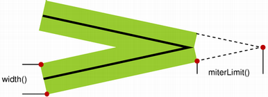
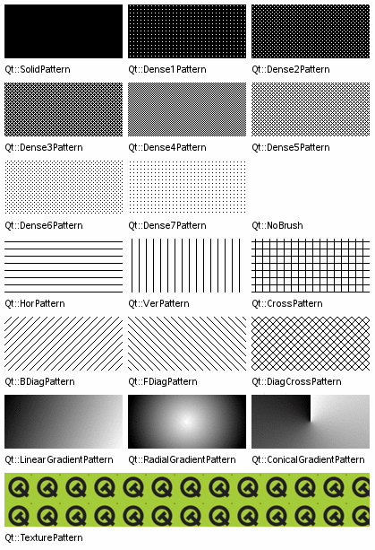

# 15.QPainter和Graphics/View绘图

绘图是指在绘图设备(窗口、控件、图像、打印机等)上将用户构思出的图形绘制出来,图形包括点、线、矩形、多边形、椭圆、文字及保存到磁盘上的图像等。

可以对绘制的图形进行处理如给封闭的图形填充颜色。

PySide6中绘制图形有两种方式,一种是用QPainter类来绘图,另一种是用Graphics/View 框架来绘图。

- QPainter 绘图是过程性绘图,Graphics/View框架绘图是面向对象的绘图;
- QPainter 绘制的图形不能选择和再编辑Graphics/View框架绘制的图形可以选择移动和编辑;
- QPainter 绘图是Graphics/View 绘图的基础。Graphics/View框架可以自定义图项(QGraphicsItem),在自定义图项中用QPainter绘制自己的图形,形成面向对象的图项,进而形成用户自定义的控件

### QPainter绘图

QPainter 是基本的绘图方法,可以绘制各种各样的图形、文字和图像,可以用渐变色填充区域。同时 QPainter 绘图方法是 Graphics/View 绘图框架的基础。

#### QPainter类

利用QPainer 类可以在绘图设备上绘制图片,文字和几何形状,几何形状有点、线、矩形、椭圆、弧形、弦形、饼图、多边形和贝塞尔曲线等。

绘图设备是从 QPaintDevice 继承的类,包括继承自QWidget 的窗口各种控件QPixmap 和 Qlmage。

如果绘图设备是窗口或控件,则QPainter 绘图一般放到 paintEvent()事件或者被 paintEvent()事件调用的函数中用QPainter 类创建

绘图实例的方法如下其中QPaintDevice 是指继承自QPaintDevice的绘图设备。

如果使用不带设备的 QPainter()方法创建实例对象,例如 painter=QPainter(),则在开始绘图前需要用painter,begin(QPaintDevice)方法指定绘图设备,此时painter.isActive()的返回值是 True绘图完成后,需要用painter.end()方法声明完成绘图,之后可以用begin()方法重新指定绘图设备。begin()和 end()方法都返回 bool值。

```python
from PySide6.QtGui import QPainter

QPainter(self) -> None
QPainter(arg__1: PySide6.QtGui.QPaintDevice) -> None 
```


##### QPainter 状态设置的方法

| QPainter的状态设置方法及参数类型                             | 说明                                                 |
| ------------------------------------------------------------ | ---------------------------------------------------- |
| setBackground(bg: Union[QBrush,Qt.BrushStyle,Qt.GlobalColor, QColor,QGradient,QImage,QPixmap]) | 设置背景色,背景色只对不透明 的文字、虚线或位图起作用 |
| setBackgroundMode(mode:Qt.BGMode)                            | 设置透明或不透明背景模式                             |
| setBrush(brush:Union[QBrush,Qt.BrushStyle, Qt.GlobalColor, QColor,QGradient,QImage,QPixmap]) | 设置画刷                                             |
| setBrush(style:Qt.BrushStyle)                                | 设置画刷                                             |
| setBrushOrigin(Union[QPointF,QPoint,QPainterPath.Element])   | 设置画刷的起点                                       |
| setBrushOrigin(x:int,y:int)                                  | 设置画刷的起点                                       |
| setClipPath(QPainterPath,op:Qt.ClipOperation=Qt.ReplaceClip) | 设置剪切路径                                         |
| setClipRect(QRect,op:Qt.ClipOperation=Qt.ReplaceClip)        | 设置剪切矩形区域                                     |
| setClipRect(Union[QRectF,QRect],op=Qt.ReplaceClip)           | 设置剪切矩形区域                                     |
| setClipRect(x: int,y: int,w: int,h:int,op=Qt.ReplaceClip)    | 设置剪切矩形区域                                     |
| setClipRegion(Union[QRegion,QBitmap, QPolygon,QRect],op: Qt.ClipOperation=Qt.ReplaceClip) | 设置剪切区域:                                        |
| setClipping(enable:bool)                                     | 设置是否启动剪切                                     |
| setCompositionMode(mode:QPainter.CompositionMode)            | 设置图形合成模式                                     |
| setFont(f:Union[QFont,str,Sequence[str]])                    | 设置字体                                             |
| setLayoutDirection(direction:Qt.LayoutDirection)             | 设置布局方向                                         |
| setOpacity(opacity:float)                                    | 设置不透明度                                         |
| setPen(color: Union[QColor,Qt.GlobalColor,str])              | 设置钢笔                                             |
| setPen(pen: Union[QPen,Qt.PenStyle,QColor])                  | 设置钢笔                                             |
| setPen(style: Qt.PenStyle)                                   | 设置钢笔                                             |
| setRenderHint(hint: QPainter.RenderHint,on:bool=True)        | 设置渲染模式,例如抗锯齿                              |
| setRenderHints(hints:QPainter.RenderHints,on: bool=True)     | 设置多个渲染模式                                     |
| setTransform(transform:QTransform,combine: bool=False)       | 设置全局变换矩阵                                     |
| setWorldTransform(matrix: QTransform,combine: bool=False)    | 设置全局变换矩阵                                     |
| setViewTransformEnabled(enable:bool)                         | 设置是否启动视口变换                                 |
| setViewport(viewport: QRect)                                 | 设置视口                                             |
| setViewport(x:int,y:int.w:int,h:int)                         | 设置视口                                             |
| setWindow(window:QRect)                                      | 设置逻辑窗口                                         |
| setWindow(x: int,y: int,w:int,h:int)                         | 设置逻辑窗口                                         |
| setWorldMatrixEnabled(enabled: bool)                         | 设置是否启动全局矩阵变换                             |
| save()                                                       | 保存状态到堆栈中                                     |
| restore()                                                    | 从堆栈中恢复状态                                     |

- isActive() 函数指示画家是否处于活动状态。
  - 画家由 begin() 函数和采用QPaintDevice 参数的构造函数激活。
  - end() 函数和析构函数将其停用。
- font() 是用于绘制文本的字体。如果画家是 Active() ,则可以分别使用fontInfo() 和 fontMetrics() 函数检索有关当前设置的字体及其度量的信息。
- brush() 定义用于填充形状的颜色或图案。
- pen() 定义用于绘制线条或边界的颜色或点画。
- backgroundMode() 定义是否存在 background(),即它是 or 或 。OpaqueMode TransparentMode
- background() 仅在 backgroundMode() 为 而 pen() 为 stipple 时才适用。在这种情况下,它描述了小节中背景像素的颜色。OpaqueMode
- brushOrigin() 定义了平铺画笔的原点,通常是小部件背景的原点。
- viewport() , window() , worldTransform() 构成了画家的坐标变换系统。有关详细信息,请参阅坐标系文档。Coordinate Transformations
- hasClipping() 告诉画家是否剪辑。(绘画装置也会夹住。如果画家剪辑,它会剪辑到剪辑区域()。
- layoutDirection() 定义绘制者在绘制文本时使用的布局方向。
- worldMatrixEnabled() 指示是否启用了世界转换。
- viewTransformEnabled() 指示是否启用了视图转换。


##### 用QPainter 绘制五角星的实例

下面先举一个用QPainter 绘制五角星的实例,实例中计算

- 5个顶点的坐标,用QPainter绘制折线方法 

- drawPolyline()绘制五角星并在每个顶点上绘制名称

  

```python
# -*- coding: UTF-8 -*-
# File date: Hi_2023/3/6 23:23
# File_name: 01-用QPainter绘制五角星的实例.py


import sys, math
from PySide6.QtWidgets import QApplication, QWidget
from PySide6.QtGui import QPen, QPainter
from PySide6.QtCore import QPointF
from math import cos, sin, pi


class MyWindow(QWidget):
    def __init__(self, parent=None):
        super().__init__(parent)

        self.resize(600, 500)
        self.painter = QPainter()

    def paintEvent(self, event):
        if self.painter.begin(self):
            font = self.painter.font()
            font.setPixelSize(20)
            self.painter.setFont(font)  # 设置字体

            pen = QPen()  # 钢笔
            pen.setWidth(5)  # 线条宽度
            self.painter.setPen(pen)  # 设置钢笔
            r = 100  # 五角星的外接圆半径

            x = self.width() / 2
            y = self.height() / 2
            p1 = QPointF(r * cos(-90 * pi / 180) + x, r * sin(-90 * pi / 180) + y)
            p2 = QPointF(r * cos(-18 * pi / 180) + x, r * sin(-18 * pi / 180) + y)
            p3 = QPointF(r * cos(54 * pi / 180) + x, r * sin(54 * pi / 180) + y)
            p4 = QPointF(r * cos(126 * pi / 180) + x, r * sin(126 * pi / 180) + y)
            p5 = QPointF(r * cos(198 * pi / 180) + x, r * sin(198 * pi / 180) + y)

            self.painter.drawPolyline([p1, p3, p5, p2, p4, p1])  # 绘制折线
            self.painter.drawText(p1, "p1")  # 绘制文字
            self.painter.drawText(p2, "p2")
            self.painter.drawText(p3, "p3")
            self.painter.drawText(p4, "p4")
            self.painter.drawText(p5, "p5")

            if self.painter.isActive():
                self.painter.end()


if __name__ == '__main__':
    app = QApplication(sys.argv)
    win = MyWindow()

    win.show()
    sys.exit(app.exec())

```

#### 钢笔QPen的用法

钢笔 QPen 用于绘制线条,线条有样式(实线、虚线、点虚线)、颜色、宽度等属性用QPainter 的 setPen(QPen)方法为 QPainter 设置钢笔。

用QPen 创建钢笔的方法如下

- s是QtPenStyle的举值用于设置钢笔的样式;
- 画刷 brush 可以用QBrush,QColorQt.GlobalColor和 QGradient 来设置;
- c是 Qt.PenCapStyle 的枚举值,用于设置线条端点样式;
- j是Qt.PenJoinStyle 的枚举值,用于设置线条连接点处的样式。
- 钢笔默认的颜色是黑色,宽度是1像素,样式是实线,端点样式是 Qt.SquareCap,连接处是 Qt.BevelJoin。

```python
from PySide6.QtGui import QPen

QPen(self) -> None
QPen(arg__1: PySide6.QtCore.Qt.PenStyle) -> None
QPen(brush: Union[PySide6.QtGui.QBrush, PySide6.QtCore.Qt.BrushStyle, PySide6.QtCore.Qt.GlobalColor, PySide6.QtGui.QColor, PySide6.QtGui.QGradient, PySide6.QtGui.QImage, PySide6.QtGui.QPixmap], width: float, s: PySide6.QtCore.Qt.PenStyle = Instance(Qt.SolidLine), c: PySide6.QtCore.Qt.PenCapStyle = Instance(Qt.SquareCap), j: PySide6.QtCore.Qt.PenJoinStyle = Instance(Qt.BevelJoin)) -> None
QPen(color: Union[PySide6.QtGui.QColor, PySide6.QtGui.QRgba64, Any, PySide6.QtCore.Qt.GlobalColor, str, int]) -> None
QPen(pen: Union[PySide6.QtGui.QPen, PySide6.QtCore.Qt.PenStyle, PySide6.QtGui.QColor]) -> None 
```

##### 钢笔QPen的常用方法

钢笔QPen的常用方法如表所示,主要方法介绍如下

| QPen的方法及参数类型                                         | > 说 明                              |
| ------------------------------------------------------------ | ------------------------------------ |
| setStyle(Qt.PenStyle)                                        | 设置线条样式                         |
| style()                                                      | 获取线条样式                         |
| setWidth(int)、setWidthF(float)                              | 设置线条宽度                         |
| widtb()、widthF()                                            | 获取线条宽度                         |
| isSolid()                                                    | 获取线条样式是否是实线填充           |
| setBrush(brush:Union[QBrush, Qt.BrushStyle, QColor, Qt.GlobalColor,QGradient,QImage,QPixmap]) | 设置画刷                             |
| brusb()                                                      | 获取画刷 QBrush                      |
| setCapStyle(Qt.PenCapStyle)                                  | 设置线端部的样式                     |
| capStyle()                                                   | 获取线端部的样式 Qt.PenCapStyle      |
| setColor(Union[QColor,Qt.GlobalColor,str,int])               | 设置颜色                             |
| color()                                                      | 获取颜色QColor                       |
| setCosmetic(cosmetic:bool)                                   | 设置是否进行装饰                     |
| isCosmetic()                                                 | 获取是否进行装饰                     |
| setDashOffset(doffset: float)                                | 设置虚线开始绘制的点与线起始点的距离 |
| setDashPattern(pattern:Sequence[float])                      | 设置用户自定义虚线样式               |
| dashPattern()                                                | 获取自定义样式                       |
| setJoinStyle(Qt.PenJoinStyle)                                | 设置两相交线连接点处的样式           |
| setMiterLimit(float)                                         | 设置斜接延长线的长度                 |

- 线条的宽度用setWidth(int)或 setWidthF(float)方法设置

  - 如果宽度始终为0,表示是装饰线条;
  - 装饰线条也可用setCosmetic(bool)方法设置。

- 装饰线条是指具有恒定宽度的边,可确保线条在不同缩放比例下具有相同的宽度。

  - 线条的样式用setStyle(Qt.PenStyle)方法设置参数 Qt.PenStyle可取的值如表所示

    | Qt.PenStyle的取值 | 值   | 说明       | Qt.PenStyle的取值 | 值   | 说 明    |
    | ----------------- | ---- | ---------- | ----------------- | ---- | -------- |
    | Qt.NoPen          | 0    | 不绘制线条 | Qt.DashDotLine    | 4    | 点画线   |
    | Qt.SolidLine      | 1    | 实线       | Qt.DashDotDotLine | 5    | 双点画线 |
    | Qt.DashLine       | 2    | 虚线       | Qt.CustomDashLine | 6    | 自定义线 |
    | Qt.DotLine        | 3    | 点线       |                   |      |          |

  - 其中自定义样式需要用setDashPattern(Sequence[float])方法设置,这些样式的外观如图所示。

    

  - 钢笔的端点样式用SetCapStyle(Qt.PenCapStyle)方法设置,其中参数 Qt.PenCapStyle可取以下值,这些样式的区别如图所示。

    

    - Qt.FlatCap 不包含端点
    - Qt.SquareCap 包含端点,并延长半个宽度。
    - Qt.RoundCap

  - 两个线条连接点处的样式用setJoinStyle(QtPenJoinStyle)方法设置,其中参数Qt.PenJoinStyle 可取以下值,样式如图所示。

    

    - Qt.MiterJoin

    - Qt.BevelJoin 

    - Qt.RoundJoin 

    - Qt.SvgMiterJoin

    - 当线条连接样式是Qt.MiterJoin 时,用setMiterLimit(float)方法设置延长线的长度其中参数 float 是线条宽度的倍数,默认是 20其延长线的含义如图所示:

      

      

  - 用setDashPattern(Sequence[float])方法可以自定义虚线样式,其中参数的奇数项表示实线的长度,偶数项表示空白处的长度,长度以线宽为单位表示为线宽的倍数。

    - 例如 setDashPattern([4,2,4,2])表示实线的长度是线宽的四倍
    - 而空白处的长度是线宽的两倍用setDashOffset(float)方法可以设置虚线开始绘制的点与线起始点之间的距离,如果这个距离是动态的,则会形成动画效果。

##### 钢笔QPen的应用实例

下面的程序用钢笔绘制一个带有背景图像、形状是"Z"形的虚线图


```python
# -*- coding: UTF-8 -*-
# File date: Hi_2023/3/6 23:45
# File_name: 02- 钢笔QPen的应用实例.py


import sys, math
from PySide6.QtWidgets import QApplication, QWidget
from PySide6.QtGui import QPen, QPainter, QPixmap
from PySide6.QtCore import QPointF, Qt


class MyWindow(QWidget):
    def __init__(self, parent=None):
        super().__init__(parent)

        self.resize(600, 500)

    def paintEvent(self, event):
        painter = QPainter(self)

        pix = QPixmap(r"../../Resources/images/d8.png")  # 图像
        pen = QPen(pix, 10)  # 含有背景图像的钢笔,线宽是 40
        pen.setStyle(Qt.DashLine)
        pen.setJoinStyle(Qt.MiterJoin)
        painter.setPen(pen)  # 设置钢笔

        p1 = QPointF(50, 50)
        p2 = QPointF(self.width() - 50, 50)
        p3 = QPointF(50, self.height() - 50)
        p4 = QPointF(self.width() - 50, self.height() - 50)
        painter.drawPolyline([p1, p2, p3, p4])  # 绘制折线


if __name__ == '__main__':
    app = QApplication(sys.argv)
    win = MyWindow()

    win.show()
    sys.exit(app.exec())

```

#### 画刷QBrush的用法

对于封闭的图形,如矩形、圆等,用画刷 QBrush 可以在其内部填充颜色、样式、渐变、纹理或图案。

用QBrush类创建画刷的方法如下所示其中 bs是 Qt.BrushStyle 的枚举值,用于设置画刷的风格。

```python
from PySide6.QtGui import QBrush

QBrush(self) -> None
QBrush(brush: Union[PySide6.QtGui.QBrush, PySide6.QtCore.Qt.BrushStyle, PySide6.QtCore.Qt.GlobalColor, PySide6.QtGui.QColor, PySide6.QtGui.QGradient, PySide6.QtGui.QImage, PySide6.QtGui.QPixmap]) -> None
QBrush(bs: PySide6.QtCore.Qt.BrushStyle) -> None
QBrush(color: PySide6.QtCore.Qt.GlobalColor, bs: PySide6.QtCore.Qt.BrushStyle = Instance(Qt.SolidPattern)) -> None
QBrush(color: PySide6.QtCore.Qt.GlobalColor, pixmap: Union[PySide6.QtGui.QPixmap, PySide6.QtGui.QImage, str]) -> None
QBrush(color: Union[PySide6.QtGui.QColor, PySide6.QtGui.QRgba64, Any, PySide6.QtCore.Qt.GlobalColor, str, int], bs: PySide6.QtCore.Qt.BrushStyle = Instance(Qt.SolidPattern)) -> None
QBrush(color: Union[PySide6.QtGui.QColor, PySide6.QtGui.QRgba64, Any, PySide6.QtCore.Qt.GlobalColor, str, int], pixmap: Union[PySide6.QtGui.QPixmap, PySide6.QtGui.QImage, str]) -> None
QBrush(gradient: Union[PySide6.QtGui.QGradient, PySide6.QtGui.QGradient.Preset]) -> None
QBrush(image: Union[PySide6.QtGui.QImage, str]) -> None
QBrush(pixmap: Union[PySide6.QtGui.QPixmap, PySide6.QtGui.QImage, str]) -> None 
```

##### 画刷QBrush的常用方法

画刷 QBrush 的常用方法如表所示,主要方法介绍如下

| QBrush的方法和参数类型                     | 返回值的类型  | 说明           |
| ------------------------------------------ | ------------- | -------------- |
| setStyle(Qt.BrushStyle)                    | None          | 设置风格       |
| style()                                    | Qt.BrushStyle | 获取风格       |
| set Texture(QPixmap)                       | None          | 设置纹理图片   |
| texture()                                  | QPixmap       | 获取纹理图片   |
| setTextureImage(QImage)                    | None          | 设置纹理图片   |
| textureImage()                             | Qlmage        | 获取纹理图片   |
| setColor(Union[QColor,Qt.GlobalColor,str]) | Nonei         | 设置颜色       |
| color()                                    | QColor        | 获取颜色       |
| gradient()                                 | QGradient     | 获取渐变色·    |
| setTransform(QTransform)                   | None \(k      | 设置变换矩阵 5 |
| transform()                                | QTransform    | 返回变换矩阵5  |
| isOpaque()                                 | bool          | 获取是否不透明 |

- 画刷的风格用setStyle(Qt.BrushStyle)方法设置,其中参数 QtBrushStyle 的取值和示意图如图示。

  

- 画刷的纹理可以用setTexture(QPixmap)或 setTexturelmage(QImage)方法来设置,这时样式被设置成QtTexturePattern。

##### 画刷QBrush的应用实例

下面的程序在窗口中绘制一个矩形框,并在矩形框中用画刷填充网格线


```python
# -*- coding: UTF-8 -*-
# File date: Hi_2023/3/7 0:03
# File_name: 03- 画刷QBrush的应用实例.py


import sys
from PySide6.QtWidgets import QApplication, QWidget
from PySide6.QtGui import QPen, QPainter, QBrush
from PySide6.QtCore import Qt.QPointF, QRectF


class MyWindow(QWidget):
    def __init__(self, parent=None):
        super().__init__(parent)

    def paintEvent(self, event):
        painter = QPainter(self)

        pen = QPen()  # 钢笔
        pen.setColor(Qt.blue)
        pen.setWidth(5)  # 线条宽度
        painter.setPen(pen)  # 设置钢笔

        brush = QBrush(Qt.red, Qt.DiagCrossPattern)  # 画刷,同时设置颜色和风格
        painter.setBrush(brush)  # 设置画刷

        p1 = QPointF(self.width() / 4, self.height() / 4)
        p2 = QPointF(3 * self.width() / 4, 3 * self.height() / 4)
        painter.drawRect(QRectF(p1, p2))  # 绘制矩形


if __name__ == '__main__':
    app = QApplication(sys.argv)
    win = MyWindow()

    win.show()
    sys.exit(app.exec())

```


#### 新变色QGradient的用法

在用画刷进行填充时,可以设置填充颜色为渐变色。

所谓渐变色是指在两个不重合的点处分别设置不同的颜色,这两个点一个是起点,另一个是终点,这两个点之间的颜色从起点的颜色逐渐过渡到终点的颜色。

定义渐变色的类是 QGradient,渐变样式分为 3 种类型分别为

- 线性渐变 QLinearGradient
- 径向渐变QRadialGradient 
- 圆渐变QConicalGradient


它们都继承自 QGradient 类,也会继承QGradient 类的属性和方法。这3种渐变的样式如图所示。

- 用QLinearGradient类创建线性渐变色的方法如下所示。线性渐变需要一个线性渐变矩形区域(起始和终止位置),参数用于确定这个矩形区域

  

  ```python
  from PySide6.QtGui import QLinearGradient
  
  QLinearGradient(self) -> None
  QLinearGradient(QLinearGradient: PySide6.QtGui.QLinearGradient) -> None
  QLinearGradient(start: Union[PySide6.QtCore.QPointF, PySide6.QtCore.QPoint, PySide6.QtGui.QPainterPath.Element], finalStop: Union[PySide6.QtCore.QPointF, PySide6.QtCore.QPoint, PySide6.QtGui.QPainterPath.Element]) -> None
  QLinearGradient(xStart: float, yStart: float, xFinalStop: float, yFinalStop: float) -> None
  ```

  

- 用QRadialGradient类创建径向渐变色的方法如下。径渐变需要的几何参数如图所示,需要确定圆心位置、半径、焦点位置和焦点半径。径向渐变的构造函数中,

  - 第 1个参数是圆心位置,可以用点或坐标定义;
  - 第 2 个参数是半径;
  - 第 3 个参数是焦点位置,可以用点或坐标定义;
  - 第 4 个参数是焦点半径。

  如果焦点设置到圆的外面则取圆上的点作为焦点。

  

  ```python
  from PySide6.QtGui import QRadialGradient
  
  QRadialGradient(self) -> None
  QRadialGradient(QRadialGradient: PySide6.QtGui.QRadialGradient) -> None
  QRadialGradient(center: Union[PySide6.QtCore.QPointF, PySide6.QtCore.QPoint, PySide6.QtGui.QPainterPath.Element], centerRadius: float, focalPoint: Union[PySide6.QtCore.QPointF, PySide6.QtCore.QPoint, PySide6.QtGui.QPainterPath.Element], focalRadius: float) -> None
  QRadialGradient(center: Union[PySide6.QtCore.QPointF, PySide6.QtCore.QPoint, PySide6.QtGui.QPainterPath.Element], radius: float) -> None
  QRadialGradient(center: Union[PySide6.QtCore.QPointF, PySide6.QtCore.QPoint, PySide6.QtGui.QPainterPath.Element], radius: float, focalPoint: Union[PySide6.QtCore.QPointF, PySide6.QtCore.QPoint, PySide6.QtGui.QPainterPath.Element]) -> None
  QRadialGradient(cx: float, cy: float, centerRadius: float, fx: float, fy: float, focalRadius: float) -> None
  QRadialGradient(cx: float, cy: float, radius: float) -> None
  QRadialGradient(cx: float, cy: float, radius: float, fx: float, fy: float) -> None
  ```

- 用QConicalGradient 创建圆锥渐变色的方法如下所示。如图所示圆锥渐变需要的几何参数为圆心位置和起始角度a,角度必须在0~360之间,圆心位置可以用点或坐标来定义

  

  ```python
  from PySide6.QtGui import QConicalGradient
  
  QConicalGradient(self) -> None
  QConicalGradient(QConicalGradient: PySide6.QtGui.QConicalGradient) -> None
  QConicalGradient(center: Union[PySide6.QtCore.QPointF, PySide6.QtCore.QPoint, PySide6.QtGui.QPainterPath.Element], startAngle: float) -> None
  QConicalGradient(cx: float, cy: float, startAngle: float) -> None 
  ```

  


##### QGradient,OLinearGradient,ORadialGradient 和 OConicalGradient 的常用方法

QGradient,QLinearGradient,QRadialGradient 和 QConicalGradient 的常用方法如表所示,主要方法介绍如下。

QLinearGradient,QRadialGradient 和 QConicalGradient 继承自QGradient,因此也会继承 QGradient 的方法

| QGradient渐变类的常用方法及参数类型                     | 说明         |
| ------------------------------------------------------- | ------------ |
| setCoordinateMode(QGradient.CoordinateMode)             | 设置坐标模式 |
| setColorAt(pos:float,Union[QColor,Qt.GlobalColor,str])  | 设置颜色     |
| setStops(stops:Sequence[Tuple[float,QColor]])           | 设置颜色     |
| setInterpolationMode(mode: QGradient.InterpolationMode) | 设置插值模式 |
| setSpread(QGradient.Spread)                             | 设置扩展方式 |
| type()->QGradient.Type                                  | 获取类型     |


| QLinearGradient渐变类的常用方法及参数类型                | 说明       |
| -------------------------------------------------------- | ---------- |
| setStart(Union[QPointF,QPoint,QPainterPath.Element])     | 设置起始点 |
| setStart(x: float,y:float)                               | 设置起始点 |
| start()->QPointF                                         | 获取起始点 |
| setFinalStop(Union[QPointF,QPoint,QPainterPath.Element]) | 设置终止点 |
| setFinalStop(x: float,y: float)                          | 设置终止点 |
| finalStop()> QPointF                                     | 获取终止点 |


| QRadialGradient渐变类的常用方法及参数类型 | 说明         |
| ----------------------------------------- | ------------ |
| setCenter(Union[QPointF,QPoint])          | 设置圆心     |
| setCenter(x: float,y:float)               | 设置圆心     |
| setRadius(radius: float)                  | 设置半径     |
| setCenterRadius(radius:float)             | 设置半径     |
| setFocalPoint(Union[QPointF,QPoint])      | 设置焦点位置 |
| setFocalPoint(float,float)                | 设置焦点位置 |
| setFocalRadius(radius:float)              | 设置焦点半径 |


| QConicalGradient渐变类的常用方法及参数类型 | 说明         |
| ------------------------------------------ | ------------ |
| setCenter(Union[QPointF,QPoint])           | 设置圆心     |
| setCenter(x: float,y: float)               | 设置圆心     |
| setAngle(float)                            | 设置起始角度 |

- 在渐变区域内,可以在多个点设置颜色值,这些点之间的颜色值根据两侧的颜色来确定

  - 在定义内部点的颜色值时,通常通过逻辑坐标来定义,渐变区域内的起始点的逻辑值是 0终止点的逻辑值是 1。
  - 如果要在中间位置定义颜色,可以用setColorAt()方法来定义,例如 setColorAt(0.1,Qtblue)、setColorAt(0.4,Qt.yellow)和 setColorAt(0.6,Qtred)定义了3个位置处的颜色值;
  - 也可以用setStops()方法一次定义多个颜色值,例如 setStops([(0.1,Qt.red),(0.5,Qt.blue)])定义了两个点处的颜色值。

- 用stops()方法可以获得逻辑坐标和颜色值。

  - 用setCoordinateMode(QGradient,CoordinateMode)方法可以设置坐标的模式,参数 QGradient.CoordinateMode 的取值如表所示

    | QGradient.CoordinateMode 的取值 | 值   | 说明                                                         |
    | ------------------------------- | ---- | ------------------------------------------------------------ |
    | QGradient.LogicalMode           | 0    | 逻辑方式,起始点为0,终止点为1。这是默认值                     |
    | QGradient.ObjectMode            | 3    | 相对于绘图区域矩形边界 的逻辑坐标,左上角的坐标是(0, 0),右下角的坐标是(1,1) |
    | QGradient.StretchToDeviceMode   | 1    | 相对于绘图设备矩形边界的逻辑坐标,左上角的坐标是(0, 0),右下角的坐标是(1,1) |
    | QGradient.ObjectBoundingMode    | 2    | 该方法与QGradient.ObjectMode 基本相同,除了 QBrush.translorm()应用于逻辑空间而不是物理空间 |

- 当设置的渐变区域小于填充区域时,渐变颜色可以扩展到渐变区域以外的空间。

  - 扩展模式用setSpread(QGradient.Spread)方法定义,参数 QGradient.Spread 的取值如表所示。

    | QGradient.Spread的取值  | 值   | 说:明            |
    | ----------------------- | ---- | ---------------- |
    | Qgradient.PadSpread     | 0    | 用最近的颜色扩展 |
    | Qgradient.RepeatSpread  | 2    | 重复渐变         |
    | Qgradient.ReflectSpread | 1    | 对称渐变         |

  - 扩展模式不适合圆锥渐变,圆锥渐变没有固定的边界。

- 用setInterpolationMode(mode; QGradientInterpolationMode)方法设置渐变色内部的插值模式,参数可取 QGradient,ColorInterpolation 或 QGradient,ComponentInterpolation。

- 用type()方法可以获取渐变类型,返回值可能是:

  - QGradient.LinearGradient
  - QGradient.RadialGradient
  - QGradient.ConicalGradient 
  - QGradient.NoGradient(无渐变色)


##### QGradient、QLinearGradient,ORadialGradient 和 OConicalGradient 的应用实例

下面的程序将窗口工作区分成4个矩形,在这4个矩形中分别绘制线性渐变圆锥渐变和径向渐变,并应用扩展,程序运行界面如图所示


```python
# -*- coding: UTF-8 -*-
# File date: Hi_2023/3/7 13:25
# File_name: 04- QGradient、QLinearGradient,ORadialGradient 和 OConicalGradient 的应用实例.py


import sys
from PySide6.QtWidgets import QApplication, QWidget
from PySide6.QtGui import QPen, QPainter, QBrush, QLinearGradient, QRadialGradient, QConicalGradient
from PySide6.QtCore import Qt.QPointF, QRectF


class MyWindow(QWidget):
    def __init__(self, parent=None):
        super().__init__(parent)

        self.resize(800, 400)

    def paintEvent(self, event):
        painter = QPainter(self)

        pen = QPen()
        pen.setColor(Qt.darkBlue)
        pen.setStyle(Qt.DashLine)
        pen.setWidth(5)
        painter.setPen(pen)
        w = self.width()
        h = self.height()

        linear = QLinearGradient(QPointF(0, 0), QPointF(w / 8, 0))  # 线性渐变
        linear.setStops([(0, Qt.red),(0.3, Qt.yellow),(0.6, Qt.green),(1, Qt.blue)])  # 设置颜色

        linear.setSpread(QLinearGradient.ReflectSpread)  # 镜像扩展
        brush1 = QBrush(linear)  # 用线性渐变定义刷子
        painter.setBrush(brush1)
        painter.drawRect(QRectF(0, 0, w / 2, h / 2))  # 画矩形

        conical = QConicalGradient(QPointF(w / 4 * 3, h / 4), h / 6)
        conical.setAngle(60)  # 起始角度
        conical.setColorAt(0, Qt.red)
        conical.setColorAt(1, Qt.yellow)
        brush2 = QBrush(conical)
        painter.setBrush(brush2)
        painter.drawRect(QRectF(w / 2, 0, w / 2, h / 2))

        radial1 = QRadialGradient(QPointF(w / 4, h / 4 * 3), w / 8, QPointF(w / 4, h / 4 * 3) / 15)
        radial1.setColorAt(0, Qt.red)
        radial1.setColorAt(0.5, Qt.yellow)
        radial1.setColorAt(1, Qt.blue)
        radial1.setSpread(QRadialGradient.RepeatSpread)
        brush3 = QBrush(radial1)
        painter.setBrush(brush3)
        painter.drawRect(QRectF(0, h / 2, w / 2, h / 2))

        radial2 = QRadialGradient(QPointF(w / 4 * 3, h / 4 * 3), w / 6, QPointF(w / 5 * 4, h / 5 * 4), w / 10)
        radial2.setColorAt(0, Qt.red)
        radial2.setColorAt(0.5, Qt.yellow)
        radial2.setColorAt(1, Qt.blue)
        radial2.setSpread(QRadialGradient.ReflectSpread)
        brush4 = QBrush(radial2)
        painter.setBrush(brush4)
        painter.drawRect(QRectF(w / 2, h / 2, w / 2, h / 2))


if __name__ == '__main__':
    app = QApplication(sys.argv)
    win = MyWindow()

    win.show()
    sys.exit(app.exec())

```


#### 绘制几何图形

QPainter 可以在绘图设备上绘制点、直线、折线矩形、圆、弧弦文本和图像等,绘制几何图形的方法介绍如下。

##### 绘制点

QPainter 绘制点的方法如表所示。可以一次绘制一个点,也可以一次绘制多个点其中QPolygon和QPolygonF 是用于存储QPoint 和QPointF 的类

| QPainter绘制单点的方法              | QPainter绘制多点的方法                                       |
| ----------------------------------- | ------------------------------------------------------------ |
| drawPoint(p:QPoint)                 | drawPoints(Sequence[QPointF])                                |
| drawPoint(pt:Union[QPointF,QPoint]) | drawPoints(Sequence[QPoint])                                 |
| drawPoint(x:int,y: int)             | drawPoints(points:Union[QPolygon,Sequence[QPoint], QRect])   |
| drawPoint(pt: QPainterPath.Element) | drawPoints(points: Union[QPolygonF, .Sequence[QPointF],QPolygon,QRectF]) |

QPolygon和QPolygonF用于存储多个QPoint和QPointF,

- 创建QPolygon实例的方法是QPolygon()或者QPolygon(Sequence[QPoint])
- 创建 QPolygonF 实例的方法是QPolygonF()或QPolygonF(Sequence[Union[QPointF,QPoint]])。
- 用QPolygon的append(QPoint)方法可以添加点,用insert(int,QPoint)方法可以插人点,用setPoint(int;QPoint)方法可以更改点;
- 用QPolygonF的append(Union[QPointF,QPoint])方法可以添加点,用insert(int,Union[QPointF,QPoint])方法可以插人点。

##### 绘制直线

QPainter 绘制直线的方法如表所示。绘制直线需要用两个点。可以一次绘制一条直线,也可一次绘制多条直线,其中 QLine或 QLineF 是2D 直线类。

| QPainter绘制单条直线的方法                                   | QPainter绘制多条直线的方法              |
| ------------------------------------------------------------ | --------------------------------------- |
| drawLine(line:QLine)                                         | drawLines(lines:Sequence[QLineF])       |
| drawLine(line:Union[QLineF,QLine])                           | drawLines(lintes:Sequence[QLine])       |
| drawLine(pl:QPoint,p2:QPoint)                                | drawLines(pointPairs:Sequence[QPointF]) |
| drawLine(pl:Union[QPointF, QPoint],p2: Union[QPointF,QPoint]) | drawLines(pointPairs:Sequence[QPoint])  |
| drawLine(x1:int,y1:int,x2:int,y2:int)                        | drawLines(pointPairs:Sequence[QPoint])  |

QLine和 QLineF 用于定义二维直线,绘制二维直线需要用两个点。

- 用QLine 类定义直线实例的方法有 
  - QLine()
  - QLine(QPoint,QPoint)
  - QLine(xl:int,yl;int,x2:int;y2:int),
- 用QLineF 类定义直线实例的方法有 
  - QLineF(QLine)
  - QLineF()
  - QLineF(Union[QPointF,QPoint],Union[QPointF, QPoint])
  - QLineF(xl: float,yl: float, x2: float,y2: float)。
- 用QLine的 setLine(xl;int,yl:int,x2;int,y2; int)方法、setP1(QPoint)方法、setP2(QPoint)或setPoints(QPoint,QPoint)方法可以设置线两端的点。
  - QLineF 也有同样的方法,只需把参数 int 改成float,或QPoint改成QPointF。

##### 绘制折线

绘制折线必须用两个点,即使两条折线的终点和起始点相同,每条折线也必须用两个点来定义。折线由多个折线段构成,绘制折线需要给出多个点,上个折线段的终点是下个折线段的起始点。QPainter绘制折线的方法如表所示。

| QPainter绘制折线的方法                                       | 说明 |
| ------------------------------------------------------------ | ---- |
| drawPolyline(Sequence[QPointF])                              |      |
| drawPolyline(polygon: Union[QPolygon, Sequence[QPoint], QRect]) |      |
| drawPolyline(Sequence[QPoint])                               |      |
| drawPolyline(Union[QPolygonF,Sequence[QPointF],QPolygon, QRectF]) |      |

##### QPainter 绘制多边形和凸多边形的方法

QPainter 绘制多边形和凸多边形的方法如表所示。

- 使用这些方法时,需要给出多边形或凸多边形的顶点,系统会自动在起始点和终止点之间建立直线,使多边形封闭。

- 参数fillRule是QtFillRule的举类型用于确定一个点是否在图形内部在内部的区域可以进行填充。filiRule可以取Qt.OddEvenFill或Qt.WindingFill,这两种填充规则如图所示。

  

  - Qt.OddEvenFill是奇偶填充规则,要判断一个点是否在图形中可以从该点向图形外引一条水平线,如果该水平线与图形的交点个数为奇数,那么该点在图形中。

  - Qt.WindingFil1是非零绕组填充规则要判断一个点是否在图形中可以从该点向图形外引一条水平线,如果该水平线与图形的边线相交,这个边线是顺时针绘制的,就记为1,是逆时针绘制的就记为-1,然后将所有数值相加,若结果不为 0,那么该点就在图形中。图形的绘制方向会影响填充的判断。

    

| QPainter 绘制多边形的方法                                    | 说明                                                    |
| ------------------------------------------------------------ | ------------------------------------------------------- |
| drawPolygon(Sequence[QPointF],Qt.FillRule)                   | 使用填充规则fillRule绘制由给定点(QPointF)定义的多边形。 |
| drawPolygon(Sequence[QPoint],Qt.FillRule)                    | 使用填充规则fillRule绘制由给定点(QPoint)定义的多边形。  |
| drawPolygon(polygon: Union[QPolygon, Sequence[QPoint], QRect], fillRule: Qt.FillRule = Qt.OddEvenFill) |                                                         |
| drawPolygon(polygon: Union[QPolygonF,Sequence[QPointF],QPolygon,QRectF],fillRule: Qt.FillRule = Qt.OddEvenFill) |                                                         |

| QPainter 绘制凸多边形的方法                                  | 说明 |
| ------------------------------------------------------------ | ---- |
| drawConvexPolygon(Sequence[QPointF])                         |      |
| drawConvexPolygon(Sequence[QPoint])                          |      |
| drawConvexPolygon(polygon:Union[QPolygon,Sequence[QPoint],QRect]) |      |
| drawConvexPolygon(polygon: Union[QPolygonF,Sequence[QPointF], QPolygon, QRectF]) |      |


下面的程序用绘制多边形的方法绘制两个五角星,并分别采用奇偶填充规则和非零绕组填充规则进行填充,程序运行结果如图所示,


```python
# -*- coding: UTF-8 -*-
# File date: Hi_2023/3/8 13:24
# File_name: 05-绘制多边形的方法绘制两个五角星.py


from PySide6.QtWidgets import QApplication, QWidget
from PySide6.QtGui import QPen, QPainter, QBrush
from PySide6.QtCore import QPointF, Qt
from math import cos, sin, pi
import sys


class MyWindow(QWidget):
    def __init__(self, parent=None):
        super().__init__(parent)

        self.resize(600, 500)

    def paintEvent(self, event):
        painter = QPainter(self)

        pen = QPen()  # 钢笔
        pen.setWidth(2)  # 线条宽度
        painter.setPen(pen)  # 设置钢笔
        bush = QBrush(Qt.SolidPattern)
        painter.setBrush(bush)

        r = 100  # 五角星的外接圆半径

        x = self.width() / 4
        y = self.height() / 2
        p1 = QPointF(r * cos(-90 * pi / 180) + x, r * sin(-90 * pi / 180) + y)
        p2 = QPointF(r * cos(-18 * pi / 180) + x, r * sin(-18 * pi / 180) + y)
        p3 = QPointF(r * cos(54 * pi / 180) + x, r * sin(54 * pi / 180) + y)
        p4 = QPointF(r * cos(126 * pi / 180) + x, r * sin(126 * pi / 180) + y)
        p5 = QPointF(r * cos(198 * pi / 180) + x, r * sin(198 * pi / 180) + y)

        # 绘制多边形
        painter.drawPolygon([p1, p3, p5, p2, p4], Qt.FillRule.OddEvenFill)
        offset = QPointF(self.width() / 2, 0)
        painter.drawPolygon([p1 + offset, p3 + offset, p5 + offset, p2 + offset, p4 + offset], Qt.WindingFill)


if __name__ == '__main__':
    app = QApplication(sys.argv)
    win = MyWindow()

    win.show()
    sys.exit(app.exec())

```

##### 绘制矩形

QPainter 可以一次绘制一个矩形,也可以一次绘制多个矩形。

QPainter 绘制矩形的方法如表所示,其中drawRect(xl:int,yl;int,w:int,h:int)方法中xl和y1参数确定左上角的位置,w 和h参数确定宽度和高度。

| QPainter绘制单个矩形的方法          | QPainter绘制多个矩形的方法             |
| ----------------------------------- | -------------------------------------- |
| drawRect(rect:QRect)                | drawRects(rectangles:Sequence[QRectF]) |
| drawRect(rect: Union[QRectF,QRect]) | drawRects(rectangles:Sequence[QRect])  |
| drawRect(xl:int,yl:int,w:int,h:int) |                                        |

##### 绘制圆角矩形

圆角矩形是在矩形的基础上对4个角分别用一个圆进行倒圆角,其示意图如图所示。要绘制圆角矩形,除了需要设置绘制矩形的参数外,还需要设置椭圆的两个半径。


QPainter 绘制椭圆的方法有 

- drawRoundedRect(rect: Union[QRectF,QRect]xRadius: float,yRadius: float, mode; Qt.SizeMode =Qt AbsoluteSize)
- drawRoundedRect(x; int,y: int,w; int,h; int,xRadius; float,yRadius: float,mode: Qt.SizeMode = QtAbsoluteSize)
- 其中参数 mode是 Qt.SizeMode 的枚举类型可以取 Qt.AbsoluteSize或Qt.RelativeSize,分别确定圆半径是绝对值还是相对于矩形边长的相对值。


##### 绘制椭圆、扇形、弧和弦

一个椭圆有两个半径。确定一个椭圆有两种方法:

- 一种是先确定一个矩形边界,在矩形内部作一个与矩形相切的内切椭圆
- 另一种是先定义一个中心,再定义两个半径。

绘制椭圆示意图如图所示。

- 如果矩形边界是正方形或者圆的两个半径相等,圆就变成了圆。

- 扇形是椭圆的一部分,绘制扇形时除了确定椭圆的几何数据外,还需要确定扇形的起始角和跨度角。需要特别注意的是,起始角和跨度角都是用输人值的 1/16 计算,如要求起始角为45°,跨度角为60则需要输人的起始角为`45*16`,跨度角为`60*16`,例如 painter.drawPie(QRect(300,300,200,100),45 * 16,60*16)。


QPainter 绘制圆和扇形的方法如表所示

| QPainter绘制椭圆的方法                                       | QPainter 绘制扇形的方法                            |
| ------------------------------------------------------------ | -------------------------------------------------- |
| drawEllipse(center:[QPointF,QPoint],rx:int, ry: int)         | drawPie(QRect,a: int,alen:int)                     |
| drawEllipse(r:QRect)                                         | drawPie(rect:Union[QRectF,QRect],a: int,alen: int) |
| drawEllipse(r:Union[QRectF,QRect]) Q)7x53                    | drawPie(x;int,y:int,w:int,h;int,a: int, alen: int) |
| drawEllipse(x；int,y:int,w:int,h:int)                        |                                                    |
| drawEllipse(center:QPainterPath.Element,rx: float,ry: float) |                                                    |


绘制弧和绘制弦的参数与绘制扇形的参数相同,只不过是从圆上截取的部分不同QPainter绘制弧和弦的方法如表所示。

| QPainter绘制弧的方法                                | QPainter绘制弦的方法                                    |
| --------------------------------------------------- | ------------------------------------------------------- |
| drawArc(QRect,a: int,alen: int)                     | drawChord(QRect,a; int,alen:int)                        |
| drawArc(rect: Union[QRectF,QRect],a: int, alen:int) | drawChord(rect:Union[QRectF, QRect], a: int, alen: int) |
| drawArc(x:int,y;int,w:int,h;int,a: int,alen: int)   | drawChord(x;int,y:int,w:int,h:int,a: int,alen: int)     |

##### 抗锯齿

在绘制几何图像和文字时,如果线条是斜线,对线条进行放大后会发现它呈现锯齿状为防止出现锯齿状需要对线条边缘进行模糊化处理。

- 用QPainter 的setRenderHint(hint;QPainter, RenderHint,on; bool=True)或 setRenderHints(hints; QPainter.RenderHints.on;bool=True)方法可以设置是否进行抗锯齿处理,
- 用testRenderHint(hint;QPainter.RenderHint)方法可以获取是否设置了抗锯算法其中枚举参数 QPainter.RenderHint可以取:
  - QPainter.Antialiasing(启用抗锯齿)
  - QPainter,TextAntialiasing(对文本进行抗锯齿)
  - QPainter.SmoothPixmapTransform(使用平滑的像素图像算法)
  - QPainter.LosslessImageRendering(用于PDF文档)。

#### 绘制文本

可以在指定位置绘制文本,绘制文本时,通常需要先用setFont(QFont)方法设置QPainter的字体。

绘制文本的方法如表所示所绘文本默认是反锯齿的

| QPainter绘制文本的方法                                       | QPainter绘制文本的方法                                       |
| ------------------------------------------------------------ | ------------------------------------------------------------ |
| drawStaticText(left: int,top: int, staticText: QStaticText)  | drawText(p:Union[QPointF,QPoint],s: str)                     |
| drawStaticText(topLeftPosition: Union[QPointF, QPoint, QPainterPath.Element], staticText:QStaticText) | drawText(r: Union[QRectF,QRect],flags: int, text: str,br:Union[QRectF,QRect]) |
| drawText(r:Union[QRectF,QRect],text: str, Qt.Alignment)      | drawText(p:QPoint,s:str)                                     |
| drawText(x:int,y:int,w:int,h:int,flags: int, text: str,br:QRect) | drawText(x:int,y: int,s:str)                                 |
| drawText(r: QRect, flags: int, text: str,br: QRect)          | drawText(p: QPainterPath.Element,s: str)                     |

- 绘制文本可以用drawStaticText()方法该方法比较快且每次不用重新计算文本的排列位置。

  - QStaticText 是静态文本类,
    - 用QStaticText 类创建静态文本的方法是QStaticText()或 QStaticText(str)。
    - 可以用QStatciText 的 setText(str)方法设置文本
    - 用setTextFormat(Qt.TextFormat)方法设置静态文本的格式参数Qt.TextFormat可取:
      - Qt.PlainText、
      - Qt.RichText、 
      - Qt.AutoText 
      - Qt.MarkdownText; 
    - 用setTextOption(QTextOption)方法设置选项;
    - 用setTextWidth(float)方法设置静态文本的宽度。

- 绘制文本的方法中,flags 参数可取 

  > - Qt.AlignLeft
  > - Qt.AlignRight
  > - Qt.AlignHCenter
  > - QtAlignJustify
  > - Qt.AlignTop,
  > - Qt.AlignBottom
  > - Qt.AlignVCenter
  > - Qt.AlignCenter
  > - Qt.TextSingleLine
  > - Qt.TextExpandTabs
  > - Qt.TextShowMnemonic 
  > - QtTextWordWrap

  - 参数r是要绘制文本的矩形范围;
  - 参数 br 是指边界矩形(ounding rectangle),所绘文本应该包含在边界矩形中。

- 如果所绘制的文本用当前的字体绘制时,给定的矩形范围不合适,可以用boundingRect(···)方法获取边界矩形。获取文本边界矩形的方法如表所示

  | 获取文本边界矩形的方法                                       | 返回值的类型 |
  | ------------------------------------------------------------ | ------------ |
  | boundingRect(rect:QRect,flags: int,texti str)                | QRect        |
  | boundingRect(rect: Union[QRectF,QRect],flags:int,text: str)  | QRectF       |
  | boundingRect(rect:Union[QRectF,QRect],text: str,Qt.Alignment) | QRectF       |
  | boundingRect(x: int,y:int,w:int,h: int,flags: int,text: str) | QRect        |

#### 绘图路径QPainterPath的用法

前文中绘制的几何图形比较简单,各个图形之间也是相互独立的,例如用line()或 lines()方法绘制的多个线条之间相互独立,即便是首尾相连,它们也不是封闭的,不能在其内部填充图案。

为了将简单的图形组合成复杂且封闭的图形,需要用到绘图路径 QPainterPath,前面介绍的绘图方法所绘制的图形都可以加入QPainterPath 中,构成QPainterPath的元素。

用QPainter 的drawPath(path; QPainterPath)方法或strokePath(path:QPainterPath,pen;Union[QPen,Qt.PenStyle,QColor])方法可以将绘图路径的图形绘制出来

用绘图路径绘制的图形不论是否封闭,都隐含是封闭的,可以在其内部进行填充QPainterPath是一些绘图命令按照先后顺序的有序组合创建一次后可以反复使用用QPainterPath类

创建绘图路径实例对象的方法如下所示其中startPoint是绘制路径的起始点,也可以用绘图路径的 moveTo(Union[QPointF,QPoint])或 moveTo(x:float;y:float)方法将绘图路径的当前点移到起始点

```python
from PySide6.QtGui import QPainterPath

QPainterPath(self) -> None
QPainterPath(other: PySide6.QtGui.QPainterPath) -> None
QPainterPath(startPoint: Union[PySide6.QtCore.QPointF, PySide6.QtCore.QPoint, PySide6.QtGui.QPainterPath.Element]) -> None
```

##### 绘图路径中与绘图有关的方法

| QPainterPath的绘图方法及参数类型                             | 说 明                                                        |
| ------------------------------------------------------------ | ------------------------------------------------------------ |
| moveTo(Union[QPointF,QPoint])                                | 将当前点移动到指定的点,作为下一个绘图单元的 起始点           |
| moveTo(x:float,y:float)                                      | 将当前点移动到指定的点,作为下一个绘图单元的 起始点           |
| currentPosition()                                            | 获取当前的起始点 QPointF                                     |
| arcMoveTo(rect: Union[QRectF,QRect],angle: float)            | 将当前点移动到指定矩形框内的椭圆上,最后的 float是起始角度    |
| arcMoveTo(x: float,y: float,w: float,h: float, angle: float) | 将当前点移动到指定矩形框内的椭圆上,最后的 float是起始角度    |
| lineTo(Union[QPointF, QPoint,QPainterPath.Element])          | 在当前点与指定点之间绘制直线                                 |
| lineTo(x: float,y: float)                                    | 在当前点与指定点之间绘制直线                                 |
| cubicTo(ctrlPt1: Union[QPointF,QPoint, QPainterPath.Element], ctrlPt2: Union[QPointF, QPoint, QPainterPath, Element], endPt: Union[QPointF,QPoint, QPainterPath.Element]) | 在当前点和终点间绘制三次贝塞尔曲线,前两个点 是中间控制点,最后一个点是终点 |
| cubicTo(ctrlPt1x: float,ctrlPtly: float, ctrlPt2x: float, ctrlPt2y:float,endPtx: float,endPty:float) | 在当前点和终点间绘制三次贝塞尔曲线,前两个点 是中间控制点,最后一个点是终点 |
| quadTo(ctrlPt: Union[QPointF, QPoint, QPainterPath.Element],endPt: Union[QPointF, QPoint,QPainterPath.Element]) | 在当前点和终点间添加二次贝塞尔曲线,第一个点 是控制点         |
| quadTo(ctrlPtx: float, ctrlPty: float, endPtx: float,endPty: float) | 在当前点和终点间添加二次贝塞尔曲线,第一个点 是控制点         |
| arcTo(rect: Union[QRectF,QRect], startAngle: float,arcLength: float) | 在矩形框内绘制圆弧,startAngle和 arcLength分别 是起始角和跨度角. |
| arcTo(x: float, y: float, w: float, h: float, startAngle: float,arcLength: float) | 在矩形框内绘制圆弧,startAngle和 arcLength分别 是起始角和跨度角. |
| addEllipse(center: Union[QPointF,QPoint],rx: float,ry: float) | 绘制封闭的椭圆                                               |
| addEllipse(rect:Union[QRectF,QRect])                         | 绘制封闭的椭圆                                               |
| addEllipse(x: float,y: float,w: float,h:float)               | 绘制封闭的椭圆                                               |
| addPolygon(Union[QPolygonF, Sequence[QPointF],QPolygon,QRectF]) | 绘制多边形                                                   |
| addRect(rect: Union[QRectF,QRect])                           | 绘制矩形                                                     |
| addRect(x: float,y: float,w; float,h;float)                  | 绘制矩形                                                     |
| addRoundedRect(rect: Union[QRectF,QRect], xRadius: float,yRadius; float, mode: Qt.SizeMode=Qt.AbsoluteSize) | 绘制圆角矩形                                                 |
| addRoundedRect(x: float,y; float,w: float,h: float, xRadius: float, yRadius: float, mode: Qt.SizeMode=Qt.AbsoluteSize) | 绘制圆角矩形                                                 |
| addText(point: Union[QPointF, QPoint, QPainterPath.Element],f: Union[QFont,str, Sequence[str]],text: str) | 绘制文本                                                     |
| addText(x:float,y: float,f:Union[QFont,str, Sequence[str]],text:str) | 绘制文本                                                     |
| addRegion(region: :Union[QRegion,QBitmap, QPolygon,QRect])   | 绘制QRegion的范围                                            |
| closeSubpath()                                               | 由当前子路径首尾绘制直线,开始新的子路径的 绘制               |
| connectPath(QPainterPath)                                    | 由当前路径的终点位置与给定路径的起始位置绘制 直线            |
| addPath(QPainterPath)                                        | 将其他绘图路径添加进来                                       |
| translate(dx: float,dy: float)                               | 将绘图路径进行平移,dx和dy是x和y方向的移动 量,或用点表示      |
| translate(offset: Union[QPointF, QPoint, QPainterPath.Element]) | 将绘图路径进行平移,dx和dy是x和y方向的移动 量,或用点表示      |

##### 绘图路径QPainterPath 与查询有关的方法

| QPainterPath的查询方法                         | 返回值的类型    | 说明                                                         |
| ---------------------------------------------- | --------------- | ------------------------------------------------------------ |
| angleAtPercent(t: float)                       | float           | 获取绘图路径长度百分比处的切向角                             |
| slopeAtPercent(t: float)                       | float           | 获取斜率                                                     |
| boundingRect()                                 | QRectF          | 获取路径所在的边界矩形区域                                   |
| capacity()                                     | int             | 返回路径中单元的数量                                         |
| clear()                                        | None            | 清空绘图路径中的元素                                         |
| contains(Union[QPointF,QPoint])                | bool            | 如果指定的点在路径内部,则返回True                            |
| contains(QRectF)                               | 6001            | 如果矩形区域在路径内部,则返回True                            |
| contains(QPainterPath)                         | bool            | 如果包含指定的路径,则返回 True                               |
| controlPointRect()                             | QRectF          | 获取包含路径中所有点和控制点构成的矩形                       |
| elementCount()                                 | int             | 获取绘图路径的单元数量                                       |
| intersected(QPainterPath)                      | QPainterPath    | 获取绘图路径和指定路径填充区域相交的 路径                    |
| united(QPainterPath)                           | QPainterPath    | 获取绘图路径和指定路径填充区域合并的 路径                    |
| interseets(QRectF)                             | bo01            | 获取绘图路径与矩形区域是否相交                               |
| intersects(QPainterPath)                       | bool            | 获取绘图路径与指定路径是否相交                               |
| subtracted(QPainterPath)                       | QPainterPath    | 获取减去指定路径后的路径                                     |
| isEmpty()                                      | bool            | 获取绘图路径是否为空                                         |
| length()                                       | float           | 获取绘图路径的长度                                           |
| pointAtPercent(float)                          | QPointF         | 获取百分比长度处的点                                         |
| reserve(size:int)                              | None            | 在内存中预留指定数量的绘图单元内存空间                       |
| setElementPositionAt(i; int,x; float,y: float) | None            | 将索引是int的元素的x和y坐标设置成指 定值                     |
| setFillRule(Qt.FillRule)                       | None            | 设置填充规则                                                 |
| simplified()                                   | QPainterPath    | 获取简化后的路径,如果路径元素有交叉或 重合,则简化后的路径没有重合 |
| swap(QPainterPath)                             | None            | 交换绘图路径                                                 |
| toReversed()                                   | QPainterPath    | 获取顺序反转后的绘图路径                                     |
| toSubpathPolygons()                            | List[QPolygonF] | 将每个元素转换成QPolygonF                                    |
| toSubpathPolygons(QTransform)                  | List[QPolygonF] | 将每个元素转换成QPolygonF                                    |
| translated(dx: float,dy: float)                | QPainterPath    | 获取平动后的绘图路径,float是x方向和y 方向的移动量,或者用点来表示 |
| translated(Union[QPointF,QPoint])              | QPainterPath    | 获取平动后的绘图路径,float是x方向和y 方向的移动量,或者用点来表示 |


##### 方法说明

路径是由多个图形构成的,每个图形中可能包括直线、贝塞尔曲线、弧、椭圆、多边形、矩形或文本。

- 使用moveTo()方法把当前路径移到指定位置,作为绘图开始的起点位置,移动当前点会启用一个新的子路径,并自动封闭之前的路径
- 绘制
  - 用lineTo()方法绘制直线,
  - 用arcTo()方法绘制弧,
  - 用quadTo()方法和 cubicTo()方法绘制二次和三次贝塞尔曲线,
  - 用addEllipse()方法绘制封闭的圆,
  - 用addPolygon()方法绘制多边形,
  - 用addRect()方法和addRoundedRect()方法绘制矩形。
  - 在添加直线、弧或贝塞尔曲线后,当前点移动到这些元素的最后位置。
  - 绘制弧时,弧的婴度角与钟表的 3 时方向相同,逆时针方向为正。
- 路径中每个绘图步骤称为单元(element)
  - 比如 moveTo()lineTo()arcTo)都是单元,addRect() addPolygon()等都是用moveTo() lineTo()、arcTo()等绘制的。
  - 例如 addRect(100,50,200,200)由 movetTo(100,50)、lineTo(300,50)、lineTo(300,250)、lineTo(100,250)和 lineTo(100,50)共5个单元构成
- 路径可以进行交、并、减和移动操作。


##### 绘图路径OPainterPath的应用实例

作为应用实例,下面我们绘制一个太极图像,程序中使用非零绕组填充

[//]: # (![image-20230308144310391]&#40;./img/202303081443467.png&#41;)

```python
# -*- coding: UTF-8 -*-
# File date: Hi_2023/3/8 14:19
# File_name: 06-绘图路径QPainterPath 的应用实例.py


from PySide6.QtWidgets import QApplication, QWidget
from PySide6.QtGui import QPen, QPainter, QPainterPath, QBrush
from PySide6.QtCore import QPointF, Qt
import sys


class MyWindow(QWidget):
    def __init__(self, parent=None):
        super().__init__(parent)

        self.resize(600, 500)

    def paintEvent(self, event):
        path = QPainterPath()  # 路径
        self.center = QPointF(self.width() / 2, self.height() / 2)
        r = min(self.width(), self.height()) / 3  # 外面大圆的半径
        r1 = r / 7  # 内部小圆的半径

        path.moveTo(self.center.x(), self.center.y() - r)
        path.arcTo(self.center.x() - r, self.center.y() - r, 2 * r, 2 * r, 90, 360)  # 外部大圆
        path.arcTo(self.center.x() - r, self.center.y() - r, 2 * r, 2 * r, 90, -180)  # 反向半圆

        path.moveTo(self.center.x(), self.center.y() + r)
        path.arcTo(self.center.x() - r / 2, self.center.y(), r, r, -90, 180)  # 外部大圆
        path.arcTo(self.center.x() - r / 2, self.center.y() - r / 2 - r / 2, r, r, 270, -180)  # 反向半圆

        path.moveTo(self.center.x() + r1, self.center.y() - r / 2)
        path.arcTo(self.center.x() - r1, self.center.y() - r / 2 - r1, 2 * r1, 2 * r1, 0, 360)  # 内部小圆

        path.moveTo(self.center.x() + r1, self.center.y() + r / 2)
        path.arcTo(self.center.x() - r1, self.center.y() + r / 2 - r1, 2 * r1, 2 * r1, 0, -360)  # 内部小圆

        path.setFillRule(Qt.FillRule.WindingFill)  # 填充方式

        painter = QPainter(self)
        pen = QPen()
        pen.setWidth(5)
        pen.setColor(Qt.black)
        painter.setPen(pen)

        brush = QBrush(Qt.SolidPattern)
        painter.setBrush(brush)  # 设置画刷
        painter.drawPath(path)  # 设置绘制路径
        super().paintEvent(event)


if __name__ == '__main__':
    app = QApplication(sys.argv)
    win = MyWindow()

    win.show()
    sys.exit(app.exec())

```

#### 填充

用QPainter 绘图时如果所绘制的图形是封闭的,且为QPainter设置了画刷,则系统自动在封闭的图形内填充画刷的图案,封闭的图形包括绘图路径、矩形、椭圆、多边形。

除此之外,还可以为指定的矩形范围填充图案,此时不需要有封闭的边界线QPainter的方法中用于填充的方法如表所示主要方法介绍如下

- 用fillPath0)方法可以用画刷颜色渐变色给指定路径填充颜色用fillRect()方法可以给指定的矩形区域绘制填充颜色,这时无须封闭的空间,也不会绘制出轮廓;
- 用eraseRect()方法可以擦除矩形区域的填充用setBackgroundMode(Qt.BGMode)方法设置背景的模式,其中参数QtBGMode可以取:
  - Qt.TransparentMode(透明模式)
  - Qt.OpaqueMode(不透明模式)
- 用setBackground(Union[QBrush,QColor,Qt.GlobalColor,QGradient7)方法设置背景色,背景色只有在不透明模式下才起作用。
- 用setBrushOrigin(Union[QPointF,QPoint]), setBrushOrigin(int, int)或 setBrushOrigin(QPoint)方法设置画刷的起始点,起始点会影响纹理、渐变色的布局。

| QPainter的填充方法                                           | 说 明                                  |
| ------------------------------------------------------------ | -------------------------------------- |
| fillPath(path; QPainterPath,brush: Union[QBrush, Qt.BrushStyle,Qt.GlobalColor, QColor,QGradient, QImage, QPixmap]) | 为指定的路径填充颜色                   |
| fillRect(Union[QRectF, QRect], Union[QBrush, Qt.BrushStyle, Qt.GlobalColor, QColor, str,QGradient, QImage,QPixmap]) | 用画刷,颜色和渐变色填充指定的矩形 区域 |
| fillRect(x; int,y:int,w: int,h:int,Union[QBrush,Qt.BrushStyle, Qt.GlobalColor,QColor, str, QGradient, QImage,QPixmap]) | 用画刷,颜色和渐变色填充指定的矩形 区域 |
| eraseRect(Union[QRectF,QRect])                               | 擦除指定区域的填充                     |
| eraseRect(x:int,y:int,w:int,h:int)                           | 擦除指定区域的填充                     |
| setBackground(Union[QBrush,QColor, Qt.GlobalColor, QGradient]) | 设置背景色                             |
| background()                                                 | 获取背景画刷 QBrush                    |
| setBackgroundMode(Qt.BGMode)                                 | 设置背景模式                           |
| setBrushOrigin(Union[QPointF,QPoint, QPainterPath.Element])  | 设置画刷的起始点                       |
| setBrushOrigin(x:int,y:int)                                  | 设置画刷的起始点                       |
| brushOrigin()                                                | 获取起始点QPoint                       |


下面的程序绘制文字,用渐变色分别显示文字和背景色,并用定时器实现动态移动画刷的起始点,产生动画效果。


```python
# -*- coding: UTF-8 -*-
# File date: Hi_2023/3/8 15:01
# File_name: 07-填充.py


import sys
from PySide6.QtWidgets import QApplication, QWidget
from PySide6.QtGui import QPen, QPainter, QLinearGradient, QBrush
from PySide6.QtCore import Qt.QRect, QTimer


class MyWindow(QWidget):
    def __init__(self, parent=None):
        super().__init__(parent)

        self.resize(1000, 300)
        self.__text = "狂拽炫酷吊炸天"
        self.__start = 0
        self.__rect = QRect(0, 0, self.width(), self.height())
        self.timer = QTimer(self)
        self.timer.timeout.connect(self.timeout)
        self.timer.setInterval(10)
        self.timer.start()

    def paintEvent(self, event):
        painter = QPainter(self)

        font = painter.font()
        font.setFamily("黑体")
        font.setBold(True)
        font.setPointSize(50)
        painter.setFont(font)

        linear = QLinearGradient(self.__rect.topLeft(), self.__rect.bottomRight())  # 字体渐变
        linear.setColorAt(0, Qt.red)
        linear.setColorAt(0.5, Qt.yellow)
        linear.setColorAt(1, Qt.green)

        linear2 = QLinearGradient(self.__rect.left(), 0, self.__rect.right(), 0)  # 背景渐变
        linear2.setColorAt(0.4, Qt.darkBlue)
        linear2.setColorAt(0.5, Qt.white)
        linear2.setColorAt(0.6, Qt.darkBlue)

        brush = QBrush(linear)  # 字体画刷
        brush2 = QBrush(linear2)  # 背景画刷
        pen = QPen()  # 钢笔
        pen.setBrush(brush)  # 设置钢笔画刷
        painter.setPen(pen)
        painter.setBackgroundMode(Qt.OpaqueMode)  # 背景模式不透明
        painter.setBackground(brush2)  # 设置背景画刷
        painter.setBrushOrigin(self.__start, self.__rect.top())  # 设置画刷的起始点

        self.__rect = painter.drawText(self.rect(), Qt.AlignCenter, self.__text)  # 绘制文字

    def timeout(self):  # 定时器槽函数
        if self.__start > self.__rect.width() / 2:
            self.__start = int(- self.__rect.width() / 2)
        self.__start = self.__start + 5
        self.update()


if __name__ == '__main__':
    app = QApplication(sys.argv)
    win = MyWindow()

    win.show()
    sys.exit(app.exec())

```

#### 绘制图像

除了可以直接绘制几何图形外,QPainter 还可以把QPixmapQImage和QPicture图像直接绘制在绘图设备上。

绘制 QPixmap 图像的方法如表所示,可以将图像按照原始尺寸显示,也可以缩放图像到一个矩形区域中显示,还可以从原图像上截取一部分绘制到一个矩形区域。

用drawPixmapFragments(fragments; List[QPainter, PixmapFragment], fragmentCount:int,pixmap: Union[QPixmap,Qlmage,str], hints: QPainter, PixmapFragmentHints)方法可以截取图像的多个区域,并对每个区域进行缩放、旋转操作

- 其中参数 hints 只能取QPainter.OpaqueHint ;
- 参数 QPainter,PixmapFragment 的创建方法是QPainter.PixmapFragment, create(pos; QPointF, sourceRect; QRectF,scaleX = 1,scaley = 1.rotation =0,opacity = 1)
  - 其中 pos 是图像绘制地点,
  - sourceRect 是截取的图像的部分区域,
  - scaleX和scaleY 是缩放比例,
  - rotation 是旋转角度,
  - opacity 是不透明度值

| QPainter 绘制 QPixmap 图像的方法                             | 说 明                                                        |
| ------------------------------------------------------------ | ------------------------------------------------------------ |
| drawPixmap(p: Union[QPointF,QPoint,QPainterPath.Element],pm:Union[QPixmap,QImage,str]) | 指定绘图设备上的一个点作为左上角,按 照图像原始尺寸显示       |
| drawPixmap(x:int,y:int,pm:Union[QPixmap,QImage, str])        | 指定绘图设备上的一个点作为左上角,按 照图像原始尺寸显示       |
| drawPixmap(r:QRect,pm:Union[QPixmap,Qlmage, str])            | 指定绘图设备上的矩形区域,以缩放尺寸 方式显示                 |
| drawPixmap(x:int,y:int,w:int,h:int, pm:Union[QPixmap,QImage,str]) | 指定绘图设备上的矩形区域,以缩放尺寸 方式显示                 |
| drawPixmap(p:Union[QPointF, QPoint, QPainterPath.Element],pm:Union[QPixmap,QImage,str],sr:Union[QRectF,QRect]) | 指定绘图设备上的一个点和图像的矩形区 域,裁剪显示图像         |
| drawPixmap(x:int,y:int,pm:Union[QPixmap,QImage, str],sx:int,sy:int,sw:int,sh:int) | 指定绘图设备上的一个点和图像的矩形区 域,裁剪显示图像         |
| drawPixmap(targetRect: Union[QRectF,QRect],pixmap: Union[QPixmap, QImage, str], sourceRect: Union[QRectF,QRect]) | 指定绘图设备上的矩形区域和图像的矩形 区域,裁剪并缩放显示图像 |
| drawPixmap(x:int,y: int,w:int,h:int, pm: Union[QPixmap,QImage,str],sx: int,sy:int,sw:int,sh:int) | 指定绘图设备上的矩形区域和图像的矩形 区域,裁剪并缩放显示图像 |
| drawTiledPixmap(QRect, Union[QPixmap,QImage, str], pos: QPoint) | 以平铺样式绘制图片                                           |
| drawTiledPixmap(rect: Union[QRectF, QRect],pm: Union[QPixmap, QImage, str], offset: Union[QPointF, QPoint,QPainterPath.Element]) | 以平铺样式绘制图片                                           |
| drawTiledPixmap(x:int,y: int,w:int, h: int, Union[QPixmap,QImage,str],sx:int=0,sy:int=0) | 以平铺样式绘制图片                                           |
| drawPixmapFragments(fragments: List[QPainter.PixmapFragment], fragmentCount: int, pixmap: Union[QPixmap, QImage, str], hints: QPainter.PixmapFragmentHints) | 绘制图像的多个部分,可以对每个部分进 行缩放、旋转操作         |


绘制 QImage 图像的方法如表所示。可以将图像按照原始尺寸显示,也可以缩放图像到一个矩形区域中显示,还可以从原图像上截取一部分绘制到一个矩形区域。

其中flags 参数是 Qt.ImageConversionFlags 枚举值,可取

- Qt.AutoColor
- Qt.ColorOnly 
- Qt.MonoOnly

| QPainter绘制QImage图像的方法                                 | 说明                                                 |
| ------------------------------------------------------------ | ---------------------------------------------------- |
| drawImage(p: Union[QPointF, QPoint, QPainterPath, Element],image:Union[QImage,str]) | 在指定位置,按图像实际尺寸显示                        |
| drawImage(r: Union[QRectF,QRect],image:Union[QImage,str])    | 在指定矩形区域内,图像进行缩放显示                    |
| drawImage(p: Union[QPointF, QPoint, QPainterPath.Element],image:Union[Qlmage,str], sr: Union[QRectF, QRect], flags: Qt.ImageConversionFlags=Qt.AutoColor) | 在指定位置,从图像上截取一部分显示                    |
| drawImage(x: int,y: int,image: Union[QImage, str],sx:int=0,sy:int=0,sw:int=-1,sh: int= -1,flags: Qt.ImageConversionFlags= Qt.AutoColor) drawImage(targetRect:Union[QRectF, QRect], |                                                      |
| image: Union[QImage, str], sourceRect: Union[QRectF,QRect],flags: Qt.ImageConversionFlags= Qt.AutoColor) - | 从图像上截取一部分,以缩放形式显示在指定 的矩形区域内 |


对于QPicture 图像,只能在绘图设备的指定点上按照原始尺寸进行绘制。

绘制QPicture 图像的方法有 drawPicture(p;Union[QPointF,QPoint,QPainterPath,Element]picture: Union[QPicture,int])和 drawPicture(x; int,y: int,picture: Union[QPictureint]) 


下面的程序从磁盘图片文件上创建QPixmap然后以QPixmap作为绘图设备直接在图片上绘制一个矩形和一个椭圆,并在矩形和椭圆之间填充黑色最后在窗口上绘制出图像。把图形先绘制到QPixmap或QImage图像中,然后再把QPixmap或QImage图像绘制到窗体上,可以避免出现屏幕闪烁现象。

[//]: # (![image-20230308154426968]&#40;C:\Users\Hi\AppData\Roaming\Typora\typora-user-images\image-20230308154426968.png&#41;)

```python
# -*- coding: UTF-8 -*-
# File date: Hi_2023/3/8 15:30
# File_name: 08-绘制QPicture 图.py


from PySide6.QtWidgets import QApplication, QWidget, QGraphicsWidget
from PySide6.QtGui import QPainter, QPixmap, QPainterPath, QBrush
from PySide6.QtCore import QRectF, Qt
import sys, os


class MyWindow(QWidget):
    def __init__(self, parent=None):
        super().__init__(parent)

        # self.resize(600, 500)
        self.__pixmap = QPixmap("../../Resources/Images/正方形.png")

    def paintEvent(self, event):
        painter = QPainter()  # 未确定绘图设备
        rect = QRectF(0, 0, self.__pixmap.width(), self.__pixmap.height())  # 获取图片的矩形

        path = QPainterPath()  # 绘图路径
        path.addRect(rect)  # 添加矩形
        path.addEllipse(rect)  # 添加椭圆
        path.setFillRule(Qt.OddEvenFill)  # 设道填充方式
        brush = QBrush(Qt.SolidPattern)  # 画刷
        brush.setColor(Qt.black)  # 画刷颜色

        painter.begin(self.__pixmap)  # 以QPixmap作为绘图设备
        painter.setBrush(brush)  # 设置画刷
        painter.setRenderHint(QPainter.Antialiasing)  # 抗锯齿
        painter.drawPath(path)  # 在QPixmap上绘图
        painter.end()  # 结束绘图

        # 保存图像
        # if not os.path.exists("new.png"):
        #     self.__pixmap.save("new.png")

        painter.begin(self)  # 以窗口作为位图设备
        painter.drawPixmap(self.rect(), self.__pixmap)  # 在窗口上绘制图像
        painter.end()  # 结束绘图


if __name__ == '__main__':
    app = QApplication(sys.argv)
    win = MyWindow()

    win.show()
    sys.exit(app.exec())

```


#### 裁剪区域QRegion

##### QPainter 中有关裁剪区域的方法

当所绘图形比较大时,若只想显示绘图上的一部分区域的内容,其他区域的内容不显示,就需要使用裁剪区域。

用QPainter 设置裁剪区域的方法如表所示其中参数op是Qt.ClipOperation 的枚举值,可以取:

- Qt.NoClipQt.ReplaceClip(替换裁剪区域)
- Qt.IntersectClip(与现有裁区域取交集)

| QPainter设置裁剪区域的方法                                   | 说明                              |
| ------------------------------------------------------------ | --------------------------------- |
| setClipping(bool)                                            | 设置是否启用裁剪区域              |
| hasClipping()                                                | 获取是否有裁剪区域                |
| setClipPath(path: QPainterPath, op: :Qt.ClipOperation=Qt.ReplaceClip) | 用路径设置裁剪区域                |
| setClipRect(Union[QRectF, QRect], op: Qt.ClipOperation=Qt.ReplaceClip) | 用矩形框设置裁剪区域              |
| setClipRect(x: int,y: int,w: int,h: int, op: Qt.ClipOperation=Qt.ReplaceClip) | 用矩形框设置裁剪区域              |
| setClipRegion(Union[QRegion,QBitmap,QPolygon, QRect],op: Qt.ClipOperation=Qt.ReplaceClip) | 用QRegion设置裁剪区域             |
| clipBoundingRect()                                           | 获取裁剪区域QRectF                |
| clipPath()                                                   | 获取裁剪区域绘图路径 QPainterPath |
| clipRegion()                                                 | 获取裁剪区域 QRegion              |

##### QRegion的方法

QRegion类专门用于定义裁剪区域,QWidget 的 repaint()方法可以接受 QRegion参数,限制刷新的范围。用QRegion 类创建裁剪区域实例的方法如下,其中t是QRegion.RegionType枚举类型,可以取 :

- QRegion.Rectangle
- QRegion.Ellipse

```python
from PySide6.QtGui import QRegion

QRegion(self) -> None
QRegion(bitmap: Union[PySide6.QtGui.QBitmap, str]) -> None
QRegion(pa: Union[PySide6.QtGui.QPolygon, Sequence[PySide6.QtCore.QPoint], PySide6.QtCore.QRect], fillRule: PySide6.QtCore.Qt.FillRule = Instance(Qt.OddEvenFill)) -> None
QRegion(r: PySide6.QtCore.QRect, t: PySide6.QtGui.QRegion.RegionType = Instance(PySide6.QtGui.QRegion.RegionType.Rectangle)) -> None
QRegion(region: Union[PySide6.QtGui.QRegion, PySide6.QtGui.QBitmap, PySide6.QtGui.QPolygon, PySide6.QtCore.QRect]) -> None
QRegion(x: int, y: int, w: int, h: int, t: PySide6.QtGui.QRegion.RegionType = Instance(PySide6.QtGui.QRegion.RegionType.Rectangle)) -> None
```

QRegion 的常用方法如表所示主要方法介绍如下

| QRegion的方法及参数类型                              | 返回值类型 | 说明                   |
| ---------------------------------------------------- | ---------- | ---------------------- |
| boundingRect()                                       | QRect      | 获取边界               |
| contains(QPoint)                                     | bool       | 获取是否包含指定的点   |
| contains(QRect)                                      | bool       | 获取是否包含矩形       |
| intersects(Union[QRegion, QBitmap, QPolygon, QRect]) | bool       | 获取是否与区域相交     |
| isEmpty()                                            | bool       | 获取是否为空           |
| isNull()                                             | bool       | 获取是否无效           |
| setRects(rect:QRect,num:int)                         | None       | 设置多个矩形区域       |
| rectCount()                                          | int        | 获取矩形区域的数量     |
| begin()、cbegin()                                    | QRect      | 获取第一个非重合矩形   |
| end()、cend()                                        | QRect      | 获取最后一个非重合矩形 |
| intersected(Union[QRegion, QBitmap,QPolygon, QRect]) | QRegion    | 获取相交区域           |
| subtracted(Union[QRegion, QBitmap,QPolygon, QRect])  | QRegion    | 获取减去区域后的区域   |
| united(Union[QRegion,QBitmap,QPolygon,QRect])        | QRegion    | 获取合并后的区域       |
| xored(Union[QRegion,QBitmap,QPolygon,QRect])         | QRegion    | 获取异或区域           |
| translate(dx: int,dy:int)                            | QRegion    | 获取平移后的区域       |
| 1ranslated(QPoint)                                   | QRegion    | 获取平移后的区域       |
| swap(other:Union[QRegion,QBitmap, QPolygon, QRect])  | None       | 交换区域               |
| translate(dx:int,dy:int)                             | None       | 平移区域               |
| translate(p: QPoint)                                 | None       | 平移区域               |

- QRegion可以进行交、减并和异或运算,这些运的示意图如图所示

[//]: # (![image-20230308155714887]&#40;./img/202303081557767.png&#41;)

- 用setRects(Sequence[QRect])方法可以设置多个矩形区域,多个矩形之间不能相互交叉,处于同一层的矩形必须有相同的高度,而不能连在一起,多个矩形可以合并成一个矩形。多个矩形首先按 值以升序排列,其次按 x值以升序排列。


##### QRegion 的应用实例

下面的程序将一个图像绘制到窗口中,只显示两个矩形和两个椭圆形区域内的图像,程序运行结果如图所示。

[//]: # (![image-20230308160857526]&#40;./img/202303081608820.png&#41;)

```python
# -*- coding: UTF-8 -*-
# File date: Hi_2023/3/8 15:58
# File_name: 09- QRegion 的应用实例.py


from PySide6.QtWidgets import QApplication, QWidget, QGraphicsWidget
from PySide6.QtGui import QPainter, QPixmap, QPainterPath, QBrush, QRegion
from PySide6.QtCore import QRect, Qt
import sys, os


class MyWindow(QWidget):
    def __init__(self, parent=None):
        super().__init__(parent)

        self.resize(600, 500)
        self.__pixmap = QPixmap("../../Resources/Images/正方形.png")

    def paintEvent(self, event):
        painter = QPainter(self)  # 未确定绘图设备
        painter.setClipping(True)

        rect_1 = QRect(self.width() / 20, self.height() / 10, self.width() / 10 * 4, self.height() / 10 * 3)
        rect_2 = QRect(self.width() / 20, self.height() / 10 * 5, self.width() / 10 * 4, self.height() / 10 * 3)
        rect_3 = QRect(self.width() / 20 * 11, self.height() / 10, self.width() / 10 * 4, self.height() / 10 * 3)
        rect_4 = QRect(self.width() / 20 * 11, self.height() / 10 * 5, self.width() / 10 * 4, self.height() / 10 * 3)

        region_1 = QRegion(rect_1)  # 矩形剪切区域
        region_2 = QRegion(rect_2)  # 矩形剪切区域
        region_3 = QRegion(rect_3, t=QRegion.Ellipse)  # 椭圆形剪切区域
        region_4 = QRegion(rect_4, t=QRegion.Ellipse)  # 椭圆形剪切区域

        region = region_1.united(region_2)  # 剪切区域并运算
        region = region.united(region_3)  # 剪切区域并运算
        region = region.united(region_4)  # 剪切区域并运算

        painter.setClipRegion(region)  # 在窗口上绘制图像
        painter.drawPixmap(self.rect(), self.__pixmap)


if __name__ == '__main__':
    app = QApplication(sys.argv)
    win = MyWindow()

    win.show()
    sys.exit(app.exec())

```


#### 坐标变换QTransform

前面介绍的绘图都是在窗口坐标系下进行的,窗口坐标系的原点在屏幕的左上角,x轴水平向右,y轴竖直向下。使用窗口坐标系经常会不太方便,例如绘制一个对称的多边形时,需要计算出多边形的顶点坐标,这样比较麻烦,如果能把坐标系的原点移到对称多边形的中心,在移动后的坐标系中计算顶点坐标就比较简单了。

##### 用QPainter 提供的变换坐标系方法进行坐标系变换

PySide6 提供了两种变换坐标系的方法

- 一种方法是使用QPainter 提供的变换坐标系的方法
- 另外一种方法是使用QTransform类。

QPainter 提供的变换坐标系的方法如表所示,可以对坐标系进行平移、缩放、旋转和错切。

对于错切 `shear(sx,sy)`方法的理解为,设(x0,y0)是变换前的一个点的坐标,则错切后的坐标是`(sx*yo+x0,sy* x+y0)`。

| 变换坐标系的方法                  | 说 明            |
| --------------------------------- | ---------------- |
| translate(Union[QPointF, QPoint]) | 平移坐标系       |
| translate(dx: float,dy: float)    | 平移坐标系       |
| rotate(float)                     | 旋转坐标系       |
| scale(sx:float,sy: float)         | 缩放坐标系       |
| shear(sh: float,sv: float)        | 错切坐标系       |
| resetTransform()                  | 重置坐标系       |
| save()                            | 保存当前绘图状态 |
| restore()                         | 恢复绘图状态     |

下面的程序首先建立一个myPainterTransform类它继承自QWidget在该类中采用坐标变换的方法,重绘前面用到的太极图,并通过参数控制是否对太极图进行旋转、缩放和平移,这个 myPainterTransform 类相当于自定义的控件。在主程序类中,建立了四个myPainterTransform类的实例对象第一个能够旋转第二个能够缩放第三个能够平动第四个错切不动。


```python
# -*- coding: UTF-8 -*-
# File date: Hi_2023/3/8 16:18
# File_name: 10-用QPainter 提供的变换坐标系方法进行坐标系变换.py


from PySide6.QtWidgets import QApplication, QWidget, QSplitter, QHBoxLayout
from PySide6.QtGui import QPen, QPainter, QPainterPath, QBrush, QPalette, QTransform
from PySide6.QtCore import QPointF, Qt.QTimer
import sys


class myPainterTransform(QWidget):  # 用坐标变换的方法创建太极图像
    def __init__(self, rotational=False, scaled=False, translational=False, sheared=False, parent=None):
        super().__init__(parent)

        palette = self.palette()
        palette.setColor(QPalette.Window, Qt.darkYellow)

        self.setPalette(palette)  # 设置窗口背景
        self.setAutoFillBackground(True)
        self.__rotational = rotational  # 获取输人的参数值
        self.__scaled = scaled  # 获取输人的参数值
        self.__translational = translational  # 获取输人的参数值
        self.__sheared = sheared  # 获取输人的参数值

        self.__rotation = 0  # 旋转角度
        self.__scale = 1  # 缩放系数
        self.__translation = 0  # 平移量
        self.__sx = 0  # 错切系数
        self.__sy = 0  # 错切系数

        self.timer = QTimer(self)
        self.timer.timeout.connect(self.timeout)
        self.timer.setInterval(10)
        self.timer.start()  # 定时器

    def paintEvent(self, event):
        self.center = QPointF(self.width() / 2, self.height() / 2)
        painter = QPainter(self)
        painter.translate(self.center)  # 将坐标系移动到中心位置

        pen = QPen()
        pen.setWidth(3)
        pen.setColor(Qt.black)
        painter.setPen(pen)

        path = QPainterPath()  # 路径
        r = min(self.width(), self.height()) / 3  # 外部大圆的半径
        r1 = r / 7  # 内部小圆的半径

        path.moveTo(0, -r)
        path.arcTo(-r, -r, 2 * r, 2 * r, 90, 360)  # 外部大圆
        path.arcTo(-r, -r, 2 * r, 2 * r, 90, -180)  # 反向半圆

        path.moveTo(0, r)
        path.arcTo(-r / 2, 0, r, r, -90, 180)  # 内部半圆
        path.arcTo(-r / 2, -r, r, r, 270, -180)  # 内部半圆

        path.moveTo(r1, -r / 2)  # 内部小圆
        path.arcTo(-r1, -r / 2 - r1, 2 * r1, 2 * r1, 0, 360)

        path.moveTo(r1, r / 2)  # 内部小圆
        path.arcTo(-r1, r / 2 - r1, 2 * r1, 2 * r1, 0, -360)

        path.setFillRule(Qt.WindingFill)  # 填充方式
        brush = QBrush(Qt.SolidPattern)
        painter.setBrush(brush)  # 设置画刷

        painter.rotate(self.__rotation)  # 坐标系旋转
        painter.scale(self.__scale, self.__scale)  # 坐标系缩放

        painter.translate(self.__translation, 0)  # 坐标系平移
        if self.__sheared:
            painter.shear(self.__sx, self.__sy)

        painter.drawPath(path)  # 绘制路径
        super().paintEvent(event)

    def timeout(self):
        if self.__rotational:  # 设置坐标系的旋转角度值参数
            if self.__rotation < - 360:
                self.__rotation = 0
            self.__rotation = self.__rotation - 1

        if self.__scaled:  # 设置坐标系的缩放比例参数
            if self.__scale > 2:
                self.__scale = 0.2
            self.__scale = self.__scale + 0.005

        if self.__translational:  # 设置坐标系的平移量参数
            if self.__translation > self.width() / 2 + min(self.width(), self.height()) / 3:
                self.translation = - self.width() / 2 - min(self.width(), self.height()) / 3

            self.translation = self.__translation + 1

        self.update()

    def setShearFactor(self, sx=0, sy=0):
        self.__sx = sx
        self.__sy = sy


class MyWindow(QWidget):
    def __init__(self, parent=None):
        super().__init__(parent)

        self.setupUi()
        self.resize(800, 600)

    def setupUi(self):
        h = QHBoxLayout(self)  # 布局
        splitter_1 = QSplitter(Qt.Horizontal)
        splitter_2 = QSplitter(Qt.Vertical)
        splitter_3 = QSplitter(Qt.Vertical)
        h.addWidget(splitter_1)
        splitter_1.addWidget(splitter_2)
        splitter_1.addWidget(splitter_3)

        taiji_1 = myPainterTransform(rotational=True)  # 第一个太极图,能够旋转
        taiji_2 = myPainterTransform(scaled=True)  # 第二个太极图,能够缩放
        taiji_3 = myPainterTransform(translational=True)  # 第三个太极图,能够平动
        taiji_4 = myPainterTransform(sheared=True)  # 第四个太极图,错切

        taiji_4.setShearFactor(0.4, 0.2)  # 设置错切系数
        splitter_2.addWidget(taiji_1)
        splitter_2.addWidget(taiji_2)

        splitter_3.addWidget(taiji_3)
        splitter_3.addWidget(taiji_4)


if __name__ == '__main__':
    app = QApplication(sys.argv)
    win = MyWindow()

    win.show()
    sys.exit(app.exec())

```

##### 用QTransform方法进行坐标系变换

采用坐标变换 QTransform可以进行更复杂的变换。

QTransform 是一个3X3的阵,用QTransform类创建变换矩阵的方法如下所示其中 hij参数是矩阵的元素值,类型都是 float。

```python
from PySide6.QtGui import QTransform

QTransform(self) -> None
QTransform(h11: float, h12: float, h13: float, h21: float, h22: float, h23: float, h31: float, h32: float, h33: float) -> None
QTransform(h11: float, h12: float, h21: float, h22: float, dx: float, dy: float) -> None
QTransform(other: PySide6.QtGui.QTransform) -> None 
```

- 参数h11和h22是沿x轴和y轴方向的缩放比例;
- h31和32是沿x轴和y轴方向的位移dx和d;
- h21和h12是沿x轴和轴方的错切:
- h13和h23是x轴和y轴方向的投影;
- h33 是附加投影系数,通常取 1

对于二维空间中的一个坐标(x,y),可用(x,y,k)表示,其中k是一个不为0的缩放比例系数。当k-1时,坐标可以表示成(x,y,1),通过变换矩阵,可以得到新的坐标(x,y,1),

- 用变换矩阵可以表示成

  

- 对于沿着x和y方向的平移可以表示成

  

- 对于沿着x和y方向的缩放可以表示成

  

- 对于绕z轴旋转θ角可以表示成

  

- 对于错切可以表示成

  

如果要进行多次不同的变换,可以将以上变换矩阵依次相乘,得到总的变换矩阵。以上是针对二维图形的变换,这些方法也可推广到三维变换

QTransform的常用方法如表所示

| QTransform的方法及参数类型                                   | 返回值的类型       | 说明                                                         |
| ------------------------------------------------------------ | ------------------ | ------------------------------------------------------------ |
| rotate(a:float, axis: Qt.Axis = Qt.ZAxis)                    | QTransform         | 获取以度表示的旋转矩阵,axis可取 Qt.XAxis,Qt.YAxis 或 Qt.ZAxis |
| rotateRadians(a: float,axis:Qt.Axis= Qt.ZAxis)               | QTransform         | 获取以弧度表示的旋转矩阵                                     |
| scale(sx: float,sy: float)                                   | QTransform         | 获取缩放矩阵                                                 |
| shear(sh:float,sv: float)                                    | QTransform         | 获取错切矩阵                                                 |
| translate(dx: float,dy: float)                               | QTransform         | 获取平移矩阵                                                 |
| dx()、dy()                                                   | float              | 获取平移量                                                   |
| setMatrix(m11: float,m12: float,m13: float, m21: float, m22: float, m23: float, m31: float, m32: float, m33:float) | None               | 设置矩阵的各个值                                             |
| m11()、m12()、m13()、m21()、m22()、 m23()、m31()、m32()、m33() | float              | 获取矩阵的各个值                                             |
| transposed()                                                 | QTransform         | 获取转置矩阵                                                 |
| isInvertible()                                               | bool               | 获取是否可逆                                                 |
| inverted()                                                   | Tuple[Tuple,bool]  | 获取逆矩阵                                                   |
| isIdentity()                                                 | bool               | 获取是否是单位矩阵                                           |
| isAffine()                                                   | bool               | 获取是否是放射变换                                           |
| isRotating()                                                 | bool               | 获取是否只是旋转变换                                         |
| isScaling()                                                  | bool               | 获取是否只是缩放变换                                         |
| is Translating()                                             | bool               | 获取是否只是平移变换                                         |
| adjoint()                                                    | QTransform         | 获取共轭矩阵                                                 |
| determinant()                                                | float              | 获取矩阵的秩                                                 |
| reset()                                                      | None               | 重置矩阵,对角线值为1,其他全部 为0                            |
| map(x:float,y: float)                                        | Tuple[float,float] | 变换坐标值,即坐标值与变换矩阵 相乘                           |
| map(Union[QPointF,QPoint])                                   | QPointF            | 变换点                                                       |
| map(Union[QLineF,QLine])                                     | QLineF             | 变换线                                                       |
| map(Union[QPolygon, Sequence[QPoint],QRect])                 | QPolygon           | 变换多点到多边形                                             |
| map(Union[QPolygonF,Sequence[QPointF],QPolygon.QRectF])      | QPolygonF          | 变换多点到多边形                                             |
| map(Union[QRegion, QBitmap, QPolygon,QRect])                 | QRegion            | 变换区域                                                     |
| map(p: QPainterPath)                                         | QPainterPath       | 变换路径                                                     |
| mapRect(Union[QRectF,QRect])                                 | QRectF             | 变换矩形                                                     |
| mapToPolygon(QRect)                                          | QPolygon           | 将矩形变换到多边形                                           |
| [static]fromScale(sx:float,sy: float)                        | QTransform         | 由缩放量获取变换矩阵                                         |
| [static]fromTranslate(dx: float, dy: float)                  | QTransform         | 由平移量获取变换矩阵                                         |


- QPainter 用setTransform(QTransform, combine = False)或 setWorldTransform(QTransform;combine=False)方法设置变换矩阵
  - 参数 combine表示是否在现有的变换上叠加新的变换矩阵,如果是 False 则设置新的变换矩阵;

- 用transform()方法获取变换矩阵;
- 用resetTransform()方法重置变换矩阵包括 window 和 viewport 的设置;
- 用combinedTransform()方法获取 window、viewport 和 world 的组合变换矩阵;
- 用deviceTransform(方法获取从逻辑坐标到设备坐标的变换矩阵。


下面的程序在新坐标系中绘制一个五角星。

窗口坐标系的原点在屏幕的左上角,从左到右是x轴,从上到下是轴。在屏幕坐标系下绘制几何图形时通常不方便。

下面的程序先利用translate()方法将坐标系的原点平移到屏幕的中心位置,再利用rotate()方法将坐标系沿着x轴旋转180,此时坐标系的y轴竖直向上,这就是我们通常意义上的坐标系的方向。

在绘制图形时,几何点位置直接在新坐标系中计算即可。


```python
# -*- coding: UTF-8 -*-
# File date: Hi_2023/3/8 17:21
# File_name: 11-用QTransform方法进行坐标系变换.py


import sys, math
from PySide6.QtWidgets import QApplication, QWidget
from PySide6.QtGui import QPainter, QTransform
from PySide6.QtCore import QPointF, Qt


class MyWindow(QWidget):
    def __init__(self, parent=None):
        super().__init__(parent)

        self.resize(600, 500)

    def paintEvent(self, event):
        transform = QTransform()
        transform.translate(self.width() / 2, self.height() / 2)  # 沿着x轴旋转 180,轴向上
        transform.rotate(180, Qt.Axis.XAxis)  # 原点平移到窗口中心位置

        painter = QPainter(self)
        painter.setTransform(transform)  # 设置变换
        r = 100  # 五角星的外接圆半径

        points = list()
        for i in range(5):
            x = r * math.cos((90 + 144 * i) * math.pi / 180)
            y = r * math.sin((90 + 144 * i) * math.pi / 180)
            points.append(QPointF(x, y))

        painter.drawPolygon(points)  # 绘制多边形


if __name__ == '__main__':
    app = QApplication(sys.argv)
    win = MyWindow()

    win.show()
    sys.exit(app.exec())

```


#### 视口、逻辑窗口

除了用坐标变换进行绘图外,还可以把绘图设备的一部分区域定义成逻辑坐标,在逻辑坐标中绘制图形

- 例如图(a)所示的屏幕窗口中有个矩形区域,在窗口坐标系 o‘x’y‘ 中表示为 QRect(100,100,30,200),如果把逻辑坐标系o’x'y定义在矩形区域的左上角,矩形区域的宽度和高度都定义成 100,则矩形区域在逻辑坐标系 o‘x’y‘ 中可以表示成 QRect(0.0,100,100),如图(b)所示。
- 同样,如果把逻辑坐标系 o'xy 定义在矩形区域的中心,宽度和高度仍定义成 100,且y轴向上,则矩形区域可以表示成 QRect(-50,50,100,-100).如图(c)所示。


- 定义视口需要用QPainter 的 setViewport(viewport:QRect)方法或 setViewport(x:int, y:int, w:int, h:int)方法
- 定义窗口的逻辑坐标需要用setWindow(window:QRect)方法或者 setWindow(x:int, y:int, w:int, h:int)方法。
  - 例如上图中的窗口,用painter.setViewport(100,100,300,200)定义视口,用painter.setWindow(0,0,100,100)或painter.setWindow(-50,50,100,100)定义窗口的逻辑坐标。
  - 如果要把坐标系的原点移到屏幕的左下角,x轴向左,y轴向上,则需要用setViewport(0,0,self.width(),self.height())方法定义视口,用setWindow(0,self.height(),self.width(),-self.height())方法定义逻辑窗口


下面的程序先在窗口中心建立一个逻辑窗口,逻辑坐标系的原点在中心位置,x 轴向左,y轴向上,绘制五角星,再将整个窗口定义成逻辑窗口,逻辑坐标系的原点在窗口的左下角,x轴向左,y轴向上。

```python
# -*- coding: UTF-8 -*-
# File date: Hi_2023/3/8 17:32
# File_name: 12-视口、逻辑窗口.py


import sys, math
from PySide6.QtWidgets import QApplication, QWidget
from PySide6.QtGui import QPainter
from PySide6.QtCore import QPointF, QRect


class MyWindow(QWidget):
    def __init__(self, parent=None):
        super().__init__(parent)

        # self.resize(600, 500)

    def paintEvent(self, event):
        painter = QPainter(self)
        rect = QRect(int(self.width() / 2) - 200, int(self.height() / 2) - 100, 400, 200)
        painter.drawRect(rect)
        painter.setViewport(rect)
        painter.setWindow(-100, 100, 200, -200)

        r = 100  # 五角星的外接圆半径

        points = list()
        for i in range(5):
            x = r * math.cos((90 + 144 * i) * math.pi / 180)
            y = r * math.sin((90 + 144 * i) * math.pi / 180)
            points.append(QPointF(x, y))

        painter.drawPolygon(points)  # 绘制多边形

        painter.resetTransform()  # 重置变换
        painter.setViewport(0, 0, self.width(), self.height())  # 整个窗口是视口
        painter.setWindow(0, self.height(), self.width(), - self.height())  # 窗口左下角为原点

        painter.drawPolygon(points)  # 在窗口左下角绘制多边形


if __name__ == '__main__':
    app = QApplication(sys.argv)
    win = MyWindow()

    win.show()
    sys.exit(app.exec())

```

#### 图形合成

图形合成是指当绘制新图形时,绘图设备上已经存在旧图形,对新图形和旧图形进行处理的方法。

图形合成是基于像素,将旧图形的颜色值和 Alpha 通道的值与新图形的颜色值和Alpha 通道的值进行合成处理。

- 图形合成的处理使用QPainter 的 setCompositionMode(mode:QPainter.CompositionMode)方法设置,

- 用compositionMode()方法获取合成模式其中参数 mode是QPainter,CompositionMode 的举值,常用的几个取值如表所示,默认值是QPainter.CompositionMode_SourceOver。

  | QPainter.CompositionMode的常用取值           | 说明                                                         |
  | -------------------------------------------- | ------------------------------------------------------------ |
  | QPainter.CompositionMode_SourceOver          | 这是默认模式。源的alpha用于混合目标顶部的像素。              |
  | QPainter.CompositionMode_Source              | 输出是源像素。(这意味着基本的复制操作,当源像素不透明时,与SourceOver相同)。 |
  | QPainter.CompositionMode_Destination         | 输出是目标像素。这意味着混合没有效果。此模式与CompositionMode_Source相反。 |
  | QPainter.CompositionMode_DestinationOver     | 目标的alpha用于将其混合在源像素的顶部。此模式与CompositionMode_SourceOver相反。 |
  | QPainter.CompositionMode_SourceIn            | 输出是源,其中alpha减去目标的alpha。                          |
  | QPainter.CompositionMode_DestinationIn       | 输出是目的地,其中alpha减少了源的alpha。此模式与CompositionMode_SourceIn相反。 |
  | QPainter.CompositionMode_SourceOut           | 输出是源,其中alpha减少目标的倒数。                           |
  | QPainter.CompositionMode_DestinationOut      | 输出是目的地,其中alpha减少了源的倒数。此模式与CompositionMode_SourceOut相反。 |
  | QPainter.CompositionMode_SourceAtop          | 源像素在目标像素的顶部混合,源像素的alpha减去目标像素的alpha。 |
  | QPainter.CompositionMode_DestinationAtop     | 目标像素在源的顶部混合,目标像素的alpha值减去目标像素的alpha值。此模式与CompositionMode_SourceAtop相反。 |
  | QPainter.CompositionMode_Clear               | 目标中的像素被清除(设置为完全透明),与源无关。                |
  | QPainter.CompositionMode_Xor                 | 源(其alpha与目标alpha的倒数减小)与目标(其alpha减小源alpha的倒数)合并。CompositionMode_Xor与按位Xor不同。 |
  | QPainter.CompositionMode_Plus                | 源像素和目标像素的alpha和颜色都添加在一起。                  |
  | QPainter.CompositionMode_Multiply            | 输出是源颜色乘以目标颜色。将颜色与白色相乘会使颜色保持不变,而将颜色与黑色相乘会产生黑色。 |
  | QPainter.CompositionMode_Screen              | 源颜色和目标颜色被反转,然后相乘。用白色屏蔽颜色会产生白色,而用黑色屏蔽颜色会使颜色保持不变。 |
  | QPainter.CompositionMode_Overlay             | 根据目标颜色倍增或屏蔽颜色。目的地颜色与源颜色混合,以反映目的地的明度或暗度。 |
  | QPainter.CompositionMode_Darken              | 选择源颜色和目标颜色中较深的颜色。                           |
  | QPainter.CompositionMode_Lighten             | 选择源颜色和目标颜色中的较浅颜色。                           |
  | QPainter.CompositionMode_ColorDodge          | 目标颜色变亮以反映源颜色。黑色源颜色保持目标颜色不变。       |
  | QPainter.CompositionMode_ColorBurn           | 目标颜色变暗以反映源颜色。白色源颜色保持目标颜色不变。       |
  | QPainter.CompositionMode_HardLight           | 根据源颜色倍增或屏蔽颜色。光源颜色将使目标颜色变亮,而暗光源颜色将变暗目标颜色。 |
  | QPainter.CompositionMode_SoftLight           | 根据源颜色使颜色变暗或变亮。类似于CompositionMode_HardLight。 |
  | QPainter.CompositionMode_Difference          | 从较亮的颜色中减去较暗的颜色。使用白色绘制将反转目标颜色,而使用黑色绘制将保持目标颜色不变。 |
  | QPainter.CompositionMode_Exclusion           | 类似于CompositionMode_Difference,但对比度较低。使用白色绘制将反转目标颜色,而使用黑色绘制将保持目标颜色不变。 |
  | QPainter.RasterOp_SourceOrDestination        | 对源像素和目标像素执行逐位OR运算(src OR dst)。               |
  | QPainter.RasterOp_SourceAndDestination       | 对源像素和目标像素执行逐位AND运算(src AND dst)。             |
  | QPainter.RasterOp_SourceXorDestination       | 对源像素和目标像素执行逐位XOR运算(src XOR dst)。             |
  | QPainter.RasterOp_NotSourceAndNotDestination | 对源像素和目标像素((NOT src)and(NOT dst))执行逐位NOR操作。   |
  | QPainer.RasterOp_NotSource或NotDestination   | 对源像素和目标像素执行逐位"与非"运算((NOT src)OR(NOT dst))。 |
  | QPainter.RasterOp_NotSourceXorDestination    | 执行逐位操作,其中源像素被反转,然后与目标像素进行异或运算((NOT src)XOR dst)。 |
  | QPainter.RasterOp_NotSource                  | 在源像素反转的情况下执行逐位操作(NOT src)。                  |
  | QPainter.RasterOp_NotSourceAndDestination    | 执行逐位操作,其中源被反转,然后与目标进行"与"运算((NOT src)and dst)。 |
  | QPainter.RasterOp_SourceAndNotDestination    | 执行逐位操作,其中源与反转的目标像素进行"与"运算(src AND(NOT dst))。 |
  | QPainter.RasterOp_NotSourceOrDestination     | 执行逐位操作,其中源被反转,然后与目标进行"或"运算((NOT src)OR dst)。 |
  | QPainter.RasterOp_ClearDestination           | 目标中的像素被清除(设置为0),与源无关。                       |
  | QPainter.RasterOp_SetDestination             | 目标中的像素设置(设置为1)与源无关。                          |
  | QPainter.RasterOp_NotDestination             | 执行目标像素反转(NOT dst)的逐位操作。                        |
  | QPainter.RasterOp_SourceOrNotDestination     | 执行逐位运算,其中源与反转的目标像素进行"或"运算(src OR(NOT dst))。 |

  - 这几种取值的效果如图所示其中Source表示新绘制的图形,Destination 表示旧图形。

    

下面所示绘图程序先绘制一个图片,再用绘图路径添加矩形和一个椭圆,在矩形和椭圆之间填充黑色。采用QPainter.CompositionMode_SourceOver 合成方式将两个图形合成后的效果如图所示。


```python
# -*- coding: UTF-8 -*-
# File date: Hi_2023/3/8 17:43
# File_name: 13-图形合成实例.py


import sys
from PySide6.QtWidgets import QApplication, QWidget
from PySide6.QtGui import QPainter, QPixmap, QPainterPath, QBrush
from PySide6.QtCore import QRectF, Qt


class MyWindow(QWidget):
    def __init__(self, parent=None):
        super().__init__(parent)

        self.resize(600, 500)
        self.__pixmap = QPixmap("../../Resources/Images/正方形.png")

    def paintEvent(self, event):
        painter = QPainter(self)

        painter.drawPixmap(self.rect(), self.__pixmap)  # 绘制图片

        rect = QRectF(0, 0, self.width(), self.height())  # 获取窗口的矩形
        path = QPainterPath()  # 绘图路径
        path.addRect(rect)  # 添加短形
        path.addEllipse(rect)  # 添加椭圆
        path.setFillRule(Qt.FillRule.OddEvenFill)  # 设置填究方式

        brush = QBrush(Qt.SolidPattern)  # 画刷
        brush.setColor(Qt.black)
        painter.setBrush(brush)  # 设登画刷

        painter.setCompositionMode(QPainter.CompositionMode_SourceOver)  # 设置图像合成方式
        painter.drawPath(path)


if __name__ == '__main__':
    app = QApplication(sys.argv)
    win = MyWindow()

    win.show()
    sys.exit(app.exec())

```


