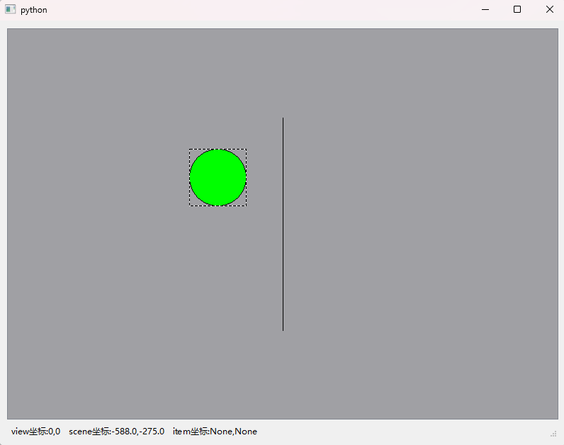
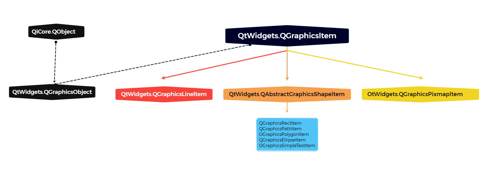

# 15.QPainter和Graphics/View绘图2


### Graphics/View绘图

#### Graphics/View绘图框架介绍

Graphics/View 绘图框架类似于前面介绍的Model/View 机制。Graphics 指QGraphicsScene(场景)类,它是不可见的,相当于一个容器,在它里面放置各种图项(QGraphicsItem)并对放置的图项进行管理;View 指QGraphicsView 控件,QGraphicsScene 中的绘图项通过 QGraphicsView 控件显示出来,同一个 QGraphicsScene可以用多个QGraphicsView 显示

Graphics/View 框架结构主要包含三个主要的类:QGraphicsScene QGraphicsView和各种QGraphicsItem。QGraphicsScene(场景)本身不可见,但又是存储和管理2D图项的容器,场景没有自己的视觉外观,只负责管理图项,必须通过与之相连的 QGraphicsView 控件来显示图项及与外界进行交互操作。QGraphicsScene主要提供图项的操作接口,传递事件和管理各个图项的状态,提供无变换的绘制功能(如打印)。QGraphicsView 提供一个可视的窗口,用于显示场景中的图项。QGraphicsItem是场景中图项的基类图项有自定义的图项(继承自QGraphicsItem 的子类),还有标准的图项,例如矩形(QGraphicsRectItem)多边形(QGraphicsPolygonItem)、椭圆(QGraphicsEllipseItem)、路径(QGraphicsPathItem)线条(GraphicsLineltem)和文本(QGraphicsTextItem)等。读者可以把 QGraphicsScene理解成电影胶卷,把QGraphicsView 理解成电影放映机,而把图项理解成电影胶卷中的人物、树木、建筑物等。

QPainter采用面向过程的描述方式绘图,而 Graphics/View 采用面向对象的描述方式绘图。Graphics/View 框架中的每一个图项都是一个独立的元素,可以对图项进行操作,图项支持鼠标操作,可以对图项进行按下、移动、释放、双击、滚轮滚动和右键菜单操作,还支持键盘输人和拖放操作。Grphics/View 绘图时首先创建一个场景,然后创建图项对象(如直线对象、矩形对象),再使用场景的 add()丽数,将图项对象添加到场景中,最后通过视图控件进行显示。对于复杂的图像来说,如果其中包含大量的直线、曲线、多边形等对象,管理图项对象比管理 QPainter 的绘制过程语句要容易,并且图项对象更符合面向对象的思想,图形的重复使用性更好。

#### Graphics/View坐标系

Graphics/View 坐标系基于笛卡儿坐标系,图项在场景中的位置和几何形状通过 x坐标和y坐标表示。当使用没有变换的视图观察场景时,场景中的一个单位对应屏幕上的一个像素。
Graphics/View 架构中有三种坐标系统,分别是图项坐标、场景坐标和视图坐标。场景坐标类似于 QPainter 的逻辑坐标,一般以场景的中心为原点;视图标是窗口界面的物理坐标,其左上角为坐标原点,图项坐标是局部逻辑坐标,通常以图项的中心为原点。Graphics/View 提供了三个坐标系统之间的转换函数。

##### 图项坐标、场景坐标和视图坐标

图项存在于自己的本地坐标上,图项的坐标系通常以图项中心为原点,图项中心也是所有坐标变换的原点,图项坐标方向是 x轴正方向向右,y 轴正方向向下。

创建自定义图项时,需要注意图项的坐标,QGraphicsScene 和 QGraphicsView 会完成所有的变换。

- 例如,如果接收到一个鼠标按下或拖人事件,所给的事件位置是基于图项坐标系的。如果某个点位于图项内部,使用图项上的点作为 QGraphicsItem.contains()虚函数的参数,函数会返回True。类似地,图项的边界矩形和形状也基于图项坐标系。
- 图项的位置是图项的中心点在其父图项坐标系统的坐标,场景可以理解成顶层图项,子图项的坐标与父图项的坐标相关,如果子图项无变换,则子图项坐标和父图项坐标之间的区别与它们的父图项的坐标相同。例如,如果一个无变换的子图项精确地位于父图项的中心点,则父子图项的坐标系统是相同的。
- 如果子图项的位置是(100,0),子图项上的点(0,100)就是父图项上的点(100,100)。即使图项的位置和变换与父图项相关,子图项的坐标也不会被父图项的变换影响,虽然父图项的变换会隐式地变换子图项。例如,即使父图项被翻转和缩放,子图项上的点(0,100)仍旧是父图项上的点(100,100)。
- 如果调用QGraphicsItem类的 paint()函数重绘图项,应以图项坐标系为基准场景坐标是所有图项的基础坐标系统。场景坐标系统描述了顶层图项的位置,并且构成从视图到场景的所有场景事件的基础。每个图项在场景上都有场景坐标和边界矩形。场景坐标的原点在场景中心,坐标方向是x轴正方向向右,轴正方向向下。视图坐标是窗口控件的坐标,视图坐标的单位是像素,QGraphicsView 的左上角是(00)。所有鼠标事件、拖拽事件最开始都使用视图坐标,为了和图项交瓦,需要转换为场景坐标。

##### 坐标变换函数

在Graphics/View框架中,经常需要在不同种坐标间进行变换:从视图到场景,从场景到图项,从图项到图项。Graphics/View 框架中的坐标变换函数如下

- QGraphicsView.mapToScene()视图到场景
- QGraphicsView.mapFromScene()场景到视图
- QGraphicsItemmapFromScene()场景到图项
- QGraphicsItem.mapToScene()图项到场景
- QGraphicsItem.mapToParent()子图项到父图项
- QGraphicsItem.mapFromParent()父图项到子图项
- QGraphicsItem.mapToItem()本图项到其他图项
- QGraphicsItem,mapFromItem()其他图项到本图项

在场景中处理图项时,经常需要在场景到图项、图项到图项、视图到场景间进行坐标和图形转换。

- 当在 QGraphicsView 的视口中单击鼠标时,应该通过调用QGraphicsView.mapToScence()与 QGraphicsScene,itemAt()函数来获知光标下是场景中的哪个图项;
- 如果想获知一个图项在视口中的位置,应该先在图项上调用QGraphicsItemmapToScene()函数,然后调用QGraphicsView,mapFromScene()函数;
- 如果想获知在一个视图中有哪些图项,应该把 QPainterPath 传递到 mapToScene()函数,然后再把映射后的路径传递到QGraphicsScene, items()函数。
- 可以调用QGraphicsItem,mapToScene()函数与QGraphicsItem,mapFromScene()函数在图项与场景之间进行坐标与形状的映射,也可以在子图项与其父图项之间通过QGraphicsItem,mapToParent()与QGraphicsItem.mapFromItem()函数进行映射。
- 所有映射函数可以包括点、矩形、多边形路径。视图与场景之间的映射也与此类似。对于视图与图项之间的映射,应该先从视图映射到场景,然后再从场景映射到图项。

#### 视图控件QGraphicsVicw

视图控件QGraphicsView 用于显示场景中的图项,当场景超过视图区域时,视图会提供滚动条。

视图控件QGraphicsView 继承自 QAbstractScrollArea,视图控件根据场景的尺寸提供滚动区,当视图尺寸小于场景尺寸时会提供滚动条。

用QGraphicsView 类创建视图控件对象的方法如下所示其中parent是继承自QWidget 的窗口或控件;QGraphicsScene是场景实例对象,用于设置视图控件中的场景。

```python
from PySide6.QtWidgets import QGraphicsView

QGraphicsView(parent: Union[PySide6.QtWidgets.QWidget, NoneType]= None) -> None
QGraphicsView(scene: PySide6.QtWidgets.QGraphicsScene, parent: Union[PySide6.QtWidgets.QWidget, NoneType]= None) -> None
```

##### 视图控件QGraphicsView的常用方法

视图控件的方法较多,一些常用方法如表所示

| QGraphicsView的常用方法及参数类型                            | 说:明                                                        |
| ------------------------------------------------------------ | ------------------------------------------------------------ |
| setScene(scene:QGraphicsScene)                               | 设置场景                                                     |
| scene()                                                      | 获取场景QGraphicsScene                                       |
| setSceneRect(rect:Union[QRectF,QRect])                       | 设置场景在视图中的范围                                       |
| setSceneRect(x: float,y: float,w: float,h: float)            | 设置场景在视图中的范围                                       |
| sceneRect()                                                  | 获取场景在视图中的范围 QRectF                                |
| setAlignment(alignment: Qt.Alignment)                        | 设置场景全部可见时的对齐方式                                 |
| setBackgroundBrush(brush:Union[QBrush,Qt.BrushStyle, Qt.GlobalColor, QColor, QGradient, QImage,QPixmap]) | 设置视图背景画刷                                             |
| setForegroundBrush(brush: Union[QBrusb, Qt.BrushStyle, Qt.GlobalColor, QColor, QGradient, QImage,QPixmap]) | 设置视图前景画刷                                             |
| drawBackground(painter:QPainter,rect:Union[QRectF,QRect])    | 重写该函数,在显示前景和图项前绘制背景                        |
| drawForeground(painter: QPainter,rect: Union[QRectF,QRect])  | 重写该函数,在显示背景和图项后绘制前景                        |
| centerOn(pos: :Union[QPointF, QPoint.QPainterPath.Element])  | 使某个点位于视图控件中心                                     |
| centerOn(x:float,y: float)                                   | 使某个点位于视图控件中心                                     |
| centerOn(item: QGraphicsItem)                                | 使某个图项位于视图控件中心                                   |
| ensureVisible(rect: Union[QRectF,QRectJ.xmargin:int=50,ymargin: int=50) | 确保指定的矩形区域可见,可见时按指定的边距显 示；如不可见,滚动到最近的点 |
| ensureVisible(x: float.y:float,w: float,h: float.xmargin:int=50,ymargin: int=50) | 确保指定的矩形区域可见,可见时按指定的边距显 示；如不可见,滚动到最近的点 |
| ensureVisible(QGraphicsItem,xmargin:int=50, ymargin: int=50) | 确保指定的图项可见                                           |
| fitInView(rect: Union[QRectF, QRect], aspectRadioMode: Qt.AspectRatioMode = Qt.IgnoreAspectRatio) | 以适合方式使矩形区域可见                                     |
| fitInView(x:float,y: float,w: float,h: float, aspectRadioMode: Qt.AspectRatioMode = Qt.IgnoreAspectRatio) | 以适合方式使矩形区域可见                                     |
| fitInView(item: QGraphicsItem,aspectRadioMode: Qt.AspectRatioMode=Qt.IgnoreAspectRatio) | 以适合方式使图项可见                                         |
| render(painter: QPainter,target: Union[QRectF, QRect], source: QRect, aspectRatioMode = Qt.KeepAspectRatio) | 从source(视图)把图像复制到target(其他设备如 QImage)上        |
| resetCachedContent()                                         | 重置缓存                                                     |
| rubberBandRect()                                             | 获取用鼠标框选的范围 QRect                                   |
| setCacheMode(mode: QGraphicsView.CacheMode)                  | 设置缓存模式 .                                               |
| setDragMode(mode; QGraphicsView.DragMode)                    | 设置鼠标拖拽模式                                             |
| setInteractive(allowed:bool)                                 | 设置是否是交互模式                                           |
| isInteractive()                                              | 获取是否是交互模式                                           |
| setOptimizationFlag(flag: QGraphicsView.OptimizationFlag,enabled: bool=True) | 设置优化显示标识                                             |
| setOptimizationFlags(flags: QGraphicsView.OptimizationFlags) | 设置优化显示标识                                             |
| setRenderHint(hint: QPainter.RenderHint, enabled: bool=True) 恋雯豆济 | 设置提高绘图质量标识                                         |
| setRenderHints(hints:QPainter.RenderHints)                   | 设置提高绘图质量标识                                         |
| setResizeAnchor(QGraphicsView.ViewportAnchor)                | 设置视图控件改变尺寸时的锚点                                 |
| resizeAnchor()                                               | 获取锚点                                                     |
| setRubberBandSelectionMode(Qt.ItemSelectionMode)             | 设置用鼠标框选模式                                           |
| setTransform(matrix: QTransform,combine: bool=False)         | 用变换矩阵变换视图                                           |
| transform()                                                  | 获取变换矩阵 QTransform                                      |
| isTransformed()                                              | 获取是否进行过变换                                           |
| resetTransform()                                             | 重置变换                                                     |
| setTransformationAnchor(QGraphicsView.ViewportAnchor)        | 设置变换时的锚点                                             |
| setViewportUpdateMode(QGraphicsView.ViewportUpdateMode)      | 设置刷新模式                                                 |
| [slot]updateScene(rects: Sequence[QRectF])                   | 更新场景                                                     |
| [slot]updateSceneRect(rect: Union[QRectF, QRect])            | 更新场景                                                     |
| [slot]invalidateScene(rect: Union[QRectF, QRect], layers: QGraphicsScene.SceneLayers= QGraphicsScene.AllLayers) | 使指定的场景区域进行更新和重新绘制,相当于对 指定区域进行 update()操作 |
| setupViewport(QWidget)                                       | 重写该函数,设置视口控件                                      |
| scale(sx: float, sy: float)                                  | 缩放                                                         |
| rotate(angle: float)                                         | 旋转角度,瞬时针方向为正                                      |
| shear(sh: float,sv:float)                                    | 错切                                                         |
| translate(dx: float,dy:float)                                | 平移                                                         |

视图控件获取图项的方法如表所示

| QGraphicsView 获取图项的方法                                 | 返回值的类型               |
| ------------------------------------------------------------ | -------------------------- |
| itemAt(pos:QPoint)                                           | QGraphicsItem              |
| itemAt(x:int,y:int)                                          | QGraphicsItem              |
| items()                                                      | List[QGraphicsItem]        |
| items(pos: QPoint)                                           | List[QGraphicsItem]        |
| items(x:int,y:int)                                           | List[QGraphicsItem]        |
| items(x: int, y: int, w: int,h: int, mode = Qt.IntersectsItemShape) | List[QGraphicsItem]        |
| items(rect: QRect, mode: Qt.ItemSelectionMode = Qt.IntersectsItemShape) | List[QGraphicsItem]        |
| items(polygon: Union[QPolygon,Sequence[QPoint],QRect], mode: Qt.ItemSelectionMode=Qt.IntersectsItemShape) | List[QGraphicsItem]        |
| items(QPainterPath, mode: Qt.ItemSelectionMode = Qt.IntersectsItemShape) | List[QGraphicsItem]887:590 |

视图控件中点的坐标与场景坐标互相转换的方法如表所示

| 场景到视图的坐标变换方法                                     | 返回值类型   |
| ------------------------------------------------------------ | ------------ |
| mapFromScene(Union[QPointF, QPoint])                         | QPoint       |
| mapFromScene(QRectF)                                         | QPolygon     |
| mapFromScene(polygon: Union[QPolygonF,Sequence[QPointF], QPolygon,QRectF]) | QPolygon     |
| mapFromScene(path:QPainterPath)                              | QPainterPath |
| mapFromScene(x: float.y: float)                              | QPoint       |
| mapFromScene(x: float,y: float, w:float,h: float)            | QPolygon     |
| mapToScene(point:QPoint)                                     | QPointF      |
| mapToScene(rect: QRect)                                      | QPolygonF    |
| mapToScene(Union[QPolygon, Sequence[QPoint],QRect])          | QPolygonF    |
| mapToScene(QPainterPath)                                     | QPainterPath |
| mapToScene(x:int,y: int)                                     | QPointF      |
| mapToScene(int,int,int,int)                                  | QPolygonF    |

主要方法介绍如下。

- 给视图控件设置场景,可以在创建视图对象时设置,也可以用setScene(QGraphicsScene)方法设置;用scene()方法获取场景。
- 用setSceneRect(rect; Union[QRectF,QRect])方法或 setSceneRect(x: float,y:float,w;float,h;float)方法设置场景在视图中的范围,用sceneRect()方法获取场景在视图中的范围,当场景的面积超过视图所显示的范围时,可用滚动条来移动场景。
- 用setAlignment(Qt.Alignment)方法设置场景在视图控件全部可见时的对齐方式Qt.Alignment 可以取以下值,默认是 Qt.AlignCenter
  - Qt.AlignLeft
  - Qt.AlignRight
  - Qt.AlignHCenter
  - Qt.AlignJustify
  - Qt.AlignTop,
  - Qt.AlignBottom
  - Qt.AlignVCenter
  - Qt.AlignBaseline
  - Qt.AlignCenter
- 创建视图控件的子类,并重写 drawBackground(QPainter,QRectF)函数可以在显示前景和图项之前绘制背景;
  - 重写 drawForeground(QPainter;QRectF)函数,可以在显示背景和图项之后绘制前景。
  - 场景分为背景层、图项层和前景层三层,前面的层会挡住后面的层。
- 用setCacheMode(mode:QGraphicsView.CacheMode)方法可以设置缓存模式,参数 mode可取:
  - QGraphicsView.CacheNone(没有缓存)
  - QGraphicsView.CacheBackground(缓存背景)
- 用setInteractive(bool)方法设置视图控件是否是交互模式在交互模式下可以接受鼠标键盘事件;
- 用isInteractive()方法可以获取是否是交互模式用setDragMode(mode:QGraphicsViewDragMode)方法设置在视图控件中按住鼠标左键选择图项时的拖拽模式,参数 mode 可取:
  - QGraphicsView.NoDrag(忽略鼠标事件)
  - QGraphicsView.ScrollHandDrag(在交互或非交互模式下,光标变成手的形状,拖动鼠标会移动整个场景)
  - QGraphicsView.RubberBandDrag(在交互模式下可以框选图项)。
- 用setRubberBandSelectionMode(QtItemSelectionMode)方法设置框选图项时,图项是否能被选中,其中参数 Qt ItemSelectionMode可以取:
  - QtContainsItemShapeQt.IntersectsItemShape
  - Qt.ContainsItemBoundingRect
  - Qt.IntersectsItemBoundingRect
- 用setOptimizationFlag(flag;QGraphicsView.OptimizationFlag,enabled: bool=True)方法设置视图控件优化显示标识,参数 lag可以取:
  - QGraphicsView.DontSavePainterState(不保存绘图状态)
  - QGraphicsView.DontAdjustForAntialiasing(不调整反锯齿)
  - QGraphicsView.IndirectPainting(间接绘制)。
- 用scale(sx; float,sy:float)方法、rotate(angle; float)方法、shear(sh; float;sv:float)方法和translate(dx:floatdy: flat)方法可以对场景进行缩放、旋转、错切和平移,
- 用setTransform(matrix;QTransform;combine:bool=False)方法可以用变换矩阵对场景进行变换。
- 用setResizeAnchor(QGraphicsViewViewportAnchor)方法设置视图尺寸发生改变时的错点;
- 用setTransformationAnchor(QGraphicsViewViewportAnchor)方法设置对视图进行坐标变换时的锚点,锚点的作用是定位场景在视图控件中的位置。其中QGraphicsView.ViewportAnchor可取:
  - QGraphicsView.NoAnchor(没有锚点,场景位置不变) 
  - QGraphicsView.AnchorViewCenter(场景在视图控件的中心点作为锚点)
  - QGraphicsView.AnchorUnderMouse(光标所在的位置作为错点)。
  - 如果场景在视图控件中全部可见将使用对齐设置 setAlignment(alignment:QtAlignment)的参数
- 用setViewportUpdateMode(QGraphicsView.ViewportUpdateMode)方法设置视图刷新模式,参数 QGraphicsView,ViewportUpdateMode 可以取:
  -  QGraphicsView.FullViewportUpdate
  -  QGraphicsView.MinimalViewportUpdate
  -  QGraphicsView.SmartViewportUpdate
  -  QGraphicsView.BoundingRectViewportUpdate
  -  QGraphicsView.NoViewportUpdate;
- 可用槽函数 updateScene(rects; Sequence[QRectF])updateSceneRect(rect;Union[QRectF,QRect])或 invalidateScene(rect; UnionQGraphicsScene.SceneLayers = QGraphicsScene.[QRectF,QRect],layers:AllLayers)方法只刷新指定的区域,参数 layers 可以取:
  - QGraphicsScene.ItemLayer
  - QGraphicsScene.BackgroundLayer
  - QGraphicsScene.ForegroundLayer
  - QGraphicsScene.AllLayers
- 用itemAt()方法可以获得光标位置处的一个图项,如果有多个图项,则获得最上面的图项;
  - 用items()方法可以获得多个图项列表,图项列表中的图项按照z值从顶到底的顺序排列。
  - 可以用矩形、多边形或路径获取其内部的图项,例如 items(QRect,mode=Qt、IntersectsItemShape)方法,参数 mode可取:
    - Qt.ContainsItemShape(图项完全在选择框内部)
    - Qt.IntersectsItemShape(图项在选择框内部和与选择框相交)
    - Qt.ContainsItemBoundingRect(图项的边界矩形完全在选择框内部)
    - Qt.IntersectsItemBoundingRect(图项的边界矩形完全在选择框内部和与选择框交叉)
- 用mapFromScene()方法可以把场景中的一个点坐标转换成视图控件的坐标
  - mapToScene()方法可以把视图控件的一个点转换成场景中的坐标。
- 由于QGraphicsView 继承自QWidget,因此 QGraphicsView 提供了拖拽功能Graphics/View框架也为场景图项提供拖拽支持。
  - 当视图控件接收到拖拽事件GraphicsView框架会将拖拽事件翻译成 QGraphicsSceneDragDropEvent 事件时再发送到场景,场景接管事件,再把事件发送到光标下接受拖拽的第一个图项。为了开启图项拖拽功能,需要在图项上创建一个 QDrag 对象。
- 用setViewport(QWidget)方法可以设置视口的控件,如果不设置,会使用默认的控件。如果要使用OpenGL渲染,则需设置 setViewport(QOpenGLWidget)。

##### 视图控件QGraphicsView信号 

视图控件QGraphicsView只有一个信号 rubberBandChanged(viewportRect:QRect,fromScenePoint:QPointF,toScenePoint:QPointF),当框选的范围发生改变时发送信号。


##### 视图控件QGraphicsView的应用实例

下面的程序首先建立视图控件的子类,创建自定义信号,信号的参数是单击鼠标或移动鼠标时光标在视图控件的位置,并重写了鼠标单击、移动事件和背景函数,然后在场景中建立一个矩形和一个圆用鼠标可以拖动矩形和圆,并在状态栏上显示鼠标拖动点的视图坐标、场景坐标和图项坐标。



```python
# -*- coding: UTF-8 -*-
# File date: Hi_2023/3/6 23:23
# File_name: 01- 视图控件QGraphicsView的应用实例.py


import sys
from PySide6.QtWidgets import QApplication, QWidget, QGraphicsScene, QGraphicsView, QVBoxLayout, QStatusBar, QGraphicsRectItem, QGraphicsItem, QGraphicsEllipseItem
from PySide6.QtCore import Qt.Signal, QPoint, QRectF


class myGraphicsView(QGraphicsView):  # 视图控件的子类
    point_position = Signal(QPoint)  # 自定义信号,参数是光标在视图中的位置

    def __init_(self, parent=None):
        super().__init__(parent)

    def mousePressEvent(self, event):  # 鼠标单击事件
        self.point_position.emit(event.position())  # 发送信号,参数是光标位置
        super().mousePressEvent(event)

    def mouseMoveEvent(self, event):  # 鼠标移动事件
        self.point_position.emit(event.position())
        super().mouseMoveEvent(event)  # 发送信号,参数是光标位置

    def drawBackground(self, painter, rectF):
        painter.fillRect(rectF, Qt.gray)  # 重写背景函数,设置背景颜色


class MyWindow(QWidget):
    def __init__(self, parent=None):
        super().__init__(parent)

        self.resize(800, 600)
        self.setupUI()

    def setupUI(self):
        self.graphicsView = myGraphicsView()  # 视图窗口
        self.statusbar = QStatusBar()  # 状态栏
        v = QVBoxLayout(self)
        v.addWidget(self.graphicsView)
        v.addWidget(self.statusbar)
        rectF = QRectF(-200, - 150, 00, 300)
        self.graphicsScene = QGraphicsScene(rectF)  # 创建场景

        self.graphicsView.setScene(self.graphicsScene)  # 视图窗口设置场景
        rect_item = QGraphicsRectItem(rectF)  # 以场景为坐标创建矩形

        rect_item.setFlags(QGraphicsItem.ItemIsSelectable | QGraphicsItem.ItemIsMovable)  # 标识
        self.graphicsScene.addItem(rect_item)  # 在场景中添加图项
        rectF = QRectF(-40, -40, 80, 80)
        ellipse_item = QGraphicsEllipseItem(rectF)  # 以场景为坐标创建椭圆
        ellipse_item.setBrush(Qt.green)  # 设置画刷

        ellipse_item.setFlags(QGraphicsItem.ItemIsSelectable | QGraphicsItem.ItemIsMovable)  # 标识
        self.graphicsScene.addItem(ellipse_item)  # 在场景中添加图项
        self.graphicsView.point_position.connect(self.mousePosition)  # 信号与槽的连接

    def mousePosition(self, point):  # 槽函数
        template = "view坐标:{},{}   scene坐标:{},{}   item坐标:{},{}"
        point_scene = self.graphicsView.mapToScene(point)  # 视图中的点映射到场景中
        item = self.graphicsView.itemAt(point)  # 获取视图控件中的图项

        # item = self.graphicsScene.itemAt(point_scene, self.graphicsView.transform()) # 场景中图项

        if item:
            point_item = item.mapFromScene(point_scene)  # 把场景坐标转换为图项坐标
            string = template.format(point.x(), point.y(), point_scene.x(), point_scene.y(), point_item.x(), point_item.y())

        else:
            string = template.format(point.x(), point.y(), point_scene.x(), point_scene.y(), "None", "None")
            self.statusbar.showMessage(string)  # 在状态栏中显示坐标信息


if __name__ == '__main__':
    app = QApplication(sys.argv)
    win = MyWindow()

    win.show()
    sys.exit(app.exec())

```

#### 场景QGraphicsScene

场景 QGraphicsScene是图项的容器,用于存放和管理图项。

QGraphicsScene 继承自QObject,用QGraphicsScene 类创建场景实例对象的方法如下,其中parent 是继承自QObiect 的实例对象,QRetQRectF 定义场景的范围。

用场景范围来确定视图的默认可滚动区域,场景主要使用它来管理图形项索引。如果未设置或者设置为无效的矩形则sceneRect()方法将返回自创建场景以来场景中所有图形项的最大边界矩形即当在场景中添加或移动图形项时范围会增大,但不会减小。

```python
from PySide6.QtWidgets import QGraphicsScene

QGraphicsScene(parent: Union[PySide6.QtCore.QObject, NoneType]= None) -> None
QGraphicsScene(sceneRect: Union[PySide6.QtCore.QRectF, PySide6.QtCore.QRect], parent: Union[PySide6.QtCore.QObject, NoneType]= None) -> None
QGraphicsScene(x: float, y: float, width: float, height: float, parent: Union[PySide6.QtCore.QObject, NoneType]= None) -> None
```

##### 场景 QGraphicsScene 的常用方法

###### 场景中添加和删除图项的方法如表所示

| QGraphicsScene 中添加和移除图项的方法                        | 返回值的类型            | 说明         |
| ------------------------------------------------------------ | ----------------------- | ------------ |
| addItem(QGraphicsItem)                                       | None                    | 添加图项     |
| addEllipse(rect:Union[QRectF,QRect],pen:Union[QPen,Qt.PenStyle,QColor],brush: Union[QBrush, Qt.BrushStyle, Qt.GlobalColor,QColor, QGradient, QImage,QPixmap]) | QGraphicsEllipseItem    | 添加椭圆     |
| addEllipse(x: float,y: float,w: float,h: float,pen, brush)   | QGraphicsEllipseItem    | 添加椭圆     |
| addLine(line: Union[QLineF,QLine],pen)                       | QGraphicsLineItem       | 添加线       |
| addLine(xl: float,yl:float,x2: float,y2: float,pen)          | QGraphicsLineItem       | 添加线       |
| addPath(path:QPainterPath,pen,brusb)                         | QGraphicsPathItem       | 添加绘图路径 |
| addPixmap(pixmap:Union[QPixmap,QImage,str])                  | QGraphicsPixmapItem     | 添加图像     |
| addPolygon(polygon:Union[QPolygonF, Sequence[QPointF],QPolygon,QRectF],pen,brush) | QGraphicsPolygonItem    | 添加多边形   |
| addRect(rect: Union[QRectF,QRect],pen,brush)                 | QGraphicsRectItem       | 添加矩形     |
| addRect(x: float, y: float,w: float, h: float, pen, brush) . | QGraphicsRectItem       | 添加矩形     |
| addSimpleText(text: str,font; Union[QFont,str])              | QGraphicsSimpleTextItem | 添加简单文字 |
| addText(text: str,font:Union[QFont,str])                     | QGraphicsTextItem       | 添加文字     |
| addWidget(QWidget,wFlags:Qt.WindowFlags)                     | QGraphicsProxyWidget    | 添加图形控件 |
| removeItem(QGraphicsItem)                                    | None                    | 移除图项     |
| [slot]clear()                                                | None                    | 清空所有图项 |

###### 场景获取图项的方法如表所示

| QGraphicsScene 获取图项的方法及参数类型                      | 返回值的类型          |
| ------------------------------------------------------------ | --------------------- |
| itemAt(pos: Union[QPointF, QPoint, QPainterPath.Element].deviceTransform: QTransform) | QGraphiesItem         |
| itemAt(x: float,y: float.deviceTransform: QTransform)        | QGraphicsItem         |
| jtems(order:Qt.SortOrder=Qt.DescendingOrder)                 | List[QGraphicsItem]   |
| items(path: QPainterPath, mode: Qt.ItemSelectionMode = Qt.IntersectsItemShape,order,deviceTransform) | List[QGraphiesItemJ . |
| items(polygon: Union[QPolygonF,Sequence[QPointF],QPolygon,QRectF], mode.order,deviceTransform) | List[QGraphicsItem]   |
| items(pos: Union[QPointF, QPoint, QPainterPath.Element],mode, order, deviceTransform) | List[QGraphiesItem]   |
| items(rect: Union[QRectF,QRect],mode,order,deviceTransform)  | List[QGraphicsItem]   |
| items(x: float,y: float,w: float,h: float, mode,order,deviceTransform) | List[QGraphicsItem]   |

###### 场景的其他常用方法如表所示

| QGraphicsScene的其他常用方法及参数类型                       | 说 明                                                        |
| ------------------------------------------------------------ | ------------------------------------------------------------ |
| setSceneRect(rect:Union[QRectF,QRect])                       | 设置场景范围                                                 |
| setSceneRect(x:float,y:float,w: float,h: float)              | 设置场景范围                                                 |
| sceneRect()                                                  | 获取场景范围 QRectF                                          |
| width()、height()                                            | 获取场景的宽度和高度                                         |
| collidingItems(QGraphicsItem,mode=Qt.IntersectsItemShape)    | 获取碰撞的图项列表 List[QGraphicsltem]                       |
| createItemGroup(Sequence[QGraphicsItem])                     | 创建组,返回QGraphicsItemGroup                                |
| destroyItemGroup(QGraphicsItemGroup)                         | 打散图项组                                                   |
| hasFocus()                                                   | 获取场景是否有焦点,有焦点时可以接受键盘 事件                 |
| clearFocus()                                                 | 使场景失去焦点                                               |
| [slot]invalidate(rect: Union[QRectF, QRect], layers =QGraphicsScene.AllLayers) | 刷新指定的区域                                               |
| invalidate(x:float,y: float,w: float,h: float, layers=QGraphicsScene.AllLayers) | 刷新指定的区域                                               |
| [slot]update(rect:Union[QRectF,QRect])                       | 更新区域                                                     |
| update(x:float,y: float,w: float.h: float)                   | 更新区域                                                     |
| isActive()                                                   | 场景用视图显示且视图活跃时返回True                           |
| itemsBoundingRect()                                          | 获取图项的矩形区域 QRectF                                    |
| mouseGrabberItem()                                           | 获取光标抓取的图项 QGraphicsltem                             |
| render(QPainter, target=QRectF(),source=QRectF(),mode=Qt.KeepAspectRatio) | 将指定区域的图形复制到其他设备的指定区 域上                  |
| selectedItems()                                              | 获取选中的图项列表 List[QGraphicsltem]                       |
| setActivePanel(item; QGraphicsItem)                          | 将场景中的图项设置成活跃图项                                 |
| activePanel()                                                | 获取活跃的图项                                               |
| setActiveWindow(widget:QGraphicsWidget)                      | 将场景的视图控件设置成活跃控件                               |
| setBackgroundBrush(Union[QBrush, QColor, Qt.GlobalColor,QGradient]) | 设置背景画刷                                                 |
| setForegroundBrush(Union[QBrush,QColor,Qt.GlobalColor,QGradient]) | 设置前景画刷                                                 |
| drawBackground(QPainter,QRectF)                              | 重写该函数,绘制背景                                          |
| drawForeground(QPainter,QRectF)                              | 重写该函数,绘制前景                                          |
| backgroundBrush()、foregroundBrush()                         | 获取背景画刷、获取前景画刷QBrush                             |
| setFocus(focusReason=Qt.OtherFocusReason)                    | 使场景获得焦点                                               |
| setFocusItem(QGraphicsltem,focusReason: Qt.FocusReason=Qt.OtherFocusReason) | 使某个图项获得焦点                                           |
| focusItem()                                                  | 获取有焦点的图项                                             |
| setFocusOnTouch(bool)                                        | 在平板电脑上通过手触碰获得焦点                               |
| focusNextPrevChild(next:bool)                                | 查找一个新的图形控件,以使键盘焦点对准 Tab 键和Shift+ Tab键,如果可以找到则返回 true；否则返回false。如果next为true则此函 数向前搜索,否则向后搜索 |
| setItemIndexMethod(QGraphicsScene.ItemIndexMethod)           | 设置图项搜索方法                                             |
| setBspTreeDepth(int)                                         | 设置 BSP 树的搜索深度                                        |
| setMinimumRenderSize(float)                                  | 图项变换后,尺寸小于设置的尺寸时不渲染                        |
| setSelectionArea(path: QPainterPath,deviceTransform)         | 将绘图路径内的图项选中,外部的图项取消选 中。对于需要选中的图项,必须标记为 QGraphicsItem.ItemIsSelectable |
| setSelectionArea(path: QPainterPath, selectionOperation: Qt.ItemSelectionOperation = Qt.ReplaceSelection, mode: Qt.ItemSelectionMode = Qt.IntersectsItemShape, deviceTransform: QTransform =Default(QTransform)) | 将绘图路径内的图项选中,外部的图项取消选 中。对于需要选中的图项,必须标记为 QGraphicsItem.ItemIsSelectable |
| selectionArea()                                              | 获取选中区域内的绘图路径QPainterPath                         |
| [slot]clearSelection()                                       | 取消选择                                                     |
| setStickyFocus(enabled:bool)                                 | 单击背景或者单击不接受焦点的图项时,是否 失去焦点             |
| setFont(QFont)                                               | 设置字体                                                     |
| setPalette(QPalette)                                         | 设置调色板                                                   |
| setStyle(QStyle)                                             | 设置风格                                                     |
| views()                                                      | 获取场景关联的视图控件列表                                   |
| [slot]advance()                                              | 调用图项的advance()方法,通知图项可移动                       |

###### 主要方法介绍如下

- 场景中添加从 QGraphicsItem 继承的子类的方法是 addItem(QGraphicsItem)。

  - 另外还可以添加一些标准的图项,用addEllipse()、addLine() addPath() addPixmap()、addPolygon()、addRect()addSimpleText()addText()和 addWidget()方法可以添加椭圆、直线、绘图路径、图像、多边形、矩形、简单文本、文本和控件,并返回图项。
  - 其中用addWidget(QWidget,Qt.WindowType)方法可以将一个控件以代理控件的方法添加到场景中,并返回代理控件,按照添加顺序,后添加的图项会在先添加图项的前端;
  - 用removeItem(QGraphicsItem)方法可以从场景中移除图项用clear()方法可以移除所有的图项。

- 用itemAt(pos: Union[QPointF, QPoint, QPainterPath, Element], deviceTransform :QTransform)或itemAt(x: float,y:float,deviceTransform:QTransform)方法可以获得某个位置处z值最大的图项,参数 QTransform 表示变换矩阵可以取graphicsView.transform()。

  - 用items()方法可以获得某个位置的图项列表,例如items(QPoint,mode,order,QTransform),
    - 其中参数 mode 是 Qt ItemSelectionMode类型值,可以取:
      - QtContainsItemShape(完全包含)
      - Qt.IntersectsItemShape(完全包含和交叉)
      - Qt.ContainsItemBoundingRect(完全包含边界矩形)
      - Qt.IntersectsItemBoundingRect(完全包含矩形边界和交叉边界);
    - order 是指图项z值的顺序,可以取以下值,默认是Qt.DescendingOrder。
      - Qt.DescendingOrder(降序)
      - Qt.AscendingOrder(升序)

- 用collidingItems(QGraphicsItem,mode=Qt.IntersectsItemShape)方法可以获取与指定图项产生碰撞的图项列表,参数 mode可以取:

  - QContainsItemShape 
  - Qt.IntersectsItemShape
  - Qt.ContainsltemBoundingRect 
  - Qt.IntersectsltemBoundingRect。

- 用createItemGroup(Sequence[QGraphicsItem])方法可以将多个图项定义成组并返回QGraphicsItemGroup 对象

  - 可以把组内的图项当成一个图项进行操作内的图项可以同时进行缩放平移和旋转操作。

- 可以用QGraphicsItemGroup的ddToGroup(QGraphicsItem)方法添加图项

  - 用removeFromGroup(QGraphicsItem)方法移除图项。
  - 用setSceneRect(rect; Union[QRectF,QRect])或 setSceneRect(x: float,y: float,w:float,h:float)方法设置场景的范围,用sceneRect()方法获取场景范围

- 用setItemIndexMethod(QGraphicsScene ItemIndexMethod)方法设置在场景中搜索图项位置的方法,其中QGraphicsScene.ItemIndexMethod 可取:

  - QGraphicsScene BspTreeIndex(BSP树方法,适合静态场景)
  - QGraphicsScene.Nolndex(适合动态场景)。
  - BSP(binary space partitioning)树是二维空间分制树方法,又称为二叉法。用setBspTreeDepth(int)方法设置 BSP树的搜索深度

- 场景分为背景层图项层和前景层,

  - QGraphicsScene.BackgroundLayer

  - QGraphicsScene.ItemLayer 

  - QGraphicsScene.ForegroundLayer 

    分别用以上值表示,这三层可用QGraphicsScene.AllLayers 表示。

  - 用invalidate(rect: Union[QRectF,QRect],layers:QGraphicsScene.SceneLayers = QGraphicsScene.AllLayers)方法或invalidate(x; float,y: float, w; float, h: float, layers; QGraphicsScene.SceneL ayers =QGraphicsScene.AllLayers)方法将指定区域的指定层设置为失效后再重新绘制,以达到更新指定区域的目的,

    - 也可用视图控件的 invalidateScene(rect:Union[QRectF,QRect],QGraphicsScene.SceneLayer)方法达到相同的目的。
    - 也可以用update(rect: Union[QRectF, QRect])或 update(x: float,y: float, w; float,h;float)方法更新指定的区域。

- Graphics/View 框架通过染函数 QGraphicsScene.render()和 QGraphicsView.render()支持单行打印。

  - 场景和视图的染函数的不同在于 QGraphicsScene.render()使用场景坐标,QGraphicsView.render()使用视图坐标。
  - 用addWidget(QWidget,Qt.WindowType)方法可以将一个控件或窗口嵌人到场景中,如QLineEdit、QPushButton;或是复杂的控件如 QTableWidget,甚至是主窗口该方法返回 QGraphicsProxyWidget,或先创建一个QGraphicsProxyWidget 实例手动嵌入控件。
  - 通过QGraphicsProxyWidget,Graphics/View 框架可以深度整合控件的特性,如光标、提示、鼠标、平板和键盘事件、子控件、动画、下拉框、Tab 顺序
  - 用setFont(QFont)setPalette(QPalette)或 setStype(QStyle)方法为视图控件设置字体、调色板和风格。

- 用setActivePanel(item:QGraphicsItem)方法激活场景中的图项,参数若是None场景将停用任何当前活动的图项。

  - 如果场景当前处于非活动状态,则图项将保持不活动状态,直到场景变为活动状态为止。

  - 用setActiveWindow(widget;QGraphicsWidget)方法激活场景中的视图控件,参数如是None,场景将停用任何当前活动的视图控件。


##### 场景QGraphicsScene 的信号

场景QGraphicsScene的信号如表所示

| QGraphicsScene 的信号及参数类型                              | 说明                                                         |
| ------------------------------------------------------------ | ------------------------------------------------------------ |
| changed(region: List[QRectF])                                | 场景中的内容发生改变时发送信号,参数包含场景 矩形的列表,这些矩形指示已更改的区域 |
| focusltemChanged(newFocusltem: QGraphicsltem, oldFocusltem: QGraphicslten1,reason:Qt.FocusReason) | 图项的焦点发生改变,或者焦点从一个图项转移到 另一个图项时发送信号 |
| sceneRectChanged(rect:QRectF)                                | 场景的范围发生改变时发送信号                                 |
| selectionChanged()                                           | 场景中选中的图形发生改变时发送信号                           |

#### 图项QGraphicsltem

QGraphicsItem类是 QGraphicsScene 中所有图项的基类用于编写自定义图项,包括定义图项的几何形状、碰撞检测、绘图实现,以及通过其事件处理程序进行图项的交互,继承自QGraphicsItem 的类有:

- QAbstractGraphicsShapelfem
- QGraphicsEllipseltem
- QGraphicsItemGroup
- QGraphicsLineltem
- QGraphicsPathItem
- QGraphicsPixmapItem
- QGraphicsPolygonItem
- QGraphicsRectItem
- QGraphicsSimpleTextItem。

图项支持鼠标拖放、滚轮右键菜单按下释放、移动、双击以及键盘等事件,进行分组和碰撞检测,还可以给图项设置数据

用QGraphicsItem类创建图项实例对象的方法如下,其中parent是QGraphicsItem的实例,在图项间形成父子关系。

```python
from PySide6.QtWidgets import QGraphicsItem

QGraphicsItem(parent: Union[PySide6.QtWidgets.QGraphicsItem, NoneType]= None) -> None
```

##### 图项的常用方法如表所示

| QGraphicsItem的方法及参数类型                                | 说一明                                                       |
| ------------------------------------------------------------ | ------------------------------------------------------------ |
| paint(painter:QPainter,option: QStyleOptionGraphicsItem,widget: QWidget=None) | 重写该函数,绘制图形                                          |
| boundingRect()                                               | 重写该函数,返回边界矩形QRectF                                |
| itemChange(change: QGraphicsIten.GraphicsltemChange,value:Any) | 重写该函数,以便在图项的状态发生改变时做出 响应               |
| advance(phase)                                               | 重写该函数,用于简单动画,由场景的advance()调 用。phase=0时通知图项即将运动,phase=1时可 以运动 |
| setCacheMode(mode: QGraphicsItem, CacheMode,cacheSize:QSize=Default(QSize)) | 设置图项的级冲模式                                           |
| childItems()                                                 | 获取子项列表 List[QGraphicsItem]                             |
| childrenBoundingRect()                                       | 获取子项的边界矩形                                           |
| clearFocus()                                                 | 清除焦点                                                     |
| collides Withltem(other: QGraphicsltem, mode: Qt.ItemSelectionMode=Qt.IntersectsltemShape) | 获取是否能与指定的图项发生碰撞                               |
| collides WithPath(path:QPainterPath,mode:Qt.ItemSelectionMode= Qt.IntersectsItemShape) | 获取是否能与指定的路径发生碰撞                               |
| collidingItems(mode= Qt.IntersectsItemShape)                 | 获取能发生碰撞的图项列表                                     |
| contains(Union[QPointF,QPoint])                              | 获取图项是否包含某个点                                       |
| grabKeyboard()、ungrabKeyboard()                             | 接受、不接受键盘的所有事件                                   |
| grabMouse()、ungrabMouse()                                   | 接受、不接受鼠标的所有事件                                   |
| isActive()                                                   | 获取图项是否活跃                                             |
| isAncestorOf(QGraphicsItem)                                  | 获取图项是否是指定图项的父辈                                 |
| isEnabled()                                                  | 获取是否激活                                                 |
| isPanel()                                                    | 获取是否面板                                                 |
| isSelected()                                                 | 获取是否被选中                                               |
| isUnderMouse()                                               | 获取是否处于光标下                                           |
| parentItem()                                                 | 获取父图项                                                   |
| resetTransform()                                             | 重置变换                                                     |
| scene()                                                      | 获取图项所在的场景                                           |
| sceneBoundingRect()                                          | 获取场景的范围                                               |
| scenePos()                                                   | 获取在场景中的位置 QPointF                                   |
| sceneTransform()                                             | 获取变换矩阵 QTransform                                      |
| setAcceptDrops(bool)                                         | 设置是否接受鼠标释放事件                                     |
| setAcceptedMouseButtons(Qt.MouseButton)                      | 设置可接受的鼠标按钮                                         |
| setActive(bool)                                              | 设置是否活跃                                                 |
| setCursor(Union[QCursor,Qt.CursorShape])                     | 设置光标形状                                                 |
| unsetCursor()                                                | 重置光标形状                                                 |
| setData(key:int,value:Any)                                   | 给图项设置数据                                               |
| data(key:int)                                                | 获取图项存储的数据                                           |
| setEnabled(bool)                                             | 设置图项是否激活                                             |
| setFlag(QGraphicsItem.GraphicsItemFlag, enabled=True)        | 设置图项的标识                                               |
| setFocus(focusReason=Qt.OtherFocusReason)                    | 设置焦点                                                     |
| setGroup(QGraphicsItemGroup)                                 | 将图项加入到组中                                             |
| group()                                                      | 获取图项所在的组                                             |
| setOpacity(opacity: float)                                   | 设置不透明度                                                 |
| setPanelModality(QGraphicsItem.PanelModality)                | 设置面板的模式                                               |
| setParentItem(QGraphicsltem)                                 | 设置父图项                                                   |
| setPos(Union[QPointF,QPoint]) setPos(x: float,y: float)      | 设置在父图项坐标系中的位置                                   |
| setX(float)、setY(float)                                     | 设置在父图项中的x和y坐标                                     |
| pos()                                                        | 获取图项在父图项中的位置 QPointF                             |
| x()、y()                                                     | 获取×坐标、获取y坐标                                         |
| setRotation(angle:float)                                     | 设置沿z轴顺时针旋转角度(°)                                   |
| setScale(scale:float)                                        | 设置缩放比例系数                                             |
| moveBy(dx:float,dy: float)                                   | 设置移动量                                                   |
| setSelected(selected:bool)                                   | 设置是否选中                                                 |
| setToolTip(str)                                              | 设置提示信息                                                 |
| setTransform(QTransform,combine=False)                       | 设置矩阵变换                                                 |
| setTransformOriginPoint(origin: Union[QPointF, QPoint])      | 设置变换的中心点                                             |
| setTransformOriginPoint(ax:float,ay:float)                   | 设置变换的中心点                                             |
| set Transformations(Sequence[QGraphicsTransform])            | 设置变换矩阵                                                 |
| transform()                                                  | 获取变换矩阵 QTransform                                      |
| transformOriginPoint()                                       | 获取变换原点QPointF                                          |
| setVisible(bool)                                             | 设置图项是否可见                                             |
| show()、hide()                                               | 显示图项、隐藏图项,子项也隐藏                                |
| isVisible()                                                  | 获取是否可见                                                 |
| setZValue(float)                                             | 设置z值                                                      |
| zValue()                                                     | 获取z值                                                      |
| shape()                                                      | 重写该函数,返回图形的绘图路径 QPainterPath,用于碰撞检测等    |
| stackBefore(QGraphicsItem)                                   | 在指定的图项前插入                                           |
| isWidget()                                                   | 获取图项是否是图形控件 QGraphicsWidget                       |
| isWindow()                                                   | 获取图形控件的窗口类型是否是Qt.Window                        |
| window()                                                     | 获取图项所在的图形控件 QGraphicsWidget                       |
| topLevelWidget()                                             | 获取顶层图形控件 QGraphicsWideet                             |
| topLevelItem()                                               | 获取顶层图项(没有父图项)                                     |
| update(rect: Union[QRectF, QRect]= Default(QRectF))          | 更新指定的区域                                               |
| update(x: float, y: float, width: float,height: float)       | 更新指定的区域                                               |

##### 在图项场景间的映射方法如表所示

###### 从其他图顶映射

| 图项坐标的映射方法及参数类型                                 | 返回值类型   |
| ------------------------------------------------------------ | ------------ |
| mapFromltem(item:QGraphicsltem,path:QPainterPath)            | QPainterPath |
| mapFromItem(item; QGraphicsltem, point:Union[QPointF,QPoint]) | QPointF      |
| mapFromItem(item: QGraphicsItem,polygon:Union[QPolygonF, Sequence[QPointF],QPolygon,QRectF]) | QPolygonF    |
| mapFromItem(item; QGraphiesltem.rect: Union[QRectF.QRect])   | QPolygonF    |
| napFromItem(item;QGraphicsltem,xi float,y: float)            | QPointF      |
| mapFromItem(item, QGraphicsltem,xi float,y: float,w: float,h: float) | QPolygonF    |
| mapRectFromItem(item；QGraphicsltem,rect, Union[QRectF,QRect]) | QRectF       |
| mapRectFromItem(item: QGraphicsltem,x; float,y; float,w: float,h: float) / | QRectF       |

###### 从父图项映射

| 图项坐标的映射方法及参数类型                                 | 返回值类型   |
| ------------------------------------------------------------ | ------------ |
| mapFromParent(path: QPainterPath)                            | QPainterPath |
| mapFromParent(point:Union[QPointF,QPoint])                   | QPointF      |
| mapFromParent(polygon:Union[QPolygonF, Sequence[QPointF], QPolygon,QRectF]) | QPoIygonF    |
| mapFromParent(rect:Union[QRectF,QRect])                      | QPolygonF    |
| mapFromParent(x:float,y:float)                               | QPointF      |
| mapFromParent(x:float,y: float,w: float,h: float)            | QPolygonF    |
| mapRectFromParent(rect: Union[QRectF,QRect])                 | QRectF       |
| mapRectFromParent(x:float,y:float,w: float,h: float)         | QRectF       |

###### 从场景映射

| 图项坐标的映射方法及参数类型                                 | 返回值类型   |
| ------------------------------------------------------------ | ------------ |
| mapFromScene(path: QPainterPath)                             | QPainterPath |
| mapFromScene(point: Union[QPointF,QRoint])                   | QPointF      |
| mapFromScene(polygon: Union[QPolygonF, Sequence[QPointF], QPolygon,QRectF]) | QPolygonF    |
| mapFromScene(rect:Union[QRectF,QRect])                       | QPolygonF    |
| mapFromScene(x: float,y:float)                               | QPointF      |
| mapFromScene(x: float,y:float,w: float,h: float)             | QPolygonF    |
| mapRectFromScene(rect;Union[QRectF,QRect])                   | QRectF       |
| mapRectFromScene(x: float,y: float,w: float,h:float)         | QRectF       |

###### 映射到父图项

| 图项坐标的映射方法及参数类型                                 | 返回值类型     |
| ------------------------------------------------------------ | -------------- |
| mapToParent(path:QPainterPath)                               | QPainterPath . |
| mapToParent(point:Union[QPointF,QPoint])                     | QPointF        |
| mapToParent(polygon: Union[QPolygonF,Sequence[QPointF], QPolygon,QRectF]) | QPolygonF      |
| mapToParent(rect:Union[QRectF,QRect])                        | QPolygonF      |
| mapToParent(x:float,y:float)                                 | QPointF        |
| mapToParent(x: float,y: float,w: float,h;float)              | QPolygonF      |
| mapRectToParent(rect:Union[QRectF,QRect])                    | QRectF         |
| mapRectToParent(x: float,y;float,w; float,h:float)           | QRectF         |

###### 映射到场景

| 图项坐标的映射方法及参数类型                                 | 返回值类型   |
| ------------------------------------------------------------ | ------------ |
| mapToScene(x: float,y: float)                                | QPointF      |
| mapToScene(x:loat.y: float.w: float,h: loat)                 | QPolygonP    |
| mapRect ToScene(rect: Union[QReetF,QRect])                   | QRectF       |
| mapRect ToScene(x:float,y: float.w: float.h: float)          | QRectF       |
| mapToScene(path: QPainterPath)                               | QPainterPath |
| mapToScene(point:Union[QPointF,QPoint])                      | QPointF      |
| mapToScene(polygon: Union[QPolygonF, Sequence[QPointF], QPolygon,QRectF]) | QPolygonF    |
| mapToScene(rect:Union[QRectF,QRect])                         | QPolygonF    |

##### 主要方法介绍如下

- 用户需要从QGraphicsItem 类继承并创建自己的子图项类,需要在子类中重写paint(painter: QPainter, option: QStyle(ptionGraphicsItem, widget:QWidget 一None)函数和 boundingRect()函数

  - boundingRect()函数的返回值是图项的范围QRectF。
  - paint()函数会被视图控件调用需要在paint()函数中用QPainter绘制图形图形是在图项的局部坐标系中绘制的。
    - QPainter 的钢笔宽度初始值是1,
    - 画刷的颜色是QPalette.window,
    - 线条的颜色是 QPalette text,
    - QStyleOptionGraphicsItem 是绘图选项,
    - QWidget 是指将绘图绘制到哪个控件上如果为 None,则绘制到缓存上
  - boundingRect()函数需要返回QRectF,用于确定图项的边界。paint()中绘制的图形不能超过边界矩形

- 用setFlag(QGraphicsItem.GraphicsItemFlag,enabled=True)方法设置图项的标志,其中参数QGraphicsItemGraphicsItemFlag 可取的值如表所示

  | QGraphicsltem.GraphicsltemFlag的取值                | 说 明                                                        |
  | --------------------------------------------------- | ------------------------------------------------------------ |
  | QGraphicsItem.ItemIsMovable                         | 可移动                                                       |
  | QGraphicsItenm.ItemlsSelectable                     | 可选择                                                       |
  | QGraphicsItem.ItemIsFocusable                       | 可获得键盘输入焦点、鼠标按下和释放事件                       |
  | QGraphicsItem.ItemClipsToShape                      | 剪切自己的图形,在图项之外不能接收鼠标拖放和 悬停事件         |
  | QGraphicsItem.ItemClipsChildrenToShape              | 剪切子类的图形,子类不能在该图项之外绘制                      |
  | QGraphicsItem.ItemIgnoresTransformations            | 忽略来自父图项或视图控件的坐标变换,例如文字 可以保持水平或竖直,文字比例不缩放 |
  | QGraphicsItem.ItemIgnoresParentOpacity              | 使用自己的透明设置,不使用父图项的透明设置                    |
  | QGraphicsltem ItermDoesntPropagateOpacityIoChildren | 图项的透明设置不影响其子图项的透明值                         |
  | QGraphicsItem.ItemStacksBehindParent                | 放置于父图项的后面而不是前面                                 |
  | QGraphicsltem,ItemHasNoContents                     | 图项中不绘制任何图形,调用paint()方法也不起任 何作用          |
  | QGraphicsItem.ItemSendsGeometryChanges              | 该标志使itemChange()函数可以处理图项几何形 状的改变,例如ItemPositionChange、 ItemScaleChange、ItemPositionHasChanged、Item TransformChange、ItemTransformHasChanged、 ItemRotationChange、 ItemRotationHasChanged、 ItemScaleHasChanged、Item TransformOriginPointChange、ItemTransformOriginPointHasChanged |
  | QGraphicsItem.ItemAcceptslnputMethod                | 图项支持亚洲语言                                             |
  | QGraphicsItem.ItemNegativeZStacksBehindParent       | 如果图项的z值是负值,则自动放置于父图项的后 面,可以用setZValue()方法切换图项与父图项的 位置 |
  | QGraphicsItem.ItemIsPanel                           | 图项是面板,面板可被激活和获得焦点,在同一时间 只有一个面板能被激活,如果没有面板,则激活所有 非面板图项 |
  | QGraphicsItem.ItemSendsScenePositionChanges         | 该标志是itemChange()函数可以处理图项在视图控 件中的位置变化事件ItemScenePositionHasChanged |
  | QGraphicsItem.ItemContainsChildrenInShape           | 该标志说明图项的所有子图项在图项的形状范围内 绘制,这有利于图形绘制和碰撞检测。与 ItemContainsChildrenInShape标志相比,该标志不是 强制性的 |

- 重写itemChange(change:QGraphicsItem,GraphicsItemChange,value: Any)函数可以在图项的状态发生改变时及时做出反应,用于代替图项的信号,

  - 其中 value 值根据状态change确定,状态参数cange的取值是QGraphicsItem.GraphicsItemChange的枚举值,可取值如表所示。

  - 需要注意的是要使itemChange()函数能处理几何位置改变的通知,需要首先通过 setFlag()方法给图项设置QGraphicsItem,ItemSendsGeometryChanges标志,另外也不能在itemChange()函数中直接改变几何位置,否则会陷入死循环。

    | QGraphIcsItem.GraphIcsltemChange的取值           | 值   | 说明                                                         |
    | ------------------------------------------------ | ---- | ------------------------------------------------------------ |
    | QGraphIcsItem.ItemEnabledChange                  | 3    | 图项的激活状态(setEnable())即将改变时发送通 知。ItemChange()函数中的参数 value是新状态, value=True 时表明图项处于激活状态,value= False时表明图项处于失效状态。原激活状态可 用IsEnabled()方法获得 |
    | QGraphIcsItem.ItemEnabledHasChanged              | 13   | 图项的激活状态已经改变时发送通知, ItemChange()函数中的参数 value 是新状态 |
    | QGraphIcsItem.ItemPosItIonChange                 | 0    | 图项的位置(setPos()、moveBy())即将改变时发 送通知,参数 value是相对于父图项改变后的位置 QPoIntF,原位置可以用pos()获得 |
    | QGraphIcsItem.ItemPosItIonHasChanged             | 9    | 图项的位置已经改变时发送通知,参数value是相 对于父图项改变后的位置QPoIntF,与pos()方法 获取的位置相同 |
    | QGraphIcsltem.ItemTransformChange                | 8    | 图项的变换矩阵(setTransform())即将改变时发 送通知,参数 value 是变换后的矩阵 QTransform, 原变换矩阵可以用transform()方法获得 |
    | QGraphIcsltem.ItemTransformHasChanged            | 10   | 图项的变换矩阵已经改变时发送通知,参数value 是变换后的矩阵QTransform,与transform()方法 获得的矩阵相同 |
    | QGraphIcsltem.ItemRotatIonChange                 | 28   | 图项即将产生旋转(setRotatIon())时发送通知,参 数 valIe是新的旋转角度,原旋转角可用rotatIon() 方法获得 |
    | QGraphIcsltem.ltemRotatIonHasChanged             | 29   | 图项已经严生旋转时发送通知,参数 value 是新的 旋转角度,与rotatIon()方法获得的旋转角相同 |
    | QGraphIcslterm.ItemScaleChange .                 | 30   | 图项即将进行缩放(setScale())时发送通知,参数 value是新的缩放系数,原缩放系数可用scale()方 法获得 |
    | QGraphIcsItem.ItemScaleHasChanged                | 31   | 图项已经进行了缩放时发送通知,参数 value 是新 的缩放系数      |
    | QGraphIcsItem.ItemTransformrIgInPoIntChange      | 32   | 图项变换原点(setTransformOrIgInPoInt())即将 改变时发送通知,参数 value 是新的点 QPoIntF。 原变换原点可用transformOrIgInPoInt()方法获得 |
    | QGraphIcsItem.ItemTransformOrIgInPoIntHnsChanged | 33   | 图项变换原点已经改变时发送通知,参数 value是 新的点 QPoIntF,原变换原点可用transformOrIgInPoInt()方法获得 |
    | QGraphIcsItem.ItemSelectedChange                 | 4    | 图项选中状态即将改变(setSelected())时发送通 知,参数value是选中后的状态(True或False),原 选中状态可用IsSelected()方法获得 |
    | QGraphIcsltem.ItemSelectedHasChanged             | 14   | 图项的选中状态已经改变时发送通知,参数value 是选中后的状态    |
    | QGraphIesItem.ItemVIsIbleChange                  | 2    | 图项的可见性(setVIsIble())即将改变时发送通 知,参数value是新状态,原可见性状态可用IsVIsIble()方法获得 |
    | QGraphIcsltem.ItenVIsIbleHasChanged              | 12   | 图项的可见性已经改变时发送通知,参数value是 新状态            |
    | QGraphIcsltem.ItemParentChange                   | 5    | 图项的父图项(setParentItem())即将改变时发送 通知,参数value是新的父图项QGraphIcsIten,原 父图项可用parentItem()方法获得 |
    | QGraphIcsltem.ItemParentHasChanged               | 15   | 图项的父图项已经改变时发送通知,参数value是 新的父图项        |
    | QGraphIcsltem.ItemChIldAddedChange               | 6    | 图项中即将添加子图项时发送通知,参数value是 新的子图项,予图项有可能还没完全构建 |
    | QGraphIesItem.ItemChIldRemovedChange             | 7    | 图项中已经添加子图项时发送通知,鑫数value是 新的子图项        |
    | QCIraphIcsltem.ItemSceneChange                   | 11   | 图项即将加入到场景(addItem())中或即将从场 景中移除(removeltem())时发送通知、鑫数value 是新场景城None(移除时)原场景可用scene()方 法获得 |
    | QGraphIcsItem.ItemSceneHasChanged                | 16   | 图项已经加人到场景中或即将从场景中移除时发 送通知,参数 value 是新场景或 None(移除时) |
    | QGraphIcsItem.ItemCursorChange                   | 17   | 图项的光标形状(setCursor())即将改变时发送通 知,参数 value 是新光标QCursor,原光标可用cursor()方法获得 |
    | QGraphIcsItem.ItemCursorHasChanged               | 18   | 图项的光标形状已经改变时发送通知,参数 value 是新光标 Qcursor |
    | QGraphIcsItem.Item ToolTIpChange                 | 19   | 图项的提示信息(setToolTIp())即将改变时发送 通知,参数value是新提示信息,原提示信息可用toolTIp()方法获得: |
    | QGraphIcsItem.ItemToolTIpHasChanged              | 20   | 图项的提示信息已经改变时发送通知,参数 value 是新提示信息     |
    | QGraphIcsItem.ItemFlagsChange                    | 21 . | 图项的标识(setFlags())即将改变时发送通知,参 数 value是新标识信息值 |
    | QGraphIcsItem.ItemFlagsHaveChanged               | 22   | 图项的标识即将发生改变时发送通知,参数 value 是新标识信息值   |
    | QGraphIcsItem.ItemZValueChange                   | 23   | 图项的z值(setZValue())即将改变时发送通知, 参数 value 是新的z值,原z值可用zValue()方法 获得 |
    | QGraphIcsItem.ItemZValueHasChanged               | 24   | 图项的z值即将改变时发送通知,参数 value是新 的z值             |
    | QGraphIcsItem.ItemOpacItyChange                  | 25   | 图项的不透明度(setOpacIty())即将改变时发送 通知,参数value是新的不透明度,原不透明度可 用opacIty()方法获得 |
    | QGraphIcsItem.ItemOpacItyHasChanged              | 26   | 图项的不透明度已经改变时发送通知,参数 value 是新的不透明度   |
    | QGraphIcsItem.ItemScenePosItIonHasChanged        | 27   | 图项所在的场景的位置已经发生改变时发送通 知,参数 value 是新的场景位置,与 scenePos()方 法获得的位置相同 |

- 用setCacheMode(mode: QGraphicsItem,CacheMode,cacheSize; QSize= Default(QSize))方法设置图项的缓冲模式,可以加快染速度。参数 mode 可取:

  - QGraphicsItem.NoCache时(默认值)没有缓冲每次都调用paint()方法重新绘制;
  - QGraphicsItem.ItemCoordinateCache ,为图形项的逻辑(本地)坐标启用缓存,第一次绘制该图形项时,它将自身呈现到高速缓存中,然后对于以后的每次显示都重新使用该高速缓存;
  - QGraphicsItem.DeviceCoordinateCache ,对绘图设备的坐标启用缓存,此模式适用于可以移动但不能旋转缩放或剪切的图项

- 场景中有多个图项时,根据图项的z值确定哪个图项先绘制,值越大会越先绘制先绘制的图项会放到后绘制的图项的后面。

  - 用setZValue(float)方法设置图项的z值,用zValue()方法获取z值。
  - 用场景的addItem()方法添加图项时图项的初始值都是0.0,这时图项依照添加顺序来显示。
  - 如果一个图项有多个子项,则会先显示父图项,再显示子图项。可以用stackBefore(QGraphicsItem)方法将图项放到指定图项的前面

- 用setPos(x,y)、setX(x)和 setY(y)方法设置图项在父图项中的位置。

  - pos()方法返回图项在父图项中的坐标位置,如果图项的父图项是场景,则返回其在场景中的坐标位置。
  - 除 pos()外的其他函数,返回的坐标值都是在图项自己的局部坐标系中的值。

- 用setVisible(bool)方法可以显示或隐藏图项

  - 也可以用show()或 hide()方法显示或隐藏图项,
  - 如果图项有子图项,隐藏图项后,其子图项也隐藏。

- 用setEnable(bool)方法可以设置图项是否激活,激活的图项可以接受键盘和鼠标事件,如果图项失效,其子项也会失效。

- 用setData(key:int,value: Any)方法可以给图项设置一个任意类型的数据,

  - 用data(key:int)方法获取图项的数据

- 碰撞检测需要重写 shape()函数来返回图项的精准轮廓,

  - 可以使用默认的collidesWithItem(QGraphicsItem,mode=Qt.IntersectsItemShape)值定义外形,
  - 如果图项的轮廓很复杂碰撞检测会消耗较长时间。
  - 也可重写 collidesWithItem()函数,提供一个新的图项和轮廓碰撞方法。

- 用setPanelModality(QGraphicsItemPanelModality)方法设置图项的面板模式,

  - 图项是面板时会阻止对其他面板的输人,但不阻止对子图项的输人,参数QGraphicsItem,PanelModality 可以取: 
    - QGraphicsItem,NonModal(默认值,不阻止对其他面板的输人)
    - QGraphicsItemPanelModal(阻止对父辈面板的输人)
    - QGraphicsItem.SceneModal(阻止对场景中所有面板的输入)

- 用mapFromItem()方法或mapRectFromItem()方法可以从其他图项映射坐标

  - 用mapToItem()方法或 mapRectToItem()方法可以把坐标映射到其他图项坐标系中,
  - 用mapFromParent()方法或mapRectFromParent()方法可以映射父图项的坐标,
  - 用mapToParent()方法或 mapRectToParent()方法可以把图项坐标映射到父图项坐标系中,
  - 用mapFromScene()方法或 mapRectFromScene()方法可以从场景中映射坐标,
  - 用mapToScene()方法或 mapRectToScene()方法可以把坐标映射到场景坐标系中。

- 图项的事件有:

  > - contextMenuEvent()
  > - focusInEvent()
  > - focusOutEvent()
  > - hoverEnterEvent()
  > - hoverMoveEvent()
  > - hoverLeaveEvent()
  > - inputMethodEvent()
  > - keyPressEvent()
  > - keyReleaseEvent()
  > - mousePressEvent() 
  > - mouseMoveEvent()
  > - mouseReleaseEvent()
  > - mouseDoubleClickEvent()
  > - dragEnterEvent()
  > - dragLeaveEvent()
  > - dragMoyeEvent()
  > - dropEvent()
  > - wheelEvent()
  > - sceneEvent(QEvent)

  - 用installSceneEventFilter(QGraphicsItem)方法给事件添加过滤器
  - 用sceneEventFilter(QGraphicsItem,QEvent)方法处理事件,并返回 bool型数据;
  - 用removeSceneEventFilter(QGraphicsItem)方法移除事件过滤器。

- 可以通过 QGraphicsItemsetAcceptDrops()方法设置图项是否支持拖拽功能,还需要重写QGraphicsItem 的以下函数:

  - dragEnterEvent()
  - dragMoveEvent()
  - dropEvent()
  - dragLeaveEvent()

- 创建继承自QGraphicsItem 的图项,图项可以设置自已的定时器,在 timerEvent()事件中控制图项的运动。通过调用QGraphicsScene,advance()函数来推进场景,再调用QGraphicsItemadvance()函数进行动画播放。


#### 标准图项

除了可以自定义图项外,还可以往场景中添加标准图项,标准图项有 :

> - QGraphicsLineItem
> - QGraphicsRectItem
> - QGraphicsPolygonltem
> - QGraphicsEllipseltem
> - QGraphicsPathItem
> - QGraphicsPixmapItem
> - QGraphicsSimpleTextItem
> - QGraphicsTextItem

- 分别用场景的
  - addLine()
  - addRect()
  - addPolygon()
  - addEllipse()
  - addPath()
  - addPixmap()
  - addSimpleText()
  - addText()

直接往场景中添加这些标准图项并返回指向这些场景的变量;也可以先创建这些标准场景的实例对象,然后用场景的addItem()方法将标准图项添加到场景中。这些标准图项的继承关系如图所示,它们直接或间接继承自QGraphicsItem,因此也会继承QGraphicsItem 的方法和属性



##### 直线图项 QGraphicsLineItem

用QGraphicsLineltem 创建直线对象的方法如下所示,其中 parent 是继承自QGraphicsItem的实例对象

```python
from PySide6.QtWidgets import QGraphicsLineItem

QGraphicsLineItem(line: Union[PySide6.QtCore.QLineF, PySide6.QtCore.QLine], parent: Union[PySide6.QtWidgets.QGraphicsItem, NoneType]= None) -> None
QGraphicsLineItem(parent: Union[PySide6.QtWidgets.QGraphicsItem, NoneType]= None) -> None
QGraphicsLineItem(x1: float, y1: float, x2: float, y2: float, parent: Union[PySide6.QtWidgets.QGraphicsItem, NoneType]= None) -> None
```

QGraphicsLineItem 的主要方法是设置直线和钢笔

- 用setLine(line;Union[QLineFQLine])和 setLine(xl:float;yl; float;x2;float,y2: float)方法设置直线,
- 用setPen(pen:Union[QPen,Qt.PenStyle,QColor])方法设置钢笔,用line()方法获取线条 QLineF,
- 用pen()方法获取钢笔 QPen。

##### 矩形图项 QGraphicsRectItem

用QGrphicsRectItem 创建矩形对象的方法如下所示,其中 parent 是继承自QGraphicsItem 的实例对象。

```python
from PySide6.QtWidgets import QGraphicsLineItem

QGraphicsLineItem(line: Union[PySide6.QtCore.QLineF, PySide6.QtCore.QLine], parent: Union[PySide6.QtWidgets.QGraphicsItem, NoneType]= None) -> None
QGraphicsLineItem(parent: Union[PySide6.QtWidgets.QGraphicsItem, NoneType]= None) -> None
QGraphicsLineItem(x1: float, y1: float, x2: float, y2: float, parent: Union[PySide6.QtWidgets.QGraphicsItem, NoneType]= None) -> None 
```

QGraphicsRectItem 的主要方法有:

- setRect(rect; Union[QRectF,QRect])
- setRect(x:float,y: float, w: float, h: float)
- rect()
- setPen(pen: Union[QPen, Qt.PenStyle.QColor])
- pen()
- setBrush(brush; Union[QBrush, Qt.BrushStyle, QColor,Qt.GlobalColor;QGradient,QImage,QPixmap])
- brush()

##### 多边形图项OGraphicsPolygonItem

用QGraphicsPolygonItem 创建多边形对象的方法如下所示

```python
from PySide6.QtWidgets import QGraphicsPolygonItem

QGraphicsPolygonItem(parent: Union[PySide6.QtWidgets.QGraphicsItem, NoneType]= None) -> None
QGraphicsPolygonItem(polygon: Union[PySide6.QtGui.QPolygonF, Sequence[PySide6.QtCore.QPointF], PySide6.QtGui.QPolygon, PySide6.QtCore.QRectF], parent: Union[PySide6.QtWidgets.QGraphicsItem, NoneType]= None) -> None
```

QGraphicsPolygonItem 的主要方法有:

- setPolygon(polygon: Union[QPolygonF.Sequence[QPointF],QPolygon, QRectF])
- polygon()
- setFillRule(Qt.FillRule)
- fllRule()
- setPen(pen: Union[QPen, Qt.PenStyle, Color])
- pen()
- setBrush(brush: Union[QBrush,Qt.BrushStyle, QColor, Qt.GlobalColor, QGradient,QImage,QPixmap])
- brush()


##### 椭圆图项OGraphicsEllipseItem

QGraphicsEllipseItem 可以创建椭圆圆和扇形对象创建扇形时需要指定起始角和跨度角,起始角和跨度角需乘以16表示角度。

用QGraphicsEllipseItem类创建椭圆的方法如下所示。

```python
from PySide6.QtWidgets import QGraphicsEllipseItem

QGraphicsEllipseItem(parent: Union[PySide6.QtWidgets.QGraphicsItem, NoneType]= None) -> None
QGraphicsEllipseItem(rect: Union[PySide6.QtCore.QRectF, PySide6.QtCore.QRect], parent: Union[PySide6.QtWidgets.QGraphicsItem, NoneType]= None) -> None
QGraphicsEllipseItem(x: float, y: float, w: float, h: float, parent: Union[PySide6.QtWidgets.QGraphicsItem, NoneType]= None) -> None
```

QGraphicsEllipseltem 的主要方法有:

- setRect(rect: Union[QRectF,QRect])
- setRect(x: float,y: float, w; float, h; float)
- rect() 
- setSpanAngle(angle: int)
- spanAngle()
- setStartAngle(angle; int)
- startAngle()
- setPen(pen; Union[QPen, Qt.PenStyle,QColor])
- pen()
- setBrush(brush; Union[QBrush, Qt.BrushStyle, QColor, Qt.GlobalColor;QGradient,QImage,QPixmap])
- brush()

##### 路径图项QGraphicsPathItem

QGraphicsPathItem用QPainterPath 绘图路径绘制图项。

用QGraphicsPathItem 创建图项的方法如下所示

```python
from PySide6.QtWidgets import QGraphicsPathItem

QGraphicsPathItem(parent: Union[PySide6.QtWidgets.QGraphicsItem, NoneType]= None) -> None
QGraphicsPathItem(path: PySide6.QtGui.QPainterPath, parent: Union[PySide6.QtWidgets.QGraphicsItem, NoneType]= None) -> None 
```

QGraphicsPathItem 的主要方法有:

- setPath(path:QPainterPath)
- path()
- setPen(pen;Union[QPen, Qt.PenStyle, QColor])
- pen()
- setBrush(brush; Union[QBrush, Qt.BrushStyle,QColor,Qt.GlobalColor,QGradient,QImage,QPixmap])
- brush()


##### 图像图项OGraphicsPixmapItem

QGraphicsPixmapltem 用于绘制图像。用QGraphicsPixmapItem 创建图项的方法如下所示。

```python
from PySide6.QtWidgets import QGraphicsPixmapItem

QGraphicsPixmapItem(parent: Union[PySide6.QtWidgets.QGraphicsItem, NoneType]= None) -> None
QGraphicsPixmapItem(pixmap: Union[PySide6.QtGui.QPixmap, PySide6.QtGui.QImage, str], parent: Union[PySide6.QtWidgets.QGraphicsItem, NoneType]= None) -> None
```

QGraphicsPixmapItem 的主要方法有:

> - setOffset(offset: Union[QPointF,QPoint,QPainterPath, Element])
> - setOffset(x: float, y: float)
> - offset()
> - setPixmap(pixmap:Union[QPixmap;QImage, str])
> - pixmap()
> - setShapeMode(QGraphicsPixmapItem.ShapeMode)
> - setTransformationMode(Qt.TransformationMode),图像绘制位置在(0,0)点。

- 用setOffset()方法可以设置偏位置;
- 用setTransformationMode(Qt.TransformationMode)方法设置图像是否光滑变换其中参数 Qt.TransformationMode可以取:
  - Qt.FastTransformation(快速变换)
  - Qt.SmoothTransformation(光滑变换);
- 用setShapeMode(QGraphicsPixmapItem.ShapeMode)方法设置计算形状的方法,其中参数QGraphicsPixmapItem.ShapeMode 可取:
  - QGraphicsPixmapItem,MaskShape(通过调用QPixmap,mask()方法计算形状)
  - QGraphicsPixmapItemBoundingRectShape(通过轮廓确定形状)
  - QGraphicsPixmapItem.HeuristicMaskShape(通过调用QPixmap.createHeuristicMask()方法确定形状)

##### 纯文本图项QGraphicsSimpleTextItem

QGraphicsSimpleTextItem用于绘制纯文本可以设置文本的轮廓和填充颜色。用QGraphicsSimpleTextItem创建图项的方法如下

```python
from PySide6.QtWidgets import QGraphicsSimpleTextItem

QGraphicsSimpleTextItem(parent: Union[PySide6.QtWidgets.QGraphicsItem, NoneType]= None) -> None
QGraphicsSimpleTextItem(text: str, parent: Union[PySide6.QtWidgets.QGraphicsItem, NoneType]= None) -> None
```

QGraphicsSimpleTextItem 的主要方法有:

- setText(str),text()
- setFont(font: Union[QFont,str,Sequence[str]])/ font(),
- 用setPen(pen)方法绘制文本的轮廓
- 用setBrush(brush)方法设置文本的填充色

##### 文本图项 QGraphicsTextItem

用QGraphicsTextltem 可以绘制带格式和可编辑的文本,还可以有超链接。用QGraphicsTextItem 创建图项实例的方法如下所示。
QGraphicsTextItem(paren; QGraphicsItem = None)QGraphicsTextItem(text;str, parent;QGraphicsItem  None)

QGraphicsTextItem 的常用方法有 :

> - adjastSize()(调整到合适的尺寸)
> - openExternalLinks()
> - setDefaultTextColor(Union[QColor, Qt.GlobalColor,QGradient])
> - setDocument(QTextDocument)
> - setFont(QFont)
> - setHtml(str)
> - toHtml()
> - setOpenExternalLinks(bool)
> - setPlainText(str)
> - toPlainText()
> - setTabChangesFocus(bool)
> - setTextCursor(QTextCursor)
> - setTextInteractionFlags(Qt.TextInteractionFlag)
> - setTextWidth(float)

- 其中 setTextInteractionFlags(Qt.TextInteractionFlag)方法设置文本是否可以交互操作,参数 Qt.TextInteractionFlag 可以取:
  - Qt.NoTextInteraction
  - Qt.TextSelectableByMouse
  - Qt.TextSelectableByKeyboard
  - Qt.LinksAccessibleByMouse
  - Qt.LinksAccessibleByKeyboard
  - Qt.TextEditable
  - Qt.TextEditorInteraction
    - 指 Qt.TextSelectableByMouse | Qt.TextSelectableByKeyboard | Qt.TextEditable)
    - Qt.TextBrowserInteraction(指 Qt.TextSelectableByMouse | Qt.LinksAccessibleByMouse | Qt.LinksAccessibleByKeyboard)。


QGraphicsTextItem 的信号有 linkActivated(link)和 linkHovered(link),分别在单击超链接和光标在超链接上悬停时发送信号。与其他标准图项不同的是,QGraphicsTextItem 还具有鼠标和键盘事件。

