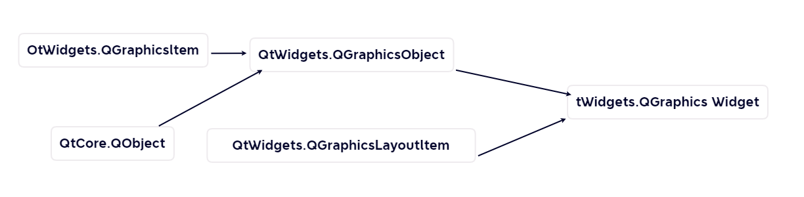

# 15.QPainter和Graphics/View绘图3


### 代理控件和图形控件

场景中除了可以直接添加图项外,也可以添加常用的控件,甚至是对话框.场景中的控仙也可以进行布局。

#### 代理控件QGraphicsProxyWidget

前面介绍过,通过场景的 addWidget(QWidget,wFlags:Qt.WindowFlags)方法可以把一个控件或窗口加人到场景中,并返回代理类控件 QGraphicsProxyWidget。

代理类控件可以将QWidget类控件加入到场景中,可以先创建QGraphicsProxyWidget 控件,然后用场景的addItem(QGraphicsProxyWidget)方法把代理控件加人到场景中。

代理控件QGraphicsProxyWidget 继承自图形控件 QGraphicsWidget,它们之间的继承关系如图所示。


用QGraphicsProxyWidget 类创建代理实例对象的方法如下,其中parent 是QGraphicsItem的实例

```python
from PySide6.QtWidgets import QGraphicsProxyWidget

QGraphicsProxyWidget(parent: Union[PySide6.QtWidgets.QGraphicsItem, NoneType]= None, wFlags: PySide6.QtCore.Qt.WindowType = Default(Qt.WindowFlags)) -> None 
```


QGraphicsProxyWidget 中添加控件的方法是 setWidget(QWidget),QWidget 不能有WA_PaintOnScreen 属性,也不能是包含其他程序的控件,例如QOpenGLWidget 和QAxWidget控件。

用widget()方法可以获取代理控件中的控件。代理控件和其内部包合的控件在状态方面保持同步,例如可见性、激活状态、字体、调色板、光标形状、窗口标题、几何尺寸、布局方向等

下面是一个代理控件的实例,程序运行界面如图所示。单击"选择图片文件"按钮弹出打开文件对话框,选择图片文件后显示图片,图片所在的窗口用代理控件定义成图项程序中对图片所在的图项进行了错切变换。


```python
# -*- coding: UTF-8 -*-
# File date: Hi_2023/3/9 0:00
# File_name: 02-代理控件QGraphicsProxyWidget实例.py.py


import sys, os
from PySide6.QtWidgets import QApplication, QWidget, QVBoxLayout, QGraphicsProxyWidget, QGraphicsScene, QGraphicsView, QFrame, QPushButton, QFileDialog
from PySide6.QtGui import QPainter, QTransform, QPixmap
from PySide6.QtCore import Qt.QRect


class myFrame(QFrame):  # 创建QFrame的子类
    def __init__(self, parent=None):
        super().__init__(parent)

        self.fileName = ""

    def paintEvent(self, event):  # 重写painterEvent,完成绘图
        if os.path.exists(self.fileName):
            pix = QPixmap(self.fileName)
            painter = QPainter(self)
            rect = QRect(0, 0, self.width(), self.height())
            painter.drawPixmap(rect, pix)

        super().paintEvent(event)


class myPixmapWidget(QWidget):
    def __init__(self, parent=None):
        super().__init__(parent)

        self.resize(600, 400)

        self.frame = myFrame()  # 自定义QFrame的实例
        self.button = QPushButton("选择图片文件")  # 按钮实例
        self.button.clicked.connect(self.button_clicked)  # 按钮信号与槽函数的连接
        v = QVBoxLayout(self)  # 布局
        v.addWidget(self.frame)
        v.addWidget(self.button)

    # 按钮的槽函数
    def button_clicked(self):
        fileName, filter = QFileDialog.getOpenFileName(self, caption="打开图片", dir="../../Resources", filter="图片(*.png *.bmp *.jpg *.jpeg)")
        self.frame.fileName = fileName
        self.frame.update()


class MyWindow(QWidget):
    def __init__(self, parent=None):
        super().__init__(parent)

        pix = myPixmapWidget()  # 绘图窗口
        view = QGraphicsView()  # 视图控件
        scene = QGraphicsScene()  # 场景
        view.setScene(scene)  # 在视图中设置场景
        proxy = QGraphicsProxyWidget(None, Qt.Window)  # 创建代理控件
        proxy.setWidget(pix)  # 代理控件设置控件
        proxy.setTransform(QTransform().shear(1, -0.5))  # 错切变换
        scene.addItem(proxy)  # 在场景中添加图项
        v = QVBoxLayout(self)  # 布局
        v.addWidget(view)


if __name__ == '__main__':
    app = QApplication(sys.argv)
    win = MyWindow()

    win.show()
    sys.exit(app.exec())

```


#### 图形控件QGraphicsWidget

图形控件 QGraphicsWidget 的继承关系如图所示,



它继承自QGraphicsObject 和QGraphicsLayoutItem,间接继承自 QObject和 QGraphicsItem,因此它可以直接添加到场景中。

QGraphicsWidget 是图形控件的基类,继承QGraphicsWidget 的类有

- QGraphicsProxyWidget
- QtCharts.QChart
- QtCharts.QLegend 
- QtCharts.QPolarChart

QWidget 继承自 QObject 和QPaintDevice。QGraphicsWidget和QWidget 有很多相同点但也有些不同点。

在 QGraphicsWidget 中可以放置其他代理控件和布局,因此QGraphicsWidget 可以作为场景中的容器使用。用QGraphicsWidget类创建图形控件的方法如下,其中 parent是QGraphicsItem 的实例。

```python
from PySide6.QtWidgets import QGraphicsWidget

QGraphicsWidget(parent: Union[PySide6.QtWidgets.QGraphicsItem, NoneType]= None, 
                wFlags: PySide6.QtCore.Qt.WindowType = Default(Qt.WindowFlags)) -> None 
```


图形控件QGraphicsWidget 的常用方法如表所示,其中:

- 用setAttribute(attribute:Qt.WidgetAttribute,on: bool=True)方法设置窗口的属性,参数 attribute可以取:
  - Qt.WA_SetLayoutDirection
  - Qt.WA_RightToLeft、
  - Qt.WA_SetStyle、
  - Qt.WAResized
  - Qt.WA_SetPalette
  - Qt.WA_SetFont
  - Qt.WAWindowPropagation。
- 图形控件QGraphicsWidget 中通常需要用设置布局方法 setLayout(layout;QGraphicsLayout),在布局中添加图项或代理控件。

| QGraphicsWidget 的方法及参数类型                             | 说 明                                                       |
| ------------------------------------------------------------ | ----------------------------------------------------------- |
| setAttribute(attribute: Qt.WidgetAttribute,on: bool= True)   | 设置属性                                                    |
| testAttribute(attribute: Qt.WidgetAttribute)                 | 测试是否设置了某种属性                                      |
| itemChange(change: QGraphicsltem.GraphicsItemChange, value: Any) | 重写该函数,作为信号使用。关于该函数的使 用详见6.2.5节的内容 |
| paint(painter: QPainter,option: QStyleOptionGraphicsItem, widget:QWidget=None) | 重写该函数,绘制图形                                         |
| boundingRect()                                               | 重写该函数,返回边界矩形QRectF                               |
| shape()                                                      | 重写该函数,返回路径QPainterPath                             |
| setLayout(layout:QGraphicsLayout)                            | 设置布局                                                    |
| layout()                                                     | 获取布局                                                    |
| setLayoutDirection(direction: Qt.LayoutDirection)            | 设置布局方向                                                |
| setAutoFillBackground(enabled:bool)                          | 设置是否自动填充背景                                        |
| setContentsMargins(margins:Union[QMarginsF, QMargins])       | 设置窗口内的控件到边框的最小距离                            |
| setContentsMargins(left: float, top: float, right: float, bottom: float) | 设置窗口内的控件到边框的最小距离                            |
| sctFocusPolicy(policy:Qt.FocusPolicy)                        | 设置获取焦点的策略                                          |
| sctFont(font: Union[QFont,str,Sequence[str]])                | 设置字体                                                    |
| serGeometry(rect:Union[QRectF,QRect])                        | 设置工作区的位置和尺寸                                      |
| setGeometry(x: float,y: float,w: float,h: float)             | 设置工作区的位置和尺寸                                      |
| setPalette(palette:Union[QPalette, Qt.GlobalColor, QColor])  | 设置调色板                                                  |
| setStyle(style: QStyle)                                      | 设置风格                                                    |
| [static]setTabOrder(first: QGraphicsWidget, second: QGraphicsWidget) | .设置按Tab键获取焦点的顺序                                  |
| setWindowFlags(wFlags: Qt.WindowFlags)                       | 设置窗口标识                                                |
| setWindowFrameMargins s(Union[QMarginsF, QMargins])          | 设置边框距 比图,超强实空。                                  |
| setWindowFrameMargins(float, float, float, float)            | 设置边框距 比图,超强实空。                                  |
| setWindowTitle(title:str)                                    | 设置窗口标题                                                |
| rect()                                                       | 获取图形控件的窗口范围 QRectF                               |
| resize(QSizeF)                                               | 调整窗口尺寸·                                               |
| resize(float,float)                                          | 调整窗口尺寸·                                               |
| size()                                                       | 获取尺寸 QSizeF                                             |
| focusWidget()                                                | 获取焦点控件 QGraphicsWidget                                |
| isActiveWindow()                                             | 获取是否是活跃控件                                          |
| updateGeometry()                                             | 刷新图形控件                                                |
| addAction(QAction)、 addActions(-Sequence[QAction])          | 图形控件中添加动作                                          |
| insertAction(before:QAction,action:QAction)                  | 图形控件中插入动作,图形控件的动作可以作 为右键快捷菜单使用  |
| insertActions(before: QAction, actions: Sequence[QAction])   | 图形控件中插入动作,图形控件的动作可以作 为右键快捷菜单使用  |
| actions()                                                    | 获取动作列表List[QAction]                                   |
| removeAction(action:QAction)                                 | 移除动作                                                    |
| [slot]close()                                                | 关闭窗口,成功则返回True                                     |


QGraphicsWidget 的信号有 

- geometryChanged()和 layoutChanged(),当几何尺寸和布局发生改变时发送信号
- 另外QGraphicsWidget 从QGraphicsObject 继承的信号有
  - opacityChanged()
  - parentChanged() 
  - rotationChanged()
  - scaleChanged()
  - visibleChanged()
  - xChanged()
  - yChanged()
  - zChanged()

#### 图形控件的布局

图形控件可以添加布局,图形控件的布局有 3种分别为QGrphicsLinearLayout、QGraphicsGridLayout 和 QGraphicsAnchorLayout;它们都继承自QGraphicsLayoutItem。

##### 线性布局OGraphicsLinearLayout

线性布局 QGraphicsLinearLayout 类似于 QHLayoutBox或 QVLayoutBox,布局内的图形控件线性分布。

用QGraphicsLinearLayout创建线性布局的方法如下,其中parent是QGraphicsLayoutItem 的实例;Qt.Orientation 确定布局的方法可以取 QHorizontal或Qt.Vertical,默认是水平方向。

```python
from PySide6.QtWidgets import QGraphicsLinearLayout

QGraphicsLinearLayout(orientation: PySide6.QtCore.Qt.Orientation, parent: Union[PySide6.QtWidgets.QGraphicsLayoutItem, NoneType]= None) -> None
QGraphicsLinearLayout(parent: Union[PySide6.QtWidgets.QGraphicsLayoutItem, NoneType]= None) -> None 
```

QGraphicsLinearLayout 的主要方法如表所示。

- 用图形控件的setLayout(QGraphicsLayout)方法可以添加二个布局,
- 用addItem(QGraphicsLayoutItem)方法可以添加图形控件,
- 用insertItem(index,QGraphicsLayoutItem)方法在指定索引处插人图形控件,
- 用addStretch(stretch=1)方法可以添加空间拉伸系数,
- 用insertStretch(index,stretch=1)方法插人空间拉伸系数
- 用setStretchFactor(QGraphicsLayoutItem,int)方法设置图项或布局的拉伸系数,
- 用setOrientation(QtOrientation)方法设置布局的方向。

| QGraphicsLinearLayout的方法及参数类型                    | 说明                         |
| -------------------------------------------------------- | ---------------------------- |
| addItem(item: QGraphicsLayoutItem)                       | 添加图形控件、代理控件或布局 |
| insertItem(index:int, item:QGraphicsLayoutItem)          | 根据索引插入图形控件或布局   |
| addStretch(stretch: int=1)                               | 在末尾添加拉伸系数           |
| insertStretch(index: int,stretch:int=1)                  | 根据索引插入拉伸系数         |
| count()                                                  | 获取弹性控件和布局的个数     |
| setAlignment(QGraphicsLayoutItem,Qt.Alignment)           | 设置图形控件的对齐方式       |
| setGeometry(rect:Union[QRectF,QRect])                    | 设置布局的位置和尺寸         |
| setItemSpacing(index:int,spacing:float)                  | 根据索引设置间距             |
| setOrientation(Qt.Orientation)                           | 设置布局方向                 |
| setSpacing(spacing:float)                                | 设置图形控件之间的间距       |
| setStretchFactor(item: QGraphicsLayoutItem,stretch: int) | 设置图形控件的拉伸系数       |
| stretchFactor(item:QGraphicsLayoutItem)                  | 获取控件的拉伸系数           |
| itemAt(index:int)                                        | 根据索引获取图形控件或布局   |
| removeAt(index:int)                                      | 根据索引移除图形控件或布局   |
| removeltem(item:QGraphicsLayoutltem)                     | 移除指定的图形控件或布局     |


下面的程序在 QGraphicsWidget 中添加线性布局在布局中添加了两个 QLabel和两个 QPushButton。


```python
# -*- coding: UTF-8 -*-
# File date: Hi_2023/3/9 23:10
# File_name: 02-线性布局QGraphicsLinearLayout.py


import sys
from PySide6.QtWidgets import QApplication, QWidget, QVBoxLayout, QGraphicsProxyWidget, QGraphicsScene, QGraphicsView, QPushButton, QGraphicsWidget, QGraphicsLinearLayout, QLabel
from PySide6.QtCore import Qt


class MyWindow(QWidget):
    def __init__(self, parent=None):
        super().__init__(parent)
        self.resize(500, 500)

        view = QGraphicsView()  # 视图控件
        scene = QGraphicsScene()  # 场景
        view.setScene(scene)  # 视图中设置场景

        v = QVBoxLayout(self)  # 布局
        v.addWidget(view)

        widget = QGraphicsWidget()
        widget.setFlags(QGraphicsWidget.ItemIsMovable | QGraphicsWidget.ItemIsSelectable)
        scene.addItem(widget)
        linear = QGraphicsLinearLayout(Qt.Vertical, widget)  # 线性竖直布局
        label1 = QLabel("MyLabel 1")
        label2 = QLabel("MyIabel2")
        button1 = QPushButton("MyPushbutton 1")
        button2 = QPushButton("MyPushbutton 2")

        p1 = QGraphicsProxyWidget()
        p1.setWidget(label1)

        p2 = QGraphicsProxyWidget()
        p2.setWidget(label2)

        p3 = QGraphicsProxyWidget()
        p3.setWidget(button1)

        p4 = QGraphicsProxyWidget()
        p4.setWidget(button2)

        linear.addItem(p1)
        linear.addItem(p2)
        linear.addItem(p3)
        linear.addItem(p4)

        linear.setSpacing(10)
        linear.setStretchFactor(p3, 1)
        linear.setStretchFactor(p4, 2)


if __name__ == '__main__':
    app = QApplication(sys.argv)
    win = MyWindow()

    win.show()
    sys.exit(app.exec())

```

##### 格栅布局 QGraphicsGridLayout

格栅布局QGraphicsGridLayout与 QGridLayout 类似,由多行和多列构成,一个图形控件可以占用一个节点,也可以占用多行和多列。

用QGraphicsGridLayout创建格棚市局的方法如下所示,其中parent是 QGraphicsLayoutItem 的实例或图形控件。

```python
from PySide6.QtWidgets import QGraphicsGridLayout

QGraphicsGridLayout(parent: Union[PySide6.QtWidgets.QGraphicsLayoutItem, NoneType]= None) -> None
```


QGraphicsGridLayout 的常用方法如表示:

可以添加和移除图形控件及布局,可以设置列宽度、行高度、列之间的间隙和行之间的间隙,及行或列的拉伸系数。

| QGraphicsGridLayout的方法及参数类型                          | 说 明                            |
| ------------------------------------------------------------ | -------------------------------- |
| addltem(item: QGraphicsLayoutltem,row: int, column: int,alignment: Qt.Alignment =Default(Qt.Alignment)) | 在指定的位置添加图形控件         |
| addItem(item: QGraphicsLayoutltem,row: int, column: int, rowSpan: int, columnSpan: int, alignment: Qt.Alignment) | 添加图形控件,可占据多行多列      |
| rowCount()、columnCount()                                    | 获取行数、获取列数               |
| count()                                                      | 获取图形控件和布局的个数         |
| itemAt(row: int,column:int)                                  | 获取指定行和列处的图形控件或布局 |
| itemAt(index:int)                                            | 根据索引获取图形控件或布局       |
| removeAt(index: int)                                         | 根据索引移除图形控件或布局       |
| removeItem(QGraphicsLayoutItem)                              | 移除指定的图形控件或布局         |
| setGeometry(rect:Union[QRectF,QRect])                        | 设置控件所在的区域               |
| setAlignment(QGraphicsLayoutItem,Qt.Alignment)               | 设置控件的对齐方式               |
| setRowAlignment(row: int, alignment: Qt.Alignment)           | 设置行对齐方式                   |
| setColumnAlignment(column:int, alignment: Qt.Alignment)      | 设置列对齐方式                   |
| setRowFixedHeight(row: int,height:float)                     | 设置行的固定高度                 |
| setRowMaximumHeight(row:int,height: float)                   | 设置行的最大高度 32LdG5          |
| setRowMinimumHeight(row:int,height:float)                    | 设置行的最小高度                 |
| setRowPreferredHeight(row:int,height: float)                 | 设置指定行的高度                 |
| setRowSpacing(row: int,spacing:float)                        | 设置指定行的间距                 |
| setRowStretchFactor(row:int,stretch: int)                    | 设置指定行的拉伸系数             |
| setColumnFixedWidth(column:int,width:float)                  | 设置列的固定宽度                 |
| setColumnMaximumWidth(column:int,width:float)                | 设置列的最大宽度                 |
| setColumnMinimumWidth(column:int,width:float)                | 设置列的最小宽度                 |
| setColumnPreferredWidth(column:int,width:float)              | 设置指定列的宽度:                |
| setColumnSpacing(column:int, spacing:float)                  | 设置指定列的间隙                 |
| setColumnStretchFactor(column:int,stretch:int)               | 设置指定列的拉伸系数             |
| setSpacing(spacing: float)                                   | 设置行、列之间的间隙             |
| setHorizontalSpacing(spacing: float)                         | 设置水平间隙                     |
| setVerticalSpacing(spacing:float)                            | 设置竖直间隙                     |

##### 锚点布局OGraphicsAnchorLayout

锚点布局可以设置两个图形控件之间的相对位置,可以是两个边对齐,也可以是两个点对齐。

用QGraphicsAnchorLayout 创建铺点布局的方法如下,其中参数 parent 是QGraphicsLayoutItem 实例。

```python
from PySide6.QtWidgets import QGraphicsAnchorLayout

QGraphicsAnchorLayout(parent: Union[PySide6.QtWidgets.QGraphicsLayoutItem, NoneType]= None) -> None
```


QGraphicsAnchorLayout 的方法中

- 用addAnchor(firstItem;QGraphicsLayoutItem;firstEdge: Qt.AnchorPoint, secondItem;QGraphicsLayoutItem, secondEdge: Qt.AnchorPoint)方法将第 1个图形控件的某个边与第 2个图形控件的某个边对齐,其中Q.AnchorPoint 可以取:
  - Qt.AnchorLeft
  - Qt.AnchorHorizontalCenter
  - Qt.AnchorRight
  - Qt.AnchorTop
  - Qt.AnchorVerticalCenter 
  - Qt.AnchorBottom
- 用addCornerAnchors(firstItem:QGraphicsLayoutItem, first(orner: Qt.(Corner, secondltem; QGraphicsLayoutItem , secondCorner :Qt.Corner)方法可以让第1个控件的某个角点与第2个控件的某个角点对齐,其中QCorner可以取:
  - Qt.TopLeftCorner 
  - Qt.TopRightCorner 
  - Qt.BottomLeftCorner 
  - Qt.BottomRightCorner;
- 用addAnchors(firstItem; QGraphicslayoutItem, secondltem: QGraphicsLayoutItemorientations:Qt Orientations=Qt.Horizontal  QtVertical)方法可以使两个控件在某个方向上尺寸相等。
- 另外用setHorizontalSpacing(spacing; float)setVerticalSpacing(spacing:[loat)或 setSpacing(spacing:[loat)方法可以设置控件之间在水平和竖直方向的间距,
- 用itemAt(index:int)方法可以取图形控件,用removeAt(index:int)方法可以移除图形控件,用count()方法可以获取图形控件的数量

#### 图形效果

在图项和视图控件的视口之间可以添加渲染通道,实现对图项显示效果的特殊设置。

图形效果 QGraphicsEffect 类是图形效果的基类,图形效果类有:

- QGraphicsBlurEffect(模糊效果)
- QGraphicsColorizeEffect(变色效果)
- QGraphicsDropShadowEffect(阴影效果)
- QGraphicsOpacityEffect(透明效果)

用图项的 setGraphicsEffect(QGraphicsEffect)方法设置图项的图形效果。

创建这 4 种效果的方法如下所示,其中 parent 是指继承自 QObject 的实例。

```python
from PySide6.QtWidgets import QGraphicsBlurEffect, QGraphicsColorizeEffect, QGraphicsDropShadowEffect, QGraphicsOpacityEffect

QGraphicsBlurEffect(parent: Union[PySide6.QtCore.QObject, NoneType]= None) -> None
QGraphicsColorizeEffect(parent: Union[PySide6.QtCore.QObject, NoneType]= None) -> None
QGraphicsDropShadowEffect(parent: Union[PySide6.QtCore.QObject, NoneType]= None) -> None
QGraphicsOpacityEffect(parent: Union[PySide6.QtCore.QObject, NoneType]= None) -> None
```

##### 图形效果的常用方法

QGraphicsBlurEffect、 QGraphicsColorizeEffect、QGraphicsDropShadowEffect 和QGraphicsOpacityEffect 的常用方法如表所示

- **QGraphicsBlurEffect**

| 图形效果的方法及参数类型                                 | 说明             |
| -------------------------------------------------------- | ---------------- |
| setEnabled(enable: bool)                                 | 设置激活图形效果 |
| [slot]setBlurHints(hints: QGraphicsBlurEffect.BlurHints) | 设置模糊提示     |
| [slot]setBlurRadius(blurRadius:float)                    | 设置模糊半径     |
| blurHints()                                              | 获取模糊提示     |
| blurRadius()                                             | 获取模糊半径     |

- **QGraphicsColorizeEffect**

| 图形效果的方法及参数类型                          | 说明             |
| ------------------------------------------------- | ---------------- |
| [slot]setColor(Union[QColor,Qt.GlobalColor, str]) | 设置着色用的颜色 |
| [slot]setStrength(strength:float)                 | 设置着色强度     |
| color()                                           | 获取着色用的颜色 |
| strength()                                        | 获取着色强度     |

- **QGraphicsDropShadowEffect**

| 图形效果的方法及参数类型                           | 说明                  |
| -------------------------------------------------- | --------------------- |
| [slot]setBlurRadius(blurRadius:float)              | 设置模糊半径          |
| [slot]setColor(Union[QColor, Qt.GlobalColor, str]) | 设置引用颜色          |
| [slot]setOffset(d: float)                          | 设置阴影的x和y偏 移量 |
| [slot]setOffset(dx: float,dy:float)                | 设置阴影的x和y偏 移量 |
| [slot]setOffset(ofs: Union[QPointF,QPoint])        | 设置阴影的位移量      |
| [slot]setXOffset(dx: float)                        | 设置阴影的x偏移量     |
| [slot]setYOffset(dy:float)                         | 设置阴影的y偏移量     |
| blurRadius()                                       | 获取模糊半径          |
| color()                                            | 获取阴影颜色QColor    |
| offset()                                           | 获取阴影的偏移量      |
| xOffset()                                          | 获取阴影的x偏移量     |
| yOffset()                                          | 获取阴影的y偏移量     |

- **QGraphicsOpacityEffect**

| 图形效果的方法及参数类型                                     | 说明                |
| ------------------------------------------------------------ | ------------------- |
| [slot]setOpacity(opacity: float)                             | 设置不透明度        |
| [slot]setOpacityMask(Union[QBrush, Qt.BrushStyle, Qt.GlobalColor, QColor,QGradient, QTmage,QPixmap]) | 设置遮掩面刷        |
| opacity()                                                    | 获取不透明度        |
| opacityMass()                                                | 获取遮掩画刷 QBrush |


主要方法介绍如下

- 模糊效果是使图项变得模糊不清,可以隐藏一些细节。在一个图项失去焦点,或将注意力移到其他图项上时可以使用模糊效果。

  - QGraphicsBlurEffect 的模糊效果是通过设置模糊半径和模糊提示实现的。

  - QGraphicsBlurEffect 主要有槽函数setBlurRadius(blurRadius;float),setBlurHints(QGraphicsBlurEffect, BlurHint).

  - 其中模糊半径默认为5个像聚,模糊半径越大图像越模糊;

  - 模糊提示QGraphicsBlurEffect,BlurHint 可以取:
    - QGraphicsBlurEffect.PerformanceHint(主要考虑染性能)
    - QGraphicsBlurEffect,QualityHint(主要考虑染质量)
    - QGraphicsBlurEffect,AnimationHint(用于染动画)。

- 变色效果是用另外一种颜色给图项着色
  - QGraphicsColorizeEffect 的变色效果是通过设置新颜色和着色强度来实现的,默认的着色是浅蓝色(QColor(0,0,192))
  - QGraphicsColorizeEffeet 主要有槽函数 setColor(Union[QColor,Qt.GlobalColor, str])和 setStrength(strength: float)
- 阴影效果能给图项增加立体效果
  - QGraphicsDropShadowEffect 的阴影效果需要设置背景色、模糊半径和阴影的偏移量。默认的阴影颜色是灰色(QColor(63,63,63.180)),默认的模糊半径是 1,偏移量是8个像素,方向是右下
  - QGraphicsDropShadowEffect 主要有槽函数
    - setBlurRadius(blurRadius float)
    - setColor(Union[QColor, Qt.GlobalColor,str])
    - setOffset(dx: float,dy: float)
    - setOffset(ofs: Union[QPointF,QPoint])
- 透明效果可以使人看到图项背后的图形
  - QGraphicsOpacityEffect 的透明效果需要设置不透明度。
  - QGraphicsOpacityEffect 有函数:
    - setOpacity(opacity: float)
    - setOpacityMask(Union[QBrush,Qt.BrushStyle, Qt.GlobalColor,QColor.QGradient,QImage,QPixmap])
  - setOpacity(opacity:float)用于设置不透明度opacity 的值在 0.0~1.0之间,00表示完全透明,10表示完全不透明,默认值为0.7;
  - setOpacityMask()用于设置部分透明。


##### 图形效果的信号

图形效果的信号如表所示

| 图形效果                   | 图形效果的信号及参数类型                               | 说明                         |
| -------------------------- | ------------------------------------------------------ | ---------------------------- |
| QGraphicsBlurEffect        | blurRadiusChanged(radius: float)                       | 模糊半径发生改变时发送信号   |
| QGraphicsBlurEffect        | blurHintsChanged(hints: QGraphicsBlurEffect.BlurHints) | 模糊提示发生改变时发送信号   |
| QGraphicsColorizeEffect    | colorChanged(color:QColor)                             | 颜色发生改变时发送信号       |
| QGraphicsColorizeEffect    | strengthChanged(strength: float)                       | 强度发生改变时发送信号       |
| QGraphicsDropShadow Effect | blurRadiusChanged(blurRadius:float)                    | 模糊半径发生改变时发送信号   |
| QGraphicsDropShadow Effect | colorChanged(color:QColor)                             | 阴影颜色发生改变时发送信号   |
| QGraphicsDropShadow Effect | offsetChanged(offset: QPointF)                         | 阴影偏移量发生改变时发送信号 |
| QGraphicsOpacityEffect     | opacityChanged(opacity:float)                          | 不透明度发生改变时发送信号   |
| QGraphicsOpacityEffect     | opacityMaskChanged(mask:QBrush)                        | 遮掩画刷发生改变时发送信号   |

