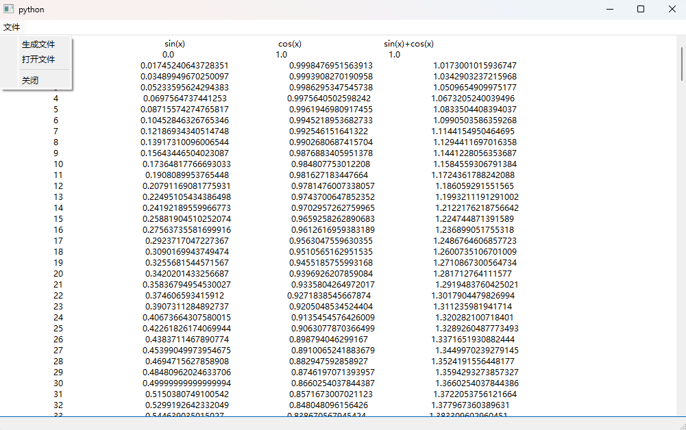
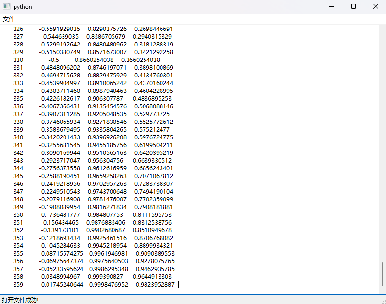
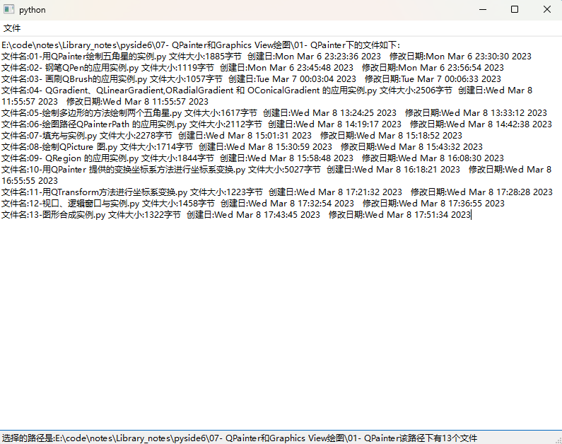

# 16.数据读写和文件管理

在程序运行时会生成各种各样的数据,如果数据量少,可以直接将其保存在内存中,算结束时清空内存并把结果保存到文件中;

如果在计算中生成大量的中间数据,则需要把数据写到临时文件中,计算结束时把临时文件删除。

为保存数据,可以用Python 提供的open()函数打开或新建文件进行文本文件的读写

对于大量的有固定格式的数据(例如用科学计数法表示的数据)可以用PySide6 提供的以数据流的方式读写文本数据二进制数据和原生数据的方法和函数,以及对临时文件进行管理和监控的函数,很方便地对数据进行读写和对文件进行管理。


### 数据读写的基本方法

把计算过程中的数据保存下来或者读取已有数据是任何程序都需要进行的工作PySide6 把文件当作输入输出设备,可以把数据写到设备中,或者从设备中读取数据,从而达到读写数据的目的。

可以利用QFile类调用QIODevice类的读写方法直接进行读写

或者把QFile类和QTextStream类结合起来用文本流(text stream)的方法进行文本数据的读写

还可以把 QFile类和QDataStream 类结合进来,用数据流(data stream)的方法进行二进制数据的读写。

#### QIODevice类

QIODevice 类是抽象类,是执行读数据和写数据类(如 QFile QBuffer)的基类它提供读数据和写数据的接口。

QIODevice类在 QtCore 模块中。直接或间接继承自 QIODevice,与本地读写文件有关的类有

- QBuffer 
- QFile 
- QFileDevice 
- QProcess 
- QSaveFileQTemporaryFile

这些类之间的继承关系如图所示。另外还有网络方面的读写类

- QAbstractSocket
- QLocalSocket
- QNetworkReply
- QSslSocket
- QTcpSocket
- QUdpSocket


QIODevice类提供读写接口但是不能直接使用QIODevice 类进行数据的读写而是使用子类QFile或QBuffer 的继承自QIODevice 的读写方法来进行数据读写。

在一些系统中将所有的外围设备都当作文件来处理,因此可以读写的类都可以当作设备来处理。QIODevice的常用方法如表所示,主要方法介绍如下。

| QIODevice的方法及参数类型           | 返回值的类型 | 说明                                                         |
| ----------------------------------- | ------------ | ------------------------------------------------------------ |
| open(QIODeviceBase. OpenMode)       | bool         | 打开设备,成功则返回True                                      |
| isOpen()                            | bool         | 获取设备是否已经打开                                         |
| setOpenMode(QIODeviceBase.OpenMode) | None         | 打开设备后,重新设置打开模式                                  |
| close()                             | None         | 关闭设备                                                     |
| setTextModeEnabled(bool)            | None         | 设置是否是文本模式                                           |
| read(maxlen; int)                   | QByteArray   | 读取指定数量的字节数据                                       |
| readAl]()                           | QByteArray   | 读取所有数据                                                 |
| readLine(maxlen:int=0)              | QByteArray   | 按行读取 ASCII数据                                           |
| getChar(c: bytes)                   | bool         | 读取一个字符,并存储到c中                                     |
| ungetChar(c; str)                   | None         | 将字符重新存储到设备中                                       |
| peek(maxlen;int)                    | QByteArray   | 读取指定数量的字节                                           |
| write(data:Union[QByteArray,bytes]) | int          | 写入字节数组,返回实际写入的字节 数量                         |
| writeData(data: bytes,len: int)     | int          | 写人字节串,返回实际写人的宇节数量                            |
| putChar(c:str)                      | bool         | 写人一个字符,成功则返回True                                  |
| setCurrentReadChannel(int)          | None         | 设置当前的读取通道                                           |
| setCurrentWriteChannel(int)         | None         | 设置当前的写入通道                                           |
| currentReadChannel()                | int          | 获取当前的读取通道                                           |
| currentWriteChannel()               | int          | 获取当前的写入通道                                           |
| readChannelCount()                  | int          | 获取读取数据的通道数量                                       |
| writeChannelCount()                 | int          | 获取写入数据的通道数量                                       |
| canReadLine()                       | bool         | 获取是否可以按行读取                                         |
| QIODevice的方法及参数类型           | 返回值的类型 | 说明                                                         |
| bytesToWrite()                      | int          | 获取缓存中等待写人的字节数量                                 |
| bytesAvailable()                    | None         | 获取可读取的字节数量                                         |
| setErrorString(str)                 | None         | 设置设备的出错信息                                           |
| errorString()                       | Str          | 获取设备的出错信息                                           |
| isReadable()                        | bool         | 获取设备是否是可读的                                         |
| isSequential()                      | bool         | 获取设备是否是顺序设备                                       |
| isTextModeEnabled()                 | bool         | 获取设备是否能以文本方式读写                                 |
| isWritable()                        | bool         | 获取设备是否可写人                                           |
| atEnd()                             | bool         | 获取是否已经到达设备的末尾                                   |
| seek(pos: int)                      | bool         | 将当前位置设置到指定值                                       |
| pos()                               | int          | 获取当前位置 .                                               |
| reset()                             | bool         | 重置设备,回到起始位置,成功则返回 True;如果设备没有打开则返回 False |
| startTransaction()                  | None         | 对随机设备,记录当前位置；对顺序设 备,在内部复制读取的数据以便恢复数据 |
| rollbackTransaction()               | None         | 回到调用startTransaction()的位置                             |
| commitTransaction()                 | None         | 对顺序设备,放弃记录的数据                                    |
| isTransactionStarted()              | bool         | 获取是否开始记录位置                                         |
| size()                              | int          | 获取随机设备的字节数或顺序设备的 bytesAvailable()值          |
| skip(int)                           | int          | 跳过指定数量的字节,返回实际跳过的 字节数                     |
| waitForBytesWritten(msecs:int)      | bool         | 对于缓存设备,该方法需要将数据写到 设备中或经过msecs毫秒后返回值 |
| waitForReadyRead(msecs:int)         | bo01         | 当有数据可以读取前或经过msecs 毫秒 前会阻止设备的运行        |

- 读写设备分为两种,一种是随机设备(random-access device),另一种是顺序设备(sequential device),

  - 用isSequential()方法可以判断设备是否是顺序设备。
    - QFile和QBuffer 是随机设备
    - QTcpSocket 和QProcess 是顺序设备
  - 。随机设备可以获取设备指针的位置,将指针指向指定的位置,从指定位置读取数据;而顺序设备只能依次读取数据。
    - 随机设备可以用seek(pos:int)方法定位,
    - 用pos()方法获取位置

- 读取数据的方法有 

  - read(maxlen:int)、
  - readAll()、
  - readData(data: bytes,maxlen:int)、
  - readLine(maxlen: int=0)
  - readLineData(data: bytes,maxlen: int),
  - getChar(c:bytes)
  - peek(maxlen:int)

  - read(maxlen:int)表示读取指定长度的数据
    - readLine(maxlen:int=0)表示读取行参数maxlen 表示允许读取的最大长度,若为0表示不受限制。

- 写人数据的方法有 

  - write(QByteArray)
  - writeData(bytes)
  - putChar(c:str)

  - getChar(c;bytes)和 putChar(c;str)只能读取和写人一个字符
  - 如果要继承 QIODevice 创建自己的读写设备需要重写 readData()和 writeData()函数。

- 一些顺序设备支持多通道读写,这些通道表示独立的数据流

  - 可以用setCurrentReadChannel(int)方法设置读取通道
  - 用setCurrentWriteChannel(int)方法设置写人通道
  - 用currentReadChannel()方法和currentWriteChannel()方法获取读取和写入通道

#### 字节数组QByteArray

在利用QIODevice 的子类进行读写数据时通常返回值或参数是 QByteArray类型的数据。Q

- ByteArray 用于存储二进制数据,至于这些数据到底表示什么内容(字符串数字图片或音频等),完全由程序的解析方式决定。
- 如果采用合适的字符编码方式(字符集),字节数组可以恢复成字符串,字符串也可以转换成字节数组。
- 字节数组会自动添加"\0"作为结尾,统计字节数组的长度时,不包含末尾的0"。

用QByteArray创建字节数组的方法如下,其中c只能是一个字符,例如"a",size指c的个数,例如 QByteArray(5,a")表示"aaaaa"

```python
from PySide6.QtCore import QByteArray

QByteArray(self) -> None
QByteArray(arg__1: bytearray) -> None
QByteArray(arg__1: bytes) -> None
QByteArray(arg__1: bytes, size: int = -1) -> None
QByteArray(arg__1: Union[PySide6.QtCore.QByteArray, bytes]) -> None
QByteArray(size: int, c: int) -> None
```

- 用Python的 str(QByteArrayencoding="utf-8")函数可以将 QByteArray 数据转换成Python的字符串型数据。
- 用QByteArray 的append(str)方法可以将 Pthon 的字符串添加到QByteArray 对象中,同时返回包含字符串的新QByteArray 对象。


QByteArray的常用方法如表所示,一些需要说明的方法介绍如下:

- QByteArray 对象用resize(size:int)方法可以调整数组的尺寸
- 用size()方法可以获取字节数组的长度,用"[]"操作符或at(iint)方法读取数据。
- 用append(Union[QByteArray,bytes])或 append(c:str)方法可以在末尾添加数据,
- 用prepend(Union[QByteArraybytes])方法可以在起始位置添加数据
- 用静态方法 fromBase64(Union[QByteArray,bytes],options = QByteArray.Base64Encoding)可以把 Base64 编码数据解码
- 用toBase64(options:QByteArray.Base64Option)方法可以转换成 Base64 编码其中参数options 可以取:
  - QByteArray.Base64UrlEncoding
  - QByteArray.KeepTrailingEqualsBase64Encoding
  - QByteArray.QByteArray. OmitTtailingEquals 
  - QByteArray.IgnoreBase64DecodingErrors
  - QByteArray.AbortOnBase64DecodingErrors。
- 用setNum(float,format='g',precision=6)方法或 number(float,format='gprecision=6)方法可以将浮点数转换成用科学计数法表示的数据
  - 其中格式format可以取`e`、`E`、 `f`、`g`、`G``
    - ``e`表示的格式如`[-]9.9e[+ | -]999`
    - `E`表示的格式如`[-]9.9E[+ | -]999`
    - `f`表示的格式如`[-]9.9`
    - `g`表示视情况选择`e`、`f`
    - `G`表示视情况选择`W`、`F`

| QByteArray的方法及参数类型                                   | 返回值的类型     | 说明                                                         |
| ------------------------------------------------------------ | ---------------- | ------------------------------------------------------------ |
| append(Union[QByteArray,bytes])                              | QByteArray       | 在末尾追加数据                                               |
| append(c: str)、append(count:int,c:str)                      | QByteArray       | 在末尾追加文本数据                                           |
| append(s: bytes,len:int)                                     | QByteArray       | 在末尾追加数据                                               |
| at(i:int)                                                    | Str              | 根据索引获取数据                                             |
| chop(n:int)                                                  | None             | 从尾部移除n个字节                                            |
| chopped(len:int)                                             | QByteArray       | 获取从尾部移除len个字节后的字 节数组                         |
| clear()                                                      | bool             | 清空所有字节                                                 |
| contains(Union[QByteArray,bytes])                            | bo01             | 获取是否包含指定的字节数组                                   |
| contains(c: str)                                             | bool             | 获取是否包含指定的字符                                       |
| count(Union[QByteArray,bytes])                               | int              | 获取包含的字节数组的个数                                     |
| count()、size()                                              | int              | 获取长度                                                     |
| data()                                                       | bytes            | 获取字节串                                                   |
| endsWith(Union[QByteArray,bytes])                            | bool             | 获取末尾是否是指定的字节数组                                 |
| endsWith(c: str)                                             | bool             | 获取末尾是否是指定的字符                                     |
| startsWith(Union[QByteArray,bytes])                          | bool             | 获取起始是否是指定的字节数组                                 |
| fill(str,size=-1)                                            | QByteArray       | 使数组的每个数据为指定的字符, 将长度调整成size               |
| [static]fromBase64(Union[QByteArray, bytes],options=QByteArray.Base64Encoding) | QByteArray       | 从Base64编码中解码                                           |
| [static]fromBase64 Encoding(Union[bytes, QByteArray],options) | QByteArray       | 从Base64编码中解码                                           |
| [static]fromHex(Union[QByteArray, bytes])                    | QByteArray       | 从十六进制数据中解码                                         |
| [static]fromPercentEncoding(Union[QByteArray,bytes].percent: str='%') | QByteArray       | 从百分号编码中解码                                           |
| [static]fromRawData(data:bytes,size: int)                    | QByteArray       | 用前size个原生字节构建字节数组                               |
| indexOf(Union[QByteArray,bytes],from_ =0)                    | int              | 获取索引                                                     |
| indexO{(str,from_:int=0)                                     | int              | 获取索引                                                     |
| insert(int,Union[QByteArray,bytes])                          | QByteArray       | 根据索引在指定位置插人字节数 组,返回值是插入后的字节数组     |
| insert(i: int,c: str)                                        | QByteArray       | 在指定位置插人文本数据                                       |
| insert(i:int,count:int,c:str)                                | QByteArray       | 同上,count是指数据的份数                                     |
| isEmpty()                                                    | 6001 AS          | 是否为空,长度为0时返回 True, QByteArray("").isEmpty()的值 是 False |
| isNull()                                                     | bool             | 内容为空时返回 True,QByteArray("").isNull()的值是 False      |
| isLower()                                                    | bool             | 全部是小写字母时返回True                                     |
| isUpper()                                                    | bool             | 全部是大写字母时返回True                                     |
| lastlndexOf(Union[QByteArray, bytes], {rom_=-1)              | int              | 获取最后索引值                                               |
| lastIndexO{(str.from_=-1)                                    | int              | 同上                                                         |
| length()                                                     | int              | 获取长度,与 size()相同                                       |
| mid(int,length=-1)                                           | QByteArray       | 从指定位置获取指定长度的数据                                 |
| [static]number(float,format='g', precision=6)                | QByteArray       | 将浮点数转换成科学计数法数据                                 |
| [static]number(int,base=10)                                  | QByteArray       | 将整数转换成base进制数据                                     |
| prepend(Union[QByteArray,bytes])                             | QByteArray       | 在起始位置添加数据                                           |
| remove(index:int,len:int)                                    | QByteArray       | 从指定位置移除指定长度的数据                                 |
| repeated(times: int)                                         | QByteArray       | 获取重复times次后的数据                                      |
| replace(index: int, len: int, Union[QByteArray,bytes])       | QByteArray       | 从指定位置用数据替换指定长度 数据                            |
| replace(before: Union[QByteArray,bytes], after: Union[QByteArray,bytes]) | QByteArray       | 用数据替换指定的数据                                         |
| resize(size:int)                                             | None             | 调整长度,如果长度小于现有长度, 则后面的数据会被丢弃          |
| setNurn(float,format='g',precision=6)                        | QByteArray       | 将浮点数转换成科学计数法数据                                 |
| setNum(int,base=10)                                          | QByteArray       | 将整数转换成指定进制的数据                                   |
| split(sep:str)                                               | ListCQByteArrayJ | 用分割符将字节数组分割成列表                                 |
| squeeze()                                                    | None             | 释放不存储数据的内存                                         |

Python3中新添加了字节串 bytes 数据类型其功能与QByteArray的功能类似。

如果一个字符串前面加`b`,就表示是 bytes类型的数据例如 `b"hello"`。

bytes 数据和字符串的对比如下:

- 字节是计算机的语言,字符串是人类的语言,它们之间通过编码表形成对应关系。
- 字符串由若干个字符组成,以字符为单位进行操作;bytes 由若干个字节组成,以字节为单位进行操作。
- bytes 和字符申除了操作的数据单元不同之外,它们支持的所有方法都基本相同。
- bytes 和字符串都是不可变序列,不能随意增加和删除数据


- 用xx=bytes("hello", encoding='ut-8')方法可以将字符"hello"转换成bytes
- 用yy=str(xx, encoding='utf-8)方法可以将 bytes 转换成字符串。
- bytes 也是一个类用bytes()方法可以创建一个空 bytes 对象,
  - 用bytes(int)方法可以创建指定长度的 bytes 对象,
  - 用decode(encoding='utf-8')方法可以对数据进行解码,bytes 的操作方法类似于字符串的操作方法。
- Python中还有一个与 bytes类似但是可变的数组 `bytearray`;
  - 其创建方法和字符串的转换方法与bytes相同,在 QByteArray 的各个方法中可以用bytes 数据的地方也可以用bytearrayo
- bytes 数据和QByteArray 数据非常适合在互联网上传输,可以用于网络通信编程bytes 和QByteArray 都可以用来存储图片音视频等二进制格式的文件。

#### QFile读写数据

QFile 继承自QIODevice,会继承 QIODevice 的方法,

QFile 可以读写文本文件和二进制文件,可以单独使用,也可以与QTextStream 和 QDataStream 一起使用。

用QFile类创建实例对象的方法如下所示,其中 parent 是继承自QObject 的实例,str 是要打开的文件需要注意的是,文件路径中的分隔符可以用`/`、`//`,而不能用`\`

```python
from PySide6.QtCore import QFile

QFile(self) -> None
QFile(name: Union[str, bytes, os.PathLike]) -> None
QFile(name: Union[str, bytes, os.PathLike], parent: PySide6.QtCore.QObject) -> None
QFile(parent: PySide6.QtCore.QObject) -> None
```

##### QFile的常用方法

QFile的常用方法如表所示,主要方法介绍如下

- QFile打开的文件可以在创建实例时输入
  - 也可以用setFileName(name:Union[str,bytes,os.PathLike])方法来设置
    - 用fileName()方法可以获取文件名。
  - 设置文件名后,用open(QIODeviceBase OpenMode)方法打开文件
    - 或者用open(fh,QIODevice.OpenMode,handleFlags)方法打开文件;
      - 其中fh 是文件句柄号(filehandle),文件句柄号对于打开的文件而言是唯一的识别标识;
      - 参数 handleFlags可以取 QFileDevice.AutoCloseHandle(通过 close()来关闭)或 QFileDevice.DontCloseHandle(如果文件没有用close()关闭,当QFile 构后,文件句柄一直打开,这是默认值)。
- QFile 的读取和写入需要使用QIODevice 的方法
  - 例如 read(int)、readAlI()readLine()、getChar()、peek(int),write(QByteArray)或 putChar(str)。
  - 用setPermissions(QFileDevice,Permission)方法设置打开的文件的权限,其中参数QFileDevice.Permission 可以取:
    - QFileDevice.ReadOwner(只能由所有者读取)
    - QFileDevice.WriteOwner(只能由所有者写入)
    - QFileDevice.ExeOwner(只能由所有者执行)
    - QFileDevice.ReadUser(只能由使用者读取)
    - QFileDevice.WriteUser(只能由使用者写入)
    - QFileDevice.ExeUser(只能由使用者执行)
    - QFileDevice.ReadGroup(工作组可以读取)
    - QFileDevice.WriteGroup(工作组可以写入)
    - QFileDevice.ExeGroup(工作组可以执行)
    - QFileDevice.ReadOther(任何人都可以读取)
    - QFileDevice.WriteOther(任何人都可以写人)
    - QFileDevice.ExeOther(任何人都可以执行)
- 用QFile 的静态函数可以对打开的文件或没有打开的文件进行简单的管理
  - 通过exists()方法判断打开的文件是否存在
  - 用exists(fileName)方法判断其他文件是否存在
  - 用copy(newName)方法可以把打开的文件复制到新文件中
  - 用copy(fileName,newName)方法可以把其他文件复制到新文件中
  - 用remove()方法可以移除打开的文件
  - 用remove(fileName)方法可以移除其他文件
  - 用rename(newName)方法可以对打开的文件重命名
  - 用rename(oldName;newName)方法可以对其他文件重命名

| QFile的方法及参数类型                             | 说 明                                          |
| ------------------------------------------------- | ---------------------------------------------- |
| open(flags: QIODeviceBase. OpenMode)              | 按照模式打开文件,成功则返回True                |
| setFileName(name: Union[str,bytes, os. PathLike]) | 设置文件路径和名称                             |
| fileName()                                        | 获取文件名称                                   |
| flush()                                           | 将缓存中的数据写人到文件中                     |
| atEnd()                                           | 判断是否到达文件末尾                           |
| close()                                           | 关闭设备                                       |
| [static]setPermissions(QFileDevice. Permission)   | 设置权限,成功则返回True                        |
| [static]exists()                                  | 获取用fileNane()指定的文件名是否存在           |
| [static]exists(str) ·                             | 获取指定的文件是否存在                         |
| [static]copy(newName:Union[str,bytes])            | 复制打开的文件到新文件中,成功则返回True        |
| [static]copy(fileName: str,newName:str)           | 将指定的文件复制到新文件中,成功则返回True      |
| [static]remove()                                  | 移除打开的文件,移除前先关闭文件,成功则返回True |
| [static]remove(fileName: str)                     | 移除指定的文件,成功则返回True                  |
| [static]rename(newName: str)                      | 重命名,重命名前先关闭文件,成功则返回True       |
| [static]rename(oldName: str,newName: str)         | 给指定的文件重命名,成功则返回True              |

##### QFile的应用实例

下面的程序通过菜单,利用QFile文件可以打开文本文件或十六进制编码文件*hex也可以保存文本文件或十六进制编码文件。

本程序打开的十六进制编码文件是由本程序保存后的十六进制编码文件,不能打开其他程序生成的十六进制编码文件。

程序中可以把打开文本文件和十六进制编码文件的代码放到一个函数中,根据文件扩展名来决定打开哪种格式的文件,保存文件也可以作同样的处理,这里分开到不同动作的槽函数中分别打开文本文件和十六进制文件。

```python
# -*- coding: UTF-8 -*-
# File date: Hi_2023/3/10 22:57
# File_name: 01-QFile的应用实例.py


from PySide6.QtWidgets import QApplication, QMainWindow, QPlainTextEdit, QFileDialog
from PySide6.QtCore import QFile, QByteArray
import sys


class MyWindow(QMainWindow):
    def __init__(self, parent=None):
        super().__init__(parent)

        self.resize(800, 600)
        self.setupUI()  # 界面

    def setupUI(self):  # 界面建立
        self.plainText = QPlainTextEdit()
        self.setCentralWidget(self.plainText)
        self.status = self.statusBar()
        self.menubar = self.menuBar()  # 文件菜单
        self.file = self.menubar.addMenu("文件")  # 菜单栏

        action_textOpen = self.file.addAction("打开文本文件")  # 动作
        action_textOpen.triggered.connect(self.textOpen_triggered)  # 动作与槽的连

        action_dataOpen = self.file.addAction("打开十六进制文件")
        action_dataOpen.triggered.connect(self.dataOpen_triggered)

        self.file.addSeparator()

        action_textWrite = self.file.addAction("保存到新文本文件中")
        action_textWrite.triggered.connect(self.textWrite_triggered)

        action_dataWrite = self.file.addAction("保存到十六进制文件")
        action_dataWrite.triggered.connect(self.dataWrite_triggered)

        self.file.addSeparator()

        action_close = self.file.addAction("关闭")
        action_close.triggered.connect(self.close)

    def textOpen_triggered(self):
        fileName, file = QFileDialog.getOpenFileName(self, caption="打开文本文件", filter="text(*.txt);;python(*.py);;所有文件(*.*)")
        file = QFile(fileName)
        if file.exists():
            file.open(QFile.OpenModeFlag.ReadOnly | QFile.OpenModeFlag.Text)  # 打开文件
            self.plainText.clear()

            try:
                while not file.atEnd():
                    string = file.readLine()  # 按行读取
                    string = str(string, encoding="utf-8")  # 转成字符串
                    self.plainText.appendPlainText(string.rstrip('\n'))
            except:
                self.status.showMessage("打开文件失败!")
            else:
                self.status.showMessage("打开文件成功!")

        file.close()

    def textWrite_triggered(self):
        fileName, file = QFileDialog.getSaveFileName(self, caption="另存为", filter="text(*.txt);;python(*.py);;所有文件(*.*)")
        string = self.plainText.toPlainText()

        if fileName != "" and string != "":
            ba = QByteArray(string)
            file = QFile(fileName)

            try:
                file.open(QFile.OpenModeFlag.ReadOnly | QFile.OpenModeFlag.Text)  # 打开文件
                file.write(ba)
            except:
                self.status.showMessage("文件保存失败!")
            else:
                self.status.showMessage("文件保存成功!")

            file.close()

    def dataOpen_triggered(self):
        fileName, file = QFileDialog.getOpenFileName(self, caption="打开Hex文件", filter="Hex文件(*.hex);;所有文件(*.*)")

        file = QFile(fileName)
        if file.exists():
            file.open(QFile.OpenModeFlag.ReadOnly)  # 打开文件
            self.plainText.clear()

            try:
                while not file.atEnd():
                    string = file.readLine()  # 按行读取数据
                    string = QByteArray.fromHex(string)  # 从十六进制数据中解码
                    string = str(string, encoding="utf-8")  # 从字节转成字符串
                    self.plainText.appendPlainText(string)
            except:
                self.status.showMessage("打开文件失败!")
            else:
                self.status.showMessage("打开文件成功!")

    def dataWrite_triggered(self):
        fileName, file = QFileDialog.getSaveFileName(self, caption="另存为Hex文件", filter="Hex文件(*.hex);;所有文件(*.*)")

        string = self.plainText.toPlainText()
        if fileName != "" and string != "":
            ba = QByteArray(string)
            hex_ba = ba.toHex()
            file = QFile(fileName)

            try:
                file.open(QFile.OpenModeFlag.WriteOnly)  # 打开文件
                file.write(hex_ba)
            except:
                self.status.showMessage("文件保存失败!")
            else:
                self.status.showMessage("文件保存成功!")

            file.close()


if __name__ == '__main__':
    app = QApplication(sys.argv)
    win = MyWindow()

    win.show()
    sys.exit(app.exec())

```


### 用流方式读写数据

从本机上读写数据更简便的方法是用流(stream)方式,读写文本数据用文本流QTextStream;读写二进制数据用数据流QDataStream。

用数据流可以将文本整数和浮点数以二进制格式保存到文件中,也可以将常用的类的实例保存到文件中,可以从文件中直接读取类的实例。

#### 文本流QTextStream

文本流是指一段文本数据,可以理解成管道中流动的一股水,管道接到什么设备上,水就流人什么设备内。QTextStream 是文本流类,它可以连接到 QIODevice 或 QByteArray上,可以将一段文本数据写人 QIODevice 或 QByteArray 上,或者从QIODevice 或QByteArray 上读取文本数据。

QTextStream 适合写入大量的有一定格式要求的文本,例如试验获取的数值数据,需要将数值数据按照一定的格式写人文本文件中,每个数据需要有固定的长度、精度、对齐方式,数据可以选择是否用科学计数法表示,数据之间要用固定长度的空格隔开等。

用QTextStream 定义文本流的方法如下所示,可以看出其连接的设备可以是QIODevice 或 QByteArray。

```python
from PySide6.QtCore import QTextStream

QTextStream(self) -> None
QTextStream(device: PySide6.QtCore.QIODevice) -> None
QTextStream(array: Union[PySide6.QtCore.QByteArray, bytes], 
            openMode: PySide6.QtCore.QIODeviceBase.OpenModeFlag = Instance(PySide6.QtCore.QIODeviceBase.OpenModeFlag.ReadWrite)) -> None
```

##### 文本流QTextStream 的常用方法

QTextStream的常用方法如表 所示,主要方法介绍如下

- QTextStream 的连接设备可以在创建文本数据流时定义
  - 也可以用setDevice(QIODevice)方法来定义,用device()方法获取连接的设备。
  - QTextStream 与QFile结合可读写文本文件,与QTcpSocketQUdpSocket 结合可读写网络文本数据
- QTextStream没有专门的写数据的方法
  - 需要用流操作符`<<`来完成写人数据,
    - `<<`的左边是QTextStream实例
    - 右边可以是字符串整数或浮点数
    - 如果要同时写人多个数据,可以把多个`<<`写到一行中,例如`out<'Grid'<100<<234<<n`
    - 读取数据的方法有read(int)、readAll()和readLine(maxLength=0)
      - maxLength表示读行时一次允许的最大字节数。
    - 用seek(int)方法可以定位到指定的位置,成功则返回True;
    - 用pos()方法获取位置;
    - 用atEnd()方法获取是否还有可读取的数据。
- 用setEncoding(QStringConverter.Encoding)方法设置文本流读写数据的编码,文本流支持的编码支持以下值,对应值分别是0-8
  - QStringConverter.Utf8
  - QStringConverter.Utf16
  - QStringConverter.Utf16LE
  - QStringConverter.Utf16BE
  - QStringConverter.Ut32
  - QStringConverter.Utf32LE
  - QStringConverter.Utf32BE
  - QStringConverter.Latinl
  - QStringConverterSystem(系统默认的编码) 
- 用setAutoDetectUnicode(bool)方法设置是否自动识别编码,如果能识别出则会替换已经设置的编码。
  - 如果setGenerateByteOrderMark(bool)为 True 且采用UTF编码,会在写人数据前在数据前面添加自动查找编码标识 BOM(byte-order mark)即字节顺序标记
  - 它是插人到以UTF-8UTF-16或UTF-32编码Unicode文件开头的特殊标记,用来识别 Unicode 文件的编码类型。
- 用setFieldWidth(width:int=0)方法设置写人一段数据流的宽度如果真实数据流的宽度小于设置的宽度
  - 可以用setFieldAlignment(QTextStreamFieldAlignment)方法设置数据在数据流内的对齐方式
  - 其余位置的数据用setPadChar(str)设置的字符来填充。
  - 参数 QTextStream.FieldAlignment 用于指定对齐方式,可以取:
    - QTextStream.AlignLeft(左对齐)
    - QTextStream.AlignRight(右对齐)
    - QTextStream.AlignCenter(居中)
    - QTextStream.AlignAccountingStyle(居中,但数值的符号位靠左)
- 用setIntegerBase(int)方法设置读取整数或产生整数时的进制,可以取2810或16,用setRealNumberPrecision(int)方法设置浮点数小数位的个数。
- 用setNumberFlags(QTextStream,NumberFlag)方法设置输出整数和浮点数时数值的表示样式,其中参数QTextStream,NumberFlag 可以取:
  - QTextStream.ShowBase(以进制作为前缀,如 16("0x"),8("0"),2("b"))
  - QTextStream.ForcePoint(强制显示小数点)
  - QTextStream.ForceSign(强制显示正负号)
  - QTextStream.UppercaseBase(进制显示成大写,如"0X""0B")
  - QTextStream.UppercaseDigits(表示 10~35 的字母用大写)。
- 用setRealNumberNotation(QTextStream,RealNumberNotation)方法设置浮点数的标记方法,参数QTextStream.RealNumberNotation 可以取:
  - QTextStream.ScientificNotation(科学计数法)
  - QTextStream.FixedNotation(固定小数点)
  - QTextStream.SmartNotation(视情况选择合适的方法)
- 用setStatus(QTextStream,Status)方法设置数据流的状态,参数QTextStreamStatus可取以下值,对应值分别是0~3,用resetStatus()方法可以重量状态。
  - QTextStream.Ok(文本流正常)
  - QTextStream.ReadPastEnd(读取过末尾)
  - QTextStream.ReadCorruptData(读取了有问题的数据)
  - QTextStream.WriteFailed(不能写人数据)

| QTextStream的方法及参数类型                            | 说 明                                                        |
| ------------------------------------------------------ | ------------------------------------------------------------ |
| setDevice(QIODevice)                                   | 设置操作的设备                                               |
| device()                                               | 获取设备                                                     |
| setEncoding(QStringConverter.Encoding)                 | 设置文本流的编码                                             |
| encoding()                                             | 获取编码 QStringConverter. Encoding                          |
| setAutoDetectUnicode(bool)                             | 设置是否自动识别编码,如果能识别,则替换现有 编码              |
| setGenerateByteOrderMark(bool)                         | 如果设置成True且编码是UTF,则在写人数据前会 先写人 BOM(byte order mark) |
| setFieldWidth(width;int=0)                             | 设置数据流的宽度,如果为0,则宽度是数据的宽度                  |
| fieldWidth()                                           | 获取数据流的宽度                                             |
| setFieldAlignment(QTextStream.FieldAlignment)          | 设置数据在数据流内的对齐方式                                 |
| fieldAlignment()                                       | 获取对齐方式                                                 |
| setPadChar(str)                                        | 设置对齐时域内的填充字符                                     |
| padChar()                                              | 获取填充字符                                                 |
| setIntegerBase(int)                                    | 设置读整数的进位制                                           |
| integerBase()                                          | 获取进位制                                                   |
| setNumberFlags(QTextStream.NumberFlag)                 | 设置整数和浮点数的标识                                       |
| numberFlags()                                          | 获取数值数据的标识                                           |
| setNumberFlags(QTextStream.NumberFlag)                 | 设置整数和浮点数的标识                                       |
| numberFlags()                                          | 获取数值数据的标识                                           |
| setRealNumberNotation(QTextStream. RealNumberNotation) | 设置浮点数的标记方法                                         |
| realNumberNotation()                                   | 获取标记方法                                                 |
| setRealNumberPrecision(int)                            | 设置浮点数的小数位数                                         |
| rcalNumberPrecision()                                  | 获取精度                                                     |
| setStatus(QTextStream.Status)                          | 设置状态                                                     |
| status()                                               | 获取状态                                                     |
| resetStatus()                                          | 重置状态                                                     |
| read(int)                                              | 读取指定长度的数据                                           |
| readAII()                                              | 读取所有数据                                                 |
| readLine(maxLength=0)                                  | 按行读取数据,maxLength 是一次允许读的最大 长度               |
| seek(int)                                              | 定位到指定位置,成功则返回True                                |
| pos()                                                  | 获取位置                                                     |
| flush()                                                | 将缓存中的数据写到设备中                                     |
| atEnd()                                                | 获取是否还有可读取的数据                                     |
| skipWhiteSpace()                                       | 忽略空字符,直到非空字符或达到末尾                            |
| reset()                                                | 重置除字符串和缓冲以外的其他设置                             |

##### 文本流QTextStream读写文本数据的应用实例

下面的程序通过菜单操作,利用文本流,在d:sin costxt 文件中写入正弦、余弦、正弦+余弦的值也可以打开文本文件。

运行程序后先单击"文件"菜单下的"生成文件",此时在目录下生成sin_cos.txt 文件;

再单击"文件"菜单下的"打开文件"弹出打开文件对话框,选择 sin_cos.txt 文件后,可以显示文件中的内容。

程序运行界面如图所示



```python
# -*- coding: UTF-8 -*-
# File date: Hi_2023/3/11 14:00
# File_name: 02- 文本流QTextStream读写文本数据的应用实例.py


import sys
from PySide6.QtWidgets import QApplication, QMainWindow, QPlainTextEdit, QFileDialog
from PySide6.QtCore import QFile, QTextStream, QStringConverter
from math import sin, cos, pi


class MyWindow(QMainWindow):
    def __init__(self, parent=None):
        super().__init__(parent)

        self.resize(800, 600)
        self.setupUI()  # 界面
        self.fileName = "./sin_cos.txt"  # 写人的文件

    def setupUI(self):  # 界面建立
        self.plainText = QPlainTextEdit()
        self.setCentralWidget(self.plainText)
        self.status = self.statusBar()
        self.menubar = self.menuBar()  # 菜单栏
        self.file = self.menubar.addMenu("文件")  # 文件菜单
        action_textCreate = self.file.addAction("生成文件")  # 动作
        action_textCreate.triggered.connect(self.textCreate_triggered)  # 动作与槽的连接

        action_textOpen = self.file.addAction("打开文件")
        action_textOpen.triggered.connect(self.textOpen_triggered)

        self.file.addSeparator()

        action_close = self.file.addAction("关闭")
        action_close.triggered.connect(self.close)

    def textCreate_triggered(self):
        file = QFile(self.fileName)

        try:
            if file.open(QFile.WriteOnly | QFile.Text | QFile.Truncate):  # 打开文件
                writer = QTextStream(file)  # 创建文本流
                writer.setEncoding(QStringConverter.Utf8)  # 设置编码
                writer.setFieldWidth(40)  # 设置域宽
                writer.setFieldAlignment(QTextStream.FieldAlignment.AlignCenter)  # 设置对齐方式
                writer.setRealNumberNotation(QTextStream.RealNumberNotation.ScientificNotation)
                writer << "x(度)" << "sin(x)" << "cos(x)" << "sin(x)+cos(x)"  # 写人数据
                writer.setFieldWidth(0)  # 设置域宽
                writer << "\n"  # 写人回车换行
                writer.flush()
                for i in range(360):
                    r = i / 180 * pi
                    writer.setFieldWidth(40)
                    writer << str(i) << str(sin(r)) << str(cos(r)) << str(sin(r) + cos(r))
                    writer.setFieldWidth(0)
                    writer << "\n"

        except:
            self.status.showMessage("写入文件失败!")

        else:
            self.status.showMessage("写入文件成功!")

        file.close()

    def textOpen_triggered(self):
        fileName, file = QFileDialog.getOpenFileName(self, caption="打开文本文件", dir=".", filter="text(*.txt);;所有文件(*.*)")

        file = QFile(fileName)
        try:
            if file.open(QFile.ReadOnly | QFile.Text):  # 打开文件
                self.plainText.clear()
                reader = QTextStream(file)
                reader.setEncoding(QStringConverter.Utf8)
                reader.setAutoDetectUnicode(True)
                string = reader.readAll()  # 读取所有数据

                self.plainText.appendPlainText(string)

        except:
            self.status.showMessage("打开文件失败!")
        else:
            self.status.showMessage("打开文件成功!")

        file.close()


if __name__ == '__main__':
    app = QApplication(sys.argv)
    win = MyWindow()

    win.show()
    sys.exit(app.exec())

```


#### 数据流 QDataStream 

数据流 QDataStream 用于直接读写二进制的数据和网络通信数据,二进制数据具体表的物理意义由读写方法以及后续的解码决定,数据流的读写与具体的操作系统无关,

用DataStream类创建数据流对象的方法如下所示它可以连接到继承自 QIODevice 的设各QByteArray 上。

```python
from PySide6.QtCore import QDataStream

QDataStream(self) -> None
QDataStream(arg__1: PySide6.QtCore.QIODevice) -> None
QDataStream(arg__1: Union[PySide6.QtCore.QByteArray, bytes]) -> None
QDataStream(arg__1: Union[PySide6.QtCore.QByteArray, bytes], flags: PySide6.QtCore.QIODeviceBase.OpenModeFlag) -> None 
```

##### 数据流 QDataStream 的常用方法

数据流的一些常用方法如表所示,主要方法介绍如下

- 创建数据流对象时,可以设置数据流关联的设备

  - 也可用setDevice(QIODevice)方法重新设置关联的设备
  - 用device()方法获取关联的设备。

- 用setVersion(int)方法设置版本号。不同版本号的数据的存储格式有所不同,因此建议设暨版本号。到目前为止,版本号可取 :

  - QDataStream.Qt_1_0
  - QDataStream.Qt_2_0
  - QDataStream.Qt_3_0
  - QDataStream.Qt_3_1
  - QDataStream.Qt_3_3
  - QDataStream.Qt_4_0
  - QDataStream.Qt_4_9
  - QDataStream.Qt_5_0 ~ QDataStream.Qt_5_15
  - QDataStream.Qt_6_0 ~ QDataStream.Qt_6_2

- 用setFloatingPointPrecision(QDataStream,FloatingPointPrecision)方法设置读写0浮点数的精度,其中参数QDataStream.FloatingPointPrecision 可以取:

  - QDataStream,SinglePrecision
  - QDataStream,DoublePrecision。

  对于版本高于Qt_4_6且精度设置为 DoublePrecision 的点数是 64 位精度

  对于版本高于Qt_4_6且,精度设置为 SinglePrecision 的浮点数是 32 位精度。

- 用setByteOrder(QDataStream,ByteC)rder)方法设置字节序,参数 QDataStream.ByteOrder 可以取 :

  - QDataStream,BigEndian(大端字节序,默认值)
  - QDataStream.IittleEndian(小端字节序),

  大端字节序的高位字节在前,低位字节在后,小端字节序与此相反。对于十进制数 123,如果用"123"顺序存储是大端字节序,而用"321"顺序存储是小端字节序,二进制与此类似。

- 用setStatus(QDataStream,Status)方法设置状态,状态的取值与 QTextStream的取值相同。

- 用skipRawData(len:int)方法可以跳过指定长度的原生字节,返回真实跳过的字节数。

  - 原生数据是机器上存储的二进制数据,需要用户自己解码。

- 用startTransaction()方法可以记录一个读数据的点

  - 对于顺序设备会在内部复制读取的数据,对于随机设备会保存当前数据流的位置
  - 用commitTransaction()方法确认完成记录一个数据块,当数据流的状态是已经超过末尾时,用该方法会回到数据块的记录点,如果状态是数据有误,则会放弃记录的数据块,
  - 用rollbackTransaction()方法在确认完成记录数据块之前返回到记录点;
  - 用abortTransaction()方法放弃对数据块的记录,并不影响当前读数据的位置

| QDataStream的方法及参数类型                                  | 说己明                           |
| ------------------------------------------------------------ | -------------------------------- |
| setDevice(QIODevice)                                         | 设置设备                         |
| setByteOrder(QDataStream.ByteOrder)                          | 设置字节序                       |
| byteOrder()                                                  | 获取字节序 QDataStream.ByteOrder |
| setFloatingPointPrecision(QDataStream. FloatingPointPrecision) | 设置读写浮点数的精度             |
| setStatus(QDataStream. Status)                               | 设置状态                         |
| resetStatus()、status()                                      | 重置状态、获取状态               |
| setVersion(int)                                              | 设置版本号                       |
| version()                                                    | 获取版本号                       |
| skipRawData(len:int)                                         | 跳过原生数据,返回跳过的字节数量  |
| startTransaction()                                           | 开启记录一个数据块起始点         |
| commitTransaction()                                          | 完成数据块,成功则返回True        |
| rollbackTransaction()                                        | 回到数据块的记录点               |
| abortTransaction()                                           | 放弃对数据块的记录               |
| atEnd()                                                      | 获取是否还有数据可读             |

##### 整数、浮点数和逻辑值的读写方法

计算机中存储的数据用二进制表示,每个位有0和1两种状态通常用8位作为1个字节,如果这8位全部用来记录数据,则这8位数据的最大值是0b11111111=2-1=255

- 如要记录正负号,可以用第1位记录,这时用7位记录的最大值是 0b1111111-2-1127。

- 如果要记录更大的值,用1个字节显然是不够的,这时可以用更多个字节来记录

  - 例如用2个字节(16 位)来记录一个数,如果全部用于记录数据,可以记录的最大值为 216 -1;
  - 如果用1位记录正负号,可以记录的最大值为 215 -1。

- 因此在读写不同大小的数值时,

  - 要根据数值的大小选择合适的字节数来保存数值,可以分别用1个字节、2个字节4 个字节和8个字节来存储数值,
  - 在读取数值时,要根据写入时指定的字节数来读取,

- 数据流用于读/写整数、浮点数和逻辑值的方法和数值的范围如表所示。需要特别注意的是,在读数值时,必须按照写人数值时所使用的字节数来读,否则读取的数值不是写人时的数值。

  | 读/写方法(->表示返回值的类型) | 读/写方法说明      | 读/写取值范围                  |                               |
  | ----------------------------- | ------------------ | ------------------------------ | ----------------------------- |
  | readInt8()->int               | writeInt8(int)     | 在1个字节上读/写带正负号整数   | -2^7 ~ 2^7 -1                 |
  | readInt16()-> int             | writeInt16(int)    | 在2个字节上读/写带正负号整数   | -2^15 ~ 2^15-1                |
  | readInt32()-> int             | writeInt32(int)    | 在4个字节上读/写带正负号整数   | -2^31 ~ 2^31-1                |
  | readInt64()-> int             | writeInt64(int)    | 在8个字节上读/写带正负号整数   | -2^63 ~ 2^63-1                |
  | readUInt8()->int              | writeUInt8(int)    | 在1个字节上读/写不带正负号整数 | 0 ~ 2^8 -1                    |
  | readUInt16()->int             | writeUInt16(int)   | 在2个字节上读/写不带正负号整数 | 0 ~ 2^16 -1                   |
  | readUInt32()->int             | writeUInt32(int)   | 在4个字节上读/写不带正负号整数 | 0 ~ 2^32 -1                   |
  | readUInt64()->int             | writeUInt64(int)   | 在8个字节上读/写不带正负号整数 | 0 ~ 2^64 -1                   |
  | readFloat()-> float           | writeFloat(float)  | 在4个字节上读/写带正负号浮点数 | ±3.40282E38(精 确到6位小数)   |
  | readDouble()-> float          | writeDouble(float) | 在8个字节上读/写带正负号浮点数 | ±1.79769E308(精 确到15位小数) |
  | readBo01()->bool              | writeBo01(bool)    | 在1个字节上读/写逻辑值         |                               |

##### 对字符串的读/写方法

数据流用于读/写字符串的方法如表所示。读/写字符串时不需要指定字节数量系统会根据字符串的大小来决定所使用的字节数。

| 读/写方法(>表示返回值的类型)  | 读/写方法说明                   |               |
| ----------------------------- | ------------------------------- | ------------- |
| readQString()-> str           | writeQString(str)               | 读/写文本     |
| readQStringList()-> List[str] | writeQStringList(Sequence[str]) | 读/写文本列表 |
| readString()-> str            | writeString(str)                | 读/写文       |

##### 用QDataStream读写字符串和数值的应用实例

下面的程序是将上一个用QTextStream读写文本数据的程序改用QDataStream来完成读写二进制数据,将数据保存到二进制文件中。程序中用到读写字符串、整数和浮点数的方法。



```python
# -*- coding: UTF-8 -*-
# File date: Hi_2023/3/11 15:00
# File_name: 03-用QDataStream读写字符串和数值的应用实例.py


from PySide6.QtWidgets import QApplication, QMainWindow, QPlainTextEdit, QFileDialog
from PySide6.QtCore import QFile, QDataStream
import sys, math


class MyWindow(QMainWindow):
    def __init__(self, parent=None):
        super().__init__(parent)

        self.setupUI()  # 界面
        self.fileName = "./sin_cos.bin"  # 写入的文件

    def setupUI(self):
        self.plainText = QPlainTextEdit()
        self.resize(800, 600)
        self.setCentralWidget(self.plainText)

        self.status = self.statusBar()
        self.menubar = self.menuBar()  # 菜单栏

        self.file = self.menubar.addMenu("文件")  # 文件菜单
        action_textCreate = self.file.addAction("生成文件")  # 动作
        action_textCreate.triggered.connect(self.binCreate_triggered)  # 动作与槽的连接

        action_textOpen = self.file.addAction("打开文件")
        action_textOpen.triggered.connect(self.binOpen_triggered)

        self.file.addSeparator()

        action_close = self.file.addAction("关闭")
        action_close.triggered.connect(self.close)

    def binCreate_triggered(self):
        file = QFile(self.fileName)
        try:
            if file.open(QFile.WriteOnly | QFile.Truncate):  # 打开文件
                writer = QDataStream(file)
                writer.setVersion(QDataStream.Qt_6_2)
                writer.setByteOrder(QDataStream.ByteOrder.BigEndian)
                writer.writeQString("version:Qt_6_2")
                writer.writeQString("x(度)")
                writer.writeQString("sin(x)")
                writer.writeQString("cos(x)")
                writer.writeQString("sin(x)+cos(x)")
                for i in range(360):
                    r = i / 180 * math.pi
                    writer.writeInt16(i)
                    writer.writeDouble(math.sin(r))  # sin
                    writer.writeDouble(math.cos(r))  # cos
                    writer.writeDouble(math.sin(r) + math.cos(r))  # sin + cos

        except:
            self.status.showMessage("写入文件失败!")

        else:
            self.status.showMessage("写入文件成功!")

        file.close()

    def binOpen_triggered(self):
        fileName, file = QFileDialog.getOpenFileName(self, caption="打开二进制文件", dir=".", filter="bin(*.bin);;所有文件(*.*)")

        file = QFile(fileName)
        template = "{:^16}{:^16.10}{:^16.10}{:^16.10}"
        try:
            if file.open(QFile.ReadOnly):  # 打开文件
                self.plainText.clear()
                reader = QDataStream(file)
                reader.setVersion(QDataStream.Version.Qt_6_2)
                reader.setByteOrder(QDataStream.ByteOrder.BigEndian)
                if reader.readQString() == "version:Qt_6_2":
                    self.plainText.clear()
                    str1 = reader.readQString()
                    str2 = reader.readQString()
                    str3 = reader.readQString()
                    str4 = reader.readQString()
                    string = template.format(str1, str2, str3, str4)

                    self.plainText.appendPlainText(string)
                    while not reader.atEnd():
                        deg = reader.readInt16()
                        sin = reader.readDouble()
                        cos = reader.readDouble()  # 读取浮点数
                        sin_cos = reader.readDouble()  # 读取浮点数
                        string = template.format(deg, sin, cos, sin_cos)
                        self.plainText.appendPlainText(string)

        except:
            self.status.showMessage("打开文件失败!")
        else:
            self.status.showMessage("打开文件成功!")

        file.close()


if __name__ == '__main__':
    app = QApplication(sys.argv)
    win = MyWindow()

    win.show()
    sys.exit(app.exec())

```


##### 类对象的读写方法

用QDataStream可以将一些常用的类实例写人文件中例如字体颜色、调色板列表项、表格项等。

用writeQVariant(Any)方法可以将 QBrush,QColor,QDateTime QFont.QPixmap、QMargin、QPint、QLine  QRect、 QSize、 QTime、 QDate、QDateTime、QListWidgetItem、QTableWidgetItem、QTreeWidgetItem 和其他一些实例对象写人文件中,用readQVariant()方法可以读取这些对象

下面的程序是 writeQVariant()和 readQVariant()方法的使用实例。通过"文件"菜单根据文件的扩展名用QDataStream方式打开或保存二进制文件,用QTextStream方式打开或保存文本文件,可以利用"设置"菜单设置颜色和字体。当保存二进制文件时,用writeQVariant()方法写入调色板和字体;当打开二进制文件时用readQVariant()方法读取调色板和字体。


```python
# -*- coding: UTF-8 -*-
# File date: Hi_2023/3/11 15:30
# File_name: 04-类对象的读写方法实例.py


from PySide6.QtWidgets import QApplication, QMainWindow, QPlainTextEdit, QFileDialog, QMessageBox, QFontDialog, QColorDialog
from PySide6.QtCore import QFile, QTextStream, QDataStream, QStringConverter
from PySide6.QtGui import QPalette
import sys, os


class MyWindow(QMainWindow):
    def __init__(self, parent=None):
        super().__init__(parent)

        self.resize(800, 600)
        self.setupUI()  # 界面

    def setupUI(self):  # 界面建立
        self.plainText = QPlainTextEdit()

        self.setCentralWidget(self.plainText)
        self.status = self.statusBar()
        self.menubar = self.menuBar()  # 菜单栏
        self.file = self.menubar.addMenu('文件')  # 文件菜单

        action_new = self.file.addAction("新建")
        action_new.triggered.connect(self.plainText.clear)

        action_open = self.file.addAction("打开文件")  # 动作 打开二进制文件或文本文件
        action_open.triggered.connect(self.open_triggered)  # 动作与槽的连接

        self.action_save = self.file.addAction("保存文件")  # 动作,保存二进制文件 或文本文件
        self.action_save.triggered.connect(self.save_triggered)
        self.action_save.setEnabled(False)  # 动作与槽的连接

        self.file.addSeparator()

        action_close = self.file.addAction("关闭")
        action_close.triggered.connect(self.close)

        self.setting = self.menubar.addMenu("设置")
        action_color = self.setting.addAction("设置颜色")
        action_color.triggered.connect(self.color_triggered)

        action_font = self.setting.addAction("设置字体")
        action_font.triggered.connect(self.font_triggered)

        self.plainText.textChanged.connect(self.plainText_textChaneged)

    def open_triggered(self):
        fileName, file = QFileDialog.getOpenFileName(self, caption="打开二进制文件", dir=".", filter="所有文件(*.*);;二进制文件(*.bin);;文本文件(*.txt);;py文件(*.py)")
        if not os.path.isfile(fileName):
            return

        name, extension = os.path.splitext(fileName)  # 获取文件名和扩展名
        file = QFile(fileName)
        try:
            if file.open(QFile.ReadOnly):  # 打开文件

                if extension == ".bin":  # 根据扩展名识别二进制文件
                    reader = QDataStream(file)
                    reader.setVersion(QDataStream.Version.Qt_6_2)  # 设置版本
                    reader.setByteOrder(QDataStream.BigEndian)

                    version = reader.readQString()  # 读取版本号
                    if version != "version:Qt_6_2":
                        QMessageBox.information(self, "错误", "版本不匹配")
                        return

                    palette = reader.readQVariant()  # 读取调色板信息
                    font = reader.readQVariant()  # 读取字体信息
                    self.plainText.setPalette(palette)  # 设置调色板
                    self.plainText.setFont(font)  # 设置字体
                    if not file.atEnd():
                        string = reader.readQString()  # 读取文本
                        self.plainText.clear()
                        self.plainText.appendPlainText(string)

                if extension == ".txt" or extension == ".py":  # 根据扩展名识别tt或py文件
                    file.setTextModeEnabled(True)
                    reader = QTextStream(file)
                    reader.setEncoding(QStringConverter.Utf8)
                    reader.setAutoDetectUnicode(True)
                    string = reader.readAll()
                    self.plainText.clear()
                    self.plainText.appendPlainText(string)  # 读取所有数据

        except:
            self.status.showMessage("打开文件失败!")
        else:
            self.status.showMessage("打开文件成功!")

        file.close()

    def save_triggered(self):
        fileName, fil = QFileDialog.getSaveFileName(self, caption="保存文件", dir=".", filter="二进制文件(*.bin);;text(*.txt);;python(*.py);;所有文件(*.*)")
        if fileName == "":
            return

        name, extension = os.path.splitext(fileName)  # 获取文件名和扩展名
        file = QFile(fileName)

        try:
            if file.open(QFile.WriteOnly | QFile.Truncate):  # 打开文件
                if extension == ".bin":  # 根据扩展名识别二进制文件
                    writer = QDataStream(file)  # 创建数据流
                    writer.setVersion(QDataStream.Qt_6_2)  # 设微版本
                    writer.setByteOrder(QDataStream.BigEndian)
                    writer.writeQString("version:Qt_6_2")  # 写人版本
                    palette = self.plainText.palette()
                    font = self.plainText.font()
                    string = self.plainText.toPlainText()

                    writer.writeQVariant(palette)  # 写人调色板
                    writer.writeQVariant(font)  # 写人字体
                    writer.writeQString(string)  # 写人内容

            if extension == ".txt" or extension == ".py":  # 根据扩展名识别txt 或 py文件
                reader = QTextStream(file)
                reader.setEncoding(QStringConverter.Utf8)
                string = self.plainText.toPlainText()
                reader << string  # 写人内容

        except:
            self.status.showMessage("文件保存失败!")
        else:
            self.status.showMessage("文件保存成功!")

        file.close()

    def font_triggered(self):  # 槽函数,设置字体
        font = self.plainText.font()
        ok, font = QFontDialog.getFont(font, parent=self, title="选择字体")
        if ok:
            self.plainText.setFont(font)

    def color_triggered(self):  # 槽函数, 设置颜色
        color = self.plainText.palette().color(QPalette.Text)
        colorDialog = QColorDialog(color, parent=self)
        if colorDialog.exec():
            color = colorDialog.selectedColor()
            palette = self.plainText.palette()
            palette.setColor(QPalette.Text, color)
            self.plainText.setPalette(palette)

    def plainText_textChaneged(self):  # 槽函数,判断保存动作是否需要激活或失效
        if self.plainText.toPlainText() == "":
            self.action_save.setEnabled(False)
        else:
            self.action_save.setEnabled(True)


if __name__ == '__main__':
    app = QApplication(sys.argv)
    win = MyWindow()

    win.show()
    sys.exit(app.exec())

```


### 临时数据的保存

文件可以用QFile打开并可以读写数据,另外在进行科学计算时,计算过程中产生的中间临时数据可以写到临时文件或缓存中,程序退出时自动删除临时文件和缓存中的数据

#### 临时文件QTemporaryFile

在进行大型科学运算时,通常会产生大量的中间结果数据

- 例如进行有限元计算时,一个规模巨大的刚度矩阵、质量矩阵和迭代过程中的中间结果会达到几十 GB 或上百 GB甚至更多,如果把这些数据放到内存中通常是放不下的。
  - 需要把这些数据放到临时文件中,并保证临时文件不会覆盖现有的文件,计算过程中读取临时文件中的数据进行运算,计算结束后则自动删除临时文件。

QTemporaryFile类用于创建临时文件它继承自QFile,当用Open()方法打开设备时创建临时文件,并保证临时文件名是唯一的,不会和本机上的文件同名。


用QTemporaryFile创建临时文件对象的方法如下其中templateName是文件名称模板或者不用模板而用指定文件名,parent 是继承自QObject类的实例对象。

模板的文件名中包含6个或6个以上的大写"X"扩展名可以自已指定,例如QTemporaryFile"XXXXXXXXsdb")QTemporaryFile("abXXXXXXXXcdsdb")。

- 如果没有使用模板而使用具体文件名,则临时文件名是在文件名基础上添加新的扩展名,
- 如果指定了父对象则用应用程序的名称(用app.setApplicationName(str)设置)再加上新的扩展名作为临时文件名。
- 如果没有使用模板或指定文件名,则存放临时文件的路径是系统临时路径,可以通过QDir.tempPath()方法获取系统临时路径;
- 如果使用模板或指定文件名,则存放到当前路径下,当前路径可以用QDir.currentPath()方法查询。

```python
from PySide6.QtCore import QTemporaryFile

QTemporaryFile(self) -> None
QTemporaryFile(parent: PySide6.QtCore.QObject) -> None
QTemporaryFile(templateName: str) -> None
QTemporaryFile(templateName: str, parent: PySide6.QtCore.QObject) -> None
```


QTemporaryFile 的常用方法如表所示。

- 创建临时文件对象后,用open()方法打开文件,这时生成临时文件,
- 临时文件名可以用fileName()方法获取,
- 临时文件的打开方式是读写模式(QIODeviceBase,ReadWrite)。
- 打开临时文件后,可以按照前面介绍的写人和读取方法来读写数据。
- 用setAutoRemove(bool)方法设置临时文件对象销毁后临时文件是否自动删除,默认为 True。

| QTemporaryFile的方法及参数类型 | 返回值的类型 | 说甲 明                  |
| ------------------------------ | ------------ | ------------------------ |
| open()                         | bool         | 创建并打开临时文件       |
| fileName()                     | str          | 获取临时文件名和路径     |
| setAutoRemove(bool)            | None         | 设置是否自动删除临时文件 |
| autoRemove()                   | bool         | 获取是否自动删除临时文件 |
| setFileTemplate(name:str)      | None         | 设置临时文件的模板       |
| file Template()                | str          | 获取临时文件的模板       |


#### 临时路径QTemporaryDir

与创建临时文件类似,也可以创建临时路径,应保证所创建的临时路径不会覆盖本机上的路径,程序退出时自动除临时路径。

创建临时路径的方法如下所示。

- 其中第一种方法QTemporaryDir()不含模板,这时用应用程序的名称(用app.setApplicationName(str)方法设置)和随机名称作为路径名称,随机路径保存到系统默认的路径(可用DirtempPath()方法查询)下;
- 第二种方法QTemporaryDir(templateName:str)用模板创建临时路径如果模板中有路径,则是指相对于当前的工作路径,如果模板中含有"XXXXXX"则必须放到路径名称的尾部,"XXXXXX"是临时路径的动态部分。

```python
from PySide6.QtCore import QTemporaryDir

QTemporaryDir(self) -> None
QTemporaryDir(templateName: str) -> None 
```


临时文件 QTemporaryDir 的常用方法如表0所示。

- 用isValid()方法查询临时路径是否创建成功;
- 如果没有成功,可以用errorString()方法获取出错信息;
- 用path()方法获取创建的临时路径。

| QTemporaryDir的方法及参数类型 | 返回值的类型 | 说明                                 |
| ----------------------------- | ------------ | ------------------------------------ |
| path()                        | Str          | 获取创建的临时路径                   |
| isValid()                     | bool         | 获取临时路径是否创建成功             |
| errorString()                 | str          | 如果临时路径创建不成功、获取出错信息 |
| filePath(fileName: str)       | str          | 获取临时路径中的文件的路径           |
| setAutoRemove(bool)           | None         | 设置是否自动移除临时路径             |
| autoRemove()                  | bool         | 获取是否自动移除路径                 |
| remove()                      | bool         | 移除临时路径                         |

#### 存盘 QSaveFile

QSaveFile用来保存文本文件和二进制文件,在写入操作失败时不会导致已经存在的数据丢失。

QSaveFile 执行写操作时,会先将内容写人到一个临时文件中,如果没有错误发生,则调用commit()方法来将临时文件中的内容移到目标文件中。

这样能确保目标文件中的数据在写操作发生错误时不会丢失,也不会出现部分写人的情况,一般使用QSaveFile在磁盘上保存整份文档。

QSaveFile 会自动检测写人过程中所出现的错误,并记住所有发生的错误,在调用commit)方法时放弃临时文件。

用QSaveFile创建保存文件的方法如下所示其中name是文件名,parent 是继承自QObiect 的对象

```python
from PySide6.QtCore import QSaveFile

QSaveFile(name: str) -> None
QSaveFile(name: str, parent: PySide6.QtCore.QObject) -> None
QSaveFile(parent: Union[PySide6.QtCore.QObject, NoneType]= None) -> None
```

QSaveFile的常用方法如表所示,主要方法介绍如下

- 用open(flags:QIODeviceBase.OpenMode)方法打开文件,并创建临时文件,如果创建临时文件出错则返回 False。
- 可以使用QDataStream或QTextStream 进行读写
  - 也可以使用从 QIODevice 继承的read()readLine()write()等方法进行读写
- QSaveFile不能调用close()函数而是通过调用commit()函数完成数据的保存
  - 如果没有调用commit()函数则QSaveFile对象销时会丢弃临时文件。
- 当应用程序出错时用cancelWriting()方法可以放弃写入的数据即使又调用了commit(),也不会发生真正保存文件操作。
- QSaveFile会在目标文件的同一目录下创建一个临时文件,并自动进行重命名。
  - 但如果由于该目录的权限限制不允许创建文件,则调用open()会失败。
  - 为了解决这个问题,即能让用户编辑一个现存的文件,而不创建新文件,可使用setDirectWriteFallback(True)方法,这样在调用open()时就会直接打开目标文件并向其写人数据而不使用临时文件。但是在写人出错时不能使用cancelWriting()方法取消写入。


| QSaveFile 的方法                      | 返回值的类型 | 说明                                                |
| ------------------------------------- | ------------ | --------------------------------------------------- |
| setFileName(name: str)                | None         | 设置保存数据的目标文件                              |
| filename()                            | Str          | 获取目标文件                                        |
| open(flags: QIODeviceBase. OpenMode)  | bool         | 打开文件,成功则返回True                             |
| commit()                              | bo0l         | 从临时文件中将数据写人到目标文件中, 成功则返回True  |
| cancelWriting()                       | None         | 取消将数据写入到目标文件                            |
| selDirectWriteFallback(enabled: bool) | None         | 设置是否直接向目标文件中写数据                      |
| directWriteFallback()                 | bool         | 获取是否直接向目标文件中写数据                      |
| writeData(data: bytes,len:int)        | int          | 重写该函数,写人字节串,并返回实际写人 的字节串的数量 |


#### 缓存QBuffer

对于程序中反复使用的一些临时数据,如果将其保存到文件中,则反复读取这些数据要比从缓存读取数据慢得多。

缓存是内存中一段连续的存储空间,QBuffer 提供了可以从缓存读取数据的功能,在多线程之间进行数据传递时选择缓存比较方便。缓存属于共享资源所有线程都能进行访问。

QBuffer和 QFile一样也是一种读写设备它继自QIODevice可以用QIODevice的读写方法从缓存中读写数据也可以与QTextStream和QDataStream结合读写文本数据和二进制数据。

用QBuffer 创建缓存设备的方法如下,其中 parent 是继承自QObject 的实例对象。定义QBuffer需要一个QByterArray对象也可不指定QByteArray;系统会给QBuffer创建一个默认的 QByteArray 对象。

```python
from PySide6.QtCore import QBuffer

QBuffer(buf: Union[PySide6.QtCore.QByteArray, bytes], parent: Union[PySide6.QtCore.QObject, NoneType]= None) -> None
QBuffer(parent: Union[PySide6.QtCore.QObject, NoneType]= None) -> None 
```

##### 缓存QBuffer 的常用方法

QBuffer的常用方法如表所示。

- 默认情况下系统会自动给QBuffer 的实例创建默认的QByteArray对象
- 可以用buffer()方法或data()方法获取 QByteArray 对象,也可用setBuffer(QByteArray)方法设置缓存。
- QBuffer 需要用open(QIODeviceBaseOpenMode)方法打开缓存,成功则返回 True,打开后可以读写数据;
- 用close)方法关闭缓存。

| QBufler的方法及参数类型                 | 返回值的类型 | 说明                                     |
| --------------------------------------- | ------------ | ---------------------------------------- |
| setBuffer(Union[QByteArray,bytes])      | None         | 设置缓存                                 |
| buffer()                                | QByteArray   | 获取缓存中的QByteArray对象               |
| data()                                  | QByteArray   | 获取 QByteArray,与buffer()功能相同       |
| open(QIODeviceBase.OpenMode)            | bool         | 打开缓存,成功则返回True                  |
| close()                                 | None         | 关闭缓存                                 |
| canReadLine()                           | bool         | 获取是否可以按行读取                     |
| setData(data: Union[QByteArray, bytes]) | None         | 给缓存设置 QByteArray 对象               |
| pos()                                   | int          | 获取指向缓存内部指针的位置               |
| seek(off:int)                           | bool         | 定位到指定的位置,成功则返回True          |
| readData(data: bytes,maxlen:int)        | object       | 重写该函数,读取指定的最大数量的字节 数据 |
| writeData(data: bytes,len:int)          | int          | 重写该函数,写人数据                      |
| atEnd()                                 | bool         | 获取是否到达尾部                         |
| size()                                  | int          | 获取缓存中字节的总数                     |

##### 缓存QBuffer的应用实例

下面的程序是将前面往文件中写正弦、余弦数据的程序稍作修改,通过"文件"菜单的牛成数据,将数据写入到缓存中,再通过"文件"菜单的读取数据,将数据从缓存中读取并显示出来。

```python
# -*- coding: UTF-8 -*-
# File date: Hi_2023/3/11 17:09
# File_name: 05-缓存QBuffer的应用实例.py


from PySide6.QtWidgets import QApplication, QMainWindow, QPlainTextEdit
from PySide6.QtCore import QDataStream, QBuffer
import sys, math, struct


class MyWindow(QMainWindow):
    def __init__(self, parent=None):
        super().__init__(parent)

        self.resize(800, 600)
        self.setupuI()  # 界面
        self.buffer = QBuffer()  # 创建缓存

    def setupuI(self):  # 界面建立
        self.plainText = QPlainTextEdit()
        self.setCentralWidget(self.plainText)
        self.status = self.statusBar()
        self.menubar = self.menuBar()  # 菜单栏

        self.file = self.menubar.addMenu('文件!')  # 文件菜单
        action_dataCreate = self.file.addAction('生成数据')  # 动作
        action_dataCreate.triggered.connect(self.dataCreate_triggered)  # 动作与槽的连接

        action_dataRead = self.file.addAction("读取数据")  # 动作
        action_dataRead.triggered.connect(self.dataRead_triggered)  # 动作与槽的连接

        self.file.addSeparator()
        action_close = self.file.addAction('关闭')
        action_close.triggered.connect(self.close)

    def dataCreate_triggered(self):
        try:
            if self.buffer.open(QBuffer.OpenModeFlag.WriteOnly.WriteOnly | QBuffer.OpenModeFlag.Truncate):  # 打开缓存
                writer = QDataStream(self.buffer)  # 创建数据流
                writer.setVersion(QDataStream.Version.Qt_6_2)
                writer.setByteOrder(QDataStream.ByteOrder.BigEndian)

                writer.writeString("x(度)")
                writer.writeString("sin(x)")
                writer.writeString("cos(y)")
                writer.writeString("sin(x) + cos(x)")

                for i in range(360):
                    r = i / 180 * math.pi
                    writer.writeInt16(i)
                    writer.writeDouble(math.sin(r))  # sin
                    writer.writeDouble(math.cos(r))  # cos
                    writer.writeDouble(math.sin(r) + math.cos(r))  # sin + cos

        except:
            self.status.showMessage("写数据失败!")

        else:
            self.status.showMessage("写数据成功!")

        self.buffer.close()

    def dataRead_triggered(self):
        template = "{:^10}{:^20.13}{:^20.13}{:^20.13}"
        try:
            if self.buffer.open(QBuffer.OpenModeFlag.ReadOnly):  # 打开缓存

                reader = QDataStream(self.buffer)
                reader.setVersion(QDataStream.Version.Qt_6_2)
                reader.setByteOrder(QDataStream.ByteOrder.BigEndian)
                self.plainText.clear()
                str1 = reader.readQString()  # 读取字符串
                str2 = reader.readQString()  # 读取字符串
                str3 = reader.readQString()  # 读取字符串
                str4 = reader.readQString()  # 读取字符串
                string = template.format(str1, str2, str3, str4)

                self.plainText.appendPlainText(string)
                while not reader.atEnd():
                    deg = reader.readInt16()
                    sin = reader.readDouble()
                    cos = reader.readDouble()  # 读取浮点数
                    sin_cos = reader.readDouble()  # 读取浮点数
                    string = template.format(deg, sin, cos, sin_cos)
                    self.plainText.appendPlainText(string)

        except:
            self.status.showMessage("读数据失败!")
        else:
            self.status.showMessage("读数据件成功!")

        self.buffer.close()


if __name__ == '__main__':
    app = QApplication(sys.argv)
    win = MyWindow()

    win.show()
    sys.exit(app.exec())

```


### 文件管理

程序中除了对数据进行读写外,还需要对文件进行管理。进行文件管理可以用Python自带的os模块,也可以用PySide6 提供的文件管理的类

#### 文件信息 QFilelnfo

文件信息 QFileInfo 用于查询文件的信息,如文件的相对路径绝对路径文件大小文件权限文件的创建及修改时间等。

用QFileInfo类创建文件信息对象的方法如下所示,其中str 是需要获取文件信息的文件,QFileInfo(QDir,str)表示用QDir 路下的 str 文件创建文件信息对象

```python
from PySide6.QtCore import QFileInfo

QFileInfo(self) -> None
QFileInfo(dir: Union[PySide6.QtCore.QDir, str], file: Union[str, bytes, os.PathLike]) -> None
QFileInfo(file: Union[str, bytes, os.PathLike]) -> None
QFileInfo(file: PySide6.QtCore.QFileDevice) -> None
QFileInfo(fileinfo: PySide6.QtCore.QFileInfo) -> None 
```


QFileInfo的常用方法如表,所示主要方法介绍如下方法重新设置要获取文件信息的文件。

- 可以在创建QFileInfo 对象时设置要获取文件信息的文件,也可以用
  - setFile(dir:Union[QDir, str], file: str)
  - setFile(file: Union[str, bytes])
  - setFile(file:QFileDevice)
- QFileInfo 提供了一个 refresh()函数用于重新读取文件信息。
  - 如果想关闭该缓存功能,以确保每次访问文件时都能获取当前最新的信息,可以通过 setCaching(False)方法来完成设置。
- 用absoluteFilePath()方法获取绝对路径和文件名;
  - 用absolutePath()方法获取绝对路径,不含文件名;
  - 用fileName()方法获取文件名,包括扩展名,不包含路径。
  - 当文件名中有多个`.`时用suffix()方法取扩展名,不包括`.`
  - 用completeSuffx()方法获取第 1个`.`后的文件名,包括扩展名。
- 用exists()方法获取文件是否存在用exists(str)方法获取指定的文件是否存在
- 用birthTime()方法获取创建时间QDateTime,如果是快捷文件则返回目标文件的创建时间;
- 用lastModified()方法获取最后修改时间 QDateTime;
  - 用lastRead()方法获取最后读取时间 QDateTime。
- 可以用相对于当前的路径来指向一个文件,也可以用绝对路径指向文件。
  - 用isRelative()方法获取是否是相对路径;
  - 用makeAbsolute()方法转换成绝对路径返回值若是 False 则表示已经是绝对路径。
- 用isFile()方法获取是否是文件,
  - 用isDir()方法获取是否是路径
  - 用isShortcut()方法获取是否是快捷方式(链接),
  - 用isReadable()方法获取文件是否可读,
  - 用isWritable()方法获取文件是否可写。

| QFileln[o的方法及参数类型             | 返回值的类型 | 说 明                                                     |
| ------------------------------------- | ------------ | --------------------------------------------------------- |
| getFile(dir: Union[QDir,sur]lile:str) | None         | 设置需要获取文件信息的文件                                |
| setFile(file: Union[str.bytes])       | None         | 设置需要获取文件信息的文件                                |
| setFile(file: QFileDevice)            | None         | 设置需要获取文件信息的文件                                |
| setCaching(bool)                      | None         | 设置是否需要进行缓存                                      |
| refresh()                             | None         | 重新获取文件信息                                          |
| absoluteDir()                         | QDir         | 获取绝对路径                                              |
| absoluteFilePath()                    | Str          | 获取绝对路径和文件名                                      |
| absolutePath()                        | Str          | 获取绝对路径                                              |
| baseName()                            | Str          | 获取第1个`.`之前的文件名                                  |
| completeBaseName()                    | Str          | 获取最后1个`.`前的文件名                                  |
| suffix()                              | Str          | 获取扩展名,不包活"."                                      |
| completeSufix()                       | Str          | 获取第1个`.`后的文件名,含扩展名                           |
| fileName()                            | Str          | 获取文件名,包括扩展名,不含路径                            |
| path()                                | Str          | 获取路径,不含文件名                                       |
| filePath()                            | Str          | 获取路径和文件名                                          |
| canonicalFilePath()                   | Str          | 获取绝对路径和文件名,路径中不含链接 符号和多余的`..`、`.` |
| acanonicalPath()                      | Str          | 获取绝对路径,路径中不含链接符号和多 余的`..`、`.`         |
| birthTime()                           | QDateTime    | 获取创建时间,如果是快捷文件,则返回目 标文件的创建时间     |
| lastModified()                        | QDaLeTime    | 获取最后修改日期和时间                                    |
| lastRead()                            | QDateTime    | 获取最后读取日期和时间                                    |
| adir()                                | QDir         | 获取父类的路径                                            |
| group()                               | Str          | 获取文件所在的组                                          |
| groupId()                             | int          | 获取文件所在组的ID                                        |
| isAbsolute()                          | bool         | 获取是否是绝对路径                                        |
| isDir()                               | bool         | 获取是否是路径                                            |
| isExecutable()                        | bool         | 获取是否是可执行文件                                      |
| isFile()                              | bool         | 获取是否是文件                                            |
| isHidden()                            | bool         | 获取是否是隐藏文件                                        |
| isReadable()                          | bool         | 获取文件是否可读                                          |
| isRelative()                          | bool         | 获取使用的路径是否是相对路径                              |
| isRoot()                              | bool         | 获取是否是根路径                                          |
| isShorteut()                          | bool         | 获取是否是快捷方式(链接)                                  |
| isSymLink()                           | bool         | 获取是否是连接符号或快捷方式                              |
| isSymbolicLink()                      | bool         | 获取是否是链接符号                                        |
| isWritable()                          | bool         | 获取文件是否可写                                          |
| makeAbsolute()                        | bool         | 转换成绝对路径、返回False时表示已经是 绝对路径            |
| owner()                               | Str          | 获取文件的所有者                                          |
| ownerld()                             | int          | 获取文件的所有者的ID                                      |
| size()                                | int          | 返回按字节计算的文件大小                                  |
| symLinkTarget()                       | Str          | 返回被链接文件的绝对路径                                  |
| [static]exists(file: str)             | bool         | 获取指定的文件是否存在                                    |
| [static]exists()                      | bool         | 获取文件是否存在                                          |

#### 路径管理QDir

路径管理QDir 用于管理路径和文件它的一些功能与QFilenfo的功能相同。

用QDir创建路径管理对象的方法如下,其中:path 是路径;nameFilter 是名称过滤器;sort 是枚举类型QDirSortFlag,指定排序规则;filters 是枚举类型QDirFilter,是属性过滤器

```python
from PySide6.QtCore import QDir

QDir(arg__1: Union[PySide6.QtCore.QDir, str]) -> None
QDir(path: Union[str, bytes, os.PathLike, NoneType]) -> None
QDir(path: Union[str, bytes, os.PathLike], nameFilter: str, sort: PySide6.QtCore.QDir.SortFlag = Instance(QDir.SortFlags(QDir.SortFlag.Name | QDir.SortFlag.IgnoreCase)), filter: PySide6.QtCore.QDir.Filter = Instance(QDir.Filter.AllEntries)) -> None
```

##### 路径管理QDir的常用方法

QDir的常用方法如表所示,主要方法介绍如下

- 可以在创建路径对象时指定路径,也可以用setPath(str)方法指定路径用path()方法获取路径。
- 在创建路径对象时,指定的过滤器、排序规则用于获取路径下的文件和子路径。
  - 获取路径下的文件和子路径的方法有:
    - entryInfoList(filters,sort)
    - entryInfoList(Sequence[nameFilters], filters, sort)
    - entryList(filters, sort)
    - entryList[str]和entryList(Sequence[nameFilters],filters,sort)
    - 其中属性过滤器 filters 可以取:
      - QDir.Dirs(列出满足条件的路径)
      - QDir,AllDirs(所有路径)QDirFiles(文件)
      - QDir,Drives(驱动器)
      - QDir,NoSymLinks(没有链接文件)
      - QDir.NoDot(没有`.`)
      - QDir.NoDotDot(没有`..`)
      - QDir.NoDotAndDotDot
      - QDir.AllEntries(所有路径、文件和驱动器)
      - QDir.Readable
      - QDir.Writable
      - QDir.Executable
      - QDir.Modified
      - QDir.Hidden
      - QDir.System
      - QDir.CaseSensitive(区分大小写),
    - 排序规则 sort 可以取:
      - QDir.Name
      - QDir.Time 
      - QDir.Size 
      - QDir.Type、
      - QDir.Unsorted
      - QDir.NoSort
      - QDir.DirsFirst
      - QDir.DirsLast
      - QDir.Reversed
      - QDir.IgnoreCase 
      - QDir.LocaleAware。
    - 名称过滤器、属性过滤器和排序规则也可以分别用setNameFilters(Sequence[str])、setFilter(QDir, Filter)和 setSorting(QDir.SortFlag)方法设置
- 用setCurrent(str)方法设置应用程序当前的工作路径
  - 用currentPath()方法获取应用程序的当前绝对工作路径。
- 用mkdir(str)方法创建子路径;
  - 用mkpath(str)方法创建多级路径;
  - 用rmdir(str)方法移除子路径,
  - 在路径为空的情况下,用rmpath(str)方法移除多级路径

| QDir的方法及参数类型                                         | 返回值的类型    | 说 明                                                        |
| ------------------------------------------------------------ | --------------- | ------------------------------------------------------------ |
| setPath(path: Union[str, bytes])                             | None            | 设置路径                                                     |
| path()                                                       | Str             | 获取路径                                                     |
| absoluteFilePath(fileName:str)                               | StI             | 获取文件的绝对路径                                           |
| absolutePath()                                               | str             | 获取绝对路径                                                 |
| canonicalPath()                                              | Str             | 获取不含`.`或`..`的路径                                      |
| cd(dirName: str)                                             | bool            | 更改路径,如果路径存在则返回True                              |
| cdUp()                                                       | bool            | 从当前工作路径上移一级路径,如果新路 径存在则返回 True        |
| [static]cleanPath(path)                                      | Str             | 返回移除多余符号后的路径                                     |
| count()                                                      | int             | 获取文件和路径的数量                                         |
| dirName()                                                    | Str             | 获取最后一级的目录或文件名                                   |
| [static]drives()                                             | List[QFileInfo] | 获取根文件信息列表                                           |
| setNameFilters(Sequence[str])                                | None            | 设置 entryList()、entryInfoList()使用的名 称过滤器,可用"*"和"?"通配符 |
| setFilter(QDir.Filter)                                       | None            | 设置属性过滤器                                               |
| setSorting(QDir.SortFlag)                                    | None            | 设置排序规则                                                 |
| [static]setSearchPaths(prefix: str, searchPaths:Sequence[str]) | None            | 设置搜索路径                                                 |
| entryInfoList(filters: QDir.Filters = QDir.NoFilter, sort:QDir.SortFlags= QDir.NoSort) | List[QFileInfo] | 根据过滤器和排序规则,获取路径下的所有文件信息和子路径信息    |
| entryInfoList(Sequence[nameFilters], filters,sort)           | List[QFileInfo] | 根据过滤器和排序规则,获取路径下的所有文件信息和子路径信息    |
| entryList(filters,sort)                                      | List[str]       | 根据过滤器和排序规则,获取路径下的所有文件信息和子路径信息    |
| entryList(Sequence[nameFilters],filters,sort)                | List[str]       | 根据过滤器和排序规则,获取路径下的所有文件信息和子路径信息    |
| exists()                                                     | bool            | 判断路径或文件是否存在                                       |
| exists(name:str)                                             | bool            | 判断路径或文件是否存在                                       |
| [static]home()                                               | QDir            | 获取系统的用户路径                                           |
| [static]homePath()                                           | str             | 获取系统的用户路径                                           |
| [static]isAbsolute()                                         | bo0l            | 获取是否是绝对路径                                           |
| [static]isAbsolutePath(path: str)                            | bool            | 获取指定的路径是否是绝对路径                                 |
| isRelative()                                                 | bool            | 获取是否是相对路径                                           |
| [static]isRelativePath(path:str)                             | bool            | 获取指定的路径是否是相对路径                                 |
| isRoot()                                                     | bool            | 获取是否是根路径                                             |
| isEmpty(filters= QDir.NoDotAndDotDot)                        | bool            | 获取路径是否为空                                             |
| isReadable()                                                 | bool            | 获取文件是否可读                                             |
| [static]listSeparator()                                      | str             | 获取多个路径之间的分隔符,Windows 系统是"；",UNIX系统是":"    |
| makeAbsolute()                                               | bool            | 转换到绝对路径                                               |
| mkdir(str)                                                   | bool            | 创建子路径,路径如已存在,则返回 False                         |
| mkpath(str)                                                  | bool            | 创建多级路径,成功则返回True                                  |
| refresh()                                                    | None            | 重新获取路径信息                                             |
| relativeFilePath(fileName；str)                              | Str             | 获取相对路径                                                 |
| remove(fileName:str)                                         | bool            | 移除文件,成功则返回True                                      |
| removeRecursively()                                          | bool            | 移除路径和路径下的文件、子路径                               |
| rename(oldName: str,newName: str)                            | bool            | 重命名文件或路径,成功则返回True                              |
| rmdir(dirName；str)                                          | bool            | 移除路径,成功则返回True                                      |
| rmpath(dirPath:str)                                          | bool            | 移除路径和空的父路径,成功则返回True                          |
| [static]root()                                               | QDir            | 获取根路径                                                   |
| [static]rootPath()                                           | str             | 获取根路径                                                   |
| [static]separator()                                          | str             | 获取路径分隔符                                               |
| [static]setCurrent(str)                                      | bool            | 设置程序当前工作路径                                         |
| [static]current()                                            | QDir            | 获取程序工作路径                                             |
| [static]currentPath()                                        | str             | 获取程序当前绝对工作路径                                     |
| [static]temp()                                               | QDir            | 获取系统临时路径                                             |
| [static]tempPath()                                           | str             | 获取系统临时路径                                             |
| [static]fromNativeSeparators(pathName str)                   | str             | 获取用"/"分割的路径                                          |
| [static]toNativeSeparators(pathName: str)                    | str             | 转换成用本机系统使用的分隔符分割的 路径                      |


##### 路径管理Dir的应用实例

下面的程序,单击"文件"菜单下的选择路径,从路径选择对话框中选择一个路径后,将列出该路径下所有文件的文件名、文件大小创建日期和修改日期信息。



```python
# -*- coding: UTF-8 -*-
# File date: Hi_2023/3/11 17:39
# File_name: 06-路径管理Dir的应用实例.py


from PySide6.QtWidgets import QApplication, QMainWindow, QPlainTextEdit, QFileDialog
from PySide6.QtCore import QDir
import sys


class MyWindow(QMainWindow):
    def __init__(self, parent=None):
        super().__init__(parent)

        self.resize(800, 600)
        self.setupUI()  # 界面

    def setupUI(self):  # 界面建立
        self.plainText = QPlainTextEdit()
        self.setCentralWidget(self.plainText)
        self.status = self.statusBar()
        self.menubar = self.menuBar()  # 菜单栏

        self.file = self.menubar.addMenu('文件')  # 文件菜单
        action_dir = self.file.addAction('选择路径')  # 动作
        action_dir.triggered.connect(self.action_dir_triggered)

        self.file.addSeparator()

        action_close = self.file.addAction('关闭')
        action_close.triggered.connect(self.close)

    def action_dir_triggered(self):
        path = QFileDialog.getExistingDirectory(self, caption="选择路径")
        dir = QDir(path)
        dir.setFilter(QDir.Files)  # 只显示文件
        if dir.exists(path):
            template = "文件名:{} 文件大小:{}字节  创建日:{}   修改日期:{}"
            fileInfo_list = dir.entryInfoList()  # 获取文件信息列表
            n = len(fileInfo_list)  # 文件数量
            if n:  # 如果路径下有文件
                self.status.showMessage("选择的路径是:" + dir.toNativeSeparators(path) + "该路径下有" + str(n) + "个文件")
                self.plainText.clear()
                self.plainText.appendPlainText(dir.toNativeSeparators(path) + "下的文件如下:")
                for info in fileInfo_list:
                    string = template.format(info.fileName(), info.size(), info.birthTime().toString(), info.lastModified().toString())
                    self.plainText.appendPlainText(string)


if __name__ == '__main__':
    app = QApplication(sys.argv)
    win = MyWindow()

    win.show()
    sys.exit(app.exec())

```


#### 文件和路径监视器QFileSystemWatcher

QFileSystemWatcher 是文件和路径监视器当被监视的文件或路径发生修改、添加和删除等变化时会发送相应的信号,被监视的文件和路径一般不超过 256 个。

用QFileSystemWatcher定义文件监视器对象的方法如下所示,其中 parent是继承自QObject类的实例对象;Sequence[str]是字符串列表,是被监视的文件或路径

```python
from PySide6.QtCore import QFileSystemWatcher

QFileSystemWatcher(parent: Union[PySide6.QtCore.QObject, NoneType]= None) -> None
QFileSystemWatcher(paths: Sequence[str], parent: Union[PySide6.QtCore.QObject, NoneType]= None) -> None
```


QFileSystemWatcher 的方法如表 所示。

- 用addPath(file:str)方法或 addPaths(files:Seguence[str])方法添加被监视的路径或文件；
- 用removePath(file:str)方法或removePaths(files:Sequence[str])方法移除被监视的文件或路径；
- 用directories()方法获取被监视的路径列表；
- 用files()方法获取被监视的文件列表。当被监视的路径发生改变(增加和删除文件及路径)或文件发生改变(修改、重命名、删除)时,会分别发送directoryChanged(path)信号和 fileChanged(fileName)信号。

| QFileSystemWatcher的方法         | 返回值的类型 | 说明                                                         |
| -------------------------------- | ------------ | ------------------------------------------------------------ |
| addPath(file:str)                | bool         | 添加被监视的路径或文件,成功则返回True                        |
| addPaths(files: Sequence[str])   | ListEstr]    | 添加被监视的路径或文件列表,返回没有添加 成功的路径和文件列表 |
| directories()                    | List[str]    | 获取被监视的路径列表                                         |
| files()                          | List[str]    | 获取被监视的文件列表                                         |
| removePath(file:str)             | bool         | 将被监视的路径或文件从监视中移除,成功则 返回 True            |
| removePaths(files:Sequence[str]) | List[str]    | 移除被监视的路径或文件列表,返回没有移除 成功的路径和文件列表 |

