# 17.绘制二维图表

如果文件中存在大量的数据,若直接观察,很难发现数据的规律,而且也不方便,可以将数据绘制成图表的形式以方便分析。

PySide6 可以绘制二维图表和三维图表PySide6的PyCharts模块提供绘制二维图表的控件和数据序列,可以绘制折线图样条曲线图散点图、面积图饼图条形图蜡烛图、箱线图和极坐标图。

###  图表视图控件和图表

图表由数据序列、坐标轴和图例构成,数据序列提供图表曲线上的数据。

要正确绘制出图表,首先需要创建出能容纳和管理图表的控件,图表可以放到 QGraphicsView 上也可以放到专门的图表视图控件 QChartView 上。

#### 图表视图控件QChartView

QChartView控件是图表QChart 的容器控件,需要将图表对象放到QChartView 控件中以显示图表。

图表视图控件 QChartView 继承自视图控件 QGraphicsView。

用QChartView类创建图表视图控件的方法如下所示其中parent 是继承自QWidget的对象,chart 是继承自QChart 的实例对象。

```python
from PySide6.QtCharts import QChartView

QChartView(chart: PySide6.QtCharts.QChart.parent: Union[PySide6.QtWidgets.QWidget, NoneType]= None) -> None
QChartView(parent: Union[PySide6.QtWidgets.QWidget, NoneType]= None) -> None
```

图表视图控件的方法比较少,

- 用setChart(QChart)方法设置图表;
- 用chart()方法获取图表QChart;
- 用setRubberBand(rubberBands:QChartView.RubberBands)方法设置光标
- 在图表视图控件上拖动时选择框的类型，参数 rubberBands 是 QChartView.RubberBands枚举类型，可取:
  - QChartView.NoRubberBand(无选择)
  - QChartView.VerticalRubberBand(竖向选择框)
  - QChartView.HorizontalRubberBand(水平选择框)
  - QChartView.RectangleRubberBand(矩形选择框);
- 用setRubberBandSelectionMode(Qt.ItemSelectionMode)方法设置选择模式，参数Q.ItemSelectionMode 可以取:
  - Qt.ContainsItemShape(完全包含形状时被选中)
  - Qt.IntersectsItemShape(与形状交叉时被选中)
  - Qt.ContainsItemBoundingRect(完全包含边界形时被选中)
  - Qt.IntersectsltemBoundingRect(与边界矩形交叉时被选中)


####  图表QChart

QChart 是图表类,它继承自 QGraphicsWidget。

一个图表一般包含数据序列、坐标轴图表标题和图例。

用QChart 类创建图表的方法如下所示,其中 

- parent 是继承自QGraphicsItem 的实例，
- type 是 QChart; 
- ChartType 的举类型可以取 
  - QChart.ChartTypeUndefined(类型未定义)
  - QChart.ChartTypeCartesian(直角坐标)
  - QChart.ChartTypePolar(极坐标)

```python
from PySide6.QtCharts import QChart

QChart(parent: Union[PySide6.QtWidgets.QGraphicsItem, NoneType]= None, wFlags: PySide6.QtCore.Qt.WindowType = Default(Qt.WindowFlags)) -> None
QChart(type: PySide6.QtCharts.QChart.ChartType, parent: PySide6.QtWidgets.QGraphicsItem, wFlags: PySide6.QtCore.Qt.WindowType) -> None 
```

##### 图表QChart的常用方法

图表的常用方法如表所示,主要是如何设置数据序列和坐标轴,主要方法介绍如下

- 用addSeries(series;QAbstractSeries)方法添加数据序列,
  - 用removeAl1Series()方法移除所有数据序列,
  - 用removeSeries(series;QAbstractSeries)方法移除指定的数据序列。

- 分别用以下方法设置数据序列的X轴和Y轴，同时也起到坐标轴与数据序列关联的作用；也可用createDefaultAxes()方法创建默认的坐标轴。
  - setAxisX(axis:QAbstractAxis,series: QAbstractSeries= None)
  - setAxisY(axis:QAbstractAxis,series: QAbstractSeries=None)
  - 用removeAxis(axis:QAbstractAxis)方法移除指定的坐标轴。

- 用setTheme(theme:QChart.ChartTheme)方法设置主题,主题是图表字体颜色画刷钢笔和坐标轴等的组合方案，参数可取以下值,值分别对应0~7。
  - QChart.ChartThemeLight 浅色主题，这是默认主题。
  - QChart.ChartThemeBlueCerulean 蔚蓝主题。
  - QChart.ChartThemeDark 黑暗主题。
  - QChart.ThemeBrownSand 沙褐色主题。
  - QChart.ChartThemeBlueNcs 自然色系统(NCS) 蓝色主题。
  - QChart.ChartThemeHighContrast 高对比度主题。
  - QChart.ChartThemeBluelcy 冰蓝色主题。
  - QChart.ChartThemeQt Qt主题。
- 用setAnimationOptions(QChart.AnimationOptions)方法可以设置坐标轴和数据序列的动画效果，参数可取:
  - QChart.NoAnimation(没有动画效果)
  - QChart.GridAxisAnimations(坐标轴有动画效果)
  - QChart.SeriesAnimations(数据序列有动画效果)
  - QChart.AllAnimations(全部有动画效果);
  - 用setAnimationDuration(msecs:int)方法设置动画的持续时间,单位是毫秒。

- 用setTitle(title:str)方法设置图表的标题;
  - 用setTitleFont(font:Union[QFont,str,Sequence[str])方法设置标题的字体
  - 用setTitleBrush(QBrush)方法设置标题的画刷。


| QChart 的方法及参数类型                                      | 说明                              |
| ------------------------------------------------------------ | --------------------------------- |
| addSeries(series: QAbstractSeries)                           | 添加数据序列                      |
| removeAllSeries()                                            | 移除所有的数据序列                |
| removeSeries(series:QAbstractSeries)                         | 移除指定的数据序列                |
| setAxisX(axis:QAbstractAxis, series:QAbstractSeries = None)  | 设置X轴                           |
| axisX(series:QAbstractSeries=None)                           | 获取X轴 QAbstractAxis             |
| setAxisY(axis:QAbstractAxis,series:QAbstractSeries= None)    | 设置Y轴                           |
| axisY(series:QAbstractSeries=None)                           | 获取Y轴QAbstractAxis              |
| addAxis(axis: QAbstractAxis,alignment:Qt.Alignment)          | 添加坐标轴                        |
| createDefaultAxes()                                          | 创建默认的坐标轴                  |
| axes(orientation = Qt.Horizontal \| Qt.Vertical, series = None) | 获取坐标轴列表List[QAbstractAxis] |
| removeAxis(axis:QAbstractAxis)                               | 移除指定的坐标轴                  |
| scroll(dx:float,dy: float)                                   | 沿着X和Y方向移动指定距离          |
| setAnimationOptions(QChart.AnimationOptions)                 | 设置动画选项                      |
| setAnimationDuration(msecs:int)                              | 设置动画显示持续时间(毫秒)        |
| setBackgroundBrush(brush:Union[QBrush,Qt.BrushStyle, Qt.GlobalColor,QColor,QGradient,QImage.QPixmap]) | 设置背景画刷                      |
| setBackgroundPen(pen:Union[QPen,Qt.PenStyle.QColor])         | 设置背景钢笔                      |
| setBackgroundRoundness(diameter: float)                      | 设置背景4个角处的圆的直径         |
| setBackgroundVisible(visible:bool=True)                      | 设置背景是否可见                  |
| isBackgroundVisible()                                        | 获取背景是否可见                  |
| setDropShadowEnabled(enabled: bool=True)                     | 设置背景阴影效果                  |
| isDropShadowEnabled()                                        | 获取是否有阴影效果                |
| setMargins(margins:QMargins)                                 | 设置页边距                        |
| setPlotArea(rect:Union[QRectF:QRect])                        | 设置绘图区域                      |
| setPlotAreaBackgroundBrush(QBrush)                           | 设置绘图区域的背景画刷            |
| setPlotAreaBackgroundPen(pen:Union[QPen,QColor])             | 设置绘图区域的背景钢笔            |
| setPlotAreaBackgroundVisible(visible:bool=True)              | 设置绘图区域背景是否可见          |
| isPlotAreaBackgroundVisible()                                | 获取绘图区域背景是否可见          |
| setTheme(theme: QChart. ChartTheme)                          | 设置主题                          |
| theme()                                                      | 获取主题                          |
| setTitle(title: str)                                         | 设置标题                          |
| title()                                                      | 获取标题                          |
| setTitleBrush(QBrush)                                        | 设置标题的画刷                    |
| setTitleFont(font: Union[QFont, str.Sequence[str]])          | 设置标题的字体                    |
| legend()                                                     | 获取图例QLegend                   |
| plotArea()                                                   | 获取绘图区域QRectF                |
| zoom(factor:float)                                           | 按照指定的缩放值进行缩放          |
| zoomIn()                                                     | 按照缩放值2进行缩小               |
| zoomIn(rect: Union[QRectF,QRect])                            | 缩放图表使指定区域可见            |
| zoomOut()                                                    | 按照缩放值2进行放大               |
| isZoomed()                                                   | 获取是否进行过缩放                |
| zoomReset()                                                  | 重置缩放                          |

##### QChart 信号

QChart 只有一个信号 plotAreaChanged(plotArea: QRectF),当绘图范围发生改变时发送信号。

### 数据序列

图表QChart中显示的数据曲线的值和数据曲线的类型由数据序列来定义

QtCharts模块中的数据序列都继承自QAbstractSeries。QAbstractSeries 及其子类之间的继承关系如图所示。

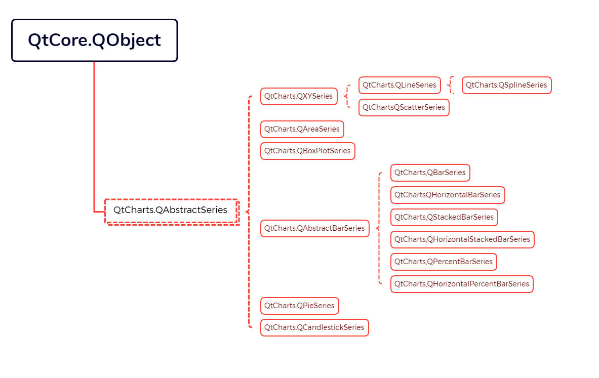

#### 数据序列抽象类QAbstractSeries

QAbstractSeries类是所有数据序列的基类它的方法和信号也会被其子类所继承

##### QAbstractSeries 的常用方法

- 要正确显示数据序列曲线,需要将数据序列与坐标轴关联。将数据序列和坐标轴加入到图表中后,有两种方法可以实现数据序列与坐标轴的关联:
  - ==此方法新版已废弃==一种方法是用QChart 的setAxisX(axis:QAbstractAxis，seriesQAbstractSeries = None)方法和 setAxisY(axis: QAbstractAxis, series:QAbstractSeries =None)方法;
  - 另一种方法是用数据序列的 addAxis(axis: PySide6.QtCharts.QAbstractAxis, alignment: PySide6.QtCore.Qt.AlignmentFlag)方法将数据序列与坐标轴关联
    - 用detachAxis(axis:QAbstractAxis)方法断开与坐标轴的关联。
- 另外用数据序列的 setName(str)方法设置数据序列在图例中的名称;
- 如果使用将把数据序列显示在透明的QOpenGLWidget 控件上用setUseOpenGL(enable=True)方法设置是否用OpenGL 加速显示。

| QAbstractSeries的方法及参数类型 | 返回值的类型        | 说明                        |
| ------------------------------- | ------------------- | --------------------------- |
| attachAxis(axis:QAbstractAxis)  | bool                | 关联坐标轴，成功则返回True  |
| attachedAxes()                  | List[QAbstractAxis] | 获取关联的坐标轴列表        |
| detachAxis(axis; QAbstractAxis) | bool                | 断开与坐标轴的关联          |
| setName(name:str)               | None                | 设置数据序列在图列中的名称  |
| name()                          | Str                 | 获取数据序列在图列中的名称  |
| setUseOpenGL(enable:bool=True)  | None                | 设置是否使用OpenGL加速显示  |
| useOpenGL()                     | bool                | 获取是否使用OpenGL加速显示  |
| setOpacity(opacity:float)       | None                | 设置不透明度；范围是0.0~1.0 |
| opacity()                       | float               | 获取不透明度                |
| setVisible(visible:bool=True)   | None                | 设置是否可见                |
| isVisible()                     | bool                | 获取数据序列是否可见        |
| hide()                          | None                | 隐藏数据序列                |
| show()                          | None                | 显示数据序列                |
| chart()                         | QChart              | 获取数据序列所在的图表      |

##### QAbstractSeries 的信号

QAbstractSeries 的信号有 

- nameChanged()(当在图例中的名称改变时发送该信号)
- opacityChanged()(当不透明度发生改变时发送该信号)
- useOpenGLChanged()和visibleChanged()。

#### XY图

XY 图由横坐标X 数据和纵坐标 Y 数据构成,包括折线图样条曲线图和散点图。XY所需的数据序列都继承自QXYSeries。

QXYSeries是QAbstractSeries 的派生类之一,主要实现以二维数据点作为数据源,坐标类型为二维坐标系的图表,包括折线图(QLineSeries)、样条曲线图(QSplineSeries)和散点图(QScatterSeries)。

QXYSeries 提供对数据源进行增替换操作的方法和信号，同时内部实现了控制数据点在坐标系上的显示形态(数据点标签的格式、颜色、是否显示等)的功能。

用QLineSeries、QSplineSeries 和 QScatterSeries 类创建数据序列的方法如下所示

```python
from PySide6.QtCharts import QLineSeries, QSplineSeries, QScatterSeries

QLineSeries(parent: Union[PySide6.QtCore.QObject, NoneType]= None) -> None
QSplineSeries(parent: Union[PySide6.QtCore.QObject, NoneType]= None) -> None
QScatterSeries(parent: Union[PySide6.QtCore.QObject, NoneType]= None) -> None
```

##### QXYSeries 数据序列

###### QXYSeries 数据序列的方法

QXYSeries 数据序列需要由其继承者来实现绘图。

QXYSeries 为 QLineSeries、QSplineSeries和 QScatterSeries 提供了一些的共同方法和信号,常用方法如表所示,主要方法介绍如下。

- 用append(point: Union[QPointF,QPoint]),append(points: Sequence[QPointF])和append(x:float,y:float)方法可以添加数据点;
  - 用insert(index:int,point:Union[QPointF,QPoint])方法可以根据索引插人数据点;
- 用remove(index:int)方法根据索引移除数据点;
  - 用remove(point:Union[QPointF,QPoint])或 remove(x:float;y: float)方法根据数据点的坐标移除数据点;
  - 用removePoints(index:int,count:int)方法根据索引和数量移除多个数据点;用clear()方法可以清除所有数据点。
- 用at(index:int)方法根据索引获取数据点 QPointF,用points()方法获取所有数据点构成的列表 List[QPointF]。
- 用setPointLabelsVisible(visible: bool=Tue)方法设置数据点的标签是否可见这里的标签是指数据点的X和Y的值;
  - 用setPointLabelsFormat(format:str)方法设置数据点标签的格式,
    - 格式中用`@xPoint` 和`@yPoint` 表示X和Y值的占位符,
      - 例如setPointLabelsFormat('(值: @xPoint, Y值: @yPoint)')
  - 用setPointLabelsClipping(enabled;bool-True)方法设置数据点的标签超过绘图区域时被裁剪。

- 根据数据序列上的数据点,可以用最小二乘法计算出一个逼近直线,该直线称为“best fit line”
  - 可以分别用以下方法设置该逼近直线是否可见直线的颜色和绘图钢笔
  - setBestFitLineVisible(visible: bool= True)
  - setBestFitLineColor(color: Union[QColor,str])
  - setBestFitLinePen(pen:Union[QPen,QColor])

| QXYSeries的方法及参数类型                                    | 说 明                                                        |
| ------------------------------------------------------------ | ------------------------------------------------------------ |
| append(point:Union[QPointF,QPoint])                          | 添加数据点                                                   |
| append(points:Sequence[QPointF])                             | 添加数据点                                                   |
| append(x: float,y: float)                                    | 添加数据点                                                   |
| insert(index: int, point: Union[QPointF, QPoint])            | 根据索引插入数据点                                           |
| at(index:int)                                                | 根据索引获取数据点QPointF                                    |
| points()                                                     | 获取数据点列表ListLQPointF]                                  |
| remove(index: int)                                           | 根据索引移除数据点                                           |
| remove(point: Union[QPointF,QPoint])                         | 移除数据点                                                   |
| remove(x:float,y:float)                                      | 移除数据点                                                   |
| removePoints(index: int,count:int)                           | 根据索引移除指定数量的数据点                                 |
| clear()                                                      | 清空所有数据点                                               |
| replace(index: int,newPoint:Union[QPointF, .QPoint])         | 很据索引替换数据点                                           |
| replace(index: int,newX:float,newY:float)                    | 根据索引替换数据点                                           |
| replace(oldPoint: Union[QPointF,QPoint], newPoint:Union[QPointF,QPoint]) | 用新数据点替换旧数据点 .                                     |
| replace(oldX: float,oldY: float, newX: float, newY:float)    | 用新坐标点替换旧坐标点                                       |
| replace(points: Sequence[QPointFJ)                           | 用多个数据点替换当前点 .                                     |
| count()                                                      | 获取数据点的数量                                             |
| setBrush(QBrush)                                             | 设置画刷                                                     |
| setColor(QColor)                                             | 设置颜色                                                     |
| setPen(QPen)                                                 | 设置钢笔                                                     |
| setPointsVisible(visible:bool=True)                          | 设置数据点是否可见                                           |
| setPointLabelsVisible(visible; bool=True)                    | 设置数据点标签是否可见                                       |
| setPointLabelsFormat(format: str)                            | 设置数据点标签的格式                                         |
| setPointLabelsClipping(enabled: bool=True)                   | 设置数据点标签超过绘图区域时被裁剪                           |
| setPointLabelsColor(QColor)                                  | 设置数据点标签的颜色                                         |
| setPointLabelsFont(QFont)                                    | 设置数据点标签的字体                                         |
| setPointSelected(index:int,selected:bool)                    | 根据索引设置某个点是否被选中                                 |
| setMarkerSize(size:float)                                    | 设置标志的尺寸，默认值是15.0                                 |
| setLightMarker(lightMarker: Union[QImage, str])              | 设置灯光标志 动西己                                          |
| selectAllPoints()                                            | 选择所有点                                                   |
| selectPoint(index:int)                                       | 根据索引选择一点                                             |
| selectPoints(indexes: Sequence[int])                         | 根据索引选择多个点                                           |
| selectedPoints()                                             | 获取选中的点的索引列表 List[int]                             |
| setSelectedColor(Union[QColor,Qt.GlobalColor, str])          | 设置选中的点的颜色                                           |
| toggleSelection(indexes:Sequence[int])                       | 将索引列表中的点切换选中状态                                 |
| sizeBy(sourceData: Sequence[float], minSize: float,maxSize:float) | 根据sourceData值，设置点的尺寸，尺寸在最小值和 最大值之间映射 |
| setBestFitLineVisible(visible: bool=True)                    | 设置通近直线是否可见                                         |
| setBestFitLineColor(color；Union[QColor,str])                | 设置通近直线的颜色                                           |
| setBestFitLinePen(pen:Union[QPen,QColor])                    | 设置逼近直线的绘图钢笔                                       |


###### QXYSeries 数据序列的信号

QXYSeries 数据序列的信号如表所示:

| QXYSeries的信号及参数类型           | 说 明                                                        |
| ----------------------------------- | ------------------------------------------------------------ |
| clicked(QPointF)                    | 单击时发送信号                                               |
| pressed(QPointF)                    | 按下鼠标按时发送信号                                         |
| released(QPointF)                   | 释放鼠标按键时发送信号                                       |
| doubleClicked(QPointF)              | 双击时发送信号                                               |
| colorChanged(QColor)                | 颜色改变时发送信号                                           |
| hovered(point: QPointF,state: bool) | 光标悬停或移开时发送信号，悬停时 state是True，移开时 state 是 False |
| penChanged(QPen)                    | 钢笔改变时发送信号                                           |
| pointAdded(index:int)               | 添加点时发送信号                                             |
| pointLabelsClippingChanged(bool)    | 数据点标签裁剪状态改变时发送信号                             |
| pointLabelsColorChanged(QColor)     | 数据点标签颜色改变时发送信号                                 |
| pointLabelsFontChanged(QFontF)      | 数据点标签字体改变时发送信号                                 |
| pointLabelsFormatChanged(QFormatF)  | 数据点标签格式改变时发送信号                                 |
| pointLabelsVisibilityChanged(bool)  | 数据点标签可见性改变时发送信号                               |
| pointRemoved(index:int)             | 移除数据点时发送信号                                         |
| pointReplaced(index:int)            | 替换数据点时发送信号                                         |
| pointsRemoved(index:int,count:int)  | 移除指定数量的数据点时发送信号                               |
| pointsReplaced()                    | 替换多个数据点时发送信号                                     |
| lightMarkerChanged(QImage)          | 灯光标志发生改变时发送信号                                   |
| markerSizeChanged(size:float)       | 标志的尺寸发生改变时发送信号                                 |
| selectedColorChanged(QColor)        | 选中的点的颜色发生改变时发送信号                             |
| bestFitLineVisibilityChanged(bool)  | 逼近线的可见性发生改变时发送信号                             |
| bestFitLineColorChanged(QColor)     | 逼近线的颜色发生改变时发送信号                               |

##### 散点图QScatterSeries 数据序列

###### 散点图QScatterSeries 数据序列的方法

QLineSeries和 QSplineSeries 并没有自已特有的方法和信号，只有从QXYSeries 继承的方法和信号。

下面对QScatterSeries 的方法和信号进行介绍。

QScatterSeries 的常用方法中,

- 用setMarkerShape(QScatterSeries.MarkerShape)方法设置散点标志的形状，其参数可取以下值,对应值分别是0~5:
  - QScatterSeries.MarkerShapeCircle(默认值)
  - QScatterSeries.MarkerShapeRectangle
  - QScatterSeries.MarkerShapeRotatedRectangle
  - QScatterSeries.MarkerShapeTriangle
  - QScatterSeries.MarkerShapeStar 
  - QScatterSeries.MarkerShapePentagon
- 用setMarkerSize(float)方法设置散点标志的尺寸;
- 用setBorderColor(QColor)方法设置边界颜色。


###### 散点图QScatterSeries 数据序列的信号

QLineSeries和 QSplineSeries 并没有自已特有的方法和信号，只有从QXYSeries 继承的方法和信号。

QScatterSeries 的信号有 

- borderColorChanged(QColor)
- colorChanged(QColor)
- markerSizeChanged(float)
- markerShapeChanged(QScatterSeries.MarkerShape shape)

##### QLineSeries、QSplineSeries 和 QScatterSeries 的应用实例

下面的程序用“文件”菜单打开 test_data,txt 文件，显示读入的数据,并用折线图样条曲线图和散点图绘制数据曲线,其中折线图和样条曲线图使用相同的数据。程序运行结果如图8-2所示。

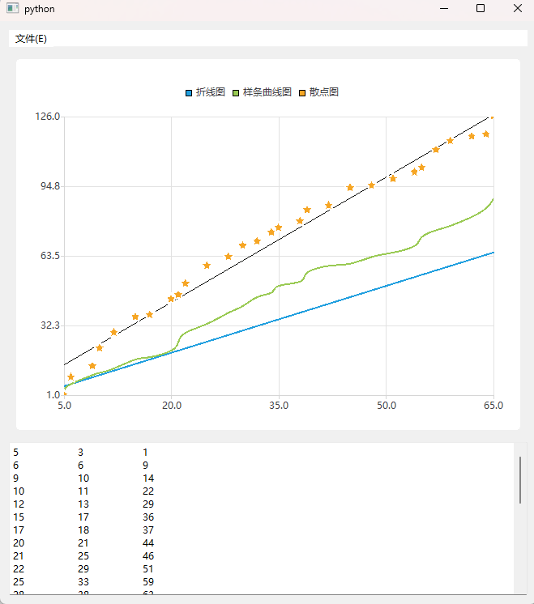

```python
# -*- coding: UTF-8 -*-
# File date: Hi_2023/3/11 21:02
# File_name: 01-QLineSeries、QSplineSeries 和 QScatterSeries 的应用实例.py


from PySide6.QtWidgets import QApplication, QWidget, QVBoxLayout, QMenuBar, QFileDialog, QPlainTextEdit
import sys
from PySide6.QtCore import QFile
from PySide6.QtCharts import QChartView, QChart, QLineSeries, QSplineSeries, QScatterSeries


class MyWindow(QWidget):
    def __init__(self, parent=None):
        super().__init__(parent)

        self.setupUi()

    def setupUi(self):
        menuBar = QMenuBar()
        fileMenu = menuBar.addMenu("文件(E)")
        fileMenu.addAction("打开(&0)").triggered.connect(self.action_open_triggered)
        fileMenu.addSeparator()
        fileMenu.addAction("退出(E)").triggered.connect(self.close)
        self.plainText = QPlainTextEdit()
        chartView = QChartView()

        v = QVBoxLayout(self)
        v.addWidget(menuBar)
        v.addWidget(chartView)
        v.addWidget(self.plainText)
        self.chart = QChart()
        chartView.setChart(self.chart)

    def action_open_triggered(self):
        fileName, fil = QFileDialog.getOpenFileName(self, "打开测试文件", ".", "文本文件(*.txt)")
        file = QFile(fileName)
        data = list()
        if file.exists():
            file.open(QFile.OpenModeFlag.ReadOnly | QFile.OpenModeFlag.Text)

            self.plainText.clear()
            try:
                while not file.atEnd():
                    string = file.readLine()  # 按行读取
                    string = str(string, encoding="utf-8").strip()  # 转成字符中
                    self.plainText.appendPlainText(string)
                    temp = list()
                    for i in string.split():
                        temp.append(float(i))
                    data.append(temp)  # 转成浮点数, 并添加数据
                self.chart.removeAllSeries()  # 移除现有曲线
                self.plot(data)  # 调用函数,绘制曲线

            except:
                self.plainText.appendPlainText("打开文件出错")

            finally:
                file.close()

    def plot(self, data):  # 绘制图表的函数
        lineSeries = QLineSeries()  # 创建折线数据序列
        splineSeries = QSplineSeries()  # 创建样条数据序列
        scatterSeries = QScatterSeries()  # 创建散点数据序列
        lineSeries.setName("折线图")
        splineSeries.setName("样条曲线图")
        scatterSeries.setName("散点图")

        scatterSeries.setMarkerShape(QScatterSeries.MarkerShape.MarkerShapeStar)
        scatterSeries.setBestFitLineVisible(True)  # 逼近线
        for i in data:
            lineSeries.append(i[0], i[0])  # 添加数据
            splineSeries.append(i[0], i[1])  # 添加数据
            scatterSeries.append(i[0], i[2])  # 添加数据

        self.chart.addSeries(lineSeries)  # 图表中添加数据序列
        self.chart.addSeries(splineSeries)  # 图表中添加数据序列
        self.chart.addSeries(scatterSeries)  # 图表中添加数据序列
        self.chart.createDefaultAxes()  # 创建坐标轴


if __name__ == '__main__':
    app = QApplication(sys.argv)
    win = MyWindow()

    win.show()
    sys.exit(app.exec())

```


#### 面积图

面积图QAreaSeries 一般由上下两个折线数据序列 QLineSeries 构成在上下两个折线之间填充颜色;

也可以只有上折线数据序列,把轴当成下折线数据序列。

面积图的数据序列是QAreaSeries,用QAreaSeries 类创建面积数据序列的方法如下所示,其中 parent是继承自 QObject 的实例对象,upperSeries 和 lowerSeries 分别是上下两个折线序列。

```python
from PySide6.QtCharts import QAreaSeries

QAreaSeries(parent: Union[PySide6.QtCore.QObject, NoneType]= None) -> None
QAreaSeries(upperSeries: PySide6.QtCharts.QLineSeries, lowerSeries: Union[PySide6.QtCharts.QLineSeries, NoneType]= None) -> None 
```

##### 面积图QAreaSeries 的方法

面积图 QAreaSeries 的常用方法如表所示

主要方法是用setUpperSeriesQLineSeries)方法和 setLowerSeries(QLineSeries)方法分别设置面积数据序列的上下两个数据序列

| QAreaSeries的方法及参数类型          | 说 明                                |
| ------------------------------------ | ------------------------------------ |
| setUpperSeries(QLineSeries)          | 设置上数据序列                       |
| upperSeries()                        | 获取上数据序列                       |
| setLowerSeries(QLineSeries)          | 设置下数据序列                       |
| lowerSeries()                        | 获取下数据序列                       |
| setBorderColor(QColor)               | 设置边框颜色                         |
| setBrush(QBrush)                     | 设查画刷                             |
| setColor(QColor)                     | 设置填充颜色                         |
| setPen(QPen)                         | 设置钢笔                             |
| setPointLabelsClipping(enabled=True) | 设置数据点的标签超过绘图区域时被裁剪 |
| setPointLabelsColor(QColor)          | 设置标签颜色                         |
| setPointLLabelsFont(QFont)           | 设置标签字体                         |
| setPointLabelsFormat(str)            | 设置标签格式                         |
| setPointLabelsVisible(visible=True)  | 设置标签是否可见                     |
| pointLabelsVisible()                 | 获取标签是否可见                     |
| setPointsVisible(visible=True)       | 设置数据点是否可见                   |

##### 面积图QAreaSeries 的信号

面积图QAreaSeries 的信号如表所示

| QAreaSeries的信号及参数类型        | 说 明                                                        |
| ---------------------------------- | ------------------------------------------------------------ |
| clicked(QPointF)                   | 单击时发送信号                                               |
| pressed(QPointF)                   | 按下鼠标按键时发送信号                                       |
| released(QPointF)                  | 释放鼠标按键时发送信号                                       |
| doubleClickecl(QPointF)            | 双击时发送信号                                               |
| hovered(point:QPointF,state:bool)  | 光标悬停或移开时发送信号，悬停时 state 是True，移开时 state 是False |
| colorChanged(QColor)               | 颜色发生改变时发送信号                                       |
| borderColorChanged(QColor)         | 当边框颜色发生变化时发送信号                                 |
| pointLabelsClippingChanged(bool)   | 数据点标签裁剪状态发生改变时发送信号                         |
| pointLLabelsColorChanged(QColor)   | 微据点标签颜色发生改变时发送信号                             |
| pointL.abelsFontChanged(QFont)     | 数据点标签字体发生改变时发送信号                             |
| pointLabelsFormatChanged(str)      | 数据点标签格式发生改变时发送信号                             |
| pointLabelsVisibilityChanged(bool) | 数据点标签可见性发生改变时发送信号                           |


#### 饼图

饼图是把一个圆分成多个扇形,每个扇形是一个切片,每个切片赋予一个值,每个切片的大小与其值在所有切片总值中的百分比成正比；如果在圆中心添加圆孔,将会成为圆环图。

饼图的数据序列是QPieSeries,每个切片需要用QPieSlice 来定义。

用QPieSeries 和QPieSlice分别定义饼图数据序列和饼图切片的方法如下所示,其中 label是切片的标签文字,value 是切片的值,切片的大小由切片值之间的相对值决定。

```python
from PySide6.QtCharts import QPieSeries, QPieSlice

QPieSeries(parent: Union[PySide6.QtCore.QObject, NoneType]= None) -> None 
QPieSlice(label: str, value: float, parent: Union[PySide6.QtCore.QObject, NoneType]= None) -> None
QPieSlice(parent: Union[PySide6.QtCore.QObject, NoneType]= None) -> None
```

##### 饼图数据序列 QPieSeries 的方法

QPieSeries 的常用方法如表所示,主要方法介绍如下

- 用append(QPieSlice)方法添加切片;
  - 用append(Sequence[QPieSlice])添加多个切片;
  - 用append(label:str,value: float)方法添加一个全新的切片，并返回该切片
- 用insert(index:int,slice:QPieSlice)方法根据索引插入切片;
- 用count()方法获取切片的数量;
  - 用slices()方法获取切片列表;
- 用remove(QPieSlice)方法移除并删除切片;
  - 用clear()方法删除所有切片。
- 用setHoleSize(holeSize:float)方法设置饼图中心的圆,参数的取值范围是0~1,是相对于饼图所在的矩形尺寸,默认为0。
  - 参数如果不是0,则饼图成为圆环图
- 用setPieSize(relativeSize: float)方法设置饼图相对于容纳饼图矩形的尺寸,参数取值为0~1;
  - 用setHorizontalPosition(relativePosition: float)方法设置饼图在矩形内的水平相对位置,参数取值为0~1,默认值是0.5,表示在水平中间位置,0表示左侧,1表示右侧;
  - 同理用setVerticalPosition(relativePosition:float)方法设置饼图在矩形内的坚直相对位置,0 表示顶部,1表示底部

- 用setLabelsVisible(visible: bool= True)方法设置切片标签是否可见;
- 用setLabelsPosition(QPieSlice,LabelPosition)方法设置切片标签的位置,枚举参数QPieSlice. LabelPosition 可取:
  - QPieSlice.LabelOutside
  - QPieSlice.LabelInsideHorizontal
  - QPieSlice.LabelInsideTangential 
  - QPieSlice.LabelInsideNormal。
- 默认情况下,饼图是0°一360°全部填充,0在竖直方向,顺时针旋转为正,可以设置饼图只在指定角度范围内绘制。
  - 用setPieStartAngle(startAngle:float)方法设置饼图的起始角，
  - 用setPieEndAngle(endAngle:float)方法设置终止角

| QPieSeries的方法及参数类型                    | 说明                                |
| --------------------------------------------- | ----------------------------------- |
| append(QPieSlice)                             | 添加切片，成功则返回True            |
| append(Sequence[QPieSlice])                   | 添加多个切片，成功则返回True        |
| append(label: str,value:float)                | 添加切片,并返回切片 QPieSlice       |
| insert(index: int.slice: QPieSlice)           | 插人切片，成功则返回True            |
| slices()                                      | 获取切片列表List[QPieSlice]         |
| remove(QPieSlice)                             | 移除并删除切片                      |
| take(QPieSlice)                               | 移除但不删除切片                    |
| clear()                                       | 删除所有切片                        |
| count()                                       | 获取切片的数量                      |
| sum()                                         | 计算所有切片值的和                  |
| isEmpty()                                     | 获取是否含有切片                    |
| setPieSize(relativeSize: float)               | 设置饼图的相对尺寸，参数取值为0~1   |
| setHoleSize(holeSize:float)                   | 设置饼图内孔的相对尺寸，参数值为0~1 |
| setHorizontalPosition(relativePosition:float) | 设置饼图的水平相对位置，参数值为0~1 |
| setVerticalPosition(relativePosition: float)  | 设置饼图的竖直相对位置，参数值为0~1 |
| setLabelsVisible(visible:bool=True)           | 设置切片的标签是否可见              |
| setLabelsPosition(QPieSlice. LabelPosition)   | 设置切片标签的位置                  |
| setPieStartAngle(startAngle:float)            | 设置饼图的起始角                    |
| setPieEndAngle(endAngle: float)               | 设置饼图的终止角                    |


##### 饼图数据序列QPieSeries 的信号

饼图数据序列QPieSeries 的信号如表所示

| QPieSeries的信号及参数类型          | 说明                                                         |
| ----------------------------------- | ------------------------------------------------------------ |
| added(slices: List[QPieSlice])      | 添加切片时发送信号，参数是添加的切片                         |
| clicked(slice: QPieSlice)           | 单击切片时发送信号                                           |
| countChanged()                      | 切片数量发生改变时发送信号                                   |
| doubleClicked(slice:QPieSlice)      | 双击切片时发送信号                                           |
| hovered(slice:QPieSlice,state:bool) | 光标在切片上悬停时发送信号,光标在切片上移动时 state值 是True，光标离开切片时 state 值是False |
| pressed(slice:QPieSlice)            | 在切片上按下鼠标按键时发送信号                               |
| released(slice; QPieSlice)          | 在切片上释放鼠标按键时发送信号                               |
| removed(slices: List[QPieSlice])    | 移除切片时发送信号，参数是移除的切片列表                     |
| sumChanged()                        | 所有切片的值的和发生改变时发送信号                           |


##### 饼图切片 QPicSlice的方法

饼图由切片 QPieSlice构成,通常需要为切片设标签和值。

切片 QPieSlice 的常用方法如表所示

- 主要方法是用setLabel(label:str)方法设置标签文宇;
- 用setValue(value; float)方法设置切片的值;
- 用setExploded(exploded;bool=True)方法设置切片是否是爆炸切片;
- 用setExplodeDistanceFactor(factor: float)方法设置爆炸距离;
- 用setLabelPosition(position: QPieSlice.LabelPosition)方法设置标的位置，参数可取以下值,对应值分别是0~3。
  - QPieSlice.LabelOutside
  - QPieSlice.LabelInsideHorizontal
  - QPieSlice.LabelIngideTangential 
  - QPieSlice.LabelInsideNormal

| QPieSlice的方法及参数类型                                    | 悦明                     |
| ------------------------------------------------------------ | ------------------------ |
| setLabel(lnbel; str)                                         | 设置切片的标签文字       |
| label()                                                      | 获取切片的标签文字       |
| serValue(value:float)                                        | 设置切片的值             |
| value()                                                      | 获取切片的值             |
| percentage()                                                 | 获取切片的百分比值       |
| setPen(pen:Union[QPen,Qt.PenStyle,QColor])                   | 设置钢笔                 |
| setBorderColor(color:Union[QColor,Qt.GlobulColor,str])       | 设置边框的颜色           |
| setBorderWidth(width:int)                                    | 设置边框的宽度           |
| setBrush(brush:Union[QBrush, Qt.BrushStyle, Qt.GlobalColor, QColor,QGradient,QImage,QPixmap]) | 设置画刷                 |
| setColor(color:Union[QColor,Qt.GlobalColor,str])             | 设填充颜色               |
| setExploded(exploded:bool=True)                              | 设置切片是否处于爆炸状态 |
| isExploded()                                                 | 获取切片是否处于爆炸状态 |
| setExplodeDistanceFactor(factor:float)                       | 设置爆炸距离             |
| explodeDistanceFactor()                                      | 获取爆炸距离             |
| setLabelVisible(visible:bool=True)                           | 设置切片标签是否可见     |
| isLabelVisible()                                             | 获取切片标签是否可见     |
| setLabelArmLengthFactor(factor: float)                       | 设置切片标签的长度       |
| setLabelBrush(brush: Union[QBrush, Qt.BrushStyle, Qt.GlobalColor,QColor,QGradient,QImage,QPixmap]) | 设置切片标签画刷         |
| setLabelColor(color:Union[QColor,Qt.GlobalColor,str])        | 设置切片标签的颜色       |
| setLabelFont(font: Union[QFont,str,Sequence[str]])           | 设置切片标签的字体       |
| setLabelPosition(position: QPieSlice. LabelPosition)         | 设置切片标签的位置       |
| labelPosition()                                              | 获取切片标签的位置       |
| series()                                                     | 获取切片所在的数据序列   |
| startAngle()                                                 | 获取切片的起始角         |
| angleSpan()                                                  | 获取切片的跨度角         |


##### 饼图切片 QPieSlice 的信号

饼图切片 QPieSlice 的信号如表所示可以通过信号的名称获取其发送的时机

| QPieSlice的信号      | QPieSlice的信号     | QPieSlice的信号       | QPieSlice的信号 |
| -------------------- | ------------------- | --------------------- | --------------- |
| angleSpanChanged()   | colorChanged()      | labelColorChanged()   | pressed()       |
| borderColorChanged() | doubleClicked()     | labelFontChanged()    | released()      |
| borderWidthChanged() | hovered(state:bool) | labelVisibleChanged() | penChanged()    |
| brushChanged()       | labelBrushChanged() | startAngleChangedl()  | clicked()       |
| valueChanged()       | labelChanged()      | percentageChanged()   |                 |

##### 饼图的应用实例

下面的程序根据季度销售额绘制圆环图，程序运行结果如图所示

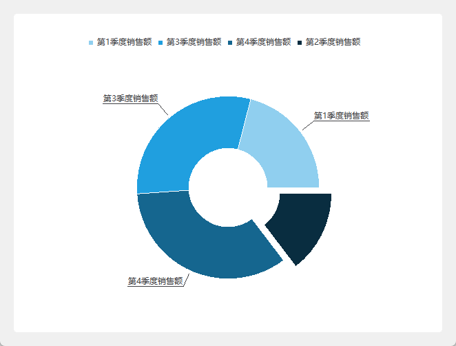

```python
# -*- coding: UTF-8 -*-
# File date: Hi_2023/3/11 23:31
# File_name: 02- 饼图的应用实例.py


import sys
from PySide6.QtWidgets import QApplication, QWidget, QVBoxLayout
from PySide6.QtCharts import QChartView, QChart, QPieSeries, QPieSlice


class MyWindow(QWidget):
    def __init__(self, parent=None):
        super().__init__(parent)

        chartView = QChartView()
        V = QVBoxLayout(self)
        V.addWidget(chartView)

        self.chart = QChart()
        chartView.setChart(self.chart)
        pieSeries = QPieSeries()
        pieSeries.setLabelsPosition(QPieSlice.LabelPosition.LabelOutside)
        pieSeries.setPieStartAngle(90)
        pieSeries.setPieEndAngle(- 270)

        first = QPieSlice("第1季度销售额", 32.3)  # 创建切片

        second = QPieSlice("第2季度销售额", 22.5)  # 创建切片
        second.setExploded(exploded=True)  # 爆炸切片

        pieSeries.append(first)  # 添加切片

        pieSeries.append("第3季度销售额", 46.3)  # 添加切片
        pieSeries.append("第4季度销售额", 52.7)  # 添加切片

        pieSeries.setLabelsVisible(visible=True)  # 标签可见

        pieSeries.setHoleSize(0.3)  # 孔的尺寸

        self.chart.addSeries(pieSeries)  # 图表中添加数据序列

        pieSeries.append(second)


if __name__ == '__main__':
    app = QApplication(sys.argv)
    win = MyWindow()

    win.show()
    sys.exit(app.exec())

```


#### 条形图

条形图以竖直条或水平条显示数据,它由数据项 QBarSet 构成,每个数据项包含多个数据

条形图的数据序列有多种类型，竖直数据序列有 QBarSeries、QStackedBarSeries、QPercentBarSeries

水平数据序列有 QHorizontalBarSeries、QHorizontalStackedBarSeries和QHorizontalPercentBarSeries

它们并没有特有的方法和信号它们的方法和信号继承自抽象类 QAbstractBarSeries。

用QBarSeries、QStackedBarSeries、 QPercentBarSeries、 QHorizontalBarSeries、QHorizontalStackedBarSeries、QHorizontalPercentBarSeries 、QBarSet 创建实例对象的方法如下所示，其中 label 是数据项在图例中的名称。

```python
from PySide6.QtCharts import QBarSeries, QStackedBarSeries, QPercentBarSeries
from PySide6.QtCharts import QHorizontalBarSeries, QHorizontalStackedBarSeries, QHorizontalPercentBarSeries, QBarSet

QBarSeries(parent: Union[PySide6.QtCore.QObject, NoneType]= None) -> None
QStackedBarSeries(parent: Union[PySide6.QtCore.QObject, NoneType]= None) -> None
QPercentBarSeries(parent: Union[PySide6.QtCore.QObject, NoneType]= None) -> None
QHorizontalBarSeries(parent: Union[PySide6.QtCore.QObject, NoneType]= None) -> None
QHorizontalStackedBarSeries(parent: Union[PySide6.QtCore.QObject, NoneType]= None) -> None
QHorizontalPercentBarSeries(parent: Union[PySide6.QtCore.QObject, NoneType]= None) -> None
QBarSet(label: str, parent: Union[PySide6.QtCore.QObject, NoneType]= None) -> None
```

##### 抽象类QAbstractBarSeries

###### 抽象类QAbstractBarSeries 的方法

QAbstractBarSeries 的常用方法如表所示，主要方法介绍如下

- 用append(set:QBarSet)方法添加数据项;
  - 用append(sets: Sequence[QBarSet])方法添加多个数据项;
  - 用insert(index;int,set;QBarSet)方法根据索引插入数据项;
- 用barSets()方法获取数据项列表;
  - 用count()方法获取数据项的个数;QChartView
- 用remove(QBarSet)方法州除指定的数据项;
  - 用clear()方法删除所有的数据项。
- 用setLabelsVisible(visible; bool= True)方法设置条形的标签是否可见;
- 用setLabelsFormat(format:str)方法设置标签的个数格式符中用”@value”表示条形的值;
- 用setLabelsPosition(QAbstractBarSeries。LabelsPosition)方法设置标签的位置，参数可以取以下值,值分别对应0~3。
  - QAbstractBarSeries.LabelsCenter
  - QAbstractBarSeries.LabelsInsideEnd
  - QAbstractBarSeries.LabelsInsideBase
  - QAbstractBarSeries.LabelsOutsideEnd

| QAbstractBarSeries的方法及参数类型                    | 说明                               |
| ----------------------------------------------------- | ---------------------------------- |
| append(set: QBarSet)                                  | 添加数据项，成功则返回True         |
| append(sets:Sequence[QBarSet])                        | 添加多个数据项，成功则返回True     |
| insert(index: int,set: QBarSet)                       | 根据索引插入数据项，成功则返回True |
| barSets()                                             | 获取数据项列表List[QBarSet]        |
| remove(set: QBarSet)                                  | 删除数据项，成功则返回 True        |
| take(set: QBarSet)                                    | 移除数据项，成功则返回True         |
| clear()                                               | 除所有数据项                       |
| count()                                               | 获取数据项的个数                   |
| setBarWidtb(width；flont)                             | 设置条形的宽度                     |
| barWidth()                                            | 获取条形的宽度                     |
| setLabelsAngle(angle； flont)                         | 设置标签的旋转角度                 |
| setLabelsVisible(visible；bool=True)                  | 设置标签是否可见                   |
| isLabelsVisible()                                     | 获取标签是否可见                   |
| setLabelsPosition(QAbstractBarSeries. LabelsPosition) | 设置标签的位置                     |
| setLabclsFormat(format;str)                           | 设置标签的格式                     |
| setLabelsPrecision(precision:int)                     | 设置标签的最大小数位数             |


###### 抽象类QAbstractBarSeries 的信号

抽象类QAbstractBarSeries 的信号如表所示

| QAbstractBarSeries的信号                                  | 说明                           |
| --------------------------------------------------------- | ------------------------------ |
| barsetsAdded(barsets: List[QBarSet])                      | 添加数据项时发送信号           |
| barsetsRemoved(barsets: List[QBarSet])                    | 移除数据项时发送信号           |
| clicked(index:int,barset:QBarSet)                         | 单击数据项时发送信号           |
| doubleClicked(index:int,barset:QBarSet)                   | 双击数据项时发送信号           |
| pressed(index:int,barset:QBarSet)                         | 在标签上按下鼠标按键时发送信号 |
| released(index:int,barset:QBarSet)                        | 在标签上释放鼠标按键时发送信号 |
| hovered(status: bool,index: index,barset:QBarSet)         | 光标在数据项上移动时发送信号   |
| labelsAngleChanged(angle: float)                          | 标签角度发生改变时发送信号     |
| labelsFormatChanged(fromat: str)                          | 标签格式发生改变时发送信号     |
| labelsPositionChanged(QAbstractBarSeries. LabelsPosition) | 标签位置发生改变时发送信号     |
| labelsPrecisionChanged(precision:int)                     | 标签精度发生改变时发送信号     |
| labelsVisibleChanged()                                    | 标签的可见性发生改变时发送信号 |
| countChanged()                                            | 数据项的个数发生改变时发送信号 |

##### 数据项QBarSet

###### 数据项QBarSet的方法

数据项QBarSet 中定义不同条目的值。

数据项的常用方法如表所示主要方法是:

- 用append(value:float)方法或 append(values:Sequence[float])方法添加条目的值;
- 用insert(index:int,value:float)方法插入值;
- 用at(index:int)方法根据索引获取值

| QBarSet的方法及参数类型                                      | 说 明                              |
| ------------------------------------------------------------ | ---------------------------------- |
| append(value: float)                                         | 添加条目的值                       |
| append(values: Sequence[float])                              | 添加多个条目的值                   |
| insert(index:int,value:float)                                | 根据索引插人条目的值               |
| at(index: int)                                               | 根据索引获取条目的值               |
| count()                                                      | 获取条目值的个数                   |
| sum()                                                        | 获取所有条目的值的和               |
| remove(index: int,count:int=1)                               | 根据索引，移除指定数量的值         |
| replace(index:int,value: float)                              | 根据索引替换值                     |
| setBorderColor(color: Union[QColor,Qt.GlobalColor,str])      | 设置边框颜色                       |
| setPen(pen: Union[QPen,Qt.PenStyle,QColor])                  | 设置钢笔                           |
| setBrush(brush:Union[QBrush,Qt.BrushStyle,QColor,Qt.GlobalColor,QGradient,QImage,QPixmap]) | 设置画刷                           |
| setColor(color;Union[QColor,Qt.GlobalColor,str])             | 设置颜色                           |
| setLabel(label: str)                                         | 设置数据项在图例中的名称           |
| label()                                                      | 获取数据项在图例中的名称           |
| setLabelBrush(brush:Union[QBrush, Qt.BrushStyle,Qt.GlobalColor,QColor,QGradient,QImage,QPixmap]) | 设置标签画刷                       |
| setLabelColor(color:Union[QColor,Qt.GlobalColor.str])        | 设置标签颜色                       |
| setLabelFont(font: Union[QFont,str,Sequence[str]])           | 设置标签字体                       |
| setBarSelected(index: int,selected: bool)                    | 根据索引选中数据项                 |
| setSelectedColor(color:Union[QColor.Qt.GlobalColor,str])     | 设置选中的数据项的颜色             |
| selectedColor()                                              | 获取选中的数据项的颜色             |
| selectAllBars()                                              | 选中所有的数据项                   |
| selectBar(index:int)                                         | 根据索引选中指定的数据项           |
| selectBars(indexes: Sequence[int])                           | 根据索引选中多个数据项             |
| selectedBars()                                               | 获取选中的数据项的索引列表         |
| deselectBars(indexes:Sequence[int])                          | 根据索引取消选择                   |
| isBarSelected(index:int)                                     | 根据索引获取指定的数据项是否被选中 |
| toggleSelection(indexes: Sequence[int])                      | 根据索引切换选中状态               |
| deselectBar(index:int)                                       | 根据索引取消选中状态               |
| deselectAIlBars()                                            | 取消所有的选中状态                 |

###### 数据项QBarSet的信号

数据项QBarSet 的信号如表所示

| QBarSet 的信号                      | 说 明                              |
| ----------------------------------- | ---------------------------------- |
| valuesAdded(index:int,count:int)    | 添加值发送信号                     |
| valuesRemoved(index: int,count:int) | 移除值时发送信号                   |
| valueChanged(index:int)             | 值发生改变时发送信号               |
| borderColorChanged(color:QColor)    | 边框颜色发生改变时发送信号         |
| brushChanged()                      | 画刷发生改变时发送信号             |
| clicked(index:int)                  | 单击鼠标时发送信号                 |
| colorChanged(color:QColor)          | 颜色发生改变时发送信号             |
| doubleClicked(index:int)            | 双击鼠标时发送信号                 |
| hovered(status: bool,index: int)    | 光标在数据项上移动或移出时发送信号 |
| labelBrushChanged()                 | 标签画刷发生改变时发送信号         |
| labelChanged()                      | 标签发生改变时发送信号             |
| labelColorChanged(color: QColor)    | 标签颜色发生改变时发送信号         |
| labelFontChanged()                  | 标签字体发生改变时发送信号         |
| penChanged()                        | 钢笔发生改变时发送信号             |
| pressed(index: int)                 | 按下鼠标按键时发送信号             |
| released(index:int)                 | 释放鼠标按键时发送信号             |

##### 条形图的应用实例

下面的程序用条形图显示某公司 3 个团队的季度销售额，程序运行结果如图所示

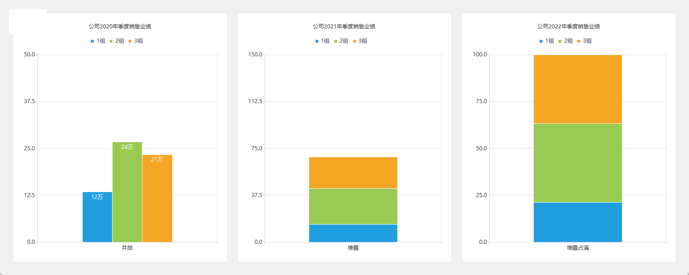

```python
# -*- coding: UTF-8 -*-
# File date: Hi_2023/3/11 23:56
# File_name: 03-条形图的应用实例.py
from PySide6.QtCore import Qt
from PySide6.QtWidgets import QApplication, QWidget, QVBoxLayout, QGraphicsLinearLayout
from PySide6 import QtCharts
import sys


class MyWindow(QWidget):
    def __init__(self, parent=None):
        super().__init__(parent)

        self.resize(1500, 600)
        V = QVBoxLayout(self)

        chartView = QtCharts.QChartView(self)  # 创建图表视图控件
        V.addWidget(chartView)
        chart = QtCharts.QChart()
        chartView.setChart(chart)
        linearGraphicsLayout = QGraphicsLinearLayout(chart)  # 创建显示图表的空间

        # 创建图表并添加到组件显示
        linearGraphicsLayout.addItem(chart1 := QtCharts.QChart())
        linearGraphicsLayout.addItem(chart2 := QtCharts.QChart())
        linearGraphicsLayout.addItem(chart3 := QtCharts.QChart())

        # 设置图表标题
        chart1.setTitle("公司2020年季度销售业绩")
        chart2.setTitle("公司2021年季度销售业绩")
        chart3.setTitle("公司2022年季度销售业绩")

        # 创建数据项
        set1 = QtCharts.QBarSet("1组")
        set2 = QtCharts.QBarSet("2组")
        set3 = QtCharts.QBarSet("3组")
        # 添加数据
        set1.append([12, 34, 23, 45])
        set2.append([24, 33, 42, 41])
        set3.append([21, 41, 23, 40])

        # 创建数据序列
        self.barSeries = QtCharts.QBarSeries()  #(并排)
        self.stackedBarSeries = QtCharts.QStackedBarSeries()  # 堆叠)
        self.percentBarSeries = QtCharts.QPercentBarSeries()  #(堆叠百分比)
        # 数据序列添加数据项
        self.barSeries.append([set1, set2, set3])
        self.stackedBarSeries.append([set1, set2, set3])
        self.percentBarSeries.append([set1, set2, set3])

        # 图表中添加数据序列
        chart1.addSeries(self.barSeries)
        chart2.addSeries(self.stackedBarSeries)
        chart3.addSeries(self.percentBarSeries)

        # 创建X坐标轴,并
        self.barCategoryAxis1 = QtCharts.QBarCategoryAxis()
        self.barCategoryAxis2 = QtCharts.QBarCategoryAxis()
        self.barCategoryAxis3 = QtCharts.QBarCategoryAxis()
        self.barCategoryAxis1.append(["并排"])
        self.barCategoryAxis2.append(["堆叠"])
        self.barCategoryAxis3.append(["堆叠占满"])

        # 图表设置Y轴
        # chart1.setAxisX(self.barCategoryAxis1, self.barSeries)  # 图表设置X轴
        # chart2.setAxisX(self.barCategoryAxis1, self.stackedBarSeries)  # 图表设置X轴
        # chart3.setAxisX(self.barCategoryAxis2, self.percentBarSeries)  # 图表设置X轴
        chart1.addAxis(self.barCategoryAxis1, Qt.AlignmentFlag.AlignBottom)
        chart2.addAxis(self.barCategoryAxis2, Qt.AlignmentFlag.AlignBottom)
        chart3.addAxis(self.barCategoryAxis3, Qt.AlignmentFlag.AlignBottom)
        self.barSeries.attachAxis(self.barCategoryAxis1)
        self.stackedBarSeries.attachAxis(self.barCategoryAxis2)
        self.percentBarSeries.attachAxis(self.barCategoryAxis3)

        self.barSeries.attachAxis(self.barCategoryAxis1)
        self.stackedBarSeries.attachAxis(self.barCategoryAxis2)
        self.percentBarSeries.attachAxis(self.barCategoryAxis3)

        self.valueAxis1 = QtCharts.QValueAxis()  # 创建坐标轴
        self.valueAxis1.setRange(0, 50)  # 设置坐标轴的数值范围
        self.valueAxis2 = QtCharts.QValueAxis()  # 创建坐标轴
        self.valueAxis2.setRange(0, 150)  # 设置坐标轴的数值范围
        self.valueAxis3 = QtCharts.QValueAxis()  # 创建坐标轴
        self.valueAxis3.setRange(0, 100)  # 设置坐标轴的数值范围

        # 图表设置Y轴
        # chart1.setAxisY(self.valueAxis1, self.barSeries)  # 图表设置Y轴
        # chart2.setAxisY(self.valueAxis2, self.stackedBarSeries)  # 图表设置Y轴
        # chart3.setAxisY(self.valueAxis3, self.percentBarSeries)  # 图表设置Y轴
        chart1.addAxis(self.valueAxis1, Qt.AlignmentFlag.AlignLeft)
        chart2.addAxis(self.valueAxis2, Qt.AlignmentFlag.AlignLeft)
        chart3.addAxis(self.valueAxis3, Qt.AlignmentFlag.AlignLeft)

        # 设置数据标签可见
        self.barSeries.setLabelsVisible(True)
        # 设置标签格式
        self.barSeries.setLabelsFormat("@value万")
        # 设置标签位置
        self.barSeries.setLabelsPosition(self.barSeries.LabelsPosition.LabelsInsideEnd)


if __name__ == '__main__':
    app = QApplication(sys.argv)
    win = MyWindow()

    win.show()
    sys.exit(app.exec())

```


#### 蜡烛图

蜡烛图类似于股票k线图,能反映一段时间内的初始值、期末值和这段时间内的最大值和最小值。

蜡烛图的数据序列是 QCandlestickSeries,蜡烛序列中的数据项用QCandlestickSet定义。

用QCandlestickSeries 和 QCandlestickSet 创建实例对象的方法如下所示,其中:

- open和close分别是初始值和期末值,
- high 和low 是这段时间内的最大值和最小值
- timestamp 是时间戳

```python
from PySide6.QtCharts import QCandlestickSeries, QCandlestickSet

QCandlestickSeries(parent: Union[PySide6.QtCore.QObject, NoneType]= None) -> None
QCandlestickSet(open: float, high: float, low: float, close: float, timestamp: float = 0.0, parent: Union[PySide6.QtCore.QObject, NoneType]= None) -> None
QCandlestickSet(timestamp: float = 0.0, parent: Union[PySide6.QtCore.QObject, NoneType]= None) -> None
```

##### 蜡烛图数据序列QCandlestickSeries 的方法

蜡烛图数据序列QCandlestickSeries 的方法如表所示,主要方法介绍如下

- 用append(set;QCandlestickSet)和 append(sets; Sequence[QCandlestickSet])方法可以添加蜡烛数据;
- 用insert(index:int,set:QCandlestickSet)方法根据索引插人蜡烛数据;
- 用remove(set; QCandlestickSet)方法和 remove(sets; Sequence[QCandlestickSet])方法可以删除蜡烛数据;
- 用clear()方法除所有蜡烛数据:用count()方法获取蜡烛数据的个数;
- 用set()方法获取蜡烛数据列表

- 用setIncreasingColor(increasingColor: QColor)方法和 setDecreasingColor(decreasingColor:QColor)方法分别设置上涨和下跌时的颜色。
- 用setCapsVisible(capsVisible:bool=False)方法设置最大值和最小值的帽线是否可见;
- 用setCapsWidth(capsWidth:float)方法设置帽线相对于蜡烛的宽度，参数取值范围是 0~1。

| QCandlestickSeries的方法及参数类型                           | 返回值的类型          | 说明                                          |
| ------------------------------------------------------------ | --------------------- | --------------------------------------------- |
| append(set:QCandlestickSet)                                  | bool                  | 添加蜡烛数据                                  |
| append(sets: Sequence[QCandlestickSet])                      | b001                  | 添加多个蜡烛数据                              |
| insert(index:int,set: QCandlestickSet)                       | bo01                  | 根据索引插人蜡烛数据项                        |
| sets()                                                       | List[QCandlestickSetJ | 获取蜡烛数据项列表                            |
| clear()                                                      | None                  | 删除所有蜡烛数据项                            |
| count()                                                      | int                   | 获取蜡烛数据的数量                            |
| remove(set:QCandlestickSet)                                  | bool                  | 删除蜡烛数据                                  |
| remove(sets:Sequence[QCandlestickSet])                       | bool                  | 删除多个蜡烛数据                              |
| take(set:QCandlestickSet)                                    | b.01                  | 移除蜡烛数据                                  |
| setBodyOutlineVisible(bodyOutlineVisible:bool)               | None                  | 设置蜡烛轮廓线是否可见                        |
| setBodyWidth(bodyWidth: float)                               | None                  | 设置蜡烛相对宽度，取值范围是0～1              |
| bodyWidth()                                                  | float                 | 获取蜡烛宽度                                  |
| setBrush(brush: Union[QBrush, QColor, Qt.GlobalColor, QGradient, QImage, QPixmap]) | None                  | 设置画刷                                      |
| brush()                                                      | QBrush                | 获取画刷                                      |
| setCapsVisible(capsVisible: bool = False)                    | None                  | 设置最大值和最小值的帽线是否可见              |
| capsVisible()                                                | bool                  | 获取帽线是否可见                              |
| setCapsWidth(capsWidth:float)                                | None                  | 设置帽线相对于蜡烛的宽度，取值范 围是0～1     |
| capsWidth()                                                  | float                 | 获取帽线的相对宽度                            |
| setDecreasingColor(decreasingColor: QColor)                  | None                  | 设置下跌时的颜色                              |
| decreasingColor()                                            | QColor                | 获取下跌时的颜色                              |
| setIncreasingColor(increasingColor: QColor)                  | None                  | 设置上涨时的颜色                              |
| increasingColor()                                            | QColor                | 获取上涨时的颜色                              |
| setMaximumColumnWidth(float)                                 | None                  | 设置最大列宽(像素),设置负值没有 最大列宽限制  |
| maximumColumnWidth()                                         | float                 | 获取最大宽度                                  |
| setMinimumColumnWidth(float)                                 | None                  | 设置最小列宽(像素)，设置负值没有 最小列宽限制 |
| minimumColumnWidth()                                         | float                 | 获取最小宽度                                  |
| setPen(pen: Union[QPen, Qt.PenStyle,QColor])                 | None                  | 设置钢笔                                      |
| pen()                                                        | QPen                  | 欢取钢笔                                      |


##### 蜡烛图数据序列QCandlestickSeries 的信号

蜡烛图数据序列QCandlestickSeries 的信号如表所示

| QCandlestickSeries的信号及参数类型                  | 说 明                                         |
| --------------------------------------------------- | --------------------------------------------- |
| bodyOutlineVisibilityChanged()                      | 轮廓发生改变时发送信号                        |
| bodyWidthChanged()                                  | 宽度发生改变时发送信号                        |
| brushChanged()                                      | 画刷发生改变时发送信号                        |
| candlestickSetsAdded(sets: List[QCandlestickSet])   | 添加蜡烛数据时发送信号                        |
| candlestickSetsRemoved(sets: List[QCandlestickSet]) | 删除蜡烛数据时发送信号                        |
| capsVisibilityChanged()                             | 最大值和最小值可见性发生改变时发送信号        |
| capsWidtbChanged()                                  | 最大值和最小值的宽度发生改变时发送信号        |
| clicked(set: QCandlestickSet)                       | 单击时发送信号                                |
| countChanged()                                      | 蜡烛数据发生改变时发送信号                    |
| decreasingColorChanged()                            | 下跌时的颜色发生改变时发送信号                |
| doubIeClicked(set: QCandlestickSet)                 | 双击鼠标时发送信号                            |
| hovered(status; bool,set: QCandlestickSet)          | 光标在蜡烛数据上移动或移开蜡烛数据时发送 信号 |
| increasingColorChanged()                            | 上涨时的颜色发生改变时发送信号                |
| maximumColumnWidthChanged()                         | 列的最大宽度发生改变时发送信号                |
| minimumColumnWidthChanged()                         | 列的最小宽度发生改变时发送信号                |
| penChanged()                                        | 钢笔发生改变时发送信号                        |
| pressed(set:QCandlestickSet)                        | 在蜻烛数据上按下鼠标按键时发送信号            |
| released(set: QCandlestickSet)                      | 在蜡烛数据上释放鼠标按键时发送信号            |


##### 蜡烛数据项 QCandlestickSet 的方法

蜡烛数据项 QCandlestickSet 的常用方法如表所示

- 用setOpen(open:float)和 setClose(close:float)方法分别设置初始值和期末值;
- 用setHigh(high: float)和setLow(low;float)方法设置最高值和最低值;
- 用setTimestamp(timestamp: float)方法设置时间戳

| QCandlestickSet的方法及参数类型                              | 返回值的类型 | 说 明      |
| ------------------------------------------------------------ | ------------ | ---------- |
| setOpen(open:float)                                          | None         | 设置初始值 |
| open()                                                       | float        | 获取初始值 |
| setClose(close:float)                                        | None         | 设置期末值 |
| close()                                                      | float        | 获取期末值 |
| setHigh(high: float)                                         | None         | 设置最高值 |
| high()                                                       | float        | 获取最高值 |
| setLow(low:float)                                            | None         | 设置最低值 |
| low()                                                        | float        | 获取最低值 |
| setTimestamp(timestamp:float)                                | None         | 设置时间戳 |
| timestamp()                                                  | float        | 获取时间截 |
| setPen(pen:Union[QPen,Qt.PenStyle,QColor])                   | None         | 设置钢笔   |
| pen()                                                        | QPen         | 获取钢笔   |
| setBrush(brush:Union[QBrush,Qt.GlobalColor,Qt.BrushStyle,QColor,QGradient,QImage,QPixmap]) | None         | 设置画刷   |
| brush()                                                      | QBrush       | 获取画刷   |

##### 蜡烛数据项QCandlestickSet 的信号

蜡烛数据项QCandlestickSet 的信号如表所示

| QCandlestickSet 的信号 | 说明                                         |
| ---------------------- | -------------------------------------------- |
| brushChanged()         | 画刷发生改变时发送信号                       |
| clicked()              | 在蜡烛数据上单击鼠标时发送信号               |
| closeChanged()         | 期末值发生改变时发送信号                     |
| doubleClicked()        | 在蜡烛数据上双击鼠标时发送信号               |
| highChanged()          | 最高值发生改变时发送信号                     |
| hovered(status: bool)  | 光标在蜡烛数据上移动或移开蜡烛数据时发送信号 |
| lowChanged()           | 最低值发生改变时发送信号                     |
| openChanged()          | 初始值发生改变时发送信号                     |
| penChanged()           | 钢笔发生改变时发送信号                       |
| pressed()              | 在蜡烛数据上按下鼠标按键时发送信号           |
| released()             | 在蜡烛数据上释放鼠标按键时发送信号           |
| timestampChanged()     | 时间戳发生改变时发送信号                     |


#### 箱线图

箱线图是一种用来显示一组数据分散情况的统计图，因形状如箱子而得名。箱线图的示意图如图 所示。

箱线图的计算方法是,找出一组数据的 5 个特征值，特征值(从下到上)分别是

- 最小值
- Q1(下四分位数)
- 中位数
- Q3(上四分位数)
- 最大值。

将这5 个特征值描绘在一条竖直线上,将最小值和 Q1 连接起来,利用Q1中位数Q3 分别作平行等长的线段,然后连接两个四分位数构成箱子,再连接两个极值点与箱子,形成箱线图。

中位数、Q1 和 Q3 以及最大值、最小值的概念如下:

- 中位数:将所有数值从小到大排列,如果数据的个数是奇数,则取中间一个值作为中位数,之后中间的值在计算 Q1 和 Q3时不再使用，如果数据的个数是偶数则取中间两个数的平均数作为中位数,这两个数在计算 Q1和 Q3 时继续使用
- Q1:中位数将所有数据分成两部分,最小值到中位数的部分按取中位数的方法再取中位数作为 Q1。
- Q3:同Q1 的取法取中位数到最大值的中位数
- 最大值和最小值:取四分位数间距 IQR=Q3-Q1,所有不在(Q1-whisker * IQR， Q3+whisker *IQR)区间内的数为异常值,其中whisker 值一般取15,剩下的值中最大的为最大值,最小的为最小值。


箱线图的数据序列是QBoxPlotSeries，箱线图的数据项是QBoxSet。

用QBoxPlotSeries和QBoxSet创建实例对象的方法如下所示，其中

- label是数据项的标签，le(lowerextreme)是最小值
- lq(lower quartile)是下四分位数
- m(median)是中位数
- uq(upper quartile)是上四分位数
- ue(upper extreme)是最大值。

```python
from PySide6.QtCharts import QBoxPlotSeries, QBoxSet

QBoxPlotSeries(parent: Union[PySide6.QtCore.QObject, NoneType]= None) -> None
QBoxSet(label: str = '', parent: Union[PySide6.QtCore.QObject, NoneType]= None) -> None
QBoxSet(le: float, lq: float, m: float, uq: float, ue: float, label: str = '', parent: Union[PySide6.QtCore.QObject, NoneType]= None) -> None
```

##### 箱线图数据序列 OBoxPlotSeries 的方法

箱线图数据序列QBoxPlotSeries 的常用方法如表所示，主要方法:

- 用append(box:QBoxSet)或append(boxes: Sequence[QBoxSet])方法添加数据项;
- 用insert(index:int,box:QBoxSet)方法根据索引插人数据项。

| QBoxPlotSeries的方法及参数类型                               | 返回值的类型  | 说明                   |
| ------------------------------------------------------------ | ------------- | ---------------------- |
| append(box:QBoxSet)                                          | bool          | 添加箱线图数据项       |
| append(boxes:Sequence[QBoxSet])                              | bo01          | 添加多个箱线图数据项   |
| insert(index; int,box:QBoxSet)                               | bool          | 根据索引插入数据项     |
| boxSets()                                                    | List[QBoxSet] | 获取箱线图数据项列表   |
| clear()                                                      | None          | 清除所有箱线图数据项   |
| count()                                                      | int           | 获取箱线图数据项的个数 |
| setBoxOutlineVisible(visible:bool)                           | None          | 设置轮廓是否可见       |
| boxOutlineVisible()                                          | b001          | 获取轮廓是否可见       |
| setBoxWidth(width:float)                                     | None          | 设置箱形宽度           |
| boxWidth()                                                   | float         | 获取箱形宽度           |
| setBrush(brush:Union[QBrush,Qt.BrushStyle, Qt.GlobalColor, QColor, QGradient, QImage, QPixmap]) | None          | 设置画刷               |
| brush()                                                      | QBrush        | 获取画刷               |
| setPen(pen: Union[QPen,Qt.PenStyle,QColor])                  | None          | 设置钢笔               |
| pen()                                                        | QPen          | 获取钢笔               |
| remove(box:QBoxSet)                                          | bo01          | 删除箱线图数据项       |
| take(box: QBoxSet)                                           | bo0l          | 移除箱线图数据项       |

##### 箱线图数据序列QBoxPlotSeries的信号

箱线图数据序列 QBoxPlotSeries 的信号如表所示，发送时机可参考前面的内容。

| QBoxPlotSeries的信号              | 说明                                                         |
| --------------------------------- | ------------------------------------------------------------ |
| countChanged()                    | 当系列中的盒须物品数量发生变化时，会发出此信号。             |
| boxWidthChanged()                 | 当盒须物品的宽度发生变化时，会发出此信号。                   |
| brushChanged()                    | 当用于填充长方体和胡须项的长方体的笔刷发生变化时，会发出此信号。 |
| clicked(QBoxSet)                  | 当用户单击图表中框集指定的框和胡须项时，会发出此信号。       |
| penChanged()                      | 当用于绘制长方体线条和胡须项目的笔发生变化时，会发出此信号。 |
| doubleClicked(QBoxSet)            | 当用户双击图表中框集指定的框和胡须项时，会发出此信号。       |
| boxsetsAdded(sets: List[QBoxSet]) | 当将集合指定的长方体和胡须项列表添加到系列中时，会发出此信号。 |
| boxsetsRemoved(List[QBoxSet])     | 当将集合指定的长方体和胡须项列表添加到系列中时，会发出此信号。 |
| hovered(status:bool,QBoxSet)      | 当鼠标悬停在图表中框集指定的框和胡须项目上时，会发出此信号。当鼠标移动到项目上时，状态变为真，而当鼠标再次移开时，状态则变为假。 |
| pressed(boxset:QBoxSet)           | 当用户单击图表中框集指定的框和胡须项目并按住鼠标按钮时，会发出此信号。 |
| released(boxset:QBoxSet)          | 当用户在图表中的框集指定的框和胡须项目上释放鼠标时，会发出此信号。 |
| boxOutlineVisibilityChanged()     | 当框轮廓可见性更改时，会发出此信号。                         |


##### 箱线图数据项QBoxSet的方法

箱线图数据项QBoxSet 的常用方法如表所示,主要方法:

- 用append(value:float)方法或 append(values: Sequence[float])方法添加数据;
- 用setValue(index; int,value:float)方法根据索引设置数据

| QBoxSet的方法及参数类型                                      | 返回值的类型 | 说:明                |
| ------------------------------------------------------------ | ------------ | -------------------- |
| append(value:float)                                          | None         | 添加数据             |
| append(values:Sequence[float])                               | None         | 添加多个数据         |
| setValue(index: int,value:float)                             | None         | 根据索引设置数据的值 |
| at(index:int)                                                | float        | 根据索引获取数据的值 |
| clear()                                                      | None         | 清除所有数据         |
| count()                                                      | int          | 获取数据的个数       |
| setLabel(label: str)                                         | None         | 设置标签             |
| label()                                                      | Str          | 获取标签             |
| setBrush(brush: Union[QBrush, Qt.GlobalColor, Qt.BrushStyle,QColor,QGradient,QImage,QPixmap]) | None         | 设置画刷             |
| brush()                                                      | QBrush       | 获取画刷             |
| setPen(pen: Union[QPen,Qt.PenStyle,QColor])                  | None         | 设置钢笔             |
| pen()                                                        | QPen         | 获取钢笔             |


##### 箱线图数据项QBoxSet 的信号

和箱线图数据项 QBoxSet 的信号如表所示，发送时机可参考前面的内容。

| QBoxSet的信号        | 说明                                                         |
| -------------------- | ------------------------------------------------------------ |
| brushChanged()       | 当长方体和胡须项的笔刷更改时，会发出此信号。                 |
| doubleClicked()      | 当用户双击框和胡须项目时，会发出此信号。                     |
| hovered(status:bool) | 当鼠标悬停在图表中的框和胡须项目上时，会发出此信号。当鼠标移动到项目上时，状态变为真，而当鼠标再次移开时，状态则变为假。 |
| penChanged()         | 当方框和胡须项目的笔发生变化时，会发出此信号。               |
| valueChanged(index)  | 当修改索引指定的框和胡须项的值时，会发出此信号。             |
| valuesChanged()      | 当长方体和胡须项的多个值发生变化时，会发出此信号。           |
| pressed()            | 当用户单击图表中的框和胡须项目并按住鼠标按钮时，会发出此信号。 |
| released()           | 当用户释放对框和胡须项目的鼠标按压时，会发出此信号。         |
| cleared()            | 当长方体和胡须项的所有值都设置为0时，将发出此信号。          |
| clicked()            | 当用户单击图表中的框和胡须项时，会发出此信号。               |

#### 极坐标图

绘制极坐标图需要用QPolarChart;它是从QChart 继承而来的。

用QPolarChart 创建极坐标图实例的方法如下,其中parent 是继承自QGraphicsItem 的实例对象。

```python
from PySide6.QtCharts import QPolarChart

QPolarChart(parent: Union[PySide6.QtWidgets.QGraphicsItem, NoneType]= None, wFlags: PySide6.QtCore.Qt.WindowType = Default(Qt.WindowFlags)) -> None
```

- 在QPloarChart中可以添加QLineSeries、QSplineSeries、QScatterSeries和QAreaSeries 数据序列，不过添加坐标轴的方法有所不同
  - 用addAxis(axisQAbstractAxis，polarOrientation: PolarOrientation)方法添加标轴，其中参数polarOrientation 确定坐标轴的方法可以取:
    - QPolarChart.PolarOrientationRadial(半径方向)
    - QPolarChart.PolarOrientationAngular(角度方向);
- 用静态方法axisPolarOrientation(axis:QAbstractAxis)可以获取指定的坐标轴的方向。极坐标的0方法是在图表的正上面,顺时针方向为正。


下面的程序用极坐标绘制一个渐开线图表，分别用折线图和散点图添加两条渐开线,渐开线的方程是`r=(r0** 2+(pi* rO*angle/180)** 2)**05`其中r是基圆半径。

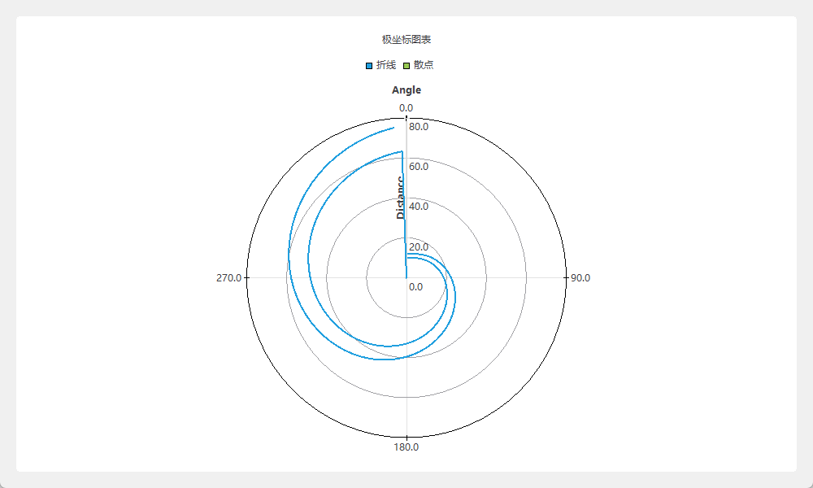

```python
# -*- coding: UTF-8 -*-
# File date: Hi_2023/3/12 17:18
# File_name: 05-极坐标图与实例.py


from PySide6.QtWidgets import QApplication, QWidget, QVBoxLayout
from PySide6.QtCharts import QChartView, QPolarChart, QLineSeries, QScatterSeries, QValueAxis
from PySide6.QtCore import Qt
import sys, math


class MyWindow(QWidget):
    def __init__(self, parent=None):
        super().__init__(parent)

        self.resize(1000, 600)
        V = QVBoxLayout(self)
        chartView = QChartView(self)
        V.addWidget(chartView)  # 创建图表视图控件

        chart = QPolarChart()  # 创建极坐标图表
        chartView.setChart(chart)  # 图表控件中设置图表
        chart.setTitle("极坐标图表")  # 设置图表的标题
        lineSeries = QLineSeries()  # 创建折线数据序列
        lineSeries.setName("折线")  # 设置数据序列的名称
        scatterSeries = QScatterSeries()  # 创建散点数据序列
        scatterSeries.setName("散点")

        r0 = 10
        for angle in range(0, 360, 2):
            r =(r0 ** 2 +(math.pi * r0 * angle / 180) ** 2) ** 0.5
            lineSeries.append(angle, r)  # 数据序列中添加数据

        r0 = 12
        for angle in range(0, 360, 5):
            r =(r0 ** 2 +(math.pi * r0 * angle / 180) ** 2) ** 0.5
            lineSeries.append(angle, r)  # 数据序列中添加数据

        chart.addSeries(lineSeries)  # 图表中添加数据序列
        chart.addSeries(scatterSeries)  # 图表中添加数据序列

        axis_angle = QValueAxis()  # 创建数值坐标轴
        axis_angle.setTitleText("Angle")  # 设置坐标轴的标题
        axis_angle.setRange(0, 360)
        axis_angle.setLinePenColor(Qt.black)
        axis_radius = QValueAxis()  # 创建数值坐标轴
        axis_radius.setTitleText("Distance")
        axis_radius.setRange(0, 80)
        axis_radius.setGridLineColor(Qt.gray)

        chart.addAxis(axis_angle, QPolarChart.PolarOrientation.PolarOrientationAngular)  # 添加坐标轴
        chart.addAxis(axis_radius, QPolarChart.PolarOrientation.PolarOrientationRadial)  # 添加坐标轴

        lineSeries.attachAxis(axis_angle)
        lineSeries.attachAxis(axis_radius)
        scatterSeries.attachAxis(axis_angle)
        scatterSeries.attachAxis(axis_radius)


if __name__ == '__main__':
    app = QApplication(sys.argv)
    win = MyWindow()

    win.show()
    sys.exit(app.exec())

```

### 图表的坐标轴

要正确显示数据序列所表示的图表,需要给数据序列关联坐标轴,根据数据序列的类型关联对应类型的坐标轴。

图表的坐标轴类型和继承关系如图 所示,坐标轴的类型有:

- QValueAxis
- QLogValueAxis
- QBarCategoryAxis
- QCategoryAxis
- QDataTimeAxis

它们都是从QAbstractAxis 继承而来的.

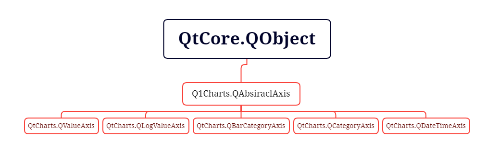

#### QAbstractAxis

QAbstractAxis是抽象类,不能直接使用，需要用其子类定义坐标轴。

##### QAbstractAxis方法

QAbstractAxis定义子类的公共属性和信号,其常用方法如表所示。

| QAbstractAxis的方法及参数类型                                | 说 明                                     |
| ------------------------------------------------------------ | ----------------------------------------- |
| show()、hide()                                               | 显示坐标轴、隐藏坐标轴                    |
| setVisible(visible: bool=True)                               | 设置坐标轴是否可见                        |
| isVisible()                                                  | 获取坐标轴是否可见                        |
| setMin(Any)、setMax(Any)、setRange(Any.Any)                  | 设置坐标轴的最小和最大值                  |
| setReverse(reverse:bool=True)                                | 设置坐标轴的方向颠倒                      |
| isReverse()                                                  | 获取是否颠倒                              |
| setTitleText(str)                                            | 设置坐标轴标题的名称                      |
| setTitleVisible(visible=True)                                | 设置坐标轴标题的可见性                    |
| isTitleVisible()                                             | 获取标题是否可见                          |
| setTitleBrush(brush: Union[QBrush, Qt.BrushStyle,Qt.GlobalColor,QColor,QGradient,QImage,QPixmap]) .. | 设置标题的画刷                            |
| setTitleFont(font:Union[QFont,str,Sequence[str]])            | 设置标题的字体                            |
| setGridLineColor(color:Union[QColor,QL.GlobalColor.str])     | 设置主网格线的颜色                        |
| setGridLinePen(pen: Union[QPen,Qt.PenStyle.QColor])          | 设置主网格线的钢笔                        |
| setGridLineVisible(visible:bool=True)                        | 设置主网格线是否可见                      |
| isGridLineVisible()                                          | 获取主网格线是否可见                      |
| setMinorGridlLineColor(color:Union[QColor，Qt.GlobalColor， str]) | 设置次网格线的颜色                        |
| setMinorGridLinePen(QPen)                                    | 设置次网格线的颜色                        |
| setMinorGridLineVisible(visible:bool=True)                   | 设置次网格线是否可见                      |
| isMinorGridLineVisible()                                     | 获取次网格线是否可见                      |
| setLabelsAngle(int)                                          | 设置刻度标签的旋转角度                    |
| setLabelsBrush(Union[QBrush,QColor,Qt.GlobalColor, QGradient]) | 设置刻度标签的画刷                        |
| setLabelsColor(color:Union[QColor,Qt.GlobalColor,strJ)       | 设置刻度标签的颜色                        |
| setLabelsEditable(editable;bool=True)                        | 设置标签是否可编辑                        |
| setLabelsFont(font;Union[QFont,str,Sequence[str]])           | 设置标签的字体                            |
| setLabelsVisible(visible;bool=True)                          | 设置标签是否可见                          |
| setTruncateLabels(truncateLabels:bool=True)                  | 当无法全部显示标签时，设置是否可 截断显示 |
| setLinePen(pen:Union[QPen,Qt.PenStyle,QColor])               | 设置坐标轴的线条的钢笔                    |
| setLinePenColor(color:Union[QColor,Qt.GlobalColor,str])      | 设置坐标轴的线条的钢笔颜色                |
| setLineVisible(visible:bool=True)                            | 设置坐标轴的线条是否可见                  |
| isLineVisible()                                              | 获取坐标轴的线条是否可见                  |
| setShadesBorderColor(color: Union[QColor, Qt.GlobalColor, str]) | 设置阴影边框的颜色                        |
| setShadesBrush(Union[QBrush, QColor, Qt.GlobalColor, QGradient]) | 设置阴影的画刷                            |
| setShadesColor(color:Union[QColor,Qt.GlobalColor,str])       | 设置阴影的颜色                            |
| setShadesPen(pen:Union[QPen,Qt.PenStyle,QColor])             | 设置阴影的钢笔                            |
| setShadesVisible(visible:bool=True)                          | 设置阴影是否可见                          |
| alignment()                                                  | 获取对齐方式 Qt.Alignment                 |

##### QAbstractAxis 的信号

QAbstractAxis 的信号如表所示通过名称可知其表达的含义和信号发送的时机。

| QAbstractAxis的信号                       | 参数                         | 说明                                                         |
| ----------------------------------------- | ---------------------------- | ------------------------------------------------------------ |
| `colorChanged(color)`                     | color – PySide6.QtGui.QColor | 当轴的颜色变为颜色时，会发出此信号。                         |
| `gridLineColorChanged(color)`             | color – PySide6.QtGui.QColor | 当用于绘制网格线的笔的颜色变为颜色时，会发出此信号。         |
| `gridLinePenChanged(pen)`                 | pen – PySide6.QtGui.QPen     | 当用于绘制网格线的笔变为笔时，会发出此信号。                 |
| `gridVisibleChanged(visible)`             | visible – bool               | 当轴的网格线的可见性更改为可见时，会发出此信号。             |
| `labelsAngleChanged(angle)`               | angle – int                  | 当轴标签的角度更改为角度时，会发出此信号。                   |
| `labelsBrushChanged(brush)`               | brush – PySide6.QtGui.QBrush | 当用于绘制轴标签的画笔更改为画笔时，会发出此信号。           |
| `labelsColorChanged(color)`               | color – PySide6.QtGui.QColor | 当轴标签的颜色更改为颜色时，会发出此信号。                   |
| `labelsEditableChanged(editable)`         | editable – bool              | 当标签的可编辑状态发生变化时，会发出此信号。                 |
| `labelsFontChanged(pen)`                  | pen – PySide6.QtGui.QFont    | 当轴标签的字体更改为字体时，会发出此信号。                   |
| `labelsTruncatedChanged(labelsTruncated)` | **labelsTruncated** – bool   | 该信号在两种情况下发出；<br />当轴从具有一个或多个截断标签改变为没有截断标签时<br />以及当轴从没有截断标签改变成具有一个或者多个截断的标签时。当前状态由标签Truncated标识。 |
| `labelsVisibleChanged(visible)`           | visible – bool               | 当轴标签的可见性更改为可见时，会发出此信号。                 |
| `linePenChanged(pen)`                     | pen – PySide6.QtGui.QPen     | 当用于绘制轴线的笔变为笔时，会发出此信号。                   |
| `lineVisibleChanged(visible)`             | visible – bool               | 当轴线的可见性更改为可见时，会发出此信号。                   |
| `minorGridLineColorChanged(color)`        | color – PySide6.QtGui.QColor | 当用于绘制次要网格线的笔的颜色变为颜色时，会发出此信号。     |
| `minorGridLinePenChanged(pen)`            | pen – PySide6.QtGui.QPen     | 当用于绘制次要网格线的笔变为笔时，会发出此信号。             |
| `minorGridVisibleChanged(visible)`        | visible – bool               | 当轴的次网格线的可见性更改为可见时，会发出此信号。           |
| `reverseChanged(reverse)`                 | reverse – bool               | 当颠倒轴改变状态是发送此信号                                 |
| `shadesBorderColorChanged(color)`         | color – PySide6.QtGui.QColor | 当轴的边框颜色变为颜色时，会发出此信号。                     |
| `shadesBrushChanged(brush)`               | brush – PySide6.QtGui.QBrush | 当用于绘制轴阴影的笔刷更改为笔刷时，会发出此信号。           |
| `shadesColorChanged(color)`               | color – PySide6.QtGui.QColor | 当轴的颜色变为颜色时，会发出此信号。                         |
| `shadesPenChanged(pen)`                   | pen – PySide6.QtGui.QPen     | 当用于绘制轴阴影的笔更改为笔时，会发出此信号。               |
| `shadesVisibleChanged(visible)`           | visible – bool               | 当轴阴影的可见性更改为可见时，会发出此信号。                 |
| `titleBrushChanged(brush)`                | brush – PySide6.QtGui.QBrush | 当用于绘制轴标题的画笔更改为画笔时，会发出此信号。           |
| `titleFontChanged(font)`                  | font – PySide6.QtGui.QFont   | 当轴标题的字体更改为字体时，会发出此信号。                   |
| `titleTextChanged(title)`                 | title – str                  | 当轴标题的文本更改为文本时，会发出此信号。                   |
| `titleVisibleChanged(visible)`            | **visible** – bool           | 当轴的标题文本的可见性更改为可见时，会发出此信号。           |
| `truncateLabelsChanged(truncateLabels)`   | **truncateLabels** – bool    | 当标签的截断变为truncateLabels时，会发出此信号。             |
| `visibleChanged(visible)`                 | **visible** – bool           | 当轴的可见性更改为可见时，会发出此信号。                     |

#### QValueAxis

数值轴QValueAxis 适用于具有连续数据坐标的图表，它在继承 QAbstractAxis 的属性、方法和信号的同时,根据数值轴的特点又增添了一些设置坐标轴刻度的方法。

用QValueAxis 创建实例对象的方法是 

```python
from PySide6.QtCharts import QValueAxis

QValueAxis(parent: Union[PySide6.QtCore.QObject, NoneType]= None) -> None
```


##### 数值轴的常用方法

数值轴QValueAxis的常用方法如表所示主要方法介绍如下。

- 用setTickAnchor(float)方法设置刻度错点(参考点);
- 用setTickInterval(float)方法设置刻度之间的间隔值;
- 用setTickCount(int)方法设置刻度数量,刻度线平均分布在最小值和最大值之间;
- 用setTickType(type:QValueAxis.TickType)方法设置刻度类型，参数可取:
  - QValueAxis.TicksDynamic
  - QValueAxis.TicksFixed.
- 用setLabelFormat(str)方法设置刻度标签的格式符可以使用字符串的“%”格式符,例如“%3d”表示输出3 位整数，“%7.2”表示输出宽度为7位的浮点数，其中小数位为2,整数位为 4,小数点占1位，
  - 用applyNiceNumbers()智能方法设置刻度的标签。

| QValueAxis的方法及参数类型             | 说 明                      |
| -------------------------------------- | -------------------------- |
| setTickCount(int)                      | 设置刻度线的数量           |
| setTickAnchor(float)                   | 设置刻度锚点               |
| setTickInterval(float)                 | 设置刻度线的间隔值         |
| setMinorTickCount(int)                 | 设置次刻度的数量           |
| setTickType(type: QValueAxis.TickType) | 设置刻度类型               |
| setMax(float)                          | 设置最大值                 |
| setMin(float)                          | 设置最小值                 |
| setRange(float,float)                  | 设置坐标轴的最小值和最大值 |
| setLabelFormat(str)                    | 设置标签的格式             |
| [slot]applyNiceNumbers()               | 使用智能方法设置刻度的标签 |

##### 数值轴QValueAxis的信号

| 信号                               | 参数                        | 说明                                                         |
| ---------------------------------- | --------------------------- | ------------------------------------------------------------ |
| `labelFormatChanged(format)`       | **format** – str            | 当轴标签的格式更改时，会发出此信号。                         |
| `maxChanged(max)`                  | **max** – float             | 当轴的最大值(由max指定)发生变化时，会发出此信号。            |
| `minChanged(min)`                  | min – float                 | 当轴的最小值(由min指定)发生变化时，会发出此信号。            |
| `minorTickCountChanged(tickCount)` | tickCount – int             | 当minorTickCount指定的轴上的次要刻度线数量发生变化时，会发出此信号。 |
| `rangeChanged(min, max)`           | min – float<br/>max – float | 当轴的最小值或最大值(由最小值和最大值指定)发生变化时，会发出此信号。 |
| `tickAnchorChanged(anchor)`        | **anchor** – float          | 刻度线布局发生变化时，会发出此信号。                         |
| `tickCountChanged(tickCount)`      | **tickCount** – int         | 当tickCount指定的轴上的刻度线数量发生变化时，会发出此信号。  |
| `tickIntervalChanged(interval)`    | **interval** – float        | 刻度线数发生变化时，会发出此信号。                           |
| `tickTypeChanged(type)`            | type – TickType             | 刻度发生变化时，会发出此信号。                               |

#### QLogValueAxis

对数轴 QLogValueAxis 是一个非线性值变化坐标轴它是基于数量级的非线性标尺轴上的每一个刻度线都是由前一个刻度线的值乘以一个固定的值而得到的。

```python
from PySide6.QtCharts import QLogValueAxis

QLogValueAxis(parent: Union[PySide6.QtCore.QObject, NoneType]= None) -> None
```


如果QLogValueAxis 连接的数据序列中含有 0或负数，则该数据序列不会被绘制。
QLogValueAxis 的方法不多，主要是:

- 用setBase(float)方法设置对数的基;
- 用setLabelFormat(str)方法设置标签格式;
- 用setMin(float)方法、setMax(float)方法或setRange(float,float)方法设置幅度范围，
- 用setMinorTickCount(int)方法设置次网格的数量;
- 用tickCount()方法和 minorTickCount()方法分别获取网格和次网格的数量。

QLogValueAxis 的信号有 

| 信号                                  | 参数                        | 说明                                                         |
| ------------------------------------- | --------------------------- | ------------------------------------------------------------ |
| baseChanged(base)                     | **base** – float            | 当轴的对数基数改变时，发出该信号。                           |
| labelFormatChanged(format)            | **format** – str            | 当轴标签的格式更改时，会发出此信号。                         |
| maxChanged(max)                       | **max** – float             | 当轴的最大值(由max指定)发生变化时，会发出此信号。            |
| minChanged(min)                       | **min** – float             | 当轴的最小值(由min指定)发生变化时，会发出此信号。            |
| minorTickCountChanged(minorTickCount) | minorTickCount – int        | 当minorTickCount指定的轴上的次要刻度线数量发生变化时，会发出此信号。 |
| rangeChanged(min, max)                | min – float<br/>max – float | 当轴的最小值或最大值(由最小值和最大值指定)发生变化时，会发出此信号。 |
| tickCountChanged(tickCount)           | tickCount – int             | 当tickCount指定的轴上的刻度线数量发生变化时，会发出此信号。  |


下面的程序,横坐标用数值坐标、纵坐标用对数坐标绘制图表,并对横坐标和纵坐标的显示进行设置,程序运行结果如图所示

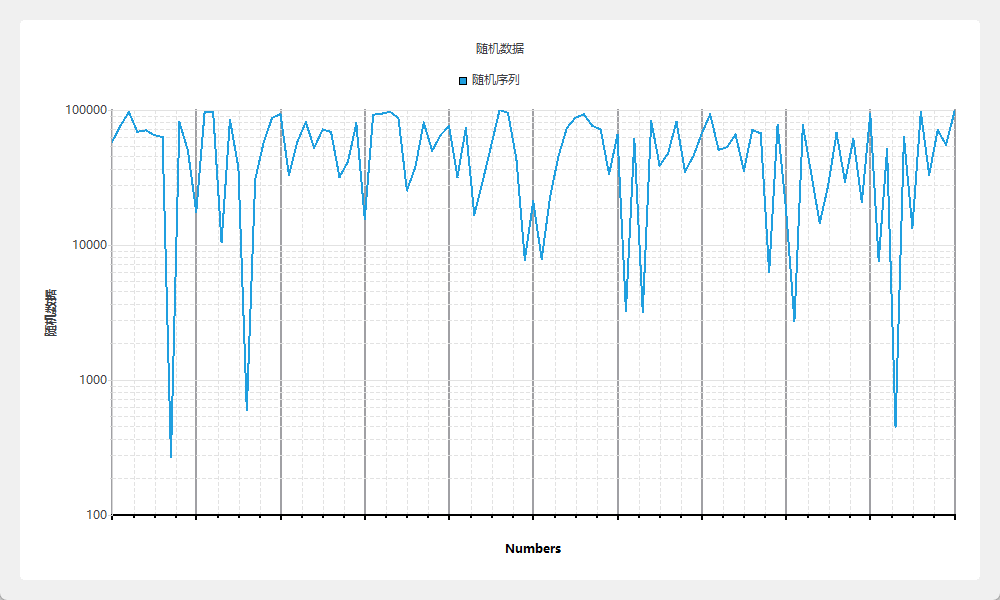

```python
# -*- coding: UTF-8 -*-
# File date: Hi_2023/3/12 18:07
# File_name: 06-对数轴 QLogValueAxis.py


import sys, random
from PySide6.QtWidgets import QApplication, QWidget, QVBoxLayout
from PySide6 import QtCharts
from PySide6.QtCore import Qt


class MyWidget(QWidget):
    def __init__(self, parent=None):
        super().__init__(parent)

        self.resize(1000, 600)
        v = QVBoxLayout(self)
        chartView = QtCharts.QChartView(self)
        v.addWidget(chartView)  # 创建图表视图控件
        chart = QtCharts.QChart()  # 创建图表
        chartView.setChart(chart)  # 图表控件中设置图表
        chart.setTitle("随机数据")  # 设置图表的标题
        lineSeries = QtCharts.QLineSeries()  # 创建折线数据序列
        lineSeries.setName("随机序列")  # 设置数据序列的名称
        random.seed(10000)
        for i in range(101):
            lineSeries.append(i, 100000 * random.random())  # 数据序列中添加数据

        chart.addSeries(lineSeries)  # 图表中添加数据序列
        axis_x = QtCharts.QValueAxis()  # 创建数值坐标轴
        axis_x.setTitleText("Numbers")  # 设置坐标轴的标题
        axis_x.setTitleBrush(Qt.black)
        axis_x.setLabelsColor(Qt.black)
        axis_x.setRange(0, 100)  # 设置坐标轴的范围
        axis_x.setTickCount(10)  # 设置刻度的数量
        axis_x.applyNiceNumbers()  # 应用智能刻度标签
        axis_x.setLinePenColor(Qt.black)  # 设置坐标轴的颜色

        pen = axis_x.linePen()  # 获取坐标轴的钢笔
        pen.setWidth(2)  # 设置钢笔的宽度
        axis_x.setLinePen(pen)  # 设置坐标轴的钢笔
        axis_x.setGridLineColor(Qt.gray)  # 设置网格线的颜色
        pen = axis_x.gridLinePen()  # 获取网格线的钢笔
        pen.setWidth(2)  # 设置钢笔的宽度
        axis_x.setGridLinePen(pen)  # 设置网格线的宽度
        axis_x.setMinorTickCount(3)  # 设置次刻度的数量
        axis_x.setLabelFormat("% 5,1f")  # 设置标签的格式

        axis_y = QtCharts.QLogValueAxis()  # 建立对数坐标轴
        axis_y.setBase(10.0)  # 定义对数基
        axis_y.setMax(100000.0)  # 设置最大值
        axis_y.setMin(100.0)  # 设置最小值
        axis_y.setTitleText("随机数据")  # 设置标题
        axis_y.setMinorTickCount(9)  # 设置次网格线的数量
        axis_y.setLabelFormat("%6d")  # 设置格式

        chart.setAxisX(axis_x, lineSeries)  # 设置坐标轴的数据
        chart.setAxisY(axis_y, lineSeries)  # 设置坐标轴的数据


if __name__ == '__main__':
    app = QApplication(sys.argv)
    win = MyWidget()

    win.show()
    sys.exit(app.exec())

```


#### QBarCategoryAxis

QBarCategoryAxis 主要用于定义条形图的坐标轴，添加条目也可用于定义折线图的坐标轴。

QBarCategoryAxis 的常用方法如表所示。

```python
from PySide6.QtCharts import QBarCategoryAxis

QBarCategoryAxis(parent: Union[PySide6.QtCore.QObject, NoneType]= None) -> None
```


QBarCategoryAxis 的信号有

| 信号                   | 参数                    | 说明                                           |
| ---------------------- | ----------------------- | ---------------------------------------------- |
| categoriesChanged()    |                         | 当轴的类别发生变化时，会发出此信号。           |
| countChanged()         |                         | 当轴的类别数发生变化时，会发出此信号。         |
| maxChanged(max)        | max – str               | 当轴的最大值发生变化时，会发出此信号。         |
| minChanged(min)        | **min** – str           | 当轴的最小值发生变化时，会发出该信号。         |
| rangeChanged(min, max) | min – str<br/>max – str | 当轴的最小值或最大值发生变化时，会发出该信号。 |


下面的程序,在一个图表中添加条形图和折线图,条形图和折线图使用相同的坐标轴程序运行结果如图所示。

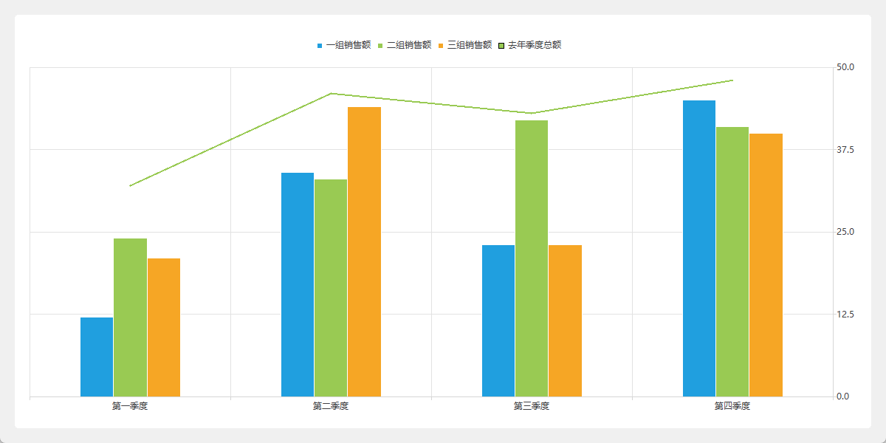

```python
# -*- coding: UTF-8 -*-
# File date: Hi_2023/3/12 18:32
# File_name: 07-条形图的坐标轴QBarCategoryAxis.py


from PySide6.QtWidgets import QApplication, QWidget, QVBoxLayout
import sys
from PySide6.QtCore import Qt
from PySide6 import QtCharts


class MyWidget(QWidget):
    def __init__(self, parent=None):
        super().__init__(parent)

        self.resize(1200, 600)
        v = QVBoxLayout(self)
        self.chartView = QtCharts.QChartView(self)  # 创建图表视图控件
        v.addWidget(self.chartView)
        self.chart = QtCharts.QChart()  # 创建图表
        self.chartView.setChart(self.chart)  # 将图表加人到图表视图控件中

        set1 = QtCharts.QBarSet("一组销售额")  # 创建数据项
        set1.append([12, 34, 23, 45])  # 添加数据
        set2 = QtCharts.QBarSet("二组销售额")  # 创建数据项
        set2.append([24, 33, 42, 41])  # 添加数据
        set3 = QtCharts.QBarSet("三组销售额")  # 创建数据项
        set3.append([21, 44, 23, 40])  # 添加数据

        self.barSeries = QtCharts.QBarSeries()  # 创建数据序列
        self.barSeries.append([set1, set2, set3])  # 添加数据项
        self.lineSeries = QtCharts.QLineSeries()  # 创建数据序列
        self.lineSeries.setName("去年季度总额")
        self.lineSeries.append(0, 32)  # 添加数据
        self.lineSeries.append(1, 46)
        self.lineSeries.append(2, 43)
        self.lineSeries.append(3, 48)
        self.chart.addSeries(self.barSeries)  # 图表中添加数据序列
        self.chart.addSeries(self.lineSeries)  # 图表中添加数据序列

        # 创建坐标轴
        self.barCategoryAxis = QtCharts.QBarCategoryAxis()
        self.chart.addAxis(self.barCategoryAxis, Qt.AlignmentFlag.AlignBottom)  # 图表中添加坐标轴
        self.barCategoryAxis.append(["第一季度", "第二季度", "第三季度", "第四季度"])

        self.valueAxis = QtCharts.QValueAxis()  # 创建数值坐标轴
        self.chart.addAxis(self.valueAxis, Qt.AlignmentFlag.AlignRight)  # 图表中添加坐标轴
        self.valueAxis.setRange(0, 50)  # 设置坐标轴的数值范围

        self.barSeries.attachAxis(self.valueAxis)  # 数据项与坐标轴关联
        self.barSeries.attachAxis(self.barCategoryAxis)  # 数据项与坐标轴关联
        self.lineSeries.attachAxis(self.valueAxis)  # 数据项与坐标轴关联
        self.lineSeries.attachAxis(self.barCategoryAxis)  # 数据项与坐标轴关联


if __name__ == '__main__':
    app = QApplication(sys.argv)
    win = MyWidget()

    win.show()
    sys.exit(app.exec())

```

#### QCategoryAxis

与QBarCategoryAxis 不同的是,QCategoryAxis 坐标轴可以定义每个条目的宽度，常用来放在竖直轴上,实现坐标轴不等分。

```python
from PySide6.QtCharts import QCategoryAxis

QCategoryAxis(parent: Union[PySide6.QtCore.QObject, NoneType]= None) -> None 
```


##### QCategoryAxis 的常用方法

- 用append(label:str,categoryEndValue:float)方法添加条目,其中 label是条目名称,categoryEndValue 是条目的终止值,一个条目的宽度是两个相邻条目的终止值的差,因此后加人的条目的终止值一定要大于先加入的条目的终止值;
- 用setStartValue(min: loat)方法设置坐标轴的起始值;
- 用startValue(categoryLabel=)方法获取条目的起始值;
- 用endValue(str)方法获取条目的终止值，
- 用setLabelsPosition(QCategoryAxis.AxisLabelsPosition)方法设置条目标签的位置,参数可取:
  - QCategoryAxis.AxisLabelsPositionCenter(标签在条目中间位置)
  - QCategoryAxis.AxisLabelsPositionOnValue(标签在条目的最大值处)

| QCategoryAxis的方法与参数类型                        | 返回值的类型 | 说明                 |
| ---------------------------------------------------- | ------------ | -------------------- |
| append(label: str,categoryEndValue: float)           | None         | 添加条目             |
| categoriesLabels()                                   | ListCstr]    | 获取条目列表         |
| count()                                              | int          | 获取条目的数量       |
| endValue(categoryLabel:str)                          | float        | 获取指定条目的终止值 |
| remove(label:str)                                    | None         | 移除指定的条目       |
| replaceLabel(oldLabel: str,newLabel: str)            | None         | 用新条目替换旧条目   |
| setLabelsPosition(QCategoryAxis. AxisLabelsPosition) | None         | 设置标签的位置       |
| setStartValue(min:float)                             | None         | 设置条目的最小值     |
| stariValue(categoryLabel:str=')                      | float        | 获取指定条目的起始值 |

##### QCategoryAxis的信号

| 信号                            | 参数                          | 说明                                 |
| ------------------------------- | ----------------------------- | ------------------------------------ |
| categoriesChanged()             |                               | 当轴的类别发生变化时，会发出此信号。 |
| labelsPositionChanged(position) | position – AxisLabelsPosition | 标签位置更改，会发出此信号。         |


##### QCategoryAxis例子

下面的程序是将 QCategoryAxis 轴放在左侧，QCategoryAxis 轴的条目是销售等级分为“不及格”“及格”“良好”“优秀”和“超出预期”每个等级的宽度并不相等。程序运行结果如图所示。

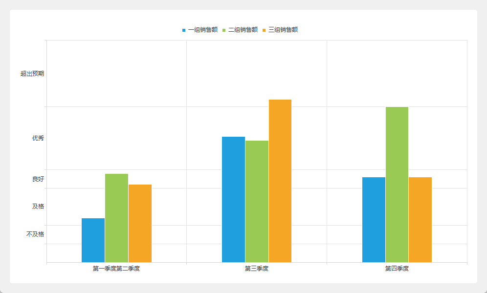

```python
# -*- coding: UTF-8 -*-
# File date: Hi_2023/3/12 18:51
# File_name: 08-QCategoryAxis例子.py


from PySide6.QtWidgets import QApplication, QWidget, QVBoxLayout
import sys
from PySide6 import QtCharts
from PySide6.QtCore import Qt


class MyWidget(QWidget):
    def __init__(self, parent=None):
        super().__init__(parent)

        self.resize(800, 600)
        v = QVBoxLayout(self)
        self.chartView = QtCharts.QChartView(self)  # 创建图表视图控件
        v.addWidget(self.chartView)
        self.chart = QtCharts.QChart()  # 创建图表
        self.chartView.setChart(self.chart)  # 将图表加入到图表视图控件中

        set1 = QtCharts.QBarSet("一组销售额")  # 创建数据项
        set1.append([12, 34, 23, 45])  # 添加数据
        set2 = QtCharts.QBarSet("二组销售额")  # 创建数据项
        set2.append([24, 33, 42, 41])  # 添加数据
        set3 = QtCharts.QBarSet("三组销售额")  # 创建数据项
        set3.append([21, 44, 23, 40])  # 添加数据

        self.barSeries = QtCharts.QBarSeries()  # 创建数据序列
        self.barSeries.append([set1, set2, set3])  # 添加数据项
        self.chart.addSeries(self.barSeries)  # 图表中添加数据序列

        self.barCategoryAxis = QtCharts.QBarCategoryAxis()  # 创建坐标轴
        self.chart.addAxis(self.barCategoryAxis, Qt.AlignBottom)  # 图表中添加坐标轴
        self.barCategoryAxis.append(["第一季度""第二季度", "第三季度", "第四季度"])
        self.categoryAxis = QtCharts.QCategoryAxis()  # 创建数值坐标轴
        self.categorvAxis = self.chart.addAxis(self.categoryAxis, Qt.AlignmentFlag.AlignLeft)  # 图表中添加坐标轴

        self.categoryAxis.setRange(0, 60)  # 设置坐标轴的数值范围
        self.categoryAxis.append("不及格", 10)  # 添加条目
        self.categoryAxis.append("及格", 20)  # 添加条目
        self.categoryAxis.append("良好", 25)  # 添加条目
        self.categoryAxis.append("优秀", 42)  # 添加条目
        self.categoryAxis.append("超出预期", 60)  # 添加条目
        self.categoryAxis.setStartValue(5)  # 指定起始值

        self.barSeries.attachAxis(self.categoryAxis)  # 数据项与坐标轴关联
        self.barSeries.attachAxis(self.barCategoryAxis)  # 数据项与坐标轴关联


if __name__ == '__main__':
    app = QApplication(sys.argv)
    win = MyWidget()

    win.show()
    sys.exit(app.exec())

```

#### QDateTimeAxis

QDateTimeAxis 轴用于设置时间坐标轴可用于XY图。

##### QDateTimeAxis 的常用方法

QDateTimeAxis 的常用方法如表所示，主要方法:

- 用setFormat(format:str)方法设置显示格式，显示格式可参考QDateTime 的格式;
- 用setMin(min:QDateTime)和 setMax(max:QDateTime)方法设置坐标轴显示的最小时间和最大时间;
- 用setTickCount(count;int)方法设置坐标轴的刻度数量。

在定义数据序列的值时,例如 QLineSeries 数据序列需要把X值转换成毫秒可以用QDateTime的 toMSecsSinceEpoch()方法转换否则数据序列与时间坐标轴的关联会出问题，时间坐标轴显示的时间不准确,可参考下面的实例

| QDateTimeAxis的方法及参数类型           | 返回值的类型 | 说明                 |
| --------------------------------------- | ------------ | -------------------- |
| setFormat(format:str)                   | None         | 设置显示时间的格式   |
| format()                                | Str          | 获取格式             |
| setMax(max: QDateTime)                  | None         | 设置坐标轴的最大时间 |
| max()                                   | QDateTime    | 获取最大时间         |
| setMin(min:QDateTime)                   | None         | 设置坐标轴的最小时间 |
| min()                                   | QDateTime    | 获取最小时间         |
| setRange(min: QDateTime,max: QDateTime) | None         | 设置范围             |
| setTickCount(count:int)                 | None         | 设置刻度数量         |
| tickCount()                             | int          | 获取刻度数量         |

##### QDateTimeAxis的信号

| 信号                   | 参数                                                         | 说明                                                         |
| ---------------------- | ------------------------------------------------------------ | ------------------------------------------------------------ |
| formatChanged(format)  | **format** – str                                             | 当轴的格式改变时，会发出此信号。                             |
| maxChanged(max)        | max – PySide6.QtCore.QDateTime                               | 当轴的最大值(由max指定)发生变化时，会发出此信号。            |
| minChanged(min)        | min – PySide6.QtCore.QDateTime                               | 当轴的最小值(由min指定)发生变化时，会发出此信号。            |
| rangeChanged(min, max) | min – PySide6.QtCore.QDateTime<br/>max – PySide6.QtCore.QDateTime | 当轴的最小值或最大值(由最小值和最大值指定)发生变化时，会发出此信号。 |
| tickCountChanged(tick) | tick – int                                                   | 当tickCount指定的轴上的刻度线数量发生变化时，会发出此信号。  |


##### QDateTimeAxis的实例

下面的程序用菜单打开 Excel 文件 price.xlsx,读取数据并绘制价格走势图,pricexlsx文件中第1列是时间,第2列和第 3列是价格。程序运行结果如图8-12所示。

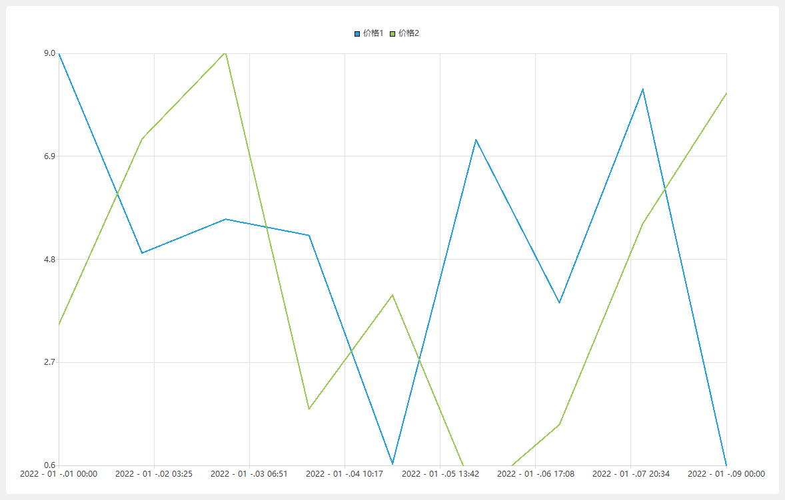

```python
# -*- coding: UTF-8 -*-
# File date: Hi_2023/3/12 19:26
# File_name: 09-QDateTimeAxis的实例.py


import sys
from PySide6.QtWidgets import QApplication, QWidget, QVBoxLayout, QMenuBar, QFileDialog
from PySide6.QtCharts import QChartView, QChart, QLineSeries, QValueAxis, QDateTimeAxis
from PySide6.QtCore import QDateTime
from openpyxl import load_workbook


class MyWindow(QWidget):
    def __init__(self, parent=None):
        super().__init__(parent)

        self.resize(1200, 800)
        self.setupUi()

    def setupUi(self):
        menuBar = QMenuBar()
        fileMenu = menuBar.addMenu("文件(&E)")
        fileMenu.addAction("打开(&O)").triggered.connect(self.action_open_triggered)
        fileMenu.addSeparator()
        fileMenu.addAction("退出(&Q)").triggered.connect(self.close)
        chartView = QChartView()
        v = QVBoxLayout(self)
        v.addWidget(menuBar)
        v.addWidget(chartView)
        self.chart = QChart()
        chartView.setChart(self.chart)

    def action_open_triggered(self):  # 打开 Excel文档，读取数据
        fileName, fil = QFileDialog.getOpenFileName(self, "打开测试文件", ".", "Excel(*.xlsx)")
        if fileName and fil == "Excel(*.xlsx)":
            print("进来了")
            dateTimeList = list()  # 时间列表
            valueList_1 = list()  # 数值列表
            valueList_2 = list()  # 数值列表

            wb = load_workbook(fileName)
            ws = wb.active
            for row in ws.rows:
                valueList_1.append(row[1].value)  # 添加数值数据
                valueList_2.append(row[2].value)  # 添加数值数据
                dateTimeList.append(QDateTime(row[0].value))  # 添加时间数据

            self.plot(dateTimeList, valueList_1, valueList_2)  # 调用绘制图表函数

    def plot(self, dateTimeList, valueList_1, valueList_2):  # 绘制图表的函数
        lineSeries_1 = QLineSeries(self)  # 第1个数据序列
        lineSeries_1.setName("价格1")
        lineSeries_2 = QLineSeries(self)  # 第2个数据序列
        lineSeries_2.setName("价格2")

        for i in range(len(dateTimeList)):
            msec = float(dateTimeList[i].toMSecsSinceEpoch())  # 换算成毫秒
            lineSeries_1.append(msec, valueList_1[i])  # 第1个数据序列添加数据
            lineSeries_2.append(msec, valueList_2[i])  # 第2个数据序列添加数据

        dateTimeAxis = QDateTimeAxis(self)  # 创建时间坐标轴
        dateTimeAxis.setRange(dateTimeList[0], dateTimeList[len(dateTimeList) - 1])
        dateTimeAxis.setFormat('yyyy - MM -.dd HH:mm')
        dateTimeAxis.setTickCount(8)
        valueAxis = QValueAxis(self)  # 创建数值坐标轴

        self.chart.removeAllSeries()
        self.chart.removeAxis(self.chart.axisX())
        self.chart.removeAxis(self.chart.axisY())
        self.chart.addSeries(lineSeries_1)
        self.chart.addSeries(lineSeries_2)

        self.chart.setAxisX(dateTimeAxis, lineSeries_1)  # 图表设置 X轴
        self.chart.setAxisY(valueAxis, lineSeries_1)  # 图表设置Y轴
        self.chart.setAxisX(dateTimeAxis, lineSeries_2)  # 图表设置 X轴
        self.chart.setAxisY(valueAxis, lineSeries_2)  # 图表设置Y轴


if __name__ == '__main__':
    app = QApplication(sys.argv)
    win = MyWindow()

    win.show()
    sys.exit(app.exec())

```


### 图例与图例上的标志

#### 图例QLegend

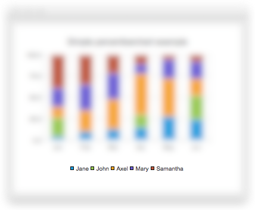

如图图例 QLegend用于定义图表中图例的位置颜色可见性和序列的标志形状等。

图例QLegend继承自 QGraphicsWidget,用图表 QChart 的 legend()方法获取图表上的图例对象;然后用图例 QLegend 提供的方法对图例进行设置。不能单独创建图例对象

##### 图例QLegend的方法

图例QLegend 的常用方法如表所示,主要方法介绍如下

- 用setAlignment(alignment;Qt.Alignment)方法可以设置图例在图表的位置,如参数取:
  - Qt.AlignTop 把图例放在图表的上位置。
  - Qt.AlignBottom 把图例放在图表的下位置。
  - Qt.AlignLeft 把图例放在图表的左位置。
  - Qt.AlignRight 把图例放在图表的右位置。
- 用setMarkerShape(shape: QLegend.MarkerShape)方法设置数据序列标志的形状，参数可取:
  - QLegend.MarkerShapeDefault(使用默认形状) 由 QLegend 确定的默认形状用于标记。此值仅支持单个 QLegendMarker 项。
  - QLegend.MarkerShapeRectangle 使用矩形标记。标记大小由字体大小决定。
  - QLegend.MarkerShapeCircle  使用圆形标记。标记大小由字体大小决定。
  - QLegend.MarkerShapeFromSeries(根据数据序列的类型确定形状)标记形状由序列确定。对于散点序列，图例标记看起来像散点，并且与点的大小相同。对于直线或样条线系列，图例标记看起来像直线的一小部分。对于其他系列类型，将显示矩形标记。如果为序列指定了 a，则将显示 ，其大小将由系列标记大小确定。lightMarkerlightMarker
  - QLegend.MarkerShapeRotatedRectangle 使用旋转的矩形标记。标记大小由字体大小决定。
  - QLegend.MarkerShapeTriangle 使用三角形标记。标记大小由字体大小决定。
  - QLegend.MarkerShapeStar 使用星形标记。标记大小由字体大小决定。
  - QLegend.MarkerShapePentagon 使用五边形标记。标记大小由字体大小决定。
  - 对应值分别是0~7当使用矩形或圆形时,矩形或圆形的尺寸由字体的尺寸决定;当选择数据序列的类型时,如果数据序列是折线或样条曲线,则形状是线段,如果是散列图,则形状是散列图上的点的形状,其他情况时形状是矩形。
- 用setInteractive(interactive:bool)方法可以将图例设置成交互模式
  - 用detachFromChart()方法使图例与图表失去关联,则可以用鼠标移动图例和调整图例的尺寸。

- 用markers(series;QAbstractSeries=None)方法可以获取图例上数据序列的标志对象列表,可以对每个标志对象进行更详细的设置

| QLegend 的方法及参数类型                                     | 说 明                                  |
| ------------------------------------------------------------ | -------------------------------------- |
| setAlignment(alignment: Qt.Alignment)                        | 设置图例在QChart中的位置               |
| setBackgroundVisible(visible:bool=True)                      | 设置图例的背景是否可见                 |
| setBorderColor(color:Union[QColor,Qt.GlobalColor, str])      | 在背景可见时，设置边框的颜色           |
| setBrush(brush: Union[QBrush, Qt.BrushStyle, Qt.GlobalColor,QColor,QGradient,QImage,QPixmap]) | 设置画刷                               |
| setColor(color:Union[QColor,Qt.GlobalColor,str])             | 设置填充色                             |
| setFont(font:Union[QFont,str,Sequence[str]])                 | 设置字体                               |
| setLabelBrush(brush: Union[QBrush, QColor, QGradient])       | 设置标签画刷                           |
| setLabelColor(color: Union[QColor, Qt.GlobalColor, str])     | 设置标签颜色                           |
| setMarkerShape(shape:QLegend. MarkerShape)                   | 设置数据序列标志的形状                 |
| markerShape()                                                | 获取标志的形状 QLegend. MarkerShape    |
| setPen(pen:Union[QPen,Qt.PenStyle,QColor])                   | 设置边框的钢笔                         |
| setReverseMarkers(reverseMarkers:bool=True)                  | 设置数据序列的标志是否反向             |
| setToolTip(str)                                              | 设置提示信息                           |
| setShowToolTips(show:bool)                                   | 设置是否显示提示信息                   |
| detachFromChart()                                            | 使图例与图表失去关联                   |
| attachToChart()                                              | 使图例与图表建立关联                   |
| isAttachedToChart()                                          | 获取图例                               |
| setInteractive(interactive: bool)                            | 设置图例是否是交互模式                 |
| markers(series:QAbstractSeries=None)                         | 获取图例中标志列表 list[QLegendMarker] |

##### 图例QLegend 的信号

图例QLegend的信号如表所示

| QLegend的信号及参数类型                    | 说 .明                                 |
| ------------------------------------------ | -------------------------------------- |
| attachedToChartChanged(attached:bool)      | 图例与图表的关联状态发生改变时发送信号 |
| backgroundVisibleChanged(visible:bool)     | 背景可见性发生改变时发送信号           |
| borderColorChanged(color:QColor)           | 背景颜色发生改变时发送信号             |
| colorChanged(color:QColor)                 | 颜色发生改变时发送信号                 |
| fontChanged(font:QFont)                    | 字体发生改变时发送信号                 |
| labelColorChanged(color:QColor)            | 标签颜色发生改变时发送信号             |
| markerShapeChanged(QLegend.MarkerShape)    | 标志形状发生改变时发送信号             |
| reverseMarkersChanged(reverseMarkers:bool) | 标志反转状态发生改变时发送信号         |
| showToolTipsChanged(showToolTips:bool)     | 提示信息显示状态发生改变时发送信号     |

#### 图例的标志QLegendMarker

用图例的 markers(series:QAbstractSeries=None)方法可以获取图例上的数据序列标志对象列表 list[QLegendMarker]可以对每个标志对象进行详细的设置。

QLegendMarker 继承自QObject,继承自 QLegendMarker 的类有

- QXYLegendMarker
- QAreaLegendMarker
- QBarLegendMarker
- QBoxPlotLegendMarker
- QCandlestickLegendMarker
- QPieLegendMarker

除 QBarLegendMarker和QPieLegendMarker 外,这些派生类没有自己特有的方法和信号，都是继承QLegendMarker 的方法和信号

##### 图例标志 QLegendMarker 的方法

图例标志 QLegendMarker 的常用方法如所示,主要方法是

- 用setShape(shape:QLegend.MarkerShape)方法设置形状;

- 用type()方法获取标志类型返回值是QLegendMarker.LegendMarkerType 的枚举值,可取以下值,分别对应值0~5,根据类型可以给标志设置不同的形状

  | 标记                                      | 说明                             |
  | ----------------------------------------- | -------------------------------- |
  | QLegendMarker.LegendMarkerTypeArea        | 区域系列的图例标记。             |
  | QLegendMarker.LegendMarkerTypeBar         | 条形图集的图例标记。             |
  | QLegendMarker.LegendMarkerTypePie         | 饼图扇区的图例标记。             |
  | QLegendMarker.LegendMarkerTypeXY          | 直线、样条或散点序列的图例标记。 |
  | QLegendMarker.LegendMarkerTypeBoxPlot     | 箱形图系列的图例标记。           |
  | QLegendMarker.LegendMarkerTypeCandlestick | 烛台系列的图例标记。             |


| QLegendMarker的方法及参数类型                                | 返回值的类型                    | 说明               |
| ------------------------------------------------------------ | ------------------------------- | ------------------ |
| brush()                                                      | QBrush                          | 获取画刷           |
| font()                                                       | QFont                           | 获取字体           |
| isVisible()                                                  | bool                            | 获取是否可见       |
| label()                                                      | str                             | 获取标签           |
| labelBrush()                                                 | QBrush                          | 获取标签画刷       |
| pen()                                                        | QPen                            | 获取钢笔           |
| series()                                                     | QAbstractSeries                 | 获取关联的数据序列 |
| setBrush(brush: Union[QBrush, QColor,QGradient,QPixmap])     | None                            | 设置画刷           |
| setFont(font:Union[QFont,str])                               | None                            | 设置字体           |
| setLabel(label: str)                                         | None                            | 设置标签           |
| setLabelBrush(brush:Union[QBrush, QColor,QGradient,QPixmap]) | None                            | 设置标签的画刷     |
| setPen(pen: Union[QPen,QColor])                              | None                            | 设置钢笔           |
| setShape(shape: QLegend. MarkerShape)                        | None                            | 设置形状           |
| setVisible(visible:bool)                                     | None                            | 设置可见性         |
| shape()                                                      | QLegend. MarkerShape            | 获取形状           |
| type()                                                       | QLegendMarker. LegendMarker1ype | 获取类型·          |

##### 图例标志 QLegendMarker 的信号

| 信号                  | 说明                                                         |
| --------------------- | ------------------------------------------------------------ |
| `brushChanged()`      | 当图例标记的画笔发生变化时，会发出此信号。                   |
| `clicked()`           | 单击图例标记时会发出此信号。                                 |
| `fontChanged()`       | 当图例标记的(标签)字体更改时，会发出此信号。                 |
| `hovered(status)`     | **status** – bool<br />当鼠标悬停在图例标记上时，会发出此信号。当鼠标在标记上移动时，状态变为真，当鼠标再次移开时，状态将变为假。 |
| `labelBrushChanged()` | 当图例标记的标签画笔发生变化时，会发出此信号。               |
| `labelChanged()`      | 当图例标记的标签发生更改时，会发出此信号。                   |
| `penChanged()`        | 当图例标记的笔发生变化时，会发出此信号。                     |
| `shapeChanged()`      | 当图例标记的形状发生变化时，会发出此信号。                   |
| `visibleChanged()`    | 当图例标记的可见性发生变化时，会发出此信号。                 |

### 图例QLegend 和图例标志OLegendMarker的应用实例

下面的代码生成折线图和条形图,对图表中的图例进行设置。程序运行结果如图所示。

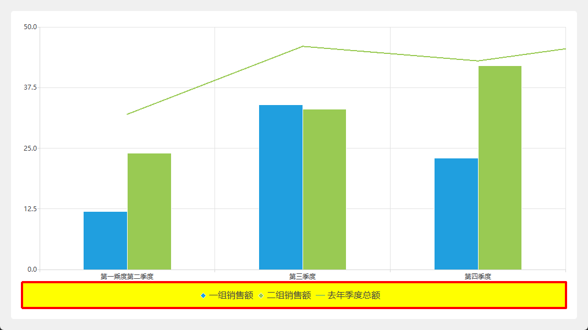

```python
# -*- coding: UTF-8 -*-
# File date: Hi_2023/3/12 20:21
# File_name: 10-图例QLegend 和图例标志OLegendMarker的应用实例.py


import sys
from PySide6.QtWidgets import QApplication, QWidget, QVBoxLayout
from PySide6.QtCore import Qt.QPointF
from PySide6 import QtCharts


class MyWidget(QWidget):
    def __init__(self, parent=None):
        super().__init__(parent)

        self.resize(800, 600)
        v = QVBoxLayout(self)
        self.chartView = QtCharts.QChartView(self)  # 创建图表视图控件
        v.addWidget(self.chartView)
        self.chart = QtCharts.QChart()  # 创建图表
        self.chartView.setChart(self.chart)  # 将图表加入到图表视图控件中

        set1 = QtCharts.QBarSet("一组销售额")  # 创建数据项
        set1.append([12, 34, 23, 45])  # 添加数据
        set2 = QtCharts.QBarSet("二组销售额")  # 创建数据项
        set2.append([24, 33, 42, 41])  # 添加数据

        self.barSeries = QtCharts.QBarSeries()  # 创建数据序列
        self.barSeries.append([set1, set2])  # 添加数据项
        self.lineSeries = QtCharts.QLineSeries()  # 创建数据序列
        self.lineSeries.setName("去年季度总额")

        self.lineSeries.append([QPointF(0, 32), QPointF(1, 46), QPointF(2, 43), QPointF(3, 48)])

        self.chart.addSeries(self.barSeries)  # 图表中添加数据序列
        self.chart.addSeries(self.lineSeries)  # 图表中添加数据序列

        self.barCategoryAxis = QtCharts.QBarCategoryAxis()  # 创建坐标轴
        self.chart.addAxis(self.barCategoryAxis, Qt.AlignmentFlag.AlignBottom)  # 图表中添加坐标轴
        self.barCategoryAxis.append(["第一乘度""第二季度", "第三季度", "第四季度"])  # 添加条目

        self.valueAxis = QtCharts.QValueAxis()
        self.valueAxis.setRange(0, 50)
        self.chart.addAxis(self.valueAxis, Qt.AlignmentFlag.AlignLeft)

        self.barSeries.attachAxis(self.valueAxis)  # 数据项与坐标轴关联
        self.barSeries.attachAxis(self.barCategoryAxis)  # 数据项与坐标轴关联
        self.lineSeries.attachAxis(self.valueAxis)  # 数据项与坐标轴关联
        self.lineSeries.attachAxis(self.barCategoryAxis)  # 数据项与坐标轴关联

        # 以下是对图例的设置
        legend = self.chart.legend()
        legend.setAlignment(Qt.AlignBottom)
        legend.setBackgroundVisible(True)
        legend.setBorderColor(Qt.red)
        legend.setColor(Qt.yellow)
        pen = legend.pen()
        pen.setWidth(4)
        legend.setPen(pen)
        legend.setToolTip("销售团队的销售额对比")
        legend.setShowToolTips(True)
        legend.setMarkerShape(legend.MarkerShape.MarkerShapeFromSeries)
        for i in legend.markers():
            font = i.font()
            font.setPointSize(12)
            i.setFont(font)

            if i.type() == QtCharts.QLegendMarker.LegendMarkerType.LegendMarkerTypeBar:
                i.setShape(QtCharts.QLegend.MarkerShape.MarkerShapeRotatedRectangle)
            else:
                i.setShape(QtCharts.QLegend.MarkerShape.MarkerShapeFromSeries)


if __name__ == '__main__':
    app = QApplication(sys.argv)
    win = MyWidget()

    win.show()
    sys.exit(app.exec())

```

