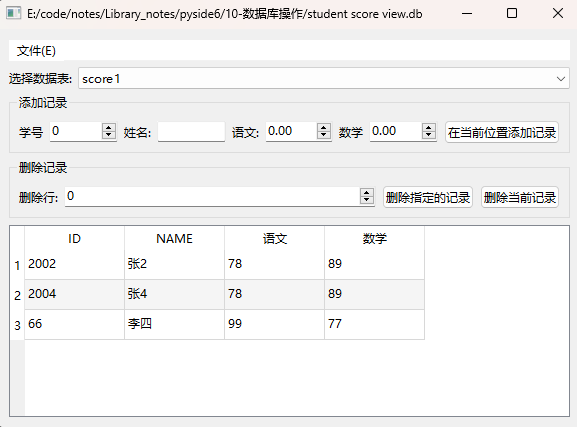

# 18.数据库操作

数据库(database)是统一管理的、有组织的可共享的大量数据的集合。

数据有多种形式,如文字、数值、符号、图形、图像及声音等,可以按照第 7章介绍的方法以文件形式存储数据,但这种文件管理方法有很大的不足,例如它使得数据通用性差,不便于移植,在不同文件中存储大量重复信息，从而浪费存储空间,查询数据和更新数据不便等。

数据库不是针对具体的应用程序,而是立足于数据本身的管理,它将所有数据保存在数据库中,进行科学的组织,并借助于数据库管理系统,通过 SQL 与各种应用程序或应用系统连接,使之能方便地使用数据库中的数据。

PySide 提供了对常用数据库的驱动,可以从数据库中进行查询、读取写人、修改、删除数据等操作,同时提供了可视化的控件和数据库数据模型,可以将数据从数据库读取到数据模型中,然后用Model/View 结构在图形界面中对数据进行操作。

### SQL与数据库连接

数据库将数据存储在一个或多个表格中,管理这个数据库的软件称为数据库管理系统(database management system,DBMS)。主流的数据库管理系统有 OracleInformix、Sybase,SQL Server,PostgreSQL、MySQL、Access、FoxPro 和 SQLite 等。关系型数据库管理系统一般都支持结构化查询语言(structured query language,SQL),SQL 是数据库的基础,通过它可以实现对关系型数据库进行查询、新增、更新、删除、求和和排序等操作。

#### SQL

关系型数据库由数据表(table)构成，数据表的一行数据称为字段,可以在数据库中添加和删除数据表,在数据表中可以查询、添加和删除字段。要对数据库进行操作,首先需要掌握 SQL的格式。SQL可以分为以下几类

- 数据定义语言(data definition language,DDL)。DDL是SQL中定义数据结构和数据库对象的语言,主要关键字有 CREATE、ALTER和DROP。
- 数据操纵语言(data manipulation language,DML)。DML是SQL中操纵数据库中数据的语言,可对数据库中的数据进行插入、删除、更新和选择,主要关键字有INSERTUPDATE DELETE 和 SELECT。
- 事务控制语言(transaction control language,TCL)。TCL 用于管理 DML对数据所作的修改,主要关键字有提交 COMMIT 和撤销 ROLLBACK。对数据库的操作需要用COMMIT进行确认,事务一经提交就不能撤销如果要在提交前撤销对数据库的操作,可以用ROLLBACK 来“回滚”到相应事务开始时的状态
- 数据控制语言(data control language,DCL)。DCL是对数据访问权限进行控制定义安全级别及创建用户的语言，主要关键字有 GRANT 和 REVOKESQL由关键字构成,常用的关键字如表 10-1 所示,更高级的 SOL 请参考相关书籍SQL的关键字不区分大小写,例如 CREATE与 Create 或 create 相同,SQL的每个指令以分号“;”结束。

| 关键字                                                       | 用法                                                         | 说 明                                                        |
| ------------------------------------------------------------ | ------------------------------------------------------------ | ------------------------------------------------------------ |
| CREATE                                                       | CREATE DATABASE database_name                                | 新建数据库                                                   |
| CREATE TABLE table_name(column_ namel data_type, column_name2 data_ type,...) | 新建数据表格，同时指定列(字段)名和数据 类型                  |                                                              |
| ALTER                                                        | ALTER TABLE table _ name ADD column_name datatype            | 在已经存在的表中增加列(字段)                                 |
| ALTER TABLE table_name DROP COLUMN column_name               | 在已经存在的表中移除列(字段)                                 |                                                              |
| DROP                                                         | DROP DATABASE database_name                                  | 移除数据库                                                   |
| DROP TABLE table_name                                        | 在数据库中移除数据表                                         |                                                              |
| SELECT .                                                     | SELECT column_name(s)FROM table_ name                        | 从指定表中获取指定的列的数据 SELECT语句返回 WHERE 子句中条件为 |
| WHERE                                                        | SELECT column FROM table WHERE column condition              | true 的数据，可使用=、<>、>、<、>=、<=、 LIKE,可用AND、OR或NOT连接逻辑表达式，也可用Between...And..来设置范围，还可以用LIKE与通配符搭配，其中%代表零个或多个字符，仅代表一个字符，[charlist]代表字符列中的任何单一字符，`[^charlist]`或`[！ charlist]`表示不在字符列中的任何单一字符 |
| DISTINCT                                                     | SELECT DISTINCT column-name(s) FROM table-name               | 当column-name(s)中存在重复值时，返回结 果仅留下一个          |
| ORDER BY                                                     | SELECT column-name(s) FROM table- name ORDER BY ASC \| DESC  | 设置返回值是升序还是降序，默认是升序。 ASC是升序，DESC是降序 |
| GROUP BY                                                     | SELECT column,SUM(column)FROM table GROUP BY column          | 对结果进行分组，常与汇总函数一起使用                         |
| HAVING                                                       | SELECT column,SUM(column)FROM table GROUP BY column HAVING SUM(column) condition value | 指定群组或汇总的搜寻条件，通常与 GROUPBY子句同时使用。不使用GROUP BY时，HAVING 则与 WHERE 子句功能 相似 |
| INSERT INTO                                                  | INSERT INTO table _name VALUES(valuel,value2,...)            | 在表中插入一行 >                                             |
| INSERT INTO                                                  | INSERT INTO table_name(columnl, column2,...) VALUES(valuel,value2,...) | 在表中插入一行 >                                             |
| UPDATE                                                       | UPDATE table_name SET column_name = new_value WHERE column_name = value | 更新表中的数据                                               |
| DELETE                                                       | DELETE FROM table_name WHERE column_name = value             | 删除表中的数据·                                              |
| COUNT                                                        | SELECT COUNT(column _ name) FROM table_name                  | 返回结果集中行的数量                                         |
| SUM                                                          | SELECT SUM(column_ name)FROM table_name                      | 返回指定列中数值的总和，或仅DISTINCT 值，SUM仅可用于数值列   |
| AVG                                                          | SELECT AVG(column_ name)FROM table_name                      | 返回指定列中数据的平均值，忽略空行                           |
| MAX                                                          | SELECT MAX(column_name) FROM table_name                      | 返回指定列中数据的最大值                                     |
| MIN                                                          | SELECT MIN(column_name)FROM table_name                       | 返回指定列中数据的最小值 c                                   |


除关键字外,SQL 中也可以用到一些函数,常用的函数如表所示

| SQL函数格式           | 说明                           | SQL函数格式                | 说明                                         |
| --------------------- | ------------------------------ | -------------------------- | -------------------------------------------- |
| CEIL(value)           | 大于或等于给定数值的 最小整数  | FLOOR(value)               | 小于或等于给定数值的最 大整数                |
| ABS(value)            | 绝对值                         | NOW()                      | 当前日期                                     |
| PI()                  | 圆周率                         | REVERSE(sUr)               | 颠倒字符串                                   |
| COS(value)            | 余弦函数                       | LOWER(str)                 | 字符串转成小写                               |
| COSH(value)           | 反余弦函数                     | UPPER(str)                 | 字符串转成大写                               |
| SIN(value)            | 正弦函数                       | LTRIM(str)                 | 去除左边空格                                 |
| SINH(value)           | 反正弦函数                     | RTRIM(str)                 | 去除右边空格                                 |
| TAN(value)            | 正切函数                       | LENGTH(str)                | 字符串的长度                                 |
| TANH(value)           | 反正切函数                     | LEFT(str,n)                | 字符串左侧n个字符                            |
| EXP(value)            | 以e为底的指数函数              | RIGHT(str,n)               | 字符串右侧n个字符                            |
| LOG(value)            | 自然对数函数                   | STR(value,n) .             | 将数值转换成字符串，n是 字符串的长度         |
| POWER(valuel, value2) | 指数函数                       | ASCII(str)                 | 字符串中第1个字符的 ASCII值                  |
| SIGN(value)           | 符号函数                       | REPLICATE(str,n)           | 复制字符串n次                                |
| SQRT(value)           | 开方                           | SPACE(n)                   | n个空格构成的字符串                          |
| MOD(valuel,value2)    | 求余数                         | SUBSTRING(str， start,end) | 从字符串中获取子字符串                       |
| ROUND(value,n)        | 按照n指定的小数位进 行四舍五人 | REPLACE(str, strl， str2)  | 用字符串 str2替换字符串 str中的子字符串 str1 |
| RAND([n])             | 生成随机数                     | CONCAT(str1,str2,...)      | 连接字符串                                   |


#### SQLite数据库连接

SQLite数据库是一个常用的开源、跨平台轻量化本机版数据库,可以作为嵌人式数据库使用。

Python 自带的 sqlite3 可以实现对 SQLite 数据库的查询使用前需要用import sqlite3 语句导人 sglite3。下面介绍 sqlite3 的使用方法。

sqlite3提供了两个基本的类:数据库连接 Connection 和游标Cursor。

用sqlite3的connect(database:str)方法打开一个已经存在的SQLite 数据库或新建一个数据库并返回Connection对象

- 其中databaseName是本机上已经存储的数据库文件或者新建立的数据库文件名称,
- 还可取";memory:"表示在内存中创建临时数据库。

用Connection 对象的cursor()方法获取 Cursor 对象,用Cursor 对象提供的方法可以执行 SQL 指令。

##### 数据库连接Connection 的常用方法

数据库连接Connection的常用方法如表所示主要方法是

- 用cursor()创建并返回Cursor对象;用commit()方法提交对数据库的操作;
- 用rollback()方法放弃自上次调用commit()方法后对数据库的操作。

| Connection的方法及参数类型                               | 说明                                                         |
| -------------------------------------------------------- | ------------------------------------------------------------ |
| cursor()                                                 | 创建并返回 Cursor 对象                                       |
| commit()                                                 | 提交当前的事务                                               |
| interrupt()                                              | 停止还未执行的操作                                           |
| rollback()                                               | 放弃对数据库的操作，返回到调用commit()时的状态               |
| close()                                                  | 关闭数据库                                                   |
| backup(target: Connection)                               | 将数据备份到另外一个数据库中                                 |
| execute(sql: str[,parameters])                           | 调用cursor()方法获取Cursor对象，并调用Cursor的execute()方法 执行一条SQL命令。parameters是SQL中的占位符的值 |
| executemany(sql: str, sequence of parameters)            | 调用cursor()方法获取Cursor对象,并调用Cursor的 executemany()方 法执行多条 SQL命令 |
| executescript(sql_script: str)                           | 调用cursor()方法获取Cursor对象，并调用Cursor的 executeseript()方 法执行多条 SQL命令 |
| create_function(name: str,num_ params:int,func:Function) | 将func 函数定义成 SQL指令中可以使用的函数,其中 name 是SQL 中使用的函数名，num_params是函数参数的个数 |
| 1otal_changes                                            | 操作数据后，返回受影响的行的数量                             |


##### 游标Cursor 的常用方法

游标Cursor 用于执行 SQL 命令。Cursor 的常用方法如表所示,主要方法介绍如下

- 执行一条SQL命令

  - 可以用execute(sql:str[;parameters])方法

    - parameters是可选的,用于SQL命令中有占位符的情况，占位符可取“?”。

    - parameters 的取值是序列(如元组、列表)

      ```python
      execute("insert into tableName values(?,?)"，("ABC",2015));
      ```

    - 也可以在SQL命令中用名称做占位符,这时 parameters 是字典且字典的键是占位符的名称，例如

      ```python
      execute("select * from tableName where birthday= :year",("year"，2015));
      ```

  - 用executemany(sql:str，sequence of parameters)方法可以重复执行一条 SQL命令,重复执行的次数是参数序列的长度 len(sequence of parameters),例如

    ```python
    executemany("insert into tableName values(?,?)",(("A"，2015),("B"，2016)("C",2017))
    # 执行3次,占位符(?,?)依次取("A"，2015),("B"，2016)("C",2017)
    ```

- 要执行多条 SQL 命令,需要用executescript(sql_script:str)方法，例如

  ```python
  executescript("insert into tableName values("A",2015); insert into tableNamevalues("B",2016);insert into tableName values("C",2017);")
  ```

- 要获取数据表中的数据,可以用execute()方法执行SQL的SELECT命令

  - 也可用etchone()方法获取当前行的下一行对象,如果当前行是最后一行,则返回值是None;
  - 用fetchmany(size=cursor.arraysize)方法可以获取当前行后的多行记录
    - 如果没有给出行的数量，则用cursor.arraysize 属性值确定行数
    - 用fetchall()方法获取所有剩余的行。

| Cursor的方法及参数类型                        | 说 明                                                        |
| --------------------------------------------- | ------------------------------------------------------------ |
| execute(sql: str[,parameters])                | 执行一条 SQL命令，parameters 是SQL中的占位符的值             |
| executemany(sql: str, sequence of parameters) | 重复执行SQL命令，parameters是SQL中的占位符的值               |
| executescrip1(sql_script: str)                | 执行多条SQL.命令                                             |
| fetchone()                                    | 获取数据表中的下一行，返回由行数据构成的元组或 None          |
| fetchmany(size=cursor. arraysize)             | 获取多行数据，参数size是要获取的行数，并返回多行数据构成的 列表 |
| arraysize                                     | 设置或获取Letchmany()方法每次默认读取的行数                  |
| fetchall()                                    | 获取所有剩余的行，并返回多行数据构成的列表                   |
| connection                                    | 获取 Connection对象                                          |
| lastrowid                                     | 获取用execute()方法执行sql指令INSERT或 REPLACE后，最后 插人的行的ID号，用executemany方法或 executescript()方法插人 行不改变 lastrowid 的值 |
| close()                                       | 关闭游标，游标不可再使用                                     |

##### Python 的数据类型与SQLite 的数据类型的相互转换

SQLite 支持的数据类型较少，它的数据类型有NULL、INTEGER、REAL、TEXT和BLOB,在往SQLite 数据库中写入数据和从SQLite数据中读取数据时需要注意 Python和SQLite数据类型之间的转换。

Python 的数据类型与 SQLite 的数据类型的相互转换如表所示。

SQLite的TEXT数据类型转换成 Python 数据类型时,与数据库连接对象Connection的 text_factory 属性有关默认将TEXT数据类型转换成Python的 str 数据型

- 如果设置context_factory=bytes,则TEXT类型将转换成 bytes 类型

| Python数据类型 | SQLite 数据类型 | SQLite 数据类型 | Python数据类型                                     |
| -------------- | --------------- | --------------- | -------------------------------------------------- |
| None           | NULL            | NULL            | None                                               |
| int            | INTEGER         | INTEGER         | int                                                |
| float          | REAL            | REAL            | float                                              |
| str            | TEXT            | TEXT            | 与Connection对象的属性text factory 有关，默认是str |
| bytes          | BLOB            | BLOB            | bytes                                              |

##### 对SOLite数据库查询的应用实例

下面的程序建立一个数据库 student _score.db,建立一个表格 score,并输人4个学生的考试成绩，然后重新打开数据库,并输出结果。

```python
# -*- coding: UTF-8 -*-
# File date: Hi_2023/3/12 22:03
# File_name: 01- 对SOLite数据库查询的应用实例.py


import sqlite3

dbName = "d:/student score.db"  # 数据库保存位置和数据库名称
con = sqlite3.connect(dbName)  # 新建数据库链接
cur = con.cursor()  # 创建游标

cur.execute("CREATE TABLE score(ID INTEGER,name TEXT,语文 REAL,数学 REAL))")  # 执行一条 SQL 命令，创建表格
information =((2001, "张", 78, 89),(2002, "刘", 88, 82.5),(2003, "王", 78.5, 83),(2004, "张", 72, 5, 86))  # 学生考试信息
cur.executemany("INSERT INTO score VALUES((?,?,?,?) ,information)")  # 执行多条 SQL命令
con.commit()  # 提交事务
con.close()  # 关闭数据库

sqlite3.connect(dbName)  # 打开数据库
concur = con.cursor()  # 创建游标
for row in cur.execute("SELECT * From score"):  # 查询数据表中的内容
    print(row)

cur.execute("SELECT * From score Where name ='张'")  # 重新查询数据表中的内容
rows = cur.fetchall()  # 获取数据表中的所有内容

for row in rows:
    print(row)
con.close()  # 关闭数据库

```


### Pyside对数据库的操作

PySide可以驱动常用的关系型数据库;在对数据库进行操作之前需要用QSqlDatabase类建立对数据库的连接,然后再用QSlQuery 类执行SQL命令,实现对数据库的操作。


#### 数据库连接QSglDatabase

在对数据库进行操作之前,需要先建立对数据库的连接。

数据库连接用QSqIDatabase类,用QSqlDatabase 创建实例的方法如下所示其中:

- type 是数据库的驱动类型,可取的值如表所示。

  | 数据库驱动类型 | 说明                                                        |
  | -------------- | ----------------------------------------------------------- |
  | QDB2           | IBM DB2数据库，需要最低是7.1版本                            |
  | QIBASE         | Borland InterBase 数据库                                    |
  | QMYSQL         | MySQL数据库                                                 |
  | QODBC          | 支持ODBC接口的数据库，包括 Microsoft SQL Server,例如 Access |
  | QPSQL          | PostgreSQL数据库，需要最低是7.3版本                         |
  | QSQLITE        | SQLite3 数据库                                              |
  | QOCI           | Oracle 数据库(oracle call interface,OCI)                    |

```python
from PySide6.QtSql import QSqlDatabase

QSqlDatabase(self) -> None
QSqlDatabase(driver: PySide6.QtSql.QSqlDriver) -> None
QSqlDatabase(other: PySide6.QtSql.QSqlDatabase) -> None
QSqlDatabase(type: str) -> None 
```

数据库连接 QSqlDatabase 的常用方法如表所示,主要方法介绍如下。

- 不同的系统支持的数据库驱动类型也不同
  - 用静态方法 drivers()获取系统支持的驱动类型列表;
  - 用isDriverAvailable(name;str)方法获取某种驱动类型是否可用。
- 用静态方法addDatabase(type: str,connectionName:str = gt_sql_ defaultconnection')添加某种驱动类型的连接，其中参数 type 是驱动类型。
- 对同一个数据库可以添加多个连接数据库连接的识别是通过连接名称 connectionName 来区分的,而不是关联的数据库。
  - 如果不输入连接名称,则该连接作为默认连接,将使用默认的连接名称qt_sql_default _connection 。
  - 用静态方法 removeDatabase(connectionName:str)可以根据连接名称删除数据库连接:
  - 用driverName()方法可以获取数据连接的驱动类型;
- 用connectionName()方法可以获取数据库连接的名称;
  - 用静态方法 connectionNames()可以获得所有已经添加的连接的名称列表。
- 在用open()方法打开数据库前
  - 需要分别用以下方法设置连接的数据库文件名、主机名、密码、端口号、用户名和连接参数:
    - setDatabaseName(name:str)
    - setHostName(host:str)
    - setPassword(password:str)
    - setPort(p: int)
    - ,setUserName(name:str)
    - setConnectOptions(options: str=)
  - 用open()方法打开数据库后再设置这些参数将不起作用。
    - 当然也可以先用close()方法关闭连接,设置这些参数后再用open()方法打开。
- 在用setDatabaseName(name:str)方法打开SQLite 数据库时
  - 如果数据库不存在则创建新数据库参数name也可取:memory:在内存中临时创建数据库序运行结束后删除数据库。
  - 对于ODBC数据库:参数name是*dsn文件或连接字符串;
  - 对于Oracle 数据库name 参数是TNS 服务名称。
- 用setConnectOptions(options:str=)方法设置数据库的参数，不同的驱动类型需要设置的参数也不同，例如 SQLite 数据库，可选参数有:
  - QSQLITE_BUSY_TIMEOUT
  - QSQLITE_OPEN_READONLY
  - QSQLITE_OPEN_URI
  - QSQLITEENABLE SHARED_CACHE
  - QSQLITE_ENABLE_REGEXP
  - QSQLITE_NOUSEEXTENDED_RESULT_CODES
  - 各参数值之间用分号“;”隔开，例如setConnectOptions('QSQLITE_BUSY_TIMEOUT=5.0; QSQLITE OPENREADONLY=true')
- 用tables(type:QSgLTableType=QSqlTables)方法获取数据库中存在的数据表名称列表,其中 type取值是QSql.TableType 的枚举值,可取:
  - QSlTables(对用户可见的所有表)
  - QSqlSystemTables(数据库使用的内部表)
  - QSlViews(对用户可见的所有视图)
  - QSqLAlITables(以上三种表和视图)。
- 用setNumericalPrecisionPolicy(precisionPolicy: QSql. NumericalPrecisionPolicy)方法设置对数据库进行查询时默认的数值精度，参数precisionPolicy 可取:
  - QSql.LowPrecisionInt32(32位整数,忽略小数部分)
  - QSql.LowPrecisionInt64(64 位整数,忽略小数部分)
  - QSql.LowPrecisionDouble(双精度值，默认值)
  - QSqlHighPrecision(保持数据的原有精度)
- 如果数据库支持事务操作,可以用transaction()方法开启事务;
- 用exec(query:str-)方法或exec_(query:str=')方法执行一条 SQL命令;
- 用commit()方法提交事务;
  - 用rollback()方法放弃事务
- 用lastError()方法获取最后的出错信息 QSqlError 对象用QSglError 的type()方法可以获取出错类型返回值是QSlError.ErrorType 的枚举值或-1(不能确定错误类型)，QSqlError.ErrorType 的枚举值有以下值,其值分别对应0~4
  - QSqlError.NoError
  - QSqlError.ConnectionError(数据库连接错误)
  - QSqlError,StatementError(SQL 命令语法错误)
  - QSglError,TransactionError(事务错误)
  - QSqlError,UnknownError

| QSqlDatabase的方法及参数类型                                 | 返回值的类型 | 说 明                                                  |
| ------------------------------------------------------------ | ------------ | ------------------------------------------------------ |
| [static]drivers()                                            | ListCstr]    | 获取系统支持的驱动类型                                 |
| [slatic]isDriverAvailable(name: str)                         | b001         | 获取是否支持某种类型的驱动                             |
| [static]addDatabase(type: str, connectionName: str = ' qt _ sql_ default_ connection') | QSqlDatabase | 添加数据库连接                                         |
| [static]database(connectionName: str='qt_sq/ _default_connection',open:bool=True) | QSqlDatabase | 根据连接名称获取数据库连接                             |
| [static]removeDatabase(connectionName: str)                  | None         | 删除数据库连接                                         |
| [static]connectionNames()                                    | List[str]    | 获取已经添加的连接名称                                 |
| [static] contains(connectionName: str ='qt_sql_ default_connection') | bo01         | 如果connectionNames()返回值中 有指定的连接，则返回True |
| connectionName()                                             | Str          | 获取连接的名称                                         |
| driverName()                                                 | str          | 获取驱动类型名称                                       |
| setDatabaseName(name:str)                                    | None         | 设置连接的数据库名称                                   |
| databaseName()                                               | Str          | 获取连接的数据库名称                                   |
| setHostName(host: str)                                       | None         | 设置主机名                                             |
| hostName()                                                   | S1T          | 获取主机名                                             |
| setPassword(password:str)                                    | None         | 设置登录密码                                           |
| password()                                                   | str          | 获取登录密码                                           |
| setPort(p:int)                                               | None         | 设置端口号                                             |
| port()                                                       | int          | 获取端口号                                             |
| setUserName(name:str)                                        | None         | 设置用户名                                             |
| userName()                                                   | Str          | 获取用户名                                             |
| setConnectOptions(options: str=")                            | None         | 设置连接参数                                           |
| connectOptions()                                             | Str          | 获取连接参数                                           |
| open()                                                       | boo1         | 打开数据库                                             |
| open(user:str,password:str)                                  | bool         | 打开数据库                                             |
| isOpen()                                                     | b001         | 获取数据库是否打开                                     |
| isOpenError()                                                | bo0l         | 获取打开数据时是否出错                                 |
| isValid()                                                    | bool         | 获取连接是否有效                                       |
| setNumericalPrecisionPolicy(precisionPolicy: QSql. NumericalPrecisionPolicy) | None         | 设置对数据库进行查询时默认的数 值精度                  |
| tables(type: QSql. TableType=QSql. TableType. Tables)        | ListCstr]    | 根据表格类型参数、获取数据库中 的表格名称              |
| transaction()                                                | bool         | 开启事务，成功则返回True                               |
| exec(query: str=")                                           | QSqlQuery    | 执行SQL命令                                            |
| commit()                                                     | bool         | 提交事务成功则返回True                                 |
| rollback()                                                   | 6001         | 放弃事务，成功则返回True                               |
| lastError()                                                  | QSqlError    | 获取最后的出错信息                                     |
| record(tablename: str)                                       | QSqlRecord   | 获取含有字段名称的记录                                 |
| close() 三                                                   | None         | 关闭连接                                               |

#### 数据库查询 QSqlQuery 与实例

数据库查询 QSqlQuery 用于执行标准的 SQL 命令，例如 CREATETABLESELECTINSERTUPDATE、DELETE 等,还可执行特定的非标准的 SQL 命令。

用QSqlQuery 类创建实例对象的方法如下所示。

```python
from PySide6.QtSql import QSqlQuery

QSqlQuery(db: PySide6.QtSql.QSqlDatabase) -> None
QSqlQuery(other: PySide6.QtSql.QSqlQuery) -> None
QSqlQuery(query: str = '', db: PySide6.QtSql.QSqlDatabase = Default(QSqlDatabase)) -> None
QSqlQuery(r: PySide6.QtSql.QSqlResult) -> None 
```

##### 数据库查询 QSqlQuery 的常用方法

数据库查询 QSqlQuery的常用方法如表所示,主要方法介绍如下

- 用prepare(query:str)方法准备要执行的 SQL命令;
  - 用exec()方法或 execBatch(mode= QSqlQuery,ValuesAsRows)方法执行已经准备好的 SQL 命令，其中mode可取:
    - QSqlQuery.ValuesAsRows(更新多行,列表中的每个值作为一个值来更新下一行)
    - QSqlQuery.ValuesAsColumns(更新一行,列表作为一个值来使用);
  - 也可用exec(query:str)方法直接执行 SQL命令。
  - 对于SQLite 数据库,每个prepare(query:str)方法和exec(query:str)方法只能准备和执行一条SQL命令
    - 在用prepare(query:str)方法准备 SQL命令时,SQL命令中可以有占位符,占位符可以用问号“?”(ODBC格式),也可以用冒号“:surname”(Oracle 格式)。
    - 占位符的真实值可以用addBindValue(val:Any,type:QSqlParamType=QSql.In)方法按照顺序依次设置，
    - 也可用bindValue(placeholder:str,val;Any,type:QSql.ParamType=QSqlIn)方法根据占位符的名称设置
    - 还可以用bindValue(pos:int,val:Any,type:QSqlParamType=QSqlIn)方法根据占位符的位置设置，其中参数type可取:
      - QSqlIn(绑定参数输人到数据库中)
      - QSqLOut(定参数从数据库中接收数据)
      - QSql.InOut(既可以将数据输人到数据库中,
    - 也可以从数据库中接收数据)或QSqlBinary(数据是二进制需要将“”与以上三种参数联合使用)当一个查询完成后,查询处于活跃状态,isActive()的返回值是True
      - 用finish()方法或 clear()方法可使查询处于非活跃状态。

- 有些数据库的查询操作能返多个结果
  - 用nextResult()方法可以放弃当前查询结果并定位到下一个结果,成功则返回 True。
  - 当返回的结果有多个记录时,需要首先定位到所需要的记录上,
    - 当isActive()方法和isSelect()方法的返回值是True时,可以用first()last()previous()和 next()方法分别定位到第一个记录、最后一个记录、前一个记录和下一个记录上,成功则返回True;
    - 用seek(index;int,relative:bool=False)方法可以定位到指定的记录上如果只是想从开始到结束浏览数据,可以设置 setForwardOnly(True),这样可以节省大量的内存。
    - 用value(index;int)方法或 value(name:str)方法获取当前记录的字段值。
      - 也可用record()方法获取当前的记录对象 QSqlRecord,QSqlRecord 是指数据表(table)或视图(view)中的一行,然后用记录对象的 value(index;int)方法或 value(name:str)方法获取字段的值,用记录对象的 count()方法获取字段的数量,用indexO(name:str)方法获取字段的索引。

| QSqlQuery的方法及参数类型                                    | 返回值类型 | 说明                                                         |
| ------------------------------------------------------------ | ---------- | ------------------------------------------------------------ |
| prepare(query:str)                                           | bool       | 准备SQL命令，成功则返回True                                  |
| addBindValue(val:Any, type: QSql. ParamType=QSql.In)         | None       | 如果 prepare(query)中有占位符，则按顺序 依次设置占位符的值   |
| bindValue(placeholder:str, val: Any, type:QSql. ParamType=QSql. In) | None       | 如果 prepare(query)中有占位符，则根据占 位符名称设置占位符的值 |
| bindValue(pos: int, val; Any,type: QSql. ParamType=QSql. In) | None       | 如果 prepare(query)中有占位符，则根据占 位符位置设置占位符的值 |
| exec()                                                       | bool       | 执行prepare(query)准备的SQL命令                              |
| execBatch(mode=QSqlQuery. ValuesAsRows)                      | bool       | 批处理用prepare()方法准备的命令                              |
| exec(query:str)                                              | bool       | 执行SQL命令，成功则返回True                                  |
| boundValue(placeholder:str)                                  | Any        | 根据占位符名称获取绑定值                                     |
| boundValue(pos:int)                                          | Any        | 根据位置获取绑定值                                           |
| boundValues()                                                | List[Any]  | 获取绑定值列表                                               |
| finish()                                                     | None       | 完成查询，不再获取数据。一般不需要使 用该方法                |
| clear()                                                      | None       | 清空结果，释放所有资源，查询处于不活跃 状态                  |
| executedQuery()                                              | Str        | 返回最后正确执行的SQL命令                                    |
| lastQuery()                                                  | Str        | 返回当前查询使用的SQL命令                                    |
| at()                                                         | int        | 返回查询的当前内部位置，第一个记录的 位置是0，如果位置无效，则返回值是 QSqI. BeforeFirstRow(值是一1)或 QSql. AfterLastRow(值是一2) |
| isSelect()                                                   | bool       | 当前 SQL命令是 SELECT命令时返 回True                         |
| isValid()                                                    | bool       | 当前查询定位在有效记录上时返回True                           |
| first()                                                      | bool       | 将当前查询位置定位到第一个记录                               |
| last()                                                       | bool       | 将当前查询位置定位到最后一个记录                             |
| previous()                                                   | bool       | 将当前查询位置定位到前一个记录                               |
| next()                                                       | bool       | 将当前查询位置定位到下一个记录                               |
| seek(index: int, relative:bool=False)                        | bool       | 将当前查询位置定位到指定的记录                               |
| setForwardOnly(forward;bool)                                 | None       | 当forwrad取True时，只能用next()和 seek()方法来定位结果，此时seek()参数为 正值 |
| isForwardOnly()                                              | bool       | 获取定位模式                                                 |
| isActive()                                                   | bool       | 获取查询是否处于活跃状态                                     |
| isNull(field:int)                                            | bool       | 当查询处于非活跃状态、查询定位在无效 记录或空字段上时返回True |
| isNull(name:str)                                             | bool       | 同上,name是字段名称                                          |
| lastError()                                                  | QSqlError  | 返回最近出错信息                                             |
| lastInsertId()                                               | Ang        | 返回最近插人行的对象ID号                                     |
| nextResult()                                                 | bool       | 放弃当前查询结果并定位到下一个结果                           |
| record()                                                     | QSqlRecord | 返回查询指向的当前记录(行)                                   |
| size()                                                       | int        | 获取结果中行的数量，无法确定、非 SELECT命令或数据库不支持该功能时返 回一1 |
| value(index: int)                                            | Any        | 根据字段索引，获取当前记录的字段值                           |
| value(name:str)                                              | Any        | 根据字段名称，获取当前记录的字段值                           |
| numRowsAffected()                                            | int        | 获取受影响的行的个数,无法确定或查询 处于非活跃状态时返回一1  |
| swap(other:QSqlQuery)                                        | None       | 与其他查询交换数据                                           |


##### 数据库查询 QSqlQuery的应用实例

下面的程序创建一个 SQLite 数据库和两个数据表,用不同的方法输出占位符的值，并用不同的方法输出数据表中的值

```python
# -*- coding: UTF-8 -*-
# File date: Hi_2023/3/12 22:38
# File_name: 02- 数据库查询 QSqlQuery的应用实例.py


from PySide6.QtSql import QSqlDatabase, QSqlQuery
import sqlite3

dbName = "./student score new.db"  # 数据库保存位置和数据库名称
db = QSqlDatabase.addDatabase("QSQLITE")
db.setDatabaseName(dbName)

information1 =((2001, "张1", 78, 89),(2002, "张2", 78, 89),
             (2003, "张3", 78, 89),(2004, "张4", 78, 89))

information2 =((2005, "李5", 78, 89),(2006, "李6", 78, 89),
             (2007, "李7", 78, 89),(2008, "李8", 78, 89))

if db.open():
    db.exec('''create table score1(ID INTEGER, NAME TEXT, 语文 REAL, 数学 REAL)''')
    db.exec('''create table score2(ID INTEGER, NAME TEXT, 语文 REAL, 数学 REAL)''')

    print(db.tables())

if db.transaction():
    query = QSqlQuery(db)

    for i in information1:
        query.prepare("INSERT INTO score1 VALUES(?,?,?,?)")  # 占位符是？
        query.addBindValue(i[0])
        query.addBindValue(i[1])

        query.bindValue(2, i[2])
        query.bindValue(3, i[3])

        query.exec()

    db.commit()

    for i in information2:
        query.prepare("INSERT INTO score2 VALUES(:ID:name,:chinese,:math)")  # 占位符是:
        query.bindValue(0, i[0])
        query.bindValue(1, i[1])  # 按照索引设置占位符的值
        query.bindValue(':math', i[3],)  # 按照名称设置占位符的值
        query.bindValue(':chinese', i[2],)  # 按照名称设置占位符的值

        query.exec()
    db.commit()
db.close()

db_new = QSqlDatabase.addDatabase("QSQLITE")
db_new.setDatabaseName(dbName)
if db_new.open():
    print(query.at())
    if query.exec("SELECT * FROM score1"):
        while query.next():
            print(query.value('ID'), query.value('name'), query.value('语文'), query.value('数学'))
    db_new.close()

con = sqlite3.connect(dbName)  # 用sqllite3打开
cur = con.cursor()
for row in cur.execute("select * from score2"):
    print(row)

con.close()

```

### 数据库 Model/View 结构

用SQL命令对数据库进行操作并不直观,PySide 提供了对数据库进行可视化操作的Model/View 结构,通过数据库模型读入在数据库中查询到的数据,并通过视图控件(如QTableView)显示数据库模型中的数据,通过代理控件在视图控件中对数据进行新增更新、删除等操作,再通过数据模型把操作后的数据保存到数据库中。PySide 提供的数据库模型有 QSqlQueryModelQSalTableModel和 QSlRelationalTableModel,它们之间的继承关系如图5-7 所示。

#### 数据库查询模型QSglQueryModel

数据库查询模型 QSlQueryModel 只能从数据库中读取数据,而不能修改数据,可以用视图控件，例如 QTableView 来显示查询模型 QSqlQueryModel 中的数据。

用QSglQueryModel 创建数据库查询模型对象的方法如下所示。

```python
from PySide6.QtSql import QSqlQueryModel

QSqlQueryModel(parent: Union[PySide6.QtCore.QObject, NoneType] = None) -> None 
```

##### 数据库查询模型 QSqlQueryModel 的常用方法

数据库查询模型 QSqlQueryModel的常用方法如表所示主要方法

- 用setQuery(query:QSqlQuery)方法或 setQuery(query:str，db;QSqlDatabase = Default(QSqlDatabase))方法设置数据库查询 QSqlQuery;
- 用setHeaderData(section: intorientation:Qt.Orientation,value: Any;role: int=Qt.EditRole)方法设置显示数据的视图控件表头某角色的值
  - 在 orientation 取 Qt.Horizontal,并且 section 取值合适时返回True,其他情况返回 False
  - 其中 value 是某种角色的值，section 是列索引

| QSqlQueryModel的方法及参数类型                               | 返回值的类型 | 说明                                                |
| ------------------------------------------------------------ | ------------ | --------------------------------------------------- |
| setQuery(query:QSqlQuery)                                    | None         | 设置数据库查询                                      |
| setQuery(query:str,db: QSqlDatabase= Default(QSqlDatabase))  | None         | 设置数据库查询                                      |
| query()                                                      | QSqlQuery    | 获取数据查询                                        |
| setHeaderData(section:int,orientation: Qt.Orientation,value: Any, role: int = Qt.EditRole) | bo01         | 设置显示数据的视图控件(如 QTableView)表头某角色的值 |
| headerData(section: int, orientation: Qt.Orientation, role: int = Qt.ItemDataRole. DisplayRole) | Any          | 获取显示数据的视图控件表头某种角 色的值             |
| record()                                                     | QSqlRecord   | 获取包含字段信息的空记录                            |
| record(row:int)                                              | QSqlRecord   | 获取指定的字段记录                                  |
| rowCount(parent: QModelIndex= Invalid(QModelIndex))          | int          | 获取数据表中记录(行)的数量                          |
| columnCount(parent:QModelIndex=Invalid(QModelIndex))         | int          | 获取数据表中字段(列)的数量                          |
| clear()                                                      | None         | 清空查询模型中的数据                                |

##### 数据库查询模型QSqlQueryModel的应用实例

下面的程序用菜单打开前一节创建的 SQLite数据库文件 student score_new.db

用QTableView 控件显示出数据表中的数据用QComboBox控件显示数据库中的数据表名称在QComboBox中选择不同的数据表名称时QTableView 控件将同步显示该数据表中的数据


```python
# -*- coding: UTF-8 -*-
# File date: Hi_2023/3/12 23:23
# File_name: 03-数据库查询模型QSqlQueryModel的应用实例.py

from PySide6.QtWidgets import QApplication, QWidget, QComboBox, QTableView, QLabel, QHBoxLayout, QVBoxLayout, QFileDialog, QMenuBar
from PySide6.QtSql import QSqlDatabase, QSqlQueryModel
from PySide6.QtCore import Qt
import sys


class MyWidget(QWidget):
    def __init__(self, parent=None):
        super().__init__(parent)

        self.setupUi()

    def setupUi(self):
        menuBar = QMenuBar()
        fileMenu = menuBar.addMenu("文件(&F)")

        fileMenu.addAction("打开(&0)").triggered.connect(self.actionOpen)
        fileMenu.addSeparator()
        fileMenu.addAction("关闭(&E)").triggered.connect(self.close)

        label = QLabel("选择数据表:")
        self.combox = QComboBox()
        self.combox.currentTextChanged.connect(self.comboxTextChanged)
        H = QHBoxLayout()
        H.addWidget(label, stretch=0)
        H.addWidget(self.combox, stretch=1)

        self.tableView = QTableView()
        self.tableView.setAlternatingRowColors(True)
        V = QVBoxLayout(self)
        V.addWidget(menuBar)
        V.addLayout(H)
        V.addWidget(self.tableView)

    def actionOpen(self):
        dbFile, fil = QFileDialog.getOpenFileName(self, dir=".", filter="SQLite(*.db *.db3)")
        if dbFile:
            self.setWindowTitle(dbFile)
            self.combox.clear()
            self.db = QSqlDatabase.addDatabase("QSQLITE")
            self.db.setDatabaseName(dbFile)
            self.sqlQueryModel = QSqlQueryModel(self)
            if self.db.open():  # 数据库查询模型
                tables = self.db.tables()
                if len(tables) > 0:
                    self.combox.addItems(tables)

    def comboxTextChanged(self, text):
        self.sqlQueryModel.setQuery("SELECT * EROM form {}".format(text), self.db)

        header = self.sqlQueryModel.record()
        for i in range(header.count()):
            self.sqlQueryModel.setHeaderData(i, Qt.Orientation.Horizontal, header.fieldName(i), Qt.DisplayRole)
        self.tableView.setModel(self.sqlQueryModel)  # 设置表格视图的数据模型


if __name__ == '__main__':
    app = QApplication(sys.argv)
    win = MyWidget()

    win.show()
    sys.exit(app.exec())

```


#### 数据库表格模型 QSgITableModel

数据库表格模型 QSglTableModel 借助视图控件可以对查询到的数据进行修改、插入、删除和排序等操作,同时将修改后的数据更新到数据库中。

用QSqlTableModel 创建数据库表格模型的方法如下所示。

```python
from PySide6.QtSql import QSqlTableModel

QSqlTableModel(parent: Union[PySide6.QtCore.QObject, NoneType] = None, db: PySide6.QtSql.QSqlDatabase = Default(QSqlDatabase)) -> None 
```

##### 数据库表格模型QSqlTableModel的常用方法

数据库表格模型QSqlTableModel的常用方法如表所示，主要方法介绍如下

- 在视图控件(如QTableView)中对数据库表格模型中的数据进行修改提交时,有3种模式可供选择
  - 立即模式行模式和手动模式。用setEditStrategy(strategy:QSqlTableModel,EditStrategy)方法设置修改提交模式，参数 strategy 的取值是QSqlTableModel.EditStrategy 的枚举值,可取以下值，对应的值分别是0 1和2
    - QSalTableModel.OnFieldChange
    - QSqlTableModel.OnRowChange
    - QSglTableModel.OnManualSubmit
  - 用editStrategy()方法可获得当前的模式。
    - OnFieldChange模式表示对模型的修改会立即更新到数据库中;
    - OnRowChange 模式表示修改完一行，再选择其他行后把修改应用到数据库中;
    - OnManualSubmit模式表示修改后不会立即更新到数据库中,而是保存到缓存中,
  - 调用submitAl1()方法后才把修改应用到数据库中,
  - 调用revertAll()方法可撤销修改并恢复原状。

- QSglTableModel 还提供了-些与修改提交模式无关的低级方法，例如...这些低级方法可以直接修改数据库

  - deleteRowFromTable(row:int)

  - insertRowIntoTable(values: QSqlRecord)

  - updateRowInTable(row: int,QSglRecord)

- 对数据库的查询
  - 可以先用setTable(tableName:str)方法setFilter(filter:str)方法和 setSort(column:int,order:Qt.SortOrder)方法分别设置需要查询的数据表SQL的WHERE从句和SORT BY从句，最后调用select()方法，也可以直接用setQuery(query:QSqlQuery)方法进行查询。
- 在视图控件(如QTableView)中对数据库表格模型中的数据进行修改提交时
  - 在OnManualSubmit模式下,用revert()方法撤销在代理控件中所作的更改并恢复原状;
  - 用revertAl1()方法复原所有未提交的更改;用submit()方法提交在代理控件中所作的更改;
  - 用submitA11()方法提交所有的更改。
- 用setRecord(row:int;record;QSglRecord)方法可以对某行内容用字段进行替换
- 用insertRecord(row:int,record:QSgIRecord)方法可以在指定行插入一条记录
  - 用insertRows(row:int,count;int)方法可以在指定的行位置处插入多个空行;
  - 用insertColumns(column:intcount;int)方法可以在指定的列位置处插人多列
- 用removeRow(row:int)方法和removeColumn(column:int)方法可以分别删除指定的行和列;
  - 用removeRows(row:int，count;int)方法和 removeColumns(column:int,count:int)方法可以分别从指定行或列位置处删除多行和多列。
- 用setSort(column;int,order:Qt.SortOrder)方法可以将数据模型中的数据按照某列的值进行排序，参数 order 可取:
  - Qt.AscendingOrder(升序)
  - Qt.DescendingOrder(降序)

| QSqlTableModel的方法及参数类型                               | 返回值类型   | 说 明                                                        |
| ------------------------------------------------------------ | ------------ | ------------------------------------------------------------ |
| setEditStrategy(strategy: QSqlTableModel.EditStrategy)       | None         | 设置修改提交模式                                             |
| database()                                                   | QSqlDatabase | 获取关联的数据库连接                                         |
| deleteRowFromTable(row:int)                                  | bool         | 直接删除数据表中指定的行(记录)                               |
| fieldIndex(fieldName: str)                                   | int          | 获取字段的索引，一1表示没有对应的字段                        |
| insertRecord(row:int,record: QSqlRecord)                     | bo0l         | 在指定行位置插人记录，row 取负值表示 在末尾位置，成功则返回True |
| insertRowIntoTable(values: QSqlRecord)                       | bool         | 直接在数据表中插人行，成功则返回True                         |
| insertRows(row: int,count:int)                               | bool         | 插人多个空行，在 OnFieldChange 和 OnRowChange 模式下每次只能插人一行， 成功则返回True |
| insertColumns(column:int.count:int)                          | bool .       | 插人多个空列，成功则返回True                                 |
| isDirty()                                                    | bool         | 获取模型中是否有脏数据，脏数据是指修 改过但还没有更新到数据库中的数据 |
| isDirty(index:QModelIndex)                                   | bool         | 根据索引获取数据是否是脏数据                                 |
| primaryValues(row: int)                                      | QSqlRecord   | 返回指定行的含有表格字段的记录                               |
| record()                                                     | QSqlRecord   | 返回仅包含字段名称的空记录                                   |
| record(row:int)                                              | QSqlRecord   | 返回指定行的记录，如果模型没有初始化， 则返回空记录          |
| removeColumn(column:int)                                     | bool         | 删除指定的列，成功则返回 True                                |
| removeColumns(column:int,count:int)                          | bool         | 删除多列，成功则返回True                                     |
| romoveRow(row:int)                                           | bool         | 删除指定的行，成功则返回True                                 |
| removeRows(row:int,count:int)                                | bool         | 删除多行，成功则返回True                                     |
| [slot]revert()                                               | None         | 撤销代理控件所作更改并恢复原状                               |
| [slot]submit()                                               | boo1         | 往数据库中提交在代理控件中对行所作的 更改,成功则返回True     |
| [slot]revertAll()                                            | None         | 复原所有未提交的更改                                         |
| [slot]submitAll()                                            | bool         | 提交所有更改,成功则返回True                                  |
| revertRow(row:int)                                           | None         | 复原指定行的更改                                             |
| rowCount()                                                   | int          | 获取行的数量                                                 |
| columnCount()                                                | int          | 获取列的数量                                                 |
| setData(index: QModelIndex, value: Any, role: int = Qt.ItemDataRole.EditRole) | bool         | 设置指定索引的数据项的角色值，成功则 返回 True               |
| data(idx: QModelIndex, role: int= Qt.ItemDataRole.DisplayRole) | Any          | 获取角色值                                                   |
| setQuery(query:QSqlQuery)                                    | None         | 直接设置数据库查询                                           |
| query()                                                      | QSqlQuery    | 获取数据查询对象                                             |
| setRecord(row: int,record: QSqlRecord)                       | bool         | 用指定的记录填充指定的行                                     |
| setTable(tableName: str)                                     | None         | 获取数据表中的字段名称                                       |
| setFilter(filter:str)                                        | None         | 设置SELECT查询语句中WHERE从句 部分，但不包含WHERE            |
| filter()                                                     | Str          | 获取 WHERE 从句                                              |
| setSort(column:int,order:Qt.SortOrder)                       | None         | 设置SELECT语句中ORDER BY从句 部分                            |
| orderByClause()                                              | Str          | 获取ORDER BY从句部分                                         |
| [slot]select()                                               | bool         | 执行SELECT命令，获取新查询结果                               |
| [slot]selectRow(row:int)                                     | bool         | 用数据库中的行更新模型中的数据                               |
| selectStatement()                                            | Str          | 获取"SELECT...WHRER...ORDER BY"                              |
| sort(column:int,order:Qt.SortOrder)                          | None         | 直接对结果进行排序                                           |
| updateRowInTable(row:int, QSqLRecord)                        | bool         | 直接用记录更新数据库中的行                                   |
| tableName()                                                  | str          | 获取数据库中的数据表名称                                     |
| setHeaderData(section:int, orientation: Qt.Orientation,value:Any,role:int= Qt.ItemDataRole.EditRole) | bool         | 设置视图控件(如 QTableView)表头某角 色的值                   |
| index(row: int,column:int,parent: QModelIndex=Invalid(QModelIndex)) | QModelIndex  | 获取子索引                                                   |
| parent(child:QModelIndex)                                    | QModelIndex  | 获取子索引的父索引                                           |
| sibling(row:int, column: int,idx: QModelIndex)               | QModelIndex  | 获取同级别索引                                               |
| clear()                                                      | None         | 清空模型中的数据                                             |
| clearItemData(index: QModelIndex)                            | bool         | 根据索引清除数据项中的数据                                   |


##### 数据库表格模型QSqlTableModel的信号

数据库表格模型QSqlTableModel 的信号如表所示

| QSqlTableModel的信号及参数类型             | 说 二明                                                      |
| ------------------------------------------ | ------------------------------------------------------------ |
| beforeDelete(row:int)                      | 在调用deleteRowFromTable(row:int)方法删除指定的行之前发 送信号 |
| beforeInsert(record: QSqlRecord)           | 在调用insertRowIntoTable(values:QSqlRecord)方法插入记录之 前发送信号，可以在插入之前修改记录 |
| beforeUpdate(row: int, record: QSqlRecord) | 在调用updateRowInTable(row:int,values:QSqlRecord)方法更 新指定的记录之前发送信号 |
| primeInsert(row: int, record; QSqlRecord)  | 在调用insertRows(row:int,count:int)方法，对新插入的行进行 初始化时发送信号 |

##### 记录 QSqlRecord 的方法

记录 QSqlRecord 表示数据表中的一行数据,一行数据中每个字段有不同的值,可用QSqlTableModel的 record(row;int)方法获取 QSqlRecord 对象，以获取数据表中的一行数据。

用QSqlRecord 创建记录实例对象的方法如下所示

```python

```


QSqlRecord 的常用方法如表所示。

- 用append(field:QSglField)方法可以在末尾添加字段;
- 用insert(pos:int,field;QSalField)方法插人字段;
- 用remove(pos:int)方法移除字段;
- 用setValue(i:int,val;Any)方法或 setValue(name; str,val:Any)方法根据字段索引或字段名称设置字段的值;
- 用setGenerated(i: int,generated: bool)方法或setGenerated(name:str,generated;bool)方法根据索引或名称设置字段值是否已经生成只有已经生成的字段值才能
- 用QSqlTableModel 的 updateRowInTable(row: int,values:QSqlRecord)方法更新到数据库中,默认值是 True。

| QSqlRecord的方法及参数类型              | 返回值的类型 | 说明                                                         |
| --------------------------------------- | ------------ | ------------------------------------------------------------ |
| append(field: QSqlPield)                | None         | 在末尾添加字段                                               |
| insert(pos: int,field: QSqlField)       | None         | 在指定的位置插入字段                                         |
| remove(pos:int)                         | None         | 根据位置移除字段                                             |
| replace(pos: int, field: QSqlField)     | None         | 根据位置替换字段的值                                         |
| setValue(i: int,val: Any)               | None         | 根据字段索引值设置字段的值                                   |
| setValue(name: str,val:Any)             | None         | 根据字段名称设置字段的值                                     |
| value(i:int)                            | Any          | 根据字段索引获取字段的值                                     |
| value(name: str)                        | Any          | 根据字段名称获取字段的值                                     |
| setNull(i:int)                          | None         | 根据字段索引设置空值                                         |
| setNull(name: str)                      | None         | 根据字段名称设置空值                                         |
| isNull(i:int)                           | bool         | 根据字段名称或位置，当指定的字段值为                         |
| isNull(name:str)                        | bool         | None或不存在该字段时返回True                                 |
| clear()                                 | None         | 删除所有的字段                                               |
| isEmpty()                               | bo0l         | 获取是否含有字段                                             |
| clearValues()                           | None         | 删除所有字段的值，字段值为None                               |
| contains(name:str)                      | bool         | 获取是否包含指定的字段                                       |
| count()                                 | int          | 获取字段的个数                                               |
| field(i:int)                            | QSqlField    | 根据字段索引获取字段对象                                     |
| field(name:str)                         | QSqlField    | 根据字段名称获取字段对象                                     |
| fieldName(i: int)                       | Str          | 获取字段的名称                                               |
| indexOf(name:str)                       | int          | 获取字段名称对应的索引                                       |
| keyValues(keyFields: QSqlRecord)        | QSqlRecord   | 获取与给定的记录具有相同字段名称的 记录                      |
| setGenerated(i: int,generated: bool)    | None         | 根据索引或名称设置字段值是否已经生 成，只有已经生成的字段值才能被更新到 数据库中。generated 的默认值是 True |
| setGenerated(name: str,generated: boo1) | None         | 根据索引或名称设置字段值是否已经生 成，只有已经生成的字段值才能被更新到 数据库中。generated 的默认值是 True |
| isGenerated(i: int)                     | bool         | 根据索引获取字段是否已经生成                                 |
| isGenerated(name:str)                   | bool         | 根据名称获取字段是否已经生成                                 |

##### 字段 QSqlField 的方法

字段 QSqlField 是数据表中的列,一个记录由多个字段构成。

字段的属性有字段名、字段类型和字段值等。用QSqlRecord 的 field(i:int)方法或 field(name: str)方法可获得QSqlField。

用QSqlField 创建字段的方法如下所示,其中 type 用于定义字段的类型,可取以下值，QMetaType 类在 QtCore 模块中,这里设置的类型可能与实际的不符,例如太长的整数可能存储成字符串。

```python
QMetaType.Bool、QMetaType.Int、QMetaType.UInt、QMetaType.Double,QMetaType.QString,QMetaType.QByteArray
QMetaType.Long、QMetaType.LongLong、QMetaType.Short、QMetaType.ULong、QMetaType.ULongLong、QMetaType.UShort、
QMetaType.UChar、QMetaType.Float、QMetaType.QCursor,QMetaType.QDate、QMetaType.QSize、QMetaType.Time、QMetaType.QPolygon
QMetaType.QPolygonF、QMetaType。QColor、QMetaType.QSizeF、QMetaType.QRectF、QMetaType.QLine、QMetaType.QIcon、QMetaType.QPen
QMetaType.QLineF、QMetaType.QRect、QMetaType.QPoint、QMetaType QUrl、QMetaType.QDateTime、QMetaType.QPointF、QMetaType,QPalette
QMetaType.QFont、QMetaType.QBrush、QMetaType.QRegion、QMetaType.QImage、QMetaType.QPixmap、QMetaType.QBitmap、QMetaType.QTransform 
```

字段QSqlField 的常用方法如表所示。主要方法是

- 用setName(name:str)方法设置字段名称;
- 用setValue(value: Any)方法设置字段的值;
- 用setDefaultValue(value:Any)方法设置字段的默认值;
- 用setReadOnly(readOnly:bool)方法设置是否是只读
  - 在只读状态不能更改字段的值例如不能用setValue()方法和 clear()方法改变其值;
- 用setRequired(required: bool)方法或 setRequiredStatus(status; QSqlField. RequiredStatus)方法设置字段的值是必须要输入的还是可选的,其中参数 status 可取:
  - QSqlField.Required
  - QSqlField.Optional
  - QSqlField.Unknown

| QSqlField的方法及参数类型                           | 返回值的类型 | 说明                                                         |
| --------------------------------------------------- | ------------ | ------------------------------------------------------------ |
| setName(name:str)                                   | None         | 设置字段的名称                                               |
| name()                                              | str          | 获取字段的名称                                               |
| setValue(value:Any)                                 | None         | 设置字段的值，只读时不能设置值                               |
| value()                                             | Any          | 获取字段的值                                                 |
| setDefaultValue(value:Any)                          | None         | 设置字段的默认值                                             |
| defaultValue()                                      | Any          | 获取字段的默认值                                             |
| setMetaType(type:QMetaType)                         | None         | 设置字段的类型                                               |
| metaType()                                          | QMetaType    | 获取存储在数据库中的类型                                     |
| setReadOnly(readOnly:bool)                          | None         | 设置是否是只读，只读时不能修改字段 的值                      |
| isReadOnly()                                        | bool         | 获取是否只读                                                 |
| setRequired(required:bool)                          | None         | 设置字段的值是必须要输入还是可选的                           |
| setRequiredStatus(status: QSqlField.RequiredStatus) | None         | 设置可选状态                                                 |
| setGenerated(gen:bool)                              | None         | 设置字段的生成状态                                           |
| isGenerated()                                       | bool         | 获取字段的生成状态                                           |
| setLength(fieldLength: int)                         | None         | 设置字段的长度，类型是字符串时是字符 串的最大长度，其他类型无意义 |
| length()                                            | int          | 获取字段的长度，负值表示无法确定                             |
| setPrecision(precision: int)                        | None         | 设置浮点数的精度，只对数值类型有意义                         |
| precision()                                         | int          | 获取精度，负数表示不能确定精度                               |
| set TableName(tableName: str)                       | None         | 设置数据表名称                                               |
| tableName()                                         | str          | 获取数据表名称                                               |
| setAuto Value(autoVal:bool)                         | None         | 将字段的值标记成是由数据库自动生成的                         |
| isAutoValue()                                       | bool         | 获取字段的值是否是由数据库自动生成的                         |
| isValid()                                           | bool         | 获取字段的类型是否有效                                       |
| clear()                                             | None         | 清除字段的值并设置成 None                                    |
| isNull()                                            | bool         | 如果字段的值是None，则返回True                               |

##### 数据库表格模型QSqITableModel的应用实例

下面的程序用菜单打开一个SQLite 数据库用QTableView 控件显示出数据表中的数据,用QComboBox 控件显示数据库中的数据表名称,可以插入记录和删除记录。在QTableView中可以修改字段的值。由于修改提交模式选择 OnFieldChange,因此对数据库的操作会自动保存到数据库中



```python
# -*- coding: UTF-8 -*-
# File date: Hi_2023/3/13 0:34
# File_name: 04-数据库表格模型QSqITableModel的应用实例.py


from PySide6.QtWidgets import QApplication, QWidget, QComboBox, QTableView, QLabel, QPushButton, QHBoxLayout, QVBoxLayout, QFileDialog, QMenuBar, QGroupBox, QLineEdit, QSpinBox, QDoubleSpinBox
from PySide6.QtSql import QSqlTableModel, QSqlRecord, QSqlDatabase
from PySide6.QtCore import Qt
import sys


class Mywidget(QWidget):
    def __init__(self, parent=None):
        super().__init__(parent)

        self.setupUi()

    def setupUi(self):  # 建立界面
        menuBar = QMenuBar()
        fileMenu = menuBar.addMenu("文件(&E)")

        fileMenu.addAction("打开(&O)").triggered.connect(self.actionOpen)
        fileMenu.addSeparator()
        fileMenu.addAction("关闭(&E)").triggered.connect(self.close)
        label1 = QLabel("选择数据表:")
        self.combox = QComboBox()
        H1 = QHBoxLayout()
        H1.addWidget(label1, stretch=0)
        H1.addWidget(self.combox, stretch=1)
        label2 = QLabel("学号")
        self.spinID = QSpinBox()
        label3 = QLabel("姓名:")
        self.lineEdit_name = QLineEdit()
        label4 = QLabel("语文:")
        self.doubleSpin_chinese = QDoubleSpinBox()
        label5 = QLabel("数学")
        self.doubleSpin_math = QDoubleSpinBox()
        self.pushButton_add = QPushButton("在当前位置添加记录")
        self.groupBox1 = QGroupBox("添加记录")
        self.groupBox1.setEnabled(False)

        H2 = QHBoxLayout(self.groupBox1)
        H2.addWidget(label2, 0)
        H2.addWidget(self.spinID, 1)
        H2.addWidget(label3, 0)
        H2.addWidget(self.lineEdit_name, 1)
        H2.addWidget(label4, 0)
        H2.addWidget(self.doubleSpin_chinese, 1)
        H2.addWidget(label5, 0)
        H2.addWidget(self.doubleSpin_math, 1)
        H2.addWidget(self.pushButton_add)

        label6 = QLabel("删除行:")
        self.spin_deleteLine = QSpinBox()
        self.pushButton_delete = QPushButton("删除指定的记录")
        self.pushButton_delete_cur = QPushButton("删除当前记录")
        self.groupBox2 = QGroupBox("删除记录")
        self.groupBox2.setEnabled(False)
        H3 = QHBoxLayout(self.groupBox2)
        H3.addWidget(label6, 0)
        H3.addWidget(self.spin_deleteLine, 1)
        H3.addWidget(self.pushButton_delete)
        H3.addWidget(self.pushButton_delete_cur)

        self.tableView = QTableView()
        self.tableView.setAlternatingRowColors(True)
        V = QVBoxLayout(self)
        V.addWidget(menuBar)
        V.addLayout(H1)
        V.addWidget(self.groupBox1)
        V.addWidget(self.groupBox2)
        V.addWidget(self.tableView)

        # 信号与槽连接
        self.combox.currentTextChanged.connect(self.comboxTextChanged)
        self.pushButton_add.clicked.connect(self.pushButton_add_clicked)
        self.pushButton_delete.clicked.connect(self.pushButton_delete_clicked)
        self.pushButton_delete_cur.clicked.connect(self.pushButton_delete_cur_clicked)

    def actionOpen(self):  # 打开数据库的槽函数
        dbFile, fil = QFileDialog.getOpenFileName(self, dir=".", filter="SQLite(*.db *.db3)")
        if dbFile:
            self.setWindowTitle(dbFile)
            self.combox.clear()
            self.db = QSqlDatabase.addDatabase('QSQLITE')
            self.db.setDatabaseName(dbFile)
            if self.db.open():
                self.sqlTableModel = QSqlTableModel(self, self.db)  # 数据库表格模型
                self.sqlTableModel.setEditStrategy(QSqlTableModel.EditStrategy.OnFieldChange)
                self.tableView.setModel(self.sqlTableModel)
                tables = self.db.tables()
                if len(tables) > 0:
                    self.combox.addItems(tables)
                    self.groupBox1.setEnabled(True)
                    self.groupBox2.setEnabled(True)

                else:
                    self.groupBox1.setEnabled(False)
                    self.groupBox2.setEnabled(False)

    def comboxTextChanged(self, text):
        self.sqlTableModel.setTable(text)
        self.sqlTableModel.select()
        header = self.sqlTableModel.record()

        for i in range(header.count()):
            self.sqlTableModel.setHeaderData(i, Qt.Orientation.Horizontal, header.fieldName(i), Qt.DisplayRole)

    def pushButton_add_clicked(self):
        record = QSqlRecord(self.sqlTableModel.record())
        record.setValue("ID", self.spinID.value())
        record.setValue("name", self.lineEdit_name.text())
        record.setValue("语文", self.doubleSpin_chinese.value())
        record.setValue("数学", self.doubleSpin_math.value())
        self.spinID.setValue(self.spinID.value() + 1)
        currentRow = self.tableView.currentIndex().row()
        if not self.sqlTableModel.insertRecord(currentRow + 1, record):
            self.sqlTableModel.select()

    def pushButton_delete_clicked(self):
        row = self.spin_deleteLine.value()
        if row > 0 and row <= self.sqlTableModel.rowCount():
            if self.sqlTableModel.removeRow(row - 1):
                self.sqlTableModel.select()

    def pushButton_delete_cur_clicked(self):
        currentRow = self.tableView.currentIndex().row()
        if self.sqlTableModel.removeRow(currentRow):
            self.sqlTableModel.select()


if __name__ == '__main__':
    app = QApplication(sys.argv)
    win = Mywidget()

    win.show()
    sys.exit(app.exec())

```


#### 关系表格模型QSglRelationalTableModel

数据库关系表格模型 QSqlRelationalTableModel 继承自QSqlTableModel,除具有QSqlTableModel 的方法外,它还提供了外键功能。

关系表格模型 QSqlRelationalTableModel 实现了SQL的 SELECT 命令中的 INNER JOIN  LEFT JOIN 能。SELECT 命令中INNERJOIN和LEFTJOIN的格式如下。

```sql
SELECT * FROM table1 INNER JOIN table2 ON tablel.fleld1 = table2.field2
SELECT * FROM table1 LEFT JOIN teble2 0N tablel.field1 = table2.field2
```

数据库中的数据表格之间往往有一定的联系,例如学生考试成绩数据库中,用数据表格table1 来存储学号,姓名、语文成绩、数学成绩,而物理成绩和化学成绩只是用学号来标记，并没有给出成绩,用数据表格 table2 存储学号姓名、物理成绩和化学成绩如果想通过查询数据表格 tablel 得到语文成绩、数学成绩、物理成绩和化学成绩,就可利用QSqlRelationalTableModel模型的外键功能来实现。

用QSqlRelationalTableModel类创建关系表格模型的方法如下所示

```python
from PySide6.QtSql import QSqlRelationalTableModel

QSqlRelationalTableModel(parent: Union[PySide6.QtCore.QObject, NoneType] = None, db: PySide6.QtSql.QSqlDatabase = Default(QSqlDatabase)) -> None
```

- 用QSqlRelationalTableModel 的 setRelation(column:int,relation: QSqlRelation)方法定义QSqlRelationalTableModel 当前数据表格(如 table1)的外键和映射关系，
  - 其中参数column 是 tablel的字段编号,用于确定 tablel 中当作外键的字段 field1
  - relation 参数是QSgIRelation的实例对象,用于确定另外一个数据表格(如 table2)和对应的字段 field2.
- QSqlRelation实例对象的创建方法是 QSqlRelation(tableName: str,indexCol;strdisplayCol:str)
  - 其中tableName 用于确定第2个数据表格 table2,
  - indexCol用于指定table2 的字段 feld2,
  - displayCol是 table2 中用于显示在 tablel 的 field1位置处的字段 field3,用field3 的值显示在 field1 位置处,field1 的值不显示
- 另外用QSlRelationalTableModel 的setJoinMode(joinMode: QSgIRelationalTableModel,JoinMode)方法可设置两个数据表格的数据映射模式,参数joinMode可取 :
  - QSqlRelationalTableModel.InnerJoin(内连接,值为0,只列出 tablel和 table2 中匹配的数据)
  - QSqlRelationalTableModel.LeftJoin(左连接 值为1,即使 tablel和 table2 没有匹配的数据也列出 tablel中的数据)。