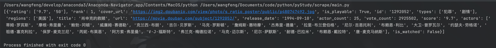
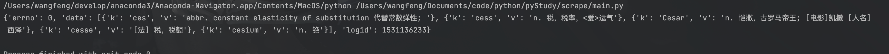
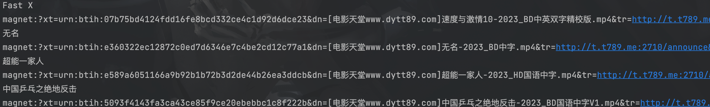
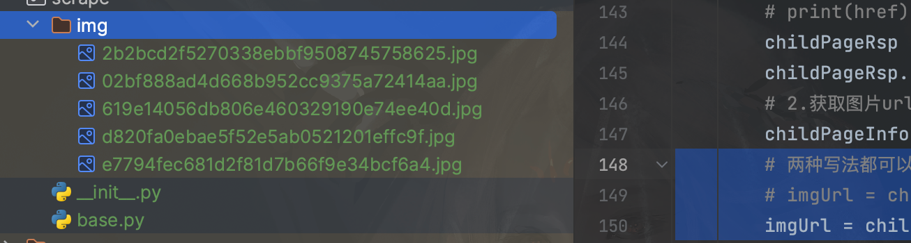

##  爬虫python

> 学习地址：https://www.bilibili.com/video/BV1qB4y1D77o

必须的python库

```shell
pip install requests
pip install bs4
pip install lxml
```


##  1.requests库入门

使用requests库

请求公共部分

```python
import requests

# 请求头信息
headers = {
    "User-Agent": "Mozilla/5.0 (Macintosh; Intel Mac OS X 10_15_7) AppleWebKit/537.36 (KHTML, like Gecko) "
                  "Chrome/117.0.0.0 Safari/537.36"
}
```


###  get请求

代码演示：

```python
def getReq():
    url = "https://movie.douban.com/j/chart/top_list?type=11&interval_id=100%3A90&action=&start=0&limit=1"

    # get请求携带的参数
    param = {
        'type': 11,
        'interval_id': '100:90',
        'action': '',
        'start': 0,
        'limit': 1
    }
    # 通过get方式请求url
    resp = requests.get(url, headers=headers, params=param)

    print(resp.json())
    # 关闭链接
    resp.close()
```

执行程序后




###  post请求

```python
def postReq():
    url = "https://fanyi.baidu.com/sug"

    dat = {
        "kw": "ces"
    }

    resp = requests.post(url, data=dat)

    print(resp.json())

    resp.close()
```

执行结果



##  2.数据解析

正则表达式

> https://docs.python.org/zh-cn/3/library/re.html


###  re解析

> https://docs.python.org/zh-cn/3/library/re.html#

###   通过re进行一个爬虫案例

```python
# 获取dytt的下载链接
def dyttDemo():
    url = "https://www.dytt89.com/"
    rsp = requests.get(url)
    rsp.encoding = "gb2312"  # 指定字符集
    
    obj1 = re.compile(r'2023必看热片.*?<ul>(?P<pageInfo>.*?)</ul>', re.S)
    obj2 = re.compile(r"href='(?P<href>.*?)' title=", re.S)
    obj3 = re.compile(r'◎片　　名　(?P<name>.*?)<br />.*?<td style="WORD-WRAP: break-word" bgcolor="#fdfddf"><a href="'
                      r'(?P<downloadLink>.*?)">', re.S)

    # 获取页面ul里li元素的信息

    # obj4 = re.compile(r'', re.S)

    result = obj1.finditer(rsp.text)
    childList = []

    for it in result:
        ul = it.group('pageInfo')
        # print(ul)

        # 获取子页面的链接
        result2 = obj2.finditer(ul)
        for link in result2:
            # print("group dict: ")
            # print(link)
            uri = url + link.group("href").strip("/")
            childList.append(uri)
            # print("href link is : " + uri)
            # print(link.group("href").strip("/"))

    rsp.close()
    for href in childList:
        childRsp = requests.get(href)
        childRsp.encoding = "gb2312"
        # print(href)
        # print(childRsp.text)
        result3 = obj3.search(childRsp.text)
        print(result3.group('name'))
        print(result3.group('downloadLink'))

        childRsp.close()
```

结果




###  bs4解析-html

> 官方文档：https://beautifulsoup.readthedocs.io/zh_CN/v4.4.0/

BeautifulSoup

主要是使用beautifulsoup的find_all()和find()两个方法从文件的css里获取信息位置。

案例-下载图片

```python
def bs4():
    # 安装：pip install bs4
    url = "https://www.moyublog.com/hdwallpapers/"
    rsp = requests.get(url)
    rsp.encoding = "utf-8"
    # print(rsp.text)

    # I,把页面源代码交给BeautifulSoup进行处理，生成bs对象
    # html.parser  表示指定html解析器
    page = BeautifulSoup(rsp.text, "html.parser")
    # 2.从bs对象获取数据
    res1 = page.find("section", class_="wrapper wfull").find_all('a', target="_blank")

    # 从图片网站获取图片
    # 1.获取图片页面url
    # print(res1)
    i = 1
    for link in res1:
        href = link.get('href')
        # print(href)
        childPageRsp = requests.get(href)
        childPageRsp.encoding = "utf-8"
        # 2.获取图片url
        childPageInfo = BeautifulSoup(childPageRsp.text, "html.parser")
        # 两种写法都可以
        # imgUrl = childPageInfo.find('div', class_='photo-pic').find('img')
        imgUrl = childPageInfo.find('div', attrs={'class': 'photo-pic'}).find('img')

        imgLink = imgUrl.get('src')

        # 下载图片
        imgRsp = requests.get(imgLink)
        # 获取图片二进制信息
        # imgRsp.content  --code
        # 使用链接最后的作为图片名称
        imgName = imgLink.split("/")[-1]
        # 图片信息写入图片
        with open("img/"+imgName, mode='wb') as f:
            f.write(imgRsp.content)

        childPageRsp.close()
        print("img down over!   ", imgName)
        i = i + 1
        if i > 5:
            break
        time.sleep(1)
        continue
    print("all over")
    rsp.close()
```

执行结果



###  xpath解析

```python
# xpath的使用
# 因为html是xml的一个子集使用解析xml的工具也可以解析html、
# 安装 ： pip install lxml
def xpathUse():

    # result = tree.xpath("/book") #/表示层级关系，第一个/是根节点
    # result = tree.xpath("/book/name")
    # result=tree,xpath("/book/name/text()")#text()拿文本
    # result = tree.xpath("/book/author//nick/text()")  # // 后代
    # result = tree.xpath("/book/author/*/nick/text()")  # *任意的节点。通配符（会儿）
    tree = etree.parse("a.html")
    # res = tree.xpath("/html/body/ul/li/a/text()")
    # []表示索引
    # res = tree.xpath("/html/body/ul/li[1]/a/text()")
    # @href='www.ss.com' 指定元素
    # res = tree.xpath("/html/body/ol/li/a[@href='www.ss.com']/text()")
    # print(res)

    #多级获取数据
    olList = tree.xpath("/html/body/ol/li")
    for li in olList:
        # 从li里获取数据
        res = li.xpath("./a/text()")
        print(res)
        # @获取属性的值
        res = li.xpath("./a/@href")
        print(res)
    return 0
```


##  3.request进阶

###  1.获取cookie

有两种方式：

- 通过request的session来请求login接口从而保存cookie数据
- 直接把cookie写入请求的header中

```python
def setCookie():
    aimUrl = "https://www.xxx.com/getData"
    
    # 通过session保存cookie
    session = requests.session()
    data = {
        'username': "xxx",
        'password':"xxx"
    }
    loginUrl = "https://www.xxx.com/login"
    session.post(loginUrl, data)
    rsp = session.get(aimUrl)
    
    # 直接把cookie写入请求
    rsp2 = requests.get(aimUrl, headers={"cookie": "xx:xx"})
```

###  防盗链

请求时链接会有一些规则，防止请求错误所以需要进行防盗链。

案例：

```python
def getPearVideo():
    baseUrl = "https://www.pearvideo.com/video_1642157"
    uid = baseUrl.split("_")[1]
    videoReqUrl = 'https://www.pearvideo.com/videoStatus.jsp?contId=' + uid + '&mrd=0.932583187049618'
    print('请求的链接是: {}', videoReqUrl)
    # 请求头信息
    headers = {
        "User-Agent": "Mozilla/5.0 (Macintosh; Intel Mac OS X 10_15_7) AppleWebKit/537.36 (KHTML, like Gecko) "
                      "Chrome/117.0.0.0 Safari/537.36",
        # 防盗链，用于溯源
        "Referer": 'https://www.pearvideo.com/video_1642157'
    }

    resp = requests.get(videoReqUrl, headers=headers)
    print(resp.text)

    dicts = resp.json()
    aimSrUrl = dicts['videoInfo']['videos']['srcUrl']
    st = dicts['systemTime']
    # https://video.pearvideo.com/mp4/third/20200114/cont-1642157-11956977-141026-hd.mp4
    # https://video.pearvideo.com/mp4/third/20200114/1702219719971-11956977-141026-hd.mp4
    srcUrl = aimSrUrl.replace(st, f'cont-{uid}')
	# 保存文件
    with open('a.mp4', mode='wb') as f:
        f.write(requests.get(srcUrl).content)
```

###  代理

防止请求次数过多ip被封，导致无法访问链接。故使用代理

案例：

```python
def daili():
    proxies = {"https": "https://181.112.151.221:443", }
    resp = requests.get('https://www.baidu.com', proxies=proxies)
    resp.encoding = 'utf-8'
    print(resp.text)
```

##  4.提高爬取效率

###  多线程

python中线程的使用

通过target指定

```python
def th1():
    for i in range(10000):
        print('fun', i)


if __name__ == '__main__':
    t = Thread(target=th1)
    t.start()
    for i in range(10000):
        print('main', i)
```

继承thread类

```python
class th2(Thread):
    def run(self):
        for i in range(10000):
            print('fun', i)


if __name__ == '__main__':
    # t = Thread(target=th1)
    # t.start()
    tt = th2()
    tt.start()
    for i in range(10000):
        print('main', i)
```

对多线程执行的任务传参

```python
def th3(name, name2='gg'):
    for i in range(10000):
        print(name, name2, i)


if __name__ == '__main__':
    # t = Thread(target=th1)
    # t.start()
    # tt = th2()
    # tt.start()
    # for i in range(10000):
    #     print('main', i)
    t = Thread(target=th3, args=('ww',))  # args参数必须是一个元组
    t.start()
    t1 = Thread(target=th3, args=('ss', 'dd'))
    t1.start()
```

继承的方式重写构造函数直接在类声明时写就行

###  线程池

一次性开启多个线程，把任务交给线程池来执行

使用：

```python
def th3(name, name2='gg'):
    for i in range(10000):
        print(name, name2, i)


if __name__ == '__main__':
    with ThreadPoolExecutor(20) as t:
        for i in range(10):
            t.submit(th3, name=f'线程{i}')
    # 执行线程池的时候主线程会被暂时挂起等待线程池任务执行完成后在执行后续代码（守护线程）
    print('end')

```

案例-爬取北京菜价

```python
f = open('data.csv', mode='w')
csvWriter = csv.writer(f)

def threadPoolPro(page):
    url = 'http://www.xinfadi.com.cn/getPriceData.html'
    data = {
        'limit': 20,
        'current': page
    }
    resp = requests.post(url, data=data).json()['list']
    for item in resp:
        # 数据处理
        value = str(item.values()).replace("dict_values", '').replace("([", '').replace('])', '')
        # 保存数据到csv
        csvWriter.writerow(value)
    print(f'page {page} save finish')


if __name__ == '__main__':
    with ThreadPoolExecutor(50) as pool:
        for i in range(1, 200):
            pool.submit(threadPoolPro, i)
    print('all finish')
```

###  异步

```python
async def downloadImg(url):
    name = url.split("/")[-1]
    async with aiohttp.ClientSession() as session:
        async with session.get(url) as resp:
            # 将返回值写入文件
            with open(name, mode='wb') as f:
                f.write(await resp.content.read())

    print("down")


if __name__ == '__main__':
    # t = Thread(target=th1)
    # t.start()
    # tt = th2()
    # tt.start()
    # for i in range(10000):
    #     print('main', i)

    # t = Thread(target=th3, args=('ww',))  # args参数必须是一个元组
    # t.start()
    # t1 = Thread(target=th3, args=('ss', 'dd'))
    # t1.start()

    # with ThreadPoolExecutor(20) as t:
    #     for i in range(10):
    #         t.submit(th3, name=f'线程{i}')
    # # 执行线程池的时候主线程会被暂时挂起等待线程池任务执行完成后在执行后续代码（守护线程）
    # print('end')

    # 案例
    # with ThreadPoolExecutor(50) as pool:
    #     for i in range(1, 200):
    #         pool.submit(threadPoolPro, i)
    # print('all finish')

    task = []
    loop = asyncio.new_event_loop()
    for url in urls:
        task.append(loop.create_task(downloadImg(url)))

    loop.run_until_complete(asyncio.wait(task))
```

##  5.selenium

> 文档：https://python-selenium-zh.readthedocs.io/zh-cn/latest/


### 1.安装

https://registry.npmmirror.com/binary.html?path=chromedriver/

### 2.配置driver

内网地址：https://registry.npmmirror.com/binary.html?path=chromedriver/

外网地址：http://chromedriver.storage.googleapis.com/index.html
